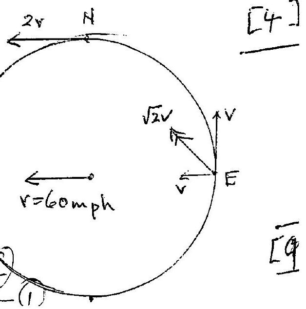
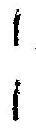
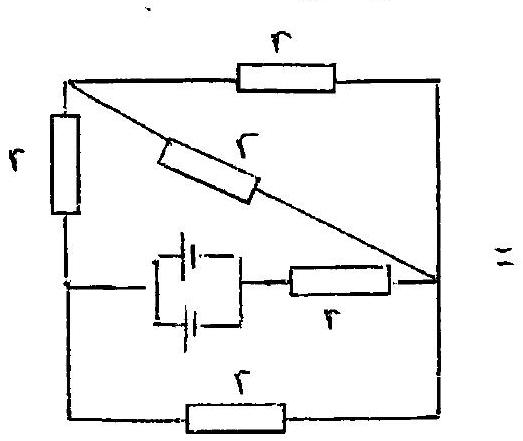
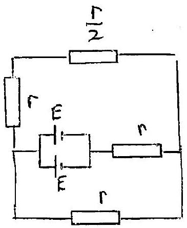
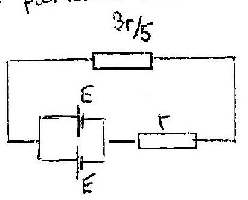
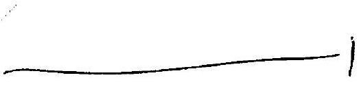
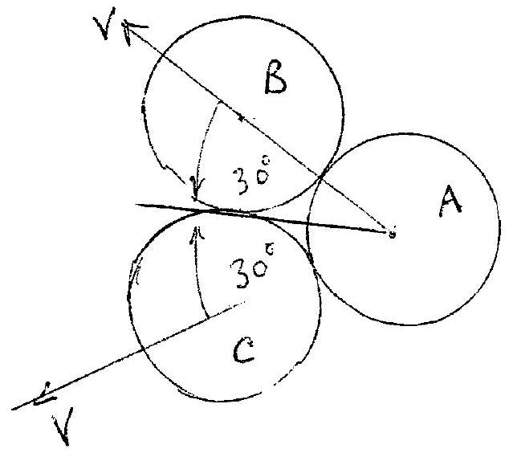
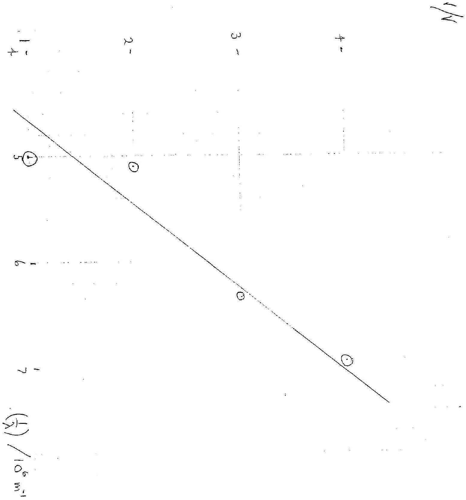
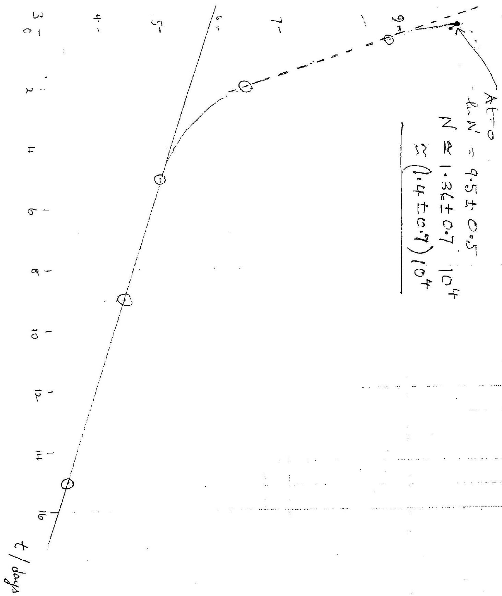

## SOLUTIONS TO 2008 PARER 2

Q1

(a) $$
\begin{aligned}
\text { Intial energy } & = \frac { 1 } { 2 } m v _ { \text {initial } } ^ { 2 } = \frac { 1 } { 2 } ( 0.167 ) ( 25.0 ) ^ { 2 } \\
\text { Final energy } & = m g h \\
\text { Energy lost } & = \frac { 1 } { 2 } ( 0.167 ) ( 25.0 ) ^ { 2 } - ( 0.167 ) ( 9.81 ) ( 20.0 ) \\
& = ( 0.167 ) \left[ \frac { 1 } { 2 } ( 625.0 ) - ( 9.81 ) ( 20.0 ) \right]
\end{aligned}
$$
\% loss of evergy
$$
\begin{aligned}
& = \frac { ( 0.167 ) \left[ \frac { 1 } { 2 } ( 625.0 ) - ( 9.81 ) ( 20.0 ) \right] } { \frac { 1 } { 2 } ( 0.167 ) ( 25.0 ) ^ { 2 } } = \frac { 116.3 } { 312.5 } \times 100 \\
& = 37.2 \% \quad \begin{array} { l }
\text { (note this is independent of the) } \\
\text { mass of the ball of }
\end{array} \\
& = 300
\end{aligned}
$$
b) [3]
(i) Let $t _ { p }$ and $t _ { s }$ be the times for the $P$ and $S$ waves, respectively, to travel $D$ Then
$$
\begin{gathered}
D = 10 ^ { 3 } \times 5.50 t _ { p } \\
D = 10 ^ { 3 } \times 3.00 t _ { s } . \\
10 ^ { - 3 } D \left[ \frac { 1 } { 3.00 } - \frac { 1 } { 5.50 } \right] = t _ { s } - t _ { p } = 15 \times 60 + 17 = 917 \\
D = 10 ^ { 3 } ( 917 ) \frac { 16.50 } { 2.50 } \\
D = 6052 \mathrm {~km}
\end{gathered}
$$
(ii) $$
\begin{aligned}
& T = 6052 / 800 \mathrm { hrs } . \\
& T = 7 \mathrm { hrs } 34 \mathrm { mins }
\end{aligned}
$$
(iii) After armial of $S$ wave twi delay between $P$ and $S$ waves can be determined, and $D$ calculated. The turie before the arrival of the tsumanii is then, the werning time $t _ { w }$, guent
$$
\begin{aligned}
t _ { \omega } & = \left( \frac { D } { 800 } - \frac { D } { 3.00 \times 60 \times 60 } \right) \text { hrs } \\
& = 1.16 \times 10 ^ { - 3 } D \text { hrs } = 7.02 \mathrm { hrs } .
\end{aligned}
$$
(D measured in km )
The inhabitants therefore cam be warned and have tw to go to higher grannd.
Secomometer can detect Pand Swave. If it is luked to a computer. the warming can be given almost unnediately after the Sweve armina $\frac { 2 } { \sqrt { 6 } }$

(c)

(i) Ignore $9 - 28$ as it is clearly in extar cimpared to other determinations Average of 10 remaning values is $g _ { 0 } = 9.80$
(ii) Exther apply modulus of devation to 10 values, to obtain average / devation of 0.04
OR RMS value gues 0.048
Accuracy of $\pm 0.04$ or $\pm 0.05$ acceptable
d) 11) The bolder in the bat displaces an equivalent weeght of water of volum
when thrown unto the pond it desplaces its own volume of water ce $M _ { B } / \rho _ { \text {w. } }$.
Thus the volumie heffecturely recluces by $M _ { B } \left( \rho _ { w } ^ { - 1 } - \rho _ { s } ^ { - 1 } \right)$ is $M _ { B } / \rho _ { B }$. of ivalte
So the level of the water with pand reduces by $A ^ { - 1 } M _ { B } \left( \rho _ { W } ^ { - 1 } - \rho _ { B } ^ { - 1 } \right)$
(11) There is no change in the water livel as the teimber block desplaces its own weight of water when in the boat and when floating on the pond.
(e) If the water level to remain at the same height; a disfance It leelow the? support then if $\Delta x$ is the decrease in level of water in container spring must contract by $\Delta x$; weight of water leaving container must be egual to reduction in force produced by spreng. Thus.)
$$
\begin{aligned}
( 9.81 ) \pi \left( 18 \times 10 ^ { - 2 } \right) ^ { 2 } \Delta \times \left( 10 ^ { 3 } \right) & = k \Delta x \\
k & = \pi ( 3.24 ) 10 ^ { - 1 } ( 9.81 ) \\
k & = 9.99 \times 10 ^ { 2 } \mathrm { Nm } ^ { - 1 }
\end{aligned}
$$
Let $r = 60 \mathrm { mph }$
(f) S at rest; due to sum of tremslation al speed and 1 rotational speed being equal and opposte
N velocity leamph sum of translational speed 2 and rotational speed in same direction and of
equal inagintude.
E. two components $v$ horyontally and $v$ vertically pwards. Resultant velocity $\sqrt { 2 }$ at $45 ^ { \circ }$ uputards to Resultant velocity $\sqrt { 2 }$ at $45 ^ { \circ }$ upulards to H Lergupt H Lergupt L Horg aro the horjumpo ..o., $v 1$ 生传

g)

$$
\text { (i) } \lambda = \frac { \lambda } { \gamma } = \frac { 3.00 \times 10 ^ { 8 } } { 2 \times 10 ^ { 10 } } = 0.015 \mathrm {~m} = 1.5 \mathrm {~cm}
$$

(ii) $$
E = \left( 2.5 \times 10 ^ { 4 } \right) 10 ^ { - 9 } = 2.5 \times 10 ^ { - 5 } \mathrm {~J}
$$

(in)
$$
\begin{aligned}
U & = \frac { E } { \pi R ^ { 2 } l } \quad \text { where lis length of puble } \\
& = \frac { 2.5 \times 10 ^ { - 5 } } { \pi ( 0.06 ) ^ { 2 } ( 0.30 ) } = 7.37 \times 10 ^ { - 3 } \mathrm { Jm } ^ { - 3 } \text { i }
\end{aligned}
$$
(vi) $$
P = \frac { 1 } { c } U = \frac { 7.37 \times 10 ^ { - 3 } } { 3 \times 10 ^ { 8 } } = 2.46 \times 10 ^ { - 11 } \mathrm { Jsm } ^ { - 4 }
$$
(h)
$$
\begin{array} { l l }
F = ( 1.2 ) a & a = a \text { eceleration } \\
" v = u + f t " & \\
0.40 = a ( 10 ) & \text { ie } a = 0.40 \mathrm {~ms} ^ { - 2 } \\
F = 1.2 ( 0.040 ) = 0.048
\end{array}
$$
Vertical force $= F _ { V } =$ Rate of clange of inomenture =
$$
= 10 ^ { - 3 } \frac { 5.0 \Delta t ( 10 ) } { \Delta t } = 0.050 \mathrm {~N} _ { 1 }
$$
Horizontal face $= F _ { H } = \frac { \text { Change in momentour in terie } \Delta t } { \Delta t }$
$$
= 2 \times 10 ^ { - 3 } \mathrm {~N} 1
$$
(j) 

$$
\left( \frac { 1 } { r } + \frac { 1 } { r } \right) ^ { - 1 } = \frac { r } { 2 } .
$$
$\frac { 3 } { 2 } r$ in parallel with $r$

$$
= \left[ \begin{array} { c }
E \\
- 17 \\
+ 1
\end{array} \right]
$$
Coment $I = \frac { E } { ( 8 r / s ) } = \frac { 5 E } { 8 r }$.
- w current tho' cell $= \frac { 1 } { 2 } \left( \frac { 5 E } { 8 r } \right) = \frac { 5 E } { 16 r }$.

(k) nic orfference $A _ { m } = m ( D ) + m ( T ) - m ( n ) - m$ (He)
$$
\begin{aligned}
& = ( 5.03015 - 5.01127 ) u \\
& = 0.01888 \left( 1.66 \times 10 ^ { - 27 } \right) \mathrm { kg } .
\end{aligned}
$$
Energy released $E = \Delta m c ^ { 2 } = ( 0.01888 ) \left( 1.66 \times 10 ^ { - 27 } \right) \left( 3.00 \times 10 ^ { 8 } \right) ^ { 2 }$
$$
= 2.82 \times 10 ^ { - 12 } \mathrm {~J}
$$
(l) (i) $x y$ unitially falls under gravity. This motion will unduce a current in the rod as it is moving wi a magnetic field, cutting hisis of force. Therefore a horent force acts on the rod, by henzy law, opposing the weight of the rod. The acceleration of its rool consequently is reduced weight of the rod. The acceleration of mares with constant terminal velocity.
(ii) vertical force in rod $F _ { r } = I L B = m g ( 1 )$ when terminal velocity reacher
$$
\begin{align*}
\text { Emfinduced } & = B L v = I R \\
\therefore v & = \frac { I R } { B L } = \frac { R } { B L } \frac { m g } { L B } \\
r & = \frac { R m g } { ( B L ) ^ { 2 } } \tag{2}
\end{align*}
$$
By upplying the reight hand rule the current is in derection XY
(iii) In time $\Delta t$ xy fulls a destance $v \Delta t$
$$
\begin{align*}
\text { P.E. leat } & = \frac { m g ( v \Delta t ) } { \left( I ^ { 2 } R \Delta t \right. } = R \Delta t \left( \frac { m g } { L B } \right) ^ { 2 } \\
& = m g v \Delta t \quad \text { from (2) } \tag{1}
\end{align*}
$$
$$
\therefore \quad \text { P.E. lost } = \text { Heat dissepated }
$$
(m)

$\lambda =$ womelength
Q17. For stationary sorrec and obselue $c _ { s } = \lambda f$. $f =$ frequency

(in) (1) When the observer is staturary and the sorree is moving away from the observer the wave length ${ } ^ { \lambda }$ uncreastion is destance between wave creats uncreases by the distance the sairce moves dureng a penod
$$
\lambda _ { s } = \lambda + \frac { v } { f }
$$
The wave velocity
$$
\text { where } \begin{aligned}
f & = 500 \mathrm {~Hz} \\
f \lambda & = c _ { s } .
\end{aligned}
$$
$$
\begin{align*}
c _ { s } & = \lambda _ { s } f _ { s } \\
\therefore \quad \frac { c _ { s } } { f _ { s } } & = \lambda + \frac { v } { f } \\
& = \frac { c _ { s } } { f } + \frac { v } { f } \\
f _ { s } & = \frac { c _ { s } f } { c _ { s } + v } \\
f _ { s } = \frac { ( 340 ) 500 } { 340 + v } & \tag{1}
\end{align*}
$$
(11) At the wall, attr source is moving towards the wall, the frequency received is btained by replaceng $v$ by $( - v )$ in (1)
$$
f _ { \text {wall } } = \frac { ( 340 ) ( 500 ) } { 340 - v }
$$
Since the obsewer is stationary the frequency fwall fille sone explanal be reflected and detected by him ther. is freflucted $= \frac { 340 ) 00 } { 340 - v }$ Aiternatively
Source unagein wall wire at speed $V$ towards observes
$$
f _ { \text {reflected } } = \frac { ( 340 ) ( 500 ) } { 340 - v }
$$
(iii) The Doppler frequency therefore gives
$$
\begin{aligned}
& 30 = \frac { ( 340 ) ( 500 ) } { 340 - r } - \frac { ( 340 ) ( 500 ) } { 340 + V } \\
& = ( 340 ) ( 500 ) \left[ \frac { 1 } { 340 - r } - \frac { 1 } { 340 + r } \right] = \frac { ( 340 ) ( 500 ) } { \left( 340 ^ { 2 } - V ^ { 2 } \right) } 2 V \left[ \begin{array} { c }
\text { workin } \\
2
\end{array} \right. \\
& \therefore ( 340 ) ^ { 2 } - V ^ { 2 } = \frac { ( 340 ) ( 500 ) } { 30 } 2 V \\
& V ^ { 2 } + \frac { ( 340 ) ( 500 ) } { 15 } V - ( 340 ) ^ { 2 } = 0 \quad V = \frac { V } { 340 } \angle 1 \\
& 1 \frac { V } { 1 } V ^ { 2 } + \frac { 500 } { 500 } \quad V - 1 = D \quad = 100 \text { inclunt }
\end{aligned}
$$

(n) I No atmus of each isolote existed at the formation of the Earth and $N$ atoms of $U ^ { 235 }$ currently exist then of the age of the Eacth, in years, is T:
$u ^ { 238 }$ :
$140 N = N _ { 0 } e ^ { - \lambda _ { 1 } T }$
(A)
$\mathrm { U } ^ { 235 }$ :
$N = N _ { 0 } e ^ { - \lambda _ { 2 } T }$
(B)
$\lambda$ is decay custant for $U ^ { 238 } 1$ $\lambda _ { 2 }$ is decay constant for $U ^ { 235 } 1$
where
$$
\begin{aligned}
& \lambda _ { 1 } = \frac { \ln 2 } { 4.5 \times 10 ^ { 9 } } \quad \text { years } - 1 \\
& \lambda _ { 2 } = \frac { \ln 2 } { 7.1 \times 10 ^ { 8 } } \quad \text { years } - 1
\end{aligned}
$$
Dividug (A) by (B)
$$
140 = e ^ { \left( \lambda _ { 2 } - \lambda _ { 1 } \right) T }
$$
$$
\begin{aligned}
\therefore \quad \ln ( 140 ) & = \left( \lambda _ { 2 } - \lambda _ { 1 } \right) T \\
4.942 & = \ln 2 \left( \frac { 1 } { 7.1 \times 10 ^ { 8 } } - \frac { 1 } { 4.5 \times 10 ^ { 9 } } \right) T \\
& = 0.6931 ( 14.08 - 2.222 ) 10 ^ { - 10 } T \\
& = 0.6931 ( 11.86 ) 10 ^ { - 10 } T \\
T & = 6.0 \times 10 ^ { 9 } \text { years }
\end{aligned}
$$

Q2

(a) (i) $r _ { 3 }$ is in parallel with $\left( r _ { 1 } + r _ { 2 } \right)$
$$
\begin{aligned}
R _ { 1 } & = r _ { 4 } + r _ { 5 } + \left( \frac { 1 } { r _ { 3 } } + \frac { 1 } { r _ { 1 } + r _ { 2 } } \right) ^ { - 1 } \\
& = 2 r + \left( \frac { 1 } { r } + \frac { 1 } { 2 r } \right) ^ { - 1 } \\
& = 2 r + \frac { 2 } { 3 } r \\
R _ { 1 } & = 2 \frac { 2 } { 3 } r
\end{aligned}
$$
(iii) $r _ { 3 }$ in parallel with $r _ { 1 }$
$$
\begin{aligned}
R _ { 2 } & = r _ { 4 } + r _ { 5 } + \left( \frac { 1 } { r _ { 3 } } + \frac { 1 } { r _ { 1 } } \right) ^ { - 1 } \\
& = 2 r + \frac { r } { 2 } \\
R _ { 2 } & = 2 \frac { 1 } { 2 } r
\end{aligned}
$$
(III) A 'wheathene buidge' system of resistors in serves with $r _ { 5 }$ As all resesters of resestance $r$ no overnent passes throngh $r _ { 2 }$ $\left( r _ { 4 } + r _ { 3 } \right)$ in prodlet with $\left( r _ { 6 } + r _ { 1 } \right)$, whech esemisenes with $r _ { 2 }$
$$
\begin{aligned}
& R _ { 3 } = \left( \frac { 1 } { 2 r } + \frac { 1 } { 2 r } \right) ^ { - 1 } + r \\
& R _ { 3 } = 2 r
\end{aligned}
$$
(b) (i)
$$
\left. \begin{array} { r l }
R _ { A B } & = r _ { 4 } + r _ { 5 } + \left( \frac { 1 } { r _ { 3 } } + \frac { 1 } { r _ { 2 } + r _ { 1 } } \right) ^ { - 1 } = r _ { 4 } + r _ { 5 } + \frac { r _ { 3 } \left( r _ { 2 } + r _ { 1 } \right) } { \left( r _ { 1 } + r _ { 2 } + r _ { 3 } \right) } \\
& = \frac { \left( r _ { 4 } + r _ { 5 } \right) \left( r _ { 1 } + r _ { 2 } + r _ { 3 } \right) + r _ { 3 } \left( r _ { 2 } + r _ { 1 } \right) } { \left( r _ { 1 } + r _ { 2 } + r _ { 3 } \right) } \tag{2}
\end{array} \right\}
$$
(ii) If $R _ { A B } = 7 \frac { 3 } { 13 } = \frac { 94 } { 13 }$
bomporing $\theta$ and 3
$$
\left( r _ { 1 } + r _ { 2 } + r _ { 3 } \right) = 13
$$
(iii) $$
\begin{aligned}
R _ { A B } & = r _ { 4 } + r _ { 5 } + \frac { r _ { 3 } \left( r _ { 1 } + r _ { 2 } + r _ { 3 } - r _ { 3 } \right) } { \left( r _ { 1 } + r _ { 2 } + r _ { 3 } \right) } \\
& = r _ { 4 } + r _ { 5 } + \frac { r _ { 3 } \left( 13 - r _ { 3 } \right) } { 13 } \\
R _ { A B } & = n _ { 1 } + n _ { 2 } + \frac { n _ { 3 } \left( 13 - n _ { 3 } \right) } { 13 }
\end{aligned}
$$
where $n _ { 1 } , n _ { 2 }$ and $n _ { 3 }$ are unlegers 2 as $r _ { 4 } , r _ { 5 }$ and $r _ { 3 }$ are integers
(iv) $p = \frac { n _ { 3 } \left( 13 - n _ { 3 } \right) } { 13 }$
$$
\begin{array} { l l }
n _ { 3 } = 1 & p = 12 / 13 \\
n _ { 3 } = 2 & p = 22 / 13 = 19 / 13 \\
n _ { 3 } = 3 & p = 30 / 13 = 24 / 13 \\
n _ { 3 } = 4 & p = 36 / 13 = 210 / 13 \\
n _ { 3 } = 5 & p = 40 / 13 = 31 / 13 \\
n _ { 3 } = 6 & p = 42 / 13 = 33 / 13
\end{array}
$$

Q2 (iv)

$$
\begin{aligned}
& m _ { 3 } = 6 \\
& r _ { 3 } = 6
\end{aligned}
$$

(v) Thus as

$$
p = 3 \frac { 3 } { 13 } \text { for } R _ { A B } \text {, }
$$

$$
n _ { 1 } + n _ { 2 } = 4 \quad \text { as } \quad R _ { A B } = n _ { 1 } + n _ { 2 } + 3 \frac { 3 } { 13 } = 7 \frac { 3 } { 13 }
$$

2
So exther $x _ { 1 } = 1$ and $x _ { 2 } = 3$ so $r _ { 4 } = 1$ \& $r _ { 5 } = 3$

$$
\text { or } x _ { 2 } = 3 \text { and } x _ { 1 } = i \quad r _ { 4 } = 3 r _ { 5 } = 1 \left( x _ { 1 } = x _ { 2 } = 2 \right. \text { yet possible }
$$

ow (vi) $R _ { A C } = 6 \frac { 9 } { 13 }$ so $n _ { 3 } = 2$ giving $\Gamma _ { 2 } = 2$

$$
n _ { 1 } + n _ { 2 } + 1 \frac { 9 } { 13 } = 6 \frac { 9 } { 13 }
$$

So

$$
n _ { 1 } + n _ { 2 } = 5
$$

$$
\begin{array} { l l l }
\text { enther } & n _ { 1 } = 1 & n _ { 2 } = 4 \\
\text { or } & n _ { 1 } = 2 & n _ { 2 } = 3 \\
\text { or } & n _ { 1 } = 3 & n _ { 2 } = 2 \\
\text { or } & n _ { 1 } = 4 & n _ { 2 } = 1
\end{array}
$$

Now

$$
\begin{gathered}
R _ { B C } = 10 \frac { 1 } { 3 } \quad \text { so } m _ { 3 } \\
m _ { 1 } + n _ { 2 } + 3 \frac { 1 } { 3 } = 10 \frac { 1 } { 3 } \\
m _ { 1 } + n _ { 2 } = 7
\end{gathered}
$$

So

$$
\begin{array} { r l r }
m _ { 1 } & = 1 & n _ { 2 } \\
& = 2 & \\
& = 3 & = 5 \\
& = 4 & = 3 \\
& = 5 & = 2 \\
& = 6 & = 1
\end{array}
$$

2
Herm elemenate $r _ { 4 } = 2 ?$ \& $T _ { 6 } = 2$ as we have shown $r _ { 2 } = 2$.
ie $r _ { 1 } = 5$

As we have determine research 6,5and 2 these cas be diminated from telis list
$c$ 」

Aitematurely
Returning to RAC we can surilarly eleminate
To satisfy the $h$ conditions c we require remanny

$$
r _ { 4 } = 1 , r _ { 5 } = 3 , r _ { 6 } = 4
$$

a) For circuitar motion with angular velocity $w _ { d }$ about the centre of mass

Q3

$$
\begin{align*}
M _ { 3 } \left( \frac { d } { 2 } \right) \omega _ { d } ^ { 2 } & = \frac { G M _ { s } ^ { 2 } } { d ^ { 2 } } \\
d ^ { 3 } \omega _ { d } ^ { 2 } & = 2 G M _ { s } \tag{1}
\end{align*}
$$

For the Eurth ortating abont our Sun with angular velocity $W _ { E s }$, similarly,

$$
\begin{align*}
\frac { G M _ { S } M _ { E } } { R _ { E S } ^ { 2 } } & = R _ { E S } M _ { E } \omega _ { E S } ^ { 2 } \\
R _ { E S } ^ { 3 } \omega _ { E S } ^ { 2 } & = G M _ { S } \tag{2}
\end{align*}
$$

From (1) and (2)

$$
\begin{aligned}
\left( \frac { d } { R _ { E S } } \right) ^ { 3 } & = \frac { 2 \omega _ { E S } ^ { 2 } } { \omega _ { d } ^ { 2 } } \\
& = 2 \left( \frac { 7 } { 365 } \right) ^ { 2 } \\
\frac { d } { R _ { E S } } & = 3 \sqrt { \left( \frac { 7 } { 365 } \right) ^ { 2 } 2 } \\
\frac { d } { R _ { E S } } & = 0.090
\end{aligned}
$$

as $\frac { \omega _ { d } } { \omega _ { k s } } = \frac { 365 } { 7 } = \frac { \text { year } } { \text { week } } 2$
(b) (1)

$$
\text { If } \begin{aligned}
m _ { p } & = h / \lambda c \\
\Delta U & = - \frac { G M _ { E } m _ { P } } { R _ { E } } - \frac { G M _ { S } m _ { P } } { R _ { S E } } - \left[ - \frac { G M _ { S } } { R _ { S } } - \frac { G M _ { E } } { R _ { S E } } \right] m _ { P } \\
& = G m _ { P } \cdot \left[ - \frac { M _ { E } } { R _ { E } } - \frac { M _ { S } } { R _ { S E } } + \frac { M _ { S } } { R _ { S } } + \frac { M _ { E } } { R _ { S E } } \right]
\end{aligned}
$$

(11)

$$
\Delta U = \operatorname { Gmp } \left[ - 0 \left( 10 ^ { 18 } \right) - 0 \left( 10 ^ { 19 } \right) + 0 \left( 10 ^ { 22 } \right) + 0 \left( 10 ^ { 13 } \right) \right]
$$

The first two terms and the last term can be neglected fforly 2 seg. pgs. required
(iii) Writing

$$
\begin{equation*}
\Delta U = G m _ { p } M _ { s } / R _ { s } . \tag{3}
\end{equation*}
$$

Energy of photin

$$
E _ { \lambda } = \frac { h c } { \lambda } .
$$

If $\lambda$ changes to $\lambda + \Delta \lambda$

$$
E _ { \lambda + \Delta \lambda } = \frac { h c } { \lambda + \Delta \lambda }
$$

Change in energy $\Delta E = \operatorname { hc } \left[ \frac { 1 } { \lambda } - \frac { 1 } { \lambda + \Delta \lambda } \right]$

$$
\begin{align*}
& = h _ { c } \cdot \frac { \Delta \lambda } { \lambda ^ { 2 } }  \tag{3}\\
00 & \frac { h c } { \lambda } \left( \frac { \Delta \lambda } { \lambda } \right) = \frac { G M s } { R _ { s } } \left( \frac { h } { \lambda c } \right) .
\end{align*}
$$

approx.
Sub ${ } ^ { 9 }$ for $G , M _ { S } , R _ { S } \& C$

$$
\begin{aligned}
\frac { \Delta \lambda } { \lambda } & = \frac { G M _ { s } } { R _ { s } } \frac { 1 } { c ^ { 2 } } \\
\frac { \Delta \lambda } { \lambda } & = 2.1 \times 10 ^ { - 6 }
\end{aligned}
$$

$\left( 6.96 \times 10 ^ { 8 } \right) \left( 3.00 \times 10 ^ { 8 } \right) ^ { 2 }$

This is clue to the rotation of the Earth about its axis
At the pole there is no rotational force so for a mass in

$$
\begin{aligned}
m g _ { \text {pale } } & = \frac { G M _ { E M } } { R _ { E } ^ { 2 } } \\
\bar { a } \quad g _ { \text {pole } } & = \frac { G M _ { E } } { R _ { E } ^ { 2 } }
\end{aligned}
$$

where $M _ { E }$ is the mass of the Eurth and $R _ { E }$ is the raduis of the Easth

$$
\square _ { m } , s
$$

At the equator, if the Earth has an angular velouty $w$ about its axis, and the reaction of the Eurth on the mass is $S = m$ gequator

$$
\begin{aligned}
m R _ { E } \omega ^ { 2 } = - S + & \frac { M _ { E } m } { R _ { E } ^ { 2 } } \\
g _ { \text {equater } } & = \frac { M _ { E } } { R _ { E } ^ { 2 } } - R _ { E } \omega ^ { 2 }
\end{aligned}
$$

So geounator is less than gpole

CORRECTION Q4 (a)
(i) Taking moment about $P$
$2 T \sin 30 ^ { \circ } = 1.5 ( 2.0 ) ( 9.81 ) \cos 30 ^ { \circ } + ( 3.0 ) ( 100 ) ( 9.81 ) \cos 30 ^ { \circ }$

$$
\begin{aligned}
T & = ( 9.81 ) \cot 38 ^ { 2 } [ 1.5 + 15 . ] \\
& = \sqrt { 3 } ( 9.81 ) \quad 151.5 \\
T & = 2.57 * 10 ^ { 3 } \mathrm {~N}
\end{aligned}
$$

(ii) Resolung horgontally $F _ { x } = T = 2.5710 ^ { 3 } \mathrm {~N}$

Resolving vertically

$$
\begin{aligned}
& F _ { y } = ( m + M ) g = 1002 ( 9.81 ) = \\
& F _ { y } = \quad 1.00 \times 10 ^ { 3 } \mathrm {~N}
\end{aligned}
$$

(b) Let uand $v$ be the horyintal and vertical components of

Let also $T$ be itse time taken by the bullet to travel a horyontal dolenal initial velouty of bullet

Then
$L = u T$
Vertical $E =$ nT
This is a dopance ( $A - h$ ) below $B$

$$
\begin{equation*}
H - R = H - v \left( \frac { h } { h } \right) + i g \left( \frac { h } { h } \right) ^ { 2 } \tag{1}
\end{equation*}
$$

In this time prgeon has fallen a distance

Now the initial condition require's durection of bullet aimed a $B$ :

$$
\begin{equation*}
\frac { 1 } { 2 } g \left( \frac { L } { u } \right) ^ { 2 } \tag{2}
\end{equation*}
$$

Sub ${ } ^ { 9 }$ (3) into (1)
Sub ${ } ^ { 9 }$ (3) into (1)

$$
\begin{gathered}
\text { ie } \frac { V } { u } = \frac { H } { L } \quad \text { or } \quad H = \frac { V } { u } L \\
H - h = \frac { 1 } { 2 } g \left( \frac { L } { u } \right) ^ { 2 } .
\end{gathered}
$$

Thus'in ibentical to (2), so bellet skinks pegen

I live it up to the marker to assess an appropriate mak if analternative method is applued.

By symmetry $B$ and $C$ have the same speed, $v$, ofter collesin at an angle of $30 ^ { \circ }$ to the hominital hime of symmetry
Let $A$ have ${ } ^ { \text {p } }$ a speed $\underline { u } ^ { \prime }$, in the drection of $u$, offer colliseon.
The conservation of momentum horgantially gives

$$
\begin{aligned}
m u & = 2 v \cos 30 m + m u ^ { \prime } \\
u & = 2 v \frac { \sqrt { 3 } } { 2 } + u ^ { \prime } \\
u & = \sqrt { 3 } r \frac { u ^ { \prime } } { 2 }
\end{aligned}
$$

Consuration of energy genes

$$
\begin{gathered}
\frac { 1 } { 2 } m u ^ { 2 } = 2 \left( \frac { 1 } { 2 } m v ^ { 2 } \right) + \frac { 1 } { 2 } m u ^ { 12 } \\
u ^ { 2 } = 2 v ^ { 2 } + u ^ { 12 }
\end{gathered}
$$

As $v \neq 0$,

$$
\left. \begin{array} { r }
\left. V = \frac { 2 } { 5 } \sqrt { 3 } u - \text { (3) } V \text { is } 30 ^ { \circ } \text { thorezantal for Bout } \right\} \\
\text { as indicated cirt the diagram }
\end{array} \right\}
$$

Substitutuy for $r$ form (3) into (1)

$$
\begin{aligned}
& u ^ { \prime } = u - \sqrt { 3 } v = u - \sqrt { 3 } \left( \frac { 2 } { 5 } \sqrt { 3 } \right) u \\
& u ^ { \prime } = - \frac { u } { 5 } \quad \text { its velouty is in opposite }
\end{aligned}
$$

(b)
(1)

$$
\begin{gather*}
p V = n R T  \tag{1}\\
p ( 2 V - y V ) = n R T _ { f } \\
p V ( 2 - y ) = n R T _ { f } \tag{2}
\end{gather*}
$$

(ii) $$
\begin{align*}
& W = p y V  \tag{3}\\
& H = \frac { 3 } { 2 } \operatorname { Rm } \left( T _ { f } - T \right) \tag{3}
\end{align*}
$$
From (2) + (4)
(iii) $p y V = \frac { 3 } { 2 } \operatorname { Ren } \left( T _ { f } - T \right)$
$\operatorname { Fin } ( 1 ) \quad p = \frac { x R T } { V }$
Sub ito (2)
$$
n R T ( 2 - y ) = n R T _ { f }
$$
$2 \mu R T - \frac { 3 } { 2 } R \mu \left( T _ { f } - T \right) = \mu R T _ { f }$
$$
\begin{aligned}
& 2 \frac { T } { T _ { f } } - \frac { 3 } { 2 } ( T \\
& \left. \frac { T } { T _ { f } } \right) = \frac { 5 } { 2 } \\
& \left( \frac { T } { T _ { f } } \right) = \frac { 5 } { 7 }
\end{aligned}
$$

Q67
(a) (1) A photon of light penetrates metal surface and gues ap its energy to on election. Thes electron gains energy $E = h \nu$ where sil the frequency of the light. Indocoler to escape fran the metal the election requires an energy equal to or exeedung We. Thes these electrons detected have energues from a 3ero t. (hr-We). If a pokential $V$ is requered to supones the current, is highest energy electrons then Denivation dexplanction Derivation dexplanction 3 Note threashold frequey ar $v _ { 0 } = \frac { w _ { e } } { h }$ ie $\begin{aligned} & \text { ufar } \\ & \underline { v } = 0 \end{aligned}$ ie $\begin{gathered} \text { wher } \\ \text { theo } \end{gathered}$ when when ie $V = 0$

$$
V = \frac { h c } { e } \left( \frac { 1 } { \lambda } \right) - W
$$

4

(ii) The classeal theory assumes that electrons can absorts an unlimited amount of wave energy, so that if the same of light is weak but is applied for orlong times even if $v < v _ { 0 }$ electrons will be enitted. Cluantum theory, and experiment, show that this is not so.
(b)(i)

| V/V | $\lambda / 10 ^ { - 9 } \mathrm {~m}$ | $1 / \lambda 10 ^ { 6 } \mathrm {~m} ^ { - 1 }$ |
| :--- | :--- | :--- |
| 1-00 | 200 | 5.00 |
| 2.00 | 196 | 5.10 |
| 3-00 | 158 | 6.33 |
| 4.00 | 1444 | 6.94 |

Table of values Reasonable graph? making full wae 2. 2. of fraph paper.)
(ii) From the Graph
$$
\begin{aligned}
\frac { h _ { c } } { e } & = \frac { 3.00 } { 2.42 \times 10 ^ { 6 } } = 1.24 \times 10 ^ { - 6 } \\
\therefore \quad \mathrm {~h} & = 1.24 \times 10 ^ { - 6 } \left( \frac { \mathrm { e } } { \mathrm { c } } \right) \mathrm { Js } \\
& = \frac { 1.602 \times 10 ^ { - 19 } } { 2.998 \times 10 ^ { 8 } } 1.24 \times 10 ^ { - 6 } \mathrm { Js } \\
\mathrm {~h} & = 6.62 \times 10 ^ { - 3 + } \mathrm { Js }
\end{aligned}
$$
Error: $\frac { 3.00 \pm 0.1 } { 2.42 \times 10 ^ { 6 } }$ in $\frac { \text { he } } { e }$ is $3 \%$
$$
h = 6.62 \pm 0.2 \times 10 ^ { - 34 } \mathrm { Js }
$$

Qte PHOTOELECTRIC EFFECT.

To determine W use a specific point on straight and $\left( \frac { 1 } { e } \right)$ delermmed Allernature methods acceptable.

At $v = 3.00 \quad \frac { 1 } { \lambda } = 6.24 \times 10 ^ { + 6 }$. substituting into result in (a)

$$
\begin{aligned}
3.00 & = 1.24 \times 10 ^ { - 6 } \left( 6.24 \times 10 ^ { 6 } \right) - W \\
W & = 7.49 - 3.00 \\
W & = 4.49 \mathrm {~V}
\end{aligned}
$$

Accuracy $3 \%$ is $W = 4.49 \pm 0.13$
(iii) Threashald frequency

$$
\left. \begin{array} { r l }
\gamma _ { 0 } & = \frac { W _ { e } } { h } \\
& = \frac { 4.49 \left( 1.60 \times 10 ^ { - 19 } \right) } { 6.62 \times 10 ^ { - 34 } } \\
\gamma _ { 0 } & = 1.09 \times 10 ^ { 15 } \mathrm {~Hz} \pm 0.03 \times 10 ^ { 15 } \mathrm {~Hz}
\end{array} \right\}
$$

(iv) Domblnig the intensity for $\nu < \nu _ { 0 }$ no cerrent produced Donting intensity for $\nu \geqslant \nu _ { 0 }$. current doubles
This is a consequente of the fact that doubling the intensity explands donbles the number of photons of wavelength $\lambda$. If $\gamma < \gamma _ { 0 }$, this will not enable the electrons $k$ escape from the metal a consequestly not produce a current. If $v \gamma _ { 0 }$ the nuber of electrons emitted will double as hence current toubles

| $t /$ days | Count / min $N$ | $\ln ( N )$ |
| :--- | :--- | :--- |
| 0.5 | 7000 | 8.85 |
| 2.0 | 620 | 6-43 |
| 5.0 | 142 | 4-96 |
| 9.0 | 76 | 4.33 |
| 15.0 | 28 | 3.33 |

Part(III) Graph
Table of values
Reasonable graph reasonal gall fraph paper
stringht has tho last 3 points
(a)(i) Equation for count rate $N$

$$
N = \frac { 3 } { 5 } N _ { A } e ^ { - \lambda _ { A } t } + \frac { 11 } { 100 } N _ { B } e ^ { - \lambda _ { B } t }
$$

$\int ^ { 2 } \lambda _ { A } > \lambda _ { B }$
(ii) For large $t$, as $\lambda _ { A } > \lambda _ { B }$, we can neglect $N _ { A } e ^ { - \lambda _ { A } t }$;

$$
\begin{equation*}
N \simeq \frac { 11 } { 100 } N _ { B } e ^ { - \lambda _ { B } t } \tag{1}
\end{equation*}
$$

(iii) Forlarget plot $\ln ( N )$ against $t$ as, $\tan ( 1 )$,

$$
\ln N = \ln \left( \frac { 11 } { 100 } N _ { B } \right) - \lambda _ { B } t
$$

Thus $\ln ( N )$ against $t$ should be a stiright lue, graderient 1
$- \lambda _ { B }$ intercept $\ln \left( \frac { 11 } { 100 } N _ { B } \right)$.
From the Caraph
Gradient
Intercept $\ln \left( \frac { 11 } { 100 } N _ { B } \right)$

$$
\frac { \lambda _ { B } } { \left. = [ \ln N ] _ { t = 0 } = \frac { 2.84 - 0.14 } { 16.0 } \frac { 2.70 } { 16.0 } = ( 1.69 \pm ) ^ { 4 } = 0.4 \right) ^ { 10 } / 1 a }
$$

Thus
$N _ { B } = ( 3.09 \pm 0.06 ) 10 ^ { 3 } <$ coint $/$ min
of $B$ atoms mythat $N _ { B } ( 0 ) = \lambda _ { B } ( 0 ) : n _ { B } ( 0 ) = 3.09 \times 10 ^ { 3 } / \left( 1.69 \times 10 ^ { - 1 } \right) *$

$$
n _ { R } = 3.09 \times 10 ^ { 3 } ( 1440 ) / 1.69 \times 10 ^ { - 1 } = 2.63 \times 10 \pm .04 \times 10 ^ { 7 }
$$

$Q .77$

(b) $$
\text { (1) } \begin{aligned}
N & = ( 1.4 \pm 0.7 ) 10 ^ { 4 } . \\
\therefore \quad N _ { A } & = N - N _ { B } \\
& = ( 1.1 \pm 0.7 ) 10 ^ { 4 }
\end{aligned}
$$
$- 0.169 / 2$
(ii) $$
\begin{array} { r l }
7000 & = \frac { 3 } { 5 } ( 1.1 \pm 0.7 ) 10 ^ { 4 } e ^ { - \lambda _ { A } / 2 } + \frac { 11 } { 100 } 3.09 \times 10 ^ { 3 } \\
& = \frac { 3 } { 5 } ( 1.1 \pm .7 ) 10 ^ { 4 } e ^ { - \lambda _ { A } / 2 } \\
6630 & 370 \\
\frac { 5 } { 3 } ( 0.6630 ) & = ( 1.1 \pm 0.7 ) e ^ { - \lambda _ { A } / 2 } \\
\frac { 1.105 } { ( 1.1 \pm .7 ) } & = e ^ { - \lambda _ { A } / 2 } \\
0 ^ { + } 61 / \frac { - 6 } { 2.8 } & = e ^ { - \lambda _ { A } / 2 } \\
\frac { \lambda _ { A } } { 2 } & = + 0.49 / 16 \\
\lambda _ { A } & = 1 \rightarrow 32 \\
\lambda _ { A } & \approx 16 \pm 15 .
\end{array}
$$
Any answer from
1 day-it 32 dowys ${ } ^ { - 1 }$ acceptabl, Most dikely $\sim 16$ doys $^ { - 1 }$

(a) (1) $\quad E _ { e } = \frac { 100 } { 0.001 } 1.602 \times 10 ^ { - 19 } \quad \mathrm {~N} = 1.602 \times 10 ^ { - 14 } \mathrm {~N}$
Q8
(ii) $\quad \frac { m g } { E e } = \frac { 9.109 \times 10 ^ { - 31 } ( 9.81 ) } { 1.602 \times 10 ^ { - 14 } } = 5.6 \times 10 ^ { - 16 }$
21
(iii) $\frac { 1 } { 2 } m v _ { \text {max } } ^ { 2 } = 15 \times 10 ^ { 3 } \epsilon$
$$
\begin{aligned}
& V _ { \text {max } } = \frac { 0.30 \times 10 ^ { 5 } \left( 1.602 \times 10 ^ { - 19 } \right) } { 9.109 \times 10 ^ { - 31 } } = 5.276 \times 10 ^ { 15 } . \\
& \therefore V _ { \text {max } } = 7.25 \times 10 ^ { 7 } \mathrm {~ms} ^ { - 1 }
\end{aligned}
$$
(iv) Magnetic and electric forces but balance for horgantal motion:
$$
\begin{aligned}
E e & = B e v \cos \theta \\
v \cos \theta & = \frac { E } { B } = \frac { 10 ^ { 5 } } { 0.010 } = 10 ^ { 7 } \mathrm {~ms} ^ { - 1 }
\end{aligned}
$$
Thus a $\beta$ particle travelling at angle $\theta$ sociefy this equation.
(v) $$
v = \frac { 10 ^ { \pi } } { \cos \theta } \quad \operatorname { tran } ( \mathrm { iv } )
$$
So as $\theta = 0 \rightarrow 90 ^ { \circ } , \quad v = 10 ^ { \top } \rightarrow \infty \mathrm { ms } ^ { - 1 }$ However $V _ { \text {max } } = 7.25 \times 10 ^ { \top } \mathrm { ms } ^ { - 1 }$ from (iii) Consequently the range of $\mathrm { V } = 10 ^ { 7 } \rightarrow 7.25 \times 10 ^ { 7 } \mathrm {~ms} ^ { - 1 }$
(vi) Now $\cos \theta = r$ fram (iv) where $v$ has itse range $10 ^ { 7 } \rightarrow 7.25 \times 10 ^ { 7 } \mathrm {~ms} ^ { - 1 }$ Thes
$$
\cos \theta = 1 \rightarrow \frac { 1 } { 7.25 }
$$
This gives
$$
\theta = 0 \rightarrow 82.07 ^ { \circ }
$$
(b) Now as $v$ has range $10 ^ { 7 } \rightarrow 7.25 \times 10 ^ { 7 } \mathrm {~ms} ^ { - 1 }$
$$
\frac { v } { c } \text { has the range } 3 \times 10 ^ { - 2 } \rightarrow 2.4 \times 10 ^ { - 1 } \mathrm { ch } ^ { - 5 }
$$
Thus largest value of $\left( \frac { v } { c } \right) ^ { 2 }$ is $5.8 \times 10 ^ { - 2 }$. Puis will aller the mass by 3\%. Consequently the acuracy of the above pesults is only correct to abont 3\% for the fastest particles. The alowest partilles have a wass that differs from ithe rest menns ben line them. $1 : 10 ^ { 3 }$ el accurate to $0.1 \% _ { 0 }$

(11)

$$
\begin{aligned}
& \text { Ru. K.E } = \text { Energynt velocity is Resbects] } \} , \\
& = m _ { c } c ^ { 2 } - m _ { c } c ^ { 2 } \\
& \} 1 \\
& \left. = \operatorname { moi } \left[ \left( 1 - v ^ { 2 } / c ^ { 2 } \right) ^ { - i } - 1 \right] \quad \right\} \quad 1 . \\
& 5
\end{aligned}
$$
