SOLUTIONS \& MARK SCHEMEN
BPLO PAPER 22009
Any Qugress Regirding Solutions Contact CYRIL ISENBERG Email: C.Isenberg@kent.ac.uk
(a) Let aperfic heat capacity be $s$. As final rate of heat loss is 10W,

$$
\begin{align*}
& 10 = ( 0.25 \mathrm {~s} + 50 ) 15 \times 10 ^ { - 3 }  \tag{2}\\
& s = 4 \left( \frac { 10 } { 15 \times 10 ^ { - 3 } } - 50 \right) \\
& s = 2.5 \mathrm { kJK } ^ { - 1 } \mathrm {~kg} ^ { - 1 }
\end{align*}
$$

(b) (i)Planets more with constant speed not constant welocity
(ii) Energy is not a vector, so does not have components
(iii) Yes this is correct. The spet is not a prysical object so can more will a speed greater than c.
(iv) The magnetic north pole is incorrectly named it is a south' pole attracting the morth pole of the compass neelle.
(v) To maintain the gas at constant pressure it must expand, so additional energy must be supplied compared, with that at constent volume, to rause its temperature by $1 ^ { \circ } \mathrm { C }$.
(ii) On expansem, the P.E. of atoms increises, so the K.E. must decrease for conservation of energy. Thus the temperature decreases
(c) (i) $\quad \lambda = 1.00 \mathrm {~m} , f = 440 \mathrm {~Hz} , " f = \frac { 1 } { 2 L } \sqrt { \frac { T } { m } }$, lingth of stang $L = \frac { \lambda } { 2 } = 0.50$ Velg, $V = f \lambda = 4440 \mathrm {~ms} ^ { - 1 }$

At 550 Hz , $440 = 550 \left( 2 L ^ { \circ } \right)$ hength of string
$h ^ { \prime } = 0.40 \mathrm {~m}$
Thus sting must be reduced by 10 cm

Q1
(c) (ii)

$$
\begin{align*}
& 440 = \frac { 1 } { 1.0 } \sqrt { \frac { T } { m } }  \tag{1}\\
& 435.6 = \frac { 1 } { 1.0 } \sqrt { \frac { T + \Delta T } { m } } \tag{2}
\end{align*}
$$

Dividing (2) by (1), $\frac { 435.6 } { 4440 } = \sqrt { \frac { T + \Delta T } { T } } = \sqrt { 1 + \frac { \Delta T } { T } }$

$$
\begin{aligned}
1 + \frac { \Delta T } { T } & = 0.9801 \\
\frac { \Delta T } { T } & = - 0.0199 \approx - 20 \%
\end{aligned}
$$

Thus tensein must be increased by + 2:0\%
(d) Let distance fan hone to work be D
Time taken to work $= D / 8.0$
Time taken to return $= D / 4.0$

$$
\}
$$

Average speed =

$$
\frac { \text { Total distance } } { \text { Total time } }
$$

$$
\begin{aligned}
& = \frac { 2 D } { D / 8.0 + D / 4.0 } = \frac { 16 } { 3 } \mathrm {~ms} ^ { - 1 } \\
& = 5.3 \mathrm {~ms} ^ { - 1 }
\end{aligned}
$$

[3]
(e) Momentom of are bullet $= \left( 10 \times 10 ^ { - 3 } \right) \left( 12 \times 10 ^ { 3 } \right) \mathrm { Ns } = 12 \mathrm { oNs }$
If the are $n$ bullets per minute, $\frac { n } { 60 }$ bullets per sec then nate of change of momentum, ieforce, given'by

$$
\begin{aligned}
& 80 = 120 \left( \frac { n } { 60 } \right) ^ { 0 } \\
& n = 40 \quad \text { bullets per minite }
\end{aligned}
$$

Force from the builess
(e)
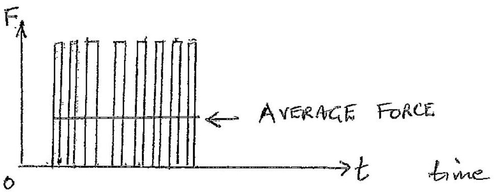

Area under average tine - sum areas moder rectanglis
(f)(i) Weight Whatances electrical force:

$$
\begin{aligned}
& W = \left( 0.30 \times 10 ^ { 6 } \right) e = \left( 0.30 \times 10 ^ { 6 } \right) \left( 1.602 \times 10 ^ { - 19 } \right) \\
& W = 4.8 \times 10 ^ { - 14 } \mathrm {~N}
\end{aligned}
$$

(ii) If it is molependent of pd, it has no charge and is falling under gravity. Thus the visears force of the air balances the weight, ing, of the droplet when the terminal velocity is reached $F _ { \text {visous } } = m g$.
(g)
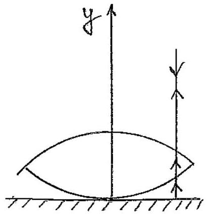

Marochromatic light madent nommally an a convex lens, wavelength $\lambda$, siting an an optical plate is partially reflected by the surface of the offical plate and the lower surface of the lens (see figure). These rays have a path difference and interfere. Theress an extrer phase difference of $\pi$ produced by the optiol plate. The currlar symmetry chout the $y$-axis gues rese to unterference sugs. For constrature interference: For destructive interference: $2 t = n \lambda$

(h) "When the pan's' moving upewerds, with a retardation, approaching its amplitude, if the retarding acceleration is less than $( - g )$ the mass will leave the pan.
For desplacement $x$, the retarding acceleration is
$$
- \frac { k x } { m } , \quad k \text { is the spreng censtant }
$$
So when
$$
- \frac { k x } { m } < - g : \quad i e \quad \frac { 4 \pi ^ { 2 } x } { T ^ { 2 } } > g \quad \left( T = 2 \pi \sqrt { \frac { m } { k } } \right.
$$
The mass leaves the paw.
As the amplitude A is varied this will occur first when
$$
\frac { 4 \pi ^ { 2 } A } { T ^ { 2 } } = g \quad \text { ie. } \quad A = \frac { T ^ { 2 } g } { 4 \pi ^ { 2 } }
$$
Substatutuig the data,
$$
\begin{aligned}
& A = \frac { T ^ { 2 } \mathrm {~g} } { 4 \pi ^ { 2 } } = \frac { ( 0.5 ) ^ { 2 } 9.81 } { 4 \pi ^ { 2 } } \\
& A = 6.2 \mathrm {~cm}
\end{aligned}
$$
$$
\{ 2
$$
[6]
(i) Let $P$ be atmospherci pressure, which gas experence's when tube horjental. Let densify of mercury be $\rho$ When tube vectical pressure of gas is $( p + h \rho g )$ where $h$ is length of mereny column; $h = 85 \mathrm {~mm}$
Applying Boyle's Law
$$
\begin{aligned}
\left( 50 \times 10 ^ { - 3 } \right) P & = \left( 45 \times 10 ^ { - 3 } \right) ( P + h \rho g ) \\
& = \left( 45 \times 10 ^ { - 3 } \right) \left( P + 85 \times 10 ^ { - 3 } \left( 14 \times 10 ^ { 3 } \right) 9.81 \right) \\
P & = 9 \times 14 \times 9.81 \times 85 \\
P & = 1.05 \times 10 ^ { 5 } \mathrm {~Pa}
\end{aligned}
$$
(j) Time to travel to object and rehern $= \frac { 8 } { 10 } \frac { 1 } { 1250 } \mathrm {~s}$
$$
\frac { 1 } { \frac { [ 42 ] } { 1 } }
$$
Thus if $D$ is destrince of object
$$
\begin{aligned}
2 D & = \frac { 4 } { 5 } \frac { 1 } { 1250 } \left( 3 \times 10 ^ { 8 } \right) \mathrm { m } \\
D & = 9.60 \times 10 ^ { 4 } \mathrm {~m}
\end{aligned}
$$
$$
\begin{aligned}
& 1 \\
& 1 \\
& \hline
\end{aligned}
$$
[3]

(k) (i) Yes, a body rotating un a circle is travelling at constant speed with an acceleration towards its centre.
    (ii) No, constant velocity requests constant speed
    (iii) Yes, a SHO has zerovelocity when'sping' fally extended and maximum retartation ie negative acceleration.
    (ii) Yes, when an ositlatug mass is approaching it maximum extensen, in +ve' $x$-direction', it will have a we veloaty and a regative acceleration; in the -ve ' $x$-direction'

(l) For constant $y$ :
$\omega t - k x =$ constant
So for constanty a suall change in $x , \Delta x$, and a suall changenit, $\Delta t$, ques

$$
\omega \Delta t - k \Delta x = 0
$$

Thus velocity $v$ given by
Thus velocity $v$ given by

$$
v = \frac { \Delta x } { \Delta t } = \frac { \omega } { k }
$$

The speed of wave is $V = \frac { \omega } { l }$ in tue $x$-direction
(i) $v = \frac { 6.6 \times 10 ^ { 3 } } { 20 } = 3.3 \times 10 ^ { 2 } \mathrm {~ms} ^ { - 1 }$
(ii) $\quad \dot { y } = A \omega \cos ( \omega t - k x )$
$\operatorname { Max } y = A _ { w } = \left( 1.0 \times 10 ^ { - 7 } \right) \left( 6.6 \times 10 ^ { 3 } \right)$

$$
( \dot { y } ) _ { \max } = 6.6 \times 10 ^ { - 4 } \mathrm {~ms} ^ { - 1 }
$$

(m) (i) Current $= \frac { 24 } { 240 } = \frac { 1 } { 10 } = 0.10 \mathrm {~A}$

Resustaince of each lamp $= \frac { 12 } { ( 1 / 10 ) } = 120 \Omega$
(ii) 19 lamps, each $120 \Omega$ resistance, total resistance $= 2280 \Omega$ Total power consumed $= \frac { ( 240 ) ^ { 2 } } { 2280 } = 25 \cdot 3 \mathrm {~W}$

m) (iii) When in namal use the temperature of the lamp's resistor is of the order of 1000 K , but when tested at 0.10 V it is at room temperature; the resistance is appreciably lower at room temperature that at the working temperature, goving a reduced current of 10 mA
(m) $\lambda = 248 \times 10 ^ { - 9 } \mathrm {~m}$
Energy conservation gives, where Wis the Tork function,
$$
\begin{aligned}
\text { "KE } & = h \nu - W e \\
8.6 \times 10 ^ { - 20 } & = \frac { h c } { \lambda } - W _ { e } \\
& = \frac { \left( 6.62 \times 10 ^ { - 34 } \right) \left( 3.00 \times 10 ^ { 8 } \right) } { \left( 2.48 \times 10 ^ { - 7 } \right) } - W e
\end{aligned}
$$
(0) benservation of energy requires
$$
\begin{aligned}
2 m _ { e } c ^ { 2 } & = 2 h \nu \\
h \nu & = m _ { e } c ^ { 2 } = \left( 9.11 \times 10 ^ { - 31 } \right) \left( 3.00 \times 10 ^ { 8 } \right) ^ { 2 } \mathrm {~J} \\
h \nu & = 8.2 \times 10 ^ { - 14 } \mathrm {~J}
\end{aligned}
$$
(p) (i)
When an observer is in relative motion to that of the source of waves, the frequency and waveleugth can differ from those ditteted when there is no relative motion between source and obsewer. These changes are known as the Doppler effect.
(ii) Beat occur when two waves of slightly different frequencies kraw in the same disaction. The wave profile is modulated by a frequency equal to the difference of the two frequenceis; ne hears the modulated frequency in the case of sound wave.

(p) (iii) A stationary wave is produce by two identital plane waves travelling in opposite directions. They produce a destarbance that does not propagate and gives rese to an alternafuing series of nodes and antinodes; the motion of the medium varies from zero of the nodes to a maximum at the antinodes. 2
(1) A magnetic feeld his is tangential to the magnetic field at each paint in spacealong the time; this is the path a magnetic pole would tahe under the action of the field. The magnitude of the magnetic feeld varies along a magnetie field hie.
(8) 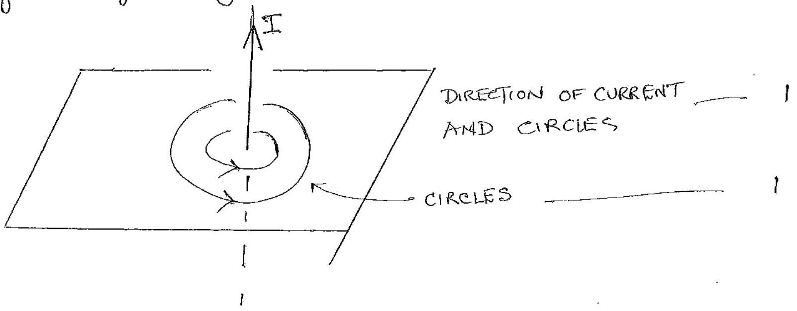
(ii) 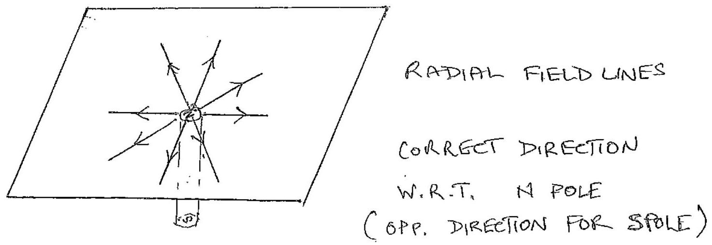

(i) If at time $t = 0$ stone released and falls a destances, before collednig with upward stone, at time $T _ { c }$,
$$
\begin{equation*}
s = \frac { 1 } { 2 } g T _ { c } ^ { 2 } \tag{1}
\end{equation*}
$$
For stone project upwardo
$$
\begin{equation*}
( h - s ) = u T _ { c } - \frac { 1 } { 2 } g T _ { 0 } ^ { 2 } \tag{2}
\end{equation*}
$$
Substituting (1) unito (2)
$$
\begin{align*}
h - \frac { 1 } { 2 } g T _ { c } ^ { 2 } & = u T _ { c } - \frac { 1 } { 2 } g T _ { c } ^ { 2 } \\
T _ { c } & = \frac { h } { u } \tag{3}
\end{align*}
$$
(ii) If the stones collide with a conman speed $V$ :
Falling stone :
Upward stone:
$$
\begin{equation*}
v = u - g T _ { c } \tag{5}
\end{equation*}
$$
From (5) and (4)
$$
\begin{equation*}
u = 2 g T _ { c } \tag{6}
\end{equation*}
$$
Substituting (6) into (3)
$$
T _ { c } = \sqrt { \frac { h } { 2 g } } \quad \& \quad u = \sqrt { 2 g h }
$$
(iii) If the speeds of stones after collesion are $v ^ { \prime }$ and $v ^ { \prime \prime }$, w' apposite directions, conservation of momentum guis
$$
\begin{align*}
m v - m v & = m v ^ { \prime } - m v ^ { \prime \prime } \\
v ^ { \prime } & = v ^ { \prime \prime } \tag{7}
\end{align*}
$$
Energy conservationgeres,
$$
\begin{align*}
\frac { 1 } { 2 } m v ^ { 2 } + \frac { 1 } { 2 } m v ^ { 2 } & = \frac { 1 } { 2 } m v ^ { 12 } + \frac { 1 } { 2 } m v ^ { 11 ^ { 2 } } \\
m v ^ { 2 } & = m v ^ { 12 } \tag{7}
\end{align*}
$$
After the collision the upper stone will rise to its initral starting height This will take a twie $T _ { 0 }$, by pricuple of neversebity. It will the fall to the grand, taking Te to reach the prevon's collision height and the by reversibelity of lower stone, a time $T e$ to reach the ground $i$ that is a time $3 T c$ from the collision time.

Q2

(iii) The lower stane, by premeiple of neversebility, with take $T _ { 0 }$ from collision time to reach the ground.
Thus time between the two stone unpacting on the ground is 2 Tcie $2 \sqrt { \frac { h } { 2 g } } = \sqrt { \frac { 2 h } { g } }$
b) MARK SCHEME
(i) borrect labelo for " $y$-axis" in multiples of $\frac { \sqrt { g h } } { 2 }$ borrect labels for " $x$-axis" in multiples of $T _ { c } = \sqrt [ 2 ] { \frac { h } { 2 g } }$ $\frac { 1 } { 2 }$ mark for each section of "full" graph (upward store) $\frac { 1 } { 2 }$ mark for each section of "broken" graph (downward stone) Correct points at which stones reach the ground
(ii) Axes correct (From (1)+(3) collision occus offirfalling $\frac { h } { 4 }$ )
(ii) Axes correct (From (1)+(3) collision occus offirfalling $\frac { h } { 4 }$ ) Fill curve Fill curve
(1) +(3) collision occus ofterfalling $\frac { h } { 4 }$ ) 1
Broken anve
Broken anve Broken awve
Broken awve
2 11
TOTAL 20

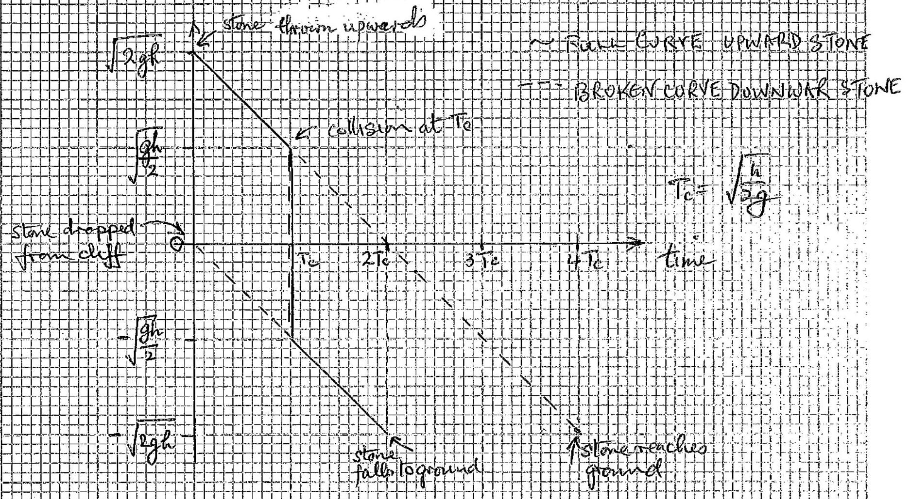

## HEGHT TONE GRAPH

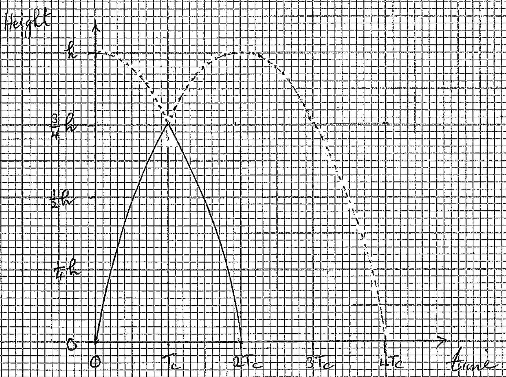

(i) Man's c. of g. falls 25 m Rope length at brosest point is $( 25 - 2 ) m = 23 m$ Energy equation at lowed point

$$
\begin{equation*}
\triangle ( P E ) = \text { ENERGY OF STRETCHED ROPE } \tag{1}
\end{equation*}
$$

If man has mass $m$,

$$
\begin{equation*}
m g 25 = \frac { 1 } { 2 } k \left( 23 - l _ { 0 } \right) ^ { 2 } \tag{1}
\end{equation*}
$$

(11) At equilibrium

$$
\begin{align*}
& m g = k \left( 25 - 2 - 8 - l _ { 0 } \right) \\
& m g = k \left( 15 - l _ { 0 } \right) \tag{2}
\end{align*}
$$

(iii) Substituting (2) into (1), eliminatung $m$,

$$
\begin{aligned}
& l _ { 0 } ^ { 2 } + 4 l _ { 0 } - 221 = 0 \\
& \left( l _ { 0 } - 13 \right) \left( l _ { 0 } + 17 \right) = 0 \\
& l _ { 0 } = 13 \mathrm {~m} \text { or } l _ { 0 } = - 17 \mathrm {~m}
\end{aligned}
$$

Ouly acceptable solution, the positive solution,

$$
\begin{equation*}
l _ { 0 } = 13 \mathrm {~m} \tag{3}
\end{equation*}
$$

(b) (1) At maximion speed, acceleration zero as motion SHM. Thes occurs at the "equilibrum position" length of rope is $( 25 - 8 - 2 ) \mathrm { m } = 15 \mathrm {~m} \quad ( \sec 2 ) )$ As $l _ { 0 } = 13$ extensean is 2 m Energy egration at "equilabrium" position if man has speed $v$ :

$$
\begin{equation*}
\frac { 1 } { 2 } m v ^ { 2 } + \frac { 1 } { 2 } k ( 2 ) ^ { 2 } = m g ( 15 + 2 ) \tag{4}
\end{equation*}
$$

From (6) and (3)

Sub ${ } ^ { 9 }$, (5) $m$ ito (4)

$$
\begin{align*}
m g & = 2 k  \tag{S}\\
v ^ { 2 } & = - \frac { 4 k } { m } + 2 g ( 17 ) \\
& = - 2 g + 34 g \\
& = 32 g \\
V & = \sqrt { 32 g } = 17.7 \mathrm {~ms} ^ { - 1 }
\end{align*}
$$

(b) (ii) Maximum acceleration occurs at the greatest extencion of ite rope Greatest extension $= [ ( 25 - 2 ) - 13 ] _ { \mathrm { m } } = 10 \mathrm {~m}$ This is 5 times the equilibrium extension. As " $F = k x$ " this corresponds to a tension of $F 5 \mathrm { mg }$
So net force on man, mass $m$, is $4 m g$ (ie T-mg) Thes the greatest aceleration is $4 \mathrm {~g} = 39.2 \mathrm {~ms} ^ { - 2 }$

Q4

a)
$$
\text { (i) } \begin{array} { r l r l }
\text { Marig the usual notation } & N & = N _ { 0 } e ^ { - \lambda t } \\
\text { For the half life } \tau , & \frac { N _ { 0 } } { 2 } & = N _ { 0 } e ^ { - \lambda \tau } \\
\frac { 1 } { 2 } & = e ^ { - \lambda \tau } \\
\text { Taking lu, } & \lambda \tau & = \frac { \ln 2 } { \lambda } \\
\tau & = \frac { \ln 2 } { \lambda } \tag{2}
\end{array}
$$
(ii) If $87.5 \% = \frac { 7 } { 8 }$ of the atoms decay only $\frac { 1 } { 8 }$ are deft
From (1)
$$
\begin{equation*}
\frac { N } { N _ { 0 } } = \frac { 1 } { 8 } = e ^ { - \lambda t } \tag{3}
\end{equation*}
$$
where
$$
\begin{equation*}
\lambda = \frac { \ln 2 } { \tau } = \frac { 0.6931 } { 3.3 } \tag{if turne measured}
\end{equation*}
$$
(b) If there are $V$ ccs of blood, there will be 0.5V disitegrations per min after 30 hours. Substituturg into (1), measuring time in hours,
$$
\begin{align*}
0.5 V & = 12 \times 10 ^ { 3 } \exp \left[ - 30 \left( \frac { 0.6931 } { 15 } \right) \right]  \tag{3}\\
V & = 24 \times 10 ^ { 3 } \exp [ - 1.3862 ]  \tag{I}\\
& = 6.00 \times 10 ^ { 3 } \mathrm { ccs } \\
V & = 6.00 \text { litres } \tag{5}
\end{align*}
$$
(c) If $A$ is area of Guiger counter face, the initial total
$$
\frac { 4 \pi } { A } ( 2 \cdot 0 ) ^ { - 1 } 360 \quad 5 ^ { - 1 }
$$
At distance $x$ it detects the fraction, of the counts per see, $= \frac { 4 \pi x ^ { 2 } } { A }$
The total count rate after go minis is $\frac { 4 \pi x ^ { 2 } } { A } ( 5 )$ Using the exp. decay of count rates
$$
\begin{aligned}
\frac { 4 \pi x ^ { 2 } } { A } ( 5 ) & = \frac { 4 \pi ( 2 \cdot 0 ) ^ { 2 } } { A } ( 360 ) \\
x & = 6.0 \mathrm {~m}
\end{aligned}
$$

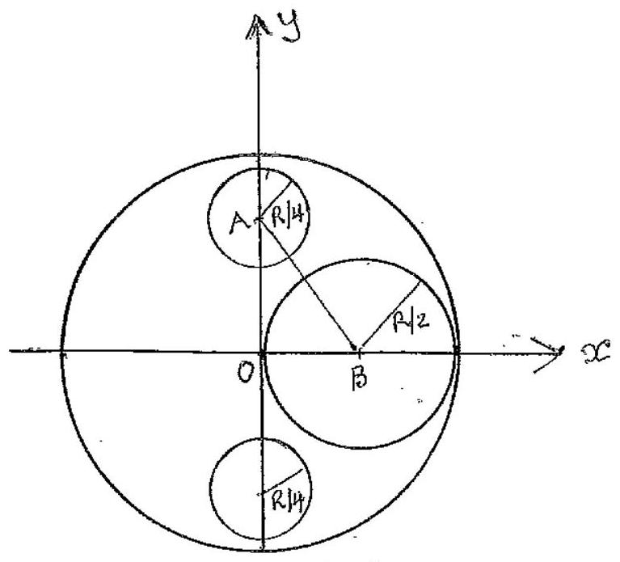
$O , A$ and $B$ are the centres of the circles In $\triangle A O B$ the dusks will not overlap if $A B > \frac { 1 } { 4 } R + \frac { 1 } { 2 } R = \frac { 3 } { 4 } R$ $( A B ) ^ { 2 } > \frac { 9 } { 16 } R ^ { 2 } = \frac { 36 } { 64 } R ^ { 2 }$

Using Pythagoras's Theorem in $\triangle O A B$

$$
\begin{equation*}
( A B ) ^ { 2 } = \left( \frac { 1 } { 2 } R \right) ^ { 2 } + \left( \frac { 5 } { 8 } R \right) ^ { 2 } = \frac { 41 } { 64 } R ^ { 2 } \tag{2}
\end{equation*}
$$

As $\frac { 36 } { 64 } R ^ { 2 } < \frac { 41 } { 64 } R ^ { 2 }$ the circles will not overlap
(ii) By symmeting $C$ - of $G$. lies along the $x$-axis Taking moments about the $y$-axis, $\bar { x }$ being distance of $C$. of $G$, $\left[ \pi R ^ { 2 } - \pi \left( \frac { 1 } { 2 } R \right) ^ { 2 } - 2 \pi \left( \frac { 1 } { 4 } \right) ^ { 2 } R ^ { 2 } \right] \rho \bar { x } = - \frac { 1 } { 2 } R \left( \rho \pi \left( \frac { R } { 2 } \right) ^ { 2 } \right)$ $\frac { 5 } { 8 } \bar { x } = - \frac { 1 } { 8 } R$ $x = - \frac { 1 } { 5 } R$
b $( t )$
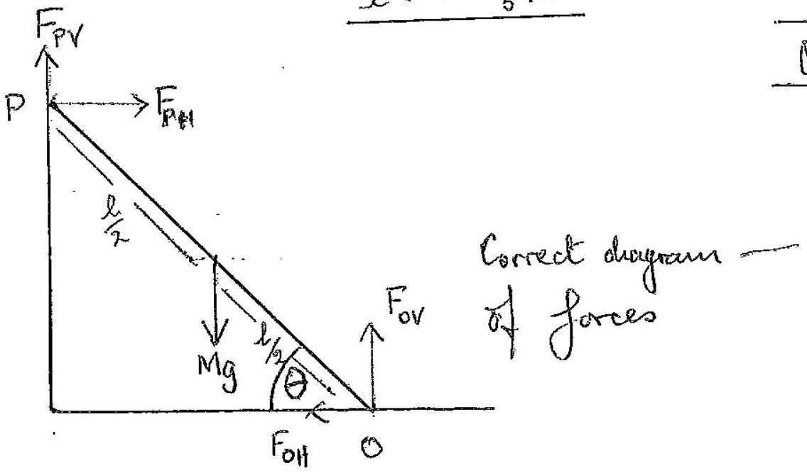
(ii) Resolong:

$$
\begin{array} { l l }
\text { Horizontally } & F _ { P H } = F _ { O H } \\
\text { Vertically } & M g = F _ { O V } + F _ { P V } \tag{2}
\end{array}
$$

(iii) Taking moments about $P _ { 1 }$ setting $F _ { P V } = 0$ for smooth surface,

$$
\begin{gather*}
F _ { O V } l \cos \theta = \frac { 1 } { 2 } l M g \cos \theta + F _ { O H } l \sin \theta  \tag{l}\\
\frac { F _ { O V } } { F _ { O H } } = \frac { 1 } { 2 } \frac { M g } { F _ { O H } } + \tan \theta  \tag{1}\\
\tan \theta = \frac { F _ { O V } } { F _ { O H } } - \frac { 1 } { 2 } \frac { M g } { F _ { O H } } = \frac { 1 } { F _ { O H } } \left( F _ { O V } - \frac { 1 } { 2 } M g \right)
\end{gather*}
$$

(vi) From (2) with $F _ { p v } = 0$

$$
\begin{equation*}
\tan \theta = \frac { 1 } { 2 } \frac { M g } { F _ { 0 } H } \tag{3}
\end{equation*}
$$

For can always balance Mg , hect the largest value of $F _ { O H }$ is given by

$$
\begin{equation*}
F _ { \text {OH } } = \mu F _ { \text {OV } } = \mu \mathrm { Mg } \tag{grn}
\end{equation*}
$$

This gives the smallest value of $\tan \theta$ and lence $\theta , \theta _ { \text {min } }$, 1 From (3)

$$
\begin{aligned}
\theta _ { \min } & = \tan ^ { - 1 } \left[ \frac { 1 } { \mu } \operatorname { Mg } \left( M g - \frac { 1 } { 2 } M g \right) \right] \\
& = \tan ^ { - 1 } \left[ \frac { 1 } { 2 } \left( \frac { 1 } { 0.35 } \right) \right] = \tan ^ { - 1 } \left( \frac { 1 } { 0.7 } \right) \\
\theta _ { \min } & = 55 ^ { \circ }
\end{aligned}
$$

Q6

(1) The image of $S$ in the mirror is. the point where the extension of $P A$ muth the vertical through $S$.
So the path lengths SAP and SAP are equal, thus reflected roy can be consedered to cure from S', the optical path lengths are identical.
(ii) Young's tomble olit experement involves a donble sht cohesent source. Here also $S$ and S' form an effecture donble slit source originating form S and S!.
(iii) The zero orter founge occus when the optial path difference between SP and SAP, or SAP, are identical. Here the reflection from the merior produces an additional phase difference of $\pi$. Consequently the zero order fringe will be a destructure interference fining. (In foung's double slit experement there is no mirior and the zero order fruige is a constructive interference frenige.)
(b) (i) Useng Rythagaras's theorem, where $l _ { 1 } = s p$ and $l _ { 2 } = s p$;
$$
\begin{aligned}
& l _ { 1 } ^ { 2 } = ( s p ) ^ { 2 } = D ^ { 2 } + ( y - a ) ^ { 2 } \\
& l _ { 2 } ^ { 2 } = \left( s ^ { \prime } p \right) ^ { 2 } = D ^ { 2 } + ( y + a ) ^ { 2 }
\end{aligned}
$$
Path difference, $p$, gwen by
$$
p = l _ { 2 } - l _ { 1 } = \left[ D ^ { 2 } + ( y + a ) ^ { 2 } \right] ^ { \frac { 1 } { 2 } } - \left[ D ^ { 2 } + ( y - a ) ^ { 2 } \right] ^ { \frac { 1 } { 2 } }
$$
(ii) Substrituting the approxiviation for $( y \pm a ) \ll D$,
$$
\begin{aligned}
p = l _ { 2 } - l _ { 1 } & = D \left[ \left\{ 1 + \frac { 1 } { 2 } \left( \frac { y + a } { D } \right) ^ { 2 } + \cdots \right\} - \left\{ 1 + \frac { 1 } { 2 } \left( \frac { y - a } { D } \right) ^ { 2 } + \cdots \right\} \right] 1 \\
& = \frac { 1 } { 2 D } \left[ \left( y ^ { 2 } + 2 a y + a ^ { 2 } \right) - \left( y ^ { 2 } - 2 a y + a ^ { 2 } \right) \right] \\
p = l _ { 2 } - l _ { 1 } & = \frac { 2 a y } { D }
\end{aligned}
$$

(b) (III) ∴ sip has a phase change of $\pi$ at the morror. This is equivalent to a path merement of $\frac { \lambda } { 2 }$.
For constructive interference: $\quad \phi = \frac { 2 a y } { D } = \left( n + \frac { 1 } { 2 } \right) \lambda \quad n = 0,1,2 , \cdots$ Fir destructure interference $\phi = \frac { 2 a y } { D } = n \lambda$
(iv) White light fringes occur when all wavelengths interferer constructurely. This will occur when $n = 0$; for larger values of $n$ some wavelengths will forduce constructive, or partial constructive, interference and others destructure, or partial destructive, interference. As $n$ moreases from zero one obtains whitish frugis with some choreveng. This rapidly's nudges' ont the funge system as $n$ nicreases. and the wavelengths becomes increasengly out of phase. giving a uniform white display.

(a) (i) $\quad V _ { A B } = \frac { 1000 } { 6000 } 9.0 \mathrm {~V}$
$V _ { A B } = 1.500 \mathrm {~V}$
It is a potential divider, dividing the source potential of 9.0 V , in the ratio of the resistors.
(ii) The total resistance across $A B = \left( \frac { 1 } { 1000 } + \frac { 1 } { 500 } \right) ^ { - 1 } = \frac { 1000 } { 3 } = 333 \frac { 1 } { 3 } \Omega 1$
$$
\begin{aligned}
& V _ { A B } = \frac { 333 \frac { 1 } { 3 } } { 5000 + 333 \frac { 1 } { 3 } } ( 9 ) = \frac { 1000 } { 3 } \left( \frac { 3 } { 15000 + 1000 } \right) 9 \cdot V \\
& V _ { A B } = 5 \frac { 5 } { 8 } V
\end{aligned}
$$
(iii) The capacetor would charge up to the roltage given in (i) ie 1.500 V
(b) (i)
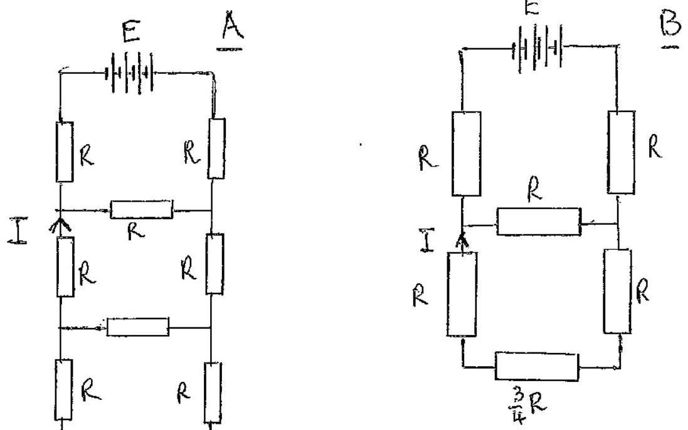
Rin II with $3 R$ gives $\left( \frac { 1 } { R } + \frac { 1 } { 3 R } \right) ^ { - 1 } = \frac { 3 } { 4 } R$

$\left( 2 R + \frac { 3 } { 4 } R \right)$ is 11 with $R : \left[ \left( \frac { 11 } { 4 } R \right) ^ { - 1 } + ( R ) ^ { - 1 } \right] ^ { - 1 } = \frac { 11 } { 15 } R$
Gives $I _ { 0 } = \frac { E } { \frac { 11 } { 15 } R + 2 R } = \frac { 15 E } { 41 R }$

Thus from B

$$
\left. \begin{array} { r l }
I & = I _ { 0 } \left( \frac { R } { 2 R + \frac { 3 } { 4 } R } \right) = \frac { 4 } { 11 } I _ { 0 } \\
& = \frac { 4 } { 11 } \left( \frac { 15 } { 41 } \frac { E } { R } \right) = \frac { 60 } { 451 } \frac { E } { R } \\
I & = 0.133 \frac { E } { R }
\end{array} \right\}
$$

b) (ii)

Thes is a balanced wheatstore Brodge with no aurent throngh GS; I so $R _ { \text {CS } }$ can de disconnected. Then $R _ { \text {CECK } } = 2 R$ and $R _ { \text {COSFK } } = 4 R$. These two resistances are in parallel
Total resistance across $C K = \left( \frac { 1 } { 2 R } + \frac { 1 } { 4 R } \right) ^ { - 1 } = \frac { 4 } { 3 } R$
burrent through the battery $= E / \left( \frac { 4 } { 3 } R + 2 R \right)$

$$
= \frac { 3 } { 10 } \left( \frac { E } { R } \right)
$$

burnent

$$
I = \frac { 3 } { 10 } \left( \frac { E } { R } \right) \left( \frac { 4 R } { 2 R + 4 R } \right)
$$

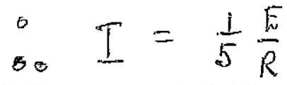
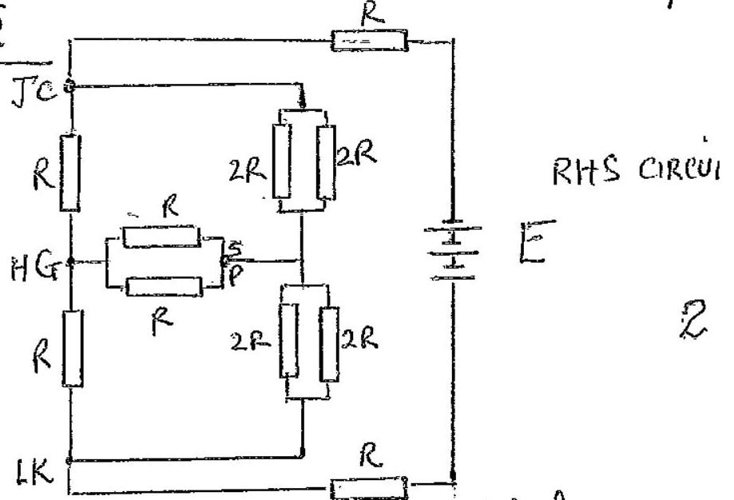
By symmetry circuits on either side of COK (excluding CEK) dentical. Hence s and P at same potential, so LHS cirant equivalent to RHS crecrit abor

Addung resestancies in parallel, reduces the Rits crant to
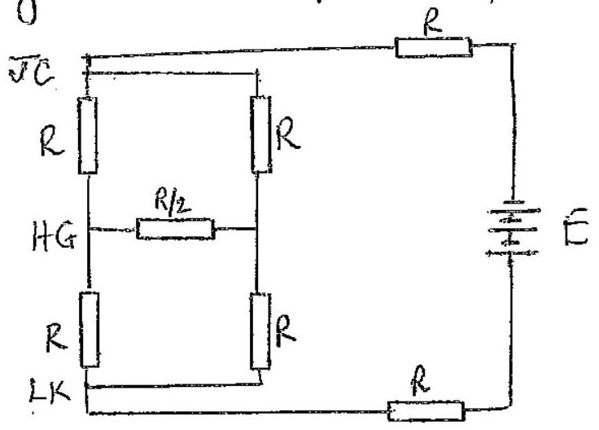
This as a balanced wheatstone Bridge so $R / 2$ can be removed as no current flows throughit.
Total neustance across cells $= \left( \frac { 1 } { 2 R } + \frac { 1 } { 2 R } \right) ^ { - 1 } + 2 R = 3 R$
Current through Ge $\quad I = \frac { 1 } { 2 } \left( \frac { E } { 3 R } \right) = \frac { 1 } { 6 } \left( \frac { E } { R } \right)$

$Q ^ { 8 }$
a) (i)
$$
E = \frac { 1 } { 2 } m v ^ { 2 } - \frac { G M m } { r }
$$
(ii)
$$
v ^ { 2 } = \frac { 2 E } { m } + \frac { 2 G M } { r }
$$
$V ^ { 2 }$, and hence $V$, are a maximum when $r$ is a minimum ie at $A$ $V ^ { 2 }$, and hencer, are a minimum when $r$ is a maximum ie at $B$
(iii) Along the clockwise path from C to D, $r$ is greater than along the clockwese path from D to $C$. Consequently $V$ is smaller in the former case than in the latter case. Consequently the twice to traverse C to D clockwise will be longer than D I C clockwise; poth paths beng of the same length.
(iv) For circular motion of the Earth about the Sun;
$$
\begin{aligned}
& T = 1 \text { year } \\
& a = 1 \text { AU } \\
& k = 1 \text { (years) } { } ^ { \frac { 1 } { 2 } } ( A U ) ^ { - 3 / 2 }
\end{aligned}
$$
(Alternative units acceptablif correct).
(vi) For Halley's comet
$$
\begin{aligned}
& T = 76 \text { years } \\
& a ^ { 3 } = ( 76 ) ^ { 2 } \quad \text { where a in AU } \\
& a = 17.94 \text { AU }
\end{aligned}
$$
Length of Major axis $2 a = 35.9 \mathrm { AU }$
(b) (i) Area swept out by radius rector, 'pivited at 0 ', during flight fount to 1
$$
\begin{aligned}
A & = A _ { R G A } \Delta T O L + \frac { 1 } { 2 } A _ { R E A } \text { OF ELLPSE } \\
& = \frac { 1 } { 2 } R ^ { 2 } \sin 2 \theta + \frac { 1 } { 2 } ( \pi a b ) \\
& = \frac { 1 } { 2 } R ^ { 2 } \sin 2 \theta + \frac { 1 } { 2 } \pi R ( R \sin \theta ) \\
A & = \frac { 1 } { 2 } R ^ { 2 } ( \sin 2 \theta + \pi \sin \theta )
\end{aligned}
$$

(b) (i) Now $T _ { 0 } = k \pi a b = k \pi R ^ { 2 } \sin \theta$ as To proportional to area, 1 swelt out by complete ellipse, $K _ { \text {is } }$ a constant
Let Time of flight from $L$ to $T$ be $T$, then

$$
T = K A = K \frac { 1 } { 2 } R ^ { 2 } ( \sin 2 \theta + \pi \sin \theta )
$$

Thus

$$
\begin{aligned}
& T = T _ { 0 } \frac { \frac { 1 } { 2 } R ^ { 2 } ( \sin 2 \theta + \pi \sin \theta ) } { \pi R ^ { 2 } \sin \theta } \\
& T = T _ { 0 } \left( \frac { 1 } { \pi } \cos \theta + \frac { 1 } { 2 } \right)
\end{aligned}
$$

(ii) Yes. Limiting value guis

$$
T = T _ { 0 } \left( \frac { 1 } { 2 } + \frac { 1 } { \pi } \right)
$$

This is the hintuig case of the ellepse; a straight heve? with foci at the extremitries, at the centre of the planets and at the "top" of the flight. The height reached is equal to the naduis of the planet.
