Please note that this mark scheme is a final draft version. It contains several small errors that were corrected during the marking process.

## SOLUTIONS BPHO 2010 PAPER 2

Q1

(a) (i) Energy lost in $8.4 \mathrm {~s} = 5 \times 140 \times 3 \mathrm {~J}$ Rate of loss of energy from lead $= 5 \times 140 \times 3 / 8.4 \mathrm { Js } ^ { - 1 }$ $= 250 \mathrm {~W}$
(ii) If specific latent heat of fusion is $L$ then
$$
\begin{aligned}
3 L & = 250 \times 300 \\
L & = 2.5 \times 10 ^ { 4 } \mathrm { Jkg } ^ { - 1 }
\end{aligned}
$$
(III) If specific heat capacity of lequid lead is sthen
$$
\begin{aligned}
3 \left( \frac { 0 } { 5 } \right) _ { S } & = 250 \times 10 \\
S & = 167 \mathrm { Jkg } ^ { - 1 } \mathrm {~K} ^ { - 1 }
\end{aligned}
$$
(b) 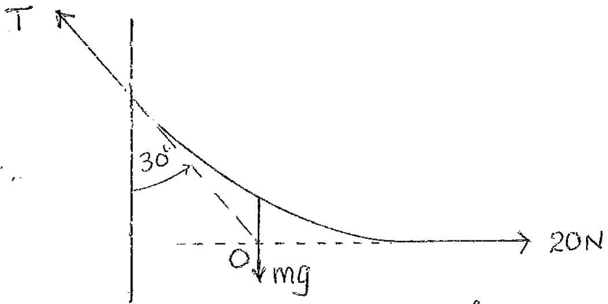
Vertical ing of rope must pass through 0
Triangle of forces
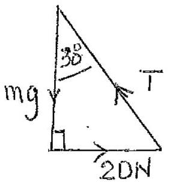
$$
\begin{aligned}
\tan 30 ^ { \circ } & = \frac { 20 } { m g } \\
m g & = 20 \cot 30 ^ { \circ } \\
& = 20 \sqrt { 3 } \\
& = 34.64 \mathrm {~N} \\
m & = 3.53 \mathrm {~kg}
\end{aligned}
$$

(c)

Surface area of a but

$$
\begin{aligned}
& = \frac { \pi \left( 5.5 ^ { 2 } - 2.2 ^ { 2 } \right) } { 650 \times 10 ^ { 6 } \times 8 } = \frac { 79.8 } { 5.2 \times 10 ^ { 9 } \mathrm {~cm} ^ { 2 } } \\
& = 1.5 \times 10 ^ { - 8 } \mathrm {~cm} ^ { 2 } = 1.5 \times 10 ^ { - 12 } \mathrm {~m} ^ { 2 }
\end{aligned}
$$

(d)

$$
\begin{aligned}
& \text { Area of lens } = \pi \left( 10 ^ { - 2 } \right) ^ { 2 } = \pi 10 ^ { - 4 } \mathrm {~m} ^ { 2 } \\
& \text { Energy pers } ( 1 \% \text { of } 100 \mathrm {~W} ) = \frac { 1 } { 100 } 100 = 1 \mathrm {~W} \\
& \text { Tine } = 1.5 \times 10 ^ { - 2 } \mathrm {~s}
\end{aligned}
$$

$$
\begin{aligned}
\text { Energy reacheig film } & = \frac { \pi \left( 10 ^ { - 4 } \right) } { 4 \pi \left( 10 ^ { 2 } \right) ^ { 2 } } ( 1 ) 1.5 \times 10 ^ { - 2 } \\
& = 3.8 \times 10 ^ { - 11 } \mathrm {~J}
\end{aligned}
$$

For $n$ photons of frequency $y$

$$
\begin{aligned}
n h ) & = 3.8 \times 10 ^ { - 11 } \\
n \left( 6.6 \times 10 ^ { - 34 } \right) & \frac { 3.00 \times 10 ^ { 8 } } { 6 \times 10 ^ { - 7 } } = 3.8 \times 10 ^ { - 11 } \\
n & = \frac { 3.8 \times 10 ^ { - 11 } } { 3.3 \times 10 ^ { - 19 } } \\
n & \left. = 1.2 \times 10 ^ { 8 } \quad \text { (Accit } \mathrm { H } \times 10 ^ { 8 } \right)
\end{aligned}
$$

(e) At temperature $T K$

$$
\begin{gathered}
\left( \frac { 250 } { 230 } \right) ^ { 2 } 20 \left[ 1 + ( T - 273 ) 5.0 \times 10 ^ { - } \right. \\
\left( \frac { 230 } { 250 } \right) ^ { 2 } \frac { 1 } { 20 } = 250 \\
T = 273 + \frac { ( T - 273 ) 5 : 0 } { 25 } \\
T = 2 = 2 \times 10 ^ { 3 } \mathrm {~K}
\end{gathered}
$$

(f) For amplictude a incident at angle $\theta$ Transmitted amplitude $= a \cos \theta$ This has a transmitted intensity $= a ^ { 2 } \cos ^ { 2 } \theta$
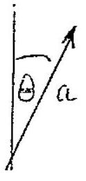

Average aver all $\theta = \left\langle a ^ { 2 } \cos ^ { 2 } \theta \right\rangle = \frac { 1 } { 2 } a ^ { 2 }$.
Average aver all $\theta = \left\langle a ^ { 2 } \cos ^ { 2 } \theta \right\rangle = \frac { 1 } { 2 } a ^ { 2 }$. Addungover all amps. for all frequencies in white light Addung over all amps. for all frequencies in white light intensity $= \frac { 1 } { 2 } \sum _ { i } a _ { i } ^ { 2 } = \frac { 1 } { 2 } I$ as $I = \sum a _ { i } ^ { 2 }$ intensity $= \frac { 1 } { 2 } \sum _ { i } a _ { i } ^ { 2 } = \frac { 1 } { 2 } I$ as $I = \sum _ { 1 } a _ { i } ^ { 2 }$

(g) (i) To escupe from planet with initial velocity $v$ requeres the KE. to be at least equal to initial gravitational P.E.
$$
\begin{aligned}
\frac { 1 } { 2 } m v ^ { 2 } & = \frac { G m M } { R } \\
v & = \sqrt { \frac { 2 G M } { R } }
\end{aligned}
$$
(ii) For planets to have no atmosphere $\langle i v i \rangle$ must be nuch greater than $\sqrt { \frac { G M } { R } }$ so that they escape from gravitational field ie. $\langle | v \left| \rangle > \sqrt { \frac { G ( v ) } { R } } \right.$
A factor greater than 5 is sufficient
$( - i )$
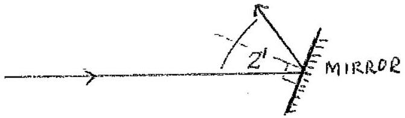
Mirror rotalis swough $1 ^ { \prime }$ of are Time taken $= 1 / ( 35 \times 360 \times 60 )$ Distance traveleed $= 400 \mathrm {~m}$
Velocity i. git
$$
\begin{aligned}
& c = 400 \times 35 \times 360 \times 60 \mathrm {~ms} ^ { - 1 } \\
& c = 3.0 \times 10 ^ { 8 } \mathrm {~ms} ^ { - 1 }
\end{aligned}
$$
(i) (i)
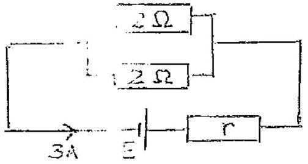
$$
\begin{aligned}
E & = 3 \left( r + \left( \frac { 1 } { 2 } + \frac { 1 } { 2 } \right) ^ { - 1 } \right) \\
& = 3 ( r + 1 ) \\
r & = \frac { E } { 3 } - 1
\end{aligned}
$$

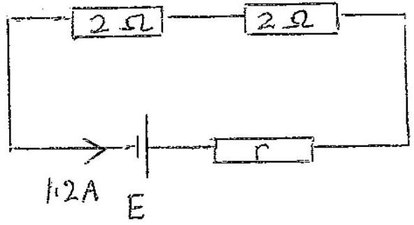

$$
E = 1.2 ( r + 4 )
$$

Sub from earlier result

$$
\begin{aligned}
E & = 1.2 \left( \frac { E } { 3 } - 1 + 4 \right) \\
& = 0.4 E + 3.6 \\
E & = 6 \mathrm {~V}
\end{aligned}
$$

(i)

$$
r = \frac { E } { 3 } - 1 = \frac { 6 } { 3 } - 1 = 1 \Omega
$$

(iii)

$$
\begin{aligned}
& P _ { p } = \left( \frac { 3 } { 2 } \right) ^ { 2 } 2 = 4.5 \mathrm {~W} \\
& P _ { s } = ( 1.2 ) ^ { 2 } 2 = 2.88 \mathrm {~W}
\end{aligned}
$$

(i) Initial thirst of rocket

$$
\begin{aligned}
& = 16 \times 2.5 \times 10 \mathrm {~N} \\
& = 4 \times 10 ^ { 4 } \mathrm {~N}
\end{aligned}
$$

This is less than weight of rocket $= 9.81 \times 4.1 \times 10 ^ { 3 } = 4 . \cdots 1 \times 10 ^ { 4 } \mathrm {~N}$ Consequently rocket does not lift off unimediately
(ii) Threast of rocket is constant $= 4 \times 10 ^ { 4 } \mathrm {~N}$
Weight of rocket reduces with time
After time $t$ mass of rocket $= 4.1 \times 10 ^ { 3 } - 16 t$
Weight of rocket

$$
= 9.81 \left( 4.1 \times 10 ^ { 3 } - 16 t \right)
$$

Lyt off occurs when

$$
\begin{aligned}
4 \times 10 ^ { 4 } & = \left( 4.1 \times 10 ^ { 3 } - 16 t \right) 9.81 \\
\therefore \quad 16 t & = 4.1 \times 10 ^ { 3 } - \frac { 4 \times 10 ^ { 4 } } { 9.81 } \\
& = 22.5 \\
t & = 1.45
\end{aligned}
$$

(k) (i) $\frac { 1 } { 2 }$ mark for any two suggestion, for exemple:
No interactions between molecules
Ideal gas equations
Zero volume of all molecules
Randar motion of molecules.
Mean KE a absothete Cemperature ( $\langle R E \rangle = \frac { 3 } { 2 } K T$ )
    (ii) $\frac { 1 } { 2 }$ mask for any liwo suggestions for example:
Real gas molecules interact
Gas aquations deviate fran ideal gas laws
Motion no longer purely rendom
Molecules have finite volume
CKE> $\neq \frac { 3 } { 2 }$ KT
    (iii) $\frac { 1 } { 2 }$ mork for any two suggestions such as:
Ideal gas antes fivo $P V = R T$
Real gas deviair from this solation
(Special cases: Charges \& Chorleo laws)
Themsodynomic proputies deviale fran ideal values
(l) (i) resultant
MOTION
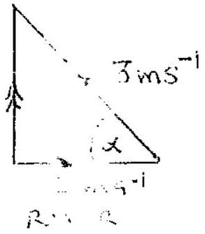
To travel perpindicular to bank he has to row at angled where
$$
\begin{aligned}
& \alpha = \cos ^ { - 1 } \left( \frac { 2 } { 3 } \right) \\
& \alpha = 48 ^ { \circ }
\end{aligned}
$$
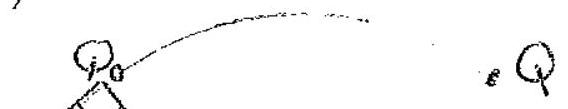
    (ii) CIRCLE CENTRE O
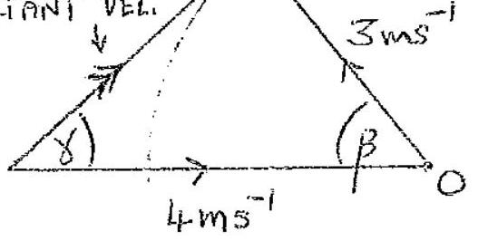

No setution possible perpendicular to bank è soure as webaty of river Possible directions of merultant motion along $P Q$, where $Q$ is an a carde, centre $O$, radius $Q O = 3 m S ^ { - 1 }$ in vector diagram The alorteat path occurs for largest ralie of angle $\gamma$ whech will occur when $P Q$ tangential to circle at $P Q _ { 0 }$ (Lower half circle excluded cosit is on land)

$$
\begin{aligned}
\therefore \quad \sin \gamma & = \frac { 3 } { 4 } \\
\gamma & = \sin ^ { - 1 } \frac { 3 } { 4 } = 48.6 ^ { \circ }
\end{aligned}
$$

$( m )$
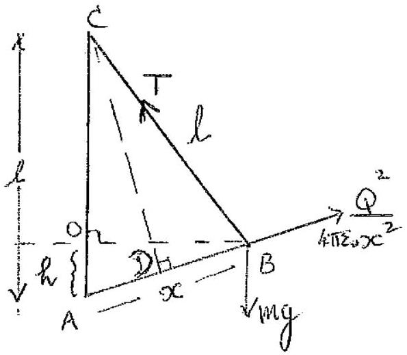
Tseceles tricingle of forces $A B C$ acdes $l$, $l$ and $x$.
Forces T, mg and $\frac { Q ^ { 2 } } { \pi \varepsilon _ { 0 } x ^ { 2 } }$, where $T = i n g$ as $A B C$ waseti.
(i) $T = m g$
(ii) $W = m g h + \frac { Q ^ { 2 } } { 4 \pi \varepsilon _ { 0 } x }$
$\frac { x } { l } = \frac { Q ^ { 2 } } { 4 \pi z _ { 0 } x ^ { 2 } m g }$
In similar triangles $O A B$ quat $C A D$, where $D$ init …vit $A B$.

$$
\begin{align*}
& \frac { h } { x } = \frac { \frac { x } { 2 } } { l } \\
& x ^ { 2 } = 2 h l \tag{3}
\end{align*}
$$

Sub ${ } ^ { 9 }$ (2) into (1)

$$
\begin{equation*}
\frac { x } { l } = \frac { Q ^ { 2 } } { \left( 4 \pi z _ { 0 } \right) 2 h \operatorname { lm } g } \tag{4}
\end{equation*}
$$

Sub ${ } ^ { 9 }$ for $x$ from (t) into (1)

$$
W = m g h + 2 m g h = 3 m g h
$$

(n) (1)
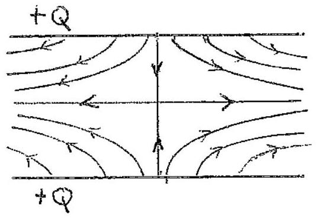
Drawning Correct arrows
"
(ii) 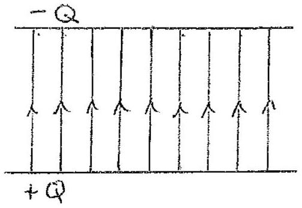
Drawng Correct arrows
(iii) Magnitude of charges same in both cases, (i) and (ii) and distances between all pairs of charges some in both cases Consequently only difference, in (it) fram(i), is segin of charges Thes of force of repulsem in (i) is $F _ { + }$ Force of attractiong $m$ (ii) is $E = - F _ { + }$ (vsing unveise square low of force between charges) Thus
$$
\frac { F _ { + } } { F _ { - } } = - 1
$$
(iv) $$
\begin{gather*}
C = \frac { \varepsilon ^ { 2 } A } { 2 }  \tag{A}\\
\text { Thus energy } E = \frac { Q ^ { 2 } x } { 2 \varepsilon _ { 0 } A }
\end{gather*}
$$
(v) Force of ather ... $F = \frac { d E } { d x } = \frac { Q ^ { 2 } } { 2 \varepsilon _ { 0 } A }$

Alternatuely conparing with grasitational energy of moss $m$, migh, whil produces a force ing is $E = F x$ Thus from (A)

$$
F = \frac { Q } { 2 \varepsilon _ { 0 } A }
$$

(0) Let fite natural frequency and mathoral waveleught $\lambda$. Wavelength $\lambda _ { s }$ produce by source moveing truards observer, velocity $b$, is given by
$$
\lambda _ { s } = \lambda - \frac { v _ { s } } { f }
$$
Tem, for speed of somend c,
$$
\begin{aligned}
f _ { s } ^ { \prime } & = \frac { c } { \lambda _ { s } } = \frac { c } { \lambda - \frac { v _ { s } } { f } } \\
& = \frac { c } { \frac { c } { f } - \frac { v _ { s } } { f } } \\
\frac { f } { f s } & = \frac { f } { f } \left( \frac { c } { c - v _ { s } } \right)
\end{aligned}
$$
Anax speed $V _ { s } = 2 \pi ( 1.2 ) 3 = 22.6 \mathrm {~ms} ^ { - 1 }$
Min speed $- V _ { s } = - 22.6 \mathrm {~ms} ^ { - 1 }$
Thus $f$ is inithe range given by
$$
f _ { s } = 256 \left( \frac { 340 } { 340 \mp 22.6 } \right)
$$
Thus the variation is
240 to 274 Hz
(p) (i) Velocity along the feeld $V _ { 11 } = r \cos \theta$ This remiens constant as no force acts withic dire:
Velocity perpendicular to field $v _ { 1 } = v \sin \theta$ The field B produces a constant force on the election. perpendicular to $V _ { 1 }$, whech causesit to rotate in a ...t. with ounstant angular velocity, in this plane.
(ii) This force is Bevsin $\theta$
(note constant value) For motion mi a circle radius $r$
$$
\begin{aligned}
\frac { m _ { e } ( v \sin \theta ) ^ { 2 } } { r } & = B e v \sin \theta \\
r & = \frac { m _ { e } v \sin \theta } { B e }
\end{aligned}
$$

(p) Hence one period $T$ green by

$$
\begin{aligned}
T & = \frac { 2 \pi r } { v \sin \theta } \\
& = \frac { 2 \pi m e v \sin \theta } { B e v \sin ^ { 2 } \theta } \\
T & = \frac { 2 \pi m e } { B e }
\end{aligned}
$$

(iii) Disforce travelled in time $T$, $L$, is given by

$$
\begin{aligned}
& L = T ( v \cos \theta ) \\
& L = \frac { 2 \pi m _ { e } v \cos \theta } { B e }
\end{aligned}
$$

22 (a) Refracture index $\mu = \frac { \text { REAL HELCHT } } { \text { APPARENT HEIGHT } } = \frac { 8 } { 5 } = 1.6$

(b) If light emerges at c we require for glass of refracture index $n$
$$
\begin{aligned}
& n \leqslant \frac { \sin 90 ^ { \circ } } { \sin \phi } = \frac { 1 } { \sin \phi } \\
& \sin \phi \leqslant \frac { 1 } { n } = \frac { 3 } { 4 } \\
& \phi \leqslant 48.59 ^ { \circ }
\end{aligned}
$$
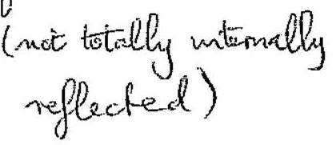
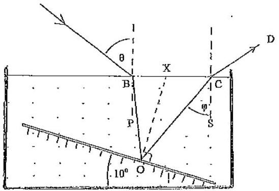
From decigaru,
$$
\begin{aligned}
& \angle O \times C = 90 ^ { \circ } + 10 ^ { \circ } = 100 ^ { \circ } \\
& \text { a smorrir tilted by } 10 ^ { \circ }
\end{aligned}
$$
$$
\left. \begin{array} { r l }
\angle C O X & = \phi - 90 ^ { \circ } \\
\angle B O X & = \phi - 90 ^ { \circ } \quad \text { angle of micd } = \text { angle of itic } \\
\angle O B X & = 110 - \phi \quad \text { angles of △ add to isஃ }
\end{array} \right\}
$$
if $\phi < 48.58 ^ { \circ }$
$$
\begin{aligned}
\sin ( \phi - 20 ) & \leqslant \sin \left( 28.58 ^ { \circ } \right) \\
\therefore \quad \sin \theta & \leqslant \frac { 4 } { 3 } \sin \left( 28.59 ^ { \circ } \right) \\
\theta & \leqslant 39.6
\end{aligned}
$$
Maximum $\theta$ is $39.6 ^ { \circ }$

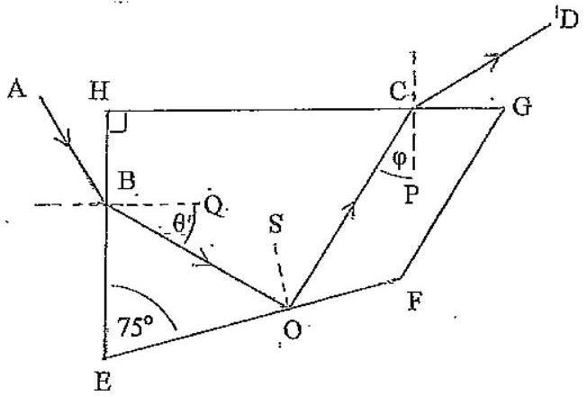

(i) $\quad \angle E B O = 90 - \theta$
$\angle E O B = 180 - ( 90 - \theta ) - 75 = 90 + \theta - 75 = 15 + \theta$
$\angle B O S = 90 - \angle E O B = 75 - \theta$
$\angle B O C = 2 ( 75 - \theta ) = 150 - 2 \theta$
(ii) $$
\begin{aligned}
\angle H C O & = 360 - 90 - ( 90 + \theta ) - \angle B O C \\
& = 180 - \theta - ( 150 - 2 \theta ) \\
& = 30 + \theta \\
\phi & = 90 - \angle H C O = 60 - \theta \\
\phi & = 60 - \theta
\end{aligned}
$$
(iii) If $\theta = \phi$
$$
\begin{aligned}
2 \theta & = 60 \\
\theta & = 30
\end{aligned}
$$
Total internal reflic ... to 0 requeres
$$
\begin{aligned}
x & > \frac { \sin 90 } { \sin ( 75 - \theta ) } \\
& > 1 / \sin 45 \\
x & > 1.414
\end{aligned}
$$
(iv) $90 ^ { \circ }$ as the jace $E H$ and $H G$ are perpendicialar and the angles of refraction at these faces are equal, tand egnally induned to the facto, in the same aluse
(d) :The maples onthe water surface act like a contrivors senses of mertas enclened to the horymtal with $\pm$ a few degrees. Theis protuces a contrious series of unages of the light forming a light 'pillar is elongated image of the lifet source

t)
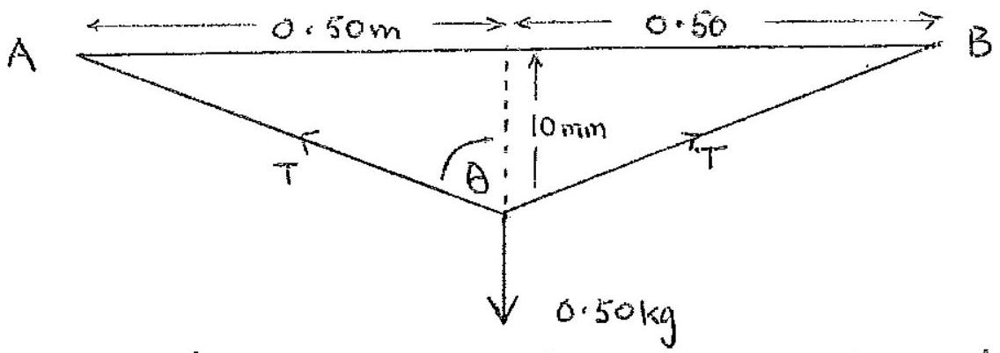
Increase in length of wire al gwen by, weng Rythagoras' theorem,

$$
\begin{aligned}
\Delta l & = 2 \sqrt { \left( 5 \times 10 ^ { - 1 } \right) ^ { 2 } + \left( 10 ^ { - 2 } \right) ^ { 2 } } - 1.00 \\
& = 2 \left( 5.0 \times 10 ^ { - 1 } \right) \sqrt { 1 + \left( \frac { 10 ^ { - 2 } } { 5 \times 10 ^ { - 1 } } \right) ^ { 2 } } - 1.00 \\
& = \sqrt { 1 + \left( \frac { 1 } { 50 } \right) ^ { 2 } } - 1.00 \\
& = \frac { 1 } { 2 } \left( \frac { 1 } { 50 } \right) ^ { 2 } + \cdots \quad \text { Using Birmial The or d } \\
& = 2.0 \times 10 ^ { - 4 i } \mathrm {~m} \\
\therefore & \frac { \Delta l } { l } = 20 \times 10 ^ { - 4 }
\end{aligned}
$$

Resolving forces

$$
\begin{align*}
2 T \cos \theta & = 0.50 ( 9.81 )  \tag{2}\\
2 T \frac { 10 } { \sqrt { ( 500 ) ^ { 2 } + ( 10 ) ^ { 2 } } } & = 0.50 ( 9.81 )  \tag{2}\\
2 T & = ( 0.50 ) ( 9.81 ) \sqrt { ( 50 ) ^ { 2 } + 1 } \\
T & \simeq ( 0.25 ) ( 50 ) ( 9.81 ) \\
& \simeq 122.6 \mathrm {~N} \tag{i}
\end{align*}
$$

Thus Young's modulus

$$
\begin{aligned}
& Y = \frac { \frac { 122.6 } { 10 ^ { - 6 } } } { 2.0 \times 10 ^ { - 4 } } \\
& Y = 6.1 \times 10 ^ { 11 } \mathrm { Nm } ^ { - 2 }
\end{aligned}
$$

(1)
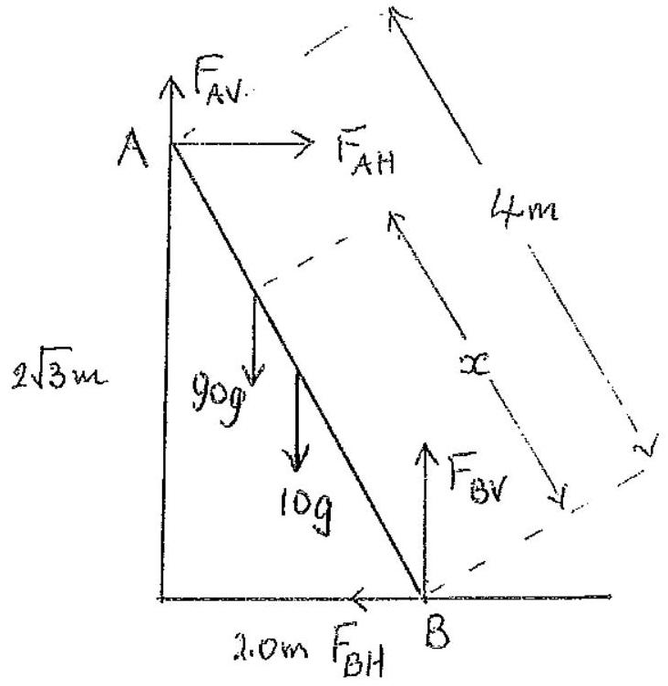
Diagram 2 marks; lake $\frac { 1 } { 2 }$ off for any missing forces
(ii) For smooth wall $F _ { A V } = 0$
Resolving vertically $F _ { B V } = 90 \mathrm {~g} + 10 \mathrm {~g} = 100 \mathrm {~g}$
Resotomy horgantally $F _ { B H } = F _ { A B }$
Taking moments about a

$$
2 \sqrt { 3 } F _ { O H } + 1 ( 10 g ) + ( 4 - x ) \frac { 1 } { 2 } ( 90 g ) - 2 F _ { B r } = 0
$$

Substatuting $F _ { B Y } = 100 \mathrm {~g}$

$$
\begin{align*}
& F _ { B x } = \frac { \left[ 200 - 10 - ( 4 - x ) \frac { 1 } { 2 } 90 \right] g } { 2 \sqrt { 3 } } \\
& F _ { B x } = \frac { ( 20 + 90 x ) g } { 4 \sqrt { 3 } } \tag{1}
\end{align*}
$$

If $\mu$ coeff. of freet...
Now $F _ { B H } \leqslant \mu F _ { B V }$
$\leqslant 100 \mu \mathrm {~g}$
Thus from (1)

$$
\mu \geqslant \frac { 20 + 90 x } { 100 ( 4 \sqrt { 3 } ) }
$$

For $x = 4.0 \mathrm {~m}$

$$
\mu \geqslant 0.55
$$

Minimum value of $\mu$ is 0.55

24

(1) At equalibrium, with spreng constantk, $k x _ { 1 } = M g$, where $\omega ^ { 2 } = \frac { k } { M }$ Giving
$$
\begin{align*}
& x _ { 1 } = \frac { M g } { k } = \frac { M g } { M \omega ^ { 2 } } \\
& x _ { 1 } = \frac { g } { \omega ^ { 2 } } \tag{2}
\end{align*}
$$
(ii) $$
\begin{aligned}
V & = \frac { 1 } { 2 } k \left( x + x _ { 1 } \right) ^ { 2 } - M g x \\
& = \frac { 1 } { 2 } M \omega ^ { 2 } \left( x + x _ { 1 } \right) ^ { 2 } - M g x \\
& = \frac { 1 } { 2 } M \omega ^ { 2 } \left( x + \frac { g } { \omega ^ { 2 } } \right) ^ { 2 } - M g x \\
& = \frac { 1 } { 2 } M \omega ^ { 2 } \left( x ^ { 2 } + \frac { 2 g x } { \omega ^ { 2 } } + \left( \frac { g } { \omega } \right) ^ { 2 } \right) \\
V & = \frac { 1 } { 2 } M \omega ^ { 2 } x ^ { 2 } + \frac { 1 } { 2 } M \left( \frac { g } { \omega } \right) ^ { 2 }
\end{aligned}
$$
✓ depends in $x ^ { 2 }$, not $x$, and $\frac { 1 } { 2 } M \left( \frac { 9 } { \omega } \right) ^ { 2 }$ is a constant
(iii) Max PE occurs when $x = A , p _ { 0 } V _ { \text {max } }$ given by
$$
V _ { \max } = \frac { 1 } { 2 } M \omega ^ { 2 } A _ { 1 } ^ { 2 } + \frac { 1 } { 2 } M \left( \frac { g } { \omega } \right) ^ { 2 }
$$
This occurs when velocity stationary. Changem PE from $x$ A: to $x = 0$ is from (A)
$$
\frac { 1 } { 2 } M \omega ^ { 2 } A _ { 1 } ^ { 2 }
$$
This is the KE at equalibrain position: $T _ { 1 } = \frac { 1 } { 2 } M \omega ^ { 2 } A _ { 1 } ^ { 2 }$ (velocity w. $A _ { 1 }$ )
Thus
$$
E _ { 1 } = V _ { \max } = \frac { 1 } { 2 } M \omega ^ { 2 } A _ { i } ^ { 2 } + \frac { 1 } { 2 } M \left( \frac { g } { \omega } \right) ^ { 2 }
$$
(iv) If ofter collision $M$ moving with velocaty $V _ { 1 }$ and $\frac { 1 } { 2 } M$ has velocity $V _ { 2 }$ Conservation of momentum
$$
M \left( A _ { 1 } \omega \right) = M V _ { 1 } + \frac { 1 } { 2 } M V _ { 2 } \quad \text { ie } A \omega = V _ { 1 } + \frac { 1 } { 2 } V _ { 2 }
$$
Conservation of energy
$$
\frac { 1 } { 2 } M \left( A _ { 1 } \omega \right) ^ { 2 } = \frac { 1 } { 2 } M v _ { 1 } ^ { 2 } + 1 M v _ { 2 } ^ { 2 } i e \left( A _ { 1 } \omega \right) ^ { 2 } = v _ { 1 } ^ { 2 } + \frac { 1 } { 2 } v _ { 2 } ^ { 2 }
$$
From these equations
$$
\left( A _ { i } \omega \right) ^ { 2 } = V _ { 1 } ^ { 2 } + \frac { 1 } { 2 } 4 \left( A _ { 1 } \omega - V _ { 1 } \right) ^ { 2 }
$$
thus
$$
3 V _ { 1 } ^ { 2 } - 4 V _ { 1 } \left( A _ { 1 } \omega \right) + \left( A _ { 1 } \omega \right) ^ { 2 } = 0
$$

(iv) Solving,
$$
\begin{aligned}
& V _ { 1 } = \frac { 1 } { 6 } \left[ 4 \left( A _ { 1 } \omega \right) \pm \sqrt { 16 - 12 } \left( A _ { 1 } \omega \right) \right] \\
& V _ { 1 } = \frac { 1 } { 6 } ( 4 \pm 2 ) A _ { 1 } \omega \\
& V _ { 1 } = A _ { 1 } \omega \text { or } \frac { 1 } { 3 } A _ { 1 } \omega
\end{aligned}
$$
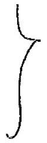
$V _ { 1 } = \frac { 1 } { 3 } A _ { i } \omega$ only acceptable solution if changed on collision Thus amplitude reduces to $A _ { 2 } = \frac { 1 } { 3 } A _ { 1 }$, as vel = amp $\times$ is
(v) New equilatrium position, $x _ { 2 }$, queen by
$$
\begin{aligned}
k x _ { 2 } & = \frac { 3 } { 2 } M g \\
x _ { 2 } & = \frac { 3 g } { 2 \omega ^ { 2 } } \quad \text { as } k = M \omega ^ { 2 }
\end{aligned}
$$
bonservation of momentom gives new velocity after colleain, u,
$$
\begin{aligned}
M \left( A _ { 1 } \omega \right) & = \frac { 3 } { 2 } M u _ { 2 } \\
u _ { 2 } & = \frac { 2 } { 3 } A _ { 1 } \omega
\end{aligned}
$$
Potential energy using (A, with M seplaced by $\left( \frac { 3 } { 2 } M \right)$ and $x _ { 2 } - x _ { 1 } = \frac { 9 } { 2 \omega ^ { 2 } }$, measured orow new
$$
\text { P.E. } = \frac { 1 } { 2 } \left( { } _ { 2 } ^ { 3 } M \right) \left( \frac { g } { 2 \omega ^ { 2 } } \right) ^ { 2 } + \frac { 1 } { 2 } \left( \frac { 3 } { 2 } M \right) \left( \frac { g } { \omega } \right) ^ { 2 }
$$
The KE after collesion: $\frac { 1 } { 2 } \left( \frac { 3 } { 2 } M \right) u _ { 2 } ^ { 2 } = \frac { 1 } { 2 } \left( \frac { 3 } { 2 } M \right) \left( \frac { 2 } { 3 } A _ { 1 } \omega \right) ^ { 2 }$
Equating total energy ai... velocity, ampletude $A _ { 2 }$, and following collision, measured from. eo equilatorium position
$$
\left. \begin{array} { c }
\frac { 1 } { 2 } \left( \frac { 3 } { 2 } M \right) w ^ { 2 } A _ { 2 } ^ { 2 } + \frac { 1 } { 2 } \left( \frac { 3 } { 2 } M \right) \left( \frac { 9 } { w } \right) ^ { 2 } - \frac { 1 } { 2 } \left( \frac { 3 } { 2 } M \right) \left( \frac { 2 } { 3 } A _ { 1 } \omega \right) ^ { 2 } + \frac { 1 } { 2 } \left( \frac { 3 } { 2 } M \right) \omega ^ { 2 } \left( \frac { 9 } { 2 } \omega ^ { 2 } \right) ^ { 2 } \\
+ \frac { 1 } { 2 } \left( \frac { 3 } { 2 } M \right) \left( \frac { 9 } { w } \right) ^ { 2 } \\
\frac { 1 } { 2 } \omega ^ { 2 } A _ { 2 } ^ { 2 } = \frac { 1 } { 2 } \omega ^ { 2 } \left( \frac { 9 } { 2 \omega ^ { 2 } } \right) ^ { 2 } + \frac { 1 } { 2 } \left( \frac { 2 } { 3 } A _ { 1 } \omega ^ { 2 } \right) ^ { 2 } \\
A _ { 2 } = \left[ \left( \frac { 9 } { 2 \omega ^ { 2 } } \right) ^ { 2 } + \left( \frac { 2 A _ { 1 } } { 3 } \right) ^ { 2 } \right] ^ { 1 / 2 }
\end{array} \right\}
$$

(a) (i) $Q = C V$
For $2.0 \mu \mathrm {~F}$ eapacitors:
$$
\begin{aligned}
120 \times 10 ^ { - 6 } & = 2.0 \times 10 ^ { - 6 } V _ { 1 } \\
V _ { 1 } & = 60 \mathrm {~V}
\end{aligned}
$$
For $4.0 \mu \mathrm {~F}$ cupacitar:
$$
\begin{aligned}
120 \times 10 ^ { - 6 } & = 4.0 \times 10 ^ { - 6 } \mathrm {~V} _ { 2 } \\
V _ { 2 } & = 30 \mathrm {~V}
\end{aligned}
$$
$\frac { 1 } { 2 }$
Connecting coffecestors
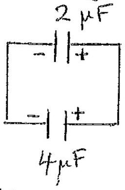
If charge $Q$ on $2 \mu F$ cupacitor and $240 - Q$ on $4 \mu F$ capacitor (conservation of charge) common potential $V _ { c }$ greven by
$$
V _ { c } = \frac { Q } { 2.0 \times 10 ^ { - 6 } } = \frac { 240 - Q } { 4.0 \times 10 ^ { - 6 } }
$$
Grving
$$
Q = 80 \mu C
$$
and $V _ { c } = 40 \mathrm {~V}$

(ii) Energy of a capacitar $= { } ^ { \prime } \frac { 1 } { 2 } C V ^ { \prime } = \frac { 1 } { 2 } Q V ^ { \prime }$
$$
\text { Initial total energy } = \frac { 1 } { 2 } \left( 120 \times 10 ^ { - 6 } \right) ( 60 + 30 ) = 5.4 \times 10 ^ { - 3 } \mathrm {~J}
$$
Final energy
$$
= \frac { 1 } { 2 } ( 40 ) ( 80 + 160 ) 10 ^ { - 6 } = 4.8 \times 10 ^ { 3 } \mathrm {~J}
$$
Energy lost due to heating of $6 \times 10 ^ { - 4 } \mathrm {~J}$

b) (1) The aurents are all reversed When $V$ reflaced by $- V$ the circuit is gust a ireflection of the original circuit. So companing cerrents in the refinal circuit and it reflection
$$
\begin{aligned}
& i _ { 2 } = i _ { 6 } \\
& i _ { 3 } = i _ { 5 } \\
& i _ { 4 } = - i _ { 4 }
\end{aligned}
$$
(ii) $\quad i _ { i } = \frac { V } { R }$
As $i _ { 4 } = - i _ { 4 } , \quad i _ { 4 } = 0$
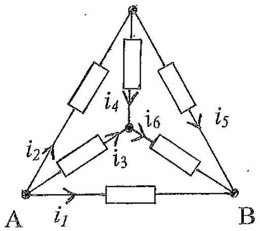
So
$$
\begin{aligned}
& i _ { 2 } = i _ { 6 } = \frac { V } { 2 R } \\
& i _ { 3 } = i _ { 5 } = \frac { V } { 2 R }
\end{aligned}
$$
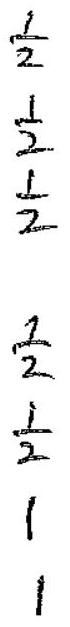
(iii) As $i _ { 4 } = 0,2 R , 2 R$ and $R$ are all in parallel with each other
$$
\text { Total resestance acciss } \begin{aligned}
A B & = \left( \frac { 1 } { 2 R } + \frac { 1 } { 2 R } + \frac { 1 } { R } \right) ^ { - 1 } \\
& = \frac { R } { 2 }
\end{aligned}
$$
(c)(i) Time emstant = $C R$
For $10 \mathrm { k } \Omega$
$$
\begin{aligned}
& C R = \left( 50 \times 10 ^ { 6 } \right) \left( 10 ^ { 4 } \right) = 0.5 \mathrm {~s} \\
& C R = \left( 50 \times 10 ^ { 6 } \right) ( 100 ) = 5.0 \times 10 ^ { - 3 } \mathrm {~s}
\end{aligned}
$$
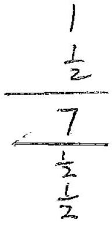
(11) 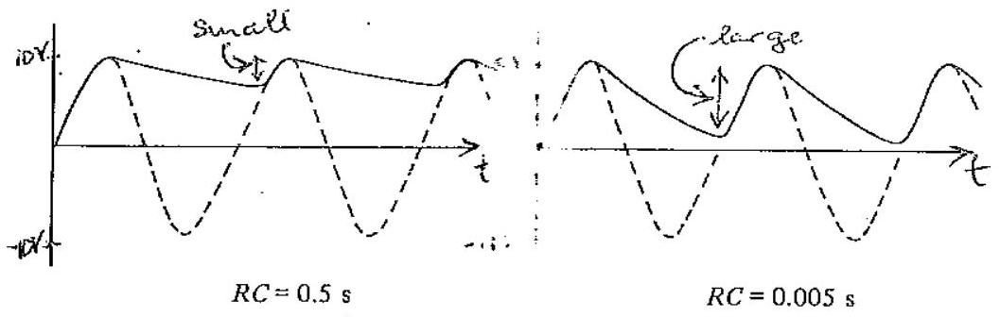
$$
1 + i = 2
$$
One mark for each graph carrect

S(C) (III)
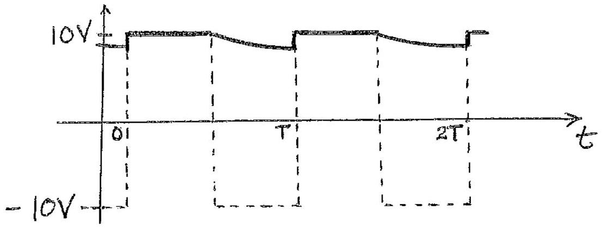
bapacitor will ducharge for halfa period, $\frac { T } { 2 }$ le $\frac { 1 } { 2 } \left( \frac { 1 } { 50 } \right) = 10 ^ { - 2 } \mathrm {~s}$
le $\overline { 2 } \left( \frac { 1 } { 50 } \right) = 10 \mathrm {~s}$
Voltage at time $t , V ( t ) = 10 e$
At $t = 10 ^ { - 2 } \mathrm {~s}$,

$$
\begin{aligned}
V & = 10 \exp \left( - \frac { 10 ^ { - 2 } } { 0.5 } \right) \\
& = 10 \exp ( - 0.02 ) \\
& = 9.782 \mathrm {~V}
\end{aligned}
$$

Fractarial change $= \frac { 0.218 } { 10 } = 0.022$

$$
\frac { 1 } { [ 7 ] }
$$

Q6 Using cosine rule in deagram,
l)
$$
\begin{aligned}
( A R ) ^ { 2 } & = D ^ { 2 } + \left( \frac { 1 } { 4 } \right) ^ { 2 } - 2 D \left( \frac { 1 } { 4 } \right) \cos 135 ^ { \circ } \\
& = D ^ { 2 } + \left( \frac { 1 } { 4 } \right) ^ { 2 } + \frac { 1 } { 2 } D \left( \frac { 1 } { 2 } \right) \\
( A R ) ^ { 2 } & = D ^ { 2 } + \left( \frac { 1 } { 4 } \right) ^ { 2 } + \frac { 1 } { 4 } \sqrt { 2 } D \\
( B R ) ^ { 2 } & = D ^ { 2 } + \left( \frac { 1 } { 4 } \right) ^ { 2 } - 2 \left( \frac { 1 } { 4 } \right) D \cos 45 ^ { \circ } \\
( B R ) ^ { 2 } & = D ^ { 2 } + \left( \frac { 1 } { 4 } \right) ^ { 2 } - \frac { 1 } { 4 } \sqrt { 2 } D
\end{aligned}
$$
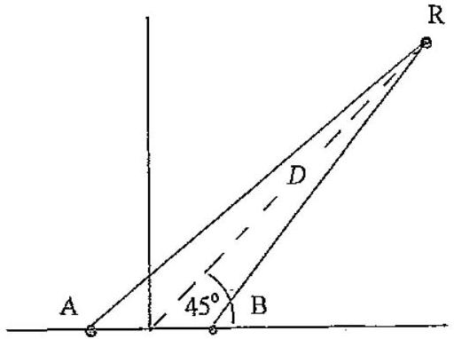
(1) $\quad t _ { A } = \frac { A R } { C _ { S } } = \frac { 1 } { C _ { S } } \left[ D ^ { 2 } + \left( \frac { 1 } { 4 } \right) ^ { 2 } + \frac { 1 } { 4 } \sqrt { 2 } D \right] ^ { \frac { 1 } { 2 } }$
(ii) $\quad t _ { B } = \frac { B R } { C _ { S } } = \frac { 1 } { C _ { S } } \left[ D ^ { 2 } + \left( \frac { 1 } { 4 } \right) ^ { 2 } - \frac { 1 } { 4 } \sqrt { 2 } D \right] ^ { \frac { 1 } { 2 } }$
b) Frequency emitted at time $t$ is $f = 10 t$
(i) Frequency reacking $R$ from $A$ will have been enitted at $\left( t - t _ { A } \right)$ Thus " " " " " $f _ { A } = 10 \left( t - t _ { A } \right) \quad \left( t _ { A } \right.$ queniby(1) $)$
(11) Similarly for $B , \quad f _ { B } = 10 \left( t - t _ { B } \right)$ ( $t _ { \text {B given by } }$ (2)) [4]
-) As $D \gg \frac { 1 } { 4 } m$ in (i) and (2), $\therefore$ and $B R$ are approximately equal to $D$. Thus $f _ { A }$ ind $f$ : are approximately equal to say, fab where.
$$
f _ { A B } = 10 \left( t - \frac { D } { C _ { s } } \right)
$$
The enor un 'D' Eerm
$$
\begin{aligned}
\Delta & = \pm d \cos 45 \\
& = \pm \frac { 1 } { 4 } \frac { \sqrt { 2 } } { 2 } \mathrm {~m} \\
& = \pm \frac { 1 } { 8 } \sqrt { 2 } \mathrm {~m}
\end{aligned}
$$
Thes accuracy in fAB
$$
\begin{aligned}
\Delta x & = \pm 10 \left( \frac { \sqrt { 2 } } { 8 } \right) \frac { 1 } { c _ { 5 } } \\
\Delta f ^ { 2 } & = \pm 1.77 \left( \frac { 1 } { c _ { 5 } } \right) \mathrm { Hz }
\end{aligned}
$$
cal Wavelength ' $\lambda$ given by
$$
\begin{equation*}
\lambda = \frac { C _ { s } } { f _ { A B } } = \frac { C _ { s } } { 10 \left( t - \frac { D } { C _ { s } } \right) } \tag{3}
\end{equation*}
$$

d) For itse first minimium the path olifference of the sorind reacking $R$ form And $B$ muct differ by $\lambda / 2$. So
ar
$$
\begin{aligned}
2 d \cos 45 ^ { \circ } & = \frac { 1 } { 2 } \lambda \\
4 d \left( \frac { \sqrt { 2 } } { 2 } \right) & = \lambda \\
& = \frac { c _ { s } } { 10 \left( t - p / c _ { s } \right) } \\
4 \left( \frac { 1 } { 4 } \right) \left( \frac { \sqrt { 2 } } { 2 } \right) 10 \left( t - \frac { D } { c _ { s } } \right) & = c _ { s }
\end{aligned}
$$
As $\hbar = 52.25$ and $D = 1200 \sqrt { 2 } \mathrm {~m}$,
$$
\begin{aligned}
10 \left( 52.2 - \frac { 1200 \sqrt { 2 } } { c _ { s } } \right) \frac { 1 } { \sqrt { 2 } } & = c _ { s } \\
396.1 c _ { s } - 1200 & = c _ { s } ^ { 2 } \\
c _ { s } ^ { 2 } - 396.1 c _ { s } + 1200 & = 0
\end{aligned}
$$
Solving
$$
\begin{aligned}
c _ { s } & = \frac { 1 } { 2 } \left[ 39601 \pm \sqrt { ( 39601 ) ^ { 2 } - 4 ( 1200 ) } \right] \\
& = 363 \mathrm {~ms} ^ { - 1 } \text { or } 33 \mathrm {~ms} ^ { - 1 }
\end{aligned}
$$
Only physically acceptable sotution is $c _ { \mathrm { s } } = 363 \mathrm {~ms} ^ { - 1 }$

(d) If No be the number of atoms intially present and tyears the age of the Earth For $U ^ { 238 }$
$$
N _ { 1 } ( t ) = N _ { 0 } e ^ { - x t }
$$
For $U ^ { 235 }$
$$
N _ { 2 } ( t ) = N _ { 0 } e ^ { - \beta t }
$$
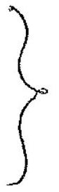
Then
$$
\frac { N _ { 1 } } { N _ { 2 } } = 140 = e ^ { - ( \alpha - \beta ) t }
$$
$$
\begin{aligned}
\ln ( 140 ) & = ( \beta - \alpha ) t \\
& = \ln 2 \left( \frac { 1 } { 7.13 \times 10 ^ { 8 } } - \frac { 1 } { 4.5 \times 10 ^ { 9 } } \right) t \\
\frac { \ln ( 140 ) } { \ln ( 2 ) } & = \frac { 1 } { 10 ^ { 9 } } \left( \frac { 10 } { 7.13 } - \frac { 1 } { 4.5 } \right) t \\
7.129 & = 10 ^ { - 9 } ( 1.4025 - 0.2222 ) t \\
7.129 & = 10 ^ { - 9 } ( 1.180 ) t \\
t & = 6.04 \times 10 ^ { 9 } \text { years }
\end{aligned}
$$
$$
\begin{aligned}
N & = N _ { 0 } e ^ { - \lambda t } \\
N ( 30 ) & = 4 \times 10 ^ { 5 } e ^ { - 30 \lambda } \\
& = \left( 4 \times 10 ^ { 5 } \right) \exp \left( - \frac { 30 } { 15 } \ln 2 \right) \\
& = \left( 4 \times 10 ^ { 5 } \right) \exp \left( - \frac { 1 } { 3 } \ln 2 \right) \\
& = \left( 4 \times 10 ^ { 5 } \right) \exp ( - 2 \mathrm { ca } 2 / 3 ) \\
& = \left( 4 \times 10 ^ { 5 } \right) 2 ^ { - 2 / 3 } \\
N ( 30 ) & = 2.52 \times 10 ^ { 5 } \text { By }
\end{aligned}
$$
2
Fraction of Mass Removed
Activity in $5 \times 10 ^ { - 3 } \mathrm {~m} ^ { 3 }$ of oil
$$
\frac { 126 } { 10 \times 60 } \left( \frac { 5.0 \times 10 ^ { - 3 } } { 10 ^ { 3 } \times 10 ^ { - 6 } } \right) = \frac { 126 } { 600 } ( 50 ) = \frac { 21 } { 2 } \mathrm {~Bq}
$$
Fraction of muss removed $= \frac { \frac { 21 } { 2 } } { 2.52 \times 10 ^ { 5 } } = 4.2 \times 10 ^ { - 5 }$
$$
\text { ie } \quad 4.2 \times 10 ^ { - 3 } \%
$$

c) $$
\begin{equation*}
N = N _ { 0 } e ^ { - \lambda t } \tag{A}
\end{equation*}
$$
where
$$
\begin{aligned}
\lambda & = \ln 2 / 70 \\
& = 0.00990 \mathrm {~s} ^ { - 1 }
\end{aligned}
$$
Subst tutuing
$$
N _ { 0 } = 82 \text { inits RHS of } A \text { gives }
$$
$$
\begin{aligned}
82 \exp ( - 210 ( 0.00990 ) ) & = 10.3 \\
& \neq 19
\end{aligned}
$$
Thus $N = 19$ and $N _ { 0 } = 82$ does not satisfy (*)
It there is a constant background of $k$ counts $s ^ { - 1 }$ then (A) quies
$$
( 19 - k ) = ( 82 - k ) \exp [ - 210 ( 0.00990 ) ]
$$
Giving
$$
\frac { 19 - k } { 82 - k } = 0.125
$$
(d) Here
$$
N = N _ { 1 } e ^ { - \lambda t } + N _ { 2 } e ^ { - \lambda _ { 2 } t } \quad \text { half共运 } \lambda _ { 2 } \ll \lambda _ { 1 } \gg T _ { 1 }
$$
For times $t \gg T _ { 1 }$ the main source of radioactivity would be due to the second source. Then
$$
N \simeq N _ { 2 } e ^ { - \lambda _ { 2 } t }
$$
Taking measurement and ploting $\ln N$ appain'st $t$ will give $\lambda _ { 2 }$ and hence $T _ { 2 } = \ln 2 / \lambda _ { 2 }$.

l)

$$
\begin{aligned}
g & = \frac { G M _ { E } } { R _ { E } ^ { 2 } } \\
& = \frac { \left( 6.67 \times 10 ^ { - 11 } \right) \left( 5.97 \times 10 ^ { 24 } \right) } { \left( 0.638 \times 10 ^ { 7 } \right) ^ { 2 } } = G \left( 1.4667 \times 10 ^ { 11 } \right) \\
g & = 9.78 \mathrm {~ms} ^ { - 1 }
\end{aligned}
$$

b) IST SOLUTION

$$
\begin{aligned}
& g = \frac { G M } { R ^ { 2 } } \\
& \Delta g = \frac { G \Delta M } { R ^ { 2 } } + ( - 2 ) \frac { G M \Delta R } { R ^ { 3 } } \\
& \frac { \Delta g } { g } = \frac { \Delta M } { M } - \frac { 2 \Delta R } { R }
\end{aligned}
$$

Now

$$
\begin{aligned}
\frac { \Delta R } { R } & = \frac { - 15 \times 10 ^ { 3 } } { 6.38 \times 10 ^ { 6 } } \\
& = - 2.35 \times 10 ^ { - 3 }
\end{aligned}
$$

Thus

$$
\begin{aligned}
& \frac { \Delta g } { g } = - 3.47 \times 10 ^ { - 3 } . \\
& \frac { \Delta g } { g } = + 1.23 \times 10 ^ { - 3 }
\end{aligned}
$$

(one of the marks for moting in coinse mg + Vesign. or for numerical value

2ND AITERNATION SEUTTON

$$
\begin{equation*}
g = \frac { G M _ { E } } { R ^ { 2 } } = 1.466 : \times 10 ^ { 11 } \mathrm { G } \tag{1}
\end{equation*}
$$

At 15 km

$$
\begin{equation*}
g _ { 15 } = \frac { G \left[ 5.97 \times 10 ^ { 24 } - 4 \pi \left( - .88 \times 10 ^ { 6 } \right) ^ { 2 } \left( 15 \times 10 ^ { 3 } \right) \left( 2.7 \times 10 ^ { 3 } \right) \right. } { \left( 6.38 \times 10 ^ { 6 } - 15 \times 10 ^ { 3 } \right) ^ { 2 } } \tag{2}
\end{equation*}
$$

$$
\left. \begin{array} { l }
= \frac { G \left[ 5.97 \times 10 ^ { 24 } - 2.0716 \times 10 ^ { 22 } \right] } { \left( 6.365 \times 10 ^ { 6 } \right) ^ { 2 } } \\
= \frac { G 5.949 \times 10 ^ { 24 } } { 40.57 \times 10 ^ { 12 } } \\
= G \left( 1.4684 \times 10 ^ { 11 } \right)
\end{array} \right\}
$$

From (1)

$$
\begin{aligned}
& \Delta g = + G \left( 1.8 \times 10 ^ { 8 } \right) \\
& \frac { \Delta g } { g } = + \frac { 1.8 } { 1.47 } \times 10 ^ { - 3 } = + 1.23 \times 10 ^ { - 3 }
\end{aligned}
$$

twark for tue Segulinceroseing 1 mark for magnitude
[7]

c)

$$
\Delta g = \frac { G \frac { 4 } { 3 } \pi \left( 2.5 \times 10 ^ { 3 } \right) ^ { 3 } ( 7.9 - 2.7 ) 10 ^ { 3 } } { \left( 2.5 \times 10 ^ { 3 } \right) ^ { 2 } }
$$

$$
\}
$$

$$
\frac { \Delta g } { g } = + 3.71 \times 10 ^ { - 4 }
$$

magentude 1 mork segn, increasening $\frac { 1 } { 2 }$ mork $J$
$1 \frac { 1 } { 2 }$

1) If spherical solume of wan removed

$$
\begin{aligned}
\Delta g & \left. = - \frac { G \left( \frac { 4 } { 3 } \pi \right) \left( 2.5 \times 10 ^ { 3 } \right) ^ { 3 } 7.9 } { \left( 2.5 \times 10 ^ { 3 } \right) ^ { 2 } } \right\} \quad 1 \frac { 1 } { 2 } \\
& = - G \left( \frac { 4 } { 3 } \pi \right) \left( 2.5 \times 10 ^ { 3 } \right) 7.9 \\
& = - \left( 6.67 \times 10 ^ { - 11 } \right) \left( \frac { 4 } { 3 } \pi \right) \left( 2.5 \times 10 ^ { 3 } \right) 7.9 \\
& = - 5.52 \times 10 ^ { - 6 } \quad 1 \\
\frac { \Delta g } { g } & \left. = - 5.64 \times 10 ^ { - 7 } \quad \frac { \text { imark for-ve sign } } { 1 \text { mark inagnitude } } \right\} 1 \frac { 1 } { 2 }
\end{aligned}
$$

(a) (i)

$$
\begin{aligned}
\frac { G _ { M E } } { \left( R _ { E M } - R _ { M F } \right) ^ { 2 } } & = \frac { G _ { M M } } { R _ { M F } ^ { 2 } } \\
\frac { R _ { E M } - R _ { M F } } { R _ { M F } } & = \left( \frac { M _ { E } } { M _ { M } } \right) ^ { \frac { 1 } { 2 } } \\
& = \left( \frac { 5.97 \times 10 ^ { 24 } } { 7.35 \times 10 ^ { 22 } } \right) ^ { \frac { 1 } { 2 } } \\
& = 9.01 \\
R _ { E M - R _ { M F } } & = 9.01 R _ { M F } \\
10.01 R _ { M F } & = R _ { E M } = 3.84 \times 10 ^ { 5 } \mathrm {~km} \\
R _ { M F } & = 3.84 \times 10 ^ { 4 } \mathrm {~km}
\end{aligned}
$$

(" )

$$
\begin{aligned}
\frac { G _ { M } M _ { E } } { R _ { E M } - R _ { M P } } & = \frac { G _ { M M } } { R _ { M P } } \\
\frac { R _ { E M } - R _ { M P } } { R _ { M P } } & = \frac { M _ { E } } { M _ { M } } \\
& = \frac { 5.97 \times 10 ^ { 24 } } { 7.35 \times 10 ^ { 22 } } = 8.12 \times 10 \\
R _ { E M } & = R _ { M P } ( 82.2 ) = 3.84 \times 10 ^ { 5 } \\
R _ { M P } & = 4.67 \times 10 ^ { 3 } \mathrm {~km}
\end{aligned}
$$

(b) Let $v$ he the velocity of impact on hemar surface and $M _ { R }$ the mass of the rocket. All $R _ { \text {MF } }$ rocket has zero velocity of it has the minimum energy to enable it to reach the Moon. Conservation of energy requires

$$
\begin{gathered}
- G M _ { R } M _ { M } \left[ \frac { 1 } { R _ { M F } } \right] - G M _ { R } M _ { E } \left[ \frac { 1 } { R _ { E M } R _ { M F } } \right] = \frac { 1 } { 2 } M _ { R } v ^ { 2 } - G M _ { R } M _ { M } \left[ \frac { 1 } { R _ { M } } \right] - G M _ { R } M _ { E } \left[ \frac { 1 } { R _ { E M } - R _ { M } } \right] \\
v = \sqrt { 2 G \left[ M _ { M } \left( \frac { 1 } { R _ { M } } - \frac { 1 } { R _ { M F } } \right) + M _ { E } \left( \frac { 1 } { R _ { E M } - R _ { M } } - \frac { 1 } { R _ { E M } - R _ { M F } } \right) \right.}
\end{gathered}
$$

(c) For a stable orbit raduis, velocity $v _ { s }$, of safellite mass $m _ { s }$ (inglecting uffience of Earth's gravitational field)
$$
\begin{aligned}
\frac { m _ { s } V _ { s } ^ { 2 } } { r } & = \frac { G m _ { s } M _ { M } } { r ^ { 2 } } \\
V _ { s } & = \left( \frac { G M _ { M } } { r } \right) ^ { \frac { 1 } { 2 } } \\
& = \left[ \frac { \left( 6.67 \times 10 ^ { - 11 } \right) \left( 7.35 \times 10 ^ { 22 } \right) } { \left( 10 + 1.74 \times 10 ^ { 3 } \right) 10 ^ { 3 } } \right] ^ { \frac { 1 } { 2 } } \\
& = \left( \frac { 4.90 \times 10 ^ { 12 } } { 1.75 \times 10 ^ { 6 } } \right) ^ { 1 / 2 } \\
V _ { s } & = 1.67 \mathrm { kms } ^ { - 1 }
\end{aligned}
$$
(d) Neglectry the inflience of the Earth's Gravitational field Orbital KE, $T _ { 0 }$, is given by
$$
\begin{aligned}
& T _ { 0 } = \frac { 1 } { 2 } m _ { s } V _ { s } ^ { 2 } = \frac { 1 } { 2 } ( 1000 ) \left( 1.67 \times 10 ^ { 3 } \right) ^ { 2 } \\
& T _ { 0 } = 1.40 \times 10 ^ { 9 } \mathrm {~J}
\end{aligned}
$$
$P _ { s } E _ { s }$ lost in decending to Moon's surface, Kat uncreases the KEE,
$$
\left. \begin{array} { r l }
V _ { D } & = G M _ { M } m _ { S } \left[ \frac { 1 } { 7.74 \times 10 ^ { 6 } } - \frac { 1 } { 1.75 \times 10 ^ { 6 } } \right] \\
& = \left( 6.67 \times 10 ^ { - 11 } \right) \left( 7.35 \times 10 ^ { 22 } \right) \left( 10 ^ { 3 } \right) \left( \frac { 10 ^ { 4 } } { ( 1.74 ) \left( 1.7510 ^ { 12 } \right. } \right) \\
& = 4.90 \times 10 ^ { 15 } \left( 3.28 \times 10 ^ { - 9 } \right) \\
& = 1.61 \times 10 ^ { 7 } \mathrm {~J}
\end{array} \right\}
$$
Thus to 2 . sig. figs energy to be extracted is
$$
E _ { \text {min } } = 1.42 \times 10 ^ { 9 } J . \quad \left( a 1.40 \times 10 ^ { 9 } + 1.61 \times 10 ^ { 7 } J \right) \frac { 1 } { [ 5 ] }
$$
