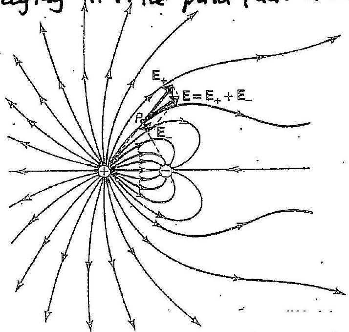
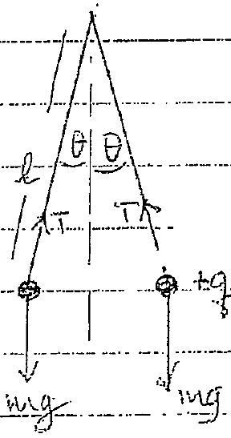
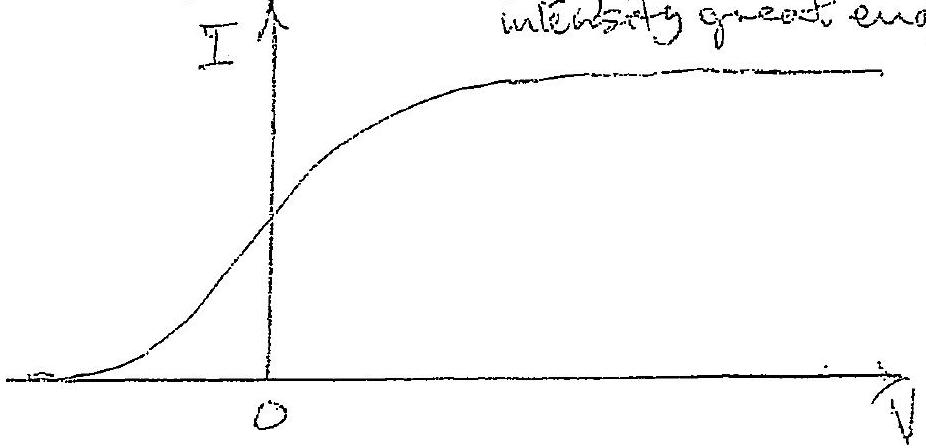
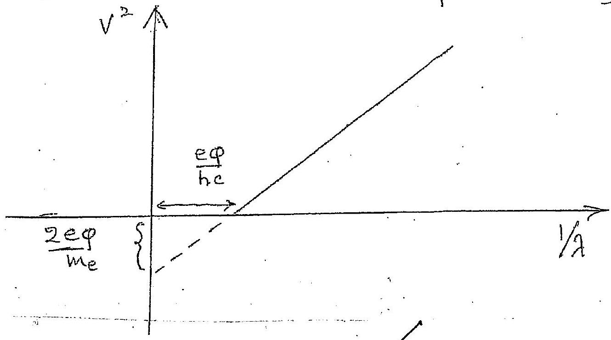
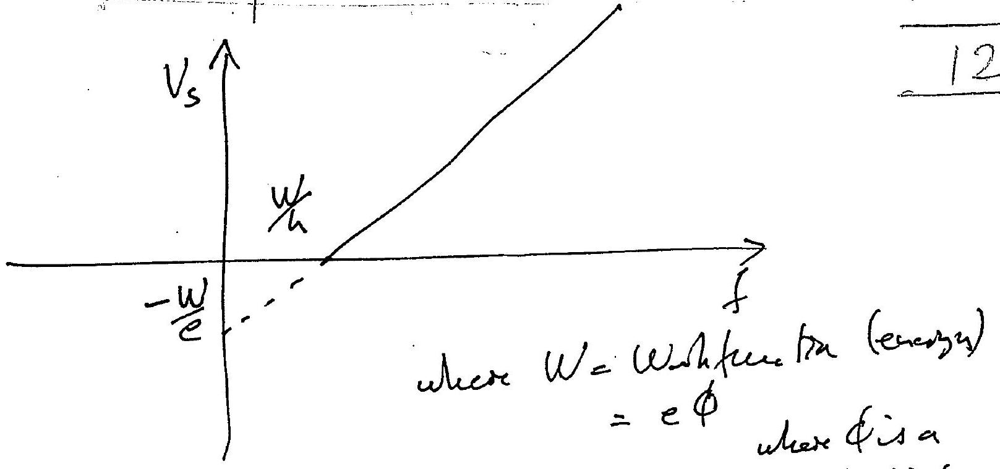
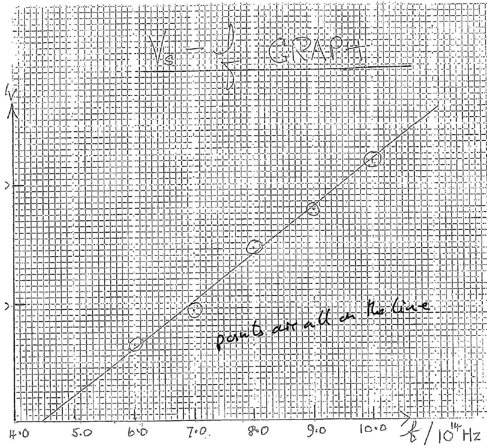
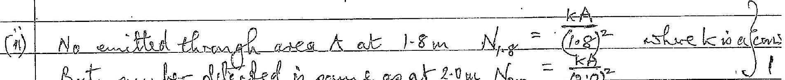

2011 BPLO Percer 2

(a) $$
\begin{aligned}
\therefore P V & = m R T \\
( 10 ) V & = m R ( 288 ) \\
P V & = \frac { 1 } { 2 } n R ( 273 + 65 ) \\
P & = \frac { 1 } { 2 } \frac { m R } { V } ( 338 ) \\
& = \frac { 1 } { 2 } \left( \frac { 10 } { 288 } \right) ( 338 )
\end{aligned}
$$
(b) $R _ { A B } = \left( \frac { 1 } { R _ { 1 } } + \frac { 1 } { R _ { 2 } } \right) + R _ { 3 }$
$$
\therefore \begin{aligned}
& R _ { 1 } = \frac { R _ { 1 } R _ { 2 } } { R _ { 1 } + R _ { 2 } } + R _ { 3 } \\
& R _ { 1 } \left( R _ { 1 } + R _ { 2 } \right) = R _ { 3 } R _ { 2 } + R _ { 3 } \left( R _ { 1 } + R _ { 2 } \right) \\
& R _ { 1 } ^ { 2 } = R _ { 3 } \left( R _ { 1 } + R _ { 2 } \right) \\
& R _ { 3 } = \frac { R _ { 1 } ^ { 2 } } { R _ { 1 } + R _ { 2 } }
\end{aligned}
$$
(c) An electricfied lime is almi that at every print alongit the tangent is parallel to the field vector at that prient. (give l math for saying it is the path that a clased pother we led bate)

(d) The is the equal to the tension withe cable at its support. If Tio the thesia and ve are man of its cable the equilariture of the cable requ
(i) $$
\begin{aligned}
2 T \sin 30 & = M g \\
2 T \left( \frac { 1 } { 2 } \right) & = 100 ( 9.81 )
\end{aligned}
$$

Q1
(d) (ii) At the doubt point let terrain be $T _ { a }$. By symmetry to hougienter Rosoloung horizontally for on - helf of the cable
$T \cos 30 = T _ { 0 }$

$$
\begin{aligned}
& T _ { 0 } = 981 \left( \frac { \sqrt { 3 } } { 2 } \right) \\
& T _ { 0 } = 850 \mathrm {~N}
\end{aligned}
$$

(e) (i) Rotation specid in radeais/umin $= \frac { 2 \pi } { 24 \times 60 }$

Speed of spote

$$
= \frac { - 24 \times 60 } { 21 \times 60 } \frac { 10 ^ { - 3 } } { 4.36 } , \text { cans } / \mathrm { min }
$$

$= 43.6$ cans $/ \mathrm { min }$
(Als. solusbmoni or $2.62 \mathrm {~m} / \mathrm { hr }$ )
(sive full malh, for dist $= 10 \tan \theta \mathrm {~m}$ )
(ii) Image in merior 20.0 m from 2 de in culung Speed of spat is twice that wi ani to (i)
$= 8.73 \mathrm { cms } / \mathrm { min }$
(f)
(i) Electrons (ex \& He s), contil electorn mentions $\frac { 1 } { 2 } + \frac { 1 } { 2 } =$
(ii) 20 protems

22 mentrons
19 electrons
(g) Bondetion for constructure initerference, on there is ampodetion plase change of II at air gluss auface

$$
\begin{aligned}
2 t \mu & = \left( n + \frac { 1 } { 2 } \right) \lambda ^ { 2 } \\
2 ( 1.52 ) \left( 0.42 \times 10 ^ { - 6 } \right) & = \frac { \left( n + \frac { 1 } { 2 } \right) \lambda } { \lambda } = \frac { 2 ( 1.52 ) \left( 0.42 \times 10 ^ { - 6 } \right) } { \left( n + \frac { 1 } { 2 } \right) } \\
\lambda _ { 1 } & = 851 \mathrm {~mm} \\
\lambda _ { 2 } & = 51 \mathrm {~mm} \\
\therefore \lambda _ { 3 } & = 365 \mathrm {~mm}
\end{aligned}
$$

The only-visible we rueleug ith or $\lambda _ { 0 } = 5 \pi \mathrm {~mm}$

(h) (Wavelength, 1,5 twice length If chard $= 2.4 \mathrm {~m}$
Mass per emet lingth ma $= \frac { 0.13 } { 102 } = 0.1083 \mathrm { kgm } ^ { - 1 }$
Tenscein wi chord $F = 50 \mathrm {~g} = 50 ( 9.81 ) \mathrm { N }$
Frequency of green by
$$
\begin{aligned}
& f \lambda = \sqrt { \frac { F } { m } } = \sqrt { \frac { 50 ( 9.81 ) } { 0.1083 } } \\
& f = \frac { 1 } { 2.4 } \sqrt { \frac { 50 ( 9.81 ) } { 0.1083 } } \\
& f = 284 z
\end{aligned}
$$
Penod
$$
T = \frac { 1 } { 28 } = 0.036 \mathrm {~s}
$$
(ii) Ampletude, A, and max, weldrity, Vaelated by
$$
\begin{aligned}
V & = A \omega \\
A & = \frac { r } { 2 \pi f } \\
& = \frac { 15 } { 2 \pi ( 28 ) } \\
A & = 8.5 \mathrm {~cm}
\end{aligned}
$$
(iii) Penot $T _ { 1 } = 2 \pi \sqrt { \frac { l } { g } } = 2 \pi \sqrt { \frac { 1 \cdot 2 } { 9 \cdot 81 } }$
$$
T _ { 0 } = 2 \times 2 \mathrm {~s}
$$
(ii) $\quad \frac { T } { T _ { 0 } } = 0.16$
Assumption protfied as $T _ { 0 } \gg T$
(i) Energy conservetron
$$
\begin{equation*}
\frac { 1 } { 2 } M u ^ { 2 } = \frac { 1 } { 2 } M v ^ { 2 } + \frac { 1 } { 2 } m \omega ^ { 2 } \tag{1}
\end{equation*}
$$
Momentom conservation
$$
\begin{equation*}
M w = M r + m w \tag{2}
\end{equation*}
$$

Ploof
From (1)

$$
\begin{align*}
M \left( u ^ { 2 } - v ^ { 2 } \right) & = m u ^ { 2 } \\
M ( u - v ) ( u + v ) & = m u ^ { 2 }  \tag{3}\\
M ( u - v ) & = m u
\end{align*}
$$

Sub's (4) inta (3)

$$
a + r = w
$$

(i) Versention netemative method in place of Proof

If $u + v = w$, then from (2)

$$
\begin{equation*}
( u - v ) = \frac { m } { M } \omega \tag{6}
\end{equation*}
$$

Now letris determine if this is consestent writh (1)
Frome (1)

$$
\begin{equation*}
u ^ { 2 } - v ^ { 2 } = \frac { m } { M } w ^ { 2 } \tag{7}
\end{equation*}
$$

Ving (5) + (6) wits of (7) grais

$$
\left( u ^ { 2 } - v ^ { 2 } \right) = ( u + v ) ( u - v ) = \frac { m } { m } w ^ { 2 }
$$

However RHS of (7) also gries this revalt, $\frac { m } { m } \omega ^ { 2 }$. Thus will assimiption $u + v = w$ the epuations for evergy a-n momentam conservation are conscotent.
(ii) $R = \frac { \pi } { u }$
Sub9 (6)

$$
\begin{equation*}
R = \frac { m \omega } { M u } \tag{-8}
\end{equation*}
$$

(iii) Subi , $v = i v - u$ into (6)

$$
\begin{aligned}
2 u - w & = \frac { \frac { m } { M } w } { M } \\
2 u & = \left( \frac { M + m } { M } \right) w
\end{aligned}
$$

Sub' into (S)

$$
R = \frac { 2 m } { M + m }
$$

(j) Using notestion with diagram, Resoloung weatically ferth force on one Ofter batto

$$
\begin{equation*}
T \cos \theta = m g = 5.00 \times 10 ^ { - 3 } ( 9.81 ) \tag{1}
\end{equation*}
$$

Reodong Rayartelly for forces on are ball

$$
\begin{align*}
T \sin \theta & = \frac { q } { 4 \pi \varepsilon _ { 0 } ( 2 \operatorname { sen } \theta ) ^ { 2 } } \\
& = \frac { \left( 1.00 \times 10 ^ { - 6 } \right) ^ { 2 } } { 4 \pi ( 8.85 ) \times 10 ^ { - 2 } ( 2 \ln 36 ) ^ { 2 } } \tag{2}
\end{align*}
$$

diay

(j) Dividing (objer) and substututing $h = 1.00 \mathrm {~m}$

$$
\begin{aligned}
\tan \theta \cdot \sin ^ { 2 } \theta & = \frac { \left( 1.00 \times 10 ^ { - 6 } \right) ^ { 2 } } { \operatorname { Li\pi } \left( 8.55 \times 10 ^ { - 12 } \right) 4 \left( 5.00 \times 10 ^ { - 3 } \right) ( 9.81 ) } \\
& = 0.0459
\end{aligned}
$$

Subshituting $\theta = \frac { 1 } { 2 } \left( 4.100 ^ { \circ } \right) = 20.5 ^ { \circ } \quad$ LHS = RHS
There $\theta = 20.5 ^ { \circ }$ is a solution
Q1 (k)

$$
\begin{aligned}
\text { Resurve of mitragen geas } & = ( 7509 - 62.2 ) = 13.7 \text { cens of } 11 g \text { } 1 \\
& = 0.080 \mathrm {~A} \\
& = 0.080 \pi \left( \frac { 0.0065 } { 2 } \right) ^ { 2 } \text { A area of coreasect } 1
\end{aligned}
$$

if there a me men of notiegen gen, goo ugenation genes

$$
\left( \frac { 137 } { 100 } \right) \rho g ( g + 137 ) 10 ^ { - 2 } \pi \left( \frac { 0.0065 } { 2 } \right) ^ { 2 } = n R ( 273 + 15 )
$$

generity of 142

$$
\begin{aligned}
& \left( 1.37 \times 10 ^ { - 1 } \right) \left( 1.35 \times 10 ^ { 4 } \right) ( 9.81 ) \left( 2101 / 0 ^ { - 2 } \pi \left( \frac { 1.006 .5 } { 2 } \right) \right. = \mu R ( 2731 ) \\
& = \mu R ( 2.88 ) \\
& \left. \left( 1.37 \times 10 ^ { - 1 } \right) \left( 1.85 \times 10 ^ { 10 } \right) ( 9.81 ) \left( 21.7 \times 10 ^ { - 2 } \right) \right) ^ { \left( \frac { 0.0065 } { 2 } \right) ^ { 2 } } = 288 ( 8.31 ) \mu
\end{aligned}
$$

Their grees

$$
\begin{aligned}
n & = 5.46 \times 10 ^ { - 5 } \\
\text { luas of nitrogen } & = 14 \mathrm {~m} \cdot \mathrm {~g} \\
& = 7.6 \times 10 ^ { - 4 } \mathrm {~g}
\end{aligned}
$$

(1) Forerar $= \frac { 1 } { 2 } C ( 2 E ) ^ { 2 } = 2 C E ^ { 2 }$
(i) Energy ased = charge $x$ potential

$$
= ( 2 C E ) \times ( 2 E ) = 4 C E ^ { 2 }
$$

Energy Lost $= 4 C E ^ { 2 } - 2 C E ^ { 2 }$

$$
= 2 C E ^ { 2 }
$$

(iii) Correcure in Two Scaces

$$
\begin{aligned}
\text { Total work done is list STACE } & = \triangle Q ( E ) \\
& = ( C E ) ( E ) = C E ^ { 2 }
\end{aligned}
$$

(d) (III) Far seemend strage

Work dare $= ( \Delta Q ) ( 2 E )$

$$
\begin{aligned}
& = ( C E ) ( 2 E ) \\
& = 2 C E ^ { 2 }
\end{aligned}
$$

Tobal wark done $= C E ^ { 2 } + 2 C E ^ { 2 } = 3 C E ^ { 2 }$

$$
\begin{aligned}
\text { Thus everythent } & = 3 C E ^ { 2 } - 2 C E ^ { 2 } \\
& = C E ^ { 2 }
\end{aligned}
$$

Truns less energy lost by ohagong withos fages
(iii) Frequencis good by

$$
\begin{aligned}
f _ { 1 } & = \frac { 1 } { 2 \pi } \sqrt { \frac { k } { m _ { 1 } } } = \frac { 1 } { 2 \pi } \sqrt { \frac { k } { m _ { 2 } } } \\
& = \frac { 1 } { 2 \pi } \sqrt { \frac { 39.48 } { 2 \pi } } \sqrt { \frac { 39.48 } { 1.10 } } \\
& = 1.054 \mathrm {~Hz} \\
& = 0.953 \mathrm {~Hz} \\
T & = \frac { 1 } { 0.10 } = 0.953 = 0.10 \mathrm {~Hz}
\end{aligned}
$$

(n) Let $n$ be the number of complete resolution, there equature heal generated to wave deve:

$$
\begin{aligned}
( 0.4 ) \left( 0.35 \times 10 ^ { 3 } \right) 5 & = 20 ( 0.25 ) \leadsto \\
u & = 140
\end{aligned}
$$

(8) thouphic heasure = usefult of aturepher celour a syme mets

$$
\begin{aligned}
1.01 \times 10 ^ { 5 } & = 1.23 t _ { g } \\
t & = \frac { 1.01 \times 10 ^ { 5 } } { 1.23 ( 9.81 ) }
\end{aligned}
$$

$t =$ heaft of atm

$$
t = 8.37 \times 10 ^ { 3 } \mathrm {~m}
$$

(a) (1) The prototectre effect owers when a polotor of fraquancy of and everyty hf mitracts with an electron in a natal, offenan alkaliznebal, givening up to enargy to the (1) ctector. If the electron has ruffecent wergy to overcame the potentual ban-ier of the metal, which dra metal with work function of is eg, it will 'everbe' from the mebal. Thus photows, of eight or Enr, incidantan a metal, with affrifi-ecte feequences, can expel electrons from the metal. The incident photon repends am encigis hf $>$ ecp. $\quad$ If $> W$ worl feenstive (2) to expelielectron from the metal, with $v$, the electrons welouity, bening greater than zero. If however
$$
e . p > h f
$$
no electrons are emilted. The witical frequency is $f _ { 0 }$, where $h f _ { 0 } = \exp$.
(ii) leousewation of energy diquires, for an electron,
$$
\frac { 1 } { 2 } m _ { e } v ^ { 2 } = - h f - e q = e V _ { s } V _ { s }
$$
sleppling polecention ${ } ^ { 2 }$
(iii) Closseally EmR is a wave, not a becam of photorpantides: The election can, according to the wave theory absarb any quantity of Exr. When it has aborbed sufficient $h$ viccomethi potential barrier eg, it will -escript from the metal. This or prosideffar all incident frequencies. Note that inthe quantion theorig only ane photon can interact with one electron. Thus if fo no electrons can lee emitted - put doasseally this alord be possible it amplitz
(iv) 

QT

(a) (v) $\operatorname { Fram }$ (ii) $\frac { 1 } { 2 } \operatorname { me } v ^ { 2 } = f f - e c \rho$
As $f = \frac { e } { \lambda }$, thei becomes $\frac { 1 } { 2 } m _ { e } v ^ { 2 } = \frac { h e } { \lambda } - e p$
Plotug $v ^ { 2 }$ against $\left( \frac { 1 } { \lambda } \right)$ geweo a straight lue gradient $\left( \frac { 2 h _ { e } } { u _ { l _ { e } } } \right)$
and inbercept
$$
\left( - \frac { 2 e p } { w _ { e } } \right)
$$
onthe $v ^ { 2 }$-axis, or
$$
\left( \frac { e \phi } { h c } \right)
$$
on the $\left( \frac { 1 } { \lambda } \right)$ axis. Hence determin $\varphi$

$\sigma \cdot$
 potantial.

QT

(b) Plot a graph of $V _ { s }$ against f.
$$
\begin{equation*}
e v _ { 3 } = - h f - e c p \tag{1}
\end{equation*}
$$
Marks
Graph correctly drawn, producuing a straight line In term of threak ld frequency $f _ { 0 }$, (1) groes
$$
\begin{aligned}
e V _ { s } & = h f - h f _ { 0 } \\
V _ { s } & = \left( \frac { h } { e } \right) f - \left( \frac { h } { e } \right) f _ { 0 }
\end{aligned}
$$
is Gradient (he) and $f = \frac { f } { f }$ when $V _ { s } = 0$ (Ailse $V _ { s } = \bar { e }$ for cohour ty
$$
\frac { f } { f 0 } = ( 4 \cdot 4 \pm 0.1 ) 10 ^ { 14 } \mathrm {~Hz}
$$
Gorrect value Equarestenate
Crracint $\frac { \Delta v _ { s } } { \Delta f } = ( 4.0 \pm 0.1 ) 10 ^ { 15 } \mathrm { vs }$
berrect value v.s Fros estuniate
$$
h = e \frac { \Delta s } { \Delta f } = 6.4 \times 10 ^ { - 34 } \sqrt { s }
$$
learnect value

(a) If $r _ { 0 }$ speced in antit then tor curcular motion
$$
\begin{align*}
\frac { m v _ { 0 } ^ { 2 } } { \left( R _ { E } + l \right) } & = \frac { G M _ { E } m } { \left( R _ { E } + l \right) ^ { 2 } } \\
v _ { 0 } ^ { 2 } & = \frac { G M _ { E } } { \left( R _ { E } + l \right) } \tag{1}
\end{align*}
$$
K.E. in arbit $T$ gream by
$$
T = \frac { 1 } { 2 } m v _ { 0 } ^ { 2 }
$$
Total energy in anate
$$
\begin{align*}
E _ { 0 } & = \frac { 1 } { 2 } m v _ { 0 } ^ { 2 } - \frac { G _ { M _ { E } m } } { \left( R _ { E } + l \right) } \\
& = - \frac { 1 } { 2 } \frac { G _ { M _ { E } m } } { \left( R _ { E } + l \right) } \tag{1}
\end{align*}
$$
ON IMPACT ENERGY EI Guven BY
$$
\begin{aligned}
& E _ { I } = \frac { 1 } { 2 } m v ^ { 2 } - \frac { G M E M } { R E } \\
& E _ { I } = \frac { 1 } { 2 } m \left( 2 \times 10 ^ { 3 } \right) ^ { 2 } - \frac { G M E M } { R _ { E } }
\end{aligned}
$$
Energy absorbed Ex
$$
\begin{aligned}
E _ { A } & = E _ { 0 } - E _ { I } \\
& \left. = - \frac { 1 } { 2 } \frac { G _ { - M _ { E } m } } { \left( R _ { E } + l \right) } - \left( \frac { 1 } { 2 } m \left( 2 \times 10 ^ { 3 } \right) ^ { 2 } - \frac { G _ { - } M _ { E } m } { R _ { E } } \right) \right) ! \\
& = - \frac { G M E _ { m } } { 2 } \left[ \frac { 1 } { R _ { E } + l } - \frac { 1 } { R _ { E } } \right] - \frac { 1 } { 2 } m \left( 2 \times 10 ^ { 3 } \right] ^ { 2 } \\
& \left. = \frac { \left( 6.47 \times 10 ^ { - 1 } \right) \left( 5.97 \times 10 ^ { - 4 } \right) ( 500 ) } { 2 } \left[ \frac { - 10 ^ { - 7 } } { 0.743 } + \frac { 2 \times 10 ^ { - 7 } } { 0.683 } \right] - \frac { 500 } { 2 } \right] \left( 2 \times 10 ^ { 3 } \right. \\
E _ { A } & = 10.47 \times 10 ^ { 10 } \mathrm {~J}
\end{aligned}
$$

P8 (b) Ter minimum initral welleriby is their sufficeent for the ranket to reach the point $z$ where its Ench's allecturi equala that of the Moor's attraction so that sube queutly it is pulled by the Moon's grawitational favee, which well be greater than that of the Earls, towards the Moon- leadng to a crash landiug. Hence at $Z$ thespeed is zerz. Atz
(i)
$$
\begin{aligned}
\frac { G M _ { E } M _ { R } } { d E } & = \frac { G M _ { M } M _ { R } } { \left( R _ { E M } - d E \right) ^ { 2 } } \\
\frac { R _ { E M } - d _ { E } } { d E } & = \left( \frac { M _ { M } } { M _ { R } } \right) ^ { \frac { 1 } { 2 } } \\
& = 0.111 \\
1.111 & = R _ { E M } = 3.83 \times 10 ^ { 8 } \\
d _ { E } & = 5.45 \times 10 ^ { 8 } \mathrm {~m}
\end{aligned}
$$

$$
\begin{aligned}
& \frac { 1 } { 2 } M _ { R } V ^ { 2 } - G M _ { R } M _ { E } \left( \frac { 1 } { R _ { E } } \right) - G M _ { R } M _ { M } \left( \frac { 1 } { R _ { E _ { M } } - R _ { E } } \right) . \\
& = - G \ddot { M } _ { R } \left[ \frac { M _ { E } } { d E } + \left( \frac { M _ { M } } { R E _ { M } - d E } \right) \right] \\
& V ^ { 2 } = 2 G M _ { E } \left[ \frac { 1 } { R _ { E } } - \frac { 1 } { d E } \right] - 2 G M _ { M } \left[ \frac { 1 } { R _ { E M } - d _ { E } } - \frac { 1 } { R _ { E M } - R _ { E } } \right] \\
& = 2 \left( 6.67 \times 10 ^ { - 11 } \right) \left( 5.97 \times 10 ^ { 24 } \right) \left[ \frac { 11 } { 6.38 \times 10 ^ { 6 } } \cdots \frac { 1 \div } { 3.45 \times 10 ^ { 3 } } \right] \text {. } \\
& - 2 \left( 6.67 \times 10 ^ { - 11 } \right) \left( 7.35 \times 10 ^ { 22 } \right) \left[ \frac { 1 } { 3.84 \times 10 ^ { 8 } - 3.45 \times 10 ^ { 8 } } - \frac { 1 } { 3.514 \times 10 ^ { 10 } - 6.38 \times 10 ^ { 6 } } \right] \\
& = 2 \left( 6.67 \times 10 ^ { - 11 } \right) \left\{ \left( 547 \times 10 ^ { 24 } \right) \left( 1.56 \times 10 ^ { - 7 } - 2.90 \times 10 ^ { - 9 } \right) \right. \\
& \left. - \left( 7.35 \times 10 ^ { 22 } \right) \left( 2.56 \times 10 ^ { - 8 } - 2.65 \times 10 ^ { - 9 } \right) \right\} \\
& = 1.334 \times 10 ^ { - 10 } \left\{ \left( 5 \div 97 \times 10 ^ { - 4 } \right) \left( 1.53 \times 10 ^ { - 7 } \right) - \left( 7.35 \times 10 ^ { - 2 } \right) \left( 2.29 \times 10 ^ { - 8 } \right) \right\} \\
& = 1.334 \times 10 ^ { - 10 } \left\{ 9.13 \times 10 ^ { 17 } - 1.68 \times 10 ^ { 15 } . \right\} \\
& = 1.334 \times 10 ^ { - 10 } \left( 9.11 \times 10 ^ { 17 } \right) = 1.22 \times 10 ^ { 8 } \\
& v = 1.1 \times 10 ^ { 4 } \mathrm {~ms} ^ { - 1 } \\
& v = 1.1 \times 10 ^ { 4 } \mathrm {~ms} ^ { - 1 }
\end{aligned}
$$

(a) bandutain for radioactué equilibrumi
$$
\left. \begin{array} { c }
N _ { \text {arrantine } } \lambda _ { \text {unaminan } } = N _ { \text {radium } } \lambda _ { \text {radium } } \\
\lambda _ { 0 } = \frac { \ln 2 } { 1.4 \times 10 ^ { 17 } } \quad \lambda _ { R a } = \frac { \ln 2 } { 501 \times 10 ^ { 10 } } \\
N _ { v } = 1.0 \times 10 ^ { 23 } \\
N _ { R a } = N _ { w } \frac { 5.1 \times 10 ^ { 10 } } { 1.4 \times 10 ^ { 17 } } \\
\cdots \\
N _ { R a } = 3.0 \times 10 ^ { 23 } \cdot \frac { 51 } { 1 : 410 ^ { - 7 } }
\end{array} \right\}
$$
99 (b)
(1) Number einted theorigh a solid angle of sublemded by the area of $A = 4.0 \times 10 ^ { - 4 } \mathrm {~m} ^ { 2 }$ is $60 / \mathrm { min }$ Consequently tral evited 4 a box are of curface of sp
$$
\begin{aligned}
& N = \frac { 4 \pi ( 2.0 ) ^ { 2 } } { 4.0 \times 10 ^ { - 14 } } ( 60 ) = 240 \pi \left( 10 ^ { - 4 } \right) / \mathrm { min } \\
& N = 7.5 \times 10 ^ { 6 } \text { permin }
\end{aligned}
$$
 But nuber dilected is same as at $20 \mathrm {~m} , N _ { 20 } = \frac { k \mathrm {~A} } { ( 2 \cdot 0 ) ^ { 2 } }$ Thes ${ } ^ { s } / { } _ { 0 }$ member absorbed by pheet
$$
\begin{aligned}
100 \times \frac { \frac { k A } { ( 1.8 ) ^ { 2 } } - \frac { k A } { ( 2.0 ) ^ { 2 } } } { \frac { k A } { ( 1.8 ) ^ { 2 } } } & = 100 \left( 1 - \left( \frac { 1.8 } { 2.0 } \right) ^ { 2 } \right) \\
& = 100 ( 1 - 0.81 ) \\
& \equiv 19 \%
\end{aligned}
$$

Q(b) (ii) Alternatwely:
of 60 plotons observed at 1.8 m with absortmer popersent, total number observect if "sphercil" absortse fresent, taking info account all derectains in

$$
N ^ { \prime } = \frac { 4 \pi ( 1.8 ) ^ { 2 } 60 } { 4 \times 10 ^ { - 4 } } = 6.11 \times 10 ^ { 6 }
$$

Turs \% of \% range absorbed

$$
100 \times \frac { N - N ^ { \prime } } { N } = 100 \times \frac { 7.5 - 6.1 } { 7.5 } = 19 \%
$$

(c) (II)

$$
\begin{aligned}
N & = N _ { 0 } e ^ { - \lambda t } \\
N _ { 1 } = \frac { d N } { d t } & = - N _ { 0 } \lambda e ^ { - \lambda t } \\
\lambda & = \frac { \ln 2 } { 56.00 } \text { years } { } ^ { - 1 } \\
\lambda & = 1.24 \times 10 ^ { - 4 } y ^ { - 1 } \\
N _ { 0 } & = 6.02 \times 10 ^ { 23 } \left( \frac { 4 } { 12 } \right) \frac { 1.25 } { 10 ^ { 12 } } \\
& = 2.51 \times 10 ^ { 11 } \\
\therefore \lambda N _ { 0 } & = 1.24 \times 10 ^ { - 4 } \left( 2.51 \times 10 ^ { 11 } \right) \text { years } \\
& = \frac { 1.24 ( 2.51 ) 10 ^ { - 1 } } { 365 \times 24 \times 60 } \\
\therefore \lambda N _ { 0 } & = 5.92 \times 10 ^ { - 1 }
\end{aligned}
$$

(c) Substruturing $N = - 20$ into (1), where $T _ { a }$ is the age in years,

$$
\begin{align*}
20 & = 59.2 \exp \left( - 1.24 \times 10 ^ { - 4 } T _ { a } \right)  \tag{2}\\
& = \exp \left( - 1.24 \times 10 ^ { - 4 } T _ { a } \right) \\
\ln \left( \frac { 20 } { 59.2 } \right) & = - 1.24 \times 10 ^ { - 44 } T _ { a } \\
\ln ( 0.398 ) & = - 1.24 \times 10 ^ { - 14 } T _ { a } \\
T _ { a } & = 8.74 \times 10 ^ { 3 } \\
& \text { years }
\end{align*}
$$

(ii) Either use calculus or substitute into original Egn.

CAROUNS SOLL
From (1)

$$
\begin{aligned}
\Delta \dot { N } & = \mp \left( N _ { 0 } \lambda \right) \Delta e ^ { - \lambda t } \Delta t \\
& = \lambda \dot { N } \Delta t \\
\Delta t & = \pm \frac { \Delta N } { \lambda N } \\
& = \frac { ( \theta .4 ) } { 1.24 \times 10 ^ { - 14 } ( 20 ) } \text { years } \\
\Delta t & = \pm 1.6 \times 10 ^ { 2 } \text { years }
\end{aligned}
$$

ALTERNATIVELY
sub. in ORIG. EQUA + 0.4 and ATa given

$$
\begin{aligned}
20.0 + 0.4 & = 59.1 \exp \left( - 1.24 \left( T _ { a } + \Delta T _ { a } \right) 10 ^ { - 4 } \right. \\
20.4 & = 59.1 \exp \left( - 1.24 \left( 8.74 \times 10 ^ { 3 } + \Delta T _ { a } \right) 10 ^ { - 4 } \right)
\end{aligned}
$$

$$
\text { Taking lu } \quad \begin{aligned}
T _ { a } + \Delta T _ { a } & = \frac { \ln \left( 3.45 \times 10 ^ { - 1 } \right) } { 1.24 \times 10 ^ { - 4 } } = - 8.58 \times 10 ^ { 3 } \\
\Delta T _ { a } & = 1.6 \times 10 ^ { 2 } \text { years as } T _ { a } = 8.74
\end{aligned}
$$

3
