2012 BPLO PAPER 2 Solutions
Q1

$$
\begin{aligned}
& R _ { A C } = \left( \frac { 1 } { 2 R } + \frac { 1 } { R } + \frac { 1 } { 2 R } \right) ^ { - 1 } \\
& R _ { A C } = \frac { 1 } { 2 } R
\end{aligned}
$$

(i)

$$
\begin{aligned}
R _ { A B } & = R \text { in parallely } \left\{ R _ { B E } + R _ { A B } \text { in parallel with } R _ { A D } + R _ { B C } \right\} \\
& = R \text { in parallel will } \left\{ R _ { B C } + \left( \frac { 1 } { R } + \frac { 1 } { 2 R } \right) ^ { - 1 } \right\} \\
& = R \text { in parallel will } \left\{ R + \frac { 1 } { 3 } R R \right\} \\
& = R \text { in parallel will } \frac { 5 } { 3 } R \\
& = \left( \frac { 1 } { R } + \frac { 3 } { 5 R } \right) ^ { - 1 } \\
R _ { A B } & = \frac { 5 } { 8 } R
\end{aligned}
$$

(b)(i) Ionization energy $= - E _ { 1 }$

$$
= 2.16 \times 10 ^ { - 18 } \mathrm {~J}
$$

(ii) Frequency of $H _ { 0 }$ line, $\nu$, given by

$$
h \gamma = 2.16 \times 10 ^ { - 18 } \left( \frac { 1 } { 4 } - \frac { 1 } { 9 } \right) = 2.16 \times 10 ^ { - 18 } \left( \frac { 3 } { 36 } \right)
$$

Wavelength

$$
\begin{aligned}
\because \lambda = \frac { c } { \nu } & = \frac { - 3.00 \times 10 ^ { 8 } \left( - 6.63 \times 10 ^ { - 34 } \right) } { 2.16 \times 10 ^ { - 18 } ( 0.1389 ) } \\
\lambda & = 6.63 \times 10 ^ { - 7 } \mathrm {~m}
\end{aligned}
$$

(1). Top Wook will collopse nelative is lower 6 lock if its maneute about edge with low it lots is opeater them zero.

$$
\text { if if } \quad - m g \left( b = 10 ^ { - 2 } \right) ^ { 8 } > 0
$$

Cousequenty it is node whotwerk lower block.
The wo block will lite about adge of Ebile if their moment about

Q1 (c) thes edges genter than zero. Ther moment is

$$
\begin{gathered}
( x - 12 ) m g + ( x - 6 ) m g \\
= ( 2 x - 18 ) m g
\end{gathered}
$$

Consequently collapse occuss of

$$
( 2 x - 18 ) m g > 0
$$

w $\quad x > 9 \mathrm {~cm}$
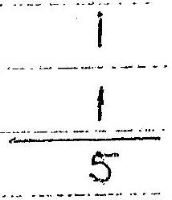
(d)
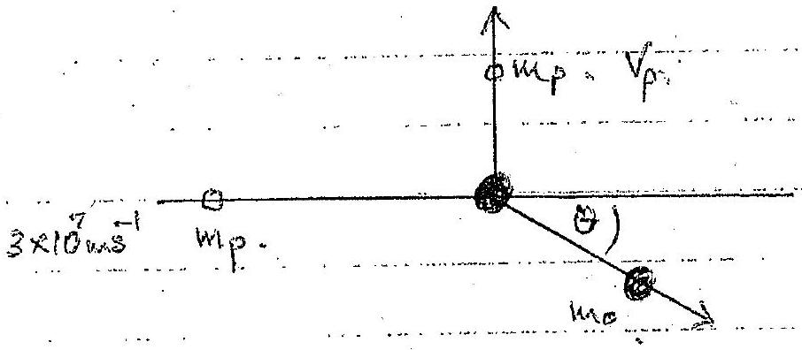

Let mans of oxygen meders be $m _ { 0 }$
Let $u _ { p } = 3 - 0 \times 10 ^ { 7 } \mathrm {~ms} ^ { - 1 }$, $V _ { \text {oh } }$ and $V _ { \text {ov } }$ be the hompantal and wentic camponents of the oxygen nucleus's velocity components and $V _ { p }$. he the vertecul areaseaters the welorify of protea after collesian. bemservation of horgantal momentour

$$
\begin{equation*}
u _ { p } m _ { p } = v _ { o n } m _ { 0 } \quad \bar { u } \quad v _ { o n } = u _ { p } \quad w _ { 0 } \tag{1}
\end{equation*}
$$

barservation of rectical momentum

$$
\begin{equation*}
0 = V _ { p } m _ { p } - V _ { o v } m _ { o } i _ { e } V _ { o v } = V _ { p } { \frac { k _ { p } p } { w _ { o } } } \tag{2}
\end{equation*}
$$

Encergy censervation

$$
\frac { 1 } { 2 } m _ { p } u _ { p } ^ { 2 } = \frac { 1 } { 2 } m _ { p } v _ { p } ^ { 2 } + \frac { 1 } { 2 } m _ { 0 } \left( v _ { o h } ^ { 2 } + v _ { o v } ^ { 2 } \right)
$$

Sub from

$$
= \frac { 1 } { 2 } m _ { p } v _ { p } ^ { 2 } + \frac { 1 } { 2 } m _ { o } \left( v _ { o h } ^ { 2 } + v _ { p } ^ { 2 } \frac { m _ { p } ^ { 2 } } { m _ { c } ^ { 2 } } \right)
$$

Frow (1)

$$
\left. \begin{array} { r l }
u _ { p } ^ { 2 } & = v _ { p v } ^ { 2 } + \frac { w _ { o } } { w _ { p } } \left( v _ { o h } ^ { 2 } + v _ { p v } ^ { 2 } \frac { w _ { p } ^ { 2 } } { w _ { o } ^ { 2 } } \right) \\
v _ { p v } ^ { 2 } \left[ 1 + \frac { w _ { p } } { w _ { p } } \right] & = k _ { p } ^ { 2 } - \frac { w _ { o } } { m _ { p } } v _ { o h } ^ { 2 } \\
& = - u _ { p } ^ { 2 } - u _ { p } ^ { 2 } \cdot \frac { m _ { p } } { m _ { o } }
\end{array} \right\}
$$

Q1 (d)

$$
v _ { p v } = u _ { p } \sqrt { \frac { 1 - \frac { m _ { p } } { m _ { p } } } { \left( 1 + \frac { m _ { p } } { m _ { 0 } } \right) } }
$$

Now

$$
\begin{aligned}
m _ { 0 } = 0.06523 & s _ { 0 } \\
V _ { p v } & = 3 - 00 \times 10 ^ { 8 } \sqrt { \frac { 0.93476 } { 1.06523 } } \\
V _ { p v } & = 2.81 \times 10 ^ { 8 } \mathrm {~ms} ^ { - 1 }
\end{aligned}
$$

Direction of oxygen mucleus to horigintal, $\theta$.

$$
\left. \begin{array} { l }
V _ { o h } = V _ { \varphi } \left( \frac { m _ { p p } } { m _ { 0 } } \right) = 3.00 \times 10 ^ { 7 } ( 0.06523 ) = 1.96 \times 10 ^ { 6 } \mathrm {~ms} ^ { - 1 } \\
V _ { o r } = V _ { p r } \left( \frac { \mathrm {~mol} _ { p } } { \mathrm {~m} _ { 0 } } \right) = 2.81 \times 10 ^ { 7 } ( 0.06523 ) = 1.83 \times 10 ^ { 6 } \mathrm {~ms} ^ { - 1 } \\
\therefore \tan ^ { - 1 } \theta = \frac { 1.83 } { 1.96 } = 0.937
\end{array} \right\}
$$

$$
\begin{aligned}
& V _ { 0 } ^ { 2 } = V _ { o h } ^ { 2 } + V _ { o r } ^ { 2 } \\
& V _ { 0 } ^ { 2 } = \left[ ( 1.96 ) ^ { 2 } + ( 1.83 ) ^ { 2 } \right] 10 ^ { 12 } \\
& V _ { 0 } = 2.68 \times 10 ^ { 6 } \mathrm {~ms} ^ { - 1 }
\end{aligned}
$$

$$
\left\{ \begin{array} { l }
1 \\
1
\end{array} \right.
$$

12

Q1 (e) Volume of wreck $= \frac { 10 ^ { 4 } } { 8 \times 10 ^ { 3 } } \mathrm {~m} ^ { 3 }$.
Mass of water diaplaced by wreek $= \frac { 104 } { 8 \times 10 ^ { 3 } } \times 10 ^ { 3 }$ kg
Upthrust on submergeoloreek $= \frac { 104 } { 8 \times 10 ^ { 3 } } \times 10 ^ { 3 } ( 9.81 ) \mathrm { N }$
If Al is extension of cable when wreck in bifted el
$$
\begin{aligned}
5 \times 10 ^ { 10 } & = \frac { \frac { 10 ^ { 24 } } { 8 \times 10 ^ { 3 } } \times 10 ^ { 3 } ( 9.81 ) } { 5 \times 10 ^ { - 4 } } / \left( \frac { \Delta l } { 10 } \right) \\
\Delta l & = \frac { ( 10 ) \frac { 10 ^ { 4 } } { 8 \times 10 ^ { - 3 } \times 10 ^ { 3 } ( 9.81 ) } } { \left( 5 \times 10 ^ { 10 } \right) \left( 5 \times 10 ^ { - 4 } \right) } \\
& = \frac { 9 - 81 } { 2 \times 10 ^ { 3 } } \\
& = 4.9 \mathrm {~mm}
\end{aligned}
$$
Q1 (f)
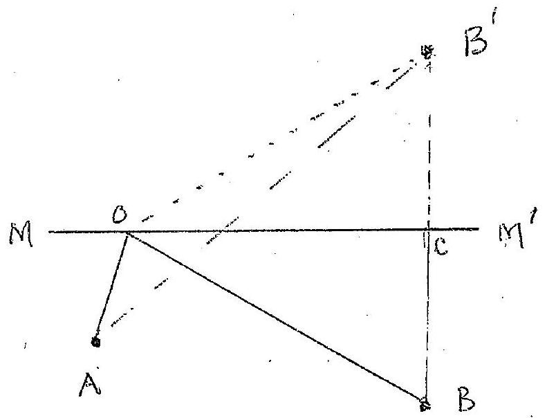
(i) $A s B ^ { i }$ is riflechar of $B , O B ^ { i } = O B$ Thus path $A O B = A O B$ '
(11) $A O B ^ { \prime }$ : has minimum length when $O$ along $A B ^ { \prime }$ (straight hai joining it') Thus AoB When this vecurs. $\hat { A O M } = \hat { B O M }$, so angle of inidence = augle of reflection is for reflected ray AGB.

Q1 (g) Crenter o-bit:

$$
\text { (i) } \begin{aligned}
\frac { C M m } { r ^ { 2 } } & = m F w ^ { 2 } \\
\frac { C M } { C M } & = r ^ { 3 } w ^ { 2 }
\end{aligned}
$$

(ii) Equilerwin of rock on moon requires

$$
\frac { \operatorname { com } \mu } { ( r - a ) ^ { 2 } } - \frac { G m \mu } { a ^ { 2 } } + R = \mu ( r - a ) \omega ^ { 2 }
$$

(1) planet sum formine TR 2
$\mu$ is the mass of the rock.
If wach to be liffed off more by quescitational pull of planet $R < 0 \quad$ a

$$
\frac { G M \mu } { ( r - a ) ^ { 2 } } = \frac { G m p } { a ^ { 2 } } - \mu ( r - a ) \omega ^ { 2 } > 0
$$

Brem (1)

$$
\begin{array} { l l }
G \frac { M } { m } \left[ \frac { m } { ( r - a ) ^ { 2 } } \right] & \frac { G m } { a ^ { 2 } } - \frac { ( r - a ) G M } { r ^ { 3 } } > 0 \\
\frac { M } { m } \left[ \frac { 1 } { ( r - a ) ^ { 2 } } \right. & \left. \frac { ( r - a ) } { r ^ { 3 } } \right] > \frac { 1 } { a ^ { 2 } }
\end{array}
$$

$$
\begin{aligned}
& \frac { M } { m } > \frac { 1 } { a ^ { 2 } } \frac { ( r - a ) ^ { 2 } r ^ { 3 } } { r ^ { 3 } - ( r - a ) ^ { 3 } } \\
& \frac { M } { m } > \frac { r ^ { 3 } } { a ^ { 2 } } \frac { ( r - a ) ^ { 2 } } { 3 r ^ { 2 } a - 3 r ^ { 2 } + a ^ { 3 } }
\end{aligned}
$$

3

$$
8
$$

Q1 (h)

$$
\begin{gathered}
( 1480 ) 400 \equiv ( 35 - 15 ) 40 \left( 1.6 \times 10 ^ { 3 } \right) \times 10 ^ { - 6 } \times 860 + H \\
( 490 ) 400 = ( 35 - 5 ) 20 \left( 1.6 \times 10 ^ { 3 } \right) \times 10 ^ { - 6 } \times 860 \\
+ ( 35 - 15 ) 20 \left( 2 \times 10 ^ { 3 } \right) 10 ^ { - 6 } s + H
\end{gathered}
$$

(1)
(2) 11

Eton (1)

$$
192021 : 100 \times 10 ^ { 3 } + \mathrm { H }
$$

(3)

Geoma

$$
1960 = 0.5504 \times 10 ^ { 3 } + 0.8005 + H
$$

(4)

Subtracking (3) form (t)

$$
\begin{gathered}
40 = 0.8008 - 0.5504 \times 10 ^ { 3 } \\
s = 738 \mathrm { Jgg } ^ { - 1 }
\end{gathered}
$$

from (3)

$$
H = 1920 - 1100 \ldots \equiv \$ 20 \mathrm {~J}
$$

Q1 (1) If $V _ { x d }$ is the $x$ component of the velocity of electron at $x = d$, then at trime. $t$,
$$
\begin{equation*}
v _ { x a } = v _ { x } + f t = v _ { x } + \frac { E e } { m _ { e } } t \tag{A}
\end{equation*}
$$
As $v _ { x } \ll \frac { \text { Eet } } { m _ { e } \text {. } }$
$$
\begin{equation*}
V _ { x d } \approx \frac { \text { Eet } } { m _ { e } } \tag{B}
\end{equation*}
$$
If $\theta$ angle final tragedary maters will $x - a \times i s$ and $v _ { y } y$-cenipenent of well
$$
\begin{equation*}
\tan \theta = \frac { V _ { y } } { V _ { x d } } \tag{c}
\end{equation*}
$$
homizontal
If ite electrons appear to come frem a point ap distance $x$ form the point where they emerge from the feeld $E$
$$
\begin{align*}
\tan \theta & = \frac { V _ { y } t } { X } \\
X & = V _ { y } t / \tan \theta \\
& = V _ { x d } t \tag{c}
\end{align*}
$$
from (B)
As " $s = u t + i f c$ "
$$
d = \frac { 1 } { 2 } \left( \frac { E _ { c } } { m _ { e } } \right) t ^ { 2 }
$$
Thus
$$
x = 2 d
$$
and electrons appearte arginate from $x = - d$

Q1 (j) Bendeng energy per muchear 8 grienhy

$$
[ 2 ( 1.0080 + 1.0087 ) = 4.0334 ]
$$

$$
\begin{aligned}
\varepsilon & = ( 4.0334 - 4.0026 ) \mathrm { u } / 4 \\
& = 0.0308 \mathrm { u } / 4 \\
& = 0.0077 ( 930 ) \mathrm { MeV } \\
& = 7.16 \mathrm { MeV }
\end{aligned}
$$

$$
\delta 1
$$

$$
( k ) _ { ( 1 ) } c = \lambda f = 2 \times 8.0 \times 10 ^ { - 2 } \times 2 \times 10 ^ { 3 } = 320 \mathrm {~ms} ^ { - 1 }
$$

$$
\text { (11) } \begin{aligned}
320 & = 1600 ( \lambda ) \\
\lambda & = 20 \mathrm {~cm}
\end{aligned}
$$

$$
\begin{gather*}
\text { (in) } \text { In (i) leapth of to }  \tag{1}\\
L = n \text { 8 } \\
\text { In (n) }  \tag{2}\\
L = ( n - 1 ) 10
\end{gather*}
$$

Solung (1) and (2) for $n$

$$
m = 5
$$

$$
\zeta
$$

Cfactury

$$
L = 40 \mathrm {~cm}
$$

$$
\begin{aligned}
& \text { (iv) The mext facquency accrs when } m = 3 \text { giving } \\
& L = 3 \left( \frac { \lambda } { 2 } \right) \\
& 40 = \frac { 3 } { 2 } \lambda \\
& \lambda = \frac { 80 } { 3 } \\
& f = 320 / ( 80 / 3 ) \\
& \text { c } \quad f = 1200 \mathrm {~Hz}
\end{aligned}
$$

$$
\frac { 1 } { 6 }
$$

(l) Weift balances rate of change of momentom: $m g = \frac { d } { d t } ( m v )$

$$
\begin{aligned}
( 810 ) 9.81 & = v ^ { 2 } \left( - \pi 4 ^ { 2 } \right) ( 1.20 ) \\
v & = 11.5 \mathrm {~ms} ^ { - 1 }
\end{aligned}
$$

Power

$$
\begin{aligned}
P & = \frac { 1 } { 2 } \left( \pi 4 ^ { 2 } \right) V ^ { 3 } ( 1.2 ) \\
& = 9.6 \pi V ^ { 3 } = 9.6 \pi ( 11.5 ) ^ { 3 } \\
P & = 4.59 \times 10 ^ { 4 } \mathrm {~W}
\end{aligned}
$$

(iii) (i) Robability of not decaying is $\quad \frac { N ( T ) } { A _ { 0 } } = \frac { 1 } { 2 }$
∴ Probability of dea cying $= 1 - \frac { 1 } { 2 } = \frac { 1 } { 2 }$

$$
\left. \begin{array} { l }
\frac { 1 } { 2 } \\
\frac { 1 } { 2 }
\end{array} \right\} \cdots +
$$

(ii) Robability of not decaying $P _ { N } = \frac { 1 } { 2 } \times \frac { 1 } { 2 } \times \frac { 1 } { 2 } = \frac { 1 } { 8 }$

$$
\begin{aligned}
\text { OR } & P _ { N } = \frac { N ( 3 T ) } { N _ { 0 } } = e ^ { - 3 T } \\
& = e ^ { - 3 \ln 2 } \quad \text { as } \quad \lambda = \frac { \ln 2 } { I } \\
& = \frac { 1 } { 8 } \\
\text { probability of decajing } & = \frac { 1 } { 8 }
\end{aligned}
$$

(M) ENTHER

$$
\begin{aligned}
\frac { \delta f } { \rho } & = \frac { \delta m } { m } + \frac { \delta l _ { 1 } } { l _ { 1 } } + \frac { \delta l _ { 2 } } { l _ { 2 } } + \frac { \delta l _ { 3 } } { l _ { 3 } } \\
& = \frac { 0.03 } { 1.5 } + \frac { 1 } { 80 } + \frac { 1 } { 50 } + \frac { 1 } { 30 } \\
& = 0.020 + 0.0125 + 0.020 + 0.0333 \\
& = 0.0858 \\
\frac { \delta 1 } { \rho } & \approx 0.09
\end{aligned}
$$

$$
\begin{aligned}
& \frac { \delta \rho } { \rho } = \frac { 1.53 } { ( 79 ) ( 49 ) ( 29 ) } - \frac { 1.50 } { ( 80 ) ( 50 ) ( 30 ) } / \frac { 1.50 } { ( 80 ) ( 50 ) } \\
& \frac { \delta _ { \rho } } { \rho } = 0.09
\end{aligned}
$$

$$
2
$$

Q2 (a) pd around the circuit gries

(i) $$
\begin{aligned}
( 24.00 - 12.6 ) & = 11.44 = 5 ( R + 1.16 ) \\
R & = \frac { 11.4 } { 5 } - 1.10 \\
R & = 1.18 \Omega
\end{aligned}
$$
(ii) Current I
$$
\begin{aligned}
( 24.0 - 12.6 ) & = ( 0.9 + 1.0 + 0.1 ) I \\
I & = \frac { 11.4 } { 2 } = 5.70 A \\
V _ { 1 } & = ( 24.0 - 5.7 ) = 18.3 \mathrm {~V}
\end{aligned}
$$
$$
\begin{aligned}
& V _ { 2 } = 12.6 + ( 57 ) ( 0.10 ) \\
& V _ { 2 } = + 13.2 \mathrm {~V}
\end{aligned}
$$
$$
\frac { 1 } { 5 }
$$
(b) learneut i through $E _ { i }$
$$
\begin{equation*}
i \left( R _ { 1 } + 10 \right) = 2.0 \tag{1}
\end{equation*}
$$
Also as mocurrent rhów, $i R _ { i } = 1.5$ ie $i = \frac { 15 } { R _ { 1 } }$

Substitutuing wito (1)

$$
\begin{aligned}
1.5 + 10 i & = 2.0 \\
i & = 0.05 \mathrm {~A} \\
0 & = \frac { 1.5 } { 0.05 } = 30 \Omega
\end{aligned}
$$

Q2 (c) (bitcent symmetrical about AB so polatical $V _ { C } = V _ { D }$ (Alternative answers acceptable)
(ii) No change incurrents in the arms oppotentials as $C$ and $O$ at the same potentral
(iii) Simplification by forming Cto D Two resestances an parallel gue resultant resistance
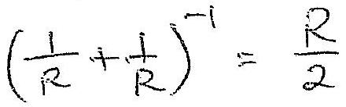
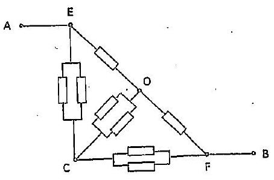
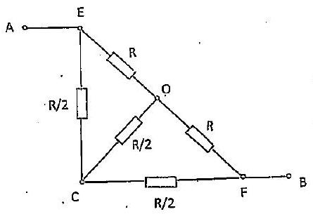
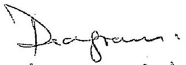
with correct resistars
(iv) pol aeres CO is zero as irrier forms a bolanced 'Ltheatstone Badge OR potentials at Oand egenal as reversung pol word AB gue same corcuit, by synumetry, as orginal situatua with pdacino AB notrewised and current wi Co cannot be reveised so it minat be zero (Aeternative sólutions acceptable)
(v) $R _ { A B }$ die $k \left( \frac { R } { 2 } + \frac { R } { 2 } \right)$ wi parallel with $( R + R )$
$$
\begin{aligned}
\therefore R _ { A B } & = \left( \frac { 1 } { R } + \frac { 1 } { 2 R } \right) ^ { - 1 } \\
R _ { A B } & = \frac { 2 } { 3 } R
\end{aligned}
$$

By symmetry $C$ and $D$ at seme potatial
Towing Cand D and 'addicig nessforce in parallel the arcuit reluces to that below.

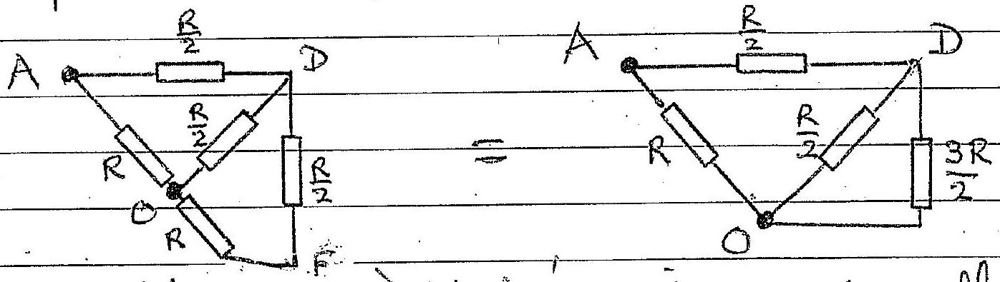
2

Simplifying by addring resistances in parallel the circuit becomes
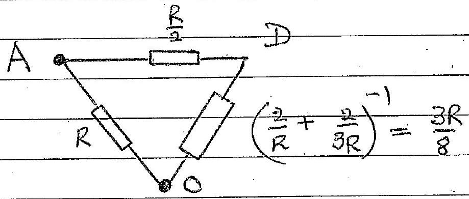

Finally 'adding' the resistances wi parallel

$$
\begin{aligned}
\frac { 1 } { R _ { A 0 } } & = \left( \frac { R } { 2 } + \frac { 3 R } { 8 } \right) ^ { - 1 } + \frac { 1 } { R } \\
& = \frac { 8 } { 7 R } + \frac { 1 } { R } = \frac { 15 } { 7 R } \\
\therefore R _ { A 0 } & = \frac { 7 R } { 15 }
\end{aligned}
$$

Q2 (a)
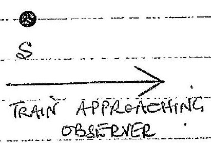

If their unctrally at $S$ and reaches I wi twiet, the separation of crests of somend waves seen by observer viewing approaching tra

$$
\begin{aligned}
\left( \frac { v _ { s } } { f _ { 0 } } - \frac { u } { f _ { 0 } } \right) & \\
& = \lambda _ { a } \\
\therefore \lambda _ { a } & = \frac { v _ { s } - u } { f _ { 0 } }
\end{aligned}
$$

obsewer
(wave appear dompensed !) gth seeval
whee ta waveleugth seevery 4. Fod. CORREC Explandito

For observer verving defouting temi, wavelength $\lambda _ { d } , ( u \rightarrow - u )$

$$
A _ { d } = \frac { v _ { s } + u } { f }
$$

Thus for approachug train, foequency fo gueuby

$$
f _ { a } = \frac { v _ { s } } { \lambda _ { a } } = \frac { v _ { s } } { \left( v _ { s } - u \right) } f _ { 0 }
$$

For depathing Frain frequency for gramby

$$
f _ { d } = \frac { V _ { s } } { \lambda _ { d } } = \frac { V _ { s } } { \left( V _ { s } + u \right) } f _ { 0 }
$$

q3 (b)
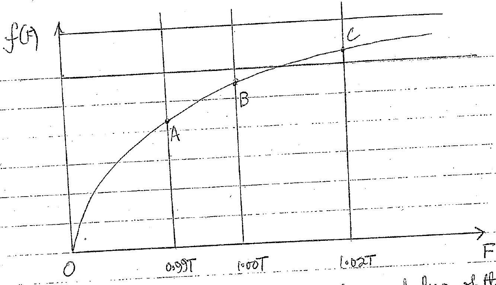
Date shows decreasing values of $b ; b$ being the modulus of the differenc is frequencies.
fo cannot below frequency at $A$ as be wold merease will incriping fo cannot be between fequencies at $A$ and $B$ as $b _ { 3 }$ womld have to be greater them $b _ { 2 }$
It conled havecter hi between the frequencies at BandC arabove of
(ii) From the graph,

$$
\begin{array} { l l }
b _ { 1 } = f _ { 0 } - f ( 0.99 T ) & = 3.30 \\
b _ { 2 } = f _ { 0 } - f ( T ) & = 2.00
\end{array}
$$

Thes

$$
\begin{align*}
& f ( 0.99 T ) = f _ { 0 } - 3.30  \tag{1}\\
& f ( T ) = f _ { 0 } - 2.00
\end{align*}
$$

5
(iii) (B) and (2) can be intiltenas

$$
\begin{align*}
& \frac { 1 } { 2 e } \sqrt { \frac { 0.99 T } { m } } = f _ { 0 } - 3.30 \\
& \frac { 1 } { 2 e } \sqrt { \frac { T } { m } } = f _ { 0 } - 2.00 \tag{A}
\end{align*}
$$

So

$$
\begin{aligned}
\left( f _ { 0 } - 2.00 \right) \sqrt { 0.99 } & = f _ { 0 } - 3.30 \\
f _ { 0 } ( 1 - \sqrt { 0.99 } ) & = 2.00 \sqrt { 0.99 } - 3.30 \\
f _ { 0 } & = 261 \mathrm {~Hz}
\end{aligned}
$$

$Q ( 1 ) \left( \right.$ (iv) We nied to determine if $f _ { 0 } - f ( 1.02 T )$ is +ve or -ve. Now

$$
\begin{equation*}
f _ { 0 } - f ( T ) = f _ { 0 } - \left( f _ { 0 } - 2 \right) \tag{A}
\end{equation*}
$$

Q3(b) (iv) We need to determine if $f _ { 0 } - f ( 1.02 T )$ is +ve or -ve. Now

$$
f _ { 0 } - f ( 1.02 T ) = f _ { 0 } - \sqrt { 1.02 } \left( f _ { 0 } - 2 \right)
$$

$$
\left( \text { as } \begin{array} { r l }
f ( 1.02 T ) = \sqrt { 1.02 } f ( T ) & \left. = \sqrt { 1.02 } \frac { 1 } { 2 E } \sqrt { \frac { T } { m } } \quad \text { from } A \right) \\
& = \sqrt { 1.02 } \left( f _ { 0 } - 2 \right)
\end{array} \right)
$$

Thus

$$
f _ { 0 } - f ( 1.02 T ) = f _ { 0 } ( 1 - \sqrt { 1.02 } ) + 2 \sqrt { 1.02 }
$$

Substitutuing for fo,

$$
\begin{aligned}
& = - 261 ( 0.00995 ) + 2.0199 \\
& = - 0.58
\end{aligned}
$$

is fo his between $B$ and $C$ or graph

$$
f ( 1.02 T ) = f _ { 0 } + 0.58
$$

(v)

$$
\begin{aligned}
& f ( F ) = \frac { 1 } { 2 l } \sqrt { \frac { F } { m } } \\
& \frac { \Delta f ( F ) } { f ( F ) } = \frac { \Delta l } { l } = \frac { 2 } { 261 } = 0.77 \%
\end{aligned}
$$

OR

$$
\begin{aligned}
\frac { \Delta f } { f ( F ) } & = \frac { \frac { - 1 } { 2 ( l + \Delta l ) } \sqrt { \frac { I } { m } } + \frac { 1 } { 2 l } \sqrt { \frac { I } { m } } } { \frac { 1 } { 2 l } \sqrt { \frac { I } { m } } } \\
& = \frac { \frac { 1 } { l } - \frac { 1 } { l + \Delta l } } { \frac { 1 } { l } } = 1 - \frac { l } { l + \Delta l } \\
& \approx \frac { \Delta l } { l } = \left. 0.77 \right| _ { 0 }
\end{aligned}
$$

$$
\int ^ { \{ 2 \} }
$$

Q4 (a) If temperature changes from $15 C$ to $20 C$, $l$ well change from $l 5$ tol where

As

$$
\text { As } T = \sqrt [ 2 \pi ] { \frac { l _ { 15 } } { g } } = 1
$$

$$
\left. \begin{array} { r l }
l _ { 20 } & = l _ { i 5 } ( 1 + 5 \alpha ) \\
T & = 2 \pi \sqrt { \frac { l } { g } } \\
\delta T & = 2 \pi \sqrt { \frac { l _ { i 5 } ( 1 + 5 \alpha ) } { g } } - 2 \pi \sqrt { \frac { l _ { 5 } } { g } } \\
& = 2 \pi \sqrt { \frac { l _ { i 5 } } { g } } [ \sqrt { 1 + 5 \alpha } - 1 ] \\
& = 2 \pi \sqrt { \frac { l _ { 15 } } { g } } \left[ \frac { 1 } { 2 } ( 5 \alpha ) \right] \\
& = \frac { 1 } { 25 \alpha } \\
\delta T & = 4.75 \times 10 ^ { - 5 }
\end{array} \right\}
$$

$$
\left\{ \begin{array} { l }
\frac { \text { Artgrentivery } } { A _ { S } I = 1 }
\end{array} \right.
$$

$$
\}
$$

$$
\begin{aligned}
& \text { Now } 1 \text { week } = 7 \times 24 \times 60 \times 60 \mathrm {~s} = 6.048 \times 10 ^ { 5 } \mathrm {~s} \\
& \text { Then to will lose } \\
& \quad \left( 4.75 \times 10 ^ { - 5 } \right) \left( 6.048 \times 10 ^ { 5 } \right) \mathrm { s } \\
& \quad = 29 \mathrm {~s}
\end{aligned}
$$

$$
\frac { 1 } { 5 }
$$

$$
A S f R = 20 \mathrm {~m} , \quad = - \frac { \pi } { R }
$$

$$
\begin{align*}
Q R \quad \frac { 8 g } { g } & = \frac { \frac { G M } { ( R + 20 ) ^ { 2 } } - \frac { G M } { R ^ { 2 } } } { \frac { G M } { R ^ { 2 } } } \\
& = - \left[ 1 - \frac { R ^ { 2 } } { R + 20 } \right] \\
& \simeq - \frac { 2 ( 20 ) ^ { 2 } } { R } \tag{1}
\end{align*}
$$

$$
\begin{aligned}
T & = 2 \pi \sqrt { \frac { l } { g } } \\
\frac { 8 T } { T } & = - \frac { 1 } { 2 } \frac { 8 g } { g } \\
& = \frac { 20 } { R } \\
f T & = \frac { 20 } { 688 \times 10 ^ { 6 } } \\
& = 3.135 \times 10 ^ { - 6 } \mathrm {~s}
\end{aligned}
$$

$$
\begin{aligned}
\frac { \delta T } { T } & = \frac { 2 \pi \sqrt { \frac { e } { g + \delta g } } - 2 \pi \sqrt { \frac { e } { g } } } { 2 \pi \sqrt { \frac { e } { g } } } > 3 \\
& = \left( \frac { 1 } { \sqrt { g + \delta g } } - \sqrt { g } \right) / \sqrt { \frac { 1 } { g } } \\
& = \left( \sqrt { \frac { g } { g + \delta g } } - 1 \right) = \left( 1 + \frac { \delta g } { g } \right) - 1 \\
& = - \frac { 1 } { 2 } \frac { \delta g } { g } + \cdots \text { Binaniat Theren } \\
& = \frac { 20 } { R } \text { efe. }
\end{aligned}
$$

(Adienatively eveluate $T$ and $T + S T$ to absain $S T$ )
Thank all load $\left( 3 \cdot 135 \times 10 ^ { - 5 } \right) \left( 6 \cdot 048 \times 10 ^ { 5 } \right) \mathrm { s }$

$$
\approx 1.98
$$

$$
\{
$$

(c) Resoloung along docetion iF O is otrangular velocity.
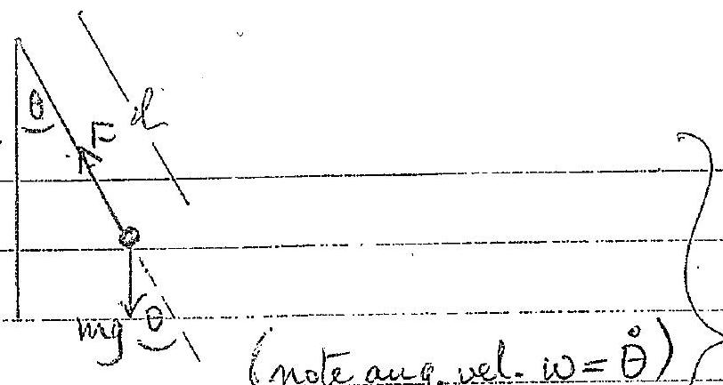
$$
\begin{aligned}
& E = m g \cos \theta = m l \theta ^ { 2 } \\
& F = m g \cos \theta + m l \theta ^ { 2 }
\end{aligned}
$$
As $Q$ and $\dot { \theta }$ vary, $F$ will vary.
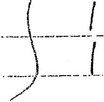
(1) At marcumsm amplitude $\theta _ { m } , \dot { \theta } = 0$. So
$$
F _ { M } = m g r \cos \theta _ { M } < m g
$$
(ii) At $\theta = 0$
$$
F _ { 0 } = m g + m l \dot { \theta } ^ { 2 } > m g
$$
(d) For stal worth aupular frequency is and amplitude $A$, maxtimity netardation, a, ocenors when
$$
a = \omega ^ { 2 } A .
$$
The sand will leave the mentrome when $a = g$ ie
$$
g = \omega ^ { 2 } A
$$
$g = ( 2 \pi f ) ^ { 2 } A$
where for the frequenty
$$
f = \frac { \frac { 1 } { 2 \pi } \sqrt { \frac { g } { A } } } { \frac { 1 } { 2 \pi } \sqrt { \frac { 9.81 } { 0.015 \times 10 ^ { - 2 } } } }
$$
$$
\}
$$
$$
f = 41 \mathrm {~Hz}
$$

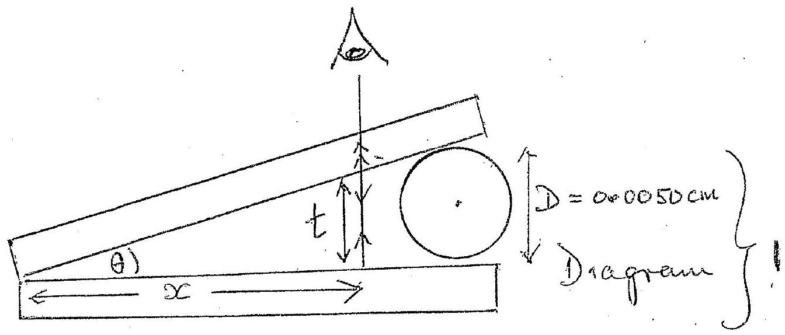

Let the thockiess of the air wedge be $t$ at a disfance $x$ from the line of centact of the two rectangular slides. hight incident momally.
The conditions for interference, talening unto account the phase change of $\pi$ at the air-glass interface:
CONSTRUCTIVE INTEREERENCE

$$
\begin{equation*}
2 t = n \lambda + \frac { 1 } { 2 } \lambda \quad n = 0,1,2 \ldots \tag{1}
\end{equation*}
$$

$n$ is a posetwe integer, orgero,
$\lambda$ is its wawelength
DESTROCTIVE INTERFERENCE

$$
\begin{equation*}
2 t = n \lambda \tag{2}
\end{equation*}
$$

PROBLENT For charges of $\Delta x$ in $n$ and At int with

$$
t = 5.0 \times 10 ^ { - 5 } \mathrm {~m} , \quad \therefore \Delta n = 200 \quad \Delta t = t
$$

$2 \Delta t = \Delta m \lambda$

$$
\begin{equation*}
\operatorname { tran } ( 1 ) a r \tag{2}
\end{equation*}
$$

ci
(b) When $2 E = ( 0 ) \lambda = 0$ the is destractive interference for all wavelengthe. This occurs along the cantact him of the two plates. Beyond this destructure intefference region eltore will he coustructure witestrence for $2 t = \frac { 1 } { 2 } \lambda$, which wain will o, white lyph will produce destrictive witefunce for $t$ or forced by a clin-ed negin in the negoai- 2E 2交入, duetric the swempt of werdlengths. Scoupt then are bands of coloured faugh that levenue everashing

Q5 (b) whiter; the destructure regims of certain wavelengths overlappeng with the canstractive regenis of orthar wavelongth.

For a tremsponent hequid of refractive molecin $\mu$ the optional path is $2 \mu t$
Thus:
Constructure interference occurs when $\mathcal { Z } _ { \mu } t = n \lambda + \frac { 1 } { 2 }$ Destructure interference occuss when $2 \mu t = n \lambda$

$$
n = 0,1,2 , \ldots
$$

(c) The interference fringe system, for monochramatic light ques cartans of constant air gap thickness. For perfectly Plat plates, in a wedge arrangement, these are strucglt his persallel to the here of contact of the plates. The deviation of these contours shows the variation in the air gap thickness. From the value of $x$ one can determine itse 'confore map' varacition and it deviation fram the perfectly flat plates intigerence) pattern.
(d) For wavelengths $\lambda _ { 1 }$ and $\lambda _ { 2 }$ and air gap thatnopees $t _ { 1 }$ and $t _ { 2 }$, me obtains for constructure inderference
$$
2 t _ { 1 } = u _ { 1 } \lambda _ { 1 } + \frac { 1 } { 2 } \lambda _ { 1 }
$$
and
$$
2 t _ { 2 } = n _ { 2 } \lambda _ { 2 } + i \lambda _ { 2 }
$$
If to a punticular set of $n$ reada- the fi-ngè eoivide por commion thickwaso t."

$$
2 t = n _ { 1 } \lambda _ { 1 } + \frac { 1 } { 2 } \lambda _ { 1 }
$$

and

$$
2 t = x _ { 2 } \lambda _ { 2 } + \frac { 1 } { 2 } \lambda _ { 2 }
$$

Coving

$$
\begin{equation*}
\lambda _ { 1 } = \left( \frac { 2 n _ { 2 } + 1 } { 2 n _ { 1 } + 1 } \right) \lambda _ { 2 } \tag{1}
\end{equation*}
$$

So counting the frenges to oblain $n$, and $v _ { 2 }$ atarbuig form $x _ { 1 } = x _ { 2 } = 0$, one can determine $\lambda _ { 1 }$ fam a knowledge of $\lambda _ { 2 }$

Altematroly
If there are serval such coundences, from (t),

$$
x _ { * } = x _ { 2 } \left( \frac { \lambda _ { 2 } } { \lambda _ { 1 } } \right) + \frac { 1 } { 2 } \left( \frac { \lambda _ { 2 } } { \lambda _ { 1 } } - 1 \right)
$$

blotting $\mu _ { 1 }$ against $\mu _ { 2 }$ guies a strenght line with gradient $\left( \lambda _ { 2 } / \lambda _ { 1 } \right)$ and also from withreept $\frac { 1 } { 2 } \left( \lambda _ { 2 } / \lambda _ { 1 } - 1 \right)$. Hence obteriving $\lambda _ { \lambda _ { 1 } }$ know ing $\lambda _ { 2 }$.

Q6 (a)
Let intial speed of $n$ w be $U$ and funct sped of $M$ be $V$ Conservation of momentom reguries
è

$$
\begin{align*}
& m u = M v + m \left( \frac { 4 } { 2 } \right) \\
& m \left( \frac { 4 } { 2 } \right) = M v \tag{1}
\end{align*}
$$

Energy lost queen by

$$
\begin{aligned}
\Delta E & = \frac { 1 } { 2 } m u ^ { 2 } - \frac { 1 } { 2 } m \left( \frac { u } { 2 } \right) ^ { 2 } - \frac { 1 } { 2 } M v ^ { 2 } \\
& = \frac { 3 } { 8 } m a ^ { 2 } - \frac { 1 } { 2 } M v ^ { 2 }
\end{aligned}
$$

Fraction of Lost KE

$$
\begin{aligned}
\frac { \Delta E } { E } & = \frac { \frac { 3 } { 8 } m u ^ { 2 } - \frac { 1 } { 2 } M v ^ { 2 } } { \frac { 1 } { 2 } m u ^ { 2 } } \\
& = \frac { \frac { 3 } { 8 } u ^ { 2 } - \frac { 1 } { 2 } \frac { M } { m } v ^ { 2 } } { \frac { 1 } { 2 } u ^ { 2 } }
\end{aligned}
$$

From (1)
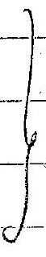
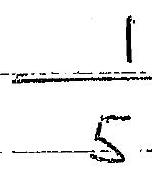
(b)
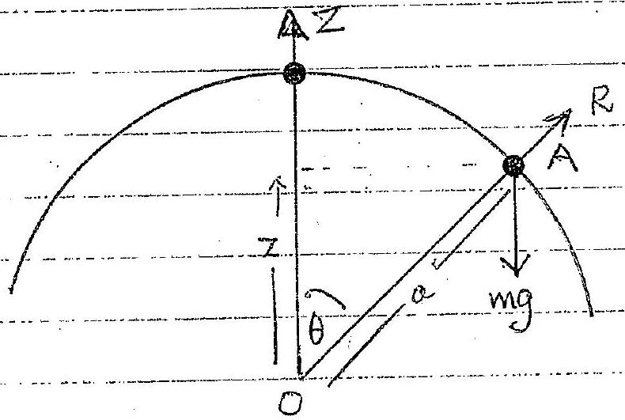
Ret $R$ be seachion of sphere on particle
It will leave the sphere when $R = 0$
bensewation of evergy if at position $( z , \theta )$ with apeed $v$; pe measured from $C$

$$
\begin{equation*}
\frac { 1 } { 2 } m v ^ { 2 } + m g I ^ { 2 } = m g a \tag{1}
\end{equation*}
$$

Equation of inotion along to

$$
\operatorname { mg } \cos \theta - R = \frac { \min v ^ { 2 } } { a }
$$

Q 6 (b) Expressed in tems of z thes becames

$$
\begin{equation*}
m g \frac { I } { a } = \frac { k v ^ { 2 } } { a } + R \tag{2}
\end{equation*}
$$

From (1) and (2) eliminating $r ^ { 2 }$

$$
\begin{aligned}
m g \frac { t } { a } & = \frac { m } { a } 2 g ( a - z ) + R \\
R & = \frac { m g } { a } ( 3 z - 2 a )
\end{aligned}
$$

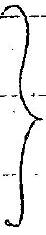
It will leave enface of sphere when $R = 0$ is

$$
\begin{gathered}
\frac { m g } { a } ( 3 z - 2 a ) = 0 \\
z = \frac { 2 } { 3 } a
\end{gathered}
$$

(c) bonsuration of momentom require W to wore to LITS and $\}$ w mare to the Rits; so that their momenta-caucel. The only force acting on $m$ is a vertical force these in $\}$ wrist move we frically daunce of having no ho 4
(d)
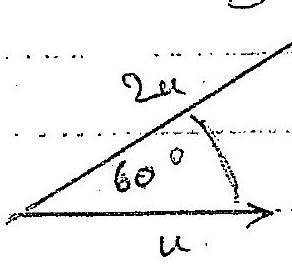
2n relative to y given by adding the vectors 24 and $( - a )$
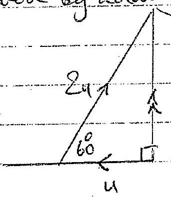
This produces a ight angled treangle with sates of length $2 a , u$ ad $\sqrt { 3 } u$
So relatice velouby is $\sqrt { 3 }$ ef verfically in diagram - 1

Q7 (a) For urcular artit at approx. Farthraduce with velocity $v _ { 5 }$ mass $m$,

$$
\begin{aligned}
V _ { E } & = \frac { C _ { I } M _ { E } M } { R _ { E } ^ { 2 } } \\
V ^ { 2 } & = \frac { M _ { E } G } { R _ { E } } = \frac { \left( 5.97 \times 10 ^ { 24 } \right) \left( 6.67 \times 10 ^ { - 11 } \right) } { 6.83 \times 10 ^ { 6 } } \\
& = 5.83 \times 10 ^ { 7 } \\
V & = 7.64 \times 10 ^ { 3 } \mathrm { ws } ^ { - 1 }
\end{aligned}
$$

(b) If Earth rotatug clockine as in $F _ { g }$, launching aspace ereft tangentially en or clockweise from the equator will add $R _ { E } W _ { E }$ ( $W _ { E }$ is an ador velocity of Eurth) to the launch velocity However, if lawnched from a dametrically
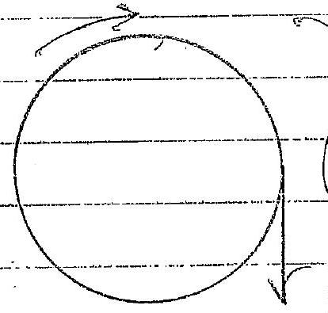
opposite locaton on the Eurth the launch velocity will be seduced by Rewe. Thus it is alivary am advantage to launch inthe direction of Jactar of the Earth. Inlermediate results hold for other Ratutades.

(c)

For curcelar motion, wherbit, at debauce $R$ from centre of Eosth, vehiele mass an:

$$
\begin{align*}
\frac { m v ^ { 2 } } { R } & = \frac { G M _ { E m } } { R ^ { 2 } }  \tag{1}\\
v ^ { 2 } & = \frac { G M _ { E } } { R }
\end{align*}
$$

$$
\begin{array} { l l }
\text { Emagy } E _ { 0 } ^ { 0 } & E = \frac { 1 } { 2 } m v ^ { 2 } - \frac { G M E W } { R }  \tag{1}\\
& = \frac { 1 } { 2 } \frac { C M E M } { R }
\end{array}
$$

So if Eadwes, Ebacals larger w manking but a $R$ locames emoller.
So (pram (1) I ware

Q7 (d) Assume the mass of the galary, $M _ { G }$, is all concentrated at its centre. This is valid for a uniform distribation of wors in a sphere. It will be arsumed that this is a good approximation The star/hostates and a cucle around the centre, raduis $R _ { G }$ Then
$$
\begin{equation*}
\frac { M _ { S } V _ { S } ^ { 2 } } { R _ { G } } = \frac { G M _ { S } M _ { G } } { R _ { G } ^ { 2 } } \tag{1}
\end{equation*}
$$
Now
$$
\begin{aligned}
R _ { a } & = \left( 3 \times 10 ^ { 4 } \right) \left( 3 \times 10 ^ { 8 } \right) ( 365 \times 24 \times 60 \times 60 ) \\
& = 2.8 \times 10 ^ { 20 } \mathrm {~m}
\end{aligned}
$$
From (1)
$$
\left. \begin{array} { r l }
M _ { G } & = V _ { S } ^ { 2 } R _ { G } \\
& = \frac { \left( 250 \times 10 ^ { 3 } \right) ^ { 2 } \left( 2.8 \times 10 ^ { 20 } \right) } { 6.7 \times 10 ^ { - 11 } } \mathrm {~kg} \\
& = \frac { 10 ^ { 12 } \left( 2.8 \times 10 ^ { 20 } \right) } { 16 \left( 6.7 \times 10 ^ { - 11 } \right) } \mathrm { kg } \\
M _ { G } & = 2.6 \times 10 ^ { 41 } \mathrm {~kg}
\end{array} \right\}
$$
(ii) $M _ { s } = 2.0 \times 10 ^ { 50 } \mathrm {~kg}$ equal to our Sun's mass The multer. $N$ of stars is gwen by
$$
N = \frac { M _ { G } } { M _ { S } } = \frac { 2.6 \times 10 ^ { 4.1 } } { 2.0 \times 10 ^ { 30 } } = 1.3 \times 10 ^ { 11 * }
$$
- Que sig. fig ar just order of magnitude acceptable

Q8 (a)
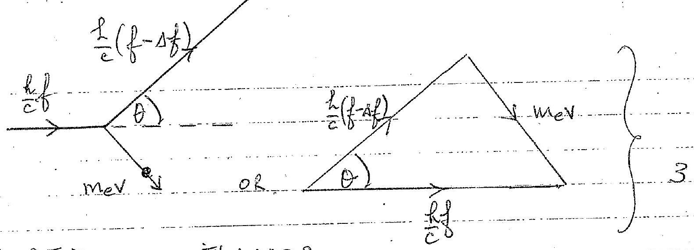

OR Bott Dacrams, witt habens
(b) $\quad \left( m _ { e } v \right) ^ { 2 } = \left( \frac { h } { c } f \right) ^ { 2 } + \left[ \frac { h } { c } ( f - \Delta f ) ^ { 2 } - 2 \left( \frac { h } { c } \right) f ( f - \Delta f ) \cos \theta \right.$
(c) $\quad h f = \frac { 1 } { 2 } m _ { e } v ^ { 2 } + h ( f - \Delta f )$
(d) $\operatorname { Fan } ( 2 ) \quad m _ { e } v ^ { 2 } = 2 h \Delta f$

Substatuting (3) into Lits of (1)

$$
\begin{gathered}
2 h m _ { e } \Delta f = \left( \frac { h } { c } \right) ^ { 2 } f ^ { 2 } + \left( \frac { h } { c } \right) ^ { 2 } ( f - \Delta f ) ^ { 2 } - 2 \left( \frac { h } { c } \right) ^ { 2 } f ( f - \Delta f ) \cos \theta \\
\Delta f = \frac { 1 } { h } m _ { e } \left( \frac { h } { c } \right) ^ { 2 } \left\{ [ 1 - \cos \theta ] ^ { 2 } + \frac { f \Delta f ( 1 - \cos \theta ) + \frac { 1 } { 2 } ( \Delta f ) ^ { 2 } } { } \right\} \\
\Delta f \left[ 1 - \frac { h f } { m _ { e } c ^ { 2 } } ( 1 - \cos \theta ) \right] = \left( \frac { h f } { m _ { e } c ^ { 2 } } \right) f \left[ ( 1 - \cos \theta ) + \frac { 1 } { 2 } \left( \frac { \Delta f } { f } \right) ^ { 2 } \right] \\
\Delta f = \left( \frac { h f } { m _ { e } c ^ { 2 } } \right) f \left[ ( 1 - \cos \theta ) + \frac { 1 } { 2 } \left( \frac { \Delta f } { f } \right) ^ { 2 } \right] / \left[ 1 - \frac { h f } { m _ { e } c ^ { 2 } } ( 1 - \cos \theta ) \right]
\end{gathered}
$$

As $\frac { h f } { m _ { e } c ^ { 2 } } \ll 1$ and $\left( \frac { \Delta f } { f } \right) \ll 1$, we obtain the approximation

$$
\Delta f = \frac { h f ^ { 2 } } { m _ { e } c ^ { 2 } } ( 1 - \cos \theta )
$$

$\frac { \text { mech } ^ { 2 } c f ^ { 2 } } { \text { (e) } h ( 1 - \cos \theta ) }$
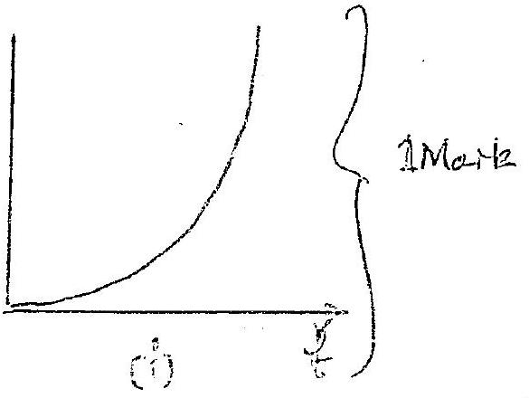
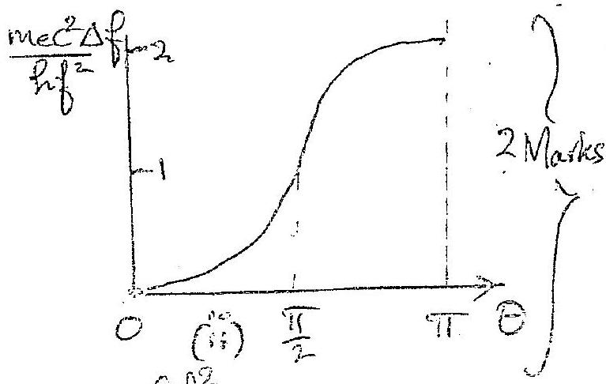
iwax. $\Delta f$ in (ii) $\quad$ gener $\quad \Delta f = \frac { 2 h f ^ { 2 } } { w _ { 2 } c ^ { 2 } } \quad$ for $6 = \pi$

$$
\frac { 1 } { 4 } =
$$

$69 \quad ( a )$
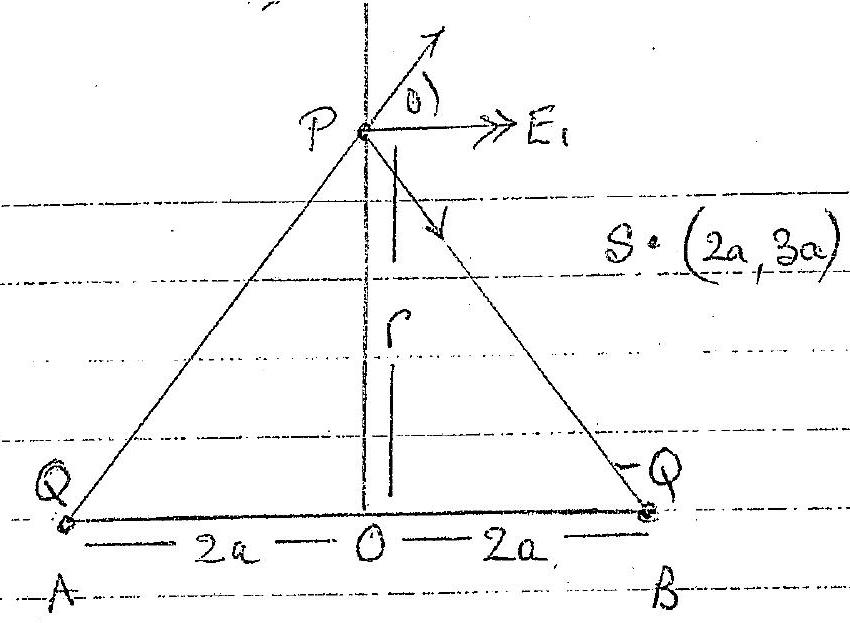

$$
V _ { 1 } = \frac { Q } { 4 \pi \left( \varepsilon _ { 0 } \right. } \left[ \sqrt { r ^ { 2 } + ( 2 a ) ^ { 2 } } - \sqrt { r ^ { 2 } + ( 2 a ) ^ { 2 } } \right] = 0
$$

By symmethy. E, in poullel b $\overline { A B }$ at $P$. Let $E _ { 1 }$ make an angle $\theta$ with AP and BP. Resolving the faces with the direction

$$
\begin{aligned}
E _ { 1 } & = \frac { 2 Q } { 4 \pi \varepsilon _ { 0 } } \left( \frac { 1 } { r ^ { 2 } + ( 2 a ) ^ { 2 } } \right) \cos \theta \\
& = \frac { 2 Q } { 4 \pi \varepsilon _ { 0 } } \left( \frac { 1 } { r ^ { 2 } + ( 2 a ) ^ { 2 } } \right) \sqrt { r ^ { 2 } + ( 2 a ) ^ { 2 } } \\
& = \frac { Q } { \pi \varepsilon _ { 0 } } \frac { a } { \left( r ^ { 2 } + ( 2 a ) ^ { 2 } \right) ^ { 3 / 2 } } \text { parallel ter ar } P
\end{aligned}
$$

(b) Let $A S B = 0$
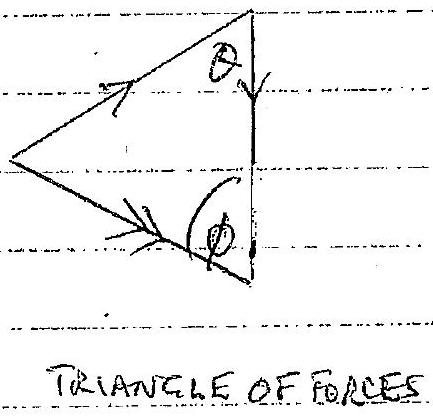

$$
\begin{aligned}
& V _ { 2 } = \frac { Q } { 4 \pi \varepsilon _ { 0 } } \left[ \frac { 1 } { 3 a } + \frac { 1 } { 5 a } \right] \\
& V _ { 2 } = \frac { - Q } { 4 \pi \varepsilon _ { 0 } a } \left( \frac { 2 } { 15 } \right)
\end{aligned}
$$

Resultant fueld $E _ { 2 }$ given by

$$
\begin{aligned}
E _ { 2 } ^ { 2 } & = \left( \frac { Q ^ { 2 } } { 4 \pi \varepsilon _ { 0 } ^ { 2 } } \right) ^ { 2 } \left[ \frac { 1 } { \left( 3 a ^ { 2 } \right) ^ { 4 } } + \frac { 1 } { ( 50 ) ^ { 4 } } - 2 \left( \frac { 1 } { 30 } \right) ^ { 2 } \left( \frac { 1 } { \sqrt { 3 } } \right) ^ { 2 } \cos \theta \right] \quad 2 \\
& = \left( \frac { Q } { 4 \pi \varepsilon _ { 0 } } \right) ^ { 2 } \left[ \frac { 1 } { 3 ^ { 4 } } + \frac { 1 } { 5 ^ { 4 } } - 2 \left( \frac { 1 } { 3 ^ { 2 } } \right) \left( \frac { 1 } { 5 ^ { 2 } } \right) \left( \frac { 3 } { 5 } \right) \right] . \quad \text { decot } \theta = \frac { 3 } { 5 } 1
\end{aligned}
$$

$$
\begin{aligned}
E _ { 2 } ^ { 2 } & = \left( \frac { Q } { 4 \pi \varepsilon _ { 0 } a ^ { 2 } } \right) ^ { 2 } \frac { 1 } { 3 ^ { 4 } 5 ^ { 4 } } \left[ 5 ^ { 4 } + 3 ^ { 4 } - 2 \left( 3 ^ { 2 } \right) \left( 5 ^ { 2 } \right) \left( \frac { 3 } { 5 } \right) \right] \\
& = \left( \frac { Q } { 4 \pi \varepsilon _ { 0 } a ^ { 2 } } \right) ^ { 2 } \left( \frac { 1 } { 34 } \right) \left( \frac { 1 } { 54 } \right) [ 706 - 270 ] \\
E _ { 2 } & = \left( \frac { - Q } { 4 \pi \varepsilon _ { 0 } a ^ { 2 } } \right) \frac { \sqrt { 436 } } { 225 } \\
E _ { 2 } & = \left( \frac { Q } { 4 \pi \varepsilon _ { 0 } a ^ { 2 } } \right) 0.0928
\end{aligned}
$$

Direction of $E _ { 2 }$ angle $\phi$ to veitical asin diagrain lseng sin rule:

$$
\begin{aligned}
& \frac { E _ { 2 } } { \sin \theta } = \frac { \frac { \alpha } { \sin \varepsilon _ { 0 } d ^ { 2 } \left( 5 ^ { 2 } \right) } } { \sin \phi } \\
& \frac { 0.0928 } { 4 / 5 } = \frac { 0.040 } { \sin \phi }
\end{aligned}
$$

$$
\begin{aligned}
\sin \phi & = 0.040 \left( \frac { 4 } { 5 } \right) \\
& = 0.345 \\
\therefore \phi & = 20.2 ^ { \circ }
\end{aligned}
$$

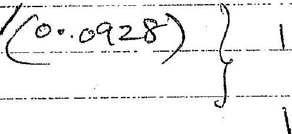
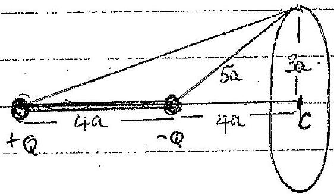

Initiul potential $V _ { 1 }$ Q ${ } ^ { 2 }$

$$
\begin{aligned}
& V _ { 1 } = \frac { V _ { 1 } Q ^ { 2 } } { 4 \pi B _ { 0 } a } \left( \frac { 1 } { \sqrt { 8 ^ { 2 } + 3 ^ { 2 } } } - \frac { 1 } { 5 } \right) \\
& = - \frac { a ^ { 2 } \cos ( 0,00,0 ) } { 4 \sqrt { 130 } } ( 0.0530 )
\end{aligned}
$$

Funillpointal $V _ { 2 }$

$$
\begin{aligned}
V _ { 2 } & = \frac { Q ^ { 2 } } { 4 \pi \varepsilon _ { 0 } a } \left( - \frac { 1 } { 3 } + \frac { 1 } { 5 } \right) \\
& = - \frac { Q ^ { 2 } } { 4 \pi \varepsilon _ { 0 } c _ { 0 } } \\
\frac { 1 } { 2 } w v ^ { 2 } & = ( 0.133 ) \\
V & = \frac { \sqrt { 20.0504 } ) ^ { 2 } } { \sqrt { 4 \pi \varepsilon _ { 0 } G m } } = \frac { Q ^ { 2 } } { 4 \pi \varepsilon _ { 0 } a } ( 0.0504 ) \\
& = \sqrt { 2 \pi \varepsilon _ { 0 } a _ { 0 } m } ( 0.224 ) = \frac { 0.224 Q \sqrt { 2 \pi \varepsilon _ { 0 } a m } } { 2 \pi \varepsilon _ { 0 } a m }
\end{aligned}
$$
