## SOLUTIONS

(a) Reject 3-66 an it deviates markelly from the other result possibly due to a varipaint
Average of remaining 10 masseriements $= 6.65$ ?
(i) Best estimate 6.65
(ii) Accuracy based on standard darature or average of wordelles of doeatern from mean or any other we the ed
Accel accuracif in lange $\pm ( 0.05 \rightarrow 0.03 )$ or Standarderfor of the Mean, which is $\pm ( 0.0149 )$
(b)
(i) Upwreneda
(ii) Rope $B$ moves down with velocity $\frac { b } { a } V$
Rope D moves up will velocity V
Centre of $P$ and $W$ riss with speed $\frac { 1 } { 2 } V \left( 1 - \frac { b } { a } \right)$
$$
= V \left( \frac { a - b } { 2 a } \right)
$$
(c) At in saiface of the Earth, for mensum,
$$
\begin{aligned}
& m g = \frac { G M _ { F } m } { R _ { E } ^ { 2 } } \quad M _ { E } \text { increasof Forth } \\
& g = \frac { G M _ { E } } { R _ { E } ^ { 2 } }
\end{aligned}
$$

If $\rho$ density of Earth, assumed homogeneons,

$$
\begin{aligned}
& g = \frac { G } { \frac { 3 } { 3 } \pi R _ { E } \rho } \\
& \left. \begin{array} { r l }
\rho & = \frac { 9 } { \frac { 4 } { 3 } \pi G R _ { 2 } } \\
& \left. = \frac { 9.81 } { 1.33 T ( 64626 } \right) \left( 6.38 \times 10 ^ { - 6 } \right) \\
& \operatorname { kgm } ^ { - 3 }
\end{array} \right\} \\
& e ^ { 2 } 5.5 \mathrm {~L} \mathrm {~cm} ^ { - 3 }
\end{aligned}
$$

Q1 (d) Activity
At $t = 0$

$$
\begin{aligned}
& A ( t ) = \frac { d N } { d t } = - \lambda N _ { 0 } e ^ { - \lambda t } \\
& A ( 0 ) = \left( \frac { d N } { d t } \right) _ { 0 } = - \lambda N _ { 1 }
\end{aligned}
$$

After $10 ^ { 8 } s$

Thes
$A = T = \ln 2 / \lambda$,

$$
\begin{aligned}
T & = - \frac { 10 ^ { 8 } \ln 2 } { \ln ( 0.990 ) } \\
T & = 6.9 \times 10 ^ { 9 } 5
\end{aligned}
$$

219 years
219 years
let $v$ lee the velocity of the spheres and Pthe tensain in the mopp. m is mano of spheses.
For caraciar awofion, peroluting horgent olly.

$$
\begin{equation*}
\frac { m v ^ { 2 } } { 5 \cdot 0 } = \frac { 1 } { 2 } P \tag{1}
\end{equation*}
$$

Bendining wertically

$$
\begin{equation*}
m g = F \cos 30 ^ { \circ } = P \frac { \sqrt { 3 } } { 2 } \tag{2}
\end{equation*}
$$

Similatiting (2) into $0 \quad v ^ { 2 } = \frac { 59 } { \sqrt { 3 } }$
Period

$$
\begin{aligned}
& T = \frac { 2 \pi ( 5 ) } { V } = 10 \pi / \frac { \sqrt { 3 } } { 5 g } \quad f \operatorname { ran } ( 3 ) \\
& T = 5.95
\end{aligned}
$$

(f) Usming usmal notation

$$
\begin{aligned}
& \quad h f = W + V e \\
& \quad = \frac { \left. \left( 6.3 \times 10 ^ { 14 } \right) \left( 6.63 \times 10 ^ { - 34 } \right) - \frac { 3.7 \times 10 ^ { - 19 } } { 1.60 \times 10 ^ { - 19 } } \right\} } { \frac { 4.769 \times 10 ^ { - 20 } } { 1.60 \times 10 ^ { - 19 } } } \\
& \quad V = 0.298 \mathrm {~V} \\
& \quad \approx 0.30 \mathrm {~V} ( 102 \mathrm { sg } .6 \mathrm {~g} )
\end{aligned}
$$

Q1 (g) Rate of heatmg

$$
\begin{aligned}
12 & = s \text { (imass flowing } / s \text { ) (rise in tan-practure) } \\
& = s \left( \frac { - 0,060 } { 60 } \right) ( a \cdot 0 ) \\
s & = 6 \cdot 0 \times 10 ^ { 3 } \mathrm {~J} \mathrm {~kg}
\end{aligned}
$$

(i) Using standard notation

$$
E _ { 1 } = \frac { 1 } { 2 } C _ { 1 } V _ { 1 } ^ { 2 } \quad \text { where } V = 10 ^ { 5 } \mathrm {~V}
$$

acti

$$
C _ { 1 } = \frac { - e _ { 1 } } { a _ { 1 } } \quad A _ { 1 } \text { area ef-plates, } A _ { 1 } \text { separatrariof plata }
$$

Thom

$$
\begin{aligned}
& F _ { 1 } = \frac { 1 } { 2 } \frac { \left( 8.85 \times 10 ^ { - 12 } \right) \left( 25 \times 10 ^ { 6 } \right) \left( 10 ^ { 5 } \right) ^ { 2 } } { 750 } \\
& F _ { 1 } = 1475 \mathrm {~J} \quad \left( \text { Aicept } 1.47 \times 10 ^ { 3 } \text { to } 1.48 \times 10 ^ { 3 } \right)
\end{aligned}
$$

(i) Energy moreraes as work has to be deme is feuther separate charge on dond against attraction from oppostechage on the ground, darge on claid constant.
(4)

$$
\begin{aligned}
E & = \frac { 1 } { 2 } C _ { 1 } V _ { 2 } ^ { 2 } \\
& = \frac { 1 } { 2 } C _ { 2 } \left( \frac { Q _ { 1 } } { C _ { 2 } } \right) ^ { 2 }
\end{aligned}
$$

$C _ { 2 }$ is the nueverpacitares, $V$, men potential

$$
\text { as } V _ { 2 } = \frac { Q _ { 1 } } { c _ { 2 } }
$$

where $Q _ { 1 }$ is its charge on the do d shat remains construct.
Now

$$
Q _ { 3 } = \frac { q A _ { 1 } } { d _ { 2 } } \text { and } Q _ { 1 } = C _ { 1 } V _ { 1 } = \frac { \varepsilon A _ { 1 } V _ { 1 } } { d _ { 1 } }
$$

So

$$
\begin{aligned}
E _ { 2 } & = \frac { 1 } { 2 } \frac { Q _ { 1 } ^ { 2 } } { C _ { 2 } } \\
& = \frac { 1 } { 2 } \left( \frac { \varepsilon A _ { 1 } V _ { 1 } } { g _ { 1 } } \right) ^ { 2 } \frac { d _ { 2 } } { \varepsilon A _ { 1 } } \\
& = \frac { 1 } { 2 } \left( 8.85 \times 10 ^ { - 12 } \right) \left( 25 \times 10 ^ { 6 } \right) \left( 10 ^ { 5 } \right) ^ { 2 } \frac { 1250 } { ( 750 ) ^ { 2 } } \\
& = E _ { 1 } \frac { 1950 } { 750 } = 2458 \mathrm {~J}
\end{aligned}
$$

Increase in enorgy

$$
\begin{aligned}
& \Delta E = 245 g - 1475 \\
& \Delta E = 983 \quad 3
\end{aligned}
$$

Attana a

(b) (i)

(i) By symmetry c. of S. almg ac ares Momisht about y -akis quies it.
$$
\begin{aligned}
\left( 9 R ^ { 2 } - \pi R ^ { 2 } \right) \bar { x } & = - \frac { x } { x } \pi R ^ { 2 } \\
x & = - \frac { \pi x } { ( 9 - \pi ) }
\end{aligned}
$$

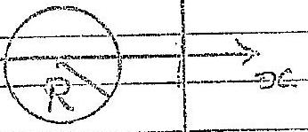

(ii) Method I
Let lins through $( x , y )$ be $y = d x$ By synmetry C. of G. along lune the orgeng 0 emp $( x , y )$
Mexaboug deforers along be y $= x x$ mements.
$$
\left( s = \sqrt { x ^ { 2 } + y ^ { 2 } } \right)
$$
$$
\begin{aligned}
\left( 9 R ^ { 2 } - \pi R ^ { 2 } \right) s & = - s \pi R ^ { 2 } \\
s & = \frac { - s \pi R ^ { 2 } } { 9 R ^ { 2 } - \pi R ^ { 2 } } \\
& \simeq \frac { - \pi \sqrt { x ^ { 2 } + 4 ^ { 2 } } } { 9 - \pi }
\end{aligned}
$$

OR Awternetive Method
$x$-coord of $C$ of $G$, $E$, is given by laking moments about

$$
\text { y-axis: } \quad \begin{aligned}
\left( 9 R ^ { 2 } - \pi R ^ { 2 } \right) x ^ { 3 } & = - x \pi R ^ { 2 } \\
\bar { x } & = \frac { x \pi } { 9 - \pi } \\
\bar { y } & = - \frac { y \pi } { 9 - \pi }
\end{aligned}
$$

derds of c.of $G . \quad ( x , y )$

Q1- g
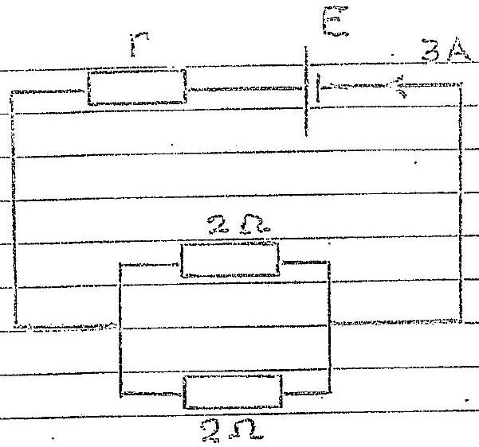

$$
\begin{aligned}
& E = 3 \left[ r + \left( \frac { 1 } { 2 } + \frac { 1 } { 2 } \right) ^ { - 1 } \right] \\
& E = 3 [ r + 1 ]
\end{aligned}
$$

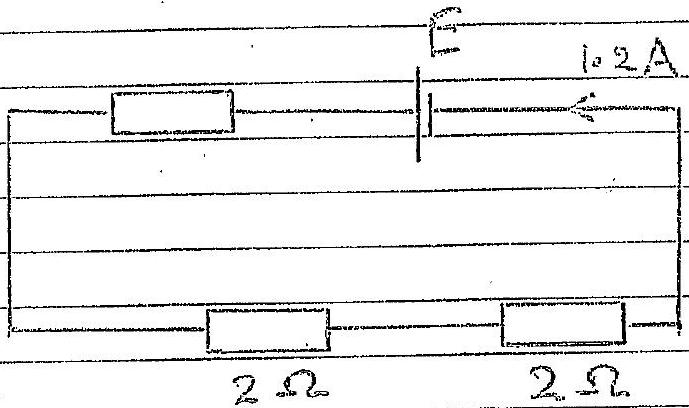

$$
E = 1.2 ( r + 4 )
$$

(2) 1

From (1) and (2)

$$
3 ( r + 1 ) = 1 \cdot 2 ( r + 4 )
$$

$$
r = 1 \Omega
$$

Sub9.

$$
E = 6 \mathrm {~V}
$$

$$
\left. \begin{array} { l }
\frac { 1 } { 2 } \\
\frac { 1 } { 2 }
\end{array} \right\}
$$

Pawer desarpated in each $2 \Omega$ reacitor un serves arcunt

$$
W = 2 ( 1.2 ) ^ { 2 } = 2.88 \mathrm {~W}
$$

Power dosipated in each $2 \Omega$ measitos in parallel corrit

$$
\begin{aligned}
& W = \left( \frac { 3 } { 2 } \right) ^ { 2 } 2 \\
& W = 4.5 W
\end{aligned}
$$

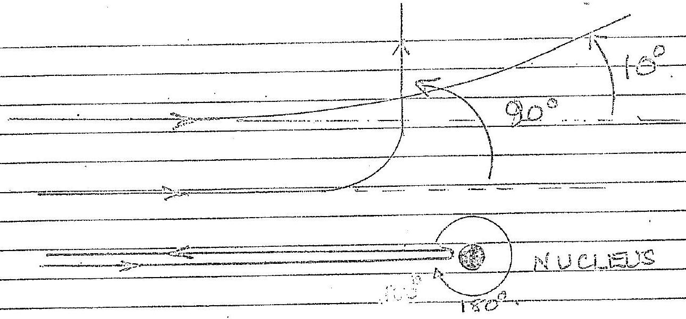
$\frac { 1 } { 2 }$ mode for each appear deflection augle eocoed I make is $180 ^ { \circ }$ deflection dosest to muclees,
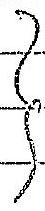
10° deflection furthet and 90° tubermedicte

At dowist appreach alecuted velocity is zero, nelative it nucleis presticle gais from a pproaching medemos seceding from nucleus
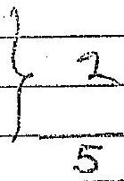
(l)

$$
\begin{aligned}
& \frac { 1 } { 2 } w _ { i } v ^ { 2 } = \text { wigh for element of } \\
& v ^ { 2 } = 2 g h \\
& V = \sqrt { 2 ( 9.81 ) ( 0.20 ) } \\
& v = 1.98 . \mathrm { ms } ^ { - 1 }
\end{aligned}
$$

Horyontal welcrity of emerging waiter 1.98 ms ${ } ^ { 5 }$. True, $t$, to reach thi floor is geven by $11 s = u t + 3 g t ^ { 2 }$ " growng,

$$
\begin{aligned}
0.80 & = \frac { 1 } { 2 } ( 9.81 ) t ^ { 2 } \\
t & = \sqrt { \frac { 1.6 .0 } { 9.81 } } \\
t & = 0.403 \mathrm {~s}
\end{aligned}
$$

Hompart dobacer Eswilled

$$
\begin{aligned}
& K = \int ( - 90 ) ( 0,403 ) \\
& K - 80 \text { cades }
\end{aligned}
$$

Q1 (m)
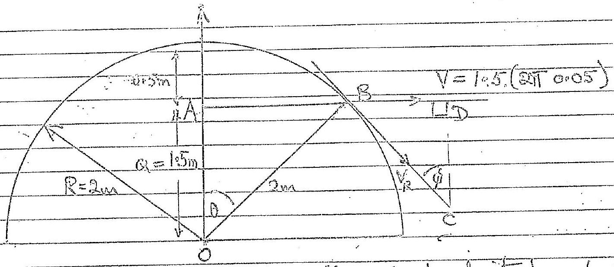
As seen by observer puck moves with canstant velocity $V =$ ran'

$$
\begin{aligned}
v & = 1.5 ( 2 \pi 0.05 ) \\
& = 0.4 \pi 1 \mathrm {~ms} ^ { - 1 }
\end{aligned}
$$

(1) Time or twantable, to gaveir by

$$
\begin{aligned}
v t & = \sqrt { R ^ { 2 } - a ^ { 2 } } \\
& = \sqrt { 2 ^ { 2 } - ( 1.5 ) ^ { 2 } }
\end{aligned}
$$

Giving

$$
t = 2.88
$$

(ii) $V = 1.5 ( 2 \pi 0.05 )$ and rim speed of turnatale $V _ { R } = 20 ( 2 \pi 0.05 )$ Now velocity lowingle $B C D$ is aimilar to $O A B$ - $A D$ velocities of partinal to length $O A$ and $O B , B D C = 90$.
To obtain velocity of puck licuring timitable melatice to smdent, feurse $V _ { R }$ and add vectorally to v.
Hence nelostrie velocity of puck is, whene of is aughle to tengent,

$$
\sqrt { V _ { R } ^ { 2 } - V ^ { 2 } } \text { at arryle } \phi = \operatorname { sen } ^ { - 1 } \left( \frac { 1.5 } { 2.0 } \right) \text { to tangent }
$$

ie $\quad 2 \pi ( 0.05 )$ tio T 5 at ough $\phi = 48.6 ^ { \circ }$ to: tougent

$$
0.436 \mathrm {~ms} ^ { - 1 } \text { at augh } \phi = 48.6 ^ { \circ } \text { to tangent }
$$

Q1_(n)

$$
\text { Area of } \log p = ( 0.04 ) ^ { 2 } = 1.6 \times 10 ^ { - 3 } \mathrm {~m} ^ { 2 }
$$

If is the flue du in the changery forded the $p d$ in question

$$
V = \frac { d x } { d t } = 1.6 \times 10 ^ { - 3 } ( 0.30 ) = 0.48 \times 10 ^ { - 3 } \mathrm {~V}
$$

As $R = 2 \times 10 ^ { - 3 } \Omega$, sament I greenity

$$
\begin{aligned}
& I = \frac { 0 - 48 - 40 ^ { - 3 } } { 2 - 00 \times 10 ^ { - 3 } } \\
& I = 0.24 \mathrm {~A}
\end{aligned}
$$

Diechram
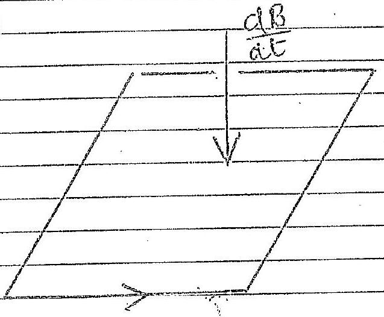

Correct Deagetere

The ownent withe loses must produce a magnetic fild that opposes wereasing (dB/dt), henzs'Law
(c) Lit he be hught nathed
(i) Energy

$$
\begin{aligned}
E & = 60 \times 12 \times 60 \times 60 . \mathrm { J } \\
& = 12 \left( 60 ^ { 3 } \right) \\
& = m ^ { g } h
\end{aligned}
$$

Trans

$$
\begin{aligned}
20 ( 9.81 ) h & = 12 \left( 60 ^ { 3 } \right) \\
h & = 1.32 \times 10 ^ { 6 } \mathrm {~m}
\end{aligned}
$$

(ii)

$$
\begin{aligned}
I ( 9.81 ) \cdot R & = 4 \times 10 ^ { \pi } \\
R & = 4.08 \times 10 ^ { 6 } \mathrm {~m}
\end{aligned}
$$

Q1 (p) of sis the density for ite secon of are , AR in theitmen then Manas of be belb $M _ { 2 } = 4 \pi R ^ { 2 } \Delta R S$
Upilhwat, 1 , durity awamaduig air is guew by

$$
U = \frac { 4 } { 3 } \pi R ^ { 2 } ( 10.28 - 0.18 ) g
$$

News

$$
\operatorname { Msg } = 0
$$

Their

$$
4 \pi R ^ { 2 } \Delta R \rho g = \frac { 5 \pi R ^ { 3 } } { 2 } ( 1.28 - 0.18 ) g
$$

Giving

$$
\Delta R = \frac { \left( 1.5 \times 10 ^ { - 2 } \right) ( 1.10 ) } { 3 \times 10 ^ { 3 } }
$$

Develving by $A _ { 12 } = 650 \times 10 ^ { - 9 } \mathrm { kx }$

$$
\begin{aligned}
& \frac { \Delta R } { \lambda _ { \text {Rad } } } = \frac { ( 1.10 ) \left( 1.5 \times 10 ^ { - 2 } \right) } { \left( 3 \times 10 ^ { - 3 } \right) \left( 650 \times 10 ^ { - 9 } \right) } \\
& \frac { \Delta R } { \lambda _ { \text {Red } } } = 8.46
\end{aligned}
$$

4

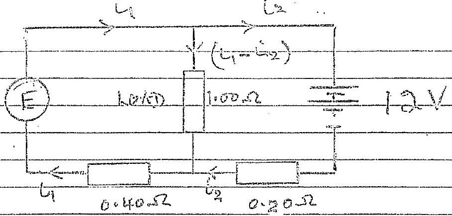

This result when $i _ { 3 } = 0$
LH lock quee

$$
\begin{align*}
E & = ( 1000 + 0.40 ) i _ { 1 } \\
& = 1.40 i _ { 1 } \tag{1}
\end{align*}
$$

RH berp give

$$
\begin{equation*}
12 = 1000 U _ { 1 } \tag{()}
\end{equation*}
$$

Subs for i, from (2) vita (1)

$$
E = 1600
$$

(ii) Rower effectivey

$$
\begin{aligned}
& = \frac { i _ { 1 } ^ { 2 } ( 1.00 ) } { i _ { 1 } ^ { 2 } ( 1.40 ) } \times 100 \% \\
& = \pi \%
\end{aligned}
$$

(iii) kit lexp :

$$
\begin{align*}
& 20 = 1.00 \left( i _ { 1 } - i _ { 2 } \right) + 0.40 i _ { 1 } \\
& 20 = 1.40 i _ { 1 } - i _ { 2 } \tag{3}
\end{align*}
$$

RH Toep:

$$
\begin{align*}
& 12 = 100 \left( i _ { 1 } - i _ { 2 } \right) - 0.20 i _ { 2 } \\
& 12 = i _ { 1 } - 1.2 i _ { 2 } \tag{A}
\end{align*}
$$

Substituting it from (4) wife (3)

$$
\begin{align*}
20 & = 1.4 \left( 12 + 1.2 i _ { 2 } \right) - i _ { 2 } \\
& = 16.8 + 0.68 i _ { 2 }  \tag{I}\\
i _ { 2 } & = \frac { 3.2 } { 0.68 } = 4.07 \mathrm {~A} \tag{8}
\end{align*}
$$

(i) (b) By sypmouthy, measing $V$ grois the same arrangenent. $S _ { 0 }$

$$
\begin{align*}
& i _ { 3 } = i _ { 4 }  \tag{1}\\
& i _ { 4 } = i _ { 2 }  \tag{1}\\
& i _ { 6 } = 0 \tag{ii}
\end{align*}
$$

$$
\begin{aligned}
& R _ { 1 } = \left( \frac { 1 } { 2 } + \frac { 1 } { 2 } + \frac { 1 } { 4 } \right) ^ { - 1 } \\
& R _ { 23 } = \frac { 4 } { 5 }
\end{aligned}
$$

02 (ह)
(ii)

$$
\begin{aligned}
& i _ { 3 } = i _ { 4 } = \frac { 1 } { 2 } V \\
& i _ { 1 } = i _ { 2 } = \frac { 1 } { 4 } V
\end{aligned}
$$

$$
i _ { 6 } = 0
$$

(m)
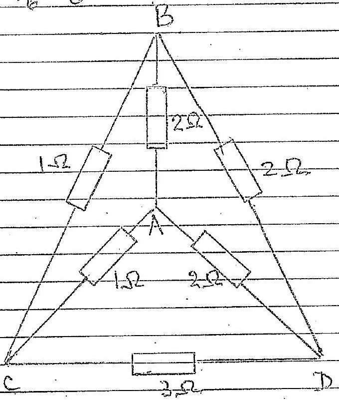
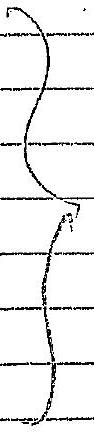

Drandung

The circuit o a balanced isheel tome bedge, so $i _ { A B } = 0$ Resultance acreno consists $33 \Omega$ resistance ni parallel
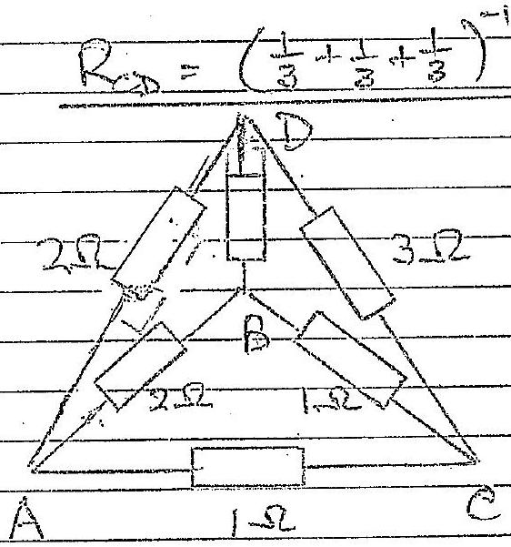

Diranting 1

This exceist caunot be reduced to a wheats lone bredge two lowed areait consequestely the meastarce areas Ac cound be do sacd on a coupleciate if exieffered in'sembe as parallel.

Q3 (6) Equation of workin

$$
m _ { i } c = \frac { \operatorname { Gin } \left( \frac { 4 } { 2 } \pi x ^ { 3 } \cdot \rho \right) } { x ^ { 2 } }
$$

as ettraction due to sphese raducs x.
Nowi wans of the Eurlh Me given by

$$
M _ { E } = \frac { 5 } { 3 } \pi R _ { E } ^ { 3 } \rho
$$

Theors

$$
\frac { 4 } { 3 } \pi x ^ { 3 } \rho = \frac { 2 ^ { 3 } } { R ^ { 3 } } M x
$$

Cruving

$$
\begin{aligned}
m x & = - \frac { G m x ^ { 3 } M E } { x ^ { 2 } R ^ { 3 } E } \\
x ^ { 6 } C & = - \frac { G M E } { R ^ { 3 } E }
\end{aligned}
$$

FTW: \& SHM.
The perood $T _ { i }$ is green by

$$
\begin{equation*}
T _ { 1 } = 2 \pi / \frac { R _ { E } ^ { B } } { G M _ { E } } \tag{0}
\end{equation*}
$$

However at the surface of the Evath

$$
\begin{align*}
& m g = \frac { G M E m } { R _ { E } ^ { 2 } } \\
\text { Criving } & g = \frac { G M E } { R _ { E } ^ { 2 } } \tag{2}
\end{align*}
$$

Substabuting for Me from (2) wate (1)

$$
\begin{aligned}
T _ { 1 } & = 2 \pi \sqrt { \frac { 25 } { 9 } } \\
& = 2 \pi \sqrt { \frac { 6.38 \times 10 ^ { 5 } } { 9.81 } } \\
T _ { 1 } & = 5.07 \times 10 ^ { 3 } \mathrm {~s}
\end{aligned}
$$

of 1-Row, 24 wins, 27 see

Q3 (b) Equation of motion
$$
00 = - \frac { \cos } { s ^ { 2 } } \left( \frac { s ^ { 3 } } { R ^ { 3 } } M _ { \bar { E } } \right) \cos \theta
$$
$\frac { G M M n \sin \theta } { R ^ { 3 } }$
$\frac { \text { GriMe } x } { R _ { E } ^ { 3 } }$
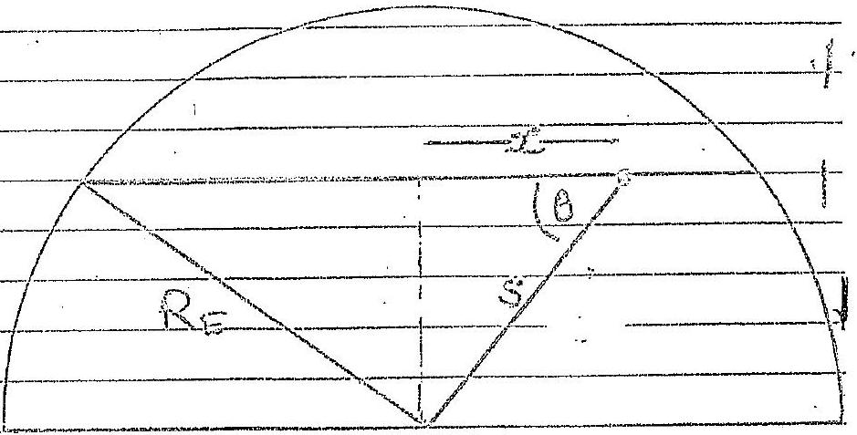
$$
\ddot { s } = \frac { \text { GME } } { R _ { E } ^ { 3 } }
$$
This is sum wife same percod as in (a) so $T _ { 1 } = T _ { 2 } = 2 \pi \sqrt { \frac { T _ { 1 } } { - g } }$
(c) Forcurenlar motain in close Eartharkit warlh velocty v
$$
\begin{array} { r }
\frac { m v ^ { 2 } } { R _ { e } } = \frac { C _ { r } M _ { e } m } { R _ { E } ^ { 2 } } \\
v = \sqrt { \frac { G _ { E } M _ { E } } { R _ { E } } } \tag{1}
\end{array}
$$
Peniol of curita $T _ { B } = \frac { 2 \pi R _ { E } } { r } = 2 \pi R _ { E } \sqrt { \frac { R _ { E } } { G _ { M } } }$ from (1)
$$
\begin{aligned}
\text { Now } g = \frac { \text { Grote } } { R _ { B } t ^ { 2 } } , & \text { so } \\
T _ { B } & = 2 \pi \sqrt { \frac { R E } { g } }
\end{aligned}
$$
Tima $T _ { 3 } = T _ { 1 } = T _ { 2 }$
(a) By Kellir's forst low the tranctary will be are ellepe with the centre of the Earth as始点 forcen

(a) be awam the do followrth arear the acting of the
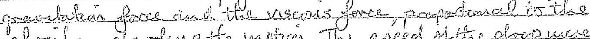
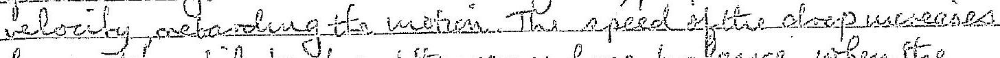 from and unit ing out lievisoors for be lever when the day folle with emstrate valeaty.
(b) Viscrio foce in opposited accot to welowery. Readuing force perpended or to this decetwer, with elect f eld treaud change $C _ { 1 }$
$$
\begin{aligned}
m g \cos 45 ^ { \circ } & = E Q _ { 1 } \operatorname { sen } 45 \\
Q _ { 1 } & = \frac { m g } { E } \\
& = \left( 3.3 \times 10 ^ { - 1 } . \right) ( 9.81 ) \left( \frac { 3.0 \times 10 ^ { - 2 } } { 2.0 \times 10 ^ { 3 } } \right) \\
Q _ { 1 } & = 4.95 \times 10 ^ { - 19 } C
\end{aligned}
$$
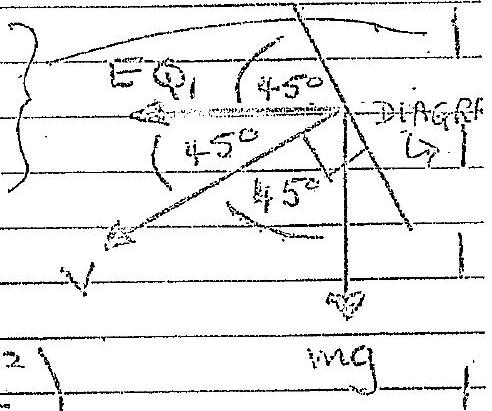
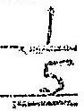
(e) Drap aquaies addertivial eharges Lat charge be Q. Inverellwing at aighe Eto vertical Rosbluing forceoperpendiculter to velocity
$$
\begin{align*}
\operatorname { mgsin } \theta & = E Q \frac { \cos \theta } { Q } \\
Q & = \frac { \operatorname { mg } \tan \theta } { E } \\
Q & = \left( 3.3 \times 10 ^ { - 15 } \right) ( 9.81 ) \left( 1.5 \times 10 ^ { - 5 } \right) \tan \theta \\
Q & = 4.86 \times 10 ^ { - 19 } \tan \theta \tag{1}
\end{align*}
$$
$$
\theta = 18.43 \text { for charge } Q _ { 2 }
$$
Suid wito (i),
$$
\begin{aligned}
& Q _ { 2 } = 4.86 \times 10 ^ { - 19 } ( 0.3332 ) \\
& Q _ { 2 } = 1.62 \times 10 ^ { - 19 }
\end{aligned}
$$
$$
\theta = 33.70 ^ { \circ } \text { for charge } Q _ { 3 }
$$
Sub. Noto (1)
$$
Q _ { 3 } = 3 \cdot 24 \times 10 ^ { - 19 } \mathrm { C }
$$

Reak end note is the lecucte common demonianction
keveraltiation

$$
1.62 \times 10 ^ { 4 }
$$

(Q)
(4) $\quad m g = - k v$

Substituting

$$
\begin{aligned}
& 10 ^ { - 14 } ( 9.81 ) = - k \left( 4.0 \times 10 ^ { 4 } \right) \\
& k = 2.65 \times 10 ^ { - 10 }
\end{aligned}
$$

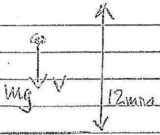

Now for a charges

$$
\frac { V } { d } ( m e ) - v \operatorname { tg } + k v
$$

Sibitaticting munirical values

$$
\begin{aligned}
\frac { 1.5 \times 10 ^ { 3 } \left( 1.60 \times 10 ^ { - 19 } \right) } { 12 \times 10 ^ { - 3 } } & = 10 ^ { - 14 } ( 9.51 ) + 2.65 \times 10 ^ { - 10 } \left( 8 \times 10 ^ { - 5 } \right) \\
& \approx 11.9 \times 10 ^ { - 14 } \\
m & = \frac { 10 ^ { + 4 } ( 11.9 ) ( 12 ) } { 10 ^ { - 13 } ( 1.5 ) ( 1.60 ) } \\
m & = 6
\end{aligned}
$$

(i) For writerabue interginewer of order for wordeugth $\lambda$
$$
\begin{equation*}
2 \mu t = p \lambda + \frac { 1 } { 2 } \lambda \tag{1}
\end{equation*}
$$

(xylechen at fount face of film gavies acide to au at with al phan who ge asselloated with a path lear th of to
Far the work light(1) guis dar $p = 0$

$$
\begin{aligned}
2 ( 1.45 ) t _ { r } & = \frac { 1 } { 2 } \lambda \\
2.90 t _ { r } & = \frac { 1 } { 2 } ( 420 ) 10 ^ { - 9 } \\
t _ { r } & = 72 \cdot 4 n \cdot m
\end{aligned}
$$

(ii) As $t _ { r }$ receives 3.0 om from filher top
$$
\begin{aligned}
x _ { 1 } \phi & = x _ { v } \\
\phi & = \frac { 72.4 \times 10 ^ { - 9 } } { 3.00 \times 10 ^ { - 2 } } \\
\phi & = 2.4 \times 10 ^ { - 6 } \\
& = 1.38 \times 10 ^ { - 4 } \quad \text { degreens }
\end{aligned}
$$
(iii) For ned night
$$
2 m t _ { R } = \frac { 1 } { 2 } \lambda
$$
$$
\begin{aligned}
\frac { x _ { R } \phi } { x _ { R } } & = t _ { R } & ( 2.90 ) & t _ { R } = \frac { 1 } { 2 } \left( 680 \times 10 ^ { - 9 } \right) \\
x _ { R } & = \frac { 117 \times 10 ^ { - 9 } \mathrm {~m} } { 2.41 \times 10 ^ { - 6 } } & & t _ { R } = 117 \mathrm { emorn } \\
& = 4.85 \mathrm {~cm} & ( \text { mark } ) &
\end{aligned}
$$
(iv)
$$
\begin{equation*}
t _ { y } = \phi x _ { y } \tag{1}
\end{equation*}
$$
$t _ { r }$ remaines emostant wo $\phi$ and $x _ { r }$ change
$$
\begin{aligned}
t _ { v } & = ( \phi + \Delta \phi ) \left( x _ { v } + \Delta x _ { v } \right) \\
& = \phi x _ { v } + \Delta \phi x _ { v } + \Delta x _ { v } \phi + \Delta \phi \Delta x _ { v } ( 2 )
\end{aligned}
$$
Subractuig (1) fram (2) und neglecting $\Delta \phi \Delta x$
$$
0 = \Delta \phi x + \Delta x \phi
$$
Derivangly At
$$
\phi = \Delta \varphi + \varphi + \varphi
$$

(iv) Naw

$$
\frac { A D } { A E } = 8.3 \times 10 ^ { - 5 }
$$

deferen per minitie
So velocity of viotel fruge, $\frac { \Delta x } { \Delta t }$, is guver by

$$
\frac { \Delta x _ { r } } { \Delta t } = - \frac { 1 } { \phi } \frac { \Delta \phi } { \Delta t } = v
$$

Now $- \frac { \Delta p } { \Delta t } = - 3 x + 0 ^ { - 5 }$ Wepter partmande
Sub from (1)

$$
\frac { \Delta \times 1 } { \Delta t } = \frac { 8.3 \times 10 ^ { - 5 } } { 1.38 \times 10 ^ { - 4 } } \left( 3.00 \times 10 ^ { - 2 } \right)
$$

Velocity of fruge

$$
\left. \begin{array} { l }
= - 1.8 \times 10 ^ { - 2 } \mathrm {~m} \cdot \mid \mathrm { min } \\
= 1.8 \mathrm { cars } / \mathrm { min }
\end{array} \right\}
$$

$v _ { v } = 1.8 \mathrm { cans } / \mathrm { min }$

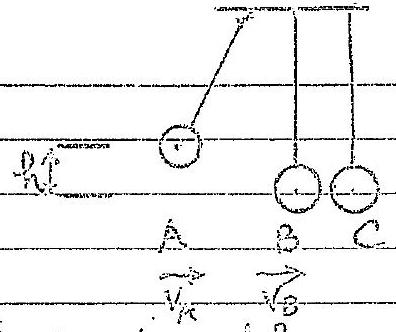

Forst, Collision between A curd B
Let $V _ { 1 }$ wald $V _ { 2 }$ be willeties of $A$ cund is offer coiliam Conservation of monnecture be for ound ofter A Rito B with velocity $\sqrt { 2 g h }$

$$
m \sqrt { 2 g h } = m \left( v _ { A } + v _ { B } \right)
$$

lowscrivation of energy

$$
\frac { 1 } { 2 } m ( 2 z l ) = \frac { 1 } { 2 } m \left( v _ { A } ^ { 2 } + v _ { B } ^ { 2 } \right)
$$

Simply fying the equations

$$
\begin{equation*}
\sqrt { 2 g h } = V _ { A } + V _ { B } \tag{d}
\end{equation*}
$$

$$
\begin{equation*}
2 g ^ { \prime } = v _ { A } ^ { 2 } + v _ { B } ^ { 2 } \tag{2}
\end{equation*}
$$

$$
\begin{equation*}
= \left( \sqrt { z d h } - v _ { B } \right) ^ { 2 } + v _ { B } ^ { 2 } \quad \text { from } \tag{1}
\end{equation*}
$$

As $V _ { 6 } \neq 0$

$$
V _ { B } = \sqrt { 2 } g h
$$

Subefituting into (1) $\quad V _ { A } = 0$
Ass at neat aral B has velocity $\sqrt { 2 g h }$ after the extiasn
Collesion of B with C
Collision of B with \& has arme conservatzon equations as $A$ with $B$ as $B$ withally has webaby $\sqrt { 20 } k$. Thes ofter collineas B of reate and C There whet'y dagh wad wase nother c mant hight $h$.
Now Catacts of Rogn's, with sourd Bateraty and so ith
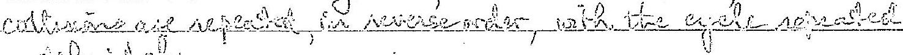 of

(ii) Belling Detween AandB

Conservation of momentom (A and B have velocities Vand Of affer ealisora)

$$
M \sqrt { 2 g h } = M v _ { A } + 2 M r _ { B }
$$

Romservation of marge

$$
\frac { 1 } { 2 } M ( 2 g h ) = \frac { 1 } { 2 } M V ^ { 2 } + \frac { 1 } { 2 } ( 2 N ) V _ { B }
$$

Simplifyeng,

$$
\begin{align*}
& 2 g h = v _ { i } + 2 v _ { B }  \tag{3}\\
& 2 g h = v _ { A } ^ { 2 } + 2 v _ { B } ^ { 2 } \tag{\(\theta\)}
\end{align*}
$$

Substituting $V _ { A }$ firm (3) into (1)

$$
\begin{aligned}
& 2 g h = \left( \sqrt { 2 g h } - 2 v _ { B } \right) ^ { 2 } + 2 v _ { B } ^ { 2 } \\
\text { Giving } & 2 g h = 2 g h - 4 v _ { B } \sqrt { 2 g h } + 4 v _ { B } ^ { 2 } + 2 v _ { B } ^ { 2 } \\
\text { As } v _ { B } \neq 0 & R _ { 4 } \sqrt { 2 g h } = 6 v _ { B } \\
& v _ { B } = \frac { 2 } { 3 } \sqrt { 2 g h }
\end{aligned}
$$

Substituting into (3)

$$
\begin{aligned}
V _ { A } & = \sqrt { 2 g h } - 2 V _ { B } \\
& = \sqrt { 2 g h } - 2 \left( \frac { 2 } { 3 } \right) \sqrt { 2 g h } \\
& = \sqrt { 2 g h } \left( 1 - \frac { 1 } { 3 } \right) \\
V _ { A } & = - \frac { 1 } { 3 } \sqrt { 2 g h }
\end{aligned}
$$

Sollioin of B with C (Band Chavevelocatios vioud ve offer coltinin) Manaeator conservation $2 M \left( \frac { 2 } { 3 } \sqrt { 2 g h } \right) = 2 M V _ { B } + 3 M V _ { C }$ Evergy conservation $\frac { 1 } { 2 } ( 2 M ) \frac { w } { 4 } ( 2 g h ) = \frac { 1 } { 2 } ( 2 M ) V _ { b } + \frac { 1 } { 3 } ( 3 M ) V _ { b }$ $5 \sqrt { 2 g h } = 2 v _ { b } + 3 v _ { c }$

$$
\begin{equation*}
9 ( 2 g ) = 2 x ^ { 2 } + 3 v ^ { 2 } \tag{S}
\end{equation*}
$$

Sub́ Or b fram (S) who 6)

$$
\begin{equation*}
y ( 2 \operatorname { gn } ) = 2 \left( \frac { 1 } { 3 } \sqrt { 2 } \sin - 3 x ^ { 2 } \right) + 3 x ^ { 2 } \tag{6}
\end{equation*}
$$

Giving
As $\quad V _ { B } ^ { \prime } \neq 0$

$$
\begin{align*}
\frac { d t } { g } ( 2 g ) & = \frac { 1 } { 2 } \left( \frac { 16 } { g } ( 2 g ) - 8 \sqrt { 2 g } v ^ { i } + 9 v ^ { 2 } \right) + 3 v ^ { 2 } \\
& = \frac { 16 } { 9 } ( 2 g ) - 4 v ^ { 2 } \sqrt { 2 g h } + \frac { 9 } { 2 } v ^ { 2 } + 3 v ^ { 2 }  \tag{3}\\
4 \sqrt { 2 g h } v _ { 0 } ^ { \prime } & = v _ { 0 } ^ { 1 / 2 } \left( \frac { g } { 2 } + 3 \right) = \frac { 15 } { 2 } v _ { 0 } ^ { 12 } \\
v ^ { \prime } & = \frac { 9 } { 15 } \sqrt { 2 g h }
\end{align*}
$$

So $C$ omis to a hight $H$ gmen by usung conservation of emorgy

From (7)

$$
\begin{aligned}
3 M g H & = \frac { 1 } { 3 } 3 M V _ { 0 } ^ { 2 } \\
& = \frac { 3 } { 2 } M \left( \frac { 64 } { 225 } ( 2 g h ) \right) \\
H & = \left( \frac { 64 } { 225 } \right) h
\end{aligned}
$$

(a) There is acco triture from the roted of the Earth for polar orbit Using would notzation, if safellite Dae wasn rumand spect'y,
$$
\begin{aligned}
\frac { m v ^ { 2 } } { R _ { E } ^ { 2 } } & = \frac { G M E _ { E } m } { R _ { E } ^ { 2 } } \\
v ^ { 2 } & = \frac { G M E _ { E } } { R _ { E } }
\end{aligned}
$$
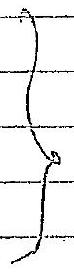
How ever
$$
g = \frac { G M E } { R ^ { 2 } 6 }
$$
$S _ { 0 }$
$$
\begin{aligned}
v ^ { 2 } & = g R E \\
v & = \sqrt { g R E } \\
& = \sqrt { ( 9.81 ) ( 6.38 ) \times 10 ^ { 6 } } \\
w & = 7.91 \mathrm { kms } ^ { - 1 }
\end{aligned}
$$
(b) For equatoril abit speed of Ecuth can supplement welocity if Leunchel is direction of rotation of the Earth Spech of aspation of the Earth, $V$, gweil by persed of rotation
$$
\begin{aligned}
\frac { 2 \pi R E } { V } & = 24 \times 6.0 \times 60 \\
V & = 2 \pi R 6 / 24 \times 60 \times 60 \\
V & = 0.46 \mathrm { k } \mathrm {~ms} ^ { - 1 }
\end{aligned}
$$
Focutoried lawnd speed $( 7.91 - 0.4 \mathrm {~b} ) = 7.45 \mathrm {~km} . ^ { - 1 }$ Thus Natio
$$
\begin{aligned}
\text { Polar laund spead } & = \frac { 7.91 } { 7.45 } \\
\text { Equidorial launch speed } & = 1.06
\end{aligned}
$$

(9) Escape Sheed V

The settlete munt Iowe sufficient imptgy to escape from the gravitational field of the Earth

$$
\begin{aligned}
\frac { 1 } { 2 } w v ^ { 2 } & = \frac { G M b } { R E } \\
v & = \frac { 2 G M E } { R E } \\
A s = \frac { G M b } { R ^ { 2 } E } , & = \sqrt { 2 g R E }
\end{aligned}
$$

Subshbuting for g and Re

$$
V = 11.2 \mathrm { kms } - 1
$$

Minimum Spord
Uswig Faith rotation former equilarial lawel Than can be dedwerd by 0.4 .6 kwist georing

$$
V = 10.7 \mathrm { kms } ^ { - 1 }
$$

(d) In adder to hit the Sur the speed of probe wint be reduced to zono relative to the low so that it 'falls' unfo the Sun and does mot orbit it.
So ene muct laund it withe opposite derection lette collecion of the Earth awound ite Sun wife a velociefy epposite to then of the Earle around ite Sur
Speed of Earth around the Sun V guear by

$$
\frac { 2 \pi R _ { E S } } { V } = 365 \times 24 \times - 60 \times 260
$$

ellege $R _ { 0 }$ is

$$
\begin{aligned}
& V = \frac { 2 \pi \left( 1.50 \times 10 ^ { 8 } \right) } { 365 \times 29 \times 60 \times 60 } \quad \mathrm {~km} \mathrm {~s} ^ { - 1 } \\
& V = 29.9 \mathrm {~km} \text { s }
\end{aligned}
$$

I it lounde a eed is theor the launde speed Durt be a fainet to seape formity greate tals fall of the swa c for putle of wern a

$$
\begin{aligned}
& \frac { 1 } { 2 } h _ { V ^ { 2 } } ^ { 2 } = \frac { G m M s } { R a s } \quad \text { (Ms wo of Sim) } \\
& r ^ { 2 } = \frac { 2 G M s } { R G s } \\
& = \frac { 2 \left( 6.67 \times 10 ^ { - 11 } \right) \left( 1.99 \times 10 ^ { 30 } \right) } { 1.50 \times 10 ^ { 11 } } \left( \mathrm {~m} \mathrm {~s} ^ { 1 } \right) \\
& = 17.7 \times 10 ^ { 8 } \\
& v = 42.1 \times 10 ^ { 3 } \mathrm { ws } ^ { - 1 } \\
& V = 42.1 \mathrm { kms } ^ { - 1 } \text {. }
\end{aligned}
$$

Que ear we ithe rotational speed of the Earlh lo riduce the laimed spech by $29.9 \mathrm { kms } ^ { - 1 }$ giving a lewnel spech in the derection of rotation of the Eurlharound the Sur of v'geverby

$$
\begin{aligned}
& V ^ { \prime } = ( 4.201 - 29.9 ) \mathrm { kw } s ^ { - 1 } \\
& V ^ { \prime } = 12.2 \mathrm { kms }
\end{aligned}
$$

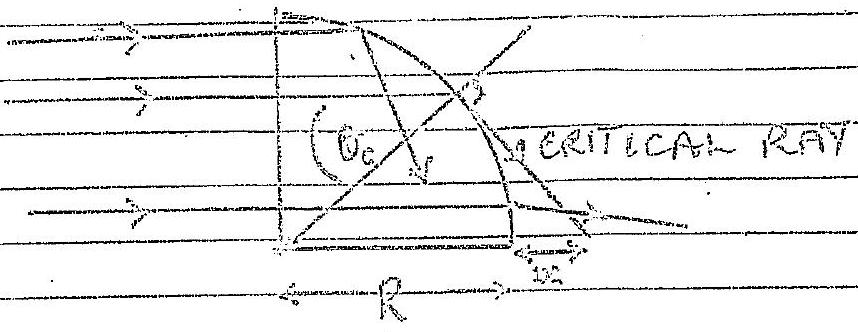

Critical anyle $\theta _ { e }$
Theorgel of incodence, and werved righee, werescries with hight of the weident ray The witried nong has are angle of if rocin of 20 Subsequent Rolo, rey are totally -temally tepered; sa pio light is affected. Then far the forjo worght realth ite it ble:
The cardical Arey, for ufracture index of provin off, in greamley

$$
\begin{equation*}
\sin \theta _ { 2 } = \frac { 1 } { 1 } = \frac { 1 } { 1.5 } \tag{1}
\end{equation*}
$$

Uswig geomethy fac crifical roy indeageram

$$
\begin{equation*}
\frac { R } { R + x } = \cos \theta _ { c } \tag{2}
\end{equation*}
$$

Substituting $Q$ with \& wحة $R = 5.00 \mathrm {~cm}$

$$
x = 1,71 \mathrm {~cm}
$$

Belem
Bund this rale of $x$ mo light is incident on the table; lealt reaches the table for $\frac { 0 < x \leqslant 1,71 } { x > 1,71 }$
(ii) Wet $\theta _ { e }$ be the contrical angle, angle of incidelence on evived face $\alpha _ { c }$ with an angle of refraction of (seediagtant)
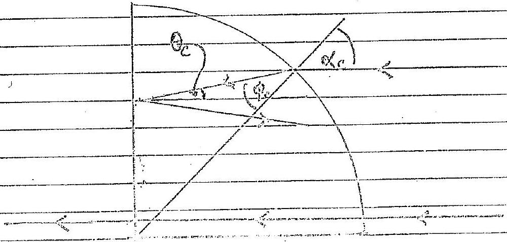

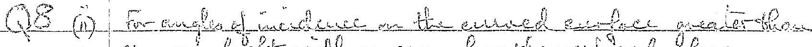 of a do for well en-ferere with face
Now

$$
h = \frac { \sin d _ { c } } { \sin ^ { 2 } d _ { c } }
$$

and
A dea

$$
\alpha _ { c } = \theta _ { c } + p _ { c } \quad i = \quad p _ { c } = \alpha _ { c } - \theta _ { c }
$$

$$
\begin{equation*}
K = \frac { \sin \alpha _ { c } } { \operatorname { sun } \left( \alpha _ { c } - \theta _ { c } \right) } \tag{3}
\end{equation*}
$$

duk

$$
- \sin \theta _ { c } = \frac { 1 } { 1 }
$$

Substitiving $\alpha _ { i } = 83.27 ^ { \circ }$ and $\theta _ { e } = 4.1 .81 ^ { \circ }$ $p ^ { l u m } \quad \mu = 1.5$ clinto (3)

$$
\text { LHS } = 1.50 \text { and } - \text { RHS } = 1.50
$$

Then for angles of inecelence greater than 88.27 me light emenge from the withed foee of the perso.
(b) $\theta$ is the cirtrical angle

$$
\sin ^ { c } \theta = \frac { V _ { 1 } } { V _ { 2 } }
$$

aud

$$
\cos \theta = \frac { \sqrt { V _ { 2 } { } ^ { 2 } - V _ { 1 } { } ^ { 2 } } } { V _ { 2 } }
$$

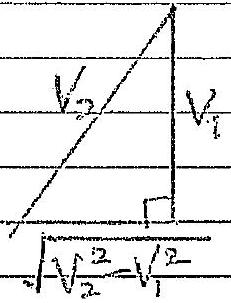
Equating tienis for the troo patts

Thank

$$
\begin{aligned}
& \frac { x } { V _ { 1 } } = \frac { 2 h } { V _ { 1 } \cos \theta } + \frac { 1 } { V _ { 2 } } ( x - 2 \cdot \tan \theta ) \\
& = \left( \frac { 1 } { V _ { i } } - \frac { 1 } { V _ { 2 } } \right) = \frac { 2 h } { \cos \theta } \left( \frac { 1 } { V _ { 1 } } - \frac { \sin \theta } { V _ { 2 } } \right) \\
& C \left( \frac { V _ { 2 } - V _ { 1 } } { V _ { 1 } V _ { 2 } } \right) = \frac { 2 R V _ { 2 } } { V _ { 2 } ^ { 2 } - V _ { 2 } } \left( \frac { 1 } { V _ { 1 } } - \frac { V _ { 1 } } { V _ { 2 } ^ { 2 } } \right) \\
& = \frac { 2 h _ { 2 } } { h _ { 2 } ^ { 2 } - { v _ { 1 } ^ { 2 } } ^ { 2 } } \left( \frac { { v _ { 2 } } ^ { 2 } - v _ { 1 } ^ { 2 } } { u _ { 2 } ^ { 2 } } \right) = \frac { 2 b _ { 2 } } { u _ { 2 } v _ { 2 } } \left( v _ { 2 } - v _ { 2 } \right) \\
& 2 c = 2 \frac { 1 } { 10 } - \frac { 1 / 2 + 1 } { 1 / 2 - 14 }
\end{aligned}
$$
