Q1
2014 BPLO PAPER 2 SONUTIONS
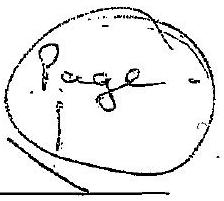
(a) (i)
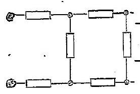

Marks.

$$
\begin{aligned}
R _ { 2 } & = 2 R + \left( \frac { 1 } { R } + \frac { 1 } { 3 R } \right) ^ { - 1 } \\
& = 2 R + \frac { 3 } { 4 } R \\
R _ { 2 } & = 2 \frac { 3 } { 4 } R
\end{aligned}
$$

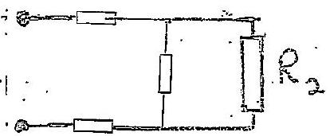

$$
\begin{aligned}
& R _ { 3 } = 2 R + \left( \frac { 1 } { R } + \frac { 4 } { 11 R } \right) ^ { - 1 } \\
& R _ { 3 } = 2 \frac { 11 } { 15 } R
\end{aligned}
$$

(ii)
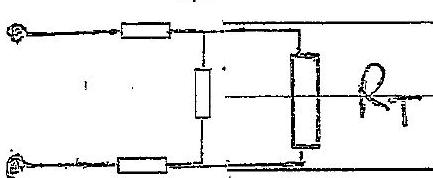

$$
\begin{aligned}
\dot { R } _ { T } & = 2 R + \left( \frac { 1 } { R } + \frac { 1 } { R _ { T } } \right) ^ { - 1 } \\
& = 2 R + \frac { R R _ { T } } { \left( R + R _ { T } \right) } \\
R _ { T } ^ { 2 } - 2 R R _ { T } - 2 R ^ { 2 } & = 0
\end{aligned}
$$

Soffing

$$
\begin{aligned}
R _ { T } & = \frac { 2 R \pm \sqrt { ( 2 R ) ^ { 2 } + 4 \left( 2 R ^ { 2 } \right) } } { 2 } \\
& = R \pm 3 \sqrt { 3 } R
\end{aligned}
$$

Ouly positive Rr acceptable, so

$$
R _ { T } = ( \sqrt { 3 } + 1 ) R
$$

$$
\frac { 1 } { [ 6 ] }
$$

Q1
(b) (i) For crrilor motion of socieltete num nu, angular frequency w,

$$
\begin{aligned}
\frac { G M e m } { R ^ { 2 } } & = m R \omega ^ { 2 } \\
& = m R \left( \frac { 2 \pi } { T } \right) ^ { 2 } \\
G \left( \frac { 4 } { 3 \pi } R ^ { 3 } g \right) m & = m R ^ { 3 } \left( \frac { 2 \pi } { T } \right) ^ { 2 } \\
\rho T ^ { 2 } & = \frac { 3 \pi } { G }
\end{aligned}
$$

The is andefendent of $R$.
(ii) Introduce sponeng constant h, then when in equal bruin

$$
\begin{aligned}
75 \mathrm {~g} & = k ( 0.30 ) \\
k & = \frac { 75 \mathrm {~g} } { 0.30 }
\end{aligned}
$$

For sum, $\omega ^ { 2 } = \frac { k } { m }$ theo

$$
\left( \frac { 2 T } { T } \right) ^ { 2 } = \left( \frac { 759 } { 0.30 } \right) \frac { 1 } { 75 }
$$

Gring

$$
\begin{aligned}
& T ^ { 2 } = \frac { ( 2 \pi ) ^ { 2 } ( \theta \cdot 30 ) } { g } \\
& T = 2 \pi \sqrt { \frac { 0.30 } { g } } \\
& T = 1.10 \mathrm {~s}
\end{aligned}
$$

Q1
(c) (I) is here hength 1 and atwwaplears freasure A, Boyl's lang gives for 10 m depth,

$$
\begin{aligned}
& A L = ( A + 10 g g ) + \frac { 1 } { 2 } L \\
& A = 10 \mathrm { gg }
\end{aligned}
$$

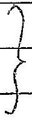

If water fill note of tabe ot depth t. then Boytes low goves, for otherne our (1) \& of telge

$$
\begin{aligned}
A L & = \left( \frac { 1 } { 10 } \right) L ( A + l g g ) \\
q A & = l \rho g \\
l & = \frac { q A } { 8 g } = \frac { 90 \rho g } { \rho g } \\
l & = 90 \mathrm {~m}
\end{aligned}
$$

$$
\text { and } A = 10.99
$$

(ii) At $60 ^ { \circ }$ whical heapht of wereny $\frac { 1 } { 2 } ( 950 )$ wim. Abpliging Bogles law is volue above mercury airtube, with atemes. pression A, ir mun of nierchany

$$
\begin{aligned}
300 ( A - 700 ) & = 50 \left( A \text { - } \left( \frac { 1 } { 2 } \right) 950 \right) \\
6 ( A - 700 ) & = A - 475 \\
A & = 745 \text { inn of wereary }
\end{aligned}
$$

[6]

$$
\begin{aligned}
V _ { A V } & = \begin{array} { c }
\text { distance travelled } \\
\text { time taken }
\end{array} \\
& = \frac { A \sin \left( 5 \left( \frac { \pi } { 10 } \right) \right) - \theta } { \pi / 10 }
\end{aligned}
$$

$$
\begin{aligned}
& \text { final dist-urbial dust. } \\
& \text { timie taken } \frac { 1 } { 2 }
\end{aligned}
$$

$$
\begin{aligned}
& \frac { V _ { \text {ou } } = \frac { 10 A } { \pi } } { \frac { f _ { A V } } { \text { final velocity - untral velocity } } } \\
& = \frac { 5 A \cos \left( 5 \left( \frac { \pi } { 10 } \right) \right) - 5 A } { ( \pi / 10 ) } = \frac { 10 } { \pi } 5 A ( \cos \pi / 2 - 1 ) \\
& f _ { \text {av } } = - \frac { 50 A } { 11 }
\end{aligned}
$$

01

(e) Tobal ive, and ve, charge for 1 graw is $\frac { 1 } { 2 } N _ { A } E$ (molecular weight of hydregem is 2000) Foode histeck charges an Earthourd Moon gaven by
$$
F = \frac { q _ { 1 } q _ { 2 } } { 4 \pi \varepsilon _ { 0 } R ^ { 2 } }
$$
$$
R _ { \text {EM } } = \text { Eurth-Moun dist. }
$$
[5]
(f) Redesacture equilibrien for ierencum, $U$, and raduin, $R$ ) requeres
$$
\lambda _ { e } N _ { e } = \lambda _ { u } N _ { u }
$$
Now
$$
\frac { N _ { R } } { N _ { u } } = \frac { 3.23 \times 10 ^ { - 7 } } { 226 } / \frac { 1 } { 238 } = \frac { 3.23 \times 10 ^ { - 7 } ( 235 ) } { 296 }
$$
Now ato
$$
\lambda _ { R } = \frac { \rho _ { \text {max } } } { T _ { R } } \text { and } \lambda _ { U } = \frac { \ln ^ { 2 } T ^ { 2 } } { T _ { U } }
$$
Theo
$$
\begin{aligned}
T _ { U } & = \frac { V _ { U } T _ { R } } { N _ { R } } \\
& = \frac { ( 226 ) ( 1600 ) } { 3.23 \times 10 ^ { - 7 } ( 238 }
\end{aligned}
$$
Criving
$$
T _ { 0 } = 4.70 \times 10 ^ { 9 } \text { years }
$$
5

Qt For estiber beam, arsuming porticles have nucess nu (a) Energy: $\quad V _ { e } = \frac { 1 } { 2 } \mathrm { mv } ^ { 2 }$

Force

$$
\begin{equation*}
\frac { m v ^ { 2 } } { R } = B e v \tag{Vi}
\end{equation*}
$$

Giving

$$
\begin{equation*}
R = \frac { m v } { B e } \tag{P}
\end{equation*}
$$

Substituting for $v$ from (1)

$$
R = \frac { m } { B e } \frac { \partial V _ { e } } { m }
$$

Thes separation detainear the two beams $\Delta D$ geven by

$$
\begin{equation*}
\Delta D = \frac { 2 } { B } \sqrt { \frac { 2 V } { e } } \left( \sqrt { m _ { D } } - \sqrt { m _ { \phi } } \right) \tag{p}
\end{equation*}
$$

$m _ { p } =$ proton mass
Substitutung guees

$$
\begin{equation*}
\Delta D = 2.4 \mathrm {~cm} \tag{6}
\end{equation*}
$$

8

Q1 ket $u = 15 \mathrm {~ms} ^ { - 1 } \mathrm { em } / \mathrm { s } ^ { \circ } \quad v = 18 \mathrm {~ms} ^ { \circ } \cos 75 ^ { \circ } \quad v = 200 \mathrm {~Hz}$

(h) The source and observer are each morning towards ead other at speeds i. of $15 \cos 75 ^ { \circ }$ and $18 \cos 75 ^ { \circ } \mathrm { ms } ^ { - 1 }$ ie $u$ and $v \mathrm {~ms} ^ { - 1 }$
with memercal values of 3.882 ms acided $4.659 \mathrm {~ms} ^ { - 1 }$
Let wo consider the Doppler effect wi such a case where is somol velocity
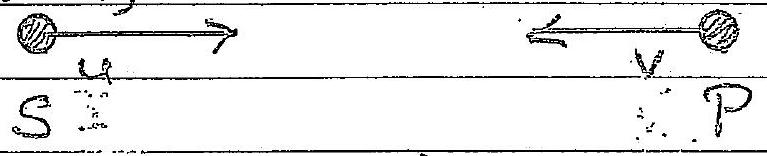
As source moving with velocity is forwerd of source the durance between areats, the issewelargted $\lambda _ { s }$, appear to be given by
$$
\begin{equation*}
\lambda _ { s } = \frac { c } { \nu } - \frac { u } { \nu } \tag{1}
\end{equation*}
$$
As observed mornig towards source with speed $1 Q _ { 1 }$ ithe webuty of wever velociate to observer is $( c + v )$. Thei geveo me is frequency $\gamma _ { p } = \frac { ( e + v ) } { \lambda _ { s } }$
Therefore from (1)
$$
\nu _ { p } = \frac { ( c + v ) } { ( c - u ) } v ^ { 2 }
$$
This is the frequency heard by its observer $P$.
Substituting for $c$, vendu
$$
\begin{aligned}
& \rightarrow _ { p } = \left( \frac { 331 + 15659 } { 331 - 3682 } \right) * 00 \\
& r _ { p } = 205 \mathrm {~Hz}
\end{aligned}
$$

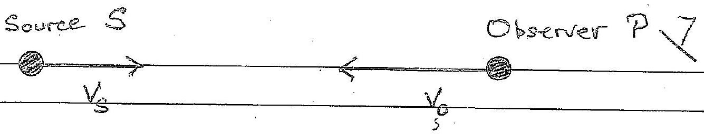

As source moving with velocity $V _ { s }$ in same direction as sound, distance helween crests of sourd waveo, wavelength $\lambda _ { s }$, is

$$
\begin{equation*}
\lambda _ { s } = \frac { c } { f } - \frac { v _ { s } } { f } \tag{i}
\end{equation*}
$$

An observer moving towerds source will velocity $v ^ { \prime }$, the velocity of soment weres relative to observer is $\left( C + V _ { 0 } \right)$. This produces flequency

$$
f _ { 0 } = \frac { c + v _ { 0 } } { \lambda _ { s } }
$$

Therefore from (1)
Theorefore from (1)

$$
f _ { 0 } = \frac { \left( c + v _ { 0 } \right) } { \left( c - v _ { s } \right) } f
$$

Now

$$
V _ { s } = 15 \cos 75 ^ { \circ }
$$

and

$$
= 3.88 \mathrm {~ms} ^ { - 1 }
$$

$$
1
$$

$$
\begin{aligned}
V _ { 0 } & = 18 \cos 75 \mathrm {~ms} ^ { - 1 } \\
& = 466 \mathrm {~ms} ^ { - 1 }
\end{aligned}
$$

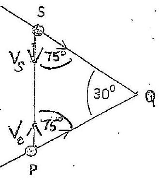

$$
\text { So } \quad \begin{aligned}
& f _ { 0 } = \left( \frac { 331 + 4.66 } { 331 - 3.88 } \right) 200 \\
& f _ { 0 } = 205 \mathrm {~Hz}
\end{aligned}
$$

$$
\frac { 1 } { [ 8 ] }
$$

Q1
(i)

$$
\text { Volvier of copper } = \frac { 250 \times 10 ^ { - 3 } } { 8.93 \times 10 ^ { 3 } } \mathrm {~m} ^ { 3 }
$$

$$
\text { Upthout in copper } = \left( \frac { 250 \times 10 ^ { 6 } } { 8.93 } \right) 10 ^ { 3 } \mathrm { gN }
$$

(density water
Thus Dountlinist on water $= \frac { 250 \times 10 } { 8.93 } \mathrm {~g} \mathrm {~N}$ $10 ^ { 3 } \mathrm {~kg} / \mathrm { mc } ^ { 3 }$ )

$$
= \frac { 250 \times 9.81 \times 10 ^ { - 3 } } { 8.93 } \mathrm {~N}
$$

$$
= 0.275 \mathrm {~N}
$$

$$
\begin{aligned}
\text { Westht of } 0.300 \mathrm {~kg} & = 0.300 \mathrm { gN } \\
& = 2.94 \mathrm {~N} \\
\text { Reconding on scalles } & = 2.94 + 0.275 . \mathrm { N } \\
& = 3.21 \mathrm {~N}
\end{aligned}
$$

$$
\frac { \{ 1 } { 1 }
$$

\& 1
(j) Let $Q _ { 1 }$ and $Q _ { 2 }$ dec charges on $C _ { 1 }$ and $C _ { 2 }$, respectively, after switch closed.

Consumation of charge nequered $\quad Q _ { 1 } + Q _ { 2 } = Q _ { 0 }$ Potentrail, $V$, and $V$, an cafeacetros are given by

$$
\begin{equation*}
V _ { 1 } = \frac { Q _ { 1 } } { C _ { 1 } } \text { and } V _ { 2 } = \frac { Q _ { 2 } } { C _ { 2 } } \tag{1}
\end{equation*}
$$

As $V _ { 1 } = V _ { 2 }$

$$
\begin{equation*}
\frac { Q _ { 1 } } { C _ { 1 } } = \frac { Q _ { 2 } } { C _ { 2 } } = \frac { Q _ { 0 } - Q _ { 1 } } { C _ { 2 } } \tag{1}
\end{equation*}
$$

and

$$
Q _ { 2 } = \frac { C _ { 2 } } { C _ { 1 } + C _ { 2 } } Q _ { 0 }
$$

Imitralemergy

$$
U _ { 0 } = \frac { 1 } { 2 } \frac { G _ { 0 } ^ { 2 } } { C _ { 1 } }
$$

Final every

$$
\begin{aligned}
& U _ { f } = \frac { 1 } { 2 } \frac { Q _ { 1 } ^ { 2 } } { C _ { 1 } } + \frac { 1 } { 2 } \frac { Q _ { 2 } ^ { 2 } } { C _ { 2 } } \\
& U _ { f } = \frac { 1 } { 2 } \frac { Q _ { 2 } ^ { 2 } } { \left( C _ { 1 } + C _ { 2 } \right) }
\end{aligned}
$$

Thuse $U _ { f } < U _ { 0 }$
Energy lost by heating

$$
\} ^ { I } \quad i
$$

[8]

Q1
(k)
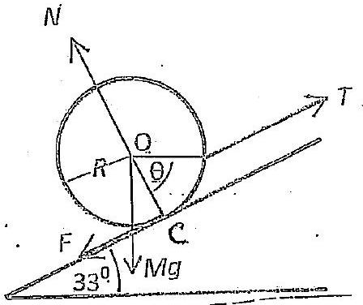
(1)

$$
\begin{align*}
& \text { Resoloing along slope } T - F - M g \sin 33 ^ { \circ } = 0  \tag{1}\\
& \text { Recolving } f ^ { \circ } \text { slope } \quad N - M g \cos 33 ^ { \circ } = 0 \tag{2}
\end{align*}
$$

As $F = \mu N$ in $O$ and substitutuig for $N$ fair ( $Q$, geve,

$$
\begin{equation*}
T = M g \left( \sin 33 ^ { \circ } + 0.420 \cos 33 ^ { \circ } \right) \tag{1}
\end{equation*}
$$

Substrituting for Mg.

$$
T = 4400 \quad N
$$

(ii) Telking moments don't $O$,

$$
R T \cos \theta = F R
$$

$$
\begin{aligned}
\cos \theta & = \frac { \mu M g \cos 33 ^ { \circ } } { T } \\
& = \frac { ( 0.420 ) ( 5.00 ) ( 9.81 ) \cos 33 ^ { \circ } } { 44.0 } \\
& = 0.393
\end{aligned}
$$

Groung

$$
\theta = 66.9 ^ { \circ }
$$

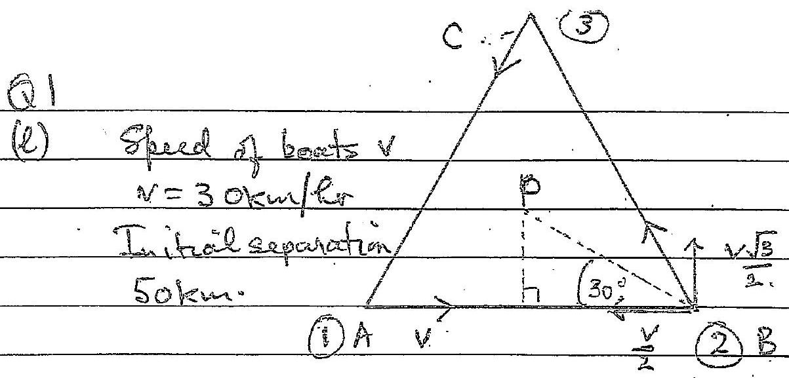

METHOD 2.
By symmethy they will meet at the centre of the hrough P. Recolving velocty towards $P$ and perpendecilar to C with nelocity $v \frac { \sqrt { 3 } } { 2 }$ to wando $P$ and have to twoel a $\}$ distance withis direction, $B C$, of $d$ gever by (sectagram )

$$
\begin{aligned}
d & = \frac { 50 } { 2 } \left( \frac { 2 } { \sqrt { 3 } } \right) = 50 \left( \frac { \sqrt { 3 } } { 3 } \right) \\
& = 28.9 \mathrm {~km}
\end{aligned}
$$

$$
\} \cdot 2
$$

So blume telken
Consequently

$$
\begin{aligned}
& \left. T = 50 \frac { \sqrt { 3 } } { 3 } / 30 \left( \frac { \sqrt { 3 } } { 2 } \right) = \frac { 10 } { 9 } = 1 \frac { 1 } { 9 } \mathrm { hrs } \right\} 3 \\
& D = \frac { 300 } { 9 } = 33.3 \mathrm {~km} \quad \text { (as niterious reactl) }
\end{aligned}
$$

Q1 (m) For air in bassel at atmosplienc pressure, $P a$, which holds de mols of air in volume $V _ { b }$.

$$
P _ { a } V _ { b } = k R T
$$

Sub ${ } ^ { 9 }$ values: $\left( 1.0 \times 10 ^ { 5 } \right) \left( 9.0 \times 10 ^ { - 5 } \right) =$ KRT \}
After $n$ strokes of the pump the type holds $( n k )$ woles in volume $V _ { T } ( T = t y d e )$ at pressure $P _ { T }$ Thus

$$
P _ { T } V _ { T } = n k R T .
$$

Sub ${ } ^ { 9 }$ values

$$
\begin{equation*}
\left( 3.0 \times 10 ^ { 5 } \right) \left( 1.2 \times 10 ^ { - 3 } \right) = n k R T \tag{2}
\end{equation*}
$$

Substituting for KRT from (i) irito (2)

$$
\begin{aligned}
n & = \frac { \left( 3.0 \times 10 ^ { 5 } \right) \left( 1.2 \times 10 ^ { - 3 } \right) } { \left( 1.0 \times 10 ^ { 5 } \right) \left( 9.0 \times 10 ^ { - 5 } \right) } \\
& = 40
\end{aligned}
$$

$$
\left\{ \begin{array} { l }
1 \\
\frac { 1 } { 4 }
\end{array} \right.
$$

Q2
(ec)
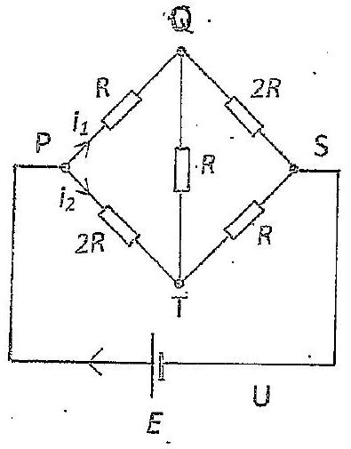

Resussing the polarity produces an deciticel circuit to the former and. So current in $S Q = i _ { 2 }$ and that in $S T$ is $i _ { 1 }$ as ith recursal only reverses the derectrons of the cennents in the arms
Thus and

$$
\begin{aligned}
& \dot { i } _ { 00 } = i _ { 2 } \\
& i _ { 15 } = i _ { 1 }
\end{aligned}
$$

ni organal circuit I

(b) As sum if current entrsuig ony jernction is equal to the sum leaving, at $Q$ we have
$$
i _ { Q T } = i _ { 1 } - i _ { 2 }
$$
and at $s$
$$
i _ { \text {syr } } = i _ { 2 } + i _ { 1 }
$$
(c) For dosed path $P Q T P$,
$$
i _ { 1 } R + \left( i _ { 1 } - i _ { 2 } \right) R - 2 i _ { 2 } R = 0
$$
or
$$
2 i _ { 1 } - 3 i _ { 2 } = 0
$$
$$
\begin{equation*}
\operatorname { ar } 2 i _ { 1 } = 3 i _ { 2 } \tag{1}
\end{equation*}
$$
For cleasel path PTSUP, fran (I),
$$
\begin{equation*}
E = 2 R i _ { 2 } + i _ { 1 } R \quad \text { i } \quad E = \frac { 1 } { 2 } i _ { 2 } R = \frac { 9 } { 3 } i _ { 1 } R 2 \tag{2}
\end{equation*}
$$
(d) $$
R _ { P S } = \frac { 2 R i _ { 2 } + R i _ { 1 } } { \left( i _ { 1 } + i _ { 2 } \right) } \frac { \text { i valtage acress } p T S } { \text { aureationtering at } P }
$$
$R _ { p s } = \frac { 7 } { 5 } R$
from (1)

From (1) and (2)

$$
i _ { 1 } = \frac { 3 } { T } \frac { E } { R } \text { and } i _ { 2 } = \frac { 2 } { 7 } \frac { E } { R }
$$

Q2 The aristrance acons PS indefendent of any

(d) resistance in arm SVP. So if the enternat resistance of $E$ is $3 R$ the resertence acons PS remain's $\frac { 7 } { 5 } R$.

(e) The equation around elased path PQTP becomes

$$
\begin{gather*}
i _ { 1 } R + \left( i _ { 1 } - i _ { 2 } \right) x - 2 i _ { 2 } R = 0 \\
i _ { 1 } ( R + x ) = i _ { 2 } ( 2 R + x ) \\
i _ { 2 } = \left( \frac { R + x } { 2 R + x } \right) i _ { 1 } \tag{3}
\end{gather*}
$$

Then

$$
R _ { T } = \frac { 2 R i _ { 2 } + R i _ { 1 } } { i _ { 1 } + i _ { 2 } }
$$

Substituting from (3)

$$
\begin{aligned}
R _ { T } & = \frac { 2 R \left( \frac { R + x } { 2 R + x } \right) + R } { 1 + \left( \frac { R + x } { R + x } \right) } \\
& = R \frac { 4 R + 3 x } { 3 R + 2 x } \\
& = R \frac { 4 + 3 \left( \frac { x } { R } \right) } { 3 + 2 \left( \frac { x } { R } \right) }
\end{aligned}
$$

$\begin{array} { c l } \text { When } \left( \frac { x } { R } \right) = 0 & R _ { T } = \frac { 4 } { 3 } R \\ \frac { x } { R } \rightarrow \infty & R _ { T } \rightarrow \frac { 3 } { 2 } R \end{array}$
Theors $R _ { T }$ sanges from $1.33 \ldots R$ to $1.50 R$.

Q3

(a) If the spring will spring censtant $k$, is shifteled by and amount $x$, then $\left( \frac { 1 } { n } \right)$ ith of the spring is streeted by 2 $\left( \frac { x } { x } \right)$. As its forces in its whole spoung ond (表) It of ithe sprung are the same we requese
$$
\begin{aligned}
& k _ { 1 } x = k _ { 2 } \left( \frac { x } { n } \right) \\
& \text { or } k _ { 2 } = n k _ { 1 }
\end{aligned}
$$

(b) At equilibrision

$$
\begin{aligned}
k _ { 1 } x _ { 10 } & = m g \\
x _ { 10 } & = \frac { m g } { k _ { 1 } }
\end{aligned}
$$

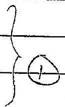
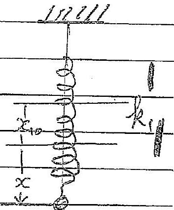

(c) If wass displaced by $x$ four th equilibrien prochion, the eferation of motion is, if a is the accelerating $\frac { 3 } { 1111 } = \frac { h _ { 2 } } { 11 }$
$$
k _ { 2 } = n k _ { 1 } , \quad = - ( n + 1 ) k _ { 1 } x
$$
$$
\begin{aligned}
m a & = - k _ { 1 } \left( x + x _ { 10 } \right) - k , x + m g \\
& = - \left( k _ { 1 } + k _ { 2 } \right) x . \\
& = - ( n + 1 ) k _ { 1 } x .
\end{aligned}
$$
(d) From O.
$$
\begin{aligned}
E & = \frac { 1 } { 2 } m v ^ { 2 } + \frac { 1 } { 2 } k _ { 1 } \left( x + x _ { 10 } \right) ^ { 2 } + \frac { 1 } { 2 } k _ { 2 } x x ^ { 2 } - m g x \\
& = \frac { 1 } { 2 } m v ^ { 2 } + \frac { 1 } { 2 } x ^ { 2 } \left( k _ { 1 } + k _ { 2 } \right) + k _ { 1 } x x _ { 10 } - m g x + \frac { 1 } { 2 } k _ { 1 } x _ { 0 } ^ { 2 }
\end{aligned}
$$
$$
\begin{aligned}
E & = \frac { 1 } { 2 } m v ^ { 2 } + \frac { 1 } { 2 } \left( k _ { 1 } + k _ { 2 } \right) x ^ { 2 } + \frac { 1 } { 2 } k x _ { 40 } ^ { 2 } \\
& = \frac { 1 } { 2 } m v ^ { 2 } + \frac { 1 } { 2 } k _ { 1 } ( m + 1 ) x ^ { 2 } + \frac { 1 } { 2 } k x _ { 10 } ^ { 2 }
\end{aligned}
$$
where $k _ { 2 } = n k _ { 1 }$. This defends only on the variable $x ^ { 2 }$ and $v ^ { 2 }$ ?

(t) For it largantal system $x _ { 10 } = 0$ and itte equation of wortin is unchanged. So it perferms sitil with angular frequency geven by
$$
\omega ^ { 2 } = \frac { ( m + 1 ) - k _ { 1 } } { m }
$$

Q4

(a) (i) A line in the fild which at every point is tangential to the electric feeld vector
    (ii) A curface which has constant electric potential at all points on the surface si the electric field
(b) 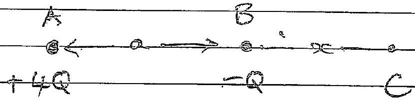
The prestral point $C$ is a point where the electric field is zero.
The condition for the magurioles of the feelds from $A$ and $B$ to be equal is
$$
\begin{equation*}
\frac { 4 \theta } { 4 \pi \varepsilon _ { 0 } ( a + x ) ^ { 2 } } = \frac { Q } { 4 \pi \varepsilon _ { 0 } c ^ { 2 } } \tag{1}
\end{equation*}
$$
By synustry $C$ will he along the hie through AB.
From (1)
$$
\begin{aligned}
4 x ^ { 2 } & = ( a + x ) ^ { 2 } \\
3 x ^ { 2 } - 2 a x - a ^ { 2 } & = 0 \\
x & = \frac { 2 a \pm \sqrt { 4 a ^ { 2 } + 4 \cdot 3 a } } { 6 } \\
& = a \left( \frac { 1 } { 3 } \right) ( 1 \pm 2 )
\end{aligned}
$$
Thus three are two roots to the quadratic equation $a$ onk $- \frac { 1 } { 3 } a$,
$\left( - \frac { 1 } { 3 } a \right)$ comesponds to a non-zero electric feld where the electric field vectors from A a do add The orther solution $x = a$ comespondet on suigle pointe where these is zro electric feeld
(c) $$
\frac { 4 Q } { 4 \pi \varepsilon _ { 0 } C _ { A } } - \frac { Q } { 4 \pi \varepsilon _ { B } r _ { B } } = \text { constant } = e \text { say } \frac { 4 } { r _ { B } } = c ^ { i } \text { whe c'a constant }
$$
Deference values of the constant poduce different surfaces

Q4
(d) (1) Field Lunes
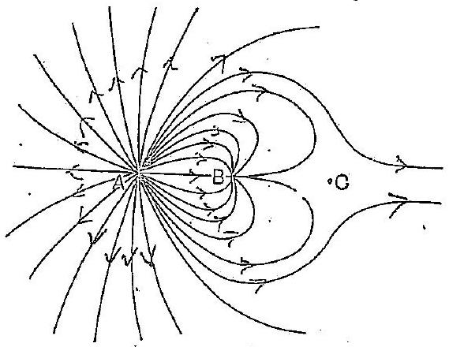

Award maths for:
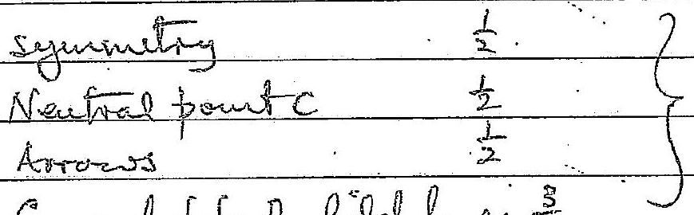

General shape of feeld lines $\frac { 3 } { 2 }$
(ii) Equipotentrád Sirffeces
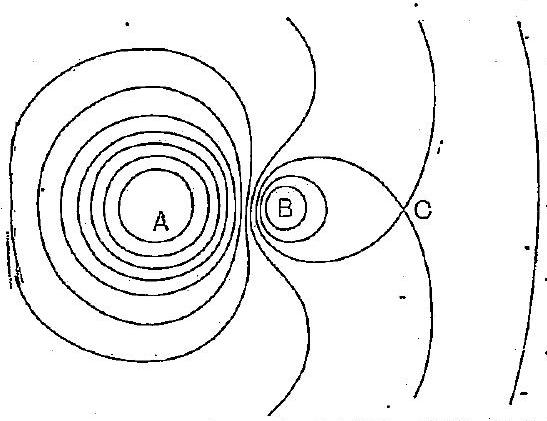

Advert Plats for:
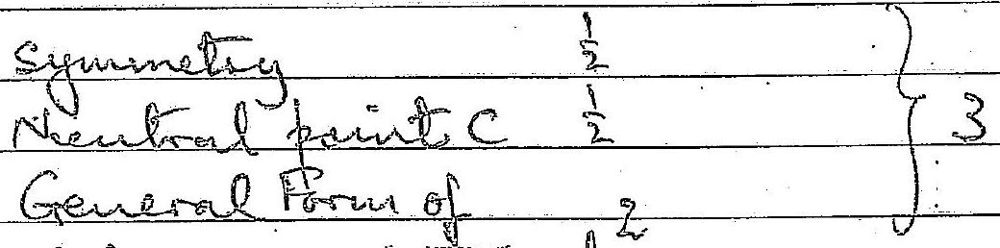
that of equiple y

Q4
(e)
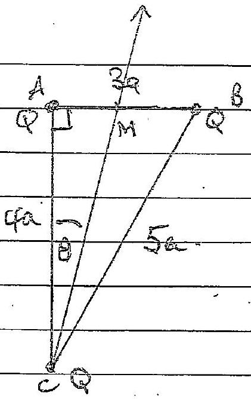

Potation at $M , V _ { M } , i$ grain by

$$
\begin{aligned}
& \frac { 1 } { 4 \pi \varepsilon _ { 0 } } \left[ \frac { Q } { \frac { 3 } { 2 } a } + \frac { Q } { \frac { 3 } { 2 } a } + \frac { Q } { \sqrt { ( 4 a ) ^ { 2 } + \left( \frac { 3 } { 2 } a \right) ^ { 2 } } } \right] \\
= & \frac { Q } { 4 \pi \varepsilon _ { 0 } a } \left[ \frac { 4 } { 3 } + \frac { 2 } { \sqrt { 73 } } \right] \\
= & \frac { Q } { 4 \pi \varepsilon _ { 0 } a } \left[ \frac { 4 } { 3 } + \frac { 2 \sqrt { 73 } } { 73 } \right] \\
V _ { M } = & \frac { 1 - 52 Q } { 4 \pi \varepsilon _ { 0 } a }
\end{aligned}
$$

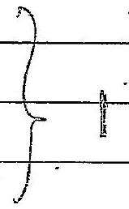

Electric Field Vector E
Fields from charges at A and B cancel Quily councouton arries from C

$$
\begin{aligned}
E & = \frac { Q } { 4 \pi \varepsilon _ { 0 } \left[ ( 4 a ) ^ { 2 } + \left( \frac { 3 } { 2 } a \right) ^ { 2 } \right] } \text { along } C M \\
& = \frac { Q } { 4 \pi \varepsilon _ { 0 } a ^ { 2 } } \left( 16 + \frac { 9 } { 4 } \right) \\
& = \frac { Q } { 4 \pi \varepsilon _ { 0 } a ^ { 2 } } \left( \frac { 4 } { 73 } \right) \\
E & = \frac { Q ( 848548 ) } { 4 \pi \varepsilon _ { 0 } a ^ { 2 } } \quad \text { at angle } \theta \text { tre } C A
\end{aligned}
$$

where

$$
\begin{aligned}
\tan \theta & = \frac { 3 a } { 2 } / 4 a = \frac { 3 } { 8 } \\
A & = 20 . L ^ { \circ }
\end{aligned} \quad \theta = A C M
$$

Q:5
(a)
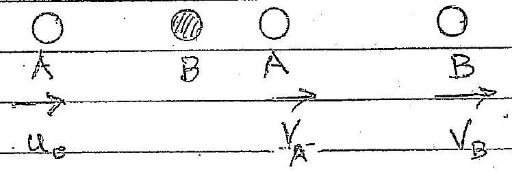
Mementam Conservation

$$
\begin{aligned}
m u _ { 0 } & = m v _ { A } + m v _ { B } \\
u _ { 0 } & = v _ { A } + v _ { B }
\end{aligned}
$$

Energy Couservection

$$
\begin{align*}
\frac { 1 } { 2 } m u _ { B } ^ { 2 } & = \frac { 1 } { 2 } m v _ { A } ^ { 2 } + \frac { 1 } { 2 } m v _ { B } ^ { 2 } \\
u _ { B } ^ { 2 } & = v _ { A } ^ { 2 } + v _ { B } ^ { 2 } \tag{2}
\end{align*}
$$

Substatuting for $V _ { B }$ from (1) inte (2)

$$
\begin{aligned}
u _ { 0 } ^ { 2 } & = v _ { A } ^ { 2 } + \left( u _ { a } - v _ { A } \right) ^ { 2 } \\
& = u _ { B } ^ { 2 } - 2 u _ { a } v _ { A } + 2 v _ { A } ^ { 2 } \\
v _ { A } \left( v _ { A } - u _ { 0 } \right) & = 0
\end{aligned}
$$

$S _ { 0 }$
either $V _ { A } = 0$ or $V _ { A } = u _ { 0 }$
As $V _ { A } = U _ { 0 }$ correcfends to no collision, we require

$$
V _ { A } = 0
$$

Thes gives frem (1),

$$
v _ { B } = i _ { 0 }
$$

Thus offer unpact $V _ { A } = 0$ (Antract) and $V _ { B } = l _ { 0 }$.
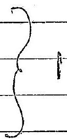

Q: 5
(b)
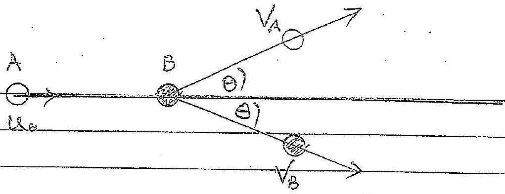
(i) Energy Conservation

$$
\begin{align*}
\frac { 1 } { 2 } m u _ { B } ^ { 2 } = 8.00 & u ^ { - } u _ { B } = \frac { 4 } { \sqrt { m } }  \tag{1}\\
\frac { 1 } { 2 } m u _ { B } ^ { 2 } & = \frac { 1 } { 2 } m v _ { A } ^ { 2 } + \frac { 1 } { 2 } m v _ { B } ^ { 2 } + 2.00 \tag{\(\mathbb { I }\)}
\end{align*}
$$

So

$$
\begin{align*}
& 8 \cdot 00 = \frac { 1 } { 2 } m \left( V _ { A } ^ { 2 } + V _ { B } ^ { 2 } \right) + 2 \cdot 00 \\
& 6 \cdot 00 = \frac { 1 } { 2 } m \left( V _ { A } ^ { 2 } + V _ { B } ^ { 2 } \right) \\
& 12 \cdot 00 = m \left( V _ { A } ^ { 2 } + V _ { B } ^ { 2 } \right)
\end{align*}
$$

(11) Mourewton Conservation homzentally

$$
\begin{align*}
m u _ { 0 } & \equiv m v _ { A } \cos \theta + m v _ { B } \cos \theta = m \cos \theta \left( v _ { A } + v _ { B } \right)  \tag{3}\\
u _ { 0 } & = \cos \theta \left( v _ { A } + v _ { B } \right)
\end{align*}
$$

Momentum Censervatión vertically

$$
\begin{align*}
& 0 = m v _ { A } \sin \theta - m v _ { B } \sin \theta  \tag{4}\\
& v _ { A } = v _ { B } \tag{4}
\end{align*}
$$

(iii) Firm (3)) wind (y)
From (2) and (4)

$$
\begin{align*}
\cos \theta & = \frac { u _ { e } } { 2 v _ { A } }  \tag{5}\\
v _ { A } & = \sqrt { \frac { 6 } { m } } \quad \& \quad v _ { B } = \sqrt { \frac { 6 } { m } } \tag{6}
\end{align*}
$$

These, from (1) and (6), (5) becames

$$
\begin{aligned}
\cos \theta & = \frac { 2 } { \sqrt { 6 } } = \sqrt { \frac { 2 } { 3 } } \\
\theta & = 35.3 ^ { \circ }
\end{aligned}
$$

(iv) Change in vector momenstom of $A = m v _ { A } - m u _ { 0 }$
Consuration of vector momentom $w _ { \text {the } } = w _ { A } + w _ { B }$
Trus
From (6)

$$
\begin{aligned}
m v _ { A } - m u _ { B } & = - \bar { m } v _ { B } \\
& = - \sqrt { \left[ \frac { E } { m } \hat { v } _ { B } \right.} \text { wheel } \hat { v } _ { B } \text { is upit } \\
& = - \sqrt { 6 m } \hat { v } _ { B }
\end{aligned}
$$

Theirnowentron change has magnitude $\sqrt { 6 m }$ and derection is opposes is $V _ { B }$

0.6
(Q)
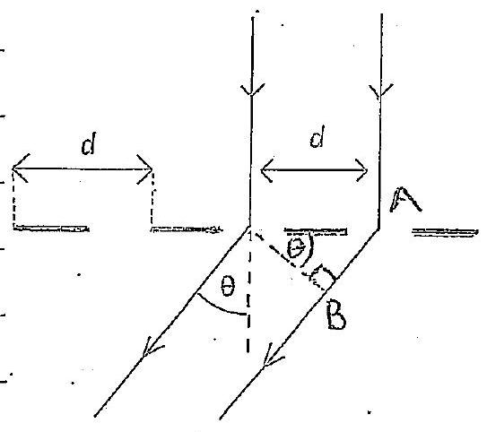

Path of fisence $A B = d \sin \theta$
(i) Condition for constructure unteference for wavelength $\lambda$

$$
\begin{align*}
& d \sin \theta = m ^ { \lambda } \lambda  \tag{1}\\
& d \sin \theta = \left( n + \frac { 1 } { 2 } \right) \lambda \tag{2}
\end{align*}
$$

(b) Red light has larger wowelengelt - than riolet light so the values of $\theta$, with same $n$, that produce constructive interferince, form 0, are larger for ned light than violet lieft. Consequatty it is paride for the with constructure interfercuce fruige for volut light to coincide with the $( n - 1 )$ th fruits for ned light. This has occurred here:

The $n = 3$ red foring has coinceded with the $m = 2$ ridet fringe. The order of the foughedre:

| 1st | rolet | $n _ { v } = 1 \quad \left( \frac { 1 } { 2 } \right)$ |
| :--- | :--- | :--- |
| 2nd | red | $u _ { R } = 1$ |
| 3n | rolet | $x _ { y } = 2$ |
| 4 估 | red t violet | $u _ { R } = 2 \quad \& \quad m _ { V } = 3 \left( \frac { 1 } { 2 } \right)$ |

So
5 tw vislet

$$
\begin{equation*}
u _ { y } = 4 \tag{1}
\end{equation*}
$$

Q6
(c) For the composete live
Thus

$$
\begin{aligned}
\sin \theta & = \frac { m _ { R } \lambda _ { R } } { d } = \frac { \mu _ { r } \lambda _ { r } } { d } \\
& = \frac { 2 \lambda _ { R } } { d } = \frac { 3 \lambda _ { v } } { d }
\end{aligned}
$$

Now

$$
d = \frac { 10 ^ { - 3 } } { 500 } \mathrm {~m} \text { and } \theta = 43.6 ^ { \circ } \text {. }
$$

So substituting $\lambda _ { v } = \frac { d \sin \theta } { 3 } = 460 \mathrm {~mm}$

$$
\lambda _ { R } = \frac { d \sin \theta } { 2 } = 690 \mathrm {~mm}
$$

(d) The 5 oth laie from (3) cortespends to $M _ { y } = 4$ I So the comespondling O is geveir by

$$
\begin{aligned}
\sin \theta & = \frac { 4 ( 460 ) + 0 ^ { - 9 } } { 2 \times 10 ^ { - 6 } } \\
& = 0.920 \\
\theta & = 66.9 ^ { \circ } \quad \left( u _ { v } , \lambda _ { v } \right) \frac { 1 } { 4 }
\end{aligned}
$$

(e) boncet envelope of mitensity, I Indication of 3 diffraction linis of orders 1,2 and 3
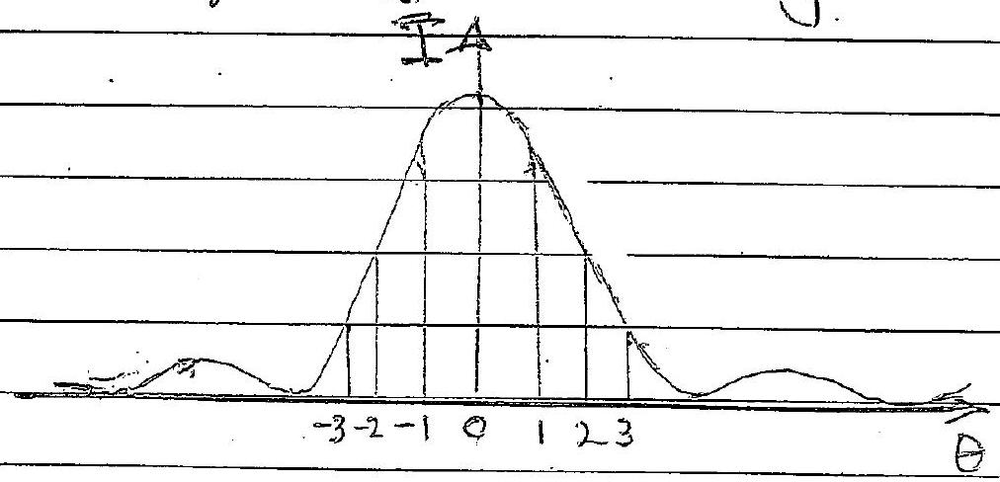

Q1
(a)
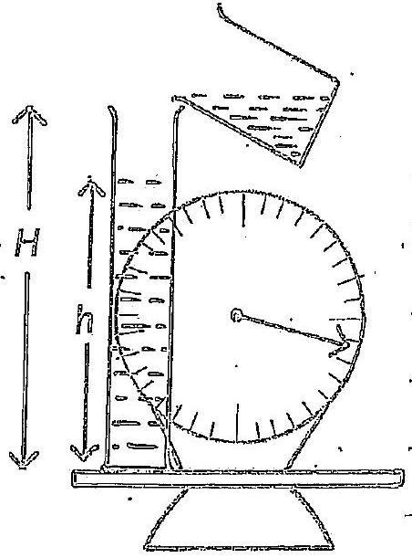
Force due to wetter inpacting on water in measureng cylenider is equal to the rate of change of momentim on folloig shords a height $( 1 + - h )$ gires a forrs $\rho v \sqrt { 2 g ( 1 + - h ) }$ and thus

$$
\begin{equation*}
w = W _ { M C } + \rho v \sqrt { 2 g ( H - R ) } + h A \rho g \tag{1}
\end{equation*}
$$

where $g A g g$ is the weight of liquid in measureng cylaider

$$
\begin{align*}
w & = W _ { \text {mc } } + \rho v \sqrt { 2 g } \sqrt { 1 H - h } - ( H - h ) A \rho g + H A \rho g  \tag{b}\\
& \left. = \left( W _ { \text {mc } } + H A \rho g \right) - A \rho g ( \sqrt { H - h } ) ^ { 2 } - \frac { V \sqrt { 2 } g } { g A } \sqrt { H - h } \right]  \tag{3}\\
y ^ { 2 } & = ( H - h )
\end{align*}
$$

$$
\begin{equation*}
W = \left( W _ { \text {MC } } + \text { HAдg } \right) - \text { Agg } \left[ y ^ { 2 } - \text { by } \right] \tag{2}
\end{equation*}
$$

$$
\begin{equation*}
\text { where } 2 b = \frac { r } { k } \sqrt { \frac { 2 } { g } } \tag{3}
\end{equation*}
$$

$$
\begin{align*}
w & = \left( W _ { \text {mc } } + \text { HAдg } \right) - \text { Agg } \left[ y ^ { 2 } - 2 b y + b ^ { 2 } \right] + 1  \tag{3}\\
& = \left( W _ { \text {min } } + \text { HAgg } + \text { Agg } b ^ { 2 } \right) - \text { Agg } [ y - b ] ^ { 2 } \tag{4}
\end{align*}
$$

$w$ is a maximarm when $y = b = \frac { v } { A } \sqrt { \frac { 1 } { 2 g } }$ and $w$ has the ralue (5)

$$
\begin{equation*}
W _ { \max } = \left( W _ { \text {met } } + H A \rho g + A \rho g b ^ { 2 } \right) \tag{6}
\end{equation*}
$$

Q7
(b)
$$
\begin{equation*}
W _ { \text {max } } = W _ { \text {mc } } + H A \rho g + \frac { r ^ { 2 } g } { 2 A } \tag{7}
\end{equation*}
$$
(c) At $w _ { \text {max } } , \quad y _ { \text {max } } = \sqrt { 1 + l _ { \text {max } } } = b = \frac { v } { A } \sqrt { \frac { 1 } { 2 g } }$ Squating
$$
H - R _ { \max } = \frac { r ^ { 2 } } { A ^ { 2 } } \frac { 1 } { 2 g }
$$
Weight of liquidni cylinder at wimak, = sg Almax
$$
= \operatorname { sg } A \left( H - \frac { r ^ { 2 } } { A ^ { 2 } 2 g } \right)
$$
Differencespetiseen (2) and Wart ggA(H-2A2)
$$
\begin{aligned}
\Delta & = + \rho g A \left( \frac { v ^ { 2 } } { 2 A ^ { 2 } g } \right) + \frac { v ^ { 2 } \rho } { 2 A } \\
\Delta & = \frac { \rho v ^ { 2 } } { A }
\end{aligned}
$$
(d) Twice $t _ { 1 }$ for ligind to incrially fell height $H$ before mpacking is green by
$$
H = \frac { 1 } { 2 } g t _ { 1 } ^ { 2 } \text { is } t _ { 1 } = \sqrt { 2 H / g } : W _ { 1 } = W _ { \mathrm { MC } }
$$
From $t = 0 \quad t \quad t = t _ { 1 } \quad w =$ Wine
$$
\frac { 1 } { 2 }
$$
As subsequently
$$
\begin{equation*}
h = \frac { V } { A } t \quad t _ { 1 } \leq t \leq t _ { E } \tag{80}
\end{equation*}
$$
we can express (s) in torms of time $t$
$$
\begin{array} { r }
w = \left( W _ { \text {mc } } + H A \rho g + A \rho g b ^ { 2 } \right) = A \rho g \left[ \sqrt { H - \frac { v } { A } \left( t - t _ { i } \right) } - [ t ] \right. \\
\left. w = W _ { \text {Mc } } + H A \rho g \quad t \geqslant t E + \sqrt { \frac { 2 H } { g } } \right]
\end{array}
$$

Q7
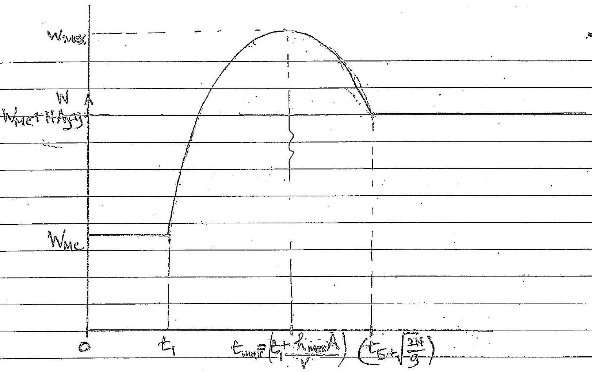

26

From (Ba),
Winsex overus at teme $t _ { \text {way } } = \left( t , \frac { A b } { V } \right)$.

Marking Creapi.
loorect initial levear partion
Final lemear portion
Cirnoe with maximum
(Winc, $t _ { 1 }$ ) pountm graph
(WretHAgg) $\frac { 2 H } { g }$ ) pout
as graph
Maximum poriat (Warar, twax)
Maximum poriat (Warar, twax)
$\frac { 1 } { 2 }$
