(a)

(i)
$$
\therefore \quad \begin{aligned}
E & = \left( R _ { 0 } + R \right) \alpha I _ { 0 } \\
I _ { 0 } R _ { 0 } & = \left( R _ { 0 } + R \right) \alpha I _ { 0 } \\
R _ { 0 } & = \left( R _ { 0 } + R \right) \alpha \\
R & = \frac { R _ { 0 } ( 1 - \alpha ) } { \alpha }
\end{aligned}
$$

Range of $\alpha : \quad 0 \leq \alpha \leq 1 \quad \& \quad \infty \geqslant R \geqslant 0$

(ii)
$$
\begin{aligned}
& E = \alpha I _ { 0 } \left( \frac { 1 } { R } + \frac { 1 } { R _ { 0 } } \right) ^ { - 1 } \\
& I _ { 0 } R _ { 0 } = \alpha I _ { 0 } \left( \frac { R R _ { 0 } } { R + R _ { 0 } } \right) ^ { - 1 } \\
& R = \frac { R _ { 0 } } { \alpha - 1 }
\end{aligned}
$$
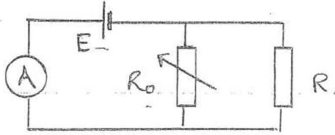

Range of $\alpha : 1 \leqslant \alpha \leqslant \infty \quad \& \quad \infty \geqslant R \geqslant 0$
(B) If $\left( - v _ { x } ^ { \prime } \right)$ is the velocity of ball's component wi $x$-direction nelative to train, then as the Lady elserves only vertical motion, relative to her the $x$-component is zero i.e.
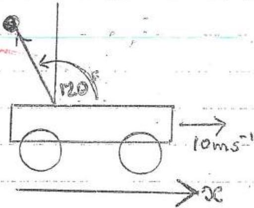

$$
\begin{aligned}
0 & = - v _ { x } + 10 \\
v _ { x } ^ { \prime } & = + 10 \mathrm {~ms} ^ { - 1 }
\end{aligned}
$$

is bell thrown backwards relative to train at 10 ms . Thus, as trair has no vertical component of velocity, the vertical components of the ball's velocity relative to the twech, $v _ { y } ^ { \prime }$, and that melative to the lady, $\sqrt { y }$, are equal

$$
x _ { y } = v _ { y } ^ { \prime } = 1 v _ { z } ^ { \prime } \tan 60 = 10 \sqrt { 3 } \cdot \mathrm {~ms} ^ { - 1 } = 17.3 \mathrm {~ms} { } ^ { - 1 }
$$

(b) Thus both closerve it at the ball neceles a height, h, given by
$$
\begin{aligned}
& v _ { y } ^ { 2 } = 2 g h \\
& h = \frac { ( 10 \sqrt { 3 } ) ^ { 2 } } { 2 ( 9.81 ) } = 15.3 \mathrm {~m}
\end{aligned}
$$
$$
\frac { 1 } { 5 }
$$
Q1 (c)(i) The beam will emerge from vertical section of glass block parallel to initial beam as the angle of refaction at both surfaces are equal
Similarly for the horzontal section, angle of inidence is $1 + 5 ^ { \circ }$ and consequently angle of emergence is $45 ^ { \circ }$; parallel to initial beam

(ii) Usung the notation in dragram
$$
\frac { \sin 45 ^ { \circ } } { \sin \phi } = 1.5
$$
Giving $\phi = 28.13 ^ { \circ }$ and $\alpha = 90 - 28.13 ^ { \circ } = 61.57 ^ { \circ }$
Critical angle, $\theta$, geven by
$$
\frac { \sin 90 ^ { \circ } } { \sin \theta _ { c } } = 1.5 \quad \text { ie } \theta _ { e } = 41.81 ^ { \circ }
$$
So the ray is totally internally reflected-adinginitem at the two horyiontal glass faces
As $\hat { S T X } = \phi < 45 ^ { \circ }$ the ray cannot be incident on the verticed face PB
(ii) 3
* Give marks if students determine that ray undergoes total internal reflection.
Also give marks if student shows ray to each glass at g. vereical face

(d) Let $R _ { G }$ be the raduis of the orbit of Caungurede and $M _ { C }$ is wass. $M _ { J }$ is the mans of Jupiter. Then If $\omega$ is the angular velocity of Gangurede,
$$
\begin{align*}
M _ { C } R _ { G } \omega ^ { 2 } & = \frac { G M _ { C } M _ { J } } { R _ { G } ^ { 2 } } \\
R _ { G } ^ { 3 } \omega ^ { 2 } & = G M _ { J } \tag{1}
\end{align*}
$$
If the Earth has mass $M _ { E }$ and raduis $R _ { E }$ there for mass in on the surface
$$
\begin{align*}
& m g = \frac { G _ { m } M _ { E } } { R _ { E } ^ { 2 } } \\
& G M _ { E } = g R _ { E } ^ { 2 } \tag{2}
\end{align*}
$$
From (1) and (2). *
$$
\begin{aligned}
\frac { M _ { J } } { M _ { E } } & = \frac { R _ { G } ^ { 3 } \omega ^ { 2 } } { R _ { E } ^ { 2 } g _ { 9 } } \\
& = \frac { \left( 1.07 \times 10 ^ { 9 } \right) ^ { 3 } ( 2 \pi / ( 7.16 \times 24 \times 60 \times 60 ) ) ^ { 2 } } { \left( 6.38 \times 10 ^ { 6 } \right) ^ { 2 } ( 9.81 ) } \\
& = 316
\end{aligned}
$$
$$
M _ { J } = 316 M _ { E }
$$
* Alteratively are could substitute the value of $M _ { F }$
(e)
If $\delta l _ { c }$ and $\delta l _ { T }$ are the extension's of ithe copperand tungatern were respectively then the Young's modulia are:
$$
\begin{align*}
& 12.4 \times 10 ^ { 10 } = \frac { \frac { \pi \left( \sigma _ { 15012 } \right) ^ { 2 } } { \delta t _ { 6 } } } { \pi ( d 12 ) ^ { 2 } \varepsilon _ { 4 } }  \tag{1}\\
& 35.5 \times 10 ^ { 10 } = \frac { 100 \times 9.851 } { \pi \left( 2 l _ { 5 } \right) } \tag{2}
\end{align*}
$$

QJ dlso

$$
\begin{equation*}
\delta l _ { 2 } + \delta l _ { r } = 6.00 \times 10 ^ { - 2 } \tag{3}
\end{equation*}
$$

Substituting into (3) from (1) and (2)
For correct equation

$$
\begin{aligned}
6.00 \times 10 ^ { - 2 } & = \frac { 100 \times 9.81 } { \frac { \pi } { 4 } } \left[ \frac { 1 } { \left( 0.50 \times 10 ^ { - 3 } \right) ^ { 2 } 12.4 \times 10 ^ { 10 } } + \frac { 1 } { d ^ { 2 } \left( 35.5 \times 10 ^ { 10 } \right) } \right] \\
\frac { 6.00 \times 10 ^ { - 2 } \left( \frac { \pi } { 4 } \right) } { 10 ^ { 2 } \times 9.81 } & = \frac { 1 } { \left( 0.50 \times 10 ^ { - 3 } \right) _ { 12.4 \times 10 ^ { 10 } } ^ { 12.4 } } + \frac { 1 } { d ^ { 2 } \left( 35.5 \times 10 ^ { 10 } \right) } \\
0.4804 \times 10 ^ { - 4 } & \left. = \frac { 4.00 \times 10 ^ { - 4 } } { 12.4 } + \frac { 1 } { d ^ { 2 } \left( 35.5 \times 10 ^ { 10 } \right) } \right\} \\
0.1578 \times 10 ^ { - 4 } & = \frac { 1 } { d ^ { 2 } } \left( 0.02817 \times 10 ^ { - 10 } \right) \\
d & = 0.423 \mathrm {~mm}
\end{aligned}
$$

(f) Activity proportional to number of radiaactive nuclei. present. Also

$$
\begin{equation*}
N = N _ { 0 } e ^ { - \lambda t } \tag{i}
\end{equation*}
$$

So

$$
\begin{equation*}
\frac { N } { N _ { 0 } } = \frac { 1.2 \times 10 ^ { 2 } } { 2.0 \times 10 ^ { 2 } } = 0.60 \tag{2}
\end{equation*}
$$

Now

$$
\begin{aligned}
\lambda & = \ln 2 / T \quad \text { where } T \text { is lalf lefe } \\
& = - 0.692 / T
\end{aligned}
$$

Substituting into (1) from (2) and (3)

$$
\text { or } \begin{aligned}
0.60 & = \exp ( - 0.692 t / T ) \\
\text { Sub. fart, } & 0.692 t = T \ln ( 1 / 0.60 ) \\
& = \left( 5.7 \times 10 ^ { 3 } \right) ( 0.510 ) \\
t & = 4.2 \times 10 ^ { 3 } \text { years }
\end{aligned}
$$

years

(g) If one divides the trangle up into their strips perallel to the side under consederation. The c.ng. of each strip is at its mid point. The hine joining these c.g.s is the median which terminates at the mid point of He side under consederation. As all treaingles formed by a strip and the vestex are similar treangles the median must be a staight line.
Area of criginal triangle $\frac { 1 } { 2 } b ^ { 2 } \frac { \sqrt { 3 } } { 2 } = \frac { b ^ { 2 } \sqrt { 3 } } { 4 }$

$$
\begin{aligned}
\text { Area of removed triangle } & \frac { 1 } { 2 } b ^ { 2 } - \frac { \sqrt { 3 } } { 2 } \left( \frac { 1 } { 3 } \right) \\
& = \frac { 1 } { 4 } \frac { \sqrt { 3 } } { 3 } b ^ { 2 }
\end{aligned}
$$

C.G. of removed treingle $= \frac { 1 } { 3 } \left( \frac { 1 } { 3 } b \frac { v ^ { 2 } } { 2 } \right)$ form $A B$ Area of remaining plate $= \frac { 1 } { 6 } \sqrt { 3 } b$

Taking moments about the uppor base of the remared triangle, the c.g. is a distance $y$ from this hime along the median given, by subtraction, by

$$
\begin{aligned}
\left( \frac { 1 } { b } \sqrt { 3 } b ^ { 2 } \right) y & \left. = \left( \frac { 1 } { 3 } b \frac { \sqrt { 3 } } { 2 } \right) \frac { b ^ { 2 } \sqrt { 3 } } { 4 } - \frac { 1 } { 3 } \left( \frac { 1 } { 3 } b \frac { \sqrt { 3 } } { 2 } \right) \frac { 1 } { 4 } \frac { 1 } { 3 } \right) b ^ { 2 } 2 \\
& = b ^ { 3 } \left( \frac { 1 } { 8 } - \frac { 1 } { 3 ^ { 2 } \times 8 } \right) = \frac { b ^ { 3 } } { 9 } \\
\frac { y } { y } & = \frac { 2 \sqrt { 3 } } { 9 } b
\end{aligned}
$$

Alternative solutions acceptable.

(h) The effecture ' $g$ ' with lift is $( g + a )$ ventically down

If U-Tabe acceleraturg as mi the diagram, the effectrie vector as is guesi by

$$
\begin{aligned}
g _ { h } & = g - \alpha \\
g _ { h } & = \sqrt { g ^ { 2 } + \alpha ^ { 2 } }
\end{aligned}
$$

at angle to to vertical given by

$$
\begin{equation*}
\theta = \tan ^ { - 1 } \left( \frac { x } { g } \right) \tag{1}
\end{equation*}
$$

( $\theta$ to left of mertical)

The dequid surface is alerays perpendicular In
The surfaces in the U-tube areperpendicilarts in (broken line in dragrams)
Conseguaritly

$$
\begin{align*}
\tan \theta & = \frac { h } { 1 }  \tag{1}\\
& = \frac { \alpha } { g } \tag{1}
\end{align*}
$$

Theo

$$
\alpha = \frac { h } { L } g
$$

$\frac { 1 } { 1 }$

Q) (i) In the time taken for light to travel from the rotating mersor to the foced nurror and bock again to the sobating mirror, $\Delta t$, the rolating muriew must have rotated through half the anyle subtended by source and receiver at the rotating murior, $\Delta \theta$, as the retinning beam to the receiver has a sotativial speed that is twice that of the merior. Now
$$
\begin{aligned}
\Delta E & = 2 \left( 0.30 \times 10 ^ { 3 } \right) / c \\
& = \frac { 0.60 \times 10 ^ { 5 } } { 3.00 \times 10 ^ { 5 } } s \\
& = \frac { 1 } { 2 } \left( \frac { 0.60 } { 0.30 \times 10 ^ { 3 } } \right) ^ { \frac { 1 } { W } } \\
\omega & = 0.50 \times 10 ^ { 3 } \text { rads. } 5 ^ { - 1 }
\end{aligned}
$$

Q $l ( j )$

(i) No Doppler effect heard by observer when car at $A$ as nor motion in drietion of Frequency head by observer is 4001 tz
(ii) At $x$ source of sound moving away from observer with a speed of $V = 90 \cos \theta$ kin thi-
$$
\begin{aligned}
& = \frac { 96 \times 10 ^ { 3 } } { 60 \times 60 } \cos \theta \mathrm {~ms} ^ { - 1 } \\
& = 25.0 \cos \theta \mathrm {~ms} ^ { - 1 }
\end{aligned}
$$

The Doppler shift, frequency 7 , with the car frequency of $t _ { 0 }$ is given by

$$
\begin{equation*}
v = \frac { v _ { e } } { 1 + \frac { v } { v _ { s } } } \tag{1}
\end{equation*}
$$

where $r$ is the velocity of sound $= 34.3 \mathrm {~ms} ^ { - 1 }$. Thus

$$
\gamma = \frac { 400 } { 1 + \frac { 25 \cdot 0 \cos \theta } { 343 } }
$$

$$
\cos \theta = \sqrt { x ^ { 2 } + 10 ^ { 4 } }
$$

$$
\begin{equation*}
\nu = \frac { 400 } { 1 + \left( \frac { \left. \frac { 2500 } { 343 } \right) \sqrt { 10 ^ { 4 } 4 x ^ { 2 } } } { u _ { 0.0729 } } \right. } \mathrm { Hz } \tag{\(H z\)}
\end{equation*}
$$

Q (k) m

    (1) Banservation of momentum $m u = M v _ { 2 } - m v _ { 1 }$ (1) benservation of energy $\frac { 1 } { 2 } m u ^ { 2 } = \frac { 1 } { 2 } M v _ { 2 } ^ { 2 } + \frac { 1 } { 2 } m v _ { 1 } ^ { 2 }$ (2) 1
    (ii) From (1) $\quad m \left( u + v _ { 1 } \right) = M v _ { 2 }$ (3) From (2) $m \left( u - v _ { 1 } \right) \left( u + v _ { 1 } \right) = M v _ { 2 } ^ { 2 }$ (4) (5)
(t) If second slit moves through an argele $\theta$, or $\theta + 2 \pi$, or $\theta + k n \pi$ (for numiger),... passtides with velocity v will get through if the time taken $\Delta t$ to trowel from furst in second dise satisfies
$$
v \Delta t = - d
$$
But
$$
\Delta t = \frac { ( \theta + 2 \pi n ) } { \omega }
$$
So
$$
v = \frac { d \omega } { ( \theta + 2 \pi n ) }
$$
$x = 0,1,2 , \ldots$
Substituting numercal values
$$
\begin{aligned}
& V = \frac { 1.0 ( 24000 ) ( 2 \pi ) } { \left( \frac { \pi } { 3 } + 2 \pi \mathrm {~m} \right) } \\
& V = \frac { 1.444 \times 10 ^ { 55 } } { 1 + 6 \mathrm {~m} }
\end{aligned}
$$
$\mathrm { min } ^ { - 1 }$ $m = 0,1,2 , \ldots$ $m = 0,1,2 , \ldots$ 5
- Note that $\omega$ is given in rpm so units of $v$ are in $\mathrm { m } \mathrm { min } ^ { - 1 }$, if student gives V in units of $\mathrm { ms } ^ { - 1 }$ then answer must be factor $60 \times$ smaller.
$$
V = \frac { 2400 } { 6 n + 1 } \mathrm {~m} / \mathrm { s } \quad ( n = 0,1,2 , \ldots )
$$

Q2

(a) Reversing $V$, reverses (te discochor of current in EF But the 'reversed' returok is identical to original network by symmetry. So $i _ { \text {EF } }$ should be in the same direction as in original circuit. Consequently the's can only occur if
$$
i _ { E F } = 0 .
$$
This the metwork censists now of resistances in series and parallel only.
$$
R _ { A E } + R _ { E B } = 2 R
$$
This is in parallel with $R _ { A B } = R$.
Thus total mesistance from top face $= \left( \frac { 1 } { 2 R } + \frac { 1 } { R } \right) = \frac { 2 } { 3 } R ( 1 )$
$$
R _ { C F } + R _ { F D } = 2 R \text { is in parallel with } R _ { C D } = R
$$
Total resestance $\frac { 2 } { 3 } R$. (same as (1))
Thos is in series with $R _ { A B }$ and $R _ { B D }$ giving
$$
\begin{equation*}
2 R + \frac { 2 } { 3 } R = \frac { 8 } { 3 } R \tag{2}
\end{equation*}
$$
Now messionares (1) and (2) are in parallel Finally resultant resistance, from (1) and (2),
$$
\begin{aligned}
& R _ { A B } = \left( \frac { 3 } { 2 R } + \frac { 3 } { 8 R } \right) ^ { - 1 } \\
& R _ { A B } = \frac { 8 } { 15 } R
\end{aligned}
$$
(b) The 'faces' $A B D C$ and $A F F C$ can be untirchanged by symmetry, so
$$
i _ { 1 } = i _ { 2 }
$$
Also by eymmetry arrents in BD and EF must be identical, thus requiring
$$
i _ { B E } = i _ { F D } = 0
$$

(b) Rac can now be determined by adduigh reseaters in serie's and parallel.
$$
R _ { A B D C } = 3 R \quad \text { wheck is un parallel } R _ { \text {in } } A C
$$
Total versitane $= \left( \frac { 1 } { 3 R } + \frac { 1 } { R } \right) ^ { - 1 } = \frac { 3 } { 4 } R$
$R _ { A E F C } = 3 R$ in parallel worth $\frac { 3 } { 4 } R$
Final total resestance
$$
\begin{aligned}
& R _ { A C } = \left( \frac { 1 } { 3 R } + \frac { 4 } { 3 R } \right) ^ { - 1 } \\
& R _ { A C } = \frac { 3 R } { 5 }
\end{aligned}
$$
(c) Total heas.
$$
\begin{aligned}
R _ { A D } & = \frac { V _ { A B } + V _ { B D } } { \left( i _ { 1 } + i _ { 2 } + i _ { 3 } \right) } \\
& = \frac { \left( i _ { 1 } + i _ { 3 } \right) } { i _ { 1 } + i _ { 2 } + i _ { 3 } } R
\end{aligned}
$$
By reversing $V$, and symmetry,
$$
\begin{aligned}
& i _ { B D } = i _ { 3 } \\
& i _ { C D } = i _ { 1 } \\
& L _ { D F } = i _ { 2 }
\end{aligned}
$$
Usug Kirchoffs's first rule:
$A E B , \quad i _ { B E } = \left( i _ { 1 } - i _ { 3 } \right)$
At $E , i _ { F F } = \left( i _ { 2 } + i _ { 1 } - i _ { 3 } \right)$
Atc, $i _ { C F } = \left( i _ { 3 } - i _ { 1 } \right)$
Usuig Kucchoff's second rale round ABE,
$$
\begin{align*}
& i _ { 1 } + \left( i _ { 1 } - i _ { 3 } \right) - i _ { 2 } = 0 \\
& 2 i _ { 1 } - i _ { 3 } - i _ { 2 } = 0 \tag{1}
\end{align*}
$$
Round AEFC $i _ { 2 } + \left( i _ { 2 } + i _ { 1 } - i _ { 3 } \right) - \left( i _ { 3 } - i _ { 1 } \right) - i _ { 3 } = 0$
re
$$
\begin{equation*}
2 i _ { 1 } + 2 i _ { 2 } - 3 i _ { 3 } = 0 \tag{2}
\end{equation*}
$$
Sinblisacting (1) from (),
$$
\begin{equation*}
2 i _ { 3 } = 3 i _ { 2 } \quad \text { e } i _ { 3 } = \frac { 3 } { 2 } i _ { 2 } \tag{3}
\end{equation*}
$$

Substatuturg $c _ { 3 } = \frac { 3 } { 2 } i _ { 2 }$ unito (1)

$$
i _ { 1 } = \frac { 5 } { 4 } i _ { 2 }
$$

Substituting (3) and (4) into (A) qués

$$
R _ { A D } = \frac { 11 } { 15 } R
$$

$$
\left\{ \frac { 2 } { 10 } \right.
$$

(a) Along the magnetic field the velocity of the mores $m$ is $r \cos \theta$. (1)

This remainis constant.
Perpendicular to the field the speed is $v \sin \theta$ and the charge is acted on by the force $B q v \sin \theta$ perpendicular to the velocity. So the motion in this plane is circular with radius $R$ given by

$$
\begin{align*}
\frac { m v ^ { 2 } \sin ^ { 2 } \theta } { R } & = B q v \sin \theta  \tag{2}\\
\therefore \quad R & = \frac { m v \sin \theta } { B q } \tag{2}
\end{align*}
$$

Consequently the charge has a helical trayectory along 1 the direction of the magnetic field.

(b)The twice for one cotation is $T = \frac { 2 \pi R } { V \sin \theta }$ From (2)

$$
\begin{equation*}
T = \frac { 2 \pi m } { B q } \tag{3}
\end{equation*}
$$

(midependent of $\theta$ )
Thus the patch of the helix is, from (1),

| $v \cos \theta T =$ | $2 \pi m v \cos \theta$ |
| :--- | :--- |
|  | Bq |
(c) If $\theta$ siniall, $\cos \theta \approx 1$, from (1) velocity companeit along field $= v$ for all $\theta$. from (2) $\quad$ pitch $= \frac { 2 \pi w v } { B q }$
For suralle all velocities heve same prick. Thus?

If charges unjected into the feeld at the same point they widl all pass through a point? after treavelling a distence equal to the patch,

$$
L = \frac { 2 \pi m v } { 3 q }
$$

$$
\text { If } V = 10 ^ { 7 } \mathrm {~ms} ^ { - 1 } , B = 10 ^ { - 4 } \mathrm {~T} , \frac { 2 \pi \left( 9.11 \times 10 ^ { - 31 } \right) 10 ^ { 7 } } { 10 ^ { - 14 } \left( 1.60 \times 10 ^ { - 19 } \right) } ,
$$

(d) . The anly alteration would involve $m$. mi would be relativistic mass given by
$$
m = \frac { m _ { c } } { \sqrt { 1 - \frac { v ^ { 2 } } { c ^ { 2 } } } }
$$

Q4
(a) (i)
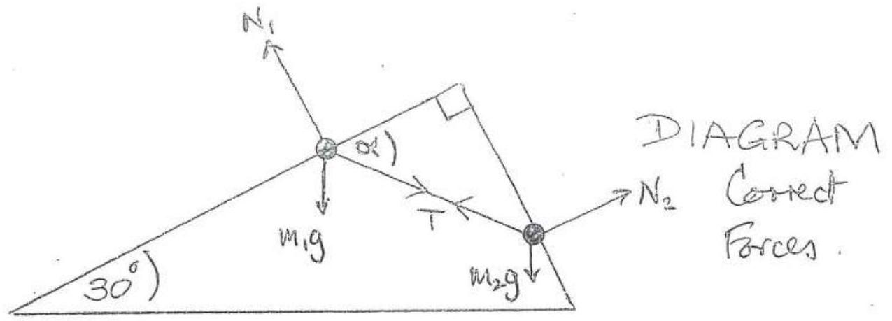

Introduce normal reactions $N _ { 1 }$ and $N _ { 2 }$ perpendicular to surfaces for $m _ { 1 }$ and $m _ { 2 }$ respectively
SOLUTION I Vector Diagram of farces on $m _ { 1 }$ and $m _ { 2 }$, with common $T$.
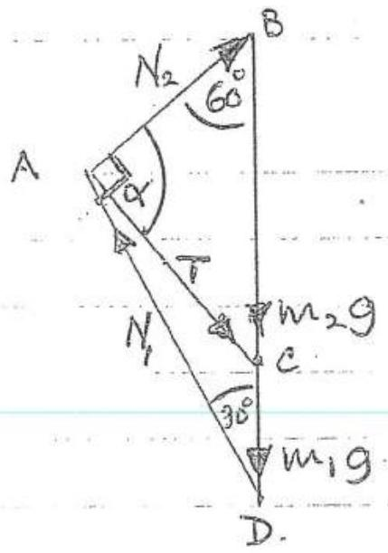
borrect vector dragram/s

Using sin vule in treaingle ACD

$$
\begin{equation*}
\frac { m _ { 1 } g } { \sin ( 90 - \alpha ) } = \frac { T } { \sin 30 ^ { \circ } } \tag{1}
\end{equation*}
$$

Usaig sin rule in triangle ABC

$$
\begin{equation*}
\frac { m _ { 2 } g } { \sin \alpha } = \frac { T } { \sin 60 ^ { \circ } } \tag{2}
\end{equation*}
$$

Dividning (1) By (2) and sumplifying

$$
\begin{aligned}
& \frac { \sin \alpha m _ { 1 } } { \cos \alpha m _ { 2 } } = \frac { \sin 60 } { \sin 30 } = \sqrt { 3 } \\
& \tan \alpha = \frac { m _ { 2 } } { m _ { 1 } } \sqrt { 3 } = 3 \sqrt { 3 } \quad \text { cos } m _ { 2 } = 3 m _ { 1 }
\end{aligned}
$$

Q4

Thus

$$
\alpha = 79 \cdot 11 ^ { \circ }
$$

(ii) (iii) From (2)

$$
\begin{aligned}
T & = m _ { 2 } g \sin 60 / \sin \alpha \\
& = ( 0.300 ) ( 9.81 ) \left( \frac { \sqrt { 3 } } { 2 } \right) / 0.9820 \\
T & = 2.60 \mathrm {~N}
\end{aligned}
$$

$$
\frac { 1 } { 12 }
$$

$Q _ { 4 } ( a ) ( 1 )$
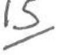

ASTERNATIVE
Sol UTION 2

For m，nesoloring along stope．
$T \cos \alpha = m , g \cos 60 ^ { \circ }$

$$
\begin{align*}
& T \cos \alpha = \frac { 1 } { 2 } m _ { 1 } g \quad \text { as } \cos 60 ^ { \circ } = \frac { 1 } { 2 } \\
& 2 T \cos \alpha = m _ { 1 } g \quad \tag{1}
\end{align*}
$$

For $m _ { 2 }$ ，readving along the slope，

$$
\begin{align*}
T \cos \left( 9 ^ { \circ } - \alpha \right) & = m _ { 2 } g \cos 30 ^ { \circ } \\
T \sin \alpha & = \frac { \sqrt { 3 } } { 2 } m _ { 2 } g \\
2 T \sin \alpha & = \sqrt { 3 } m _ { 2 } g \tag{2.}
\end{align*}
$$

From（1）and（2）

$$
\begin{aligned}
\tan \alpha & = \sqrt { 3 } \frac { m _ { 2 } } { m _ { 1 } } = 3 \sqrt { 3 } \left( a _ { 0 } \frac { m _ { 2 } } { m _ { 1 } } = 3 \right) \\
\alpha & = 79.11 ^ { \circ }
\end{aligned}
$$

（ii）From（1）or（2）

$$
\begin{aligned}
T & = \frac { m - g } { 2 \cos \alpha } \\
& = \frac { ( 0.100 ) ( 9.81 ) } { 2 - \cos ( 79.11 ) } \\
T & = 2.60 \mathrm {~N}
\end{aligned}
$$

$$
\text { or } \begin{aligned}
T & = \frac { \sqrt { 5 } } { 2 } \frac { m _ { 2 } g } { \sin \alpha } \\
& = \frac { \sqrt { 3 } } { 2 } \frac { ( 0.300 ) ( 9.81 ) } { \left. \sin ( 7981 ) ^ { \circ } \right) } \\
T & = 2.60 \mathrm {~N}
\end{aligned}
$$

12

No matter which solution 4 nams for the right diagram 2 marks for each right equarion．

(b)
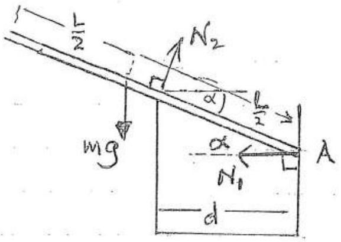

Borrect forces

Introduce Normal reactions $N _ { 1 }$ and $N _ { 2 }$ as indicated in diagiam and mass $m$ of the strans

Resolving forces vertically

$$
\begin{equation*}
m g = N _ { 2 } \cos \alpha \tag{1}
\end{equation*}
$$

Taking moments about $A$

$$
\begin{equation*}
m g \left( \frac { L } { 2 } \right) \cos \alpha = N _ { 2 } \frac { d } { \cos \alpha } \tag{2}
\end{equation*}
$$

Dividing (1) by (2)

$$
\begin{aligned}
\frac { 1 } { \frac { 1 } { 2 } \cos \alpha } & = \frac { \cos ^ { 2 } \alpha } { d } \\
\cos ^ { 3 } \alpha & = \frac { 2 d } { L } \\
\cos \alpha & = \sqrt [ 3 ] { \frac { 2 d } { L } }
\end{aligned}
$$

(a) The path difference between varys reflected at the unved senface of the lens and the glass plate is 2t. In addition there is a plose strff. of T. ... in reflection at the glass plate. The optical path difference for constructure interference is this
$$
\left( n + \frac { 1 } { 2 } \right) \lambda
$$
$$
a = 0,1,2 , \ldots
$$
and for destrictive intésference
nd
$$
m = 0,1,2 ,
$$
Thus for constriceture enterference we requere
$$
2 t = \left( x + \frac { 1 } { 2 } \right) \lambda
$$
and for dectructive interference
$$
n = 0,1,2 \ldots
$$
$2 t = n \lambda$
(b) In chagram
$$
\begin{aligned}
( O T ) ^ { 2 } & = a ^ { 2 } - r ^ { 2 } \\
& = ( a - t ) ^ { 2 } \\
\therefore \quad a ^ { 2 } - r ^ { 2 } & = a ^ { 2 } - 2 a t + t ^ { 2 } \\
r ^ { 2 } & = 2 a t - t ^ { 2 }
\end{aligned}
$$

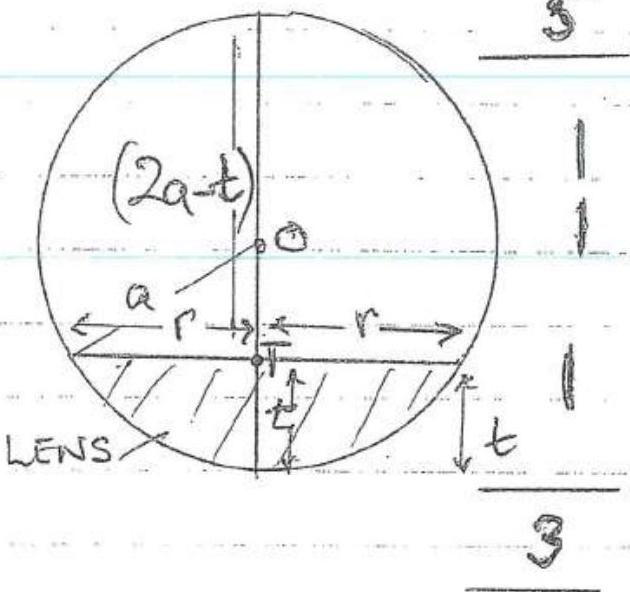

(c) Using approxumation
$$
r ^ { 2 } = 2 a t , \text { meglecting } t ^ { 2 }
$$
the condition for constructure and destricture interference, expressed internos of $r$, are respectively
$$
\begin{array} { l l }
\frac { r ^ { 2 } } { a } = \left( n + \frac { 1 } { 2 } \right) \lambda & n = 0,1,2 , \ldots \\
\frac { r ^ { 2 } } { a } = n \lambda & n = 0,1,2 , \ldots
\end{array}
$$

25
(d) Using drawéted, $\frac { d ^ { 2 } } { 4 a } = \left( m + \frac { 1 } { 2 } \right) \lambda$

$$
\begin{equation*}
\frac { \left( 0.582 \times 10 ^ { - 2 } \right) ^ { 2 } } { 4 a } = \left( \mu + \frac { 1 } { 2 } \right) \lambda \tag{A}
\end{equation*}
$$

$$
\begin{equation*}
\frac { \left( 1.36 \times 10 ^ { - 2 } \right) ^ { 2 } } { 4 a } = \left( n + 20 \frac { 1 } { 2 } \right) \lambda \tag{2}
\end{equation*}
$$

Subtractuing (1) from (2)

$$
\begin{align*}
& \frac { 10 ^ { - 4 } } { 4 a } \left( 1.36 ^ { 2 } - 0.58 ^ { 2 } 2 \right) = 20 \lambda = 20 \times 5.98 \times 10 ^ { - 7 } \\
& a = \frac { 10 ^ { - 4 } ( 1.942 ) ( 0.778 ) } { 4 \left( 11096 \times 10 ^ { - 6 } \right) } \\
& a = 3.16 \mathrm {~m} \tag{3}
\end{align*}
$$

Q5 (e) The initial radii are $r _ { 1 } = 0.291 \mathrm { cms }$ and $r _ { 2 } = 0.680 \mathrm {~cm}$ Introducing liquid of refracture index $\mu$ modefre's the conditions for interference to
$$
\mu \frac { r ^ { 2 } } { a } = \left( n + \frac { 1 } { 2 } \right) \lambda \text { and } \frac { \mu r ^ { 2 } } { a } = \left( n + 20 \frac { 1 } { 2 } \right) \lambda
$$
So the new radii became $r _ { 1 } ^ { \prime }$ and $r _ { 2 } ^ { \prime }$ where
$$
r _ { 1 } ^ { \prime 2 } = \frac { 1 } { \mu } r _ { 1 } ^ { 2 } \quad \text { and } \quad r _ { 2 } ^ { 2 } = \frac { 1 } { \mu } r _ { 2 } ^ { 2 }
$$
Substatuting $\mu = 1.33$ and $r _ { 1 } = 0.291 \mathrm { cms } , r _ { 2 } = 0.680 \mathrm { cms }$.
$$
\begin{aligned}
& r _ { 1 } ^ { \prime } = \frac { 0.291 } { \sqrt { 1.33 } } \text { ans and } r _ { 2 } ^ { \prime } = \frac { 0.680 } { \sqrt { 1.33 } } \text { ans } \\
& r _ { 1 } ^ { \prime } = 0.252 \text { ans and } r _ { 2 } ^ { \prime } = 0.590 \text { and }
\end{aligned}
$$
So average apped of INCREASE in radii are $V _ { 1 }$ and $V _ { 2 }$ given by
$$
\begin{aligned}
& V _ { 1 } = \frac { 0.252 - 0.291 } { 5.00 } \mathrm {~cm} ^ { - 1 } \text { \& } V _ { 2 } = \frac { 0.590 - 0.650 } { 5.00 } \left\lvert \, \begin{array} { l }
- 1 \\
V _ { 1 } = - 0.0078 \mathrm { cms } ^ { - 1 } \\
\text { \& } V _ { 2 } = - 0.018 \mathrm {~cm} ^ { - 1 }
\end{array} \right.
\end{aligned}
$$
Integerence rungs decrease in raduis

26
(a) Time constanto gree-by $\tau = C R$

$$
\begin{aligned}
\tau _ { 1 } & = \left( 50 \times 10 ^ { - 6 } \right) 10 ^ { 4 } \\
& = 0.5005
\end{aligned}
$$

$$
\begin{aligned}
\tau _ { 2 } & = \left( 50 \times 10 ^ { - 6 } \right) 10 ^ { 3 } \\
& = 0.050 \mathrm {~s}
\end{aligned}
$$

$$
\begin{aligned}
\tau _ { 13 } & = \left( 50 \times 10 ^ { - 6 } \right) 10 ^ { 2 } \\
& = \frac { 0.000505 } { 0.005 .5 }
\end{aligned}
$$

(b) GRAPH
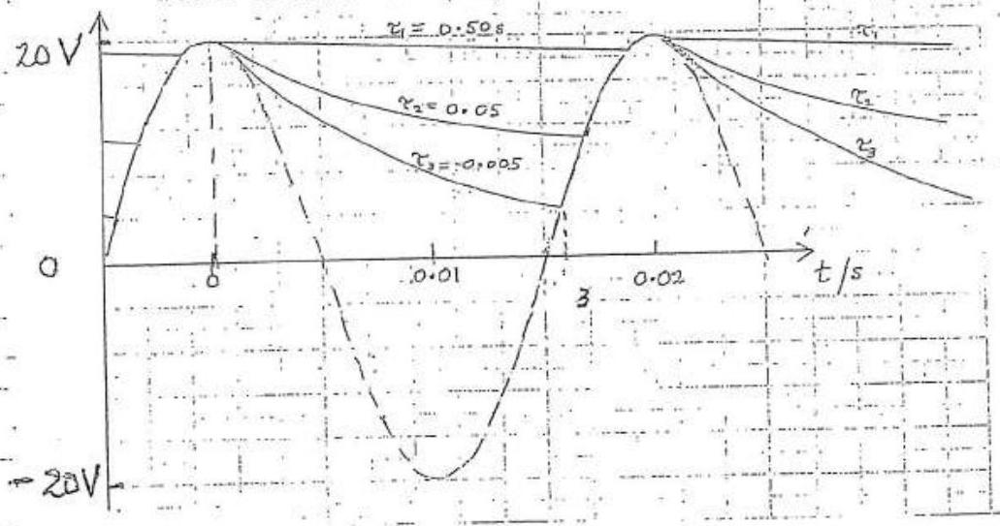

Correct qualitatorie form of graphs for $\tau _ { 1 } , \tau _ { 2 }$ and $\tau _ { 3 }$ over one pariod, 2 morts for each curve Imark for correct coseme curve 1 mork for correct labelling of axes
(c) $T _ { D } =$ ac period $= T _ { 1 }$

$$
\begin{equation*}
T _ { 0 } = f ^ { - 1 } - T _ { 1 } \tag{1}
\end{equation*}
$$

The expacita ducharges until its voltage ageals that of the ac source. For $\tau _ { 3 }$ this is from $t = 0$ to $t = 1$ (see graph) At twic. $T _ { i }$ the potentiil on capacitor $V _ { 0 } \exp \left( - T _ { 1 } / R C \right)$ equale that due to ac source $V _ { 0 } \cos 2 \pi \left( f T _ { 1 } \right)$. Hence

$$
\begin{align*}
V _ { 0 } \exp \left( - T _ { 1 } / R C \right) & = V _ { 0 } \cos 2 \pi \left( \frac { R } { T _ { 1 } } \right) \\
\exp \left( - T _ { 1 } / R C \right) & = \cos 2 \pi \left( f / T _ { 1 } \right) \tag{2}
\end{align*}
$$

Substitutung $R C = 0.50 \mathrm {~s}$ and $T _ { 1 } = 0.0191255$

$$
\begin{array} { l l }
\text { RHS of } ( 2 ) & = 0.9625 \\
\text { RHS of } ( 2 ) & = 0.9625 \\
\text { Thus lits } = \text { RHS } , \text { equation vingind }
\end{array}
$$

\}

Q 6
(e)

$$
\begin{aligned}
\text { \% time diode conducturg } & = \frac { T _ { D } ( 100 ) } { f ^ { - 1 } } \\
& = \frac { f ^ { - 1 } - T _ { 1 } } { f } ( 100 ) \text { from (1) } \\
& = \left( 1 \frac { f ^ { - 1 } } { f _ { 1 } ^ { - 1 } } \right) 100 \\
& = \left( 1 - \frac { 0.019125 } { 0.02000 } \right) 100 \\
& = 4.4 \%
\end{aligned}
$$

(d)

$$
\text { At } \begin{aligned}
& T = 0.019125 s \\
& \frac { V } { V _ { 0 } } = \exp ( - 0.019125 / 0.50 ) = 0.962 .
\end{aligned}
$$

$$
V = 19 \cdot 214 . V
$$

This peak to peak ripple voltage $= ( 20 - 19 \cdot 24 ) \mathrm { V }$

$$
= 0.76 \mathrm {~V}
$$

(Any result from 0.7 Vt 0.8 Vacceptable)

(a) Ranton Ergors

Not due to a systematic "mechemissins want with sufficient "readungs" will average out to zero end que a correct measurement. The emas cill hease a goursear detribution
Examples.
A stop watch when stopped by hard, at a specific ture, will introduce a random estor due to one's reaction time.
An analogue annueter readuig may vary sleghtly due to the angle of observation. If a number of observations are made, fara specific current, these error will average ant to zero.

Systematic Errors
These one often due to a mechanisin, polich one is erroware These evors do mot awarage ant to zero for repeated measurements but behave in a segtematic wey
Examples
A stop watch that continually 'gains' twie will geore readmigo that are too high
An aimenter that has been incorrectly calisiated will conserfently give uncorrect readuigs that do not average ont to the true value.

Other validexamples axe acceptable.

QI (a) (i) $g = 9.8 \pm 1.0 \mathrm {~ms} ^ { - 2 }$ (Encr relatively large completared or this value)

(ii)
$$
\text { Root meen square } \left. \begin{array} { r l }
l _ { \text {RMS } } & = \sqrt { \frac { 1 } { 2 } \left[ ( 920 ) ^ { 2 } + ( 65.0 ) ^ { 2 } \right] } \mathrm { m } \\
& \left. = \frac { 1 } { \sqrt { 2 } ( 91.01 \mathrm {~m} } \right) \\
l _ { \text {AMS } } & = 68.6 .6 \mathrm {~m}
\end{array} \right\}
$$
(b)
$$
\begin{aligned}
T = 2 \pi \sqrt { \frac { l } { g } } \quad \text { and } g & = \\
\frac { \Delta g } { g } & = 2 \frac { \Delta T } { T } + \frac { \Delta l } { l } \\
& = 2 \frac { 0.20 } { 100 } + \frac { 0.60 } { 100 } \\
100 \frac { \Delta g } { g } & = 0.40 + 0.60 \\
\text { Max } \% \text { error } & = 1.0 \%
\end{aligned}
$$

Alternotwe methods acceptable

(1)Adternatively one can evaluate max-errar by substrifutuig:

$$
\begin{equation*}
g = \frac { ( 2 \pi ) ^ { 2 } l } { T ^ { 2 } } \tag{1}
\end{equation*}
$$

Max error4g:
Dividning by 9 from (1)

$$
\begin{aligned}
& g \circ \\
& g + A g \\
& g \circ f \circ a ( 1 )
\end{aligned} = \frac { ( 2 \pi ) ^ { 2 } l ( 1 + 0.006 ) } { ( T ( 1 - 0.002 ) ) ^ { 2 } }
$$

Hax. \%error $100 \frac { \Delta g } { g } = 1.0 \%$
(c) Correctly obsewn graph of $V = \log A + \alpha \log I$ form table Arres labelled
 cudd marketfe accuracy 3
Alternaturely .
Gradrent inthen 2.25± 0.25
$\left. \begin{array} { c } \text { One mark forralise } \\ \text { Que mark for } \\ \text { accuracy } \end{array} \right)$
2 but oritide himits of 2.25. $\pm 0.4$ accuracy

| m | V | I | $\log _ { 10 } I$ |
| :--- | :--- | :--- | :--- |
| 1 | 3.0 | 3:2 | 0.505 |
| 2 | 3.6 | 9.9 | 0.996 |
| 3 | 4.6 | 20.4 | 1.310 |
| 4 | 5.0 | 31.6 | 1.500 |
| 5 | 6.2 | 97.0 | 1.987 |
| 6 | 606 | 193 | 2.286 |

A obtained from yraph or by substatutung a wifo $V = \log A + \alpha \log I$ for a posticular (V,I)
Acceptoble value 424
* Mark breakdown: [2] for accurate graph + labels [3] for gradient value within $2.25 \pm 0.3$ BUT minus [1] if students do NOT provide their own estimate of accuracy. [2] for value of intercept with estimate of accuracy.

(d)

|  | ( 1,4 ) | (2, 5) | (3,6) | (\}) |
| :--- | :--- | :--- | :--- | :--- |
| $\alpha$ | $\frac { 2.00 } { 0.995 } = 2.01$ | $\frac { 2.60 } { 0.991 } = 2.62$ | $\frac { 2.00 } { 0.989 } = 2.05$ |  |
| $\alpha _ { M } = 2.22 - 23$ |  |  |  |  |
| $\left\| \alpha - \alpha _ { M } \right\|$ | 0.21 | 0.40 | 0.178 |  |
| $D =$ Average $\left( \left\| x - \alpha _ { m } \right\| \right) = \frac { 0.27 } { 0.263 }$ |  |  |  |  |

This is a quantitation melkod that daes mot depend an ? judging by eye the 'best' straight graph Any other sensbble comment will gain the morth) Any other sensbble comment will gain the morth) The average deriation ' $D$ 's greater than in (c)

Q8 (a) $m _ { 2 } = 4 m _ { 1 }$
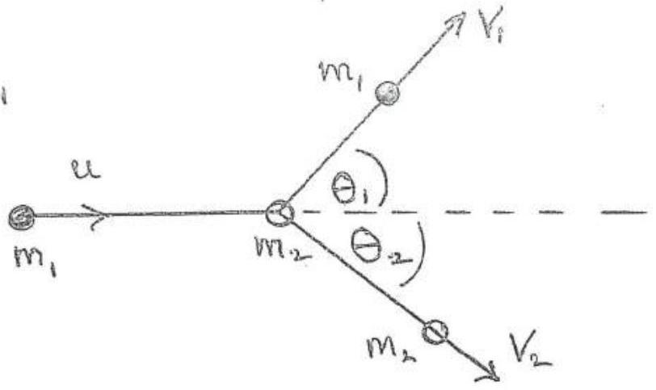
TRIANCLLE OF MOMENTA
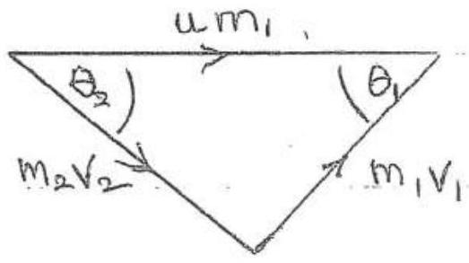

Vector.
Dagram
Using sin mile,

$$
\frac { m _ { 1 } v _ { 1 } } { \sin \theta _ { 2 } } = \frac { m _ { 2 } v _ { 2 } } { \sin \theta _ { 1 } }
$$

Thus

$$
\begin{equation*}
\frac { v _ { 1 } } { v _ { 2 } } = \frac { m _ { 2 } \sin \theta _ { 2 } } { m _ { 1 } \sin \theta _ { 1 } } = \frac { 4 \sin \theta _ { 2 } } { \sin \theta _ { 1 } } \tag{1}
\end{equation*}
$$

Aiso

$$
\frac { m _ { 1 } v _ { 1 } } { \sin \theta _ { 2 } } = \frac { m _ { 1 } u } { \sin \left( 180 - \theta _ { 1 } - \theta _ { 2 } \right) }
$$

Thus

$$
\begin{equation*}
\frac { v _ { 1 } } { u } = \frac { \sin \theta _ { 2 } } { \sin \left( \theta _ { 1 } + \theta _ { 2 } \right) } \tag{2}
\end{equation*}
$$

(b) Final $K _ { 2 } E _ { 1 } , T _ { F } = \frac { 1 } { 2 } m _ { 1 } v _ { 1 } ^ { 2 } + \frac { 1 } { 2 } m _ { 2 } v _ { 2 } ^ { 2 }$
Initial $K E T _ { I } = \frac { 1 } { 2 } m _ { 1 } u ^ { 2 }$
From (3) 2 (1)

$$
\left. \begin{array} { r l }
T _ { F } & = \frac { 1 } { 2 } m _ { 1 } v _ { 1 } ^ { 2 } + \frac { 1 } { 2 } m _ { 2 } v _ { 1 } ^ { 2 } \left( \frac { m _ { 1 } \sin \theta _ { 1 } } { m _ { 2 } \sin \theta _ { 2 } } \right) ^ { 2 } \\
& = \frac { 1 } { 2 } m _ { 1 } v _ { 1 } ^ { 2 } \left[ 1 + \frac { m _ { 1 } \sin ^ { 2 } \theta _ { 1 } } { m _ { 2 } \sin ^ { 2 } \theta _ { 2 } } \right]
\end{array} \right\}
$$

Q8 (b) Substututing from (2)

$$
\begin{aligned}
T _ { F } & = \frac { 1 } { 2 } m _ { 1 } u ^ { 2 } \frac { \sin ^ { - 2 } \theta _ { 2 } } { \sin ^ { 2 } \left( \theta _ { 1 } + \theta _ { 2 } \right) } \left[ 1 + \frac { m _ { 1 } \sin ^ { 2 } \theta _ { 1 } } { m _ { 2 } \sin ^ { 2 } \theta _ { 2 } } \right] \\
& \left. = T _ { I } \cdot \frac { \sin ^ { 2 } \theta _ { 2 } } { \sin ^ { 2 } \left( \theta _ { 1 } + \theta _ { 2 } \right) } \left[ 1 + \frac { m _ { 1 } \sin ^ { 2 } \theta _ { 1 } } { m _ { 2 } \sin ^ { 2 } \theta _ { 2 } } \right] \right]
\end{aligned}
$$

As $m _ { 2 } = 4 m _ { 1 }$

$$
T _ { F } = T _ { I } \frac { \sin ^ { 2 } \theta _ { 2 } } { \sin ^ { 2 } \left( \theta _ { 1 } + \theta _ { 2 } \right) } \left[ 1 + \frac { \sin ^ { 2 } \theta _ { 1 } } { 4 \sin ^ { 2 } \theta _ { 2 } } \right]
$$

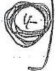

(i) Substituting $\theta _ { 1 } = \theta _ { 2 } = 60 ^ { \circ }$
$$
T _ { F } = T _ { I } \frac { \sin ^ { 2 } 60 ^ { \circ } } { \sin ^ { 2 } \left( 120 ^ { \circ } \right) } \left[ 1 + \frac { \sin ^ { 2 } 60 ^ { \circ } } { 4 \sin ^ { 2 } 60 ^ { \circ } } \right]
$$
As $\sin 60 ^ { \circ } = \sin 120 ^ { \circ }$ and sin $60 = \sqrt { 3 } / 2$
$$
T _ { F } = T _ { I } \left[ 1 + \frac { 1 } { 4 } \right] = \frac { 5 } { 4 } T _ { I }
$$
Energy not conserved.

Q8 (b)

$$
T _ { F } = T _ { I } \frac { \sin ^ { 2 } \theta _ { 2 } } { \sin ^ { 2 } \left( \theta _ { 1 } + \theta _ { 2 } \right) } \left[ 1 + \frac { \sin ^ { 2 } \theta _ { 1 } } { 4 \sin ^ { 2 } \theta _ { 2 } } \right]
$$

(ii) $\theta _ { 1 } = \theta _ { 2 } = 56 ^ { \circ }$
$$
T _ { F } = T _ { I } \frac { \sin ^ { 2 } 56 ^ { \circ } } { \sin ^ { 2 } 112 ^ { \circ } } \left[ 1 + \frac { 1 } { 4 } \right]
$$
$T _ { F } = T _ { I }$
to accuracy of $2 \times 10 ^ { - 3 }$
Energy conserved to within acianacy of $2 \times 10 ^ { - 3 }$.

Q(8)(b)(m)

$$
\begin{aligned}
& \frac { v _ { 1 } } { v _ { 2 } } = 1 = \frac { 4 \sin \theta _ { 2 } } { \sin 90 ^ { \circ } } \\
& \therefore \quad \sin \theta _ { 2 } = \frac { 1 } { 4 } \quad \left( \sin 90 ^ { \circ } = 1 \right)
\end{aligned}
$$

From (4)

$$
T _ { F } = T _ { I } \frac { \sin ^ { 2 } \theta _ { 2 } } { \sin ^ { 2 } \left( 9 \theta ^ { \circ } + \theta _ { 2 } \right) } \left[ 1 + \frac { 1 } { 4 } \frac { 1 } { \sin ^ { 2 } \theta _ { 2 } } \right]
$$

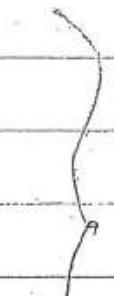

Substruting,
Substruting,

$$
\begin{aligned}
T _ { F } & = T _ { I } \frac { \left( \frac { 1 } { 4 } \right) ^ { 2 } } { \sin ^ { 2 } \left( 90 ^ { \circ } + \theta _ { 2 } \right) } \left[ 1 + \left( \frac { 1 } { 4 } \right) \frac { 1 } { ( 1 / 16 ) } \right] \\
& = T _ { I } \frac { 5 / 18 } { \sin ^ { 2 } \left( 104.48 ^ { \circ } \right) } \\
T _ { F } & = 0.333 T _ { I }
\end{aligned}
$$

There evergy lost
(c)

$$
3 \theta _ { 1 } = - 8 \theta _ { 2 }
$$

Substatuting cirto (4) with $\theta _ { 1 }$ sui $\theta _ { 2 } \sim \theta _ { 2 } , \sin \theta _ { 1 } \sim \theta _ { 1 }$

$$
\begin{aligned}
T _ { F } & = T _ { I } \frac { \theta _ { 2 } } { \left( \theta _ { 1 } + \theta _ { 2 } \right) ^ { 2 } } \left[ 1 + \frac { \theta _ { 1 } ^ { 2 } } { 4 \theta _ { 2 } ^ { 2 } } \right] \\
& = I _ { I } \frac { ( - 3 i ⿰ f ) ^ { 2 } } { \left[ 1 + ( - 5 / 8 ) ^ { 2 } \right] } \left[ 1 + \frac { 1 } { 4 ( - 3 / 5 ) ^ { 2 } } \right] \\
T _ { F } & = T _ { I } \quad \text { Enerall con }
\end{aligned}
$$

Energy conserved
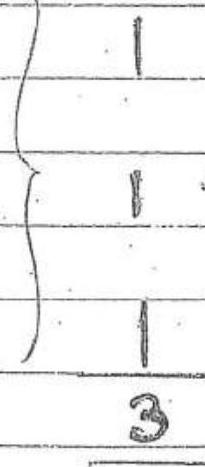

Q9

(a)
$$
E = - \frac { 13 \cdot 6 } { m ^ { 2 } } \mathrm { eV }
$$
For Formsition from $x = 3$ to $x = 1 \quad \Delta E$ given by
$$
\left. \begin{array} { r l }
\Delta E & = - 13.6 \left( \frac { 1 } { 3 ^ { 2 } } - \frac { 1 } { 1 ^ { 2 } } \right) \\
& = \frac { 8 } { 9 } ( 13.6 ) \mathrm { eV } = 12.1 \mathrm { eV }
\end{array} \right\}
$$
Thus frequency? given by
$$
\begin{aligned}
\mathrm { h } . & \\
\nu & = \frac { 12.1 \left( 1.60 \times 10 ^ { - 19 } \right) \mathrm { J } } { 6.63 \times 10 ^ { - 34 } }
\end{aligned}
$$
Asc $= \lambda >$
$$
\frac { 1 } { \lambda } = \frac { 12.1 \left( 1.602 \times 10 ^ { - 19 } \right) } { 6.63 \times 10 ^ { - 34 } \left( 3.00 \times 10 ^ { 8 } \right) }
$$
(b) Distance of Moon from Earth Deaineter of beam on Moon Anea illuminated on Moon
$$
\begin{aligned}
& = 3.84 \times 10 ^ { 8 } \mathrm {~m} \\
& = \left( 3.84 \times 10 ^ { 8 } \right) \left( 1.5 \times 10 ^ { - 3 } \right) \mathrm { m } \\
& = \pi \left( \frac { 1 } { 4 } \right) \left( 3.84 : \times 10 ^ { 8 } \right) ^ { 2 } \left( 1.5 \times 10 ^ { - 3 } \right) ^ { 2 } \mathrm {~m} ^ { 2 } \\
& = 2.61 \times 10 ^ { 11 } \mathrm {~m} ^ { 2 }
\end{aligned}
$$
Energy of a suigh photon $= h \nu$ as $c = \lambda \gamma ^ { 2 }$
$$
\begin{aligned}
& = \frac { h \nu } { 6.63 \times 10 ^ { - 34 } \left( 3.00 \times 10 ^ { 8 } \right) } \\
& = \frac { \left( 590 \times 10 ^ { - 9 } \right) } { }
\end{aligned}
$$
Number of photons, $n$, produced by laser per second givenby
$$
\left. \begin{array} { r l }
n & = \frac { 0.5 \times 10 ^ { - 3 } \cdot \left( 590 \times 10 ^ { - 9 } \right) } { \left( 6.63 \times 10 ^ { - 34 } \right) \left( 3.00 \times 10 ^ { 8 } \right) } \\
& = 1.48 \times 10 ^ { 15 }
\end{array} \right\}
$$
No. of photons arriving / unit area / $= 5.68 \times 10 ^ { 3 } \mathrm {~m} ^ { - 2 } \mathrm {~s} ^ { - 1 }$ see.

QP(c)

$$
\begin{array} { l l l l }
\text { Moinental } & h / \lambda _ { 1 } & & \overrightarrow { m _ { e } v ^ { 2 } } \\
\text { Energy } & h f _ { 1 } & \frac { i } { 2 } m _ { e } v ^ { 2 } & h f _ { 2 }
\end{array}
$$

Conservation of momentum

$$
\begin{equation*}
\frac { h } { \lambda _ { 1 } } = - \frac { h } { \lambda _ { 2 } } + m _ { e } v . \tag{1}
\end{equation*}
$$

Conservation of evergy

$$
\begin{align*}
A f ^ { \prime \prime } f \lambda = c ^ { \prime \prime } & h f _ { 1 } = h f _ { 2 } + \frac { 1 } { 2 } m _ { e } v ^ { 2 }  \tag{2}\\
\therefore \frac { h } { \lambda _ { 1 } } & = \frac { h } { \lambda _ { 2 } } + \frac { 1 } { 2 c } m _ { e } v ^ { 2 }
\end{align*}
$$

Addling (1) and (3)

$$
\begin{equation*}
\frac { 2 h c } { \lambda _ { 1 } } = \frac { 1 } { 2 } m e v ^ { 2 } + m e v c \tag{4}
\end{equation*}
$$

Now for 5.00 keV electrons,

$$
\begin{align*}
& \frac { 1 } { 2 } m _ { e } v ^ { 2 } = \left( 5.00 \times 10 ^ { 3 } \right) \left( 1.60 \times 10 ^ { - 19 } \right) \\
& \frac { 1 } { 2 } m _ { e } v ^ { 2 } = 8.00 \times 10 ^ { - 16 } \mathrm {~J} \tag{5}
\end{align*}
$$

Giving

$$
\begin{align*}
v ^ { 2 } & = \frac { 16.0 \times 10 ^ { - 16 } } { 9.11 \times 10 ^ { - 31 } } \\
& = 1.76 \times 10 ^ { 15 } \\
v & = 420 \times 10 ^ { 7 } \mathrm {~ms} ^ { - 1 } \tag{6}
\end{align*}
$$

Substituting (5) and (6) into (4) with $c = 3 \times 10 ^ { 8 } \mathrm {~ms} ^ { - 1 }$,

$$
\begin{aligned}
\frac { 2 h _ { c } } { \lambda _ { 1 } } & = 8.00 \times 10 ^ { - 16 } + c \left( 9.11 \times 10 ^ { - 31 } \right) \left( 14.20 .10 ^ { 7 } \right) \\
& = 8.00 \times 10 ^ { - 16 } + 1.15 \times 10 ^ { - 14 } \\
& = 1.23 \times 10 ^ { - 14 } \\
\lambda _ { 1 } & = 3.23 \times 10 ^ { - 11 } \mathrm {~m}
\end{aligned}
$$

## BRITISH PHYSICS OLYMPIAD 2014-15

## Round 1

## Section 2

## $14 ^ { \text {th } }$ November 2014

## Instructions

Questions: Only TWO of the eight questions in Section 2 should be attempted.
Time: 1 hour 20 minutes on this section (approximately 40 minutes on each question).
Marks: The maximum mark for each of these questions is 20.

## Answers

Answers and calculations can be written on loose paper or examination booklets. Graph paper and formula sheets are available.

Students should ensure their name and school is clearly written on all answer sheets.

## Teachers' instructions

Section 1 and Section 2 of Paper 2 may be sat in one session of 2 hour 40 minutes.
Alternatively, the paper may be sat in two sessions on separate occasions; with 1 hour 20 minutes for Section 1 and 1 hour 20 minutes for Section 2. If the paper is taken in two sessions on separate occasions, Section 1 must be collected after the end of 1 hour 20 minutes and Section 2 is to be handed out in the second session.

Q9 (d)

$$
\left. \begin{array} { r l r l }
e V _ { 0 } & = h _ { \nu } - W & \text { where } & V _ { 0 } = 1.32 \mathrm {~V} \\
W & = h _ { \nu } - e V _ { 0 } & \lambda & = 380 \mathrm {~mm} \\
& = \frac { \left( 6.63 \times 10 ^ { - 34 } \right) \left( 3.00 \times 10 ^ { 8 } \right) } { \left( 380 \times 10 ^ { - 9 } \right) } & - \left( 1.60 \times 10 ^ { - 19 } \right) ( 1.32 ) \\
& = 5.23 \times 10 ^ { - 19 } - 2.11 \times 10 ^ { - 19 } \mathrm {~J} & \\
W & = 3.12 \times 10 ^ { - 19 } \mathrm {~J} &
\end{array} \right\}
$$
