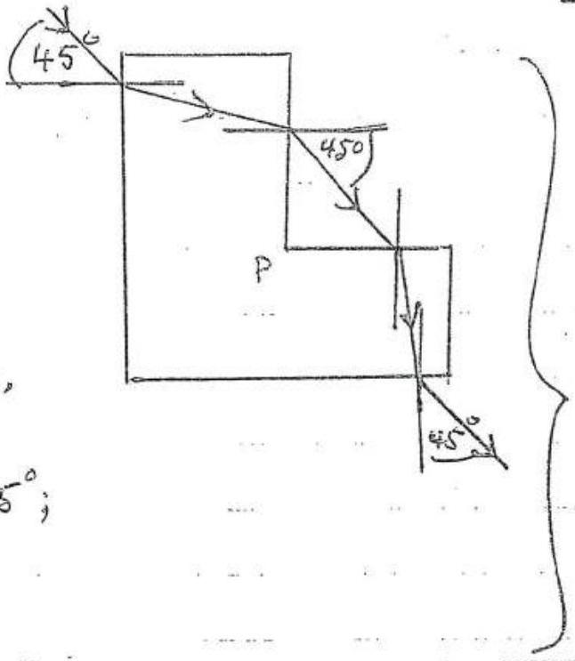
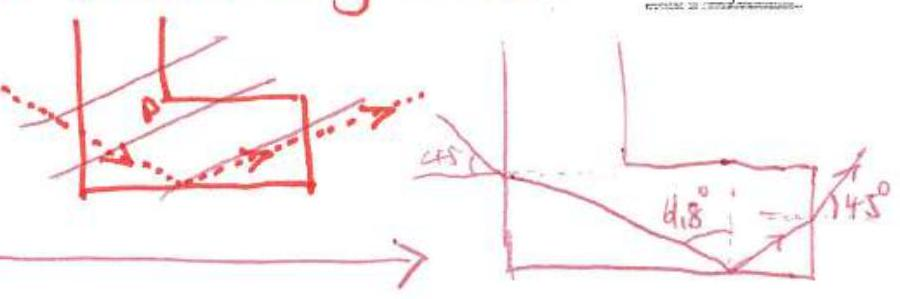
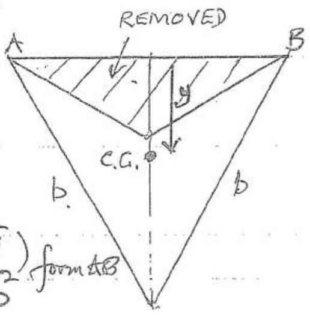
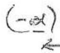
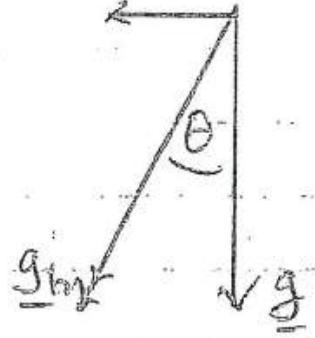
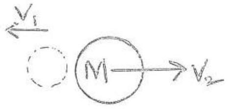

Q1 (c)(i) The beam will emerge from vertical section of glass block parallel to initial beam as the angle of refaction at both surfaces are equal
Similarly for the horzontal section, angle of inidence is $1 + 5 ^ { \circ }$ and consequently angle of emergence is $45 ^ { \circ }$; parallel to initial beam

(ii) Usung the notation in dragram
$$
\frac { \sin 45 ^ { \circ } } { \sin \phi } = 1.5
$$
Giving $\phi = 28.13 ^ { \circ }$ and $\alpha = 90 - 28.13 ^ { \circ } = 61.57 ^ { \circ }$
Critical angle, $\theta$, geven by
$$
\frac { \sin 90 ^ { \circ } } { \sin \theta _ { c } } = 1.5 \quad \text { ie } \theta _ { e } = 41.81 ^ { \circ }
$$
So the ray is totally internally reflected-adinginitem at the two horyiontal glass faces
As $\hat { S T X } = \phi < 45 ^ { \circ }$ the ray cannot be incident on the verticed face PB
(ii) 3
* Give marks if students determine that ray undergoes total internal reflection.
Also give marks if student shows ray to each glass at g. vereical face

(d) Let $R _ { G }$ be the raduis of the orbit of Caungurede and $M _ { C }$ is wass. $M _ { J }$ is the mans of Jupiter. Then If $\omega$ is the angular velocity of Gangurede,
$$
\begin{align*}
M _ { C } R _ { G } \omega ^ { 2 } & = \frac { G M _ { C } M _ { J } } { R _ { G } ^ { 2 } } \\
R _ { G } ^ { 3 } \omega ^ { 2 } & = G M _ { J } \tag{1}
\end{align*}
$$
If the Earth has mass $M _ { E }$ and raduis $R _ { E }$ there for mass in on the surface
$$
\begin{align*}
& m g = \frac { G _ { m } M _ { E } } { R _ { E } ^ { 2 } } \\
& G M _ { E } = g R _ { E } ^ { 2 } \tag{2}
\end{align*}
$$
From (1) and (2). *
$$
\begin{aligned}
\frac { M _ { J } } { M _ { E } } & = \frac { R _ { G } ^ { 3 } \omega ^ { 2 } } { R _ { E } ^ { 2 } g _ { 9 } } \\
& = \frac { \left( 1.07 \times 10 ^ { 9 } \right) ^ { 3 } ( 2 \pi / ( 7.16 \times 24 \times 60 \times 60 ) ) ^ { 2 } } { \left( 6.38 \times 10 ^ { 6 } \right) ^ { 2 } ( 9.81 ) } \\
& = 316
\end{aligned}
$$
$$
M _ { J } = 316 M _ { E }
$$
* Alteratively are could substitute the value of $M _ { F }$
(e)
If $\delta l _ { c }$ and $\delta l _ { T }$ are the extension's of ithe copperand tungatern were respectively then the Young's modulia are:
$$
\begin{align*}
& 12.4 \times 10 ^ { 10 } = \frac { \frac { \pi \left( \sigma _ { 15012 } \right) ^ { 2 } } { \delta t _ { 6 } } } { \pi ( d 12 ) ^ { 2 } \varepsilon _ { 4 } }  \tag{1}\\
& 35.5 \times 10 ^ { 10 } = \frac { 100 \times 9.851 } { \pi \left( 2 l _ { 5 } \right) } \tag{2}
\end{align*}
$$

QJ dlso

$$
\begin{equation*}
\delta l _ { 2 } + \delta l _ { r } = 6.00 \times 10 ^ { - 2 } \tag{3}
\end{equation*}
$$

Substituting into (3) from (1) and (2)
For correct equation

$$
\begin{aligned}
6.00 \times 10 ^ { - 2 } & = \frac { 100 \times 9.81 } { \frac { \pi } { 4 } } \left[ \frac { 1 } { \left( 0.50 \times 10 ^ { - 3 } \right) ^ { 2 } 12.4 \times 10 ^ { 10 } } + \frac { 1 } { d ^ { 2 } \left( 35.5 \times 10 ^ { 10 } \right) } \right] \\
\frac { 6.00 \times 10 ^ { - 2 } \left( \frac { \pi } { 4 } \right) } { 10 ^ { 2 } \times 9.81 } & = \frac { 1 } { \left( 0.50 \times 10 ^ { - 3 } \right) _ { 12.4 \times 10 ^ { 10 } } ^ { 12.4 } } + \frac { 1 } { d ^ { 2 } \left( 35.5 \times 10 ^ { 10 } \right) } \\
0.4804 \times 10 ^ { - 4 } & \left. = \frac { 4.00 \times 10 ^ { - 4 } } { 12.4 } + \frac { 1 } { d ^ { 2 } \left( 35.5 \times 10 ^ { 10 } \right) } \right\} \\
0.1578 \times 10 ^ { - 4 } & = \frac { 1 } { d ^ { 2 } } \left( 0.02817 \times 10 ^ { - 10 } \right) \\
d & = 0.423 \mathrm {~mm}
\end{aligned}
$$

(f) Activity proportional to number of radiaactive nuclei. present. Also

$$
\begin{equation*}
N = N _ { 0 } e ^ { - \lambda t } \tag{i}
\end{equation*}
$$

So

$$
\begin{equation*}
\frac { N } { N _ { 0 } } = \frac { 1.2 \times 10 ^ { 2 } } { 2.0 \times 10 ^ { 2 } } = 0.60 \tag{2}
\end{equation*}
$$

Now

$$
\begin{aligned}
\lambda & = \ln 2 / T \quad \text { where } T \text { is lalf lefe } \\
& = - 0.692 / T
\end{aligned}
$$

Substituting into (1) from (2) and (3)

$$
\text { or } \begin{aligned}
0.60 & = \exp ( - 0.692 t / T ) \\
\text { Sub. fart, } & 0.692 t = T \ln ( 1 / 0.60 ) \\
& = \left( 5.7 \times 10 ^ { 3 } \right) ( 0.510 ) \\
t & = 4.2 \times 10 ^ { 3 } \text { years }
\end{aligned}
$$

years

(g) If one divides the trangle up into their strips perallel to the side under consederation. The c.ng. of each strip is at its mid point. The hine joining these c.g.s is the median which terminates at the mid point of He side under consederation. As all treaingles formed by a strip and the vestex are similar treangles the median must be a staight line.
Area of criginal triangle $\frac { 1 } { 2 } b ^ { 2 } \frac { \sqrt { 3 } } { 2 } = \frac { b ^ { 2 } \sqrt { 3 } } { 4 }$

$$
\begin{aligned}
\text { Area of removed triangle } & \frac { 1 } { 2 } b ^ { 2 } - \frac { \sqrt { 3 } } { 2 } \left( \frac { 1 } { 3 } \right) \\
& = \frac { 1 } { 4 } \frac { \sqrt { 3 } } { 3 } b ^ { 2 }
\end{aligned}
$$

C.G. of removed treingle $= \frac { 1 } { 3 } \left( \frac { 1 } { 3 } b \frac { v ^ { 2 } } { 2 } \right)$ form $A B$ Area of remaining plate $= \frac { 1 } { 6 } \sqrt { 3 } b$

Taking moments about the uppor base of the remared triangle, the c.g. is a distance $y$ from this hime along the median given, by subtraction, by

$$
\begin{aligned}
\left( \frac { 1 } { b } \sqrt { 3 } b ^ { 2 } \right) y & \left. = \left( \frac { 1 } { 3 } b \frac { \sqrt { 3 } } { 2 } \right) \frac { b ^ { 2 } \sqrt { 3 } } { 4 } - \frac { 1 } { 3 } \left( \frac { 1 } { 3 } b \frac { \sqrt { 3 } } { 2 } \right) \frac { 1 } { 4 } \frac { 1 } { 3 } \right) b ^ { 2 } 2 \\
& = b ^ { 3 } \left( \frac { 1 } { 8 } - \frac { 1 } { 3 ^ { 2 } \times 8 } \right) = \frac { b ^ { 3 } } { 9 } \\
\frac { y } { y } & = \frac { 2 \sqrt { 3 } } { 9 } b
\end{aligned}
$$

Alternative solutions acceptable.

(h) The effecture ' $g$ ' with lift is $( g + a )$ ventically down

If U-Tabe acceleraturg as mi the diagram, the effectrie vector as is guesi by

$$
\begin{aligned}
g _ { h } & = g - \alpha \\
g _ { h } & = \sqrt { g ^ { 2 } + \alpha ^ { 2 } }
\end{aligned}
$$

at angle to to vertical given by

$$
\begin{equation*}
\theta = \tan ^ { - 1 } \left( \frac { x } { g } \right) \tag{1}
\end{equation*}
$$

( $\theta$ to left of mertical)

The dequid surface is alerays perpendicular In
The surfaces in the U-tube areperpendicilarts in (broken line in dragrams)
Conseguaritly

$$
\begin{align*}
\tan \theta & = \frac { h } { 1 }  \tag{1}\\
& = \frac { \alpha } { g } \tag{1}
\end{align*}
$$

Theo

$$
\alpha = \frac { h } { L } g
$$

$\frac { 1 } { 1 }$

Q) (i) In the time taken for light to travel from the rotating mersor to the foced nurror and bock again to the sobating mirror, $\Delta t$, the rolating muriew must have rotated through half the anyle subtended by source and receiver at the rotating murior, $\Delta \theta$, as the retinning beam to the receiver has a sotativial speed that is twice that of the merior. Now
$$
\begin{aligned}
\Delta E & = 2 \left( 0.30 \times 10 ^ { 3 } \right) / c \\
& = \frac { 0.60 \times 10 ^ { 5 } } { 3.00 \times 10 ^ { 5 } } s \\
& = \frac { 1 } { 2 } \left( \frac { 0.60 } { 0.30 \times 10 ^ { 3 } } \right) ^ { \frac { 1 } { W } } \\
\omega & = 0.50 \times 10 ^ { 3 } \text { rads. } 5 ^ { - 1 }
\end{aligned}
$$

Q $l ( j )$

(i) No Doppler effect heard by observer when car at $A$ as nor motion in drietion of Frequency head by observer is 4001 tz
(ii) At $x$ source of sound moving away from observer with a speed of $V = 90 \cos \theta$ kin thi-
$$
\begin{aligned}
& = \frac { 96 \times 10 ^ { 3 } } { 60 \times 60 } \cos \theta \mathrm {~ms} ^ { - 1 } \\
& = 25.0 \cos \theta \mathrm {~ms} ^ { - 1 }
\end{aligned}
$$

The Doppler shift, frequency 7 , with the car frequency of $t _ { 0 }$ is given by

$$
\begin{equation*}
v = \frac { v _ { e } } { 1 + \frac { v } { v _ { s } } } \tag{1}
\end{equation*}
$$

where $r$ is the velocity of sound $= 34.3 \mathrm {~ms} ^ { - 1 }$. Thus

$$
\gamma = \frac { 400 } { 1 + \frac { 25 \cdot 0 \cos \theta } { 343 } }
$$

$$
\cos \theta = \sqrt { x ^ { 2 } + 10 ^ { 4 } }
$$

$$
\begin{equation*}
\nu = \frac { 400 } { 1 + \left( \frac { \left. \frac { 2500 } { 343 } \right) \sqrt { 10 ^ { 4 } 4 x ^ { 2 } } } { u _ { 0.0729 } } \right. } \mathrm { Hz } \tag{\(H z\)}
\end{equation*}
$$

Q (k) m

    (1) Banservation of momentum $m u = M v _ { 2 } - m v _ { 1 }$ (1) benservation of energy $\frac { 1 } { 2 } m u ^ { 2 } = \frac { 1 } { 2 } M v _ { 2 } ^ { 2 } + \frac { 1 } { 2 } m v _ { 1 } ^ { 2 }$ (2) 1
    (ii) From (1) $\quad m \left( u + v _ { 1 } \right) = M v _ { 2 }$ (3) From (2) $m \left( u - v _ { 1 } \right) \left( u + v _ { 1 } \right) = M v _ { 2 } ^ { 2 }$ (4) (5)
(t) If second slit moves through an argele $\theta$, or $\theta + 2 \pi$, or $\theta + k n \pi$ (for numiger),... passtides with velocity v will get through if the time taken $\Delta t$ to trowel from furst in second dise satisfies
$$
v \Delta t = - d
$$
But
$$
\Delta t = \frac { ( \theta + 2 \pi n ) } { \omega }
$$
So
$$
v = \frac { d \omega } { ( \theta + 2 \pi n ) }
$$
$x = 0,1,2 , \ldots$
Substituting numercal values
$$
\begin{aligned}
& V = \frac { 1.0 ( 24000 ) ( 2 \pi ) } { \left( \frac { \pi } { 3 } + 2 \pi \mathrm {~m} \right) } \\
& V = \frac { 1.444 \times 10 ^ { 55 } } { 1 + 6 \mathrm {~m} }
\end{aligned}
$$
$\mathrm { min } ^ { - 1 }$ $m = 0,1,2 , \ldots$ $m = 0,1,2 , \ldots$ 5
- Note that $\omega$ is given in rpm so units of $v$ are in $\mathrm { m } \mathrm { min } ^ { - 1 }$, if student gives V in units of $\mathrm { ms } ^ { - 1 }$ then answer must be factor $60 \times$ smaller.
$$
V = \frac { 2400 } { 6 n + 1 } \mathrm {~m} / \mathrm { s } \quad ( n = 0,1,2 , \ldots )
$$

Q2

(a) Reversing $V$, reverses (te discochor of current in EF But the 'reversed' returok is identical to original network by symmetry. So $i _ { \text {EF } }$ should be in the same direction as in original circuit. Consequently the's can only occur if
$$
i _ { E F } = 0 .
$$
This the metwork censists now of resistances in series and parallel only.
$$
R _ { A E } + R _ { E B } = 2 R
$$
This is in parallel with $R _ { A B } = R$.
Thus total mesistance from top face $= \left( \frac { 1 } { 2 R } + \frac { 1 } { R } \right) = \frac { 2 } { 3 } R ( 1 )$
$$
R _ { C F } + R _ { F D } = 2 R \text { is in parallel with } R _ { C D } = R
$$
Total resestance $\frac { 2 } { 3 } R$. (same as (1))
Thos is in series with $R _ { A B }$ and $R _ { B D }$ giving
$$
\begin{equation*}
2 R + \frac { 2 } { 3 } R = \frac { 8 } { 3 } R \tag{2}
\end{equation*}
$$
Now messionares (1) and (2) are in parallel Finally resultant resistance, from (1) and (2),
$$
\begin{aligned}
& R _ { A B } = \left( \frac { 3 } { 2 R } + \frac { 3 } { 8 R } \right) ^ { - 1 } \\
& R _ { A B } = \frac { 8 } { 15 } R
\end{aligned}
$$
(b) The 'faces' $A B D C$ and $A F F C$ can be untirchanged by symmetry, so
$$
i _ { 1 } = i _ { 2 }
$$
Also by eymmetry arrents in BD and EF must be identical, thus requiring
$$
i _ { B E } = i _ { F D } = 0
$$

(b) Rac can now be determined by adduigh reseaters in serie's and parallel.
$$
R _ { A B D C } = 3 R \quad \text { wheck is un parallel } R _ { \text {in } } A C
$$
Total versitane $= \left( \frac { 1 } { 3 R } + \frac { 1 } { R } \right) ^ { - 1 } = \frac { 3 } { 4 } R$
$R _ { A E F C } = 3 R$ in parallel worth $\frac { 3 } { 4 } R$
Final total resestance
$$
\begin{aligned}
& R _ { A C } = \left( \frac { 1 } { 3 R } + \frac { 4 } { 3 R } \right) ^ { - 1 } \\
& R _ { A C } = \frac { 3 R } { 5 }
\end{aligned}
$$
(c) Total heas.
$$
\begin{aligned}
R _ { A D } & = \frac { V _ { A B } + V _ { B D } } { \left( i _ { 1 } + i _ { 2 } + i _ { 3 } \right) } \\
& = \frac { \left( i _ { 1 } + i _ { 3 } \right) } { i _ { 1 } + i _ { 2 } + i _ { 3 } } R
\end{aligned}
$$
By reversing $V$, and symmetry,
$$
\begin{aligned}
& i _ { B D } = i _ { 3 } \\
& i _ { C D } = i _ { 1 } \\
& L _ { D F } = i _ { 2 }
\end{aligned}
$$
Usug Kirchoffs's first rule:
$A E B , \quad i _ { B E } = \left( i _ { 1 } - i _ { 3 } \right)$
At $E , i _ { F F } = \left( i _ { 2 } + i _ { 1 } - i _ { 3 } \right)$
Atc, $i _ { C F } = \left( i _ { 3 } - i _ { 1 } \right)$
Usuig Kucchoff's second rale round ABE,
$$
\begin{align*}
& i _ { 1 } + \left( i _ { 1 } - i _ { 3 } \right) - i _ { 2 } = 0 \\
& 2 i _ { 1 } - i _ { 3 } - i _ { 2 } = 0 \tag{1}
\end{align*}
$$
Round AEFC $i _ { 2 } + \left( i _ { 2 } + i _ { 1 } - i _ { 3 } \right) - \left( i _ { 3 } - i _ { 1 } \right) - i _ { 3 } = 0$
re
$$
\begin{equation*}
2 i _ { 1 } + 2 i _ { 2 } - 3 i _ { 3 } = 0 \tag{2}
\end{equation*}
$$
Sinblisacting (1) from (),
$$
\begin{equation*}
2 i _ { 3 } = 3 i _ { 2 } \quad \text { e } i _ { 3 } = \frac { 3 } { 2 } i _ { 2 } \tag{3}
\end{equation*}
$$

Substatuturg $c _ { 3 } = \frac { 3 } { 2 } i _ { 2 }$ unito (1)

$$
i _ { 1 } = \frac { 5 } { 4 } i _ { 2 }
$$

Substituting (3) and (4) into (A) qués

$$
R _ { A D } = \frac { 11 } { 15 } R
$$

$$
\left\{ \frac { 2 } { 10 } \right.
$$

(a) Along the magnetic field the velocity of the mores $m$ is $r \cos \theta$. (1)

This remainis constant.
Perpendicular to the field the speed is $v \sin \theta$ and the charge is acted on by the force $B q v \sin \theta$ perpendicular to the velocity. So the motion in this plane is circular with radius $R$ given by

$$
\begin{align*}
\frac { m v ^ { 2 } \sin ^ { 2 } \theta } { R } & = B q v \sin \theta  \tag{2}\\
\therefore \quad R & = \frac { m v \sin \theta } { B q } \tag{2}
\end{align*}
$$

Consequently the charge has a helical trayectory along 1 the direction of the magnetic field.

(b)The twice for one cotation is $T = \frac { 2 \pi R } { V \sin \theta }$ From (2)

$$
\begin{equation*}
T = \frac { 2 \pi m } { B q } \tag{3}
\end{equation*}
$$

(midependent of $\theta$ )
Thus the patch of the helix is, from (1),

| $v \cos \theta T =$ | $2 \pi m v \cos \theta$ |
| :--- | :--- |
|  | Bq |
(c) If $\theta$ siniall, $\cos \theta \approx 1$, from (1) velocity companeit along field $= v$ for all $\theta$. from (2) $\quad$ pitch $= \frac { 2 \pi w v } { B q }$
For suralle all velocities heve same prick. Thus?

If charges unjected into the feeld at the same point they widl all pass through a point? after treavelling a distence equal to the patch,

$$
L = \frac { 2 \pi m v } { 3 q }
$$

$$
\text { If } V = 10 ^ { 7 } \mathrm {~ms} ^ { - 1 } , B = 10 ^ { - 4 } \mathrm {~T} , \frac { 2 \pi \left( 9.11 \times 10 ^ { - 31 } \right) 10 ^ { 7 } } { 10 ^ { - 14 } \left( 1.60 \times 10 ^ { - 19 } \right) } ,
$$

(d) . The anly alteration would involve $m$. mi would be relativistic mass given by
$$
m = \frac { m _ { c } } { \sqrt { 1 - \frac { v ^ { 2 } } { c ^ { 2 } } } }
$$
