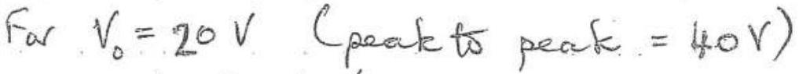
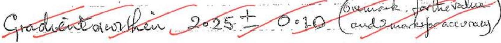

Q 6
(e)

$$
\begin{aligned}
\text { \% time diode conducturg } & = \frac { T _ { D } ( 100 ) } { f ^ { - 1 } } \\
& = \frac { f ^ { - 1 } - T _ { 1 } } { f } ( 100 ) \text { from (1) } \\
& = \left( 1 \frac { f ^ { - 1 } } { f _ { 1 } ^ { - 1 } } \right) 100 \\
& = \left( 1 - \frac { 0.019125 } { 0.02000 } \right) 100 \\
& = 4.4 \%
\end{aligned}
$$

(d)

$$
\text { At } \begin{aligned}
& T = 0.019125 s \\
& \frac { V } { V _ { 0 } } = \exp ( - 0.019125 / 0.50 ) = 0.962 .
\end{aligned}
$$

$$
V = 19 \cdot 214 . V
$$

This peak to peak ripple voltage $= ( 20 - 19 \cdot 24 ) \mathrm { V }$

$$
= 0.76 \mathrm {~V}
$$

(Any result from 0.7 Vt 0.8 Vacceptable)

(a) Ranton Ergors

Not due to a systematic "mechemissins want with sufficient "readungs" will average out to zero end que a correct measurement. The emas cill hease a goursear detribution
Examples.
A stop watch when stopped by hard, at a specific ture, will introduce a random estor due to one's reaction time.
An analogue annueter readuig may vary sleghtly due to the angle of observation. If a number of observations are made, fara specific current, these error will average ant to zero.

Systematic Errors
These one often due to a mechanisin, polich one is erroware These evors do mot awarage ant to zero for repeated measurements but behave in a segtematic wey
Examples
A stop watch that continually 'gains' twie will geore readmigo that are too high
An aimenter that has been incorrectly calisiated will conserfently give uncorrect readuigs that do not average ont to the true value.

Other validexamples axe acceptable.

QI (a) (i) $g = 9.8 \pm 1.0 \mathrm {~ms} ^ { - 2 }$ (Encr relatively large completared or this value)

(ii)
$$
\text { Root meen square } \left. \begin{array} { r l }
l _ { \text {RMS } } & = \sqrt { \frac { 1 } { 2 } \left[ ( 920 ) ^ { 2 } + ( 65.0 ) ^ { 2 } \right] } \mathrm { m } \\
& \left. = \frac { 1 } { \sqrt { 2 } ( 91.01 \mathrm {~m} } \right) \\
l _ { \text {AMS } } & = 68.6 .6 \mathrm {~m}
\end{array} \right\}
$$
(b)
$$
\begin{aligned}
T = 2 \pi \sqrt { \frac { l } { g } } \quad \text { and } g & = \\
\frac { \Delta g } { g } & = 2 \frac { \Delta T } { T } + \frac { \Delta l } { l } \\
& = 2 \frac { 0.20 } { 100 } + \frac { 0.60 } { 100 } \\
100 \frac { \Delta g } { g } & = 0.40 + 0.60 \\
\text { Max } \% \text { error } & = 1.0 \%
\end{aligned}
$$

Alternotwe methods acceptable

(1)Adternatively one can evaluate max-errar by substrifutuig:

$$
\begin{equation*}
g = \frac { ( 2 \pi ) ^ { 2 } l } { T ^ { 2 } } \tag{1}
\end{equation*}
$$

Max error4g:
Dividning by 9 from (1)

$$
\begin{aligned}
& g \circ \\
& g + A g \\
& g \circ f \circ a ( 1 )
\end{aligned} = \frac { ( 2 \pi ) ^ { 2 } l ( 1 + 0.006 ) } { ( T ( 1 - 0.002 ) ) ^ { 2 } }
$$

Hax. \%error $100 \frac { \Delta g } { g } = 1.0 \%$
(c) Correctly obsewn graph of $V = \log A + \alpha \log I$ form table Arres labelled
 cudd marketfe accuracy 3
Alternaturely .
Gradrent inthen 2.25± 0.25
$\left. \begin{array} { c } \text { One mark forralise } \\ \text { Que mark for } \\ \text { accuracy } \end{array} \right)$
2 but oritide himits of 2.25. $\pm 0.4$ accuracy

| m | V | I | $\log _ { 10 } I$ |
| :--- | :--- | :--- | :--- |
| 1 | 3.0 | 3:2 | 0.505 |
| 2 | 3.6 | 9.9 | 0.996 |
| 3 | 4.6 | 20.4 | 1.310 |
| 4 | 5.0 | 31.6 | 1.500 |
| 5 | 6.2 | 97.0 | 1.987 |
| 6 | 606 | 193 | 2.286 |

A obtained from yraph or by substatutung a wifo $V = \log A + \alpha \log I$ for a posticular (V,I)
Acceptoble value 424
* Mark breakdown: [2] for accurate graph + labels [3] for gradient value within $2.25 \pm 0.3$ BUT minus [1] if students do NOT provide their own estimate of accuracy. [2] for value of intercept with estimate of accuracy.

(d)

|  | ( 1,4 ) | (2, 5) | (3,6) | (\}) |
| :--- | :--- | :--- | :--- | :--- |
| $\alpha$ | $\frac { 2.00 } { 0.995 } = 2.01$ | $\frac { 2.60 } { 0.991 } = 2.62$ | $\frac { 2.00 } { 0.989 } = 2.05$ |  |
| $\alpha _ { M } = 2.22 - 23$ |  |  |  |  |
| $\left\| \alpha - \alpha _ { M } \right\|$ | 0.21 | 0.40 | 0.178 |  |
| $D =$ Average $\left( \left\| x - \alpha _ { m } \right\| \right) = \frac { 0.27 } { 0.263 }$ |  |  |  |  |

This is a quantitation melkod that daes mot depend an ? judging by eye the 'best' straight graph Any other sensbble comment will gain the morth) Any other sensbble comment will gain the morth) The average deriation ' $D$ 's greater than in (c)
