## Question 6

Students can get a little bit muddled about the maximum potential when they are all negative. So careful about interpreting what they are trying to say. They may state the answer, such as the potential at W or $U$ is the minimum because it is the maximum of "-GM/R" or something like that.

(a) They do not have to give the formula as $\left( 1 / r _ { \mathrm { A } } + 1 / r _ { \mathrm { B } } \right)$ if they state in words what the potential does at different distances from A and B.
(b)
(c) They do not need to write the formula as an inequality but can use an equals sign for the relation between the terms.
If they choose the wrong point on the planet (the near side rather than the far side) then they will have GM/5r rather than GM/7r. If so, they lose one mark, but get the rest of the marks if the calculation is correct (ECF). The result is then, I believe, $\mathrm { v } _ { \text {min } } { } ^ { 2 } = 16 \mathrm { GM } / 15 \mathrm { r }$
If they do not do the calculation in (c), then
1 mark for explanation without calculation
1 mark for the idea of relating the energy of GPE to the KE of escape velocity.

## BPLO 2016 SOLUTIONS

(a) Time exposicit, t, usaig film given by
$$
\begin{aligned}
\tau _ { \pm } & = \frac { ( 12 \cdot 4 \pm 0 \cdot 1 ) } { 360 } \frac { 60 } { ( 33 \cdot 3 \pm 0 \cdot 1 ) } \\
& = \tau \pm \Delta \tau
\end{aligned}
$$
Griving
$$
\begin{aligned}
& * \tau = 0.0621 s \\
& \Delta \tau = \left( \frac { 12.5 } { 360 } \right) \left( \frac { 60 } { 3302 } \right) - 0.0621 \\
& \Delta \tau = 0.0007 \mathrm {~s} \\
& \tau _ { i } = 0.0621 \pm 0.0007
\end{aligned}
$$

Arternative 1 determination of $\Delta \tau$ -

$$
\begin{aligned}
* & = 0.0621 \\
\frac { \Delta \tau } { \tau } & = \frac { 0.1 } { 12.4 } + \frac { 0.1 } { 33.3 } \\
& = 0.011
\end{aligned}
$$

Giving

$$
\begin{aligned}
& \Delta \tau = ( 0.062 ) ( 0.011 ) \\
& \Delta \tau = 0.0007
\end{aligned}
$$

ALTERNATIVE 2 usang RMS value

$$
\begin{aligned}
* & \tau = 0.0621 \text { (as above) } \\
\frac { \Delta \tau } { \tau } & = \sqrt { \left( \frac { 0.1 } { 12.4 } \right) ^ { 2 } + \left( \frac { 0.1 } { 33.3 } \right) ^ { 2 } } \\
\frac { \Delta \tau } { \tau } & = 8.6 \times 10 ^ { - 3 } \\
\Delta \tau & = 0.0005
\end{aligned}
$$

(b) Let $L _ { e }$ and $L _ { m }$ be the langeths of the constantion and manganion. wires. Then
$$
\begin{equation*}
6.3 \mathrm { Lc } + 5.3 \mathrm { Lm } = 5 \tag{i}
\end{equation*}
$$
At temperature $\theta ^ { \circ } \mathrm { C }$ we require
$$
6.3 L _ { c } + 5.3 L _ { \mathrm { m } } = 6.3 L _ { c } \left( 1 - 3.0 \times 10 ^ { - 5 } \theta \right) + 5.3 L _ { \mathrm { m } } \left( 1 + 1.4 \times 10 ^ { - 5 } \theta \right)
$$
Thus
$$
5.3 \left( 1.14 \times 10 ^ { - 5 } \right) L _ { m } = 6.3 \left( 3.0 \times 10 ^ { - 5 } \right) L _ { c }
$$
Giving
$$
\begin{equation*}
L _ { M } = \frac { 6.3 ( 3.0 ) } { 5.3 ( 1.2 ) } L _ { C } = 2.55 L _ { C } \tag{2}
\end{equation*}
$$
Substituting (2) into (1)
$$
6.3 L _ { C } 45.3 ( 2.55 ) L _ { C } = 5
$$
Thus
Substituting into (2)
$$
\begin{aligned}
& L _ { c } = 0.25 \mathrm {~m} \\
& L _ { M } = 0.64 \mathrm {~m}
\end{aligned}
$$
$$
\begin{aligned}
& 1 \\
& 1 \\
& \hline 5
\end{aligned}
$$
(c) Number of photons emitted in time $\Delta t , \quad ( f = c / 2 )$
$$
\begin{aligned}
n & = \frac { 100 \Delta t } { h f } = \frac { 100 \left( 6 ^ { \circ } 0 \times 10 ^ { - 10 } \right) } { 6.63 \times 10 ^ { - 34 } \left( 3.0 \times 10 ^ { 8 } \right) } \\
& = 3.02 \times 10 ^ { 20 } \Delta t
\end{aligned}
$$
Volume of a shell, thickness $\Delta R$, at distance $R = 4 \pi R ^ { 2 } ( c \Delta t )$ Thises density of photons at $R$
$$
10 ^ { b } = \frac { 3.02 \times 10 ^ { 20 } \Delta t } { 4 \pi R ^ { 2 } \left( 3.00 \times 10 ^ { 8 } \right) \Delta t }
$$
Criving
$$
R ^ { 2 } = \frac { 3.02 \times 10 ^ { 20 } } { 12 \pi \times 10 ^ { 14 } } = 8.01 \times 10 ^ { 4 }
$$
$$
R = 283 \mathrm {~m}
$$

(d) Energy ganed by acceleration thirmigh pd $V = 2 \times 10 ^ { 6 } \mathrm {~V}$
$$
= 2 \times 10 ^ { 6 } \mathrm { e } \quad J .
$$
binservation of energy at debfance $R$ of elecest approach mequenes
$$
V _ { e } = \frac { z e ^ { 2 } } { 4 \pi \varepsilon _ { 0 } R }
$$
Giving
$$
\begin{aligned}
R & = \frac { Z _ { e } } { 4 \pi \varepsilon _ { 0 } V } \\
& = \frac { 79 \left( 1.60 \times 10 ^ { - 19 } \right) } { 4 \pi \left( 8.85 . \times 10 ^ { - 12 } \right) 2 \times 10 ^ { 6 } }
\end{aligned}
$$
Thus
$$
R = 5.7 \times 10 ^ { - 14 } \mathrm {~m}
$$
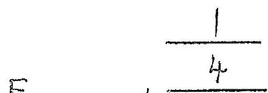
(e) Let sphere have mass in F is force of boul on mass normal to surface
Resolving wertically
$$
\begin{equation*}
F \cos \theta = m g \tag{1}
\end{equation*}
$$
Resolving horzontally, resultant force is mRhs ${ } ^ { 2 }$,
$$
\begin{equation*}
F \sin \theta = m R \omega ^ { 2 } \tag{2}
\end{equation*}
$$
Dividing (2) by (1)
$$
\begin{equation*}
\tan \theta = \frac { R \omega ^ { 2 } } { g } \tag{3}
\end{equation*}
$$
However as gradicut of bowl 2ax,
$$
\begin{equation*}
\tan \theta = 2 a R \tag{4}
\end{equation*}
$$
Substituetiug into (3)
$$
\omega = ( 2 a g ) ^ { 1 / 2 }
$$

(f)
(i)
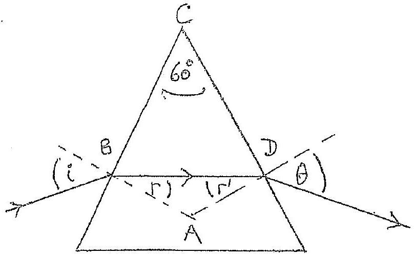
Using notation in the diagram

$$
\frac { \sin i } { \sin r } = 1.500
$$

$\sin r = \sin \left( 48.59 ^ { \circ } \right) / 1.500 = 0.5000$
Giving

$$
r = 30.0 ^ { \circ }
$$

Now $\hat { A } = 120 ^ { \circ }$, so $r ^ { \prime } = 3000 ^ { \circ }$.
Consequartly

$$
\theta = 48.5 q ^ { \circ } \quad \left( \text { as } r = r ^ { \prime } \right)
$$

(ii)

$$
\begin{aligned}
\delta & = ( i - r ) + ( \theta - r ) = 2 ( i - r ) \\
& = 2 \left( 48.59 ^ { \circ } - 30.00 ^ { \circ } \right) \\
\delta & = 37.18 ^ { \circ }
\end{aligned}
$$

(g)
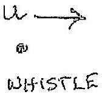
In 1s' whistle travels a destance $( C + U )$ and generates f ribrations. Consequently wavelength

$$
\lambda _ { 1 } = \frac { ( c + u ) } { f }
$$

with frequency

$$
f _ { 1 } = \frac { c } { ( c + u ) } f
$$

as " $l \lambda = c$ " (1)

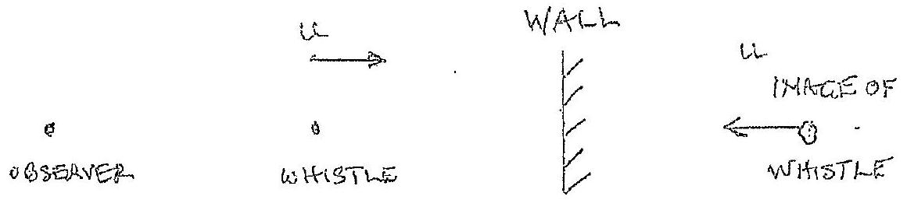

Frequency resewed derectly by observer is queen by (1)
Frequency produced by reflection at the wall is equivalent to unage of whistle at a distance on the other side of the wall equal to its distance in fant of the well. The mage travels at un Twaids observer, giving frequency

$$
f _ { 2 } = \frac { c } { c u } f
$$

ie replacing uby $( - u )$ in (1)
Thus beat facquency $F$ gaven by

$$
\begin{aligned}
F & = f _ { 2 } ^ { - } - f ^ { \prime } \\
& = \left[ \frac { c } { c - u } - \frac { c } { c + u } \right] f = \frac { 2 c u } { c ^ { 2 } - u ^ { 2 } } f \\
& = \frac { 2 ( 330 ) ( 2 \times 00 ) } { ( 330 ) ^ { 2 } - ( 2.00 ) ^ { 2 } } 500
\end{aligned}
$$

Giving

$$
F = 6.065 ^ { 1 }
$$

$( f )$
(i) $\quad R _ { D A } + R _ { A C } = 35 \Omega$
$35 \Omega$ in parallel with $7 \Omega$ juning a trad resestance

$$
\begin{align*}
& R = \left( \frac { 1 } { 35 } + \frac { 1 } { 7 } \right) ^ { - 1 } = \frac { 35 } { 6 } \Omega  \tag{1}\\
& R _ { B D } + R = 3 + \frac { 35 } { 6 } = \frac { 53 } { 6 } \Omega
\end{align*}
$$

$\frac { 53 } { 6 } \Omega$ is in parallel with
This gues a total resistance $\left( \frac { 6 } { 53 } + \frac { 1 } { 2 } \right) ^ { - 1 } = \frac { 106 } { 65 } \Omega$

$$
R _ { i B C } = 1.63 \Omega
$$

(hi) (ii) $R$ TBD is $3 \Omega$ in parallel with $\left( 2 + \frac { 35 } { 6 } \right) \Omega$, from (1) Trus

$$
\begin{aligned}
& R _ { \text {TBD } } = \left( \frac { 1 } { 3 } + \frac { 6 } { 47 } \right) ^ { - 1 } = \frac { 141 } { 65 } . \\
& R _ { \text {TBD } } = 2.17 \Omega
\end{aligned}
$$

(iii) For a potinothal across $A B$, as $\frac { 2 } { 3 } = \frac { 14 } { 21 }$, we have a balanced wheatstene bridge, with zero current in DC. Thus the Reag cansists of $( 3 + 21 )$ In in parcellel with $( 14 + 2 ) \Omega$ giveng

$$
\begin{aligned}
& R _ { T A B } \equiv \left( \frac { 1 } { 24 } + \frac { 1 } { 16 } \right) ^ { - 1 } = \frac { 48 } { 5 } \Omega \\
& R _ { T A B } = 9.60 \Omega
\end{aligned}
$$

(Alternative derivations acepted).
(i) $\quad N = N _ { 0 } e ^ { - \lambda t } , \quad \frac { d N } { d t } = - \lambda N _ { 0 } \cdot e ^ { - \lambda t }$ or $\left| \frac { d N } { d t } \right| = \lambda N _ { 0 }$. Substituting data at $t = 0$ usuing $\left| \frac { d N } { d t } \right| = \lambda N _ { 0 } t = 0$, at $t = 0$,

$$
\begin{aligned}
& 10 = N _ { 0 } \frac { \ln 2 } { 1620 \times 365 \times 24 \times 3600 } \\
& N _ { 0 } = 7.37 . \times 10 ^ { 11 }
\end{aligned}
$$

Noas of one success

$$
m = \frac { 226 \times 10 ^ { - 3 } } { 6.02 \times 10 ^ { 23 } } \quad \mathrm {~kg} = 3.75 \times 10 ^ { - 25 }
$$

Thes total mess

$$
\begin{aligned}
M = N _ { 6 } m & = \left( 7.37 \times 10 ^ { 11 } \right) \left( 3.75 \times 10 ^ { - 25 } \right) \\
M & = 2.76 \times 10 ^ { - 13 } \mathrm {~kg}
\end{aligned}
$$

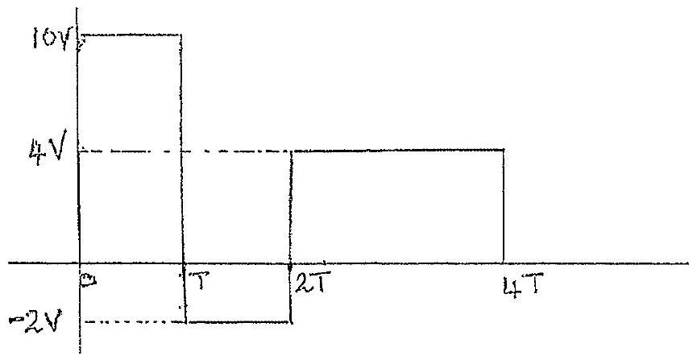

$$
\begin{aligned}
\left\langle V ^ { 2 } \right\rangle & = \frac { T ( 10 ) ^ { 2 } + T ( - 2 ) ^ { 2 } + 2 T ( 4 ) ^ { 2 } } { 4 T } \\
& = 34
\end{aligned}
$$

RMS $V _ { \text {rms } } = \left\langle V ^ { 2 } \right\rangle ^ { 1 / 2 } = \sqrt { 34 } = 5.83 \mathrm {~V}$
MEAD $V _ { \text {m } } = \ddot { V } = \langle V \rangle = [ 10 T - 2 T + 4 ( 2 T ) ] / 4 T = 4 V$

$$
\begin{aligned}
\left\langle ( V - V ) ^ { 2 } \right\rangle & = \left[ T 6 ^ { 2 } + T ( - 6 ) ^ { 2 } + 2 T ( 0 ) \right] / 4 T \\
& = 18 \\
\left. V _ { \min } = \langle V - V ) ^ { 2 } \right\rangle & = 4 \cdot 24 V
\end{aligned}
$$

(Attematwely use result $\left\langle ( v - \bar { v } ) ^ { 2 } \right\rangle = \left\langle v ^ { 2 } \right\rangle - \bar { v } ^ { 2 }$ )

(k) Formass un at ite pole with, normal reaction $S _ { p }$, equatuig forces
$$
S _ { p } = \frac { - G M _ { E } m } { R _ { E } ^ { 2 } }
$$
But $S _ { p } = - m g _ { p }$-giverig $g _ { p }$ is 'g'at pole)
$$
\begin{aligned}
m g _ { p } & = \frac { G M E m } { R _ { E } ^ { 2 } } \\
g _ { p } & = \frac { G M E } { R _ { E } ^ { 2 } }
\end{aligned}
$$

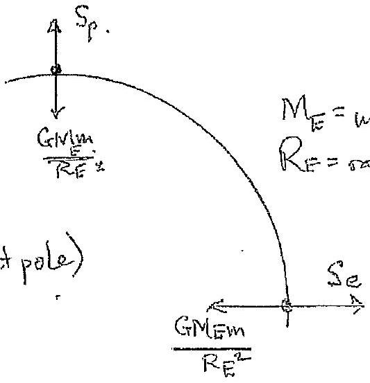
of the Easth has are angular velocity w the asaultant force

$$
m R _ { E } \omega ^ { 2 } = \frac { G M _ { E } M } { R _ { E } ^ { 2 } } - S _ { e }
$$

if'g' at gualor o ge thu $S _ { e } = m g e$, giveng

$$
g _ { e } = \frac { G M _ { E } } { R _ { E } ^ { 2 } } - R _ { E } w ^ { 2 }
$$

$\left( k _ { 1 } \right) S _ { 0 }$
$$
\begin{aligned}
\Delta = \frac { g _ { p } - g _ { e } } { g _ { p } } & = \frac { R _ { E } \omega ^ { 2 } } { G _ { E } M _ { E } } / R _ { E } ^ { 2 } \quad \& g _ { p } > g _ { e } \\
& = \frac { R _ { E } ^ { 3 } \omega ^ { 2 } } { G M _ { E } } \\
& \left. = \frac { \left( 6.38 \times 10 ^ { 6 } \right) ^ { 3 } } { \left( 6.67 \times 10 ^ { - 11 } \right) } \left( 5.98 \times 10 ^ { 24 } \right) \left[ \frac { 2 \pi } { ( 44 \times 36,61 ) } \right] ^ { 2 } \right] \\
& = \frac { \left( 2.66 \times 10 ^ { 20 } \right) \left( 5.29 \times 10 ^ { - 9 } \right) } { 3.99 \times 10 ^ { 14 } } \\
\Delta & = 3.45 \times 10 ^ { - 3 }
\end{aligned}
$$
(l) 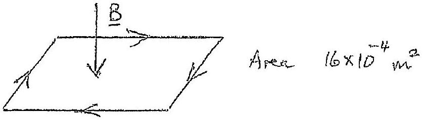
(i) The flus through the boop $\Phi$.
$$
\frac { d \Phi } { d t } = I R
$$
Substituting the data
$$
\frac { 0.700 \left( 16 \times 10 ^ { - 4 } \right) } { 0.800 } = I \left( 2.00 \times 10 ^ { - 3 } \right)
$$
There
$$
\begin{aligned}
& I = \frac { 14.0 \times 10 ^ { - 4 } } { \left( 2.00 \times 10 ^ { - 3 } \right) } \mathrm { amps } \\
& I = 0.700 \mathrm { amps }
\end{aligned}
$$
(ii) Energy drasifacted in the toop in $t = 0.8005 , E$, is given by
$$
\begin{aligned}
& E = I ^ { 2 } R t = ( 0.700 ) ^ { 2 } \left( 2.00 \times 10 ^ { - 3 } \right) ( 0.800 ) \\
& E = 7.84 \times 10 ^ { - 4 } v
\end{aligned}
$$

(e) Direction of cerrent opposes the change taking place with magnetie freld, so will tend its resitablesh the field.
The current is thes elockwise as indicated wi the dragoam, producning a field with direction of B
2 mosks for correct explanation and arrous wi 2 dragianu.
Zaro marks for correct direction but No explancition
(iv) When apheres connected they have a common polectrul $V _ { f }$ If intial charge $Q _ { 1 }$ on 200 V sphere and $Q _ { 2 }$ on 400 V . sphere, after cource tion, by ayrementry, each sphere how a charge $\frac { 1 } { 2 } \left( Q _ { 1 } + Q _ { 2 } \right)$ as charge in conserved, het capacity of spheres be, reapectively, $C _ { 1 }$ and $C _ { 2 }$ with initial potactribls $V _ { 2 }$ and $V _ { 2 }$. Capacity of sphere
$$
c _ { 1 } = c _ { 1 } = c _ { 2 } = 4 \pi \varepsilon \left( 10 \times 10 ^ { - 2 } \right) = 4 \pi \varepsilon 10 ^ { - 1 }
$$
Initial energy, $E _ { i }$, greeniby
$$
\begin{equation*}
E _ { i } = \frac { 1 } { 2 } C _ { 1 } V _ { 1 } ^ { 2 } + \frac { 1 } { 2 } C _ { 2 } V _ { 2 } ^ { 2 } = \frac { 1 } { 2 } \left( 4 \pi \varepsilon 10 ^ { - 1 } \right) \left( 2 \times 10 ^ { 5 } \right) \mathrm { J } \tag{1}
\end{equation*}
$$
Final evergy, $E _ { f }$, queen by
$$
\begin{aligned}
E _ { f } & = \frac { 1 } { 2 } \left( c _ { 1 } + c _ { 2 } \right) V _ { f } ^ { 2 } \\
& = \cdots 4 \pi \varepsilon 10 ^ { - 1 } V _ { f } ^ { 2 }
\end{aligned}
$$
bonsersation of charge gives
Thus
$$
\begin{aligned}
Q _ { 1 } + Q _ { 2 } & = c \left( V _ { 1 } + V _ { 2 } \right) \\
& = c V _ { f } + c V _ { f } = 2 c V _ { f }
\end{aligned}
$$
$$
V _ { f } = \frac { 1 } { 2 } \left( V _ { 1 } + V _ { 2 } \right) = 300 \mathrm {~V}
$$
Thus energy released, from (i) and (3),
$$
\begin{aligned}
E = E _ { i } - E _ { f } & = \frac { 1 } { 2 } \left( 4 \pi \varepsilon 10 ^ { - 1 } \right) \left( 2 \times 10 ^ { 5 } \right) \cdots \left( 4 \pi \varepsilon 10 ^ { - 1 } \right) \left( 9 \times 10 ^ { + 4 } \right) \\
& = 4 \pi \left( 8.85 \times 10 ^ { - 12 } \times 10 ^ { - 1 } \right) ( 10 - 9 ) 10 ^ { 4 } \mathrm {~J} \\
E & = 1.11 \times 10 ^ { - 7 } \mathrm {~J}
\end{aligned}
$$

(i) Initial energy
$$
\begin{align*}
\frac { 1 } { 2 } w r e V _ { 0 } ^ { 2 } & = e V _ { 1 }  \tag{1}\\
V _ { 0 } & = \sqrt { \frac { 2 e V _ { 1 } } { m _ { e } } }
\end{align*}
$$
(ii) If $v _ { y }$ and $v _ { x }$ are the velocity components at $P$
$$
\tan \alpha = \frac { V _ { y } } { V _ { x } } = \frac { V _ { y } } { V _ { 0 } }
$$
If $a _ { y }$ is the acceleration in $y$ direction for destance $s$ intime $t = \frac { s } { v _ { 0 } }$,
$$
\begin{aligned}
V _ { y } & = a _ { y } t \\
& = \left( \frac { e E } { m _ { e } } \right) \left( \frac { s } { V _ { 0 } } \right) \quad \text { shere Entre electric field }
\end{aligned}
$$
Substituting $E = \frac { r _ { 2 } } { d }$,
$$
= \frac { e V _ { 2 } s } { m _ { e } d V _ { 0 } }
$$
Giving
$$
\tan \alpha = \frac { e V _ { 2 } s } { \operatorname { med } V _ { 0 } ^ { 2 } }
$$
Substituting for $v _ { E }$ from (I)
$$
\tan \alpha = \frac { V _ { 2 } s } { 2 V _ { 1 } d } \text { or } \alpha = \tan ^ { - 1 } \left( \frac { V _ { 2 } s } { 2 V _ { 1 } d } \right)
$$
("iii)
$$
\begin{aligned}
y _ { e } & = \frac { 1 } { 2 } a _ { y } t ^ { 2 } \\
& = \frac { e E s ^ { 2 } } { 2 m _ { e } v _ { 0 } ^ { 2 } } \\
y _ { e } & = \frac { e v _ { 2 } s ^ { 2 } } { 2 m _ { e } d v _ { 0 } ^ { 2 } } \quad \left( v _ { 0 } ^ { 2 } \text { given by } ( 1 ) \right)
\end{aligned}
$$

(b) $$
\begin{aligned}
T & = V _ { 0 } ^ { S } \\
& = s \sqrt { \frac { m e } { 2 e V _ { 1 } } }
\end{aligned}
$$
from (1)
Subshatutung the data
$$
T = 1.51 \times 10 ^ { - 59 } \mathrm {~s}
$$
(c) On entering the fanal electrical field the electrons have zero velocity component in the z-derection. Whenthey emerge they will have the same expression for welority component in the $z$-derection as that for the prevons velocity gamed in the of-descation mancely
$$
\frac { e V _ { 2 } s } { d m _ { e } V _ { o } }
$$
Thus the Cartesian components of the electrons' emergent velocity form the system is
$$
\left( \sqrt { \frac { 2 e V _ { 1 } } { m _ { e } } } , \frac { e V _ { 2 } s } { d m _ { e } V _ { 0 } } , \frac { e V _ { 2 } s } { d m _ { e } V _ { 0 } } \right)
$$
where $V _ { 0 }$ is given by (C)
The resultant speed is v' geven by
$$
V ^ { 2 } = \left( \frac { 2 e V _ { 1 } } { m _ { e } } \right) ^ { 0 } + \left( \frac { e V _ { 2 } s } { d m _ { e } V _ { 0 } } \right) ^ { 2 } + \left( \frac { e V _ { 2 } s } { d m _ { e } V _ { 0 } } \right) ^ { 2 }
$$
Thus
$$
V = \sqrt { \frac { 2 e V _ { 1 } } { m _ { e } } + 2 \left( \frac { e V _ { 2 } s } { m _ { e } V _ { 0 } d } \right) ^ { 2 } }
$$
The angles the final welority makes with the $x$, yend $z$ ares are, mispectively,
$$
\cos ^ { - 1 } \left( \frac { 1 } { V _ { b } } \sqrt { \frac { 2 e V _ { 1 } } { m _ { e } } } \right) , \cos ^ { - 1 } \left( \frac { e V _ { 2 s } } { V m _ { e } V _ { 0 } d } \right) , \cos ^ { - 1 } \left( \frac { e V _ { 3 s } } { V m _ { e } / V _ { 3 } d } \right)
$$

(a) Statement $P = F V$ for determaniation of $F$ Plot of $F$ against $v ^ { 2 }$ Good straight line graph with axes labelled Determination of $A = 0.19 \mathrm { kgin } ^ { - 1 }$ giving unitslym Accuracy $\pm 0.01 \mathrm { kgm } ^ { - 1 }$ acceptable Intercept $B = 4.0 \mathrm {~N}$ giving units $N$ Accuracy $\pm 0.6 \mathrm {~N}$ acceptable
(b) $A v ^ { 2 }$ air resistance $B$ friction
(c) $\quad F = \frac { P } { V } = \frac { P } { \left( V ^ { 2 } \right) ^ { 1 / 2 } }$ For max. power $P = 60 \mathrm {~W}$ $F _ { 60 } = \frac { 60 } { \left( v ^ { 2 } \right) ^ { 1 / 2 } }$
If one plots $F _ { 60 }$ against $V ^ { 2 }$, on the sami graph as above, $\}$ where it intersects the linear plot determines $V _ { c }$ and satisfacis
$$
\frac { 60 } { v _ { c } } = A v _ { c } ^ { 2 } + B
$$
(d) Plot of $\frac { 60 } { \left( v ^ { 2 } \right) ^ { 112 } }$ against $v ^ { 2 }$ en the original graph Value of Correct units Accuracy
$$
\begin{aligned}
& V _ { c } = 5.8 \mathrm {~ms} ^ { - 1 } \\
& \pm 0.4 \mathrm {~ms} ^ { - 1 }
\end{aligned}
$$

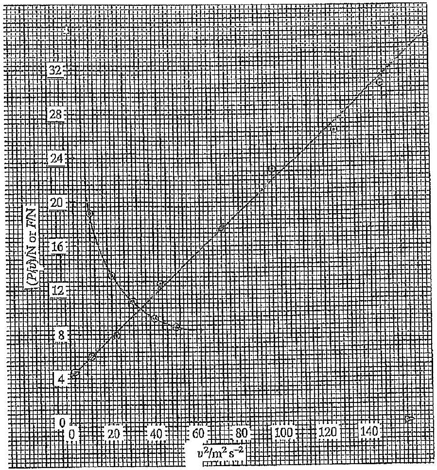

(a) Key: Resistor Valtace Full curve Caparator Voltage broken curve - Total Veltage cccc

Only qualitative behaviar requered
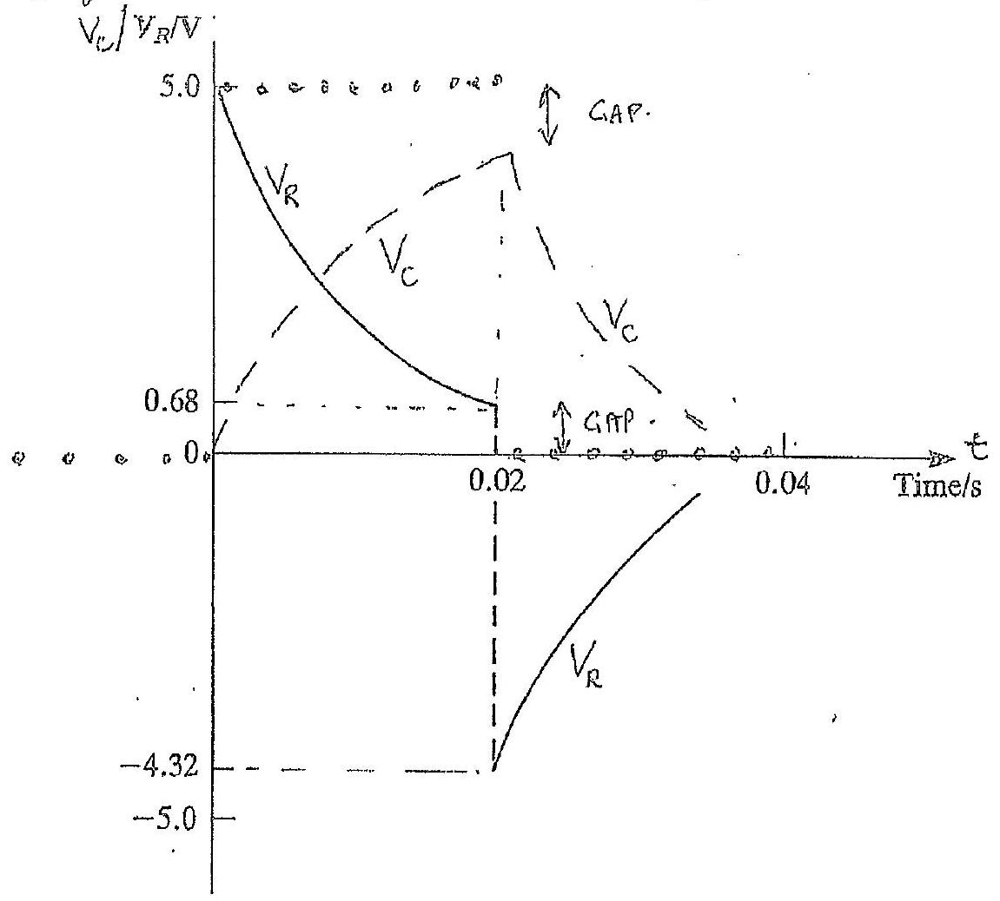

Resistor Vertage: Full curve One mack for each section correct Caractor Voltace: Brokga curve Owe mork for each correct section One mork for Total VOLTACE CORPOC Two makes for 'GME' VOLTACES'

NOTS
In marks awailable for correct train formations of circuit

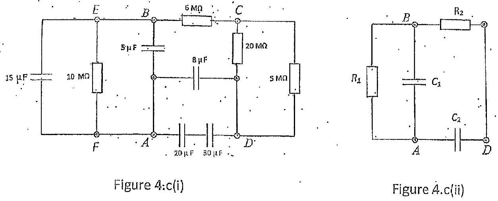

An EXAMPLE OF CIRCUTT SIMPLIFICATIONS RESURTING IN CRRCUIT FIGURE 4. C(ii) 4 marks are available far four correct circuit simplifications
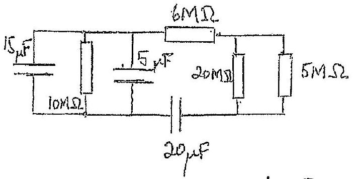
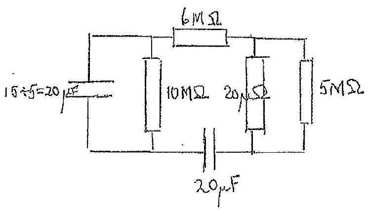
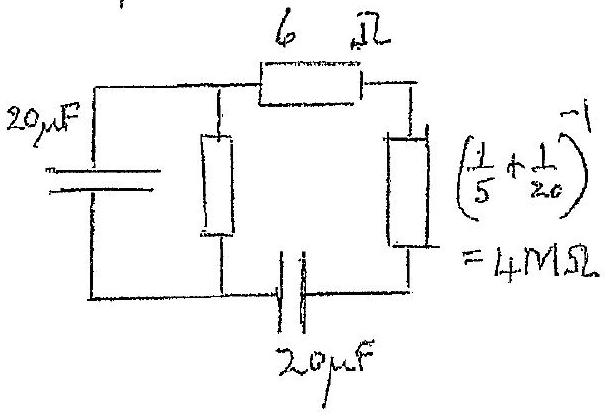
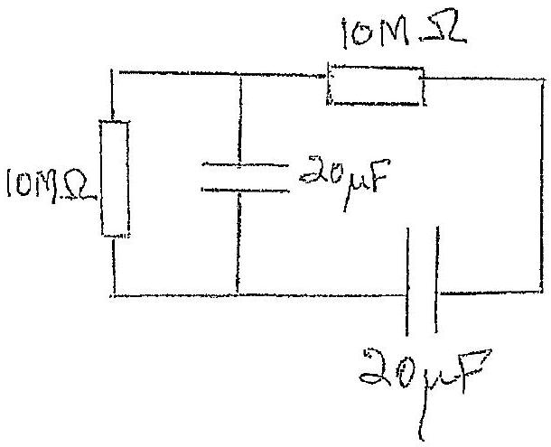

$$
\begin{aligned}
& R _ { 1 } = R _ { 2 } = 10 \mathrm { M } \Omega \\
& C _ { 1 } = C _ { 2 } = 20 \mu \mathrm {~F}
\end{aligned}
$$

(i) (a) If air expends by length $x$, Abering anear of cross-rection of tabe

$$
\begin{align*}
V _ { R } = \frac { V } { V _ { 0 } } & = \frac { A \left( x _ { 0 } + x \right) } { A x _ { 0 } } \\
V _ { R } & = 1 + \frac { x } { x _ { 0 } } = \left( 1 + x _ { R } \right) \tag{1}
\end{align*}
$$

As altórspherec pressure xopg,

$$
P _ { R } = \frac { P } { P _ { 0 } } = \frac { \left( 2 x _ { 0 } - x \right) \rho g } { x _ { 0 } \rho g }
$$

Giving

$$
\begin{equation*}
P _ { R } = \left( 2 - x _ { R } \right) \tag{2}
\end{equation*}
$$

Foom (1) and (2)

$$
\begin{align*}
& P _ { R } = 2 - \left( V _ { R } - 1 \right) \\
& P _ { R } = 3 - V _ { R } \tag{3}
\end{align*}
$$

(ii) $$
\begin{aligned}
& P V = n R T \\
& \frac { P V } { P _ { 0 } V _ { 0 } } = \frac { n R T } { P _ { 0 } V _ { 0 } }
\end{aligned}
$$
Giving
$$
\begin{equation*}
P _ { R } V _ { R } = T _ { R } \tag{4}
\end{equation*}
$$
(b) In the $P _ { R } - V _ { R }$ graph (3) is represented by astraight line, beginning at $V _ { R } = 1$ and ending at $V _ { R } = 2$, when all mercury expelled.
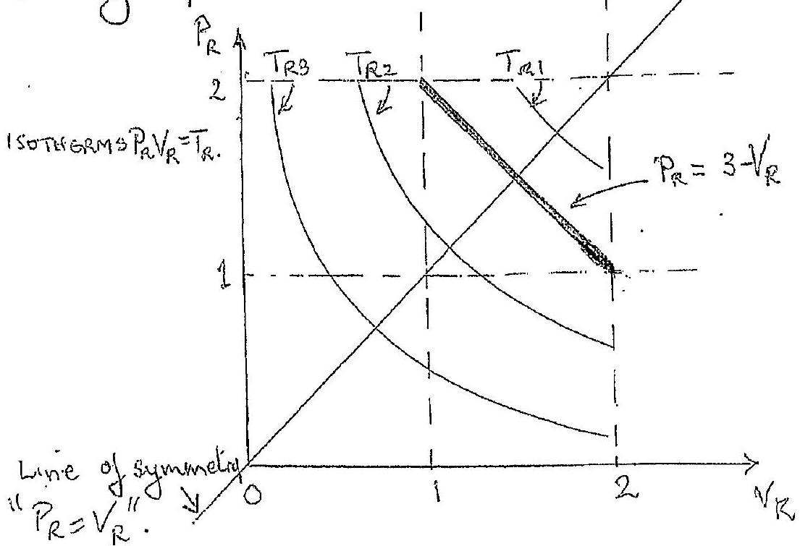

(1) There straight line between $( 2,1 )$ and $( 1,2 )$ grees belowar of air in the tube.
(ii) Isotherws indicated by curves " $P _ { R } V _ { R } = T _ { R }$, " $T _ { R 1 } > T _ { R 2 } T _ { R 3 }$ " The inotherms and the his $P _ { R } = 3 - V _ { R }$ are symmetrical 2 about the line $P _ { R } = V _ { R }$, whech passes throngh the arigin.

The highest temperature watherm will touch the line $P _ { R } = 3 - \sqrt { R }$ attits midpoint. This occurs at

$$
P _ { R } = V _ { R } \doteq \frac { 3 } { 2 }
$$

Thus from (4) this veceevs at

$$
T _ { R } = \frac { 9 } { 4 }
$$

(c) $$
\begin{equation*}
\frac { 5 } { 2 } \Delta T _ { R } = S _ { R } \Delta T _ { R } - P _ { R } \Delta V _ { R } . \tag{s}
\end{equation*}
$$
From (3) and (4)
$$
T _ { R } = V _ { R } \left( 3 - V _ { R } \right)
$$
Hence
$$
\Delta T _ { R } = \Delta V _ { R } \left( 3 - 2 V _ { R } \right)
$$
Substituting into (5)
$$
\frac { 5 } { 2 } \Delta T _ { R } = S _ { R } \Delta T _ { R } - \left( \frac { 3 - V _ { R } } { 3 - 2 V _ { R } } \right) \Delta T _ { R }
$$
Thus
$$
S _ { R } = \left( \frac { 21 - 12 V _ { R } } { 6 - 4 V _ { R } } \right)
$$

(d)
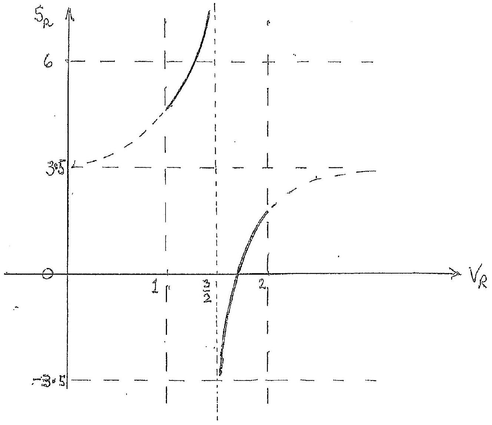
Physical regions bold curves
Correct sketch asymplotic to $V _ { R } = \frac { 3 } { 2 }$ (above and below) 2 Bounded by $V _ { R } = 1$ and $V _ { R } = 2$

(i) (a) The suffece potention of $B , V _ { B }$, difends on the sem of the potentials from $B$ oud $A$. If $r _ { A }$ is the distoree from the centre of $A$ to a point on the surface of $B$ then
$$
\begin{equation*}
V _ { B } = - \frac { G M } { r } - \frac { G M } { r _ { A } } = - G M \left( \frac { 1 } { r } + \frac { 1 } { r _ { A } } \right) \tag{\(\gamma\)}
\end{equation*}
$$
This will vary over the surface of $B$ due to the variation in $r _ { A }$.
(ii) 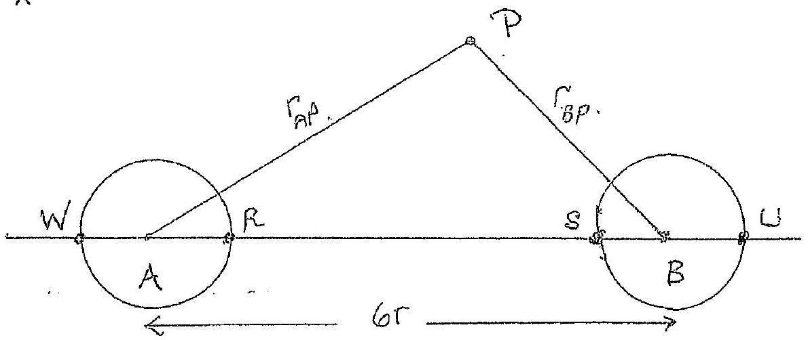
At any point $p _ { 1 }$ external to the stars, the potential $V _ { p }$ is groein by; naing motation wi the dragram,
$$
V _ { p } = \frac { - G M } { r _ { A P } } + \frac { - G M } { r _ { B P } } = - G M \left( \frac { 1 } { r _ { A P } } + \frac { 1 } { r _ { B P } } \right)
$$
Note: $V _ { p }$ is megative

This will be largest when $r _ { A P }$ and $r _ { B P }$ are largest. This occurs when $F _ { A P }$ and $F _ { B P }$ are infinite and $V _ { P } = 0$ It will be suallest when $\left( \frac { 1 } { r _ { A P } } + \frac { 1 } { r _ { B P } } \right)$ is largest, as $\left. V _ { p } \right\}$ negatives. This occurs when $r _ { A P }$ and $r _ { B P }$ are sensell ${ } _ { g }$ and $P$ is along the line $R S a t e$ or $S$.

(iri) Fran (1) this will occur at 4 when $F _ { A D }$ is lergect $\}$ and sumilarly or B at W, where $F _ { B W }$ is largest
(iv) $V = - \frac { 2 G M } { 3 r }$ (Vpotential at midpoint)

(b) 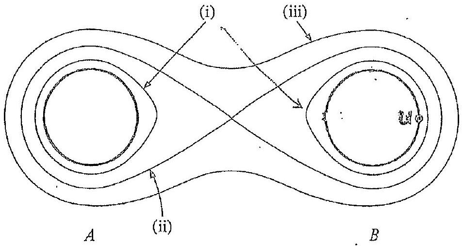

EQUIPOTENTIALS

(i) $V _ { 1 } = - 10 \mathrm {~cm} / 3 \mathrm { r }$
(a) $V _ { 2 } = - 2 \mathrm { GM } / 3 \mathrm { r }$
(iii) $V _ { 3 } = - G M / 3 r$
(c) . Lounch from U, whach healthe largest surfore potential. I To be captered by $A$ it must be able to overeome? the potential at (ii), on diaginar. So conservation of $\}$ evergy requenis it has a speed such that
$$
\frac { 1 } { 2 } m v ^ { 2 } + V _ { v } m \geqslant - \frac { 2 } { 3 } \frac { G M m } { r }
$$

where $V _ { 0 }$ is the potential at $U$-location of max. potential. Now

$$
V _ { 0 } = - \frac { G M } { \Gamma } - \frac { G M } { 7 r } = - \frac { 8 G M } { 7 r }
$$

Thes

$$
\begin{aligned}
\frac { 1 } { 2 } m r ^ { 2 } & \geqslant \frac { 8 G M m } { 7 r } - \frac { 2 } { 3 } \frac { G M m } { r } \\
r ^ { 2 } & \geqslant \frac { 20 G M } { 21 r }
\end{aligned}
$$

Gring minimum $v ;$

$$
v _ { \min } = \sqrt { \frac { 20 G M } { 21 r } }
$$
