2017 BPLO Rownd I Solutions
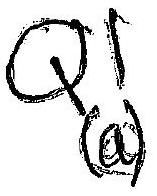
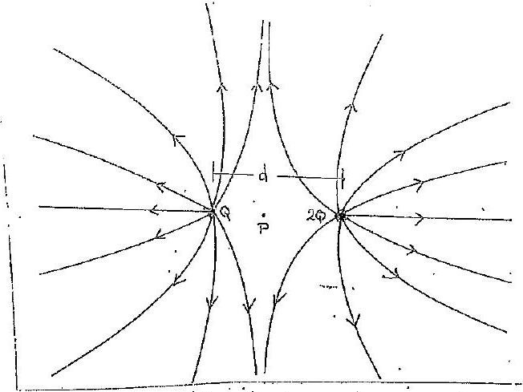
Qualitatedly concet graph with arracis and symmetry obant $x$-axis.

(1) Neutral point $P$ at destance $r _ { 1 }$ fran $+ Q$ and $r _ { 2 }$ from $+ 2 Q$.
So:
$$
\begin{align*}
\frac { Q } { 4 \pi \varepsilon _ { 0 } r _ { 1 } ^ { 2 } } & = \frac { 2 Q } { 4 \pi \varepsilon _ { 0 } r _ { 2 } ^ { 2 } } \\
r _ { 2 } & = \sqrt { 2 } r _ { 1 } \tag{1}
\end{align*}
$$
Now
So
$$
\begin{aligned}
& r _ { 1 } + r _ { 2 } = d \\
& r _ { 1 } ( 1 + \sqrt { 2 } ) = d
\end{aligned}
$$
Giving
$r _ { 1 } = 0.414 d$
Reme(1)
$r _ { 2 } = 0.586 d$
$$
\{ \text { eirher result }
$$
(ii) Field linis are defined as being tangential to the field vector at all paints along the line Congequently the waguitude varies off the magnitate varies with the denoty of the fall lares (1)
(b) Energy dearported in time $t$,
Giving
$$
\begin{gathered}
0.45 \times 10 ^ { 3 } t = 12 \left( 0.50 \times 10 ^ { 6 } \right) \\
t = 13.3 \times 10 ^ { 3 } \mathrm {~s} \\
= 3.7 \text { hours }
\end{gathered}
$$
(c) (c)
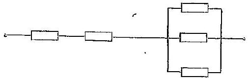
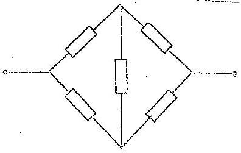

（c） Total nimitames goen by
（1）
$$
\begin{aligned}
& R _ { T } = 2 R + \left( \frac { 1 } { R } + \frac { 1 } { R } + \frac { 1 } { R } \right) ^ { - 1 } \\
& R _ { T } = \frac { 7 } { 3 } R .
\end{aligned}
$$
（ii） This is a balanced wheatstone brodge with no current thirgh central resistor，i 2R m purallel with 2R；geowing
$$
\begin{aligned}
& R _ { T } = \left( \frac { 1 } { 2 R } + \frac { 1 } { 2 R } \right) ^ { - 1 } \\
& R _ { T } = R
\end{aligned}
$$
$\left( \right.$ with specs do $V _ { 1 }$ and $V _ { 2 }$ ，
（d） At the enstent of colleoup feach sphere has a yraurtational potential $V = \frac { G m _ { 1 } m _ { 2 } } { , \text { mementum conservation } . m _ { 1 } V _ { 1 } \equiv m _ { 2 } V _ { 2 } }$
$$
> 1 + 1 = 2
$$
Using conservation of energy for each sphese with speeds $v _ { 1 }$ and $v _ { 2 }$ ， respectively，on impact
$$
\frac { 1 } { 2 } m _ { 1 } v _ { 1 } ^ { 2 } + \frac { 1 } { 2 } m _ { 2 } v ^ { 2 } = \frac { G m _ { 1 } m _ { 2 } } { \left( r _ { 1 } + r _ { 2 } \right) }
$$
Sub．$v _ { 2 } = v _ { 1 } \left( \frac { m } { m _ { 2 } } \right)$ ，
$$
V _ { 1 } ^ { 2 } = \frac { 2 \operatorname { Gr⿱⿱土口𧘇ة } ^ { 2 } } { \left( r _ { 1 } + r _ { 2 } \right) \left( m _ { 1 } + m _ { 2 } \right) } - 1 + 1 = 2
$$
Giving
$$
V _ { 1 } = \sqrt { \frac { 2 G m _ { 2 } ^ { 2 } } { \left( r _ { 1 } + r _ { 2 } \right) \left( m _ { 1 } + m _ { 2 } \right) } } \quad \& _ { 2 } V _ { 2 } = \sqrt { \frac { 2 G m _ { 1 } ^ { 2 } } { \left( r _ { 1 } + r _ { 2 } \right) \left( m _ { 1 } + m _ { 2 } \right) } }
$$
As specolo wo rposite directions，nelative speed，VRet，iogivenby
$$
V _ { R e l } = \sqrt { \frac { 2 C _ { 1 } \left( m _ { 1 } + m _ { 2 } \right) } { \left( r _ { 1 } + r _ { 2 } \right) } }
$$
（e）Assume k mols mjected into tyre at each stroke． After m drokes，prescure $P _ { n }$ and volume $V _ { n }$ satrafy
$$
P _ { n } V _ { A } = m k R T
$$
Final passure sroume：$P _ { n } = 3.00 \times 10 ^ { 5 } \mathrm {~Pa}$＆$V _ { n } = 1.2 \times 10 ^ { - 3 } \mathrm {~m} ^ { 3 }$
$$
\begin{equation*}
\left( 3.00 \times 10 ^ { 5 } \right) \left( 1.2 \times 10 ^ { - 3 } \right) = m k T \tag{1}
\end{equation*}
$$
For the finst storke $\left( 1.0 \times 10 ^ { 5 } \right) \left( 9 \times 10 ^ { - 5 } \right) = k R T$
Fran（1）and（2）
$$
\begin{equation*}
n = \frac { \left( 3.00 \times 10 ^ { 5 } \right) \left( 1.2 \times 10 ^ { - 3 } \right) } { \left( 1.0 \times 10 ^ { 5 } \right) \left( 9 \times 10 ^ { - 5 } \right) } = 4 ^ { 0 } \tag{2}
\end{equation*}
$$

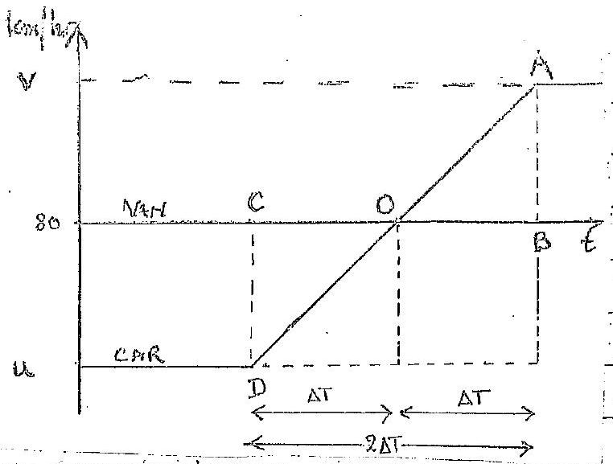

GRAPHICAL SOLUTION

$$
80 \mathrm {~km} / \mathrm { hr } = \frac { 80 \times 10 ^ { 3 } } { 60 \times 60 \mathrm {~ms} ^ { - 1 } } = 22.22 \mathrm {~ms} ^ { - 1 }
$$

Using notation in the duagram, time taken for van to ge form C to B

$$
\begin{aligned}
& 2 \Delta T = \frac { 0.50 \times 10 ^ { 3 } } { 22.22 } \\
& 2 \Delta T = \frac { 22.55 } { 5 }
\end{aligned}
$$

Gradient of OA gives

$$
1.2 = \frac { V - 22.22 } { \Delta T } = \frac { V - 22.22 } { 11.25 }
$$

ALCEBRAT SONUTION

$$
2 \Delta T = 22.5 \mathrm {~s} \quad \text { (sec prevois derivation) } 2
$$

$$
\begin{align*}
v & = u + 1.2 ( 2 \Delta T ) \\
& = u + 1.2 ( 22.5 ) \\
v & = u + 27.0 \tag{1}
\end{align*}
$$

Using $5 = u t + \frac { 1 } { 2 } f E ^ { 2 }$ with $u = v - 27.0$
Giving

$$
\begin{aligned}
500 & = ( v - 27.0 ) ( 22.5 ) + \frac { 1 } { 2 } ( 1.2 ) ( 22.5 ) ^ { 2 } \\
v & = 27.0 + 8.72 \\
v & = 35.7 \mathrm {~ms} = 128.6 \mathrm {~km} / \mathrm { hr }
\end{aligned}
$$

$\frac { 1 } { 4 }$

(g) Ancent of keat absorked by calorieneter with water

$$
\begin{aligned}
& Q _ { 1 } = 4200 ( 0.80 ) ( 10.0 ) + 42.8 ( 10.0 ) \\
& Q _ { 1 } = 34028 . J ( 34030 )
\end{aligned}
$$

Let $T _ { i }$ be the initial temperature of the lead, heat lat to water yent before solidification

$$
\begin{aligned}
& Q _ { 2 } = ( 158 ) ( 0.40 ) \left( T _ { i } - 327 \right) \\
& Q _ { 2 } = 63.2 \left( T _ { i } - 327 \right) \text { cold }
\end{aligned}
$$

Heat released by lead during freezing

$$
\begin{aligned}
& Q _ { 3 } = \left( 2.323 \times 10 ^ { 4 } \right) ( 0.40 ) \\
& Q _ { 3 } = 9292 \mathrm {~J}
\end{aligned}
$$

Heat lart by lead from soludefaction to $25 ^ { \circ } \mathrm { C }$.

$$
\begin{aligned}
& Q _ { 4 } = ( 137 ) ( 0.40 ) ( 327 - 25 ) \\
& Q _ { 4 } = 16549.6 \mathrm {~J}
\end{aligned}
$$

Adow for [ecample fe.c.f provided it is not a sidy value.].

$$
Q _ { 1 } = Q _ { 2 } + Q _ { 3 } + Q _ { 4 }
$$

Substituting $34028 = 63.2 \left( T _ { i } - 327 \right) + 9292 + 16599.6$

$$
\begin{aligned}
& T _ { i } = 327 + 129.5 \\
& T _ { i } = 457 ^ { \circ } \mathrm { C }
\end{aligned}
$$

(f) The acceleration is greatest for greatest deplacement.
For amplitude A this is $w ^ { 2 } A$
The mass leaves the pain rea soon as
Far period T
Substituting,
Giving

$$
\begin{aligned}
\omega ^ { 2 } A & = g \\
\omega & = \frac { 2 \pi } { T } = \frac { 2 \pi } { 0.50 } \\
A & = 9.81 / ( 2 \pi / 0.50 ) ^ { 2 } \\
A & = 6.4 \mathrm {~cm}
\end{aligned}
$$

(i) Charge on the spheres given by " $Q = 4 \pi \varepsilon _ { 0 } R V$ " Thus, usung subseripts to indicate the spheres,
$$
\left. \begin{array} { l }
Q _ { 6 } = C _ { 6 } V = 6 R \left( 4 \pi \varepsilon _ { 6 } \right) V \\
Q _ { 3 } = 0 \\
Q _ { 2 } = C _ { 2 } V = 2 R \left( 4 \pi \varepsilon _ { 6 } \right) V
\end{array} \right\}
$$
(Total charge $4 \pi \varepsilon _ { 0 } V ( 8 R )$ )
All spher have the same final potential, $V _ { f }$, after touching with wine. Charge censurvation requires
$$
\begin{aligned}
V _ { f \left( 4 \pi \varepsilon _ { 0 } \right) } ( 6 R + 3 R + 2 R ) & = Q _ { 6 } + Q _ { 2 } \\
& = 4 \pi \varepsilon _ { 6 } V ( 8 R )
\end{aligned}
$$
Griving
$$
V _ { f } = \frac { 8 } { 11 } V
$$
Charge one $3 R$ sphere $= 4 \pi \varepsilon _ { 0 } ( 3 R ) V _ { f } = 4 \pi \varepsilon _ { 0 } ( 3 R ) \frac { 8 } { 11 } V$ 1
Fraction of argenal charge $= 4 \pi \varepsilon _ { 0 } V R ( 8 ) \quad 11$
5
(j) benservation of energy gives
$$
\begin{aligned}
\therefore \quad f f & = \frac { 1 } { 2 } m v ^ { 2 } + W \\
\therefore \quad W & = R f - \frac { 1 } { 2 } m v ^ { 2 } \\
& = 6.63 \times 10 ^ { - 34 } \frac { 3.00 \times 10 ^ { 8 } } { 248 \times 10 ^ { - 9 } - 8.60 \times 10 ^ { - 20 } \mathrm {~J} } 1 \\
& = 8.02 \times 10 ^ { - 19 } - 8.60 \times 10 ^ { - 20 } \\
\therefore W & = 7.16 \times 10 ^ { - 19 } \mathrm {~J}
\end{aligned}
$$

(k)

Reastion, R, at B, Zerofrition.
fraction $f$, at $A$
Pirganof
Normal reastion, $N$, at $A$. PoReés Foreés
Resolving forcer yostically: $N = 3 m g$ 1 $f = R$ and $f = 0.4 \times N = 0.4 \times 3 \mathrm { mg }$

Take Moments about A: $\quad L \cdot R \cos 60 ^ { \circ } = M g \frac { L } { 2 } \cdot \cos 30 ^ { \circ } + 2 m g x \cdot \cos 30 ^ { \circ }$ ( $\div$ ん) ie.

$$
\begin{aligned}
R \cdot \frac { 1 } { 2 } & = m g \frac { \sqrt { 3 } } { 4 } + \frac { x } { 2 } + \frac { \sqrt { 3 } } { 7 } \\
R & = 2 m g \sqrt { 3 } \left( \frac { 1 } { 4 } + \frac { x } { 2 } \right)
\end{aligned}
$$

Slipping ocmornaten $f < R$
Limit is when $f = R$ i.e.

$$
0.4 \times 3 m g = 2 m g \sqrt { 3 } \left( \frac { 1 } { 4 } + \frac { x } { 2 } \right)
$$

$\frac { 1 } { 5 }$

Athenatively, Take momests abut B

$$
\begin{gathered}
m g \cdot \frac { L } { 2 } \cdot \cos 30 ^ { \circ } + 2 m y ( L - x ) \cos 30 ^ { \circ } + f \cdot L \cdot \cos 60 ^ { \circ } = 3 m g L \cdot \cos 30 \\
( \div m y L ) \quad \frac { \sqrt { 3 } } { 4 } + \frac { ( L - x ) \sqrt { 3 } } { L } + \frac { f } { m g } \cdot \frac { 1 } { 2 } = 3 \frac { \sqrt { 3 } } { 2 } \\
( \div \sqrt { 3 } ) \quad \frac { 1 } { 4 } + \left( 1 - \frac { x } { L } \right) + \frac { f } { m g } \cdot \frac { 1 } { 2 } = \frac { 3 } { 2 } \\
\frac { 1 } { 4 } + 1 - \frac { x } { L } + 0 \cdot 4 \frac { \sqrt { 3 } } { 2 } = \frac { 3 } { 2 } \\
\frac { x } { L } = 0 \cdot 0964 \\
= 9 \cdot 6 \%
\end{gathered}
$$

(1)
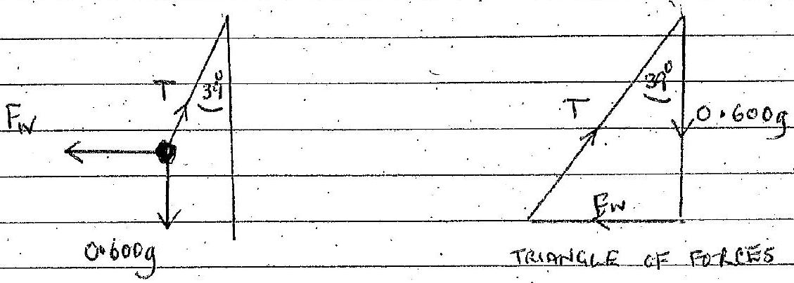

Trungle of foces gives

$$
\begin{align*}
\frac { F _ { w } } { 0.600 \mathrm {~g} } & = \tan 39 ^ { \circ }  \tag{1}\\
F _ { w } & = 4.77 \mathrm {~N} \tag{1}
\end{align*}
$$

This is equal to the mate of cliange of the incomentour of the wind
If wind, speed, is reduced to rest by ball

$$
\begin{equation*}
F _ { W } = \pi ( 0.10 ) ^ { 2 } ( 1.293 ) V ^ { 2 } \tag{2}
\end{equation*}
$$

From (1) and (2)

$$
\begin{align*}
V ^ { 2 } & = \frac { 4.77 } { \pi ( 0.01 ) ( 1.293 ) }  \tag{2}\\
& = 117.3 \\
V & = 10.8 \mathrm {~ms} ^ { - 1 }
\end{align*}
$$

(m)

$$
\frac { 1 } { 8 } = \exp ( - 420 \ln 2 / T ) \quad ( \text { Tini days } )
$$

Tis half life in dongs
Thun

$$
2.208 = 0.6931 ( 420 ) / T
$$

Giving

$$
I = 140 \text { days }
$$

$a = 210$
$b = 84$
$c = 4$
$d = 2$
$e = 0$
$f = 0$
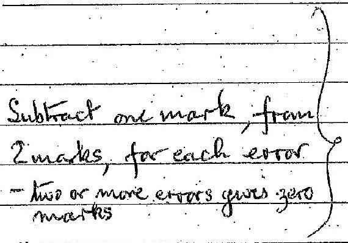
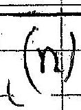
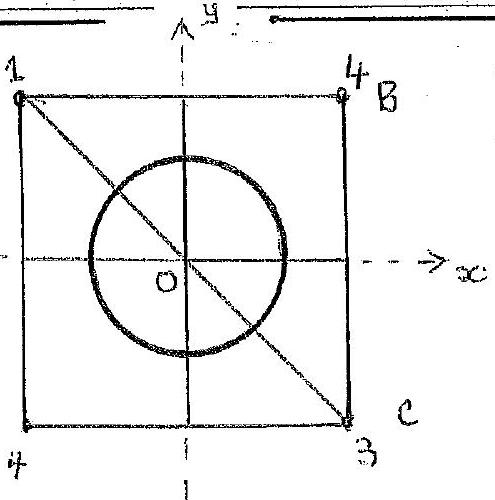

4

(19) The 1 wo 4 kg menses and the mass 8 kg of the reng Cont. are equalent to a mass of 16 kg at ongino. Taking mament about 0 for the 1,16 and 3 kg masses, the centre of mirs his along AC helow o at a distance D, from O, grow by

$$
\begin{aligned}
( 1 + 16 + 3 ) \bar { D } & = 3 \sqrt { 2 } b - 1 \sqrt { 2 } b \\
20 \bar { D } & = 2 \sqrt { 2 } b \\
\bar { D } & = \frac { \sqrt { 2 } } { 10 } b
\end{aligned}
$$

Alternative odutions acceptable.

(0) $\begin{aligned} & v _ { \text {ear rel. fear } } , f _ { \text {H66 } } = \frac { c } { \left( c - v _ { \text {Gar } } \right) } \text { f } 440 \\ & \text { freqs. } \frac { f } { f } \quad \left( c = 331 \mathrm {~ms} ^ { - 1 } \right) \end{aligned}$ freqs. $\frac { f } { 8 }$.
$$
\begin{gathered}
f _ { 466 } = 466 \text { and } f _ { 4 } \\
466 = \frac { 331 \times 440 } { 331 - V _ { \text {car } } } \\
V _ { \text {car } } = 18.5 \mathrm {~ms} ^ { - 1 }
\end{gathered}
$$
(p) Let $r$ be velocity of potom, was $m _ { p }$, then energy conservation gaves
$$
\begin{align*}
\frac { 1 } { 2 } m _ { p } v ^ { 2 } & = \frac { 2000 e } { v } = \sqrt { \frac { 4 \times 10 ^ { 3 } e } { m _ { p } } }
\end{align*}
$$
Radmis of path w magnetze fueld B given by $R _ { p }$ where.
$$
\begin{align*}
\frac { m _ { p } V ^ { 2 } } { R _ { p } } & = B e V \\
R _ { p } & = \frac { m _ { p } V } { B e } = \frac { m _ { p } } { B e } \sqrt { \frac { 4 \times 10 ^ { 3 } e } { m _ { p } } }  \tag{2}\\
& = \frac { 1 } { 0.200 } \sqrt { \frac { \left. 4 \times 10 ^ { 3 } \right) ( 1.61 ) 10 ^ { - 27 } } { 1.60 \times 10 ^ { - 19 } } } \\
R _ { p } & = 3.23 \mathrm {~cm} \text { 克 }
\end{align*}
$$
Deuterons have mass $2 m _ { p }$. Thus from (2) their ralius $R d$ is given by
$$
\begin{aligned}
& R _ { d } = R _ { p } \sqrt { 2 } \\
& R _ { d } = 4.57 = 4.6 \mathrm {~cm} .
\end{aligned}
$$
$$
\frac { 1 } { 4 }
$$

Deforens hewe mais glop by
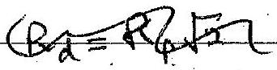
surfacting
Rafe yespecs
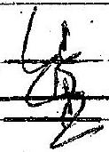
(q)
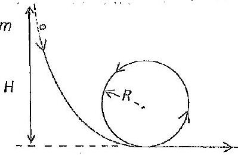

If the mass is to complete the circular path, then at the top of the circle we mequire the reaction of the constraining circle, $R _ { 0 }$, $t$ satify $R \geqslant 0$
Equation for circular motion
For $\quad R _ { c } \geqslant 0$

$$
\frac { m v ^ { 2 } } { R } = R + m g
$$

$$
\frac { m v ^ { 2 } } { R } \geqslant m g
$$

The smallest voccurs when

$$
\begin{equation*}
v ^ { 2 } = R q \tag{1}
\end{equation*}
$$

However fram the cinservation of evergy
Giving from (1)

$$
\begin{equation*}
\frac { 1 } { 2 } m v ^ { 2 } = m g ( H - 2 R ) \tag{1}
\end{equation*}
$$

$$
R g = \dot { g } ( H - 2 R )
$$

Sinallest value of Hgiven by

$$
\begin{equation*}
H = \frac { 5 } { 2 } R \tag{3}
\end{equation*}
$$

1

Q2
(a) (i)

$$
\varepsilon = \varepsilon _ { 1 } \cdot \frac { l _ { 1 } } { l }
$$

$$
\left. \begin{array} { l }
\frac { \varepsilon _ { 2 } } { l _ { 2 } } = \frac { \varepsilon _ { 1 } } { l _ { 1 } } \\
\frac { \varepsilon _ { 3 } } { l _ { - l _ { 2 } } } = \frac { \varepsilon _ { 1 } } { l } \Rightarrow \frac { \varepsilon _ { 3 } } { \varepsilon _ { 1 } } = \left( 1 - \frac { l _ { 2 } } { l } \right)
\end{array} \right\}
$$

1 1 1
(b)
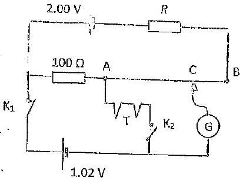

No ament flows in lower arm. Let i be current wi upper civent then

$$
( R + 102 ) i = 2.00
$$

as AB hus nevetance $2 \Omega$ (1) 1 1 1 With $K _ { 1 }$ closed and $K _ { 2 }$ open, equating pds

$$
\begin{equation*}
1.02 = i ( 100 + 2 \times 0.90 ) \tag{1}
\end{equation*}
$$

1

Giving

$$
i = \frac { 1002 } { 10108 }
$$

1
$K _ { 1 }$ open and $K _ { 2 }$ closed, equating pds

$$
\begin{aligned}
\varepsilon & = i ( 2 \times 0.45 ) = i ( 0.90 ) \\
& = \frac { 1002 } { 101.8 } ( 0.90 ) \\
\varepsilon & = 9.02 \times 10 ^ { - 3 } \mathrm {~V}
\end{aligned}
$$

1 1

From (1)

$$
\begin{aligned}
R & = \frac { 200 } { i } - 102 \\
& = 2.00 \frac { 10678 } { 1.02 } - 102 \\
R & = 97.65 \Omega
\end{aligned}
$$

1 from (2) $\frac { 1 } { 8 }$

Q2 (c) Since the bickly is bulanced, $\frac { V } { I } ( =$ bulb resistance $) = 4 \Omega$

$$
\text { Given } \begin{align*}
V \times 2 I + 8 I ^ { 2 } & \Rightarrow \frac { V } { I } = 2 + 8 I  \tag{1}\\
& \therefore \quad 4 = 2 + 8 I \Rightarrow I = \frac { 1 } { 4 } \mathrm {~A}
\end{align*}
$$

Altematively: For a balanced hidge, all mintors we to $\Omega$. So $V = \frac { V _ { b } } { 2 }$
and with $8 \Omega$ per arm, $I = V _ { b }$ Substitatis $\quad V _ { \frac { b } { 2 } } = 2 \left( \frac { V _ { b } } { 8 } \right) + 8 \left( \frac { V _ { b } } { 8 } \right) _ { ( \text {charge prom puper males } ) } ^ { 2 } \Rightarrow V _ { b } = 2 V _ { \text {olts } } \frac { 1 } { 4 }$
Q2 (d)
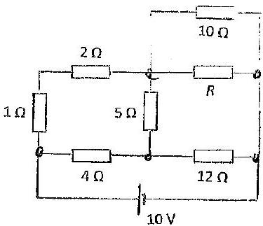

Thin creit is a wheatstone bredge Altematively symmetry requines $\frac { R _ { 1 } } { R _ { 2 } } \stackrel { R _ { 3 } } { R _ { 4 } }$ I Simplification gues
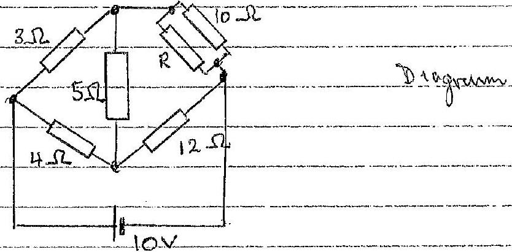

For minimum heat generated in $5 \Omega$, convent in $5 \Omega$ is zro. 1 Thus the brectge invest be 'balanced'by symmetry with " $\frac { R } { R _ { 2 } } = \frac { R _ { 3 } } { R _ { 4 } }$ " This requeres

$$
\begin{aligned}
\frac { 1 } { 12 } \left( \frac { 1 } { R } + \frac { 1 } { 10 } \right) ^ { - 1 } & = \frac { 3 } { 4 } \\
\frac { 1 } { R } + \frac { 1 } { 10 } & = \frac { 1 } { 9 } \\
\frac { 1 } { R } & = \frac { 1 } { 90 } \\
R & = 90 \Omega
\end{aligned}
$$

$$
1 + 1
$$

(chooge form poor math)
(chooge form par matt)

Q3 (a)
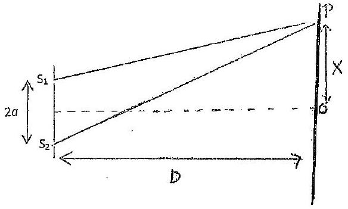

METHOD I

$$
\begin{aligned}
S _ { 2 } P & = \left[ D ^ { 2 } + ( x + a ) ^ { 2 } \right] ^ { 1 / 2 } \\
& = D \left[ 1 + \left( \frac { x + a } { D } \right) ^ { 2 } \right] ^ { \frac { 1 } { 2 } }
\end{aligned}
$$

Expanding $= D \left[ 1 + \frac { 1 } { 2 } \left( \frac { x + a } { D } \right) + \cdots \right]$
Similarly $S P = D \left[ 1 + \frac { 1 } { 2 } \left( \frac { x - a } { D } \right) ^ { 2 } + \cdots \right.$
Thus

$$
S _ { 2 } P - S _ { 1 } P = \frac { 1 } { 2 D } \left( ( x + a ) ^ { 2 } - ( x - a ) ^ { 2 } \right) + \cdots
$$

Giving

$$
S _ { 2 } P - S _ { 1 } P = \frac { 2 a x } { D } + \cdots
$$

METHOD II

$$
\begin{align*}
S _ { 2 } P ^ { 2 } - S _ { 1 } P ^ { 2 } & = \left[ P ^ { 2 } + ( x + a ) ^ { 2 } \right] - \left[ D ^ { 2 } + ( x - a ) ^ { 2 } \right]  \tag{2}\\
& = 4 a x \tag{2}
\end{align*}
$$

$$
\begin{align*}
\therefore \quad \left( S _ { 2 } P - S _ { 1 } P \right) \left( S _ { 2 } P + S , P \right) & = 4 a x  \tag{1}\\
S _ { 2 } P - S , P & = \frac { 2 a x } { D } \tag{1}
\end{align*}
$$

For fungés $s _ { 2 } p - s _ { 1 } p = n \lambda$ where $m$ is an integer Spacing between adjecent funges is $\lambda$ is aptical poth difference 1 or from above

Griving

$$
\begin{align*}
& \frac { 2 a } { D } \Delta x = \lambda \\
& \Delta x = \frac { \lambda D } { 2 a } \tag{1}
\end{align*}
$$

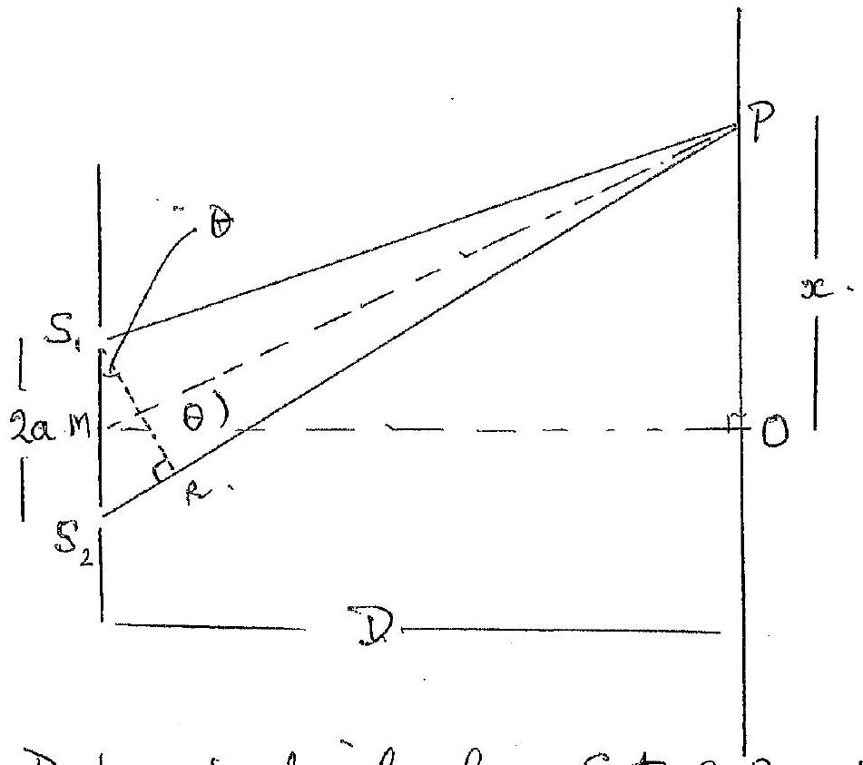

Drop perpendicular from $S _ { 1 }$ to $S _ { 2 } P$, intersecting $S _ { 2 } P$ at $R$.

$$
\hat { O M P } = \theta .
$$

Now $S _ { 1 } S _ { 2 }$ perpendecular to MO and, to ageod approx, as $\theta$ surall, MP perpendicular S,R.
Thus. $\hat { R S } _ { 1 } S _ { 2 } = \theta$
Consequently $\triangle S S _ { 2 } S , R$ and POM similar, sothat

$$
S _ { 2 } \widehat { S } _ { 1 } R = \theta .
$$

optical path difference

$$
\begin{aligned}
p & = 2 a \operatorname { sen } \hat { \theta } \\
& = 2 a \tan \theta \\
& = \frac { 2 a x } { D } \\
p & = \frac { 2 a x } { D }
\end{aligned}
$$

as $\theta$ small

Then equate to $\wedge \lambda$ as percious page.

Q. 3

(a) (ii) White hyph fringes owur when the optical part difference for all wavenyths is zero or dose to zero, giveng a white or whith frige at the cealere. Coloried frayes either side for te white antal pringe
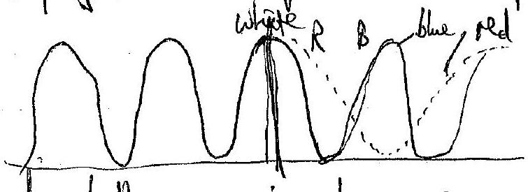
Sleetch (1) sheetch (1)
2
(iii) (iii)
(iii) The bub is an incolerent source; individual
The bub is an incokerat source; intiridual hotons have no finced/constant phase difference. photons have no finced/contant phase difference.
The single slit deffracts ach ploton to cover the pair
The single slit deffraits each ploton to cover the pair The single slit deffraits each ploton to cover the pair
of slits so that the chis actas colerect sources for of Slits so that the clies actas colerect sources for ever ploton. ever ploton.
$\frac { 1 } { 2 }$ $\frac { 1 } { 2 }$
Q3 (b) Uning result (1) dotained for light waves and
QB (b) Uning result (1) obtained for light waves and applying it to samed waves applying it to samed waves
$$
\Delta x = \frac { \lambda D } { 2 a }
$$
Substituting pumerical values
Substituting pumerical values
Substituting pumerical values
$$
\begin{aligned}
1.14 & = \lambda \frac { 20.0 } { 3.0 } \\
\lambda & = \frac { ( 1.14 ) ( 3.00 ) } { 2010 }
\end{aligned}
$$
Velocity of sound
Velocity of sound
Velocity of sound
Giving
Griving
Gring
$$
\begin{aligned}
& c = \left( 2 \times 10 ^ { 3 } \right) ^ { \frac { ( 1.14 ) ( 3.00 ) } { 20.0 } } \mathrm {~ms} ^ { - 1 } \\
& c = 342 \mathrm {~ms} ^ { - 1 }
\end{aligned}
$$
14
1
1
1
1
6

Q4 (a) (i)
The total PE is the sun of the PES for each pair of charges.

Total PE for Hedges $= 4 \overline { 4 \pi \varepsilon _ { 0 } ( 2 a ) }$

Total PE for -Q and Qs at the force corrers

$$
\begin{equation*}
= - 4 \frac { p ^ { 2 } } { 4 \pi \varepsilon _ { 0 } ( a \sqrt { 2 } ) } \tag{1}
\end{equation*}
$$

Tobal PE for duagonal Qs

$$
\begin{equation*}
= 2 \frac { Q ^ { 2 } } { 4 \pi \varepsilon _ { 0 } \sqrt { 2 } ( 2 a ) } \tag{2}
\end{equation*}
$$

Thus the total PE, $V _ { S }$, given by

$$
\begin{aligned}
& V _ { s } = \frac { Q ^ { 2 } } { 4 \pi \varepsilon _ { 0 } a } \left[ 2 + \frac { 1 } { \sqrt { 2 } } - \frac { 4 } { \sqrt { 2 } } \right] \quad > = \frac { 1 } { 4 \pi \varepsilon _ { 0 } a } ( 1 - 1 ) \\
& V _ { s } = \frac { Q ^ { 2 } } { 4 \pi \varepsilon _ { 0 } a } \left( 2 - \frac { 3 \sqrt { 2 } } { 2 } \right) = \frac { - Q ^ { 2 } } { 4 \pi \varepsilon _ { 0 } a } \left( \frac { 3 \sqrt { 2 } } { 2 } - 2 \right)
\end{aligned}
$$

(ii) $P E$ due to $( - Q ) = - 8 \overline { A B } - a \sqrt { 3 }$
$P \in F$ due to body dagonals $= 4 \frac { Q ^ { 2 } } { 4 \pi \varepsilon _ { 0 } 2 a \sqrt { 3 } }$
P.E due to face dragenals $= 12 \frac { Q ^ { 2 } } { 4 \pi \varepsilon ^ { 2 } \cdot 2 a \sqrt { 2 } }$
P.E. due to edges $= 12 \frac { Q ^ { 2 } } { 4 \pi \varepsilon _ { 0 } ^ { 2 } a }$
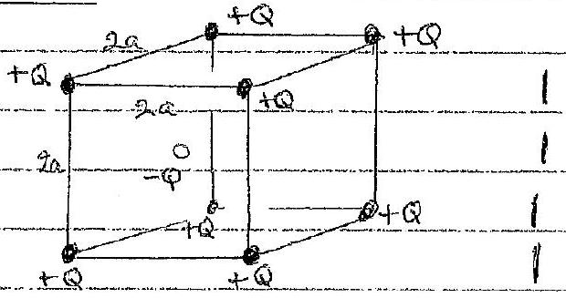
(do not count edges twice as the occur on two faces)
Tobal PE, $V _ { c } = \frac { a ^ { 2 } } { 4 \pi \varepsilon _ { 0 } a } \left[ b + \frac { b } { \sqrt { 2 } } + \frac { 2 } { \sqrt { 3 } } - \frac { 8 } { \sqrt { 3 } } \right]$

$$
V _ { c } = \frac { Q ^ { 2 } } { 4 \pi \varepsilon _ { 0 } a } [ b - 3 \sqrt { 2 } - 2 \sqrt { 3 } ] = \frac { Q ^ { 2 } } { 4 \pi \varepsilon _ { 0 } a } ( b \cdot 78 )
$$

$b ( i )$ Force towards centre, 0 , of square

$$
\begin{aligned}
F & = \frac { \left( Q ^ { 2 } \right) } { 4 \pi \varepsilon _ { 0 } \left( 2 a ^ { 2 } + x ^ { 2 } \right) } \cos \theta \\
& = \frac { 4 Q ^ { 2 } } { 4 \pi \varepsilon _ { 0 } \left( 2 a ^ { 2 } + x ^ { 2 } \right) } \frac { x } { \sqrt { \left( 2 a ^ { 2 } + x ^ { 2 } \right) } }
\end{aligned}
$$

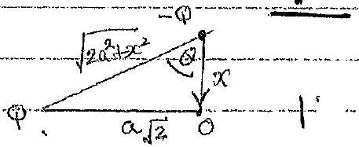
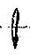

$$
F = \frac { 4 Q ^ { 2 } } { 4 \pi \varepsilon _ { 0 } \left( 2 a ^ { 2 } + x ^ { 2 } \right) ^ { 3 / 2 } }
$$

Conegative segur for force in opposite direction)

Q4 b(i) SKETCH
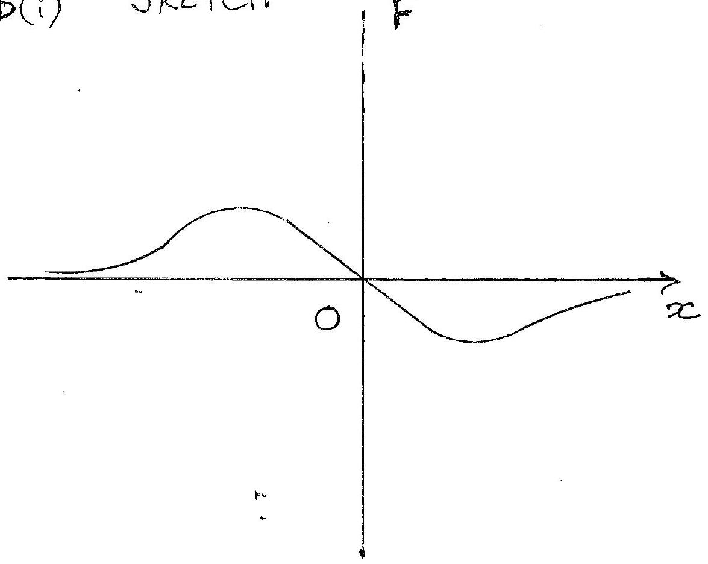

$$
F = 0 \quad \text { ato \& } \pm \infty
$$

$F$ has min for $x > 0 \&$ max. for $x < 0$

$$
3 + 2 = 5
$$

Q4 (b) (ii)
Equatem of motion

$$
\begin{align*}
m ^ { n x } & = - \frac { 4 Q ^ { 2 } } { 4 \pi \varepsilon _ { 0 } } \left( 2 a ^ { 2 } \right) ^ { 3 / 2 } \left( 1 + \frac { x ^ { 2 } } { 2 a ^ { 2 } } \right) ^ { 3 / 2 } \\
& = \frac { - Q ^ { 2 } x } { \pi \varepsilon _ { 0 } 2 \sqrt { 2 } a ^ { 3 } } \left( 1 - \frac { 3 } { 2 } \frac { x ^ { 2 } } { 2 a ^ { 2 } } + \cdots \right)
\end{align*}
$$

Thus for suall $x \quad m \ddot { x } = - \frac { Q ^ { 2 } x } { 2 \sqrt { 2 } a ^ { 3 } \pi \varepsilon _ { 0 } }$
This is the equation of SHM work persord

$$
T = 2 \pi \sqrt { \frac { 2 \sqrt { 2 } a ^ { 3 } \pi \varepsilon _ { 0 } m } { Q ^ { 2 } } } = 2 \pi \sqrt { \frac { \left( 4 \pi \varepsilon _ { 0 } \right) \sqrt { 2 } a ^ { 3 } \pi m } { 2 Q ^ { 2 } } }
$$

Fram (2) we require for sHM that when $x = A$
ie.

$$
\begin{aligned}
\frac { 3 } { 2 } \frac { A ^ { 2 } } { 2 a ^ { 2 } } & \ll 1 \\
A ^ { 2 } & \ll 4 a ^ { 2 } / 3 \\
A & \ll \frac { 2 \sqrt { 3 } a } { 3 }
\end{aligned}
$$

6

(a) Equating the gravitational acceleration with the centripetal acceleration:
$$
\begin{aligned}
& & \frac { G M ( s r ) } { r ^ { 2 } } & = \frac { V _ { \text {rot } } ^ { 2 } ( r ) } { r } \\
\therefore & & V _ { \text {rot } } ^ { 2 } ( r ) & = \frac { G M ( < r ) } { r } \\
\therefore & & V _ { \text {rot } } ( r ) & = \sqrt { \frac { G M ( < r ) } { r } }
\end{aligned}
$$
(b) i) $r < r _ { 0 }$ (inside the bulge)
Total:2 marks
$$
\begin{aligned}
& \rho _ { 0 } = \frac { M ( < r ) } { \frac { 4 } { 3 } \pi r ^ { 3 } } - \text { constant } \Rightarrow M ( < r ) = \frac { 4 } { 3 } \pi r ^ { 3 } \rho _ { 0 } \quad [ 1 ] \\
& \therefore V _ { \text {rot } } ( r ) = \sqrt { \frac { 4 \pi \rho _ { 0 } G } { 3 } } \cdot r \Rightarrow V _ { \text {rot } } ( r ) \alpha r \text { at } r < r _ { 0 } [ 1 ]
\end{aligned}
$$
ii) $r > r o$ (outside the bulge)
If most of the mass is enclosed in the bulge:
$$
\begin{aligned}
& M ( < r ) = M = \text { constant } \\
\therefore \quad & V _ { \text {rot } } ( r ) = \sqrt { G M } \cdot r ^ { - 1 / 2 } \Rightarrow V _ { \text {rot } } ( r ) \propto r ^ { - 1 / 2 } \text { at } r > r _ { 0 } \text { thr } \\
\Rightarrow \quad & \operatorname { Vrot } ( r ) \propto \left\{ \begin{array} { l }
r , r < r _ { 0 } \\
r ^ { - 1 / 2 } , r > r _ { 0 } \\
- 1 -
\end{array} \right.
\end{aligned}
$$

Q5 The rotation curve of the qualaxy:
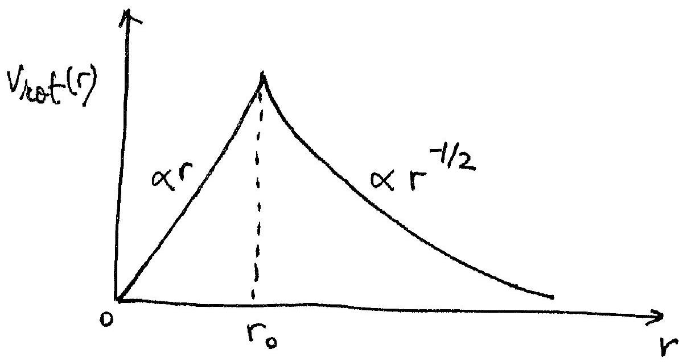

1 mark for $r < r _ { 0 }$ Imark for $r > r o$ 1 mark for correct labels (Vrot, r, ro)

Total: 7 manks
(c) Dark matter prafile: $\rho ( r ) = \rho _ { 0 } \left( \frac { r } { r _ { 0 } } \right) ^ { - \alpha }$
Velocity curve: $\operatorname { Vrot } ( r ) = \sqrt { \frac { G M ( \text { rr } ) } { r } }$
Spherical distribution: $\quad \rho ( r ) = \frac { M ( r ) } { 4 \pi r ^ { 3 } } = \rho _ { 0 } \left( \frac { r } { r _ { 0 } } \right) ^ { - \alpha } [ 1 ]$
(see the integration for

$$
\begin{align*}
& \Rightarrow M ( < r ) = \rho _ { 0 } \left( \frac { n } { r _ { 0 } } \right) ^ { - \alpha } \cdot \frac { 4 } { 3 } \pi r ^ { 3 } \\
& \therefore V _ { \text {rot } } ( r ) = \sqrt { G \rho _ { 0 } \left( \frac { n } { r _ { 0 } } \right) ^ { - \alpha } \cdot \frac { 4 } { 3 } \pi r ^ { 2 } } \\
& \therefore V _ { \text {rot } } ( r ) = \sqrt { \frac { 4 \pi G \rho _ { 0 } r _ { 0 } ^ { \alpha } } { 3 } } \cdot r ^ { 1 - \alpha / 2 } \tag{1}
\end{align*}
$$

M(r) wash restrap. - the
eyemons be the band [1]
for dinerens overnons. be this possulviti imethed is OK].
Flat velocity profile at $r > r _ { 0 } \Rightarrow v _ { \text {rot } } \left( r > r _ { 0 } \right) =$ constants

$$
\begin{align*}
& \Rightarrow \quad 1 - \alpha / 2 = 0 \Rightarrow \alpha = 2  \tag{1}\\
& \Rightarrow \quad f ( r ) \propto r ^ { - 2 }
\end{align*}
$$

Total: \#marks

part(c) alternative
Knowing phe demity pople, we can calculade rle mass within ration T (still uning the criere square bus if force So that the Gaussion arranption is stitt valid),
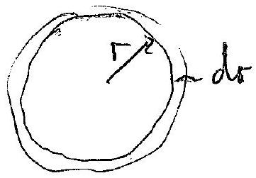

$$
\begin{align*}
M ( r ) & = \int 4 \pi r ^ { 2 } \cdot d r \cdot \rho ( r )  \tag{1}\\
& = \int 4 \pi r ^ { 2 } \rho _ { 0 } \frac { r ^ { - \alpha } } { r _ { 0 } ^ { - \alpha } } \cdot d r \\
& = 4 \pi \rho _ { 0 } \frac { r ^ { 3 - \alpha } } { r _ { 0 } ^ { - \alpha } } \frac { r ^ { 3 - \alpha } } { ( 3 - \alpha ) } \tag{1}
\end{align*}
$$

$$
\begin{align*}
\text { Veloity curve } V _ { \text {ot } } ( r ) & = \sqrt { \frac { G m ( r ) } { r } } \\
& = \sqrt { G 4 \frac { \pi \rho _ { 0 } } { r _ { 0 } ^ { - \alpha } } \frac { r ^ { 2 - \alpha } } { 3 - \alpha } } \\
& = \sqrt { \frac { G + \pi \rho _ { 0 } } { r _ { 0 } ^ { - \alpha } ( 3 - \alpha ) } } r ^ { 1 - \frac { \alpha } { 2 } } \tag{1}
\end{align*}
$$

$$
1 - \frac { \alpha } { 2 } = 0 \Rightarrow \alpha = 2 \quad [ 1 ]
$$

4 moles
[With this riaple molel cre acuine that the darb multer dominites asphide $F _ { 0 }$. O thoswise va have a tem the

$$
\begin{aligned}
k _ { 1 } r ^ { - 1 } + k _ { 2 } r ^ { 2 - \alpha } = k _ { 3 } r ^ { 0 } & \text { for } r > r _ { 0 } \\
& \text { do require } r \gg r _ { 0 } \\
& \text { to que } \alpha = 2 . ] .
\end{aligned}
$$

(d)

$$
\begin{aligned}
& V _ { \text {rot } } ( r ) = \sqrt { \frac { G M ( < r ) } { r } } \\
& \therefore M ( < r ) = \frac { V _ { \text {rot } } ( r ) \cdot r } { G }
\end{aligned}
$$

$r = 2.8 \times 10 ^ { 5 }$ light years $= 2.65 \times 10 ^ { 18 } \mathrm {~km}$

(i) $\operatorname { rrot } ( r ) = 220 \mathrm {~km} \cdot \mathrm {~s} ^ { - 1 }$
$$
\begin{equation*}
\therefore M _ { \text {tot } } = 1.9 \times 10 ^ { 42 } \mathrm {~kg} = 9.7 \times 10 ^ { 11 } \mathrm { M } \text { o } \tag{1}
\end{equation*}
$$
ii) $\operatorname { Vrot } ( r ) = V _ { \exp } ( r ) = 70 \mathrm { kms } ^ { - 1 }$
$$
\begin{equation*}
\therefore \quad M = 1.95 \times 10 ^ { 41 } \mathrm {~kg} = 9.8 \times 10 ^ { 10 } \mathrm { Mo } \tag{1}
\end{equation*}
$$
Dark matter fraction: $f _ { 0 r } = \frac { M _ { \text {tot } } - M _ { \text {visible } } } { M _ { \text {bot } } }$
$$
\therefore f _ { D M } \simeq 0.9 ( 90 \% \text { Dark matter } ) [ 1 ]
$$
Total: 3 marks

(e) In the small acceleration (MOND) approximation:

$$
\begin{gather*}
\mu \left( \frac { a } { a _ { 0 } } \right) = \frac { a } { a _ { 0 } } \\
\therefore F = m \mu \left( \frac { a } { a _ { 0 } } \right) a = \frac { m a ^ { 2 } } { a _ { 0 } } \tag{1}
\end{gather*}
$$

(The force is proportional to the acceleration squared) $a$ is the centripetal acceleration

$$
\begin{equation*}
\therefore \quad a = \frac { V _ { \text {rot } } ^ { 2 } } { r } \tag{1}
\end{equation*}
$$

For an object of mass $m$ in circular orbit around a point mass $M$ (same as the case for $r > r _ { 0 }$ in $b$ )):

$$
\begin{aligned}
& \frac { G M M C } { r ^ { 2 } } = m \frac { a ^ { 2 } } { a _ { 0 } } = m \left( \frac { V _ { r r t } ^ { 2 } } { a _ { 0 } } \right) ^ { 2 } \\
& \therefore \quad V _ { r 0 t } ^ { 4 } ( r ) = G M a _ { 0 } \\
& \therefore \quad V _ { r 0 t } ( r ) = \sqrt [ 4 ] { G M a _ { 0 } } = \text { constant }
\end{aligned}
$$

∴ the rotation curve is flat at $r > r _ { 0 }$.
Total: 4 marks

So

$$
\begin{aligned}
& \frac { \left( 1.50 \times 10 ^ { 11 } \right) ^ { \alpha } } { 1 ^ { \gamma } } = \frac { \left( 7.76 \times 10 ^ { 11 } \right) ^ { \alpha } } { ( 11.8 ) ^ { \gamma } } \quad \text { Trir years } \\
& \left( \frac { 7.76 } { 1.50 } \right) ^ { \alpha } = ( 11.8 ) ^ { \gamma }
\end{aligned}
$$

Taking logs,

Giving

$$
\begin{aligned}
\alpha \log \left( \frac { 7.76 } { 1.50 } \right) & = \gamma \log ( 11.8 ) \\
\alpha ( 0.7138 ) & = \gamma ( 1.0719 ) \\
\frac { \alpha } { \gamma } & = 1.50
\end{aligned}
$$

If $M _ { S }$ is the mass of the Sun, ME is tre mass of the Earth and $R _ { 5 E }$ the radius of the or bit of the Eurth, then for circular nootin

$$
\begin{aligned}
& \frac { G M _ { E } M _ { S } } { R _ { S E } ^ { 2 } } = \frac { M _ { E } V _ { E } ^ { 2 } } { R _ { S E } } \quad V _ { E } \text { is speed of Eully } 2 \\
& M _ { S } = \frac { R _ { E S } V _ { E } ^ { 2 } } { G } \\
& A _ { S } = 2 \pi \left( 1.50 \times 10 ^ { 11 } \right) / 365 \times 24 \times 60 \times 60 \\
& M _ { S } = \frac { \left( 1.50 \times 10 ^ { 11 } \right) } { \left( 6.67 \times 10 ^ { - 11 } \right) } \left[ \frac { 2 \pi \left( 1.50 \times 10 ^ { 11 } \right) } { 365 \times 24 \times 60 \times 60 } \right] ^ { 2 } \\
& M _ { S } = 2.01 \times 10 ^ { 30 } \mathrm {~kg} - ( \text { thin igiren } ) \frac { p } { 8 }
\end{aligned}
$$

(b)

$$
\begin{equation*}
V _ { s } = \frac { 2 \pi R _ { s } } { 24 \times 60 \times 60 } \tag{1}
\end{equation*}
$$

Equation of moteon far satellite mass $m _ { s }$

$$
\frac { m _ { s } V _ { s } ^ { 2 } } { R _ { s } } = \frac { G m _ { s } M _ { E } } { R _ { s } ^ { 2 } }
$$

Substatutuig for Vefrom (1) gives

$$
\begin{aligned}
R _ { S } ^ { 3 } & = G M _ { E } \cdot \left( \frac { 24 \times 60 \times 60 } { 2 \pi } \right) ^ { 2 } \\
& = \left( 6.67 \times 10 ^ { - 10 } \right) \left( 5.98 \times 10 ^ { 24 } \right) \left( \frac { 24 \times 60 \times 60 } { 2 \pi } \right) ^ { 2 } \\
& = 7.54 \times 10 ^ { 22 } \\
R _ { S } & = 4.22 \times 10 ^ { 7 } \mathrm {~m} = 4.22 \times 10 ^ { 4 } \mathrm {~km}
\end{aligned}
$$

Giving from (1)

$$
V _ { s } = 3.07 \times 10 ^ { - 3 } \mathrm {~ms} ^ { - 1 } = 3.07 \mathrm { kms } ^ { - 1 }
$$

(C)
(c) (for a space a-aft mass $m _ { s }$ the escape veloity is geven by, equating keound pe,

$$
\frac { 1 } { 2 } m _ { S } v _ { E } ^ { 2 } = \frac { G M _ { E } m _ { S } } { R E }
$$

$M _ { E }$ is the and $R _ { E }$ the radius of the Earth Griving

$$
\begin{aligned}
V _ { E } & = \sqrt { \frac { 2 G _ { 1 } M _ { E } } { R _ { E } } } \\
& = \sqrt { 2 \left( 6.67 \times 10 ^ { - 11 } \right) \left( 5.98 \times 10 ^ { 24 } \right) / \left( 6.38 \times 10 ^ { 6 } \right) } \\
V _ { E } & = 11.2 \mathrm {~km} \mathrm {~s} ^ { - 1 }
\end{aligned}
$$

(iii) If one launches the spacecreft in the deretern of the Earbl's notation at itse equater, me starth, before the rocket is ignisted, with an initial ke.
(in) The velocity of the Eurli's notateon at the equator, $v _ { i }$, is given by

$$
\begin{aligned}
V _ { R } & = \frac { 2 \pi \left( 6.38 \times 10 ^ { 6 } \right) } { 24 \times 60 \times 60 } \\
& = 4.64 \times 10 ^ { 2 } \mathrm {~ms} ^ { - 1 }
\end{aligned}
$$

1

Thus the minimum intried launch speed $v _ { i }$ is green by

$$
\begin{aligned}
& V _ { i } = 11.2 - 0.46 \mathrm { kms } ^ { - 1 } \\
& V _ { i } = 10.7 \mathrm { kms } ^ { - 1 }
\end{aligned}
$$

(d)

$$
\begin{aligned}
V = \sqrt { \frac { 2 G M _ { s } } { r _ { \text {oubit } } } } & = 42.2 \mathrm {~km} / \mathrm { s } \\
\text { Orbital speed of } \sqrt { \text { coot } } & = \frac { 2 \pi 1.5 \times 10 ^ { 11 } } { 365 \times 24 \times 3600 } \\
& = 29.9 \mathrm {~km} / \mathrm { s } \\
\left( V _ { \text {inin } } \right. & = 42.2 - 29.9 = 12.3 \mathrm {~km} / \mathrm { s } )
\end{aligned}
$$

(a) It $m$ is the mass of the drop and $E$ the field, then for constant velocity, assuming $n$ changes on the colop. By Nowton II, $E n _ { 1 } e = m g + 6 \pi \eta a u _ { 1 }$ and $\quad E _ { n 2 e } = m _ { y } + 6 \pi y a u _ { 2 }$ and
$$
E n _ { 2 } e = m _ { y } + 6 \pi \eta a u _ { 2 }
$$
Subtrating $\operatorname { Fe } \left( n _ { 2 } - n _ { 1 } \right) = 6 \pi \eta a \left( n _ { 2 } - u _ { 1 } \right)$
$$
\therefore \left( n _ { 2 } - n _ { 1 } \right) = 6 \pi \eta a \left( n _ { 2 } - w _ { 1 } \right)
$$
and $E = \frac { 5000 } { 1.5 \times 10 ^ { - 2 } } \frac { \mathrm {~V} } { \mathrm {~m} }$
$$
\left. \begin{array} { r l }
\therefore \quad \left( n _ { 2 } - n _ { 1 } \right) & = \frac { 6 \pi \left( 1.82 \times 10 ^ { - 5 } \right) \left( 2.76 \times 10 ^ { - 6 } \right) } { 1.60 \times 10 ^ { - 19 } \left( 5000 / 1.5 \times 10 ^ { - 2 } \right) } \left[ \frac { 10 ^ { - 2 } } { 42 } - \frac { 10 ^ { - 2 } } { 78 } \right] \\
& = \frac { 944.6 \times 10 ^ { - 11 } } { 5.33 \times 10 ^ { - 14 } } \left[ 2.38 \times 10 ^ { - 4 } 1.28 \times 10 ^ { - 4 } \right] \\
& = \left( 17.7 \times 10 ^ { 3 } \right) \left[ 1.10 \times 10 ^ { - 4 } \right]
\end{array} \right\}
$$
of $\left( n _ { 2 } - n _ { 1 } \right) = 1,95$
of $\left( n _ { 2 } - n _ { 1 } \right) = 1,95$ \} 1

(b) Driss coalesce:
Dors Terferen
$$
\begin{align*}
& Q E = 6 \pi r _ { 1 } \eta u _ { 1 } + m _ { i g }  \tag{1}\\
& Q E = 1 \pi r _ { 2 } \eta u _ { 2 } + m _ { 3 } \tag{\(\theta\)}
\end{align*}
$$
Addry (1) add (2)
$$
\begin{equation*}
2 Q E = 6 \pi r _ { 3 } \eta u _ { 3 } + m _ { 3 } g \tag{D}
\end{equation*}
$$
$2 Q E = 6 \pi \eta \left( r _ { 1 } u _ { 1 } + r _ { 2 } u _ { 2 } \right) + \left( m _ { 1 } + m _ { 2 } \right) g$
Hence
with $m _ { 3 } = m _ { 1 } + m _ { 2 }$
$$
r _ { 3 } u _ { 3 } = r _ { 1 } u _ { 1 } + r _ { 2 } u _ { 2 }
$$
But volume comered, so $\frac { 4 } { 3 } \pi r _ { 2 } ^ { 3 } = \frac { 4 } { 3 } \pi r _ { 1 } ^ { 3 } + \frac { 4 } { 3 } \pi r _ { 2 } ^ { 3 }$
$$
\text { So } r _ { 3 } = \sqrt [ 3 ] { r _ { 1 } ^ { 3 } + r _ { 2 } ^ { 3 } }
$$
Hence
$$
u _ { 3 } = \frac { r _ { 1 } u _ { 1 } + r _ { 2 } u _ { 2 } } { \sqrt [ 3 ] { r _ { 1 } ^ { 3 } + r _ { 2 } ^ { 3 } } }
$$
$$
- \frac { 1 } { 5 }
$$

For the general care with theorent chages $Q _ { 1 }$ ad $Q _ { 2 }$ initielly,

$$
\begin{align*}
& E Q _ { 1 } = 6 \pi r _ { 1 } \eta u _ { 1 } + m _ { 1 } g  \tag{⊕}\\
& E Q _ { 2 } = 6 \pi r _ { 2 } \eta u _ { 2 } + m _ { 2 } g \tag{s}
\end{align*}
$$

Drays topether $E \left( Q _ { 1 } + Q _ { 2 } \right) = 6 \pi r _ { 3 } \eta u _ { 3 } + m _ { 3 } y$ with $M _ { 3 } = M _ { 1 } + M _ { 2 }$
Addy © wd (1)

$$
E \left( Q _ { 1 } + Q _ { 2 } \right) = 6 \pi \eta \left( r _ { 1 } u _ { 1 } + r _ { 2 } u _ { 2 } \right) + \left( r _ { 1 } + r _ { 2 } \right) g
$$

Наче

$$
\left. r _ { 3 } u _ { 3 } = r _ { 1 } u _ { 1 } + r _ { 2 } u _ { 2 } \text { as above } \right]
$$

Q7
(c) Initial velocity $V$ given by $h \in E$

$$
\begin{aligned}
10 ^ { 4 } e & = \frac { 1 } { 2 } m _ { e } v ^ { 2 } \\
\frac { e } { m _ { e } } & = \frac { 10 ^ { 4 } } { 2 } v ^ { 2 }
\end{aligned}
$$

If the many othe force balannes the force due to receivetric fulle $e v B = e E$

$$
\begin{aligned}
\text { So } \quad V B & = E \\
\left( 2.5 \times 10 ^ { - 3 } \right) V & = \frac { 3000 } { 2 \times 10 ^ { - 2 } } \\
V & = \frac { 3000 } { \left( 2 \times 10 ^ { - 2 } \right) \left( 2.5 \times 10 ^ { - 3 } \right. } \\
\therefore \quad \frac { e } { m _ { e } } & = \frac { 10 ^ { 4 } } { 2 } \times 36 \times 10 ^ { 14 } \\
& = 1.8 \times 10 ^ { 11 } \mathrm { c }
\end{aligned}
$$

kg

$Q ( 8 )$ (a)
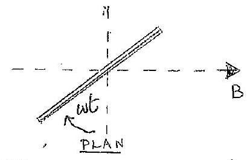
(Aeternature notation will w't $= 90 -$ wt oK providning subsequent whathon consestent)
(b)

$$
\begin{aligned}
& I = \frac { V } { R } \\
& I = \frac { \pi r ^ { 2 } B w } { R } \sin \omega t
\end{aligned}
$$

$$
\text { as } V = - \frac { d \Phi } { d t } = \pi r ^ { 2 } \operatorname { Bcssin } \omega t _ { ( 1 ) }
$$

(c) The current in the reing undrices a magnetic field at the centre of the reng of magnitude
$$
\begin{aligned}
& B _ { I } = \mu _ { 0 } \frac { I } { 2 I } \\
& B _ { I } = \mu _ { 0 } \frac { \pi r B \omega } { 2 R } \text { suis } \omega t
\end{aligned}
$$
fram (1)
(d) The direction of $B _ { I }$ is perpendecular to the plane of the ring and robates with it. Resolving. $B _ { I }$ parallel, $B _ { I I }$, and perpendecial $B _ { 1 }$, to the reng gives
$$
\begin{aligned}
B _ { 11 } & = B _ { I } \cos \omega t \\
& = \mu _ { 0 } \frac { \pi r \cdot B \omega } { 2 R } \sin \omega t \cos \omega t = \mu _ { 0 } \frac { \pi r B \omega } { 4 \cdot R } \sin 2 \omega t
\end{aligned}
$$
The average value of sin 2nt, over this, is zero
$$
\begin{aligned}
B _ { \perp } & = \mu _ { 0 } \frac { \pi r B \omega } { 2 R } \sin ^ { 2 } \omega t \\
& = \mu _ { 0 } \frac { \pi r B \omega } { 4 R } ( 1 - \cos 2 \omega t )
\end{aligned}
$$
"The costart term averages and to zero leaving
$$
B _ { \perp } = \frac { \mu _ { 0 } \pi r - B w } { 4 R }
$$
$$
\frac { 1 } { 7 }
$$
(e) bensequently the angle of the compass needle, $\alpha$, is given by
$$
\tan \alpha = \frac { B _ { 1 } } { B } = \mu _ { 0 } \frac { \pi r \omega } { 4 R }
$$
Giving
$$
R = \mu _ { 0 } \pi r \omega / 4 \tan \alpha
$$
Subsitisting
$$
\begin{gathered}
\mu _ { 0 } = 4 \pi \times 10 ^ { - 7 } \mathrm { Hm } ^ { - 1 } , \alpha = 2.00 ^ { \circ } \\
r = 0.125 \mathrm {~m} , \omega = 2 \pi ( 10 ) ^ { 6 } \mathrm {~s} ^ { - 1 } \\
R = 2.22 \times 10 ^ { - 4 } \Omega
\end{gathered}
$$
$$
\begin{array} { r }
2 \\
- \frac { 1 } { 5 } \\
\hline
\end{array}
$$
