## BPhO Round 1 marking 2017

- Positive marking is the aim. Marks should be awarded for good physics, even if the reasoning does not follow the mark scheme. Alternative routes to the answers can be allowed.
- Significant figures. A leeway of ±1 sig fig is allowed; if the published solution gives 3, allow 2 or 4 in the students answer. This only applies to the final answers as intermediate answers may be recorded to greater precision to avoid rounding errors. Candidates should not lose more than 1 mark per question for this even if they have got it wrong in more than one place in the question (they might lose all their hard earned marks otherwise). Question 1 (a) is different in this respect as it is specifically about sf and dp.
- Units should be given for the final answer. It may be that the unit is given a little earlier and that it does not appear on the very last line. Some allowance may be made if it is clear that the unit has been used a line or two earlier.
- In one or two places the units are a required part of the answer for the mark, and so must be there.
- Error carried forward (ecf) is allowed provided ridiculous results do not start appearing. A mark is lost for the initial mistake, but then they can carry on (if it is possible) to gain some of the subsequent marks.
- You are not required to spend time deciphering scribble.
    - In some cases, the mark scheme allows for different methods of solution. You will need to award marks for these solutions, with a mark for each key step in heading for a solution. You cannot give more marks than is available.
    - The significant figures - although some details are given above, this is not a paper testing use of significant figures. Two sig figures in the answer to almost every question would be fine. I think you will find some inconsistencies in the solutions, with more figures given than might be justified.
    - There are a few questions in which two or at most three marks are awarded for working, whose details are not shown. For example, Qu 3 on the crane; there are a number of ways of getting the results, but students will generally not set out their path. Therefore, a mark for a sensible resolving, or taking moments about a point, etc. will contribute to the working marks; often students will get lost. You do not need to find the exact point at which they made a mistake. Wrong answer - they lose that mark. Some working heading in the right direction, one or two marks. Judgement is required, but not timewasting.
    - If stuck, email robin Hughes on rh584@cam.ac.uk and I will reply fairly quickly.

## BPLO Round 12017.

Section 1.
Qu1 (a)

$$
\begin{aligned}
1 \frac { f _ { 00 t } } { n s } & = \frac { 1 } { 3 } \frac { y d } { n s } \\
& = \frac { 1 } { 3 } \times \frac { 1 } { 1.094 } \frac { m } { n s } \\
& = 3.047 \times 10 ^ { 8 } \mathrm {~ms} ^ { - 1 } \\
\text { Error } & = \frac { 3.047 - 3.000 } { 3.000 }
\end{aligned}
$$

* $\frac { 1 - 0.9846 } { 3 } = 1.54 \% = 1.564 \%$
orly gain $\frac { 2 } { 3 }$ mons $= 1.6 \%$
(b)
(i)
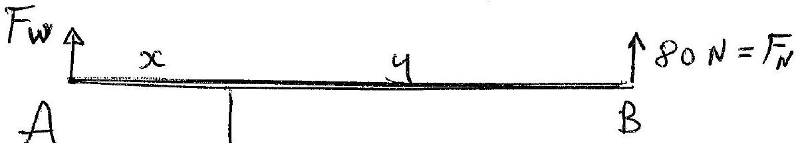
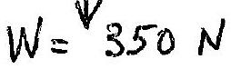

Sketh/Chingrow
Moment about $A$ 位

$$
\begin{array} { r }
5 \times 80 - 350 \cdot x = 0 \\
x = \frac { 400 } { 350 } = \frac { 8 } { 7 } m \\
= 1.14 m
\end{array}
$$

(ii)

$$
\begin{aligned}
x + y & = 5.0 \mathrm {~m} \\
y & = \frac { 27 } { 7 } \mathrm {~m} = 3.86 \mathrm {~m}
\end{aligned}
$$

Moments about B $A \quad F _ { w } \times 5 - 350 \times \frac { 27 } { 7 }$

$$
F _ { w } = 270 \mathrm {~N}
$$

Lor $F _ { w } + 80 = 350$

$$
\Rightarrow F _ { \omega } = 270 \mathrm {~N}
$$

Answers as forstion, or to 2 ff are o.k.

(c) (i)
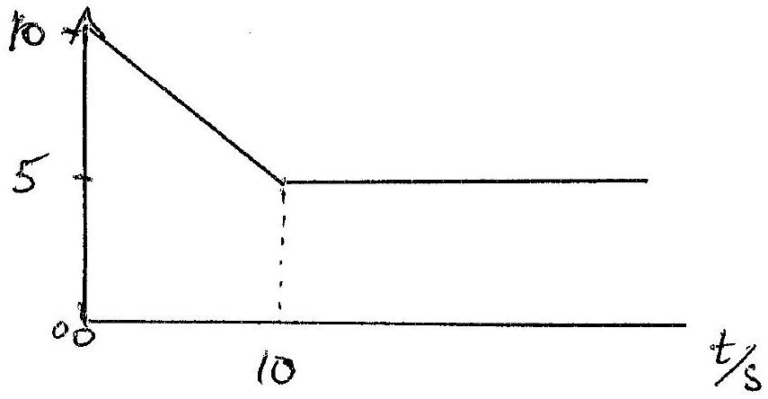

$$
\frac { a } { m s ^ { - 2 } }
$$

Grapheially.
change in velocity = area under $a - t$ graph In frort 10 s werge accelerstion i $7.5 \mathrm {~ms} ^ { - 2 }$ So Change in we loity is $75 \mathrm {~ms} ^ { - 1 }$
So, After 10s, the velocity is $100 + 75 = 175 \mathrm {~ms} ^ { - 1 }$ To rach $200 \mathrm {~ms} ^ { - 1 }$, are entra $25 \mathrm {~ms} ^ { - 1 }$ is veeded Constant acceleration of $5 \mathrm {~ms} ^ { - 2 }$ would tale 5 s . which is 15 s apter the Hent
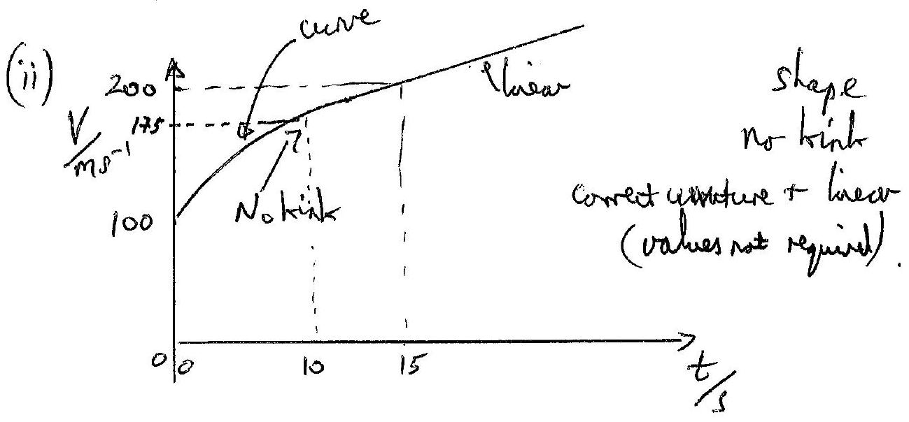
(7)
or algelowically

$$
\left. \begin{array} { r l }
a = - \frac { 1 } { 2 } t + 10 & ( \text { ir } \sqrt { I } \text {. with } ) \\
\int _ { 100 } ^ { V } a d t = & \int _ { 0 } ^ { 10 } \left( - \frac { 1 } { 2 } t + 10 \right) d t \\
V - 100 & = \frac { - 1 t ^ { 2 } } { 4 } + \left. 10 t \right| _ { 0 } ^ { 10 } \\
& = 75 \mathrm {~ms} ^ { - 1 } \\
V = & 175 \mathrm {~ms} ^ { - 1 }
\end{array} \right\} \leftarrow \text { marts }
$$

or by compurision with " $S = u t + \frac { 1 } { 2 } a t ^ { 2 }$ " (const a)

$$
v - u = a t + \frac { 1 } { 2 } \left( \frac { d a } { d t } \right) \cdot t ^ { 2 } \text { (const } \cdot \frac { d a } { d t } \text { for } 10 \mathrm {~s} \text { ) }
$$

$$
\begin{aligned}
V - 100 & = 10 \cdot 10 + \frac { 1 } { 2 } \left( - \frac { 1 } { 2 } \right) 10 ^ { 2 } \\
& = 100 - 25 \\
V & = 175 \mathrm {~ms} ^ { - 1 }
\end{aligned}
$$

(4 math)
or integrate for lettent. (4 marts)

$$
\begin{aligned}
V _ { f } = 200 & = 100 + \int _ { 0 } ^ { 10 } ( - k t + 10 ) d t + \int _ { 10 } ^ { t } 5 d t \\
\frac { d a } { d t } = k = \frac { ( 5 - 10 ) } { 5 } , V _ { f } & = \left. 100 \left( - \frac { 1 } { 2 } \frac { t ^ { 2 } } { 2 } + 10 t \right) \right| _ { 0 } ^ { 10 } + 5 ( t - 10 ) \\
= - \frac { 1 } { 2 } m s ^ { - 2 } & = 100 - 25 + 100 + 5 t - 50 \\
200 & = 153
\end{aligned}
$$

(d)
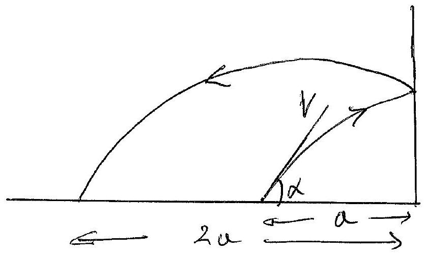

Horjoints componers: $V _ { \text {before } } = V _ { \text {coss } }$
$V _ { \text {oper } } = e V _ { \text {bigure } } = e V _ { \cos \alpha }$
So, distance $a = t _ { 1 } , V \cos \alpha$ (time of filfet to right, $t$ )) and $2 a = t _ { 2 } \cdot e V \omega x \left( . \cdots \cdots \right.$, to left, $\left. t _ { 2 } \right)$
The Vertival velocity $\frac { t _ { 2 } = \frac { 2 } { e } \cdot t _ { 1 } } { u \text { Ina fiested by the collision. } }$
So, total time in fhylt is $2 \times \frac { V _ { \text {vertical } } } { g }$

$$
\begin{align*}
& \text { i.e. } \quad t _ { 1 } + t _ { 2 } = \frac { 2 V \sin \alpha } { g } \\
& \therefore \quad 2 \frac { V \sin \alpha } { g } = \frac { a } { V \cos \alpha } + \frac { 2 } { e } \cdot \frac { a } { V \cos \alpha } \\
& \frac { 2 V ^ { 2 } \sin \alpha } { g } \cdot \cos \alpha = \left( \frac { 2 } { e } + 1 \right) a  \tag{6}\\
& V ^ { 2 } \sin 2 \alpha = \left( \frac { 2 } { e } + 1 \right) g \cdot a \\
& V ^ { 2 } \sin 2 \alpha = 4 g a
\end{align*}
$$

Opher ideas: $V V \sin \alpha = \frac { 1 } { 2 } g t \quad t =$ time filfy to (we effect of well)
H. $\quad V \cos \alpha \cdot t _ { 1 } ^ { 2 } = a$
and $\frac { 2 } { 3 } V \cos \alpha \cdot t 2 = 2 a$
trossing $t = t _ { 1 } + t _ { 2 } = \frac { 2 a \cdot 3 } { 2 \sqrt { \cos \alpha } } + \frac { a } { \sqrt { \cos \alpha } } = \frac { 4 a } { \sqrt { \cos \alpha } }$

(e)

Weight of heliegree, $W = 9800 \mathrm {~N}$
Required for tle multa cultur Force (hitt) = rate of change of momentern. a raternat or a racynisall
formula vertion formula vertion.

$$
\frac { \Delta p } { \Delta t } = \frac { \Delta ( m V ) } { \Delta t } = V \frac { \Delta m } { \Delta t }
$$

$$
\begin{aligned}
m & = \rho V \\
\frac { \Delta \rho } { \Delta t } & = V \rho \frac { \Delta V } { \Delta t } \\
& = V _ { \rho } ^ { 2 } A \\
W & = V ^ { 2 } \rho A \\
V ^ { 2 } & = \frac { W } { \rho A } = \frac { 9800 } { 1.2 \times 10 ^ { 3 } \pi \times 3 ^ { 2 } } \\
& = 288 \\
V & = 17 \mathrm {~ms} ^ { - 1 }
\end{aligned}
$$

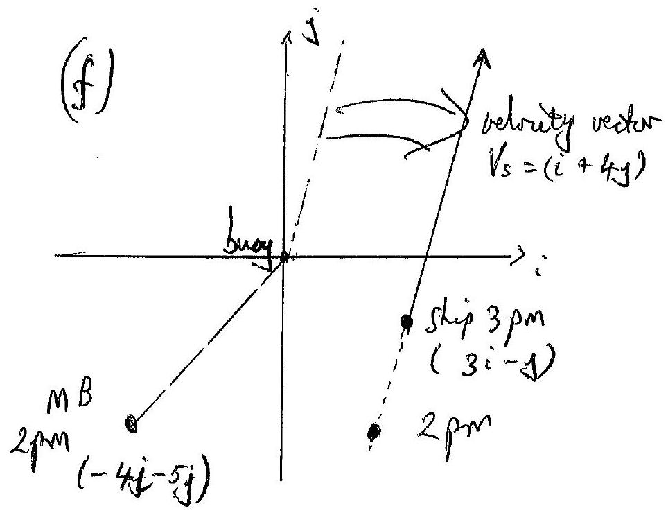

Diágran
(1) Position of ship at 2pm is vector pointional span - 1hour x $V _ { 3 }$

$$
\begin{aligned}
& = 3 i - y - 1 ( i + 4 y ) \\
& = 2 i - 51
\end{aligned}
$$

(ii)

Displacements:
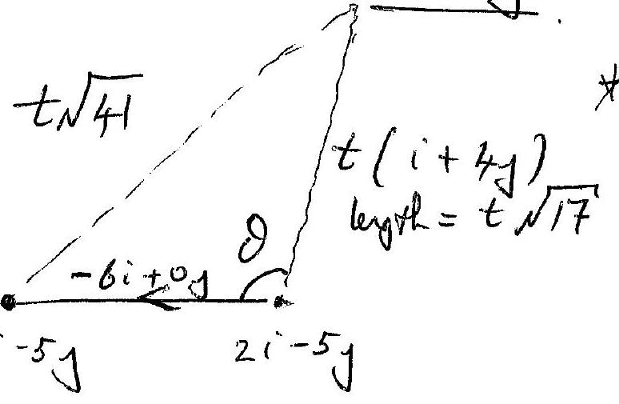
*(V)-2 mark for dear
Using the vince vale, $t ^ { 2 } 41 = 36 + t ^ { 2 } , 17 - 2 t \sqrt { 17 } \cdot \sqrt { 36 } \cdot \cos \theta$
and

$$
\begin{aligned}
\cos \theta = \frac { a \cdot b } { | a | | b | } & = \frac { \left( 8 i + 0 _ { 1 } \right) } { \sqrt { 36 } } \cdot t \cdot t \cdot \frac { ( i + 4 j ) } { \sqrt { 17 } } \\
& = \frac { - 6 t } { \sqrt { 36 } \cdot t } \sqrt { 17 } \\
& = - \frac { 1 } { \sqrt { 17 } }
\end{aligned}
$$

$$
\therefore \quad \begin{aligned}
& 41 t ^ { 2 } = 36 + 17 t ^ { 2 } + 2 t \sqrt { 17 } \cdot \sqrt { 36 } \cdot \frac { 1 } { \sqrt { 17 } } \\
& 24 t ^ { 2 } = 36 + 2 \times 6 t
\end{aligned}
$$

$$
\begin{gathered}
2 t ^ { 2 } - t - 3 = 0 \\
t = \frac { 1 \pm \sqrt { 1 + 24 } } { 4 } = \frac { 1 } { 4 } \pm \frac { 5 } { 4 } \Rightarrow t = 1 \cdot 5 h \\
\text { i.e. inverse timo at 3:30pice }
\end{gathered}
$$

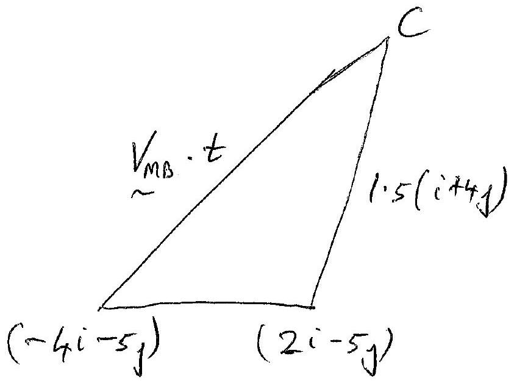
point $c$ in at: $2 i - 5 j + 1.5 ( i + 4 j )$ i.e. $( 3.5 i + 1 )$
So that $V _ { \text {MB. } } \times 1.5 = ( 3.5 i + \jmath ) - ( - 4 i - 5 j )$

$$
\begin{aligned}
V _ { \text {MB } } \times 1.5 & = 7.5 i + 6 \mathrm { j } \\
V _ { \text {MB } } & = 5 i + 4 \mathrm { j }
\end{aligned}
$$

check. $\left| V _ { m p } \right| = \sqrt { 5 ^ { 2 } + 4 ^ { 2 } }$ (7)
$= \sqrt { 41 }$ as given in question.
or $\quad V _ { m B } = a i + b _ { j }$.
Ship and boat and up at the same point after time $t$. ∴ Add the respective velocities to the 2 pm start pouts.

Hence $\quad - 4 i - 5 j + t ( a i + b j ) = 2 i - 5 j + t ( i + 4 j )$ (MB)
Giving

$$
t ( a - 1 ) i + t ( b - 4 ) y = 6 i + 0 j
$$

equating for $i : \quad t ( a - 1 ) = 6$

$$
t ( a - 1 ) = 6
$$

"" …
". " j:

$$
t ( b - 4 ) = 0
$$

$$
\Rightarrow b = 4
$$

but us forw (gion) $\left| V _ { m s } \right| = \sqrt { 41 }$
So $a ^ { 2 } + b ^ { 2 } = 41$ with $b = 4$.
$a = \pm 5$. But tippointive of $a = + 5$
$V _ { \text {MB } } = 5$ it 4 J , will $t = 1.5 \mathrm {~h}$

(g) $$
\rightarrow 60 ^ { \circ } \mathrm { C } \rightarrow 11 , \rightarrow 38 ^ { \circ } \mathrm { C }
$$
For water:
$$
\begin{aligned}
\Delta Q _ { w } & = m c \Delta T \\
\Delta Q _ { w } & = I \times 4200 \times ( 60 - 38 ) \\
& = 92400 \mathrm {~J}
\end{aligned}
$$

$\xrightarrow { \text { Hean } } \left( 100 ^ { \circ } \mathrm { C } \right) \xrightarrow [ \text { wh } ] { \text { t } 100 ^ { \circ } \mathrm { C } } 82 ^ { \circ } \mathrm { C } \longrightarrow$
For condening steam,

$$
\begin{aligned}
\Delta Q & = m L + m c \Delta T \\
& = m ( L + c \Delta T )
\end{aligned}
$$

Require, $92400 = m \left( 2.26 \times 10 ^ { 6 } + 4200 ( 100 + 82 ) \right)$

- If Mc $\Delta t$ term left out to give 40.9 g then love 1 most.

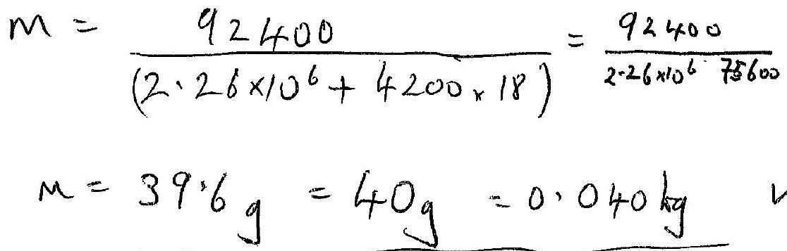

(h) $$
\left[ \begin{array} { c c }
\varepsilon & r \\
R & \square
\end{array} \right] \quad \varepsilon = I r + I R
$$
For $R = \frac { 10 } { 7 } \Omega , \varepsilon = 1.0 r + \frac { 10 } { 7 }$

$R _ { 11 } : \frac { 1 } { R _ { 11 } } = \frac { 1 } { 5 } + \frac { 1 } { 2 }$
$$
R _ { 11 } = \frac { 10 } { 7 } \Omega
$$
$$
\text { Selforating, } \begin{aligned}
& O = - 0.2 r + 1.6 - 10 \\
& F = \frac { 6 } { 7 } r = 0.86 \Omega \\
& \varepsilon = \frac { 16 } { 7 } V = 2.3 \mathrm {~V}
\end{aligned}
$$

$( i )$ $\Sigma$ Shorted.

$$
\begin{aligned}
I = \varepsilon & \Rightarrow 3 \\
\text { so } & = \frac { 6 } { r } \\
& = 2 \Omega
\end{aligned}
$$

Maximum power divisated enotenally in $R$, is when $R = r$
$\frac { d } { d R } P _ { R } = \frac { d } { d R } \frac { c ^ { 2 } R } { ( R + r ) ^ { 2 } } = 0$ or differentiate to dea this remart.
Then $\Rightarrow R = r$

$$
\begin{aligned}
I = \frac { \varepsilon } { r + R } & = \frac { 6 } { 4 } = 1.5 \mathrm {~A} \\
\text { Power } & = I ^ { 2 } R \\
& = 1.5 ^ { 2 } \times 2 \\
& = 4.5 \mathrm {~W}
\end{aligned}
$$

Energy disignated extenally is in launite is $60 \times 4,5$ $= 270 \mathrm {~J}$
(j)

$$
\begin{aligned}
f = \frac { c } { \lambda } = \frac { 3 \times 10 ^ { 8 } } { 639 \times 10 ^ { - 9 } } & = 469.5 \times 10 ^ { 12 } \mathrm { Mz } \\
E _ { \text {photon } } = h _ { f } & = 6.63 \times 10 ^ { - 34 } \times 469.5 \times 10 ^ { 12 } \\
& = 3.11 \times 10 ^ { - 19 } \mathrm {~J}
\end{aligned}
$$

$$
\begin{aligned}
\text { Nitutom per narousend } & = \frac { \text { power × time } } { \text { Ephton } } \\
& = \frac { 0.5 \times 10 ^ { - 3 } \times 10 ^ { - 9 } } { 3.11 \times 10 ^ { - 19 } } \\
& = 1.6 \times 10 ^ { 6 }
\end{aligned}
$$

(k)

$$
k T
$$

$$
\text { NII. } \quad \begin{aligned}
& T _ { t p } + m g = \frac { m V _ { t p } ^ { 2 } } { \Gamma } \left( r _ { u } ^ { \prime } w r _ { t r } ^ { \prime } \right) \\
& T _ { t y } = 0 \Rightarrow m _ { g } = \frac { m V _ { t y } ^ { 2 } } { \Gamma } \\
& V _ { t p } = \sqrt { r g }
\end{aligned}
$$

$$
K _ { i } T
$$

$$
T _ { \text {bate } } - m _ { g } = \frac { m V _ { \text {when } } ^ { 2 } } { \Gamma }
$$

Ereopy Cons. $\frac { 1 } { 2 } m V _ { \text {top } } ^ { 2 } + m g 2 r = \frac { 1 } { 2 } m V _ { \text {bakm } } ^ { 2 }$

$$
\begin{aligned}
V _ { \text {bothm } } ^ { 2 } & = V _ { \text {dop } } ^ { 2 } + 4 g r \\
& = 5 y + 4 r g \\
& = 5 r g
\end{aligned}
$$

$$
\begin{aligned}
\therefore T _ { \text {buttom } } & = m \cdot \frac { 5 r g } { r _ { R i } u } + m _ { q } \\
& = 6 \mathrm { mg } \quad \text { give that }
\end{aligned}
$$

give this find mant.
(l)

$$
\begin{aligned}
& x = A \sin ( \omega t ) \\
& V = A \omega \cos ( \omega t ) \\
& a = - A \omega ^ { 2 }
\end{aligned}
$$

Sund Cour contact when the minisman value of the acceleration is equat to $g$.

$$
\begin{aligned}
\therefore \quad g & = A w ^ { 2 } \\
f _ { \text {min } } ^ { 2 } & = \frac { g } { 4 \pi ^ { 2 } } A \\
f _ { \text {min } } ^ { 2 } & = \frac { 9 \cdot 81 } { 4 \pi ^ { 2 } \times 2 \times 10 ^ { - 4 } } ,
\end{aligned}
$$

$$
f _ { \min } = 35 ( .2 ) \mathrm { Hz } .
$$

(m)
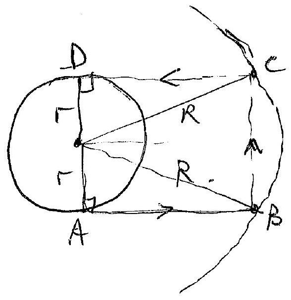
diagram
tangatial puts.

$$
\begin{aligned}
R & = 3.59110 ^ { 4 } + 6370 \mathrm { fom } \\
& = 4.227104 \mathrm {~km}
\end{aligned}
$$

$$
\begin{aligned}
A B C D = l = & 2 \sqrt { R ^ { 2 } - r ^ { 2 } } + 2 r \\
& ( A B + \Delta C ) \quad ( B C )
\end{aligned}
$$

$$
l = 2 \sqrt { 4.28 ^ { 2 } \times 10 ^ { 8 } - 6370 ^ { 2 } } + 2 \times 6370 \mathrm {~km}
$$

It $R$ talen as $3.52 \times 4 r ^ { 4 } \times 4 = 2 \times 41.8 \times 10 ^ { 3 } + 2 \times 6370 \mathrm {~km}$ $= 9 : 63 \times 10 \mathrm {~km}$

$$
\begin{aligned}
l & = 2 \sqrt { 3.59 ^ { 2 } \times 10 ^ { 8 } - 63 } \\
& = 8.3410 ^ { 4 } \mathrm {~km} \\
& = 8.3 \times 10 ^ { 7 } \mathrm {~m} .
\end{aligned}
$$

widt $\Delta t = 0.28 \mathrm {~s}$

$$
\Delta t = \frac { l } { c } = \frac { 9 \cdot 63 \times 10 ^ { 7 } } { 3 \times 10 ^ { 8 } }
$$

Maxu, 5 Mods total.

$$
= 0.32 ( 1 ) \mathrm { s }
$$

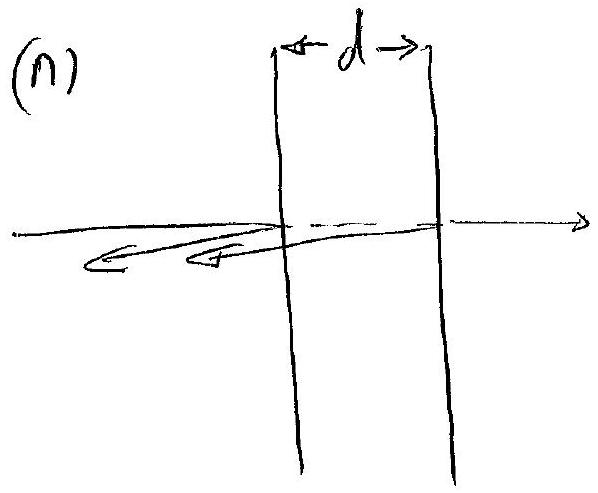

For constructive interference, path difference $= m \lambda$ (M.wityer) There will be a phase tifference of at each reflecting hypace, which means that there is no phase difference aitrachaed averall.

$$
\therefore \quad 2 d = m \lambda
$$

$\lambda$ is decreased in the melium by a fator $\frac { 1 } { n }$.
Hence $\lambda = \frac { n 2 d } { m }$

$$
\lambda = \frac { n 2 d } { m }
$$

For $m = 1 , \quad \lambda = \frac { 1.52 \times 2 \times 0.42 \times 10 ^ { - 6 } } { 1 }$

$$
= 1.28 \times 10 ^ { - 6 } \mathrm {~m} = 1280 \mathrm {~nm} /
$$

IR.

$$
\begin{array} { r }
\text { For } m = 2 , \quad \lambda = 638 \mathrm {~nm} . \\
\text { Visito }
\end{array}
$$

(0)
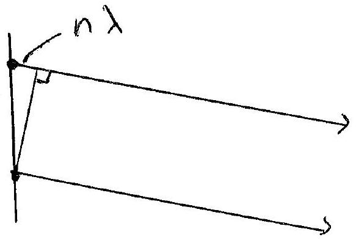

A puth difference change of $\lambda$ gives one fringe shifte. $25 \lambda \cdot 25$ fringe shift
In the 5 cm tube, there are $N \lambda$ length fo wave. In the racuum in the take the we $( N - 25 ) \lambda$ beyth/ware. as the woullegot is flaster a air, Tonger is a vacuries, (padplight is sligkely less in air).
Optical path is $( N - 25 ) \lambda _ { \text {are } } = N \lambda _ { \text {acir } } = N \frac { \lambda _ { \text {vac } } } { n }$

$$
\therefore \quad \begin{aligned}
& N - 25 = \frac { N } { n } \\
& n = \frac { N } { N - 25 }
\end{aligned}
$$

and $\quad N = \frac { 5 \times 10 ^ { - 2 } \mathrm {~m} } { 600 \times 10 ^ { - 9 } \mathrm {~m} } = 8.333 \times 10 ^ { 4 }$
which gives $n = 1.0003 \quad \left( = 1 + 3 \times 10 ^ { - 4 } \right)$
Or

$$
\begin{aligned}
25 \text { pringer } & = \frac { 5 \mathrm {~cm} } { \lambda / n } - \frac { 5 \mathrm {~cm} } { \lambda } \\
& = \frac { 5 \times 10 ^ { - 2 } } { 600 \times 10 ^ { - 4 } } ( n - 1 ) \\
3000 \times 10 ^ { - 7 } & = n - 1 \\
n & = 1.0003 .
\end{aligned}
$$

(p)

$$
l = 10 \mathrm {~m} \quad \begin{aligned}
& \text { air } \\
& \text { water }
\end{aligned}
$$

$$
A = 5.0 \mathrm {~cm} ^ { 2 }
$$

Young: $E = \frac { F } { A } \cdot \frac { l } { \Delta l } \Rightarrow \Delta l = \frac { F l } { E \cdot A }$
In air,

$$
\Delta l = \frac { m g \cdot l } { E \cdot A }
$$

Correctespeatun or values (seeblas)

In woter, uptraint is given by Pw. Vsub. g (weight \& water diflaued).

$$
\begin{aligned}
\rho _ { w } & = \text { denity } 1 \text { couter } \\
\rho _ { \text {sub } } & = \text { deniity factureyed wreck. }
\end{aligned}
$$

$$
U _ { \text {phrent } } = \rho \omega \cdot \frac { M _ { \text {sub } } } { \rho _ { \text {sub } } } \cdot g
$$

Since $\Delta l \times$ tension.
the change is ratering \& shange in lood $\Delta e$

So

$$
\begin{aligned}
\Delta e & = \left( \rho _ { \omega } , m _ { \text {sub. } } \cdot g \right) \cdot \frac { l } { \rho _ { w b } } \cdot A \\
& = \frac { 1000 } { 8000 } \times 1 \times 10 ^ { 4 } \times 9.81 \times \frac { 10 } { 5 \times 10 ^ { 10 } \times 5 \times 10 ^ { - 4 } } \\
& = 4.9 \times 10 ^ { - 3 } \mathrm {~m}
\end{aligned}
$$

Or

$$
\begin{aligned}
\text { bad in air } & = 9.81 \times 10 ^ { 4 } \mathrm {~N} \\
\text { expletion is air } & = 39.24 \times 10 ^ { - 3 } \mathrm { M } \\
\text { externion is water } & = \text { experimi iain -upthant. } \\
& = 34.3 \times 10 ^ { - 3 } \mathrm {~m} \\
\text { difference } & = 4.9 \times 10 ^ { - 3 } \mathrm {~m}
\end{aligned}
$$

$$
\begin{aligned}
\text { Volume I wrect } & = 1.25 \mathrm {~m} ^ { 3 } \\
\text { Uphere } & = 12,250 \mathrm {~N} \\
\text { Wreght } & = 98,000 \mathrm {~N}
\end{aligned}
$$

(q) (i)
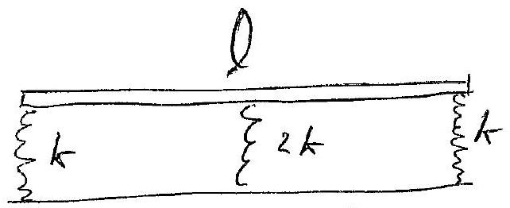

- $) ^ { \text {"compressive force } } = k x ^ { \prime \prime }$

Symmetric arringenest, wheel been
Total load,

$$
\begin{array} { r l r l }
\text { So- } T _ { m g } & = k x + 2 k \cdot x + k x & \\
& = 4 k x & & \\
\text { Thuse, } & x & = \frac { m g } { 4 k } . & F _ { \text {upl } } = F _ { \text {rgl } } = \frac { m g } { 4 } \\
& & F _ { \text {censer } } = \frac { m g } { 2 }
\end{array}
$$

(ii)
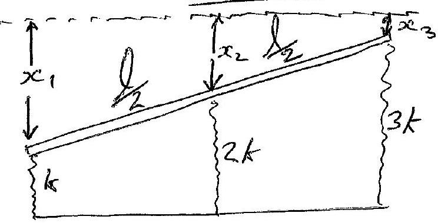

Total Coul, $m _ { y } = k x _ { 1 } + 2 k x _ { 2 } + 3 k x _ { 3 }$

Relate $x _ { 1 } , x _ { 2 } , x _ { 3 }$.
Bloades in hisa : $x _ { 1 } - x _ { 3 } = 2 \left( x _ { 2 } - x _ { 3 } \right)$

$$
\begin{equation*}
2 x _ { 2 } = x _ { 1 } + x _ { 3 } \tag{2}
\end{equation*}
$$

Take meme⿰ts alont actre:

$$
( + ) ^ { 6 }
$$

$$
\begin{gathered}
\frac { m } { 2 } g \cdot \frac { l } { 4 } - \frac { l } { 2 } \cdot k x _ { 1 } - \frac { m } { 2 } \cdot g \frac { l } { 4 } + \frac { l } { 2 } \cdot 3 k \cdot x _ { 3 } = 0 \\
\text { so, } x _ { 1 } = 3 x _ { 3 } \text { (3) }
\end{gathered}
$$

Eliministing $x _ { 1 }$ in (2) and (3),
fo $m g = k \cdot 3 x _ { 3 } + 2 k \cdot 2 x _ { 3 } + 3 k x _ { 3 }$
Here younsed values of $x _ { 1 } , x _ { 2 } , x _ { 3 }$ not $F _ { 1 } F _ { 2 } , F _ { 3 }$ since $F _ { 1 } = F _ { 2 } = F _ { 3 }$.

$$
\left. \begin{array} { l }
x _ { 3 } = \frac { m g } { 10 k } \\
x _ { 2 } = \frac { 2 } { 10 } \cdot \frac { m g } { k } \\
x _ { 1 } = \frac { 3 } { 10 } \cdot \frac { m g } { k }
\end{array} \right\} \begin{aligned}
& F _ { 3 } = \frac { 3 } { 10 } m g \\
& F _ { F _ { 2 } } = \frac { 4 } { 10 } m g \\
& F _ { 1 } = \frac { 3 } { 10 } m g  \tag{8}\\
& \left( F _ { 1 } + F _ { 2 } + F _ { 3 } = m g \right) .
\end{aligned}
$$

(q) continued.

Equations Neeled are
equ. (1) tokil lood

(2) Bean is hior
(3) momithobut atte.

or

- Momerks about Lited: $\frac { m g } { 2 } = k x _ { 2 } + k x _ { 1 }$
- Morrants alout $R H$ end $\frac { m _ { g } } { 2 } = 3 k x _ { 3 } + k x _ { 2 }$ which will give $x _ { 1 } = 3 x _ { 3 }$
- and the Beam is hiear (2).

or c Momatcolone uneerd

- Maments atoul cutre
- Brana luear

or

- tutal bod
- Monerate about one ed
- Beem is hrear

The put that the bean is lineve)s repined in all derivation.

(r)
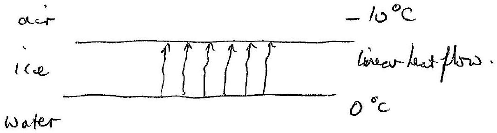

$$
\begin{equation*}
P = \frac { \Delta Q } { \Delta t } = + \lambda A \frac { \left( T _ { H } - T _ { c } \right) } { x } \tag{1}
\end{equation*}
$$

Now,

$$
\begin{align*}
P & = \frac { m } { t } h \\
& = \rho A \frac { \Delta x } { \Delta t } \cdot L \tag{2}
\end{align*}
$$

Equating power flow given by (1) and (2)

$$
\rho / C \frac { \Delta x } { \Delta t } = \lambda \not \subset \frac { \left( \Delta T _ { A } - T _ { c } \right) } { x \theta _ { 2 } a }
$$

$\Delta t = 1 / \frac { 1 } { x \partial z }$ a finite thichess.
$\rho L x \Delta x = \lambda \left( T _ { H } - T _ { c } \right) \Delta t$.
$\lim _ { \text {of } } f ( x ) 0 , \Delta t \rightarrow 0$.

$$
\begin{align*}
& L \rho \int _ { x _ { 1 } } ^ { x _ { 2 } } d x = \lambda \left( T _ { H } - T _ { c } \right) \int _ { t _ { 1 } } ^ { t _ { 2 } } d t \\
& L \rho _ { \frac { 1 } { 2 } } \left( x _ { 2 } ^ { 2 } - x _ { 1 } ^ { 2 } \right) = \lambda \left( T _ { H } - T _ { c } \right) \left( t _ { 2 } - t _ { 1 } \right) \\
& t _ { 2 } - t _ { 1 } = \frac { L \rho } { 2 \lambda } \cdot \frac { \left( 2 c _ { 2 } ^ { 2 } - x _ { 1 } ^ { 2 } \right) } { \left( T _ { 17 } - T _ { c } \right) } \\
& = \frac { 330 \times 10 ^ { 3 } \times 900 } { 2 \times 2 \cdot 1 } \left( \frac { \left( 10 \times 10 ^ { - 2 } \right) ^ { 2 } - \left( 5 \times 10 ^ { - 1 } \right. } { ( 0 - 1 - 10 ) } \right. \\
& = \frac { 330 \times 10 ^ { 3 } \times 900 } { 4 \cdot 2 \times 10 } \left( 75 \times 10 ^ { - 4 } \right) \\
& = 53.0 \times 10 ^ { 3 } \mathrm {~s} \\
& = 884 \text { minutes } \\
& = 14.7 \text { hours. } \tag{7}
\end{align*}
$$

Qu2 (a) $f = 50 \mathrm { H } , I _ { \text {Rms } } = 10 : 0 \mathrm {~A}$, daneter $= 1 \mathrm {~mm}$ precelectrons $\mathrm { cm } ^ { - 3 }$ is $9 \cdot \mathrm { Orru } ^ { 22 }$

$$
\begin{aligned}
I _ { \text {max } } & = n A v e \\
10 \sqrt { 2 } & = 9 \times 10 ^ { 22 } \times 10 ^ { + 6 } \times \pi \left( \frac { 10 ^ { - 3 } } { 2 } \right) ^ { 2 } \times v \times 1.6 \times 10 ^ { - 19 } \\
v _ { \text {max } } & = \frac { 10 \sqrt { 2 } } { 9 \times 10 ^ { 28 } \pi 25 \times 10 ^ { - 8 } \times 1.6 \times 10 ^ { - 19 } } \\
v _ { \text {max } } & = 1.25 \times 10 ^ { - 3 } \mathrm {~ms} ^ { - 1 }
\end{aligned}
$$

$$
\text { AC } \begin{align*}
v & = v _ { 0 } \cdot \sin ( \omega t ) \quad \text { or } \cos ( \omega t + \varphi ) , \text { etc. } \\
& = A \omega \sin ( \omega t ) \\
v _ { \text {max } } & = A \omega \\
A & = \frac { v _ { \text {maxe } } } { 2 \pi f } \quad \omega = 2 \pi f . \\
& = \frac { 1.25 \times 10 ^ { - 3 } } { 2 \pi 50 } \\
A & = 3.98 \times 10 ^ { - 6 } \mathrm {~m} \tag{6}
\end{align*}
$$

$$
\text { (b) } \quad R = p \frac { l } { A } , \quad R ^ { \prime } = p \frac { l ^ { \prime } } { A ^ { \prime } }
$$

With $V _ { \text {contant } } \Rightarrow A ^ { \prime } l ^ { \prime } = A l$.

$$
\begin{aligned}
\text { Require } \frac { d R } { R } = \frac { R ^ { \prime } - R } { R } & = \left( \rho \frac { l ^ { \prime } } { A ^ { \prime } } - \rho \frac { l } { A } \right) / \rho \frac { l } { A } \\
& = \frac { l ^ { \prime } } { l ^ { \prime } } \frac { A } { A ^ { \prime } } - 1 \\
& = \frac { l ^ { \prime } } { l } \cdot \left( \frac { A } { A l / l ^ { \prime } } \right) - 1 = \frac { l ^ { \prime 2 } } { l ^ { 2 } } - 1
\end{aligned}
$$

But $l ^ { \prime } = l + \varepsilon , r _ { 0 } \frac { \delta R } { R } = \frac { \left( l ^ { 2 } + 2 \varepsilon l + \varepsilon ^ { 2 } \right) } { l ^ { 2 } } - 1$

$\frac { \delta R } { R } = \frac { 2 \varepsilon } { l } + \frac { \varepsilon ^ { 2 } } { l ^ { 2 } } \quad$ negleet 2nd term i $\frac { \varepsilon ^ { 2 } } { l ^ { 2 } }$
So $\frac { S R } { R } \approx 2 \frac { \varepsilon } { l }$
Herce $\delta R = 2 \times 0.001 \times 100.0$

$$
= 0.2 \Omega
$$

and $R ^ { \prime } = 100.2 \Omega$
Or for excomple,

$$
R = \frac { \rho l } { A }
$$

$$
\delta R = \rho \frac { \delta l } { A } - \rho l \frac { \delta A } { A ^ { 2 } }
$$

$$
\begin{aligned}
& V = A l \\
& \delta V = 0 = A S l + \delta A l \\
& \text { So that } \delta A = - A \frac { J l } { l }
\end{aligned}
$$

Hence $\delta R : \rho \frac { \delta l } { A } + \rho \frac { l } { A ^ { 2 } } \cdot \left( A \frac { \delta l } { l } \right)$

$$
\begin{aligned}
& = \rho \frac { \delta _ { l } } { A } + \rho \frac { \delta l } { A } \\
& = 2 \rho \frac { \delta l } { A } \\
& = 2 \cdot R \cdot \frac { \delta l } { l } \\
& = 2 R \cdot \varepsilon / l \\
& = 0.2 \Omega
\end{aligned}
$$

$$
R ^ { \prime } = 100 \cdot 2 \Omega
$$

(c) 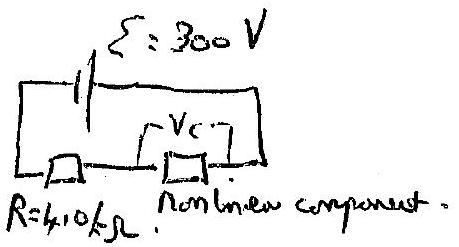
Digéfram or indicature of the correct arrint uned
$$
\begin{aligned}
& \varepsilon = I R + V _ { e } \\
& \quad \text { and } F = A V _ { c } + B V _ { c } ^ { 2 } \\
& \varepsilon = R A V _ { c } + R B V _ { c } ^ { 2 } + V _ { c } \\
& \varepsilon = ( R A + 1 ) V _ { c } + R B V _ { c } ^ { 2 }
\end{aligned}
$$
quadratic is $V _ { c }$ with other terms given
$$
\begin{aligned}
R B V _ { c } ^ { 2 } + ( R A + 1 ) V _ { c } - \varepsilon = 0 & \\
V _ { c } & = \frac { - ( R A + 1 ) \pm \sqrt { ( R A + 1 ) ^ { 2 } + 4 R \cdot B _ { 1 } E } } { 2 R B } \\
& = \frac { - ( 0.28 + 1 ) \pm \sqrt { } \left[ 1.28 ^ { 2 } + 4.4 .0 .005 \times 300 \right] } { 2 \times 4 \times 0.005 }
\end{aligned}
$$
$( A , B$ given is $m A )$.
$$
\begin{aligned}
& = \frac { - 1.28 \pm \sqrt { 1.28 ^ { 2 } + 24 } } { 0.04 } \\
& = 94.6 \mathrm {~V} \quad ( \text { take } + \text { sign } )
\end{aligned}
$$
$$
\begin{aligned}
I & = A V _ { c } + B V _ { c } ^ { 2 } \\
& = 0.070 \times 94.6 + 0.0050 \times 94.6 ^ { 2 } \\
& = 51.4 \mathrm { MA }
\end{aligned}
$$
[acheck: $300 \mathrm {~V} - 4000 \times 51 \cdot 35 \times 10 ^ { - 12 } \mathrm {~V} = 94 \cdot 586 \mathrm {~V}$ ].
$$
E - R E I = V _ { c }
$$

part(c) can also be done diviety - terming I, abthough this then requires a calculation of $V _ { c }$ rater than obtaing in a pression.
Foom HerchtfII.

$$
V _ { c } = 300 - 4.0 \times 10 ^ { 3 } I
$$

and with $I = A V _ { c } + B V _ { c } ^ { 2 }$
We have,

$$
I = 0.07 \times 10 ^ { - 3 } \left( 300 - 4 \times 10 ^ { 3 } \mathrm {~F} \right) + 0.005 \times 10 ^ { - 3 } \left( 300 - 4 \times 10 ^ { 3 } \mathrm {~F} \right) ^ { 2 }
$$

$$
\begin{aligned}
& I = 0.021 - 0.28 I + 0.005 \times 10 ^ { - 3 } \left( 300 ^ { 2 } + 16 \times 10 ^ { 6 } I ^ { 2 } - 2.4 \times 10 ^ { 6 } I \right) \\
& I = 0.021 - 0.28 I + 0.45 + 80 I ^ { 2 } - 12 I \\
& I = 0.47 - 12.28 I + 80 I ^ { 2 }
\end{aligned}
$$

Io that $80 I ^ { 2 } - 13 \cdot 28 I + 0.47 = 0$

$$
\begin{aligned}
I & = \frac { 13.28 \pm 5.09 } { 160 } \times 1000 \mathrm {~mA} . \\
& = 114.8 \mathrm {~mA} \text { or } 51.2 \mathrm {~mA} .
\end{aligned}
$$

Max current, $F _ { \text {max } } = 300 \mathrm {~V} \approx 1000 \mathrm { MA }$

$$
\begin{aligned}
& = 7.7 \\
\therefore \quad I & = 51.2 \mathrm {~mA} \\
\text { and } \quad V _ { c } & = 95.3 \mathrm {~V} \\
I & = 51 \mathrm {~mA} \\
V _ { c } & = 95 \mathrm {~V} .
\end{aligned}
$$

some sibght rounding errow evidest.

(d)

Grapple weal y
(i)

$$
\begin{aligned}
R & = \frac { \rho l } { A } \\
& = \frac { \rho } { 2 \pi r ^ { 2 } } \cdot \delta r
\end{aligned} \quad A = 2 \pi r ^ { 2 }
$$

swords ordingsam.
[For $\delta r \ll r , \quad R = \frac { 60 \times \delta R } { 2 \pi ( 0.10 ) ^ { 2 } }$

$$
\begin{aligned}
& R = \frac { 60 \times \delta R } { 2 \pi ( 0.10 ) ^ { 2 } } \\
& R = 95 \times \delta R ( \Omega )
\end{aligned}
$$

Quemarty the approad then.
(ii) In general

$$
\begin{aligned}
R & = \frac { \rho } { 2 \pi } \int _ { r } ^ { \infty } \\
& = - \frac { \rho } { 2 \pi } \left[ \frac { 1 } { r } \right] _ { r } ^ { \infty } \\
& = \frac { \rho } { 2 \pi } \left[ \frac { 1 } { r } \right] _ { \infty } ^ { r } \\
& = \frac { \rho } { 2 \pi } \frac { 1 } { r }
\end{aligned}
$$

$$
\begin{aligned}
\therefore R & = \frac { 60 } { 2 \pi \cdot 0.1 } \\
& = \frac { 300 } { \pi } = 95.5 \\
& = 95 \Omega
\end{aligned}
$$

Qu. 3

A mark for eapt, pres, upter 9 moss - Capeliedors May colutiot in aliffeent order to this.
Once the tug fas slowed sufficienty, is thrust of 35 kN will not allow the 50 kN breads to release any more of the cable.
Negleding ong forces checto the water flowing arounderle thy and bage,
At mamerif impust, and after, force to accelerate ste
A. Buge is 50 kN

$$
\begin{aligned}
& i = \frac { 30 \times 10 ^ { 3 } } { 6300 \times 10 ^ { 3 } } \\
& a _ { b } = \frac { 1 } { 126 } \mathrm {~ms} ^ { - 2 }
\end{aligned}
$$

Force on the try forwards is $( 35 - 30 ) \times 10 ^ { 3 } \mathrm {~N}$

$$
= - 15 \times 10 ^ { 3 } \mathrm {~N}
$$

acceleration 1 try, $a _ { t } = \frac { - 15 \times 10 ^ { 3 } } { 450 \times 10 ^ { 3 } }$

$$
= \frac { 1 } { 30 } \mathrm {~ms} ^ { 2 }
$$

These accelerations are contant for a time $t$.
: uroy " $V = u + a t$ "

$$
V _ { \text {barge } } = 0 + \frac { 1 } { 126 } t
$$

and

$$
V _ { \text {try } } = 2.5 - \frac { 1 } { 30 } \cdot t
$$

When $V _ { \text {try } } = V _ { \text {saye } }$ then the cable is no longer dyping.

$$
\begin{aligned}
\frac { 1 } { 126 } t & = 2.5 - \frac { 1 } { 30 } t \\
t & = 60.6 \mathrm {~s}
\end{aligned}
$$

Then $V _ { \text {coment } } = \frac { 60.6 } { 126 } = 0.48 \mathrm {~ms} ^ { - 1 }$
Consequently, $S = U t + \frac { 1 } { 2 } a t ^ { 2 } \Rightarrow S = S _ { \text {tyg } } - S _ { \text {ange } }$

$$
\begin{aligned}
S & = s _ { \text {tuy } } - s _ { \text {burge } } \\
& = 2.5 \times 60.6 - \\
& = 75.7 \mathrm {~m} \\
& = 76 \mathrm {~m}
\end{aligned}
$$

(b)
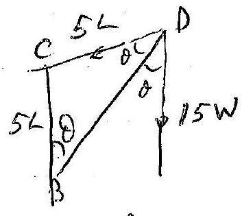

Various methods - 2 moth for merfood I rowk for renot
Since $C B$ is vertisul, and the cable is vertical, the angle CBD is equal
(Let $\angle C D B = \theta$ ) to the angle botween the cable ard B.D. to the angle between the cable and B.D.
Alw, $C B = C D$, is $\angle C D B = \angle C B D$ If BD beinests the argle at the top.
✓ Working
∴ Since $B D$ ar provide No torgue,

$$
\begin{aligned}
15 \mathrm {~W} \cos \theta & = T _ { C D } \cdot \cos \theta \\
T _ { C D } & = 15 \mathrm {~W}
\end{aligned}
$$

result.
Or unig converse, $( 5 ) ^ { 2 } = ( 84 ) ^ { 2 } + ( 54 ) ^ { 2 } - 2.54 .84$.cosd

$$
\begin{aligned}
64 & = 80 \cos \theta \\
\cos \theta & = 0.8
\end{aligned}
$$

Take momass about $C$ $90 = T _ { B D } \cdot 5 L \cdot \sin \theta - 15 W \cdot 5 L \sin 2 \theta$
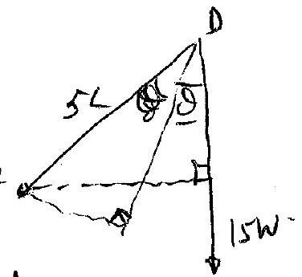
i.e. $T _ { \text {BD } } .5$ K. H. $\theta = 15 \mathrm {~W} .5 \mathrm {~K} .2$ cond
✓ Warking

$$
\begin{aligned}
T _ { B D } & = 15 \mathrm {~W} \times 2 \times 0.8 \\
& = 24 \mathrm {~W}
\end{aligned}
$$

result.
Resolve fores on D vertically:

$$
\begin{aligned}
15 \mathrm {~W} & = 24 \mathrm {~W} \cdot \cos \theta - T _ { C D } \times \cos 2 \theta \\
15 \mathrm {~W} & = 24 \mathrm {~W} \times 0.8 - T _ { C D } \times 0.28 \\
T _ { C D } & = 15 \mathrm {~W}
\end{aligned}
$$

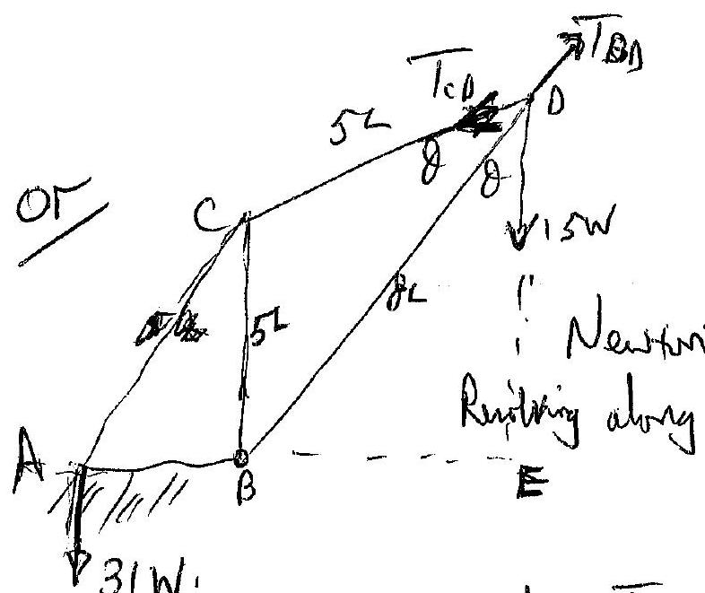
and

$$
\begin{aligned}
T _ { B D } & = T _ { C D } \cos \theta + 15 \mathrm {~W} \cos \theta \\
& = 2 \times 15 \mathrm {~W} \times 0.8 \\
& = 24 \mathrm {~W} .
\end{aligned}
$$

(iii) Distance AB.

Take moments about $B$.

$$
\begin{aligned}
31 W \times A B & = 15 W \times B E \\
31 W \times A B & = 15 W \times 8 L \sin \theta \\
A B & = \frac { 15 } { 31 } \times 8 L \times 0.6 \\
A B & = 2.3 L
\end{aligned}
$$

$$
\begin{aligned}
& \cos \theta = 0.8 \\
& \cos \theta = 0.6 .
\end{aligned}
$$

(8)

00
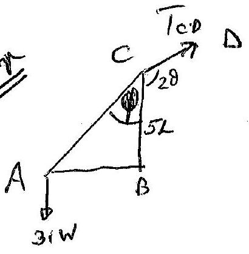

Resolving horgantal forces on $C$.
$T _ { C D } \cdot \cos \left( \phi _ { 0 } - 2 \theta \right) = T _ { C A } \sin \phi$
Resolving verticlly at $A$.

$$
31 \mathrm {~W} ^ { 2 } = T _ { C A } \cos \phi
$$

Elimenating Tca:

$$
\frac { 31 w } { \cos \varphi } \cdot \sin \phi = 15 w \cos ( 90 - 20 )
$$

i.e. $\tan \phi = \frac { 15 } { 3 w } \cdot \sin 2 \theta$

$$
\cos ( 90 - 2 \theta ) = \sin 2 \theta
$$

So, $\tan \phi = \frac { 15 } { 31 } \times 2 \sin \theta \cdot \cos \theta = \frac { 15 } { 31 } \cdot 2 \times 0.6 \times 0.8 = 0.4645$ and $\tan \phi = \frac { A B } { 5 L } \Rightarrow A B = 5 L \tan \phi = 2.32 L$

(24)

(c) 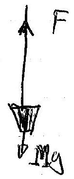
$\left. \begin{array} { c } t _ { t } = \text { timplesend or } \\ \text { bat out } \end{array} \right\}$
$$
\left[ \begin{array} { l }
M = \text { Marig theret } \\
M _ { 0 } = \text { citioul mains ind }
\end{array} \right]
$$
tool massiful is, $M = M + m _ { 0 } \left( 1 - \frac { t } { t _ { f } } \right)$
Newtnil $M a = F - M g$
(up wade)
$$
\begin{aligned}
& a = \frac { F } { M } - g \\
& \int _ { 0 } ^ { t } a d t = \int _ { 0 } ^ { V } d V = V \\
& V = \int _ { 0 } ^ { t _ { f } } \left( \frac { F } { m + m _ { 0 } \left( 1 - \frac { t } { t _ { f } } \right) } - g \right) d t \\
& V = \int _ { 0 } ^ { t _ { f } } \frac { F } { \left( m + m _ { 0 } - \frac { m _ { 0 } } { t _ { f } } \right) } - \int _ { 0 } ^ { t _ { f } } g d t \\
& \left. V = - \frac { t _ { f } } { t _ { f } } F \ln \left( m + m _ { 0 } - \frac { m _ { 0 } } { t _ { f } } + t _ { f } \right) - \ln \left( m + m _ { 0 } \right) \right] - g t _ { f } \\
& V = - \frac { t _ { f } } { m _ { 0 } } \cdot F \ln \left( \frac { M } { m + m _ { 0 } } \right) - g t _ { f } \quad \checkmark \\
& V = \frac { t _ { f } } { m _ { 0 } } \cdot F \ln \left( 1 + \frac { m _ { 0 } } { m } \right) - g , t _ { f } . \quad V
\end{aligned}
$$

Q4. a)

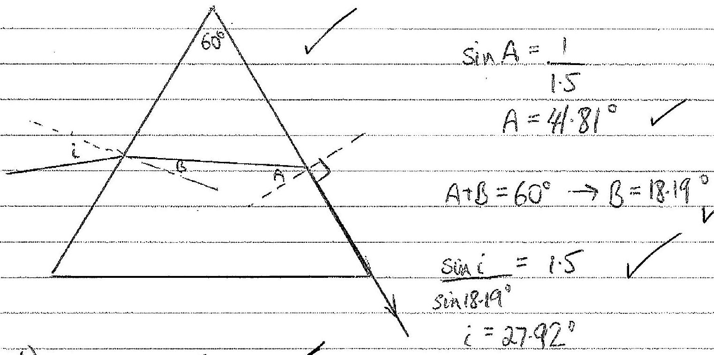
(Gratex) angle, $i = 28 ^ { \circ }$

(5)
b)

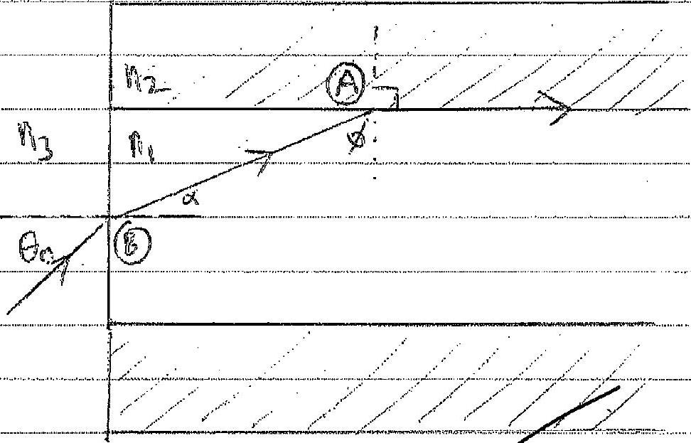
Suctable agles marked on a degopan

$$
\text { At (A) } \begin{align*}
& n _ { 1 } \sin \phi = n _ { 2 } \sin 40 ^ { \circ } \quad \square \sin \phi = \frac { n _ { 2 } } { n _ { 1 } } \rightarrow \phi = \sin ^ { - 1 } \left( \frac { n _ { 2 } } { n _ { 1 } } \right)  \tag{-1}\\
& \alpha = 90 - \phi = 90 - \sin \left( \frac { n _ { 2 } } { n _ { 1 } } \right) \\
& n _ { 3 } \sin \theta _ { m } = n _ { 1 } \sin \alpha = n _ { 1 } \sin \left( 90 - \sin ^ { - 1 } \left( \frac { n _ { 2 } } { n _ { 1 } } \right) \right) \\
& = n _ { 1 } \cos \left( \sin ^ { - 1 } \left( \frac { n _ { 1 } } { n _ { 1 } } \right) \right) \\
& \left. = \frac { n _ { 1 } - \frac { n _ { 1 } ^ { 2 } - n _ { 2 } ^ { 2 } } { n _ { 1 } } } { } \sqrt { n _ { 1 } } \right\rvert \, n _ { 2 } \\
& = \sqrt { n _ { 1 } ^ { 2 } - n _ { 2 } ^ { 2 } }  \tag{2}\\
& \sin \theta _ { m } = \frac { \sqrt { n _ { 1 } ^ { 2 } - n _ { 2 } ^ { 2 } } } { n _ { 3 } } \\
& { \left[ \theta _ { m } = \sin ^ { - 1 } \left( \frac { \sqrt { n _ { 1 } ^ { 2 } - n _ { 2 } ^ { 2 } } } { n _ { 3 } } \right) \right] \text { or } \sin \theta _ { M } = \frac { n _ { 1 } } { n _ { 3 } } \sqrt { 1 - \frac { n _ { 2 } ^ { 2 } } { n _ { 1 } ^ { 2 } } } } \tag{4}
\end{align*}
$$

(11) 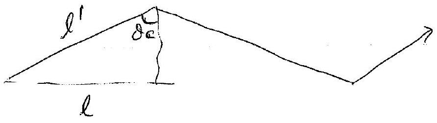
$$
\begin{array} { l l }
t _ { l } = \frac { n _ { l } l } { c } & = 4.953 \times 10 ^ { - 4 } \mathrm {~s} \\
t _ { l } ^ { \prime } = \frac { n _ { l } l } { c \sin \theta _ { c } } & = 5.053 \times 10 ^ { - 4 } \mathrm {~s} .
\end{array}
$$
$$
\begin{aligned}
\Delta t & = 0.100 \times 10 ^ { - 45 } \\
& = 1.00 \times 10 ^ { - 5 } \mathrm {~s} \\
& = 10 \mu \mathrm {~s}
\end{aligned}
$$
(iii) $\quad f _ { \text {max } } = \frac { 1 } { \Delta t } = 99.9 \mathrm { kHz }$. So phot paker are not overtyping.

prook (ii) (ii) and (jv) cest be dine is any order. forme will fid that daing the we curleta is (II) fust helps plen with the ageton require is fast (iv).

(iv)

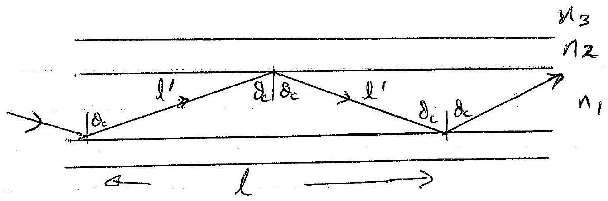
In the limit of $\partial \rightarrow \partial r$, the angle of innidenceis the fibre → Dec

2 Math Chight tooutling along te core trouls a chictane $l$ is time $t _ { \text {min } } = \frac { n _ { 1 } h } { C } \checkmark$
$l ^ { \prime }$ trouls distance $l ^ { \prime }$ is $t _ { \text {max } } = \frac { n _ { 1 } l } { c \sin }$ since $l ^ { \prime } = \frac { l } { \sin \theta _ { c } }$ and $r _ { 1 } \sin \theta _ { c } = n _ { 2 }$
so $l ^ { \prime } = \frac { l n _ { 1 } } { n _ { 2 } }$
and $t _ { \text {max } } = \frac { n _ { 1 } ^ { 2 } } { n _ { 2 } } \frac { l } { c }$
fo $\Delta t = \frac { n _ { 1 } l } { c } \left( \frac { n _ { 1 } } { n _ { 2 } } - 1 \right)$

$$
\begin{equation*}
= \frac { l } { c ^ { \prime } } \frac { \Delta n } { n _ { 2 } } \tag{4}
\end{equation*}
$$

Total. $( 12 )$ in $( 4 + 4 + 4 ]$

(c) for $\frac { 1 } { v } + \frac { 1 } { u } = \frac { 1 } { f }$
$$
\lim _ { u \rightarrow \infty } \text { is } V = f
$$
Souts objet distance →
rays of hight smorting... less become parallel" to the anis (2)
ard so f is the distane/point form the leas at whit rays form a distant diget will cors/fous (on the proving of ancèr).
(d) 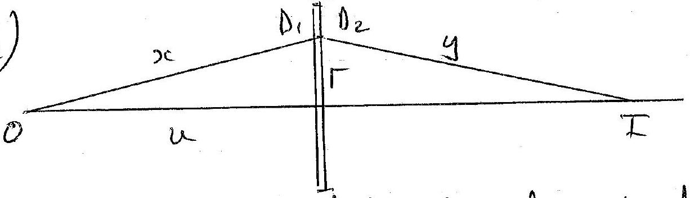
We need to corpour thy time along the arielpoth OI and the path $O D _ { 1 } , D _ { 1 } D _ { 2 } , D _ { 2 } I$.
Tine from $O$ to $I$ alongth arm, $t _ { 1 } = \frac { u } { c } + \frac { d \Lambda _ { 0 } } { c } + \frac { V } { c }$ Tine along $O D _ { 1 } , D _ { 1 } D _ { 2 } , D _ { 2 } I$ is $t _ { 2 } = \frac { x } { c } + \frac { d n _ { 0 } } { c } \left( 1 - k r ^ { 2 } \right) + \frac { y } { c }$
Now
$$
\begin{aligned}
x ^ { 2 } & = r ^ { 2 } + u ^ { 2 } \\
& = u ^ { 2 } \left( 1 + \frac { r ^ { 2 } } { u ^ { 2 } } \right) \\
x & \approx u \left( 1 + \frac { 1 } { 2 } \frac { r ^ { 2 } } { u ^ { 2 } } \right)
\end{aligned}
$$
Sintory $y \approx K \left( 1 + \frac { 1 } { 2 } \frac { \Gamma ^ { 2 } } { V ^ { 2 } } \right)$
Hence $t _ { 2 } = \frac { u } { c } \left( 1 + \frac { 1 } { 2 } \frac { r ^ { 2 } } { u ^ { 2 } } \right) + \frac { d n _ { 0 } } { c } \left( 1 - k r ^ { 2 } \right) + \frac { v } { c } \left( 1 + \frac { 1 } { 2 } \frac { r ^ { 2 } } { v ^ { 2 } } \right)$ For $t _ { 1 } = t _ { 2 }$
$$
W _ { c } + \frac { d r _ { 0 } } { c } + V _ { c } = V _ { c } + \frac { L } { 2 c } \Gamma ^ { 2 } + \frac { d d _ { 0 } - d n _ { 0 } k r ^ { 2 } } { c } + \frac { V } { c } + \frac { 1 } { 2 c } r ^ { 2 }
$$

which gives $\quad 0 = \frac { 1 } { 2 c } \frac { \Gamma ^ { 2 } } { u } - \frac { d r _ { 0 } k r ^ { 2 } } { c } + \frac { 1 } { 2 c } \frac { \Gamma ^ { 2 } } { v }$

$$
2 d x _ { 0 } k = \frac { 1 } { u } + \frac { 1 } { v }
$$

wirl $2 d n _ { 0 } k$ constant and $f = \frac { 1 } { 2 d n _ { 0 } k }$.

Qu 5
(d)
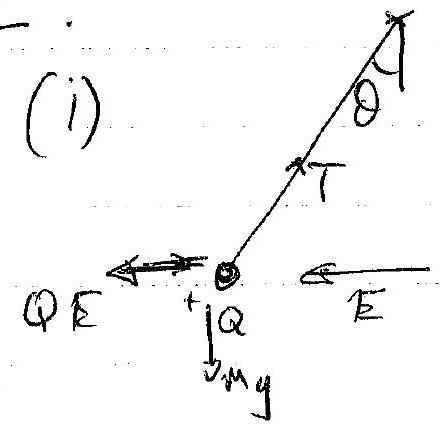

Restrefacen. $1 m _ { y } - T \cos d = 0$

$$
\text { ← } Q . E - T w d = 0
$$

$$
\frac { Q E } { m g } = \tan \theta
$$

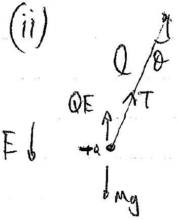

Not in equilibrien.
Resolve 1 to string:

$$
- Q E \sin ( - \theta ) + M _ { y } \sin ( - \delta ) = M _ { a }
$$

and $a = l { } ^ { 2 }$
$Q E \sin \delta - M y \sin \delta = M l \ddot { \theta }$ for small $\theta _ { 1 } \sin \theta \approx \theta$
Hence $\left( Q E - M _ { g } \right) \theta = M l \theta$ $- \left( m _ { g } - q _ { e } \right) \delta = m _ { l } \delta ^ { \theta ^ { \circ } }$

SAM.

$$
\omega ^ { 2 } = \left( \frac { m g - Q E } { m l } \right)
$$

and $T = 2 \pi \sqrt { \left( \frac { m l } { ( m g - Q E ) } . \right.}$
(iii) Osillations will ower who $Q E < M g$ (filds is donsurebts, daye is nequature \& electric force is upwants).

(b)
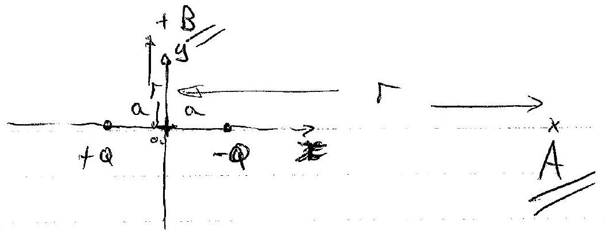
(i) for pinot $A _ { i }$

$$
\begin{aligned}
V _ { A } & = \frac { 1 } { 4 \pi \varepsilon _ { 0 } } Q \left[ \frac { 1 } { r + a } - \frac { 1 } { r - a } \right] \\
& = \frac { 1 } { 4 \pi \varepsilon _ { 0 } } \cdot \frac { Q } { r } \left[ \frac { 1 } { 1 + \frac { a } { r } } - \frac { 1 } { 1 - a _ { r } } \right] \\
& \approx \frac { 1 } { 4 \pi \varepsilon _ { 0 } } \cdot \frac { Q } { r } \left[ 1 - \frac { a } { r } - \left( 1 + \frac { a } { r } \right) \right] \\
& = - \frac { 1 } { 4 \pi \varepsilon _ { 0 } } \frac { 2 Q a } { r ^ { 2 } }
\end{aligned}
$$

If the changes $\frac { \varepsilon _ { 0 } + Q R T } { R T + Q G a } - Q$, then

$$
V \approx + \frac { 1 } { 4 \pi \epsilon _ { 0 } } \cdot \frac { 2 Q Q } { r ^ { 2 } }
$$

(Erither way is 0.6:)
of The bicranid apponination wy rat be wed:
then

$$
\begin{aligned}
V _ { A } & = \frac { 1 } { 4 \pi \varepsilon _ { 0 } } Q \left[ \frac { ( r - a ) - ( r + a ) } { ( r + a ) ( r - a ) } \right] \\
& = \frac { 1 } { 4 \pi \varepsilon _ { 0 } } Q \frac { 2 a } { \left( r ^ { 2 } - a ^ { 2 } \right) } \\
& = \frac { 1 } { 4 \pi \varepsilon _ { 0 } } Q \frac { 2 a } { r ^ { 2 } } \text { to frient ables is } \frac { a } { r }
\end{aligned}
$$

NB. follotin my have $k = \frac { 1 } { 4 \pi \varepsilon _ { 0 } }$. This is $0 k$.

For A ,

$$
\begin{aligned}
E & = \frac { 1 } { 4 \pi \varepsilon _ { 0 } } Q \left[ \frac { 1 } { ( r + a ) ^ { 2 } } - \frac { 1 } { ( r - a ) ^ { 2 } } \right] . \\
& = \frac { 1 } { 4 \pi \varepsilon _ { 0 } } \frac { Q } { r ^ { 2 } } \left[ \frac { 1 } { \left( 1 + \frac { a } { r } \right) ^ { 2 } } - \frac { 1 } { \left( 1 - \frac { a } { r } \right) ^ { 2 } } \right] . \\
& = \frac { 1 } { 4 \pi \varepsilon _ { 0 } } \frac { Q } { r ^ { 2 } } \left[ 1 - \frac { 2 a } { r } - \left( 1 + \frac { 2 a } { r } \right) \right] . \\
& = ( - ) \frac { 1 } { 4 \pi \varepsilon _ { 0 } } Q \cdot \frac { 4 a } { r ^ { 3 } }
\end{aligned}
$$

OT

$$
\begin{aligned}
E & = \frac { 1 } { 4 \pi \varepsilon _ { 0 } } Q \left[ \frac { ( r - a ) ^ { 2 } - ( r + a ) ^ { 2 } } { ( r + a ) ^ { 2 } ( r - a ) ^ { 2 } } \right] \\
& = \frac { 1 } { 4 \pi \varepsilon _ { 0 } } Q \left[ \frac { r ^ { 2 } + a ^ { 2 } - 2 r a - \left( r ^ { 2 } + a ^ { 2 } + 2 r a \right) } { \left( r ^ { 2 } - a ^ { 2 } \right) ^ { 2 } } \right] \\
& = \frac { 1 } { 4 \pi \varepsilon _ { 0 } } Q ( - ) \frac { 4 r a } { r ^ { 4 } \left( 1 - \frac { a ^ { 2 } } { r ^ { 2 } } \right) ^ { 2 } } \\
& = ( - ) \frac { 1 } { 4 \pi \varepsilon _ { 0 } } Q \frac { 4 a } { r ^ { 3 } } \text { to frietcaler in } \frac { r } { a } .
\end{aligned}
$$

For $B$

$$
V = \frac { 1 } { 4 \pi \varepsilon _ { 0 } } \cdot Q \left\{ \frac { 1 } { \sqrt { r ^ { 2 } + a ^ { 2 } } } - \frac { 1 } { r ^ { 2 } + a ^ { 3 } } \right\} = 0
$$

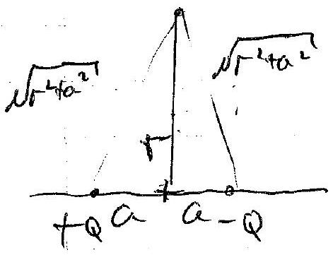

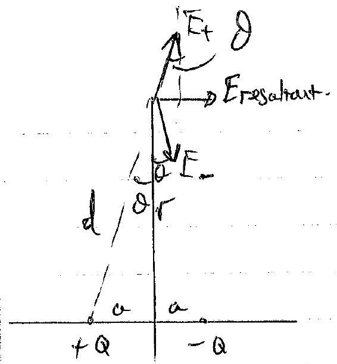

Conpunasts y Epergendiciter to the live joining the chages coule.
Erenuttant is garlfel to the hie poining the chages frow to-

$$
\begin{aligned}
E _ { \text {res } } & = \frac { 1 } { 4 \pi \varepsilon _ { 0 } } \cdot \frac { Q } { d ^ { 2 } } \sin d + \frac { 1 } { 4 \pi \varepsilon _ { 0 } } \cdot \frac { Q } { d ^ { 2 } } \sin \theta \\
& = \frac { 2 Q } { 4 \pi \varepsilon _ { 0 } } \cdot \frac { 1 } { \left( a ^ { 2 } + r ^ { 2 } \right) } \cdot \frac { a } { \sqrt { a ^ { 2 } + r ^ { 2 } } } \\
& = \frac { 2 Q a } { 4 \pi \varepsilon _ { 0 } } \cdot \left( \frac { 1 } { a ^ { 2 } + r ^ { 2 } } \right) ^ { \frac { 3 } { 2 } } \\
& = \frac { 2 Q a } { 4 \pi \varepsilon _ { 0 } } r ^ { 3 } \left( 1 + \frac { a ^ { 2 } } { r ^ { 2 } } \right) ^ { \frac { 3 } { 2 } } \\
& \approx \frac { 2 Q a } { 4 \pi \varepsilon _ { 0 } } r ^ { 3 } \left( 1 - \frac { 3 } { 2 } \frac { a ^ { 2 } } { r ^ { 2 } } \right) . \\
& = \frac { 2 Q a } { 4 \pi \varepsilon _ { 0 } } r ^ { 3 } \quad \text { for Consertarder. }
\end{aligned}
$$

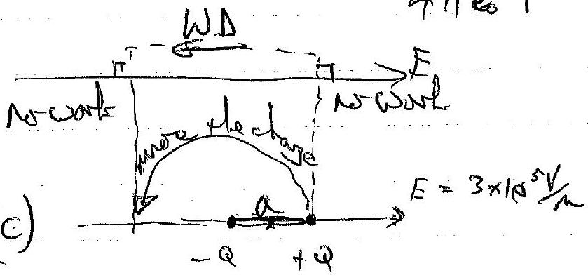
treep arecharge fineed and nowe te a the chape (+) againt the felt. Can mirena vistund noth to $E$, witypiald to $E$ by $2 d$, and then to E.
WD = force × dighloment alorg the patt = QE × ⿱八 d
$= 20 d E$ (if would dolg
Answer ✓ $W = 1.9 ( 2 ) \times 10 ^ { - 24 \mathrm {~J} }$ the foold act / sign appeas. - ignore onysing)
(2)

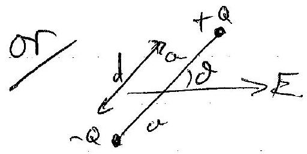

$$
\begin{aligned}
\text { torpe ondipute } & = - Q E \frac { d } { 2 } \cdot \sin \theta - Q R \frac { d } { 2 } \cos \theta \\
& = - Q E d \sin \theta
\end{aligned}
$$

Work done on the digile is QRd find dO to wrother whinght

$$
\begin{aligned}
\therefore W D & = \int _ { 0 } ^ { \pi } Q E d \sin \theta d \theta \\
& = Q E d \left[ - \left. \cos \theta \right| _ { 0 } ^ { \pi } \right. \\
& = - Q E d ( - 1 - 1 ) \\
& = 2 Q E d
\end{aligned}
$$

(S), $W = 1.92 \times 10 ^ { 24 } \mathrm {~J}$
(d) uper cylinder.

$$
\begin{aligned}
Q _ { u } & = n \cdot \pi r ^ { 2 } h . \\
& = 0.21 \times 10 ^ { - 9 } \times \pi \times 5000 ^ { 2 } \times 3000 \\
& = 49.5 \mathrm { c } .
\end{aligned}
$$

Lower cy hader

$$
\begin{aligned}
Q _ { L } & = \left( - 70 \cdot 18 \times 10 ^ { - 9 } \mathrm { k } \pi \times 5000 ^ { 2 } \times 7000 \right. \\
& = ( - ) 99.0 \mathrm { C }
\end{aligned}
$$

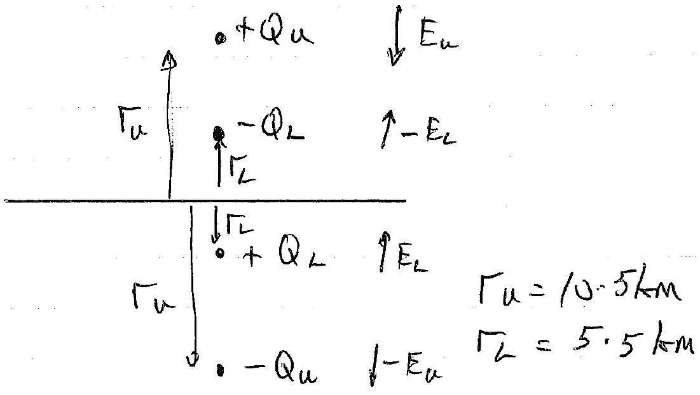

Fill at the surface, $F _ { s } = \frac { 1 } { 4 \pi \varepsilon _ { 0 } } \left[ \frac { Q _ { u } } { r _ { u } ^ { 2 } } - \frac { Q _ { L } } { r _ { L } ^ { 2 } } - \frac { Q _ { L } } { r _ { L } ^ { 2 } } + \frac { Q _ { u } } { r _ { u } ^ { 2 } } \right]$.
Sign: I dow is pointive fol.

$$
\begin{aligned}
& E _ { s } = \frac { 1 } { 4 \pi _ { c } } \cdot \left[ 2 \frac { Q _ { u } } { \Gamma _ { u } ^ { 2 } } - 2 \frac { Q _ { L } } { \Gamma _ { L } ^ { 2 } } \right] \\
& E _ { s } = 9 \times 10 ^ { 9 } \times 2 \left[ \frac { 49.5 } { 10500 ^ { 2 } } - \frac { 99.0 } { 5500 ^ { 2 } } \right] \\
& E _ { s } = \left( - 150.8 \mathrm { kV } \mathrm {~m} ^ { - 1 } \right. \\
& \frac { - 102 \mathrm { kV } } { \hat { c } _ { \mathrm { OV } } } \text { )lower potested }
\end{aligned}
$$

The patestid at the head is - 102 kV .
As the person is a condution, it may be illustrated
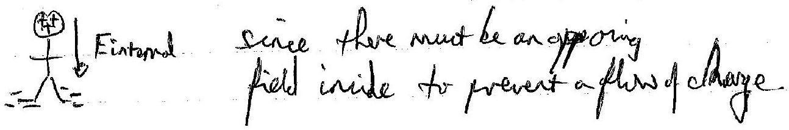

So answer may be given as head is mare pristive than the flet.

Question 6
(a) If source stationary, f $\Delta t$ waves enitted is $\Delta t$. Boat reacian f to aren $+ \frac { u \Delta t } { \lambda _ { s } }$ warn due for is move rent.

$$
f ^ { \prime } \Delta t = f \Delta t + \frac { u \Delta t } { \lambda _ { s } }
$$

with $f \ldots \lambda _ { s } = c$

$$
\begin{aligned}
& f ^ { \prime } = f + \frac { u } { c / f } \\
& f ^ { \prime } = f \left( 1 + \frac { u } { c } \right) = f \left( \frac { u + c } { c } \right)
\end{aligned}
$$

or plative docipty between the civers as the bosit moving towals then is $u + c$

$$
\begin{array} { r l r }
\text { So } \quad f ^ { \prime } & = \frac { ( u + c ) } { \lambda } & \quad \checkmark \\
& = \left( \frac { u + c } { c } \right) f &
\end{array}
$$

of time tater for boat to trivel from enet to creet,

$$
\begin{aligned}
& \Delta t = \frac { \text { distance } } { \text { retotiserped } } = \frac { \lambda } { u + c } = \frac { c } { f ( u + c ) } \\
& \therefore f = \frac { f ( u + c ) } { c }
\end{aligned}
$$

** Ary mothod will do, hat it must be dear to the marker. wall Not do.

(b) $\left. \left. ( i ) \quad , p _ { i } \right) \quad \right) \quad$;

In time $\Delta t , f : \Delta t$ wore emoted by source. These fitinaleryth $( c - u ) , \Delta t$

$$
\begin{aligned}
\lambda & = \frac { ( c - u ) \Delta t } { f } \Delta t \\
& = \frac { c - u } { f }
\end{aligned}
$$

But his shorter $\lambda$ is desterted by the observer di a fighforung

$$
\frac { c } { f ^ { \prime } } = \frac { \left( c - c _ { 5 } \right) } { f }
$$

So

$$
f ^ { \prime } = \frac { f } { \left( 1 - \frac { v _ { s } } { c } \right) }
$$

Show that must be a derivation. No motes for the answer it reffact.
(ii) force moves wiley $v _ { s } \rightarrow - v _ { s }$.

$$
\begin{aligned}
& v _ { j } = \frac { 1 } { 2 } \\
& f ^ { \prime } = \frac { f } { 1 + \frac { 1 } { 2 } } \\
& f ^ { \prime } = \frac { 2 } { 3 } f \\
& \Delta f = \frac { 2 } { 3 } f - f \\
& = - \frac { 1 } { 3 } f
\end{aligned}
$$

value add froze prevery the figh.
(iii) appos: $f ^ { \prime } \approx f \left( 1 + \frac { V _ { 3 } } { c } \right)$

$$
\begin{aligned}
\text { so } f ^ { \prime } - f = & f \frac { V _ { s } } { c } \\
\frac { \Delta f } { f } & \frac { V _ { s } } { c }
\end{aligned}
$$

or

$$
\begin{aligned}
f ^ { \prime } \left( 1 - \frac { v _ { 3 } } { c } \right) & = f \\
f ^ { \prime } - f ^ { \prime } \frac { v _ { 3 } } { c } & = f \\
f ^ { \prime } - f & = f ^ { \prime } \frac { v _ { 3 } } { c } \\
f ^ { \prime } - f & = f \left( \frac { v _ { s } } { c } \right) \frac { 1 } { 1 - \frac { v _ { s } } { c } } . \\
& \approx f \frac { v _ { s } } { c } \\
\frac { \Delta f } { f } & \approx \frac { v _ { s } } { c } .
\end{aligned}
$$

(c)(i)

$$
V = \frac { 2 \pi R } { T }
$$

for $v \ll e$ yeed flylt

$$
\begin{aligned}
& \frac { \delta f } { f } \approx \frac { v } { c } \\
& \delta _ { f } = \frac { 2 \pi R \cdot f } { T } \cdot \frac { f } { }
\end{aligned}
$$

(ii)

$$
\begin{aligned}
& \frac { \delta f } { f } = \frac { 2 \pi } { T } \cdot \frac { R } { C } . \\
& \frac { M } { P } = \frac { 4 } { 3 } \pi R ^ { 3 } \\
& R = 699 \times 10 ^ { 6 } \mathrm {~m} . \\
& \frac { \partial f } { f } = 6.9 \times 10 ^ { - 6 }
\end{aligned}
$$

(d) (1)
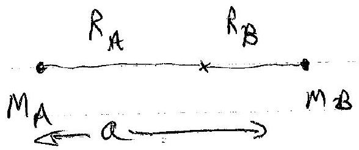

The erwo stors have the some anywar velocity, w. Centryoth force about Colm is provided by pointy.

$$
\therefore \quad m _ { A } R _ { A } \omega ^ { 2 } = G \frac { m _ { A } M _ { B } } { a ^ { 2 } }
$$

and $M _ { B } R _ { B } \omega ^ { 2 } = \frac { G M _ { A } M _ { D } } { a ^ { 2 } }$

$$
\therefore \quad R _ { A } W ^ { 2 } = \frac { G M _ { B } } { a ^ { 2 } }
$$

and $\quad R _ { B } \omega ^ { 2 } = \frac { G - m _ { B } } { a ^ { 2 } }$
Adding $\omega ^ { 2 } \left( R _ { A } + R _ { B } \right) = \frac { G } { a ^ { 2 } } \left( M _ { A } + M _ { B } \right)$

$$
\begin{aligned}
\omega ^ { 2 } a & = \frac { G } { a ^ { 2 } } \cdot M \\
\frac { 4 \pi ^ { 2 } } { T ^ { 2 } } & = \frac { G M } { a ^ { 3 } }
\end{aligned}
$$

or $T ^ { 2 } = \frac { 4 \pi ^ { 2 } } { a m } \cdot a ^ { 3 }$

Do notallow sphing it $\frac { M V ^ { 2 } } { R } = \frac { G M M } { R ^ { 2 } }$ for $\left. \begin{array} { l } R \\ \text { to ast keyl } \\ \text { R } \end{array} \right]$ ably
(ii)

$$
\begin{aligned}
m & = \frac { 4 \pi ^ { 2 } } { G T ^ { 2 } } a ^ { 3 } \\
& = \frac { 4 \pi ^ { 2 } \cdot \left( 19.8 \times 1.5 \times 10 ^ { 11 } \right) ^ { 3 } } { 6.7 \times 10 ^ { 111 } \times ( 50.1 \times 365 \times 24 \times 3600 ) ^ { 2 } } \\
& = 6.21 \times 10 ^ { 30 } \mathrm {~kg}
\end{aligned}
$$

(iii) Certrytal fraze due tugraity
$$
\frac { m _ { A } V _ { A } ^ { 2 } } { R _ { A } } = \frac { G M _ { A } \cdot M _ { B } } { a ^ { 2 } }
$$
sine $V _ { A } = \frac { 2 \pi R _ { A } } { T }$
then
$$
\begin{array} { r }
\frac { V _ { A } } { R _ { A } } \cdot \frac { 2 \pi R _ { A } } { T } = \frac { G M _ { B } } { a ^ { 2 } } \\
d \quad V _ { A } = \frac { G M _ { B } } { 2 \pi a ^ { 2 } } \cdot T
\end{array}
$$
(iv) $\quad \frac { \Delta f } { f } = \frac { V _ { A } } { c } = \frac { G M _ { B } } { 2 \pi a ^ { 2 } } \frac { I } { c }$.
for
$$
\begin{aligned}
& m _ { B } = \frac { 2 \pi a ^ { 2 } c \cdot \Delta f } { f G T } \\
& m _ { B } = 5.65 \times 10 ^ { 30 } \mathrm {~kg}
\end{aligned}
$$
Total mass found from $T ^ { 2 } = \frac { 4 \pi ^ { 2 } } { G m } \cdot a ^ { 3 }$ in part (ii)
to give $M _ { A } = 6.2 \times 10 ^ { 30 } - 5.65 \times 10 ^ { 30 }$
$$
m _ { A } = 5.6 \times 10 ^ { 29 } \mathrm {~kg}
$$
(v) No esteral torque, or in the zero monoton fince, etc.
(v) No esteral torque, or in the zero monoton fince, etc.
$$
\begin{aligned}
m _ { A } R _ { A } & = m _ { B } R _ { B } \\
\therefore R _ { A } & = \frac { m _ { B } } { m _ { A } } \\
& = 10 \cdot ( 1 )
\end{aligned}
$$
