## BPhO Round 1 Marking- November 2018

Thank you for taking part in marking the scripts. It is of enormous benefit to young students to be able to take part in these competitions, tackling much harder problems than they normally get, and be able to have them marked by physicists who know what they are doing. It is because of your expertise in the subject that it is possible to do this. Exams marked by non-specialists are more of a tick box exercise, which is of little value in stretching students to grasp the subject at a deeper level. The layout of the work may be annoying. That is a national problem and we are not going to change that easily, although we do our best, as do the teachers of these students.

- Positive marking is the aim. Marks should be awarded for good physics, even if the reasoning does not follow the mark scheme. Alternative routes to the answers can be allowed.
- Significant figures. This is not a test of significant figures. A leeway of ±1 sig fig is generally allowed, but we are not being strict at all in penalising for sig figs. ; if the published solution gives 3, allow 2 or 4 in the students answer. However, unless they have put down all of the figures on their calculator, there are no questions this year that are likely to invoke a sig fig penalty.
- Some answers can be left in fractional form.
- Units should be given for the final answer. It may be that the unit is given a little earlier and that it does not appear on the very last line. Some allowance may be made if it is clear that the unit has been used a line or two earlier.
- If the units are a required part of the answer for the mark, and so must be there.
- Error carried forward (ecf) is allowed provided ridiculous results do not start appearing. A mark is lost for the initial mistake, but then they can carry on (if it is possible) to gain some of the subsequent marks. You do not need to spend time working through laborious arithmetic calculations if there is a possible ecf. Just make a decision as to whether they should have the single mark or not.
- You are not required to spend time deciphering scribble.
- There may be a lot of working for the answer. If they are almost there, you may give the mark even if there is a numerical mistake in the last line. Use your judgement. The ticks for the marks are not exact i.e. they are for the idea and almost getting there.
- Full marks are awarded for the correct answer, provided that there is some supporting working and it is not a "show that" question.

## If you need advice, email Robin Hughes robin.hughes@physics.ox.ac.uk

You can send a phone photo or just ask a question. We want to be fair in the marking, so your good judgment should be acceptable.

But: 1. Do not mix up students' names when entering marks
2. Add up the marks correctly. Check your addition.
3. Do not leave papers in any unsecured place. The loss of papers would be serious.

## Question 1

(a)

$$
\begin{aligned}
V & = \frac { 2 \pi r } { T } \\
& = 2 \pi \frac { 26 \times 1 \text { year } \times 3 \times 10 ^ { 8 } } { 240 \times 10 ^ { 6 } \times 1 y _ { \text {ear } } } \\
& = 2 \pi \times \frac { 78 \times 10 ^ { 8 } } { 2.4 \times 10 ^ { 8 } } \\
& = 2 \pi \times 32.5 \\
& = 204 \mathrm {~ms} ^ { - 1 } = 200 \mathrm {~ms} ^ { - 1 } \\
& = 65 \pi \mathrm {~ms} ^ { - 1 }
\end{aligned}
$$

(b)
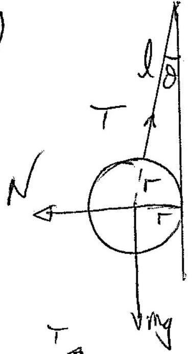

Smooth wall: My phroyl Lauter, So Nothryl youte so Tthough centre.
fo

$$
\begin{aligned}
\sin \theta & = \frac { r } { r + l } \\
& = \frac { 6 } { 6 + 9 } = 0.4
\end{aligned}
$$

Resolving pertially: $m _ { y } = T \cos \theta$

$$
\begin{aligned}
T = \frac { m _ { g } } { \cos \theta } & = \frac { 0.5 \times 9.81 } { \cos 23.6 ^ { \circ } } \\
& = 5.35 = 5.4 \mathrm {~N}
\end{aligned}
$$

Argle wrong, lose a mart of used correctly.

(c)
$$
\text { (i) } \begin{aligned}
& \frac { d s } { d t } = 6 t ^ { 2 } - 18 t + 12 \\
& \dot { s } = 0 \Rightarrow \quad t _ { 0 } ^ { 2 } - 3 t _ { 0 } + 2 = 0 \\
& t _ { 0 } = 1 \mathrm {~s} , 2 \mathrm {~s}
\end{aligned}
$$

Page 2

(ii)
$$
\begin{aligned}
\frac { d ^ { 2 } s } { d t ^ { 2 } } & = 12 t - 18 \\
\quad s & = 0 \Rightarrow \quad t _ { a = 0 } = \frac { 3 } { 2 } = 1.5 \mathrm {~s}
\end{aligned}
$$
(iii)
$$
\begin{aligned}
\dot { S } \text { at } t & = \frac { 3 } { 2 } s \\
\dot { S } _ { a = 0 } = V & = 6 \left( \frac { 3 } { 2 } \right) ^ { 2 } - 18 \frac { 3 } { 2 } + 12 \\
& = \frac { - 3 } { 2 } = - 7.5 .1 \mathrm {~s} ^ { - 1 } .
\end{aligned}
$$
(v) $\quad \dot { s }$ at $t = 13,2 \mathrm {~s}$.
$$
\begin{aligned}
& a _ { 1 } = 12 t - 18 = - 6 \mathrm {~ms} ^ { - 2 } \\
& a _ { 2 } = 12 t - 18 = + 6 \mathrm {~ms} ^ { - 2 }
\end{aligned}
$$
$$
\begin{aligned}
100 & = a \cdot 40 + \frac { 1 } { 40 } \cdot 40 ^ { 2 } \\
a & = 1.5 \frac { \mathrm {~m} } { \mathrm { kmL } }
\end{aligned}
$$
$$
\begin{aligned}
& 500 = 1.5 v + \frac { 1 } { 40 } \cdot v ^ { 2 } \quad v ^ { 2 } + 60 v - 20000 = 0 \\
& 40.500 = 60 v + v ^ { 2 } \Rightarrow \sqrt { 114 \cdot i } = 115 \frac { 1 \mathrm {~m} } { 2 } h \\
& \left( = 31.8 \mathrm {~ms} ^ { - 1 } = 32 \mathrm {~ms} ^ { - 1 } \right)
\end{aligned}
$$

(e) 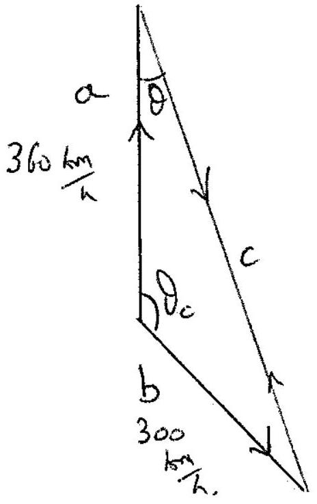
$$
\text { length, } \left. \begin{array} { l }
a = \frac { 2 } { 3 } \times 360 = 240 \mathrm {~km} \\
b = \frac { 2 } { 3 } \times 300 = 200 \mathrm {~km} \\
\partial _ { c } = 90 + 45 = 135 ^ { \circ }
\end{array} \right\}
$$
Cosine rate.
$$
\begin{aligned}
& c ^ { 2 } = 240 ^ { 2 } + 200 ^ { 2 } - 2.240 .200 \cos 135 \\
& c = 406.80 \mathrm {~km}
\end{aligned}
$$
combined speed paperared along $c$ is $660 \frac { \mathrm {~km} } { \mathrm { k } }$.
$$
\text { Time taken to meet is } \begin{aligned}
\frac { 406 } { 660 } & = 0.616 \mathrm {~L} \\
& = 36.98 \text { minutes }
\end{aligned}
$$
In this time, plane 'a' trouts $360 \times 0.616 = 221.9 \mathrm {~km}$
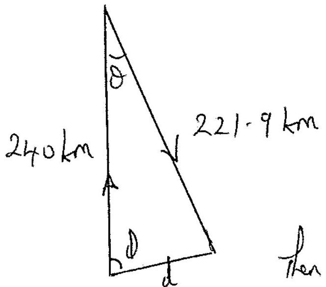
meeting point found.
From the top dugtan ceing tire rule
$$
\frac { c } { \sin 135 } = \frac { b } { \sin \theta } \quad \theta = 20.34 ^ { \circ }
$$
Then conversale,
$$
\begin{aligned}
d ^ { 2 } & = 240 ^ { 2 } + 221.9 ^ { 2 } - 2.240 .221 .9 \cos 20.34 ^ { \circ } \\
d & = 83.5 \mathrm {~km}
\end{aligned}
$$
then
$$
\frac { d } { \sin g } = \frac { 221.9 } { \sin \phi } \quad \phi = 67.5 ^ { \circ }
$$
Need fird two annuen for (7) Mult.
Either ane arother ques (4) mults].

Poge 4
(f)

$$
\begin{array} { c l }
M = M _ { n } & 2 M = M _ { d } . \\
M ^ { e } & D _ { \text {devern } }
\end{array}
$$

(i) Cons. 1 mom.

$$
\begin{align*}
m U _ { 0 } & = m _ { d } V _ { d } + m _ { n } V _ { n } \\
u & = 2 V _ { d } + V _ { n } \tag{1}
\end{align*}
$$

Cay. of ke

$$
\begin{align*}
\frac { 1 } { 2 } m u ^ { 2 } & = \frac { 1 } { 2 } 2 m V _ { d } ^ { 2 } + \frac { 1 } { 2 } m V _ { n } ^ { 2 } \\
u ^ { 2 } & = 2 V _ { d } ^ { 2 } + V _ { n } ^ { 2 } \tag{0}
\end{align*}
$$

Solve: firm (1), $u - v _ { n } = 2 v _ { d }$
(2), $\left( u - v _ { n } \right) \left( u + v _ { n } \right) = 2 v _ { d }$
since $U \neq V _ { n }$ or $V _ { d }$ is zero ad plue has been no intersetin, then divide (3) nd (4) to obtain $u + V _ { n } = V _ { d }$
Wirl(3) to elemide $V _ { n } , u - 2 V _ { d } = V _ { n } = V _ { d } - u$

$$
\begin{aligned}
& 2 u = 3 V d \\
& \frac { V d } { u } = \frac { 2 } { 3 }
\end{aligned}
$$

(ii) lnitwilkei $\frac { 1 } { 2 } m u ^ { 2 }$
deutern ke is $\frac { 1 } { 2 } 2 M \cdot V d ^ { 2 } = \frac { 1 } { 2 } 2 M \frac { 4 } { 9 } \cdot u ^ { 2 }$

$$
\therefore \frac { K F L } { K - E _ { 0 } } = \frac { 8 } { 9 } = 89 \% = 0.889
$$

(iii) $\frac { 8 } { 9 } k r _ { 0 }$ is given to destern.
$\frac { 1 } { 9 }$ krz. left will reaton after eart cohnin.
After $N$ collinion, $\left( \frac { 1 } { 9 } \right) ^ { N } \cdot x 10 \times 10 ^ { 6 } \mathrm { eV } = 10 ^ { - 2 } \mathrm { eV }$

$$
\begin{gathered}
\frac { 1 } { 9 ^ { N } } = 10 ^ { - 9 } \\
q ^ { N } = 10 ^ { 9 } \\
N \log _ { 10 } q = 9 \\
N = 9.4 .
\end{gathered}
$$

- 10 collisom regured
(This reult is for headon collingines, but is similar to te general remabt)

$R =$ weight of dain in toble + rate of change of monertem.
(ginore ± sign forduction of $R ^ { l }$ ).
In fre fall, the links of the chain are accleruting down of the same rate so there is no force acting between the lints. "i.e. There is ro termin to comdarin the chain.
starting from rest, when a leyth I chan har follen,
it arrives at the talk at speed $v$, and for const. aced,

$$
v ^ { 2 } = 2 \mathrm { gl } .
$$

Now, force dueto cripot, $F = \frac { d f } { d t } = N \frac { d M } { d t }$
[is short fine interval a mass da arries, hest $V$ chages $t$ - $V$ to $V \approx V$ ].
Io

$$
\begin{aligned}
& F = \sqrt { 2 g l } \cdot \frac { ( \mu v d t ) } { d t } \\
& F = 2 g l \mu \\
& = 2 g \mu \cdot \frac { 1 } { 2 } g t ^ { 2 } \\
& \left. \quad l _ { s } ^ { 11 } = \frac { 1 } { 2 } a t ^ { 21 } \right) \\
& F = \mu g ^ { 2 } t ^ { 2 }
\end{aligned}
$$

Weight of chair on Falle, is $\mu \mathrm { lg }$

$$
= \mu \frac { 1 } { 2 } g ^ { 2 } t ^ { 2 }
$$

for $R =$ weyle t. rate o mm. haye

$$
\begin{aligned}
& = \mu g ^ { 2 } t ^ { 2 } \left( \frac { 1 } { 2 } + 1 \right) \\
R _ { \text {max } } & = \frac { 3 } { 2 } \dot { \mu } g ^ { 2 } t _ { \text {frad } } ^ { 2 } \\
& = 3 \mathrm {~W} \text { owerr at ad I foll }
\end{aligned}
$$

[There are sevent ways of golving this quation]

Resolving force on the particle at Plitap,

$$
N + M g = \frac { M V _ { \text {top } } ^ { 2 } } { T }
$$

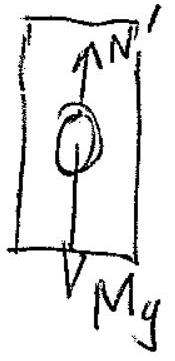

For the block, the minimum fore N'to ruis the blat ' is $N ^ { \prime } = M y$
by $N$ III,$\quad N - N ^ { \prime } = 0$
Hence

$$
M g + M g = \frac { m v _ { t p } ^ { 2 } } { r }
$$

ad for

$$
V _ { \text {top } } ^ { 2 } = ( M + m ) \frac { g r } { m }
$$

From comeration of Elong, with reghelf to as we are finding the (withing qued).

$$
\operatorname { t } m v ^ { 2 } = m g 2 r + \frac { 1 } { 2 } m v _ { \text {top } } ^ { 2 }
$$

i.e. $\quad v ^ { 2 } = 4 g r + v _ { t o p } ^ { 2 }$
Hence

$$
\left. \begin{array} { r l }
v ^ { 2 } & = 4 g r + \frac { ( M + m ) g r } { m } \\
& = 4 g r + \left( \frac { M } { M } + 1 \right) g r \\
& = 5 g r + \frac { M } { M } \cdot g r \\
& = g r \left( 5 + \frac { M } { M } \right)
\end{array} \right\} \text { why }
$$

(i) (i) By kincholf II,

$$
\begin{aligned}
I & = \frac { \text { sumolemps } } { \text { sum deris reintars. } } \\
& = \frac { 2.0 + 1.5 } { 5.0 + 3.0 + 1.0 + 0.5 } \\
& = \frac { 7 } { 19 } = 0.368 = 0.37 \mathrm {~A}
\end{aligned}
$$

(ii)

$$
\begin{aligned}
V _ { 2.0 } & = \varepsilon - I r \\
& = 2.0 - \frac { 7 } { 19 } \cdot 1 \\
& = 1.6 ( 3 ) \mathrm { V } \\
V _ { 1.5 } & = \overline { 1.5 - \frac { 7 } { 14 } } \times 0.5 \\
& = 1.3 ( 2 ) \mathrm { V }
\end{aligned}
$$

(iii)

$$
\begin{aligned}
& V _ { A } = + \frac { 7 } { 19 } \times 5 = + 1.8 ( 4 ) V \\
& V _ { B } = - \frac { 7 } { 19 } \times 3 = - 1.1 ( 1 ) V
\end{aligned}
$$

borth.

(j)
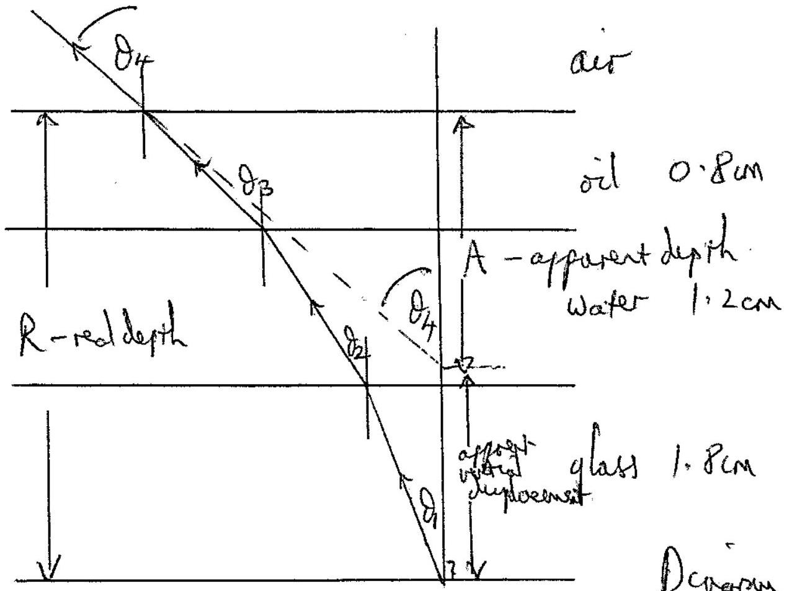

Darama withraw. $\theta _ { 1 } < \theta _ { 2 } < \theta _ { 3 } < \theta _ { 4 }$ ardinationation of appout dapth.
From frield's haw.

$$
\begin{aligned}
1.5 \sin \theta _ { 1 } & = 1.3 \sin \theta _ { 2 } \\
1.3 \sin \theta _ { 2 } & = 1.1 \sin \theta _ { 3 } \\
1.1 \sin \theta _ { 3 } & = 1.0 \sin \theta _ { 4 } \\
\text { so, } \sin \theta _ { 4 } & = 1.5 \sin \theta _ { 1 }
\end{aligned}
$$

Now, $A \cdot \tan \theta _ { 4 } = 1.8 \sin \theta _ { 1 } + 1.2 \sin \theta _ { 2 } + 0.8 \sin \theta _ { 3 }$

$$
= \frac { 1.8 } { 1.5 } \sin \theta _ { 4 } + \frac { 1.2 } { 1.3 } \sin \theta _ { 4 } + \frac { 0.8 } { 1.1 } \sin \theta _ { 4 }
$$

For small argles, $\tan \theta _ { 4 } \approx \sin \theta _ { 4 }$

$$
\begin{aligned}
\therefore \quad A & = \frac { 1.8 } { 1.5 } + \frac { 1.2 } { 1.3 } + \frac { 0.8 } { 1.1 } \\
& = 2.85 \mathrm {~cm} \\
R & = 1.8 + 1.2 + 0.8 = 3.8 \mathrm {~cm}
\end{aligned}
$$

any tood there
Hence, restical drytisencest is 0.95 cm

Afternative solution.
Dugrown required - Diagram ✓ wirl ragdrowin

$$
\begin{gathered}
\theta _ { 1 } < d _ { 2 } < \theta _ { 3 } < \theta _ { 4 } \\
\text { ardindration of appoint depith }
\end{gathered}
$$

Ag apport depth is glass $= \frac { n _ { w } } { n _ { g } } , R _ { g }$ \& 2 realdepth iplass.

$$
\text { Then, } \quad \begin{aligned}
& A _ { w } = \frac { n _ { \text {oil } } } { n _ { w } } \left( R _ { w } + A _ { y } \right) \\
& A _ { \text {oil } } = \frac { n _ { \text {air } } } { n _ { \text {oil } } } \left( R _ { \text {out } } + A _ { w } \right)
\end{aligned}
$$

Pitting there together,

$$
\begin{aligned}
& A = A _ { \text {oil } } = \frac { n _ { \text {air } } } { n _ { \text {od } } } \left( R _ { \text {out } } + \frac { n _ { \text {od } } } { n _ { w } } \left( R _ { w } + \frac { n _ { w } } { n _ { g } } R _ { g } \right) \right) . \\
& = \frac { n _ { \text {out } } } { n _ { \text {out } } } \cdot R _ { o d } + \frac { n _ { \text {out } } } { n _ { \text {ail } } } R _ { \omega } + \frac { n _ { \text {ave } } } { n _ { \text {you } } } \cdot \frac { n _ { a y } } { n _ { a } b } \frac { n _ { a } } { n _ { g } } \cdot R _ { y } \\
& = \frac { R _ { o u } } { n _ { o l } } + \frac { R _ { w } } { n _ { w } } + \frac { h _ { g } } { n _ { g } } \\
& = \frac { 0.8 } { 1.1 } + \frac { 1.2 } { 1.3 } + \frac { 1.8 } { 1.5 } \\
& = 2.85 \mathrm {~cm} \\
& R = 1.8 + 1.2 \times 0.8 = 3.8 \mathrm {~cm} \\
& \text { Vertial deplacement } = 0.95 \mathrm {~cm} \text {. }
\end{aligned}
$$

$( k )$
Suply the same every wans the some mgh

$$
\begin{aligned}
g _ { E } & = \frac { G M _ { E } } { R _ { E } ^ { 2 } } \\
M _ { E } & = \rho _ { E } \cdot \frac { 4 } { 3 } \pi R _ { E } ^ { 3 } \\
g _ { P } & = \frac { G } { R _ { E } ^ { 2 } } \cdot \rho _ { E } R _ { E } ^ { 3 } \times \frac { R _ { P } ^ { 2 } } { G \rho _ { P } R _ { P } ^ { 3 } } \\
& = \frac { \rho _ { E } R _ { E } } { \rho _ { P } R _ { P } } \\
& = \frac { \rho _ { E } } { \frac { 2 } { 3 } \rho _ { E } } \cdot \frac { R _ { E } } { 2 R _ { E } } \\
& = \frac { 3 } { 4 }
\end{aligned}
$$

And $g _ { k } h _ { k } = g _ { p } h _ { p }$
So,

$$
\begin{aligned}
\frac { h _ { p } } { h _ { \bar { R } } } & = \frac { g _ { E } } { g _ { P } } \\
h _ { p } & = \frac { 3 } { 4 } .1 \\
& = \frac { 3 } { 4 } = 0.75 \mathrm {~m}
\end{aligned}
$$

$$
g _ { \rho } = G \cdot \frac { 2 } { 3 } \left( \frac { M } { R ^ { 3 } } \right) \cdot ( 2 R ) = \frac { 4 } { 3 } g _ { E } .
$$

(l) Method A. The oit has the tame denity of the loct, so a height to the that is neutrully boyant i depot, d, of ail; so Conider only abork 3b hyil flooting i water alone.
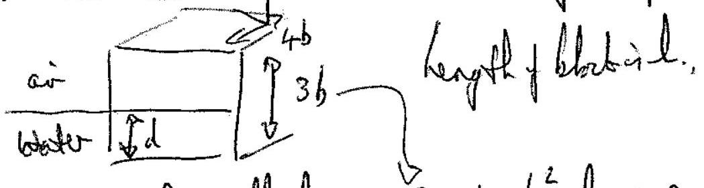
weight of llak $= 3 \times 4 . b ^ { 2 } . l \frac { 2 } { 3 } p . g$ weight of worter diaplued is $d \cdot 4 b \cdot l p g$ By Archantes, there are equal. irepulibrim.

Neme $3.4 . b ^ { 2 } \times 2 \times g = d .4 b .1 A ^ { \prime } g$ $d = 2 b$.
And b his withingte oil, bo $3 b$ is sulmiged, $75 \%$
martod \& Includgetle ort.
Wright of theik $= 4 \times 4 , b ^ { 2 } + \frac { 2 } { 3 } \rho g$
Wight of hyort driphaed $= 6.4 b l \frac { 2 } { 3 } \cdot \rho g + d 4 b l \rho g$ (oil)
equating, as these two we equal by Archinedes.
Then

$$
\begin{aligned}
b \cdot \frac { 2 } { 3 } + \cdots d & = 4 b \cdot \frac { 2 } { 3 } \\
d & = 2 b
\end{aligned}
$$

and depth doot is $b$.
as $3 b$ is fulmerged, $75 \%$

(M) Assemption.

For the two systems at any given equaltemperature, the cooking method is the sume, so the nute fl Carst themal energy is the same at that temperation.
yemaresgy a martional to the themal energy last. → time taten is mortional to the themal energy last.

Not, rate of enylocs $\alpha T \times$
(arsuption)

$$
\begin{aligned}
W _ { \text {Witer } } + c _ { \text {Wits } } & = p _ { w } \cdot V _ { w } \cdot c _ { w } ( 40 - 15 ) + m _ { c } \cdot c _ { c } ( 40 - 15 ) \\
& = 1.0 \times 80 \times 4.2 \times 25 + 150 \times 0.4 \times 25 \\
& = 8400 + 1500 \\
& = 9900 \mathrm {~J} \\
\Delta Q _ { \text {etc } } & = 0.8 \times 80 \times c _ { e } ( 40 - 15 ) + 150 \times 0.4 \times 25 \\
& = 1100 c _ { e } + 1500
\end{aligned}
$$

and uning the rate facting annythi.
$\Delta Q _ { w r c } = R \times 12$
$\Delta Q _ { e + c } = R \times 8$

$$
\left\{ \begin{array} { l }
\text { ✓ } \\
\text { are do rate to } \\
\text { relate woning. }
\end{array} \right.
$$

So $\frac { 12 } { 8 } = \frac { 9900 } { 1606 c _ { e } + 150 }$

$$
\begin{aligned}
\therefore 12.16 c _ { e } + 12.15 & = 8.99 . \\
c _ { e } & = \frac { 612 } { 192 } = \frac { 3.19 \frac { \mathrm {~J} } { \mathrm {~g} ^ { \circ c } } } { 3190 \frac { \mathrm {~J} } { \mathrm {~kg} ^ { \circ c } } }
\end{aligned}
$$

(m)
gider expacts by Il will a ferpine. linearesp. $= \frac { d l } { l } \cdot \frac { 1 } { \Delta T }$

$$
\begin{aligned}
\delta l & = \text { liverery } \times l \Delta T \\
& = 1.2 \times 10 ^ { - 7 } \times 4.0 \times ( 20 - 5 ) \\
& = 7.2 \times 10 ^ { - 6 } \mathrm {~m}
\end{aligned}
$$

$$
\text { Youry Molder, } \begin{aligned}
E & = \frac { E } { A } \frac { 1 } { d l / l } = E \frac { l } { A l } . \\
\therefore F & = E \frac { I } { l } \\
& = 2.0 \times 10 ^ { 11 } \times \left( 30 \times 10 ^ { - 4 } \times \frac { 7.2 \times 10 ^ { - 6 } } { 4.0 } \right. \\
& = 1080 \mathrm {~N} \\
& = 1100 \mathrm {~N}
\end{aligned}
$$

I dea relating ple planal expanción, 5l, to the comprecive force via toy Morklus

(0) Attenative on
next page.
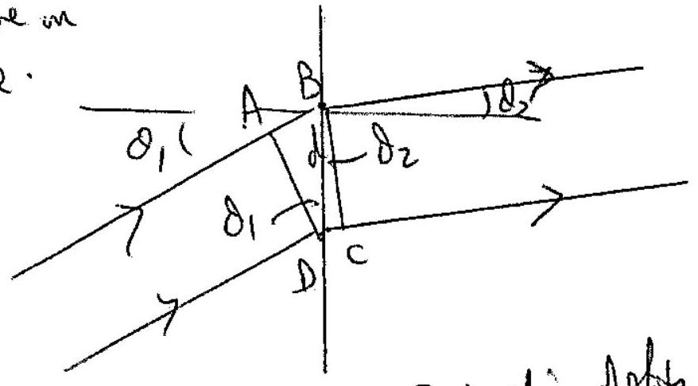
Separation applic, $d = \frac { 1 } { 1.2 \times 10 ^ { 6 } } M$
(ii) path difference $= A B - C D$.
$$
= d \left( \sin \theta _ { 1 } - \sin \theta _ { 2 } \right)
$$
$= n \lambda$ for maxima.
(iii) So $\sin \theta _ { 1 } - \sin 73 ^ { \circ } = n \cdot \lambda \cdot 12 \times 10 ^ { 6 }$ and $\sin \theta _ { 1 } - \sin 14 ^ { \circ } = ( n \pm 1 ) \cdot \lambda \cdot 1 \cdot 2 \times 10 ^ { - 1 }$
subtrafuy.
then $\sin 73 ^ { \circ } - \sin 14 ^ { \circ } = + 1 \cdot \lambda \cdot 1 \cdot 2 \times 10 ^ { - 6 }$
So $\lambda = 595 \mathrm {~nm}$
$$
\lambda _ { \times 1.2 \times 10 ^ { - 6 } } = 0.714
$$
(iv)
Herce $\sin \theta _ { 1 } = \sin 73 ^ { \circ } + 0.714 \quad n \quad$ positive
and $\sin d _ { 1 } = \sin 14 ^ { \circ } + 0.714 ( n \pm 1 )$
so the affratel rays meat be the ather side of the romul/below the hougonot i the top dragoum.
[Sectle dayram unde rest page].
So, $\sin \theta _ { 1 } + \sin 73 ^ { \circ } = 2 \times 0.714$
$$
\begin{aligned}
& ( n = 2 ) \\
& ( n = 1 )
\end{aligned}
$$
(v) For $n = 3 , \partial _ { 2 } > 90$ ser no differeded boun.
$\mathrm { Or } _ { 3 }$, the indipleded been enefficy at $\mathrm { O } _ { 2 } = 28 ^ { \circ }$ $p _ { 2 }$.

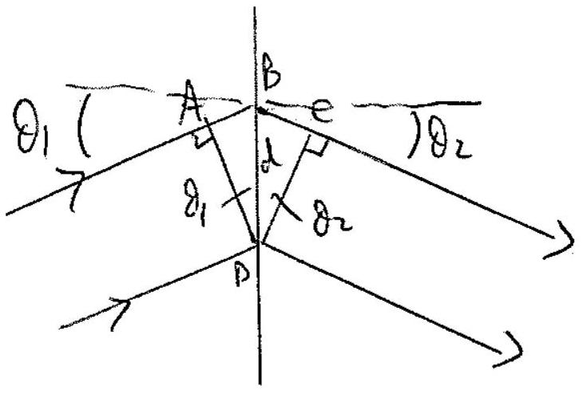
(ii)

$$
\begin{aligned}
\text { poth difference } & = A \beta + B C \\
& = d \left( \sin d _ { 1 } + \sin d _ { 2 } \right)
\end{aligned}
$$

(iii)

$$
\begin{aligned}
& \sin d _ { 1 } + \sin 73 = ( n + 1 ) \lambda ^ { 1 } \times 1.2 \times 10 ^ { 6 } \\
& \sin d _ { 1 } + \sin 14 ^ { \circ } = n \lambda \times 1.2 \times 10 ^ { 6 }
\end{aligned}
$$

subtrating $\quad \sin 73 - \sin 14 = \lambda < 1.2 \times 10 ^ { 6 }$

$$
\lambda = 595 \mathrm {~nm}
$$

(iv)

$$
\begin{aligned}
& | \lambda x | \cdot 2 \times 10 ^ { 6 } = \overline { 0 \cdot 7 / 4 } \mid \\
& \sin \theta _ { 1 } + \sin 14 ^ { \circ } = n 0.714
\end{aligned}
$$

orly primill onlue of $n$ is $1 \left( \right.$ or $\left. \theta _ { 1 } > 90 ^ { \circ } \right)$

$$
\begin{aligned}
\sin \theta _ { 1 } & = 1 \times 0.714 - \sin 14 ^ { \circ } \\
\theta _ { 1 } & = 28 ^ { \circ }
\end{aligned}
$$

(v) For $A = 3$ 畐 $> 90 ^ { \circ }$. So w 3 ol differeted beame and rone on the ather side of He ammal

$$
\begin{aligned}
\sin \theta _ { 2 } - \sin \theta _ { 1 } & = n \times 0.714 \\
1 - \sin 28 & = 0.53 \text { so no } n \text { value pointle. }
\end{aligned}
$$

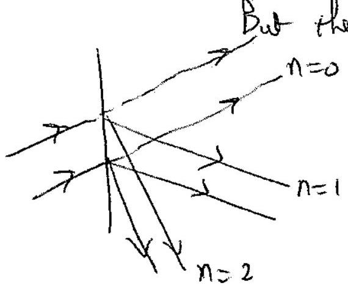

But the anlifated beam at $\theta _ { 2 } = 28 ^ { \circ }$ may be allowel

(p)
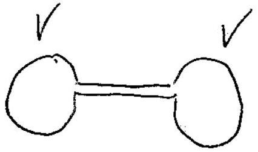
$100 ^ { \circ } \mathrm { C } \rightarrow 50 ^ { \circ } \mathrm { C } \quad 100 ^ { \circ } \mathrm { C } \rightarrow 150 ^ { \circ } \mathrm { C }$
Initially, $\quad P _ { i } \cdot 2 V = n R T _ { i } \quad$ a is total mules foos .

$$
\text { So } n = \frac { P _ { i } \cdot 2 V } { R T _ { i } }
$$

Findly, $\quad n = \frac { P _ { f } \cdot V } { R T _ { 50 } } + \frac { P _ { f } V } { R T _ { 150 } } \quad$ some find mass to y.
Hence

$$
\begin{align*}
& \frac { P _ { i } \cdot 2 V } { R T _ { i } } = \frac { P _ { + } V } { R T _ { 50 } } + \frac { P _ { + } V } { R T _ { 150 } }  \tag{Peloting inters}\\
& \frac { 2 P _ { i } } { \overline { T _ { i } } } = \frac { P _ { + } } { T _ { s 0 } } + \frac { P _ { + } } { T _ { 150 } }
\end{align*}
$$

find mauln) of gov.

Thus,

$$
\frac { 2 P _ { i } } { P _ { t } } = T _ { i } \left( \frac { 1 } { T _ { 50 } } + \frac { 1 } { T _ { 150 } } \right)
$$

And we also require the same $P _ { f }$ with term $T _ { f }$.
Then $\frac { P _ { i } 2 V } { R T _ { i } } = \frac { P _ { t } 2 V } { R T _ { t } }$

$$
\begin{equation*}
\text { Io, } \quad \frac { P _ { t } } { P _ { t } } = \frac { T _ { i } } { T _ { f } } \tag{2}
\end{equation*}
$$

Form (1) ad (2)

$$
\begin{aligned}
& \frac { 2 T _ { i } } { T _ { + } } = T _ { i } \left( \frac { 1 } { T _ { 50 } } + \frac { 1 } { T _ { 150 } } \right) \\
& \frac { 2 } { T _ { f } } = \frac { 1 } { 323 } + \frac { 1 } { 423 }
\end{aligned}
$$

So that

$$
\begin{aligned}
T _ { f } & = 366.3 \mathrm { k } \\
& = 93.3 ^ { \circ } \mathrm { C } \\
& = 93 ^ { \circ } \mathrm { C }
\end{aligned}
$$

(q)

The smallaphes in the question mean this is StM.
Proge 17
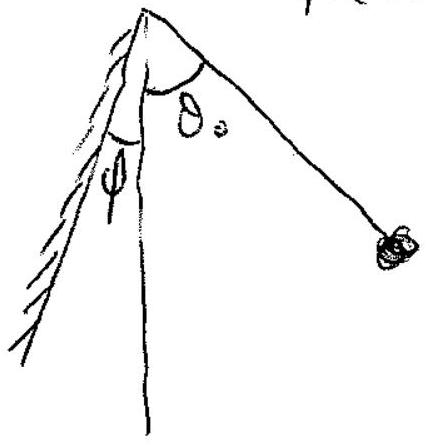

$$
\begin{aligned}
& { [ A ] \delta = \theta _ { 0 } \cos ( \omega t ) } \\
& { \left[ \delta = \sigma _ { 0 } \operatorname { coth } t = 0 \right] } \\
& \omega = 2 \pi f = \frac { 2 \pi } { T _ { 0 } }
\end{aligned}
$$

$$
\begin{aligned}
\text { Now, } - 7 & = 14 \cos \left( \frac { 2 \pi } { T _ { 0 } } t \right) \\
\text { i.e. } - \frac { 1 } { 2 } & = \cos \left( \frac { 2 \pi t } { T _ { 0 } } \right) \\
N ^ { \top } \frac { 2 \pi } { 3 } & = \cos \left( 120 ^ { \circ } \right) = - \frac { 1 } { 2 }
\end{aligned}
$$

The pull priod is $2 t = \frac { 2 } { 3 } T _ { 0 }$
(worker meetros).
Use of $\sin ( \omega t )$. At $t = 0 , \theta = 0$.
$\theta = \theta _ { 0 } \sin \omega t$
So wa want the time to rieform $\theta = 0$ to $\theta = 7 ^ { \circ }$

$$
\begin{aligned}
& 7 ^ { \circ } = 14 ^ { \circ } \sin \left( \frac { 2 \pi t } { T _ { 0 } } \right) \\
& \sin \frac { \pi } { 6 } = \frac { 1 } { 2 } . \\
& \therefore \quad \frac { \pi } { 6 } = \frac { 2 \pi t } { T _ { 0 } } \\
& \text { for } t = \frac { T _ { 0 } } { }
\end{aligned}
$$

Doulle this to fall ${ } ^ { 12 }$ but down, and for the sater haff of the swing, add $T _ { 0 / 2 }$.
fo $t = 2 \times \frac { T _ { 0 } } { 12 } + \frac { T _ { 0 } } { 2 } = \frac { 2 } { 3 } T _ { 0 }$
or variations on either it there approvels.

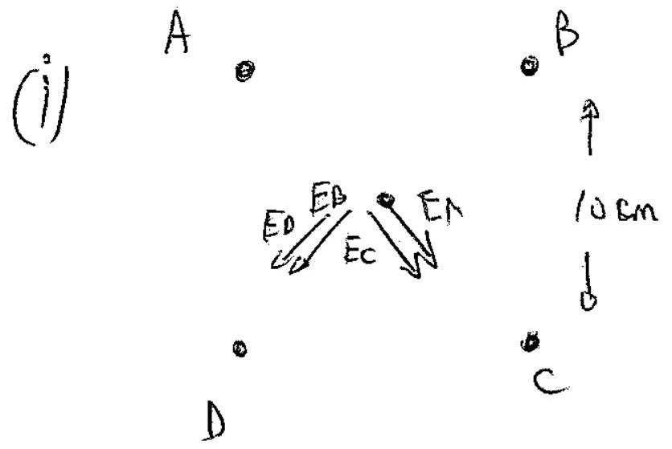

Falls from $A$ and $C$ are pundled and alring drogginal … $B$ add $\cdots \backsim \cdots$

$$
\begin{aligned}
E _ { A C } & = \frac { 1 } { 4 \pi C _ { 0 } } \cdot \frac { ( 10 + 12 ) \times 10 ^ { - 9 } } { \left( 5 \sqrt { 2 } \times 10 ^ { - 2 } \right) ^ { 2 } } \\
& = 8.99 \times 10 ^ { 9 } \times 22 \times 10 ^ { - 9 } \\
50 \times 10 ^ { - 4 } & = 39556 \frac { \mathrm {~N} } { \mathrm { C } }
\end{aligned}
$$

$$
\begin{aligned}
E _ { B D } & = \frac { 1 } { 4 \pi \varepsilon _ { 0 } } \frac { ( 8 + 6 ) \times 10 ^ { - 9 } } { \left( 5 \sqrt { 2 } \times 10 ^ { - 2 } \right) ^ { 2 } } \\
& = 8.99 \times 10 ^ { 9 } \frac { ( 14 ) \times 10 ^ { - 9 } } { 50 \times 10 ^ { - 4 } } = 25172 \mathrm {~N} / \mathrm { c }
\end{aligned}
$$

$$
\begin{aligned}
\text { Renatiant forded strength } & = \sqrt { E A e ^ { 2 } + F B D } \\
& = 46886 \frac { N } { C } . \\
& = 4.7 \times 10 ^ { 4 } N / C .
\end{aligned}
$$

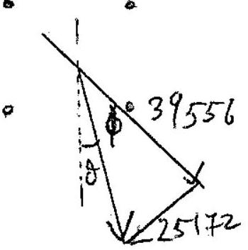

$$
\begin{aligned}
\tan \phi & = \frac { 25172 } { 3955 ^ { 6 } } \\
\phi & = 32 \cdot 5 ^ { \circ } \\
\therefore \theta & = 12 \cdot 5 ^ { \circ }
\end{aligned}
$$

Mog quote arablearing f $167 ^ { \circ }$ ar16 $8 ^ { \circ }$ May ries out the 8-99 $810 ^ { 9 }$ If $\frac { 1 } { 475 } \Rightarrow E _ { \text {total } } = 4 \cdot 7 \frac { \mathrm {~N} } { \mathrm { C } } \quad$ F 1 mont or girst we cm., bring a fattor of 104 ( - 1 mont)

(ii)

$$
\begin{aligned}
V _ { \text {centre } } & = \frac { 1 } { 4 \pi \varepsilon _ { 0 } } \frac { [ 10 + 8 - 12 - 6 ] \times 10 ^ { - 9 } } { 5 \sqrt { 2 } \times 10 ^ { - 2 } } \\
& = \frac { 8.99 } { 5 \sqrt { 2 } \times 10 ^ { - 2 } } = [ 0 ] = 0 \\
V _ { \text {midpint } } & = \frac { 1 } { 4 \pi \varepsilon _ { 0 } } \frac { [ - 12 - 6 ] \times 10 ^ { - 9 } } { 5 \times 10 ^ { - 2 } } + \frac { 1 } { 4 \pi \varepsilon _ { 0 } } \frac { [ 10 + 8 ] \times 10 ^ { - 9 } } { \left( 10 ^ { 2 } + 5 ^ { 2 } \right) ^ { \frac { 1 } { 2 } } \times 10 ^ { - 2 } } \\
& = \frac { 8.99 } { 10 ^ { - 2 } } \left( \frac { - 18 } { 5 } + \frac { 18 } { \sqrt { 125 } } \right) \\
& = 8.99 \times 1800 ( - 0.1106 ) \\
& = - 1789 \mathrm {~V}
\end{aligned}
$$

WD in maingelectron from eadre to midpoint
is

$$
\begin{aligned}
W D & = - 1789 \times 1.6 \times 10 ^ { - 19 } \\
& = - 2.86 \times 10 ^ { - 16 } \mathrm {~T}
\end{aligned}
$$

(Gignore the sign)

(a)
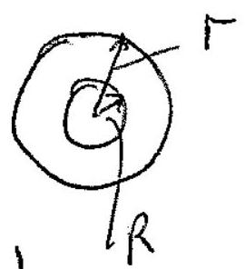

The porce acting on the tatelle ingrant at ional and given by $G M _ { p } , M$. Newton's Ind haw
stotes that this whatcaned fore is eynol or $F = m a$
with $a = \frac { V ^ { 2 } } { r }$ for a circlar subit.

$$
\therefore \quad \frac { m v ^ { 2 } } { r } = G \frac { m _ { P } \cdot m } { r ^ { 2 } }
$$

but $v = \frac { 2 \pi r } { T }$
Hence $T ^ { 2 } = \frac { 4 \pi ^ { 2 } } { G M _ { p } } \cdot \Gamma ^ { 3 }$
And we abo have at the surface, $M g = \frac { G M _ { p } \cdot m } { R ^ { 2 } }$
heme $G M _ { p } = g R ^ { 2 }$
and $T ^ { 2 } = \frac { 4 \pi ^ { 2 } } { g R ^ { 2 } } \cdot r ^ { 3 }$
(b) $\quad \frac { 4 \pi ^ { 2 } } { 9 R ^ { 2 } }$ is fixed for a centul grantatity body

For the Earth, $1 ^ { 2 } = k \cdot 1 ^ { 2 }$ in years and All.

$$
\therefore k = 1 \left( \frac { y ^ { 2 } } { d u ^ { 3 } } \right)
$$

Hence, for Tupiter.
Hence, for Tupiter.

$$
\begin{aligned}
& 11.9 ^ { 2 } = 1 . r ^ { 3 } \\
& r = 5.21 \mathrm { au }
\end{aligned}
$$

(c) Ratives of core $\approx 3.2 \times 10 ^ { 6 } \mathrm {~m}$
Denity of core $\approx ( 10 - 11 ) \times 10 ^ { 3 } \mathrm { ky } \mathrm { m } ^ { - 3 }$
The demity mutbe less than $11 \times 10 ^ { 3 }$ (since the colume $\alpha \Gamma ^ { 3 }$ and hence te dennity at hager $r$ is more significant).
Radius of markle $\approx 6.2 - 6.4 \times 10 ^ { 6 } \mathrm {~m}$
Derity of mutle $\approx 3 - 5 \times 10 ^ { 3 } \mathrm { kgm } ^ { - 3 } \checkmark$
The volume the mode munt kg.
The volume of He mode munt kg.
(3)
$( d ) ( i )$
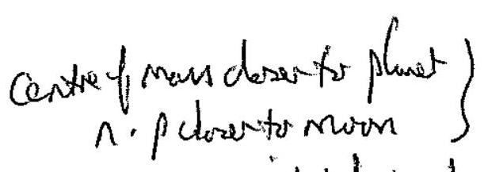
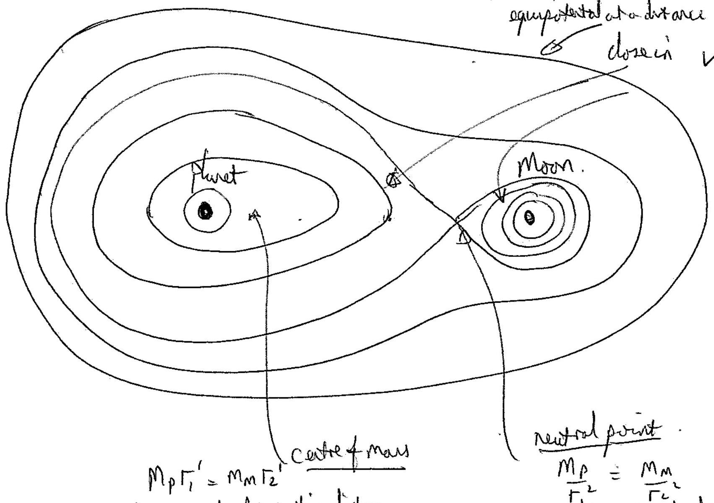
Cd/m $\approx \frac { 1 } { 9 }$ diseraction distance form plunt
neutrol point.
$$
\frac { m _ { p } } { r _ { 1 } ^ { 2 } } = \frac { m _ { M } } { r _ { L } ^ { 2 } }
$$
n.p. is what $\frac { 1 } { 4 }$ dide separtindistone frum them

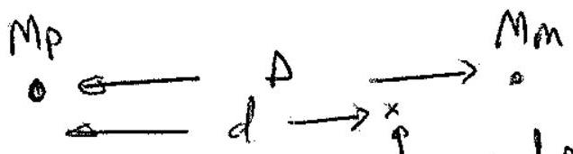

At the nutral port, the field strength form the planet walmoon are equal al in proite duration. Soll to send moon from speed of zero. Aight the $n \cdot p , \quad$ and it an fult to the mors
$\frac { f m _ { p } } { d ^ { 2 } } = \frac { 6 m _ { m } } { ( D - d ) ^ { 2 } }$
ilog per

$$
\begin{aligned}
& \therefore \sqrt { \frac { m _ { M } } { m _ { P } } } \cdot d = \Delta - d \\
& \left( 1 + \sqrt { \frac { m _ { M } } { m _ { P } } } \right) d = \Delta \\
& d = \frac { D } { \left( 1 + \sqrt { \frac { m _ { P } } { m _ { P } } } \right) }
\end{aligned}
$$

tileppoite
Foraliuating,

$$
\begin{aligned}
& d = \frac { 3.84 \times 10 ^ { 8 } } { 1 + \sqrt { \frac { 7.5 } { 60 } } } \\
& d = 2.84 \times 10 ^ { 8 } \mathrm {~m}
\end{aligned}
$$

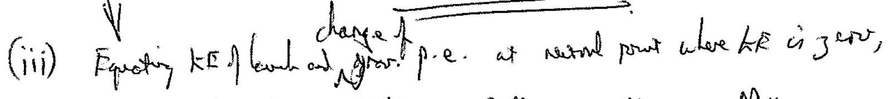

$$
\text { - } \frac { 1 } { 2 } M v ^ { 2 } = \underbrace { \frac { G M _ { p } } { R _ { p } } + \frac { G M _ { M } } { D - R _ { p } } } _ { \text {p.e. where pluet } } - \underbrace { \frac { M _ { p } } { d } - \frac { M _ { M } } { D - d } . } _ { \text {p.e. at } n - p }
$$

20, $\frac { v ^ { 2 } } { 2 G } = \frac { M _ { p } } { R _ { p } } + \frac { M _ { M } } { D - R _ { p } } - \frac { M _ { p } } { D } \left( 1 + \sqrt { \frac { M _ { M } } { R _ { p } } } \right) - \frac { M _ { p } } { D } \left( \sqrt { \frac { M _ { M } } { M _ { p } } } + \frac { M _ { R } } { M _ { p } } \right)$

$$
\begin{aligned}
& \frac { v ^ { 2 } } { 2 v } = \frac { M p } { R _ { p } } + \frac { M \mu } { D - R _ { p } } - \frac { M p } { D } \left( 1 + \sqrt { \frac { M M } { M _ { p } } } \right) ^ { 2 } \\
& \frac { v ^ { 2 } } { 2 G } = \frac { M p } { R _ { p } } + \frac { M M } { D - R _ { p } } - \frac { M P \cdot D } { d ^ { 2 } }
\end{aligned}
$$

Substativing $v = 11049 \mathrm {~m} / \mathrm { s } = 11 \times 10 ^ { 3 } \mathrm {~m} / \mathrm { s } = 11 \mathrm {~km} / \mathrm { s }$

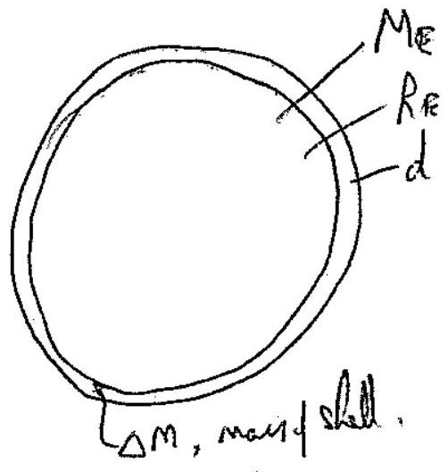

$$
g = \frac { G M _ { E } } { R _ { E } ^ { 2 } }
$$

NB the demidy given is that of the mante, \& mond not of the whole Eurth. $4 \pi R _ { 1 } ^ { 2 } \cdot d \cdot P _ { M }$.
∴ at the bottem of the shopt, $g ^ { \prime } = \frac { G \left( M _ { E } - 4 \pi R _ { E } ^ { 2 } \cdot d \cdot \rho _ { m } \right) } { R _ { E } ^ { 2 } }$

$$
= g - \frac { R E ^ { 2 } } { 4 \pi \cdot d \cdot \rho _ { m } \cdot V }
$$

$$
\left. \begin{array} { r l }
\therefore \frac { g - g ^ { \prime } } { g } = \frac { \Delta g } { g } & = \frac { G 4 \pi d \cdot \rho _ { m } } { G M _ { E } R _ { E } ^ { 2 } } \\
& = 4 \pi \frac { d \rho _ { m } } { M _ { E } } R _ { E } ^ { 2 } \\
& = 6.37 \times 10 ^ { - 4 } \\
& = 6.4 \times 10 ^ { - 2 } \% \\
& = 0.064 \%
\end{array} \right) .
$$

It the mistote is made of staticy $\frac { 4 } { 3 } \pi R _ { E } ^ { 3 } \rho _ { m } = M _ { E }$, then $\frac { \Delta g } { g }$ becomen $\frac { 3 d } { R _ { E } }$, ad thing gives $0.14 \%$ this is alrosed 13 marts if the alove Hefs we present.

$( f ) ( i )$
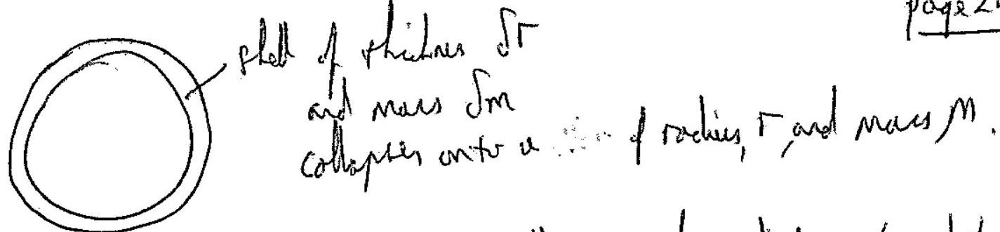

The energy lat alon $5 m$ fill, form a higa dietone $( \infty )$ to radiu, $F$, attroded by mais, $M$
radiu, $F$, attroded by mass, $M$.
is given by $\delta h ^ { \prime } = \frac { \sigma M \cdot \delta M } { \Gamma }$
But $M$ depears upor, $F$, so de seed to express in temst a syple varialle.
and $\delta m = 4 \pi r ^ { 2 } \cdot \rho \delta r$ - mass a that p ayeing $4 \pi r ^ { 2 }$ an
$M = \frac { 4 } { 3 } \pi r ^ { 3 } \cdot \rho$
for

$$
\begin{aligned}
\delta \omega & = G \frac { 4 } { 3 } \pi \frac { r ^ { 3 } \rho } { r } \cdot 4 \pi r ^ { 2 } \rho \\
& = G 4 ^ { 2 } \pi ^ { 2 } \rho ^ { 2 } \cdot r ^ { 4 } \delta r
\end{aligned}
$$

(ii) We ned to integrate the form 0 to $R$.

$$
\begin{aligned}
\int _ { 0 } ^ { a } d d V & = G \frac { 4 ^ { 2 } \pi ^ { 2 } p ^ { 2 } } { 3 } \cdot \int _ { 0 } ^ { R } r ^ { 4 } d r \\
E & = G \frac { 4 ^ { 2 } } { 3 } \pi ^ { 2 } p ^ { 2 } \cdot \frac { R ^ { 5 } } { 5 }
\end{aligned}
$$

ad subrictary back is for $M \left( M ^ { 2 } \right.$ infut)

$$
E = \frac { 3 } { 5 } \frac { G M ^ { 2 } } { K } .
$$

(iii) Dising $E = M , c \Delta T$
then $\frac { 3 } { 5 } \frac { G M ^ { 2 } } { R } = M C D T$
and

$$
\begin{aligned}
\Delta T & = \frac { 3 } { 5 } \frac { G M } { R C } \\
& = \frac { 3 } { 5 } \times \frac { 6.67 \times 10 ^ { - 11 } \times 4 \times 10 ^ { 26 } } { 6 \times 4 \times 10 ^ { 6 } \times 700 } \\
& = 3.6 \times 10 ^ { 6 } \mathrm {~K}
\end{aligned}
$$

END OF Question 2.

(a)
(i)

$$
\begin{align*}
& l T { } ^ { t } \theta ^ { t } L \quad R e s t \text { ver } V \quad T \cos \theta = m _ { g }  \tag{1}\\
& \text { " } H \cdot T \sin \theta = m _ { a } = \frac { m V ^ { 2 } } { i } \tag{2}
\end{align*}
$$

But, gremetrially, $\tan d = F / h$
Herve $\quad \frac { F } { k } = \frac { V ^ { 2 } } { r g }$
and sine $\quad V = \frac { 2 \pi r } { P }$
then $P = 2 \pi \sqrt { \frac { h } { g } }$
(ii) From (1)

$$
\begin{aligned}
\frac { T } { m y } & = \frac { 1 } { \cos \theta } \\
\therefore \quad 3 & = \frac { 1 } { \cos \theta }
\end{aligned}
$$

with $\cos \theta = \frac { h } { l } = \frac { 1 } { 3 }$
so, $\quad l = 3 h$

(b) (i)
$$
\begin{equation*}
\int _ { a } ^ { c } a \tag{1}
\end{equation*}
$$
When dightoced and releavel, the cir a notoring force $k ( a + x )$ which hy $N I I$ is $F = M a$
$$
m a = - k ( a + x ) + m g .
$$
and $f r o m ( 1 ) \quad m a = - k x$
SHM wat whatin sech that $\omega ^ { 2 } = \frac { k } { m } = \frac { g } { a }$ (funct)
$$
\therefore \quad T = 2 \pi \sqrt { \frac { a } { g } }
$$
(ii) The particles move towards each other with equalippeds/is.
$$
\begin{aligned}
& \text { They aceberate towerch earl other (but the force is not constant) } \\
& \text { as part of a cycle } \left( \frac { 1 } { 4 } \right) \text { of } 5 \text { itm. }
\end{aligned}
$$
Thestring has a fixed point in the castre. So ead half between an a is retual logal, and will cratch asit $\frac { \pi } { 2 }$ wife cought my actualed.
$$
\text { fo } k = \frac { 2 m g } { a }
$$
Hence (for one mass) $P = 2 \pi \sqrt { \frac { x } { 2 g } }$
$\frac { a } { 2 }$
$$
\text { So, acebactel finis is } \frac { A } { 4 } = \frac { \pi } { 2 } \sqrt { \frac { a } { 2 y } } V
$$
Spent Spit.
Spelel
printion.
peritio.
$$
\begin{aligned}
& \text { i.e. } \frac { 1 } { 2 } \left( \frac { 2 m y } { a } \right) \cdot a ^ { 2 } = \frac { 1 } { 2 } M v ^ { 2 }
\end{aligned}
$$
$$
\begin{aligned}
& v = \sqrt { 2 g a }
\end{aligned}
$$
Constant speed time is. $t = \frac { d } { 2 } \cdot \frac { 1 } { v } = \frac { a } { 2 \sqrt { 2 g a } } = \frac { 1 } { 2 } \sqrt { \frac { a } { 2 g } }$.
Time up to colliui is $\frac { 1 } { 2 } \sqrt { \frac { a } { 2 y } } + \frac { \pi } { 2 } \sqrt { \frac { a } { 2 y } } = \frac { 1 } { 2 } \sqrt { \frac { a } { 2 g } } ( 1 + \pi ) = 0.209 \checkmark$

(c) (i)

$$
E = \frac { F } { A } / \frac { \delta l } { l _ { 0 } } = \frac { F } { A } \frac { l } { \delta l }
$$

F is anstant rad $\int _ { 0 }$ is the initiabley the

$$
\therefore \quad F = \frac { A E d } { 0 }
$$

In the firel state, $A \rightarrow \frac { A } { 2 }$ as doubling the byget helwers $A$ $\delta t \rightarrow l _ { 0 }$ sinful
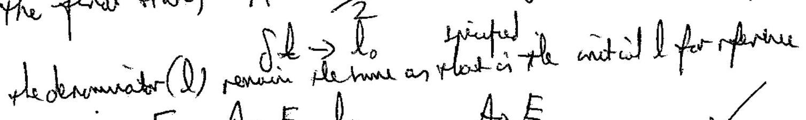

$$
F _ { f } = \frac { A _ { 0 } } { 2 } E \cdot l _ { 0 } = \frac { A _ { 0 } E } { 2 } .
$$

(ii) In stretching the dartie,

$$
\begin{aligned}
\omega D = d \omega & = F \delta x \\
& = A \frac { E x d x } { l _ { 0 } } \\
d v & = \frac { A E } { l _ { 0 } } x d x
\end{aligned}
$$

with extenvior, $x$.

$$
l _ { 0 } \text { is the initululargt. }
$$

Now $A _ { 0 } l _ { 0 } = A l$ por constant volume.

$$
\begin{aligned}
& \text { So } A = A _ { 0 } l _ { 0 } \\
& \text { al } l = l _ { 0 } + x
\end{aligned}
$$

So,

$$
\begin{aligned}
d W & = \binom { A _ { 0 } l _ { 0 } } { \frac { l _ { 0 } l _ { 0 } + x } { l _ { 0 } } } E x \cdot d x \\
& = A _ { 0 } E \cdot \frac { x } { \left( l _ { 0 } + x \right) } d x .
\end{aligned}
$$

Lot

$$
\left. \left. \begin{array} { r l }
p = l _ { 0 } + x \\
d p = d x
\end{array} \right\} \int _ { 0 } ^ { d W } = A _ { 0 } E \int _ { x = 0 } ^ { x = l _ { 0 } } \left( p - l _ { 0 } \right) \frac { d p } { p } . A _ { 0 } ^ { x = l _ { 0 } } , \mid p - l _ { 0 } \ln p \right] _ { x = 0 } ^ { x = A _ { 0 } } , \left\lvert \, \begin{aligned}
& x = l _ { 0 } \\
& W \\
& W \\
& W = A _ { 0 } E l _ { 0 } ( 1 - \ln 2 )
\end{aligned} \right.
$$

(d) (i) 41 - $T _ { \text {up } } = k x _ { 0 }$ externion of toom elastic
page 28 britton elentre. Edaiture: $M g = k - d$ Elaste: $m g = k - l$ Elaute: $m g = k - l$ $k = m g$
We know that $x _ { u } + x _ { d } + 2 l = \overline { 4 l }$

$$
\begin{equation*}
x _ { u } + x _ { d } = 2 l \tag{1}
\end{equation*}
$$

Equatey fores $T _ { \text {up } } = T d + m g$
So, $\quad k _ { x u } = k x _ { d } + M g$

Hence form (1) onl(2)

$$
\begin{aligned}
k 2 l - k x _ { d } & = k x _ { d } + A _ { y } \\
2 m g - m g & = 2 k x _ { d } \\
m g & = 2 \frac { m g } { l } \cdot x d \\
x _ { d } & = \frac { l } { 2 } \\
\therefore x _ { u } & = \frac { 3 l } { 2 }
\end{aligned}
$$

Hence ball is $l + \frac { 3 l } { 2 } = \frac { 5 l } { 2 }$ bedo celling at sqithrou.
(ii) Pisplace bull a deticure y down fruite equilitiminesitum

Then $m \ddot { y } = - k \left( \frac { 3 l } { 2 } + y \right) + k \left( \frac { l } { 2 } - y \right) + m g$ Down ispiritive.).
fo $\quad m \ddot { y } = - \frac { k 3 l } { 2 } - k y + k \frac { l } { 2 } - k y + m g$

$$
= - k l - 2 k y + m y
$$

Here $m \ddot { y } = - 2 k y$

$$
\left. \begin{array} { r l }
\Rightarrow T & = 2 \pi \sqrt { \frac { m } { 2 k } } = \pi \sqrt { \frac { 2 m } { k } } \\
& = 2 \pi \sqrt { \frac { l } { 2 g } } = \pi \sqrt { \frac { 2 l } { g } }
\end{array} \right) \theta
$$

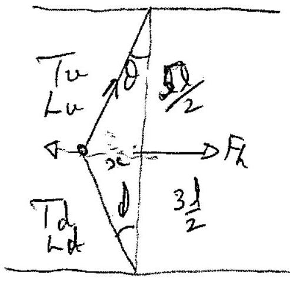

Resoringfore, $F _ { h } = T _ { u } \sin \theta + T _ { d } \sin \phi$
✓

$$
\text { Now } \begin{aligned}
& L _ { u } = \frac { 5 l } { 2 \cos \theta } \\
& L _ { d } = \frac { 3 l } { 2 \cos \phi }
\end{aligned}
$$

Hence $T _ { u } = k \left( \frac { 5 l } { 2 \cos \theta } - l \right)$
and $T _ { d } = k \left( \frac { 3 \lambda } { 2 \cos \varphi } - l \right)$

$$
\begin{aligned}
\therefore F _ { h } & = k l \left( \frac { 5 } { 2 } \cos \theta - \sin \theta \right) + k l \left( \frac { 3 } { 2 } \cos \phi + \sin \phi \right) \\
& = k l \left[ \frac { 5 } { 2 } \tan \theta - \sin \theta + \frac { 3 } { 2 } \tan \phi - \sin \phi \right] v
\end{aligned}
$$

But $\tan \theta = \sin \theta \quad$ and $\tan \theta = \frac { x \cdot 2 } { 5 l }$

$$
\tan \phi = \sin \phi \quad \text { and } \tan \phi = \frac { x } { 3 l } \cdot 2 ^ { 2 }
$$

Hence, $F _ { h } = L - l \left[ \frac { 3 } { 2 } \cdot \frac { 2 x } { 5 l } + \frac { 1 } { 2 } \frac { 2 x } { 3 l } \right]$

$$
\begin{aligned}
& = k \left[ \frac { 3 } { 5 } x + \frac { 1 } { 3 } x \right] \\
F _ { L } & = k \cdot \frac { 14 } { 15 } x
\end{aligned}
$$

Varives approve parittle leve.
Hence $m : x = - k \cdot 1 v ^ { 4 } x$
and $\omega ^ { 2 } = \frac { k } { m } \frac { 15 } { 15 } , b T = 2 \pi \sqrt { \frac { 15 m } { 14 k } } = 2 \pi \sqrt { \frac { 15 l } { 14 g } }$
(iv) $\frac { T _ { 12 } } { T _ { 1 } } = \sqrt { \frac { 15 l } { 14 g } \cdot \frac { 2 y } { l } } = \sqrt { \frac { 15 } { 7 } } = 1.46$.

Question 4
(a)| 3 (i)
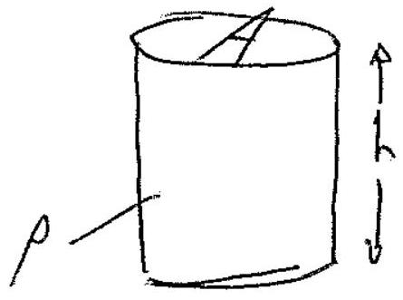

$$
\begin{aligned}
P _ { \text {bitter } } & = \text { force } = \frac { \text { bleght } } { A } \\
& = \frac { m g } { A } = \left( \rho \frac { A t } { A } \right) g \\
P & = \rho g h
\end{aligned}
$$

(ii) $\quad L$ HS. $\frac { N } { m ^ { 2 } } = m \mathrm {~kg} \mathrm {~s} ^ { - 2 } m ^ { - 2 } = m ^ { - 1 } / \mathrm { kg } ^ { - 2 }$
alls $\left. \quad \mathrm { kg } ^ { - 3 } \cdot \mathrm {~ms} ^ { - 2 } \cdot \mathrm {~m} = \mathrm { m } ^ { - 1 } \mathrm {~kg} \mathrm {~s} ^ { - 2 } \right\}$.
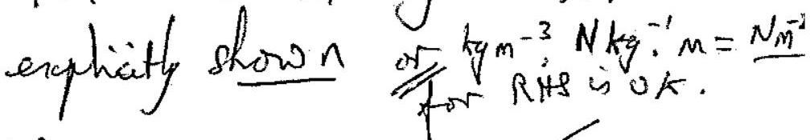
(iii) Average denity is $\frac { \rho _ { t } + \rho _ { b } } { 2 }$
$\therefore P = \frac { ( p + + p b ) } { 2 } g h$.
(iv) $g$ is abroart the force at groud burl act The air is congrewith, and is very non hisor when it is compresed under its own weyte. Anaverge denity curld le difficult to speify.
(using good air demity I I kg m-3, the let of the at mopher is 10 km ).
[ii]
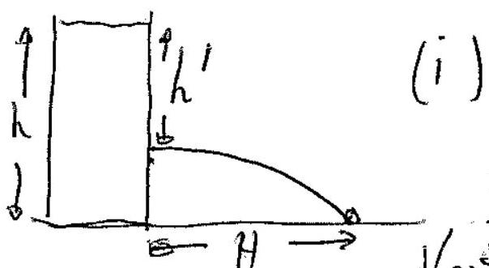
(i) Energ: $\frac { 1 } { 2 } m v ^ { 2 } = m g h ^ { \prime }$
ownite, in prepell.

$$
v ^ { 2 } = 2 y h ^ { \prime }
$$

Vertically $1 - L ^ { \prime } = \frac { 1 } { 2 } g t ^ { 2 }$
Hominating $H = v t$

$$
\begin{aligned}
& H = \sqrt { 2 g L ^ { 2 } } \cdot \sqrt { \frac { 2 h - L ^ { \prime } } { g } } . \\
& H = 2 \sqrt { h ^ { \prime } \left( h - h ^ { \prime } \right) }
\end{aligned}
$$

(ii) Momentum:

NII - force = rate of change of nomethon

$$
\frac { d ( m N ) } { d t } = P \cdot a = \rho g h ^ { \prime } \cdot a
$$

Momaten of jet of hyond energing form Lolein cun is $V \frac { d m } { d t }$

So $\quad V \frac { \Delta m } { \Delta t } = V \rho a \frac { \Delta x } { \Delta t }$
and this is equal to pgh'a.

$$
\therefore \quad \begin{aligned}
V \rho \frac { \Delta x } { \Delta t } & = \rho g ^ { 1 } \alpha \\
V ^ { 2 } & = g L ^ { 1 }
\end{aligned}
$$

So, now we have $H = \sqrt { g h ^ { \prime } } \cdot \sqrt { \frac { 2 \left( k - k ^ { \prime } \right) } { g } }$

$$
H = \sqrt { 2 h ^ { \prime } \left( h - h ^ { \prime } \right) }
$$

（b）
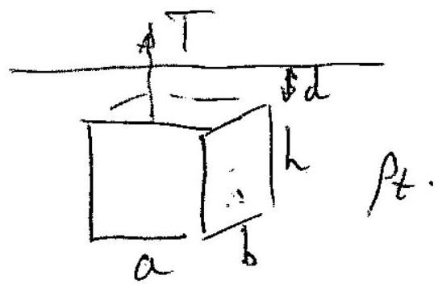
precisure on top $\hat { p } _ { t } = p _ { t } \cdot g d \quad \left( t p _ { 0 } \right)$
$\therefore \quad$ ．lothm $p _ { b } = p _ { t } \cdot g ( d + k ) \left( + p _ { 0 } \right)$
Cose 1 mar if toly have $= m _ { g } + \rho _ { t \cdot g } a b d - \rho _ { t \cdot g } ( a b d + a b h )$ net the $( a b ) \not ⿱ ⿵ 冂 䒑 十 \rightleftharpoons \mathrm { far } { } ^ { 2 } = m g - \rho t g \cdot a b h$
（ii）
$= M _ { y }$－＂Weight fliquid diaploued＂
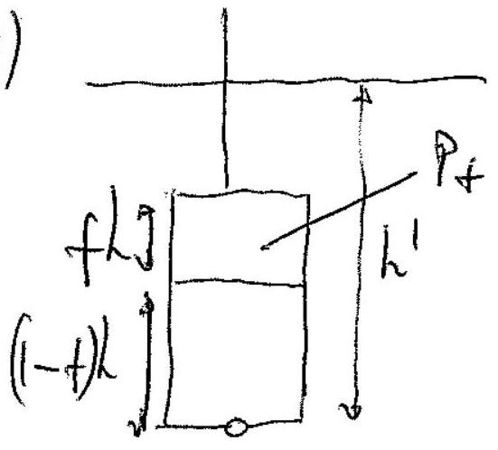

$$
P _ { f } = P _ { 0 } + \text { depthphyind-depthphoping }
$$

For ar（vothemal）gas：，
$P _ { 0 } h = P _ { + } \cdot f h$

$$
\therefore P _ { t } = \frac { P _ { 0 } } { t } .
$$

Then，$\frac { p _ { 0 } } { f } = p _ { 0 } + p g \left( k ^ { \prime } - ( 1 - t ) k \right)$

$$
\begin{aligned}
& p _ { 0 } \left( \frac { 1 - f } { f } \right) = p _ { g } \left( h ^ { \prime } - ( 1 - f ) h \right) \\
& \frac { p _ { 0 } } { \rho g } \left( \frac { 1 - f } { f } \right) = h ^ { \prime } - ( 1 - f ) h . \\
& h ^ { \prime } = \frac { p _ { 0 } } { \rho g f } ( 1 - f ) + ( 1 - f ) h \\
& h ^ { \prime } = \left( \frac { p _ { 0 } } { \rho g f } + h \right) ( 1 - f )
\end{aligned}
$$

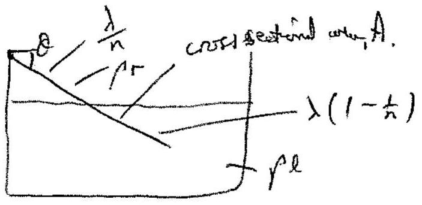

Tabe moments about the pirst.
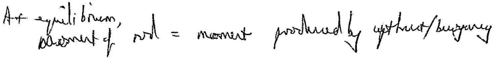

$$
\lambda A \cdot \rho _ { r } \cdot g \cdot \frac { 1 } { 2 } \lambda \cdot \cos \theta = \lambda \left( 1 - \frac { 1 } { n } \right) A \rho _ { l } \cdot g \cdot \left( \frac { \lambda } { n } + \frac { 1 } { 2 } \lambda \left( 1 - \frac { 1 } { n } \right) \right) \cos \theta ^ { 2 }
$$

$$
\begin{aligned}
\frac { \rho _ { r } } { 2 } & = \left( 1 - \frac { 1 } { n } \right) \rho l \left( \frac { 1 } { n } + \frac { 1 } { 2 } - \frac { 1 } { 2 n } \right) \\
\frac { \rho _ { r } } { 2 } & = \left( 1 - \frac { 1 } { n } \right) \rho _ { l } \frac { 1 } { 2 } \left( 1 + \frac { 1 } { n } \right) \\
\rho _ { r } & = \left( 1 - \frac { 1 } { n ^ { 2 } } \right) \rho _ { l } \\
\frac { 1 } { n ^ { 2 } } & = \frac { \rho l - \rho r } { \rho l } \\
n & = \sqrt { \frac { \rho l } { \rho l - \rho r } }
\end{aligned}
$$

(o)
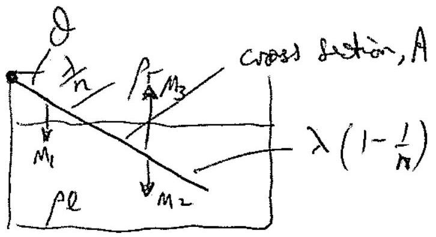

Page 34

Taking momests about ble pivit:
(M1) Weight of od xhoginal ditome $= -$ verfalmonistaf $v + d$ ord $\left( M _ { 2 } \right)$ + Weight of hymd dighlared (M3) ✓

$$
\begin{aligned}
\lambda \cdot A \rho r \cdot g \times \frac { 1 } { 2 } \frac { \lambda } { n } \cdot \cos \theta = \left[ - \lambda \left( 1 - \frac { 1 } { n } \right) A \rho r \cdot g \right. \\
\left. + \lambda \left( 1 - \frac { 1 } { n } \right) A \rho e \cdot g \right] \\
\cdot \left( \frac { \lambda } { n } + \frac { 1 } { 2 } \lambda \left( 1 - \frac { 1 } { n } \right) \cos \theta \right)
\end{aligned}
$$

distance or confy point of sulmured rod.

$$
\begin{aligned}
X \rho _ { r } \cdot \frac { 1 } { 2 } \frac { X } { n } & \left. = 1 - X \left( 1 - \frac { 1 } { n } \right) \rho _ { r } + X \left( 1 - \frac { 1 } { n } \right) \rho _ { l } \right) X \\
& = \frac { 1 } { 2 } X \left( 1 + \frac { 1 } { n } \right) \\
\frac { \rho _ { r } } { 2 } & = \left( l - \rho _ { r } \right) \left( 1 - \frac { 1 } { n } \right) \left( \frac { 1 } { 2 } \left( 1 + \frac { 1 } { n } \right) \right) \\
\rho _ { r } & = \left( \rho _ { l } - \rho _ { r } \right) \left( 1 - \frac { 1 } { n ^ { 2 } } \right)
\end{aligned}
$$

$$
n ^ { 2 } = \frac { \rho _ { l } } { \rho _ { l } - \rho _ { r } }
$$

(d) Weight of cone, $m y = \frac { 1 } { 3 }$ weight flippind degleed at equilibrum.
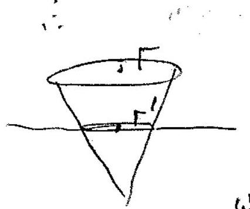

$$
\text { is give by } \quad \begin{aligned}
\frac { h } { n } \cdot \frac { 1 } { r ^ { \prime } } & = \frac { h } { r } \\
\therefore r ^ { \prime } & = \frac { r } { n }
\end{aligned}
$$

wright fliquel diaploued $= \rho _ { l } \cdot \frac { 1 } { 3 } \pi \left( \frac { r } { n } \right) ^ { 2 } \frac { h } { n } g$
$S _ { v }$

$$
\begin{aligned}
& m g = \rho _ { l } \frac { 1 } { 3 } \pi \frac { r ^ { 2 } } { n ^ { 3 } } \cdot h \cdot g \\
& m = \frac { \pi } { 3 } \cdot \rho _ { l } \frac { r ^ { 2 } h } { n ^ { 3 } }
\end{aligned}
$$

In sinting, the gpe lost is againt wa by they extract

$$
20 m y \left( h - \frac { h } { n } \right) = \int _ { \frac { h } { n } } ^ { h } \frac { \pi } { 3 } \rho e \quad r ^ { \prime } x g d x
$$

given $\frac { x } { h } = \frac { \Gamma ^ { \prime } } { \Gamma }$ so that $\Gamma ^ { \prime } = \frac { x \Gamma } { k }$
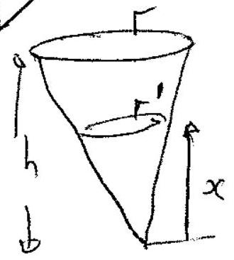

$$
2 m g \left( h - \frac { h } { n } \right) = \int _ { \frac { h } { r } } ^ { h } \frac { \pi } { 3 } \operatorname { leg } \frac { x ^ { 3 } } { h ^ { 2 } } r ^ { 2 } d x
$$

So $2 m h \left( 1 - \frac { 1 } { n } \right) = \frac { \pi } { 3 } P _ { 1 } \frac { r ^ { 2 } } { h ^ { 2 } } \left[ \frac { x ^ { 4 } } { 4 } \right] _ { \frac { h } { n } } ^ { h }$
subsitute fatem form equilition reult above,

$$
\begin{gathered}
2 h \left( 1 - \frac { 1 } { n } \right) = \frac { n ^ { 3 } } { h ^ { 3 } } \cdot \left( \frac { h ^ { 4 } } { 4 } - \frac { h ^ { 4 } } { 4 n ^ { 4 } } \right) \\
2 \left( 1 - \frac { 1 } { n } \right) = \frac { n ^ { 3 } } { 4 } \left( 1 - \frac { 1 } { n ^ { 4 } } \right) \\
8 ( n - 1 ) = ( n 4 - 1 ) \\
( n - 1 ) \left( 8 - \left( n ^ { 2 } + 1 \right) ( n + 1 ) \right) = 0 \\
( n - 1 ) \left( 8 - n ^ { 3 } - n ^ { 2 } - n - 1 \right) = 0 \\
n ^ { 3 } + n ^ { 2 } + n = 7
\end{gathered}
$$

(This carledure $\frac { n + n } { y \text { pares). } }$
END of Duertion 4.

Question 5
(a)
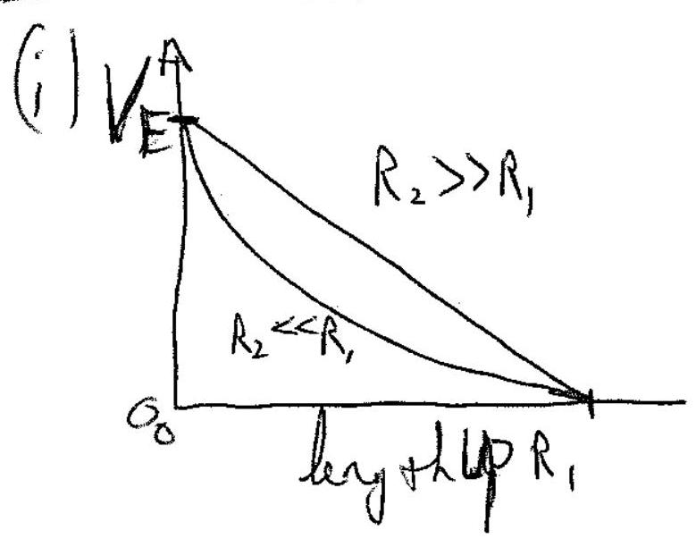

Page 36
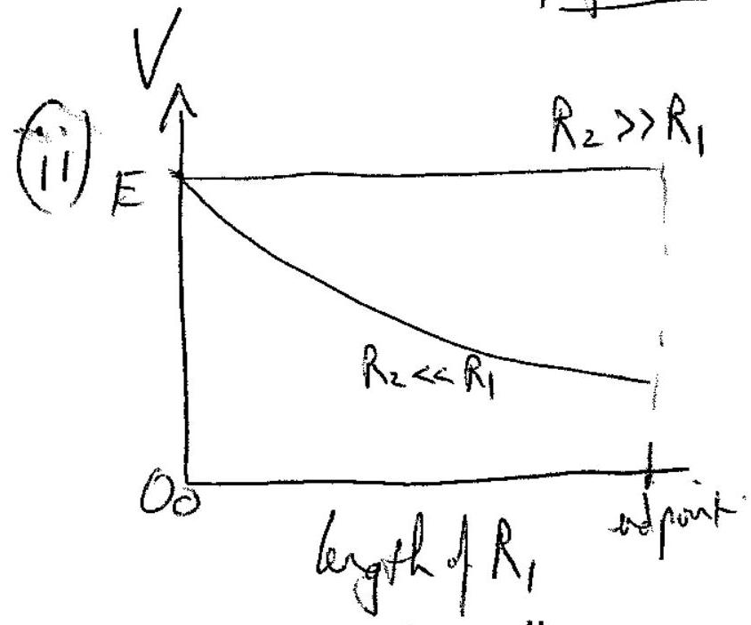

Cirmit (a) has a linear appet and cover the full range of $E$. A current is abougs flow ing throy $l R _ { 1 }$. circuit (b) does not coverele rage $E$ to $O V$.
(b)
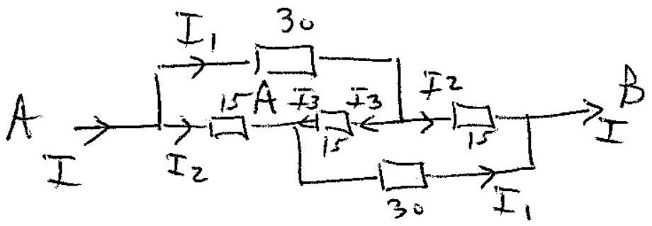
cenverts mated accorty to KI. (and graporyt)

$$
\begin{equation*}
I _ { 1 } \equiv I _ { 2 } + I _ { 3 } \tag{1}
\end{equation*}
$$

KI

$$
\begin{equation*}
I = I _ { 1 } + I _ { 2 } \tag{2}
\end{equation*}
$$

2
kII.
$( \log A ) ( 3 )$
Substitute form (2) for $F _ { 3 }$.

$$
\begin{gathered}
30 I _ { 1 } + 15 I _ { 1 } - 15 I _ { 2 } - 15 I _ { 2 } = 0 \\
\text { is } 45 I _ { 1 } = 30 I _ { 2 }
\end{gathered}
$$

From (2)

$$
I = \frac { 5 } { 2 } I _ { 1 }
$$

For AB,

$$
\begin{aligned}
V & = I _ { 1 } , 30 + I _ { 2 } 15 \\
& = \frac { 2 } { 5 } \cdot 30 \cdot I _ { + } \frac { 3 } { 5 } 15 I \\
& = 21 I \\
& \Rightarrow R = 21 \Omega
\end{aligned}
$$

$I _ { i } = 4 \mathrm {~mA}$.
$I _ { 2 } = 6 \mathrm {~mA}$
$I _ { 3 } = - 2 \mathrm {~mA}$.

(c)

$$
\text { (i) } R = \frac { \rho l } { A } = \frac { 5 \times 10 ^ { - 7 } } { \pi \left( 0.014 \times 10 ^ { - 3 } \right) ^ { 2 } } = 244 \Omega .
$$

(ii)

$$
\begin{aligned}
& \Delta R = \frac { 1 } { 300 } R = 0.81 \Omega \\
& \therefore R _ { \text {stratel } } = 244.4 \Omega .
\end{aligned}
$$

(iii) $A \cdot l$ is constant.

$$
\begin{aligned}
& A l = ( A + S A ) ( l + D l ) \\
& \approx A l + l D S + A d l \\
& l S A = - A d l \\
& \frac { \delta A } { A } = - \frac { d } { l } \\
& \Delta R = \frac { 2 } { 300 } R = 1.624 \Omega \\
& R \text { contert } = 245.2 \Omega
\end{aligned}
$$

(iv)

$$
\begin{aligned}
V _ { \operatorname { tap } } & = \frac { R _ { 1 } } { R _ { 1 } + R _ { 2 } } \times 9.0 - \left( 9.0 - \frac { R _ { 4 } \times 9.0 } { R _ { 3 } + R _ { 4 } } \right) \text { for to } ( 1 - 5 \mathrm {~V} ) \\
& = 9.0 \left( \frac { 244.41 } { 244.41 + 24.6 } - \left( 1 - \frac { 244.41 } { 243 . { } ^ { 2 } + 24.4 } \right) \right) \\
& = 9.0 ( 0.50083 - ( 1 - 0.50083 ) ) \\
& = 9 \times 1.66 \times 10 ^ { - 3 } \\
& = 0.015 \mathrm {~V}
\end{aligned}
$$

If they have cred the constant whime, then the anver is 0.030 V which is a applate.

Comber the renitame at $A B$ to be $R$. Then actl on arother section
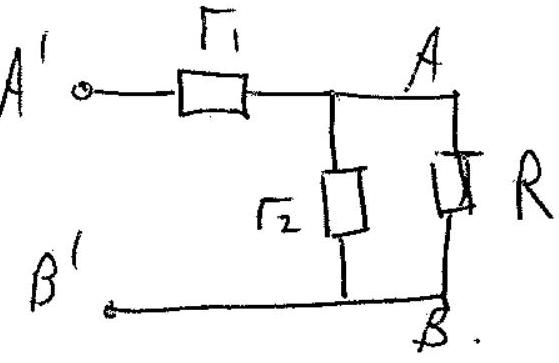

$$
R _ { A ^ { \prime } B ^ { \prime } } = \Gamma _ { 1 } + \frac { R \Gamma _ { 2 } } { R + \Gamma _ { 2 } }
$$

(past resistors)
but $R _ { A ^ { \prime } B ^ { \prime } } = R$ since it is ifficits seeses and worling a time

$$
\therefore \quad \begin{aligned}
& R \left( R + r _ { 2 } \right) = r _ { 1 } + R r _ { 2 } \\
& R ^ { 2 } + R \left( r _ { 2 } - R _ { 1 } r _ { 1 } - r _ { 2 } r _ { 1 } - R r _ { 2 } = 0 \right.
\end{aligned}
$$

ie $R ^ { 2 } - r _ { 1 } R - r _ { 1 } r _ { 2 } = 0$
So

$$
R = \frac { r _ { 1 } \pm \sqrt { r _ { 1 } ^ { 2 } + 4 r _ { 1 } r _ { 2 } } } { 2 }
$$

Then $R = \frac { 4 \pm \sqrt { 4 ^ { 2 } + 4 \cdot 4 \cdot 15 } } { 2 }$

$$
R = 10 \Omega
$$

(e) consider a cell and reciat or to represent the inficite
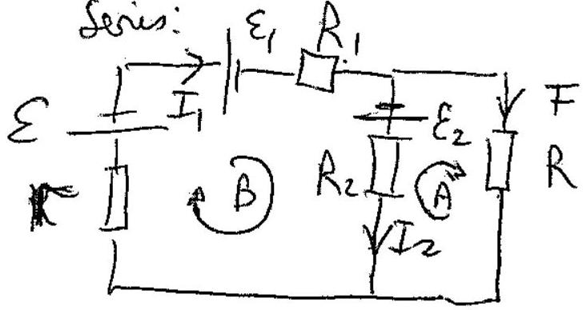
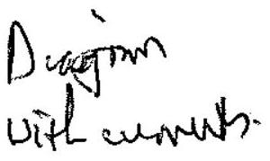
or similarly car consider
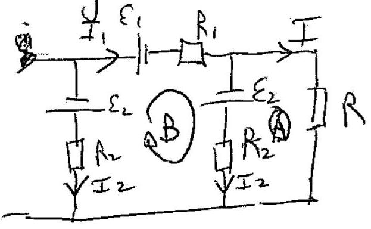
KII for $\operatorname { loop } A : \quad I R - I _ { 2 } R _ { 2 } = - \varepsilon _ { 2 }$
$$
\begin{equation*}
\therefore \varepsilon _ { z } = I _ { 2 } R _ { 2 } - I R \tag{1}
\end{equation*}
$$
for $\operatorname { lop } B . \quad I _ { 1 } R _ { 1 } + I _ { 2 } R _ { 2 } - I _ { 2 } R _ { 2 } = - \varepsilon _ { 1 } + \varepsilon _ { 2 } - \varepsilon _ { 2 }$
$$
\begin{equation*}
\text { is } \quad I _ { 1 } R _ { 1 } = - \varepsilon _ { 1 } \tag{2}
\end{equation*}
$$
and $\varepsilon _ { 1 } = - I _ { 1 } R _ { 1 }$
$k I \quad I _ { 1 } = I + I _ { 2 }$
so $I + \frac { \varepsilon _ { 2 } + I R } { R _ { 2 } } = - \frac { \varepsilon _ { 1 } } { R _ { 1 } }$
Hence $I R _ { 1 } R _ { 2 } + \varepsilon _ { 2 } R _ { 1 } + I R R _ { 1 } = - \varepsilon _ { 1 } R _ { 2 }$
$$
\begin{aligned}
& I \left( R _ { 1 } R _ { 2 } + R R _ { 1 } \right) = - \left( \varepsilon _ { 1 } R _ { 2 } + \varepsilon _ { 2 } R _ { 1 } \right) \\
& I = - \frac { \left( \varepsilon _ { 1 } R _ { 2 } + \varepsilon _ { 2 } R _ { 1 } \right) } { \left( R _ { 1 } R _ { 2 } + R R _ { 1 } \right) }
\end{aligned}
$$
$\varepsilon _ { 1 } = 1.0 \mathrm { v } , \varepsilon _ { 2 } = 2.0 \mathrm { v }$
$R _ { 1 } = 4,0 \Omega , R _ { 2 } = 6 \Omega$
$R = 1.0 \Omega$
$$
I = - \frac { ( 1.6 + 2.4 ) } { ( 4.6 + 1.4 ) } = \frac { ( - 1 ) 4 } { 28 } = 0.5 \mathrm {~A}
$$

Question 6
(a) (i) a charge $Q$ ploss, so that $Q _ { 1 } = Q _ { 2 } ( \in Q )$
(ii) $\left. \quad V _ { 1 } = \frac { Q } { c _ { 1 } } \cdot \frac { E \left( c _ { 1 } + c _ { 2 } \right) } { c _ { 1 } } \right\} \quad V _ { 2 } = \frac { Q } { c _ { 2 } } \left\{ \frac { V c _ { 1 } } { \left( c _ { 1 } + c _ { 2 } \right) } \right\}$
(iii) and $V = V _ { 1 } + V _ { 2 }$,

$$
\text { So } \begin{aligned}
& V = \frac { Q } { C _ { 2 \mu } } = \frac { Q } { C _ { 1 } } + \frac { Q } { C _ { 2 } } \\
& \text { Here } \frac { 1 } { C _ { 2 q } } = \frac { 1 } { C _ { 1 } } + \frac { 1 } { C _ { 2 } }
\end{aligned}
$$

(iv)

$$
\begin{aligned}
E _ { 1 } + E _ { 2 } & = \frac { Q ^ { 2 } } { 2 C _ { 1 } } + \frac { Q ^ { 2 } } { 2 C _ { 2 } } \\
& = \frac { Q _ { 2 } ^ { 2 } } { 2 } \left( \frac { 1 } { C _ { 1 } } + \frac { 1 } { C _ { 2 } } \right) \\
& = \frac { Q ^ { 2 } } { 2 C _ { 2 } \mu } \\
& = \frac { 1 } { 2 } Q V
\end{aligned}
$$

Battery nepplin QV,
is holf ple sengy is disaspacted
(b) (i) Wiet pletes discomeded, donthy plexperation clurbles the supertid difference hetween them.

Charge remain fisced.
w $\frac { 1 } { 2 } Q V$ is doubled. i.e. $\frac { 1 } { 2 } \subset V ^ { 2 }$ doubled.

$$
\begin{aligned}
W D & = \frac { 1 } { 2 } \times 15 \times 10 ^ { - 9 } \times 70 ^ { 2 } \\
& = 3.7 \times 10 ^ { - 5 } \mathrm {~J}
\end{aligned}
$$

(ii) Pokatid find, but twice separtin, so E full havel Hence Q a hotwed

$$
\text { or we } C = \varepsilon _ { 0 } A
$$

$$
\begin{aligned}
E _ { f } - E _ { i } & = \left( \frac { 1 } { 2 } - 1 \right) 3.7 \times 10 ^ { - 5 } \mathrm {~J} \\
& = - 1.8 \times 10 ^ { - 5 } \mathrm {~J}
\end{aligned}
$$

rese in inclusituri of the syn.

(c) (i)

$$
2 \mu \mathrm {~F} \frac { + \square } { - \square } = 4 \mu \mathrm {~F}
$$

totulchage is $120 \times 2 = 240 \mu \mathrm { C }$

$$
\text { on } 6 \mu F \Rightarrow V = 40 \mathrm {~V}
$$

$$
\begin{aligned}
\text { laitial enery } & = \frac { Q _ { 1 } ^ { 2 } } { 2 C _ { 1 } } + \frac { Q _ { 2 } ^ { 2 } } { 2 C _ { 2 } } \\
& = \frac { 1 } { 2 } ( 120 \mu \mathrm { C } ) ^ { 2 } \left( \frac { 1 } { 2.0 \mu \mathrm {~F} } + \frac { 1 } { 4.0 \mu \mathrm {~F} } \right) \\
& = 5.4 \times 10 ^ { - 3 } \mathrm {~J}
\end{aligned}
$$

$$
\begin{aligned}
\text { Find every } & = \frac { 1 } { 2 } C V ^ { 2 } \\
& = \frac { 1 } { 2 } 6 \times 10 ^ { - 6 } \times 40 ^ { 2 } \\
& = 4 \cdot 8 \times 10 ^ { - 3 } \mathrm {~J}
\end{aligned}
$$

charge of every is $6 \times 10 ^ { - 4 } \mathrm {~J}$
(ii) On first cartait, the potentius are of bance in spler + prote.

$$
\begin{equation*}
\text { i.e. } \frac { Q } { C _ { \text {plue } } } = \frac { q - Q } { C _ { \text {plue } } } \tag{1}
\end{equation*}
$$

Find piltation autle two, $V _ { f }$ inginerly

$$
\begin{equation*}
V _ { f } = \frac { Q _ { f } } { c _ { \text {splue } } } = \frac { q } { Q _ { p } \text { lote. } } . \tag{2}
\end{equation*}
$$

Substituting in (1)

$$
\begin{aligned}
& \frac { Q } { Q _ { f } } = \frac { q - Q } { q } \\
& \frac { 1 } { Q _ { f } } = \frac { 1 } { Q } - \frac { 1 } { q } \\
& E Q _ { f } = \frac { q Q } { q - Q }
\end{aligned}
$$

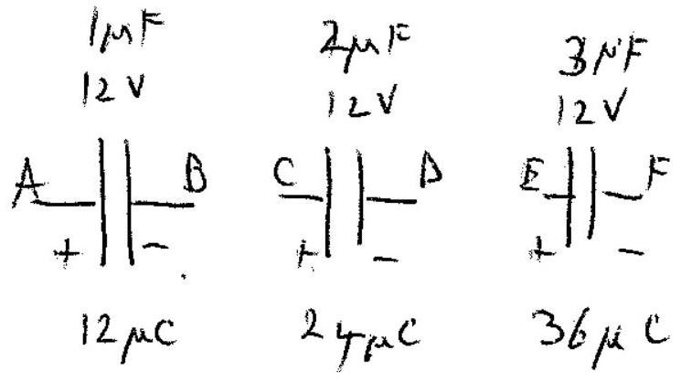

Computed
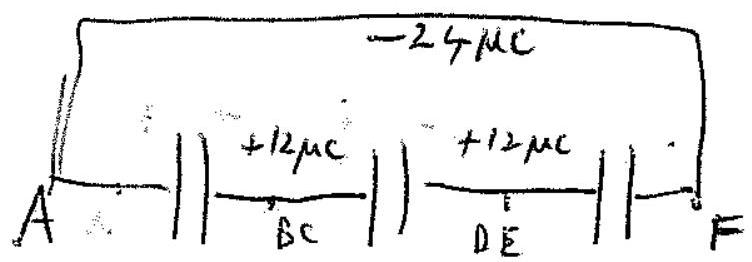

$$
\begin{array} { c c c c }
+ y _ { 1 } & - y _ { 1 } & t y _ { 2 } & - y _ { 2 } \\
\sigma _ { V _ { 1 } } & v ^ { 2 } & v _ { 2 } & v _ { 3 } \\
v _ { 3 } & v _ { 3 } &
\end{array}
$$

Dy comeration fergy (KrichaffI)

$$
\begin{equation*}
V _ { 1 } + V _ { 2 } + V _ { 3 } = 0 \tag{1}
\end{equation*}
$$

roluted plotes :

$$
\begin{align*}
& - q _ { 1 } + q _ { 2 } = 12 \mu c  \tag{2}\\
& - q _ { 2 } + q _ { 3 } = 12 \mu c  \tag{3}\\
& - q _ { 3 } + q _ { 1 } = - 24 \mu c \tag{4}
\end{align*}
$$

From (1) We mey write ( $V = \frac { \varphi } { c }$ )

$$
q _ { 1 } + \frac { q _ { 2 } } { 2 } + \frac { q _ { 3 } } { 3 } = 0 \quad [ q \text { i } \mu c ]
$$

or $x 6 - 6 q _ { 1 } + 3 q _ { 2 } + 2 q _ { 3 } = 0$
So, sulstituting for $q 1$ from (4) and $q 2$ from (3)

$$
\begin{align*}
6 \left( q _ { 3 } - 24 \right) + 3 \left( q _ { 3 } - 12 \right) + 2 q _ { 3 } & = 0  \tag{3}\\
6 q _ { 3 } - 6.24 + 3 q _ { 3 } - 36 + 2 q _ { 3 } & = 0 \\
q _ { 3 } = 180 & = 16 \frac { 18 } { 11 } \mu C
\end{align*}
$$

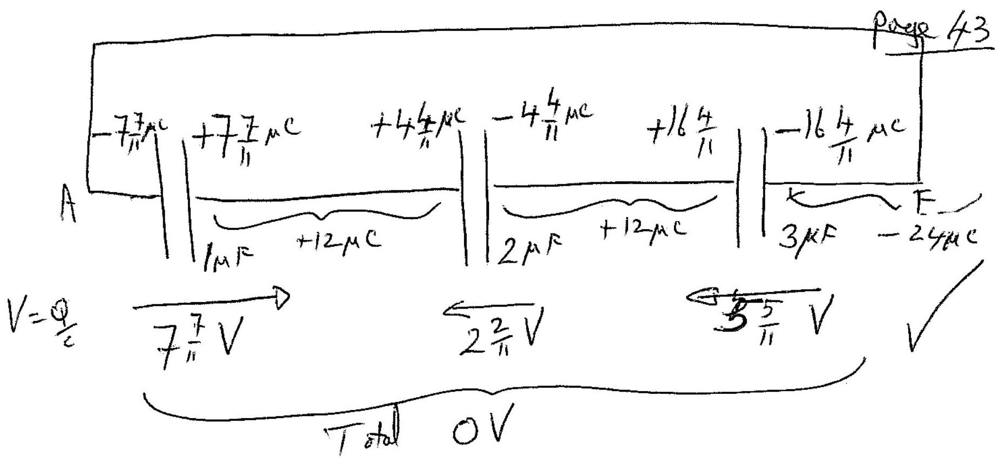
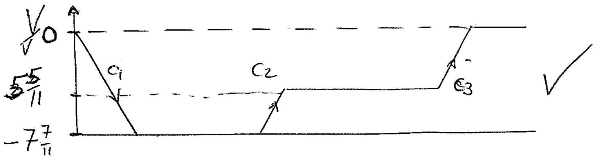

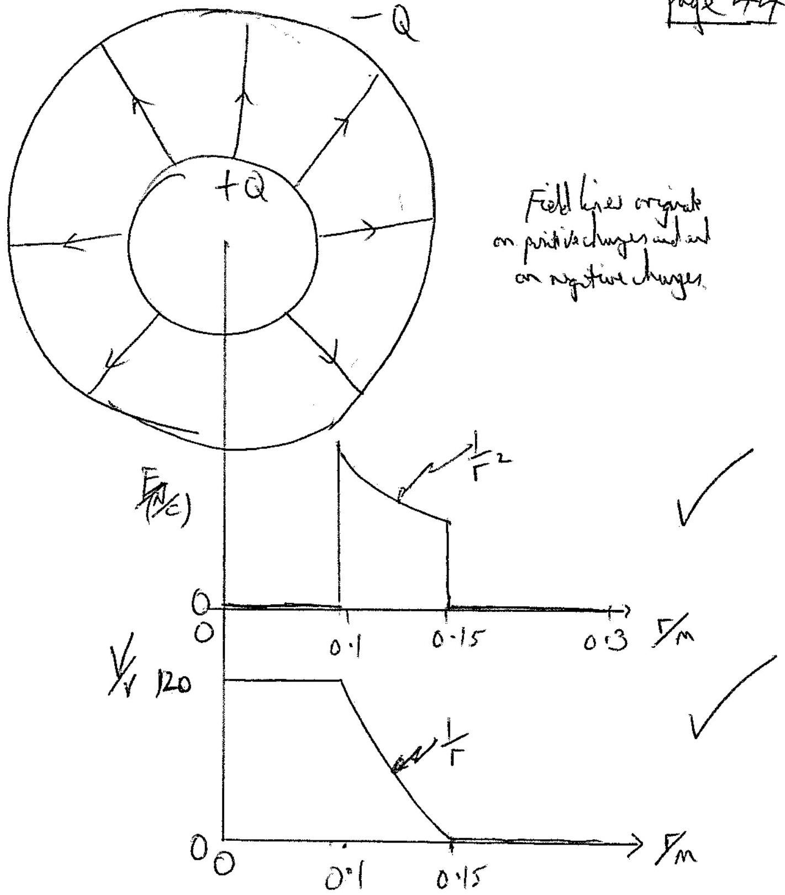

(iii)
$$
\begin{aligned}
& V _ { i } = \frac { 1 } { 4 \pi \varepsilon _ { 0 } } \cdot \frac { Q } { 0.1 } \\
& V _ { 0 } = \frac { 1 } { 4 \pi \varepsilon _ { 0 } } - \frac { Q } { 0.15 }
\end{aligned}
$$
(iv)
$$
\begin{aligned}
V _ { i } - V _ { 0 } = 120 V & = \frac { 1 } { 4 \pi \varepsilon _ { 0 } } \cdot Q \left( \frac { 1 } { 0.1 } - \frac { ( - 1 ) } { 0.15 } \right) \\
120 & = 8.94 \times 10 ^ { 9 } \cdot Q \left( \frac { 0.25 } { 0.015 } \right) \\
Q & = 8.0 \times 10 ^ { - 10 } \mathrm { C }
\end{aligned}
$$

(e)
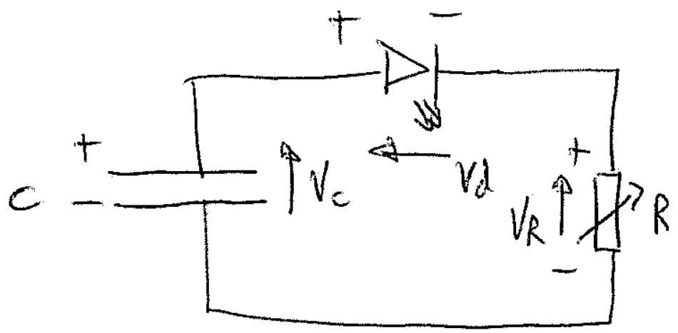

$$
\begin{gathered}
V _ { c } = V _ { d } + V _ { R } \\
\left( V _ { 0 } - \frac { Q } { c } \right) = V _ { d } + I R \\
V _ { 0 } - \frac { 1 } { c } \int _ { 0 } ^ { t } I d t = V _ { d } + I R
\end{gathered}
$$

charge Q Plows, reduing $V _ { c }$ from $V _ { 0 }$

I is contint (stated: quatin)

$$
\begin{aligned}
\therefore \quad V _ { 0 } - \frac { I } { c } \int _ { 0 } ^ { t } d t & = V _ { d } + I R \\
V _ { 0 } - \frac { I } { c } t & = V _ { d } + I R \\
R & = - \frac { t } { c } + \frac { \left( V _ { 0 } - V _ { d } \right) } { I }
\end{aligned}
$$

So Ruvier hirarly with time - it decreases to zero
When $R = 0$.

$$
\begin{aligned}
t & = \frac { c \left( V _ { 0 } - V _ { d } \right) } { I } \\
& = 0.4 \times 10 ^ { - 6 } \frac { ( 5.0 - 2.7 ) } { 0.8 } \\
& = \frac { 2.3 } { 2.7 } \times 10 ^ { - 6 } \\
& = 1.15 \times 10 ^ { - 6 } \mathrm {~s}
\end{aligned}
$$
