## BPhO Round 1 Marking- November 2019

Updated $9 { } ^ { \text {th } }$ Dec 2019
Thank you for taking part in marking the scripts. It is of enormous benefit to young students to be able to take part in these competitions, tackling much harder problems than they normally get, and be able to have them marked by physicists who know what they are doing. It is because of your expertise in the subject that it is possible to do this. Exams marked by non-specialists are more of a tick box exercise, which is of little value in stretching students to grasp the subject at a deeper level. The layout of the work may be annoying. That is a national problem and we are not going to change that easily, although we do our best, as do the teachers of these students.

- Positive marking is the aim. Marks should be awarded for good physics, even if the reasoning does not follow the mark scheme. Alternative routes to the answers can be allowed.
- Significant figures. This is not a test of significant figures. A leeway of ±1 sig fig is generally allowed, but we are not being strict at all in penalising for sig figs. If the published solution gives 3, allow 2 or 4 in the students answer. However, unless they have put down all of the figures on their calculator, there are no questions this year that are likely to invoke a sig fig penalty.
- Some answers can be left in fractional form.
- Units should be given for the final answer. It may be that the unit is given a little earlier and that it does not appear on the very last line. Some allowance may be made if it is clear that the unit has been used a line or two earlier.
- If the units are a required part of the answer for the mark, they must be there.
- Error carried forward (ecf) is allowed provided ridiculous results do not start appearing. A mark is lost for the initial mistake, but then they can carry on (if it is possible) to gain some of the subsequent marks for the next one or two steps only. You do not need to spend time working through laborious arithmetic calculations if there is a possible ecf. Just make a decision as to whether they should have the single mark or not.
- You are not required to spend time deciphering scribble.
- There may be a lot of working for the answer. If they are almost there, you may give the mark even if there is a numerical mistake in the last line. Use your judgement. The ticks for the marks are not exact i.e. they are for the idea and almost getting there.
- Full marks are awarded for the correct answer, provided that there is some supporting working and it is not a "show that" question.
- You must follow the mark scheme so that we mark CONSISTENTLY. Do not make your own independent mark scheme.
- Avoid relying on your memory for the mark allocation. You need the mark scheme open beside you.

If you need advice, email Robin Hughes rh584@cam.ac.uk . I will respond promptly. You can send a phone photo or just ask a question. We want to be fair in the marking, so your good judgment should be acceptable.

1. Do not mix up students' names when entering marks.
2. Add up the marks correctly. Check your addition. For each little section, note the total in a circle, as in the mark scheme. Then note the total for the page at the bottom in two parallel lines to distinguish it.
3. Do not leave papers in any unsecured place. The loss of papers would be serious. They are confidential.

## Nov 2019 Round I Settion I.

(a) 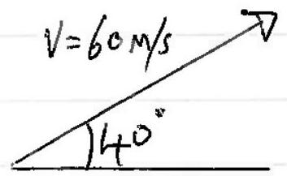
$$
\text { (i) } \begin{aligned}
\quad V _ { v } & = u - g t \\
& = 60 \sin 40 - 9.81 \times 3 \\
& = 9.14 \mathrm {~m} / \mathrm { s }
\end{aligned}
$$
$$
\begin{aligned}
\therefore \quad V = 46.9 \mathrm {~m} / \mathrm { s } \cdot 0 \mathrm {~m} / \mathrm { s } & \text { at } \theta = \tan ^ { - 1 } \frac { 9.137 } { 45.96 } \\
& = 11.2 ^ { \circ } \text { above horgotal }
\end{aligned}
$$
[margisted, direction]
(ii)
$$
\begin{aligned}
S _ { v } & = u t - \frac { 1 } { 2 } g t ^ { 2 } \\
& = u \sin 8 \cdot t - \frac { 1 } { 2 } g t ^ { 2 } \\
& = 60 \cdot \sin 40 \cdot 3 - \frac { 1 } { 2 } 9.81 \times 3 ^ { 2 } \\
& = 71 \cdot 6 \mathrm {~m} \\
\hline S _ { H } & = 60 \cos 8 \cdot 3 \\
& = 138 \mathrm {~m}
\end{aligned}
$$
(b) Drone:
$$
\begin{aligned}
& \vec { s } = 2 t \hat { \imath } + 6 t \hat { \jmath } \\
& \vec { v } = 2 \hat { \imath } + 6 \hat { \jmath }
\end{aligned}
$$
(i) speed $= \sqrt { 2 ^ { 2 } + 6 ^ { 2 } } = 2 \sqrt { 10 } = 6.3 \mathrm {~m} / \mathrm { s }$
(ii) Bearing at $t = 2 s$ is
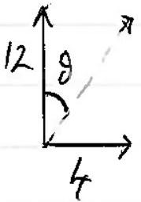
$$
\begin{aligned}
& \tan \theta = \frac { 4 } { 12 } = \frac { 1 } { 3 } \\
& g = 18.4 ^ { \circ } = 018.4 ^ { \circ }
\end{aligned}
$$
(iii) $\quad a = 0$
$$
\left( \operatorname { dov } 18,4 ^ { \circ } \right) .
$$

(C) Areal denisty of paper $\sim 100 \mathrm { gm } ^ { 2 }$
$$
\begin{aligned}
\text { pintral } & \approx 1 \mathrm {~mm} \times 1 \mathrm {~mm} \\
& = 10 ^ { - 6 } \mathrm {~m} ^ { 2 } \\
\therefore \text { mass } & = 10 ^ { - 6 } \times 100 \mathrm {~g} \\
& = 10 ^ { - 4 } \mathrm {~g} \\
& = 10 ^ { - 7 } \mathrm {~kg}
\end{aligned}
$$
$$
\begin{aligned}
& \text { Clar working approach } \\
& \text { Justrumbers - } 0
\end{aligned}
$$
$$
\frac { 3 \times 10 ^ { - 8 } } { 1 . e .0 .3 \times 10 ^ { - 7 } } \leqslant M \leqslant 9 \leqslant 9 \times 10 ^ { - 7 } \frac { \mathrm {~kg} } { \mathrm {~kg} }
$$
(d)
$$
\begin{array} { l l }
{ [ a ] \text { is } } & \frac { m } { s ^ { 2 } } \\
{ [ b ] \text { is } } & \frac { k g } { s ^ { 2 } }
\end{array}
$$
$$
\text { cross sestional wran of strout is } A , b _ { \text {lyth } } , l \text {.. }
$$
(e)
$$
\begin{aligned}
& R _ { A l } = \frac { \rho _ { A l } \cdot l } { 6 A } \\
& R _ { S } = \frac { \rho _ { S } \cdot l } { A }
\end{aligned}
$$
$$
\begin{aligned}
& \text { eciter correct } \\
& \text { form ainy renitivity }
\end{aligned}
$$
$$
R _ { \text {cable } } : \frac { 1 } { R _ { c } } = \frac { 1 } { R _ { \text {Al } } } + \frac { 1 } { R _ { s } } \Rightarrow R _ { c } = \frac { R _ { \text {Al } } \cdot R _ { s } } { R _ { \text {Al } } + R _ { s } }
$$
As the colof relarestle resirtane of the calle by $\delta R$ to $R _ { c }$,
$$
\text { Then, } R _ { c } + \delta R = R _ { A l }
$$
$$
\begin{aligned}
\delta v & \delta R = R _ { A l } - R _ { c } \\
& = R _ { A l } - \frac { R _ { A } \cdot R _ { s } } { R _ { A l } + R _ { s } } \\
& = \frac { R _ { A l } ^ { 2 } } { R _ { A l } \cdot R _ { s } } \\
& = \frac { \rho _ { A l } \cdot l } { 6 A } \times \frac { \rho _ { A l } \cdot \frac { 1 } { \left( \rho _ { A l } + 6 \rho _ { s } \right) } \frac { 1 } { 6 A } } { \frac { 1 } { 6 A } } \\
& = \frac { \rho _ { A l } \cdot l } { 1 + 6 \rho _ { A l } }
\end{aligned}
$$

$$
\begin{aligned}
\therefore l & = \frac { 6 A } { \rho _ { A l } } \cdot \delta R \left( 1 + 6 \cdot \frac { \rho _ { 3 } } { \rho _ { A l } } \right) \quad \checkmark \text { chore for } l \\
& = \frac { 1.4 \times 10 ^ { - 4 } \times 6 \times 5 \times 10 ^ { - 4 } } { 3.2 \times 10 ^ { - 8 } } \left( 1 + 6 \times \frac { 20 } { 3.2 } \times \frac { 10 ^ { - 8 } } { 10 ^ { - 8 } } \right) \\
& = 1.4 \times \frac { 30 } { 3.2 } \left( 1 + \frac { 120 } { 3.2 } \right) \\
& = \frac { 42 } { 3.2 } ( 1 + 37.5 ) \\
& = 505 \mathrm {~m} \\
& = 500 \mathrm {~m}
\end{aligned}
$$

Dennity
$( f )$
(fotantin)
Sinks wen weight of $P _ { t }$ and wt.d $K$ equal weight folf dighaced

$$
\begin{gathered}
\rho _ { H g } V _ { H g } \cdot g = \rho _ { P t } \cdot V _ { P t } \cdot g + \rho _ { k } \cdot V _ { k } \cdot g \\
V _ { H g } = V _ { P t } + V _ { k } \\
\therefore \quad 13 \cdot 6 \left( V _ { P t } + 10 \right) = 21 \cdot 5 \cdot V _ { P t } + 0 \cdot 89 \times 10 \\
V _ { P t } + 10 = \frac { 21 \cdot 5 } { 13 \cdot 6 } \cdot V _ { 1 + } + \frac { 8 \cdot 9 } { 13 \cdot 6 } \\
10 - \frac { 8 \cdot 9 } { 13 \cdot 6 } = V _ { P t } \left( \frac { 21 \cdot 5 } { 13 \cdot 6 } - 1 \right) \\
V _ { P t } = 16 \cdot 1 \mathrm {~cm} ^ { 3 } = 16 \mathrm { sn } ^ { 3 }
\end{gathered}
$$

candition is words or equation
correct subtistution
or dyetricilly,
or dyetraically,

$$
V _ { 1 t } + V _ { k s } = \frac { p _ { p _ { t } } } { p _ { k y } } \cdot V _ { p _ { t } } + \frac { p _ { k } } { p _ { k y } } \cdot V _ { k }
$$

(4)

$$
\begin{aligned}
& 10 \times 0.89 + x = 21.5 = 13.6 ( 10 + x ) 0 = \left( \frac { \rho _ { 1 t } } { \rho _ { 1 t } } - 1 \right) V _ { 1 t } + \left( \frac { \rho _ { k } } { \rho _ { H / g } } - 1 \right) V _ { k } \\
& 8.9 + 21.5 x = 136 + 13.600 \\
& \begin{array} { c }
7.9 x = 127.1 \\
x = 16.1 \mathrm {~cm} ^ { 3 }
\end{array} \quad V _ { t } = \frac { \left( \rho _ { 1 g } - \rho _ { k } \right) } { \left( \rho _ { 1 t } - \rho _ { H } \right) } V _ { k } = \left( \frac { 13.6 - 0.9 } { 21.5 - 13.6 } \right) \cdot 10 = 16 \cdot 1 \mathrm {~cm} ^ { 3 } \\
& = \frac { 16 \mathrm {~cm} ^ { 3 } } { 16 }
\end{aligned}
$$

* Allor/mater if mised up pt od k to give 16.1:10 ratio ie.6.2 cm ${ } ^ { 3 }$. k.

1ce Metting

(9) I by of ice has whene 1.087 bitre. So there we 3.913 I of woter in the budet and herne 3.913 kg flwater
Heat 0.5 kg of be + 0.5 kg greaker yo to Tail and energ Cammontric cool 3.913 kg of war form $15 ^ { \circ } \mathrm { C }$ to T find idea / nequession
$$
\therefore \quad 3.913 \times 4180 \times \left( 15 - T _ { t } \right) = 0.5 \times 3.34 \times 10 ^ { 5 } + 9.5 \times 4.180 \times ( T - 0 )
$$
$$
3.913 \times 4180 \times 15 - 0.5 \times 3.34 \times 10 ^ { 5 } = ( 3.913 + 0.5 ) 4180 T
$$
$$
\frac { T = 4.25 ^ { \circ } \mathrm { C } } { = 4.3 { } ^ { \circ } \mathrm { C } }
$$
Not 4.8°C as thy have mused out the ice-rooter wanning (0.5bg)

(h) Ferry and bout next pas

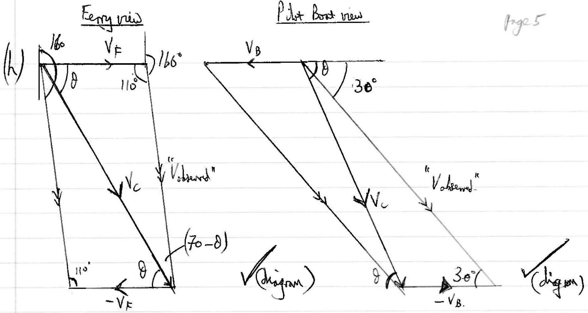

Since Rule

$$
\frac { V _ { c } } { \sin 110 ^ { \circ } } = \frac { V _ { F } } { \sin \left( 7 _ { 0 } ^ { \circ } - 8 \right) }
$$

$$
\frac { V _ { c } } { \sin 30 ^ { \circ } } = \frac { V _ { B } } { \sin ( \theta - 30 ) }
$$

Dividing to dininide $V _ { c }$, (procedure)

$$
\frac { \sin 30 } { \sin 110 } = \frac { \sin ( 8 - 30 ) } { \sin ( 70 - d ) } \cdot \frac { V _ { F } } { V _ { B } } - 7 \cdot 5
$$

$$
\begin{aligned}
\frac { 5 } { 7.5 } \frac { \sin 110 } { \sin 30 } \sin ( \theta - 30 ) & = \sin ( 70 - 8 ) \\
1.253 ( \sin \theta \cos 30 - \sin 30 \cos 8 ) & = \sin 70 \cos 8 - \cos 70 \sin \theta \\
1.427 \sin \theta & = 1.566 \cos \theta \\
\tan \theta & = 1.097 \\
\theta & = 47.7 ^ { \circ }
\end{aligned}
$$

$$
\begin{aligned}
& { \left[ \tan \theta = \frac { 5 } { \left( 2 \sqrt { 3 } + 3 \tan 20 ^ { \circ } \right) } \right] \quad \text { Bearing is } 138 ^ { \circ } } \\
& V _ { c } = \frac { 0.5 \times 7.5 } { \sin \left( \theta - 3 \theta ^ { \circ } \right) } = 12.36 = 12.4 \mathrm {~m} / \mathrm { s }
\end{aligned}
$$

Cor ovelorating.
(i) $\quad F \cdot V = P$
so

$$
\text { Mav } = P
$$

Zeromarks affer this point to they we eque.
and

$$
M _ { x } v \cdot \frac { d V _ { x } } { d x } v = P
$$

$\left. a = \frac { V d v } { d x } \right]$ for costant acoleration
fo

$$
M V ^ { 2 } d V = P d x
$$

Integrating

$$
\left. \begin{array} { r l }
m \frac { v ^ { 3 } } { 3 } & = P x + c \\
\text { At } x = 0 , v & = 0 \quad \therefore c = 0 .
\end{array} \right\}
$$

constant of itypot in is zeer serifeally evaluated at $x = 0 , v = 0$
or

$$
F \cdot V = \frac { d } { d t } \left( \frac { 1 } { 2 } m V ^ { 2 } \right)
$$

and

$$
\begin{aligned}
a \frac { d x } { d t } = & \frac { d } { d t } \left( \frac { 1 } { 2 } M v ^ { 2 } \right) \\
\therefore \quad a \frac { d x } { d t } & = V \frac { d V } { d t } \\
\text { at } a & = V \frac { d V } { d x } .
\end{aligned}
$$

etc. as above.

$$
\begin{aligned}
& \quad E _ { k } = \\
& \frac { 1 } { 2 } M v ^ { 2 } = \\
& t = \frac { M } { 2 } = \sqrt { \frac { 2 P t } { M } } \\
& \int _ { 0 } ^ { x } d x = \sqrt { \frac { 2 P } { m } } \int _ { 0 } ^ { t } t ^ { \frac { 1 } { 2 } } d t \\
& x = \sqrt { \frac { 2 P } { m } } \frac { 2 } { 3 } t ^ { \frac { 3 } { 2 } }
\end{aligned}
$$

$$
\begin{aligned}
& \text { त्hence } x = \sqrt { \frac { 8 p t ^ { 3 } } { 9 m } } = \\
& = \\
& \therefore \quad V = \left( \frac { 3 p x } { m } \right) ^ { \frac { 1 } { 3 } }
\end{aligned}
$$

(f)
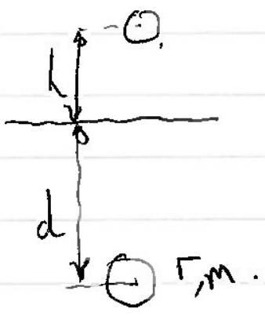

$$
\begin{aligned}
& \text { Net farce upwwals = burgarey fore } - \text { we gha } \\
& \qquad \begin{array} { l }
m a = p _ { w } \cdot V \cdot g - m g
\end{array}
\end{aligned}
$$

a is conotant, so equs. of motion apply (implied)
At depth d, $V ^ { 2 } = 0 ^ { 2 } + 2 \left( \frac { p \cdot l \cdot l } { m } \cdot g - g \right) \cdot d$ " $V ^ { 2 } = 2 g h$ " at surface.

$$
\begin{aligned}
\therefore \quad 2 g h & = 2 g \left( \rho \frac { w } { m } \cdot V - 1 \right) d \\
\frac { L } { d } & = \left( \rho _ { \frac { w } { } } \cdot V - 1 \right) \\
\frac { L } { d } & = \left( \frac { 4 } { 3 } \pi \frac { r ^ { 3 } \rho } { m } - 1 \right)
\end{aligned}
$$

- Lose 1 mark of $\left( 1 - \frac { 4 } { 3 } \pi \frac { r ^ { 3 } p } { m } \right)$ is. wrong sign.

## Egg Tiner

(k)

$$
\begin{aligned}
& \frac { d m } { d t } = k \rho \cdot A \cdot g \\
& { \left[ M T ^ { - 1 } \right] = \left[ M L ^ { - 3 } \right] ^ { \alpha } \cdot \left[ L ^ { 2 } \right] ^ { \beta } \cdot \left[ L T ^ { - 2 } \right] ^ { \gamma } }
\end{aligned}
$$

dineernoial

$$
\mathrm { kg } ^ { - 1 } = \left( \mathrm { kg } ^ { - 3 } \right) ^ { \alpha } \cdot \left( \mathrm { m } ^ { 2 \beta } \cdot \left( \mathrm {~ms} ^ { - 2 } \right) ^ { \gamma } \right.
$$

or unit egration.
$\sigma$
aquating possens

$$
\begin{aligned}
\operatorname { kg } & 1 = \alpha \\
m & - 1 = - 2 \gamma \\
0 & = - 3 \alpha + 2 \beta + \gamma
\end{aligned}
$$

$$
\begin{aligned}
& \Rightarrow \alpha = 1 \\
& \Rightarrow \gamma = \frac { 1 } { 2 } \\
& \Rightarrow \beta = \frac { 5 } { 4 } .
\end{aligned}
$$

$$
\begin{aligned}
& \frac { d m } { d t } = k \rho A ^ { \frac { 5 } { 4 } } \cdot g ^ { \frac { 1 } { 2 } } \\
& \frac { \Delta m } { \Delta t _ { M } } / \frac { \Delta m } { \Delta t _ { E } } = \sqrt { \frac { g _ { M } } { g _ { E } } }
\end{aligned}
$$

$$
\begin{aligned}
& \text { I for } \alpha \text { and } p \\
& ( 1 \text { mat for } \gamma )
\end{aligned}
$$

$$
\begin{aligned}
\Delta t _ { m } & = \Delta t _ { E } \sqrt { \frac { g _ { E } } { g m } } \\
& = \sqrt { \frac { 9.8 } { 1.6 } } \times 15 \\
& = 37.1 \text { monites }
\end{aligned}
$$

Ever if they offair this renutt, thy need the other purs to be correct in this question.

(l)
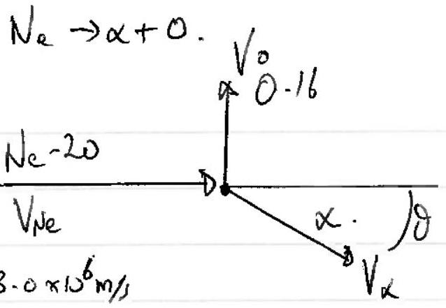
Cons of moon along the fluit $20.4 \times V _ { N _ { e } } = 4 \mu \cdot V _ { \alpha } \cos \theta$
... + the f phy kt
square ad all $\quad 400 V _ { \text {ak } } ^ { 2 } + 256 V _ { 0 } ^ { 2 } = 16 V _ { \alpha } ^ { 2 }$
Consef energy: $\frac { 1 } { 2 } \cdot 20 u \cdot V _ { N _ { e } } ^ { 2 } + F _ { 0 } = \frac { 1 } { 2 } \cdot 4 u \cdot V _ { \alpha } ^ { 2 } + \frac { 1 } { 2 } \cdot 16 u \cdot V _ { 0 } ^ { 2 }$
Substituting values.
In (3)
In (4)
(x2) $\quad$ So, $20 u \left( 9 \times 10 ^ { 12 } \right) + 210 ^ { - 12 } = 4 u \cdot V _ { \alpha } ^ { 2 } + \left( V _ { \alpha } ^ { 2 } - \frac { 3 \cdot 6 \times 10 ^ { 15 } } { 16 } \right) u$
and Substitute (5) ÷ 16

ploce flying

(m) 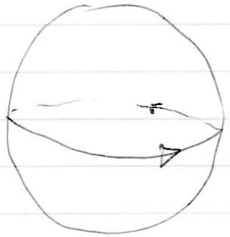
$$
\begin{aligned}
V _ { E } & = \frac { 2 \pi T } { T } \\
& = \frac { 2 \pi \times 6.37 \times 10 ^ { 6 } } { 24 \times 3600 } \\
& = 463 \mathrm {~m} / \mathrm { s } .
\end{aligned}
$$
spend dravor.
$$
\begin{aligned}
& W _ { 1 } = m g - m \left( \frac { 463 - 250 } { r } \right) ^ { 2 } \\
& W _ { 2 } = m g - m \left( \frac { 4 + 63 + 250 } { r } \right) ^ { 2 }
\end{aligned}
$$
subtrad your w $\frac { V ^ { 2 } } { F }$
add quota al $\frac { v ^ { 2 } } { r }$.
$$
W _ { 1 } - W _ { 2 } = \frac { m } { r } \left[ ( 463 + 250 ) ^ { 2 } - ( 465 - 250 ) ^ { 2 } \right\}
$$
$$
\begin{aligned}
W _ { 2 } - W _ { 1 } = \frac { w } { F } \left[ \left( \sigma _ { E } + V _ { p } \right) ^ { 2 } \right. & = \frac { 1 } { 6.37 \times 10 ^ { 6 } } \left[ 713 ^ { 2 } - 213 ^ { 2 } \right] \\
= & = \frac { 926 \times 500 } { 6.37 \times 10 ^ { 6 } } \\
= & 4 \sqrt { E } - V _ { p } \\
= & 4 + 36 \times 250 ) \\
= & 0.073 \mathrm {~N} \\
= & = 0.073 \mathrm {~N} \\
= & = 0.073 \mathrm {~N}
\end{aligned}
$$
full markfor the arow som ay country,
Glash bubs.
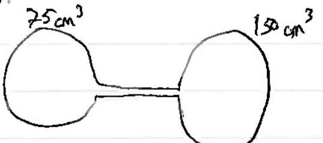
Quantity y gu ( $n$ moles) is firsed
iba
Then
$$
\begin{aligned}
n & = \frac { P _ { 1 } V _ { 1 } } { R T _ { 1 } } + \frac { P _ { 2 } V _ { 2 } } { R T _ { 2 } } = \frac { P } { R T } \left( V _ { 1 } + V _ { 2 } \right) \\
& = \frac { 0.91 \times 10 ^ { 5 } } { 8.31 \times 261 } \left( 225 \times 10 ^ { - 6 } \right) \text { Voluer and behi } \\
& = 9.44 \times 10 ^ { - 3 } \text { moles Vremalt }
\end{aligned}
$$
valuen.
And in kelvin
$$
\begin{aligned}
& = P _ { 7 + 2 } \frac { r 10 ^ { - 6 } } { 8.31 } \left( \frac { 75 } { 297 } + \frac { 150 } { 261 } \right) . \\
P _ { f + 1 } & \equiv 94832 \mathrm {~Pa} \\
& = 95000 \mathrm {~Pa} \checkmark \text { realt. }
\end{aligned}
$$

Current is $6.0 \Omega$ renter.
(0)
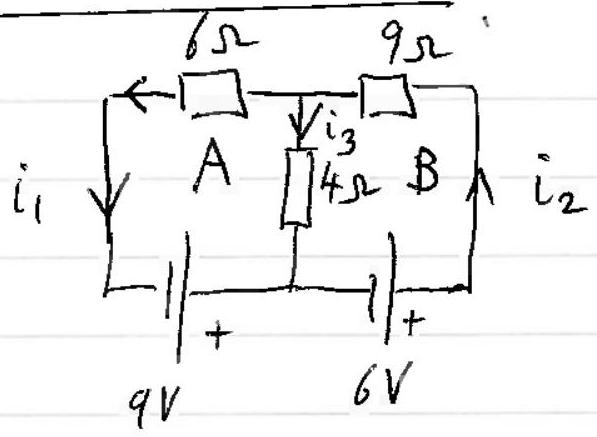
ccepents wall directain moded
kIII Loop $A : q = - 4 i _ { 3 } + 6 i _ { 1 }$

$$
\begin{equation*}
B : b = 9 i _ { 2 } + 4 i _ { 3 } \tag{1}
\end{equation*}
$$

kI $\quad i _ { 2 } = i _ { 1 } + i _ { 3 }$

Labstictute for is is (1)

$$
\begin{aligned}
& q = 6 i _ { 2 } - 6 i _ { 3 } - 4 i _ { 3 } \\
& q = 6 i _ { 2 } - 10 i _ { 3 }
\end{aligned}
$$

subtract (2)

$$
\begin{aligned}
\rightarrow \quad \frac { 3 } { 2 } 9 - 6 & = - 15 i _ { 3 } - 4 i _ { 3 } \\
7 \cdot 5 & = - 19 i _ { 3 } \\
i _ { 3 } & = - \frac { 7.5 } { 19 } = - 0.395 \mathrm {~A}
\end{aligned}
$$

So

$$
\begin{aligned}
& q = 6 i _ { 1 } - 4 i _ { 3 } \\
& i _ { 1 } = \frac { 47 } { 38 } = 1,237 = 1 \cdot 24 \text { A flowing }
\end{aligned}
$$

to the left.
Photoelestric Affect.

$$
\begin{aligned}
E _ { \gamma } = h _ { c } & = 1.326 \times 10 ^ { - 18 } \mathrm {~J} \\
\bar { \lambda } & = 8.2875 \mathrm { eV }
\end{aligned}
$$

Max ke of emitted electrons is $8.2875 - 4.5 \mathrm { eV }$

$$
= 3.7875 \mathrm { eV }
$$

So

$$
\begin{aligned}
\frac { V _ { \text {max } } } { } & = 3.7875 \mathrm {~V} = 3.8 \mathrm {~V} \\
V _ { \text {ave } } & = \frac { 1 } { 4 \pi \varepsilon _ { 0 } } \cdot \frac { Q } { r } \\
\therefore \quad Q & = 4 \pi \varepsilon _ { 0 } + V _ { \text {ran } } \\
& = 8.42 \times 10 ^ { - 13 } \mathrm { C } . \\
& = 5.3 \times 10 ^ { 6 } \text { electrons. }
\end{aligned}
$$

$( q )$
Three conducting places

$$
k = \frac { 1 } { 4 \pi \varepsilon _ { 0 } }
$$

${ } _ { 3 } R$ (1) ${ } _ { 2 } R$ (2)

$$
\begin{aligned}
& V = \frac { k Q } { \Gamma } \\
& Q = \frac { i V } { K }
\end{aligned}
$$

$$
\begin{aligned}
Q _ { \text {total } } & = Q _ { 1 } + Q _ { 3 } \\
& = \frac { 1 } { 3 } \frac { R V } { k } + \frac { R V } { k } \\
Q _ { t } & = \frac { 4 } { 3 } \frac { R V } { k }
\end{aligned}
$$

Then 3 sphere are commeted and read putant ad $V ^ { \prime }$
So

$$
\begin{aligned}
Q _ { t } & = \frac { R } { 3 } \frac { V ^ { \prime } } { k } + \frac { R } { 2 } \frac { V ^ { \prime } } { k } \\
& = \frac { R V ^ { \prime } } { k } \left( \frac { 1 } { 3 } + \frac { 1 } { 2 } + 1 \right) \\
& = \frac { R V ^ { \prime } } { k } \cdot \frac { 11 } { 6 }
\end{aligned}
$$

$\therefore \quad \frac { 4 } { 3 } \frac { R V } { k } = \frac { 11 } { 6 } \frac { R V ^ { \prime } } { k } \quad \Rightarrow V ^ { \prime } = \frac { 8 } { 11 } V$
(fluelf math subr:
for thi meditl;
Hence

$$
\begin{aligned}
\frac { Q _ { 2 } } { Q _ { \text {total } } } = & \frac { \frac { R } { 2 } \frac { V ^ { \prime } } { K } } { \frac { 4 } { 3 } \frac { R V } { K } } \\
= & \frac { \frac { R } { 2 } \frac { 8 } { 11 } V } { \frac { 4 } { 3 } A V } = \frac { 8.3 } { 2.11 .4 } \\
& = \frac { 3 } { 11 }
\end{aligned}
$$

## Thenal condustion

(T) ideliefocenten
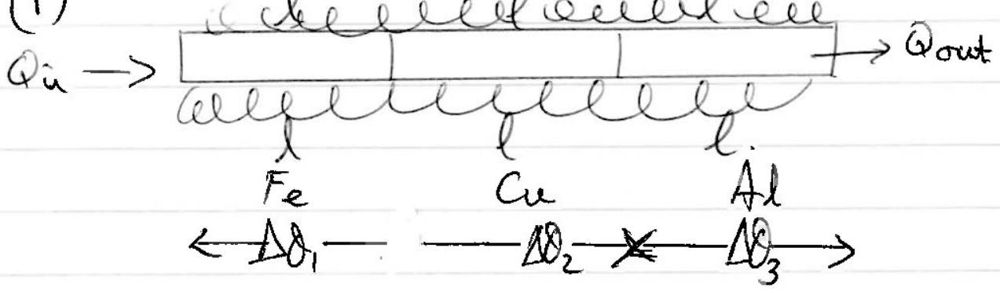

So

$$
\left. \begin{array} { r l }
k _ { 1 } A \frac { \Delta \theta _ { 1 } } { l } = k _ { 2 } A \frac { \Delta \theta _ { 2 } } { l } = k _ { 3 } A \Delta \theta _ { 3 } \\
k _ { 1 } \Delta \theta _ { 1 } = k _ { 2 } \Delta \theta _ { 2 } = k _ { 3 } \Delta \theta _ { 3 }
\end{array} \right\}
$$

✓ either form
and $\Delta \theta _ { 1 } + \Delta \theta _ { 2 } + \Delta \theta _ { 3 } = 100$
Now de can wite $\Delta \theta _ { 1 } = \frac { k _ { 2 } } { k _ { 1 } } \Delta \theta _ { 2 }$
ad $\Delta \theta _ { 2 } = \frac { k _ { 3 } } { k _ { 2 } } \cdot \Delta \theta _ { 3 }$
Hence

$$
\Delta \theta _ { 1 } = \frac { k _ { 2 } } { k _ { 1 } } \cdot \frac { k _ { 3 } } { k _ { 2 } } \cdot \Delta \theta _ { 3 }
$$

So that $\left( \frac { k _ { 3 } } { k _ { 1 } } + \frac { k _ { 3 } } { k _ { 2 } } + 1 \right) A \theta _ { 3 } = 100$
$\sqrt { v } _ { \approx } \stackrel { \text { vr } } { \approx }$ equident
Thus $\left( \frac { 240 } { 60 } + \frac { 240 } { 400 } + 1 \right) \Delta \theta _ { 3 } = 100$ $\approx$ step

$$
\begin{gathered}
\Delta \theta _ { 3 } = \frac { 100 } { 5 \cdot 6 } = 17 \cdot 86 ^ { \circ } \mathrm { C } \\
\Delta \theta _ { 1 } = \frac { k _ { 3 } } { k _ { 1 } } \Delta \theta _ { 3 } = 4 \cdot 4 \theta _ { 3 } = 7 \cdot 43 ^ { \circ } \mathrm { C } \\
\Delta \theta _ { 2 } = \frac { k _ { 3 } } { k _ { 2 } } \Delta \theta _ { 3 } = \frac { 3 \times 100 } { 400 } \Delta \theta _ { 3 } = 10 \cdot 7 ^ { \circ } \mathrm { C }
\end{gathered}
$$

$\therefore \quad$ Cu $/ \mathrm { Al }$ funition is $17.9 ^ { \circ } \mathrm { C }$
$\mathrm { Fe } / \mathrm { Cu }$ juistion is $17.86 + 10 - 7 = 28.6 ^ { \circ } \mathrm { C }$

búyde prump
(s)
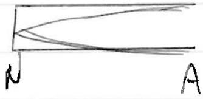
disgleement suble + actinotes.
$\frac { \lambda } { 4 }$ fundamental rote in tube (ignove edefect).

$$
\therefore \frac { \lambda } { 4 } = \frac { 330 } { 4 \times 512 } = 0.161 \mathrm {~m}
$$

Bayle's Law $\quad P _ { 1 } V _ { 1 } = P _ { 2 } V _ { 2 }$

$$
10 ^ { 5 } \times 25 \mathrm {~cm} = P _ { 2 } \times 16.1 \mathrm {~cm}
$$

$$
P _ { 2 } = 1.55 \times 10 ^ { 5 } \mathrm {~Pa}
$$

$$
\begin{aligned}
\therefore \quad F & = \left( P _ { \text {inide } } - P _ { \text {at } } \right) \times \text { area } \\
& = ( 1.55 - 1.0 ) \times 10 ^ { 5 } \times A \\
F & = 5.5 \times 10 ^ { 4 } \mathrm {~A} \quad \text { newtons. }
\end{aligned}
$$

$\left( P _ { \text {in } } - P _ { \text {at } } \right)$.
(t)

$$
\frac { d \theta } { d t } = - k \left( \theta - \theta _ { 0 } \right) _ { \checkmark } \longrightarrow \frac { \Delta \theta } { \Delta t } = k \left( \theta - \theta _ { 0 } \right)
$$

(need 8-80)
Integrate. $\left. \ln \left( \theta - \theta _ { 0 } \right) \right| _ { \theta _ { i } } ^ { \theta _ { f } } = , - \left. k t \right| _ { 0 } ^ { t }$

$$
\begin{aligned}
& \ln \left( \theta _ { j } - \theta _ { 0 } \right) = - k t \\
& \left( \theta _ { i } - \theta _ { 0 } \right) \\
& \ln \left( \frac { 29.7 - 20 } { ( 30.2 - 20 ) } \right) = - k _ { i }
\end{aligned}
$$

$$
\text { So, } k = \frac { 0.5 } { 9.95 } \quad \checkmark = \frac { 0.5 } { \frac { 9.95 } { t } } ( 3.5 )
$$

Herve $\tan \left( \frac { 9 - 7 } { 10 - 2 } \right) = - k$

$$
\Rightarrow t = 5.7 \text { minutes }
$$

$$
k = 0.0503 \checkmark
$$

So.
So.

$$
\begin{gathered}
\ln \left( \frac { 23 - 20 } { 20 x - 20 } \right) = - 0.0503 t \\
\ln \frac { 3 } { 4 } = - 0.0503 t \\
t = 5.7 \text { minutes }
\end{gathered}
$$

Question 2
(a)

$$
\begin{aligned}
E & = m g L \\
P & = \frac { m g L } { E } \\
& = 3380 \times 10 ^ { 3 } \times 9.81 \times 61 \quad V \text { (cirrect values) } \\
& = 2.02 \times 10 ^ { 9 } \mathrm {~W} \\
P & = \rho g L , \quad F = \rho \mathrm { AgL } \\
P & = F \cdot V \\
& = \rho A V g L \\
& = 3380 \times 10 ^ { 3 } \times 9.81 \times 61 \\
& = 2.02 \times 10 ^ { 9 \mathrm {~W} }
\end{aligned}
$$

(b) To keep from beleting the outht, the water mut key mony. $P _ { \text {wartal } } = \frac { 1 } { 2 } \frac { n v ^ { 2 } } { t }$

$$
\begin{aligned}
& = \frac { 1 } { 2 } 3380 \times 10 ^ { 3 } \times 8 ^ { 2 } \\
& = \frac { 0.108 \times 10 ^ { 9 } \mathrm {~W} } { 2.023 } = 0.11 \times 10 ^ { 9 } \mathrm {~W} \\
\eta = 1 - \frac { 0.108 } { 2.023 } & = 1 - 0.16535 \\
& = 94.7 \% \\
& = 95 \%
\end{aligned}
$$

(3)
(c) (i)
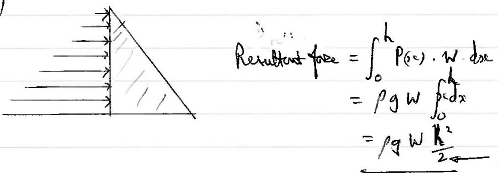
requirel.
or Procieslivory wishdept. ⇒ overge pressere $= \rho \frac { \rho h } { 2 }$.

$$
\left. \begin{array} { r l }
\therefore \text { periftent fare } & = \rho g \frac { L } { 2 } \cdot ( h w ) ^ { 2 } \\
& = \rho g w \frac { h ^ { 2 } } { 2 }
\end{array} \right\}
$$

(ii) 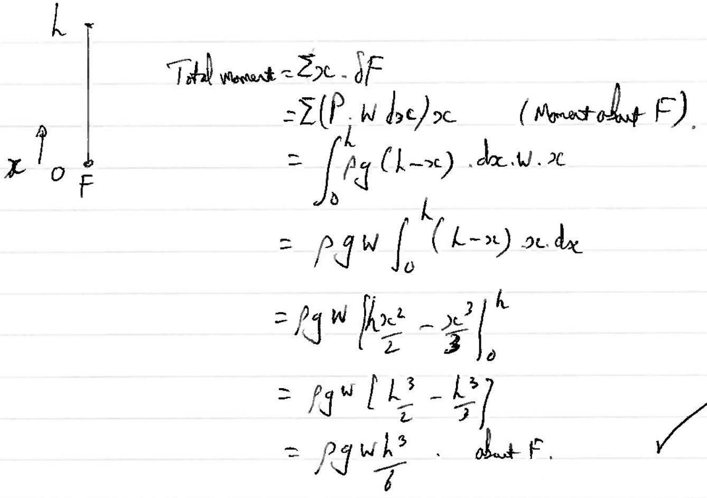
Uning the previous reultant force asting at Lot H from F,
$$
\begin{equation*}
H \cdot \rho g w \frac { L ^ { 2 } } { 2 } = \rho g \omega \frac { L ^ { 3 } } { 6 } \tag{3}
\end{equation*}
$$
gives $H = \frac { h } { 3 }$ above $F$.
C Afternatively, form the top of the dan,
Tothel moment $= \int _ { 0 } ^ { k } p g x d x \cdot W \cdot x$
$$
\begin{aligned}
& = \left. \rho g w \frac { x ^ { 3 } } { 3 } \right| _ { 0 } ^ { h } \\
& = \rho y w \frac { h ^ { 3 } } { 3 } .
\end{aligned}
$$
Uning reuttant force acting at a point It' below the top fillows $\rho g W \frac { L ^ { 3 } } { 3 } = \rho g W \frac { L ^ { 2 } } { 2 } \cdot H ^ { \prime }$
to $H ^ { \prime } = \frac { 2 } { 3 } h$ bero therep of tectan. so $\frac { 1 } { 3 } h$ alove $F$.
(iii) 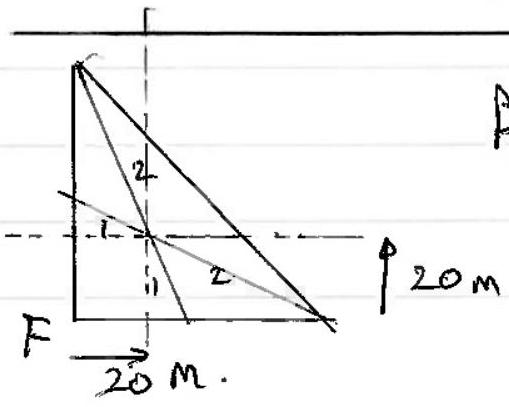
By prportions, cate of mass is 20 m abof $F$ and 20 mto the ight F.

(iv) Moment about $C$ due to $W ⿱ ㇒ 日$ ter pressure:
This is the fame as the moment about F.
So, Mom about $C$ is $p g w \frac { k ^ { 3 } } { 6 }$
$$
\begin{aligned}
& = 1000 \times 9.81 \times 2700 \times \frac { 60 ^ { 3 } } { 6 } \\
& = 9.54 \times 10 ^ { 11 } \mathrm { Na }
\end{aligned}
$$
Mom. abuf C check wightf dam is $\frac { 1 } { 2 }$ W.t. $\operatorname { Lg } \int$ constee $\times \frac { 2 } { 3 } t$
$$
\begin{align*}
& = \frac { 1 } { 2 } 2700 \times 60 ^ { 2 } \times 9.81 \times \rho _ { \text {ove } } \times 40  \tag{3}\\
& = 1.91 \times 10 ^ { 9 } \rho _ { \text {crenerse. } }
\end{align*}
$$
(Vi)
$$
\begin{aligned}
& \therefore P _ { \text {conerste } } = \frac { 9.54 \times 10 ^ { 11 } } { \frac { 1 } { 2 } 2700 \times 60 ^ { 2 } \times 9.81 \times 40 } \\
& = 500 \mathrm {~kg} / \mathrm { m }
\end{aligned}
$$
(v) $\mu \cdot \frac { 1 } { 2 } w t h g \rho _ { \text {cone. } } = \rho g w \frac { h ^ { 2 } } { 2 }$.
$$
\begin{aligned}
\mu t \rho _ { \text {con } } & = \rho h \\
\rho _ { \text {con } } & = \frac { \rho h } { \mu t } = \frac { 1000 \times \frac { 60 } { 0.75 } } { 60 } \\
& = 1300 \frac { \mathrm {~kg} } { \mathrm {~m} ^ { 3 } }
\end{aligned}
$$

(d) (i) Energy flow into boundary = energ flos out floudary $\omega ^ { 2 } z _ { 1 } A _ { i } ^ { 2 } = \omega ^ { 2 } z _ { 1 } A _ { r } ^ { 2 } + \omega ^ { 2 } z _ { 2 } A _ { t } ^ { 2 }$
$$
z _ { 1 } \left( A _ { i } ^ { 2 } - A _ { r } ^ { 2 } \right) = z _ { 2 } A _ { t } ^ { 2 }
$$
(ii) $z _ { 1 } \left( A _ { i } ^ { * } - A _ { r } \right) \left( A _ { i } + A _ { r } \right) = z _ { z } A _ { z } ^ { 2 }$
Divite by equ. 1 separt $\overline { \left( A _ { i } + A r \right) ^ { 2 } } = \overline { A _ { t } ^ { 2 } }$ then $Z _ { 1 } \frac { \left( A _ { i } - A _ { r } \right) } { \left( A _ { i } + A _ { r } \right) } = Z _ { 2 }$
$$
\begin{gathered}
z _ { 1 } \left( \frac { 1 - A _ { r } } { \left( 1 + \frac { A _ { i } } { A _ { i } } \right) } = z _ { 2 } \right. \\
z _ { 1 } - z _ { 1 } \frac { A _ { r } } { A _ { i } } = z _ { 2 } \frac { A _ { r } } { A _ { i } } \\
\frac { A _ { 1 } } { A _ { i } } = \frac { \left( Z _ { 1 } - Z _ { 2 } \right) } { \left( Z _ { 1 } + Z _ { 2 } \right) }
\end{gathered}
$$
✓ for derivation Chightme fromenes. we frol requit etc.
(iii)
$$
\begin{aligned}
\frac { A _ { t } } { A _ { i } } & = 1 + \frac { A _ { i } } { A _ { i } } \\
& = \frac { z _ { 1 } + z _ { 2 } + z _ { 1 } - z _ { 2 } } { \left( z _ { 1 } + z _ { 2 } \right) } \\
& = \frac { 2 z _ { 1 } } { \left( z _ { 1 } + z _ { 2 } \right) }
\end{aligned}
$$
(iv) If $z _ { 1 } = z _ { 2 }$, there a doe destifate benday, fo Arso all $A _ { t } = A _ { i } \Rightarrow \frac { A _ { r } } { A _ { i } } = 0 \quad \frac { A _ { N } D } { A _ { i } } = 1$
(v) $z _ { 2 } > z _ { 1 } \frac { A _ { r } } { A _ { i } }$ has a regotive value compranting to a thare charge on reflection.

(vi)

$$
\begin{aligned}
R = \left( \frac { A _ { r } } { A _ { i } } \right) ^ { 2 } & = \frac { \left( Z _ { 1 } - Z _ { 2 } \right) ^ { 2 } } { \left( Z _ { 1 } + Z _ { 2 } \right) ^ { 2 } } \\
T = \frac { Z _ { 2 } A _ { t } ^ { 2 } } { Z _ { 1 } A _ { i } ^ { 2 } } & = \frac { Z _ { 2 } } { Z _ { 1 } } \frac { 4 \cdot Z _ { 1 } ^ { 2 } } { \left( Z _ { 1 } + Z _ { 2 } \right) ^ { 2 } } \\
& = \frac { 4 Z _ { 1 } Z _ { 2 } } { \left( Z _ { 1 } + Z _ { 2 } \right) ^ { 2 } }
\end{aligned}
$$

(vii)

$$
\text { And } \quad \begin{aligned}
R + T & = \frac { \left( z _ { 1 } - z _ { 2 } \right) ^ { 2 } + 4 z _ { 1 } z _ { 2 } } { \left( z _ { 1 } + z _ { 2 } \right) ^ { 2 } } \\
& = \left( z _ { 1 } + z _ { 2 } \right) ^ { 2 } \\
& = 1
\end{aligned}
$$

(viii)

$$
\begin{aligned}
R _ { ( i ) } & = \frac { ( 2400 \times 3700 - 1 \cdot 2 \times 330 ) ^ { 2 } } { ( 2400 + 3700 + 1 \cdot 2 \times 330 ) ^ { 2 } } \\
& = 0,9998 \\
& = 100 \%
\end{aligned}
$$

Care. Woter

$$
\begin{aligned}
f ( \text { ii } ) & = \left( \frac { 2400 \times 3700 - 1000 \times 1480 } { 2400 \times 3700 + 1000 \times 1480 } \right) ^ { 2 } \\
& = 0.51 \\
& = 51 \%
\end{aligned}
$$

Question 3
(a) The velocity is contastly changing Mrly NII this means a force is actuy.
ordirectuin of Mothin Not just direction
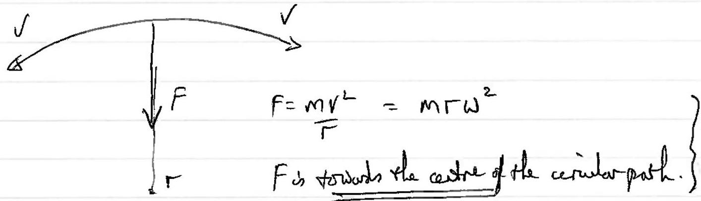
(b)
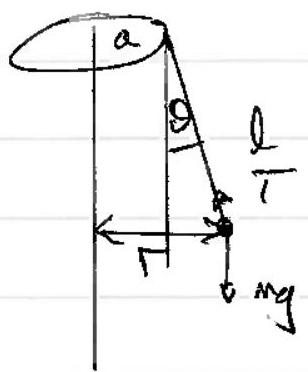

$$
\begin{aligned}
& \text { R } 4 t \\
& \begin{aligned}
T \sin \theta & = \frac { m v ^ { 2 } } { r } \quad = m + \omega ^ { 2 } \\
& = \frac { m v ^ { 2 } } { ( a + l \sin \theta ) } = m \omega ^ { 2 } ( a + l \sin \theta )
\end{aligned}
\end{aligned}
$$

and $T \cos \theta = m y$
S

$$
\begin{aligned}
\tan d = \frac { v ^ { 2 } } { g ( a + l \sin \theta ) } & = \frac { w ^ { 2 } } { g } ( a + l \sin \theta ) \\
\omega ^ { 2 } & = \frac { g \tan \theta } { ( a + l \sin \theta ) }
\end{aligned}
$$

substituting.

$$
\begin{aligned}
& \omega ^ { 2 } = \frac { 9.81 \times \frac { 1 } { \sqrt { 3 } } } { ( 6 + 4 \times 0.5 ) } \\
& \omega = 0.84 \mathrm { rad } / \mathrm { s } .
\end{aligned}
$$

(c) 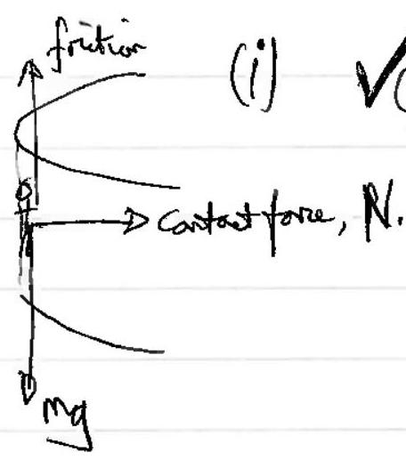
(ii) $N = m r \omega ^ { 2 }$
Resolve $V : f = m g$
Io $\mu N = m g$
pur $\omega ^ { 2 } = m g$
$$
\begin{aligned}
& \omega ^ { 2 } = \frac { q } { \mu r } \\
& \omega = \sqrt { \frac { 9.81 } { 0.4 \times 5 } } \\
& \omega _ { . } = 2 \times 2.15 \\
& \omega _ { . } = 2.2 \mathrm { rad } / \mathrm { s }
\end{aligned}
$$
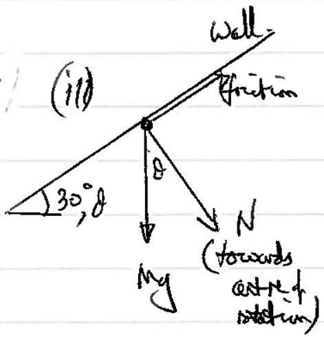
dayin
(iv) Resolve partild to cull, $M _ { g } \cos 60 = f$ (1)
Perpenciular to will $M g \sin b o + N = M r \omega ^ { 2 }$

$$
\begin{aligned}
& \text { and } f = 0.4 , N \\
& \therefore \quad \operatorname { fan } ( 1 ) \quad 0.4 N = m g \cos 60 \\
& \quad N = 2.5 \mathrm { mg } \cos 60
\end{aligned}
$$

Hence (2) my $\sin 60 + 2.5 \mathrm { mg } 8060 = m r \omega ^ { 2 }$

Attenotive uning $\theta = 30 ^ { \circ }$

$$
\begin{aligned}
& g \frac { \sqrt { 3 } } { 2 } + 2.5 \frac { g } { 2 } = r \omega ^ { 2 } \\
& 2 \cdot 12 g = r \omega ^ { 2 } \\
& \omega = 2.04 \mathrm { rad } / \mathrm { s } . \quad \text { [Slower]. } \\
& = 2.0 \mathrm { rd } / \mathrm { s }
\end{aligned}
$$

Resolver pantif to well - $M g \sin \theta = f$ (3)

1. Hoal

$$
\begin{align*}
& m _ { g } \cos \theta + N = M r \omega ^ { 2 }  \tag{4}\\
& t = \mu N \quad \text { (5) }
\end{align*}
$$

Thus $\begin{aligned} & m g \sin \theta = \mu N \quad ( 3 ) \text { and (5) } \\ & m _ { g } \left( \cos \theta + \frac { 1 } { \mu } \sin \theta \right) = \operatorname { mar } \omega ^ { 2 } \quad \text { form (4), } \end{aligned}$

$$
\left( \begin{array} { r l }
\text { So } \omega ^ { 2 } & = \frac { g } { \Gamma \mu } ( \mu \cos \theta + \sin \theta ) \\
& = \frac { 9.81 } { 5 \times 0.4 } \left( 6.4 \frac { \sqrt { 3 } } { 2 } + \frac { 1 } { 2 } \right) \\
& = 4.15 \\
\omega & = 2.04 \mathrm { rad } / \mathrm { s } . \\
& = 2.0 \mathrm { rad } / \mathrm { s } .
\end{array} \right.
$$

(d) 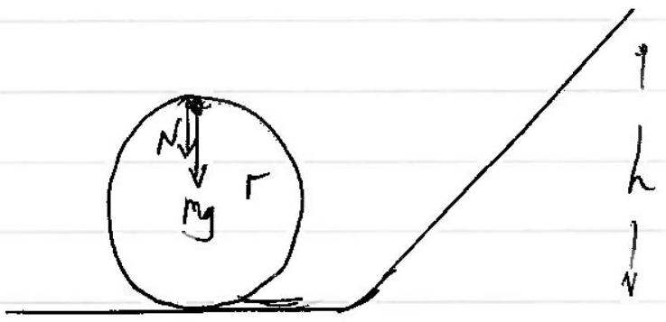

To remain in contact at the xydphelop. $\quad N + m g = \frac { m v ^ { 2 } } { \sqrt { r } }$ When $V = V _ { 0 }$, mirimus speed and $N = 0$

$$
\begin{aligned}
\therefore m _ { y } & = \frac { m v _ { 0 } ^ { 2 } } { F } \\
\& \frac { 1 } { 2 } M v _ { 0 } ^ { 2 } & = \frac { 1 } { 2 } M g r
\end{aligned}
$$

$$
\begin{aligned}
\text { So energyat to of loy is } & 2 \mathrm { Mgr } + \frac { 1 } { 2 } \mathrm { Mgr } \\
& = \frac { 5 } { 2 } \mathrm { Mgr }
\end{aligned}
$$

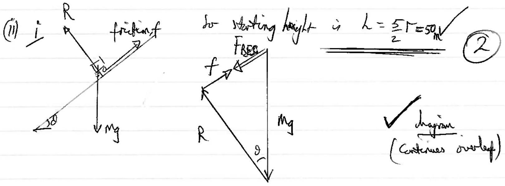

ii

$$
\begin{aligned}
W \Delta f \text { frition } & = f \cdot l \\
& = \mu R \cdot l \\
& = \mu \cdot l \cdot m g \cos \theta
\end{aligned}
$$

Notation: find speed will frotine, $V _ { f }$
" " without ", $V _ { 0 }$

$$
\therefore \frac { \frac { 1 } { 2 } M v _ { f } ^ { 2 } } { \frac { 1 } { 2 } M v _ { 0 } ^ { 2 } } = \frac { M g l ( \sin \theta - \mu \cos \theta ) } { M g l \sin \theta }
$$

a reult thouring no ' $M$ ' depentine, only $\frac { \mu \text { and } } { t }$ (Maynot be equation)

$$
\text { So, } \begin{aligned}
\text { Lou is speed } & = 0.03025 \\
& = 3.0 \%
\end{aligned}
$$

(iii) There is a nomal reaction pare $R$, an the stronght track As son as the carriege stare on the curve, there is a autrytal force added, of $M V ^ { 2 } / F ^ { 2 }$

$$
\text { Using anycors. } \quad \begin{aligned}
& L M v _ { 0 } ^ { 2 } = m _ { g } l \sin \theta \\
& v _ { 0 } ^ { 2 } = 2 g l \sin \theta \\
& \therefore \frac { M v _ { 0 } ^ { 2 } } { \Gamma } = \frac { m } { l / 2 } \cdot 2 l g \cdot \sin \theta \\
& = 4 M g \operatorname { sid } \\
& = 4 \times 60 \times 9 \cdot 81 \times \sin 40 ^ { \circ } \\
& = 1513 \mathrm {~N} \\
& = 1500 \mathrm {~N}
\end{aligned}
$$

(e) (1) Bost barn foll throgh bight $h$ wan A hists she grould.
$$
\text { So } \frac { 1 } { 2 } m v ^ { 2 } = \text { mgL } \Rightarrow v = \sqrt { 2 g L }
$$
    (ii) B composeser the spiring by ("nt ${ } ^ { 10 }$ to) as amout $x _ { \mu }$ bo hoss of gre is $M _ { y } L + M _ { g } x _ { n }$. So for $B , \left( \frac { 1 } { 2 } m v ^ { 2 } \right) = m g ( k + x m ) = E$

The lossigge is storedin the Two spring:

$$
m g \left( h + x _ { m } \right) = 2 \times \frac { 1 } { 2 } k x _ { m } ^ { 2 }
$$

(iii) B starts to rine again and will stretch the springs by $x _ { e }$ when A starth to have the gard.
So $k x _ { e } = \frac { 1 } { 2 } \mathrm { my }$ for a spring. $V$ not footor of $\frac { 1 } { 2 }$.
(W) Energyin the springs is $2 \times \frac { 1 } { 2 } k x _ { e } ^ { 2 }$ what $\beta$ has rien $y \left( x _ { e } + x _ { m } \right)$ form incoreast point
∴ Emen to lift $A$ is gpe gaind $y = \beta + p e$ in spring
$$
E _ { \text {min } } = k x _ { e } ^ { 2 } + M g \left( x _ { e } + x _ { \text {mal } } \right)
$$
and their care from the compression of the groings $y , \beta \left( 2 \times 1 / k _ { m } ^ { 2 } \right)$
$$
\therefore \quad k x _ { e } ^ { 2 } + m g \left( x _ { e } + x _ { m } \right) = \left( m g L + m g x _ { m } \right)
$$
(insisal anyst 1)
thus $k x _ { e } ^ { 2 } + m y x _ { e } = m y L$ But we know about that $k x _ { e } = \frac { m y } { 2 }$
Hence $\quad 4 \left( \frac { m g } { 2 k } \right) ^ { 2 } + m g \cdot \frac { m g } { 2 k } = m g h$
$$
\begin{gather*}
\frac { m g } { 4 k } + \frac { m g } { 2 k } = L \\
L = \frac { 3 m g } { 4 k } \tag{7}
\end{gather*}
$$

Question 4

(a) (i)
on the surface (an bith facer).
(fied his tolfa Ans right)
(iii) The denser the fild line the sampar $E$.
(or elassi westher)
(iv) $F = q E _ { s }$
(b)(i)
$$
\begin{aligned}
& \sigma = \frac { Q } { 4 \pi T ^ { 2 } } \\
& E = \frac { 1 } { 4 \pi } \frac { Q } { \Gamma ^ { 2 } }
\end{aligned}
$$
ii) Hence
$$
E = \frac { \sigma } { \varepsilon _ { 0 } }
$$
and $E$ does sot degatesporr.
iii Half the fall energes on one fare and half on otherther
$$
\therefore \quad E = \frac { 1 } { 2 } \frac { \sigma } { \varepsilon _ { 0 } }
$$
(ii) $i$ 自 $E$ s $= \frac { E _ { \text {splue } } } { 2 }$
ii) The fell strength to bute would be councold by the $\frac { E _ { g h e r } } { 2 }$ of Es.
∴ field shoryl hile is Equae
iii Foreon SA is full strength \& charge
$$
\begin{aligned}
& E _ { q } \frac { E _ { q u } } { 2 } \times \delta q \\
= & \frac { 1 } { 2 } \cdot \frac { 1 } { 4 \pi \varepsilon _ { 0 } } \frac { Q } { r ^ { 2 } } \times \sigma - \delta A
\end{aligned}
$$
iv Pressure increapue is $\frac { F } { S A } = \frac { 1 } { 2 } \frac { 1 } { 6 } \cdot \frac { Q } { 4 \pi r ^ { 2 } } \cdot \sigma$
$$
= \frac { \sigma ^ { 2 } } { 2 \varepsilon _ { 0 } }
$$

(c) (i)
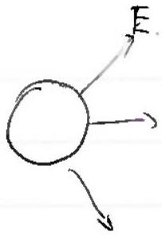

$$
\begin{aligned}
V _ { \text {sphere } } & = \frac { 1 } { 4 \pi \varepsilon _ { 0 } } \cdot \frac { Q } { r } \\
E _ { \text {sphere } } & = \frac { 1 } { 4 \pi \varepsilon _ { 0 } } \cdot \frac { Q } { r ^ { 2 } } \\
& = \frac { V _ { \text {radur } } } { r } \\
\therefore r & = \frac { V _ { \text {shl } } } { E _ { \text {splur } } } \\
& = \frac { 7000 } { 3 \times 10 ^ { 6 } } \\
& = 2.3 \mathrm {~mm}
\end{aligned}
$$

(ii)

$$
\begin{aligned}
Q & = V _ { \text {glane } } \times 4 \pi _ { 0 } + r \\
& = 1.82 \times 10 ^ { - 9 } \mathrm { C } \\
& = 1.8 \mathrm { nc }
\end{aligned}
$$

$$
\begin{aligned}
\sigma & = \varepsilon _ { 0 } E \\
& = 8.85 \times 10 ^ { - 12 } \times 3 \times 10 ^ { 6 } \\
& = 2.7 \times 10 ^ { - 5 } \mathrm { Cm } ^ { - 2 } \quad \left( 2.655 \mathrm { c } / \mathrm { m } ^ { 2 } \right) .
\end{aligned}
$$

(iii) Ereagy: $m g h + q V = 12 m v ^ { 2 }$

$$
\begin{aligned}
& 2 g L + \frac { 2 q } { m } \cdot V = v ^ { 2 } \\
& 2 g L + \frac { 2 q V } { \frac { 4 } { 3 } \pi r ^ { 3 } p } = v ^ { 2 }
\end{aligned}
$$

ecf allowed for $r$ and $Q$ para alsone for above

$$
2 \times 9.81 \times 0.1 + \frac { 2 \times 1.8 \times 10 ^ { - 9 } \times 7000 } { \frac { 4 } { 3 } \cdot \pi \left( 2.33 \times 10 ^ { - 3 } \right) ^ { 3 } \times 10 ^ { 3 } } = v ^ { 2 }
$$

$$
[ v = 0.692 \mathrm {~m} / \mathrm { s }
$$

columnate
(iv)

$$
\begin{aligned}
I = \frac { Q } { t } = \frac { N _ { q } } { t } & = \left( \frac { 64 \times 10 ^ { - 6 } } { 3600 } \right) \div \left( \frac { 4 } { 3 } \pi \right. \\
& = 6.03 \times 10 ^ { - 10 } \mathrm {~A} \\
& = 6.0 \times 10 ^ { - 10 } \mathrm {~A}
\end{aligned}
$$

(d)
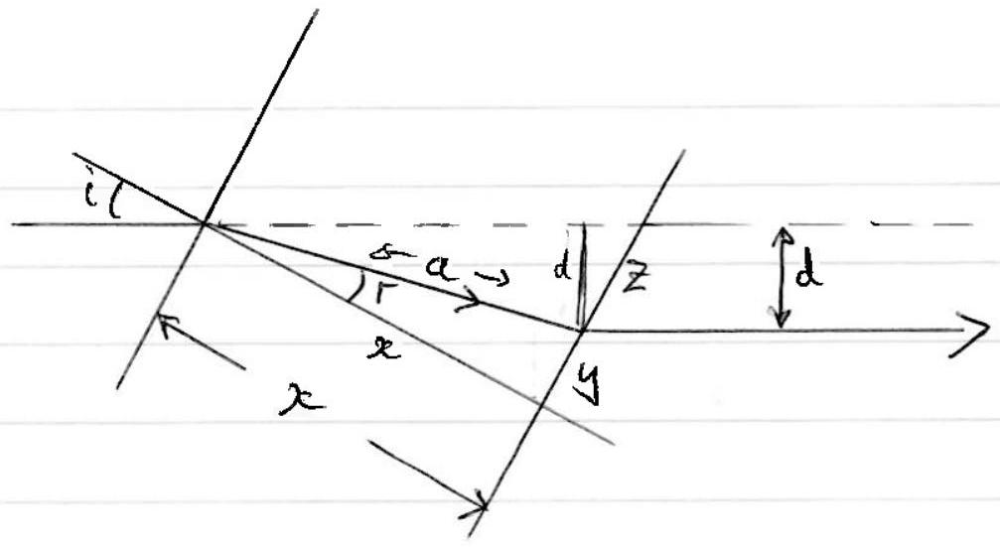
dingan

$$
\begin{aligned}
& n = \frac { \sin i } { \sin r } \\
& \frac { x } { a } = \cos r \\
& \frac { d } { a } = \sin ( i - r )
\end{aligned}
$$

Understandatle Worting.
Hence $d = a \sin ( i - r ) \approx a ( i - r )$

$$
\begin{aligned}
& a = \frac { x } { \cot } = x \\
& r = \frac { i } { n } \quad V
\end{aligned}
$$

So $d = x \left( i - \frac { i } { n } \right) = \frac { x i } { n } ( n - 1 )$.

$$
\begin{aligned}
\frac { d d } { d t } & = \frac { d i } { d t } \cdot \frac { x } { n } ( n - 1 ) \\
& = 2 \pi f \cdot \frac { x } { n } ( n - 1 ) \\
& = 2 \pi \cdot 200 \times 5 \times 10 ^ { - 2 } \left( \frac { 0.51 } { 1.5 } \right. \\
& = \pi \frac { 2 } { 3 } \cdot 10 \\
& = \frac { 20 \pi } { 3 } = 21 \mathrm {~ms} ^ { - 1 }
\end{aligned}
$$

Question 5
(a) If it his a speed youter than the exage ovinity, it is not a captive obert. (comment)

$$
\frac { 1 } { 2 } \mu v _ { e } ^ { 2 } = G \frac { M _ { s } } { r }
$$

$$
\begin{aligned}
\sigma _ { 0 } ^ { 2 } & = \frac { 2 \times 6.17 \times 10 ^ { - 11 } \times 1.99 \times 10 ^ { 30 } } { 38.1 \times 10 ^ { 9 } } \\
& = \frac { 6.67 \times 3.98 \times 10 ^ { 10 } } { 38.1 }
\end{aligned}
$$

which is less than the speed of the offect. I comment requingt so not bound to the sin.
(b) (i)
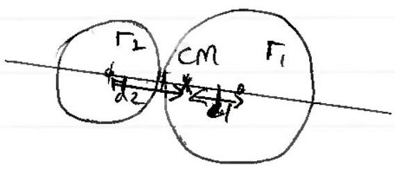

CM portion given by

$$
m _ { 1 } d _ { 1 } = m _ { 2 } d _ { 2 }
$$

QRy to ke mannots about of of $r _ { 2 }$, mog. $\frac { 4 } { 3 } \pi r _ { 1 } ^ { 3 } \rho d _ { 1 } = \frac { 4 } { 3 } \pi r _ { 2 } ^ { 3 } \rho \cdot d _ { 2 }$
$d _ { 2 } \left( \frac { 4 } { 3 } \pi p \left( r _ { 1 } ^ { 3 } + r _ { 2 } ^ { 3 } \right) \right) = \frac { 4 } { 3 } \pi \rho r _ { 2 } ^ { 3 } \times \left( r _ { 1 } + r _ { 2 } \right) \quad$ \& $\quad r _ { 1 } ^ { 3 } d _ { 1 } = r _ { 2 } ^ { 3 } d 2$
then $d _ { 2 } = \frac { r _ { 2 } ^ { 3 } \left( r _ { 1 } + r _ { 2 } \right) } { \left( r _ { 1 } ^ { 3 } + r _ { 2 } ^ { 3 } \right) }$

$$
\text { or } \quad d _ { 1 } = \left( \frac { r _ { 2 } } { r _ { 1 } } \right) ^ { 3 } d _ { 2 }
$$

But $d _ { 1 } + d _ { 2 } = r _ { 1 } + r _ { 2 }$
So $\quad d _ { 1 } = \left( \frac { r _ { 2 } } { r _ { 1 } } \right) ^ { 3 } \left( r _ { 1 } + r _ { 2 } - d _ { 1 } \right)$
Hence $d _ { 1 } \left( 1 + \left( \frac { r _ { 2 } } { r _ { 1 } } \right) ^ { 3 } \right) = \left( \frac { r _ { 2 } } { r _ { 1 } } \right) ^ { 3 } \left( r _ { 1 } + r _ { 2 } \right)$
So $d _ { 1 } \left( r _ { 1 } { } ^ { 3 } + r _ { 2 } { } ^ { 3 } \right) = r _ { 2 } { } ^ { 3 } \left( r _ { 1 } + r _ { 2 } \right)$
$r _ { 1 } = 9750 \mathrm {~m}$
and
$r _ { 2 } = 7100 \mathrm {~m}$

$$
\begin{array} { r }
d _ { 1 } = \frac { r _ { 2 } ^ { 3 } \cdot \left( r _ { 1 } + r _ { 2 } \right) } { \left( r _ { 1 } ^ { 3 } + r _ { 2 } ^ { 3 } \right) } \\
d _ { 1 } = 4694 \mathrm {~m} = 4700 \mathrm {~m} \\
= 4.7 \mathrm {~km}
\end{array}
$$

$\left[ O K \right.$ if $d _ { 2 }$ calcobluted instead. $d _ { 2 } = 12750 \mathrm {~m}$ J

(ii)
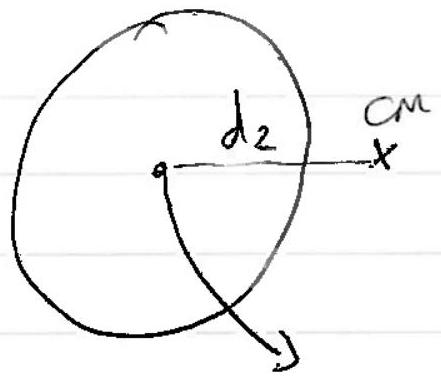

Cobe 2 ordits about the CM addiattretal by lose I.
Cantripetal force produced by gravity

$$
M _ { 2 } d _ { 2 } \omega ^ { 2 } = \frac { G m _ { 1 } m _ { 2 } } { \left( r _ { 1 } r _ { 2 } \right) ^ { 2 } }
$$

$$
\begin{aligned}
\therefore M _ { 1 } & = \frac { d _ { 2 } \left( r _ { 1 } + r _ { 2 } \right) ^ { 2 } \omega ^ { 2 } } { G } \\
& = \frac { d _ { 3 } } { G } \left( r _ { 1 } + r _ { 2 } \right) ^ { 2 } \cdot \frac { 4 \pi ^ { 2 } } { T ^ { 2 } } \\
N _ { 00 } , d _ { 2 } & = r _ { 1 } + r _ { 2 } - d _ { 1 } \\
& = 1685 - 4700 \\
& = \frac { 12150 } { } \mathrm {~m} \\
\therefore M _ { 1 } & = \frac { 12150 \times 1680 ^ { 2 } \times 4 \pi ^ { 2 } } { 667 \times 10 ^ { - 11 } } \times ( 15 \times 3600 ) ^ { 2 } \\
& = 7.00 \times 10 ^ { 14 } \mathrm {~kg} \\
& = \frac { 4 } { 3 } \pi r _ { 1 } ^ { 3 } \rho \\
\text { do } \rho & = \frac { 7.00 \times 14 } { 9750 ^ { 3 } } \cdot \frac { 3 } { 4 \pi } \\
& = 180 \mathrm {~kg} / \mathrm { s } ^ { 3 } \text { /veylowdemity for rody material]. }
\end{aligned}
$$

Moredivecty, wiy $M _ { 1 } = d _ { 2 } \frac { \left( r _ { 1 } + r _ { 2 } \right) ^ { 2 } } { \sigma } \cdot \omega ^ { 2 }$ wàl $d _ { 2 } = \Gamma _ { 1 } ^ { 3 } \frac { \left( r _ { 1 } + r _ { 2 } \right) } { \left( r _ { 1 } ^ { 3 } + r _ { 2 } ^ { 3 } \right) }$
$W _ { 2 }$ have $\frac { 4 } { 3 } \pi \rho y _ { 1 } ^ { 3 } = y _ { 1 } ^ { 3 } \left( \frac { r _ { 1 } + r _ { 2 } } { \left( r _ { 1 } ^ { 3 } + r _ { 2 } ^ { 3 } \right) } \right) ^ { 2 } \cdot \frac { 4 \pi ^ { 2 } } { T ^ { 2 } G }$.

$$
\begin{aligned}
P = \frac { \left( r _ { 1 } + r _ { 2 } \right) ^ { 2 } } { \left( r _ { 1 } ^ { 3 } + r _ { 2 } ^ { 3 } \right) } \cdot \frac { 3 \pi } { T ^ { 2 } G } = & 3.724 \times 3 \pi \\
& = 180 \mathrm {~kg} _ { \mathrm { m } ^ { 3 } }
\end{aligned}
$$

(iii)
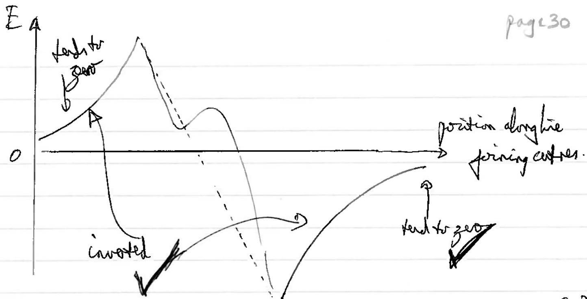
(Theigreptic carbe upule down.)
(iv)

$$
\text { Grov. pe. } \begin{aligned}
C _ { A } & = G M _ { 1 } M _ { 2 } \left( \frac { 1 } { \left( r _ { 1 } + r _ { 2 } \right) } - \frac { 1 } { \infty } \right) \\
& = 6.67 \times 10 ^ { - 11 } \times \frac { 3.06 \times 10 ^ { 16 } \times 1.18 \times 10 ^ { 16 } } { 16850 } \\
& = 1.4 ( 3 ) \times 10 ^ { 18 } \mathrm {~J}
\end{aligned}
$$

(v) Cons. of mom with CM stationary,

$$
\begin{gathered}
M _ { 1 } V _ { 1 } = m _ { 2 } V _ { 2 } \\
V _ { 1 } = \frac { m _ { 2 } } { M _ { 1 } } \cdot V _ { 2 } \\
\therefore \text { FE } = \frac { 1 } { 2 } m V _ { 1 } ^ { 2 } + \frac { 1 } { 2 } m _ { 2 } ^ { 2 } \\
= \frac { 1 } { 2 } m _ { 1 } \frac { M _ { 2 } ^ { 2 } } { M _ { 1 } ^ { 2 } } \cdot V _ { 2 } ^ { 2 } + \frac { 1 } { 2 } M _ { 2 } V _ { 2 } ^ { 2 } \\
= \frac { 1 } { 2 } M _ { 2 } V _ { 2 } ^ { 2 } \left( \frac { M _ { 2 } } { M _ { 1 } } + 1 \right) \\
= \frac { M _ { 2 } } { 2 M _ { 1 } } \left( M _ { 1 } + M _ { 2 } \right) \cdot V _ { 2 } ^ { 2 } \\
= 1.43 \times 10 ^ { 18 } \mathrm {~J} \text { dotal derept }
\end{gathered}
$$

Substanting, $\quad V _ { 2 } = 13.2 \mathrm {~m} / \mathrm { s } = 13 \mathrm {~m} / \mathrm { s }$

$$
V _ { 1 } + V _ { 2 } = 18 \mathrm {~m} / \mathrm { s }
$$

Do notallow adding $k E _ { 1 } + k E _ { 2 } = \frac { 1 } { 2 } \left( M + M M _ { 2 } \right) V _ { 2 }$ for $V$.

(vi)

$$
\begin{aligned}
\text { No. of moles is } & \frac { 4.24 \times 10 ^ { 16 } } { 56 } \times 10 ^ { 3 } \\
& = 7.57 \times 10 ^ { 17 } \text { moles. } \\
& = 7.6 \times 10 ^ { 17 } \text { suotes. }
\end{aligned}
$$

$$
\begin{aligned}
E & = M \int _ { 4 } ^ { T } C d \\
& = M \frac { 12 \pi 4 R } { 5 \theta _ { D } ^ { 3 } } \int _ { 4 } ^ { T } T ^ { 3 } d T
\end{aligned}
$$

✓ use ofmentestere.

So,

$$
1.43 \times 10 ^ { 18 } = 7.57 \times 10 ^ { 17 } \times \frac { 12 \pi ^ { 4 } \times 8.31 } { 5 \times 464 ^ { 3 } } \left[ \frac { \pi ^ { 4 } } { 4 } - \frac { 4 ^ { 4 } } { 4 } \right]
$$

## Question 6

(a)

- Constant frequency [not same fripercy].
- Same type of waves

4 for 2 mults

- Fane pobarination

- Coherent

- Wous crossing [do not accept same medium].
(2)
(b) (i)
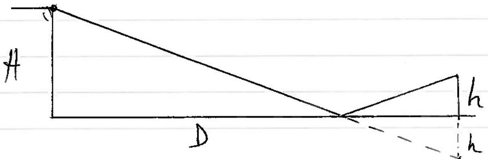
path defference is $\sqrt { ( 1 + t h ) ^ { 2 } + D ^ { 2 } } - \sqrt { ( 1 + - h ) ^ { 2 } + D ^ { 2 } }$

$$
\begin{aligned}
& = D \left( 1 + \left( \frac { H + h } { D } \right) ^ { 2 } \right) ^ { \frac { 1 } { 2 } } - D \left( 1 + \left( \frac { H - h } { D } \right) ^ { 2 } \right) ^ { \frac { 1 } { 2 } } \\
& \approx D \left( 1 + \frac { 1 } { 2 } \left( \frac { H + h } { D } \right) ^ { 2 } - 1 - \frac { 1 } { 2 } \left( \frac { H - h ^ { 2 } } { D } \right) ^ { 2 } \right) \\
& = \frac { D } { 2 } \left( \left( \frac { H + h } { D } \right) ^ { 2 } - \left( \frac { H - h } { D } \right) ^ { 2 } \right) \\
& = \frac { D } { 2 D ^ { 2 } } \left( H ^ { 2 } + h ^ { 2 } + 2 h H - H ^ { 2 } - h ^ { 2 } + 2 h H \right) \\
& = \frac { 1 } { 2 D } 4 h H \\
& = \frac { 2 L H } { D }
\end{aligned}
$$

And $p \cdot d$. for a mascimin wher there is a pharechage of $\pi$ is $\frac { \lambda } { 2 }$

$$
\begin{aligned}
\therefore \frac { \lambda } { 2 } & = \frac { 2 h H } { D } \\
h & = \frac { \lambda D } { 4 H } \quad \text { (no nout for the answer) }
\end{aligned}
$$

(4).

(ii) i)

$$
\begin{aligned}
i D & = 1500 \mathrm {~m} \\
h & = 20 \mathrm {~m} \\
H & = 80 \mathrm {~m} \\
f & = 70 \times 10 ^ { 6 } \mathrm {~Hz} \\
\therefore \lambda & = 4 \cdot 286 \mathrm {~m}
\end{aligned}
$$

For a minimum, $p d = \lambda$

$$
\therefore \quad \lambda = 2 \frac { h H } { D }
$$

L, D content

$$
\begin{aligned}
\therefore H ^ { \prime } = \frac { \lambda D } { 2 A } & = \frac { 4.29 \times 1500 } { 2 \times 20 } \\
& = 161 \mathrm {~m}
\end{aligned}
$$

for the water lead ands to fall by 81 m
ii) If $H$ change by 5 m ;
then pd wist $H = 80 \mathrm {~m}$ is $\frac { 2 h A } { D } = \frac { 2 \times 20 \times 80 } { 1500 }$

$$
\left. \begin{array} { r l }
p , d \text { woth } A = 85 \mathrm {~m} \text { is } & = \frac { 32 } { 15 } = \frac { 20.13 \mathrm {~m} } { 1500 } \\
2.13 \mathrm { mpd } \approx & = \frac { \lambda } { 2 } \quad [ \text { for } 70.3 \mathrm { mmlz } ] , \quad = 2.7 \mathrm {~m}
\end{array} \right\}
$$

So a massivin, and 2.27 m is ally $6 \%$ different,
iii For $L = 0.5 \mathrm {~m}$ so little charge in signal Nriyth-s

$$
\begin{aligned}
p d = \frac { 2 \times 0.5 \times 80 } { 1500 } = \frac { 8 } { 150 } & = 0.053 \mathrm {~m} \\
& \approx \frac { 1 } { 80 } \mathrm {~d}
\end{aligned}
$$

So the T phase shift, produces destructive interfecte and heree a minimum.

(c)
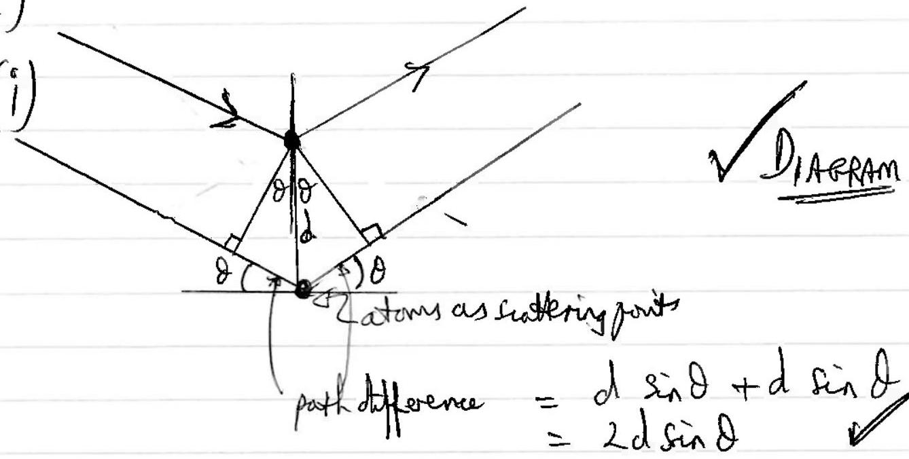
clearly thoon. was thy is. and for constructive interference the $p d$ is $n d$ Itatement

$$
\therefore \quad n \lambda = 2 d \sin \theta \text { (Nomat for an wer) }
$$

(ii) I mole of salt has a volume of $\frac { 58.4 } { 2.17 } \binom { \mathrm {~cm} ^ { 3 } } { \mathrm {~g} } \left( \frac { \mathrm {~g} } { \mathrm {~m} _ { \mathrm { ol } } } \right)$

$$
= 26.9 \times 10 ^ { - 6 } \mathrm {~m} ^ { 3 } .
$$

This contain $N _ { A }$ satt "nolecules", fo $2 N _ { A }$ atoms.

$$
\begin{aligned}
\therefore d & = \sqrt [ 3 ] { \frac { 26.9 \times 10 ^ { - 6 } } { 2 \times 6.02 \times 10 ^ { 23 } } } \\
& = 2.8 ( 2 ) \times 10 ^ { - 10 } \mathrm {~m}
\end{aligned}
$$

factor 2
(iii) Subritating is $n \lambda = 2 d \sin \theta$

$$
\begin{aligned}
& n \lambda = 2 \times 2.82 \times 10 ^ { - 10 } \\
& n = 1 \quad \lambda = 2.4 \times 10 ^ { - 10 } \mathrm {~m} \mathrm { v } \\
& \binom { n = 2 } { \text { (etc) } }
\end{aligned}
$$

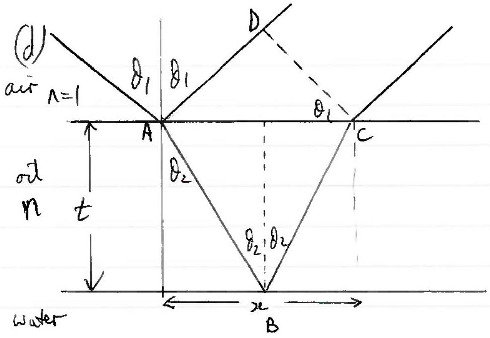
puth difference $= A B C - A D$

Connect refraction AD Muld or ratel for 1 d $A B C$ muted or shoul for pd

Statement.

$$
\begin{aligned}
\sin \theta _ { 1 } & = n \sin \theta _ { 2 } \\
\tan \theta _ { 2 } & = \frac { x } { 2 } \cdot \frac { 1 } { t } \\
\therefore \quad x & = 2 t \frac { \sin \theta _ { 2 } } { \cos \theta _ { 2 } }
\end{aligned}
$$

$$
\text { poth in } \begin{aligned}
\operatorname { air } ( A D ) & = x \sin \theta _ { 1 } \\
& = 2 t \frac { \sin \theta _ { 2 } } { \cos \theta _ { 2 } } \cdot \sin \theta _ { 1 }
\end{aligned}
$$

$$
\begin{aligned}
& \text { Optical pathin od } ( A B C ) = \frac { 2 n t } { \cos \theta _ { 2 } } \\
& \qquad \begin{aligned}
p d & \left. \left. = \frac { 2 t } { \cos \theta _ { 2 } } \right\rvert \, n - \sin \theta _ { 2 } \sin \theta _ { 1 } \right) \\
& = \frac { 2 t } { \sqrt { 1 - \sin ^ { 2 } \theta _ { 2 } } } \left( n - \frac { \sin ^ { 2 } \theta _ { 1 } } { n } \right) \\
& = \frac { 2 t n } { \sqrt { 1 - \sin ^ { 2 } \theta _ { 1 } } } \left( 1 - \frac { \sin ^ { 2 } \theta _ { 1 } } { n ^ { 2 } } \right) \\
& = 2 t n \left( 1 - \frac { \sin ^ { 2 } \theta _ { 1 } } { n ^ { 2 } } \right) \frac { 1 } { 2 } \\
& = 2 t \sqrt { n ^ { 2 } - \sin ^ { 2 } \theta _ { 1 } }
\end{aligned}
\end{aligned}
$$

faster n.
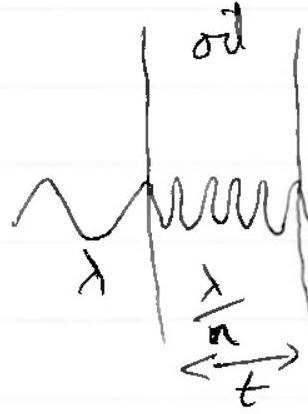
gotheral path = nt.

$$
\text { so } \frac { t } { \frac { \lambda } { n } } = \frac { n t } { \lambda . }
$$

M phase charge at air/ort interfue No pherechange at ort/water interfue.
∴ p.d. for constructive interference is $\frac { \lambda } { 2 }$
So

$$
\begin{aligned}
\frac { \lambda } { 2 } = 2 t & \sqrt { n ^ { 2 } - \sin ^ { 2 } \theta _ { 1 } } \\
\frac { 410 \times 10 ^ { - 9 } } { 2 } & = 2 t \sqrt { 1.5 ^ { 2 } - \sin ^ { 2 } 50 } \\
t & = 7.9 \times 10 ^ { - 8 } \mathrm {~m}
\end{aligned}
$$
