## BPhO Round 1 Marking- 2020

Version 13/2 2020

Thank you for taking part in marking the scripts. It is of enormous benefit to young students to be able to take part in these competitions, tackling much harder problems than they normally get, and be able to have them marked by physicists who know what they are doing. It is because of your expertise in the subject that it is possible to do this. Exams marked by non-specialists are more of a tick box exercise, which is of little value in stretching students to grasp the subject at a deeper level. The layout of the work may be annoying. That is a national problem and we are not going to change that easily, although we do our best, as do the teachers of these students.

- We need ACCURACY and CONSISTENCY. Care is required. The mark scheme has marks allocated to make the marking easier. The mark allocation is different to the paper. USE THE MARK SCHEME ALLOCATIONS.
- You do not need to spend time working through laborious arithmetic calculations. The marks are set out for steps achieved.
- Positive marking is the aim. Marks should be awarded for good physics, even if the reasoning does not follow the mark scheme. Alternative routes to the answers can be allowed.
- Significant figures. This is not a test of significant figures. A leeway of ±1 sig. fig. is generally allowed, but we are not being strict at all in penalising for sig figs. If the published solution gives 3, allow 2 or 4 in the students answer, or even 1 after a long numerical calculation. However, unless they have written down all of the figures on their calculator display, there are no questions this year that are likely to invoke a sig fig penalty.
- Some answers can be left in fractional form.
- Units should be given for the final answer. It may be that the unit is given a little earlier and that it does not appear on the very last line. Allowance may be made if it is clear that the unit has been used a line or two earlier.
- If the units are a required part of the answer for the mark, they must be there.
- Error carried forward (ecf) is allowed provided ridiculous results do not start appearing. A mark is lost for the initial mistake, but then they can carry on (if it is possible) to gain some of the subsequent marks for the next one or two steps only. Just make a decision as to whether they should have the single mark or not.
- You are not required to spend time deciphering scribble.
- There may be a lot of working for the answer. If they are almost there, you may give the mark even if there is a numerical mistake in the last line. Use your judgement. The ticks for the marks are not exact i.e. they are for the idea and almost getting there.
- Full marks are awarded for the correct answer, provided that there is some supporting working and it is not a "show that" question. Look out for suspicious results with insignificant working.
- You must follow the mark scheme so that we mark CONSISTENTLY. Do not make your own independent mark scheme.
- Avoid relying on your memory for the mark allocation. You need the mark scheme open beside you.

If you need advice, email Robin Hughes I will respond promptly. You can send a phone photo or just ask a question.

1. Do not mix up students' names when entering marks.
2. Add up the marks correctly. Check your addition. For each little section, note the total in a circle, as in the mark scheme. Then note the total for the page at the bottom in two parallel lines to distinguish it.
3. Do not leave "pdf papers" in any unsecured place. They are confidential.
4. You can write on the answers if it helps you keep track. Ticks are for marks so do not tick everything. Ticks are counted up when checking.
5. Updates to the mark scheme are inevitable and will be sent out. If you see a mistake, email me.

## Section 1 Working is required

(a) Stoneinfreefall $\quad M g h = \frac { 1 } { 2 } m v ^ { 2 } \quad$ or $\quad V ^ { 2 } = u ^ { 2 } + 2 a s$

$$
\begin{aligned}
h = \frac { r ^ { 2 } } { 2 g } = \frac { 330 ^ { 2 } } { 229.8 } & = 5560 \mathrm {~m} \\
& = 5.6 \mathrm {~km}
\end{aligned}
$$

(b)
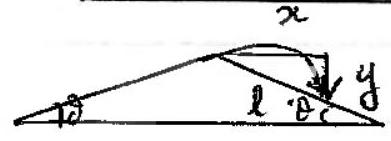
(i) Horgantaly, $U \cos \theta \cdot t = x$ and $x = l \cos \theta$

$$
\text { So } t = \frac { l } { u } \text {. }
$$

(ii)

$$
\begin{aligned}
& " S = u t + \frac { 1 } { 2 } g t ^ { 2 } \quad ( 1 + v ) \\
& - y = u \sin \theta \cdot t - \frac { 1 } { 2 } g t ^ { 2 } \quad \checkmark \\
& y = l \sin \theta \\
& \therefore \quad - l \sin \theta = \mu \cdot \sin \theta \cdot \frac { 1 } { l } - \frac { 1 } { 2 } g \frac { l ^ { 2 } } { u ^ { 2 } } \\
& 2 l \sin \theta = \frac { g l ^ { 2 } } { 2 u ^ { 2 } } \\
& l = \frac { 4 u ^ { 2 } \sin \theta } { g }
\end{aligned}
$$

4
(c)
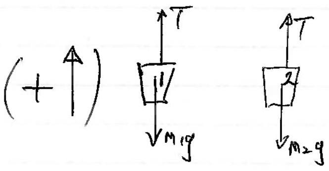
fores diagon

$$
\left. \begin{array} { r l }
\text { NII. } a M _ { 1 } : T - M _ { 1 } g & = M _ { 1 } a \\
a M _ { 2 } : T - M _ { 2 } g & = - M _ { 2 } a
\end{array} \right\}
$$

Saltract:

$$
\begin{aligned}
& - m _ { 1 } g + m _ { 2 } g = m _ { 1 } a + m \\
& Q = \frac { \left( m _ { 2 } - m _ { 1 } \right) g } { \left( m _ { 1 } + m _ { 2 } \right) } \text { (com } \\
& V ^ { 2 } = 2 \frac { h \left( m _ { 2 } - m _ { 1 } \right) g } { \left( m _ { 1 } + m _ { 2 } \right) } \\
& V = \sqrt { \frac { 2 h \left( m _ { 2 } - m _ { 1 } \right) g } { \left( m _ { 1 } + m _ { 2 } \right) } }
\end{aligned}
$$

(connect signs)
éther
Budet 1 has this sped. $\quad \Delta h = \frac { V ^ { 2 } } { 2 g } = \frac { \overline { \left( m _ { 2 } - m _ { 1 } \right) } } { \left( m _ { 1 } + m _ { 2 } \right) }$
5

(No mont por yodd plyer x.)
(d) Specid 1-plager $Y$ is $\sqrt { 3 ^ { 2 } + 4 ^ { 2 } } = 5 \mathrm {~m} / \mathrm { s }$ (needd ber)
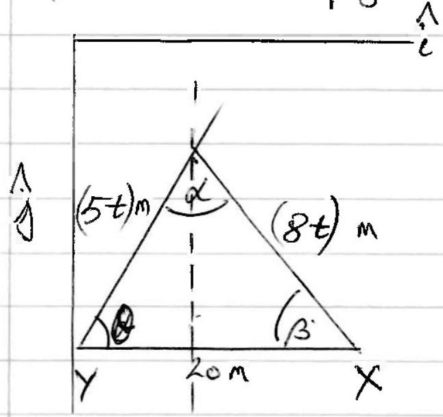

Diegram
Pythoppos::

$$
( 8 t ) ^ { 2 } = ( 4 t ) ^ { 2 } + ( 20 - 3 t ) ^ { 2 }
$$

Give: $64 t ^ { 2 } = 16 t ^ { 2 } + 400 \times 9 t ^ { 2 } - 120 t$
So, $39 t ^ { 2 } + 120 t - 400 = 0$
then, $t = \frac { - 120 \pm \sqrt { 120 ^ { 2 } + 4.400 .34 } } { 2.39 }$

$$
\begin{aligned}
t & = \frac { 1 } { 39 } ( - 60 + 80 \sqrt { 3 } ) \\
& = 2.0 ( 145 ) \mathrm { s }
\end{aligned}
$$

Sine Rale: $\frac { 8 t } { \sin \theta } = \frac { 5 t } { \sin \beta }$.
and given $\tan d = \frac { 4 } { 3 } \quad [ 3 \hat { i } + 4 \hat { j } ] \Rightarrow c _ { 2 } d = \frac { 3 } { 5 } , \sin d = \frac { 4 } { 5 }$.

$$
\therefore \sin \beta = \frac { 5 } { 8 } \sin \theta = \frac { 5 } { 8 } \cdot \frac { 4 } { 5 } = \frac { 1 } { 2 }
$$

$\beta = 30 ^ { \circ }$
different of $Y$ is. $\overline { 6 m E }$ and 8 mN )
of $= 10 \mathrm {~m}$ at $\theta = 53 ^ { \circ }$. for the mast.
or $( 6 \hat { i } + 8 \hat { j } )$ If
OT/f $\sin \beta$ has been foun, then sine rule gives.

$$
\begin{aligned}
\alpha & = 180 - \beta - \delta \\
& = 180 - 30 - 53.13 \\
x & = 96.87 ^ { \circ } .
\end{aligned}
$$

$$
\begin{aligned}
\frac { 5 t } { \sin \beta } & = \frac { 20 } { \sin \alpha } \\
\frac { 10 t } { 1 / 2 } & = \frac { 20 } { \sin \alpha } \\
t & = 2 \sin \alpha = 2 \cdot 0 \mathrm {~s}
\end{aligned}
$$

If $X$ is taken West of $Y$ withod

$$
t = 5.09 = 5.1 \mathrm {~s}
$$

and $X$ travelut 44.40 №. $E$.
Allow the 3

$$
y = \operatorname { at } ( 15 \cdot 3 \hat { i } + 20 \cdot 4 \hat { \jmath } ) \sqrt { }
$$

Mash

(e) $\frac { \text { Bells Wire } } { \rho _ { \text {res } } } = \frac { R A } { d }$

$$
\begin{aligned}
\text { Weylt of water displaced } & = 4.60 - 4.08 \\
& = 0.52 \mathrm {~N} \\
\text { mass of water } & = \frac { 0.52 } { 9.81 } \mathrm {~kg}
\end{aligned}
$$

$$
\begin{aligned}
\text { Volfwix } = \text { Vold water } & = \frac { 0.52 } { 9.81 } \frac { 1 } { 10 ^ { 3 } } \mathrm {~m} ^ { 3 } \\
\text { Vif } / \text { wire } & = A l . \\
l & = \frac { 0.52 } { 9.81 } \frac { 1 } { 10 ^ { 3 } } \frac { 1 } { \pi \left( 0.7 \times 10 ^ { - 3 } \right) ^ { 2 } } \\
& = 34.43 \mathrm {~m}
\end{aligned}
$$

$$
\text { So, } \begin{aligned}
f _ { r e s } & = \frac { 0.478 \times \pi \times \left( 0.7 \times 10 ^ { - 3 } \right) ^ { 2 } } { 34.43 } \\
& = 2.14 \times 10 ^ { - 8 } \Omega \mathrm {~m}
\end{aligned}
$$

(f) Train
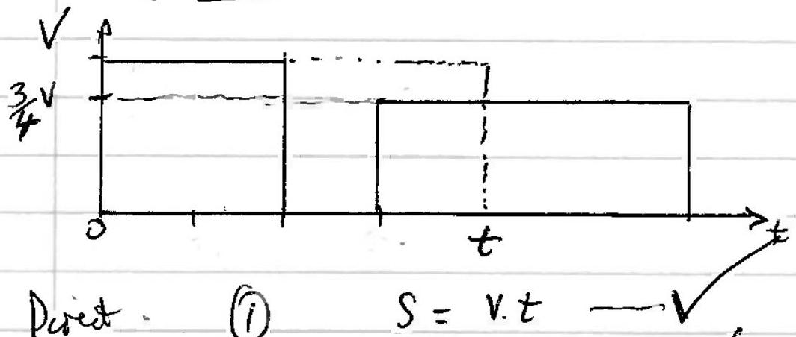

Use wish fitine of Lown $t$ is the fine formil if speel V maintanied $S =$ distance truedel is kn. $v = \mathrm { km } / \mathrm { h }$.
Holthow Stop - (2)

$$
\begin{aligned}
& S = V \cdot 1 + \frac { 3 } { 4 } V ( t \\
& S = V + \frac { 3 } { 4 } V t
\end{aligned}
$$

$\left. - \frac { 1 } { 2 } \right)$. Arrives at $\left( t + 1 \frac { 1 } { 2 } \right)$. trower for $( t + 1 )$

Is, $V t = V + \frac { 3 V } { 4 } t \rightarrow \frac { V t } { 4 } = V$ lo $t = 4$ hom
The Detrges hall has (3) Travels 45tom at your vinatiol rou, but row trood the 45kn at $\frac { 3 V } { 4 }$ councering it to arrie How bet (thoff ton of zer speed deby)

$$
\therefore \frac { 1 } { 2 } \operatorname { los } x = \frac { 45 } { ( 34 ) } - \frac { 45 } { V } \Rightarrow \frac { V } { 2 } = 60 - 45 \Rightarrow \frac { V = 30 \mathrm {~km} / \mathrm { h } } { 120 \mathrm {~km} }
$$

14

(9) Emmy in the tift
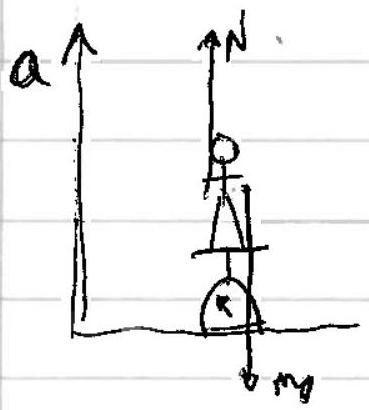
On Enmy, $N - M g = M _ { a }$
Scals meatures $N . = m a + m g$
But shows a value of $m ( t ) = \frac { N } { g }$
$$
\begin{aligned}
\therefore M ( t ) & = \frac { M } { g } ( a + g ) \\
& = M \left( \frac { a } { g } + 1 \right)
\end{aligned}
$$
and we are given the behaverwr of the lift, such that
$$
m ( t ) = 60 \left( 1 + \frac { t } { 10 } - \frac { t ^ { 2 } } { 100 } \right) = m \left( \frac { a ( t ) } { g } + 1 \right)
$$
When $t = 0 , a = g$ or $m = 60 \mathrm {~kg}$
$$
\text { and } \frac { a ( t ) } { g } = \frac { t } { 10 } - \frac { t ^ { 2 } } { 100 }
$$
So $V ( t ) = g \int \left( \frac { t } { 10 } - \frac { t ^ { 2 } } { 100 } \right) d t$
$$
V ( t ) = g \left( \frac { t ^ { 2 } } { 20 } - \frac { t ^ { 3 } } { 300 } \right) + c
$$
$A + t = 0 , V = 0$ lo $c = 0$.
$$
V ( 10 ) = g \left( \frac { 10 ^ { 2 } } { 20 } - \frac { 10 ^ { 3 } } { 300 } \right) = g \frac { 5 } { 3 } = 16.4 \mathrm {~m} / \mathrm { s }
$$
$$
\begin{aligned}
S & = \int _ { 0 } ^ { 10 } V d t \\
& = 9 \int _ { 0 } ^ { 10 } \left( \frac { t ^ { 2 } } { 10 } - \frac { t ^ { 3 } } { 300 } \right) d t = 9 \left[ \frac { t ^ { 3 } } { 60 } - \frac { t ^ { 4 } } { 1200 } \right] _ { 0 } ^ { 10 } \\
& = 9 \left[ \frac { 100 } { 6 } - \frac { 100 } { 12 } \right] = 81.8 \mathrm {~m}
\end{aligned}
$$
Frod distane, $S = 18.25 \mathrm {~m}$
$$
\begin{align*}
& u = 16.35 \mathrm {~m} / \mathrm { s } \\
& 0 = u ^ { 2 } - 2 a s \rightarrow a = \frac { u ^ { 2 } } { 2 s } = \frac { 16.35 ^ { 2 } } { 36.50 } = 7.32 \mathrm {~m} / \mathrm { s } ^ { 2 }  \tag{=}\\
& \text { Mass show. } 1 = \frac { g - a } { g } \times 60 = 15.2 \mathrm {~kg} \tag{16}
\end{align*}
$$

(h) Moscing Ligures
The linear variation of $n$ with volumer is expressed as
$$
n = \frac { V _ { a } n _ { a } + V _ { b } n _ { b } } { V _ { a } + V _ { b } }
$$
so if $V _ { b } = 0 \quad n = n _ { a }$
and if $V _ { a } = 0 \quad n = n k$
and of $V _ { a } = V _ { b } \quad n = \frac { n _ { a } + n _ { b } } { 2 }$
etc.
For $n _ { g } =$ ?
$$
\begin{aligned}
& n _ { g } = \frac { 100 \times 1.15 + 64 \times 1.52 } { 100 + 64 } \\
& n _ { g } = 1.29
\end{aligned}
$$
Thes plops for $n = x n _ { 1 } + ( 1 - x ) n _ { 2 }$
$$
\begin{aligned}
& x = \frac { V _ { 1 } } { V } = \frac { V _ { 1 } } { V _ { 1 } + V _ { 2 } } \\
& 1 - x = \frac { V _ { 1 } + V _ { 2 } - V _ { 1 } } { V _ { 1 } + V _ { 2 } } = \frac { V _ { 2 } } { V _ { 1 } + V _ { 2 } } .
\end{aligned}
$$
(i) $( i )$ (i) The resistan in terms
(ii) " " - parald
$$
\begin{aligned}
& R _ { 2 } = R _ { 4 } = \infty \\
& R _ { 2 } = R _ { 4 } = 0
\end{aligned}
$$
(iii) Two dataid mintarizonall.
$R _ { 2 } = R _ { 3 }$ and $R _ { 4 } = R _ { 1 }$
Onemak for
two comet.
(ii) $V _ { 32 } = 2 \times 3 = 6 \mathrm {~V}$
So 6 V acros 48 renitor.
$$
I _ { 4 \Omega } = 1.5 \mathrm {~A}
$$
Here KI means $\frac { 1 } { 2 } A$ through $5 \Omega$
$$
\text { hence } V _ { J R } = 2.5 \mathrm {~V}
$$
Herce
$$
\begin{aligned}
\mathcal { E } & = 6 + 2.5 \\
& = 8.5 \mathrm {~V}
\end{aligned}
$$
4

## Resittor combinations

(f)

$$
\text { (i) } \begin{aligned}
& R _ { 1 } = \frac { R _ { 1 } R _ { 2 } } { R _ { 1 } + R _ { 2 } } + R _ { 3 } . \\
& R _ { 1 } ^ { 2 } + R _ { 1 } R _ { 2 } = R _ { 2 } K _ { 2 } + R _ { 3 } R _ { 1 } + R _ { 3 } R _ { 2 } \\
& R _ { 3 } = \frac { R _ { 1 } ^ { 2 } } { \left( R _ { 1 } + R _ { 2 } \right) } \text { Simpleful reporina not. }
\end{aligned}
$$

(ii)

$$
R _ { A B } = \frac { R _ { 3 } \left( R _ { 1 } + R _ { 2 } \right) } { R _ { 3 } + \left( R _ { 1 } + R _ { 2 } \right) }
$$

and $R _ { A B } = R _ { 1 }$ (given)
Hence.
then

$$
R _ { 1 } R _ { 3 } + R _ { 1 } R _ { 1 } + R _ { 1 } R _ { 2 } = R _ { 3 } R _ { 1 } + R _ { 3 } R _ { 2 }
$$

$$
\left( \frac { R _ { 1 } } { R _ { 2 } } \right) ^ { 2 } + \frac { R _ { 1 } } { R _ { 2 } } - \frac { R _ { 3 } } { R _ { 2 } } = 0 .
$$

$$
\left[ \frac { R _ { 3 } } { R _ { 2 } } = 6 \right]
$$

$$
\begin{aligned}
& x ^ { 2 } + x - 6 = 0 \ldots \\
& x = - \frac { 1 } { 2 } \pm \frac { 5 } { 2 } . \\
& x = 2 = \frac { R _ { 1 } } { R _ { 2 } } \ldots
\end{aligned}
$$

(k) Beam
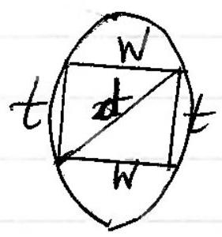

$$
\text { Pythagoasas, } \begin{aligned}
& W ^ { 2 } + t ^ { 2 } = d ^ { 2 } \\
& W = \sqrt { d ^ { 2 } - t ^ { 2 } }
\end{aligned}
$$

and $S = k t ^ { 3 } \cdot W$

$$
= k t ^ { 3 } \sqrt { d ^ { 2 } - t ^ { 2 } }
$$

$\frac { d s } { d t } = k t ^ { 3 } \cdot \frac { 1 } { 2 } \frac { ( - 2 t ) } { \sqrt { d ^ { 2 } - t ^ { 2 } } } + k 3 t ^ { 2 } \sqrt { d ^ { 2 } - t ^ { 2 } }$
When $\frac { d s } { d t } = 0$

$$
\begin{aligned}
& \frac { t ^ { 2 } } { \sqrt { d ^ { 2 } - t ^ { 2 } } } = 3 \sqrt { d ^ { 2 } - t ^ { 2 } } \\
& t ^ { 2 } = 3 \left( d ^ { 2 } - t ^ { 2 } \right) \\
& t = \sqrt { \frac { 3 } { 4 } } d
\end{aligned}
$$

and $\frac { 4 } { W = \sqrt { d ^ { 2 } - t ^ { 2 } } } = \sqrt { d ^ { 2 } - \frac { 3 } { 4 } d ^ { 2 } } = \frac { d } { 2 }$

$$
W = 10 \mathrm {~cm} . \quad t = \frac { \sqrt { 3 } } { 2 } \cdot 20 = \overline { 17 \cdot 3 \mathrm {~m} }
$$

(1)
(1)
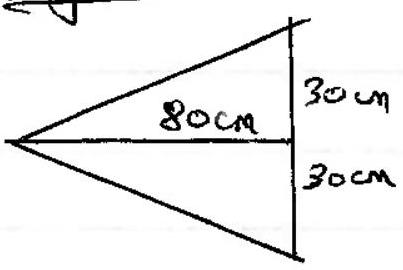

$$
\begin{aligned}
n \lambda & = ( a + b ) \sin \theta \\
1 \cdot \lambda & = \frac { 1 } { 6 \times 10 ^ { 5 } } \cdot \sin \theta \\
\tan \theta & = \frac { 30 } { 80 } \\
\theta & = 20 \cdot 56 ^ { \circ } \\
\lambda & = 585 \mathrm {~nm}
\end{aligned}
$$

(m)

$$
\bar { d } = k E ^ { \alpha } \rho ^ { \beta } g ^ { \gamma }
$$

Dins: $\quad [ L ] = \left[ M L ^ { 2 } T ^ { - 2 } \right] ^ { \alpha } \left[ M L ^ { - 3 } \right] ^ { \beta } \left[ L T ^ { - 2 } \right] ^ { \gamma }$
equate posers of

$$
\begin{array} { l l }
{ [ L ] = } & 1 = 2 \alpha - 3 \beta + \gamma \\
{ [ M ] } & 0 = \alpha + \beta \\
{ [ T ] } & 0 = - 2 \alpha - 2 \gamma
\end{array}
$$

$$
\begin{aligned}
\alpha & = - \beta \\
\alpha & = - \gamma \\
\alpha & = \frac { 1 } { 4 } \\
d & = k \left( \frac { E } { \rho g } \right) ^ { \frac { 1 } { 4 } }
\end{aligned}
$$

(bi)

$$
\begin{aligned}
1200 ^ { 4 } & = 1 . \frac { 1 } { 2 } \frac { m \left( 15 \times 10 ^ { 3 } \right) ^ { 2 } } { 3000 + 9.81 } \\
m & = \frac { 5.4 \times 10 ^ { 8 } \mathrm {~kg} } { 540 \mathrm { mt } }
\end{aligned}
$$

$$
\begin{aligned}
V = & M / P \\
\frac { 4 } { 3 } \pi d _ { 8 } ^ { \frac { 1 } { 8 } } & = \frac { 5 \cdot 4 \times 10 ^ { 8 } } { 8000 } \\
d & = 51 \mathrm {~m} \\
& \approx 50 \mathrm {~m}
\end{aligned}
$$

pertor engine

(n)
$$
\begin{aligned}
\text { Consumption ate } & = \frac { 5.3 } { 100 } \frac { \mathrm { l } } { \mathrm {~km} } \text { at } 100 \mathrm {~km} / \mathrm { h } \\
& = \frac { 5.3 } { 100 } \times 100 \frac { \mathrm { l } } { \mathrm {~km} } \cdot \frac { \mathrm { ta } } { \mathrm {~h} } = 5.3 \frac { \mathrm { l } } { \mathrm {~h} } \checkmark \\
& = 5.3 \times 30 \frac { \mathrm {~mJ} } { \mathrm { I } } \cdot \frac { \mathrm { l } } { \mathrm {~h} } = 5.3 \times 30 \times 10 ^ { 6 } \frac { \mathrm {~J} } { \mathrm {~s} } \\
\text { power ito cololig hysten } & = 23 \% / \text { comm/th rate } \\
& = 5.3 \times \frac { 30 \times 10 ^ { 6 } \times 0.23 \mathrm {~W} } { 3600 } \\
& = 1.02 \times 1 \mathrm {~W} ^ { 3 }
\end{aligned}
$$

This is equatel to $\frac { m c \Delta \theta } { t } = \frac { m } { t } \times 4180 + ( 40 - 16 )$
Hence

$$
\frac { d m } { d t } = \frac { 5.3 \times 30 \times 10 ^ { 6 } \times 0.23 } { 3600 \times 4180 \times 24 } \frac { \text { kg } } { 5 } = \frac { 5.3 \times 6.9 } { 3.6 \times 4.18 \times 24 }
$$

It rangef prep in the as $40 ^ { \circ } \mathrm { C }$ then multi 0.06 kg .

$$
= 0.10 \frac { \mathrm {~kg} } { \mathrm {~s} } = 360 \mathrm {~kg}
$$

(0) Black body rushatorin

$$
\frac { y _ { 1000 } } { y _ { 500 } } = \left( \frac { 1273 } { 773 } \right) ^ { 4 } = 7.36
$$

KEVN

$$
\begin{aligned}
T _ { 1000 } \times \lambda _ { 1000 } & = T _ { 500 } \cdot \lambda _ { 300 } \\
1273 \times \lambda _ { 1000 } & = 773 \times 3750 \\
\lambda _ { \text {love } } & = 2280 \mathrm {~nm}
\end{aligned}
$$

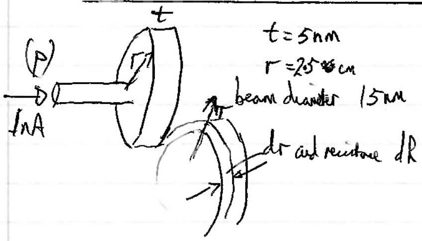

$$
d R = \frac { \rho } { A } = \rho \frac { d r } { 2 \pi r t }
$$

$$
\begin{aligned}
R & = \frac { f } { 2 \pi t } \int _ { r _ { 1 } } ^ { r _ { 2 } } \frac { d r } { r } \\
& = \underset { 2 \pi t } { \frac { f } { r } \ln \frac { r _ { 2 } } { r _ { 1 } } }
\end{aligned}
$$

$$
\begin{aligned}
& = \frac { 2.8 \times 10 ^ { - 8 } } { 2 \pi \times 5 \times 10 ^ { - 9 } } \ln \frac { 2.5 \times 10 ^ { - 2 } } { 7.5 \times 10 ^ { - 9 } } \\
& = \frac { 2.8 } { \pi } \ln \frac { 10 ^ { 7 } } { 3 } = 13.4 \Omega
\end{aligned}
$$

$$
A V = I R = 1 \times 10 ^ { - 9 } \times 13.4 = 13.4 \mathrm { nV }
$$

5

Caparitor $+ V _ { c \rightarrow 0 }$
(q)
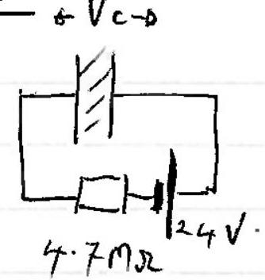

$$
\begin{aligned}
R _ { \text {dulteni } } = \frac { \rho l } { \bar { A } } & = \frac { 1.5 \times 10 ^ { 12 } \times 0.82 \times 10 ^ { - 6 } } { 0.603 } \\
& = 2.04 \times 10 ^ { 6 } \Omega
\end{aligned}
$$

$$
\begin{aligned}
& \therefore V _ { c } = \frac { 2 } { ( 2 \cdot x } \\
& = 7 . \\
& = \frac { 7.3 } { 1 \cdot 12 } \\
& C = \frac { \varepsilon _ { 0 } A } { d } = \frac { 8.85 \times N ^ { - 12 } \times \frac { 0.603 } { 0.82 \times 10 ^ { - 6 } } } { } \\
& = 6.51 \mu \mathrm {~F} \\
& Q = V _ { c } \\
& = 7.26 \times 6.51 < 10 ^ { - 6 } \\
& = 4.7 \times 10 ^ { - 5 } \mathrm { C } \\
& = 47 \mu \mathrm { C } .
\end{aligned}
$$

Dichage.

$$
\begin{aligned}
Q & = q _ { 0 } e ^ { - t / \pi c } \\
\frac { 1 } { 2 } & = e ^ { - t / k c } \\
- \ln 2 & = - \frac { t } { 2.04 \times 10 ^ { 6 } \times 6.51 \times 10 ^ { - 6 } } \\
\ln 2 & = \frac { t } { 13.28 } \\
t & = 9.2 \mathrm {~s}
\end{aligned}
$$

(r) look

$$
P V = k
$$

hot air balloon.
(s)
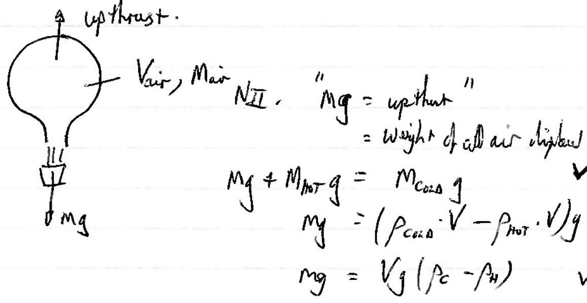
fas Law V\&Toz Lebin
So $\frac { V _ { 1 } } { T _ { 1 } } = \frac { V _ { 2 } } { T _ { 2 } }$ and for a

$$
\begin{aligned}
& P V = n R T \\
& P = \frac { A R } { V } \cdot T
\end{aligned}
$$

Io $\quad \rho _ { C } T _ { C } = \rho _ { H } T _ { H }$
ad $P$ is prodic this quatuil.

$$
\text { Hence } \begin{aligned}
m _ { g } & = V _ { g \rho _ { c } } \left( 1 - \frac { \rho _ { \mu } } { \rho _ { c } } \right) \\
& = V _ { g } \rho _ { c } \left( 1 - \frac { T _ { e } } { T _ { I t } } \right)
\end{aligned}
$$

then,

$$
\begin{aligned}
\frac { T _ { c } } { T _ { \pi } } & = = \frac { 1 - m } { V _ { k } } \\
\frac { 288 } { T _ { H } } & = 1 - \frac { 240 } { 1.23 \times 11000 } \\
T _ { H } & = 350 \mathrm { k } \\
& = 77 ^ { \circ } \mathrm { C }
\end{aligned}
$$

## QUESTION 2

(a) (i) $\frac { h c } { \lambda } = W + k E , \frac { h c } { \lambda } = W + \frac { 1 } { 2 } m v ^ { 2 }$

(ii) $I = 0.1 p A \rightarrow \frac { N } { t } = \frac { 0.1 \times 10 ^ { - 12 } } { 1.6 \times 10 ^ { - 19 } } = 625,0005 ^ { - 1 }$.
(iii)
$$
\begin{aligned}
W & = \frac { h _ { c } } { \lambda } - e V \\
& = \frac { 6.63 \times 10 ^ { - 34 } \times 3 \times 10 ^ { 8 } } { 280 \times 10 ^ { - 9 } } - 0.82 \times 1.6 \times 10 ^ { - 19 } \\
& = \frac { 5.79 \times 10 ^ { - 19 } \mathrm {~J} } { 3.62 \mathrm { eV } } \\
& =
\end{aligned}
$$
(iv)
$$
\begin{aligned}
\frac { 1 } { 2 } m v ^ { 2 } & = e V _ { \text {staping } } \\
v = \sqrt { \frac { 2 e V _ { s } } { m } } & = \sqrt { \frac { 2 \times 1 \cdot 6 \times 10 ^ { - 19 } \times 0.82 } { 9 \% 1 \times 10 ^ { - 31 } } } \\
& = 5.37 \times 10 ^ { 5 } \mathrm {~m} / \mathrm { s }
\end{aligned}
$$

$$
\left\{ \text { In grividy, } R = \frac { u ^ { 2 } \sin \left( z _ { 0 } \right) } { g } \right\}
$$

$$
\begin{aligned}
& = 2 \times \frac { 5.37 \times 10 ^ { 5 } } { 7.2 \times 10 ^ { 12 } } \times \cos ( 20 ) \\
& = 1.40 \times 10 ^ { - 7 \mathrm {~s} }
\end{aligned}
$$

$$
\text { of } \begin{aligned}
\Delta x & = u \sin 8 \cdot \Delta t \\
& = 5 \cdot 37 \times 10 ^ { 5 } \times \sin 20 \times 1.4 \times 10 ^ { - 7 } \mathrm {~s} \\
& = 2.57 : \times 10 ^ { - 2 } \mathrm {~m} \\
& = 2.6 \mathrm {~cm} .
\end{aligned}
$$

(b) (1)
$$
\begin{aligned}
& P _ { \text {out } } = \frac { P _ { \text {in } } } { 4.5 ^ { n } } \\
& 6.6 \times 10 ^ { - 11 } = 1.2 \times 10 ^ { - 3 } \times 4.5 ^ { - n } \\
& n \ln 4.5 = \ln \left( \frac { 1.2 \times 10 ^ { - 3 } } { 6.6 \times 10 ^ { - 11 } } \right) \\
& \quad n = 11.1 .
\end{aligned}
$$
Souteger value is $n = 12$ since $n = 11$ would not be sufficient.
(ii) So $P _ { \text {at } } = \frac { 1.2 \times 10 ^ { - 3 } } { 4.5 ^ { 12 } } = 1.74 \times 10 ^ { - 11 } \mathrm {~W}$
(iii)
$$
\begin{aligned}
\frac { N } { t } = \frac { P _ { - 1 } } { L f } & = \frac { P _ { - 1 } } { L ^ { \prime } d } \\
& = \frac { 1.74 \times 10 ^ { - 11 } \times 585 \times 10 ^ { - 9 } } { 6.63 \times 10 ^ { - 34 } \times 3 \times 10 ^ { 8 } } \\
& = 5.1 \times 10 ^ { 7 } \text { phrtons } / \mathrm { s }
\end{aligned}
$$
(iv) $T _ { \text {ime } }$ of timed $= \frac { 300 } { 3 \times 10 ^ { 8 } } = 10 ^ { - 1 } \mathrm {~s}$
$$
\begin{aligned}
& \therefore N _ { \text {iyipe } } = 5.12 \times 10 ^ { 7 } \times 10 ^ { - 6 } \\
& = 51 \text { photons } \\
& \therefore \Delta x = \frac { 300 } { 51.2 } = 5.86 \mathrm {~m} \\
& \therefore \Delta \mathrm {~m}
\end{aligned}
$$
(v) interference pattern of spots.
(vii) If $n = 1.2$, same menter finators entervicy and leeving perseard. time of trout $T = 1.2 \times 10 ^ { - 6 } \mathrm {~s}$
$$
\begin{aligned}
& \therefore \quad N = 1.2 \times 10 ^ { - 6 } \times 51.2 \times 10 ^ { 6 } \\
& = 61.4 \text { in the pire. } \\
& \therefore \quad \Delta x = 4.9 \mathrm {~m}
\end{aligned}
$$
Answer: the average diat are batween photon is less.

(c) . (i)

When changed, Max KEffolutem negured trabdristatic pe. of hange and phere.
$$
\begin{aligned}
& \text { So, } , \quad k E _ { m } = \frac { h c } { \lambda } - W = e V \\
& 6.63 \times 10 ^ { - 34 } \times 3 \times 10 ^ { 8 } \\
& \frac { 150 \times 10 ^ { - 9 } } { 150 } - 4.7 \times 1.6 \times 10 ^ { - 14 } = 1.1 \times 10 ^ { - 19 } \mathrm {~V}
\end{aligned}
$$
used thinswelcht.
$$
V = 3.59 = 3.6 \mathrm {~V}
$$
(ii) and $V _ { \text {sqlue } } = \frac { 1 } { 4 \pi r _ { 0 } } \cdot \frac { Q } { r }$
$$
\begin{aligned}
Q & = 4 \pi \varepsilon _ { 0 } \cdot r \cdot V _ { \text {glue } } \\
& = \frac { 0.08 } { 9 \times 10 ^ { 9 } } \times 3.59 \\
Q & = 3.2 \times 10 ^ { - 11 } \mathrm { C } \\
N _ { \text {mat } } & = \frac { 3.2 \times 10 ^ { - 11 } } { 1.6 \times 10 ^ { - 19 } } \\
& = 2.0 \times 10 ^ { 8 } \text { electron. }
\end{aligned}
$$
(iii) The hight arriven in photons/hous/pachest enoty so the required energy to free an electron con arrow much eation then the time repined to accumblate enorgle "awage expry" arrival, as "if it was a ware intensity
(iv) This is a capoitor dicclage sit wation.
$$
\begin{aligned}
& C = Q / v = 4 \pi \varepsilon _ { 0 } r \\
& Q = Q _ { 0 } e ^ { - t / R c } \\
& \ln \frac { 1 } { 2 } = - t / R c \\
& R = \frac { 1 } { c } \frac { t } { \ln 2 } = \frac { 1 } { 4 \pi R _ { 0 } r } \cdot \frac { 20 } { \ln 2 } = \frac { 9 \times 10 ^ { 9 } \times 20 } { 0.08 \times 0.093 } = 3.25 \times 10 ^ { 2 } x \\
& = 3 \times 10 ^ { 12 } \Omega
\end{aligned}
$$
4

(d) (i) Charge on leaf at 220 V is $220 \times 6.4 \times 10 ^ { - 12 }$
$$
\begin{aligned}
N _ { e } & = \frac { 220 \times 6.4 \times 10 ^ { - 12 } } { 1.6 \times 10 ^ { - 19 } } = \frac { 1.408 \times 10 ^ { - 4 } } { 1.6 \times 10 ^ { - 19 } } \\
& = 8.8 \times 10 ^ { 9 }
\end{aligned}
$$
(ii)
$$
\begin{aligned}
\text { Adtirty } = \frac { \Delta N } { \Delta t } & = \frac { 8.8 \times 10 ^ { 9 } } { 85 } \\
& = 1.04 \times 10 ^ { 8 } \text { B } \cdot \left( 5 ^ { - 1 } \right)
\end{aligned}
$$
(iii) $\triangle N \Rightarrow \lambda N A t$
$$
\begin{aligned}
N = & \frac { 3.62 \times 10 ^ { - 3 } \mathrm {~g} } { ( 226 + 80 ) \mathrm { g } / \mathrm { mol } . } \\
= & 7.12 \times 10 ^ { 18 } \text { at ons of } \mathrm { R } _ { \mathrm { a } } \mathrm { br } .
\end{aligned}
$$
$$
\text { Hence } \begin{aligned}
t _ { \frac { 1 } { 2 } } & = \frac { 0.693 } { \lambda } = \frac { 0.93 \times N } { ( \Delta N ( t ) ) } \\
& = \frac { 0.693 \times 7.12 \times 10 ^ { 18 } } { 1.04 \times 10 ^ { 8 } } \\
& = 4.7 \times 10 ^ { 10 } \mathrm {~s} ( = 1500 \text { years } )
\end{aligned}
$$
(v) No. It requirs a high putatiol, now achieved in the pe effect $v$
(vi)

[Some Comment vectod].
(vii) To hous shows by 1 hour, then $A _ { 25 } \times 25 = N _ { 24 } ($ contropisted a cight
25
TOTAL
$$
\begin{aligned}
& A _ { 24 } \times 24 = A _ { 25 } + 25 \\
& A _ { 25 } = \frac { 24 } { 25 } \text { ant } A _ { 25 } = e ^ { - \lambda t } \text { \& } \frac { 24 } { 25 } = e ^ { - \lambda t } \quad t = \frac { t _ { 2 } } { 0.643 } \times \ln \frac { 25 } { 44 } \\
& = \frac { 2.77 \times 104 } { 8.9202 }
\end{aligned}
$$

Question 3
(a)
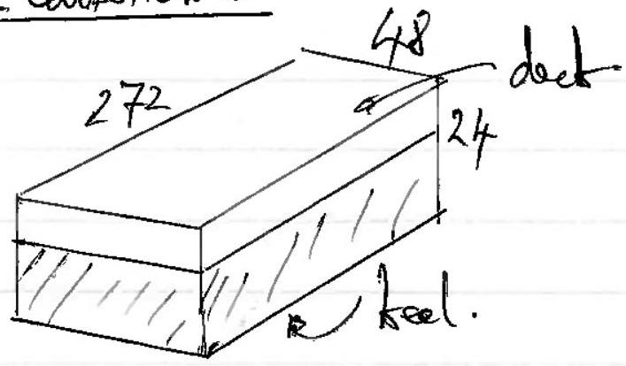
(i) Archmedes. Weight of waber-weyts of ort tweight former

$$
\begin{aligned}
V _ { w } + 1025 \times g & = 180 \times 10 ^ { 6 } \mathrm { rg } \\
V _ { w } & = 175610 \mathrm {~m} ^ { 3 }
\end{aligned}
$$

depot of butmerion, $d = \frac { 175610 } { 272 \times 48 }$

$$
= 13.45 \mathrm {~m}
$$

So, beight of all above were bud is $24 - 13.45$
(ii) Depoth of out in take

$$
h = 10.55 \mathrm {~m}
$$

$$
\begin{aligned}
& = \frac { 158 \times 10 ^ { 6 } } { 900 \times 272 \times 48 } \\
& = 13.45 \mathrm {~m} .
\end{aligned}
$$

CsM for is $\frac { 13.45 } { 2 } = \underline { 6.72 } \mathrm { M }$ abovertal keel.
CdMDPhy is 12 m above that keel.

$$
\operatorname { lod } \left[ \frac { = F _ { 1 } \rightarrow T _ { 1 } \cdots T _ { 2 } } { M _ { 1 } F \mathrm { Cq } , \mathrm { M } } \longrightarrow m _ { 2 } \right.
$$

$$
\begin{aligned}
m _ { 1 } r _ { 1 } + m _ { 2 } r _ { 2 } = r \left( m _ { 1 } + m _ { 2 } \right) & \\
158 \times 10 ^ { 6 } \times 6.72 + 22 \times 10 ^ { 6 } \times 12 & = r \times 180 \times 10 ^ { 6 } \\
r & = \frac { 158 \times 6.72 + 22 \times 12 } { 180 } \\
r & = 7.37 \mathrm {~m} \\
r & = 7.4 \mathrm {~m} \text { aborrthe leed, }
\end{aligned}
$$

(iii) 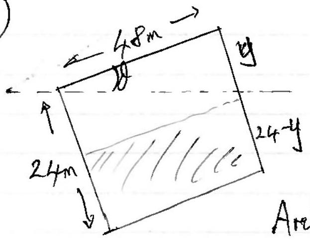
Archimedes: wty washer chythed = weffolt this
trapeʒuira: $\frac { 1 } { 2 } ( 24 + 24 - y ) = 48 \times 272 \times 1025 \times g = 180 \times 10 ^ { 6 }$
(method)
$$
\begin{gathered}
\begin{aligned}
\left( 24 - \frac { y } { 2 } \right) & = 13.45 \\
y & = 21.1 \mathrm {~m} \\
\text { So } \tan \theta & = \frac { 21.1 } { 48 } \\
\theta & = 23.7 ^ { \circ } \\
\theta & = 24 ^ { \circ }
\end{aligned}
\end{gathered}
$$
(iv) As the ship tilts, the contred buganey moves tra nexporation.
The cortred mass of the tatures fored.
[If the besigaring point wer kept find (it shard wot rightanger) then We would have
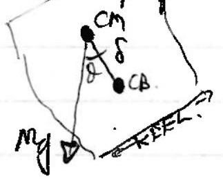
$$
\text { with } \begin{aligned}
\delta & = 7.37 - 6.72 \mathrm {~m} \text { (mocurd formath bell) } \\
& = 0.65 \mathrm {~m}
\end{aligned}
$$
So the mount = my drid
$$
\begin{aligned}
& = 1800 \times 10 ^ { 6 } \times 9.81 \times 0.65 \times h 23.7 ^ { \circ } \\
& = 4.6 \times 10 ^ { 8 } \mathrm { Nm }
\end{aligned}
$$
To calculte the new burgency point. P.T.

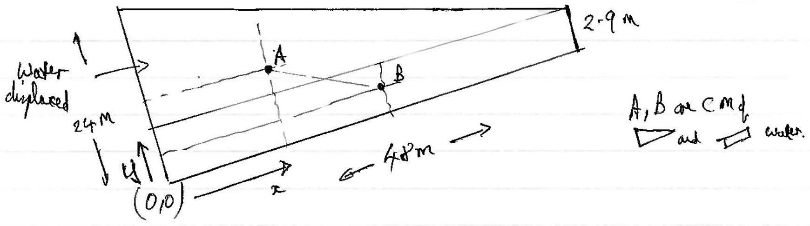

CIMP water is at (X, Y)
(x) $24 \times ( 48 \times 2.9 ) + 16 \times \left( \frac { 1 } { 2 } \times 21.1 \times 48 \right) = X \times \left\{ \frac { 1 } { 2 } ( 24 + 2.9 ) \times 48 \right\}$

$$
24 \times 2.9 + 8 \times 21.1 = x \times \frac { 26.9 } { 2 }
$$

$$
x = 17 \cdot 7 \mathrm {~m} .
$$

Wormeld (Y)
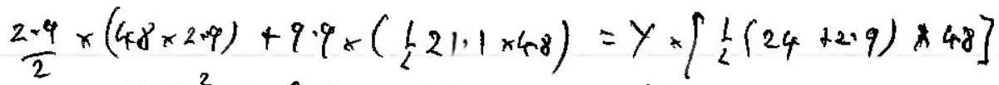

$$
2 \cdot 9 ^ { 2 } + 9 \cdot 9 \times 21 \cdot 1 = y \times 21 \cdot 9
$$

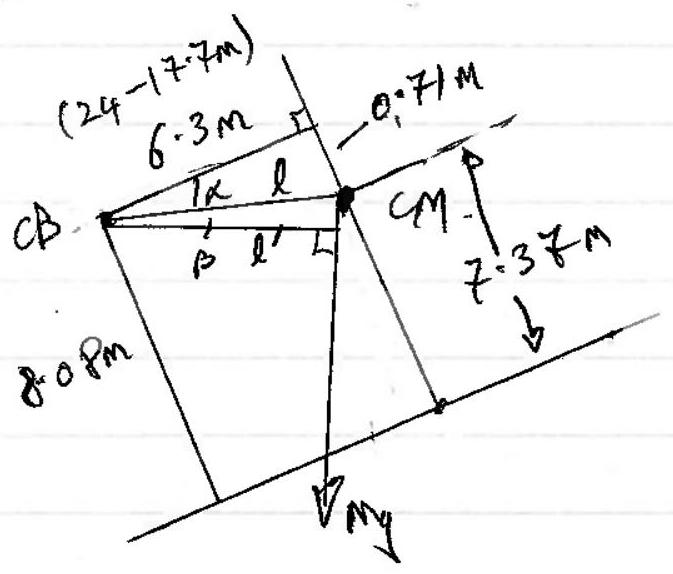

$$
y = 8.08 \mathrm {~m}
$$

$$
\begin{aligned}
\alpha & = 6.43 ^ { \circ } = \tan ^ { - 1 } \frac { 0.71 } { 6.3 } \\
\beta & = 23.7 - 6.43 \\
& = 16.6 ^ { \circ }
\end{aligned}
$$

$$
\begin{aligned}
& l = 6.34 \mathrm {~m} \text { (Pythogenal) } \\
& l ^ { \prime } = 6.34 \cos B .
\end{aligned}
$$

$$
\begin{aligned}
\therefore \text { Moment } & = 6.34 \cos 16.6 ^ { \circ } \times \mathrm { Mg } \\
& = 1.07 \times 10 ^ { 10 } \mathrm { Nm } \\
& = 1.1 \times 10 ^ { 10 } \mathrm { Nm }
\end{aligned}
$$

(b) (i)
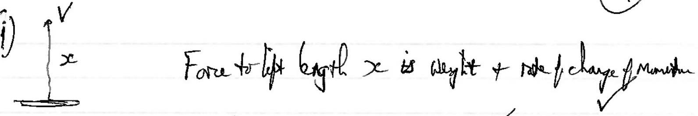
$$
\begin{aligned}
F & = \Delta x \cdot g + \frac { \Delta ( m r ) } { ( m ) } \\
& = \lambda x g + \frac { \Delta ( \lambda x ) } { \Delta t } \cdot v \\
F & = \lambda x g + \lambda v ^ { 2 }
\end{aligned}
$$
$$
\begin{aligned}
& P = F \cdot V \\
& P = \lambda x g V + \lambda v ^ { 3 }
\end{aligned}
$$
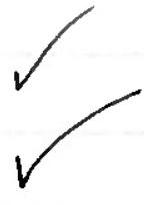
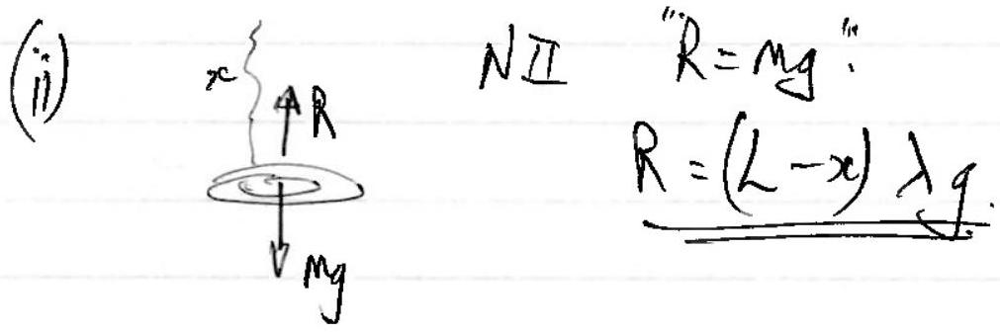
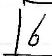
(c) 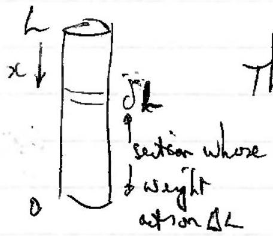
The entenion of the difide is small.
$$
\begin{aligned}
& E = \frac { F } { A } \cdot \frac { L ^ { \prime } } { 2 } \\
& F = M g \frac { ( L - x ) } { L }
\end{aligned}
$$
$$
\begin{gathered}
\Delta L = \int _ { 0 } ^ { L } d L \\
= \int _ { 0 } ^ { L } \frac { F ( x ) } { A E } \cdot d x \\
\Delta L = \int _ { 0 } ^ { L } \frac { m } { E A } \left( \frac { L - x } { L } \right) d x = \frac { m g } { E A L } \left[ L x - \frac { x ^ { 2 } } { 2 } \right] _ { 0 } ^ { L } \\
\frac { e = \frac { 1 } { 2 } \frac { M g } { E A } } { \text { or } } = \frac { 1 } { 2 \frac { g } { E } A L ^ { 2 } }
\end{gathered}
$$
(the some suchemion as in the chain being, publet with a forerequed to half is weyite).

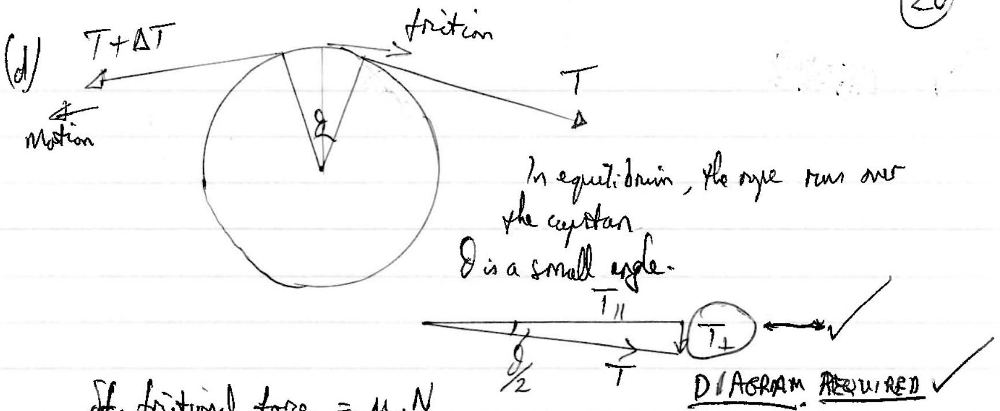

$$
\begin{aligned}
\text { If, frictional fore } & = \mu \cdot N \\
& = \mu 2 T _ { \perp } \\
& = \mu 2 T \sin \frac { d } { 2 } .
\end{aligned}
$$

since rope is alo on the other side.
ie.

$$
\begin{aligned}
& \delta f \approx \mu T \partial \\
& \delta T = \mu T \delta \theta \text { for } \theta \rightarrow \delta \theta
\end{aligned}
$$

(iii)

$$
\begin{aligned}
& \int _ { T _ { R } } ^ { \frac { T _ { R } } { T _ { R } } } = \mu \int _ { 0 } ^ { \theta } d \theta \\
& \left. \ln T \right| _ { T _ { R } } ^ { T _ { L } } = \mu \theta \\
& T _ { L } = T _ { R } e ^ { \mu t }
\end{aligned}
$$

(The force on the lefts Targe to put againt TR ad prition)
(iv)

$$
T _ { \text {lage } } = T _ { \text {small } } \cdot e ^ { 0.3 \times 2 \pi n }
$$

Eart.

$$
\begin{gathered}
6 \times 10 ^ { 25 } = 600 \times e ^ { 0.6 \pi } \\
\ln 10 ^ { 23 } = 0.6 \pi n \\
n = 28
\end{gathered}
$$

25 TOTAL

## Question 4

(a)
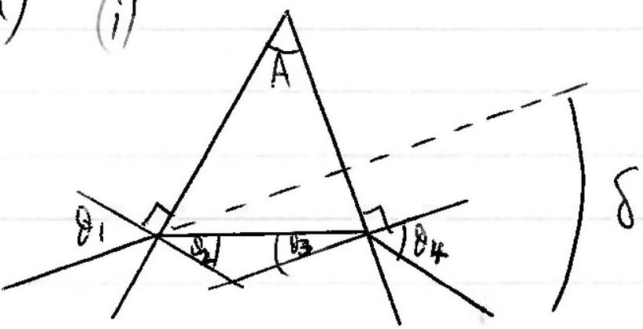

Desjonm with $\theta _ { 1 } \rightarrow \theta _ { 4 }$ mend Diagaan Reaured
(ii)

$$
\begin{aligned}
& \delta = \theta _ { 1 } - \theta _ { 2 } + \theta _ { 4 } - \theta _ { 3 } . \\
& = \theta _ { 1 } + \theta _ { 4 } - \left( \theta _ { 2 } + \partial _ { 3 } \right) \\
& \text { But } \theta _ { 2 } + \theta _ { 3 } = A \\
& \text { so, } \delta = \theta _ { 1 } + \theta _ { 4 } - A
\end{aligned}
$$

(iii) If $\theta _ { 1 } = \theta _ { 4 }$, then $\theta _ { 1 } = \frac { \delta + A } { 2 }$

$$
\theta _ { 2 } = A / 2
$$

for either.
then

$$
n = \frac { \sin \left( \frac { 5 + A } { 2 } \right) } { \sin ( A / 2 ) }
$$

(iv) Religit: $\sin \left( \frac { r _ { r } } { 2 } + 30 ^ { \circ } \right) = \frac { 1.604 } { 2 }$

$$
\delta r = 46.64 ^ { \circ } .
$$

Bluelight: $\quad \sin \left( \frac { \delta _ { b } } { 2 } + 30 \right) = \frac { 1.620 } { 2 }$

$$
\delta _ { b } = 48.19 ^ { c }
$$

$$
\begin{aligned}
\Delta \left( \delta _ { b } - \delta _ { r } \right) & = 1.55 ^ { \circ } \\
& = 1.6 ^ { \circ }
\end{aligned}
$$

(v) Linear separation $= f \times \Delta ($ rodius $)$

$$
\begin{aligned}
& = 30 \times 0.627 \\
& = 0.8 ( 1 ) \mathrm { cm }
\end{aligned}
$$

(vi) $A$ is small. $\operatorname { sof } \left( \theta _ { 2 } + \theta _ { 3 } \right)$ is small
to $\theta _ { 1 } , \theta _ { 4 }$ are emall.
to $\delta$ is sual
\& $\left. n \approx \frac { ( 0 + A ) } { 2 } / \frac { A } { 2 } \approx \frac { \delta } { A } + 1 \right\} ( \therefore \delta = A ( n - 1 ) )$
Nortfor Not worn recenut.

(vii)
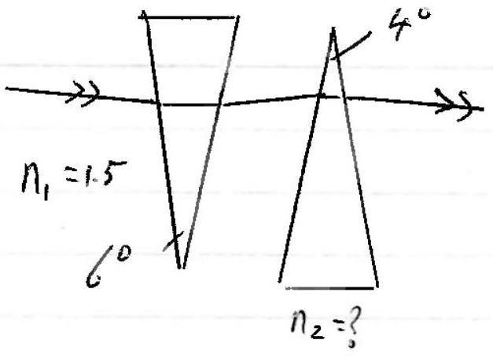
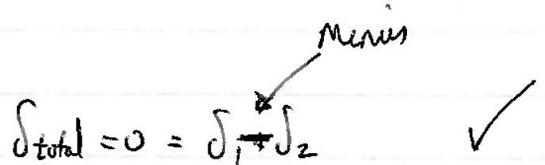

$$
0 = A _ { 1 } \left( n _ { 1 } - 1 \right) - A _ { 2 } \left( n _ { 2 } - 1 \right)
$$

$$
\begin{aligned}
6 ( 1.5 - 1 ) & = 4 \left( n _ { 2 } - 1 \right) \\
n _ { 2 } & = 1.75
\end{aligned} \quad \checkmark \quad 10
$$

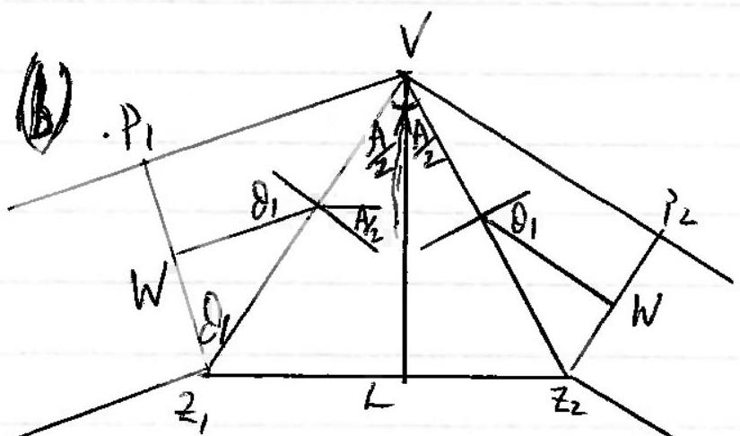

Can matrox angles $\frac { A } { 2 }$ wd $O _ { 1 }$

$$
\begin{aligned}
& \left| \cos \theta _ { 1 } = \frac { w } { V z _ { 1 } } \right| \\
t _ { 1 } = & 2 \cdot \frac { P \cdot V } { C } \\
= & 2 \cdot \frac { w } { C } \tan \theta _ { 1 } \\
= & 2 \cdot \frac { w } { C } \frac { \sin \theta _ { 1 } } { W } \cdot V z _ { 1 } \\
= & \frac { 2 } { C } V z _ { 1 } \cdot \sin d _ { 1 } \\
= & \frac { 2 } { C } \cdot \frac { 2 } { 2 } \cdot \frac { \sin \theta _ { 1 } } { \sin ( A / 2 ) } \\
= & \frac { L } { C } \frac { \sin \theta _ { 1 } } { \sin ( A / 2 ) }
\end{aligned}
$$

$$
\text { And } \quad \begin{aligned}
& t _ { 2 } = \frac { n L } { c } \\
& \therefore \quad \frac { t _ { 1 } } { t _ { 2 } } = \frac { 1 } { n } \frac { \sin \theta _ { 1 } } { \sin ( A / 2 ) }
\end{aligned}
$$

[Ognes woul $n = \frac { \sin \left( \frac { A + \delta } { 2 } \right) } { \sin \left( \frac { B } { 1 } \right) }$ wh $t _ { 1 } = t _ { 2 }$ ]

(c)
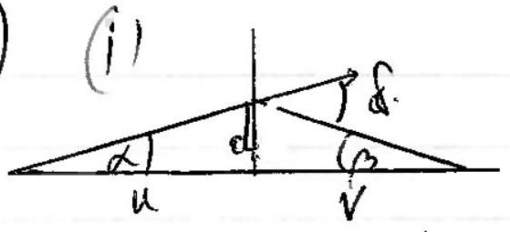

$$
\delta = \alpha + \beta
$$

and we trave this

$$
\delta = A ( n - 1 )
$$

for small $\alpha , \beta$,

$$
\left. \begin{array} { l }
\alpha = \frac { d } { d } \\
\beta = d / v
\end{array} \right\}
$$

fo $\alpha + \beta = A ( n - 1 )$
becomes $\frac { d } { u } + \frac { d } { v } = A ( n - 1 )$
then

$$
\frac { 1 } { u } + \frac { 1 } { v } = \frac { A } { d } ( n - 1 )
$$

(ii)

$$
\begin{aligned}
\frac { 1 } { D } + \frac { 1 } { 40 } & = \frac { A } { 2.5 } ( 1.5 - 1 ) \\
\frac { 1 } { 40 } & = \frac { A } { 2.5 } \times 0.5 \\
A & = \frac { 1 } { 8 } \text { radim } \\
A & = 7 ^ { \circ }
\end{aligned}
$$

(d) Time differed

$$
\begin{aligned}
& t _ { b } = \frac { 60 \times 1.35 } { 3 \times 10 ^ { 8 } } = 2.70 \times 10 ^ { - 7 } \mathrm {~s} \\
& t _ { r } = \frac { 60 \times 1.33 } { 3 \times 10 ^ { 8 } } = 2.66 \times 10 ^ { - 7 } \mathrm {~s} \\
& \Delta t = 0.04 \times 10 ^ { - 7 } \mathrm {~s}
\end{aligned}
$$

When the N Lyte gios off as the ble bight begins, is time $\frac { 1 } { 2 f _ { 0 } } = \Delta t$
Int.

$$
\begin{aligned}
\square \square \sqcap \square & f _ { 0 } = \frac { 1 } { 2 \Delta t } \\
\left( \frac { T } { 2 } = \Delta t \right) . & f _ { 0 } = 1.25 \times 10 ^ { 8 } \mathrm {~Hz}
\end{aligned}
$$

3

(e) From layer to haver,
$$
n _ { 4 } \sin \alpha _ { 4 } = n _ { 3 } \sin \alpha _ { 3 }
$$
then $n _ { 3 } \sin \alpha _ { 3 } = n _ { 2 } \sin \alpha _ { 2 }$
etc. $\quad n _ { 2 } \sin x _ { 2 } = n _ { 1 } x _ { 1 } x _ { 1 }$
$$
n _ { 1 } \sin \alpha _ { 1 } = n _ { 0 } \sin \alpha _ { 4 }
$$
At the top of the durmploy $n _ { \text {top } } = 1$
So $n _ { \text {top } } \sin \alpha _ { t p } = n _ { 0 } \sin \alpha _ { 0 }$
i.e. $1 \cdot \sin \alpha = n _ { 0 } \sin \alpha _ { 0 }$
But we aregion $\alpha = \alpha _ { 0 } + r$
$$
\begin{aligned}
\text { then } & n _ { 0 } \sin \alpha _ { 0 } = \sin \left( \alpha _ { 0 } + r \right) \\
& = \sin \alpha _ { 0 } \cos r + \sin r \cos \alpha _ { 0 } \\
n _ { 0 } \sin \alpha _ { 0 } & \approx \sin \alpha _ { 0 } + r \cos \alpha _ { 0 } \\
\frac { 1 } { 0 } \cos \alpha _ { 0 } \quad \tan \alpha _ { 0 } & = \tan \alpha _ { 0 } + r
\end{aligned}
$$
Here $r = ( n - 1 ) \tan \alpha _ { 0 }$
25
TOTAL.

## Question 5

(a) 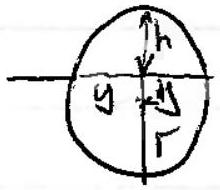
$$
\begin{aligned}
& y ^ { 2 } = h ( 2 r - h ) \\
& q ^ { 2 } = 4 ( 2 r - 4 ) \\
& \frac { d ^ { 2 } } { 4 } + 4 = 2 r
\end{aligned}
$$
$$
r = \frac { 97 } { 8 } = 12.125 \mathrm {~m}
$$
NII
$$
\frac { M v ^ { 2 } } { r } = m g
$$
(b)
$$
\begin{aligned}
& \frac { M v ^ { 2 } } { r } = \frac { G M M _ { g } } { r ^ { 2 } } \\
& \left( \frac { 2 \pi r } { T } \right) ^ { 2 } \frac { 1 } { r } = \frac { G M _ { g } } { r ^ { 2 } } \\
& T ^ { 2 } = \frac { 4 \pi ^ { 2 } } { G M _ { g } } \cdot r ^ { 3 }
\end{aligned}
$$
(iii)
$$
\begin{aligned}
M _ { g } & = \frac { 4 \pi ^ { 2 } \cdot r ^ { 3 } } { G T ^ { 2 } } \\
& = \frac { 4 \pi ^ { 2 } \times \left( 3 \times 10 ^ { 4 } \times 9 \cdot 46 \times 10 ^ { 15 } \right) ^ { 3 } } { 6 \cdot 67 \times 10 ^ { - 11 } \times \left( 200 \times 10 ^ { 6 } \times 3 \cdot 1 / 6 \times 10 ^ { 7 } \right) ^ { 2 } }
\end{aligned}
$$
(c) (i) In a circumer orbit their an unbalemed/resultar force acting on the corditite.
$$
\text { So } \begin{aligned}
M _ { a } = \frac { M v ^ { 2 } } { r } & = G \frac { M M _ { E } } { r ^ { 2 } } \\
v & = \sqrt { \frac { G M _ { E } } { r } }
\end{aligned}
$$
and aing $g = \frac { G M _ { E } } { r ^ { 2 } }$ or otherwise, $v = \sqrt { r g }$

(ii)

$$
\begin{aligned}
V & = \sqrt { 6.37 \times 10 } \times 9.81 \\
& = 7900 \mathrm {~m} / \mathrm { s } \\
& = 7.9 \mathrm {~km} / \mathrm { s }
\end{aligned}
$$

(iii)

$$
\begin{aligned}
T = \frac { 2 \pi } { V } & = \frac { 2 \pi \times 6.37 \times 10 ^ { 6 } } { 7900 } \\
& = 5060 \mathrm {~s} .
\end{aligned}
$$

(iv) If we obtain an expression for the perciod in the it $R$,

$$
T ^ { 2 } = \frac { 4 \pi ^ { 2 } } { G m _ { E } } \cdot R ^ { 3 } \text { so } T = \sqrt { \frac { 4 \pi ^ { 2 } } { \sigma m _ { E } } } \cdot R ^ { \frac { 3 } { 2 } }
$$

then

$$
\begin{aligned}
& T ^ { \prime } = \sqrt { \frac { 4 \pi ^ { 2 } } { G m _ { E } } } ( R + h ) ^ { \frac { 3 } { 2 } } \\
& \approx \sqrt { \frac { 4 \pi ^ { 2 } } { G M _ { E } } } R ^ { 3 } \left( 1 + \frac { h } { R } \right) ^ { \frac { 3 } { 2 } } \\
& T ^ { \prime } \approx T \left( 1 + \frac { 3 h } { 2 R } \right) + O \left( \frac { L ^ { 2 } } { R ^ { 2 } } \right) \\
& \frac { T ^ { \prime } - T } { T } = \frac { 3 h } { 2 R } \\
& \Delta T = T \cdot \frac { 3 } { 2 } \left( \frac { 200 } { 6370 } \right) = 5060 \times \frac { 3 } { 2 } \left( \frac { 200 } { 6370 } \right) \\
& \Delta T = 238 \mathrm {~s} \\
& T ^ { \prime } = 5060 + 240 = 5300 \mathrm {~s}
\end{aligned}
$$

(v) $T ^ { \prime }$
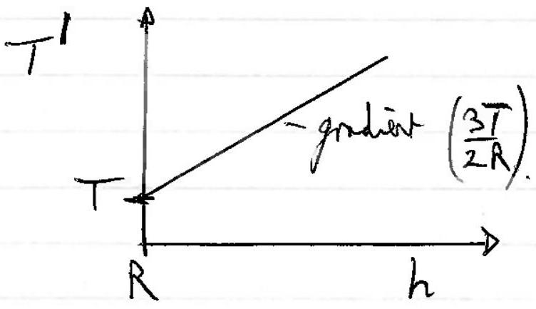
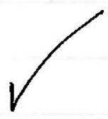

(vi) Bafore $\square ^ { m _ { 1 } } \square ^ { m _ { 2 } } 0 ^ { m _ { 2 } }$
After. $\quad W ^ { M _ { 1 } } \xrightarrow { V _ { 1 } } \xrightarrow { M _ { 2 } }$
Momestum : $M _ { 1 } u = M _ { 1 } V _ { 1 } + m _ { 2 } V _ { 2 }$ @ — KE comervel: $\frac { 1 } { 2 } M _ { 1 } M ^ { 2 } = \frac { 1 } { 2 } M _ { 1 } V _ { 1 } ^ { 2 } + i _ { i } m _ { 2 } V _ { 2 } ^ { 2 }$ (2) ✓
Loss of $k E$ of $m _ { 1 }$ in $\frac { 1 } { 2 } m _ { 1 } m ^ { 2 } - \frac { 1 } { 2 } m _ { 1 } v _ { 1 } ^ { 2 } = \frac { 1 } { 2 } m _ { 2 } v _ { 2 } ^ { 2 }$ (3)
From (1) w (2) $m _ { 1 } \left( u - v _ { 1 } \right) = m _ { 2 } v _ { - }$
and $m _ { 1 } \left( u - v _ { 1 } \right) \left( u + v _ { 1 } \right) = m _ { 2 } v _ { 2 } ^ { 2 }$
diviling
$$
u + v _ { 1 } = v _ { 2 }
$$
For $M _ { 1 } \gg M _ { 2 } \quad U _ { 2 } \approx V _ { 1 }$
$$
\begin{aligned}
\therefore \quad \text { KE leut } & \approx \frac { 1 } { 2 } m _ { 2 } 4 u ^ { 2 } \\
& = 2 m _ { 2 } u ^ { 2 }
\end{aligned}
$$
Suing $u + v _ { 1 } = v _ { 2 }$
and prom(1) $U - V _ { 1 } = \frac { m _ { 2 } } { m _ { 1 } } V _ { 2 }$
Subitiat $2 V _ { 1 } = V _ { 2 } \left( 1 - \frac { M _ { 2 } } { m _ { 1 } } \right)$
$$
2 V _ { 1 } \approx V _ { 2 }
$$
w $u + v _ { 1 } \approx 2 v _ { 1 }$
$$
\left. u \approx v _ { 1 } . \quad \right]
$$
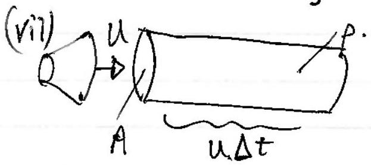
In time $\Delta t , \quad m _ { 2 } = p A \sqcup \Delta t$
$$
\text { So } \begin{aligned}
\text { kelout in } \Delta t \text { is } \quad \Delta k & = 2 p A u \Delta t \cdot u ^ { 2 } \\
& = 2 p A u ^ { 3 } \Delta t \\
\text { So } \frac { \Delta k } { \Delta t } & = 2 p A u ^ { 3 } \quad \checkmark
\end{aligned}
$$
$$
\text { (viii) } \begin{aligned}
& \frac { d k } { d t } = \frac { 1 } { 2 } m \frac { d V ^ { 2 } } { d t } = \frac { 1 } { 2 } m 2 V \frac { d V } { d t } = m V \frac { d V } { d t } \\
& \therefore \frac { \Delta k } { k } = \frac { \Delta k } { 2 } \frac { 1 } { 2 } v ^ { 2 } \\
& \text { Io } \frac { \Delta V } { V } = \frac { \Delta k } { \frac { 1 } { 2 } m V ^ { 2 } } = 2 \frac { V \frac { \Delta V } { V ^ { 2 } } } { 20 \times ( 7900 ) ^ { 2 } } = 2 \frac { \Delta V } { V }
\end{aligned}
$$

(ix)

$$
\begin{aligned}
E & = \frac { 1 } { 2 } m v ^ { 2 } + \frac { - G M m } { \Gamma } \\
& = - \frac { 1 } { 2 } \frac { G M m } { r } \\
& = - \frac { 1 } { 2 } m v ^ { 2 }
\end{aligned}
$$

$$
\text { at } \begin{aligned}
\frac { M v ^ { 2 } } { r } & = \frac { A M _ { M } } { r ^ { 2 } } \\
\frac { 1 } { 2 } M v ^ { 2 } & = \frac { 1 } { 2 } \frac { G M n } { r }
\end{aligned}
$$

So'if E becomes less then $V ^ { 2 } , V$ increases.
(x) So we are looking at smallchanges.

Using the result form (vii),

$$
\begin{aligned}
\frac { \Delta k } { \Delta t } & = 2 \rho \mathrm { Au } ^ { 3 } \\
\approx 5000 \mathrm {~s} \rightleftharpoons 5060 & = 2 \rho ( 2.4 ) \times 7900 ^ { 3 } \\
\rho & = 8.4 \times 10 ^ { - 13 } \mathrm {~kg} _ { \mathrm { m } ^ { 3 } }
\end{aligned}
$$

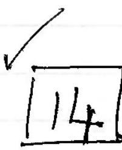
(d)
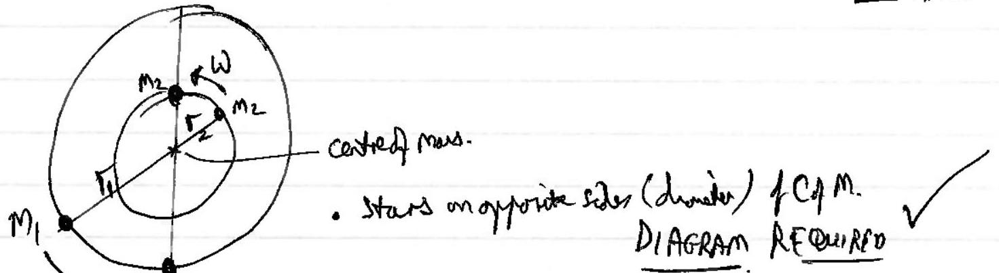
(ii)
$M _ { 1 } r _ { 1 } = m _ { 2 } r _ { 2 } \quad$ alaute cof $M$.

$$
\begin{aligned}
& m / r _ { 1 } w ^ { 2 } = G \frac { m _ { 1 } m _ { 2 } } { r ^ { 2 } } \\
& m / r _ { 2 } w ^ { 2 } = G \frac { m _ { 1 } w _ { 2 } } { r ^ { 2 } } \\
& r w ^ { 2 } = G \frac { m } { r ^ { 2 } }
\end{aligned}
$$

$$
\begin{gathered}
m _ { 2 } = k m _ { 1 } \\
\frac { r _ { 1 } } { r _ { 2 } } = k .
\end{gathered}
$$

(iii) Wensthe start regelar, the angular velocity of sal star, whans ate some, The centre stance mares.

- Stars at same seperation and will some litas bifore.
- Ceatre of was nos halfory between chem.

(iv) Sine for on ortiting pair of than, $\Gamma \omega ^ { 2 } = \frac { G M } { \Gamma ^ { 2 } }$
where $r$ is the separation
$m$ is the followas, $m = m _ { 1 } + m _ { 2 }$
$$
\begin{aligned}
& = m _ { 1 } + k m _ { 1 } \\
& = m _ { 1 } ( 1 + k ) .
\end{aligned}
$$
then $\omega ^ { 2 } = \frac { G m _ { 1 } ( 1 + k ) } { T ^ { 3 } }$ (aud w does not change)
The envary of the post-explosion system, $E$.
$$
\begin{aligned}
E & = 2 \times \frac { 1 } { 2 } M _ { 1 } \left( \frac { \Gamma } { 2 } \right) ^ { 2 } \omega ^ { 2 } - \frac { \sigma M _ { 1 } ^ { 2 } } { \Gamma } \\
& = \frac { m _ { 1 } } { 4 } \cdot \frac { \sigma m _ { 1 } ( 1 + k ) } { \Gamma ^ { 3 } } - \frac { \sigma m _ { 1 } ^ { 2 } } { \Gamma } \\
E & = \frac { G m _ { 1 } ^ { 2 } } { \Gamma } \left( \frac { 1 + k } { 4 } - 1 \right)
\end{aligned}
$$
For a bound system, $E < 0$.
So $\frac { 1 + k } { 4 } < 1$
$$
k < 3
$$

25
TOTAL

Question 6
(a) $\frac { a } { \sqrt { 2 } }$
(b) The pitestial very i $6 \times \frac { 1 } { 4 \pi } \frac { e } { 6 } \times \frac { e } { a / \sqrt { 2 } }$

$$
\begin{aligned}
& = \frac { \sqrt { 2 } e ^ { 2 } } { 4 \pi \varepsilon _ { 0 } a } \\
& = \frac { \sqrt { 2 } \times \left( 1.6 \times 10 ^ { - 19 } \right) ^ { 2 } \times 9 \times 10 ^ { 9 } } { 0.564 \times 70 ^ { - 9 } } \\
& = 5.8 \times 10 ^ { - 19 } \mathrm {~J}
\end{aligned}
$$

$$
\begin{aligned}
\text { per mele, every } & = 5.58 \times 10 ^ { - 19 } \times 6.02 \times 10 ^ { 23 } \\
& = 348 \mathrm {~kJ} / \\
& = 350 \frac { \mathrm {~kJ} } { \mathrm {~mol} } ,
\end{aligned}
$$

(c)
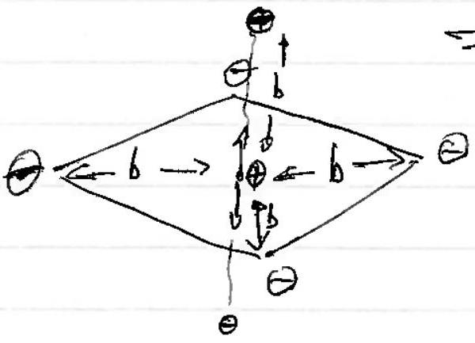
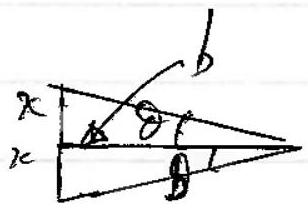
(A) Fore on $\mathrm { Na } ^ { + }$due to charges ortf toplane.

$$
\begin{aligned}
F _ { 0 } & = - \frac { 1 } { 4 \pi \varepsilon _ { 0 } } \cdot e ^ { 2 } \left[ \frac { 1 } { ( b - x ) ^ { 2 } } - \frac { 1 } { ( b + x ) ^ { 2 } } \right] . \\
& = - \frac { e ^ { 2 } } { 4 \pi \varepsilon _ { 0 } } \left[ \frac { ( b + x ) ^ { 2 } - ( b - x ) ^ { 2 } } { ( b - x ) ^ { 2 } ( b + x ) ^ { 2 } } \right] \\
& = - \frac { e ^ { 2 } } { 4 \pi \varepsilon _ { 0 } } \left[ \frac { 2 b \cdot 2 x } { \left( b ^ { 2 } - x ^ { 2 } \right) ^ { 2 } } \right] \\
& = - \frac { 4 e ^ { 2 } b x } { 4 \pi \varepsilon _ { 0 } } \left( \frac { 1 } { \left( b ^ { 2 } - x ^ { 2 } \right) ^ { 2 } } \right. \\
& \approx - \frac { 4 e ^ { 2 } b x } { 4 \pi \varepsilon _ { 0 } b ^ { 4 } } \left[ 1 + \frac { 2 x ^ { 2 } } { b ^ { 2 } } \right]
\end{aligned}
$$

To leading odder $F _ { 0 } = - \frac { 4 e ^ { 2 } } { 4 \pi \varepsilon _ { 0 } } \frac { x } { b ^ { 3 } }$

(B) Fore on $\mathrm { Na } ^ { + }$duefor the forchages is the plane.

$$
\begin{aligned}
& F _ { i } = - 4 \times \frac { 1 } { 4 \pi \varepsilon _ { 0 } } \frac { e ^ { 2 } } { \left( x ^ { 2 } + b ^ { 2 } \right) } \cdot \sin \theta \\
& \text { and } \sin d = \frac { x } { \left( x ^ { 2 } + b ^ { 2 } \right) ^ { \frac { 1 } { 2 } } } \\
& \therefore \quad F _ { i } = \frac { - 4 e ^ { 2 } } { 4 \pi \varepsilon _ { 0 } } \cdot \frac { x } { \left( x ^ { 2 } + b ^ { 2 } \right) ^ { \frac { 3 } { 2 } } } \\
& = - \frac { 4 e ^ { 2 } } { 4 \pi \varepsilon _ { 0 } } \cdot \frac { x } { b ^ { 3 } } \left[ 1 - \frac { 3 } { 2 } \frac { x ^ { 2 } } { b ^ { 2 } } + \cdots \right]
\end{aligned}
$$

To deading adder, $F _ { i } = - \frac { 4 e ^ { 2 } x } { 4 \bar { k } _ { 0 } } \cdot \frac { b ^ { 3 } } { \quad \left( \text { the some as } F _ { 0 } \right) }$

$$
\therefore \quad F _ { \text {extining } } = F _ { 0 } + F _ { i } = - \frac { 8 e ^ { 2 } } { 4 \pi \varepsilon _ { 0 } } \frac { x } { b ^ { 3 } }
$$

and uning $b = \frac { a } { \sqrt { 2 } }$

$$
m \ddot { x } = - \frac { 8 e ^ { 2 } } { 4 \pi \varepsilon _ { 0 } } \cdot x _ { a ^ { 3 } } ^ { 2 \sqrt { 2 } }
$$

f

$$
\begin{aligned}
\omega ^ { 2 } & = \frac { 16 \sqrt { 2 } e ^ { 2 } } { 4 \pi \varepsilon _ { 0 } a ^ { 3 } } M \\
f = \frac { \omega } { 2 \pi } & = \frac { 4 e } { 2 \pi } \sqrt { \frac { \sqrt { 2 } } { 4 \pi \varepsilon _ { 0 } a ^ { 3 } \times 23 . u } } \\
& = 2 \times \frac { 1.6 \times 10 ^ { - 19 } } { \pi } \sqrt { \frac { \sqrt { 2 } \times 9 \times 10 ^ { 9 } } { \left( 0.564 \times 10 ^ { - 9 } \right) ^ { 3 } \times 23 \times 1.66 \times 10 ^ { - 27 } } } \\
& = 4.39 \times 10 ^ { 12 } \mathrm {~Hz} \\
& = 4.4 \times 10 ^ { 12 } \mathrm {~Hz}
\end{aligned}
$$

(d) (i) For teffraction, $n \lambda = a \sin d _ { n }$
de Broghe wave, $\lambda = h / p$
ke.

$$
e V = p _ { 2 } ^ { 2 } \quad p = \sqrt { 2 m e V }
$$

So

$$
\begin{aligned}
& n h = a \sin d _ { n } \\
& \sqrt { 2 M e V } \sin \partial _ { n } = \frac { n h } { a \sqrt { 2 M N } }
\end{aligned}
$$

(ii)
$$
\begin{aligned}
\sin \delta _ { n } & = \frac { n \times 6.63 \times 10 ^ { - 34 } } { 0.564 \times 10 ^ { - 9 } \sqrt { 2 \times 9.11 \times 10 ^ { - 31 } \times 1.6 \times 10 ^ { - 19 } \times 100 } } \\
& = n \times 0.218 \\
n = 1 \quad \partial _ { 1 } & = 12.6 ^ { \circ } = 13 ^ { \circ } \\
n = 2 \partial _ { 2 } & = 25.8 ^ { \circ } = 26 ^ { \circ }
\end{aligned}
$$
(iii) Picture
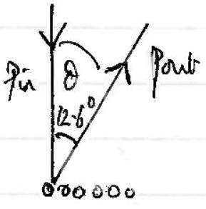
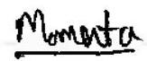
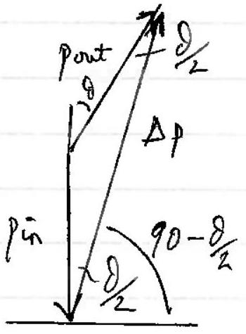
(iv) $\quad 90 - \frac { 8 } { 2 } = 90 - 6.3 = 83.7 ^ { \circ } = 84 ^ { \circ }$
Magnitude: Sincrule $\frac { \Delta P } { \sin 167.4 ^ { \circ } } = \frac { p _ { \text {in } } } { \sin 6.3 ^ { \circ } }$
$$
\begin{aligned}
p _ { i n } & = \sqrt { 2 \mathrm { meV } ^ { 2 } } \\
& = 5.4 \times 10 ^ { - 24 } \mathrm { kgms } ^ { - 1 } \\
\Delta p & = \frac { \sin 167 - 4 } { \bar { m } 6.3 } \times 5.4 \times 10 ^ { - 24 } \mathrm { ggms } ^ { - 1 } \\
\Delta p & = 1.07 \times 10 ^ { - 23 } \\
\Delta p & = 1.1 \times 10 ^ { - 23 } \mathrm { gm } \mathrm {~s} ^ { - 1 }
\end{aligned}
$$
8
(e) enegy per atom, $E = \frac { 1 } { 4 \pi \varepsilon _ { 0 } } \cdot \frac { e ^ { 2 } } { r }$
be engry per me is $E _ { n } = \frac { 1 } { 4 R _ { 0 } } \cdot \frac { e ^ { 2 } } { \Gamma } \cdot N A \cdot$
Here $r = \frac { 9 \times 10 ^ { 9 } \times \left( 1.6 \times 10 ^ { - 19 } \right) ^ { 2 } \times 6.02 \times 10 ^ { 23 } } { 496 \times 10 ^ { 3 } }$
$$
r = 2.8 \times 10 ^ { - 10 } \mathrm {~m}
$$

(d)
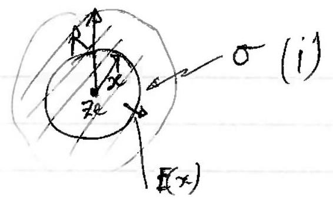

$$
\begin{aligned}
E ( x ) & = E _ { + } + E _ { - } \\
& = \frac { 1 } { 4 \pi \varepsilon _ { 0 } } \cdot \frac { z e } { x ^ { 2 } } + \frac { 1 } { 4 \pi \varepsilon _ { 0 } } \left[ \frac { 4 } { 3 } \pi x ^ { 3 } ( - 0 ) \right]
\end{aligned}
$$

$$
\begin{aligned}
\sigma & = \frac { z e } { \frac { 4 } { 3 } \pi R ^ { 3 } } \\
Q ( x ) & = - \frac { 4 } { 3 } \pi x ^ { 3 } \sigma \\
& = - \frac { 4 } { 3 } \pi \frac { x ^ { 3 } ( Z e ) } { \frac { 4 } { 4 } \pi R ^ { 3 } } \\
Q ( x ) & = - \frac { x ^ { 3 } ( Z e ) } { R ^ { 3 } }
\end{aligned}
$$

check: when $x = R , E = 0$.
(ii)

$$
\begin{aligned}
V = - \int _ { R } ^ { x } E d x & = - \frac { z e } { 4 \pi \varepsilon _ { 0 } } \int _ { R } ^ { x } \left[ \frac { 1 } { x ^ { 2 } } - \frac { x } { R ^ { 3 } } \right] d x \\
& = - \frac { z e } { 4 \pi \varepsilon _ { 0 } } \left[ - \frac { 1 } { x } - \frac { x ^ { 2 } } { 2 R ^ { 3 } } \right] _ { R } ^ { x } \\
& = + \frac { z e } { 4 \pi \varepsilon _ { 0 } } \left[ \frac { 1 } { x } + \frac { x ^ { 2 } } { 2 R ^ { 3 } } - \frac { 1 } { R } - \frac { R ^ { 2 } } { 2 R ^ { 3 } } \right] \\
& = \frac { + z e } { 4 \pi \varepsilon _ { 0 } } \left[ \frac { 1 } { x } + \frac { x ^ { 2 } } { 2 R ^ { 3 } } - \frac { 3 } { 2 R } \right] .
\end{aligned}
$$

N.B. When $x = R \quad V = 0$ as argested an twe
(iii)
is no fill outside the dom.

TOTAL

$$
\begin{aligned}
& W = \int _ { 0 } ^ { 7 z } V \cdot d q = \int _ { 0 } ^ { R } \frac { z e } { 4 \pi \varepsilon _ { 0 } } \left[ \frac { 1 } { x } + \frac { x ^ { 2 } } { 2 R ^ { 3 } } - \frac { 3 } { 2 R } \right] \cdot 4 \pi x ^ { 2 } \sigma \cdot d x \\
& = \frac { z e } { 4 \pi \varepsilon _ { 0 } } \cdot 4 \pi \sigma \int _ { 0 } ^ { R } \left[ x + \frac { x ^ { 4 } } { 2 R ^ { 3 } } - \frac { 3 x ^ { 2 } } { 2 R } \right] d x \\
& = \frac { z e } { \varepsilon _ { 0 } } \cdot \sigma \left[ \frac { x ^ { 2 } } { 2 } + \frac { x ^ { 5 } } { 5 \cdot 2 R ^ { 3 } } - \left. \frac { 3 \cdot x ^ { 3 } } { 3 \cdot 2 R } \right| _ { 0 } ^ { R } \right. \\
& = \frac { z e \sigma } { \varepsilon _ { 0 } } \left[ \frac { R ^ { 2 } } { 2 } + \frac { R ^ { 2 } } { 10 } - \frac { R ^ { 2 } } { 2 } \right] . \\
& = \frac { z e \sigma R ^ { 2 } } { \varepsilon _ { 0 } \times 10 } = \frac { z e R ^ { 2 } } { 10 \varepsilon _ { 0 } } \cdot \frac { z e } { 4 \pi R ^ { 3 } } = \frac { ( z e ) ^ { 2 } } { 4 \pi \varepsilon _ { 0 } } \frac { 3 } { 10 R } \\
& \text { invegymed } = \frac { \left( 11 \times 16 \times 10 ^ { - 19 } \right) ^ { 2 } \times 0.3 \times 9 \times 10 ^ { 9 } \times 6.02 \times 10 ^ { 23 } } { 3 \times 10 ^ { - 10 } } = 1.7 \frac { M J / m } { m u _ { 0 } } =
\end{aligned}
$$
