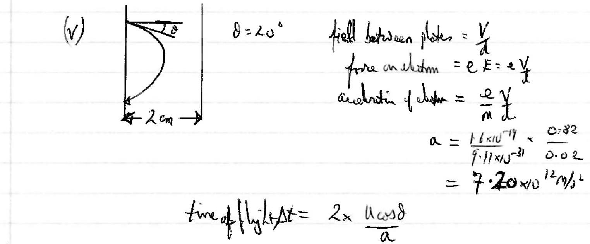
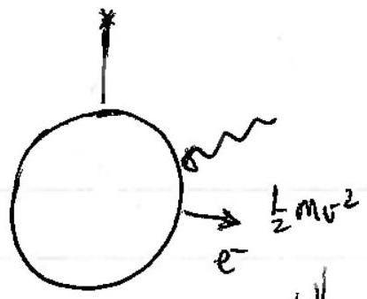
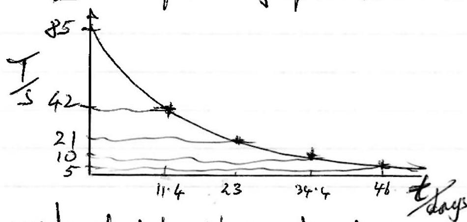

## QUESTION 2

(a) (i) $\frac { h c } { \lambda } = W + k E , \frac { h c } { \lambda } = W + \frac { 1 } { 2 } m v ^ { 2 }$

(ii) $I = 0.1 p A \rightarrow \frac { N } { t } = \frac { 0.1 \times 10 ^ { - 12 } } { 1.6 \times 10 ^ { - 19 } } = 625,0005 ^ { - 1 }$.
(iii)
$$
\begin{aligned}
W & = \frac { h _ { c } } { \lambda } - e V \\
& = \frac { 6.63 \times 10 ^ { - 34 } \times 3 \times 10 ^ { 8 } } { 280 \times 10 ^ { - 9 } } - 0.82 \times 1.6 \times 10 ^ { - 19 } \\
& = \frac { 5.79 \times 10 ^ { - 19 } \mathrm {~J} } { 3.62 \mathrm { eV } } \\
& =
\end{aligned}
$$
(iv)
$$
\begin{aligned}
\frac { 1 } { 2 } m v ^ { 2 } & = e V _ { \text {staping } } \\
v = \sqrt { \frac { 2 e V _ { s } } { m } } & = \sqrt { \frac { 2 \times 1 \cdot 6 \times 10 ^ { - 19 } \times 0.82 } { 9 \% 1 \times 10 ^ { - 31 } } } \\
& = 5.37 \times 10 ^ { 5 } \mathrm {~m} / \mathrm { s }
\end{aligned}
$$

$$
\left\{ \text { In grividy, } R = \frac { u ^ { 2 } \sin \left( z _ { 0 } \right) } { g } \right\}
$$

$$
\begin{aligned}
& = 2 \times \frac { 5.37 \times 10 ^ { 5 } } { 7.2 \times 10 ^ { 12 } } \times \cos ( 20 ) \\
& = 1.40 \times 10 ^ { - 7 \mathrm {~s} }
\end{aligned}
$$

$$
\text { of } \begin{aligned}
\Delta x & = u \sin 8 \cdot \Delta t \\
& = 5 \cdot 37 \times 10 ^ { 5 } \times \sin 20 \times 1.4 \times 10 ^ { - 7 } \mathrm {~s} \\
& = 2.57 : \times 10 ^ { - 2 } \mathrm {~m} \\
& = 2.6 \mathrm {~cm} .
\end{aligned}
$$

(b) (1)
$$
\begin{aligned}
& P _ { \text {out } } = \frac { P _ { \text {in } } } { 4.5 ^ { n } } \\
& 6.6 \times 10 ^ { - 11 } = 1.2 \times 10 ^ { - 3 } \times 4.5 ^ { - n } \\
& n \ln 4.5 = \ln \left( \frac { 1.2 \times 10 ^ { - 3 } } { 6.6 \times 10 ^ { - 11 } } \right) \\
& \quad n = 11.1 .
\end{aligned}
$$
Souteger value is $n = 12$ since $n = 11$ would not be sufficient.
(ii) So $P _ { \text {at } } = \frac { 1.2 \times 10 ^ { - 3 } } { 4.5 ^ { 12 } } = 1.74 \times 10 ^ { - 11 } \mathrm {~W}$
(iii)
$$
\begin{aligned}
\frac { N } { t } = \frac { P _ { - 1 } } { L f } & = \frac { P _ { - 1 } } { L ^ { \prime } d } \\
& = \frac { 1.74 \times 10 ^ { - 11 } \times 585 \times 10 ^ { - 9 } } { 6.63 \times 10 ^ { - 34 } \times 3 \times 10 ^ { 8 } } \\
& = 5.1 \times 10 ^ { 7 } \text { phrtons } / \mathrm { s }
\end{aligned}
$$
(iv) $T _ { \text {ime } }$ of timed $= \frac { 300 } { 3 \times 10 ^ { 8 } } = 10 ^ { - 1 } \mathrm {~s}$
$$
\begin{aligned}
& \therefore N _ { \text {iyipe } } = 5.12 \times 10 ^ { 7 } \times 10 ^ { - 6 } \\
& = 51 \text { photons } \\
& \therefore \Delta x = \frac { 300 } { 51.2 } = 5.86 \mathrm {~m} \\
& \therefore \Delta \mathrm {~m}
\end{aligned}
$$
(v) interference pattern of spots.
(vii) If $n = 1.2$, same menter finators entervicy and leeving perseard. time of trout $T = 1.2 \times 10 ^ { - 6 } \mathrm {~s}$
$$
\begin{aligned}
& \therefore \quad N = 1.2 \times 10 ^ { - 6 } \times 51.2 \times 10 ^ { 6 } \\
& = 61.4 \text { in the pire. } \\
& \therefore \quad \Delta x = 4.9 \mathrm {~m}
\end{aligned}
$$
Answer: the average diat are batween photon is less.

(c) . (i)

When changed, Max KEffolutem negured trabdristatic pe. of hange and phere.
$$
\begin{aligned}
& \text { So, } , \quad k E _ { m } = \frac { h c } { \lambda } - W = e V \\
& 6.63 \times 10 ^ { - 34 } \times 3 \times 10 ^ { 8 } \\
& \frac { 150 \times 10 ^ { - 9 } } { 150 } - 4.7 \times 1.6 \times 10 ^ { - 14 } = 1.1 \times 10 ^ { - 19 } \mathrm {~V}
\end{aligned}
$$
used thinswelcht.
$$
V = 3.59 = 3.6 \mathrm {~V}
$$
(ii) and $V _ { \text {sqlue } } = \frac { 1 } { 4 \pi r _ { 0 } } \cdot \frac { Q } { r }$
$$
\begin{aligned}
Q & = 4 \pi \varepsilon _ { 0 } \cdot r \cdot V _ { \text {glue } } \\
& = \frac { 0.08 } { 9 \times 10 ^ { 9 } } \times 3.59 \\
Q & = 3.2 \times 10 ^ { - 11 } \mathrm { C } \\
N _ { \text {mat } } & = \frac { 3.2 \times 10 ^ { - 11 } } { 1.6 \times 10 ^ { - 19 } } \\
& = 2.0 \times 10 ^ { 8 } \text { electron. }
\end{aligned}
$$
(iii) The hight arriven in photons/hous/pachest enoty so the required energy to free an electron con arrow much eation then the time repined to accumblate enorgle "awage expry" arrival, as "if it was a ware intensity
(iv) This is a capoitor dicclage sit wation.
$$
\begin{aligned}
& C = Q / v = 4 \pi \varepsilon _ { 0 } r \\
& Q = Q _ { 0 } e ^ { - t / R c } \\
& \ln \frac { 1 } { 2 } = - t / R c \\
& R = \frac { 1 } { c } \frac { t } { \ln 2 } = \frac { 1 } { 4 \pi R _ { 0 } r } \cdot \frac { 20 } { \ln 2 } = \frac { 9 \times 10 ^ { 9 } \times 20 } { 0.08 \times 0.093 } = 3.25 \times 10 ^ { 2 } x \\
& = 3 \times 10 ^ { 12 } \Omega
\end{aligned}
$$
4

(d) (i) Charge on leaf at 220 V is $220 \times 6.4 \times 10 ^ { - 12 }$
$$
\begin{aligned}
N _ { e } & = \frac { 220 \times 6.4 \times 10 ^ { - 12 } } { 1.6 \times 10 ^ { - 19 } } = \frac { 1.408 \times 10 ^ { - 4 } } { 1.6 \times 10 ^ { - 19 } } \\
& = 8.8 \times 10 ^ { 9 }
\end{aligned}
$$
(ii)
$$
\begin{aligned}
\text { Adtirty } = \frac { \Delta N } { \Delta t } & = \frac { 8.8 \times 10 ^ { 9 } } { 85 } \\
& = 1.04 \times 10 ^ { 8 } \text { B } \cdot \left( 5 ^ { - 1 } \right)
\end{aligned}
$$
(iii) $\triangle N \Rightarrow \lambda N A t$
$$
\begin{aligned}
N = & \frac { 3.62 \times 10 ^ { - 3 } \mathrm {~g} } { ( 226 + 80 ) \mathrm { g } / \mathrm { mol } . } \\
= & 7.12 \times 10 ^ { 18 } \text { at ons of } \mathrm { R } _ { \mathrm { a } } \mathrm { br } .
\end{aligned}
$$
$$
\text { Hence } \begin{aligned}
t _ { \frac { 1 } { 2 } } & = \frac { 0.693 } { \lambda } = \frac { 0.93 \times N } { ( \Delta N ( t ) ) } \\
& = \frac { 0.693 \times 7.12 \times 10 ^ { 18 } } { 1.04 \times 10 ^ { 8 } } \\
& = 4.7 \times 10 ^ { 10 } \mathrm {~s} ( = 1500 \text { years } )
\end{aligned}
$$
(v) No. It requirs a high putatiol, now achieved in the pe effect $v$
(vi)

[Some Comment vectod].
(vii) To hous shows by 1 hour, then $A _ { 25 } \times 25 = N _ { 24 } ($ contropisted a cight
25
TOTAL
$$
\begin{aligned}
& A _ { 24 } \times 24 = A _ { 25 } + 25 \\
& A _ { 25 } = \frac { 24 } { 25 } \text { ant } A _ { 25 } = e ^ { - \lambda t } \text { \& } \frac { 24 } { 25 } = e ^ { - \lambda t } \quad t = \frac { t _ { 2 } } { 0.643 } \times \ln \frac { 25 } { 44 } \\
& = \frac { 2.77 \times 104 } { 8.9202 }
\end{aligned}
$$
