## BPhO Round 1 Marking- 2021

Version $118 ^ { \text {th } }$ Nov 2021

Thank you for taking part in marking the scripts. It is of enormous benefit to young students to be able to take part in these competitions, tackling much harder problems than they normally get, and be able to have them marked by physicists who know what they are doing. It is because of your expertise in the subject that it is possible to do this. Exams marked by non-specialists are more of a tick box exercise, which is of little value in stretching students to grasp the subject at a deeper level. The layout of the work may be annoying. That is a national problem and we are not going to change that easily, although we do our best, as do the teachers of these students.

- We need ACCURACY and CONSISTENCY from you. Care is required. The mark scheme has marks allocated to make the marking easier. The mark allocation is different to the paper. USE THE MARK SCHEME ALLOCATIONS.
- You do not need to spend time working through laborious arithmetic calculations. The marks are set out for steps achieved. Positive marking - if almost there then give the mark. Look for the opportunity to award the mark, but do not be careless about this.
- Full marks are awarded for the correct answer, provided that there is some supporting working and it is not a "show that" question. Look out for suspicious results with insignificant working but no need to read in detail. You are NOT required to spend time deciphering scribble.
- Positive marking is the aim. Marks should be awarded for good physics, even if the reasoning does not follow the mark scheme. Alternative routes to the answers can be allowed.
- How to mark - ticks for marks only, not for your notation. You may write on script, make comments. They are not returned, but we will see them. We do checks on papers.
- Enter the Total for Section 1 questions.
- Significant figures. This is not a test of significant figures. A leeway of ±1 sig. fig. is generally allowed, but sometimes it is just a close numerical result indicating they have got the physics right. Some answers can be left in fractional form.
- Units should be given for the final answer. It may be that the unit is given a little earlier and that it does not appear on the very last line. Allowance may be made if it is clear that the unit has been used a line or two earlier.
- If the units are a required part of the answer for the mark, they must be there.
- Error carried forward (ecf) is allowed provided ridiculous results do not start appearing. A mark is lost for the initial mistake, but then they can carry on (if it is possible) to gain some of the subsequent marks for the next one or two steps only. Just make a decision as to whether they should have the single mark or not.
- There may be a lot of working for the answer. If they are almost there, you may give the mark even if there is a numerical mistake in the last line. Use your judgement. The ticks for the marks are not exact i.e. they are for the idea and almost getting there.
- You must follow the mark scheme so that we mark CONSISTENTLY. Do not make your own independent mark scheme. Avoid relying on your memory for the mark allocation. You need the mark scheme open beside you.

If you need advice, email Robin Hughes rh584@cam.ac.uk. I will respond promptly. You can send a phone photo or just ask a question.

1. Do not mix up students' names when entering marks.
2. Add up the marks correctly. Check your addition. For each little section, note the total in a circle, as in the mark scheme. Then note the total for the page at the bottom in two parallel lines to distinguish it.
3. Do not leave "pdf papers" in any unsecured place. They are confidential.
4. You can write on the answers if it helps you keep track. Ticks are for marks so do not tick everything. Ticks are counted up when checking.
5. Updates to the mark scheme are inevitable and will be sent out. If you see a mistake, please email me.

## Section 1 Question 1 Merl 2021

(i) Colliding truets
Befre
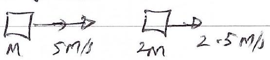
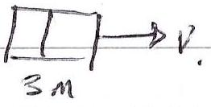
Momentum Conservation:
$$
5 \times m + 2.5 \times 2 m = 10 m = 3 m V
$$
final speed, $V = \frac { 10 } { 3 } = 3.3 \mathrm { M } / \mathrm { s }$
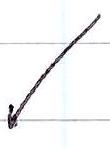
$$
\begin{aligned}
\mid \text { mitrial KE } & = \frac { 1 } { 2 } , m - 5 ^ { 2 } + 2,2 m - 2 \cdot 5 ^ { 2 } \\
& = \left( \frac { 25 } { 2 } + \frac { 25 } { 4 } \right) m = \frac { 75 } { 4 } m
\end{aligned}
$$
Loss of HE. $= \frac { 75 } { 4 } m - \frac { 50 } { 3 } M = \frac { 25 } { 12 } M$
$$
\text { Percentage Coss } = \frac { 25 \mathrm {~m} } { 12 } / \frac { 75 \mathrm {~m} } { 4 } = \frac { 1 } { 9 } = 11 \%
$$
(b) Drumsber
$$
\begin{aligned}
& { [ \rho ] = 0 \text { or nowits, pirt a number, dinerariadues. } } \\
& { [ f ] = \frac { [ k ] [ v ] } { \left[ a ^ { 2 } \right] } \quad T ^ { - 1 } = \frac { L \cdot L } { \left[ a ^ { 2 } \right] } T ^ { - 1 } } \\
& { [ a ] = L = \text { Mothes } }
\end{aligned}
$$
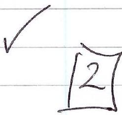

(c) Ball thrown upwards
(i)
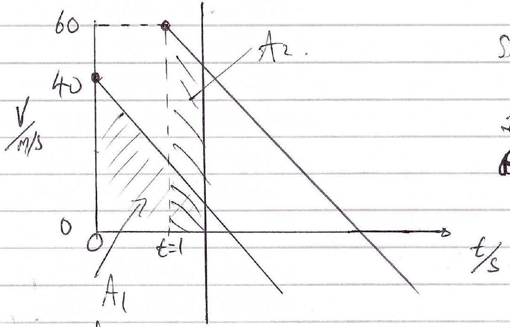
Semple sheetch parallel slopes. Isement prest. Eo helow Lorgontal (anus)
(ii) They neet when $A _ { 1 } = A _ { 2 }$. 7 equad carea
$A _ { 2 }$ is $\quad S _ { 60 } = 60 ( t - 1 ) - 1 _ { 2 } 10 ( t - 1 ) ^ { 2 }$ at/ equative Wen, $S _ { 40 } = S _ { 60 }$ then $40 t - 5 t ^ { 2 } = 60 t - 60 - 5 \left( t ^ { 2 } + 1 - 2 t \right)$
Suo is Lonomball
860 a $60 \mathrm {~m} / \mathrm { s }$ Lall.
$$
\begin{aligned}
& 0 = 20 t - 60 - 5 + 10 t \\
& t = \frac { 65 } { 30 } = \frac { 13 } { 6 } s = 2.17 s
\end{aligned}
$$
If $g$ used, then $t = \frac { 60 + g } { 20 + g } = 2.34 \mathrm {~s}$
$$
\left\{ \begin{array} { l }
\text { any to } ( 2 s f ) \\
{ \left[ \frac { 13 } { 6 } s , 2 \cdot 2 s , 2 \cdot 3 \right] }
\end{array} \right.
$$
$$
\begin{aligned}
S _ { 40 } & = 40 \cdot \frac { 13 } { 6 } - \frac { 9 } { 2 } \cdot \frac { 169 } { 36 } \\
& = \frac { 13 } { 6 } \left( 40 - \frac { 5 \times 18 } { 6 } \right) = 63 \cdot 2 \mathrm {~m}
\end{aligned}
$$
$H _ { c } g = 9 \cdot x$ used,
$$
S _ { 40 } = 66.8 \mathrm {~m} 2.8 \mathrm { f }
$$
(iii) $t = 4$ seconds, $s = 80 \mathrm {~m}$
fine for $S _ { 6 }$ to mail 80 m :
$$
\begin{aligned}
V ^ { 2 } & = u ^ { 2 } - 2 g L \\
& = 60 ^ { 2 } - 2 \pi \times 1000 \\
& = 2000 \mathrm {~m} ^ { 2 } \\
v & = 20 \sqrt { 5 } \mathrm {~m} / \mathrm { s }
\end{aligned}
$$
$$
\begin{aligned}
& t = \frac { u - v } { 9 } = \frac { 60 - 20 \sqrt { 3 } } { 10 } = 6 - 2 \sqrt { 5 } \\
& \Delta t = t - ( 6 - 2 \sqrt { 5 } ) \\
& = 2.473 = \frac { \text { either } } { ( 25 t ) }
\end{aligned}
$$
2.5 s
(t $g = 9.81$ leved, $\Delta t = \frac { 20 } { g } ( \sqrt { 5 } - 1 ) = 2.528$
$$
\text { (2Sf). } 15
$$

(d) Railwoy Contrape with highed.
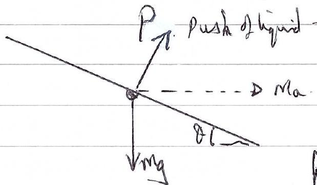
Resolve V: $P \cos \theta = \cdots m _ { y }$ $H : P \sin \theta = m a$
$$
\tan \delta = \frac { a } { y } = \frac { 0.84 } { 9.81 } .
$$
$$
8 = 4.9 ^ { \circ } \neq 5 ^ { \circ }
$$
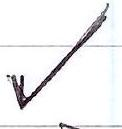
(e) Averphoses.
3
(i) Subtract $\vec { v } _ { B }$ from $\vec { v } _ { A }$ \& $\quad \vec { v } _ { A } ^ { \prime } = ( 50 + 90 ) \hat { i } + ( - 125 - 60 ) \hat { j }$
$$
v _ { A } ^ { \prime } = 140 \hat { \imath } - 185 \hat { \jmath }
$$
(ii) At $t = 0$, point in of $A$ with $\bar { B }$ at the origin is $- 400 \hat { i } + 1200 \hat { j }$
$\left( r _ { A } ^ { \prime } \text { is is merfume \& } B \right) _ { 1 } ^ { \prime } - ( 800 \hat { \imath } - 600 \hat { \jmath } )$
$$
F _ { A } = - 1200 i + 1800 \hat { \jmath } \text { with Bat } ( 0,0 )
$$

As tunereares, $r _ { A } ^ { \prime } ( t ) = - 1200 i + 140 \hat { i } t + 1800 \hat { j } - 185 \hat { j } t$
$$
= ( - 1200 + 1400 t ) \hat { \imath } + ( 1800 - 185 t ) \hat { \jmath }
$$
Distance formarigin $D = \sqrt { x ^ { 2 } + y ^ { 2 } }$ to,
$$
\Delta ^ { 2 } = ( - 1200 + 140 t ) ^ { 2 } + ( 1800 - 185 t ) ^ { 2 }
$$
to find Minimin $\frac { d t ^ { 2 } } { d t } = 2 ( - 1200 + 140 t ) 140 + 2 ( 1800 - 185 t ) ( - 185 )$ of $D \left( \right.$ or $\left. \Delta ^ { 2 } \right)$
$$
\begin{aligned}
& 0 = - 1200 \times 140 + 140 ^ { 2 } t - 1800 \times 185 + 185 ^ { 2 } t \\
& t = 9.3 ( i ) \mathrm { s }
\end{aligned}
$$
So $D ^ { 2 } = ( - 1200 + 114089.31 ) ^ { 2 } + ( 1800 - 185 \times 9.31 ) ^ { 2 }$.
$$
D = 129 \mathrm {~m} = 130 \mathrm {~m} ( 25 \mathrm { f } )
$$

(f) Water flow
$$
\begin{aligned}
& \text { energy form symthy = them areargainethers are } \\
& \frac { 230 ^ { 2 } } { \frac { R } { R } } \Delta t = M C \Delta \\
& \frac { 230 ^ { 2 } } { R } = \frac { M } { \Delta t } \cdot c \cdot \Delta \delta \\
& \frac { 230 ^ { 2 } } { R } = \rho \frac { \Delta V _ { 0 } l } { \Delta t } \cdot c \Delta i \\
& \frac { R } { R } = 1000 \times \left( \frac { 10 ^ { - 3 } } { 60 } \right) \times 4180 \times 60 \\
& R = \frac { 230 ^ { 2 } } { 4.180 } = \frac { 12.7 \Omega } { 13 \Omega } = 28 \mathrm { f }
\end{aligned}
$$
(y) Drysteam
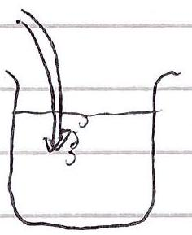
$$
\begin{aligned}
& \text { trandentionsto- } \\
& m _ { s } L + ( 100 - 30 ) C _ { w } \cdot M _ { s } = M _ { w } \cdot C _ { w } \cdot ( 30 - 0 )
\end{aligned}
$$
✓ equation
$$
\begin{aligned}
m _ { S } \left( L + 70 c _ { w } \right) & = m _ { w } \cdot c _ { w } \cdot 30 \\
L & = \frac { m _ { w } } { m _ { s } } \cdot 30 \cdot c _ { w } - 70 \mathrm { cw } \\
& = \left( \frac { m _ { w } } { m _ { s } } \cdot 30 - 70 \right) c _ { w } \\
& = \left( \frac { 250 + 10 ^ { \circ } } { 12 \cdot 8 } \times 30 - 70 \right) 4180 \\
& = 2 \cdot 25 \frac { \mathrm {~mJ} } { \mathrm {~kg} } 2.34
\end{aligned}
$$
4
(h) Exponsion
$$
\begin{aligned}
& \left( l _ { F _ { e } } - l _ { O _ { F _ { 2 } } } \right) = l _ { D _ { F _ { 2 } } } X _ { F _ { 2 } } \Delta T \\
& \left( l _ { c u } - l _ { o a } \right) = l _ { o } a x _ { a } \Delta T
\end{aligned}
$$
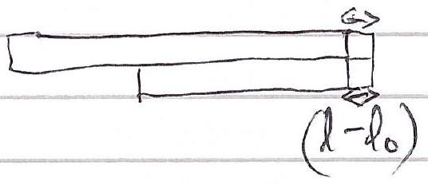
expansions the same, for $\Delta T$.
$$
\begin{aligned}
S _ { 0 } & l _ { 0 } F _ { e } , \alpha _ { F e } = l _ { 0 } \mathrm {~cm} \alpha _ { c u } \\
& l _ { 0 a v } = \frac { \alpha _ { F e } } { \alpha _ { c u } } \\
= & \frac { 11 \cdot 9 } { 17 } = 0.70 \mathrm {~m} = 70 \mathrm {~cm}
\end{aligned}
$$

(i) Aery lose
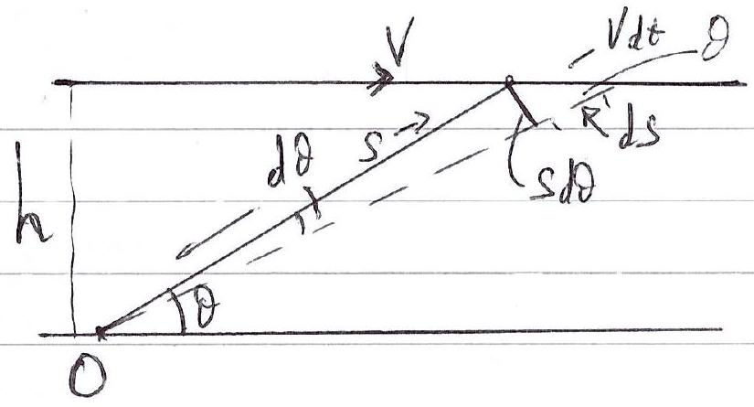

(i) distance formolese toplese, $S = \frac { h } { \operatorname { sen } 60 ^ { \circ } } = 3464 = \underline { \underline { 3500 } }$
(ii) Jorn duagram
$$
\begin{aligned}
\frac { s d d } { v d t } = \sin \theta \Rightarrow \frac { d \theta } { d t } & = \frac { v } { s } \sin \theta \\
& = \frac { v h } { s ^ { 2 } } \\
v & = \frac { s ^ { 2 } } { h } \frac { d \theta } { d t } \\
& = \frac { ( 3464 ) ^ { 2 } } { 3000 } \times 0.09 \\
v & = 360 \mathrm {~m} / \mathrm { s }
\end{aligned}
$$
promentere our qual to $\frac { d d } { d t }$.
(iii) $\frac { d s } { v d t } = \cos \theta \Rightarrow \frac { d s } { d t } = v \cdot \cos 60 = \frac { v } { 2 } = 180 \mathrm {~m} / \mathrm { s }$
(j) Wedge
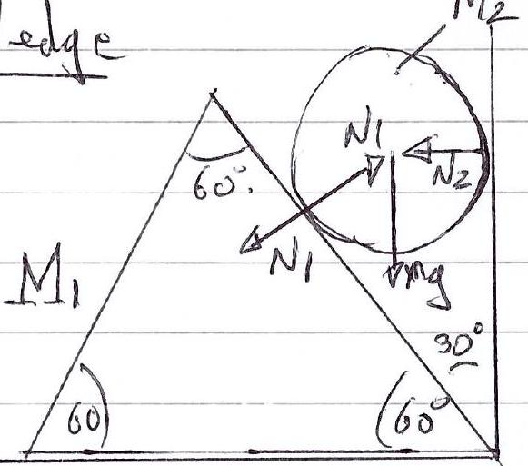
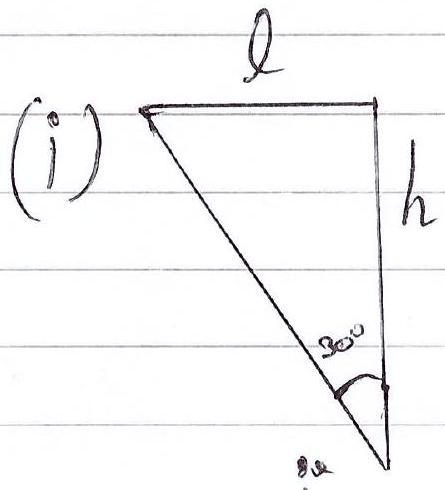
$$
\begin{aligned}
& \tan 30 ^ { \circ } = \frac { 1 } { \sqrt { 3 } } = \frac { l } { h } \\
& h = \sqrt { 3 ^ { 2 } } l \quad \checkmark
\end{aligned}
$$
    (ii) On wedge
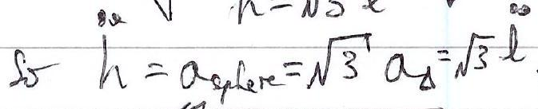
resolve it: $\quad N _ { 1 } \cos 30 = m _ { 1 } a _ { \Delta }$
Onsplee: $f \quad m _ { 2 } - N _ { 1 } \sin 30 ^ { \circ } = M _ { 2 }$ aglere
Hence $m _ { 2 } g ^ { \circ } - M _ { 1 } \frac { a _ { \text {spilere } } } { \sqrt { 3 } } \cdot \frac { \sin 30 ^ { \circ } } { \cos 30 ^ { \circ } } = M _ { 2 } \cdot a _ { \text {grame } }$
$$
\begin{gathered}
m _ { 2 } g - m _ { 1 } \frac { a _ { \text {sqlum } } } { 3 } = m _ { 2 } a _ { \text {sqles } } \\
3 m _ { 2 } g = \frac { \left( m _ { 1 } + 3 m _ { 2 } \right) a \text { spler } } { \left( m _ { 1 } + 3 m _ { 2 } \right) }
\end{gathered}
$$

(k) Pershelum bols
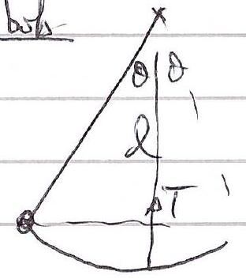
$T$ is durito the weight it provides the centripetal force required.

$$
T = m g + \frac { m v ^ { 2 } } { l }
$$

Energy

$$
\begin{aligned}
& m g ( l - l \cos \theta ) = \frac { 1 } { 2 } m v ^ { 2 } \\
& 2 g l ( 1 - \cos \theta ) = v ^ { 2 }
\end{aligned}
$$

ine $n m y = m g + 2 m g - 2 m g \cos \theta )$
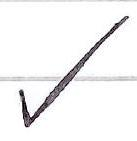

$$
\begin{aligned}
& n = 3 - 2 \cos \theta \\
& \cos \theta = \frac { 1 } { 2 } ( 3 - n )
\end{aligned}
$$

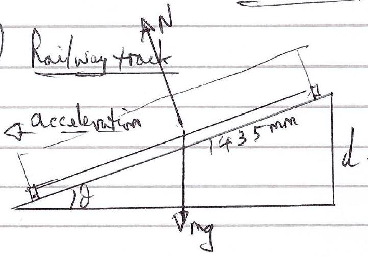
requie no operitial compount durganis or foudoration.
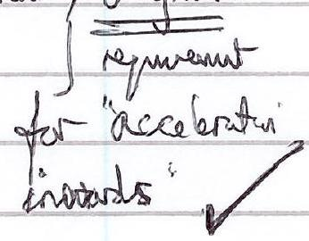
resolve $H : N \sin \theta = \frac { m v ^ { 2 } } { \Gamma }$

$$
\begin{aligned}
\sqrt { N \cos \theta } & = m g \\
\tan \theta & = \frac { v ^ { - 2 } } { \sqrt { g } } \quad \checkmark \\
& = \left( \frac { 200 \times 10 ^ { 3 } } { 3.6 \times 13 ^ { 3 } } \right) ^ { 2 } / 15009 \\
& = 0.2097 \\
\theta & = 11.85 ^ { \circ } \\
d & = 1435 \times \sin \theta \\
& = 295 \mathrm {~mm}
\end{aligned}
$$

$$
5
$$

(M) Prisin
$$
\begin{aligned}
& \lambda _ { 1 } \sin \partial _ { 1 } = n _ { 2 } \sin \partial _ { 2 } \\
& 1 \cdot 5 \sin \theta _ { c } = 1 \sin \theta _ { 0 } \\
& \sin \partial _ { c } = \frac { 2 } { 3 } \rightarrow \partial _ { c } = 41 \cdot 8 ^ { \circ }
\end{aligned}
$$
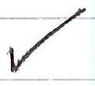
$$
180 - [ ( 90 - 41 \cdot 8 ) + 455 ] = 2 \mu _ { 0 } ^ { \partial _ { i } }
$$
correct. chagram.
$$
\text { fo } \quad \begin{aligned}
180 - [ ( 90 - 41 \cdot 8 ) + 45 ] & = 90 - d r \\
\theta _ { r } & = 3 \cdot 2 ^ { \circ } \\
\sin d _ { i } & = 1 \cdot 5 \sin d _ { r } \\
\theta _ { i } & = 4 \cdot 8 ^ { \circ }
\end{aligned}
$$
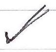
3
(D) Aldminuin block.
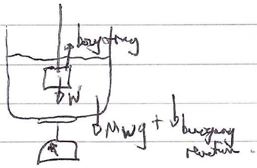
Wrights of bock. Mal. $g = A _ { A } \cdot V \cdot g$ exphrout is $\left( P _ { w } V \right) _ { g }$
$$
S _ { 0 , } P A = 2.69 g _ { \text {in } } 3
$$
Reading on the newton-nater is $\left( A _ { A } - p _ { w } \right) V _ { k } y$
$$
\begin{aligned}
& = \rho _ { A } \cdot V \cdot g \left( 1 - \rho _ { w } \right) \\
& = 6 \cdot 6 \left( 1 - \frac { \rho _ { w } } { \rho _ { A } } \right) \\
& = 4 \cdot 15 \mathrm {~N}
\end{aligned}
$$
Balance reads $600 \mathrm {~g} + \mathrm { p }$ will
$$
\begin{aligned}
& = 600 + 1 \cdot 0 * 250 \\
& = 850 \mathrm {~g}
\end{aligned}
$$

(0) Iteel bor.
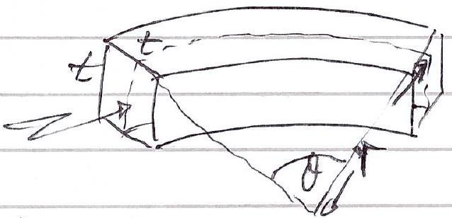
The steel bar is elastiond composers ar earily wi is skeetches, ble apping.
But it will breats under tension.
If it is shyfth streeted ad inglity corpourd of beingleat, there will be a neertial hie close to the ceitreline, if the lending small.
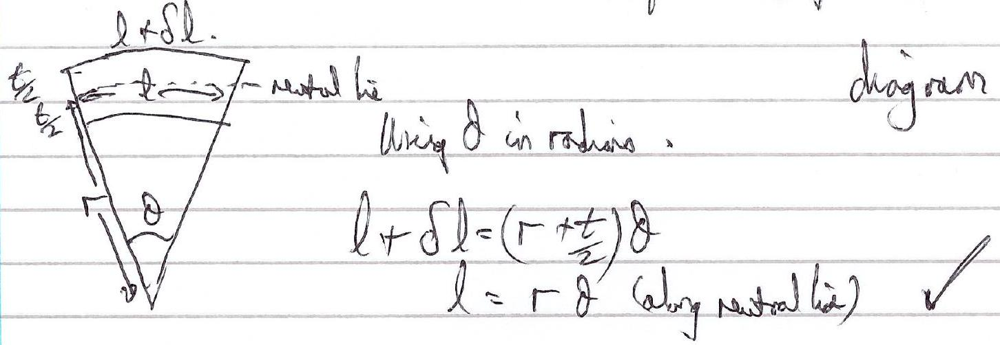
$$
\text { fo } \delta l = \frac { t } { 2 } \theta
$$
and hence $\frac { d l } { l } = \frac { t } { 2 } \frac { \partial } { r \theta } = \frac { t } { 2 r }$
$$
\begin{aligned}
& y = \frac { \text { stren } } { \text { strain } } = \frac { \sigma } { d l } = \frac { \sigma l } { d l } \\
& y = 210 \times 10 ^ { 9 } P _ { a } \quad y = \frac { \sigma 2 r } { t } \\
& \begin{aligned}
\sigma _ { \text {breaty } } & = 840 \times 10 ^ { 6 } P a \\
\& \quad 210 \times 10 ^ { 9 } & = 840 \times 10 ^ { 6 } \times \frac { 2 \times r } { 0.02 } \\
r & = \frac { 210 } { 840 } \times \frac { 10 ^ { 9 } } { 0 ^ { 6 } } \times \frac { 0.02 } { 2 } \\
r & = 2.5 \mathrm {~m}
\end{aligned}
\end{aligned}
$$
$$
4
$$

(D) photolectric effect
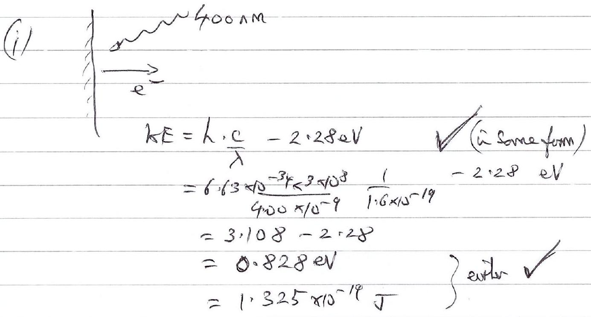

$$
\begin{aligned}
\text { Aos } v & = \sqrt { \frac { 2 \times K E } { m } } \\
& = \sqrt { \frac { 2 \times 1.325 \times 10 ^ { - 19 } } { 9.11 \times 10 ^ { - 31 } } } \\
& = 5.39 \times 10 ^ { 5 } \mathrm { MP } \\
\text { So } t = \frac { l } { v } & = 1.85 \times 10 ^ { - 7 } \mathrm {~s}
\end{aligned}
$$

In a weiprom $E$ field, the fore and aubaction are contait
So average speed of $5.39 \times 10 ^ { 5 }$ and $3.39 \times 10 ^ { 5 } \mathrm {~m} / \mathrm { s }$ is $4.39 \times 10 ^ { 5 } \mathrm {~m} / \mathrm { s }$
Here $\Delta t = \frac { 0.1 } { 4.39 \times 10 ^ { 5 } } = 2.28 \times 10 ^ { - 7 } \mathrm {~s}$

Balanced cercuit:
(q) If we adjust $R$, we can balonce the potentials aceaso $10 \Omega$ du that they we equal
To obtain zer potential across ver resuster otheralwa idea.

$$
\begin{aligned}
\frac { ( 4 + 2 ) } { ( R / / 20 ) } = \frac { 8 } { 24 } & \\
\frac { 6 } { \frac { R \cdot 20 } { R + 20 } } = \frac { 1 } { 3 } \rightarrow 3 \cdot 6 & = \frac { 20 \cdot R } { R + 20 } \\
18 ( R + 20 ) & = 20 R \\
18 R + 360 & = 20 R \\
R & = 180 \Omega
\end{aligned}
$$

(T) Charge on a capacitor

Caparatoria prantel. $2 + 4 = 6$ uF
then in serier

$$
\begin{aligned}
& \frac { 1 } { C _ { e _ { \text {p } } } } = \frac { 1 } { 6 } + \frac { 1 } { 5 } \\
& C _ { \text {eqk } } = \frac { 30 } { 11 } \mu F
\end{aligned}
$$

$$
\begin{aligned}
Q \text { whilf floss } & = V C \text { qu } \\
& = 9 \times \frac { 30 } { \pi } = \frac { 270 } { 11 } \mu C
\end{aligned}
$$

and the stare on $C _ { 4 }$ is $\frac { 2 } { 3 } \times \frac { 270 } { \pi } = \frac { 180 } { \pi } = 16.4 \mu \mathrm { C }$

(s) Parallel please capairor
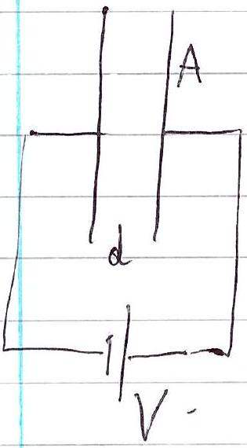

$$
\begin{aligned}
& E _ { 1 } = \frac { 1 } { 2 } C V ^ { 2 } , \text { but } C \text { change, } 4 \\
& E _ { 1 } = \frac { \varepsilon _ { 0 } A V ^ { 2 } } { 2 d } \\
& V \text { is contait, } d \rightarrow \frac { d } { 3 } \\
& \text { So } E _ { 2 } = 3 E _ { 1 } .
\end{aligned}
$$

Then $F _ { 2 } = \frac { Q ^ { 2 } } { 2 C } = \frac { Q ^ { 2 } } { 2 E _ { 0 } } \cdot d _ { 2 } \quad$ interm $y Q ^ { 2 }$
$Q$ is fined aroth battery is ducomeated

$$
\left. \begin{array} { r l }
d _ { 2 } & \rightarrow 3 d _ { 2 } \\
E _ { 3 } & = 3 E _ { 2 } = 9 E _ { 1 } \\
\text { Lo, } E _ { 3 } - E _ { 1 } & = 8 E _ { 1 } \\
& = 4 \varepsilon _ { 0 } A V ^ { 2 }
\end{array} \right\} \text { uritar }
$$

4
(t) Ralioative decay

$$
{ } _ { 84 } ^ { 210 } p _ { 0 } \rightarrow { } _ { 82 } ^ { 206 } x + \frac { 4 } { 2 } \alpha .
$$

number remaining ofter loodeys is

$$
\begin{aligned}
N & = N _ { 0 } e ^ { - \lambda t } \\
& = N _ { 0 } e ^ { - \frac { 100 \times 0.093 } { 138 } } \\
& = N _ { 0 } \times 0.587
\end{aligned}
$$

number if $P _ { 0 }$ lost is $N _ { 0 } - N$

$$
\begin{aligned}
& = N _ { 0 } ( 1 - 0.587 ) \\
& = N _ { 0 } 0.413
\end{aligned}
$$

This is the number of $\alpha$ produced.
No of moles at start is $\frac { 5 \times 10 ^ { - 3 } \mathrm {~g} } { 210 } \mathrm {~g} = 2.38 \times 10 ^ { - 5 }$
Hence Marse of alpha produced $= 0.413 \times 2.38 \times 10 ^ { - 5 } \times 49$

$$
\begin{aligned}
& \text { Trantion } \\
= & 3.9 \times 10 ^ { - 5 }
\end{aligned}
$$

mass a mode
which is the mass has of polonium

(u) Beats
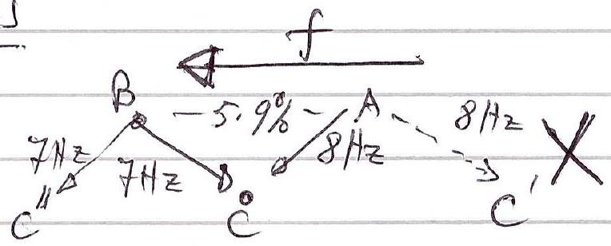
If $C$ 's belos $A$, then $B$ would need to be telts $A$, while is not correct.
If $C ^ { \prime \prime }$ is above $B$. then $B A$ is $( 8 - 7 ) H z = 1 H _ { 2 }$ But if ABis 1 Hz and $5.9 \%$ different, then Airlity whil is below a
$$
\begin{gathered}
{ \left[ \begin{array} { l }
f _ { B } = f _ { A } ( 1 + 0.059 ) \text { and } f _ { B } - f _ { A } = 1 H _ { 2 } \\
\rightarrow 1 + f _ { A } = f _ { A } + 0.059 f _ { A } \\
f _ { A } = \frac { 1 } { 0.059 } = 171 \mathrm {~Hz}
\end{array} \right] . }
\end{gathered}
$$
Lo ader is $B C A$
19-12 000 $5.7 \%$
fo
$$
\left. \begin{array} { c }
A \text { is } 254.2 \mathrm {~Hz} \\
B \text { is } 269.2 \mathrm {~Hz} \\
C \text { is } 262.2 \mathrm { Az }
\end{array} \right\}
$$
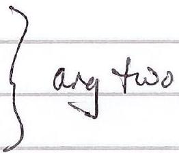
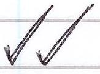
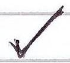
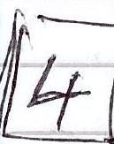

(v) Resistance of a filoment Gyth bulb
give $R = A + B P$.
and $P = \frac { V ^ { 2 } } { R }$ w $R = \frac { V ^ { 2 } } { P } = \frac { 230 ^ { 2 } } { 100 } = 23 ^ { 2 } \Omega$.
Then $23 ^ { 2 } = A + B .100$ (1)
Also, fiver $\frac { 23 ^ { 2 } } { 5 } = A + B = 500$ (2)
Subtrating $23 ^ { 2 } \left( 1 - \frac { i } { 5 } \right) = B \cdot 100 ( 1 - 5 )$ ✓
Then $\quad A = \frac { 6 } { 5 } \times 23 ^ { 2 } = 634.8 \Omega$.

From $R = A + B P$ we can substitute for $R$ will $\frac { V ^ { 2 } } { P }$
Then $\frac { V ^ { 2 } } { P } = A + B P \rightarrow V ^ { 2 } = A P + B P ^ { 2 } \quad$ quadrati

$$
\text { or } B P ^ { 2 } + A P - V ^ { 2 } = 0
$$

solving, $P = \frac { - A \pm \sqrt { A ^ { 2 } + 4 B V ^ { 2 } } } { 2 B }$
Substituting volves, $V = 210 V , A , B$.
then $P = 80 \mathrm {~W}$

## Section 2

Q2
(a) (i)
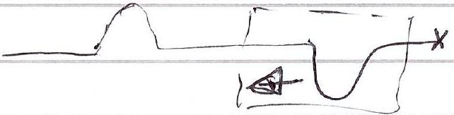
(ii)
$t = \frac { 2 l } { v }$
(iii)
$f _ { 1 } = \frac { V } { 2 l }$
(iv)
$f _ { a } = \frac { n v } { 2 l }$
(v)
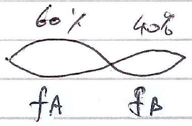

$$
\begin{array} { r l r l }
f _ { A } & = \frac { V } { 2 \times 0.1 l } & f _ { B } & = \frac { V } { 2 \times 0.4 l } \\
& = \frac { V } { 1.2 l } & & = \frac { V } { 0.8 l } \\
& = \frac { 2 f _ { 1 } } { 1.2 } = 1.7 f _ { 1 } & = \frac { 2 f _ { 1 } } { 0.8 } & = 2.5 f _ { 1 } \\
& & = \frac { 5 } { 2 } f _ { 1 }
\end{array}
$$

one OR bort
correct
(vi)

$$
\begin{aligned}
& T = \mu V ^ { 2 } = \mu f ^ { 2 } \lambda ^ { 2 } = \mu f ^ { 2 } \left( \frac { 2 l } { 5 } \right) ^ { 2 } = \mu f ^ { 2 } \frac { 4 } { 25 } l ^ { 2 } \\
& = \frac { 42 \times 10 ^ { - 3 } } { 25 } \times 162 ^ { 2 } \times \frac { 4 } { 25 } \times ( 2.3 ) ^ { 2 } = 405.6 \mathrm {~N} \\
& = l = 5 \times \lambda \Rightarrow \lambda = 2 l
\end{aligned}
$$

fifthamonic: $l = 5 \times \frac { \lambda } { 2 } \Rightarrow \lambda = \frac { 2 } { 5 } l$
16

$$
\text { (b)(i) } x [ ] - \frac { 1 } { L } \quad T = ( L - x ) \frac { M } { L } \cdot g
$$

(ii)

$$
\begin{aligned}
T _ { b } & = \left( L - \frac { 3 } { 4 } L \right) \frac { M } { 2 } \cdot g \\
T _ { b } & = \frac { M } { 4 } g \\
v _ { b } & = \sqrt { \frac { M g } { p \cdot } } \frac { 1 } { 2 } \cdot \\
T _ { t } & = \left( L - \frac { 1 } { 4 } L \right) \frac { M } { 2 } g \\
& = \frac { 3 } { 4 } g \\
v _ { t } & = \sqrt { \frac { M g } { R } } \cdot \frac { \sqrt { 3 } } { 2 } \\
\frac { v _ { t } } { v _ { b } } & = \sqrt { 3 } \quad \text { or } \frac { v _ { B } } { v _ { t } } = \frac { 1 } { \sqrt { 3 } }
\end{aligned}
$$

ether correct
(iii)

$$
\begin{aligned}
v & = \sqrt { \frac { ( L - x ) \frac { M } { L } \cdot g } { \mu } } \\
& = \sqrt { ( L - x ) g }
\end{aligned}
$$

(iv)

$$
t _ { \text {top } } = \int _ { 0 } ^ { x } \frac { d x } { v } = \frac { 1 } { \sqrt { g } } \int _ { 0 } ^ { x } \frac { d x } { \sqrt { 1 - x } }
$$

and integrating,

$$
t _ { \text {top } } = 2 \sqrt { \frac { L } { g } } \left( 1 - \sqrt { 1 - \frac { x } { L } } \right)
$$

(v) falting hell: $s = \frac { 1 } { 2 } g t ^ { 2 } w , \quad t = \sqrt { \frac { 2 h } { g } }$
In our case, we require $\sqrt { \frac { 2 x } { y } } = 2 \sqrt { \frac { L } { y } } \left( 1 - \sqrt { 1 - \frac { x } { z } } \right)$
So, $\frac { 2 x } { y } = \frac { L L } { g } \left( 1 - \sqrt { 1 - \frac { \lambda } { L } } \right) ^ { 2 } \rightarrow \frac { x } { 2 L } = 1 + 1 - \frac { x } { L } - 2 \sqrt { 1 - \frac { x } { L } }$
Rearneying, squaring, ste. $\quad x = \frac { 8 } { 9 } L$
Rearneyny, squaring, ste. $\quad x = \frac { 8 } { 9 } L$
18

(c) pubectineing time time $t _ { 1 }$, $t _ { 2 }$ are the absoluce time
$$
T _ { W } \quad t _ { 1 } \times \quad t _ { 2 } \quad T _ { E }
$$
$c t _ { 1 } + c t _ { 2 } = 6 \times 10 ^ { 5 } \mathrm {~m}$
and $\quad t _ { 2 } - t _ { 1 } = \Delta t = \left( 1.542 \times 10 ^ { - 3 } s - 0.484 .700 ^ { - 3 } s \right)$ and aring $c = 3 \times 10 ^ { 8 } \mathrm {~m} / \mathrm { s }$
$$
= 1.058 \times 10 ^ { - 3 } \mathrm {~s}
$$
$t _ { 2 } + t _ { 1 } = 2 \times 10 ^ { - 3 } \mathrm {~s}$
L
$$
\begin{aligned}
2 t _ { 1 } & = 2 \times 10 ^ { - 3 } - 1.058 \\
t _ { 1 } & = 0.471 \times 10 ^ { - 3 } \mathrm {~s} \\
c t _ { 1 } & = 141.3 \mathrm {~km} \\
& = 140 \mathrm {~km}
\end{aligned}
$$
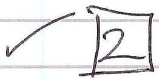
(d) ... pressere amplifude

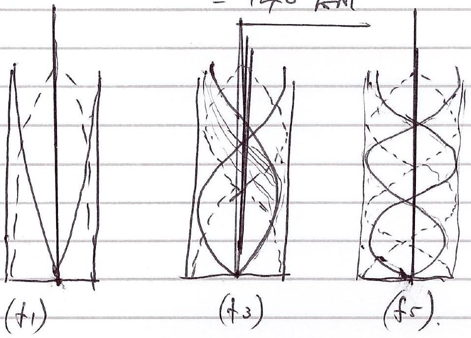
applitules ✓
mercure $\checkmark$

2

(e) (i)
$$
\begin{aligned}
\Delta P & = \rho g \Delta h . \\
& = 1.225 \times 9.81 \times 20 \\
& = 240 \mathrm {~Pa} \\
\Delta P & = 0.24 \%
\end{aligned}
$$
(ii) Paf so the ratio is construct.
(no other nelerat factor).
(iii)
$$
\begin{array} { l l }
v = \sqrt { \frac { K P } { P } } & \text { add } P V = n R T \\
& \text { also } M _ { \mu } = \frac { [ \log ] } { [ m ] } = \frac { M } { n } = \rho \frac { V } { n } \Rightarrow \frac { n } { V } = \frac { f } { F _ { \mu } }
\end{array}
$$
Hence $v = \sqrt { \frac { \gamma \cdot R T } { M _ { \mu } } }$
$V \alpha \sqrt { T } V _ { \sigma }$ phising mart

$C \equiv$ cold $H \equiv$ hot.
(iv)

$$
\begin{align*}
& l _ { 1 } + \varepsilon = \frac { \lambda _ { 1 } } { 4 } \rightarrow l _ { 1 } + \varepsilon = \frac { V _ { 0 } } { 4 \frac { f _ { c } } { 4 } }  \tag{1}\\
& l _ { 2 } + \varepsilon = \frac { \lambda _ { 2 } } { 4 } \rightarrow l _ { 2 } + \varepsilon = \frac { V _ { H } } { 4 f _ { H } } \tag{2}
\end{align*}
$$

and uning $v \propto \sqrt { T }$
Hence

$$
\begin{aligned}
\frac { l _ { 1 } + \varepsilon } { l _ { 2 } + \varepsilon } & = \frac { \sqrt { T _ { c } } f _ { H } } { \sqrt { T _ { H } } f _ { c } } \\
& = \sqrt { \frac { 293 } { 303 } } \frac { f _ { H } } { f _ { c } } .
\end{aligned}
$$

Now, Using $0 : 52 + \varepsilon = \frac { 343 } { 4 \cdot f _ { c } } = \frac { 343 } { 4 \times 156 }$
given $\varepsilon = 3.0 \mathrm {~cm} ( 2.97 \mathrm {~cm} )$.
Now uning (1) and (2)

$$
\begin{aligned}
\frac { 0.52 + 0.03 } { l _ { 2 } + 0.03 } & = \sqrt { \frac { 293 } { 308 } } \times \frac { 151.2 } { 156 } \\
\text { do that } l _ { 2 } & = 0.49 \mathrm {~m} \\
& = 49 \mathrm {~cm}
\end{aligned}
$$

[O re Mart for 52.3cm]
If the beent triverang inved to giote $160 \cdot 8$ Az integ chance take $l _ { 2 } = 52.3 \mathrm {~cm}$, which is loyer. The samperature difference meas that you have a lower frequng in a skotes tabe.

Question 3 Ebattrial Circuits

(a) 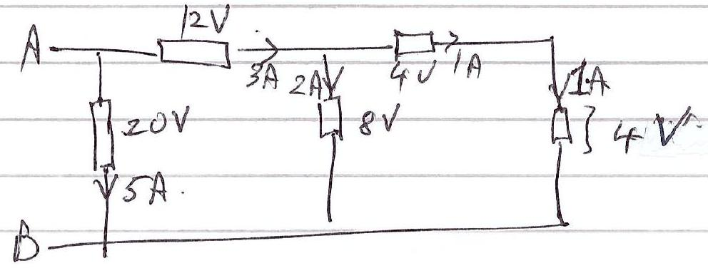
$$
\begin{aligned}
& I _ { A B } = 8 A . \\
& V _ { A B } = 20 \mathrm {~V} \\
& R _ { A B } = 2.5 \Omega .
\end{aligned}
$$
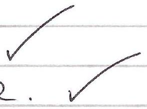
2
(b) 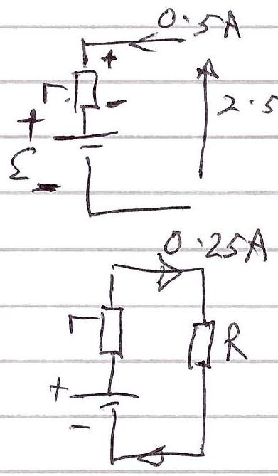
$$
\begin{aligned}
& \varepsilon / 0.25 = r + 7 \cdot 6 \\
& \varepsilon = \frac { r } { 4 } + 1.9
\end{aligned}
$$
$$
\begin{gathered}
2.5 - 0.5 r = 0.25 r + 1.9 \\
0.6 = 0.75 r \\
r = 0.8 \Omega
\end{gathered}
$$
(c) (i)
$$
\frac { 1 } { R _ { e q } } = \frac { 1 } { R _ { A } } + \frac { 1 } { R _ { B } } \Rightarrow R _ { \text {equ } } = \frac { R _ { A } R _ { B } } { R _ { A - 1 } R _ { B } }
$$
No mark/We need tirsreett
(ii) i. prestion throug $R _ { B }$ is $\stackrel { ( I ) R _ { A } \sim } { N _ { B } } \stackrel { \text { ✓ } } { R _ { A } + R _ { B } }$
$$
i i _ { 0 } I _ { B } = \frac { \varepsilon } { R + \frac { R _ { A } R _ { B } } { R _ { A } + R _ { B } } } \times \frac { R _ { A } } { R _ { A } + R _ { B } } = \frac { \varepsilon R _ { A } } { R R _ { A } + R _ { A } R _ { B } + R R _ { B } }
$$

（iii）

$$
\begin{equation*}
I _ { 1 } = \frac { \varepsilon _ { 1 } } { R } \quad I _ { 2 } = \frac { \varepsilon _ { 2 } } { R } \tag{11}
\end{equation*}
$$

（iv）

$$
\begin{aligned}
I _ { 3 } ^ { \prime } & = \frac { \varepsilon _ { 1 } } { R _ { \text {equ } } } \times \text { pusing (current throgl } R _ { 3 } \\
& = \frac { \varepsilon _ { 1 } } { R _ { 1 } + R _ { 2 } R _ { 3 } } \times \frac { R _ { 2 } } { R _ { 2 } + R _ { 3 } } \times R _ { 3 } \\
& = \frac { \varepsilon _ { 1 } R _ { 2 } } { R _ { 1 } R _ { 2 } + R _ { 1 } R _ { 3 } + R _ { 2 } R _ { 3 } } N \cdot B \cdot \varepsilon _ { 1 } R _ { 2 }
\end{aligned}
$$

（v）Similarly $I _ { 3 } ^ { \prime \prime } = \frac { \varepsilon _ { 2 } R _ { 1 } } { R _ { 1 } R _ { 2 } + R _ { 1 } R _ { 3 } + R _ { 2 } R _ { 3 } }$
（vi）Liverity means $I _ { 3 } = I _ { 3 } ^ { \prime } + I _ { 3 } ^ { \prime \prime }$
（vii）

$$
= \frac { \varepsilon _ { 1 } R _ { 2 } + \varepsilon _ { 2 } R _ { 1 } } { R _ { 1 } R _ { 2 } + R _ { 1 } R _ { 3 } + R _ { 2 } R _ { 3 } }
$$

的 $\frac { 1 } { 1 }$ 至 $\frac { \text { RT } } { 2 }$ 作．

$$
I _ { 3 } = \frac { \frac { \varepsilon _ { 1 } } { R _ { 1 } } + \frac { \varepsilon _ { 2 } } { R _ { 2 } } } { 1 + \frac { R _ { 3 } } { R _ { 2 } } + \frac { R _ { 3 } } { R _ { 1 } } }
$$

（multyly minzaror by $R _ { 3 } \equiv$

Unistating this doesnot $\xrightarrow { }$ As $R _ { 3 } \rightarrow \infty$ ，the pair fic alls are got the mark．begine commed to an year cercuit（rocenver in tilvad revistor）
（ $I _ { 3 } A _ { 3 }$ ）draw it out that is the corf

and，as $R _ { 3 } \rightarrow 0$（ashort circuit）

$$
I _ { 3 } \rightarrow \frac { \varepsilon _ { 1 } } { R _ { 1 } } + \frac { \varepsilon _ { 2 } } { R _ { 2 } }
$$

and the cenvert in acivist wich internal reistake，$I _ { 3 } = \frac { \varepsilon } { R + r }$

$$
\text { So } \begin{aligned}
\frac { 1 } { r } & = \frac { 1 } { R _ { 1 } } + \frac { 1 } { R _ { 2 } } \\
r & = \frac { R _ { 1 } R _ { 2 } } { R _ { 1 } + R _ { 2 } } .
\end{aligned}
$$

These two rembth are given Mark for $R _ { 3 } \rightarrow 0$ to stow that thei given $r$ ．
（viii）

$$
\begin{aligned}
R _ { 3 } & = \frac { R _ { 1 } R _ { 2 } } { R _ { 1 } + R _ { 2 } } \\
& = \frac { 10 \times 15 } { 10 + 15 } = 6 \Omega \\
\text { emf } & = \frac { 50 } { \frac { 10 } { 10 } + \frac { 60 } { 15 } } = 54 \mathrm {~V}
\end{aligned}
$$

ii．Mak point is $I ^ { 2 } R _ { 3 }$

$$
\begin{aligned}
& = \left( \frac { \varepsilon } { 2 R _ { 3 } } \right) ^ { 2 } R _ { 3 } \\
& = \frac { 27 ^ { 2 } } { 6 } = 121.5 \\
& = 120 \mathrm {~W}
\end{aligned}
$$

$( T$ othl prover distipited is $243 \mathrm {~W} )$
Charging cells：if $F _ { 2 } = 0 , I _ { 1 } = F _ { 3 } , \varepsilon _ { 1 } = I _ { 1 } \left( R _ { 1 } + R _ { 3 } \right)$

$$
\text { Then } \varepsilon _ { 1 } = \frac { \varepsilon _ { 2 } } { R _ { 3 } } \left( R _ { 1 } + R _ { 2 } \right) = \varepsilon _ { 2 } = \frac { R _ { 1 } } { R _ { 3 } } + \varepsilon _ { 2 } \rightarrow 10 + I _ { 2 } = 0.00 \frac { 10 } { R _ { 3 } } + 60
$$

$R _ { 3 }$ in repostive $x$
or if $\varepsilon _ { 2 }$ changes $\varepsilon _ { 1 }$ consta⿱㇒⿻二乚，$\varepsilon _ { 2 } = \varepsilon _ { 1 } R _ { 2 } + \varepsilon _ { 1 } \quad \begin{aligned} & R _ { 3 } \text { in repostive } \\ & 0 = 50 \times \frac { 15 } { 13 } + 50 \end{aligned}$

$$
R _ { 3 } = 75 \Omega
$$

16

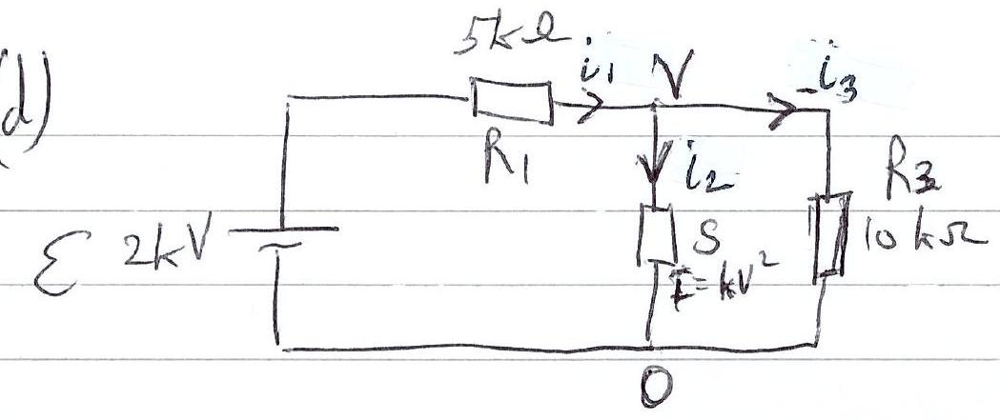

Kirchheff: $\varepsilon = i _ { 1 } R _ { 1 } + V$ and $i _ { 1 } = i _ { 2 } + i _ { 3 }$ za used kirchhtf
gruven

$$
i _ { 2 } = k V ^ { 2 }
$$

ther $\varepsilon = i _ { 2 } R _ { 1 } + i _ { 3 } R _ { 1 } + i _ { 3 } R _ { 3 }$

$$
\begin{aligned}
& = k v ^ { 2 } R _ { 1 } + i _ { 3 } \left( R _ { 1 } + R _ { 3 } \right) \\
& = k \left( i _ { 3 } ^ { 2 } R _ { 3 } ^ { 2 } \right) R _ { 1 } + i _ { 3 } \left( R _ { 1 } + R _ { 3 } \right) . \quad \text { items of } i _ { 3 }
\end{aligned}
$$

subtitioting $2000 = 10 ^ { - 7 } i _ { 3 } ^ { 2 } 10 ^ { 8 } \cdot 5 \times 10 ^ { 3 } + i _ { 3 \times 15 \times 10 ^ { 3 } }$
i.e. $2 = i _ { 3 } ^ { 2 } \times 10 \times 5 + i _ { 3 } \times 15$ quadratisin

$$
\begin{aligned}
50 i _ { 3 } ^ { 2 } + 15 i _ { 3 } - 2 = 0 & \\
i _ { 3 } & = \frac { - 15 } { 100 } \pm 100 \\
& = - \frac { 15 } { 100 } \pm \frac { 25 } { 100 } \\
i _ { 3 } & = 0.1 \mathrm {~A}
\end{aligned}
$$

(ii) Current elentianto $i _ { 3 } = 0.2 \mathrm {~A}$

Hence $V = 0.2 \times 10 ^ { 4 } = 2000 \mathrm {~V}$

$$
\text { Then } \begin{aligned}
i _ { 2 } & = 10 ^ { - 7 } \times ( 2000 ) ^ { 2 } \\
& = 0.4 \mathrm {~A} \\
\text { But } \quad i _ { 1 } & = i _ { 2 } + i _ { 3 } \\
& = 0.4 + 0.2 = 0.6 \mathrm {~A}
\end{aligned}
$$

potential across $R _ { 1 }$ is $5 \times 10 ^ { 3 } \times 0.6$

$$
= 3 \times 10 ^ { 3 } \mathrm {~V}
$$

L $\quad \varepsilon = 3000 + 2000 \mathrm {~V}$

$$
= 5 \mathrm { kV }
$$

Qu4. Electric Fulds

(a) (i)
Strunger
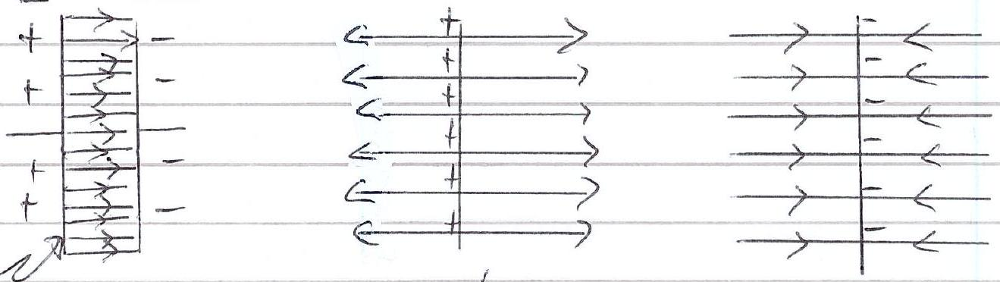
finderenct is no feeld rematt in no fueld ontside the pluer, any between
(iii) 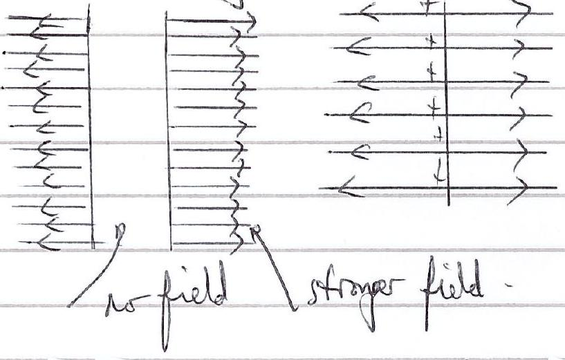
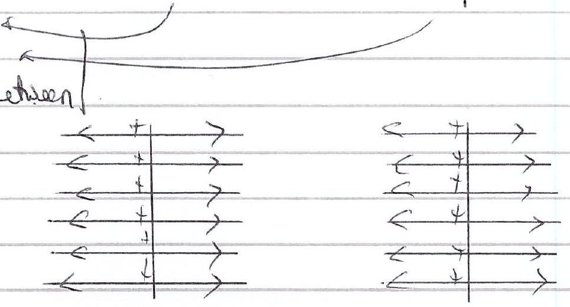
(iii) W.D. - separating the plater s. F.d.
(constant field or contait chirge)
So the force between sleplater cen be ofteint prov the everyy stored
$$
\text { F.d. } = \frac { Q ^ { 2 } } { 2 c }
$$
Let $c = \frac { \varepsilon _ { 0 } A } { d } \quad \therefore F d = \frac { Q ^ { 2 } } { 2 \varepsilon _ { 0 } A } d$
$$
F = \frac { Q ^ { 2 } } { 2 \varepsilon _ { 0 } A }
$$
(iv) In the uniform electric field , 5 for are pleate, the othe plute cartain chargé' $Q$.
$$
\text { So } F = Q \cdot E \text {. }
$$
Hence $Q ^ { 2 } = Q E$
$$
2 \tilde { \varepsilon } _ { 6 } A
$$
fueld, $E = \frac { 1 } { 2 \varepsilon _ { 0 } } \cdot \frac { Q } { A } = \frac { \sigma } { 2 \varepsilon _ { 0 } }$

(v) Using $F = \frac { Q ^ { 2 } } { 2 \varepsilon _ { 0 } A }$
$$
\begin{aligned}
& \frac { Q _ { 1 } ^ { 2 } } { A _ { 1 } } = Q _ { 2 } ^ { 2 } \\
& \frac { A _ { 2 } } { A _ { 2 } } = 2 = \left( \frac { Q _ { 2 } } { Q _ { 1 } } \right) ^ { 2 } \quad ( \text { or other mothod } ) .
\end{aligned}
$$
so factor of $\sqrt { 2 }$ increase.
(vi) equating fores, $M g = \frac { Q ^ { 2 } } { 2 \varepsilon _ { 0 } A }$.
$$
( \rho A D L ) g = \frac { \sigma ^ { 2 } A ^ { 2 } } { 2 \varepsilon _ { 0 } A }
$$
or by energy. $\quad y _ { g } \Delta h = ( \rho A \Delta h ) g \Delta h = \frac { 1 } { 2 } \varepsilon E ^ { 2 } + A \cdot \Delta h$.
$$
\text { argy } \begin{aligned}
m ^ { 3 } = \varepsilon _ { 0 } \varepsilon _ { 0 } E ^ { 2 } . \quad P A ( \Delta L ) ^ { 2 } g * 2 \varepsilon _ { 0 } & = \sigma ^ { 2 } \cdot A \Delta L \\
\sigma ^ { 2 } & = p \Delta h _ { 0 } \cdot g \times \varepsilon _ { 0 } \\
& = 16 \mu c / m ^ { 2 }
\end{aligned}
$$

(b) (i)
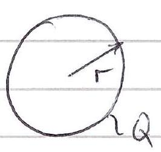
$$
\begin{aligned}
& V = \frac { 1 } { 4 \pi _ { 0 } } \cdot \frac { Q } { r } \\
& Q = 4 \pi _ { 0 } r V
\end{aligned}
$$
(ii) $E = \frac { 1 } { \pi \varepsilon _ { 0 } } \cdot \frac { Q } { \Gamma ^ { 2 } }$ for a radial (splerial) fuell.
B
$$
E = V
$$
(iii) 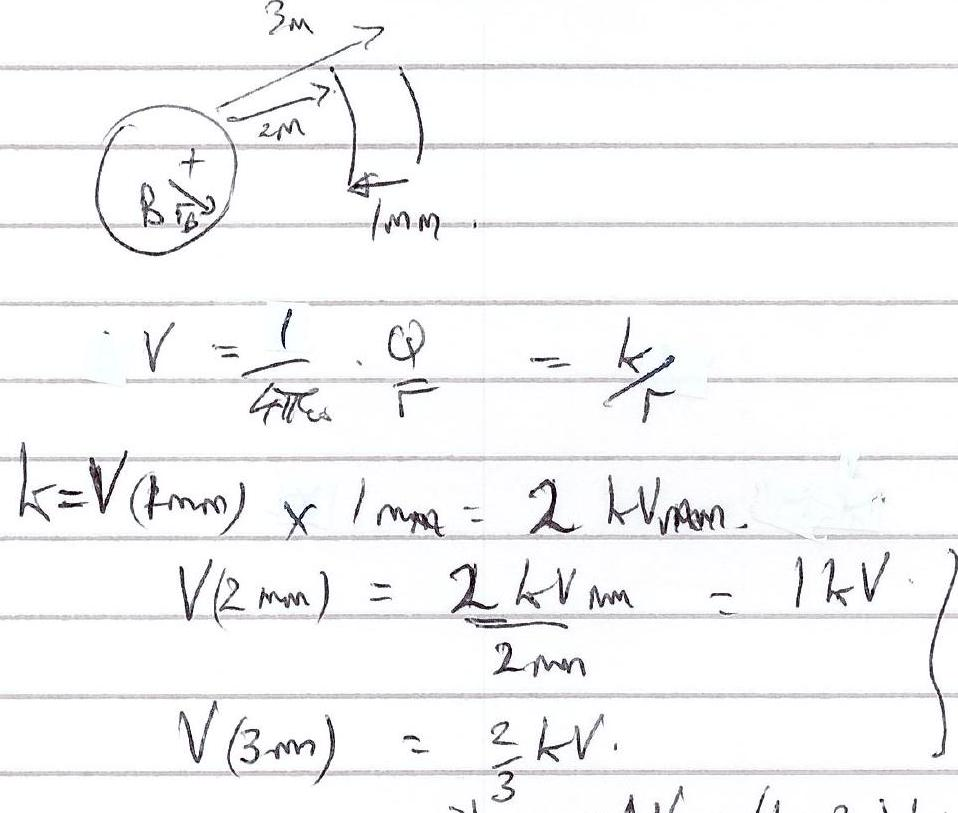
$$
\text { energy gruit } { } ^ { 3 } = e \Delta V = \left( 1 - \frac { 2 } { 3 } \right) 6 v \times 16 \times 10 ^ { - 19 } c
$$
(iv) 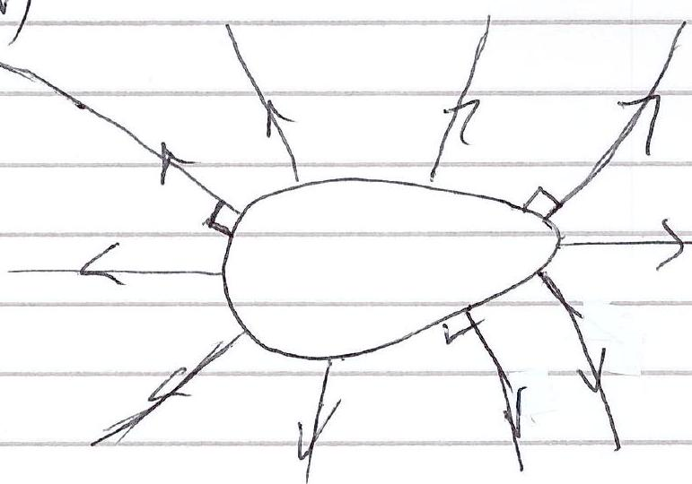
$$
\begin{aligned}
& = 0.53 \times 10 ^ { - 16 } \mathrm {~J} \\
& = 0.33 \mathrm { keV }
\end{aligned}
$$
lines ye perpendidar do the surpose at the morace

corrows

(v) 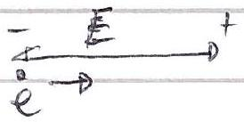
$$
\begin{aligned}
W D = F d & = e E \cdot d \\
t 2.5 \mathrm { PV } & = C \times E \times 7 \times 10 ^ { - 6 } \\
E & = \frac { 2.5 } { 7 \times 10 ^ { - 6 } } = 3.6 \times 10 ^ { 5 } \mathrm {~N} / \mathrm { C }
\end{aligned}
$$

(vi) Since $E = \frac { V } { r }$ for a find $V \quad E \propto \frac { 1 } { r }$.
so the smaller (radius) and will have ple lyter freed strength and will breat down front.
$$
\begin{aligned}
E ( 50 \mathrm {~cm} ) & = \frac { V _ { \text {baselone } } } { 5 \times 10 ^ { - 2 } ( \mathrm {~m} ) } \\
3.6 \times 10 ^ { 6 } & = \frac { V _ { \text {transure } } } { 5 \times 10 ^ { - 2 } } \\
V _ { \text {brecidanous } } & = 17860 \mathrm {~V} \\
& = 18 \mathrm { kV }
\end{aligned}
$$

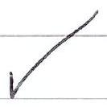

(vii) 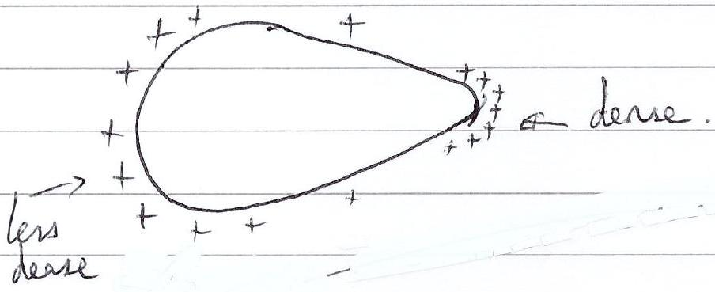
(c) 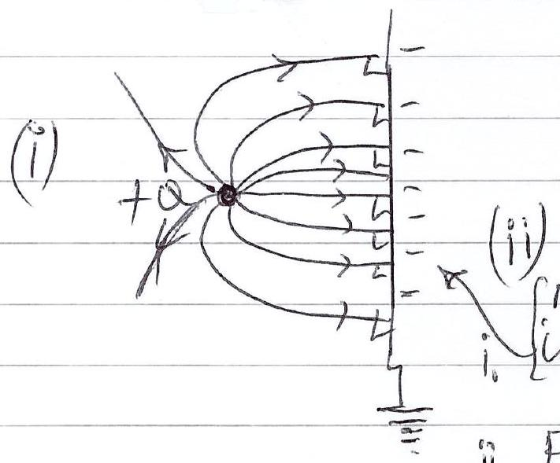
field him 1 to ploe ratiol dose bo chargete negative i. [induced charges attract $+ Q$ ].
ii. Fore onplate is the telpt iii. and symmetric anit a hie though Q.
(iii) is
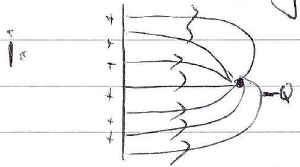
iis pattern is the changes of 4.0.c separated by 40 cm , as the his we perpenticater to the plate, for to ofter compount of force.
$$
F = \frac { 1 } { 4 \pi r _ { 0 } ^ { 0 } } \frac { \left( 4.0 \times 10 ^ { - 6 } \right) ^ { 2 } } { ( 0.4 ) ^ { 2 } } = 0.9 \mathrm {~N}
$$

Qu 5: Spriys + Forces

(a) (i)
Diagnon
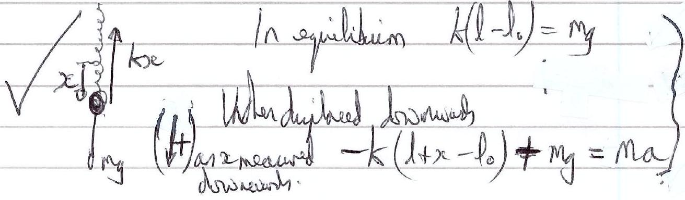
Hence $\quad - M g + h - x + M y = M a$
So, $a = - \frac { k } { m } \cdot x$
conferewit $a = - \omega ^ { 2 } x$
and $T = 2 \pi \sqrt { \frac { m } { k } }$ (no mant for read)
2

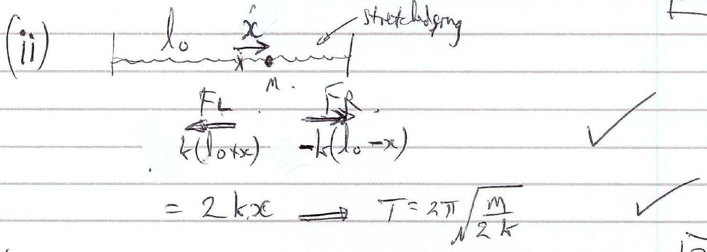
(iii)

$$
\begin{aligned}
F = k \left( 2 l _ { 0 } - l _ { 0 } + x \right) & k \left( 2 l _ { 0 } - l _ { 0 } - x \right) \\
= k \left( l _ { 0 } + x \right) & F = 2 k x \\
& \quad k \left( l _ { 0 } - x \right) \\
& \quad T = 2 \pi \sqrt { \frac { n } { 2 k } }
\end{aligned}
$$

(iv) $k _ { 1 } \cdot e _ { x } k _ { 2 }$

$$
\vec { k } _ { 1 } \left( l _ { 1 } - l _ { 0 } + x \right) \quad \vec { k } _ { 2 } \left( l _ { 2 } - l _ { 0 } - x \right)
$$

At equilibum $k _ { 1 } \left( l _ { 1 } - l _ { 0 } \right) = k _ { 2 } \left( l _ { 2 } - l _ { 0 } \right)$
So, $F = k _ { 1 } x + k _ { 2 } x$ and $T = 2 \pi \sqrt { \frac { M } { \left( k _ { 1 } + k _ { 2 } \right) } }$
2

(b) (i) $V _ { 1 } ^ { M _ { 1 } } T _ { D _ { 1 } ^ { * } } ^ { C _ { 1 } M _ { 2 } } X _ { T _ { 2 } } ^ { \top } D _ { 2 } , V _ { 2 }$

Centripetal force: $M _ { 1 } T _ { 1 } \omega ^ { 2 } = M _ { 2 } \sqrt { 2 } \omega ^ { 2 } = T$

$$
m _ { 1 } r _ { 1 } = m _ { 2 } \sqrt { 2 }
$$

and $r = r _ { 1 } + r _ { 2 }$
So $m _ { 1 } r _ { 1 } = m _ { 2 } \left( r - r _ { 1 } \right)$

$$
M _ { 1 } = M _ { 2 } \left( \frac { \Gamma } { r _ { 1 } } - 1 \right)
$$

$$
\begin{aligned}
\frac { m _ { 1 } + m _ { 2 } } { m _ { 2 } } & = \frac { \Gamma } { r _ { 1 } } \\
r _ { 1 } & = \frac { \Gamma m _ { 2 } } { m _ { 1 } + m _ { 2 } }
\end{aligned}
$$

$$
T = \frac { m _ { 1 } m _ { 2 } } { m _ { 1 } + m _ { 2 } } r \omega ^ { 2 }
$$

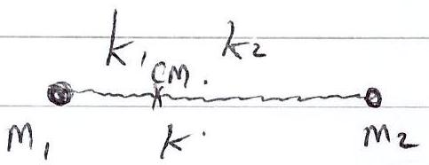
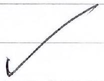

- The spring con becomiderd as two proots $k _ { 11 } k _ { 2 }$ about theorm.
- The extension $x$ is thesumpt the indivicitual enclervious $x _ { 1 } , x _ { 2 }$ $x = x _ { 1 } + x _ { 2 }$.
- The force of extenvión $F$ áquenty
$$
\begin{aligned}
& F = k _ { 1 } x _ { 1 } \\
& F = k _ { 2 } x _ { 2 } \\
& F = k x _ { 1 }
\end{aligned}
$$
So $F _ { k } = \frac { F } { k + 1 } + F _ { k } \Rightarrow \frac { 1 } { k } = \frac { 1 } { k _ { 1 } } + \frac { 1 } { k _ { 2 } }$
Since
$$
\begin{array} { r }
T = 2 \pi \sqrt { \frac { m _ { 1 } } { k _ { 1 } } } \text { or } T = 2 \pi \sqrt { \frac { m _ { 2 } } { k _ { 2 } } } \frac { 1 } { k } = \frac { T ^ { 2 } } { 4 \pi ^ { 2 } m _ { 1 } } + \frac { T ^ { 2 } } { 4 \pi ^ { 2 } m _ { 2 } } \\
= \frac { T ^ { 2 } } { 4 \pi ^ { 2 } } \left( \frac { 1 } { m _ { 1 } } + \frac { 1 } { m _ { 2 } } \right) \\
T = 2 \pi \sqrt { \frac { m _ { 1 } , m _ { 2 } } { k \left( m _ { 1 } + m _ { 2 } \right) } }
\end{array}
$$
$$
4
$$

(c)(i)

| $\Delta t / m _ { s }$ | $\Delta V / \mathrm { ms } ^ { - 1 }$ | Speed/m/ | arigiped/m/s | dittree / $n$ |
| :--- | :--- | :--- | :--- | :--- |
| 0-10 | 30 | $340 \rightarrow 310$ | 325 | 3.25 |
| 10-20 | 50 | $310 \rightarrow 260$ | 285 | 2185 |
| 20-90 | 245 | $260 \rightarrow 15$ | 138 | 9.6 |
| 90-100 | 15 | $15 \rightarrow 0$ | 7.5 | 0.08 |
|  | 340 |  |  | 15.8m |

→ from $340 \mathrm {~m} / \mathrm { s }$ torest.
16 m or 14-18 m S-Marks (witle evaluat so orting)
worling $3 \times$ changes colorities
$2 x$ querage ochirities
$2 x$ distance, I $m$ of values ✓
Table layers or ordered calculation which concernal ✓
(d)

$$
5
$$

Momestum conservation $M _ { \text {bublet } } + V _ { \text {bale } } = \left( M _ { 0 } + M _ { \text {coud } } \right) V _ { 2 }$

$$
\begin{aligned}
10 ^ { - 2 } \times 320 & = 4 \times V _ { 2 } \\
V _ { 2 } & = 0.8 \mathrm {~m} / \mathrm { s }
\end{aligned}
$$

Energy of bose (ad bullot) goer interclastic potential energy. Assume linearity ie. Fadiuslacement. whil means $F = k x$
to the energy is given by $\frac { 1 } { 2 } k x ^ { 2 }$ ✓

$$
\text { So } \begin{aligned}
\frac { 1 } { 2 } M V ^ { 2 } & = \frac { 1 } { 2 } k x ^ { 2 } \\
x ^ { 2 } & = \frac { m V ^ { 2 } } { K } \\
& = \frac { 4 \times 0.8 ^ { 2 } } { K }
\end{aligned}
$$

And

$$
\begin{aligned}
200 = k \times 5 \times 10 ^ { - 3 } & \quad k \\
k = 4 \times 10 ^ { 4 } \mathrm {~N} / \mathrm { m } . \quad x ^ { 2 } & = \frac { 4 \times 0.8 ^ { 2 } } { 4 \times 10 ^ { 4 } } \\
x & = 8 \mathrm {~mm}
\end{aligned}
$$

4

If we solve the quadati, $\quad \frac { m v ^ { 2 } } { k } + 2 \frac { m } { k } g ( \Delta h ) = ( \Delta k ) ^ { 2 }$

$$
\begin{aligned}
\Delta L & = \frac { 2 \frac { m g } { k } \pm \sqrt { 4 \frac { m ^ { 2 } g ^ { 2 } } { k ^ { 2 } } + 4 \frac { m v ^ { 2 } } { k } } } { 2 } \\
& = \frac { m g } { k } \pm \frac { m g } { k } \sqrt { 1 + \frac { m v ^ { 2 } } { k } \cdot \frac { k ^ { 2 } } { m ^ { 2 } g ^ { 2 } } } \\
& = \frac { m g } { k } \left( 1 + \sqrt { 1 + \frac { v ^ { 2 } k } { m g ^ { 2 } } } \right) \\
& = 2.2 \mathrm {~cm} = 2.2 \mathrm {~cm}
\end{aligned}
$$

Still assard / mint if gpe left ant
(Angolve around 2 cm
(iii)

$$
\left( \begin{array} { c }
1.2 \text { condillation is not froull for the chage } i \text { g/e } \\
\text { Usig body gpe } \frac { 1 } { 2 } p ^ { 2 } = p _ { g } \Delta h \\
v ^ { 2 } = 2 g \Delta h \\
v = 0.485 \mathrm {~m} / \mathrm { s }
\end{array} \right)
$$

Useing $\quad \frac { 1 } { 2 } m v ^ { 2 } + m g \Delta h = \frac { 1 } { 2 } h ( \Delta h ) ^ { 2 }$.

$$
\begin{aligned}
v ^ { 2 } & = \frac { k } { M } ( \Delta L ) ^ { 2 } + 2 g \Delta h \\
v & = 0.865 \mathrm {~m} / \mathrm { s }
\end{aligned}
$$

(their is the RMS of the two individued speeds above), Using requ (1), Momestum conservation.

$$
\begin{aligned}
u & = V _ { 1 } + r V _ { 2 } \\
\sqrt { 2 g h _ { 0 } } & = V _ { 1 } + 10 \times 0.865 \\
V _ { 1 } & = ( - ) 2.386 \mathrm {~m} / \mathrm { s } \\
& = \sqrt { 2 g h } \\
h & = 29 \mathrm {~cm}
\end{aligned}
$$

(e). General result for a elastic collision between a moving mass M, adan intially stationary mais, $M _ { 2 }$.
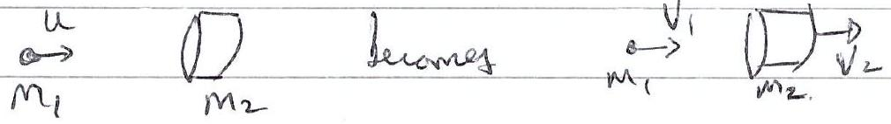
Momstum cans. $\quad m _ { 1 } u = m _ { 1 } V _ { 1 } + m _ { 2 } V _ { 2 }$ So

$$
\begin{equation*}
u = v _ { 1 } + \frac { m _ { 2 } } { m _ { 1 } } v _ { 2 } \tag{1}
\end{equation*}
$$

KE Conserved
So

$$
\begin{align*}
\frac { 1 } { 2 } m _ { 1 } u ^ { 2 } & = 2 m _ { 1 } V _ { 1 } ^ { 2 } + \frac { 1 } { 2 } m _ { 2 } V _ { 2 } ^ { 2 }  \tag{1}\\
u ^ { 2 } & = V _ { 1 } ^ { 2 } + r V _ { 2 } ^ { 2 } \tag{2}
\end{align*}
$$

We can rearroge (1) as $u - v _ { 1 } = r v _ { 2 }$
and (2) as $\left( u - v _ { 1 } \right) \left( u + v _ { 1 } \right) = r v _ { 2 } ^ { 2 }$
If $u \neq v$, then diviling,

$$
\begin{equation*}
u + v _ { 1 } = v _ { 2 } \tag{3}
\end{equation*}
$$

Acd (1) and (3)

$$
\begin{equation*}
2 u = ( 1 + r ) v _ { 2 } \tag{8}
\end{equation*}
$$

Subtracting
$2 V _ { 1 } = ( 1 - r ) V _ { 2 }$
Divily.(4) ad (5)
$\frac { V _ { 1 } } { u } = \frac { ( 1 - r ) } { ( 1 + r ) }$
Speed \& Cylenter

(i) Using (4)
$$
\begin{align*}
2 u = ( 1 + r ) v _ { 2 } \Rightarrow v _ { 2 } & = \frac { 2 u } { ( 1 + r ) } = \frac { 2 \sqrt { 2 g h } } { 1 + \frac { 0.45 } { 0.045 } } \\
& = 1.14 \mathrm {~m} / \mathrm { s } \tag{24}
\end{align*}
$$
(ii) Using energy
$$
\begin{aligned}
& \text { RE of cylinder thesif grow pe infore eing = elastec perperiod } \\
& \frac { 1 } { 2 } M v ^ { 2 } + m g \Delta h = \frac { 1 } { 2 } k ( \Delta k ) ^ { 2 }
\end{aligned}
$$
This is a praventer whit cark solved for $\Delta h$.
To estinde $\Delta k _ { 2 }$, convider only the elastic pe ad $15 E$ teme
$$
\begin{aligned}
\frac { 1 } { 2 } m v ^ { 2 } = \frac { 1 } { 2 } k ( \Delta h ) ^ { 2 } \Rightarrow ( \Delta h ) ^ { 2 } = \frac { m v ^ { 2 } } { k } & = 0.45 \times 1.14 ^ { 2 } \\
\Delta h & = 0.019 \mathrm {~m} = 1.9 \mathrm {~cm}
\end{aligned}
$$
With this value, $M g \Delta L = 0.45 \times 9.81 \times 0.019$
$$
= 0.084 \mathrm {~J}
$$
but $\frac { 1 } { 2 } M v ^ { 2 } = 0.292 \mathrm {~J}$. So OPR in Suging isnt (30\%)
