## BPhO Round 1 Solutions

## 1 Section 1

a) i)
$$
\begin{align*}
& v ^ { 2 } = u ^ { 2 } + 2 a s \\
= & 3 ^ { 2 } + 2 \times 9.81 \times 2 \\
= & 6.946 = 7.0 \mathrm {~ms} ^ { - 1 } \tag{1mark}
\end{align*}
$$
a) ii)
$$
\begin{gather*}
g h _ { 1 } = \frac { 1 } { 2 } v ^ { 2 } \eta = \frac { 1 } { 2 } \times 6.95 ^ { 2 } \times 0.7 \rightarrow h _ { 1 } = 1.72 \mathrm {~m} \\
h _ { n } = h _ { 1 } \times \eta ^ { n - 1 } = 0.59 \mathrm {~m} \tag{1mark}
\end{gather*}
$$
b) Consider power consumption $P$ and energy $E$ of the battery:
$$
\begin{gather*}
\text { At night } E = 10 P \\
\text { In the day } E = T \times \frac { 2 } { 3 } P \\
\therefore \frac { 2 } { 3 } T = 10 \rightarrow T = 15 \text { hours } \tag{2mark2}
\end{gather*}
$$
c)Diagram with forces marked:

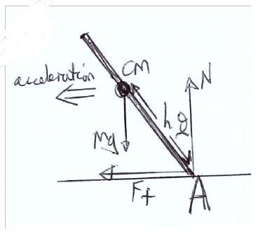
Figure 1: 1.c

Resolving moments about A:

$$
\begin{gathered}
m g h \sin ( \theta ) = \frac { m v ^ { 2 } } { r } h \cos ( \theta ) \\
\tan ( \theta ) g r = v ^ { 2 } \\
\frac { \tan \left( \theta _ { 1 } \right) } { \tan \left( \theta _ { 2 } \right) } = \frac { v _ { 1 } ^ { 2 } } { v _ { 2 } ^ { 2 } } \\
\frac { \tan \left( \theta _ { 1 } \right) } { \tan \left( 12 ^ { \circ } \right) } = \frac { 15 ^ { 2 } } { 10 ^ { 2 } } \\
\rightarrow \theta = 25.6 ^ { \circ } = 26 ^ { \circ }
\end{gathered}
$$

(3 marks)
d) If $T _ { E } = 2 T _ { I }$, then $\omega _ { E } = \frac { 1 } { 2 } \omega _ { I }$

$$
\begin{gathered}
\omega _ { E } ^ { 2 } r _ { E } ^ { 2 } = \omega _ { I } ^ { 2 } r _ { I } ^ { 3 } \\
\therefore r _ { E } = r _ { I } \left( \frac { \omega _ { I } } { \omega _ { E } } \right) ^ { \frac { 2 } { 3 } } = r _ { I } \times 2 ^ { \frac { 2 } { 3 } } \\
a = \omega ^ { 2 } r \\
\rightarrow \frac { a _ { I } } { a _ { E } } = \left( \frac { \omega _ { I } } { \omega _ { E } } \right) ^ { 2 } \times \frac { r _ { I } } { r _ { E } } = 2 ^ { 2 } \times 2 ^ { - \frac { 2 } { 3 } } = 2.52
\end{gathered}
$$

(3 marks)
e)Momentum conservation:

$$
\begin{aligned}
& \text { Parallel: } m _ { 1 } u = m _ { 1 } v _ { 1 } \cos \theta + m _ { 2 } v _ { 2 } \cos \theta \\
& \text { Perpendicular: } m _ { 1 } v _ { 1 } \sin \theta = m _ { 2 } v _ { 2 } \sin \theta \\
& \therefore m _ { 1 } v _ { 1 } = m _ { 2 } v _ { 2 } \rightarrow u = 2 v _ { 1 } \cos \theta
\end{aligned}
$$

(2 marks)
Energy conservation:

$$
\begin{gathered}
m _ { 1 } u ^ { 2 } = m _ { 1 } v _ { 1 } ^ { 2 } + m _ { 2 } v _ { 2 } ^ { 2 } \\
= m _ { 1 } v _ { 1 } \left( v _ { 1 } + v _ { 2 } \right) = m _ { 1 } v _ { 1 } ^ { 2 } \left( 1 + \frac { v _ { 1 } } { v _ { 2 } } \right) \\
\therefore u ^ { 2 } = v _ { 1 } ^ { 2 } \left( 1 + \frac { v _ { 1 } } { v _ { 2 } } \right)
\end{gathered}
$$

(1 mark)
Eliminating $u$, we get:

$$
4 \cos ^ { 2 } \theta = 1 + \frac { m _ { 1 } } { m _ { 2 } }
$$

There largest value of $\frac { m _ { 1 } } { m _ { 2 } } = 3$, when $\theta \rightarrow 0$. If $m _ { 1 } = m _ { 2 } , \cos \theta = \frac { 1 } { \sqrt { 2 } } \rightarrow \theta = \frac { \pi } { 4 } = 45 ^ { \circ }$
(2 marks)
(e) Total: 5 marks

f) Resolving when the object travels up the slope:
$$
\begin{gathered}
- m a _ { u } = F _ { d } + m g \sin \alpha \\
\therefore v ^ { 2 } = 2 \left( \frac { F _ { d } } { m } + g \sin \alpha \right) s
\end{gathered}
$$
Similarly for going down the slope we get:
$$
\frac { v ^ { 2 } } { 4 } = 2 \left( - \frac { F _ { d } } { m } + g \sin \alpha \right) s
$$
(3 marks)

Dividing the two equations to eliminate $v$ :

$$
\begin{gathered}
4 = \left( \frac { F _ { d } } { m } + g \sin \alpha \right) / \left( g \sin \alpha - \frac { F _ { d } } { m } \right) \\
4 m g \sin \alpha - 4 F _ { d } = F _ { d } + m g \sin \alpha \\
3 m g \sin \alpha = 5 F _ { d } = 5 \mu N = 5 \mu m g \cos \alpha \\
\therefore \mu = \frac { 3 } { 5 } \tan \alpha
\end{gathered}
$$

(2 marks)
(f) Total: 5 marks
g) i) As the average height of the fluid above the first density change is $\frac { h } { 2 }$, the force on the exterior walls is:

$$
F _ { 1 } = \frac { 1 } { 2 } \rho g h A
$$

(1 mark)
g) ii)

$$
F _ { 2 } = \left( \rho g h + 2 \rho \times g \frac { h } { 2 } \right) A = 2 \rho g h A
$$

(1 mark)
g) iii)

$$
\begin{gathered}
F _ { n } = \left( p _ { 1 } + p _ { 2 } + \ldots + n \rho g \frac { h } { 2 } \right) A \\
= \rho g h \left( 1 + 2 + 3 + \ldots + n - 1 + \frac { n } { 2 } \right) A \\
= \rho g h A \left( 1 + 2 + 3 + \ldots + n - \frac { n } { 2 } \right) = \rho g h A \left[ \Sigma _ { k = 1 } ^ { n } k - \frac { n } { 2 } \right] \\
= \rho g h A \left[ \frac { n } { 2 } ( n + 1 ) - \frac { n } { 2 } \right] = \rho g h A \frac { n ^ { 2 } } { 2 }
\end{gathered}
$$

(2 marks)
(g) Total: 4 marks
h) i) Thrust $= \frac { \Delta ( m v ) } { \Delta t } = 50 \times 2000 = 10 ^ { 5 } \mathrm {~N}$
(1 mark)

h) ii)
$$
\begin{gathered}
T - m g = m a \\
a = \frac { T } { m } - g
\end{gathered}
$$
(1 mark)
h) iii)
$$
\begin{gathered}
m ( t ) = - \frac { m _ { 0 } t } { t _ { 0 } } + m _ { 0 } + m _ { r } \\
\rightarrow a ( t ) = \frac { T } { - \frac { m _ { 0 } t } { t _ { 0 } } + m _ { 0 } + m _ { r } } - g
\end{gathered}
$$
(1 mark)
h) iv) $a = g$ for twice the weight.
$$
\begin{gathered}
2 g = \frac { T } { - \frac { m _ { 0 } t } { t _ { 0 } } + m _ { 0 } + m _ { r } } = \frac { 10 ^ { 5 } } { 10 ^ { 4 } - 50 t } \\
- 50 t + 10 ^ { 4 } = \frac { 10 ^ { 5 } } { 2 g } \\
t = 200 - \frac { 1000 } { 9.81 } = 98 \mathrm {~s}
\end{gathered}
$$
(1 mark)
(h) Total: 4 marks
i) An open top drum:
$$
\begin{gathered}
\Delta V _ { \text {oil } } = V _ { 0 } \Delta T \times 7 \times 10 ^ { - 4 } \\
\Delta V _ { \text {drum } } = V _ { 0 } \Delta T \times 3 \times 1.2 \times 10 ^ { - 5 } \\
\frac { \Delta V } { V _ { 0 } } = 0.024 = \Delta T \left( 7 \times 10 ^ { - 4 } - 3.6 \times 10 ^ { - 5 } \right) \\
\Delta T = \frac { 0.024 \times 10 ^ { 5 } } { 70 - 3.6 } = 36.1 ^ { \circ } \mathrm { C } \\
\therefore T = 41.1 ^ { \circ } \mathrm { C }
\end{gathered}
$$
Where the factor of three is used in the second line as we are given the linear coefficient of expansion for the steel.

(i) Total: 3 marks

j) Applying the cosine rule to the smaller triangle:
$$
\begin{gathered}
c ^ { 2 } = 52 ^ { 2 } + 43 ^ { 2 } - 2 \times 52 \times 43 \cos \left( 28 ^ { \circ } \right) \\
\rightarrow c = 24.586 \mathrm {~km} \\
v = \frac { c } { 300 } = 82 \mathrm {~ms} ^ { - 1 }
\end{gathered}
$$
(1 mark)
Applying the sine rule on the small triangle to find $\theta$ :

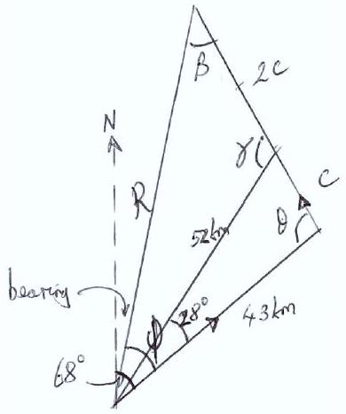
Figure 2: 1.j

$$
\begin{gathered}
\frac { \sin 28 } { c } = \frac { \sin \theta } { 52 } \\
\theta = 83.19 ^ { \circ } \text { or } \theta = 96.81 ^ { \circ }
\end{gathered}
$$

If $\theta$ was 90°, the lenght marked as 52km would be $\frac { 43 } { \cos 28 } = 49 \mathrm {~km}$. Therefore $\theta = 96.8 ^ { \circ }$.
(1 mark)
Now using the cosine rule on the larger triangle:

$$
\begin{gathered}
R ^ { 2 } = 43 ^ { 2 } + 9 \times 24.586 ^ { 2 } - 2 \times 43 \times 3 \times 24.586 \cos ( 96.8 ) \\
R = 89.7 \mathrm {~km}
\end{gathered}
$$

$$
\begin{gather*}
\frac { R } { \sin \theta } = \frac { 3 c } { \sin \phi }  \tag{1mark}\\
\therefore \phi = 54.76 ^ { \circ }
\end{gather*}
$$

So the bearing is 013.2°
(1 mark)
(j) Total: 4 marks
k) $b$ will have units of volume, so $[ b ] = \mathrm { m } ^ { 3 }$. The exponent must be dimensionless, therefore $[ a ] = [ n R T V ] = \left[ p V ^ { 2 } \right] = \frac { N } { m ^ { 2 } } \times m ^ { 6 } = k g m ^ { 5 } \mathrm {~s} ^ { - 2 }$.
(2 marks)
Expanding the exponent:

$$
\begin{gathered}
p ( V - b ) \approx n R T \left( 1 - \frac { a } { n R T V } \right) \\
p V - p b = n R T - \frac { a } { V }
\end{gathered}
$$

Equating terms given the ideal gas law $p v = n R T$ :

$$
p V = n R T _ { c } = \frac { a } { b } T _ { c } = \frac { a } { n r b }
$$

(2 marks)
(k) Total: 4 marks

1) Correct diagram:

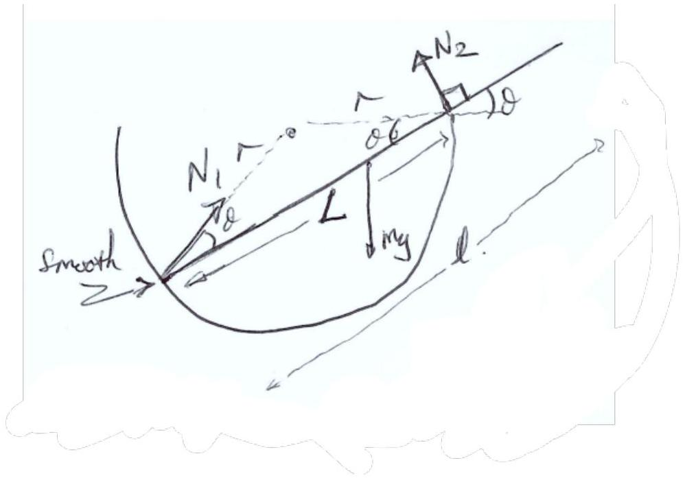
Figure 3: 1.1

(1 mark)
Resolving parallel to the rod:

$$
\begin{equation*}
N _ { 1 } \cos \theta = m g \sin \theta \tag{1mark}
\end{equation*}
$$

Now resolving moments by the contact point:

$$
\begin{equation*}
N _ { 1 } \sin \theta L = m g \cos \theta \left( L - \frac { l } { 2 } \right) \tag{1mark}
\end{equation*}
$$

Dividing to eliminate $N _ { 1 }$ :

$$
\begin{gathered}
\tan \theta L = \frac { 1 } { \tan \theta } \left( L - \frac { l } { 2 } \right) \\
\rightarrow \tan ^ { 2 } \theta = 1 - \frac { l } { 2 L }
\end{gathered}
$$

But, $L = 2 r \cos \theta$, so $\tan ^ { 2 } \theta = 1 - \frac { l } { 4 r \cos \theta }$
(2 marks)
Finally, using trigonometry to solve for $r$ :

$$
\begin{gathered}
\frac { 1 - \cos ^ { 2 } \theta } { \cos ^ { 2 } \theta } = 1 - \frac { l } { 4 r \cos \theta } \\
1 - \cos ^ { 2 } \theta = \cos ^ { 2 } \theta - \frac { l \cos \theta } { 4 r \cos \theta } \\
l \frac { \cos \theta } { 4 r } = 2 \cos ^ { 2 } \theta - 1 = \cos 2 \theta \\
r = \frac { l \cos \theta } { 4 \cos 2 \theta }
\end{gathered}
$$

(1 marks)
(l) Total: 6 marks
m) i) To maximise the current all switches must be closed.

$$
I = \frac { 5 V } { 2 \times \frac { 5 } { 3 } \Omega } = \frac { 3.5 } { 2.5 } \mathrm {~A} = 1.5 \mathrm {~A}
$$

m) ii) To minimise the current only one of the switches should be closed.

$$
I = \frac { 5 } { 10 \Omega } = 0.5 \mathrm {~A}
$$

(1 mark) for both qualitative parts
(1 mark) for each current obtained
(m) Total: 3 marks
n) a) First calculate the voltage across the $5 \mathrm { k } \Omega$ resistor with S open:

$$
V _ { o } = \frac { 5 } { 20 + 5 } V = \frac { V } { 5 }
$$

(1 mark)
n) b) Now with S closed:

Resistance in parallel:

$$
\begin{gathered}
\frac { 1 } { R _ { p } } = \frac { 1 } { 15 } + \frac { 1 } { 10 } + \frac { 1 } { 5 } = \frac { 11 } { 30 } \\
R _ { p } = \frac { 30 } { 11 } \mathrm { k } \Omega = 2.7 \mathrm { k } \Omega
\end{gathered}
$$

(1 mark)

$$
\begin{gathered}
V _ { c } = \frac { 30 / 11 } { 30 / 11 + 20 } V = \frac { 30 } { 220 + 30 } V = \frac { 3 } { 25 } \mathrm {~V} \\
\therefore \frac { I _ { c } } { I _ { o } } = \frac { \frac { 3 } { 25 } \mathrm {~V} } { \frac { V } { 5 } } = \frac { 3 } { 5 }
\end{gathered}
$$

(1 mark)
(n) Total: 3 marks

o) Given $P = k R ^ { 2 } T ^ { 4 }$ and $T \lambda _ { \text {max } } = k ^ { \prime }$, then $P = k ^ { \prime \prime } \frac { R ^ { 2 } } { \lambda ^ { 4 } }$

(1 mark)
Hence:

$$
\begin{aligned}
& \frac { \lambda _ { 1 } ^ { 4 } } { \lambda _ { 2 } ^ { 4 } } = \frac { R _ { 1 } ^ { 2 } P _ { 2 } } { P _ { 1 } R _ { 2 } ^ { 2 } } = \frac { 4000 } { 200 ^ { 2 } } = \frac { 1 } { 10 } \\
& \therefore \lambda _ { 2 } ^ { 4 } = 500 ^ { 4 } \times 10 \mathrm {~nm} ^ { 4 } \\
& \quad \lambda _ { 2 } = 889 \mathrm {~nm}
\end{aligned}
$$

(1 mark)
(o) Total: 3 marks
p) For a photon of energy $E , \lambda = \frac { h c } { E ( \mathrm { eV } e }$, where $e$ is the electronic charge. Therfore, $\lambda = 487 \mathrm {~nm}$.
(1 mark)
Doppler effect: $\frac { \Delta \lambda } { \lambda } = \frac { v } { c }$ and Hubble's Law: $v = H _ { 0 } d$

$$
\begin{gathered}
\rightarrow d = \frac { C \Delta \lambda } { H _ { 0 } \lambda } \\
d = \frac { 5.4 \times 10 ^ { - 9 } \times 2.55 \times 1.6 \times 10 ^ { - 19 } } { 70 \times 10 ^ { 3 } \times 6.63 \times 10 ^ { - 34 } } \mathrm { Mpc } \\
\therefore d = 47.5 \mathrm { Mpc } \\
v = 3.32 \times 10 ^ { 6 } \mathrm {~ms} ^ { - 1 }
\end{gathered}
$$

(2 marks)
(p) Total: 3 marks
q) We want to find the natural frequency of the cars "bouncing" movement ${ } ^ { 1 }$ :

$$
\begin{gathered}
m g = k x \\
4 \times 80 \times 9.81 = k \times 1.8 \times 10 ^ { - 2 } \\
= 1.74 \times 10 ^ { 5 } \mathrm { Nm } ^ { - 1 }
\end{gathered}
$$

(1 mark)
Travelling forward, the ride will be uncomfortable if the time between the bumps is resonant with the time period of the "bouncing" motion:

$$
\begin{gathered}
T = \frac { \Delta x } { v } = 2 \pi \sqrt { \frac { m } { k } } \\
v = \frac { \Delta x } { 2 \pi } \sqrt { \frac { k } { m } } \\
\therefore v = 15.9 \mathrm {~ms} ^ { - 1 }
\end{gathered}
$$

(2 marks)
(q) Total: 3 marks

[^0]
r) A pendulum clock has a period of $T = 2 \pi \sqrt { \frac { l } { g } }$. Let the correct period (1 second) be $T$, so the wrong pendulum period is $T + \Delta T$. In 24 hours, $N T = 24 \times 3600$, where $N$ is the number of 1 second periods in a day. Therefore, for the wrong period $N ( T + \Delta T ) = 24 \times 3600 + 600$, so $N \Delta T = 600$. Hence:

$$
\frac { \Delta T } { T } = \frac { 1 } { 6 \times 24 } = \frac { 1 } { 144 }
$$

(2 marks)
Now binomially expanding the time period:

$$
\begin{gathered}
T + \Delta T = 2 \pi \sqrt { \frac { l } { g } } \left( 1 + \frac { \delta l } { l } \right) ^ { 0.5 } \approx T + T \frac { 1 } { 2 } \frac { \delta l } { l } \\
\therefore \frac { \delta l } { l } = 2 \frac { \Delta T } { T } = \frac { 1 } { 72 } = 1.4 \%
\end{gathered}
$$

Hence, the pendulum is 1.4\% too long, so it should be shortened.
(2 marks)
(r) Total: 4 marks
s) The resolution limit of two point sources is given by $\theta _ { \text {Rayleigh } } = 1.22 \lambda / D$.

$$
\begin{gathered}
D = 1.22 \times \frac { 2140 } { 0.00593 } \times 550 \times 10 ^ { - 9 } = 0.24 \mathrm {~m} \\
\text { OR } D = 0.20 \mathrm {~m} , \text { if } 1.22 \text { not included }
\end{gathered}
$$

(2 marks)
(s) Total: 2 marks
t) Diagram with rays:

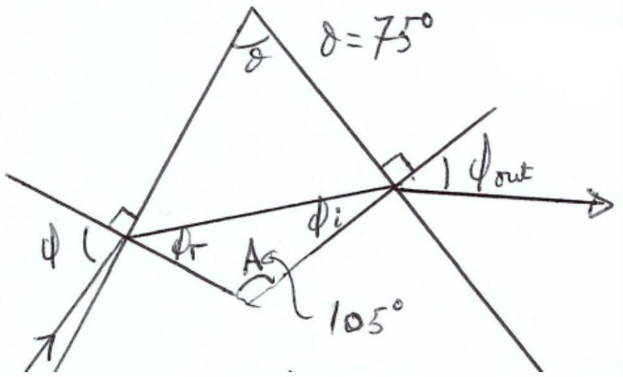
Figure 4: 1.t

(1 mark)

Let $\phi \rightarrow 90 ^ { \circ }$, so $\sin \phi = 1 = 1.4 \sin \phi _ { r }$. Therefore $\phi _ { r } = 45.6 ^ { \circ }$.
(1 mark)

$$
\begin{gathered}
\phi _ { i } = 180 - 105 - 45.6 = 29.4 ^ { \circ } \\
1.4 \sin 29.4 = \sin \phi _ { \text {out } } \rightarrow \phi _ { \text {out } } = 43.4 ^ { \circ }
\end{gathered}
$$

(1 mark)
(t) Total: 3 marks
u) Diagram with forces:

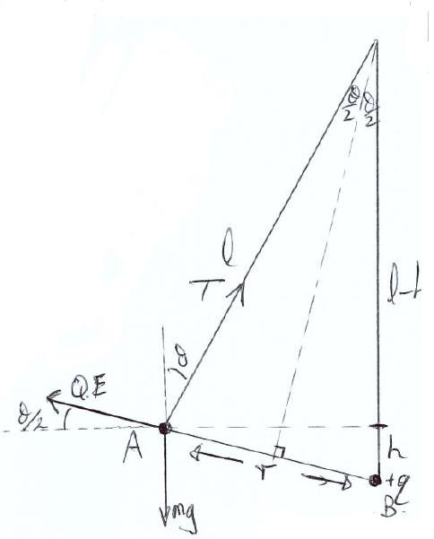
Figure 5: 1.u

$$
\begin{gather*}
W D = \text { energy gained by particle A }  \tag{1mark}\\
= m g h + \frac { q Q } { 4 \pi \epsilon _ { 0 } r } \tag{1mark}
\end{gather*}
$$

Now resolving the forces vertically and horizontally:

$$
\begin{gathered}
\mathrm { V } : m g = T \cos \theta + \frac { q Q } { 4 \pi \epsilon _ { 0 } r ^ { 2 } } \sin \frac { \theta } { 2 } \\
\mathrm { H } : \frac { q Q } { 4 \pi \epsilon _ { 0 } r ^ { 2 } } \cos \frac { \theta } { 2 } = T \sin \theta
\end{gathered}
$$

Now, dividing the first equation by $\frac { q Q } { 4 \pi \epsilon _ { 0 } r ^ { 2 } } \cos \frac { \theta } { 2 } = Q E \cos \frac { \theta } { 2 }$ we get:

$$
\begin{gathered}
\frac { m g } { Q E \cos \frac { \theta } { 2 } } = \tan \frac { \theta } { 2 } + \frac { 1 } { \tan \theta } \\
\frac { m g } { Q E } = \sin \frac { \theta } { 2 } + \frac { \cos \frac { \theta } { 2 } } { \tan \theta }
\end{gathered}
$$

Making the substitutions $s = \sin \frac { \theta } { 2 } , c = \cos \frac { \theta } { 2 }$ and $t = \tan \frac { \theta } { 2 }$, and observing that $\tan \theta = \frac { 2 t } { 1 - t ^ { 2 } }$, we find:

$$
\begin{gathered}
\frac { m g } { Q E } = s + \frac { c \left( 1 - t ^ { 2 } \right) } { 2 t } \\
= \left( 2 s t + c - \frac { s ^ { 2 } } { c } \right) / 2 t \\
= \left( 2 \frac { s ^ { 2 } } { c } + c - \frac { s ^ { 2 } } { c } \right) / 2 t \\
= \left( c + \frac { s ^ { 2 } } { c } \right) / 2 t = \frac { \left( s ^ { 2 } + c ^ { 2 } \right) c } { 2 s c } = \frac { 1 } { 2 s } \\
\therefore \frac { m g } { Q E } = \frac { m g r ^ { 2 } } { k q Q } = \frac { 1 } { \sin \frac { \theta } { 2 } }
\end{gathered}
$$

(1 mark)
From the diagram, we have $\frac { r } { 2 l } = \sin \frac { \theta } { 2 }$, so $r ^ { 3 } = \frac { k q Q l } { m g }$
(1 mark)
So now we have $W D = m g h + \frac { k q Q } { r } = m g \left( h + \frac { k q Q } { m g r } \right)$. From the diagram, $h = l ( 1 - \cos \theta ) =$ $2 l \sin ^ { 2 } \frac { \theta } { 2 }$.Bringing this together we get:

$$
\begin{gathered}
W D = m g \left( 2 l \sin ^ { 2 } \frac { \theta } { 2 } + \frac { r ^ { 2 } } { l } \right) \\
= m g \left( 2 l \sin ^ { 2 } \frac { \theta } { 2 } + 4 l \sin ^ { 2 } \frac { \theta } { 2 } \right) \\
= 6 m g l \sin ^ { 2 } \frac { \theta } { 2 } = \frac { 6 m g r ^ { 2 } } { 4 l } \\
= \frac { 3 } { 2 } \left( \frac { m g k ^ { 2 } q ^ { 2 } Q ^ { 2 } } { l } \right) ^ { \frac { 1 } { 3 } }
\end{gathered}
$$

Where $q = \frac { 1 } { 4 \pi \epsilon _ { 0 } }$
(1 mark)
(u) Total: 7 marks
v) Applying Kirchoff's 2nd Law:

$$
\begin{gathered}
0 = V _ { c } + V _ { R } \\
0 = \frac { Q } { C } + I R \\
\frac { Q } { C } = - \frac { d Q } { d t } ( A V + B ) \\
V = - C \frac { d V } { d t } ( A V + B )
\end{gathered}
$$

(2 marks)

Now integrating to find $V ( t )$ :

$$
\begin{gathered}
\frac { 1 } { C } \int _ { 0 } ^ { t } d t ^ { \prime } = - \int _ { V _ { 0 } } ^ { V } d V ^ { \prime } \left( A + \frac { B } { V } \right) \\
\frac { t } { c } = A V _ { 0 } \left( 1 - \frac { V } { V _ { 0 } } \right) - B \ln \left( \frac { V } { V _ { 0 } } \right)
\end{gathered}
$$

(1 mark)
To solve for $A$ and $B$ :

$$
\begin{gathered}
R = A V + B \\
4 = 0.06 A + B \text { and } 10 = 6 A + B \\
\therefore A = \frac { 100 } { 99 } \approx 1.01 , B = \frac { 130 } { 33 } \approx 3.94
\end{gathered}
$$

(2 marks)
Finally, substituting all values into the equation for $t ( V )$, we get $t = 6 + \frac { 260 } { 33 } \ln 10 = 24 \mathrm {~s}$.
(1 mark)
(v) Total: 6 marks
w) Let the energy release $k = k _ { \alpha } + k _ { T }$, where $k _ { \alpha }$ is the kinetic energy of the alpha particle, and $k _ { T }$ is the kinetic energy of the Thorium nucleus.

Momentum conservation: $p _ { T } = p _ { \alpha }$ in the rest frame.

$$
\begin{gathered}
k = k _ { \alpha } + \frac { p _ { T } ^ { 2 } } { 2 m _ { T } } = k _ { \alpha } + \frac { p _ { \alpha } ^ { 2 } } { 2 m _ { T } } \\
k = k _ { \alpha } + \frac { 2 m _ { \alpha } k _ { \alpha } } { 2 m _ { T } } = k _ { \alpha } \left( 1 + \frac { m _ { \alpha } } { m _ { T } } \right) \\
\therefore k _ { \alpha } = \frac { k m _ { T } } { m _ { T } + m _ { \alpha } }
\end{gathered}
$$

(3 marks)

$$
\begin{gathered}
k = \left( m _ { U } - m _ { T } - m _ { \alpha } \right) c ^ { 2 } = 8.937 \times 10 ^ { - 13 } \mathrm {~J} \\
\therefore k _ { \alpha } = 5.48 \mathrm { MeV }
\end{gathered}
$$

(2 marks)
(w) Total: 5 marks

## 2 Section 2

### 2.1 Question 2

a) i)
    - No net force (resultant force is zero), so no linear acceleration.
    - No net torque (resultant torque is zero), so no rotational acceleration.

(1 mark) Both points required
a) ii) Taking moments about a 'O':

$$
\begin{gathered}
m _ { 1 } g x _ { 1 } + m _ { 2 } g x _ { 2 } = F . x _ { \mathrm { cm } } \\
F = m _ { 1 } g + m _ { 2 } g \\
m _ { 1 } x _ { 1 } + m _ { 2 } x _ { 2 } = \left( m _ { 1 } + m _ { 2 } \right) x _ { \mathrm { cm } } \\
\therefore x _ { \mathrm { cm } } = \frac { m _ { 1 } x _ { 1 } + m _ { 2 } x _ { 2 } } { m _ { 1 } + m _ { 2 } }
\end{gathered}
$$

(1 mark)
a) iii) Applying a force at the centre of mass of the beam means that the rod will remain balanced and both ends will accelerate equally. Therefore they will achieve the same speed, so $k _ { 1 } / k _ { 2 } = m _ { 1 } / m _ { 2 }$.
(1 mark)
(a) Total: 3 marks
b) i) Diagram with labelled distanced and forces:

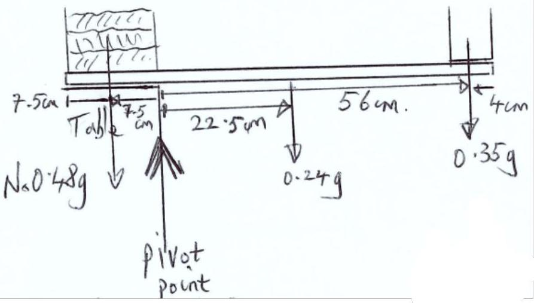
Figure 6: 2.b.i

(1 mark)
Taking moments about the pivot point:

$$
\begin{gathered}
N \times 0.48 g \times 7.5 = 0.24 g \times 22.5 + 0.35 g \times 56 \\
N = 6.94 \\
N = 7 \text { Books }
\end{gathered}
$$

(1 mark)
(b) i) Total: 2 marks

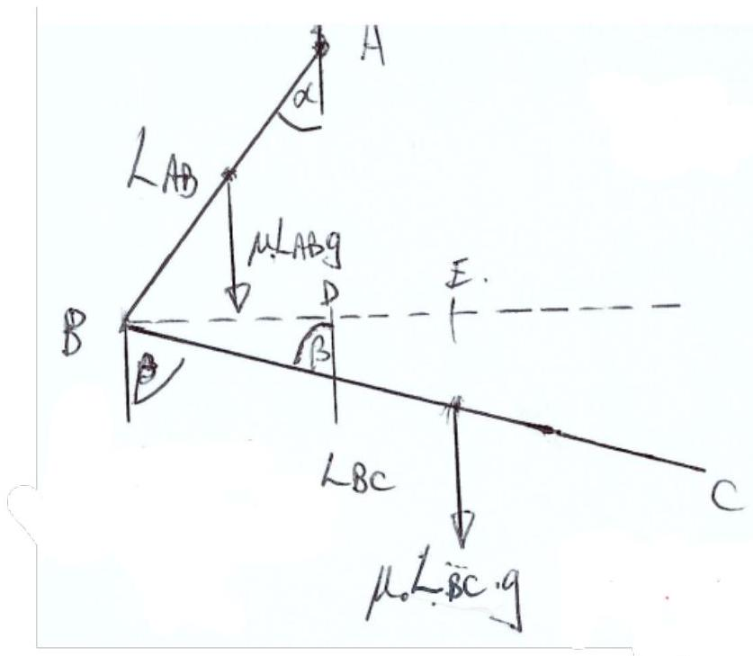
Figure 7: 2.b.ii

b) ii)
(1 mark)
First the distances $B D = L _ { \mathrm { AB } } \sin \alpha$ and $D E = \frac { L _ { \mathrm { BC } } } { 2 } \sin \beta - L _ { \mathrm { AB } } \sin \alpha$.
(1 mark)

$$
\begin{gathered}
\mu L _ { \mathrm { AB } } g L _ { \mathrm { AB } } \sin \alpha \\
= \mu L _ { \mathrm { BC } } g \left( \frac { L _ { \mathrm { BC } } } { 2 } \sin \beta - L _ { \mathrm { AB } } \sin \alpha \right) \\
\frac { L _ { \mathrm { AB } } ^ { 2 } } { 2 } \sin \alpha = \frac { L _ { \mathrm { BC } } ^ { 2 } } { 2 } \sin \beta - L _ { \mathrm { AB } } L _ { \mathrm { BC } } \sin \alpha
\end{gathered}
$$

Let $x = L _ { \mathrm { AB } } / L _ { \mathrm { BC } }$ and $a = \sin \beta / \sin \alpha$ :
$x ^ { 2 } + 2 x - a = 0$

$$
x = \sqrt { 1 + a } - 1
$$

(1 mark)
(b) ii) Total: 3 marks
b) iii) Using Archimedes Principle with $d$ as the submerged distance:

$$
\begin{aligned}
L A \rho _ { w } g & = d A \rho _ { l } g , \text { so } L \rho _ { w } = d \rho _ { l } \\
\frac { L } { 2 } & - \frac { d } { 2 } = \frac { L } { 2 } - \frac { 1 } { 2 } \frac { L \rho _ { w } } { \rho _ { l } } \\
& = \frac { L } { 2 } \left( 1 - \frac { \rho _ { w } } { \rho _ { l } } \right)
\end{aligned}
$$

(1 mark)
(b) iii) Total: 1 mark
b) iv) First calculate the centre of mass:

$$
\begin{gathered}
0.4 x _ { 1 } = 0.9 x _ { 2 } \\
x _ { 1 } + x _ { 2 } = 0.3 \mathrm {~m} \\
0.4 \left( 0.3 - x _ { 2 } \right) = 0.9 x _ { 2 } \\
\left( 0.4 \left( 0.3 - x _ { 2 } \right) = 0.9 x _ { 2 } \right. \\
x _ { 1 } = 0.218 \mathrm {~m} \text { and } x _ { 2 } = 0.092 \mathrm {~m}
\end{gathered}
$$

(1 mark)
Now to calculate the rotational kinetic energy:

$$
\begin{gathered}
R E = \frac { 1 } { 2 } m _ { 1 } \left( x _ { 1 } \omega \right) ^ { 2 } + \frac { 1 } { 2 } \left( x _ { 2 } \omega \right) ^ { 2 } \\
\frac { 1 } { 2 } \times 16 \pi ^ { 2 } \left( 0.4 \times 0.21 ^ { 2 } + 0.9 \times 0.092 ^ { 2 } \right) \\
= 31.5 \mathrm {~J}
\end{gathered}
$$

(1 mark)
Therefore we get a translational energy of $K E = 110 - 31.5 = 78.5 \mathrm {~J}$, so $m g h = 78.5 = 1.3 \times 9.81 \times h$. Therefore $h = 6.16 \mathrm {~m}$.

$$
\begin{gathered}
\text { Using } s = \frac { 1 } { 2 } g t ^ { 2 } , t _ { \text {flight } } = 2 \sqrt { \frac { 2 h } { g } } \\
\therefore t _ { \text {flight } } = 2.24 \mathrm {~s}
\end{gathered}
$$

(1 mark)

$$
\begin{gathered}
\text { Hence, } N = 8 \times t _ { \text {flight } } = 17.9 \\
N \approx 18 \text { rotations }
\end{gathered}
$$

(1 mark)
(b) iv) Total: 4 marks
c) i) Diagram with measurements and centre of mass line that does not change direction (straight line).
(2 mark)
Either use one mass, using $K E \propto v ^ { 2 }$, and the fact that each section takes up the same amount of time, so we can use perpendicular distance travelled instead of perpendicular velocity:

$$
\frac { 3.9 ^ { 2 } - 1.4 ^ { 2 } } { 3.9 ^ { 2 } } = 87 \% \text { loss }
$$

OR use both masses:

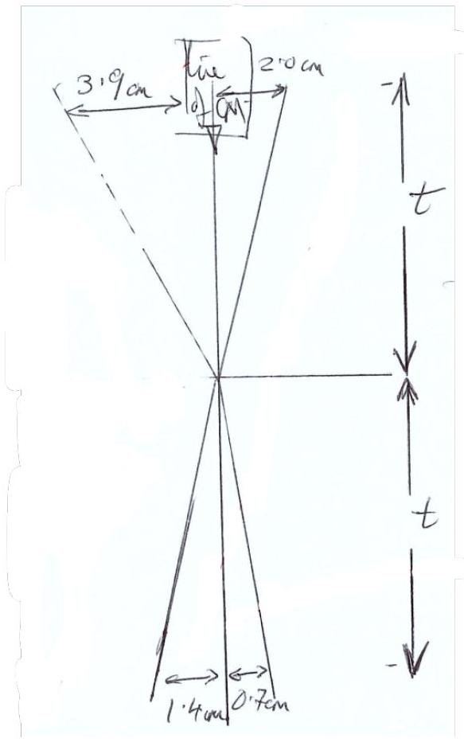
Figure 8: 2.c.i

$$
\begin{gathered}
\frac { 3.9 ^ { 2 } + 2 \times 2.0 ^ { 2 } - 1.4 ^ { 2 } - 2 \times 0.7 ^ { 2 } } { 3.9 ^ { 2 } + 2 \times 1.4 ^ { 2 } .0 } \\
= 87 \% \text { loss } .
\end{gathered}
$$

Any loss > 80\% gets the mark.
(1 mark)
(c) i) Total: 3 marks
d) i) The centre of mass is $a / 2$ below the pulley initially.
(1 mark)
After it falls, the centre of mass is $a$ below the pulley.

Loss of GPE: $m g ( a - a / 2 ) = \frac { m g a } { 2 }$
KE gain: $\frac { 1 } { 2 } m v ^ { 2 } = \frac { m g a } { 2 }$

$$
v = \sqrt { \frac { g a } { 2 } }
$$

(2 marks)
(d) i) Total: 3 marks
d) ii) Using Pythagoras, $L ^ { 2 } = L _ { 2 } ^ { 2 } - \left( \frac { L _ { 1 } } { 2 } \right) ^ { 2 }$, which gives the length of the pendulum.

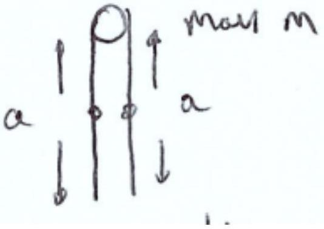
Figure 9: 2.d.i

(1 mark)
At higher temperatures we want the length $L$ to remain constant, so:

$$
\begin{equation*}
L ^ { 2 } = \left[ L _ { 2 } ( 1 + \beta \Delta T ) \right] ^ { 2 } - \frac { 1 } { 4 } \left[ L _ { 1 } ( 1 + \alpha \Delta T ) \right] ^ { 2 } \tag{1mark}
\end{equation*}
$$

Now expand to $O ( \Delta T )$ and equate to the initial length:

$$
\begin{gathered}
L _ { 2 } ^ { 2 } - \frac { L _ { 1 } ^ { 2 } } { 4 } = L _ { 2 } ^ { 2 } [ 1 + 2 \beta \Delta T ] - \frac { L _ { 1 } ^ { 2 } } { 4 } [ 1 + \alpha \Delta T ] \\
L _ { 2 } ^ { 2 } \beta \Delta T = \frac { L _ { 1 } ^ { 2 } } { 4 } \alpha \Delta T \\
\frac { L _ { 2 } } { L _ { 1 } } = \frac { 1 } { 2 } \sqrt { \frac { \alpha } { \beta } }
\end{gathered}
$$

(1 mark)
(d) ii) Total: 3 marks
d) iii) i) Taking moments about A and resolving the forces vertically:

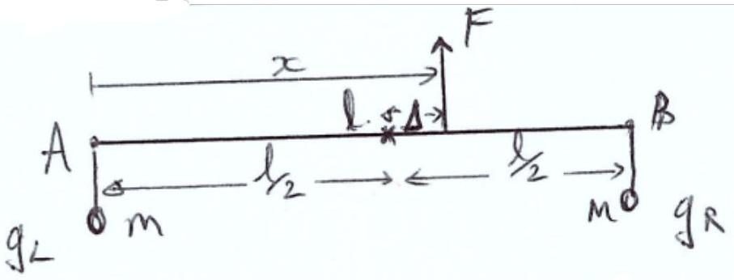
Figure 10: 2.d.iii

Moments: $F x = m g _ { R } l$
Forces: $F = m g _ { L } + m g _ { R }$
(1 mark)

$$
\begin{gathered}
\left( m g _ { R } + m g _ { L } \right) x = m g _ { R } l \\
x = \frac { g _ { R } } { g _ { R } + g _ { L } } l = \frac { 1.1 } { 2.1 } l \\
\Delta = \frac { 1.1 } { 2.1 } l - \frac { 1 } { 2 } l = \frac { l } { 42 } = 0.024 l
\end{gathered}
$$

(1 mark)
(d) iii) i) Total: 2 marks
d) iii) ii)

$$
g ( x ) = g _ { L } + \frac { g _ { R } - g _ { L } } { l } x = \frac { g } { 10 } \left( \frac { x } { l } + 10 \right)
$$

(1 mark)
Moments about A: $m g ^ { \prime } x + m g _ { R } l = \frac { l } { 2 } \left( m g _ { L } + m g ^ { \prime } + m g _ { R } \right)$

$$
\frac { g ^ { \prime } } { g } x + 1.1 l = 0.5 l \left( 1 + \frac { g ^ { \prime } } { g } + 1.1 \right)
$$

Substituting $\frac { g ^ { \prime } } { g } = 0.1 \frac { x } { l } + 1.1$

$$
0.1 \left( \frac { x } { l } \right) ^ { 2 } + \frac { x } { l } + 1.1 = 1.05 + 0.05 \frac { x } { l } + 0.5
$$

(1 mark)
Let $\delta = \frac { x } { l }$ :

$$
\begin{gathered}
\delta ^ { 2 } + 10 \delta + 11 = 10.5 + 0.5 \delta + 5 \\
\delta ^ { 2 } + 9.5 \delta - 4.5 = 0 \\
\delta = 0.452 \\
x = 0.452 l
\end{gathered}
$$

(1 mark)
(d) iii) i) Total: 3 marks
Question 2 Total: 25

### 2.2 Question 3

a) i) Path difference $= 2 a \sin \theta$
(1 mark)
a) ii)

$$
\begin{gathered}
n \lambda = 2 a \sin \theta \\
\lambda = \frac { 2 a } { n } \sin \theta
\end{gathered}
$$

(1 mark)

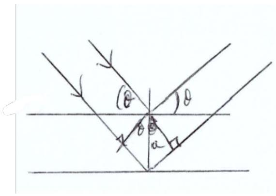
Figure 11: 3.a.i

a) iii)
$$
\begin{aligned}
& \lambda = 2 \times 0.31 \times 10 ^ { - 9 } \times \sin 15 ^ { \circ } \\
= & 1.605 \times 10 ^ { - 10 } \mathrm {~m} = 1.6 \times 10 ^ { - 10 } \mathrm {~m}
\end{aligned}
$$
(1 mark)
a)iv)

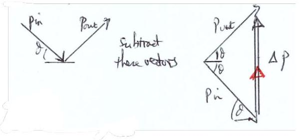
Figure 12: 3.a.iv

$$
\begin{gathered}
p = \frac { h } { \lambda } = 4.1 \times 10 ^ { - 22 } \mathrm { kgms } ^ { - 1 } \\
\Delta p = 2 p \sin \theta = 2.1 \times 10 ^ { - 22 } \mathrm { kgms } ^ { - 1 }
\end{gathered}
$$

The direction of the change in momentum must be included on the diagram.
(1 mark)
(a) Total: 5 marks
b) Diagram with $h , \theta$ and $x$ labelled:
(1 mark)
$$
\begin{gathered}
\tan 2 \theta = \frac { h } { x } = \frac { \sin 2 \theta } { \cos 2 \theta } = \frac { 2 \sin \theta \cos \theta } { 1 - 2 \sin ^ { 2 } \theta } \\
\frac { x } { h } = \frac { 1 } { \sqrt { 1 - s ^ { 2 } } } \left( \frac { 1 } { 2 s } - s \right)
\end{gathered}
$$
Using the substitution $s = \sin \theta = \frac { \lambda } { 2 a }$, for $n = 1$ :

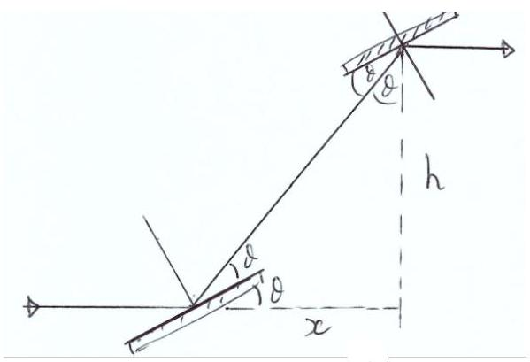
Figure 13: 3.b

$$
\frac { x } { h } = \frac { \lambda } { 2 a } \frac { \frac { 2 a ^ { 2 } } { \lambda ^ { 2 } } - 1 } { \sqrt { 1 - \frac { \lambda ^ { 2 } } { 4 a ^ { 2 } } } }
$$

Neglecting terms $O \left( \frac { \lambda ^ { 2 } } { a ^ { 2 } } \right)$, we get $\frac { x } { h } \approx \frac { \lambda } { 2 a }$
(2 marks)
(b) Total: 3 marks

c) i)
    - Radial lines
    - Arrows pointing outwards

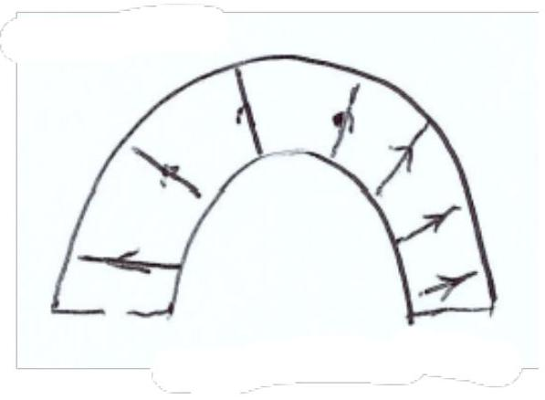
Figure 14: 3.c.i

(1 mark)
c) ii) For a radial field between two hemispheres, $V _ { \text {in } } = k \frac { Q _ { \text {in } } } { R _ { \text {in } } }$. There is the same charge on both hemispheres, so $\Delta V = k Q \left( \frac { 1 } { R _ { \text {in } } } - \frac { 1 } { R _ { \text {out } } } \right)$.
(1 mark)

c) iii) At $R = 0.5 \left( R _ { 1 } + R _ { 2 } \right)$ :
$$
\begin{equation*}
E = \frac { 4 k Q } { \left( R _ { \text {in } } + R _ { \text {out } } \right) ^ { 2 } } \tag{1mark}
\end{equation*}
$$
Now eliminating $k Q$ :
$$
\Delta V = \frac { E } { 4 } \left( R _ { \text {in } } + R _ { \text {out } } \right) ^ { 2 } \left[ \frac { 1 } { R _ { \text {in } } } - \frac { 1 } { R _ { \text {out } } } \right]
$$
The centripetal force gives us:
$$
\begin{gathered}
e E = \frac { 2 m v ^ { 2 } } { \left( R _ { \text {in } } + R _ { \text {out } } \right) } \\
\text { and } \\
E _ { 0 } = \frac { m v ^ { 2 } } { 2 } = \frac { e E \left( R _ { \text {in } } + R _ { \text {out } } \right) } { 4 }
\end{gathered}
$$
(2 marks)

Hence:

$$
\begin{gathered}
\Delta V = \frac { E _ { 0 } } { e } \left( R _ { \mathrm { in } } + R _ { \mathrm { out } } \right) \left[ \frac { 1 } { R _ { \mathrm { in } } } - \frac { 1 } { R _ { \mathrm { out } } } \right] \\
\left. = \frac { E _ { 0 } } { e } \left( R _ { \mathrm { in } } + R _ { \mathrm { out } } \right) \frac { \left( R _ { \mathrm { out } } - R _ { \mathrm { in } } \right) } { R _ { \mathrm { in } } R _ { \mathrm { out } } } \right] \\
= \frac { E _ { 0 } } { e } \frac { R _ { \mathrm { out } } - R _ { \mathrm { in } } ^ { 2 } } { R _ { \mathrm { in } } R _ { \mathrm { out } } } \\
= \frac { E _ { 0 } } { e } \left[ \frac { R _ { \mathrm { out } } } { R _ { \mathrm { in } } } - \frac { R _ { \mathrm { in } } } { R _ { \mathrm { out } } } \right]
\end{gathered}
$$

Any of the expressions gets the mark.
(1 mark)
c) iv) Substituting in $R _ { \text {out } } - R _ { \text {in } } = 10 \mathrm {~mm} , R _ { \text {out } } + R _ { \text {in } } = 100 \mathrm {~mm}$ and $E _ { 0 } = 5 \mathrm { eV }$, we get $\Delta V = 2.02 \mathrm {~V}$. (Allow 1.01V for ecf)
(1 mark)
(c) Total: 7 marks
d) i) Photon energy is 13.6eV .
(1 mark)
(1 mark)
d) ii)

$$
\begin{gathered}
E = h f = \frac { h c } { \lambda } \\
\lambda = \frac { 6.63 \times 10 ^ { - 34 } \times 3 \times 10 ^ { 8 } } { 13.6 \times 1.6 \times 10 ^ { - 19 } } = 91.4 \mathrm {~nm}
\end{gathered}
$$

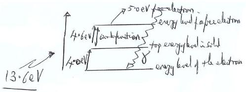
Figure 15: 3.d.ii

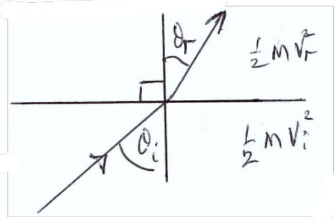
This is a UV (X-Ray allowed) wavelength.
(1 mark)
d) iii)

$$
\begin{aligned}
& n = \frac { v _ { i } } { v _ { r } } = \sqrt { \frac { K E _ { i } } { K E _ { r } } } \\
& n = \sqrt { \frac { 8.6 } { 5.0 } } = 1.3
\end{aligned}
$$

(2 marks)
(d) Total: 5 marks
e) The path in air is $l$, so the optical path is $\mu l$, so the extra length introduced compared tp air is $l ( \mu - 1 )$. For a change from destructive to constructive interference we need a path difference change of $\lambda / 2$ :

$$
\begin{gathered}
\mu - 1 = \frac { \lambda } { 2 l } \\
\mu = \frac { \lambda } { 2 l } + 1 \\
1 + 0.00029 \frac { P } { 10 ^ { 5 } } = \frac { 640 \times 10 ^ { - 9 } } { 2 \times 0.08 } + 1 \\
P = 1.4 \times 10 ^ { - 3 } \mathrm {~W}
\end{gathered}
$$

(2 marks)
(e) Total: 2 marks
f) i)

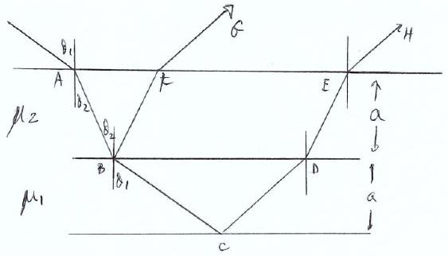
Figure 16: 3.f.i

$$
\begin{aligned}
& \qquad \cos \theta _ { 1 } = \frac { a } { B C } \\
& \text { Path length BCD } = \frac { 2 a } { \cos \theta _ { 1 } } \\
& \text { OR } \\
& \text { ical Path length BCD } = \frac { 2 \mu _ { 1 } a } { \cos \theta _ { 1 } }
\end{aligned}
$$

(1 mark)
f) ii) Layer 2 introduces no extra path different. At the top, the optival parth difference is $\mu _ { 1 } F E \sin \theta _ { 1 }$ :

$$
\begin{gathered}
F E = B D \\
B D = 2 a \tan \theta _ { 1 } \therefore \text { the top layer optical p.d. is } 2 \mu _ { 1 } a \tan \theta _ { 1 } \sin \theta _ { 1 }
\end{gathered}
$$

(1 mark)
Finally, the optical path difference between G and H is:

$$
\begin{gathered}
\frac { \mu _ { 1 } 2 a } { \cos \theta _ { 1 } } - 2 \mu _ { 1 } a \tan \theta _ { 1 } \sin \theta _ { 1 } \\
= 2 a \mu _ { 1 } \left( \frac { 1 } { \cos \theta _ { 1 } } - \frac { \sin ^ { 2 } \theta _ { 1 } } { \cos \theta _ { 1 } } \right) \\
= 2 a \mu _ { 1 } \cos \theta _ { 1 }
\end{gathered}
$$

(1 marks)
(f) Total: 3 marks Question 3 Total: 25

### 2.3 Question 4

a) i) Energy given to $\mathrm { Xe } - 131 = 1800 \mathrm { eV } = 2.88 \times { } ^ { 16 } \mathrm {~J}$.
Mass of Xe-131: $m _ { \text {ion } } = 131 \times 1.67 \times 10 ^ { - 27 } = 2.19 \times 10 ^ { 25 } \mathrm {~kg}$
(Either for first mark)

$$
\begin{gathered}
v _ { \text {ion } } = \sqrt { \frac { 2 K E } { m _ { \text {ion } } } } \\
v = 51.3 \mathrm { kms } ^ { - 1 }
\end{gathered}
$$

(1 mark)

a) ii) Rate of mass loss: $\frac { \Delta m } { \Delta t } = \frac { I m _ { \text {ion } } } { e } = 4.81 \times 10 ^ { - 6 } \mathrm { kgs } ^ { - 1 }$ (1 mark)

Thrust: $F = \frac { \Delta p } { \Delta t } = \frac { \Delta m } { \Delta t } v _ { \text {ion } } = 0.247 \mathrm {~N}$. (1 mark)
a) iii) Average acceleration: $a = \frac { F } { m _ { \text {probe } } } = 0.247 / 600 = 4.12 \times 10 ^ { - 4 } \mathrm {~ms} ^ { - } 2$ (1 mark)

Final speed: $v = a t = 10.9 \mathrm { kms } ^ { - 1 }$ (1 mark)
(a) Total: 6 marks
b)i)

$$
T = 11 \mathrm {~h} 55 \mathrm {~min} = 11.92 \mathrm {~h} = 42900 \mathrm {~s}
$$

Using Keplers 3rd Law: $M _ { \text {sys } } = \frac { 4 \pi ^ { 2 } r ^ { 3 } } { G T ^ { 2 } } = 5.56 \times 10 ^ { 11 } \mathrm {~kg}$ (1 mark)
b) ii) Assuming the same density:

$$
\begin{aligned}
& M _ { \text {Dimo } } = \left( \frac { 164 } { 780 } \right) ^ { 3 } \times M _ { \text {sys } } = 5.15 \times 10 ^ { 9 } \mathrm {~kg} \\
& M _ { \text {Didy } } = M _ { \text {sys } } - M _ { \text {Dimo } } = 5.51 \times 10 ^ { 11 } \mathrm {~kg}
\end{aligned}
$$

(2 marks)
(b) Total: 3 marks
c) i) Before the collision we are in the rest frame of Dimorphos, so $p _ { \text {Dimo,orig } } = 0 . p _ { \text {probe } } =$ $570 \times 6140 = 3.5 \times 10 ^ { 6 } \mathrm { kgms } ^ { - 1 }$ (1 mark)

Conserving momentum after the collision, $p _ { \text {Dimo, new } } = 3.5 \times 10 ^ { 6 } \mathrm { kgms } ^ { - 1 }$ (1 mark)

$$
\begin{equation*}
\Delta v = v _ { \text {new } } = \frac { p _ { \text {Dimo, new } } } { M _ { \text {Dimo } } } = 0.680 \mathrm { mms } ^ { - 1 } \tag{1mark}
\end{equation*}
$$

c) ii) Assuming a circular orbit:

$$
\begin{equation*}
E _ { \mathrm { tot } } = G P E + K E = - \frac { G M _ { \mathrm { Dimo } } M _ { \mathrm { Didy } } } { 2 r } \tag{1mark}
\end{equation*}
$$

Before the collision:

$$
\begin{equation*}
v _ { \text {orig } } = \sqrt { \frac { G M _ { \text {Didy } } } { r } } = 0.174938 \mathrm {~ms} ^ { - 1 } \tag{1mark}
\end{equation*}
$$

After the collision:

$$
v _ { \text {new } } = v _ { \text {orig } } - \Delta v = 0.174258 \mathrm {~ms} ^ { - 1 }
$$

$$
\begin{gather*}
E _ { \text {tot } , \text { new } } = - \frac { G M _ { \text {Dimo } } M _ { \text {Didy } } } { r } + \frac { 1 } { 2 } M _ { \text {Dimo } } v _ { \text {new } } ^ { 2 }  \tag{1mark}\\
= - 7.94 \times 10 ^ { 7 } \mathrm {~J}
\end{gather*}
$$

$$
\begin{align*}
r _ { \mathrm { new } } & = - \frac { G M _ { \mathrm { Dimo } } M _ { \mathrm { Didy } } } { 2 E _ { \mathrm { tot } , \mathrm { new } } }  \tag{1mark}\\
& = 1190.8 \mathrm {~m} \tag{1mark}
\end{align*}
$$

$$
\therefore \Delta r = 1200 - 1190.8 = 9.2 \mathrm {~m}
$$

$$
\begin{gather*}
T _ { \mathrm { new } } = \sqrt { \frac { 4 \pi ^ { 2 } r _ { \mathrm { new } } ^ { 3 } } { G M _ { \mathrm { sys } } } } = 42405 \mathrm {~s}  \tag{1mark}\\
\therefore \Delta T = 495 \mathrm {~s} = 8.24 \mathrm {~min}
\end{gather*}
$$

(1 mark)
(c) Total: 10 marks
d)

$$
\begin{gather*}
T _ { \text {real } } = 42900 - 32 \times 60 = 40980 \mathrm {~s} \\
r _ { \text {real } } = \sqrt [ 3 ] { \frac { G M _ { \text {sys } } T _ { \text {real } } ^ { 2 } } { 4 \pi ^ { 2 } } } = 1163.9 \mathrm {~m} \tag{1mark}
\end{gather*}
$$

$$
E _ { \text {tot,real } } = - \frac { G M _ { \text {Dimo } } M _ { \text {Didy } } } { 2 r _ { \text {real } } } = - 8.13 \times 10 ^ { 7 } \mathrm {~J}
$$

$$
\begin{equation*}
K E _ { \text {real } } = E _ { \text {tot,real } } + \frac { G M _ { \text {Dimo } } M _ { \text {Didy } } } { 2 r } = 7.63 \times 10 ^ { 7 } \mathrm {~J} \tag{1mark}
\end{equation*}
$$

$$
\begin{equation*}
v _ { \text {real } } = \sqrt { \frac { 2 K E _ { \text {real } } } { M _ { \text {Dimo } } } } = 0.172205 \mathrm {~ms} ^ { - 1 } \tag{1mark}
\end{equation*}
$$

(1 mark)

$$
\therefore \Delta v _ { \text {real } } = v _ { \text {orig } } - v _ { \text {real } } = 2.733 \mathrm { mms } ^ { - 1 }
$$

$$
\begin{equation*}
\beta = \frac { \Delta v _ { \text {real } } } { \Delta v } = 4.02 \tag{1mark}
\end{equation*}
$$

(Using $M _ { \text {Didy } }$ instead of $M _ { \text {sys } }$ in the first step leads to $\beta = 4.44$ )
(1 mark)
(d) Total: 6 marks Question 4 Total: 25 marks

### 2.4 Question 5

a) i)
$$
\begin{gather*}
\lambda _ { \text {peak } } \propto \frac { 1 } { T } \\
\therefore T _ { \text {sun } } \lambda _ { \text {sun } } = T _ { \text {star } } \lambda _ { \text {star } } \\
\therefore \lambda _ { \text {star } } = \frac { 5780 \times 500 } { 35800 } = 80.7 \mathrm {~nm} \tag{1mark}
\end{gather*}
$$
$$
\begin{gathered}
E _ { \gamma } = \frac { h c } { \lambda } = 2.46 \times 10 ^ { - 18 } \mathrm {~J} = 15.84 \mathrm { eV } \\
E _ { \gamma } > 13.6 \mathrm { eV }
\end{gathered}
$$
Therefore the radiation is ionising.
(1 mark)
a) ii)
$$
\begin{equation*}
N = \frac { L } { E _ { \gamma } } = \frac { 1.47 \times 10 ^ { 5 } \times 3.85 \times 10 ^ { 26 } } { 2.46 \times 10 ^ { - 18 } } = 2.30 \times 10 ^ { 49 } \text { photon } \mathrm { s } ^ { - 1 } \tag{1mark}
\end{equation*}
$$
$$
\begin{gathered}
r _ { s } = \left( \frac { 3 N } { 4 \pi \alpha } \right) ^ { \frac { 1 } { 3 } } n _ { H } ^ { - \frac { 2 } { 3 } } \\
r _ { s } = 2.61 \times 10 ^ { 16 } \mathrm {~m} = 2.8 \mathrm { ly } \text { (Must be in ly) }
\end{gathered}
$$
(1 mark)

Either one of two stars accepted
(The diameter of the one in the centre would eventually photoevapourate the whole column, although if they are at the ends then you might need two)
(1 mark)
(a) Total: 5 marks

b)
$$
p _ { \mathrm { rad } } = \frac { L } { 4 \pi r ^ { 2 } c } = \frac { 1.47 \times 10 ^ { 5 } \times 3.85 \times 10 ^ { 2 } 6 } { 4 \pi \times \left( 2.61 \times 10 ^ { 16 } \right) ^ { 2 } \times 3 \times 10 ^ { 8 } } = 2.21 \times 10 ^ { - 11 } \mathrm {~Pa}
$$

(1 mark)

$$
\begin{gathered}
M _ { \text {collapse } } = \frac { 1.81 k _ { \mathrm { B } } ^ { 2 } T _ { \text {neb } } ^ { 2 } } { p _ { 0 } ^ { \frac { 1 } { 2 } } G ^ { \frac { 3 } { 2 } } m _ { \mathrm { H } } ^ { 2 } } \\
= \frac { 1.18 \times \left( 1.38 \times 10 ^ { - 23 } \right) ^ { 2 } \times 50 ^ { 2 } } { \left( 2.21 \times 10 ^ { - 11 } \right) ^ { \frac { 1 } { 2 } } \times \left( 6.67 \times 10 ^ { - 11 } \right) ^ { \frac { 3 } { 2 } } \times \left( 1.67 \times 10 ^ { - 27 } \right) ^ { 2 } } \\
= 7.86 \times 10 ^ { 31 } \mathrm {~kg} = 40 M _ { \text {sun } }
\end{gathered}
$$

(1 mark)
(b) Total: 2 marks
c) i)

$$
\begin{gathered}
\frac { \bar { m } } { m _ { \mathrm { H } } } = \frac { 2 } { 1 + 3 X + 0.5 Y } = \frac { 2 } { 1 + 3 \times 0.35 + 0.5 \times 0.65 } = 0.84 \\
\therefore \bar { m } = 0.84 m _ { \mathrm { H } } = 1.41 \times 10 ^ { - 27 } \mathrm {~kg}
\end{gathered}
$$

(1 mark)

$$
p _ { \text {gas } } = \frac { \rho _ { \mathrm { c } } k _ { \mathrm { B } } T _ { \mathrm { C } } } { \bar { m } } = \frac { 1.53 \times 10 ^ { 5 } \times 1.38 \times 10 ^ { - 23 } \times 1.57 \times 10 ^ { 7 } } { 1.41 \times 10 ^ { - 27 } } = 2.357 \times 10 ^ { 13 } \mathrm {~Pa}
$$

(1 mark)

$$
p _ { \mathrm { rad } } = \frac { 4 \sigma } { 3 c } T _ { \mathrm { c } } ^ { 4 } = \frac { 4 \times 5.67 \times 10 ^ { - 8 } } { 3 \times 3 \times 10 ^ { 8 } } \times \left( 1.57 \times 10 ^ { 7 } \right) ^ { 4 } = 1.531 \times 10 ^ { 13 } \mathrm {~Pa}
$$

(1 mark)

$$
\therefore p _ { \mathrm { tot } } = p _ { \mathrm { gas } } + p _ { \mathrm { rad } } = 2.359 \times 10 ^ { 16 } \mathrm {~Pa}
$$

(1 mark)
c) ii) $p _ { \text {rad } } / p _ { \text {tot } } = 0.065 \%$
(1 mark)
Radiation pressure is an insignificant contribution to the outward pressure in a star.
(1 mark)
(In most massive stars where the temperature and density are much higher then radiation pressure is very important and ultimately becomes strong enough to prevent stars above a certain mass limit from forming)
c) iii)

$$
\begin{aligned}
& \text { For a constant density } \rho ( r ) = \rho \text { and } M ( r ) = \frac { 4 } { 3 } \pi r ^ { 3 } \rho \text { : } \\
& \therefore p _ { \text {grav } } = \int _ { 0 } ^ { R _ { \text {star } } } d r \frac { G M ( r ) \rho ( r ) } { r ^ { 2 } } = \int _ { 0 } ^ { R _ { \text {star } } } d r \frac { G \times f r a c 43 \pi r ^ { 3 } \rho ^ { 2 } } { r ^ { 2 } } \\
& = \int _ { 0 } ^ { R _ { \text {star } } } d r \frac { 4 } { 3 } G \pi r \rho ^ { 2 } = \frac { 2 } { 3 } \pi G \rho ^ { 2 } R _ { \text {star } } ^ { 2 }
\end{aligned}
$$

(1 mark)
For the white dwarf:

$$
\begin{gathered}
\rho _ { \mathrm { av } } = \frac { M _ { \text {sun } } } { \frac { 4 } { 3 } \pi R _ { \text {Earth } } ^ { 3 } } = \frac { 3 \times 1.99 \times 10 ^ { 30 } } { 4 \pi \times \left( 6.37 \times 10 ^ { 6 } \right) ^ { 3 } } = 1.84 \times 10 ^ { 9 } \mathrm { kgm } ^ { - 3 } \\
p _ { \text {grav } } = \frac { 2 \pi } { 3 } \times 6.67 \times 10 ^ { - 11 } \times \left( 1.84 \times 10 ^ { 9 } \right) ^ { 2 } \times \left( 6.37 \times 10 ^ { 6 } \right) ^ { 2 } = 1.19 \times 10 ^ { 22 } \mathrm {~Pa}
\end{gathered}
$$

(1 mark)
This is $812000 p _ { \text {tot } }$. (Allow $\approx 10 ^ { 6 } p _ { \text {tot } }$ ).
(1 mark)
(This huge gravitational pressure is balanced by an outward electron degeneracy pressure (a quantum mechanical effect) to keep the white dwarf stable.)
(c) Total: 10 marks
d) i)

$$
\begin{gathered}
E _ { \mathrm { tot } } = V \times \frac { 4 \sigma } { c } T _ { \operatorname { mean } } ^ { 4 } = \frac { 4 } { 3 } \pi R _ { \mathrm { sun } } ^ { 3 } \times \frac { 4 \sigma } { c } T _ { \operatorname { mean } } ^ { 4 } \\
= \frac { 4 } { 3 } \pi \times \left( 6.96 \times 10 ^ { 8 } \right) ^ { 3 } \times \frac { 4 \times 5.6 \times 10 ^ { - 8 } } { 3 \times 10 ^ { 8 } } \times \left( 4.73 \times 10 ^ { 6 } \right) ^ { 4 } = 5.34 \times 10 ^ { 38 } \mathrm {~J}
\end{gathered}
$$

(1 mark)

$$
\begin{gathered}
t = \frac { E _ { \mathrm { tot } } } { L _ { \mathrm { sun } } } = \frac { 5.34 \times 10 ^ { 38 } } { 3.85 \times 10 ^ { 25 } } = 1.39 \times 10 ^ { 12 } \mathrm {~s} \\
= 44000 \text { years (must be in years) }
\end{gathered}
$$

(1 mark)
d) ii) Assuming that the photon travels at c between absorption and emission:

$$
\begin{gathered}
t = N \times t _ { \text {step } } \text { and } t _ { \text {step } } = \frac { l } { c } \\
\therefore N = \frac { c t } { l } \\
\text { But } R _ { \text {Sun } } = l \sqrt { N } \\
\therefore R _ { \text {Sun } } ^ { 2 } = l ^ { 2 } N = l ^ { 2 } \frac { c t } { l } = l c t \\
\therefore l = \frac { R _ { \text {Stun } } ^ { 2 } } { c t } = \frac { \left( 6.96 \times 10 ^ { 8 } \right) ^ { 2 } } { 3 \times 10 ^ { 8 } \times 1.39 \times 10 ^ { 12 } } = 1.16 \mathrm {~mm}
\end{gathered}
$$

(1 mark)

$$
N = \frac { R _ { \text {Sun } } ^ { 2 } } { l ^ { 2 } } = \frac { \left( 6.96 \times 10 ^ { 8 } \right) ^ { 2 } } { \left( 1.16 \times 10 ^ { - 3 } \right) ^ { 2 } } = 3.58 \times 10 ^ { 23 }
$$

(1 mark)
(A more careful calculation by Mitalas \& Sills (1992) using a computer model that took into account the varying step length due to varying density found the diffusion time to be 170,000 years and the average step length to be 0.90 mm - not very far off these simple estimates.)
(d) Total: 4 marks
e) The nuclear fusion energy associated with each neutrino:

$$
E _ { \mathrm { v } } = 13.1 \times 10 ^ { 6 } \times 1.6 \times 10 ^ { - 19 } = 2.1 \times 10 ^ { - 12 } \mathrm {~J}
$$

Using the given solar luminosity, the number of reactions happening in the Sun every second is:

$$
\begin{equation*}
N _ { \text {react } } = \frac { 0.92 L _ { \text {Sun } } } { E _ { \mathrm { V } } } = \frac { 0.92 \times 3.85 \times 10 ^ { 26 } } { 2.1 \times 10 ^ { - 12 } } = 1.69 \times 10 ^ { 38 } \mathrm {~s} ^ { - 1 } \tag{1mark}
\end{equation*}
$$

Expected flux:

$$
\begin{equation*}
\Phi = \frac { N _ { \text {react } } } { 4 \pi r ^ { 2 } } = \frac { 1.69 \times 10 ^ { 38 } } { 4 \pi \times \left( 1.50 \times 10 ^ { 11 } \right) ^ { 2 } } = 5.98 \times 10 ^ { 14 } \mathrm {~m} ^ { - 2 } \mathrm {~s} ^ { - 1 } = 5.98 \times 10 ^ { 10 } \mathrm {~cm} ^ { - 2 } \mathrm {~s} ^ { - 1 } \tag{1mark}
\end{equation*}
$$

The expected flux is within the experimental uncertainty on the measured flux.
(1 mark)
This means the Sun has been in thermodynamic equilibrium over the last $10 ^ { 5 }$ years.
(1 mark)
(OR "the energy production rate has not measurably changed over the last 105 years" for final mark) (The measured flux in the Borexino experiment takes into account the neutrino oscillations between the three types of neutrino, otherwise the measured flux would be as low as a third of the expected one.)
(e) Total: 4 marks
Question 5 Total: 25

[^0]:    ${ } ^ { 1 }$ Using the depression distance of 1.8 cm
