## Qu 1.

a) Skier on a slope.
    - Diagram with forces
    ${ } ^ { F _ { r } }$
    - Resolve down the slope
- Resolve down the slope $m g \sin \theta - F _ { \mathrm { r } } = m a$ $a = \frac { 2 d } { t ^ { 2 } }$
    - Hence $F _ { \mathrm { r } } = m \left( g \sin \theta - \frac { 2 d } { t ^ { 2 } } \right)$
b) Car \& caravan.
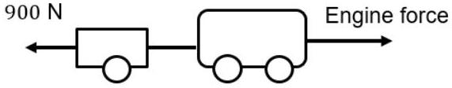
    - $m a =$ engine force - total drag
So, engine force $= m a + \mathrm { drag }$
$$
= 1800 \times 2 + 900
$$
engine force $= 4500 \mathrm {~N}$
    ✓
    - Tension in tow bar $= m a + 300 \mathrm {~N}$
$$
= 2 \times 600 + 300 = 1500 \mathrm {~N}
$$
    ✓
    - power $= F v = 4500 \mathrm {~N} \times 10 \mathrm {~m} \mathrm {~s} ^ { - 1 } = 45000 \mathrm {~W}$
(3 marks)
c) Helen \& Robert cycling.
    - 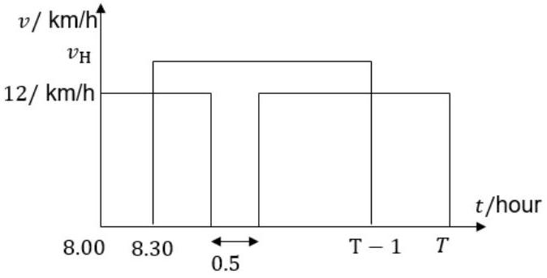
    - For Robert: $50 ( \mathrm {~km} ) = ( T - 0.5 ) \times 12 \left( \mathrm {~km} \mathrm {~h} ^ { - 1 } \right)$ ✓
$$
T = \frac { 56 } { 12 } \mathrm {~h}
$$
    - For Helen: $50 = ( T - 1.5 ) v _ { \mathrm { H } }$ ✓
$$
50 = ( 56 / 12 - 3 / 2 ) v _ { \mathrm { H } }
$$
    - Hence, $v _ { \mathrm { H } } = ( 50 \times 38 ) / 12 = 15.8 = 16 \mathrm {~km} \mathrm {~h} ^ { - 1 }$
✓ (3 marks)

d) Plank on wall.

- 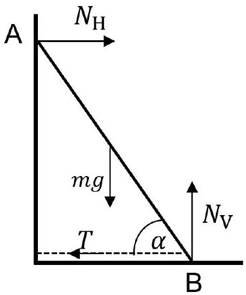
Any variations allowed.
- Take moments about A: $\quad m g \frac { \ell } { 2 } \cos \alpha + T \ell \sin \alpha - N _ { \mathrm { V } } \ell \cos \alpha = 0$ ✓
- Resolving vertically $m g = N _ { \mathrm { V } }$ ✓
- Hence $\quad \frac { m g } { 2 } \cos \alpha + T \sin \alpha = m g \cos \alpha$ $T \sin \alpha = \frac { m g } { 2 } \cos \alpha$
Therefore $T = \frac { m g } { 2 } \cot \alpha$
(3 marks)

e) Time \& ratios for a falling object.

The object fall for T seconds.
Using $s = \frac { 1 } { 2 } g t ^ { 2 }$, we have ( $\ell =$ last second, $p =$ penultimate second)

- $s _ { \ell } = \frac { 1 } { 2 } g T ^ { 2 } - \frac { 1 } { 2 } g ( T - 1 ) ^ { 2 }$
and $\quad s _ { p } = \frac { 1 } { 2 } g ( T - 1 ) ^ { 2 } - \frac { 1 } { 2 } g ( T - 2 ) ^ { 2 }$
So, $\quad \frac { s _ { \ell } } { s _ { p } } = \frac { T ^ { 2 } - ( T - 1 ) ^ { 2 } } { ( T - 1 ) ^ { 2 } - ( T - 2 ) ^ { 2 } }$
Hence $\quad \frac { s _ { \ell } } { s _ { p } } = \frac { \mathscr { Z } ^ { 2 } - \mathscr { Z } ^ { 2 } + 2 T - 1 } { \not \mathscr { Z } ^ { 2 } - 2 T + 1 - \mathscr { Z } ^ { 2 } + 4 T - 4 }$
So that $\quad \frac { 2 T - 1 } { 2 T - 3 } = \frac { 3 } { 2 }$
Giving $T = 7 / 2 = 3.5 \mathrm {~s}$ ✓
- $s = \frac { 1 } { 2 } 9.8 \times 3.5 ^ { 2 } = 60 \mathrm {~m} \quad$ (or even 61 m using $\mathrm { g } = 10$ ) ✓
- $v = a t = 9.8 \times 3.5 = 34.3 = 34 \mathrm {~m} \mathrm {~s} ^ { - 1 }$ ✓
(3 marks)

An alternative: distance fallen is average speed x time interval. Times increasing by 1s are $t _ { 2 } , t _ { 1 } , t _ { 0 } = T$
$s _ { p } = \frac { g t _ { 1 } + g t _ { 2 } } { 2 } \left( t _ { 1 } - t _ { 2 } \right)$
$s _ { \ell } = \frac { g t _ { 1 } + g t _ { 0 } } { 2 } \left( t _ { 0 } - t _ { 1 } \right)$
So $\frac { s _ { \ell } } { s _ { p } } = \frac { t _ { 1 } + t _ { 0 } } { t _ { 2 } + t _ { 1 } } = \frac { 3 } { 2 }$
Then $3 \left( t _ { 2 } + t _ { 1 } \right) = 2 \left( t _ { 1 } + t _ { 0 } \right)$
And using $\quad t _ { 0 } - t _ { 1 } = 1$ and $t _ { 1 } - t _ { 2 } = 1$ we obtain $t _ { 0 } = T = 3.5 \mathrm {~s}$ as above.

f) Two wires from a horizontal rod.
    - The weight is symmetrically supported by the two wires.
Resolving vertically, $2 T \cos \theta = m g$
Hence
$$
T = \frac { m g } { 2 \frac { \sqrt { 3 } } { 2 } } = \frac { m g } { \sqrt { 3 } }
$$

- When the wire is cut, we can resolve radially along AC.
$T _ { \mathrm { AC } } - m g \cos 30 ^ { \circ } = m a _ { r }$
But $\quad a _ { r } = \frac { v ^ { 2 } } { r } = 0$ at this initial moment.
Hence $\quad T _ { \mathrm { AC } } = m g \cos 30 ^ { \circ } = m g \frac { \sqrt { 3 } } { 2 }$ $\square$
- Thus $\frac { T _ { \mathrm { AC } } } { T } = \frac { m g \cos 30 } { m g / ( 2 \cos 30 ) } = 2 \cos ^ { 2 } 30 = m g \frac { \sqrt { 3 } } { 2 } \cdot \frac { \sqrt { 3 } } { m g } = \frac { 3 } { 2 }$ $\square$
(3 marks)
g) Long copper wire.
    - Since $R = \frac { \rho \ell } { A } \Rightarrow \ell = \frac { R A } { \rho }$
    - Density, $d$ is given by $d = \frac { m } { V } = \frac { m } { A \ell } \Rightarrow A = \frac { m } { \ell d }$ ✓
Hence
$$
\ell = \frac { R A } { \rho } = \frac { R m } { \rho \ell d }
$$

- So

$$
\ell ^ { 2 } = \frac { R m } { \rho d }
$$ $\square$

Therefore

$$
\begin{aligned}
\frac { \ell _ { 2 } ^ { 2 } } { \ell _ { 1 } ^ { 2 } } & = \frac { R _ { 2 } } { R _ { 1 } } \times \frac { m _ { 2 } } { m _ { 1 } } \\
& = \frac { 6000 } { 0.15 } \frac { 10 ^ { 3 } } { 10 ^ { - 3 } } = 4 \times 10 ^ { 10 } \\
\ell _ { 2 } & = 2.0 \times 10 ^ { 5 } \mathrm {~m}
\end{aligned}
$$

(3 marks)

h) The ray of light has to enter the glass and it follows a symmetric path.
    - It must enter with the smallest $\ell$ value and take the steepest path down to the bottom. This is when it enter at the top of the curve and the refracted angle in the glass is the critical angle. Mark for diagram or idea of critical angle. $\square$

- $\frac { \ell / 2 } { R } = \tan \theta _ { \text {critical } }$ $\square$
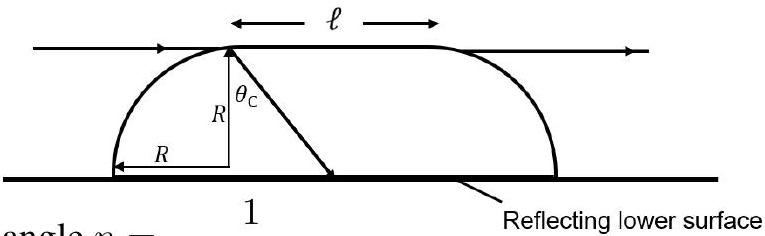
for the critical angle $n = \frac { 1 } { \sin \theta _ { \text {critical } } }$
So

$$
\frac { \ell / 2 } { R } = \frac { 1 } { n \cos \theta _ { \text {critical } } }
$$

And

$$
\cos \theta _ { \text {critical } } = \sqrt { 1 - \sin ^ { 2 } \theta } = \sqrt { 1 - 1 / n ^ { 2 } }
$$

Then

$$
\ell = \frac { 2 R } { \sqrt { n ^ { 2 } - 1 } } = \frac { 4 } { \sqrt { 1.46 ^ { 2 } - 1 } } = 3.5 ( 3 ) \mathrm { cm }
$$ $\square$

i) Beam of photons.
    - $F = \frac { \Delta p } { \Delta t } = \frac { 1 } { c } \frac { \Delta E } { \Delta t } = \frac { \text { Power } } { c }$
    - For reflection, there is a factor of 2 for 50\% of the power So net force $= \frac { 3 P } { 2 c } = \frac { 4 } { c } \times 2 + \frac { 4 } { c }$ $= \frac { 12 } { c } = \frac { 12 } { 3 \times 10 ^ { 8 } }$ $= 4 \times 10 ^ { - 8 } \mathrm {~N}$
- In time $\Delta t$ there are $N = n c \Delta t A$ photons in a cylinder of beam.
Then $n = \frac { N } { c A \Delta t } = \frac { P \times \Delta t / h f } { c A \Delta t }$
Giving $n = \frac { P } { h f c A } = \frac { P \lambda } { h c ^ { 2 } A } = \frac { 8 \times 600 \times 10 ^ { - 9 } } { 6.63 \times 10 ^ { - 34 } \times 9 \times 10 ^ { 16 } \times 0.0012 }$ $n = 6.7 \times 10 ^ { 13 } \mathrm {~m} ^ { - 3 }$
(4 marks)
j) neutron time of flight.
    - time of flight $= \frac { 11 } { 2200 } = 5 \times 10 ^ { - 3 } \mathrm {~s}$ Using $\quad N = N _ { 0 } \exp ( - \lambda t ) = N _ { 0 } \exp \left( - \ln 2 \cdot \frac { t } { t _ { \mathrm { hl } } } \right)$
    - With $\ln 2 . \frac { t } { t _ { \mathrm { hl } } } = \ln 2 \times \frac { 5 \times 10 ^ { - 3 } } { 880 } = 3.94 \times 10 ^ { - 6 }$ The exponent is small so an approximation is used, $e ^ { - x } \approx 1 - x$ So that for $N _ { \text {decays } } = N _ { 0 } - N = N _ { 0 } \left( 1 - \frac { N } { N _ { 0 } } \right)$ $= N _ { 0 } \left( 1 - e ^ { - \lambda . t } \right) \approx N _ { 0 } \lambda t = N _ { 0 } \ln 2 \frac { t } { t _ { \mathrm { hl } } }$ $= 10 ^ { 8 } \times 3.94 \times 10 ^ { - 6 } = 394 = 390 = 400$ neutrons. ✓
Lose a mark for missing $\ln 2$ factor, which results in 570 neutrons.

Alternatively
Since time of flight $\ll t _ { \mathrm { hl } }$

$$
d N = N \lambda d t = 10 ^ { 8 } \times 0.693 \times \frac { 5 \times 10 ^ { - 3 } } { 880 } = 390 \text { neutrons } \quad ( 3 \text { marks here } + 1 \text { for ToF } )
$$

(4 marks)

k) Road \& cylinder.
    -

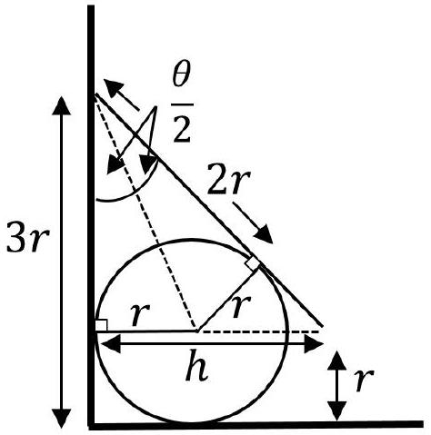

- $\tan \frac { \theta } { 2 } = \frac { r } { 2 r } = \frac { 1 } { 2 }$
so $\tan \theta = \frac { 2 . \frac { 1 } { 2 } } { 1 - \frac { 1 } { 4 } } = \frac { 4 } { 3 }$
- $\frac { h } { 2 r } = \tan \theta = \frac { 4 } { 3 } \quad \Rightarrow h = \frac { 8 r } { 3 }$
Then $\quad \ell ^ { 2 } = ( 2 r ) ^ { 2 } + h ^ { 2 } = 4 r ^ { 2 } + \frac { 64 } { 9 } r ^ { 2 } = \frac { 100 } { 9 } r ^ { 2 }$
So $\quad \ell = \frac { 10 } { 3 } r$
- The maximum amount of work is such that the tip of the rod is raised from $r$ to $2 r$.
The CM of the rod is raised by $\frac { 1 } { 2 } r$.
So the WD is $\frac { 1 } { 2 } m g r$
- $\cos \theta _ { 0 } = \frac { 2 r } { 10 r / 3 } = \frac { 3 } { 5 }$
$\cos \theta _ { \text {max } } = \frac { r } { 10 r / 3 } = \frac { 3 } { 10 }$
Hence $\quad \frac { \cos \theta _ { 0 } } { \cos \theta _ { \text {max } } } = 2$
(4 marks)
1) Mass on a sliding wedge..
- Diagram of forces
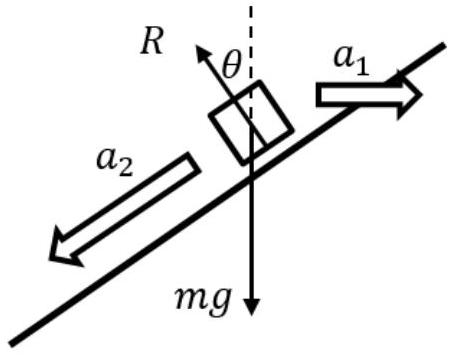
The block accelerates down the slope, whilst maintaining contact with the slope. So there are two components to its acceleration, $a _ { 2 }$ and $a _ { 1 }$. If we resolve perpendicular to the slope, we do not need to know $a _ { 2 }$.
- Wedge: resolve H
$$
R \sin \theta = M a _ { 1 }
$$
- particle: resolve ⟂ to slope
$$
m g \cos \theta - R = m a _ { 1 } \sin \theta
$$
- Writing
$$
R = \frac { M a _ { 1 } } { \sin \theta }
$$
Then,
$$
m g \cos \theta - \frac { M a _ { 1 } } { \sin \theta } = m a _ { 1 } \sin \theta
$$
Thus
$$
m g \cos \theta = a _ { 1 } \left( \frac { M } { \sin \theta } + m \sin \theta \right)
$$
Then
$$
m g \cos \theta \sin \theta = a _ { 1 } \left( M + m \sin ^ { 2 } \theta \right)
$$
So
$$
a _ { 1 } = \frac { \frac { 1 } { 2 } m g \sin 2 \theta } { \left( M + m \sin ^ { 2 } \theta \right) }
$$
For $\theta = 30 ^ { \circ }$
$$
a _ { 1 } = \frac { \frac { 1 } { 2 } m g \frac { \sqrt { 3 } } { 2 } } { \left( M + m \frac { 1 } { 4 } \right) } = \frac { \sqrt { 3 } m g } { ( 4 M + m ) }
$$
(4 marks)

m) Two ships.
    - Diagram
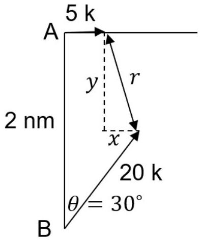
    - $y = 2 - 10 \sqrt { 3 } t \quad$ one mark for both the $x$ and $y$ equations here $x = t ( 5 - 10 ) = - 5 t$
    - $r ^ { 2 } = x ^ { 2 } + y ^ { 2 } = 25 t ^ { 2 } + 300 t ^ { 2 } + 4 - 40 \sqrt { 3 } t$ which is $\quad r ^ { 2 } = 325 t ^ { 2 } - 40 \sqrt { 3 } t + 4$
    - Either solve quadratic in $t : 325 t ^ { 2 } - 40 \sqrt { 3 } t + \left( 4 - r ^ { 2 } \right) = 0$ for zero discriminant, $40 ^ { 2 } .3 - 4.325 . \left( 4 - r ^ { 2 } \right) = 0$ which gives $r = \frac { 2 } { \sqrt { 13 } }$, or
    - OR differentiate w.r.t. time
$$
\begin{aligned}
2 r \frac { d r } { d t } & = 650 t - 40 \sqrt { 3 } \\
& = 0 \quad \text { when } \quad t = \frac { 40 \sqrt { 3 } } { 650 }
\end{aligned}
$$
    - Therefore
$$
\begin{aligned}
r _ { \min } ^ { 2 } & = 325 \frac { 40 ^ { 2 } .3 } { 650 ^ { 2 } } - 40 \sqrt { 3 } \frac { 40 \sqrt { 3 } } { 650 } + 4 \\
& = \frac { 4 } { 13 }
\end{aligned}
$$
Hence
$$
r _ { \min } = \frac { 2 } { \sqrt { 13 } } = 0.55 \text { nautical miles }
$$
(5 marks)
n) Concentric cylinders.
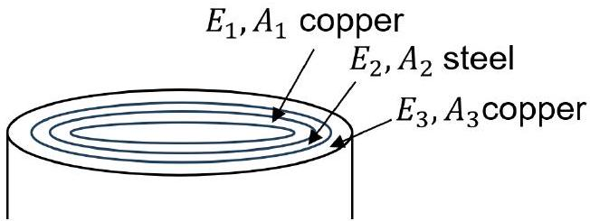
So that $F _ { 1 } = E _ { 1 } A _ { 1 } \frac { \delta \ell } { \ell } , F _ { 2 } = E _ { 2 } A _ { 2 } \frac { \delta \ell } { \ell } , F _ { 3 } = E _ { 3 } A _ { 3 } \frac { \delta \ell } { \ell }$
Now the applied stress $= \frac { \sum _ { i = 1 } ^ { 3 } F _ { \mathrm { i } } } { \sum _ { i = 1 } ^ { 3 } A _ { \mathrm { i } } } = \frac { \left( E _ { 1 } A _ { 1 } + E _ { 2 } A _ { 2 } + E _ { 3 } A _ { 3 } \right) } { \left( A _ { 1 } + A _ { 2 } + A _ { 3 } \right) } \cdot \frac { \delta \ell } { \ell }$
Hence
$$
\delta \ell = \left[ \frac { \Sigma F _ { i } } { \Sigma A _ { i } } \right] \times \frac { \Sigma A _ { 1 } } { \Sigma E _ { i } A _ { i } } \times \ell
$$
In the question the diameter was given, not the radius. Either is accepted. The diameter $= 4.0 \mathrm {~cm}$ answers would be a factor of $4 \times$ smaller than those here.
$$
\begin{aligned}
A _ { 1 } + A _ { 3 } & = & \pi \left( 4.00 ^ { 2 } - 3.8 ^ { 2 } \right) \times 10 ^ { - 4 } + \pi \left( 4.45 ^ { 2 } - 4.25 ^ { 2 } \right) \times 10 ^ { - 4 } & \\
& = \pi \times ( 1.74 + 1.56 ) \times 10 ^ { - 4 } & & \\
& = \pi \times 3.3 \times 10 ^ { - 4 } \mathrm {~m} ^ { 2 } & & \text { If } 4.0 \mathrm {~cm} \text { is (correctly) used as the diameter } \\
& & A _ { 1 } + A _ { 3 } = \pi \times 0.825 \times 10 ^ { - 4 } \mathrm {~m} ^ { 2 } & \\
A _ { 2 } & = \pi \left( 4.25 ^ { 2 } - 4.00 ^ { 2 } \right) \times 10 ^ { - 4 } & & \\
& = \pi \times 2.06 \times 10 ^ { - 4 } \mathrm {~m} ^ { 2 } & & A _ { 2 } = \pi \times 0.516 \times 10 ^ { - 4 } \mathrm {~m} ^ { 2 }
\end{aligned}
$$

Area of copper and steel tubes

$$
\sum _ { i = 1 } ^ { 3 } A _ { i } = \pi \times 5.36 \times 10 ^ { - 4 } \mathrm {~m} ^ { 2 } \quad \sum _ { i = 1 } ^ { 3 } A _ { i } = \pi \times 1.34 \times 10 ^ { - 4 } \mathrm {~m} ^ { 2 }
$$ $\square$

And $\Sigma E _ { i } A _ { i } = \left( 200 \times 10 ^ { 9 } \times \pi \times 2.06 \times 10 ^ { - 4 } \right) + \left( 110 \times 10 ^ { 9 } \times 3.3 \times 10 ^ { - 4 } \right)$

$$
\begin{aligned}
& = \pi \times 10 ^ { 5 } ( 200 \times 2.06 + 110 \times 3.3 ) \\
& = \pi \times 7.75 \times 10 ^ { 5 } \mathrm {~N} \quad \pi \times 1.94 \times 10 ^ { 5 } \mathrm {~N}
\end{aligned}
$$

So the extension is

$$
\begin{aligned}
\delta \ell & = 6.2 \times 10 ^ { 7 } \times \frac { \pi \times 5.36 \times 10 ^ { - 4 } } { \pi \times 7.75 \times 10 ^ { 7 } } \times 0.30 \\
& = 6.2 \times \frac { 2 \times 5.36 \times 10 ^ { - 4 } \times 0.30 } { 7.75 } \\
& = 1.29 \times 10 ^ { - 4 } \mathrm {~m} \quad 5.16 \times 10 ^ { - 4 } \mathrm {~m}
\end{aligned}
$$ $\square$

Stress in copper tubes $= E _ { \text {copper } } \frac { \delta \ell } { \ell } = 110 \times 10 ^ { 9 } \times \frac { 1.29 \times 10 ^ { - 4 } } { 0.3 } = 4.7 \times 10 ^ { 7 } \mathrm {~Pa}$

$$
= 1.9 \times 10 ^ { 8 } \mathrm {~Pa}
$$

Total load $= \left( E _ { s } A _ { s } + E _ { c } A _ { c } \right) \times \frac { \delta \ell } { \ell } \quad =$ Given stress × total area $\times \frac { \delta \ell } { \ell }$

$$
= 6.4 \times 10 ^ { 7 } \times \pi \times 5.36 \times 10 ^ { - 4 } \times \frac { \delta \ell } { \ell } = 1 \times 10 ^ { 5 } \mathrm {~N}
$$ $\square$

(5 marks)
o) Standing wave on a wire.
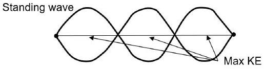
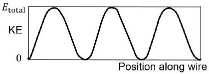

- A particle on the wire oscillates with SHM
$x = A \sin \omega t$
$v = A \omega \cos \omega t$
So the KE of a point would be given by $\frac { 1 } { 2 } m v ^ { 2 } = \frac { 1 } { 2 } m A ^ { 2 } \omega ^ { 2 } \cos ^ { 2 } \omega t$ $\square$
and the $\mathrm { KE } _ { \mathrm { m } } \mathrm { ax } = \frac { 1 } { 2 } m v ^ { 2 } = \frac { 1 } { 2 } m A ^ { 2 } \omega ^ { 2 }$
Average value of KE for the wire requires average value of $\sin ^ { 2 } \theta$ over three cycles, which is $\frac { 1 } { 2 }$
So the KE of the wire will be $\frac { 1 } { 4 } M _ { \text {wire } } A \omega ^ { 2 }$
Given the average KE and PE are equal, the energy in the wire is $\mathrm { KE } + \mathrm { PE } = \frac { 1 } { 2 } M _ { \text {wire } } A \omega ^ { 2 }$
To obtain $\omega$ we need the speed of the wave and its wavelength:
$$
v = \sqrt { \frac { T } { \mu } } = \sqrt { \frac { 45 } { 6.0 \times 10 ^ { - 3 } / 1.2 } } = \sqrt { 9 \times 10 ^ { 3 } } = 94.87 = 95 \mathrm {~m} \mathrm {~s} ^ { - 1 }
$$
and $f = \frac { v } { \lambda } = \frac { 94.97 } { 1.2 / 3 \times 2 } = \frac { 94.87 } { 0.8 } = 118.6 = 120 \mathrm {~Hz}$
So
$$
\begin{aligned}
E _ { \text {total } } & = \frac { 1 } { 2 } M _ { \text {wire } } A ^ { 2 } \omega ^ { 2 } \\
& = 0.5 \times 6 \times 10 ^ { - 3 } \times \left( 1.8 \times 10 ^ { - 2 } \right) ^ { 2 } \times 4 \pi ^ { 2 } \times 118.6 ^ { 2 } = 0.54 \mathrm {~J}
\end{aligned}
$$ $\square$
(5 marks)

p) Maximum power.
    - Currents $I , I _ { 1 } , I _ { 2 }$ through the cell, $R _ { 1 }$ and $R _ { 2 }$
$$
I = \frac { \varepsilon } { r + \frac { R _ { 1 } R _ { 2 } } { \left( R _ { 1 } + R _ { 2 } \right) } } = \frac { \varepsilon \left( R _ { 1 } + R _ { 2 } \right) } { r \left( R _ { 1 } + R _ { 2 } \right) + R _ { 1 } R _ { 2 } }
$$
    - Potential across each resistor is the same, so $\quad I _ { 1 } R _ { 1 } = I _ { 2 } R _ { 2 }$
and $\quad I _ { 1 } + I _ { 2 } = I$
So
$$
\begin{aligned}
I _ { 2 } R _ { 2 } & = \left( I - I _ { 2 } \right) R _ { 1 } \\
I _ { 2 } & = \left( \frac { R _ { 2 } } { R _ { 1 } } + 1 \right) = I
\end{aligned}
$$
Hence
$$
I _ { 2 } = \frac { I R _ { 1 } } { \left( R _ { 1 } + R _ { 2 } \right) }
$$
- $P _ { 2 } = I _ { 2 } ^ { 2 } R _ { 2 } = \frac { I ^ { 2 } R _ { 1 } ^ { 2 } } { \left( R _ { 1 } + R _ { 2 } \right) ^ { 2 } } R _ { 2 }$
$$
= \frac { \varepsilon ^ { 2 } R _ { 1 } ^ { 2 } R _ { 2 } } { \left[ r \left( R _ { 1 } + R _ { 2 } \right) + R _ { 1 } R _ { 2 } \right] ^ { 2 } }
$$
- $\operatorname { Max } P _ { 2 }$ is given by $\min \frac { 1 } { P _ { 2 } } = \frac { 1 } { \varepsilon ^ { 2 } R _ { 1 } ^ { 2 } } \frac { \left[ r \left( R _ { 1 } + R _ { 2 } \right) + R _ { 1 } R _ { 2 } \right] ^ { 2 } } { R _ { 2 } }$
$$
\begin{aligned}
& = \frac { 1 } { \varepsilon ^ { 2 } R _ { 1 } ^ { 2 } } \left[ \frac { \left. r R _ { 1 } + R _ { 2 } \left( r + R _ { 1 } \right) \right] ^ { 2 } } { R _ { 2 } } \right. \\
& = \frac { 1 } { \varepsilon ^ { 2 } R _ { 1 } ^ { 2 } } \left[ \frac { r ^ { 2 } R _ { 1 } ^ { 2 } } { R _ { 2 } } + \frac { R _ { 2 } ^ { 2 } \left( r + R _ { 1 } \right) ^ { 2 } } { R _ { 2 } } + \frac { 2 r R _ { 1 } R _ { 2 } \left( r + R _ { 1 } \right) } { R _ { 2 } } \right]
\end{aligned}
$$
For the term in the square brackets [] we can differentiate with respect to $R _ { 2 }$ and set this equal to zero.
So we only need to consider the terms with $R _ { 2 }$, which are $\frac { r ^ { 2 } R _ { 1 } ^ { 2 } } { R _ { 2 } } + R _ { 2 } \left( r + R _ { 1 } \right) ^ { 2 }$
And differentiating and setting to zero, we obtain $0 = - \frac { r ^ { 2 } R _ { 1 } ^ { 2 } } { R _ { 2 } ^ { 2 } + \left( r + R _ { 1 } \right) ^ { 2 } }$
We can separate the two terms and take the square root, which gives $R _ { 2 } = \frac { r R _ { 1 } } { \left( r + R _ { 1 } \right) }$
$$
\frac { 1 } { R _ { 2 } } = \frac { 1 } { r } + \frac { 1 } { R _ { 1 } }
$$
(5 marks)
q) Capacitor circuit.
- $V _ { 1,2,3 }$ across $C _ { 1,2,3 }$ respectively.
$$
\begin{array} { r l r l }
& & E _ { 1 } & = V _ { 1 } + V _ { 3 } \\
& & E _ { 2 } & = V _ { 2 } + V _ { 3 } \\
\text { So } & E _ { 1 } - E _ { 2 } & = V _ { 1 } - V _ { 2 } \\
\text { Charge conserved } & Q _ { 3 } & = Q _ { 1 } + Q _ { 2 } \\
Q = C V & V _ { 3 } C _ { 3 } & = V _ { 1 } C _ { 1 } + V _ { 2 } C _ { 2 } \tag{5}
\end{array}
$$
- Add (1) + (2)
$$
\begin{equation*}
E _ { 1 } + E _ { 2 } = V _ { 1 } + V _ { 2 } + 2 V _ { 3 } \tag{6}
\end{equation*}
$$

Eliminate $V _ { 3 }$ using (3)

$$
E _ { 1 } C _ { 3 } + E _ { 2 } C _ { 3 } - V _ { 2 } C _ { 3 } - V _ { 2 } C _ { 3 } = 2 V _ { 1 } C _ { 1 } + 2 V _ { 2 } C _ { 2 }
$$

tidying

$$
C _ { 3 } \left( E _ { 1 } + E _ { 2 } \right) = V _ { 1 } \left( 2 C _ { 1 } + C _ { 3 } \right) + V _ { 2 } \left( 2 C _ { 2 } + C _ { 3 } \right)
$$

Eliminate $V _ { 1 }$ using (3)
$C _ { 3 } \left( E _ { 1 } + E _ { 2 } \right) = \left( E _ { 1 } - E _ { 2 } + V _ { 2 } \right) \left( 2 C _ { 1 } + C _ { 3 } \right) + V _ { 2 } \left( 2 C _ { 2 } + C _ { 3 } \right)$
So

$$
C _ { 3 } \left( E _ { 1 } + E _ { 2 } \right) = \left( E _ { 1 } - E _ { 2 } \right) \left( 2 C _ { 1 } + C _ { 3 } \right) + V _ { 2 } \left( 2 C _ { 1 } + 2 C _ { 2 } + 2 C _ { 3 } \right)
$$

then

$$
\left. E _ { 1 } C _ { 3 } + E _ { 2 } C _ { 3 } = E _ { 1 } C _ { 1 } - E _ { 2 } 2 C _ { 1 } + E _ { 1 } C _ { 3 } - E _ { 2 } C _ { 3 } + 2 V _ { 2 } \cdot \Sigma C _ { i } \right)
$$

Divide through by 2

$$
E _ { 2 } C _ { 3 } = E _ { 1 } C _ { 1 } - E _ { 2 } C _ { 1 } + V _ { 2 } \Sigma C _ { i }
$$

Hence

$$
V _ { 2 } = \frac { E _ { 2 } \left( C _ { 1 } + C _ { 3 } \right) - E _ { 1 } C _ { 1 } } { \Sigma C _ { i } }
$$

Changing the indices

$$
V _ { 1 } = \frac { E _ { 1 } \left( C _ { 2 } + C _ { 3 } \right) - E _ { 2 } C _ { 2 } } { \Sigma C _ { i } }
$$

Using (1), $V _ { 3 } = E _ { 1 } - V _ { 1 } = V _ { 3 } = \frac { E _ { 1 } \Sigma C _ { i } - E _ { 1 } C _ { 2 } E _ { 1 } C _ { 3 } + E _ { 2 } C _ { 2 } } { \Sigma C _ { i } }$

$$
V _ { 3 } = \frac { E _ { 1 } C _ { 1 } + E _ { 2 } C _ { 2 } } { \left( C _ { 1 } + C _ { 2 } + C _ { 3 } \right) }
$$

r) Floating rod.
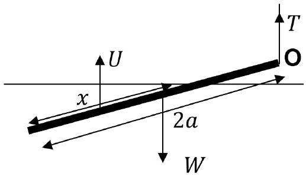
    - Cross sectional area is $A . \quad x$ is the length submerged
    - The upthrust acts at a point halfway along the submerged length at $\left( 2 a - \frac { x } { 2 } \right)$ from O. Weight
$$
W = \rho A 2 a g
$$
Upthrust
$$
U = \frac { 4 } { 3 } \rho A x g
$$
    - Moments about O:
$$
\left( 2 a - \frac { x } { 2 } \right) \cdot \frac { 4 } { 3 } \rho A x g = a \cdot \rho A 2 a g
$$
$\left( 2 a - \frac { x } { 2 } \right) \frac { 4 } { 3 } x = 2 a ^ { 2 }$
Hence
$$
8 a x - 2 x ^ { 2 } = 6 a ^ { 2 } \quad \text { or } \quad x ^ { 2 } - 4 a x + 3 a ^ { 2 } = 0
$$
Solving
$$
x = 2 a \pm a \text { from which } x = a , \text { or fraction submerged } = \frac { 1 } { 2 }
$$
    - Taking moments about the centre of the rod we can obtain the tension $T$
$$
a \cdot T = \left( a - \frac { x } { 2 } \right) \cdot \frac { 4 } { 3 } \rho A \frac { a } { 2 } g
$$
With
$$
x = a
$$
$$
a \cdot T = \frac { 4 } { 3 } \rho A \frac { a } { 2 } g
$$
$T = \frac { 2 } { 3 } \rho A g \quad$ or $\quad \left( \frac { T } { W } = \frac { 1 } { 3 } \right)$

s) Two balls above a beaker of water.
    - Two forces on each ball and a tension in the string (labelled in words is fine) ⇒ ⇒ ✓
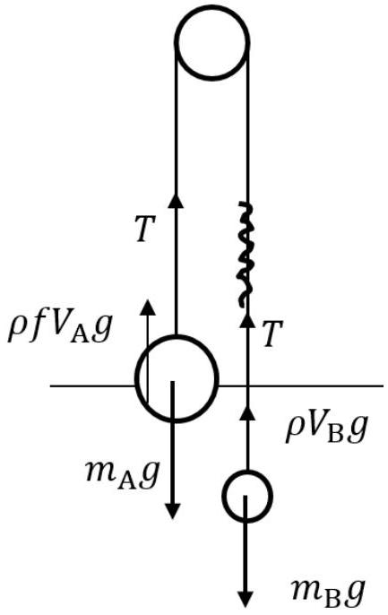
- By Archimedes we can equate forces on the string. $f$ is the fraction of the volume of A submerged
    - $T = m _ { \mathrm { B } } g - \rho V _ { \mathrm { B } } g$ and $T = m _ { \mathrm { A } } g - \rho f V _ { \mathrm { A } } g$ ✓
    - So that $m _ { \mathrm { B } } g - \rho V _ { \mathrm { B } } g = m _ { \mathrm { A } } g - \rho f V _ { \mathrm { A } } g$ ✓
    then
$$
\begin{aligned}
& \rho f V _ { \mathrm { A } } g = \left( m _ { \mathrm { A } } - m _ { \mathrm { B } } \right) g + \rho V _ { \mathrm { B } } g \\
& f V _ { A } = \frac { \left( m _ { \mathrm { A } } - m _ { \mathrm { B } } \right) } { \rho } + V _ { \mathrm { B } } \\
& f V _ { \mathrm { A } } = \frac { ( 500 - 390 ) } { 1 } + 50 \\
& f 1000 = 160 \\
& f = 0.16 = 16 \%
\end{aligned}
$$
✓
    - $T = m _ { \mathrm { B } } g - \rho V _ { \mathrm { B } } g$ So $k x = \left( m _ { \mathrm { B } } - \rho V _ { \mathrm { B } } \right) g$ Now using units of m, kg, s, we have $100 x = \left( 0.390 - 1000 \times 50 \times 10 ^ { - 6 } \right) \times 9.8$
$$
x = \frac { 0.34 \times 9.8 } { 100 } = 0.033 \mathrm {~m} = 3.3 \mathrm {~cm}
$$
✓ (6 marks)
t) Wooden pole.
    - Diagram to show idea and symbols ✓
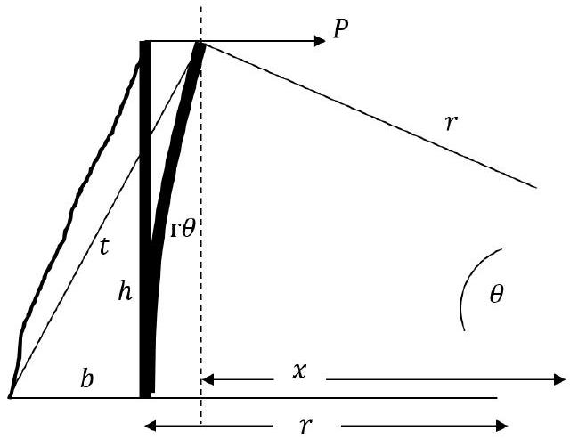
    - Diameter of pole $2 a$.
    - When pole is bent, inside arc length $= ( r - a ) \theta$ and outside arc length $= ( r + a ) \theta$, so the extension will be $2 \delta \ell$ Subtracting $2 \delta \ell = 2 a \theta$ ✓
Using $\ell = h = r \theta \quad$ in $\quad E = \operatorname { stress } . \frac { \ell } { \delta \ell } = \operatorname { stress } . \frac { r \theta } { a \theta }$
    - $r = \frac { a E } { \text { stress } } = \frac { 0.15 \times 14 \times 10 ^ { 9 } } { 4000 } = 5.25 \times 10 ^ { 5 } \mathrm {~m}$ ✓
    - $\theta = \frac { \ell ( = h ) } { r } = \frac { 12 } { 5.25 \times 10 ^ { 5 } } = 2.29 \times 10 ^ { - 5 } \mathrm { rad } = 1.31 \times 10 ^ { - 3 }$ 。 ✓
    - $( r - x ) = r ( 1 - \cos \theta ) = r \frac { \theta ^ { 2 } } { 2 } = 1.38 \times 10 ^ { - 4 } \mathrm {~m}$
    - slack length $= t - \sqrt { h ^ { 2 } + b ^ { 2 } } = \sqrt { h ^ { 2 } + ( b + r - x ) ^ { 2 } } - \sqrt { h ^ { 2 } + b ^ { 2 } }$

There are two approaches to determining the slack length. Numerically and by algebraic approximations.
The mark for an order of magnitude result.

- numerical
$$
\begin{aligned}
\text { slack length } & = \sqrt { 12 ^ { 2 } + \left( 2.4 + 1.38 \times 10 ^ { - 4 } \right) ^ { 2 } } - \sqrt { 12 ^ { 2 } + 2.4 ^ { 2 } } \\
& = 12.237674 - 12.237647 \\
& = 2.7 \times 10 ^ { - 5 } \mathrm {~m}
\end{aligned}
$$
- algebraic
$$
= t - \sqrt { h ^ { 2 } + b ^ { 2 } } = \sqrt { h ^ { 2 } + ( b + r - x ) ^ { 2 } } - \sqrt { h ^ { 2 } + b ^ { 2 } }
$$
Using the binomial approximation:
$$
\begin{aligned}
& = h \left( 1 + \frac { 1 } { 2 } \left( \frac { b + r - x } { h } \right) ^ { 2 } - 1 - \frac { 1 } { 2 } \left( \frac { b } { h } \right) ^ { 2 } \right. \\
& = \frac { 1 } { 2 h } \left( ( b + r - x ) ^ { 2 } - b ^ { 2 } \right) \\
& = \frac { 1 } { 2 h } \left( b ^ { 2 } + ( r - x ) ^ { 2 } + 2 b ( r - x ) - b ^ { 2 } \right) \\
& = \frac { ( r - x ) } { 2 h } ( r - x + 2 b ) \\
& ( r - x ) \ll 2 b \text { and } r \frac { \theta ^ { 2 } } { 2 } \\
& = \frac { r \theta ^ { 2 } 2 b } { 2.2 h } = \frac { r h ^ { 2 } b } { 2 r ^ { 2 } h } = \frac { b h } { 2 r } \\
& = \frac { 1 } { 2 } 2.4 \times 2.29 \times 10 ^ { - 5 } \\
& = 2.7 \times 10 ^ { - 5 } \mathrm {~m}
\end{aligned}
$$ $\square$

## Qu 2

a) - Kinetic energy of wind transferred to turbine $E _ { k } = \frac { 1 } { 2 } m v ^ { 2 }$
    - Take cylinder of air with a radius $r$ and length $l$ Mass of air : $m = \rho V = \rho \pi r ^ { 2 } l$
    - Substitute into: $P = \frac { E } { t } = \frac { \rho \pi r ^ { 2 } v ^ { 2 } } { 2 t }$
- Use $v = \frac { l } { t }$ to give: $P = \frac { 1 } { 2 } \rho \pi r ^ { 2 } v ^ { 3 }$
( 3 marks)
b) (i) $\rho A _ { 1 } v _ { 1 }$
    (ii) $\rho A v$
    (iii) $\rho A _ { 2 } v _ { 2 }$
    (iv) • Conservation of mass flow $\rho A _ { 1 } v _ { 1 } = \rho A v = \rho A _ { 2 } v _ { 2 }$
        - Consider change in kinetic energy of the wind.
$$
\Delta E = \frac { 1 } { 2 } m \left( v _ { 1 } ^ { 2 } - v _ { 2 } ^ { 2 } \right)
$$
            - sub in $\frac { m } { \Delta t } = \rho A v$
$$
P _ { \mathrm { out } } = \frac { 1 } { 2 } \rho A v \left( v _ { 1 } ^ { 2 } - v _ { 2 } ^ { 2 } \right)
$$
        (v) Use $v = \frac { v _ { 1 } + v _ { 2 } } { 2 }$
        - $P _ { \text {out } } = \frac { 1 } { 4 } \rho A \left( v _ { 1 } + v _ { 2 } \right) \left( v _ { 1 } ^ { 2 } - v _ { 2 } ^ { 2 } \right)$
(vi) • expand:
$$
\begin{aligned}
& P _ { \text {out } } = \frac { 1 } { 4 } \rho A \left[ v _ { 1 } ^ { 3 } - v _ { 1 } v _ { 2 } ^ { 2 } + v _ { 2 } v _ { 1 } ^ { 2 } - v _ { 2 } ^ { 3 } \right] \\
& P _ { \text {out } } = \frac { 1 } { 4 } \rho A v _ { 1 } ^ { 3 } \left[ 1 - \left( \frac { v _ { 2 } } { v _ { 1 } } \right) ^ { 2 } + \left( \frac { v _ { 2 } } { v _ { 1 } } \right) - \left( \frac { v _ { 2 } } { v _ { 1 } } \right) ^ { 3 } \right]
\end{aligned}
$$
- Sub in $x = \frac { v _ { 2 } } { v _ { 1 } }$
$$
P _ { \text {out } } = \frac { 1 } { 4 } \rho A v _ { 1 } ^ { 3 } \left[ 1 - x ^ { 2 } + x - x ^ { 3 } \right]
$$
    - Differentiate and set equal to zero
$$
\frac { d P } { d x } = \frac { 1 } { 4 } \rho A v _ { 1 } ^ { 3 } \left( - 2 x + 1 - 3 x ^ { 2 } \right) = 0
$$
    - Solve for $x$
$$
x = - 1 , \frac { 1 } { 3 } \quad \text { Take } \frac { v _ { 2 } } { v _ { 1 } } = \frac { 1 } { 3 }
$$
(vii) Use $\frac { v _ { 2 } } { v _ { 1 } } = \frac { 1 } { 3 }$
$$
\begin{aligned}
& P _ { \max } = \frac { 1 } { 4 } \rho . A . v _ { 1 } ^ { 3 } \left[ 1 - \left( \frac { 1 } { 3 } \right) ^ { 2 } + \left( \frac { 1 } { 3 } \right) - \left( \frac { 1 } { 3 } \right) ^ { 3 } \right] \\
& P _ { \max } = 0.296 \rho A v _ { 1 } ^ { 3 }
\end{aligned}
$$
(viii) $P _ { \text {max } } = 0.296 * 1.23 * \left( \pi * 107 ^ { 2 } \right) * 10 ^ { 3 }$
$$
P _ { \max } = 1.3 \times 10 ^ { 7 } \mathrm {~W}
$$
$\rho _ { \text {air } }$ was not given, so any value from 1 to 1.3 could be used here.
If $v _ { 2 }$ is taken out of the bracket then $P _ { \text {max } } = 0.296 \rho A v _ { 2 } ^ { 3 } = 35 \times 10 ^ { 7 } \mathrm {~W}$, which is $3 ^ { 3 } = 27$ times too large.
They only lose 1 mark for this as they have the method.

(8 marks)

c) (i) • Resistance: $R = \frac { \rho L } { A } = \frac { 1.68 \times 10 ^ { - 8 } \times 265 \times 10 ^ { 3 } } { \pi \times 0.022 ^ { 2 } } = 2.93 = 2.9 \Omega$
    - Power Dissipated $P = I ^ { 2 } R$
    $I = \frac { P } { V } = \frac { 800 \times 10 ^ { 6 } } { 320 \times 10 ^ { 3 } } = 2500 \mathrm {~A}$
$P = 2500 ^ { 2 } 2.93 = 1.83 \times 10 ^ { 7 } W$
    - Percentage Loss: $\%$ loss $= \frac { P _ { \text {heat } } } { P _ { \text {carried } } } = \frac { 1.83 \times 10 ^ { 7 } } { 8 \times 10 ^ { 8 } } \times 100 = 2.29 = 2.3 \%$
(ii) ● Resistance: $d R = \frac { \rho d r } { A } = \frac { \rho d r } { 2 \pi r L }$
Integrate
$$
\begin{gathered}
R = \frac { \rho } { 2 \pi L } \int _ { r _ { 1 } } ^ { r _ { 2 } } \frac { d r } { r } = \frac { \rho } { 2 \pi L } \ln \frac { r _ { 2 } } { r _ { 1 } } \\
= \frac { 1.97 \times 10 ^ { 14 } } { 2 \pi 2.65 \times 10 ^ { 5 } } \ln \frac { 4 } { 2.2 } = 7.07 \times 10 ^ { 7 } = 7.1 \times 10 ^ { 7 } \Omega
\end{gathered}
$$
OR A similar numerical answer can be obtained by taking the difference in the two radii ( 1.8 cm) and using the average radius of 3.1 cm
Then
$$
R = \frac { 1.97 \times 10 ^ { 14 } \times 1.8 \times 10 ^ { - 2 } } { 2 \pi \times 3.1 \times 10 ^ { - 2 } \times 2.65 \times 10 ^ { 5 } } = 6.9 \times 10 ^ { 7 } \Omega
$$
which would gave a current (below) of 4.6 mA, a power loss of 1500 W and percentage loss of 2 \%.
Continuing
$$
\begin{aligned}
& I _ { \text {leakage } } = \frac { V } { R } = \frac { 320 \times 10 ^ { 3 } } { 7.1 \times 10 ^ { 7 } } = 4.52 \times 10 ^ { - 3 } = 4.5 \mathrm {~mA} \\
& \text { Loss } = I ^ { 2 } R = \left( 4.52 \times 10 ^ { - 3 } \right) ^ { 2 } \times 7.07 \times 10 ^ { 7 } = 1400 \mathrm {~W}
\end{aligned}
$$ $\square$
Fractional loss $= \frac { 1400 } { 800 \times 10 ^ { 6 } } = 1.8 \times 10 ^ { - 6 } = 2 \times 10 ^ { - 4 } \%$
(iii) • We expect a small temperature difference so we can do an approximate calculation for the thermal conduction though a cylindrical surface.
Heat conductivity $P _ { \text {heat loss } } = \frac { k A \Delta T } { \Delta r } A =$ area heat transferred $= 2 \pi r _ { \text {average } } L$
$k =$ thermal conductivity
$\Delta r =$ radial thickness of XPLE
So $1.83 \times 10 ^ { 7 } = 0.28 \times 2 \pi \times 3.1 \times 10 ^ { - 2 } \times 2.65 \times 10 ^ { 5 } \times \frac { \left( T _ { \text {hot } } - T _ { \text {cold } } \right) } { 1.8 \times 10 ^ { - 2 } }$ $\square$
$T _ { \text {hot } } - 7 { } ^ { \circ } \mathrm { C } = 22.8$
$T _ { \text {hot } } = 30 ^ { \circ } \mathrm { C }$ $\square$

(8 marks)

d) (i) work function for mercury was not given in question - give mark for any mention of work function or ionisation potential etc.
    (ii) - Substitute equation for $V _ { g }$
$$
\begin{aligned}
& I = a + b V _ { g } + c V _ { g } ^ { 2 } \\
& = a + b ( A + B \cos \omega t ) + c ( A + B \cos \omega t ) ^ { 2 } \\
& = a + b A + b B \cos \omega t + c \left( A ^ { 2 } + 2 A B \cos \omega t + B ^ { 2 } \cos ^ { 2 } \omega t \right)
\end{aligned}
$$ $\square$
        - Use double angle trig identity $\cos ^ { 2 } \theta = \frac { 1 } { 2 } ( 1 + \cos 2 \theta )$ to give a term with $\cos ( 2 \omega t )$ :
$$
\begin{aligned}
I = & a + b A + c A ^ { 2 } + \frac { 1 } { 2 } c B ^ { 2 } \\
& + ( b B + 2 c A B ) \cos \omega t
\end{aligned}
$$

$$
+ \frac { c B ^ { 2 } } { 2 } \cos 2 \omega t
$$

The amplitude of the second harmonic component is $\frac { c B ^ { 2 } } { 2 }$ $\square$

- mean value of $I$ is the sum of the DC terms as the $\cos \omega t$ and $\cos 2 \omega t$ terms average to zero over many cycles $\square$
So this also contains the $B ^ { 2 }$ term $\frac { c B ^ { 2 } } { 2 }$

- When $B = 0 , \quad I = a + b A + c A ^ { 2 } = I _ { 0 }$ $\square$
So

$$
I = I _ { 0 } + \frac { c B ^ { 2 } } { 2 } + ( b B + 2 c A B ) \cos \omega t + \frac { c B ^ { 2 } } { 2 } \cos \omega t
$$

$$
I _ { \max } = I _ { 0 } + \frac { c B ^ { 2 } } { 2 } + ( b B + 2 c A B ) + \frac { c B ^ { 2 } } { 2 } = I _ { 0 } + A _ { 1 } + 2 A _ { 2 }
$$ $\square$

$$
\begin{aligned}
& I _ { \min } = I _ { 0 } + \frac { c B ^ { 2 } } { 2 } - ( b B + 2 c A B ) - \frac { c B ^ { 2 } } { 2 } = I _ { 0 } - A _ { 1 } \\
& I _ { \max } - I _ { 0 } = A _ { 1 } + 2 A _ { 2 } \\
& I _ { 0 } - I _ { \min } = A _ { 1 }
\end{aligned}
$$

Hence

$$
\chi = 1 + \frac { 2 A _ { 2 } } { A _ { 1 } }
$$

So

$$
\frac { A _ { 2 } } { A _ { 1 } } = \frac { 1 } { 2 } ( \chi - 1 )
$$ $\square$

## Qu 3.

a)

- Force down = weight + weight of hot air
$$
= 200 g + \rho _ { h o t } V g
$$
- Upthrust = weight of cold air displaced
$$
= \rho _ { \text {cold } } V g
$$
- Balance forces: $200 g + \rho _ { \text {hot } } V g = \rho _ { \text {cold } } V g$ ✓
b) - As in previous question, $830 g + \rho _ { h o t } V g = \rho _ { \text {cold } } V g$
So
$$
\rho _ { h o t } = \frac { \rho _ { c o l d } V - 830 } { V } = \frac { 1.23 \times 2000 - 830 } { 2000 } = 0.815 \mathrm {~kg} \mathrm {~m} ^ { - 3 }
$$
- $n = \frac { m _ { \text {hot } } \text { air } } { 0.029 } = \frac { 1630 } { 0.029 } = 5.6 \times 10 ^ { 4 } \mathrm {~mol}$ ✓
- Assuming ideal gas: $T = \frac { P V } { n R }$
$$
T = \frac { 1.01 \times 10 ^ { 5 } \times 2000 } { 5.6 \times 10 ^ { 4 } \times 8.314 } = 430 \mathrm {~K} = 160 ^ { \circ } \mathrm { C }
$$
✓
(3 marks)

Alternatively:
[ An estimate can be made using the ideal gas equation, $P \propto n / V R T$ and hence for a constant pressure, $\rho T =$ const . If we assume a cold temperature of $20 ^ { \circ } \mathrm { C }$ then

$$
\begin{gathered}
\rho _ { H } T _ { H } = \rho _ { C } T _ { C } \\
1.23 \times 293 = 0.815 \times T _ { H } \quad \text { so } \quad T _ { H } = 442 \mathrm {~K} = 169 ^ { \circ } \mathrm { C }
\end{gathered}
$$

One mark for the earlier calculated density of hot air and 1 mark for the temperature calculation ie. 2/3]

c) (i) ● Assuming ideal gas $n = \frac { P V } { R T }$
- $m = n M = \frac { P V } { R T } M$
$$
m = \frac { 1.01 \times 10 ^ { 5 } \times 380 } { 8.314 \times 288 } = 16030 \times 0.002 = 32.1 = 32 \mathrm {~kg}
$$
✓
    (ii) ● Radius $r ^ { 3 } = \frac { 3 \times 380 } { 4 \times \pi }$
$$
r = 4.49 \mathrm {~m}
$$
✓
    - calculate thicknesses of silk and rubber

$t _ { \text {silk } } = \frac { 66.5 \mathrm {~g} \mathrm {~m} ^ { - 2 } } { 1.30 \mathrm {~g} \mathrm {~cm} ^ { - 3 } } = \frac { 66.5 \times 10 ^ { - 5 } \mathrm {~m} } { 1.30 } = 5.115 \times 10 ^ { - 5 } \mathrm {~m}$ ✓
So thickness of rubber $= 4.3 \times 10 ^ { - 4 } - 0.5115 \times 10 ^ { - 4 } \mathrm {~m} = 3.79 \times 10 ^ { - 4 } \mathrm {~m}$ ✓
- Mass = thickness × density × area
Mass of balloon $= \left( 1.30 \times 10 ^ { 3 } \times 5.115 \times 10 ^ { - 5 } + 1.30 \times 10 ^ { 3 } \times 3.788 \times 10 ^ { - 4 } \right) 4 \pi r ^ { 2 }$
$$
= 0.574 \times 4 \pi 4.49 ^ { 2 } = 145.6 = 146 = 150 \mathrm {~kg}
$$
✓
- $m _ { \text {total } } = m _ { \text {Hydrogen } } + m _ { \text {balloon } } + m _ { \text {payload } }$
mass $= ( 32 + 146 + 270 ) = 448 \mathrm {~kg}$
So $\quad 448 a = 380 \times 1.23 \times 9.81 - 448 \times 9.81$
$$
a = 0.42 \mathrm {~m} \mathrm {~s} ^ { - 2 }
$$
✓

(6 marks)

d) Descends with constant velocity forces are balanced, drag always in opposite direction to travel.

    - Since $F _ { d } \propto v$ then the drag force is the same going down as up, since $v$ is the same.
    - Descending: $F _ { d } + U = W$ ✓
    - Ascending: $W - m _ { 2 } g + F _ { d } = U$ ✓
    - Re-arranging both for U as upthrust is constant can set equal.
$W - m _ { 2 } g + F _ { d } = W - F _ { d }$
$$
m _ { 2 } = \frac { 2 F _ { d } } { g }
$$
✓ (3 marks)
e) (i) • $\Delta p = \rho g \Delta h$
    - Ideal gas equation: $p V = n R T$ and $M$ is the kg molar mass.
Use $V = \frac { m } { \rho }$ and $n = \frac { m } { M }$ ✓
        - $p \frac { m } { \rho } = \frac { m } { M } R T$
$$
p = \frac { \rho R T } { M }
$$
✓
        - Substitute equation for $\rho$ in ideal gas equation into hydrostatic equation:
$$
\frac { \Delta p } { p } = \frac { M g } { R T } \Delta h
$$
✓

- The differential form includes a - sign since as $z$ increases $P$ decreases.
Then
$$
d p = - \rho g d z = - \frac { p M } { R T } g d h
$$
Substitute $T = T _ { 0 } - \alpha h$ into this result:
$$
\frac { \Delta p } { p } = - \frac { M g } { R \left( T _ { 0 } - \alpha h \right) } \Delta h
$$
- Integrate both sides:
$$
\begin{aligned}
& \int _ { P _ { 0 } } ^ { P ( h ) } \frac { 1 } { p } d p = \int _ { 0 } ^ { h } - \frac { M g } { R \left( T _ { 0 } - \alpha h \right) } d h \\
& \ln \left( \frac { P ( h ) } { P _ { 0 } } \right) = \frac { M g } { R \alpha } \ln \left( \frac { T _ { 0 } - \alpha h } { T _ { 0 } } \right) \\
& P ( h ) = P _ { 0 } \left( \frac { T _ { 0 } - \alpha h } { T _ { 0 } } \right) ^ { \frac { M g } { R \alpha } }
\end{aligned}
$$ $\square$ $\square$

(5 marks)

(ii) • Get temperature from $T = T _ { 0 } - \alpha h = 288 - ( 0.00976 \times 3000 ) = 258.7 = 259 \mathrm {~K}$ $\square$
- Substitute values into the equation derived:
$$
\begin{aligned}
& P ( 3000 ) = 1.01 \times 10 ^ { 5 } \left( \frac { 288 - 0.00976 \times 3000 } { 288 } \right) ^ { \frac { 0.0299 \times 9.81 } { 8.314 \times 0.00976 } } \\
& P ( 3000 ) = 1.01 \times 10 ^ { 5 } \left( \frac { 259 } { 288 } \right) ^ { 3.51 } = 7.0 \times 10 ^ { 4 } \mathrm {~Pa}
\end{aligned}
$$ $\square$
(2 marks)
(iii) • Pressure inside balloon: $\frac { P _ { 1 } V _ { 1 } } { T _ { 1 } } = \frac { P _ { 2 } V _ { 2 } } { T _ { 2 } }$
$$
\frac { 1.01 \times 10 ^ { 5 } \times V _ { 1 } } { 288 } = \frac { P _ { 2 } \times 1.3 \times V _ { 1 } } { 259 } \text { gives } P _ { 2 } = 70 \mathrm { kPa }
$$ $\square$
OR
If the temperature of the hydrogen remains at 288 K then the pressure is given by $1.01 \times 10 ^ { 5 } \times V _ { 1 } = P _ { 2 } \times 1.3 V _ { 1 }$ and $P _ { 2 } = 78 \mathrm { kPa }$
    - Stress is given by the (pressure) × (area of cross section) ÷ (circumferential area of material)
$$
\begin{align*}
& = \frac { P _ { 2 } \times \pi r ^ { 2 } } { 2 \pi r \delta r } = \frac { P _ { 2 } r } { 2 \delta r }  \tag{✓}\\
& = \frac { 0.70 \times 10 ^ { 5 } \times \left[ 4.49 \times ( 1.3 ) ^ { 1 / 3 } \right] } { 2 \times 0.43 \times 10 ^ { - 3 } } = 4 \times 10 ^ { 8 } \mathrm {~Pa} \tag{✓}
\end{align*}
$$
    - Young's Modulus $E = \frac { \text { stress } } { \text { strain } }$
- In the surface of the balloon, strain $= \frac { \ell ^ { \prime } } { \ell _ { o } } = \frac { r ^ { \prime } } { r _ { o } } = \left( \frac { V ^ { \prime } } { V _ { o } } \right) ^ { \frac { 1 } { 3 } } = 1.3 ^ { \frac { 1 } { 3 } } = 1.09$
$$
\frac { \delta \ell } { \ell _ { o } } = \frac { \ell ^ { \prime } - \ell _ { o } } { \ell } = 1.09 - 1 = 0.09
$$
    - so $E = \frac { 4 \times 10 ^ { 8 } } { 0.09 } = 4 \times 10 ^ { 9 } \mathrm {~Pa}$

(4 marks)

## Qu 4.

a) (i) • Gravitational field strength: $g _ { \mathrm { E } } = \frac { G M } { R _ { \mathrm { E } } ^ { 2 } }$
    - When $g = 0.01 g _ { E }$ then $R \rightarrow 10 R _ { \mathrm { E } }$
    (ii) • Angular Speed of earth : $\omega = \frac { 2 \pi } { 24 \times 3600 }$
        - Tangential Speed, $v = \omega R _ { \mathrm { E } } \cos \phi$
    $v = \frac { 2 \pi } { 24 \times 3600 } \times 6.37 \times 10 ^ { 6 } \times \cos 30 = 400 \mathrm {~m} \mathrm {~s} ^ { - 1 }$
    (iii) • Escape velocity is reached when kinetic energy is equal to potential energy.
    $\frac { 1 } { 2 } m v _ { e s } ^ { 2 } = \frac { G M m } { R _ { \mathrm { E } } }$ ✓
    $v = \sqrt { \frac { 2 G M } { R _ { \mathrm { E } } } } = \sqrt { 2 g _ { \mathrm { E } } R _ { \mathrm { E } } } = 11.2 \mathrm {~km} \mathrm {~s} ^ { - 1 }$ $= \sqrt { \frac { 2 \times 6.67 \times 10 ^ { - 11 } \times 5.97 \times 10 ^ { 24 } } { 6.37 \times 10 ^ { 6 } } } = 11.2 \mathrm {~km} \mathrm {~s} ^ { - 1 }$
$($ iv $) \quad$ i. $\frac { 1 } { 2 } m v _ { \text {new.es } } ^ { 2 } + \frac { 1 } { 2 } m v _ { \text {Taneg } } ^ { 2 } = \frac { G M m } { R _ { \mathrm { E } } } = \frac { 1 } { 2 } m v _ { e s } ^ { 2 }$
So $\quad v _ { \text {new.es } } ^ { 2 } + v _ { \text {Taneg } } ^ { 2 } = v _ { e s } ^ { 2 }$ ✓
    - Reduction in energy "TO" $= \frac { v _ { \text {new.es } } ^ { 2 } } { v _ { e s } ^ { 2 } } = \frac { 1 - v _ { \text {Taneg } } ^ { 2 } } { v _ { e s } ^ { 2 } }$ $= 1 - \frac { 0.4 ^ { 2 } } { 11.2 ^ { 2 } } \times 100 = 98.7 \%$ or "BY" $0.013 \%$
ii. In low Earth orbit,
$\frac { v _ { \text {lowE } } ^ { 2 } } { R _ { \mathrm { E } } } = \frac { G M _ { \mathrm { E } } } { R _ { \mathrm { E } } ^ { 2 } } \quad$ so that $\quad v _ { \text {lowE } } = \sqrt { \frac { G M _ { \mathrm { E } } } { R _ { \mathrm { E } } } }$
Hence the energy is reduced by $\frac { v _ { e s } ^ { 2 } - v _ { \text {lowE } } ^ { 2 } } { v _ { e s } ^ { 2 } } = 1 - \frac { \frac { G M _ { \mathrm { E } } } { R _ { \mathrm { E } } } } { \frac { 2 G M _ { \mathrm { E } } } { R _ { \mathrm { E } } } }$ $= 1 - \frac { 1 } { 2 } = 50 \%$

(8 marks)

$( \mathrm { v } ) \cdot$ Conservation of Energy: $( K E ) _ { P } + ( P E ) _ { P } = ( K E ) _ { A } + ( P E ) _ { A }$
$$
\frac { 1 } { 2 } m v _ { P } ^ { 2 } - \frac { G M _ { s } m } { R _ { \mathrm { E } _ { \mathrm { o } } } } = \frac { 1 } { 2 } m v _ { A } ^ { 2 } - \frac { G M _ { s } m } { R _ { \mathrm { M } _ { \mathrm { o } } } }
$$

- Rearrange for $v _ { P } ^ { 2 }$
$v _ { P } ^ { 2 } = v _ { A } ^ { 2 } + 2 G M _ { s } \left( \frac { 1 } { R _ { \mathrm { M } _ { \mathrm { o } } } } - \frac { 1 } { R _ { \mathrm { E } _ { \mathrm { o } } } } \right)$
- Conservation of angular momentum at these tangential speeds at the ends of the ellipse where $\sin \theta = 1$
momentum:
$$
R _ { \mathrm { E } _ { \mathrm { o } } } v _ { P } = R _ { \mathrm { M } _ { \mathrm { o } } } v _ { A }
$$
Hence
$$
v _ { P } ^ { 2 } = v _ { P } ^ { 2 } \frac { R _ { \mathrm { E } _ { \mathrm { o } } } ^ { 2 } } { R _ { \mathrm { M } _ { \mathrm { o } } } ^ { 2 } } + 2 G M _ { s } \left( R _ { \mathrm { M } _ { \mathrm { o } } } - R _ { \mathrm { E } _ { \mathrm { o } } } \right)
$$
$$
\begin{aligned}
& \frac { v _ { P } ^ { 2 } } { R _ { \mathrm { M } _ { \mathrm { o } } } ^ { 2 } } \left( R _ { \mathrm { M } _ { \mathrm { o } } } - R _ { \mathrm { E } _ { \mathrm { o } } } \right) \left( R _ { \mathrm { M } _ { \mathrm { o } } } + R _ { \mathrm { E } _ { \mathrm { o } } } \right) = 2 G M _ { s } \frac { \left( R _ { \mathrm { M } _ { \mathrm { o } } } - R _ { \mathrm { E } _ { \mathrm { o } } } \right) } { R _ { \mathrm { M } _ { \mathrm { o } } } R _ { \mathrm { E } _ { \mathrm { o } } } } \\
& v _ { P } = \sqrt { \frac { 2 G M _ { s } } { \left( R _ { \mathrm { M } _ { \mathrm { o } } } + R _ { \mathrm { E } _ { \mathrm { o } } } \right) } \frac { R _ { \mathrm { M } _ { \mathrm { o } } } } { R _ { \mathrm { E } _ { \mathrm { o } } } } }
\end{aligned}
$$ $\square$ $\square$

and
$$
v _ { A } = \sqrt { \frac { 2 G M _ { s } } { \left( R _ { \mathrm { M } _ { \mathrm { o } } } + R _ { \mathrm { E } _ { \mathrm { o } } } \right) } \frac { R _ { \mathrm { E } _ { \mathrm { o } } } } { R _ { \mathrm { M } _ { \mathrm { o } } } } }
$$
Earth's circular orbital speed is given by
$$
\frac { v _ { \mathrm { E } } ^ { 2 } } { R _ { \mathrm { E } _ { \mathrm { o } } } } = \frac { G M _ { s } } { R _ { \mathrm { E } } ^ { 2 } } \quad \rightarrow \quad v _ { \mathrm { E } _ { \mathrm { o } } } = \sqrt { \frac { G M _ { s } } { R _ { \mathrm { E } _ { \mathrm { o } } } } }
$$ $\square$
and Mars's orbital speed is
$$
v _ { \mathrm { M } } = \sqrt { \frac { G M _ { s } } { R _ { \mathrm { M } _ { \mathrm { o } } } } } \quad \text { (one mark for either) }
$$
(vi) \& (vii) The question is unclear as to what is being looked for (the speed to catch Mars or the total increment in speed). The probe has to be accelerated to catch Mars when it reaches the same orbital radius. There was a mistake in the algebra earlier for the differences in speeds, but the equations for $v _ { P } , v _ { \mathrm { E } } , v _ { A } , v _ { \mathrm { M } }$ were all correct. So here are the calculated values.
$$
\begin{aligned}
& v _ { A } = 21.6 = 22 \mathrm {~km} \mathrm {~s} ^ { - 1 } \\
& v _ { \mathrm { M } } = 24.2 = 24 \mathrm {~km} \mathrm {~s} ^ { - 1 } \\
& v _ { P } = 32.6 = 33 \mathrm {~km} \mathrm {~s} ^ { - 1 } \\
& v _ { \mathrm { E } } = 29.7 = 30 \mathrm {~km} \mathrm {~s} ^ { - 1 }
\end{aligned}
$$ $\square$ $\square$
    - In the section below, there is a mark for the graph as before, and a mark for the method to calculate the thrust.
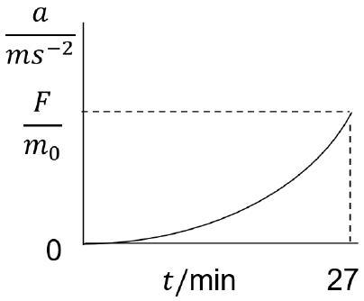

(viii) • Diagram $\square$

- $$
d v = a d t = \frac { F } { m } d t
$$
$m = m _ { 0 } - k t \quad$ with $\quad k = \frac { \delta m } { t }$
$F$ is in same direction as $v$
$$
\begin{gathered}
\int _ { v } ^ { v _ { 0 } } d v = \int _ { 0 } ^ { t } \frac { F } { m _ { 0 } - k t } d t \\
v _ { 0 } - v = - \frac { F } { k } \ln \left( 1 - \frac { k t } { m _ { 0 } } \right) \\
\Delta v = - \frac { F t } { \delta m } \ln \left( 1 - \frac { \delta m } { m _ { 0 } } \right)
\end{gathered}
$$

The $\quad \Delta v = v _ { \mathrm { M } } - v _ { A } = 24.2 - 21.6 = 2.6 \mathrm {~km} \mathrm {~s} ^ { - 1 }$
$2.6 \times 10 ^ { 3 } = - \frac { F \times 27 \times 60 } { 400 } \ln \left( 1 - \frac { 400 } { 1350 } \right)$
$F = 1.8 \mathrm { kN }$ mark for method not the numeric result
So for one thruster the force is $\approx 0.5 \mathrm { kN }$
(8 marks)

b) 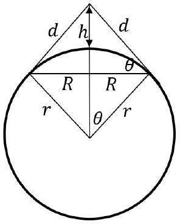
    (i) Diagram
$$
\begin{aligned}
\cos \theta & = \frac { r } { h + r } \\
\sin \theta & = \frac { R } { r }
\end{aligned}
$$
Using the identity $s ^ { 2 } + c ^ { 2 } = 1$, we have
$$
\frac { r ^ { 2 } } { ( h + r ) ^ { 2 } } + \frac { R ^ { 2 } } { r ^ { 2 } } = 1 \quad R , r \text { and } h \text { related }
$$
So $r ^ { 2 } r ^ { 2 } + R ^ { 2 } ( h + r ) ^ { 2 } = r ^ { 2 } ( h + r ) ^ { 2 }$
expanding
$$
r ^ { 4 } + R ^ { 2 } \left( h ^ { 2 } + r ^ { 2 } + 2 h r \right) = r ^ { 2 } h ^ { 2 } + r ^ { 4 } + 2 h r ^ { 3 }
$$
Hence
$$
\begin{aligned}
& R ^ { 2 } = r ^ { 2 } \frac { \left( h ^ { 2 } + 2 h r \right) } { \left( h ^ { 2 } + 2 h r + r ^ { 2 } \right) } \\
& \quad \left( 780 ^ { 2 } + 2 \times 780 \times 5370 \right) \\
& \left. 30 ^ { 2 } + 2 \times 780 \times 5370 + 6370 ^ { 2 } \right) \\
& \mathrm { m }
\end{aligned}
$$ $\square$
    (ii) For $R = 2350 \mathrm {~km}$ the intensity is
$$
I \approx \frac { 200 } { \pi R ^ { 2 } } = 1.2 \times 10 ^ { - 11 } \mathrm { Wm } ^ { - 2 }
$$ $\square$
    (iii) Some realistic derivation of the form, in a time $\Delta t$ there are $f _ { \mathrm { s } } \Delta t$ wavelengths emitted from a receding source which are received by a stationary observer.
These wavelengths are covering a distance $( c + v ) \Delta t$
The length of one of these wavelengths, $\lambda _ { \mathrm { o } } = \frac { ( c + v ) \Delta t } { f _ { \mathrm { s } } \Delta t }$
Thus $\lambda _ { \mathrm { o } } = \frac { ( c + v ) } { f _ { \mathrm { s } } } = \lambda _ { \mathrm { s } } + v / f _ { \mathrm { s } } = \lambda _ { \mathrm { s } } + v \lambda _ { \mathrm { s } } / c = \lambda _ { \mathrm { s } } ( 1 + v / c )$ $\square$
    (iv) $\frac { \Delta f } { f } = \frac { v } { c }$ for $v \ll c$. $\square$
    (v) As the satellite passes overhead, the observer will not see it approaching or receding and will conclude that there is no Doppler effect. As the satellite rises above the horizon on one side or goes below the horizon on the other. it will be approaching or receding at the maximum speed from the observer on the Earth's surface.
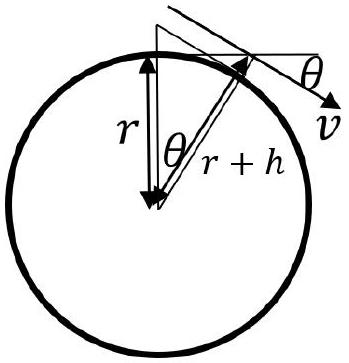

$$
\begin{aligned}
& v _ { \text {recession } } = v \cos \theta \\
& \cos \theta = \frac { r } { ( r + h ) } = \frac { 6370 } { ( 6370 + 780 ) } = \frac { 6370 } { 7150 } \\
& \cos \theta = 0.89
\end{aligned}
$$

Hence $v _ { \text {recession } } = v \times 0.89$
For the orbital speed $v$, using $\frac { v ^ { 2 } } { r } = \frac { G M } { r ^ { 2 } }$ then $v ^ { 2 } = \frac { G M } { r } = \frac { 6.67 \times 10 ^ { - 11 } \times 5.97 \times 10 ^ { 24 } } { 7.15 \times 10 ^ { 6 } }$
This gives $v = 7460 \mathrm {~m} \mathrm {~s} ^ { - 1 }$
The resulting maximum velocity of recession or approach is

$$
v _ { \text {recession } } = 7460 \times 0.89 = 6640 \mathrm {~m} \mathrm {~s} ^ { - 1 }
$$

The Doppler frequency shift will be $\Delta f = \frac { f v } { c } = \frac { 1620 \times 10 ^ { 6 } \times 6640 } { 3 \times 10 ^ { 8 } } = \pm 36 \mathrm { kHz }$
( 9 marks)

## Qu 5.

a) 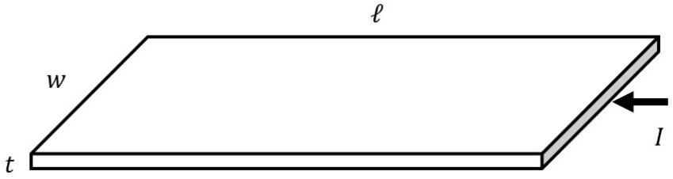
    (i) With
$$
\begin{aligned}
R & = \frac { \rho \ell } { w t } = \frac { 1.5 \times 10 ^ { - 7 } \times 0.3 } { 4 \times 10 ^ { - 3 } \times 10 \times 10 ^ { - 6 } } \\
& = 1.125 \Omega \\
& = 1.13 = 1.1 \Omega
\end{aligned}
$$
    (ii) Substituting into $R = R _ { 0 } ( 1 + \alpha \theta )$
$$
\begin{aligned}
& R = 1.125 \left( 1 + 3.3 \times 10 ^ { - 3 } \times 15 \right) \\
& R = 1.18 \Omega = 1.2 \Omega
\end{aligned}
$$
    ✓ Hence $P = \frac { V ^ { 2 } } { R } \quad$ gives $\quad P = 3.39 = 3.4 \mathrm {~W}$
    (iii) Power loss $= k A ( \theta - 0 ) = k A \theta$
So
$$
\frac { V ^ { 2 } } { R _ { 0 } ( 1 + \alpha \theta ) } = k A \theta
$$
This gives
$$
k A R _ { 0 } \alpha \theta ^ { 2 } + R _ { 0 } k A \theta - V ^ { 2 } = 0
$$
✓
$$
\theta = \frac { - R _ { 0 } k A \pm \sqrt { R _ { 0 } ^ { 2 } k ^ { 2 } A ^ { 2 } + 4 R _ { 0 } \alpha k A V ^ { 2 } } } { 2 R _ { 0 } \alpha k A }
$$
$$
\begin{aligned}
& = - \frac { 1 } { 2 \alpha } \pm \frac { R _ { 0 } k A } { 2 \alpha R _ { 0 } k A } \sqrt { 1 + \frac { 4 \alpha V ^ { 2 } } { R _ { 0 } k A } } \\
& = \frac { 1 } { 2 \alpha } \left( - 1 + \sqrt { 1 + \frac { 4 \alpha V ^ { 2 } } { R _ { 0 } k A } } \right) \\
& = \frac { 1 } { 2 \times 3.3 \times 10 ^ { - 3 } } \left( - 1 + \sqrt { 1 + \frac { 4 \times 3.3 \times 10 ^ { - 3 } \times 4 } { 1.125 \times 22 \times 0.3 \times 4 \times 10 ^ { - } 3 \times 2 } } \right) \\
& = 57 ^ { \circ } \mathrm { C } \text { if front and back surfaces considered } ( 2 A )
\end{aligned}
$$
or 101 °C if only one surface is considered for $A$. Either answer is allowed.
✓
( 6 marks)
b) The filament has a transverse wave with a node in the middle and four loops
So that means that $2 \lambda = 25 \mathrm {~cm}$
✓
The speed of a transverse wave along a wire under tension $T$ is $v = \sqrt { \frac { T } { \mu } }$
So that using $v = f \lambda$ we can write $f ^ { 2 } \lambda ^ { 2 } = \frac { T } { \mu }$
We will need to know the mass per unit length, $\mu$, and we are given the density. We need to estimate the diameter of the filament.
It is greater than 0.1 mm and less then 10 mm so we can take 1 mm .
✓
$\mu = \frac { m } { \ell } = \frac { \rho A \ell } { \ell } = \rho A = \rho \pi \frac { \ell ^ { 2 } } { 2 }$
An estimate of $\mu$ is $19 \times 10 ^ { 3 } \times \pi \times \left( 0.5 \times 10 ^ { - 3 } \right) ^ { 2 } = 0.015 \mathrm {~kg} \mathrm {~m} ^ { - 2 }$
Hence $T = \left( 50 \times \frac { 0.25 } { 2 } \right) ^ { 2 } \times 0.015 = 0.6 \mathrm {~N}$
( 3 marks)

c) $J = \frac { I } { A }$ and $P = I ^ { 2 } R$
So $P = I ^ { 2 } R = J ^ { 2 } A ^ { 2 } \times \frac { \rho \ell } { A } = J ^ { 2 } A \rho \ell = J ^ { 2 } V \rho$ $\square$
( 1 marks)
d) For a balanced circuit $\frac { R _ { 2 } } { R _ { \text {bulb } } } = \frac { R _ { 1 } } { R _ { 3 } }$. In this case that means the the bulb must be the same as $R _ { 2 }$, i.e. $4 \Omega$ $\square$
So $R _ { \text {bulb } } = 4 \Omega = \frac { V } { I } = \frac { 2 I + 8 I ^ { 2 } } { I } = 2 + 8 I$ $\square$
this gives $I _ { \text {bulb } } = 0.25 \mathrm {~A}$
Each resistor has 0.25 A flowing through it, so $V _ { \mathrm { b } } = 2 \mathrm {~V}$ $\square$
( 3 marks)

e) Given that the maximum power converted in the cell is when the external resistance is equal to the internal resistance $R$, (notation "//" reads "is in parallel with"

(i) We have $\quad ( x + 1 ) R / / y R + x R = R$ $\square$
Hence
$$
\frac { ( x + 1 ) R \cdot y R } { ( x + 1 ) R + y R } + x R = R
$$
Cancelling $R ^ { \prime } s$ we have
$$
\frac { ( x + 1 ) y } { ( x + y + 1 ) } + x = 1
$$
then $\quad x y + y + x ( x + y + 1 ) = x + y + 1$
which gives $\quad x y + y + x ^ { 2 } + x + x y = x + y + 1$
$$
x ( 2 y + x ) = 1
$$
$2 x y + x ^ { 2 } - 1 = 0$ $\square$
(ii) Kirchhoff I for currents at a node $i _ { 1 } = i _ { 2 } + i _ { 3 }$
then
$$
\frac { i _ { 1 } } { i _ { 2 } } = 1 + \frac { i _ { 3 } } { i _ { 2 } }
$$ $\square$
So then
$$
\begin{aligned}
\frac { i _ { 1 } } { i _ { 2 } } & = 1 + \frac { i _ { 3 } } { i _ { 2 } } = 1 + \frac { V } { y R } / \frac { V } { x R + R } \\
& = 1 + \frac { x + 1 } { y } = \frac { ( x + y + 1 ) } { y }
\end{aligned}
$$ $\square$
(iii) • $P _ { \text {input } }$ is power delivered by the cell $\left( = E i _ { 1 } - i _ { 1 } ^ { 2 } R \right)$
but this is equal to the power dissipated in all the resistors. $\square$
    - Hence the required quantity is $\frac { i _ { 1 } ^ { 2 } x R + i _ { 2 } ^ { 2 } ( x + 1 ) R + i _ { 3 } ^ { 2 } y R } { i _ { 2 } ^ { 2 } R }$ □
$$
\begin{aligned}
& = \frac { i _ { 1 } ^ { 2 } } { i _ { 2 } ^ { 2 } } x + ( x + 1 ) + \frac { i _ { 3 } ^ { 2 } } { i _ { 2 } ^ { 2 } } \\
& = \frac { x } { y ^ { 2 } } ( y + x + 1 ) ^ { 2 } + ( x + 1 ) + \frac { y } { y ^ { 2 } } ( x + 1 ) ^ { 2 }
\end{aligned}
$$
using the previous results for $\frac { i _ { 1 } } { i _ { 2 } }$ and $\frac { i _ { 3 } } { i _ { 2 } } = \frac { ( y + 1 ) } { y }$
Now it is algebra and using the relation between $x$ and $y$ in part (i)
$$
\frac { P _ { \text {input } } } { P _ { \text {load } } } = \frac { x } { y ^ { 2 } } \left( \frac { 1 - x ^ { 2 } } { 2 x } + x + 1 \right) ^ { 2 } + x + 1 + \frac { 2 x } { 1 - x ^ { 2 } } ( x + 1 ) ^ { 2 }
$$

$$
\begin{aligned}
& = \frac { x } { y ^ { 2 } } \left( \frac { 1 - x ^ { 2 } + 2 x ^ { 2 } + 2 x } { 2 x } \right) ^ { 2 } + x + 1 + 2 x \frac { ( 1 + x ) } { ( 1 - x ) } \\
& = \frac { x } { y ^ { 2 } } \left( \frac { x ^ { 2 } + 2 x + 1 } { 2 x } \right) ^ { 2 } + \frac { \left( 1 - x ^ { 2 } + 2 x ^ { 2 } + 2 x \right) } { ( 1 - x ) } \\
& = \frac { x } { y ^ { 2 } } \frac { ( x + 1 ) ^ { 4 } } { 4 x ^ { 2 } } + \frac { ( 1 + x ) ^ { 2 } } { ( 1 - x ) } \\
& = ( x + 1 ) ^ { 2 } \left( \frac { ( x + 1 ) ^ { 2 } } { 4 x y ^ { 2 } } + \frac { 1 } { ( 1 - x ) } \right) \\
& = ( x + 1 ) ^ { 2 } \left( \frac { ( x + 1 ) ^ { 2 } 4 x ^ { 2 } } { 4 x \left( 1 - x ^ { 2 } \right) ^ { 2 } } + \frac { 1 } { ( 1 - x ) } \right) \\
& = \frac { ( x + 1 ) ^ { 2 } } { ( 1 - x ) } \left( \frac { ( x + 1 ) ^ { 2 } x } { ( 1 - x ) ( 1 + x ) ^ { 2 } } + 1 \right) \\
& = \frac { ( x + 1 ) ^ { 2 } } { ( 1 - x ) } \left( \frac { x + ( 1 - x ) } { ( 1 - x ) } \right) \\
& = \frac { ( 1 + x ) ^ { 2 } } { ( 1 - x ) ^ { 2 } }
\end{aligned}
$$ $\square$ $\square$

f) (i) The resistance between the two hemispheres is $R = \frac { \rho \delta r } { 2 \pi r ^ { 2 } }$

(ii) For a large value of $\delta r$ the area will change and so we need to sum the resistance contributions from each hemispherical layer of liquid.
Integrating up $\quad d R = \frac { \rho d r } { 2 \pi r ^ { 2 } }$ for a sphere of radius $r _ { \mathrm { s } }$ to $r _ { \text {large } }$
$$
\int _ { R _ { \mathrm { s } } } ^ { R _ { \text {large } } } d R = \int _ { r _ { \mathrm { s } } } ^ { r _ { \text {large } } } \frac { \rho d r } { 2 \pi r ^ { 2 } }
$$
As $r _ { \text {large } }$ tends to infinity then $1 / r _ { \text {large } }$ tends to zero. The resistance between the sphere and a distant surface (the tank) becomes $\Delta R = \frac { \rho } { 2 \pi r _ { \mathrm { s } } } = 95 = 100 \Omega$, $\square$
(iii) If a sphere is used instead, then the current flow lines will be the same but there will be two identical paths for the current flowing radially outwards from the sphere. So the resistance will be halved to $\Delta R = \frac { \rho } { 4 \pi r _ { \mathrm { s } } } = 50 \Omega$ $\square$
(iv) $\frac { \rho } { 2 \pi r }$

( 5 marks)
