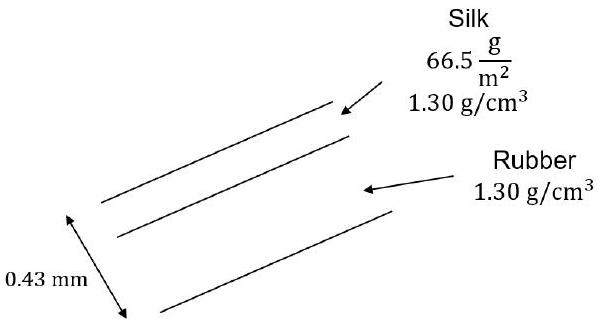
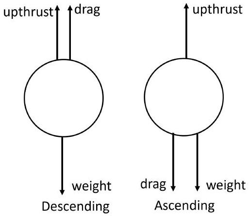

## Qu 3.

a)

- Force down = weight + weight of hot air
$$
= 200 g + \rho _ { h o t } V g
$$
- Upthrust = weight of cold air displaced
$$
= \rho _ { \text {cold } } V g
$$
- Balance forces: $200 g + \rho _ { \text {hot } } V g = \rho _ { \text {cold } } V g$ ✓
b) - As in previous question, $830 g + \rho _ { h o t } V g = \rho _ { \text {cold } } V g$
So
$$
\rho _ { h o t } = \frac { \rho _ { c o l d } V - 830 } { V } = \frac { 1.23 \times 2000 - 830 } { 2000 } = 0.815 \mathrm {~kg} \mathrm {~m} ^ { - 3 }
$$
- $n = \frac { m _ { \text {hot } } \text { air } } { 0.029 } = \frac { 1630 } { 0.029 } = 5.6 \times 10 ^ { 4 } \mathrm {~mol}$ ✓
- Assuming ideal gas: $T = \frac { P V } { n R }$
$$
T = \frac { 1.01 \times 10 ^ { 5 } \times 2000 } { 5.6 \times 10 ^ { 4 } \times 8.314 } = 430 \mathrm {~K} = 160 ^ { \circ } \mathrm { C }
$$
✓
(3 marks)

Alternatively:
[ An estimate can be made using the ideal gas equation, $P \propto n / V R T$ and hence for a constant pressure, $\rho T =$ const . If we assume a cold temperature of $20 ^ { \circ } \mathrm { C }$ then

$$
\begin{gathered}
\rho _ { H } T _ { H } = \rho _ { C } T _ { C } \\
1.23 \times 293 = 0.815 \times T _ { H } \quad \text { so } \quad T _ { H } = 442 \mathrm {~K} = 169 ^ { \circ } \mathrm { C }
\end{gathered}
$$

One mark for the earlier calculated density of hot air and 1 mark for the temperature calculation ie. 2/3]

c) (i) ● Assuming ideal gas $n = \frac { P V } { R T }$
- $m = n M = \frac { P V } { R T } M$
$$
m = \frac { 1.01 \times 10 ^ { 5 } \times 380 } { 8.314 \times 288 } = 16030 \times 0.002 = 32.1 = 32 \mathrm {~kg}
$$
✓
    (ii) ● Radius $r ^ { 3 } = \frac { 3 \times 380 } { 4 \times \pi }$
$$
r = 4.49 \mathrm {~m}
$$
✓
    - calculate thicknesses of silk and rubber

$t _ { \text {silk } } = \frac { 66.5 \mathrm {~g} \mathrm {~m} ^ { - 2 } } { 1.30 \mathrm {~g} \mathrm {~cm} ^ { - 3 } } = \frac { 66.5 \times 10 ^ { - 5 } \mathrm {~m} } { 1.30 } = 5.115 \times 10 ^ { - 5 } \mathrm {~m}$ ✓
So thickness of rubber $= 4.3 \times 10 ^ { - 4 } - 0.5115 \times 10 ^ { - 4 } \mathrm {~m} = 3.79 \times 10 ^ { - 4 } \mathrm {~m}$ ✓
- Mass = thickness × density × area
Mass of balloon $= \left( 1.30 \times 10 ^ { 3 } \times 5.115 \times 10 ^ { - 5 } + 1.30 \times 10 ^ { 3 } \times 3.788 \times 10 ^ { - 4 } \right) 4 \pi r ^ { 2 }$
$$
= 0.574 \times 4 \pi 4.49 ^ { 2 } = 145.6 = 146 = 150 \mathrm {~kg}
$$
✓
- $m _ { \text {total } } = m _ { \text {Hydrogen } } + m _ { \text {balloon } } + m _ { \text {payload } }$
mass $= ( 32 + 146 + 270 ) = 448 \mathrm {~kg}$
So $\quad 448 a = 380 \times 1.23 \times 9.81 - 448 \times 9.81$
$$
a = 0.42 \mathrm {~m} \mathrm {~s} ^ { - 2 }
$$
✓

(6 marks)

d) Descends with constant velocity forces are balanced, drag always in opposite direction to travel.

    - Since $F _ { d } \propto v$ then the drag force is the same going down as up, since $v$ is the same.
    - Descending: $F _ { d } + U = W$ ✓
    - Ascending: $W - m _ { 2 } g + F _ { d } = U$ ✓
    - Re-arranging both for U as upthrust is constant can set equal.
$W - m _ { 2 } g + F _ { d } = W - F _ { d }$
$$
m _ { 2 } = \frac { 2 F _ { d } } { g }
$$
✓ (3 marks)
e) (i) • $\Delta p = \rho g \Delta h$
    - Ideal gas equation: $p V = n R T$ and $M$ is the kg molar mass.
Use $V = \frac { m } { \rho }$ and $n = \frac { m } { M }$ ✓
        - $p \frac { m } { \rho } = \frac { m } { M } R T$
$$
p = \frac { \rho R T } { M }
$$
✓
        - Substitute equation for $\rho$ in ideal gas equation into hydrostatic equation:
$$
\frac { \Delta p } { p } = \frac { M g } { R T } \Delta h
$$
✓

- The differential form includes a - sign since as $z$ increases $P$ decreases.
Then
$$
d p = - \rho g d z = - \frac { p M } { R T } g d h
$$
Substitute $T = T _ { 0 } - \alpha h$ into this result:
$$
\frac { \Delta p } { p } = - \frac { M g } { R \left( T _ { 0 } - \alpha h \right) } \Delta h
$$
- Integrate both sides:
$$
\begin{aligned}
& \int _ { P _ { 0 } } ^ { P ( h ) } \frac { 1 } { p } d p = \int _ { 0 } ^ { h } - \frac { M g } { R \left( T _ { 0 } - \alpha h \right) } d h \\
& \ln \left( \frac { P ( h ) } { P _ { 0 } } \right) = \frac { M g } { R \alpha } \ln \left( \frac { T _ { 0 } - \alpha h } { T _ { 0 } } \right) \\
& P ( h ) = P _ { 0 } \left( \frac { T _ { 0 } - \alpha h } { T _ { 0 } } \right) ^ { \frac { M g } { R \alpha } }
\end{aligned}
$$
$\square$ $\square$

(5 marks)

(ii) • Get temperature from $T = T _ { 0 } - \alpha h = 288 - ( 0.00976 \times 3000 ) = 258.7 = 259 \mathrm {~K}$ $\square$
- Substitute values into the equation derived:
$$
\begin{aligned}
& P ( 3000 ) = 1.01 \times 10 ^ { 5 } \left( \frac { 288 - 0.00976 \times 3000 } { 288 } \right) ^ { \frac { 0.0299 \times 9.81 } { 8.314 \times 0.00976 } } \\
& P ( 3000 ) = 1.01 \times 10 ^ { 5 } \left( \frac { 259 } { 288 } \right) ^ { 3.51 } = 7.0 \times 10 ^ { 4 } \mathrm {~Pa}
\end{aligned}
$$
$\square$
(2 marks)
(iii) • Pressure inside balloon: $\frac { P _ { 1 } V _ { 1 } } { T _ { 1 } } = \frac { P _ { 2 } V _ { 2 } } { T _ { 2 } }$
$$
\frac { 1.01 \times 10 ^ { 5 } \times V _ { 1 } } { 288 } = \frac { P _ { 2 } \times 1.3 \times V _ { 1 } } { 259 } \text { gives } P _ { 2 } = 70 \mathrm { kPa }
$$
$\square$
OR
If the temperature of the hydrogen remains at 288 K then the pressure is given by $1.01 \times 10 ^ { 5 } \times V _ { 1 } = P _ { 2 } \times 1.3 V _ { 1 }$ and $P _ { 2 } = 78 \mathrm { kPa }$
    - Stress is given by the (pressure) × (area of cross section) ÷ (circumferential area of material)
$$
\begin{align*}
& = \frac { P _ { 2 } \times \pi r ^ { 2 } } { 2 \pi r \delta r } = \frac { P _ { 2 } r } { 2 \delta r }  \tag{✓}\\
& = \frac { 0.70 \times 10 ^ { 5 } \times \left[ 4.49 \times ( 1.3 ) ^ { 1 / 3 } \right] } { 2 \times 0.43 \times 10 ^ { - 3 } } = 4 \times 10 ^ { 8 } \mathrm {~Pa} \tag{✓}
\end{align*}
$$
    - Young's Modulus $E = \frac { \text { stress } } { \text { strain } }$
- In the surface of the balloon, strain $= \frac { \ell ^ { \prime } } { \ell _ { o } } = \frac { r ^ { \prime } } { r _ { o } } = \left( \frac { V ^ { \prime } } { V _ { o } } \right) ^ { \frac { 1 } { 3 } } = 1.3 ^ { \frac { 1 } { 3 } } = 1.09$
$$
\frac { \delta \ell } { \ell _ { o } } = \frac { \ell ^ { \prime } - \ell _ { o } } { \ell } = 1.09 - 1 = 0.09
$$
    - so $E = \frac { 4 \times 10 ^ { 8 } } { 0.09 } = 4 \times 10 ^ { 9 } \mathrm {~Pa}$

(4 marks)
