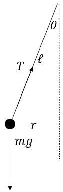
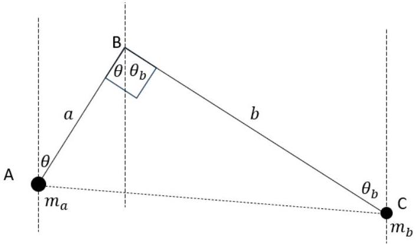
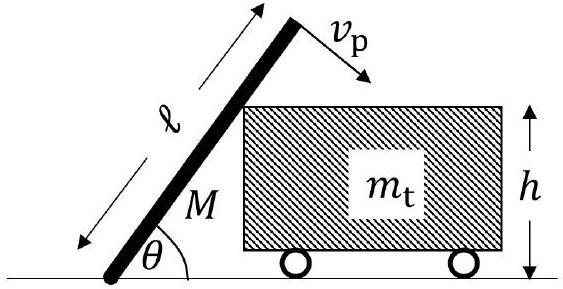
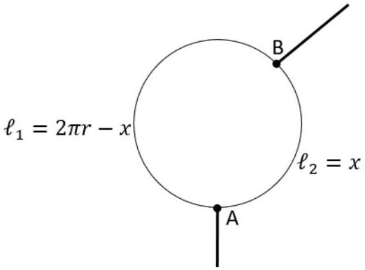
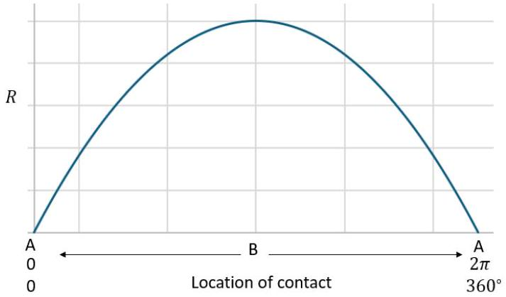
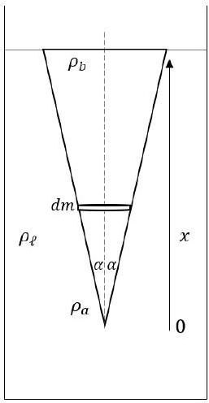
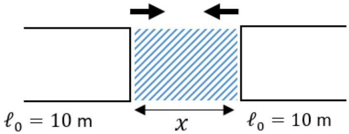
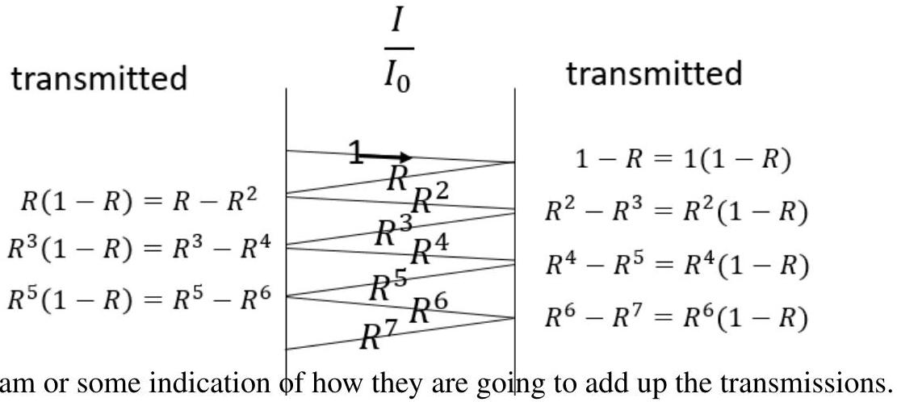
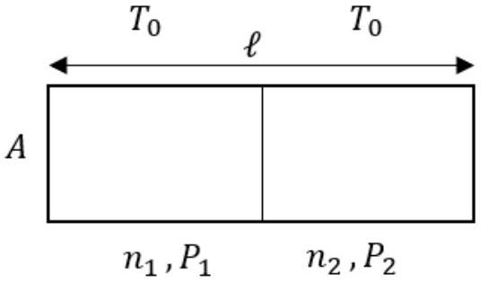

## November 2024

Instructions Give equivalent credit for alternative solutions which are correct physics. The question paper \& solutions should be read through first. If you do not know what the question is about, you will not mark accurately and it will be much more work for you. This is to ensure that you understand the questions. Then the first 10 scripts are issued.

- The scripts will only be available in PDF format. Do not print. Do not change the filename.
- IMPORTANT - Please take a quick glance to makes sure that the file name which has the students name is the name of the student on the front cover sheet. They will often be a little different - no matter - but this is our only check that you have the correct student's paper in front of you.
- You will need to have software such that you can annotate on the PDF (Microsoft Edge works quite well). A pen is easier than a mouse, but you can manage with a mouse.
- If there is something about a student paper that needs a comment, then make the comment in the Platform where there is a comment box for each paper. - (suspicious result, missing question, blank paper, missing page, no name, illegible, different handwriting, can't identify the question, lots of writing but all nonsense, wrong year's paper (yes, it happens), the question paper scanned in !!!, etc.). These are confidential comments and are only for us to follow up in some way.
- DO NOT MIX UP THE MARKS. That tarnishes everyone's marking.

Recording marks

- Annotate on the script in RED. Make sure all marks awarded are clearly annotated on the page. Put a total at the bottom of each page, in a circle, to make it easier to add the marks up correctly. Add up the total on the script and write it at the top of the Section 1 and on the front cover sheet.
- We need the total for Q1.
For Section 2 the mark AND which questions it is.
- There is a total of 76 marks allocated for Question 1. Please write down the total they obtain even if it is very occasionally above the 50.
- Students are meant to answer two questions in Section 2. Each question carries a maximum of 25 marks. If a student attempts more than two questions, only the highest two marks are recorded .
- If the mark scheme has a different mark allocation use the Mark Scheme allocation.

## Allocating marks for solutions

- Please try to understand the students' workings as there are different methods to arrive at the same solution.
- If the correct final answer is there, you can give them the marks for the question part as long as there is some evidence of working and not just the answer alone.
- We do not worry about the exact number of sig figs, or whether they have some very slight discrepancy in the numerical value in the answer due to some rounding error.
- ECF (error carried forward): when students have made an error at the beginning of a question and then use the incorrect answer in a follow-on calculation. Students lose marks for the first incorrect answer but can obtain full marks for using the correct method in the follow-on calculation. Numerically this may only be for the next one or two steps though, if it means a lot of work in calculating to check their numerical follow on results. It could go further if the calculation is easy to follow through. Symbolically the same applies. A reasonable effort must be made to see what the student has done in the next few steps.
- If you do not understand a question or solution, email Robin Hughes rh584@cam.ac.uk. Send a picture from your phone and I will reply promptly.

## Quality control

- Marked papers will be checked by other markers to ensure consistency in marking.
- You must be consistent in your marking, following the mark scheme allocation of marks. You must not give marks out based on your own opinion of how you think marks should be given.
- You must mark accurately according to the mark scheme. Print it out and make sure that you have a copy. You can forget what the marks are for after a while and that is not fair on the student. There will be updates and you will be notified on Teams. Look at the updates and remind yourself of the mark scheme for each session you mark.

## Avoid

- Mistakes in tallying up the total marks
- Mistakes in allotting or not allotting correct marks without reasonable explanation.
- Mixing up two students on your list and giving them the wrong marks. (this is critical!)

## Generally allow leeway of ±1 significant figure.

This is not the tight marking scheme of an exam paper. It is to allow students to engage in problem solving and develop their physics by working through problems requiring explanations, and developing ideas or models. Mark generously to encourage ideas, determination and the willingness to have a go.

The solution calculations simply show one way to tackle the task; a good deal of latitude is needed in the marking to allow equivalent credit for other sensible approaches and degrees of approximation. Students may have better solutions. Please let us know and we will add them to the solutions.

## Qu 1.

Remember that they do not need the intermediate steps or this particular solution for the marks.

a) Stone dropped in a pool.
    - [Note: they may NOT use $s = 9$ i.e. $( 4 + 5 ) \mathrm { m }$ which gives $t = 1.355 = 1.4 \mathrm {~s}$. Zero marks if that is all they have done.]
    - $t _ { 1 } = \sqrt { \frac { 2 s } { g } }$
    - reaches water at speed $v _ { 1 } = g t _ { 1 } = u _ { 2 }$
    - time in water is $t _ { 2 } = \frac { d _ { 2 } } { u _ { 2 } }$
    - Hence $T = t _ { 1 } + t _ { 2 } = \sqrt { \frac { 10 } { g } } + \frac { 4 } { \sqrt { 10 g } }$ ✓
$$
\begin{aligned}
& = \frac { 1 } { \sqrt { g } } \left( \sqrt { 10 } + \frac { 4 } { \sqrt { 10 } } \right) = 1.0096 + 0.4039 \\
& = 1.4135 = 1.4 \mathrm {~s}
\end{aligned}
$$
✓
full marks for answer as long as some relevant working (other routes allowed) (3 marks)

b) Velocities in Milky Way \& Solar System

- $v _ { \mathrm { E } } = \frac { 2 \pi \times 8 } { 1 } \frac { \text { light minutes } } { \text { year } }$
✓
- $v _ { \mathrm { SS } } = \frac { 2 \pi \times 8.3 \times 10 ^ { 3 } \times 3.26 } { 240 \times 10 ^ { 6 } } \frac { \text { light year } } { \text { year } }$ ✓
- $\frac { v _ { \mathrm { E } } } { v _ { \mathrm { SS } } } = \frac { 2 \pi \times 8.3 \times 10 ^ { 3 } \times 3.26 } { 8 \times 240 \times 10 ^ { 6 } } \frac { \phi \text { year } } { \phi \text { minute } }$
$$
\begin{aligned}
& = \frac { 8.3 \times 3.26 \times 10 ^ { - 3 } } { 240 \times 8 } \times 365 \times 24 \times 60 \\
& = 7.4
\end{aligned}
$$
✓
If they have $7.4 \times 10 ^ { \pm 6 }$ then they get 1 mark as they have forgotten some power of 10 factor. Otherwise no ecf for this - too time consuming to check through for one mark

(3 marks)

c) Spring in a lift.
$m g = k \Delta \ell _ { 1 }$ ✓
- $m g + m \cdot \frac { 18 } { 6 } = k \Delta \ell _ { 2 }$ ✓
Dividing $\frac { m g } { m ( g + 3 ) } = \frac { k \Delta \ell _ { 1 } } { k \Delta \ell _ { 2 } }$
Hence $\frac { \Delta \ell _ { 1 } } { \Delta \ell _ { 2 } } = \frac { g } { g + 3 } = 0.77$ ✓
No ecf for this (3 marks)

d) conical pendulum

    - Diagram for a progress mark - full marks if they get to the answer without the diagram: variations allowed but must show $\theta , T , m ( m g )$
    Resolve vertically: $m g = T \cos \theta$
    - Resolve horizontally: $m r \omega ^ { 2 } = T \sin \theta$
Divide: $\frac { r \omega ^ { 2 } } { g } = \tan \theta$
$\omega ^ { 2 } = \frac { 4 \pi ^ { 2 } } { t ^ { 2 } } = \frac { g } { r } \tan \theta$
So $t = 2 \pi \sqrt { \frac { r } { g \tan \theta } }$
with $\tan \theta = \frac { r } { \ell \cos \theta }$
then $t = 2 \pi \sqrt { \frac { \ell \cos \theta } { g } }$
Lose a mark if they have used $\theta$ to the horizontal i.e. $\tan \theta \rightarrow \frac { 1 } { \tan \theta }$ and $\cos \theta \rightarrow \sin \theta$
(4 marks)
e) L-shaped bar.

Diagram for a progress mark - full marks if they get to the answer without the diagram: variations allowed. But must show $\theta , a , b , m _ { a } , m _ { b }$
It does not matter f the diagram is upside down. The answer is the same
- Moments $m _ { a } \cdot g \cdot a \cdot \sin \theta = m _ { b } \cdot g \cdot b \cdot \sin \theta _ { b }$
✓
    - $\theta + \theta _ { b } = 90 ^ { \circ }$
    - Hence $\sin \theta _ { b } = \cos \theta _ { a }$
- so $\tan \theta = \frac { m _ { b } \cdot b } { m _ { a } \cdot a }$
If they take $\theta$ to the horizontal, giving $\cot \theta = \frac { m _ { b } \cdot b } { m _ { a } \cdot a }$ they lose one mark
(4 marks)

f) Falling plank.

    - $v _ { \mathrm { p } } \sin \theta = v _ { \mathrm { t } } \quad \Rightarrow \quad v _ { \mathrm { p } } \frac { h } { \ell } = v _ { \mathrm { t } }$ at the end of the fall.
    - Energy: $\quad \frac { 1 } { 6 } M v _ { \mathrm { p } } ^ { 2 } + \frac { 1 } { 2 } m _ { \mathrm { t } } v _ { \mathrm { t } } ^ { 2 } = M g \frac { \ell } { 2 } ( 1 - \sin \theta )$ $\frac { 1 } { 6 } M v _ { \mathrm { p } } ^ { 2 } + \frac { 1 } { 2 } m _ { \mathrm { t } } v _ { \mathrm { p } } ^ { 2 } \sin ^ { 2 } \theta = M g \frac { \ell } { 2 } ( 1 - \sin \theta )$
    $v _ { \mathrm { p } } ^ { 2 } \left( \frac { 1 } { 6 } M + \frac { 1 } { 2 } m _ { \mathrm { t } } \frac { h ^ { 2 } } { \ell ^ { 2 } } \right) = \frac { 1 } { 2 } M g ( \ell - h )$
$v _ { \mathrm { p } } ^ { 2 } \left( \frac { 1 } { 3 } + \frac { m _ { \mathrm { t } } } { M } \frac { h ^ { 2 } } { \ell ^ { 2 } } \right) = g ( \ell - h ) \quad$ a mark for progress in the working
$M = m _ { \mathrm { t } } / 2$
$\ell = 3 h$
So $v _ { \mathrm { p } } ^ { 2 } \left( \frac { 1 } { 3 } + \frac { 2 } { 9 } \right) = g \cdot 2 h$
$v _ { \mathrm { p } } ^ { 2 } = \frac { 9 } { 5 } g \cdot 2 h = \frac { 18 } { 5 } g h$
$v _ { \mathrm { t } } ^ { 2 } = \frac { 2 } { 5 } g h$
(4 marks)

g) Rocket testing machine.
    - Outwards: $v _ { \text {max } } = a t _ { 1 }$ and $v _ { a v } = v _ { \text {max } } / 2$
$$
\begin{aligned}
t _ { 1 } & = \frac { 2 v _ { a v } } { a } = \frac { 2 d } { a t _ { 1 } } \\
t _ { 1 } & = \sqrt { \frac { 2 d } { a } } \\
t _ { 2 } & = \frac { d } { v _ { c } }
\end{aligned}
$$
solving this quadratic in $d$,
$$
\begin{aligned}
& d = \left( 2 \left( \frac { T } { v _ { c } } + \frac { 1 } { a } \right) \pm \sqrt { 4 \left( \frac { T } { v _ { c } } + \frac { 1 } { a } \right) ^ { 2 } - 4 \frac { T ^ { 2 } } { v _ { c } ^ { 2 } } } \right) \frac { v _ { c } ^ { 2 } } { 2 } \\
& d = v _ { c } ^ { 2 } \left( \frac { T } { v _ { c } } + \frac { 1 } { a } \right) \pm v _ { c } ^ { 2 } \sqrt { \frac { T ^ { 2 } } { v _ { c } ^ { 2 } } + \frac { 1 } { a ^ { 2 } } + \frac { 2 T } { v _ { c } a } - \frac { T ^ { 2 } } { v _ { c } ^ { 2 } } } \\
& d = v _ { c } ^ { 2 } \left( \frac { T } { v _ { c } } + \frac { 1 } { a } \right) \pm \frac { v _ { c } ^ { 2 } } { a } \sqrt { \frac { 2 T a } { v _ { c } } + 1 } \\
& d = \frac { v _ { c } ^ { 2 } } { a } \left[ \left( \frac { T a } { v _ { c } } + 1 \right) \pm \sqrt { \frac { 2 T a } { v _ { c } } + 1 } \right] \\
& d = \frac { 144 } { 15 } \left[ \frac { 48.15 } { 12 } + 1 \pm \sqrt { \frac { 2.48 .15 } { 12 } + 1 } \right] = \frac { 144 } { 15 } [ 61 \pm 11 ] \\
& = \frac { 144.72 } { 15 } = 691 \mathrm {~m} \quad \text { or } \quad \frac { 144.50 } { 15 } = 480 \mathrm {~m}
\end{aligned}
$$
But the result must be less than than $12 \frac { \mathrm {~m} } { \mathrm {~s} } \times 48 \mathrm {~s} = 576 \mathrm {~m}$. So 480 metres.
- Alternative:
$$
\begin{aligned}
& d = 12 t _ { 2 } \text { and } d = \frac { 1 } { 2 } 15 t _ { 1 } ^ { 2 } \\
& t _ { 1 } + t _ { 2 } = 48 \\
& \text { So } \frac { 1 } { 2 } 15 t _ { 1 } ^ { 2 } = d = 12 t _ { 2 } \\
& \text { Thus } t _ { 1 } + \frac { 5 } { 8 } t _ { 1 } ^ { 2 } = 48 \\
& \text { Quadratic: } 5 t _ { 1 } ^ { 2 } + 8 t _ { 1 } - 384 = 0 \\
& \text { which solves as } t _ { 1 } = - 0.8 \pm 0.8 \sqrt { 1 + 120 } = - 0.8 \pm 0.8 \times 11 \\
& \text { So } t _ { 1 } = 8 \mathrm {~s} \\
& \text { Giving } d = \frac { 1 } { 2 } 15 t _ { 1 } ^ { 2 } = 480 \mathrm {~m}
\end{aligned}
$$

(6 marks)

h) Point on a wave.
    - argument of the cos function: $\frac { 2 \pi } { T } = 1800 \Rightarrow f = \frac { 1800 } { 2 \pi } = 286 \mathrm {~Hz}$
    - $\frac { 2 \pi } { \lambda } = 5.72 \Rightarrow \lambda = \frac { 2 \pi } { 5.72 } = 1.1 \mathrm {~m}$ $v = f \lambda = 314 \mathrm {~m} \mathrm {~s} ^ { - 1 } \quad$ both $v$ and $A$ needed for the mark $A = 4 \times 10 ^ { - 6 } \mathrm {~m}$ $\frac { \mathrm { d } y } { \mathrm {~d} t } = A \omega \sin \omega t$ $\left. \frac { \mathrm { d } y } { \mathrm {~d} t } \right| _ { \text {max } } = A \omega = A 2 \pi f = 4 \times 10 ^ { - 6 } \times 2 \pi \times 286 = 7.2 \mathrm {~mm} \mathrm {~s} ^ { - 1 }$
(4 marks)
i) Beats.
    - $P$ is constant. $P V = n R T$ which means that $\rho \sim \frac { 1 } { T }$
    - $\mathrm { Using } v = \sqrt { \frac { \gamma P } { \rho } } \Rightarrow v \propto \sqrt { T }$ $v _ { 1 } \sim \sqrt { T _ { 1 } }$ $v _ { 2 } \sim \sqrt { T _ { 2 } }$
The wavelength $\lambda$ in the pipe is constant. $f _ { 1 } = k \sqrt { T _ { 1 } }$ $f _ { 2 } = k \sqrt { T _ { 2 } }$
Therefore $\left( \frac { 252 } { 260 } \right) ^ { 2 } = \frac { T _ { 1 } } { T _ { 2 } }$ $T _ { 2 } = 290 \times \left( \frac { 260 } { 252 } \right) ^ { 2 } = 308.7 \mathrm {~K}$ $= 35.7 ^ { \circ } \mathrm { C }$ $\Delta T = 18.7 = 19 ^ { \circ } \mathrm { C }$
(4 marks)
j) Supercooled water.
    - The water extracts thermal energy to warm up to 0°C extracting this energy from the formation of ice releasing latent heat. At some stage, the water is at 0 °C and a lump of ice has been formed. But now everything is at 0 °C and no more ice can be formed.
    An indication of the grasp of the idea. ✓
    - $m _ { w } \times 4180 \times 10 = m _ { \text {ice } } L$
- $m _ { w } \times 4180 \times 10 = m _ { \text {ice } } L$ ✓
    - $\frac { m _ { \text {ice } } } { m _ { w } } - \frac { 4180 \times 10 } { 335000 } = \frac { 418 } { 3350 } = 0.1248 = 12 \%$ ✓

You could think of an intermediate stage, in which some of the water remains at -10 °C and the ice cools down below 0 °C. However, more water will freeze to ice, warming, so that the end result will be that all of the contents end up at 0 °C.
(3 marks)

k) Diode circuit.
    - $P _ { \mathrm { av } } = \Sigma ($ power $\times \Delta t ) / \Sigma \Delta T \quad$ Idea used. ✓
        (i) Taking the two halves of one cycle, $P _ { \mathrm { av } } = \left( \frac { V _ { 0 } ^ { 2 } } { R } \times \frac { T } { 2 } + 0 ( \right.$ diode $\left. ) \right) / T$ $P _ { \mathrm { av } } = \frac { V _ { 0 } ^ { 2 } } { 2 R }$
    (ii) A $\sin ^ { 2 } \theta$ curve is the shape of a sine curve above the axis. Its average value $\frac { 1 } { 2 }$. Taking the two halves of one cycle, $P _ { \mathrm { av } } = \left( \frac { 1 } { 2 } \frac { V _ { 0 } ^ { 2 } } { R } \times \frac { T } { 2 } + 0 \right.$ (diode) $) / T$ ✓ $P _ { \mathrm { av } } = \frac { V _ { 0 } ^ { 2 } } { 4 R }$ ✓ (4 marks)
1) Square of wires.
    - The two corners (NOT A and B) are equipotentials along with the centre point.
    - so $R _ { \mathrm { AB } }$ is $2 r \ell$, in parallel with $2 r \ell$, in parallel with the diagonal $\frac { 2 r \ell } { \sqrt { 2 } }$ i.e. $r \ell$ in parallel with $\sqrt { 2 } r \ell$
    - Hence $R _ { \mathrm { AB } } = r \ell \frac { \sqrt { 2 } } { ( 1 + \sqrt { 2 } ) } = r \ell \frac { 2 } { ( \sqrt { 2 } + 2 ) } = r \ell ( 2 - \sqrt { 2 } )$ any form accepted marks)
m) Circle of wire.

    (i) $\quad \cdot R _ { \mathrm { AB } } = \frac { \rho } { A } \frac { \ell _ { 1 } \ell _ { 2 } } { \left( \ell _ { 1 } + \ell _ { 2 } \right) } = \frac { \rho } { A } \frac { x ( 2 \pi r - x ) } { 2 \pi r }$
        - $R _ { \mathrm { AB } }$ is a max when B is opposite A, when $x = \pi r$
        - This is $61 \Omega$ for each semicircle - a single mark allowed if they end up with $61 \Omega$ only.
        - Recognise a parallel circuit.
        - $R _ { \mathrm { sym } } = \frac { \rho } { A } \frac { \pi r ( \pi r ) } { 2 \pi r } = \frac { \rho \pi r } { 2 A }$ $R _ { \text {sym } } = \frac { 3 \times 10 ^ { - 4 } \times \nVdash \times 0.1 } { 2 \times \nsim \left( 0.7 \times 10 ^ { - 3 } \right) ^ { 2 } } = 30.6 = 31 \Omega$

(ii) • gradient > 0 "steep" at ends
    - symmetric
    - curved
Two marks for correct graph which includes ABA (or equivalent notation) and resistance axis labelled and above shape specs.
(iii) Using $R _ { \mathrm { AB } } = \frac { \rho } { A } \frac { \ell _ { 1 } \ell _ { 2 } } { \left( \ell _ { 1 } + \ell _ { 2 } \right) } = \frac { \rho } { A } \frac { x ( 2 \pi r - x ) } { 2 \pi r }$
    - We have from the right equation above $22 \times \frac { A } { \rho } \times 2 \pi r = 2 \pi r x - x ^ { 2 }$
    - Rearranging for a quadratic, $\frac { x ^ { 2 } } { 2 \pi r } - x + 22 \frac { A } { \rho } = 0$
    - solving the quadratic, $x = \pi r \left( 1 \pm \sqrt { 1 - \frac { 4 \times 22 } { 2 \pi r } \frac { A } { \rho } } \right)$
    - There are two solutions, but there are two symmetric values for $x$ and we want the smaller one.
    - So $x = 0.14753 \mathrm {~m} = 14.8 \mathrm {~cm} = 15 \mathrm {~cm}$
(6 marks)
n) Charging a device. Given $I = I _ { 0 } - \alpha t$, there are several methods.
    (i) This is like constant acceleration since the current, the rate of flow of charge varies linearly. $\frac { d I } { d t } = - \alpha$
Hence $Q = I _ { 0 } t - \frac { 1 } { 2 } \alpha t ^ { 2 }$ and $I = 0$ when $I _ { 0 } = \alpha t _ { \text {fc } }$
Thus $t _ { f c } = \frac { I _ { 0 } } { \alpha }$
    ✓ ✓
    (ii) Then $Q _ { \text {max } } = I _ { 0 } \frac { I _ { 0 } } { \alpha } - \frac { 1 } { 2 } \alpha \left( \frac { I _ { 0 } } { \alpha } \right) ^ { 2 }$
$$
Q _ { \max } = \frac { I _ { 0 } ^ { 2 } } { 2 \alpha }
$$
OR given $I = I _ { 0 } - \alpha t$,
    - $\frac { d Q } { d t } = I _ { 0 } - \alpha t$ and integrate this to give $Q = I _ { 0 } t - \frac { 1 } { 2 } \alpha t ^ { 2 }$
    - Then $\dot { Q } = 0$ when $I _ { 0 } = \alpha t _ { f c }$ and substitute in to $Q$ expression, etc.
(4 marks)

o) Floating cone.

    - A cone diagram for a progress mark - full marks if they get to the answer without the diagram:
    - Density graph for the equation for a progress mark - full marks if they get to the answer without the graph:
    - We need to calculate the total mass $( \times g )$ of the cone and equate that to the buoyancy force.
    - Element of mass, $\mathrm { d } m$ is a horizontal disc shown on the diagram:
    - $\mathrm { d } m = ( x \tan \alpha ) ^ { 2 } \pi \rho _ { x } d x$
    - From the graph, $\rho _ { x } = \frac { \left( \rho _ { b } - \rho _ { a } \right) } { h } x + \rho _ { a }$
So $\mathrm { d } m = \tan ^ { 2 } \alpha x ^ { 2 } \pi d x \left[ \frac { \left( \rho _ { b } - \rho _ { a } \right) } { h } + \rho _ { a } \right] x = \tan ^ { 2 } \alpha x ^ { 2 } \pi d x \left( k x + \rho _ { a } \right) x$ with $k = \frac { \left( \rho _ { b } - \rho _ { a } \right) } { h }$
$\mathrm { d } m = \tan ^ { 2 } \alpha \pi k x ^ { 3 } d x + \tan ^ { 2 } \alpha \pi \rho _ { a } x ^ { 2 } d x$
Integrating, $m = \left. \tan ^ { 2 } \alpha \pi k \frac { x ^ { 4 } } { 4 } \right| _ { 0 } ^ { h } + \left. \rho _ { a } \tan ^ { 2 } \alpha \pi \frac { x ^ { 3 } } { 3 } \right| _ { 0 } ^ { h }$
$$
= \tan ^ { 2 } \alpha \pi \left[ k \frac { h ^ { 4 } } { 4 } + \rho _ { a } \frac { h ^ { 3 } } { 3 } \right]
$$
Equating the buoyancy force, $\frac { 1 } { 3 } \pi r ^ { 2 } h \rho _ { \ell } = \frac { 1 } { 3 } \pi h ^ { 3 } \tan ^ { 2 } \alpha \rho _ { \ell } = \tan ^ { 2 } \alpha \pi \left[ k \frac { h ^ { 4 } } { 4 } + \rho _ { a } \frac { h ^ { 3 } } { 3 } \right]$
So $\frac { \rho _ { \ell } } { 3 } = k \frac { h } { 4 } + \frac { \rho _ { a } } { 3 }$
and then $\frac { \rho _ { \ell } } { 3 } = \frac { \left( \rho _ { b } - \rho _ { a } \right) } { h } \frac { h } { 4 } + \frac { \rho _ { a } } { 3 }$
giving $\frac { \rho _ { \ell } } { 3 } = \frac { \rho _ { b } } { 4 } - \frac { \rho _ { a } } { 4 } + \frac { \rho _ { a } } { 3 }$
Since $\rho _ { b } = \frac { \rho _ { \ell } } { 2 }$ we can write $\frac { \rho _ { \ell } } { 3 } = \frac { \rho _ { \ell } } { 8 } - \frac { \rho _ { a } } { 4 } + \frac { \rho _ { a } } { 3 }$
which results in $\frac { \rho _ { a } } { \rho _ { \ell } } = \frac { 5 } { 24 }$
Full marks can be awarded even if no diagram
(6 marks)

p) Neoprene bridge.

    - $\ell = \ell _ { 0 } ( 1 + \alpha \Delta T )$ and $E = \frac { \text { stress } } { \text { strain } } = \left( \frac { F } { A } \right) / \frac { \delta \ell } { \ell } = \left( \frac { F } { A } \right) \frac { \ell } { \delta \ell }$
    - Expansion into the gap is from each side by $\Delta \ell = 2 \frac { \ell _ { 0 } } { 2 }$.
    - From expansion $\Delta \ell = \alpha \ell _ { 0 } \Delta T$
    - This compresses the neoprene width $x$ by $\delta \ell$
    - Now $\left. \frac { \delta \ell } { x } \right] _ { \text {neo } } = \frac { \text { stress } _ { \text {neo } } } { E _ { \text {neo } } }$
    - Concrete cracks when stress in neoprene = breaking stress of concrete ✓
    - Therefore $\frac { \left( \ell _ { 0 } \alpha \Delta T \right) } { x } = \frac { \text { breaking stress of concrete } } { E _ { \text {neo } } }$ ✓
    - $\Delta T = \frac { x } { \alpha \ell _ { 0 } } \times \frac { \text { breaking stress of concrete } } { E _ { \text {neo } } }$ ✓
    and so $\Delta T = \frac { 1000 } { 1.08 } = 926 ^ { \circ } \mathrm { C }$ ✓
    - and adding the initial 20 °C we obtain 946 °C ✓ (5 marks)

q) Parallel mirrors.

✓

- Add the transmissions through the LEFT mirror $( 1 - R ) \left( R + R ^ { 3 } + R ^ { 5 } + \cdots \right) = ( 1 - R ) \cdot R \cdot \left( 1 + R ^ { 2 } + R ^ { 4 } + \cdots \right)$ ✓ $\left[ = ( 1 - R ) R \frac { 1 } { 1 - R ^ { 2 } } = \frac { R } { 1 + R } \right]$
- Add the transmissions through the RIGHT mirror $( 1 - R ) \left( 1 + R ^ { 4 } + R ^ { 6 } + R ^ { 8 } + \cdots \right)$ ✓ $\left[ = ( 1 - R ) \frac { 1 } { 1 - R ^ { 2 } } = \frac { 1 } { 1 + R } \right] ^ { \text {If both correct bonus mark } }$ (4 marks)

r) Closed tube of gas.

    - Difference in pressure due to difference in moles of gas in each section.
    - Gas Law: $\frac { P _ { 1 } \frac { V } { 2 } } { R T _ { 0 } } = n _ { 1 }$ and $\frac { P _ { 2 } \frac { V } { 2 } } { R T _ { 0 } } = n _ { 2 } \quad$ need the "2" factor So $\quad n = n _ { 1 } + n _ { 2 } = \frac { V } { 2 R T _ { 0 } } \left( P _ { 1 } + P _ { 2 } \right)$ Gas heated to $T ^ { \prime }$ Gasket bursts when $P _ { 1 } ^ { \prime } - P _ { 2 } ^ { \prime } = \frac { F } { A }$ which can be expressed as $\left( n _ { 1 } - n _ { 2 } \right) \frac { R T ^ { \prime } } { \frac { V } { 2 } } = \frac { F } { A }$ thus giving an expression for $T ^ { \prime }$ as $T ^ { \prime } = \frac { F V } { 2 A R } \frac { 1 } { \left( n _ { 1 } - n _ { 2 } \right) }$ Now we can substitute for $n _ { 1 }$ and $n _ { 2 }$ with the initial gas Law expressions: this gives $T ^ { \prime } = \frac { F V } { 2 A R } \frac { 1 } { \left( \frac { P _ { 1 } V } { 2 R T _ { 0 } } - \frac { P _ { 2 } V } { 2 R T _ { 0 } } \right) }$ This tidies to $T ^ { \prime } = \frac { F T _ { 0 } } { A \left( P _ { 1 } - P _ { 2 } \right) }$ So finally we use the Gas Law for the final pressure, $P _ { \text {final } } = \frac { n R T ^ { \prime } } { V } = \frac { \left( n _ { 1 } + n _ { 2 } \right) R T ^ { \prime } } { V }$ So that we can make substitutions $P _ { \text {final } } = \frac { V \left( P _ { 1 } + P _ { 2 } \right) } { 2 R T _ { 0 } } \times \frac { R } { V } \times \frac { F T _ { 0 } } { A \left( P _ { 1 } - P _ { 2 } \right) }$ and then $P _ { \text {final } } = \frac { F } { 2 A } \frac { \left( P _ { 1 } + P _ { 2 } \right) } { \left( P _ { 1 } - P _ { 2 } \right) }$ ✓ (6 marks)

## END OF SECTION 1 SOLUTIONS
