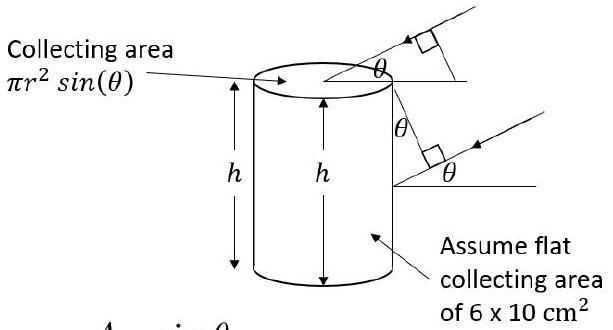
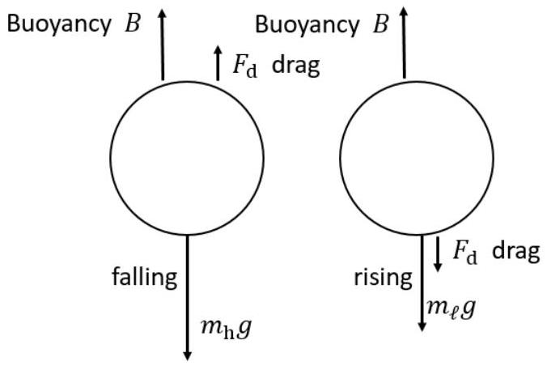

## November 2024

Instructions Give equivalent credit for alternative solutions which are correct physics. The question paper \& solutions should be read through first. If you do not know what the question is about, you will not mark accurately and it will be much more work for you. This is to ensure that you understand the questions. Then the first 10 scripts are issued.

- The scripts will only be available in PDF format. Do not print. Do not change the filename.
- IMPORTANT - Please take a quick glance to makes sure that the file name which has the students name is the name of the student on the front cover sheet. They will often be a little different - no matter - but this is our only check that you have the correct student's paper in front of you.
- You will need to have software such that you can annotate on the PDF (Microsoft Edge works quite well). A pen is easier than a mouse, but you can manage with a mouse.
- If there is something about a student paper that needs a comment, then make the comment in the Platform where there is a comment box for each paper. - (suspicious result, missing question, blank paper, missing page, no name, illegible, different handwriting, can't identify the question, lots of writing but all nonsense, wrong year's paper (yes, it happens), the question paper scanned in !!!, etc.). These are confidential comments and are only for us to follow up in some way.
- DO NOT MIX UP THE MARKS. That tarnishes everyone's marking.

Recording marks

- Annotate on the script in RED. Make sure all marks awarded are clearly annotated on the page. Put a total at the bottom of each page, in a circle, to make it easier to add the marks up correctly. Add up the total on the script and write it at the top of the Section 1 and on the front cover sheet.
- We need the total for Q1.
For Section 2 the mark AND which questions it is.
- There is a total of 76 marks allocated for Question 1. Please write down the total they obtain even if it is very occasionally above the 50.
- Students are meant to answer two questions in Section 2. Each question carries a maximum of 25 marks. If a student attempts more than two questions, only the highest two marks are recorded .
- If the mark scheme has a different mark allocation use the Mark Scheme allocation.

## Allocating marks for solutions

- Please try to understand the students' workings as there are different methods to arrive at the same solution.
- If the correct final answer is there, you can give them the marks for the question part as long as there is some evidence of working and not just the answer alone.
- We do not worry about the exact number of sig figs, or whether they have some very slight discrepancy in the numerical value in the answer due to some rounding error.
- ECF (error carried forward): when students have made an error at the beginning of a question and then use the incorrect answer in a follow-on calculation. Students lose marks for the first incorrect answer but can obtain full marks for using the correct method in the follow-on calculation. Numerically this may only be for the next one or two steps though, if it means a lot of work in calculating to check their numerical follow on results. It could go further if the calculation is easy to follow through. Symbolically the same applies. A reasonable effort must be made to see what the student has done in the next few steps.
- If you do not understand a question or solution, email Robin Hughes rh584@cam.ac.uk. Send a picture from your phone and I will reply promptly.

## Quality control

- Marked papers will be checked by other markers to ensure consistency in marking.
- You must be consistent in your marking, following the mark scheme allocation of marks. You must not give marks out based on your own opinion of how you think marks should be given.
- You must mark accurately according to the mark scheme. Print it out and make sure that you have a copy. You can forget what the marks are for after a while and that is not fair on the student. There will be updates and you will be notified on Teams. Look at the updates and remind yourself of the mark scheme for each session you mark.

## Avoid

- Mistakes in tallying up the total marks
- Mistakes in allotting or not allotting correct marks without reasonable explanation.
- Mixing up two students on your list and giving them the wrong marks. (this is critical!)

## Generally allow leeway of ±1 significant figure.

This is not the tight marking scheme of an exam paper. It is to allow students to engage in problem solving and develop their physics by working through problems requiring explanations, and developing ideas or models. Mark generously to encourage ideas, determination and the willingness to have a go.

The solution calculations simply show one way to tackle the task; a good deal of latitude is needed in the marking to allow equivalent credit for other sensible approaches and degrees of approximation. Students may have better solutions. Please let us know and we will add them to the solutions.

Qu 2

a) - Projected areas: $A _ { \text {p.lid } } = A _ { \text {lid } } \sin \theta$ $A _ { \text {p.side } } = A _ { \text {side } } \cos \theta$
Bonus: Correct use of $\sin \theta$ and $\cos \theta$ ✓
$$
\begin{aligned}
A _ { \mathrm { p } } & = 2 r \cdot h \cos \theta + \pi r ^ { 2 } \sin \theta \\
& = r ( 2 h \cos \theta + \pi r \sin \theta ) \\
& = 0.03 \left( 2 \times 0.1 \times \cos 50 ^ { \circ } + \pi \times 0.03 \times \sin 50 ^ { \circ } \right) \\
& = 3.86 \times 10 ^ { - 3 } + 2.17 \times 10 ^ { - 3 } \\
& = 6.023 \times 10 ^ { - 3 } \mathrm {~m} ^ { 2 } \quad \text { a mark for each area or two for the total } \checkmark \checkmark
\end{aligned}
$$
    - $P = \frac { m c \Delta T } { t } = \frac { 0.3 \times 4180 \times 3 } { 20 \times 60 } = \frac { 3762 } { 1200 } = 3.135 \mathrm {~W} = 3.1 \mathrm {~W}$ ✓
    - Solar intensity $= \frac { 3.135 } { 6.023 \times 10 ^ { - 3 } } = 521 = 520 \mathrm {~W} \mathrm {~m} ^ { - 2 }$ ✓ (7 marks)
b) (i)
$$
\begin{aligned}
\varepsilon = V _ { R } + V _ { r } & = I R + V _ { c } \text { since } V _ { r } = V _ { c } \\
& = I R + \frac { Q } { C }
\end{aligned}
$$
✓
    (ii) Current $I$ is through $r$ and into $C : I = i _ { c } + i _ { r }$ where $i _ { c } = \frac { \mathrm { d } Q } { \mathrm {~d} t }$ and $i _ { r } = \frac { 1 } { r } \frac { Q } { C }$ Hence $I = i _ { c } + i _ { r } = \frac { \mathrm { d } Q } { \mathrm {~d} t } + \frac { Q } { r C }$ ✓
    (iii) Then
$$
\begin{aligned}
\varepsilon & = V _ { R } + V _ { r } = \left( \frac { \mathrm { d } Q } { \mathrm {~d} t } + \frac { Q } { r C } \right) R + \frac { Q } { C } \\
& = \frac { \mathrm { d } Q } { \mathrm {~d} t } R + \frac { Q } { C } \left( \frac { R } { r } + 1 \right)
\end{aligned}
$$
✓ $\left[ \right.$ This can be integrated to give $Q = \frac { \varepsilon r C } { ( R + r ) } \left( 1 - e ^ { - \frac { ( R + r ) } { R r C } t } \right)$ but is not required]
    (iv) By inspection: $\frac { \mathrm { d } Q } { \mathrm {~d} t } = \frac { \varepsilon } { R } - Q \left( \frac { R + r } { R r C } \right)$ so $\quad \tau = \frac { R r C } { ( R + r ) }$ ✓
    (v) The capacitor will charge up and so will reach a steady state. The potential will be divided as a potential divider circuit with two resistors in series.
When $C$ is charged, there is no change in the flow of current, and therefore $V _ { c }$ is given by $V _ { c } = \varepsilon \frac { r } { ( R + r ) }$ and hence $Q _ { \mathrm { ss } } = V _ { c } C = \frac { \varepsilon r C } { ( R + r ) }$ ✓
    (vi) Correct shape of graph and asymptote at $Q _ { \mathrm { ss } }$. Ignore $\varepsilon C$ line. ✓
    charging the capacitor
 (6 marks)

c) (i) $I _ { r } = \frac { V } { r } \quad$ and $I _ { C } = \frac { \mathrm { d } Q } { \mathrm {~d} t } \quad$ with $\quad I _ { 0 } = i _ { r } + I _ { C } = \frac { Q } { r C } + \frac { \mathrm { d } Q } { \mathrm {~d} t }$
[This can be integrated to give $Q = I _ { 0 } r C \left( 1 - e ^ { - \frac { t } { r C } } \right)$ but is not expected]
At steady state, there is no change on $Q _ { \text {capacitor } }$, so $\frac { \mathrm { d } Q } { \mathrm {~d} t } = 0$ and then $\frac { Q _ { \mathrm { ss } } } { C } = I _ { 0 } r$
$$
Q _ { \mathrm { ss } } = I _ { 0 } r C
$$
$\square$
and the energy stored $= \frac { Q _ { \mathrm { ss } } ^ { 2 } } { 2 C } = \frac { 1 } { 2 } I _ { 0 } ^ { 2 } r ^ { 2 } C$ $\square$
(ii) Power incident - power lost = rate of increase of energy,
$$
P _ { \text {can } } - k \left( T _ { \text {can } } - T _ { 0 } \right) = m c \frac { \mathrm {~d} \left( T _ { \text {can } } - T _ { 0 } \right) } { \mathrm { d } t }
$$
i.e. $\quad P _ { \text {can } } - k T = m c \frac { \mathrm {~d} T } { \mathrm {~d} t } \quad$ (if a + sign is use then $k$ is negative) $\square$
where $T$ is the excess temperature above the surroundings.
[ This can be integrated as $\frac { \mathrm { d } t } { m c } = \frac { \mathrm { d } T } { P _ { \text {can } } - k T }$ to give $T = \frac { P _ { \text {can } } } { k } \left( 1 - e ^ { - \frac { k t } { m c } } \right)$ but is not required]
(iii) Steady state result is $T _ { \mathrm { ss } } = \frac { P _ { \text {can } } } { k }$ $\square$
(iv) $k = \frac { m c \Delta T } { T _ { \text {excess } } } = \frac { 0.3 \times 4180 \times ( 34.2 - 32.8 ) } { \left( \frac { 34.2 + 32.8 } { 2 } - 31 \right) \times 40 \times 60 } = 0.2926 = 0.29 \mathrm {~W} ^ { \circ } \mathrm { C } ^ { - 1 }$ $\square$
Use of $T _ { \text {excess } } = \left( \frac { 34.2 + 32.8 } { 2 } - 31 \right) = 2.5 ^ { \circ } \mathrm { C }$ $\square$
[The equation for $k , \quad \frac { \mathrm {~d} Q } { \mathrm {~d} t } = - k T$ can be integrated to give $T _ { \text {cold } } = T _ { \text {hot } } e ^ { - \frac { k t } { m c } }$
This results in $\left. k = \frac { m c } { t } \ln \frac { T _ { \text {hot } } } { T _ { \text {cold } } } = \frac { 0.3 \times 4180 } { 40 \times 60 } \times \ln \frac { 3.2 } { 1.8 } = 0.3006 = 0.30 \mathrm {~W} ^ { \circ } \mathrm { C } ^ { - 1 } \right]$
(v) Power heating the water in Part (a) was 3.135 W.
Average temperature rise is 1.5 °C
Hence corrected power is $( k = 0.2926 ) P = 3.135 + 0.2926 \times 1.5 = 3.57 = 3.6 \mathrm {~W}$ Or
$$
( k = 0.3006 ) P = 3.135 + 0.3006 \times 1.5 = 3.59 = 3.6 \mathrm {~W}
$$
This is a 16\% increase and hence the solar intensity
of part (a) is increased by $16 \%$ from $520 \mathrm {~W} \mathrm {~m} ^ { - 1 }$ to $\approx 600 \mathrm {~W} \mathrm {~m} ^ { - 1 }$ $\square$
Not as in question $\square$
d) (i) Power of the Sun = Solar intensity × area of sphere
$$
= 1360 \times 4 \times \pi \times \left( 1.5 \times 10 ^ { 11 } \right) ^ { 2 } = 3.84 \times 10 ^ { 26 } \mathrm {~W}
$$
□
Volume of Sun $= \frac { 4 } { 3 } \pi R ^ { 3 } = \frac { 4 } { 3 } \pi \left( 6.96 \times 10 ^ { 8 } \right) ^ { 3 } = 1.41 \times 10 ^ { 27 } \mathrm {~m} ^ { 3 }$ □
Power/volume $= 0.27 \mathrm {~W} \mathrm {~m} ^ { - 3 }$ □
(ii) $m = \frac { E } { c ^ { 2 } } = \frac { 3.84 \times 10 ^ { 26 } } { 9 \times 10 ^ { 16 } } = 4.3 \times 10 ^ { 9 } \mathrm {~kg} \mathrm {~s} ^ { - 1 }$ □
Not as in question □

## Qu 3.

a) (i) $\quad B + F _ { \mathrm { d } } = m _ { \mathrm { h } } \cdot g$

- $B - F _ { \mathrm { d } } = m _ { \ell } \cdot g$
- Add $B = \frac { m _ { \mathrm { h } } + m _ { \ell } } { 2 } g$
- Subtract $2 F _ { \mathrm { d } } = \left( m _ { \mathrm { h } } - m _ { \ell } \right) g$ $\left. F _ { \mathrm { d } } = \frac { \left( m _ { \mathrm { h } } - m _ { \ell } \right) } { 2 } \right) g$

(ii) $\quad \cdot B = \left( n _ { \text {cold } } - n _ { \text {hot } } \right) \cdot \mu \cdot g \quad \mu$ is the molar mass, $n$ is in moles

- Using $p V = n R T$ the buoyancy force is $B = \frac { p V } { R } \left( \frac { 1 } { T _ { \text {cold } } } - \frac { 1 } { T _ { \text {hot } } } \right) \cdot \mu \cdot g$ $B = \frac { 1.01 \times 10 ^ { 5 } } { 8.3145 } \times \frac { 4 } { 3 } \pi ( 0.05 ) ^ { 3 } \times 28 \times 10 ^ { - 3 } \times 9.81 \left( \frac { 1 } { 290 } - \frac { 1 } { 298 } \right)$ $B = 1.617 \times 10 ^ { - 4 } = 1.6 \times 10 ^ { - 4 } \mathrm {~N}$
(iii) $\cdot F _ { \mathrm { d } } = k v = 1.2 \times 10 ^ { - 3 } \times 0.06 = 7.2 \times 10 ^ { - 5 } \mathrm {~N}$ ✓
    - $\Delta m = \left( m _ { \mathrm { h } } - m _ { \ell } \right) = \frac { 2 \times F _ { \mathrm { d } } } { g } = 1.47 \times 10 ^ { - 5 } \mathrm {~kg}$ ✓
    - $\Delta m = t \frac { \mathrm {~d} m } { \mathrm {~d} t }$ so that $t = \Delta m / \frac { \mathrm { d } m } { \mathrm {~d} t } = \frac { 1.47 \times 10 ^ { - 5 } } { 4 \pi \times 0.08 ^ { 2 } \times 2.4 \times 10 ^ { - 5 } } = 7.6 \mathrm {~s}$
(iv) mass= density × surface area × thickness ✓
    i.e. $\quad m _ { \mathrm { h } } = \rho \cdot 4 \pi \cdot r ^ { 2 } \cdot \delta t$ Then $\quad \delta t = \frac { m _ { \mathrm { h } } } { \rho \cdot 4 \pi \cdot r ^ { 2 } }$ We have seen that $\quad B + F _ { \mathrm { d } } = m _ { \mathrm { h } } g$ Hence $m _ { \mathrm { h } } = \frac { B + F _ { \mathrm { d } } } { g } = \frac { 1.62 \times 10 ^ { - 4 } + 7.2 \times 10 ^ { - 5 } } { 9.81 } = 2.4 \times 10 ^ { - 6 } \mathrm {~kg}$ ✓
    So $\quad \delta t = \frac { 2.4 \times 10 ^ { - 6 } } { 998 \times 4 \pi \times 0.08 ^ { 2 } } = 3.0 \times 10 ^ { - 7 } \mathrm {~m}$ ✓ Not as on question paper (12 marks)
b) (i) The tension in two strings provides the centripetal force on a mass.
So $\quad 2 T \cos 45 ^ { \circ } = \frac { m v ^ { 2 } } { r }$ ✓
$T \sqrt { 2 } = \frac { m v ^ { 2 } } { \ell / \sqrt { 2 } }$
Hence $\quad T = \frac { m v } { \ell }$ ✓
Then with 45°, we have $\quad T _ { \mathrm { r } } = T _ { \mathrm { t } } = \frac { T } { \sqrt { 2 } } = \frac { m v ^ { 2 } } { \sqrt { 2 } \ell }$ ✓

(ii) By dimensions (calculating formally or by observation of the units) $T _ { \text {tangential } } = \lambda v ^ { 2 } \quad \checkmark$
(iii) Elastic band: When stationary: tension in spring,
$$
\begin{aligned}
& T = ( 18.5 - 15.0 ) \times 10 ^ { - 2 } \times 2000 = 70 \mathrm {~N} \\
& \lambda = \frac { 25 \times 10 ^ { - 3 } } { 18.5 \times 10 ^ { - 2 } } = 0.135 \mathrm {~kg} \mathrm {~m} ^ { - 1 }
\end{aligned}
$$
✓
✓
Hence $\quad v = \sqrt { \frac { 70 } { 0.135 } } = 22.8 = 23 \mathrm {~m} \mathrm {~s} ^ { - 1 }$
✓
and $\quad \omega = v / r = 770 \mathrm { rad } \mathrm { s } ^ { - 1 }$
✓
Not as on question paper
(8 marks)

c) • The hoop expands by change in radius $\delta r$ so that the circumference changes by $2 \pi \delta r$.
✓
    - The tension $T$ will be $k \cdot 2 \pi \cdot \delta r$
✓
    - From the diagram, the radial restoring force is $2 T \sin \theta \approx 2 T \theta$
    - the element of mass being radially accelerated is $\mathrm { d } m = \lambda \cdot r \cdot 2 \theta$ with $\lambda$ the mass per unit length
    - Hence NII gives
$$
2 T \sin \theta = - ( \lambda \cdot r \cdot 2 \theta ) a _ { \text {radial } } \quad \left( r \text { outwards and } T _ { \text {radial } } \text { inwards } \right)
$$
mark for - sign in force equation
So, $\quad ( k \cdot 2 \pi \cdot \delta r ) \times 2 \theta = - ( \lambda \cdot r \cdot 2 \theta ) a _ { \text {radial } }$
$$
a _ { \text {radial } } = - \omega ^ { 2 } \delta r = \left( \frac { k \cdot 2 \pi } { \lambda \cdot r } \right) \delta r
$$
    - Hence $f = \frac { \omega } { 2 \pi } = \frac { 1 } { 2 \pi } \sqrt { \frac { 2 \pi k } { \lambda r } }$
Other approaches are possible here.
( 5 marks)

## Qu 4.

a) - $\frac { \mathrm { d } N } { \mathrm {~d} t } = - \lambda N$
$P = \frac { \mathrm { d } N } { \mathrm {~d} t } \cdot \delta E = \lambda \cdot N \cdot \delta E \quad$ use of this result ✓ $P = \frac { \ln 2 } { t _ { \frac { 1 } { 2 } } } \cdot$ moles $\cdot N _ { \mathrm { A } } \cdot \delta E \cdot e \quad$ use of moles and $N _ { \mathrm { A } }$ to substitute for $N \checkmark$ use of moles and $N _ { \mathrm { A } }$ to substitute for $N$ ✓
    - $P = \left( \frac { 0.693 } { 87.7 \times 365 \times 24 \times 3600 } \right) \times \frac { 4800 ( \mathrm {~g} ) } { 238 ( \mathrm {~g} ) } \times 6.02 \times 10 ^ { 23 } \times 5.5 \times 10 ^ { 6 } \times 1.6 \times 10 ^ { - 19 }$ $= 2677 = 2700 \mathrm {~W}$ (3 marks)
b) $\frac { \mathrm { d } Q } { \mathrm {~d} t } = k A \frac { \mathrm {~d} T } { \mathrm {~d} x } \quad$ construct/apply the equation from the wording in the question ✓ $2000 = 0.035 \times A \times \frac { 179 } { 0.05 }$ $A = \frac { 2000 } { 0.035 } \times \frac { 0.05 } { 179 } = 15.96 = 16 \mathrm {~m} ^ { 2 }$ ✓ (2 marks)
c) (i) General expression for lift: $F = \frac { \Delta ( m v ) } { \Delta t } = v \cdot \rho _ { \text {air } } \frac { \Delta \ell \cdot A } { \Delta t } = v \rho _ { \text {air } } \cdot A \cdot v$ $F = \rho _ { \text {air } } \cdot A \cdot v ^ { 2 }$ ✓
    (ii) Then $\quad F _ { 8 } = F _ { \text {lift } } = \rho _ { \mathrm { T } } \cdot A _ { 8 } \cdot v ^ { 2 } \quad$ require symbols $A _ { 8 } , \rho _ { \mathrm { T } }$ in expression for $F _ { \text {lift } } \left( = F _ { 8 } \right)$ ✓
Since we know the lift force, then $m _ { \mathrm { D } } \cdot g _ { \mathrm { T } } = \rho _ { \mathrm { T } } \cdot A _ { 8 } \cdot v ^ { 2 }$ So $\quad v = \sqrt { \frac { m _ { \mathrm { D } } \cdot g _ { \mathrm { T } } } { \rho _ { \mathrm { T } } \cdot A _ { 8 } } }$ ✓
Knowing $\quad P = F \cdot v \quad$ we have $\quad P = \rho _ { \mathrm { T } } \cdot A _ { 8 } \cdot v ^ { 3 }$ ✓
Then $P = \rho _ { \mathrm { T } } \cdot A _ { 8 } \cdot \left( \frac { m _ { \mathrm { D } } \cdot g _ { \mathrm { T } } } { \rho _ { \mathrm { T } } \cdot A _ { 8 } } \right) ^ { \frac { 3 } { 2 } } = \sqrt { \frac { m _ { \mathrm { D } } ^ { 3 } \cdot g _ { \mathrm { T } } ^ { 3 } } { \rho _ { \mathrm { T } } \cdot A _ { 8 } } }$ ✓
    (iii) $\frac { P _ { \mathrm { T } } } { P _ { \mathrm { E } } } = \sqrt { \frac { g _ { \mathrm { T } } ^ { 3 } \cdot \rho _ { \mathrm { E } } } { g _ { \mathrm { E } } ^ { 3 } \cdot \rho _ { \mathrm { T } } } } = \sqrt { \frac { 1.35 ^ { 3 } \times 1.22 } { 9.81 ^ { 3 } \times 5.35 } } = 0.0244 = 0.024$ ✓
    (iv) $P _ { \mathrm { T } } = \sqrt { \frac { m _ { \mathrm { D } } ^ { 3 } \cdot g _ { \mathrm { T } } ^ { 3 } } { \rho _ { \mathrm { T } } \cdot A _ { 8 } } } = \sqrt { \frac { 420 ^ { 3 } \times 1.35 ^ { 3 } } { 5.35 \times 8 \cdot \pi \cdot 0.68 ^ { 2 } } } = 1710 \mathrm {~W}$ ✓
    (v) Calculate the energy used on the flight:
- 8000 m at $10 \mathrm {~m} \mathrm {~s} ^ { - 1 } = 800 \mathrm {~s} : 800 \times 1710 = 1.37 \times 10 ^ { 6 } \mathrm {~J}$ ✓
    - Time to rise and fall is $100 \mathrm {~s} : 100 \times 1710 = 1.71 \times 10 ^ { 5 } \mathrm {~J}$ - Energy to rise $= m g h = 420 \times 1.35 \times 500 = 2.83 \times 10 ^ { 5 } \mathrm {~J}$ - Total energy is $1.82 \times 10 ^ { 6 } \mathrm {~J}$ ✓
    - Using the power calculated in part (a): $t = \frac { 1.82 \times 10 ^ { 6 } \times 0.06 } { 2680 } = 11300 \mathrm {~s} = 3.14$ hours ✓ (10 marks)

d) (i) - $F _ { 8 } = \sqrt { D ^ { 2 } + W ^ { 2 } }$

    (ii)
$$
D = \sqrt { F _ { 8 } ^ { 2 } - W ^ { 2 } } = \sqrt { \left( \rho _ { \mathrm { T } } \cdot A _ { 8 } \cdot v _ { \mathrm { tip } } ^ { 2 } \right) ^ { 2 } - \left( m _ { \mathrm { D } } \cdot g _ { \mathrm { T } } \right) ^ { 2 } }
$$
Hence
$$
D ^ { 2 } = \rho _ { \mathrm { T } } ^ { 2 } \cdot A _ { 8 } ^ { 2 } \cdot v _ { \mathrm { air } } ^ { 4 } = \left( \rho _ { \mathrm { T } } ^ { 2 } \cdot A _ { 8 } ^ { 2 } \cdot v _ { \mathrm { tip } } ^ { 4 } \right) - \left( m _ { \mathrm { D } } ^ { 2 } \cdot g _ { \mathrm { T } } ^ { 2 } \right)
$$
So
$$
v _ { \text {air } } ^ { 4 } = v _ { \text {tip } } ^ { 4 } - \frac { m _ { \mathrm { D } } ^ { 2 } \cdot g _ { \mathrm { T } } ^ { 2 } } { \rho _ { \mathrm { T } } ^ { 2 } \cdot A _ { 8 } ^ { 2 } }
$$
    (iii)
$$
\begin{aligned}
& = r ^ { 4 } \cdot ( 2 \pi ) ^ { 4 } \cdot f ^ { 4 } - \frac { m _ { \mathrm { D } } ^ { 2 } \cdot g _ { \mathrm { T } } ^ { 2 } } { \rho _ { \mathrm { T } } ^ { 2 } \cdot A _ { 8 } ^ { 2 } } \\
& = 0.68 ^ { 4 } \cdot ( 2 \pi ) ^ { 4 } \cdot \left( \frac { 500 } { 60 } \right) ^ { 4 } - \frac { 420 ^ { 2 } \times 1.35 ^ { 2 } } { 5.35 ^ { 2 } \times \left( 8 \cdot \pi \cdot 0.68 ^ { 2 } \right) ^ { 2 } } \\
v _ { \text {air } } & = 2.5 \mathrm {~m} \mathrm {~s} ^ { - 1 }
\end{aligned}
$$
(6 marks)
e) (i) $F = k \rho ^ { \alpha } v ^ { \beta } r ^ { \gamma }$
with $\alpha = 1 , \quad \beta = 2 , \quad \gamma = 2$
So that
$$
F _ { \text {drag } } = k \rho v ^ { 2 } r ^ { 2 }
$$

(ii)

$$
\text { - At terminal velocity so } \quad F _ { \text {drag } } = m g
$$

- Using the result for $F _ { \text {drag } }$, we have
$$
\rho _ { \mathrm { T } } = \frac { m \cdot g _ { \mathrm { T } } ( 600 \mathrm {~km} ) } { v ^ { 2 } \cdot r ^ { 2 } }
$$
.
$$
g _ { \mathrm { T } } = \frac { G M _ { \mathrm { T } } } { R _ { \mathrm { T } } ^ { 2 } }
$$
- At 600 km
$$
g _ { \mathrm { T } } ( 600 \mathrm {~km} ) = \frac { 6.67 \times 10 ^ { - 11 } \times 1.345 \times 10 ^ { 23 } } { \left[ ( 2575 + 600 ) \times 10 ^ { 3 } \right] ^ { 2 } } = 0.89 \mathrm {~m} \mathrm {~s} ^ { - 1 }
$$
- Hence $\rho = \frac { 400 \times 0.89 } { 7300 ^ { 2 } \times 1.85 ^ { 2 } } = 1.95 \times 10 ^ { - 6 } = 2.0 \times 10 ^ { - 6 } \mathrm {~kg} \mathrm {~m} ^ { - 3 }$

(4 marks)

There are multiple ways to solve some of the questions; please accept all good solutions that arrive at the correct answer. Students getting the answer in a box will get all the marks available for that calculation / part of the question (as indicated in red), so long as there are no unphysical / nonsensical steps or assumptions made (students may not explicitly calculate the intermediate stages and should not be penalised for this so long as their argument is clear). Allow 2 or 3 s.f. answers unless specified.

a. Consider a planet of mass $m _ { p }$, orbiting a star of mass $M _ { s }$ in a circular orbit of radius $r$ which takes a time $T$ to complete one orbit.
    i. By balancing centripetal and gravitational forces, show that the orbital speed $v \propto r ^ { - 1 / 2 }$.
Balancing centripetal and gravitational forces:
$$
\begin{equation*}
\left. \frac { m _ { p } v ^ { 2 } } { r } = \frac { G M _ { s } m _ { p } } { r ^ { 2 } } \quad \therefore \right\rvert \, v = \sqrt { \frac { G M _ { s } } { r } } \left( \text { so } v \propto r ^ { - 1 / 2 } \right) \tag{1}
\end{equation*}
$$
[Allow any valid method that shows that $v \propto r ^ { - 1 / 2 }$. They are not required to show the constant of proportionality SO LONG AS the method is clear - suspected bluff = zero. No penalty if they use $m$ and $M$ instead of $m _ { p }$ and $M _ { s }$ ]
    ii. Hence, show that the total energy of the planet (KE + GPE), $E _ { \text {total } } \propto r ^ { - 1 }$.
Substituting in their expression for $v$ for the formula for KE AND negative GPE
$$
\begin{align*}
& E _ { \text {total } } = K E + G P E = \frac { 1 } { 2 } m _ { p } v ^ { 2 } - \frac { G M _ { s } m _ { p } } { r } = \frac { 1 } { 2 } m _ { p } \left( \frac { G M _ { s } } { r } \right) - \frac { G M _ { s } m _ { p } } { r } \\
& \left. \therefore E _ { \text {total } } = - \frac { G M _ { s } m _ { p } } { 2 r } \quad \text { (so } E _ { \text {total } } \propto r ^ { - 1 } \right) \tag{1}
\end{align*}
$$
[Allow any valid method that shows that $E _ { \text {total } } \propto r ^ { - 1 }$. They are not required to show the constant of proportionality SO LONG AS the method is clear. No penalty if they use $m$ and $M$ instead of $m _ { p }$ and $M _ { s }$ ]
    iii. By considering the speed of a planet in its orbit around the planet in terms of $r$ and $T$, show that the relationship between orbital period and orbital radius is $T ^ { 2 } \propto r ^ { 3 }$. (This is known as Kepler's Third Law.)
The other expression for speed hinted at is $v = \frac { 2 \pi r } { T }$ so equating it to part i. expression
$$
\begin{equation*}
\frac { 2 \pi r } { T } = \sqrt { \frac { G M _ { s } } { r } } \therefore T ^ { 2 } = \frac { 4 \pi ^ { 2 } } { G M _ { s } } r ^ { 3 } \quad \left( \text { so } T ^ { 2 } \propto r ^ { 3 } \right) \tag{1}
\end{equation*}
$$
[Allow any valid method that shows that $T ^ { 2 } \propto r ^ { 3 }$. They are not required to show the constant of proportionality SO LONG AS the method is clear. No penalty if they use $M$ instead of $M _ { s }$ ]
    iv. Given the Earth has an orbital radius $r _ { E } = 1.50 \times 10 ^ { 11 } \mathrm {~m}$ and orbital period $T _ { E } = 365$ days, calculate the mass of the Sun in kg.
Converting $T _ { E }$ into seconds and using the value of $G$ from constants page in exam paper
$$
\begin{align*}
M _ { \text {Sun } } = \frac { 4 \pi ^ { 2 } } { G T _ { E } ^ { 2 } } r _ { E } ^ { 3 } & = \frac { 4 \pi ^ { 2 } } { 6.67 \times 10 ^ { - 11 } \times ( 365 \times 24 \times 60 \times 60 ) ^ { 2 } } \times \left( 1.50 \times 10 ^ { 11 } \right) ^ { 3 } \\
& = 2.01 \times 10 ^ { 30 } \mathrm {~kg} \tag{1}
\end{align*}
$$
[Expect an answer $\geq 3$ s.f. Allow 2 s.f. ONLY if the working is clear and correct. Do not allow a value that could have been read from a formula sheet e.g. $1.99 \times 10 ^ { 30 } \mathrm {~kg}$ ]

v. Using your result from part (iii), if you use the Earth values of $r _ { E } = 1$ au and $T _ { E } = 1$ year orbiting a star of mass $M _ { s } = 1 M _ { \text {Sun } }$, what is the value (and units) of $G$ in just these given quantities and units?
$$
\begin{equation*}
G = \frac { 4 \pi ^ { 2 } } { M _ { s } T ^ { 2 } } r ^ { 3 } = \frac { 4 \pi ^ { 2 } } { 1 \times 1 ^ { 2 } } \times 1 ^ { 3 } = 4 \pi ^ { 2 } \text { au } ^ { 3 } \mathrm { M } _ { \text {Sun } } ^ { - 1 } \text { year } ^ { - 2 } \tag{1}
\end{equation*}
$$
[Allow 0.5 marks for the value of $4 \pi ^ { 2 }$ (or decimal equivalent 39.478...) and 0.5 marks for the correct units]
b. Disaster strikes and the Sun disappears! This causes all the planets to be perturbed from their orbits. In this question we will just look at Venus and Earth. Assume that the loss of the Sun's gravity was felt instantaneously by both planets, and that both are travelling in coplanar circular orbits. Venus has a mass of $0.815 M _ { \text {Earth } }$, where $M _ { \text {Earth } } = 5.97 \times 10 ^ { 24 } \mathrm {~kg}$, and an orbital radius of 0.723 au. Venus and Earth happened to be at such a point in their orbit when the Sun disappeared that they are on a collision course.
    i. Calculate the orbital speeds of Earth and Venus, $v _ { E }$ and $v _ { V }$.

For Earth:

$$
\begin{equation*}
v _ { E } = \sqrt { \frac { G M _ { \text {Sun } } } { r _ { E } } } = \sqrt { \frac { 6.67 \times 10 ^ { - 11 } \times 2.01 \times 10 ^ { 30 } } { 1.50 \times 10 ^ { 11 } } } = 2.99 \times 10 ^ { 4 } \mathrm {~m} \mathrm {~s} ^ { - 1 } \tag{0.5}
\end{equation*}
$$

[Alternative: $v _ { E } = \sqrt { \frac { G M _ { \text {Sun } } } { r _ { E } } } = \sqrt { \frac { 4 \pi ^ { 2 } \times 1 } { 1 } } ( = 2 \pi ) = 6.28$ au year $^ { - 1 }$ ]
For Venus:

$$
\begin{equation*}
v _ { V } = \sqrt { \frac { G M _ { \text {Sun } } } { r _ { V } } } = \sqrt { \frac { 6.67 \times 10 ^ { - 11 } \times 2.01 \times 10 ^ { 30 } } { 0.723 \times 1.50 \times 10 ^ { 11 } } } = 3.51 \times 10 ^ { 4 } \mathrm {~m} \mathrm {~s} ^ { - 1 } \tag{0.5}
\end{equation*}
$$

[Alternative: $v _ { E } = \sqrt { \frac { G M _ { \text {Sun } } } { r _ { V } } } = \sqrt { \frac { 4 \pi ^ { 2 } \times 1 } { 0.723 } } = 7.39$ au year $^ { - 1 }$ ]

ii. Determine the time, $t$, until they crash. Give your answer in days.

Suitable diagram showing two right-angled triangles with a shared hypotenuse
From Pythagoras' theorem:
$$
\begin{align*}
& d ^ { 2 } = r _ { V } ^ { 2 } + \left( v _ { V } t \right) ^ { 2 } = r _ { E } ^ { 2 } + \left( v _ { E } t \right) ^ { 2 }  \tag{1}\\
& \therefore v _ { V } ^ { 2 } t ^ { 2 } - v _ { E } ^ { 2 } t ^ { 2 } = r _ { E } ^ { 2 } - r _ { V } ^ { 2 }
\end{align*}
$$
$$
\begin{equation*}
= \sqrt { \frac { \left( 1.50 \times 10 ^ { 11 } \right) ^ { 2 } - \left( 0.723 \times 1.50 \times 10 ^ { 11 } \right) ^ { 2 } } { \left( 3.51 \times 10 ^ { 4 } \right) ^ { 2 } - \left( 2.99 \times 10 ^ { 4 } \right) ^ { 2 } } } \tag{1}
\end{equation*}
$$
[Second marking point is for any valid method, third marking point is for an expression for $t$ and fourth marking point is ONLY if the final answer is given in days. If using the alternative units then $t = \sqrt { \frac { 1 ^ { 2 } - 0.723 ^ { 2 } } { 7.39 ^ { 2 } - 6.28 ^ { 2 } } } = 0.1776$ years $= 64.8$ days . Allow slight differences down to rounding errors. In the alternative units $v = 2 \pi r ^ { - 1 / 2 }$ so they may simplify their expression for $t$ into one just dependent on $r$ - all versions get third mark:]
$$
t = \sqrt { \frac { r _ { E } ^ { 2 } - r _ { V } ^ { 2 } } { v _ { V } ^ { 2 } - v _ { E } ^ { 2 } } } = \frac { 1 } { 2 \pi } \sqrt { \frac { r _ { E } ^ { 2 } - r _ { V } ^ { 2 } } { r _ { V } ^ { - 1 } - r _ { E } ^ { - 1 } } } = \frac { 1 } { 2 \pi } \sqrt { \frac { \left( r _ { E } - r _ { V } \right) \left( r _ { E } + r _ { V } \right) } { r _ { E } - r _ { V } / r _ { V } r _ { E } } } = \frac { 1 } { 2 \pi } \sqrt { r _ { V } r _ { E } \left( r _ { E } + r _ { V } \right) }
$$

iii. Show that the distance d from the Sun's original location when they crash is ~ 1.5 au.
Using the Sun-Earth-Collision triangle
$$
\begin{align*}
d = \sqrt { r _ { E } ^ { 2 } + \left( v _ { E } t \right) ^ { 2 } } & = \sqrt { \left( 1.50 \times 10 ^ { 11 } \right) ^ { 2 } + \left( 2.99 \times 10 ^ { 4 } \times 5.60 \times 10 ^ { 6 } \right) ^ { 2 } } \\
& = 2.25 \times 10 ^ { 11 } \mathrm {~m} = 1.50 \mathrm { au } \tag{1}
\end{align*}
$$
[Since the question is a 'show that', the answer MUST have $\geq 3$ s.f. to get the mark. In alternative units $d = \sqrt { r _ { E } ^ { 2 } + \left( v _ { E } t \right) ^ { 2 } } = \sqrt { 1 ^ { 2 } + ( 6.28 \times 0.1776 ) ^ { 2 } } = 1.50 \mathrm { au }$. Accept use of the Sun-Venus-Collision triangle instead. Allow for slight rounding errors from earlier.]
iv. Show that the angle between their velocity vectors as they approach is $\sim 13 ^ { \circ }$.
From the diagram:
$$
\begin{align*}
& \text { Angle VCE } = \text { Angle SCE } - \text { Angle SCV } \\
& \begin{aligned}
\therefore \angle V C E = \sin ^ { - 1 } \left( \frac { r _ { E } } { d } \right) - \sin ^ { - 1 } \left( \frac { r _ { V } } { d } \right) & = \sin ^ { - 1 } \left( \frac { 1 } { 1.50 } \right) - \sin ^ { - 1 } \left( \frac { 0.738 } { 1.50 } \right) \\
& = 41.86 ^ { \circ } - 28.85 ^ { \circ } = 13.0 ^ { \circ }
\end{aligned}
\end{align*}
$$
[Since the question is a 'show that', the answer MUST have $\geq 3$ s.f. to get the mark.
Allow for slight rounding errors from earlier.]
v. Find the Earth-Sun-Venus angle at the moment the Sun disappeared in order for this crash to occur.
From the diagram, triangle VCE and VSE are similar $\therefore \angle E S V = 13.0 ^ { \circ }$
[Give this mark for stating the same angle as what they calculated in iv. OR 13 ° (2 s.f)]
c. The collision between them is inelastic, causing them to stick together and make a new, heavier planet: "Venearth".
    i. Show that the speed of Venearth, $v$, just after the collision is ~ 6.7 au year ${ } ^ { - 1 }$.

Suitable diagram [Allow $\theta$ labelled as 13°]
Conserving horizontal momentum:
$$
\begin{equation*}
M _ { E } u _ { E } + M _ { V } u _ { V } \cos \theta = \left( M _ { E } + M _ { V } \right) v \cos \alpha \tag{1}
\end{equation*}
$$
Conserving vertical momentum:
$$
\begin{equation*}
M _ { V } u _ { V } \sin \theta = \left( M _ { E } + M _ { V } \right) v \sin \alpha \tag{1}
\end{equation*}
$$
Squaring both equations and adding them together
$$
\begin{align*}
& \left( M _ { E } u _ { E } + M _ { V } u _ { V } \cos \theta \right) ^ { 2 } + \left( M _ { V } u _ { V } \sin \theta \right) ^ { 2 } = \left( M _ { E } + M _ { V } \right) ^ { 2 } v ^ { 2 } \left( \cos ^ { 2 } \alpha + \sin ^ { 2 } \alpha \right) \\
& \therefore M _ { E } ^ { 2 } u _ { E } ^ { 2 } + 2 M _ { E } M _ { V } u _ { E } u _ { V } \cos \theta + M _ { V } ^ { 2 } u _ { V } ^ { 2 } = \left( M _ { E } + M _ { V } \right) ^ { 2 } v ^ { 2 } \\
& \therefore v = \sqrt { \frac { M _ { E } ^ { 2 } u _ { E } ^ { 2 } + 2 M _ { E } M _ { V } u _ { E } u _ { V } \cos \theta + M _ { V } ^ { 2 } u _ { V } ^ { 2 } } { \left( M _ { E } + M _ { V } \right) ^ { 2 } } }  \tag{1}\\
& = \sqrt { \frac { 1 ^ { 2 } \times \left( 2.99 \times 10 ^ { 4 } \right) ^ { 2 } + 2 \times 1 \times 0.815 \times 2.99 \times 10 ^ { 4 } \times 3.51 \times 10 ^ { 4 } \times \cos 13.0 ^ { \circ } + 0.815 ^ { 2 } \times \left( 3.51 \times 10 ^ { 4 } \right) ^ { 2 } } { ( 1 + 0.815 ) ^ { 2 } } }  \tag{5}\\
& = 3.20 \times 10 ^ { 4 } \mathrm {~m} \mathrm {~s} ^ { - 1 } = 6.74 \text { au year } ^ { - 1 } \tag{1}
\end{align*}
$$

ii. Determine the angle between Venearth's velocity vector and Earth's initial velocity vector before the collision.
From the diagram, this is just the angle labelled as $\alpha$ :
$$
\begin{equation*}
\alpha = \sin ^ { - 1 } \left[ \frac { M _ { V } u _ { V } \sin \theta } { \left( M _ { E } + M _ { V } \right) v } \right] = \sin ^ { - 1 } \left[ \frac { 0.815 \times 3.51 \times 10 ^ { 4 } \sin 13.0 ^ { \circ } } { ( 1 + 0.815 ) \times 3.20 \times 10 ^ { 4 } } \right] = 6.37 ^ { \circ } \tag{1}
\end{equation*}
$$
[If using the 'show that' value from part i., $6.7 \mathrm { au } \mathrm { year } ^ { - 1 } = 3.19 \times 10 ^ { 4 } \mathrm {~m} \mathrm {~s} ^ { - 1 }$ so it gives $6.40 ^ { \circ }$ - allow this as an ecf]
iii. Calculate the percentage of kinetic energy lost in the collision.
Considering the KE before and after the collision:
$$
\begin{align*}
\text { Fraction of KE lost } & = 1 - \frac { K E \text { after } } { K E \text { before } } = 1 - \frac { \frac { 1 } { 2 } \left( M _ { E } + M _ { V } \right) v ^ { 2 } } { \frac { 1 } { 2 } M _ { E } u _ { E } ^ { 2 } + \frac { 1 } { 2 } M _ { V } u _ { V } ^ { 2 } } \\
& = 1 - \frac { ( 1 + 0.815 ) \times \left( 3.20 \times 10 ^ { 4 } \right) ^ { 2 } } { 1 \times \left( 2.99 \times 10 ^ { 4 } \right) ^ { 2 } + 0.815 \times \left( 3.51 \times 10 ^ { 4 } \right) ^ { 2 } } = 0.0193 = 1.93 \% \tag{1}
\end{align*}
$$
[If left as decimal and not converted to a percentage lose 0.5 marks. If using $v =$ 6.7 au year ${ } ^ { - 1 }$ then will get 2.98\% - allow this as an ecf]
d. At the moment of the collision, a new star magically appears in the location that the Sun used to be. Again, assume its gravitational effects are felt instantaneously throughout the Solar System.
    i. What is the minimum mass of this new star necessary for Venearth to still be bound within the Solar System? Give your answer in units of $M _ { \text {Sun } }$.
Venearth will be bound if $v <$ the escape velocity:
$$
\begin{align*}
& v = v _ { e s c } = \sqrt { \frac { 2 G M } { d } }  \tag{1}\\
& \therefore M = \frac { v ^ { 2 } d } { 2 G } = \frac { \left( 3.20 \times 10 ^ { 4 } \right) ^ { 2 } \times 2.25 \times 10 ^ { 11 } } { 2 \times 6.67 \times 10 ^ { - 11 } } = 1.73 \times 10 ^ { 30 } \mathrm {~kg} = 0.861 M _ { \text {Sun } } \tag{1}
\end{align*}
$$
[The first mark is for a suitable method - this can either be for the escape velocity approach or if they use the total energy $= 0$ approach (i.e. $E _ { \text {total } } = K E + G P E = 0 \therefore$ $\frac { 1 } { 2 } m v ^ { 2 } - \frac { G M m } { d } = 0 \therefore M = \frac { v ^ { 2 } d } { 2 G } \ldots$ etc.). Must be in units of $M _ { \text {Sun } }$ for the second mark. If using $v = 6.7$ au year ${ } ^ { - 1 }$ then will get $M = 1.71 \times 10 ^ { 30 } \mathrm {~kg} = 0.852 M _ { \text {Sun } }$ - allow this as an ecf]
    ii. If in fact, the new star has a mass equal to $M _ { \text {Sun } }$, what will be the orbital period of Venearth? Give your answer in years.
Considering the energy of a circular orbit with the same total energy (using a. ii.):
$$
\begin{align*}
& \frac { 1 } { 2 } m v ^ { 2 } - \frac { G M _ { \text {Sun } } m } { d } = - \frac { G M _ { \text {Sun } } m } { 2 r }  \tag{1}\\
& \begin{aligned}
\therefore r = \frac { G M _ { \text {Sun } } } { \frac { 2 G M _ { \text {Sun } } } { d } - v ^ { 2 } } & = \frac { 6.67 \times 10 ^ { - 11 } \times 2.01 \times 10 ^ { 30 } } { \frac { 2 \times 6.67 \times 10 ^ { - 11 } \times 2.01 \times 10 ^ { 30 } } { 2.25 \times 10 ^ { 11 } } - \left( 3.20 \times 10 ^ { 4 } \right) ^ { 2 } } \\
& = 8.10 \times 10 ^ { 11 } \mathrm {~m} ( = 5.40 \mathrm { au } )
\end{aligned}
\end{align*}
$$
$$
\begin{align*}
\therefore T = \sqrt { \frac { 4 \pi ^ { 2 } } { G M _ { S u n } } r ^ { 3 } } & = \sqrt { \frac { 4 \pi ^ { 2 } } { 6.67 \times 10 ^ { - 11 } \times 2.01 \times 10 ^ { 30 } } \times \left( 8.10 \times 10 ^ { 11 } \right) ^ { 3 } } \\
& = 3.96 \times 10 ^ { 8 } \mathrm {~s} = 12.55 \text { years } \tag{1}
\end{align*}
$$
[Must be in units of years for the final mark. If using $v = 6.7$ au year ${ } ^ { - 1 }$ then will get $r =$ $7.59 \times 10 ^ { 11 } \mathrm {~m} = 5.06$ au and $T = 3.59 \times 10 ^ { 8 } \mathrm {~s} = 11.39$ years - allow this as an ecf]
