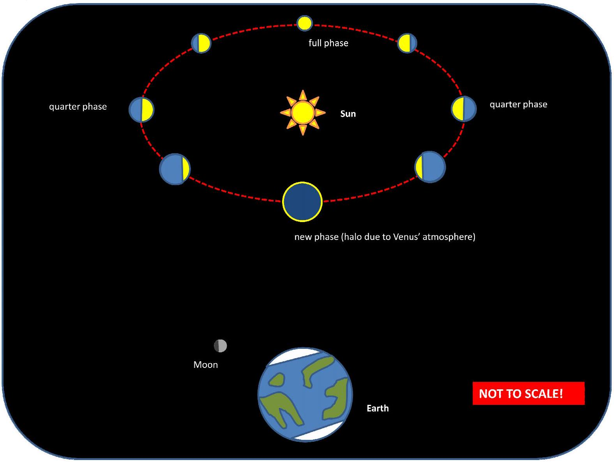

## BPO 2012 Round 2

1(a)

(i) From Kepler's $3 ^ { \text {rd } }$ law we know that the period of a planet's elliptical orbit around the Sun, P , and the semimajor axis of that orbit, a , are related by
$$
P ^ { 2 } \propto a ^ { 3 }
$$
Since $\mathrm { a } _ { \text {Venus } }$ and $\mathrm { a } _ { \text {Earth } }$ are different, their periods are different. This means that the position of Venus relative to Earth changes with time:

The full cycle from full phase to new and back to full phase again takes 584 (Earth) days.
The changes in apparent size of Venus are due to it being closer and further from the Earth as it goes through the cycle.
The changes in shape are due to the different angles of incidence for sunlight to be reflected off Venus towards the Earth at different points in its orbit.

(ii) The naked eye does not have sufficient angular resolution to resolve Venus's shape. The angular resolution of the naked eye is approximately one arcminute, which is also the approximate angular size of Venus as viewed from Earth, so the naked eye perceives Venus as a bright point object in the size. The sensitivity of the eye to changes in brightness is, however, sufficient to perceive the changes in brightness due to different amounts of reflected sunlight reaching the Earth as Venus changes its position relative to us.

(iv) If there are no leaks, the mass of water entering the hose from the tap in unit time must be the same as the mass of water leaving the hose at the other end in unit time.
Mass of water entering hose in unit time: $m _ { i n } = \rho A _ { i n } v _ { i n }$
Mass of water leaving hose in unit time: $m _ { \text {out } } = \rho A _ { \text {out } } v _ { \text {out } }$
where $\rho$ is the density of water, $\mathrm { A } _ { \text {in } }$ and $\mathrm { A } _ { \text {out } }$ are the cross-sectional areas of the hose at the tap-end and the open end, and $\mathrm { v } _ { \text {in } }$ and $\mathrm { v } _ { \text {out } }$ are the velocities of water at the respective ends.
Since $\mathrm { m } _ { \text {in } } = \mathrm { m } _ { \text {out } }$, we get
$$
v _ { \text {out } } = v _ { \text {in } } \left( \frac { A _ { \text {in } } } { A _ { \text {out } } } \right)
$$
Assuming that the cross-sectional area of the hose is constant throughout its length, the only way that $\mathrm { v } _ { \text {out } }$ can be different from $\mathrm { v } _ { \text {in } }$ is if $\mathrm { A } _ { \text {out } }$ is altered by partially blocking it:
$$
A _ { \text {out } } = A _ { \text {in } } - A _ { \text {thumb } }
$$
where $\mathrm { A } _ { \text {thumb } }$ is the area blocked by the thumb ( $A _ { \text {thumb } } \leq A _ { \text {in } }$ ).
This means that
$$
v _ { \text {out } } = v _ { \text {in } } \left( \frac { A _ { \text {in } } } { A _ { \text {in } } - A _ { \text {thumb } } } \right)
$$
Since $A _ { \text {thumb } } > 0 , \mathrm { v } _ { \text {out } } > \mathrm { v } _ { \text {in } }$
QED

1(b)
(i) Electron energy $= 100 \mathrm { eV } = 1.6 \times 10 ^ { - 17 } \mathrm {~J}$
Equating this to kinetic energy gives:
$$
\begin{gathered}
\frac { 1 } { 2 } m _ { e } v _ { \max } ^ { 2 } = 1.6 \times 10 ^ { - 17 } \mathrm {~J} \\
v _ { \max } = \sqrt { \frac { 2 \times 1.6 \times 10 ^ { - 17 } \mathrm {~J} } { 9.1 \times 10 ^ { - 31 } \mathrm {~kg} } } = 5.9 \times 10 ^ { 6 } \mathrm {~m} / \mathrm { s }
\end{gathered}
$$
(ii) The electric field is uniform between the plates, so if the electron travels half the distance it acquires half as much energy from the field. The velocity can be calculated easily:
$$
v _ { 1 / 2 } = \frac { v _ { \max } } { \sqrt { 2 } } = 4.2 \times 10 ^ { 6 } \mathrm {~m} / \mathrm { s }
$$
(iii) Using the Biot-Savart law, you should get the answer $2 \times 10 ^ { - 10 } \mathrm {~T}$. Note that the thickness of the beam does not matter in this case, as the measurement is being performed outside the beam.
(iv) The electrons now have a much higher maximum velocity. This can be calculated as in step (i). The new velocity is 63\% of the speed of light.
