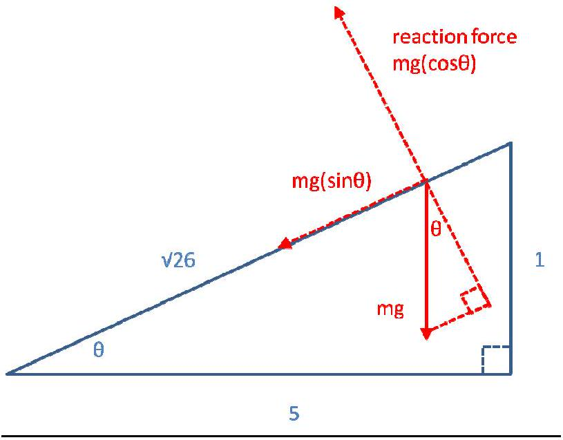

Q1

(i) $x _ { B } = 2 L$
(ii) $\quad x _ { A } = 2 \sqrt { L ^ { 2 } + \left( \frac { v t _ { A } } { 2 } \right) ^ { 2 } } = \sqrt { 4 L ^ { 2 } + \left( v t _ { A } \right) ^ { 2 } }$
(iii) $t _ { B } = 2 L / c$
(iv) $t _ { A } = \frac { x _ { A } } { c }$
$$
\begin{gathered}
t _ { A } ^ { 2 } = \frac { 1 } { c ^ { 2 } } \left( 4 L ^ { 2 } + v t _ { A } ^ { 2 } \right) \\
t _ { A } ^ { 2 } \left( 1 - v ^ { 2 } / c ^ { 2 } \right) = \frac { 4 L ^ { 2 } } { c ^ { 2 } } \\
t _ { A } = \frac { 2 L / c } { \sqrt { 1 - v ^ { 2 } / c ^ { 2 } } } \\
t _ { A } = \frac { t _ { B } } { \sqrt { 1 - v ^ { 2 } / c ^ { 2 } } }
\end{gathered}
$$

This is the famous relativistic time-dilation formula. It says that an event that observer B experiences as taking a time $\mathrm { t } _ { \mathrm { B } }$ will be experienced by observer A to take a different time, $\mathrm { t } _ { \mathrm { A } }$, which is longer than $\mathrm { t } _ { \mathrm { B } }$ by a factor depending on the speed of B relative to A.

## Copper wire bit of Q1

Free-electron density: $\rho _ { e } = \rho _ { \text {atoms } } = \frac { \rho _ { C u } } { M _ { u ( C u ) } } N _ { A }$
where $\mathrm { M } _ { \mathrm { u } ( \mathrm { Cu } ) }$ is the atomic mass of copper, $\rho _ { \mathrm { Cu } }$ is the density of copper, and $\mathrm { N } _ { \mathrm { A } }$ is Avogadro's constant.

$$
\begin{aligned}
& \text { current } = I = \frac { \text { coulombs } } { \text { second } } = \frac { \text { electrons } } { \text { second } } \times \frac { \text { coulombs } } { \text { electron } } \\
& I = \frac { \text { volume swept out by current } } { \text { second } } \times \frac { \text { electrons } } { \text { unit volume } } \times \frac { \text { coulombs } } { \text { electron } } \\
& I = \pi r _ { \text {wire } } ^ { 2 } v _ { e } \times \rho _ { e } \times q _ { e }
\end{aligned}
$$

So: $\quad v _ { e } = \frac { I } { \left( \pi r _ { \text {wire } } ^ { 2 } \rho _ { e } q _ { e } \right) } \cong \frac { 1 } { 40,000 } I$

Force between wires: In each wire there are electrons and positively-charged ions (the atoms that have "lost" electrons). Each electron and ion in the wires attracts or repels the electrons and ions in the other wire. If a current is flowing then the electrons are moving with respect to the ions. This means that, from the electrons' frame of reference, the ions (and, therefore, the wires) are moving.

As we saw in the first part of the question, this means that the electrons in wire A will "see" the length of a line-segment of wire B as having a different, shorter, length than it would have if they were at rest relative to one another. This means that the linear positive charge density, due to the presence of the ions, appears greater to the electrons. The electrons therefore experience an attractive force toward the other wire due to the resulting Coulomb interaction, and there is a net force between the two wires. Since the drift velocity of the conduction electrons is very small, the Coulomb attraction is also very small, due to the $v ^ { 2 } / c ^ { 2 }$ term.

Transforming into the ion frame, the Coulomb force becomes the magnetic force. Hence we see that special relativity provides the link between electrodynamics and magnetostatics.

An in-depth argument, with full derivations, is available online at http://rs20.mine.nu/w/2012/08/how-do-magnets-work-magnetism-electrostatics-relativity/

Q2
(i) The unrestricted splash reaches 6 metres, at which point its velocity has been reduced to zero by the gravitational acceleration; that is, all its kinetic energy has been converted into gravitational potential energy.
$\frac { 1 } { 2 } m u ^ { 2 } = m g h _ { \text {max } } \quad$ where m is the mass of a hypothetical "parcel" of water, u is the intial velocity, and $\mathrm { h } _ { \max } = 6 \mathrm {~m}$ is the maximum height reached by the water.

$$
u = \sqrt { 12 g }
$$

Use: $v _ { t } = u - g t$ (eq1) to calculate velocity at time t .
The distance travelled in this time will be given by $h _ { t } = u t - \frac { g t ^ { 2 } } { 2 }$ (eq2).
So we can calculate the time taken to reach 3.5 m as follows:

$$
\begin{aligned}
& 3.5 = \sqrt { 12 g } t _ { 3.5 } - \frac { g } { 2 } t _ { 3.5 } ^ { 2 } \\
& - \frac { g } { 2 } t _ { 3.5 } ^ { 2 } + \sqrt { 12 g } t _ { 3.5 } - 3.5 = 0
\end{aligned}
$$

So: $t _ { 3.5 } = \frac { - \sqrt { 12 g } \pm \sqrt { 12 g - 7 g } } { - g } = \sqrt { \frac { 12 } { g } } \pm \sqrt { \frac { 5 } { g } }$
There are two answers because the water is at 3.5 m twice, once on the way up and once when it falls back down from the final height. So the result we're interested in is the smaller one, corresponding to the earliest time:

$$
t _ { 3.5 } = \sqrt { \frac { 12 } { g } } - \sqrt { \frac { 5 } { g } } \quad \text { (eq3) }
$$

This is approximately 0.39 seconds, using $\mathrm { g } = 9.8 \mathrm {~m} / \mathrm { s }$.
Substituting eq3 into into eq1, we get:

$$
v _ { 3.5 } = \sqrt { 12 g } - g \left( \sqrt { \frac { 12 } { g } } - \sqrt { \frac { 5 } { g } } \right) = \sqrt { 5 g } \cong 7.0 m s ^ { - 1 }
$$

Q2
(ii) The force on the stone is independent of the thickness of the stone. Assume that the velocity of the water after impact with the stone is zero, i.e. the water does not "bounce" off the stone but rather "stops dead" and then falls back down under the influence of gravity. Note that the parcel of water is not an isolated system, so conservation of momentum does not apply (conservation of momentum would apply if we considered the (water + stone) system).

$$
F = m \frac { d v } { d t }
$$

The mass of water hitting the stone in unit time is:

$$
m _ { w } = \rho _ { w } \times v _ { 3.5 } \times A _ { \text {stone } } = 1750 \mathrm {~kg}
$$

where $\rho _ { \mathrm { w } } = 1000 \mathrm {~kg} / \mathrm { m } ^ { 3 }$ is the density of water, and $\mathrm { A } _ { \text {stone } } = 0.25 \mathrm {~m} ^ { 2 }$ is the area of the face of the stone where the water hits.

All this water has its velocity reduced from $7 \mathrm {~m} / \mathrm { s }$ to zero, so $\frac { d v } { d t } = - 7 m s ^ { - 2 }$
So the force the stone exerts on the water is:

$$
F _ { s w } = ( 1750 \mathrm {~kg} ) \times \left( - 7 \mathrm {~ms} ^ { - 2 } \right) = - 12,250 \mathrm {~N}
$$

So, by Newton's third law we have $F _ { w s } = 12,250 N$ as the force the water exerts on the stone.
(iii) We neglect the forces due to the cement holding the stones together, as we have no information about them. Having done so, we can set the condition for failure to occur as being met when the force from the water is sufficient to lift the stone:
$F _ { w s } - F _ { g s } = 0$ where $\mathrm { F } _ { \mathrm { gs } }$ is the force of gravity on the stone.

$$
F _ { w s } = F _ { g s } = \left( 9.8 \mathrm {~ms} ^ { - 2 } \right) \times \left( 4000 \mathrm { kgm } ^ { - 3 } \right) \times \left( 0.25 \mathrm {~m} ^ { 2 } \right) \times ( 0.1 \mathrm {~m} ) = 980 \mathrm {~N}
$$

From earlier we have: $F _ { w s } = - m _ { w } \frac { d v } { d t } = - \rho _ { w } v _ { 3.5 } A _ { \text {stone } } \left( - v _ { 3.5 } \right)$
Substituting the numbers in and rearranging, we get $v _ { 3.5 } \cong 2.0 m s ^ { - 1 }$

Q3

(i) Accelerating force = component of $m g$ parallel to slope $= m g \sin \theta$

$$
\begin{aligned}
& \sum \text { forces } = m a \\
& m _ { \text {truck } } g \sin \theta - F _ { \text {braking } } = m _ { \text {truck } } a \\
& F _ { \text {braking } } = m _ { t } g \sin \theta - m _ { t } a , \text { where I've replaced } \mathrm { m } _ { \text {truck } } \text { with } \mathrm { m } _ { \mathrm { t } } \text { to save space. }
\end{aligned}
$$

Now: $\mathrm { d } Q = m c d T$, so $\frac { d T } { d t } = \frac { 1 } { m c } \frac { d Q } { d t } = \frac { 1 } { m c } P$
where c is heat capacity and P is power.
Since ower = force × velocity parallel to force, we can write

$$
\frac { d T } { d t } = \frac { 1 } { m _ { \text {disc } } c } \left( m _ { t } g \sin \theta - m _ { t } a \right) v _ { \text {truck } }
$$

...which can be written more neatly as:

$$
\dot { T } = \dot { x } \left( \frac { m _ { t } } { m _ { d } } \right) \left( \frac { g \sin \theta - \ddot { x } } { c } \right)
$$

where the dots denote a derivative with respect to time, $\mathrm { m } _ { \mathrm { d } }$ is the mass of the copper disc and c is its heat capacity.

(ii) This is just a matter of substituting numbers into the expression for dT/dt:

$$
\begin{aligned}
m _ { d } & = \frac { 0.015 \pi } { 16 } \rho _ { C u } = \frac { 63 \pi } { 8 } \mathrm {~kg} \\
\dot { T } & = 5 \left( 9.81 \sin \frac { 1 } { \sqrt { 26 } } - 0 \right) \left( \frac { 80,000 } { 24,255 \pi } \right) = 10.03 \mathrm {~K} / \mathrm { s }
\end{aligned}
$$

(iii) At equilibrium, the power radiated equals the power generated by heating:

$$
P _ { \text {generated } } = \dot { x } m g \sin \theta = A \sigma T ^ { 4 } = P _ { \text {radiated } }
$$

Rearranging for T gives:

$$
T = \sqrt [ 4 ] { \frac { \dot { x } m g \sin \theta } { \pi r _ { d i s c } ^ { 2 } \sigma } }
$$

Substituting the numbers in gives $T \cong 1712 K$

Q5
(a)
(b) Let the equatorial diameter be denoted by $a$ and the polar diameter be denoted by $b$. The cross-section is an ellipse with semi-major axis $a$ and semi-minor axis $b$. The equation of the ellipse is $\left( \frac { x } { a } \right) ^ { 2 } + \left( \frac { y } { b } \right) ^ { 2 } = 1$, which can be expressed as $x ^ { 2 } = a ^ { 2 } \left( 1 - \left( \frac { y } { b } \right) ^ { 2 } \right)$. The three-dimensional oblate spheroid is formed by rotating the ellipse around the semi-minor axis, giving a volume of:

$$
\begin{aligned}
V _ { o b } & = \int _ { - b } ^ { b } \pi x ^ { 2 } d y \\
& = \pi \int _ { - b } ^ { b } a ^ { 2 } \left( 1 - \left( \frac { y } { b } \right) ^ { 2 } \right) d y \\
& = \pi a ^ { 2 } \left[ y - \frac { y ^ { 3 } } { 3 b ^ { 2 } } \right] _ { - b } ^ { b } \\
& = \frac { 4 } { 3 } \pi a ^ { 2 } b
\end{aligned}
$$

When the star is at rest, it has a volume of $V _ { \text {rest } } = \frac { 4 } { 3 } \pi R ^ { 3 }$, where $R$ is the rest radius (given in the paper as 10 kilometres). We assume that the rotational motion does not affect the neutron star's mass, and since the neutron star material is incompressible the density $( \rho )$ is the same as it would be if the star were not spinning, so we can write:

$$
\begin{aligned}
M _ { \text {rest } } & = M _ { \text {spinning } } = M \\
\frac { 4 } { 3 } \pi R ^ { 3 } \rho & = \frac { 4 } { 3 } \pi a ^ { 2 } b \rho \\
R ^ { 3 } & = a ^ { 2 } b \quad \text { (eq1) }
\end{aligned}
$$

The next step is to consider that the surface of our prolate spheroid is an equipotential surface, meaning that the sum of the gravitational and rotational energies is constant at all points on the surface.

$$
\begin{aligned}
& \text { @ the equator: } U _ { e } = - \frac { G M } { a } - \frac { \omega ^ { 2 } a ^ { 2 } } { 2 } \\
& \qquad \text { @ the poles: } U _ { p } = - \frac { G M } { b }
\end{aligned}
$$

Equating the two, we obtain:

$$
- \frac { G M } { a } - \frac { \omega ^ { 2 } a ^ { 2 } } { 2 } = - \frac { G M } { b }
$$

This can be rearranged to give $\frac { a } { b }$ as follows:

$$
\begin{aligned}
G M \left( \frac { 1 } { b } - \frac { 1 } { a } \right) & = \frac { \omega ^ { 2 } a ^ { 2 } } { 2 } \\
1 - \frac { b } { a } & = \frac { \omega ^ { 2 } a ^ { 2 } b } { 2 G M } \\
\frac { a } { b } & = \left( 1 - \frac { \omega ^ { 2 } R ^ { 3 } } { 2 G M } \right) ^ { - 1 }
\end{aligned}
$$

...where in the last line we have used (eq1) to substitute $R ^ { 3 }$ for ( $a ^ { 2 } b$ ).
Plugging in the values from the question paper, we get

$$
\begin{gathered}
\frac { a } { b } = \left( 1 - \frac { \left( 10 ^ { 4 } \mathrm {~m} \right) ^ { 3 } \times \left( 100 \pi \mathrm {~s} ^ { - 1 } \right) ^ { 2 } } { 2 \times \left( 6.67 \times 10 ^ { - 11 } \mathrm {~m} ^ { 3 } \mathrm {~kg} ^ { - 1 } \mathrm {~s} ^ { - 2 } \right) \times \left( 6 \times 10 ^ { 30 } \mathrm {~kg} \right) } \right) ^ { - 1 } \\
\frac { a } { b } \cong 1.00025
\end{gathered}
$$

N.B. A quick check on the reasonableness of this result can be performed by substituting into the equation for $a / b$ the values of $M , \omega$, and $R$ for the Earth. The result is

$$
\left( \frac { a } { b } \right) _ { \text {Earth } } = 1.00178
$$

...which is reasonable since we know that the Earth is a very slightly oblate spheroid.

## Alternative (not very good) method:

This method gets a very-nearly-correct answer, but involves a mathematically-unjustifiable step in the calculation, so it is presented here for novelty value/warning purposes only:

The net acceleration on a particle at the equator of a spherical body of radius $R$ and mass $M$, rotating with an angular velocity of $\omega$, is given by

$$
g _ { e } = \frac { G M } { R ^ { 2 } } - R \omega ^ { 2 }
$$

At the poles, the rotational velocity is zero, so the net acceleration there is

$$
g _ { p } = \frac { G M } { R ^ { 2 } }
$$

The ratio of the accelerations is

$$
\frac { g _ { e } } { g _ { p } } = 1 - \frac { R ^ { 3 } \omega ^ { 2 } } { G M }
$$

If the body is made of an incompressible material, this inequality of $g _ { e }$ and $g _ { p }$ causes a slight deformation of the body; it will bulge at the equator. A rough estimate of the size of the bulge can be made by the extremely "hand-waving" method of redefining $g _ { e }$ and $g _ { p }$ so that

$$
\begin{aligned}
& g _ { e } = \frac { G M } { R _ { e } ^ { 2 } } \\
& g _ { p } = \frac { G M } { R _ { p } ^ { 2 } } \\
& \frac { g _ { e } } { g _ { p } } = \frac { R _ { p } ^ { 2 } } { R _ { e } ^ { 2 } }
\end{aligned}
$$

$\ldots$ where $R _ { e }$ and $R _ { p }$ are the equatorial and polar radii, and then "equating"

$$
\begin{aligned}
\frac { R _ { p } ^ { 2 } } { R _ { e } ^ { 2 } } & \cong 1 - \frac { R ^ { 3 } \omega ^ { 2 } } { G M } \\
\frac { R _ { e } } { R _ { p } } & \cong \left( 1 - \frac { R ^ { 3 } \omega ^ { 2 } } { G M } \right) ^ { - \frac { 1 } { 2 } }
\end{aligned}
$$

Plugging in the numbers gives

$$
\frac { R _ { e } } { R _ { p } } \cong 1.000123
$$

Close, but not good enough! The method is wrong and so the answer is wrong!
