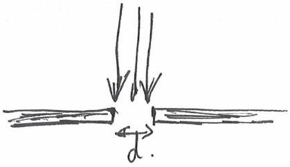
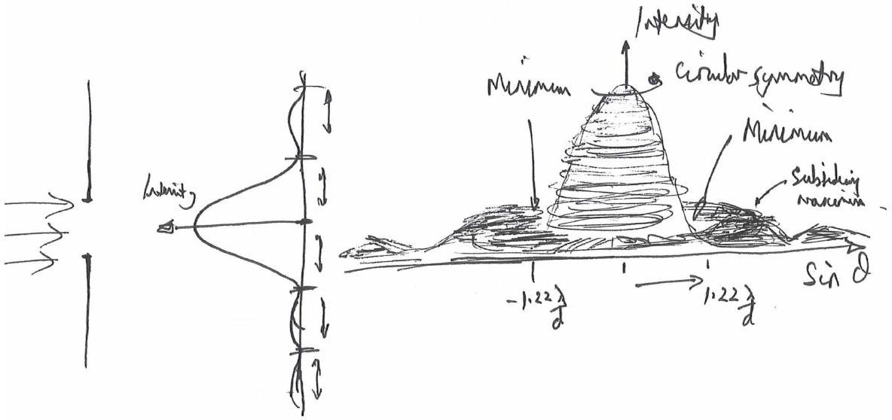
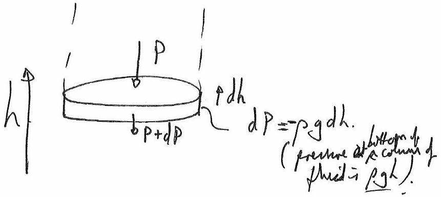

## Solutions: BPhO Round 2 January 2014

In these questions you are asked to make reasoned estimates, assumptions and explanations. These assumptions and estimations must be clearly stated.

Qu 1.

(a) Diffraction is the spreading or the bending of a wave when it passes a sharp edge. Since we assume the hole to be small, of a width comparable to the wavelength of light, then a noticeable change in the direction of the light propagating through the hole will occur. The proportion of light diffracted is high, since a great proportion of it is near the edge.
A small hole, with a diameter less than the wavelength of light, acts like a single point source of light, with nearly all the light diffracted, with a decreasing intensity measured out from the centre of the beam direction.
The image of a brightly illuminated and narrow slit has a diffuse area of light either side of the long edges of the slit.

More explicitly if light comes from the left and falls on a wall with one small hole then the light that gets through the hole falls on a second wall will take the form of a central bright spot directly opposite the hole, surrounded by a pattern of concentric light and dark rings.

The angular width of the $1 ^ { \text {st } }$ minimum, measure from the centre is $\theta = 1.22 \frac { \lambda } { d }$ with $\lambda$ the wavelength of light and $d$ the diameter of the hole. If $\lambda = 500 \mathrm {~nm}$, then for a bright central spot on a screen 1 m away of diameter 3 mm, the diameter of the hole must be 0.2 mm.

(b) Firstly, stars are very far away from the earth, and they appear as point source even through telescopes. Nearby stars similar to the Sun are 10 pc away (3 × $10 ^ { \text {17 } }$ m) so that there angular diameter subtended at the eye is $\frac { 2 \times 10 ^ { 9 } } { 3 \times 10 ^ { 17 } } = 10 ^ { - 8 } \mathrm { rad }$. Whereas planets (Venus for example has an angular width of typically $\frac { 12 \times 10 ^ { 6 } } { 1.5 \times 10 ^ { 11 } } = 10 ^ { - 5 } \mathrm { rad }$ ) are much smaller than the stars but much closer and they are not so much point like objects to the eye. Twinkling of the stars is due to the light passing through atmosphere layers. This atmosphere is composed of many thick layers of moving air.
As the light from these point sources (stars) passes through the layers of the earth's atmosphere, it will be refracted many times in random directions (due to density variations in the atmosphere). The stars are too small for us to resolve by eye. This refraction results in the twinkling of the stars.
Planets do not twinkle, because they are close to us, and represent several points in space, so light coming from them get mapped to many points in image space.
(c)
    - Comet tails that point away from the Sun are because gases escaping from the comet are ionised by the ultraviolet photons from the sun. The solar wind (particles, mainly protons and alphas coming out from the Sun i.e. charged particles) carries the comets directly outward away from the sun and these ionised gases form the plasma tail. This is the straight, radially outwards one.
    - The reason we have two tails in fig. 1.2 is due to the ionised gas and neutral dust particles. The dust particles are less sensitive to the solar wind and continue to go with the comet in its orbit.
The dust tails follow along the orbit of the comet, and the gas tail follows in the direction of the outgoing solar wind at the location.
    - Comets go around the sun in a highly elliptical orbit. Comets follow the Kepler's Laws; the closer they are to the sun the faster they move.
(d) The planets are in free fall towards the Sun, and are not in equilibrium. They should travel in elliptical orbits, and generally they do, although they are nearly circular. It is the presence of the solar wind, moving outwards from the sun that tends to remove the ellipticity of the orbit, as when close to the sun there is a larger outward force, and when further away there is less of an outward force.

## Qu 3.

We have to calculate the speed of Nitrogen molecules at a temperature:

$$
\begin{gathered}
\mathrm { KE } = \frac { 1 } { 2 } m v ^ { 2 } = \frac { 3 } { 2 } \mathrm { k } T \\
m = 28 \times 1.67 \times 10 ^ { - 27 } \mathrm {~kg} \\
v = \sqrt { \frac { 3 \mathrm { k } T } { m } } = 510 \mathrm {~m} \mathrm {~s} ^ { - 1 }
\end{gathered}
$$

(or multiple by $\mathrm { N } _ { \mathrm { A } }$ and use the molar gas constant, R , and the molar mass.)

At greater height, the pressure decreases as the air is compressible. There are several models of increasing sophistication that can be used. However, for an exam, one may take something simple. Assume that the temperature is constant at different heights within the atmosphere, an isothermal model (it isn't, and that can be considered in an adiabatic model, for example, but not here).

Consider a columnd air, and a thin slabes acchume dV, height dh ou demity $\rho$.
We was to fil out form $d P = - p$ gdh hos P varies with $h$.
Denisty, varies: $\rho = \frac { M } { V } = \frac { N _ { \mu } } { V } = \frac { n \cdot N _ { A \cdot } \mu } { V }$
alore $\mu$ is the mass of a molecule.

$$
\begin{aligned}
\text { and } P V & = n R T \text { with } R = 1 \\
\partial t P & = \frac { A \cdot N ( R \cdot \mu P ) } { N \cdot N A \cdot k \cdot T } \\
\therefore d P & = - \frac { \mu } { k \cdot T } \cdot d h \\
\int _ { P _ { 0 } } ^ { d P } P & = - \frac { \mu } { k T } \int _ { 0 } ^ { d } h \\
\Rightarrow P & = P _ { 0 } e ^ { - \frac { \mu g } { k T } }
\end{aligned}
$$

Ad argonation decrease is precere wirl hent and since $\rho \propto P$ for agas, and varies innitury

$$
\begin{gathered}
\frac { p } { p _ { 0 } } = 0.01 = e ^ { - \frac { 28 \times 1.67 \times 10 ^ { - 27 } \times 9.81 . h } { 1.38 \times 10 ^ { - 23 } \times 293 } } \\
L = 41 \mathrm {~km}
\end{gathered}
$$

C Promove up M+ Forent 28 kn is atement hulf at sen level.
So if a respecestiol fill off ore, $27 = 128$, so a $1 \%$ doyis saut $7 \times 8 \mathrm {~km} \approx 48 \mathrm {~km}$ - so ugreement].
A simple estimate will suffice rather than this derivation! Suitable Leight - colulate Mgh for ple plane.

$$
\text { Gove Rec } = q _ { \times 10 ^ { 10 } \mathrm {~J} } .
$$

(Cf. ke. of phere at $\left. 250 \mathrm {~m} / \mathrm { s } ( \overline { 500 \mathrm {~m} } / \mathrm { h } ) \sim 0.7 \times 10 ^ { 10 } \mathrm {~J} \right)$

## Qu 4.

The wind speed increases linearly with height is given. So we should consider this as a steam of mass $m$ moving at speed $v$ colliding with the wall. If we assume that the momentum of the air in the direction of the wind is lost on collision with the wall, since the air spreads out sideways, then the force on the wall at a particular height can be determined from the rate of change of momentum. So then the force acting on a small horizontal section can be determined to give the pressure versus height result. We can take the width of the wall, $w$, and calculate the force $F$ and $P$, the pressure.

The rate of change of momentum comes from $\frac { m } { t } = \rho A w v$ so that $\frac { m v } { t } = \rho A w v ^ { 2 }$
Hence at height $h$ the pressure on the wall is $\rho v ^ { 2 }$. If the wind speed is $v _ { 0 }$ at the top and zero at the bottom, and the wall is of height $h _ { \mathrm { o } }$, then the pressure can be expressed as $v = \frac { v _ { o } } { h _ { o } } h$ and thus

$$
P ( h ) = \rho \left( \frac { v _ { o } } { h _ { o } } \right) ^ { 2 } h ^ { 2 }
$$

The resultant force on the wall is $P ( h ) w d h$, which can be integrated to give $F _ { \text {total } } = \frac { 1 } { 3 } \rho \left( \frac { v _ { o } } { h _ { o } } \right) ^ { 2 } w h ^ { 3 }$. To topple the wall, a torque is applied about the pivot at the right hand bottom end of the wall (the right end of the foundation). So we have $\mathrm { d } F =$ $\rho \left( \frac { v _ { o } } { h _ { o } } \right) ^ { 2 } h ^ { 2 } \mathrm {~d} h$ at height $h$ acting over the small range $\mathrm { d } h$. The torque is $h \mathrm {~d} F$, which can be integrated to find the total torque, to give $\Gamma = \frac { 1 } { 4 } \rho \left( \frac { v _ { o } } { h _ { o } } \right) ^ { 2 } h ^ { 4 }$, which shows how the torque increases greatly as the height of the wall increases.
(partial answer)

## Qu 5.

The sun wobbles due to the competing gravitational tugs from many planets, mostly from Jupiter.

The data given are those of Jupiter:
Concerning the sun-Jupiter centre of mass which has the major effect on the sun wobbling:

$$
v _ { \mathrm { sun } } = \frac { M _ { J } \times \text { orbital velocity of Jupiter } } { M _ { \mathrm { sun } } }
$$

Orbital velocity of Jupiter $= 2 \pi R / T$

$$
\begin{aligned}
\frac { 2 \pi \times 78 \times 10 ^ { 10 } } { 4332 * 24 * 3600 } & = 13 \times 10 ^ { 3 } \mathrm {~m} / \mathrm { s } \\
& v _ { \text {sun } } = 12.4 \mathrm {~m} / \mathrm { s } .
\end{aligned}
$$

The other methods that might be used to detect a planet orbiting distant star:

- Doppler shift

- Direct imaging
- Astrometric (position) wobble
- Gravitational microlensing

## Qu 6.

For the ball moving from C to D that is equivalent to a circular motion whereas when the ball is moving form E to F this is equivalent to an elliptical motion (this is an approximation, which would be quite true if the shape of the well was a right circular cone and you were taking a cross section. For this " $1 / \mathrm { r }$ " shaped curve, it is only true if the slant of the orbit is very small).

There are several approaches that can be taken. Kepler's Third Law for example. Writing down the energy of the orbit in terms of GPE and KE is important. The horn represents a potential well, which the planets orbiting the sun satisfy.

The total energy of a ball moving in a circular or elliptical orbit is: KE + GPE
In the circular orbit, we can use the fact that gravity provides the centripetal force and so equate $\frac { m v ^ { 2 } } { r } = \frac { G M m } { r ^ { 2 } }$ so that the total orbital energy is $- \frac { 1 } { 2 } m v ^ { 2 }$ with $v$ a constant value.

Where $L$ is the angular momentum of the ball $L = r \times p = m r \times v$

So that

$$
E = \frac { L ^ { 2 } } { 2 m r ^ { 2 } }
$$

For the elliptical orbit, the total energy is

$$
E _ { e } = \frac { 1 } { 2 } m v _ { e } ^ { 2 } - \frac { G M m } { r _ { e } }
$$

We can suggest that the two orbits have the same angular momentum, as the "sun" remains at the focus

$$
E = \frac { 1 } { 2 } m v ^ { 2 } = \frac { L ^ { 2 } } { 2 m r ^ { 2 } }
$$

It is possible to relate the energies of the two orbits assuming that the angular momentum $L$ is the same.
