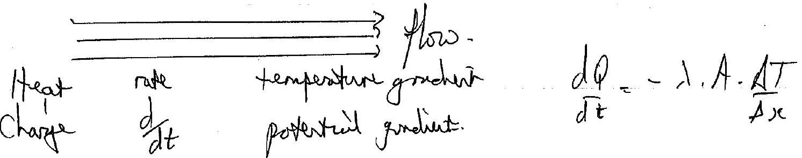
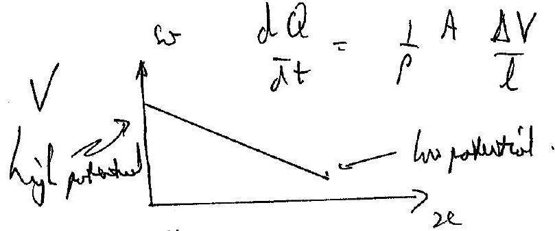
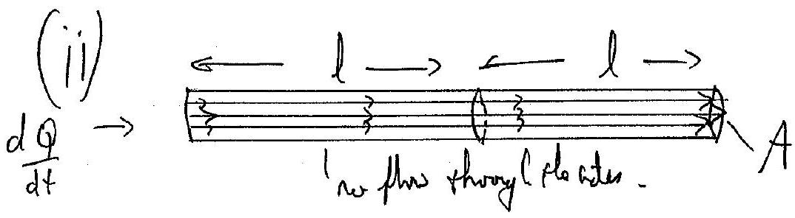
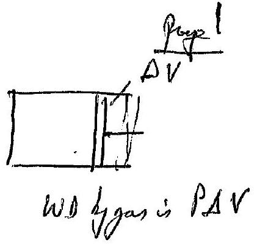
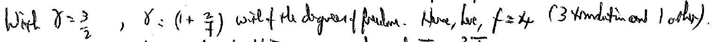

## Round $2 \operatorname { Tan } 2016$

Qui
(d) (j)

$$
I = V / R \Rightarrow \frac { d Q } { d t } = \frac { A } { \rho l } \cdot \left( V _ { 1 } - V _ { 2 } \right) \cdot \sigma _ { \text {Nulues } } ( \text { differece } )
$$

$$
\begin{aligned}
& \text { current } \\
& \text { in } + V _ { e } , \text { dirention. }
\end{aligned}
$$

$$
\therefore \quad \frac { d Q } { d t } = - \frac { 1 } { \rho } A \cdot \frac { d V } { d x }
$$

p is the resisivity. $d V$ is the protated

gmokin.
extst. $\Delta T = \Delta T _ { 1 } + \Delta T _ { 2 }$ (temperatures add). b $\quad \frac { d Q } { d t } \frac { 2 l } { \lambda A } = \frac { d Q } { d t } \cdot \frac { l } { \lambda _ { 1 } A } + \frac { d Q } { d t } \cdot \frac { l } { \lambda _ { 2 } A }$
(for the what hyph.

$$
\text { So that } \frac { 2 } { \lambda } = \frac { 1 } { \lambda _ { 1 } } + \frac { 1 } { \lambda _ { 2 } }
$$

Qu 1 cont.
(b)

Current ploss thirgh a thin "ciramperece" of theoren, $d r$, area $2 \pi r \times t$ and renitivity $p$.

$$
d R = \rho \frac { d r } { 2 \pi r t }
$$

$$
\text { So } \begin{aligned}
\int _ { 0 } ^ { R } d R ^ { \prime } & = \frac { e _ { 1 \pi t } } { r _ { 0 } } \int _ { r ^ { \prime } } ^ { r } \frac { d r ^ { \prime } } { r ^ { \prime } } \\
R & = \frac { f _ { \pi t } } { 2 } \ln \left( r / r _ { 0 } \right)
\end{aligned}
$$

(c) The wavefunts con be seen to be curved and besoming styloby water a effect of diffrustion

- There is a small auebration of ple water closs the slype as the Warshonts become a late furter apart.
- The water is very shallow, so its speed is limited by friention wird the ground. It can be seen to be the challow evough that the texture of the road chansi che riples in the water nurface (botton left of Fy'l-2).
- The linited incrume of quest userenes that the wanfurst do not spread out much. But there is a roticente pate-us at ture Woreforent - as the water deguss teflety at a warepont, He semplue water moves over the hayer close to the gound, giving a rolling breved a the wavefunde as it trouts drow the shope, be that they do not overtate sult other and merge toy ester.
- There must be a shylot dip is the rout an the water provees towards the antire. This also linists the differistion and may cause the curonture I the waverant, as the doceper water truent functer.

Qu 3
there we thereal ougs to derive the inge of the compare $b$ smodering elemath
(a) the fluid.

The particle of mass ma not is equilitim as it is auderating invards. But it remain wt the same hey't op the Hose.
Resolving wostilly:

$$
\begin{aligned}
& N \sin \theta = m g \\
& N \cos \theta = m r \omega ^ { 2 }
\end{aligned}
$$

$$
\Rightarrow \quad \tan d = \frac { M g } { M r \omega ^ { 2 } } = \frac { g } { \Gamma \omega ^ { 2 } }
$$

Will $\theta$ surfact, $\tan \theta = \frac { d r } { d z }$
So

$$
\frac { d r } { d z } = \frac { g } { r ^ { 2 } }
$$

Integrating ,

$$
\text { So } z = \frac { r ^ { 2 } w ^ { 2 } } { 2 g } \text { (parboho). }
$$

$$
\tan \theta = \frac { d y } { d x } = \frac { d } { d x } \left( a x ^ { 2 } \right) = 2 a x
$$

Now triyonometry!

$$
\begin{aligned}
& \sin 2 \theta = 2 \cos \theta \cos \theta \\
& \cos 2 \theta = \left( 2 \theta t ^ { 2 } \theta - 1 \right)
\end{aligned}
$$

$$
\begin{aligned}
\therefore \tan 2 \theta & = \frac { 2 \sin \theta \cdot \cos \theta } { 2 \cos ^ { 2 } \theta - 1 } \\
& = \frac { 2 \tan \theta } { 2 - \frac { 1 } { \cos ^ { 2 } \theta } } = \frac { 2 \tan \theta } { 1 + \left( 1 - \frac { 1 } { \cos ^ { 2 } \theta } \right) } \\
& = \frac { 2 \tan \theta } { 1 - \tan ^ { 2 } \theta } \text { uning } \tan \theta = 2 a x \\
& = \frac { 4 a x } { 1 - 4 a ^ { 2 } x ^ { 2 } }
\end{aligned}
$$

Allenatus for purch be fored
Allepinture for purchang hous manor the marken

since it is ling occularts.
of hime of is ling overtented.
form above:
$A d P = d F$

$$
\begin{aligned}
& \Rightarrow d F = d m r \omega ^ { 2 } \\
& d P = \frac { d F } { A } = r \frac { d D \cdot d r d z \cdot \rho \cdot r \omega ^ { 2 } } { r d d z } \\
& \frac { d P } { A } = \rho \omega ^ { 2 } r d r \\
& P = \rho \frac { \omega ^ { 2 } r ^ { 2 } } { 2 } + c \quad : r = 0 , P = 0 \Rightarrow c = 0
\end{aligned}
$$

 sighe wit.
(A) the fressupes are:

$$
\begin{aligned}
\rho g \left( z - z _ { B } + d z \right) & = \rho ( r + d r ) ^ { 2 } \frac { \omega ^ { 2 } } { 2 } \\
\text { as } \rho r ^ { 2 } \frac { \omega ^ { 2 } } { 2 } & = \rho y \left( z - z _ { B } \right)
\end{aligned}
$$

$$
\text { is } \begin{aligned}
p g d z & = p r d r \cdot \omega ^ { 2 } \\
\therefore g d z & = \omega ^ { 2 } r d r \\
z & = \frac { \omega ^ { 2 } r ^ { 2 } } { 2 g } + c \quad z = 0 , r = 0 \Rightarrow c = 0
\end{aligned}
$$

$$
\longrightarrow p , p _ { k }
$$

$$
\begin{aligned}
& \rho g \left( z _ { R } - z _ { B } - \left( z - z _ { B } \right) \right) = \rho \frac { R ^ { 2 } } { 2 } \omega ^ { 2 } - フ r ^ { 2 } \frac { \omega ^ { 2 } } { 2 } \\
& \left( z _ { R } - z \right) = \frac { \omega ^ { 2 } } { 2 y } \left( R ^ { 2 } - r ^ { 1 } \right) \quad \text { at } z = 0 , r \omega _ { 0 } \\
& z _ { R } = \frac { \omega ^ { 2 } R ^ { 2 } } { 2 g }
\end{aligned}
$$

so $z = \frac { \omega ^ { 2 } r ^ { 2 } } { 2 g }$
(C)

Junle Se pas elenerat

Qu 3 cont.

(c) From the diagram we can see that $\tan 2 \theta = \frac { x } { f _ { \text {max } } - y }$
To show that $f$ is fined, sulstitute for $y = a x ^ { 2 }$
$$
\text { Then } \tan 2 \theta = \frac { x } { f - a x ^ { 2 } } = \frac { 4 a x } { 4 a f - 4 a ^ { 2 } x ^ { 2 } }
$$
and on the term $4 a f = 1$
if $f = \frac { 1 } { 4 a }$ ubit is constant for all paramied rayl.
(d) From (a) we have $z = \frac { \omega ^ { 2 } } { 2 g } \cdot r ^ { 2 }$ and $y = a x ^ { 2 }$ If that $f = \frac { 1 } { 4 \omega ^ { 2 } / 2 g } = \frac { g } { 2 \omega ^ { 2 } }$
$\theta _ { \min } = 1 - 22 \frac { \lambda } { D }$ unig the Royligh criterion.
The revilition has to be 40 marsee for not tyle (It will be tetter than this for thes).
$$
\begin{aligned}
\therefore D = \frac { 1.22 \lambda } { \partial _ { \mathrm { min } } } & = 1.22 \times \frac { 700 \times 10 ^ { - 9 } } { 40 \times 10 ^ { - 3 } + \frac { 1 } { 3600 } \times \frac { \pi } { 180 } } \\
& = 4.40 \mathrm {~m}
\end{aligned}
$$
$\left[ \right.$ and $\left. f = \frac { 9.81 } { 2 \times \left( \frac { 8.5 \times 2 \pi } { 60 } \right) ^ { 2 } } = \begin{array} { r } 6.19 m \\ \end{array} \right]$
$$
\begin{aligned}
& d V = 2 \pi x d x \cdot y \\
& = 2 \pi x d x \cdot a x ^ { 2 } \\
& = 2 \pi a x ^ { 3 } d x \\
& \omega = 0.890 \mathrm { rads } ^ { - 1 } \\
& V = \int _ { 0 } ^ { a / 2 } 2 \pi a x ^ { 3 } d x = \left. 2 \pi a \frac { x } { 4 } \right| _ { 0 } ^ { 1 / 2 } \\
& \text { and as, } a = \frac { 1 } { 4 f } \\
& V = \frac { \pi } { 32 . f _ { .4 } } D ^ { 4 } \\
& = \frac { 2 \pi } { 4 } a \frac { D ^ { 4 } } { 2 ^ { 4 } } = \frac { \pi a } { 32 } D ^ { 4 } \\
& = \frac { 2 \pi a } { 4 } a \frac { D ^ { 4 } } { 2 ^ { 4 } } = \pi a D ^ { 4 } \\
& = \frac { 0109924 \mathrm { Al } ^ { 3 } } { 1.49 \mathrm {~m} ^ { 3 } }
\end{aligned}
$$

Qu3cont.
(e) Linfore cerea $\sim \frac { \pi \Delta ^ { 2 } } { 4 } = 15.2 \mathrm {~m} ^ { 2 }$

$$
\text { Rute of bus } = 0.77 \mathrm {~kg} \text { week. }
$$

$$
\begin{gathered}
\text { Rate is } \frac { 0.77 } { 13600 } \div 1.49 \times 100 \% \text { powell. } \\
= 3.8 \times 10 ^ { - 3 } \% \text { per wed }
\end{gathered}
$$

(f) The cinger of the almost point source (the twir) has a circular diffruotion postern the foculplare of the telexage meiror.

$$
F _ { \text {dut } } = f \times 1.22 \frac { \lambda } { D }
$$

$$
\begin{aligned}
\therefore \text { the intenity fator } & = \frac { \pi ( D / 2 ) ^ { 2 } } { \pi \Gamma _ { \text {ad } } ^ { 2 } } = \frac { D ^ { 2 } } { 4 \Gamma _ { \text {adj } } ^ { 2 } } \\
& = \frac { D ^ { 4 } } { 4 f ^ { 2 } 1.22 ^ { 2 } \lambda ^ { 2 } } \\
& = \frac { 4 \times 10 ^ { 2 } } { 4 \times 6.19 ^ { 2 } \times 1.22 ^ { 2 } \times 700 ^ { 2 } \times 10 ^ { - 18 } } \\
& = 3.4 \times 10 ^ { 12 }
\end{aligned}
$$

$$
\begin{aligned}
\text { Wenity } = \frac { \text { Power } } { \text { area } } & = 3.4 \times 10 ^ { 12 } \times 8.0 \times 10 ^ { - 14 } \mathrm { Wm } ^ { - 2 } \\
& = 0.27 \mathrm { Wm } ^ { - 2 }
\end{aligned}
$$

averaged over the central maxicimum area.

Question 4. (a)

$$
P V ^ { \gamma } = \text { const } = k
$$

(Adwabtic) WD on a gas is

$$
\begin{aligned}
& - P d V ^ { \prime } \\
& = - L P V _ { V _ { 0 } } \frac { d V } { V } r
\end{aligned}
$$

$$
= - \left. k \frac { V ^ { - \gamma + 1 } } { - \gamma + 1 } \right| _ { V _ { 0 } } ^ { V _ { f } }
$$

$$
= - k \frac { \left( V _ { f } ^ { 1 - \gamma } - V _ { 0 } ^ { 1 - \gamma } \right) } { 1 - \gamma }
$$

$$
=
$$

$$
= k \left( \frac { V _ { f } ^ { 1 - \gamma } - V _ { 0 } ^ { 1 - \gamma } } { \gamma - 1 } \right)
$$

$$
k = \rho _ { 0 } V _ { 0 } ^ { \gamma } = \rho _ { + } V _ { f } ^ { \gamma }
$$

$$
\text { (Adialate) WP on agas } = \frac { \left( P _ { f } V _ { f } - P _ { 0 } V _ { 0 } \right) . } { ( \gamma - 1 ) . } \text {. }
$$

$$
\begin{aligned}
& \text { WDon the gas on the RAS. in gain by } \\
& \qquad W D = \frac { \left( P _ { + } V _ { + } - P _ { 0 } V _ { 0 } \right) } { ( \gamma - 1 ) } \text { with }
\end{aligned}
$$

$$
\begin{aligned}
& P _ { t } = \frac { 2 } { 8 } 7 P _ { 0 } \\
& \gamma = 1.5
\end{aligned}
$$

$$
\begin{aligned}
& \text { and } V _ { f } \text { given } b _ { y _ { r } } \\
& P _ { 0 } V _ { 0 } ^ { \gamma } = P _ { f } V _ { f }
\end{aligned}
$$

i.e.

$$
W D = \frac { \frac { 27 } { 8 } \cdot \frac { 4 } { 9 } P _ { 0 } V _ { 0 } - P _ { 0 } V _ { 0 } } { ( 1.5 - 1 ) }
$$

$$
\text { So that, } P \% _ { 0 } ^ { \gamma } = \frac { 27 } { 8 } \% \cdot V _ { f } ^ { \gamma }
$$

$$
\text { Hence, } \left( \frac { V _ { 0 } } { V _ { f } } \right) ^ { 1.5 } = \left( 2 \frac { 7 } { 8 } \right) ^ { 1 }
$$

$$
\frac { V _ { 0 } } { V _ { f } } = \frac { q } { 4 }
$$

and $P _ { 0 } V _ { 0 } = n R T _ { 0 }$.

$$
V _ { f } = \frac { 4 } { 9 } V _ { 0 }
$$

This result unallo be obsended by torsuing $T _ { f }$ from port (b) $\left( T _ { x } = \frac { 3 } { 2 } T _ { 0 } \right)$. However ave must be totalen as the molerulers not pint portiales so $U _ { 0 } = 2 N k T _ { 0 }$, not $\frac { 3 } { 2 } k T 0$.

$$
\text { so } \begin{array} { l l }
U _ { 0 } = 4 \cdot \frac { 1 } { 2 } N k T _ { 0 } & \text { and wift } T _ { f } = \frac { 3 } { 2 } T _ { 0 } \\
U _ { + } = 4 \cdot \frac { 1 } { 2 } N k \left( \frac { 3 } { 2 } T _ { 0 } \right) \quad \text { for } \quad \Delta U = 2 N k \cdot \frac { 3 } { 2 } T _ { 0 } - 2 N k T _ { 0 } = N k T _ { 0 } \\
= n k T _ { 0 }
\end{array}
$$

Question 4cont...
(b)

$$
\begin{equation*}
P V ^ { \gamma } = \text { const. } \tag{1}
\end{equation*}
$$

and $\frac { P V } { T } =$ const so that $\frac { P ^ { r } V ^ { r } } { T ^ { r } } =$ unit (2)
Hence, dividy (1) by (2)
We oftein $P ^ { t - 1 } \cdot T =$ cond
Now wa can sultisticte.

$$
\begin{aligned}
P _ { 0 } ^ { \frac { 2 } { 3 } - 1 } \times T _ { 0 } & = \left( \frac { 27 } { 8 } P _ { 0 } \right) ^ { \frac { 2 } { 3 } - 1 } \times T _ { f } \\
T _ { 0 } & = \left( \frac { 27 } { 8 } P _ { 0 } \right) ^ { - \frac { 1 } { 3 } } \times T _ { f } \\
\bar { P } _ { 0 } ^ { \frac { 1 } { 3 } } & = \frac { 2 } { 3 } P _ { 0 } ^ { 1 / 3 } T _ { f } \\
\frac { T _ { 0 } } { P _ { 0 } ^ { 3 } } & = T _ { f } \\
T _ { 0 } & = \frac { 2 } { 3 } T _ { f } \\
P _ { 0 } T _ { f } & = \frac { 3 } { 2 } T _ { 0 }
\end{aligned}
$$

Abtemotwily

$$
d u = n C _ { v } \cdot \Delta T
$$

and wa know fore put (a) tho

$$
d u = \text { the WD in the gas }
$$

in an actibiotic concreeni in whet no hear wretherged with the termondis.

$$
\therefore \quad \begin{aligned}
& n C _ { v } \left( T _ { f } - T _ { 0 } \right) = n R T _ { 0 } \\
& T _ { f } - T _ { 0 } = \frac { R } { C _ { v } } \cdot T _ { 0 } \\
& T _ { f } - T _ { 0 } = ( \gamma - 1 ) T _ { 0 } \\
& T _ { f } = \gamma T _ { 0 } - T _ { 0 } + T _ { 0 } \\
& T _ { f } = \frac { 3 } { 2 } T _ { 0 } \text { or } T _ { f }
\end{aligned}
$$

$$
\begin{aligned}
& \text { Now this step ne } \\
& \text { Mayers equath } \\
& \text { Cp } - C v = R \\
& \text { So phot } \frac { C p } { C v } - 1 = \frac { R } { C v } \\
& \gamma - 1 = \frac { R } { C v }
\end{aligned}
$$

Qu. He ont...
(c) Pressure is $\frac { 27 } { 8 } \mathrm { P } _ { 0 }$ on LNS, rome as in RNS.

And the total ovhine of $2 V _ { 0 }$ is $V _ { \text {LMS } } + V _ { \text {Rests } }$
and de karsfurn part (a) shet $V _ { \text {Ras } } = \frac { 4 } { 9 } V _ { 0 }$
Hence

$$
\begin{aligned}
& V _ { \text {LHS } } = 2 V _ { 0 } - \frac { 4 } { 9 } V _ { 0 } \\
& V _ { \text {LHS } } = \frac { 14 } { 9 } V _ { 0 }
\end{aligned}
$$

Defact: $P _ { 0 } V _ { 0 } ^ { j } = P _ { + } V _ { + } ^ { \gamma }$ for the $\mathbb { R } H$.

$$
\begin{aligned}
P _ { 0 } V _ { 0 } ^ { \gamma } & = \frac { 27 } { 8 } P _ { 0 } \times V _ { f } ^ { \gamma } \\
\text { NHS } \rightarrow V _ { f } & = \left( \frac { 8 } { 27 } \right) ^ { \frac { 1 } { 8 } } V _ { 0 } = \frac { 4 } { 9 } V _ { 0 } \\
\text { or } & \text { LHA } \rightarrow V _ { f } = \frac { 14 } { 9 } V _ { 0 }
\end{aligned}
$$

Moring He cital gashew.
for Lits,

$$
\begin{aligned}
\frac { P _ { 0 } V _ { 0 } } { T _ { 0 } } & = \frac { P _ { + } V _ { + } } { T _ { + } } \\
\frac { P _ { 0 } V _ { 1 } } { T _ { 0 } } & = \frac { 2 \frac { 7 } { 8 } P _ { 0 } + \frac { 14 } { 9 } V _ { 0 } } { T _ { + } } \\
T _ { + } & = \frac { 27 } { 8 } \cdot \frac { 14 } { 9 } T _ { 0 } \\
T _ { + } & = \frac { 21 } { 4 } T _ { 0 }
\end{aligned}
$$

(d) The gas on the Lits has themal eargy rappied, so itgain atemal energy aids terpeature rises, but it abo does work is erporting. Remember, as themalenagy is nyphied, this is not an achabatic dange, so the adiobatio formula for wo does not apply an rle LIAS.
Gain in internal everyg, $\Delta u = n C _ { v } \left( T _ { + } - T _ { 0 } \right)$
$$
\begin{aligned}
& = n C _ { v } \cdot \left( \frac { 21 } { 4 } T _ { 0 } - T _ { 0 } \right) \\
& = n \cdot C _ { v } \cdot \frac { 17 } { 4 } \cdot T _ { 0 }
\end{aligned}
$$
$$
\text { Cor if we are } C _ { P } - C _ { V } = R \text { is that } \begin{aligned}
\gamma - 1 & = \frac { R } { C V } \text { when } \\
\Delta U & = \pi R \frac { 17 } { 2 } T _ { 0 } \\
& = \frac { \sqrt { 7 } } { 2 } P _ { 0 } V _ { 0 }
\end{aligned}
$$
Since the WS ontle RAS is $P _ { 0 } V _ { 0 }$ or $n R T _ { 0 }$ from part (a) this is the Work done by the gain onote LOSS.
$$
\begin{aligned}
\therefore \Delta \hat { Q } & = \text { cinclure in Hoemal exagy } + \text { watchine fy ple gargin } \\
& = \frac { 17 } { 2 } P _ { 0 } V _ { 0 } + P _ { 0 } V _ { 0 } \\
& = \frac { 19 } { 2 } P _ { 0 } V _ { 0 } = \frac { 19 n T _ { 0 } } { 2 } = n C _ { V } \frac { 17 } { 4 } T _ { 0 } + n R T _ { 0 } \\
& = n T _ { 0 } \left( \frac { 17 } { 4 } C _ { V } + R \right) .
\end{aligned}
$$

## Question 5

(a) Scale: on paper 10.2 cm communds to 7.8 cm on seriesn. $1 \mathrm {~cm} \quad \because \quad \therefore 0.765 \mathrm {~cm}$ mecrean
(i) Smallest finge spaning: 24 froyes in 5.2 cm is 0.166 cm an gerean
(ii) Largest spaing 4 friges (achajomal) in 4.2 cm is 0.803 cm an sereen

(and there are 5 anall finger is 1 luge finge)
$$
\theta = 32.5 ^ { \circ } = 33 ^ { \circ }
$$
The wire thickness produces the wide spared triye pattern.

$$
\begin{aligned}
\frac { \lambda } { \text { wiredrameter } } & = \begin{array} { l }
\text { dinge poing } \\
\text { distunctoritien }
\end{array} \\
\frac { \lambda } { d } & = \frac { W } { D }
\end{aligned}
$$

$$
\begin{aligned}
\therefore \quad d = \frac { \lambda D } { W } & = \frac { 633 \times 10 ^ { - 9 } \times 4.2 } { 0.803 \times 10 ^ { - 2 } } \\
& = 3.3 \times 10 ^ { - 4 } \mathrm {~m} \\
& = 0.33 \mathrm {~mm} .
\end{aligned}
$$

$$
\begin{aligned}
a = \frac { \lambda D } { W } & = \frac { 633 \times 10 ^ { - 9 } \times 4.2 } { 0.166 \times 10 ^ { - 2 } } \\
& = 1.60 \times 10 ^ { - 3 } \mathrm {~m} \\
& = 1.6 \mathrm {~mm} \\
\text { (itch, } p = \frac { a } { \cos \theta / 2 } & = 1.67 \\
& = 1.7 \mathrm {~mm}
\end{aligned}
$$

prine offing is a nie cure

$$
\begin{aligned}
& \frac { 2 \pi r } { p } = \tan \left( 90 - \frac { \theta } { 2 } \right) \\
& 2 \sigma , 2 r = 1.79 \mathrm {~mm} , r = 0.897 \mathrm {~mm}
\end{aligned}
$$

Qu. 5 cont.
(b) (i) Scale 9.1 cm on paper is 9.4 cm on screen
4.5 cm for 10 prayis
∴ primge onserven is $W = 0.465 \mathrm {~cm}$
(ii)

$$
\begin{aligned}
a = \frac { \lambda D } { W } & = \frac { 0.15 \times 10 ^ { - 9 } \times 9.0 \times 10 ^ { - 2 } } { 0.465 \times 10 ^ { - 2 } } \\
& = 2.9 \times 10 ^ { - 9 } \mathrm {~m} \\
& = 2.9 \mathrm {~nm}
\end{aligned}
$$

(iii) $\theta = 84 ^ { \circ }$
(iv) pitch, $P = \frac { a } { \cos \frac { \theta } { 2 } } = \frac { 2.9 } { \cos 42 } = 3.9 \mathrm {~nm}$
(v) radius: $\frac { 2 \pi r } { 2 } = \tan \left( 90 - \frac { \theta } { 2 } \right)$

$$
\Gamma = 0.69 \mathrm { nM }
$$
