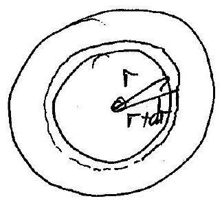

Qu 1 cont.
(b)

Current ploss thirgh a thin "ciramperece" of theoren, $d r$, area $2 \pi r \times t$ and renitivity $p$.

$$
d R = \rho \frac { d r } { 2 \pi r t }
$$

$$
\text { So } \begin{aligned}
\int _ { 0 } ^ { R } d R ^ { \prime } & = \frac { e _ { 1 \pi t } } { r _ { 0 } } \int _ { r ^ { \prime } } ^ { r } \frac { d r ^ { \prime } } { r ^ { \prime } } \\
R & = \frac { f _ { \pi t } } { 2 } \ln \left( r / r _ { 0 } \right)
\end{aligned}
$$

(c) The wavefunts con be seen to be curved and besoming styloby water a effect of diffrustion

- There is a small auebration of ple water closs the slype as the Warshonts become a late furter apart.
- The water is very shallow, so its speed is limited by friention wird the ground. It can be seen to be the challow evough that the texture of the road chansi che riples in the water nurface (botton left of Fy'l-2).
- The linited incrume of quest userenes that the wanfurst do not spread out much. But there is a roticente pate-us at ture Woreforent - as the water deguss teflety at a warepont, He semplue water moves over the hayer close to the gound, giving a rolling breved a the wavefunde as it trouts drow the shope, be that they do not overtate sult other and merge toy ester.
- There must be a shylot dip is the rout an the water provees towards the antire. This also linists the differistion and may cause the curonture I the waverant, as the doceper water truent functer.
