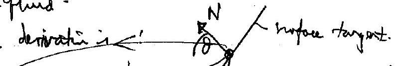
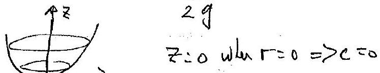
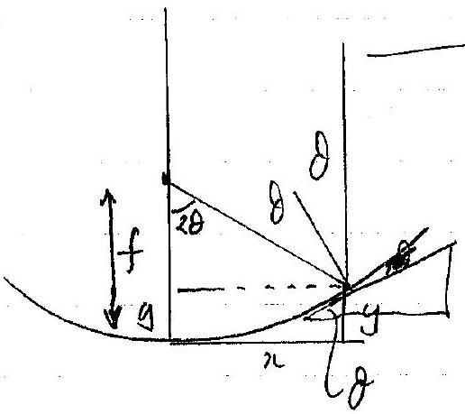
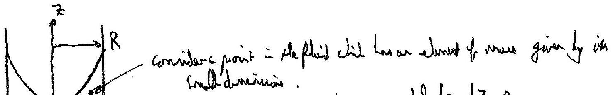
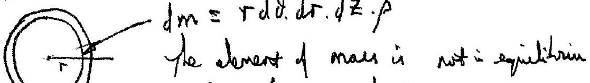
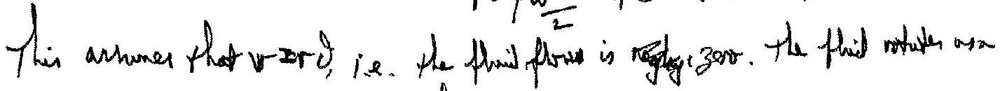
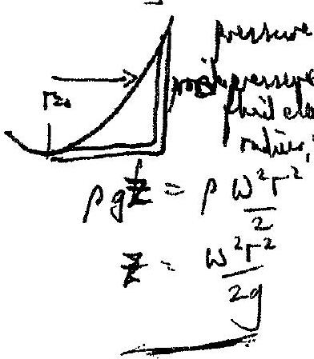
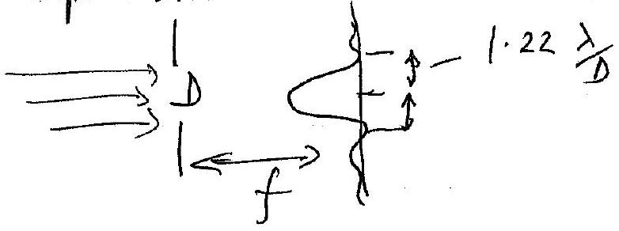

Qu 3
there we thereal ougs to derive the inge of the compare $b$ smodering elemath
(a) the fluid.

The particle of mass ma not is equilitim as it is auderating invards. But it remain wt the same hey't op the Hose.
Resolving wostilly:

$$
\begin{aligned}
& N \sin \theta = m g \\
& N \cos \theta = m r \omega ^ { 2 }
\end{aligned}
$$

$$
\Rightarrow \quad \tan d = \frac { M g } { M r \omega ^ { 2 } } = \frac { g } { \Gamma \omega ^ { 2 } }
$$

Will $\theta$ surfact, $\tan \theta = \frac { d r } { d z }$
So

$$
\frac { d r } { d z } = \frac { g } { r ^ { 2 } }
$$

Integrating ,

$$
\text { So } z = \frac { r ^ { 2 } w ^ { 2 } } { 2 g } \text { (parboho). }
$$

$$
\tan \theta = \frac { d y } { d x } = \frac { d } { d x } \left( a x ^ { 2 } \right) = 2 a x
$$

Now triyonometry!

$$
\begin{aligned}
& \sin 2 \theta = 2 \cos \theta \cos \theta \\
& \cos 2 \theta = \left( 2 \theta t ^ { 2 } \theta - 1 \right)
\end{aligned}
$$

$$
\begin{aligned}
\therefore \tan 2 \theta & = \frac { 2 \sin \theta \cdot \cos \theta } { 2 \cos ^ { 2 } \theta - 1 } \\
& = \frac { 2 \tan \theta } { 2 - \frac { 1 } { \cos ^ { 2 } \theta } } = \frac { 2 \tan \theta } { 1 + \left( 1 - \frac { 1 } { \cos ^ { 2 } \theta } \right) } \\
& = \frac { 2 \tan \theta } { 1 - \tan ^ { 2 } \theta } \text { uning } \tan \theta = 2 a x \\
& = \frac { 4 a x } { 1 - 4 a ^ { 2 } x ^ { 2 } }
\end{aligned}
$$

Allenatus for purch be fored
Allepinture for purchang hous manor the marken

since it is ling occularts.
of hime of is ling overtented.
form above:
$A d P = d F$

$$
\begin{aligned}
& \Rightarrow d F = d m r \omega ^ { 2 } \\
& d P = \frac { d F } { A } = r \frac { d D \cdot d r d z \cdot \rho \cdot r \omega ^ { 2 } } { r d d z } \\
& \frac { d P } { A } = \rho \omega ^ { 2 } r d r \\
& P = \rho \frac { \omega ^ { 2 } r ^ { 2 } } { 2 } + c \quad : r = 0 , P = 0 \Rightarrow c = 0
\end{aligned}
$$

 sighe wit.
(A) the fressupes are:

$$
\begin{aligned}
\rho g \left( z - z _ { B } + d z \right) & = \rho ( r + d r ) ^ { 2 } \frac { \omega ^ { 2 } } { 2 } \\
\text { as } \rho r ^ { 2 } \frac { \omega ^ { 2 } } { 2 } & = \rho y \left( z - z _ { B } \right)
\end{aligned}
$$

$$
\text { is } \begin{aligned}
p g d z & = p r d r \cdot \omega ^ { 2 } \\
\therefore g d z & = \omega ^ { 2 } r d r \\
z & = \frac { \omega ^ { 2 } r ^ { 2 } } { 2 g } + c \quad z = 0 , r = 0 \Rightarrow c = 0
\end{aligned}
$$

$$
\longrightarrow p , p _ { k }
$$

$$
\begin{aligned}
& \rho g \left( z _ { R } - z _ { B } - \left( z - z _ { B } \right) \right) = \rho \frac { R ^ { 2 } } { 2 } \omega ^ { 2 } - フ r ^ { 2 } \frac { \omega ^ { 2 } } { 2 } \\
& \left( z _ { R } - z \right) = \frac { \omega ^ { 2 } } { 2 y } \left( R ^ { 2 } - r ^ { 1 } \right) \quad \text { at } z = 0 , r \omega _ { 0 } \\
& z _ { R } = \frac { \omega ^ { 2 } R ^ { 2 } } { 2 g }
\end{aligned}
$$

so $z = \frac { \omega ^ { 2 } r ^ { 2 } } { 2 g }$
(C)

Junle Se pas elenerat

Qu 3 cont.

(c) From the diagram we can see that $\tan 2 \theta = \frac { x } { f _ { \text {max } } - y }$
To show that $f$ is fined, sulstitute for $y = a x ^ { 2 }$
$$
\text { Then } \tan 2 \theta = \frac { x } { f - a x ^ { 2 } } = \frac { 4 a x } { 4 a f - 4 a ^ { 2 } x ^ { 2 } }
$$
and on the term $4 a f = 1$
if $f = \frac { 1 } { 4 a }$ ubit is constant for all paramied rayl.
(d) From (a) we have $z = \frac { \omega ^ { 2 } } { 2 g } \cdot r ^ { 2 }$ and $y = a x ^ { 2 }$ If that $f = \frac { 1 } { 4 \omega ^ { 2 } / 2 g } = \frac { g } { 2 \omega ^ { 2 } }$
$\theta _ { \min } = 1 - 22 \frac { \lambda } { D }$ unig the Royligh criterion.
The revilition has to be 40 marsee for not tyle (It will be tetter than this for thes).
$$
\begin{aligned}
\therefore D = \frac { 1.22 \lambda } { \partial _ { \mathrm { min } } } & = 1.22 \times \frac { 700 \times 10 ^ { - 9 } } { 40 \times 10 ^ { - 3 } + \frac { 1 } { 3600 } \times \frac { \pi } { 180 } } \\
& = 4.40 \mathrm {~m}
\end{aligned}
$$
$\left[ \right.$ and $\left. f = \frac { 9.81 } { 2 \times \left( \frac { 8.5 \times 2 \pi } { 60 } \right) ^ { 2 } } = \begin{array} { r } 6.19 m \\ \end{array} \right]$
$$
\begin{aligned}
& d V = 2 \pi x d x \cdot y \\
& = 2 \pi x d x \cdot a x ^ { 2 } \\
& = 2 \pi a x ^ { 3 } d x \\
& \omega = 0.890 \mathrm { rads } ^ { - 1 } \\
& V = \int _ { 0 } ^ { a / 2 } 2 \pi a x ^ { 3 } d x = \left. 2 \pi a \frac { x } { 4 } \right| _ { 0 } ^ { 1 / 2 } \\
& \text { and as, } a = \frac { 1 } { 4 f } \\
& V = \frac { \pi } { 32 . f _ { .4 } } D ^ { 4 } \\
& = \frac { 2 \pi } { 4 } a \frac { D ^ { 4 } } { 2 ^ { 4 } } = \frac { \pi a } { 32 } D ^ { 4 } \\
& = \frac { 2 \pi a } { 4 } a \frac { D ^ { 4 } } { 2 ^ { 4 } } = \pi a D ^ { 4 } \\
& = \frac { 0109924 \mathrm { Al } ^ { 3 } } { 1.49 \mathrm {~m} ^ { 3 } }
\end{aligned}
$$

Qu3cont.
(e) Linfore cerea $\sim \frac { \pi \Delta ^ { 2 } } { 4 } = 15.2 \mathrm {~m} ^ { 2 }$

$$
\text { Rute of bus } = 0.77 \mathrm {~kg} \text { week. }
$$

$$
\begin{gathered}
\text { Rate is } \frac { 0.77 } { 13600 } \div 1.49 \times 100 \% \text { powell. } \\
= 3.8 \times 10 ^ { - 3 } \% \text { per wed }
\end{gathered}
$$

(f) The cinger of the almost point source (the twir) has a circular diffruotion postern the foculplare of the telexage meiror.

$$
F _ { \text {dut } } = f \times 1.22 \frac { \lambda } { D }
$$

$$
\begin{aligned}
\therefore \text { the intenity fator } & = \frac { \pi ( D / 2 ) ^ { 2 } } { \pi \Gamma _ { \text {ad } } ^ { 2 } } = \frac { D ^ { 2 } } { 4 \Gamma _ { \text {adj } } ^ { 2 } } \\
& = \frac { D ^ { 4 } } { 4 f ^ { 2 } 1.22 ^ { 2 } \lambda ^ { 2 } } \\
& = \frac { 4 \times 10 ^ { 2 } } { 4 \times 6.19 ^ { 2 } \times 1.22 ^ { 2 } \times 700 ^ { 2 } \times 10 ^ { - 18 } } \\
& = 3.4 \times 10 ^ { 12 }
\end{aligned}
$$

$$
\begin{aligned}
\text { Wenity } = \frac { \text { Power } } { \text { area } } & = 3.4 \times 10 ^ { 12 } \times 8.0 \times 10 ^ { - 14 } \mathrm { Wm } ^ { - 2 } \\
& = 0.27 \mathrm { Wm } ^ { - 2 }
\end{aligned}
$$

averaged over the central maxicimum area.
