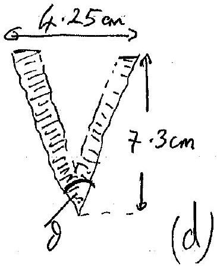
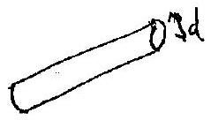
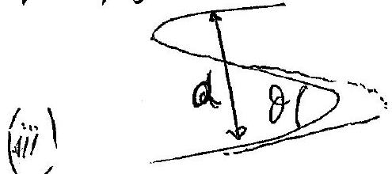
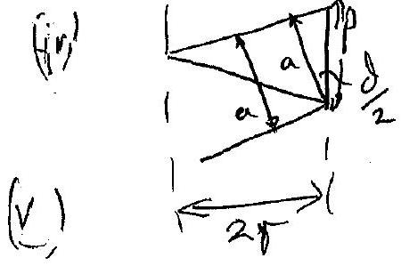

## Question 5

(a) Scale: on paper 10.2 cm communds to 7.8 cm on seriesn. $1 \mathrm {~cm} \quad \because \quad \therefore 0.765 \mathrm {~cm}$ mecrean
(i) Smallest finge spaning: 24 froyes in 5.2 cm is 0.166 cm an gerean
(ii) Largest spaing 4 friges (achajomal) in 4.2 cm is 0.803 cm an sereen

(and there are 5 anall finger is 1 luge finge)
$$
\theta = 32.5 ^ { \circ } = 33 ^ { \circ }
$$
The wire thickness produces the wide spared triye pattern.

$$
\begin{aligned}
\frac { \lambda } { \text { wiredrameter } } & = \begin{array} { l }
\text { dinge poing } \\
\text { distunctoritien }
\end{array} \\
\frac { \lambda } { d } & = \frac { W } { D }
\end{aligned}
$$

$$
\begin{aligned}
\therefore \quad d = \frac { \lambda D } { W } & = \frac { 633 \times 10 ^ { - 9 } \times 4.2 } { 0.803 \times 10 ^ { - 2 } } \\
& = 3.3 \times 10 ^ { - 4 } \mathrm {~m} \\
& = 0.33 \mathrm {~mm} .
\end{aligned}
$$

$$
\begin{aligned}
a = \frac { \lambda D } { W } & = \frac { 633 \times 10 ^ { - 9 } \times 4.2 } { 0.166 \times 10 ^ { - 2 } } \\
& = 1.60 \times 10 ^ { - 3 } \mathrm {~m} \\
& = 1.6 \mathrm {~mm} \\
\text { (itch, } p = \frac { a } { \cos \theta / 2 } & = 1.67 \\
& = 1.7 \mathrm {~mm}
\end{aligned}
$$

prine offing is a nie cure

$$
\begin{aligned}
& \frac { 2 \pi r } { p } = \tan \left( 90 - \frac { \theta } { 2 } \right) \\
& 2 \sigma , 2 r = 1.79 \mathrm {~mm} , r = 0.897 \mathrm {~mm}
\end{aligned}
$$

Qu. 5 cont.
(b) (i) Scale 9.1 cm on paper is 9.4 cm on screen
4.5 cm for 10 prayis
∴ primge onserven is $W = 0.465 \mathrm {~cm}$
(ii)

$$
\begin{aligned}
a = \frac { \lambda D } { W } & = \frac { 0.15 \times 10 ^ { - 9 } \times 9.0 \times 10 ^ { - 2 } } { 0.465 \times 10 ^ { - 2 } } \\
& = 2.9 \times 10 ^ { - 9 } \mathrm {~m} \\
& = 2.9 \mathrm {~nm}
\end{aligned}
$$

(iii) $\theta = 84 ^ { \circ }$
(iv) pitch, $P = \frac { a } { \cos \frac { \theta } { 2 } } = \frac { 2.9 } { \cos 42 } = 3.9 \mathrm {~nm}$
(v) radius: $\frac { 2 \pi r } { 2 } = \tan \left( 90 - \frac { \theta } { 2 } \right)$

$$
\Gamma = 0.69 \mathrm { nM }
$$
