Qu2. Magnetoresistance

(a)The circuit is as follows:

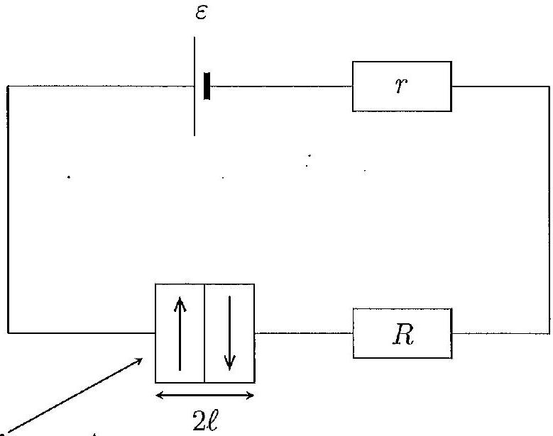
Cross-sectional area $A$
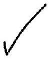
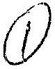
(b) Consider a spin-down electron as it moves through the first and then the second layer (from right to left). It will experience a layer of magnetisation parallel to its own followed by one anti-parallel. The current due to these electrons will therefore experience a resistance of
$$
\begin{aligned}
R _ { \mathrm { tot } } & = R _ { \mathrm { p } } + R _ { \mathrm { a } } \\
& = \frac { \ell } { A } \left( \rho _ { \mathrm { p } } + \rho _ { \mathrm { a } } \right)
\end{aligned}
$$
Spin-up electrons will experience the opposite (anti-parallel followed by parallel), giving the same resistance experienced overall. Since the currents can be regarded as being independent, the resistances experienced add in parallel, giving:
$$
\begin{aligned}
R _ { \text {combined } } & = \frac { R _ { \mathrm { tot } } } { 2 } \\
& = \frac { \ell } { 2 A } \left( \rho _ { \mathrm { p } } + \rho _ { \mathrm { a } } \right)
\end{aligned}
$$
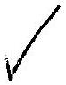
The total circuit resistance is therefore
$$
\begin{aligned}
R _ { \mathrm { tot } } & = R _ { \mathrm { combined } } + R + r \\
& = \frac { \ell } { 2 A } \left( \rho _ { \mathrm { p } } + \rho _ { \mathrm { a } } \right) + R + r
\end{aligned}
$$
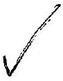
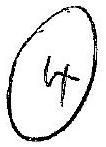

(c)The circuit is now as follows:

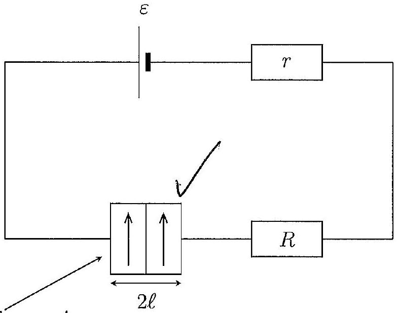
Cross-sectional area $A$

Considering either a spin-up or spin-down electron as it moves through these two layers, it experiences the same magnetisation throughout (either parallel or anti-parallel), for a total length of $2 \ell$. Electrons with their spin parallel to the magnetic field will therefore experience a resistance of

$$
R _ { \mathrm { p } } = \frac { \rho _ { \mathrm { p } } 2 \ell } { A } \quad \text { ⋱ } \quad \checkmark
$$

and likewise for electrons with their spin anti-parallel. Since the currents can be regarded as being independent, the resistances experienced add in parallel, giving:

$$
\begin{aligned}
\frac { 1 } { R _ { \text {combined } } } & = \frac { 1 } { R _ { \mathrm { p } } } + \frac { 1 } { R _ { \mathrm { a } } } \\
& = \frac { A } { 2 \rho _ { \mathrm { p } } \ell } + \frac { A } { 2 \rho _ { \mathrm { a } } \ell } \\
& = \frac { A } { 2 \ell } \frac { \rho _ { \mathrm { p } } + \rho _ { \mathrm { a } } } { \rho _ { \mathrm { p } } \rho _ { \mathrm { a } } }
\end{aligned}
$$

and hence a circuit resistance of
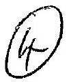
(d) (i) With $\rho _ { \mathrm { p } } \ll \rho _ { \mathrm { a } }$ we get
$$
R _ { ( \mathrm { b } ) } \approx \frac { \ell } { 2 A } \rho _ { \mathrm { a } } + R + r \quad \text { ¿ } \quad \checkmark
$$
and
$$
R _ { ( \mathrm { c } ) } \approx \frac { 2 \ell } { A } \rho _ { \mathrm { p } } + R + r \quad \text { ə } \checkmark
$$

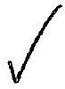

$$
\begin{aligned}
\Delta I & = I _ { ( \mathrm { c } ) } - I _ { ( \mathrm { b } ) } \\
& = \frac { \varepsilon } { R _ { ( \mathrm { c } ) } } - \frac { \varepsilon } { R _ { ( \mathrm { b } ) } } \\
& = \varepsilon \left( \frac { 1 } { \frac { 2 \ell } { A } \rho _ { \mathrm { p } } + R + r } - \frac { 1 } { \frac { \ell } { 2 A } \rho _ { \mathrm { a } } + R + r } \right)
\end{aligned}
$$

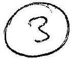

(ii) For fixed $\varepsilon , r , R , \rho _ { \mathrm { p } }$ and $\rho _ { \mathrm { a } } \left( \rho _ { \mathrm { p } } \ll \rho _ { \mathrm { a } } \right)$, the change in current depends on the physical dimensions only in the combination $x = \ell / A$ as:
$$
\Delta I = \varepsilon \left( \frac { 1 } { 2 x \rho _ { \mathrm { p } } + R ^ { \prime } } - \frac { 1 } { \frac { 1 } { 2 } x \rho _ { \mathrm { a } } + R ^ { \prime } } \right)
$$
where $R ^ { \prime } = R + r$. This is extremized when
$$
( 0 \rightarrow 3 \text { dependy }
$$
$$
\begin{aligned}
\frac { \mathrm { d } \Delta I } { \mathrm {~d} x } & = 0 \\
\Rightarrow - \varepsilon \left( \frac { 2 \rho _ { \mathrm { p } } } { \left( 2 x \rho _ { \mathrm { p } } + R ^ { \prime } \right) ^ { 2 } } - \frac { \frac { 1 } { 2 } \rho _ { \mathrm { a } } } { \left( \frac { 1 } { 2 } x \rho _ { \mathrm { a } } + R ^ { \prime } \right) ^ { 2 } } \right) & = 0 \\
\Rightarrow 2 \rho _ { \mathrm { p } } \left( x \rho _ { \mathrm { a } } / 2 + R ^ { \prime } \right) ^ { 2 } - \frac { 1 } { 2 } \rho _ { \mathrm { a } } \left( 2 x \rho _ { \mathrm { p } } + R ^ { \prime } \right) ^ { 2 } & = 0 \\
\Rightarrow \frac { \rho _ { \mathrm { p } } \rho _ { \mathrm { a } } ^ { 2 } } { 2 } \left( x + \frac { 2 R ^ { \prime } } { \rho _ { \mathrm { a } } } \right) ^ { 2 } - 2 \rho _ { \mathrm { a } } \rho _ { \mathrm { p } } ^ { 2 } \left( x + \frac { R ^ { \prime } } { 2 \rho _ { \mathrm { p } } } \right) ^ { 2 } & = 0 \\
\Rightarrow \rho _ { \mathrm { a } } \left( x ^ { 2 } + 4 \frac { R ^ { \prime } } { \rho _ { \mathrm { a } } } x + 4 \left( \frac { R ^ { \prime } } { \rho _ { \mathrm { a } } } \right) ^ { 2 } \right) - 4 \rho _ { \mathrm { p } } \left( x ^ { 2 } + \frac { R ^ { \prime } } { \rho _ { \mathrm { p } } } x + \left( \frac { R ^ { \prime } } { 4 \rho _ { \mathrm { p } } } \right) ^ { 2 } \right) & = 0 \\
\Rightarrow x ^ { 2 } \left( \rho _ { \mathrm { a } } - 4 \rho _ { \mathrm { p } } \right) + 4 x R ^ { \prime } - 4 x R ^ { \prime } + 4 \frac { R ^ { \prime 2 } } { \rho _ { \mathrm { a } } } - \frac { R ^ { \prime 2 } } { \rho _ { \mathrm { p } } } & = 0 \\
\Rightarrow x ^ { 2 } \left( \rho _ { \mathrm { a } } - 4 \rho _ { \mathrm { p } } \right) - \frac { R ^ { \prime 2 } } { \rho _ { \mathrm { p } } \rho _ { \mathrm { a } } } \left( \rho _ { \mathrm { a } } - 4 \rho _ { \mathrm { p } } \right) & = 0
\end{aligned}
$$
That is (assuming $\rho _ { \mathrm { a } } \gg \rho _ { \mathrm { p } }$ means that certainly $\rho _ { \mathrm { a } } > 4 \rho _ { \mathrm { p } } -$ i.e. $\rho _ { \mathrm { a } } \neq 4 \rho _ { \mathrm { p } }$ )
$$
x = \frac { R ^ { \prime } } { \sqrt { \rho _ { \mathrm { p } } \rho _ { \mathrm { a } } } } = \frac { R + r } { \sqrt { \rho _ { \mathrm { p } } \rho _ { \mathrm { a } } } }
$$
Differentiating again:
$$
\frac { \mathrm { d } ^ { 2 } \Delta I } { \mathrm {~d} x ^ { 2 } } = \varepsilon \left( \frac { 8 \rho _ { \mathrm { p } } ^ { 2 } } { \left( 2 x \rho _ { \mathrm { p } } + R ^ { \prime } \right) ^ { 3 } } - \frac { \frac { 1 } { 2 } \rho _ { \mathrm { a } } ^ { 2 } } { \left( \frac { 1 } { 2 } x \rho _ { \mathrm { a } } + R ^ { \prime } \right) ^ { 3 } } \right)
$$

so that

$$
\begin{aligned}
\left. \frac { \mathrm { d } ^ { 2 } \Delta I } { \mathrm {~d} x ^ { 2 } } \right| _ { x = \frac { R ^ { \prime } } { \sqrt { p _ { \mathrm { p } } \rho _ { \mathrm { a } } } } } & = \varepsilon \left( \frac { 8 \rho _ { \mathrm { p } } ^ { 2 } } { \left( 2 x \rho _ { \mathrm { p } } + R ^ { \prime } \right) ^ { 3 } } - \frac { \frac { 1 } { 2 } \rho _ { \mathrm { a } } ^ { 2 } } { \left( \frac { 1 } { 2 } x \rho _ { \mathrm { a } } + R ^ { \prime } \right) ^ { 3 } } \right) \\
& = \frac { \varepsilon } { R ^ { \prime 3 } } \left( \frac { 8 \rho _ { \mathrm { p } } ^ { 2 } } { \left( 2 \sqrt { \frac { \rho _ { \mathrm { p } } } { \rho _ { \mathrm { a } } } } + 1 \right) ^ { 3 } } - \frac { 4 \rho _ { \mathrm { a } } ^ { 2 } } { \left( \sqrt { \frac { \rho _ { \mathrm { a } } } { \rho _ { \mathrm { p } } } } + 2 \right) ^ { 3 } } \right) \\
& = \frac { \varepsilon \rho _ { \mathrm { p } } } { R ^ { \prime 3 } } \left( \frac { 8 \rho _ { \mathrm { p } } } { \left( 1 + 2 \sqrt { \frac { \rho _ { \mathrm { p } } } { \rho _ { \mathrm { a } } } } \right) ^ { 3 } } - \sqrt { \frac { \rho _ { \mathrm { p } } } { \rho _ { \mathrm { a } } } } \frac { 4 \rho _ { \mathrm { a } } } { \left( 1 + 2 \sqrt { \frac { \rho _ { \mathrm { p } } } { \rho _ { \mathrm { a } } } } \right) ^ { 3 } } \right) \\
& = - \frac { 8 \varepsilon \rho _ { \mathrm { p } } ^ { 2 } } { R ^ { \prime 3 } } \frac { \sqrt { \frac { \rho _ { \mathrm { a } } } { \rho _ { \mathrm { p } } } } } { \left( 1 + 2 \sqrt { \frac { \rho _ { \mathrm { p } } } { \rho _ { \mathrm { a } } } } \right) ^ { 3 } } \left( \frac { 1 } { 2 } - \sqrt { \frac { \rho _ { \mathrm { p } } } { \rho _ { \mathrm { a } } } } \right)
\end{aligned}
$$

which is manifestly less than zero since $\rho _ { \mathrm { p } } \ll \rho _ { \mathrm { a } }$ (again assuming $\rho _ { \mathrm { a } } \gg \rho _ { \mathrm { p } }$ means that certainly $\rho _ { \mathrm { a } } > 4 \rho _ { \mathrm { p } }$ ), showing that this value of $x$ gives a maximum change in current.

(e) When writing to disk, the read/write head would generate a (strong) magnetic field, creating a magnetic field pattern in the disk surface as it is rotated underneath to store information. When reading, the magnetised pattern on the disk read surface would rotate past the read/write head, generating (inducing) a current in the coil. When reading magnetic field patterns, we would therefore want a maximum change in current generated between areas of opposite magnetisation so that different states, and hence different 'bits' of information can be detected. We would therefore want the physical dimensions of the head to be optimised such that $\frac { \ell } { A } = \frac { R + r } { \sqrt { \rho _ { \mathrm { p } } \rho _ { \mathrm { a } } } }$ as in part (d) above. However, coupled with this we would also want to minimise the overall 'width' of the head so that it reads only the desired magnetisation area at one time, and not neighbouring ones at the same time. As a certain magnetic field strength would be required to write to the disk it would also be important to reduce the distance between the read/write head and the disk.

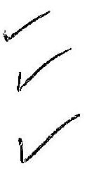
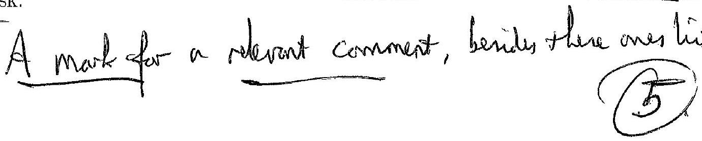
