## Qu3. Dual Radioactive Decay

(a) The number of ion pairs is
$$
n _ { \text {pairs } } = \frac { 6.5 \times 10 ^ { 6 } } { 15.6 } = 4.17 \times 10 ^ { 5 }
$$
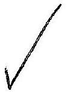
Assuming that a single electron is liberated in each ionization event, the number of ion pairs per second is
$$
\frac { 17 \times 10 ^ { - 9 } } { 1.6 \times 10 ^ { - 19 } } = 1.06 \times 10 ^ { 10 } \mathrm {~s} ^ { - 1 }
$$
The number of alpha particles per second is therefore
$$
\frac { 1.06 \times 10 ^ { 10 } } { 4.17 \times 10 ^ { 5 } } = \underline { 2.55 \times 10 ^ { 5 } } \mathrm {~s} ^ { - 1 }
$$
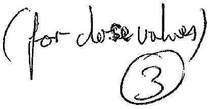
(b) As radioactive decay is a random process, if the number of decays per second (activity) is $A$,
(b) As radioactive decay is a random process, if the number of decays per second (activity) is $A$, the variation in this will be of the order of $\sqrt { A }$. If $I$ is the current, then from (a) the variation in this will be of the order of $\sqrt { A }$. If $I$ is the current, then from (a)
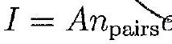
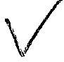
and
$$
\delta I = \delta A n _ { \mathrm { pairs } } e = \sqrt { A } n _ { \mathrm { pairs } } e
$$
that is
$$
\begin{aligned}
\frac { \delta I } { I } & = \frac { \sqrt { A } } { A } \\
\Rightarrow \delta I & = \frac { \sqrt { A } } { A } I \\
& = \frac { \sqrt { 2.55 \times 10 ^ { 5 } } } { 2.55 \times 10 ^ { 5 } } \times 17 \times 10 ^ { - 9 } \\
& \approx 0.2 \% \times 17 \times 10 ^ { - 9 } \\
& = 0.034 \times 10 ^ { - 9 } \mathrm {~A}
\end{aligned}
$$
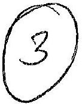
This is approximately three orders of magnitude smaller than the current itself, so will not be detected straightforwardly.
(c) A precision measurement of the half-life of a radioactive isotope by conventional techniques requires the observations to be extended over a period of time comparable to the half-life. Even for moderately long half-lives this is not only time consuming but introduces many experimental difficulties: The sensitivity of the detector may change in time, the source detector geometry may not be reproducible, and the background may vary during the experiment. More important, a slight variation in apparent hâlf-life due to impurities in the sample is difficult to detect during the course of the observations. The Balanced Ion Chamber technique does not suffer from the above difficulties. By using large cylindrical ion chambers and by introducing the source along the symmetry axis, the counters are made less sensitive to changes in geometry than conventional end window counters with external sources. Any change in background will produce an equal effect in both chambers. Hence, the current reading which is the difference current remains unchanged. A half-life in the region of 1 year can be measured to an accuracy of 1\% by observations extending over a period of roughly 10 days. This relatively rapid measurement permits several independent half-life determinations to be made on a given sample, and any slight variation with time of the measured half-life is readily detectable.
5 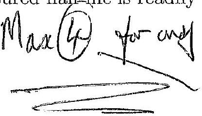
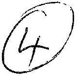

(d) Here is a graph of $\ln ( I )$ against time (with $I$ in nano-amps). See table in part (f) for values, though if the currents given in the question are converted into amperes before logarithms are taken, the logarithmic values will be offset by $\ln \left( 1 \times 10 ^ { - 9 } / \mathrm { A } \right) = - \ln \left( 1 \times 10 ^ { 9 } / \mathrm { A } \right) \approx - 20.723$. The final results for values of $\lambda$ and half-lives should of course be unchanged. From (b) we
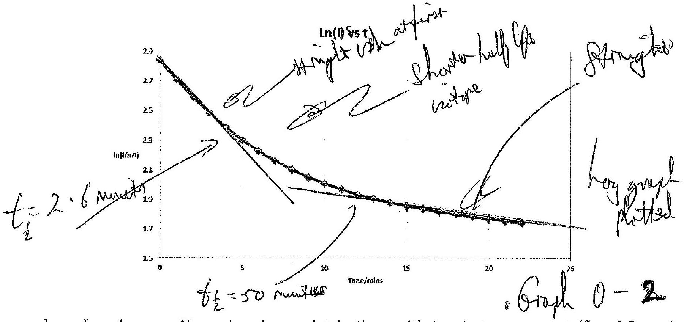
have $I = A n _ { \text {pairs } } e$. Now, at a given point in time, with two isotopes present (S and L, say), there will be a total number of molecules
$$
\begin{aligned}
N ( t ) & = N _ { \mathrm { S } } + N _ { \mathrm { L } } \\
& = N _ { \mathrm { S } 0 } e ^ { - \lambda _ { \mathrm { S } } t } + N _ { \mathrm { L } 0 } e ^ { - \lambda _ { \mathrm { L } } t }
\end{aligned}
$$
assuming that each isotope decays independently. So
$$
\begin{aligned}
A & = A _ { \mathrm { S } } + A _ { \mathrm { L } } \\
& = \lambda _ { \mathrm { S } } N _ { \mathrm { S } } + \lambda _ { \mathrm { L } } N _ { \mathrm { L } } \\
& = \lambda _ { \mathrm { S } } N _ { \mathrm { S } 0 } e ^ { - \lambda _ { \mathrm { S } } t } + \lambda _ { \mathrm { L } } N _ { \mathrm { L } 0 } e ^ { - \lambda _ { \mathrm { L } } t }
\end{aligned}
$$
With $n _ { \text {pairs } } e = c$ this then implies
$$
\begin{aligned}
I & = c A \\
& = c \left( \lambda _ { \mathrm { S } } N _ { \mathrm { S } 0 } e ^ { - \lambda _ { \mathrm { S } } t } + \lambda _ { \mathrm { L } } N _ { \mathrm { L } 0 } e ^ { - \lambda _ { \mathrm { L } } t } \right)
\end{aligned}
$$
Now without loss of generality let $\lambda _ { \mathrm { S } } > \lambda _ { \mathrm { L } }$ so that S has the shorter half-life. Initially, I (and hence $\ln ( I )$ ) decreases in a nonlinear fashion due to the exponential decay of the activities of both isotopes. However, after a certain amount of time, $\lambda _ { \mathrm { S } } t$ will be large enough so that $e ^ { - \lambda _ { \mathrm { S } } t }$ will become small such that the term $c \lambda _ { \mathrm { S } } N _ { \mathrm { S } 0 } e ^ { - \lambda _ { \mathrm { S } } t }$ is virtually undetectable - i.e. $e ^ { - \lambda _ { \mathrm { S } } t } \approx 0$. In this case we will have
$$
\begin{aligned}
\ln ( I ) & = \ln ( c ) + \ln \left( \lambda _ { \mathrm { S } } N _ { \mathrm { S } 0 } e ^ { - \lambda _ { \mathrm { S } } t } + \lambda _ { \mathrm { L } } N _ { \mathrm { L } 0 } e ^ { - \lambda _ { \mathrm { L } } t } \right) \\
& \approx \ln \left( c \lambda _ { \mathrm { L } } N _ { \mathrm { L } 0 } \right) - \lambda _ { \mathrm { L } } t
\end{aligned}
$$
Therefore a graph of $\ln ( I )$ vs. time should decrease nonlinearly to begin with, but after a certain amount of time (approximately 15 minutes by the look of the graph) it should resemble a straight line graph with a negative gradient; the isotope with the shorter half-life is no-longer significantly contributing to the current.

(e)The values for 17 minutes and greater (see table in part (f)) are plotted below. Since the gradient

In(1) vs t for t>16 mins
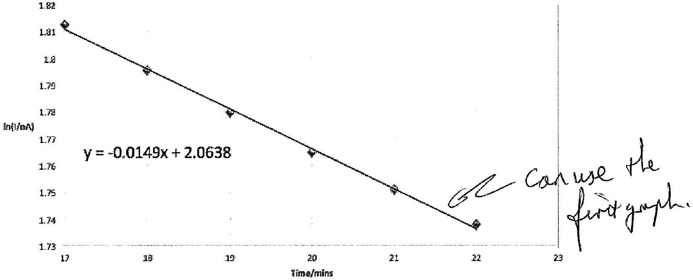

must be equal to $- \lambda _ { \mathrm { L } }$, this gives $\lambda _ { \mathrm { L } } = 0.0149$ and hence a half life of

$$
\begin{aligned}
T _ { \mathrm { L } \frac { 1 } { 2 } } & = \frac { \ln ( 2 ) } { \lambda _ { \mathrm { L } } } \\
& \approx \underline { 46.5 \mathrm {~min} } \pm 5 \text { minute. }
\end{aligned}
$$

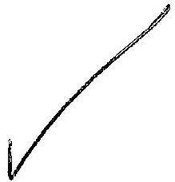
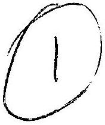

(f) The formula for the long half-life component of the gas $\ln \left( I _ { \mathrm { L } } \right) = - 0.0149 t + 2.0638$ (from the graph for $t > 17 \mathrm {~min}$ ) then gives values of $I _ { \mathrm { L } } = e ^ { - 0.0149 t + 2.0638 }$ and $I _ { \mathrm { S } } = I _ { \text {total } } - I _ { \mathrm { L } }$ etc.

| Time /min | $\ln \left( I _ { \mathrm { L } } / \mathrm { nA } \right)$ | $I _ { \mathrm { L } } / \mathrm { A } \times 10 ^ { - 9 }$ | $I _ { \mathrm { S } } / \mathrm { A } \times 10 ^ { - 9 }$ | $\ln \left( I _ { \mathrm { S } } / \mathrm { nA } \right)$ |
| :--- | :--- | :--- | :--- | :--- |
| 0 | 2.833 | 7.876 | 9.124 | 2.211 |
| 1 | 2.703 | 7.760 | 7.170 | 1.970 |
| 2 | 2.584 | 7.645 | 5.616 | 1.726 |
| 3 | 2.477 | 7.532 | 4.380 | 1.477 |
| 4 | 2.381 | 7.421 | 4.400 | 1.224 |
| 5 | 2.296 | 7.311 | 2.623 | 0.964 |
| 6 | 2.220 | 7.203 | 2.009 | 0.698 |
| 7 | 2.154 | 7.096 | 1.525 | 0.422 |
| 8 | 2.096 | 6.991 | 1.146 | 0.136 |
| 9 | 2.046 | 6.888 | 0.849 | -0.164 |
| 10 | 2.002 | 6.786 | 0.618 | -0.481 |
| 11 | 1.964 | 6.686 | 0.441 | -0.819 |
| 12 | 1.930 | 6.587 | 0.305 | -1.187 |
| 13 | 1.901 | 6.489 | 0.203 | -1.594 |
| 14 | 1.875 | 6.393 | 0.128 | -2.058 |
| 15 | 1.852 | 6.299 | 0.073 | -2.611 |
| 16 | 1.831 | 6.206 | 0.036 | -3.323 |
| 17 | 1.813 | 6.114 | 0.012 | -4.428 |
| 18 | 1.795 | 6.023 | -0.002 | N/A |
| 19 | 1.780 | 5.934 | -0.007 | N/A |
| 20 | 1.765 | 5.847 | -0.006 | N/A |
| 21 | 1.751 | 5.760 | 0.0002 | -8.394 |
| 22 | 1.738 | 5.675 | 0.010 | -4.577 |

For short times (say up to 8 mins) $\ln \left( I _ { \mathrm { S } } \right)$ can be plotted as below. Since it is expected that
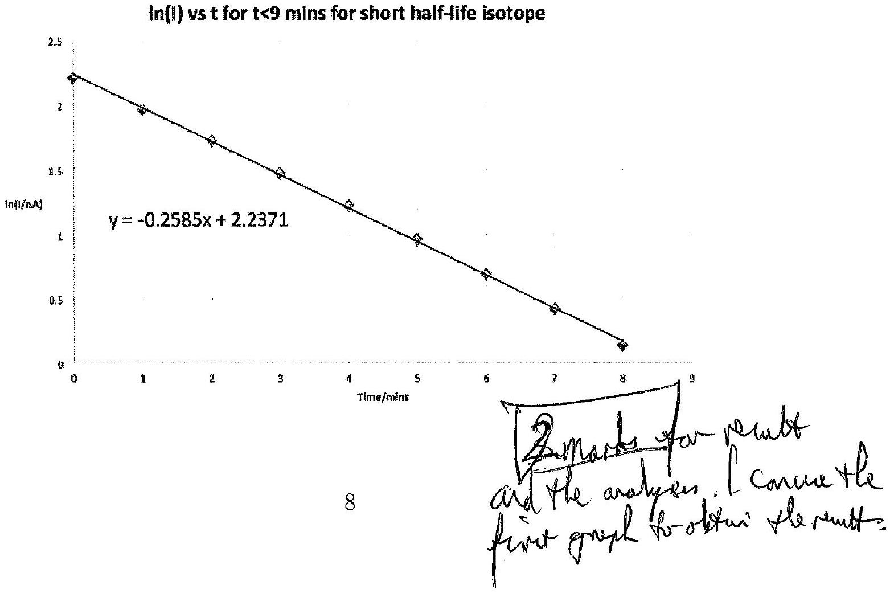

$I _ { \mathrm { S } } = c \lambda _ { \mathrm { S } } N _ { \mathrm { S } 0 } e ^ { - \lambda _ { \mathrm { S } } t }$, the gradient of an $\ln \left( I _ { \mathrm { S } } \right)$ against time graph should be equal to $- \lambda _ { \mathrm { S } }$. The graph above therefore gives
$$
\begin{aligned}
\lambda _ { \mathrm { S } } & = 0.259 \\
\Rightarrow T _ { \mathrm { S } \frac { 1 } { 2 } } & = \frac { \ln ( 2 ) } { \lambda _ { \mathrm { S } } } \\
& \approx \underline { 2.7 \min } \quad \left( 2 \frac { 1 } { 2 } - 3 \text { minuts } \right)
\end{aligned}
$$
(g) No nuclei of type X present initially, so in both cases curve has same $y$-intercept as in part (d) (approx 2.8). Then
    (i) If $\lambda _ { \mathrm { X } } > \lambda _ { \mathrm { S } } , T _ { \mathrm { X } \frac { 1 } { 2 } } < T _ { \mathrm { S } \frac { 1 } { 2 } }$. Initially, decay of S produces X which then decays rapidly giving an initial rise to a peak followed by a smooth decay to long-time behaviour as in (d). Timeframes for each component to effectively decouple can be roughly estimated by (say) the time taken for the current to fall to a hundredth of its initial value. Since for the decay of any isotope
$$
t = - \frac { 1 } { \lambda } \ln \left( \frac { N } { N _ { 0 } } \right)
$$
we may estimate the time after which S effectively ceases to affect the decay as
$$
t _ { \mathrm { S } } = - \frac { 1 } { 0.2585 } \ln \left( \frac { 1 } { 100 } \right) \approx 18 \mathrm { mins }
$$
This makes sense as the graph plotted in (d) has a linear section beginning at about 15 minutes (we used 17 minutes for the graph in (e)). Taking $\lambda _ { \mathrm { X } }$ as being roughly 5 times $\lambda _ { \mathrm { S } } \left( \lambda _ { \mathrm { S } } = 1.2 \right.$ here for the sake of concreteness):
$$
t _ { \mathrm { X } } = - \frac { 1 } { 1.2 } \ln \left( \frac { 1 } { 100 } \right) \approx 3 \mathrm { mins }
$$
So, taking this all together, $y$-intercept is approximately 2.8, then there is an initial peak followed by a nonlinear decay where S and L both contribute before the graph becomes linear after about 15-20 mins.
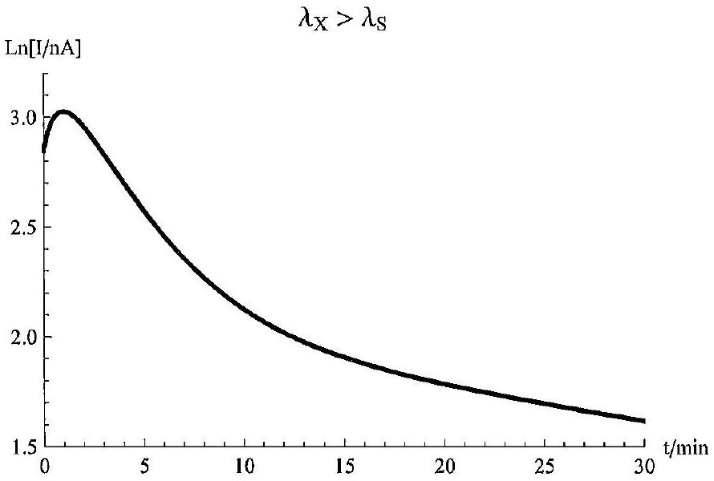
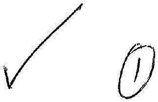

(ii) If $\lambda _ { \mathrm { X } } < \lambda _ { \mathrm { S } } , T _ { \mathrm { X } \frac { 1 } { 2 } } > T _ { \mathrm { S } \frac { 1 } { 2 } }$. In this case X dominates the long-time behaviour. The first two sections of the graph are therefore roughly as in (d), with a final linear section taking over after approximately
$$
t _ { L } = - \frac { 1 } { 0.0149 } \ln \left( \frac { 1 } { 100 } \right) \approx 300 \mathrm { mins }
$$
$$
\lambda _ { \mathrm { X } } < \lambda _ { \mathrm { L } }
$$
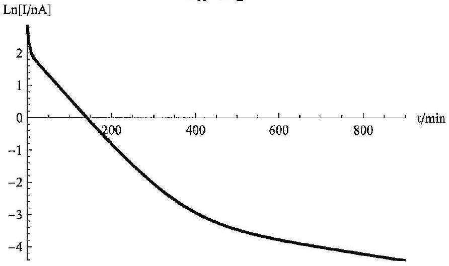
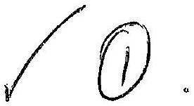
Extra information not expected in a student answer:
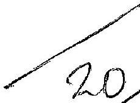
To derive the relationship that describes these curves, consider first the differential eguation governing the population of isotope X. The number of nuclei (and hence activity/rate of decay) of this isotope decreases due to its decay, but increases due to the decay of isotope S:
$$
\frac { \mathrm { d } N _ { \mathrm { X } } } { \mathrm {~d} t } = - \lambda _ { \mathrm { X } } N _ { \mathrm { X } } + \lambda _ { \mathrm { S } } N _ { \mathrm { S } }
$$
but of course $N _ { \mathrm { S } } = N _ { \mathrm { S } 0 } e ^ { - \lambda _ { \mathrm { S } } t }$, so
$$
\frac { \mathrm { d } N _ { \mathrm { X } } } { \mathrm {~d} t } = - \lambda _ { \mathrm { X } } N _ { \mathrm { X } } + \lambda _ { \mathrm { S } } N _ { \mathrm { S } 0 } e ^ { - \lambda _ { \mathrm { S } } t }
$$
However, this is of the form
$$
\frac { \mathrm { d } N _ { \mathrm { X } } } { \mathrm {~d} t } + P ( t ) N _ { \mathrm { X } } = Q ( t )
$$
where $P ( t ) = \lambda _ { \mathrm { X } }$ (= const.) and $Q ( t ) = \lambda _ { \mathrm { S } } N _ { \mathrm { S } 0 } e ^ { - \lambda _ { \mathrm { S } } t }$. This type of differential equation can be solved by first multiplying through by the integrating factor
$$
e ^ { \int P ( t ) \mathrm { d } t } = e ^ { \int \lambda _ { \mathrm { x } } \mathrm {~d} t } = e ^ { \lambda _ { \mathrm { x } } t }
$$
Multiplying the differential equation through by this factor gives
$$
\begin{aligned}
\frac { \mathrm { d } N _ { \mathrm { X } } } { \mathrm {~d} t } e ^ { \lambda _ { \mathrm { X } } t } + \lambda _ { \mathrm { X } } e ^ { \lambda _ { \mathrm { X } } t } N _ { \mathrm { X } } & = \lambda _ { \mathrm { S } } N _ { \mathrm { S } 0 } e ^ { - \lambda _ { \mathrm { S } } t } e ^ { \lambda _ { \mathrm { X } } t } \\
\Rightarrow \frac { \mathrm {~d} } { \mathrm {~d} t } \left( N _ { \mathrm { X } } e ^ { \lambda _ { \mathrm { X } } t } \right) & = \lambda _ { \mathrm { S } } N _ { \mathrm { S } 0 } e ^ { \left( \lambda _ { \mathrm { X } } - \lambda _ { \mathrm { S } } \right) t } \\
\Rightarrow N _ { \mathrm { X } } e ^ { \lambda _ { \mathrm { X } } t } & = \int \lambda _ { \mathrm { S } } N _ { \mathrm { S } 0 } e ^ { \left( \lambda _ { \mathrm { X } } - \lambda _ { \mathrm { S } } \right) t } \mathrm {~d} t \\
\Rightarrow N _ { \mathrm { X } } e ^ { \lambda _ { \mathrm { X } } t } & = \frac { \lambda _ { \mathrm { S } } N _ { \mathrm { S } 0 } } { \lambda _ { \mathrm { X } } - \lambda _ { \mathrm { S } } } e ^ { \left( \lambda _ { \mathrm { X } } - \lambda _ { \mathrm { S } } \right) t } + \mathrm { const }
\end{aligned}
$$

Now at $t = 0 , N _ { \mathrm { X } } = 0$ so the constant of integration is $- \frac { \lambda _ { \mathrm { S } } N _ { \mathrm { S } 0 } } { \lambda _ { \mathrm { X } } - \lambda _ { \mathrm { S } } }$. Rearranging gives

$$
N _ { \mathrm { X } } = \frac { \lambda _ { \mathrm { S } } N _ { \mathrm { S } 0 } } { \lambda _ { \mathrm { X } } - \lambda _ { \mathrm { S } } } \left( e ^ { - \lambda _ { \mathrm { S } } t } - e ^ { - \lambda _ { \mathrm { x } } t } \right)
$$

Overall, therefore,

$$
\begin{aligned}
N ( t ) & = N _ { \mathrm { S } } + N _ { \mathrm { L } } + N _ { \mathrm { X } } \\
& = N _ { \mathrm { S } 0 } e ^ { - \lambda _ { \mathrm { S } } t } + N _ { \mathrm { L } 0 } e ^ { - \lambda _ { \mathrm { L } } t } + \frac { \lambda _ { \mathrm { S } } N _ { \mathrm { S } 0 } } { \lambda _ { \mathrm { X } } - \lambda _ { \mathrm { S } } } \left( e ^ { - \lambda _ { \mathrm { S } } t } - e ^ { - \lambda _ { \mathrm { X } } t } \right)
\end{aligned}
$$

and

$$
\begin{aligned}
A & = A _ { \mathrm { S } } + A _ { \mathrm { L } } + A _ { \mathrm { X } } \\
& = \lambda _ { \mathrm { S } } N _ { \mathrm { S } } + \lambda _ { \mathrm { L } } N _ { \mathrm { L } } + \lambda _ { \mathrm { X } } N _ { \mathrm { X } } \\
& = \lambda _ { \mathrm { S } } N _ { \mathrm { S } 0 } e ^ { - \lambda _ { \mathrm { S } } t } + \lambda _ { \mathrm { L } } N _ { \mathrm { L } 0 } e ^ { - \lambda _ { \mathrm { L } } t } + \frac { \lambda _ { \mathrm { S } } \lambda _ { \mathrm { X } } N _ { \mathrm { S } 0 } } { \lambda _ { \mathrm { X } } - \lambda _ { \mathrm { S } } } \left( e ^ { - \lambda _ { \mathrm { S } } t } - e ^ { - \lambda _ { \mathrm { X } } t } \right)
\end{aligned}
$$

Finally, since the alpha particles emitted all have the same energy, $I = c A$ again. Note that the $y$-intercepts of the graphs in (e) and (f) will allow $c N _ { \mathrm { S } 0 }$ and $c N _ { \mathrm { L } 0 }$ to be found (and hence $N _ { \mathrm { S } 0 }$ and $N _ { \mathrm { L } 0 }$ ) via

$$
\begin{aligned}
\ln \left( c N _ { \mathrm { S } 0 } \right) & = 2.2371 \\
\Rightarrow c N _ { \mathrm { S } 0 } & = \frac { 1 } { \lambda _ { B } } e ^ { 2.2371 } \\
& = \frac { 1 } { 0.2585 } e ^ { 2.2371 } \\
& = 36.233
\end{aligned}
$$

and

$$
\begin{aligned}
\ln \left( c N _ { \mathrm { L } 0 } \right) & = 2.0638 \\
\Rightarrow c N _ { \mathrm { L } 0 } & = \frac { 1 } { \lambda _ { B } } e ^ { 2.0638 } \\
& = \frac { 1 } { 0.0149 } e ^ { 2.0638 } \\
& = 528.58
\end{aligned}
$$
