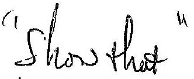
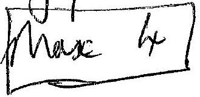
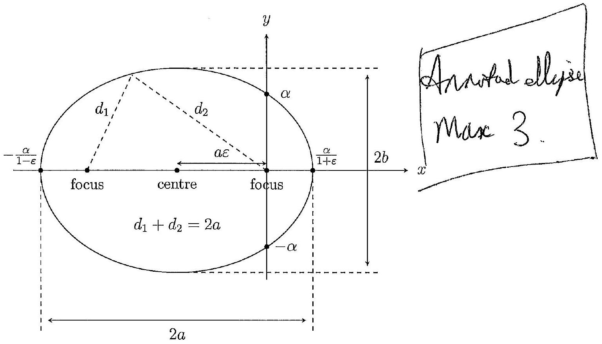
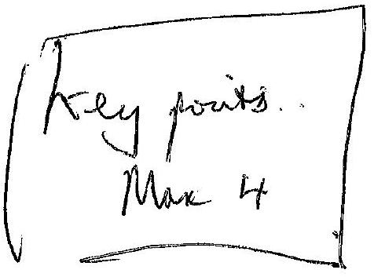
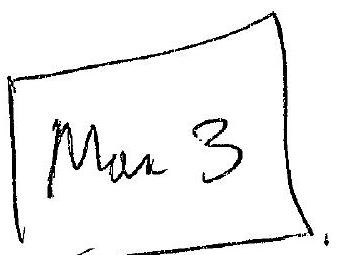
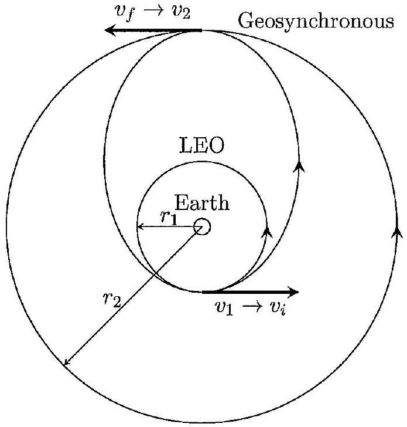
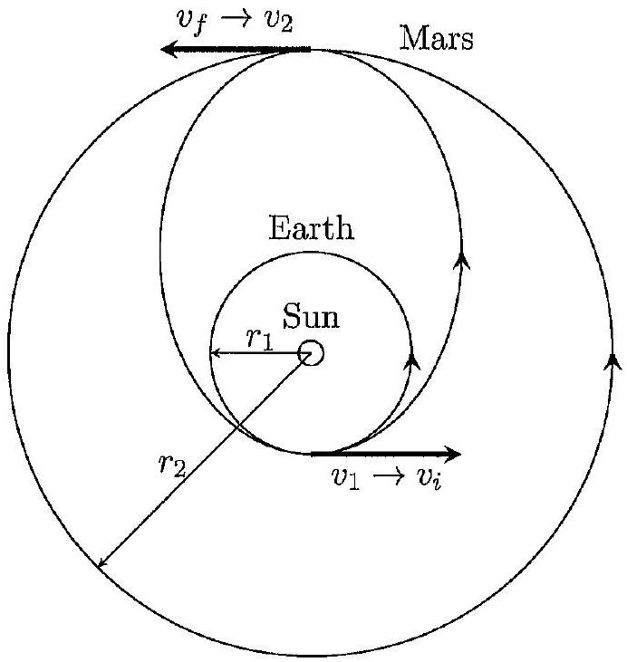

Qu4. Elliptical Orbits

(a) Re-write polar formula as $r + \varepsilon r \cos \theta = \alpha$ and, noting that $x = r \cos \theta$, re-cast as
$$
\begin{align*}
r + \varepsilon x & = \alpha \\
\Rightarrow ( \alpha - \varepsilon x ) ^ { 2 } & = r ^ { 2 } \\
\Rightarrow ( \alpha - \varepsilon x ) ^ { 2 } & = x ^ { 2 } + y ^ { 2 } \\
\Rightarrow x ^ { 2 } \left( 1 - \varepsilon ^ { 2 } \right) + 2 \alpha \varepsilon x + y ^ { 2 } & = \alpha ^ { 2 } \tag{1}
\end{align*}
$$
Now complete the square in ' $x$ ', recalling that $f ( x ) = a x ^ { 2 } + b x = a \left( x + \frac { b } { 2 a } \right) ^ { 2 } - \frac { b ^ { 2 } } { 4 a }$, so that
$$
\begin{align*}
\left( 1 - \varepsilon ^ { 2 } \right) \left( x + \frac { \alpha \varepsilon } { 1 - \varepsilon ^ { 2 } } \right) ^ { 2 } - \frac { \alpha ^ { 2 } \varepsilon ^ { 2 } } { \left( 1 - \varepsilon ^ { 2 } \right) } + y ^ { 2 } & = \alpha ^ { 2 } \\
\Rightarrow \left( 1 - \varepsilon ^ { 2 } \right) \left( x + \frac { \alpha \varepsilon } { 1 - \varepsilon ^ { 2 } } \right) ^ { 2 } + y ^ { 2 } & = \frac { \alpha ^ { 2 } } { 1 - \varepsilon ^ { 2 } } \\
\Rightarrow \frac { \left( x + \frac { \alpha \varepsilon } { 1 - \varepsilon ^ { 2 } } \right) ^ { 2 } } { \frac { \alpha ^ { 2 } } { \left( 1 - \varepsilon ^ { 2 } \right) ^ { 2 } } } + \frac { y ^ { 2 } } { \frac { \alpha ^ { 2 } } { 1 - \varepsilon ^ { 2 } } } & = 1 \tag{2}
\end{align*}
$$
This is of the form
$$
\frac { \left( x - x _ { 0 } \right) ^ { 2 } } { a ^ { 2 } } + \frac { \left( y - y _ { 0 } \right) ^ { 2 } } { b ^ { 2 } } = 1
$$
so the ellipse has
$$
\text { centre } \left( x _ { 0 } , y _ { 0 } \right) = \left( - \frac { \alpha \varepsilon } { 1 - \varepsilon ^ { 2 } } , 0 \right)
$$
and
$$
\text { semi-major axis } a = \frac { \alpha } { 1 - \varepsilon ^ { 2 } }
$$
and
$$
\text { semi-minor axis } b = \frac { \alpha } { \sqrt { 1 - \varepsilon ^ { 2 } } }
$$
with

$$
\begin{aligned}
\text { eccentricity } & = \sqrt { 1 - \frac { b ^ { 2 } } { a ^ { 2 } } } \\
& = \sqrt { 1 - \left( 1 - \varepsilon ^ { 2 } \right) } \\
& = \varepsilon
\end{aligned}
$$
hey saids sam a mark

Note that if $\varepsilon = 0$ then (2) reduces to $x ^ { 2 } + y ^ { 2 } = \alpha ^ { 2 }$, the equation of a circle (a sort of degenerate ellipse), while if $\varepsilon = 1$, (1) reduces to $y ^ { 2 } = \alpha ^ { 2 } - 2 \alpha x$, the equation of a parabola. Therefore we must have $0 \leq \varepsilon < 1$.

(b) Note that as angular momentum is ' $L = m r ^ { 2 } \dot { \theta }$ ', the angular momentum of the planet (assuming $M _ { S } \gg m _ { p }$ so that issues with reduced mass and centre of mass can be ignored) is $L = m _ { p } r ^ { 2 } \dot { \theta }$ (where $\dot { \theta } = \frac { \mathrm { d } \theta } { \mathrm { d } t }$ ).
    (i) Newton's law of gravitation states the attractive force of gravity between two masses acts along a line joining their centres and is given in magnitude by
$$
F = \frac { G M _ { S } m _ { p } } { r ^ { 2 } }
$$
As the line of action of the gravitational force passes through the axis of rotation it produces no torque, and, assuming no other forces present, there is therefore no net torque. For rotational motion, Newton's second law states that the net torque is equal to the rate of change of angular momentum:
$$
\tau _ { \text {net } } = \frac { \mathrm { d } L } { \mathrm {~d} t }
$$
where $L$ is the angular momentum of the planet. Since $\tau _ { \text {net } } = 0 , \frac { \mathrm {~d} L } { \mathrm {~d} t } = 0$ and so $L =$ constant.
Now the area element for an ellipse is in principle (this is easily derived by looking at areas in polar coordinates with a changing radius)
$$
\delta A = \frac { 1 } { 2 } r ^ { 2 } \delta \theta + \frac { 1 } { 2 } r \delta r \delta \theta
$$
but the second term is second order in small quantities, so can be neglected as $\delta \theta \rightarrow 0$. Thus, in this limit, we have:
$$
\begin{aligned}
\mathrm { d } A & = \frac { 1 } { 2 } r ^ { 2 } \mathrm {~d} \theta \\
\Rightarrow \frac { \mathrm {~d} A } { \mathrm {~d} t } & = \frac { 1 } { 2 } r ^ { 2 } \frac { \mathrm {~d} \theta } { \mathrm {~d} t }
\end{aligned}
$$

But the angular momentum of the planet is $L = m _ { p } r ^ { 2 } \dot { \theta }$ so

$$
\frac { \mathrm { d } A } { \mathrm {~d} t } = \frac { L } { 2 m _ { p } } = \text { constant }
$$

and hence $\delta A =$ const. $\times \delta t$, i.e. equal areas are swept out in equal time intervals. This is Kepler's second law.

(ii) The energy of the system, given by
$$
\begin{aligned}
E & = \mathrm { KE } + \mathrm { PE } \\
& = \frac { 1 } { 2 } m _ { p } v _ { \text {radial } } ^ { 2 } + \frac { 1 } { 2 } m _ { p } v _ { \text {tangential } } ^ { 2 } - \frac { G M _ { S } m _ { p } } { r } \\
& = \frac { 1 } { 2 } m _ { p } \dot { r } ^ { 2 } + \frac { 1 } { 2 } m _ { p } r ^ { 2 } \dot { \theta } ^ { 2 } - \frac { G M _ { S } m _ { p } } { r } \\
& = \frac { 1 } { 2 } m _ { p } \dot { r } ^ { 2 } + \frac { L ^ { 2 } } { 2 m _ { p } r ^ { 2 } } - \frac { k } { r }
\end{aligned}
$$

where $r$ is the distance of the planet from the Sun, and $k = G M _ { S } m _ { p }$. Note that since both the radius and angle change in an elliptical orbit, there are two contributions to the kinetic energy from motion in the radial direction and angular motion.
Extra information to connect with Kepler's first law:
In the following, $\mu = \frac { M _ { S } m _ { p } } { M _ { S } + m _ { p } }$ is the reduced mass of the system and can be set equal to $m _ { p }$ for the current case under consideration where $M _ { S } \gg m _ { p }$. Now we don't really want $r$ as a function of time, but rather as a function of $\theta$, so exchange $t$ for $\theta$ via
$$
\dot { r } = \frac { \mathrm { d } r } { \mathrm {~d} t } = \frac { \mathrm { d } r } { \mathrm {~d} \theta } \frac { \mathrm {~d} \theta } { \mathrm {~d} t }
$$
Then we have
$$
\dot { r } ^ { 2 } = \left( \frac { \mathrm { d } r } { \mathrm {~d} \theta } \right) ^ { 2 } \dot { \theta } ^ { 2 } = \left( \frac { \mathrm { d } r } { \mathrm {~d} \theta } \right) ^ { 2 } \frac { L ^ { 2 } } { \mu ^ { 2 } r ^ { 4 } }
$$
so
$$
\begin{aligned}
E & = \frac { L ^ { 2 } } { 2 \mu r ^ { 4 } } \left( \frac { \mathrm {~d} r } { \mathrm {~d} \theta } \right) ^ { 2 } + \frac { L ^ { 2 } } { 2 \mu r ^ { 2 } } - \frac { k } { r } \\
\Rightarrow \left( \frac { \mathrm {~d} \theta } { \mathrm {~d} r } \right) & = \frac { L / r ^ { 2 } } { \sqrt { 2 \mu \left( E + \frac { k } { r } - \frac { L ^ { 2 } } { 2 \mu r ^ { 2 } } \right) } }
\end{aligned}
$$
where we have chosen the positive square root. Now the term in the denominator under the square root is a quadratic in $1 / r$, so completing the square here (see (a)) gives:
$$
\begin{aligned}
- \frac { L ^ { 2 } } { 2 \mu } \left( \frac { 1 } { r } \right) ^ { 2 } + k \left( \frac { 1 } { r } \right) + E & = \frac { \mu k ^ { 2 } } { 2 L ^ { 2 } } + E - \frac { L ^ { 2 } } { 2 \mu } \left( \frac { 1 } { r } - \frac { \mu k } { L ^ { 2 } } \right) ^ { 2 } \\
& = \frac { \mu k ^ { 2 } } { 2 L ^ { 2 } } \left( 1 + \frac { 2 E L ^ { 2 } } { \mu k ^ { 2 } } - \left( \frac { L ^ { 2 } } { \mu k } \right) ^ { 2 } \left( \frac { 1 } { r } - \frac { \mu k } { L ^ { 2 } } \right) ^ { 2 } \right) \\
& = \frac { \mu k ^ { 2 } } { 2 L ^ { 2 } } \left( 1 + \frac { 2 E L ^ { 2 } } { \mu k ^ { 2 } } - \left( \frac { L ^ { 2 } } { \mu k r } - 1 \right) ^ { 2 } \right)
\end{aligned}
$$

so that

$$
\begin{aligned}
\left( \frac { \mathrm { d } \theta } { \mathrm {~d} r } \right) & = \frac { L / r ^ { 2 } } { \sqrt { \frac { \mu ^ { 2 } k ^ { 2 } } { L ^ { 2 } } \left( 1 + \frac { 2 E L ^ { 2 } } { \mu k ^ { 2 } } - \left( \frac { L ^ { 2 } } { \mu k r } - 1 \right) ^ { 2 } \right) } } \\
& = \frac { L ^ { 2 } / \mu k } { r ^ { 2 } \sqrt { \left( 1 + \frac { 2 E L ^ { 2 } } { \mu k ^ { 2 } } - \left( \frac { L ^ { 2 } } { \mu k r } - 1 \right) ^ { 2 } \right) } }
\end{aligned}
$$

Now, let $\alpha = L ^ { 2 } / \mu k$ and $\varepsilon ^ { 2 } = 1 + \frac { 2 E L ^ { 2 } } { \mu k ^ { 2 } }$ and, with reference to the sketch in part (a), choose $\theta = 0$ corresponding to $r = \alpha / ( 1 + \varepsilon )$. Hence

$$
\int _ { 0 } ^ { \theta } \mathrm { d } \theta = \int _ { \frac { \alpha } { 1 + \varepsilon } } ^ { r } \mathrm {~d} r \frac { \alpha } { r ^ { 2 } \sqrt { \left( \varepsilon ^ { 2 } - \left( \frac { \alpha } { r } - 1 \right) ^ { 2 } \right) } }
$$

Change variables to $u = \frac { \alpha } { r } - 1$ so that $\mathrm { d } u = - \frac { \alpha } { r ^ { 2 } } \mathrm {~d} r$ which leads to

$$
\theta = \int _ { \varepsilon } ^ { \frac { \alpha } { r } - 1 } \mathrm {~d} u \frac { - 1 } { \sqrt { \left( \varepsilon ^ { 2 } - u ^ { 2 } \right) } }
$$

This is the standard integral quoted, or, proceeding explicitly, change variables again to $u = \varepsilon \cos w$ so that $\mathrm { d } u = - \varepsilon \sin w \mathrm {~d} w$ leading to

$$
\begin{aligned}
\theta & = \int _ { 0 } ^ { \arccos ( ( \alpha / r - 1 ) / \varepsilon ) } \frac { \mathrm { d } w \sin w } { \sqrt { \left( 1 - \cos ^ { 2 } w \right) } } \\
& = \int _ { 0 } ^ { \arccos ( ( \alpha / r - 1 ) / \varepsilon ) } \mathrm { d } w \\
& = \arccos \left( \frac { 1 } { \varepsilon } \left( \frac { \alpha } { r } - 1 \right) \right)
\end{aligned}
$$

giving $\frac { \alpha } { r } = 1 + \varepsilon \cos \theta$ and hence

$$
r = \frac { \alpha } { 1 + \varepsilon \cos \theta }
$$

Note that the definition of $\alpha$ and $\varepsilon$, together with the fact that $\alpha = a \left( 1 - \varepsilon ^ { 2 } \right)$ means that $E = - \frac { k } { 2 a }$.

(iii) Go back to Kepler's second law
$$
\frac { \mathrm { d } A } { \mathrm {~d} t } = \frac { L } { 2 m _ { p } }
$$
Over a time interval equal to the orbital period $T$ this implies that
$$
A = \frac { L } { 2 m _ { p } } T
$$

where $A$ is the area of the ellipse.
The area of an ellipse is given in the question, but the calculation is straightforward:
The area of an ellipse is most easily found from the cartesian form

$$
\frac { x ^ { 2 } } { a ^ { 2 } } + \frac { y ^ { 2 } } { b ^ { 2 } } = 1
$$

so

$$
\begin{aligned}
A & = 2 \int _ { - a } ^ { a } y \mathrm {~d} x \\
& = 2 \int _ { - a } ^ { a } \sqrt { b ^ { 2 } - \frac { b ^ { 2 } } { a ^ { 2 } } x ^ { 2 } } \mathrm {~d} x \\
& = \frac { b } { a } 2 \int _ { - a } ^ { a } \sqrt { a ^ { 2 } - x ^ { 2 } } \mathrm {~d} x
\end{aligned}
$$

but this is just

$$
\begin{aligned}
A & = \frac { b } { a } \times A _ { \text {circle radius } a } \\
& = \frac { b } { a } \pi a ^ { 2 } \\
& = \pi a b
\end{aligned}
$$

So

$$
T = \frac { 2 m _ { p } \pi a b } { L }
$$

Now, from the relation between $a , b$ and $\varepsilon$, we have

$$
b ^ { 2 } = a ^ { 2 } \left( 1 - \varepsilon ^ { 2 } \right)
$$

and from the definition of $\alpha$

$$
L ^ { 2 } = m _ { p } k \alpha
$$

and finally from the connection between $\alpha$ and $a$

$$
\alpha = a \left( 1 - \varepsilon ^ { 2 } \right)
$$

Putting all this together

$$
\begin{aligned}
T ^ { 2 } & = \frac { 4 m _ { p } ^ { 2 } \pi ^ { 2 } a ^ { 2 } b ^ { 2 } } { L ^ { 2 } } \\
& = \frac { 4 m _ { p } ^ { 2 } \pi ^ { 2 } a ^ { 4 } \left( 1 - \varepsilon ^ { 2 } \right) } { m _ { p } k \alpha } \\
& = \frac { 4 m _ { p } \pi ^ { 2 } a ^ { 4 } \left( 1 - \varepsilon ^ { 2 } \right) } { k a \left( 1 - \varepsilon ^ { 2 } \right) } \\
& = \frac { 4 \pi ^ { 2 } m _ { p } } { k } a ^ { 3 }
\end{aligned}
$$

that is

$$
T ^ { 2 } = \frac { 4 \pi ^ { 2 } } { G M _ { S } } a ^ { 3 }
$$

Note: In parts (c) and (d), the more general $\mu$ has been used in place of $m _ { p }$ to start with, with the simplification $M _ { S } + m _ { p } \approx M _ { S }$ and $\mu \approx m _ { p }$ taken at the end. Note that in terms of these, the period of orbit is given by $T ^ { 2 } = \frac { 4 \pi ^ { 2 } \mu } { k } a ^ { 3 } = \frac { 4 \pi ^ { 2 } } { G \left( M _ { S } + m _ { p } \right) }$.

(c) Assuming that the low earth orbit (LEO) and geosynchronous orbits are circular to a high degree of accuracy (as they usually are), and that they lie in the same plane, and that the impulses occur effectively instantaneously, the situation is as follows

and all of the formulas previously arrived at hold with the replacements $M _ { S } \rightarrow M _ { E }$ and $m _ { p } \rightarrow m _ { s }$ with $M _ { E }$ the mass of Earth and $m _ { s }$ the mass of the satellite. Furthermore, since $m _ { s } / M _ { E } \sim \mathcal { O } \left( 10 ^ { - 21 } \right) , M _ { E } \gg m _ { s }$ and we may approximate $\mu \approx m _ { s }$.
With the radius of Earth, $r _ { E } = 6380 \mathrm {~km}$,
$$
r _ { 1 } = r _ { E } + h = 6.38 \times 10 ^ { 6 } \mathrm {~m} + 0.32 \times 10 ^ { 6 } \mathrm {~m} = 6.70 \times 10 ^ { 6 } \mathrm {~m}
$$
while the radius of a geosynchronous orbit may be found from Kepler's third law
$$
\begin{aligned}
r _ { 2 } = a = \left( \frac { G \left( M _ { E } + m _ { s } \right) T ^ { 2 } } { 4 \pi ^ { 2 } } \right) ^ { \frac { 1 } { 3 } } & \approx \left( \frac { G M _ { E } T ^ { 2 } } { 4 \pi ^ { 2 } } \right) ^ { \frac { 1 } { 3 } } \\
& = \left( \frac { 6.67 \times 10 ^ { - 11 } \times 5.97 \times 10 ^ { 24 } \times ( 24 \times 3600 ) ^ { 2 } } { 4 \pi ^ { 2 } } \right) ^ { \frac { 1 } { 3 } } \\
& = 42.23 \times 10 ^ { 6 } \mathrm {~m}
\end{aligned}
$$
Now since $r _ { 1 }$ is the radius at perihelion and $r _ { 2 }$ is the radius at aphelion of the transfer orbit we have (see sketch in part (a))
$$
\begin{aligned}
& r _ { 1 } = \frac { \alpha } { 1 + \varepsilon } = \frac { a \left( 1 - \varepsilon ^ { 2 } \right) } { 1 + \varepsilon } = a ( 1 - \varepsilon ) \\
& r _ { 2 } = \frac { \alpha } { 1 - \varepsilon } = \frac { a \left( 1 - \varepsilon ^ { 2 } \right) } { 1 - \varepsilon } = a ( 1 + \varepsilon )
\end{aligned}
$$

so $r _ { 2 } - r _ { 1 } = 2 a \varepsilon$ and

$$
\varepsilon = \frac { r _ { 2 } - r _ { 1 } } { 2 a } = \frac { r _ { 2 } - r _ { 1 } } { r _ { 2 } + r _ { 1 } }
$$

This gives the transfer orbit an eccentricity of

$$
\varepsilon = \frac { 42.23 - 6.70 } { 42.23 + 6.70 } = 0.726
$$

i.e. it is a highly eccentric orbit.
Now the velocities of the circular orbits may be found from Newton's second law via

$$
\begin{aligned}
\frac { \mu v _ { 1 } ^ { 2 } } { r _ { 1 } } & = \frac { k } { r _ { 1 } ^ { 2 } } \\
\Rightarrow v _ { 1 } ^ { 2 } & = \frac { k } { \mu r _ { 1 } }
\end{aligned}
$$

and similarly $v _ { 2 } ^ { 2 } = \frac { k } { \mu r _ { 2 } }$ (we will soon approximate $\mu \approx m _ { s }$ ). For $v _ { i }$ and $v _ { f }$, the velocities at periapsis and apoapsis in the elliptical orbit, go back to conservation of energy and recall (from (b)) that $E = - k / 2 a$. So

$$
\begin{aligned}
\frac { 1 } { 2 } \mu v _ { i } ^ { 2 } - \frac { k } { r _ { 1 } } & = - \frac { k } { r _ { 1 } + r _ { 2 } } \\
\Rightarrow v _ { i } ^ { 2 } & = 2 \frac { k } { \mu } \left( \frac { 1 } { r _ { 1 } } - \frac { 1 } { r _ { 1 } + r _ { 2 } } \right) \\
& = \frac { k } { \mu r _ { 1 } } \left( \frac { 2 r _ { 2 } } { r _ { 1 } + r _ { 2 } } \right)
\end{aligned}
$$

and similarly $v _ { f } ^ { 2 } = \frac { k } { \mu r _ { 2 } } \left( \frac { 2 r _ { 1 } } { r _ { 1 } + r _ { 2 } } \right)$. Summarising

$$
\begin{aligned}
v _ { 1 } ^ { 2 } & = \frac { k } { \mu r _ { 1 } } \\
v _ { 2 } ^ { 2 } & = \frac { k } { \mu r _ { 2 } } \\
v _ { i } ^ { 2 } & = \frac { k } { \mu r _ { 1 } } \left( \frac { 2 r _ { 2 } } { r _ { 1 } + r _ { 2 } } \right) \\
v _ { f } ^ { 2 } & = \frac { k } { \mu r _ { 2 } } \left( \frac { 2 r _ { 1 } } { r _ { 1 } + r _ { 2 } } \right)
\end{aligned}
$$

so that at periapsis, $\Delta v _ { p } = v _ { i } - v _ { 1 }$ is given by

$$
\Delta v _ { p } = \sqrt { \frac { k } { \mu r _ { 1 } } } \left( \sqrt { \frac { 2 r _ { 2 } } { r _ { 1 } + r _ { 2 } } } - 1 \right)
$$

and at apoapsis, $\Delta v _ { a } = v _ { 2 } - v _ { f }$ is

$$
\Delta v _ { a } = \sqrt { \frac { k } { \mu r _ { 2 } } } \left( 1 - \sqrt { \frac { 2 r _ { 1 } } { r _ { 1 } + r _ { 2 } } } \right)
$$

Finally, setting $\mu \approx m _ { s }$ and $k = G M _ { E } m _ { s }$ gives

$$
\begin{aligned}
\Delta v _ { p } & = \sqrt { \frac { G M _ { E } } { r _ { 1 } } } \left( \sqrt { \frac { 2 r _ { 2 } } { r _ { 1 } + r _ { 2 } } } - 1 \right) \\
\Delta v _ { a } & = \sqrt { \frac { G M _ { E } } { r _ { 2 } } } \left( 1 - \sqrt { \frac { 2 r _ { 1 } } { r _ { 1 } + r _ { 2 } } } \right)
\end{aligned}
$$

which then give

$$
\begin{aligned}
\Delta v _ { p } & = \sqrt { \frac { 6.67 \times 10 ^ { - 11 } \times 5.97 \times 10 ^ { 24 } } { 6.70 \times 10 ^ { 6 } } } \left( \sqrt { \frac { 2 \times 42.23 } { 6.70 + 42.23 } } - 1 \right) \\
& = 2.42 \mathrm { kms } ^ { - 1 }
\end{aligned}
$$

and

$$
\begin{aligned}
\Delta v _ { a } & = \sqrt { \frac { 6.67 \times 10 ^ { - 11 } \times 5.97 \times 10 ^ { 24 } } { 42.23 \times 10 ^ { 6 } } } \left( 1 - \sqrt { \frac { 2 \times 6.70 } { 6.70 + 42.23 } } \right) \\
& = 1.46 \mathrm { kms } ^ { - 1 }
\end{aligned}
$$

Note that the velocity of the craft is increased at both points giving a total $\Delta v$ of

$$
\begin{aligned}
\Delta v & = \left| \Delta v _ { p } \right| + \left| \Delta v _ { a } \right| \\
& = 2.42 \times 10 ^ { 3 } \mathrm {~ms} ^ { - 1 } + 1.46 \times 10 ^ { 3 } \mathrm {~ms} ^ { - 1 } \\
& = \underline { 3.88 \mathrm { kms } ^ { - 1 } }
\end{aligned}
$$

The time taken to achieve transfer is simply half the time period of the transfer orbit

$$
\begin{aligned}
t _ { \mathrm { transfer } } & = \frac { 1 } { 2 } T \\
& = \frac { 1 } { 2 } \sqrt { \frac { 4 \pi ^ { 2 } a ^ { 3 } } { G \left( M _ { E } + m _ { s } \right) } } \\
& = \frac { 1 } { 2 } \sqrt { \frac { \pi ^ { 2 } \left( r _ { 1 } + r _ { 2 } \right) ^ { 3 } } { 2 G \left( M _ { E } + m _ { s } \right) } } \\
& \approx \frac { 1 } { 2 } \sqrt { \frac { \pi ^ { 2 } \left( r _ { 1 } + r _ { 2 } \right) ^ { 3 } } { 2 G M _ { E } } } \\
& = \frac { 1 } { 2 } \sqrt { \frac { \pi ^ { 2 } \times ( 6.70 + 42.23 ) ^ { 3 } \times 10 ^ { 18 } } { 2 \times 6.67 \times 10 ^ { - 11 } \times 5.97 \times 10 ^ { 24 } } } \\
& = 19050 \mathrm {~s} = 318 \mathrm {~min} = 5.29 \mathrm { hr }
\end{aligned}
$$

(d) The concepts regarding the transfer orbit from Earth's orbit around the Sun to Mars' orbit will

be the same as in part (c) giving

$$
\begin{aligned}
v _ { 1 } ^ { 2 } & = \frac { k } { \mu r _ { 1 } } \\
v _ { 2 } ^ { 2 } & = \frac { k } { \mu r _ { 2 } } \\
v _ { i } ^ { 2 } & = \frac { k } { \mu r _ { 1 } } \left( \frac { 2 r _ { 2 } } { r _ { 1 } + r _ { 2 } } \right) \\
v _ { f } ^ { 2 } & = \frac { k } { \mu r _ { 2 } } \left( \frac { 2 r _ { 1 } } { r _ { 1 } + r _ { 2 } } \right)
\end{aligned}
$$

similarly to in (d), but where $k = G M _ { S } m _ { s }$ and $\mu = \frac { M _ { S } m _ { s } } { M _ { S } + m _ { s } }$.

However, it will also be necessary to transfer the craft from its orbit around the Earth to its transfer orbit at the start and from its transfer orbit to orbit around Mars at the end. Taking the departure from Earth first, the velocity necessary to reach for the transfer orbit is $v _ { i }$. However, this is in a frame of reference relative to the Sun. In a frame of reference relative to the Earth the required velocity is $V _ { i } = v _ { i } - v _ { 1 }$, but this is just $\Delta v _ { p }$ as defined in part (d) with the new definition of $\mu$ and $k$. If the spacecraft is originally in orbit around the Earth at radius $R _ { 1 }$ (use capital letters for orbits around planets in this part of the question, and lowercase letters for orbits of planets around the Sun), then a velocity $V _ { \text {escape } }$ must be reached from that orbit which from energy conservation can be found from

$$
\begin{aligned}
\frac { 1 } { 2 } \mu _ { 1 } V _ { i } ^ { 2 } & = \frac { 1 } { 2 } \mu _ { 1 } V _ { \text {escape } } ^ { 2 } - \frac { k _ { 1 } } { R _ { 1 } } \\
\Rightarrow V _ { \text {escape } } ^ { 2 } & = V _ { i } ^ { 2 } + \frac { 2 k _ { 1 } } { \mu _ { 1 } R _ { 1 } }
\end{aligned}
$$

where $k _ { 1 } = G M _ { E } m _ { s }$ and $\mu _ { 1 } = \frac { M _ { E } m _ { s } } { M _ { E } + m _ { s } }$ as in (c). There is no potential energy term on the left hand side since the spacecraft is assumed to have left the sphere of influence of the Earth once it enters the transfer orbit. However, since the spacecraft was initially in a circular orbit of

radius $R _ { 1 }$ around the Earth with velocity (from Newton's second law for circular orbits)

$$
V _ { 1 } ^ { 2 } = \frac { k _ { 1 } } { \mu _ { 1 } R _ { 1 } }
$$

so the initial $\Delta v$ required is

$$
\begin{aligned}
\Delta v _ { p } ^ { \prime } & = V _ { \text {escape } } - V _ { 1 } \\
& = \sqrt { V _ { i } ^ { 2 } + \frac { 2 k _ { 1 } } { \mu _ { 1 } R _ { 1 } } } - \sqrt { \frac { k _ { 1 } } { \mu _ { 1 } R _ { 1 } } } \\
& = \sqrt { \frac { k } { \mu r _ { 1 } } \left( \sqrt { \frac { 2 r _ { 2 } } { r _ { 1 } + r _ { 2 } } } - 1 \right) ^ { 2 } + \frac { 2 k _ { 1 } } { \mu _ { 1 } R _ { 1 } } } - \sqrt { \frac { k _ { 1 } } { \mu _ { 1 } R _ { 1 } } }
\end{aligned}
$$

Finally, approximating $\mu \approx m _ { s }$ and $\mu _ { 1 } \approx m _ { s }$, and substituting $k _ { 1 } = G M _ { E } m _ { s }$ and $k = G M _ { S } m _ { s }$ we have

$$
\Delta v _ { p } ^ { \prime } = \sqrt { \frac { G M _ { S } } { r _ { 1 } } \left( \sqrt { \frac { 2 r _ { 2 } } { r _ { 1 } + r _ { 2 } } } - 1 \right) ^ { 2 } + \frac { 2 G M _ { E } } { R _ { 1 } } } - \sqrt { \frac { G M _ { E } } { R _ { 1 } } }
$$

Likewise, on arrival at Mars the spacecraft has velocity $v _ { f }$ relative to the Sun. However as Mars is travelling at velocity $v _ { 1 }$ in the same direction (with $v _ { 1 } > v _ { f }$ ), its velocity relative to Mars is $V _ { f } = v _ { f } - v _ { 1 }$. A velocity $V _ { \text {capture } }$ must be reached from that for which (here $k _ { 2 } = G M _ { M } m _ { s }$ and $\left. \mu _ { 2 } = \frac { M _ { M } m _ { s } } { M _ { M } + m _ { s } } \right)$

$$
\begin{aligned}
\frac { 1 } { 2 } \mu _ { 2 } V _ { f } ^ { 2 } & = \frac { 1 } { 2 } \mu _ { 2 } V _ { \text {capture } } ^ { 2 } - \frac { k _ { 2 } } { R _ { 2 } } \\
\Rightarrow V _ { \text {capture } } ^ { 2 } & = V _ { f } ^ { 2 } + \frac { 2 k _ { 2 } } { \mu _ { 2 } R _ { 2 } }
\end{aligned}
$$

and with orbital velocity

$$
V _ { 2 } ^ { 2 } = \frac { k _ { 2 } } { \mu _ { 2 } R _ { 2 } }
$$

giving a final $\Delta v$ of

$$
\begin{aligned}
\Delta v _ { a } ^ { \prime } & = V _ { \text {capture } } - V _ { 2 } \\
& = \sqrt { V _ { f } ^ { 2 } + \frac { 2 k _ { 2 } } { \mu _ { 2 } R _ { 2 } } } - \sqrt { \frac { k _ { 2 } } { \mu _ { 2 } R _ { 2 } } } \\
& = \sqrt { \frac { k } { \mu r _ { 2 } } \left( \sqrt { \frac { 2 r _ { 1 } } { r _ { 1 } + r _ { 2 } } } - 1 \right) ^ { 2 } + \frac { 2 k _ { 2 } } { \mu _ { 2 } R _ { 2 } } } - \sqrt { \frac { k _ { 2 } } { \mu _ { 2 } R _ { 2 } } }
\end{aligned}
$$

Finally, approximating $\mu \approx m _ { s }$ and $\mu _ { 2 } \approx m _ { s }$, and substituting $k _ { 2 } = G M _ { M } m _ { s }$ and $k = G M _ { S } m _ { s }$ we have

$$
\Delta v _ { a } ^ { \prime } = \sqrt { \frac { G M _ { S } } { r _ { 2 } } \left( \sqrt { \frac { 2 r _ { 1 } } { r _ { 1 } + r _ { 2 } } } - 1 \right) ^ { 2 } + \frac { 2 G M _ { M } } { R _ { 2 } } } - \sqrt { \frac { G M _ { M } } { R _ { 2 } } }
$$

So the total $\Delta v$ budget will arise from

$$
\begin{aligned}
& \Delta v _ { p } ^ { \prime } = \sqrt { \frac { G M _ { S } } { r _ { 1 } } \left( \sqrt { \frac { 2 r _ { 2 } } { r _ { 1 } + r _ { 2 } } } - 1 \right) ^ { 2 } + \frac { 2 G M _ { E } } { R _ { 1 } } } - \sqrt { \frac { G M _ { E } } { R _ { 1 } } } \\
& \Delta v _ { a } ^ { \prime } = \sqrt { \frac { G M _ { S } } { r _ { 2 } } \left( \sqrt { \frac { 2 r _ { 1 } } { r _ { 1 } + r _ { 2 } } } - 1 \right) ^ { 2 } + \frac { 2 G M _ { M } } { R _ { 2 } } } - \sqrt { \frac { G M _ { M } } { R _ { 2 } } }
\end{aligned}
$$

Taking 365 days to orbit the Sun, the radius of the Earth's orbit about the Sun is approximately:

$$
\begin{aligned}
r _ { 1 } & = \left( \frac { G \left( M _ { S } + M _ { E } \right) T _ { E } ^ { 2 } } { 4 \pi ^ { 2 } } \right) ^ { \frac { 1 } { 3 } } \\
& \approx \left( \frac { G M _ { S } T _ { E } ^ { 2 } } { 4 \pi ^ { 2 } } \right) ^ { \frac { 1 } { 3 } } \\
& = \left( \frac { 6.67 \times 10 ^ { - 11 } \times 1.99 \times 10 ^ { 30 } \times ( 365 \times 24 \times 3600 ) ^ { 2 } } { 4 \pi ^ { 2 } } \right) ^ { \frac { 1 } { 3 } } \\
& \approx 1.50 \times 10 ^ { 11 } \mathrm {~m}
\end{aligned}
$$

Likewise for Mars

$$
\begin{aligned}
r _ { 2 } & = \left( \frac { G \left( M _ { S } + M _ { M } \right) T _ { M } ^ { 2 } } { 4 \pi ^ { 2 } } \right) ^ { \frac { 1 } { 3 } } \\
& \approx \left( \frac { G M _ { S } T _ { M } ^ { 2 } } { 4 \pi ^ { 2 } } \right) ^ { \frac { 1 } { 3 } } \\
& = \left( \frac { 6.67 \times 10 ^ { - 11 } \times 1.99 \times 10 ^ { 30 } \times ( 1.88 \times 365 \times 24 \times 3600 ) ^ { 2 } } { 4 \pi ^ { 2 } } \right) ^ { \frac { 1 } { 3 } } \\
& \approx 2.28 \times 10 ^ { 11 } \mathrm {~m}
\end{aligned}
$$

and

$$
\begin{aligned}
R _ { 1 } & = r _ { E } + 300 \mathrm {~km} \\
& = 6.38 \times 10 ^ { 6 } \mathrm {~m} + 0.3 \times 10 ^ { 6 } \mathrm {~m} \\
& = 6.68 \times 10 ^ { 6 } \mathrm {~m}
\end{aligned}
$$

with

$$
\begin{aligned}
R _ { 2 } & = r _ { M } + 250 \mathrm {~km} \\
& = 3.40 \times 10 ^ { 6 } \mathrm {~m} + 0.25 \times 10 ^ { 6 } \mathrm {~m} \\
& = 3.65 \times 10 ^ { 6 } \mathrm {~m}
\end{aligned}
$$

Giving

$$
\begin{aligned}
\Delta v _ { p } ^ { \prime } & = \sqrt { \frac { G M _ { S } } { r _ { 1 } } \left( \sqrt { \frac { 2 r _ { 2 } } { r _ { 1 } + r _ { 2 } } } - 1 \right) ^ { 2 } + \frac { 2 G M _ { E } } { R _ { 1 } } } - \sqrt { \frac { G M _ { E } } { R _ { 1 } } } \\
& = \sqrt { \frac { 6.67 \times 10 ^ { - 11 } \times 1.99 \times 10 ^ { 30 } } { 1.50 \times 10 ^ { 11 } } \left( \sqrt { \frac { 2 \times 2.28 } { 1.50 + 2.28 } } - 1 \right) ^ { 2 } + \frac { 2 \times 6.67 \times 10 ^ { - 11 } \times 5.97 \times 10 ^ { 24 } } { 6.68 \times 10 ^ { 6 } } } - \sqrt { \frac { 6.67 \times 10 ^ { - 11 \times 5.97 \times 10 ^ { 24 } } } { 6.68 \times 10 ^ { 6 } } } \\
& = 3.58 \mathrm { kms } ^ { - 1 }
\end{aligned}
$$

and

$$
\begin{aligned}
\Delta v _ { a } ^ { \prime } & = \sqrt { \frac { G M _ { S } } { r _ { 2 } } \left( \sqrt { \frac { 2 r _ { 1 } } { r _ { 1 } + r _ { 2 } } } - 1 \right) ^ { 2 } + \frac { 2 G M _ { M } } { R _ { 2 } } } - \sqrt { \frac { G M _ { M } } { R _ { 2 } } } \\
& = \sqrt { \frac { 6.67 \times 10 ^ { - 11 } \times 1.99 \times 10 ^ { 30 } } { 2.28 \times 10 ^ { 11 } } \left( \sqrt { \frac { 2 \times 1.50 } { 1.50 + 2.28 } } - 1 \right) ^ { 2 } + \frac { 2 \times 6.67 \times 10 ^ { - 11 } \times 6.42 \times 10 ^ { 23 } } { 3.65 \times 10 ^ { 6 } } } - \sqrt { \frac { 6.67 \times 10 ^ { - 11 \times 6.42 \times 10 ^ { 23 } } } { 3.65 \times 10 ^ { 6 } } } \\
& = 2.09 \mathrm { kms } ^ { - 1 }
\end{aligned}
$$

The total $\Delta v$ budget is therefore

$$
\begin{aligned}
\Delta v & = \left| \Delta v _ { p } ^ { \prime } \right| + \left| \Delta v _ { a } ^ { \prime } \right| \\
& = 3.58 \mathrm { kms } ^ { - 1 } + 2.09 \mathrm { kms } ^ { - 1 } \\
& = \underline { 5.67 \mathrm { kms } ^ { - 1 } }
\end{aligned}
$$

In calculating this we have assumed that the fuel burn to generate $\Delta v _ { p } ^ { \prime }$ takes place all at once and effectively instantaneously. Likewise the $\Delta v _ { a } ^ { \prime }$ burn. Furthermore the orbits of Earth and Mars are taken as being circular. This is not such a bad approximation for Earth, with its eccentricity of 0.017, but is not such a good approximation for Mars, which has the second most eccentric elliptical orbit in the solar system after Mercury. Furthermore, the eccentricity of the transfer orbit is

$$
\begin{aligned}
\varepsilon & = \frac { r _ { 2 } - r _ { 1 } } { r _ { 2 } + r _ { 1 } } \\
& = \frac { 2.28 - 1.50 } { 2.28 + 1.50 } \\
& \approx 0.206
\end{aligned}
$$

which is of the same order of magnitude of the eccentricity of Mars, so a treatment of the orbit of Mars as circular is not really justified. Mars' position at the instant of proximity would therefore have to be more accurately calculated. On a related note, the plane of the orbit of Mars is inclined to the plane of the orbit of Earth (at an angle of almost 2°) and this would need to be accounted for too.

The time taken for the transfer to Mars would simply be half the period of the transfer orbit:

$$
\begin{aligned}
t _ { \text {transfer } } & = \frac { 1 } { 2 } T \\
& = \frac { 1 } { 2 } \sqrt { \frac { 4 \pi ^ { 2 } a ^ { 3 } } { G \left( M _ { S } + m _ { s } \right) } } \\
& = \frac { 1 } { 2 } \sqrt { \frac { \pi ^ { 2 } \left( r _ { 1 } + r _ { 2 } \right) ^ { 3 } } { 2 G \left( M _ { S } + m _ { s } \right) } } \\
& \approx \frac { 1 } { 2 } \sqrt { \frac { \pi ^ { 2 } \left( r _ { 1 } + r _ { 2 } \right) ^ { 3 } } { 2 G M _ { S } } } \\
& = \frac { 1 } { 2 } \sqrt { \frac { \pi ^ { 2 } \times ( 1.50 + 2.28 ) ^ { 3 } \times 10 ^ { 33 } } { 2 \times 6.67 \times 10 ^ { - 11 } \times 1.99 \times 10 ^ { 30 } } } \\
& = 2.24 \times 10 ^ { 7 } \mathrm {~s} = 259 \text { days }
\end{aligned}
$$

Now

$$
\begin{aligned}
r _ { E } \omega _ { E } & = \sqrt { \frac { G M _ { S } } { r _ { 1 } } } \\
\Rightarrow \omega _ { E } & = \sqrt { \frac { G M _ { S } } { r _ { 1 } ^ { 3 } } }
\end{aligned}
$$

and likewise

$$
\omega _ { M } = \sqrt { \frac { G M _ { S } } { r _ { 2 } ^ { 3 } } }
$$

Since Mars will travel through an angle of $\omega _ { M } t _ { \text {transfer } }$ between the time of launch of the spacecraft from Earth and the time of its arrival at Mars, the initial angle between Earth and Mars at the time of launch will be

$$
\theta _ { 0 } = \pi - \omega _ { M } t _ { \text {transfer } }
$$

So, choosing $t = 0$ to be the moment of departure of the spacecraft from Earth, and referring everything to the position of Earth at this instant

$$
\begin{aligned}
\theta _ { E } & = \omega _ { E } t \\
\theta _ { M } & = \omega _ { M } t + \theta _ { 0 }
\end{aligned}
$$

Then the angle between a radius joining the Sun with Earth and the Sun with Mars is

$$
\begin{aligned}
\theta _ { M E } & = \theta _ { M } - \theta _ { E } \\
& = \left( \omega _ { M } - \omega _ { E } \right) t + \theta _ { 0 }
\end{aligned}
$$

Now since $\omega _ { E } > \omega _ { M } , \theta _ { M E }$ will start from $\theta _ { 0 }$ and will rapidly decrease before becoming negative. In particular, when the craft arrives at Mars, $t = t _ { \text {transfer } }$ and $\theta _ { M E } = \theta _ { f }$ where

$$
\begin{aligned}
\theta _ { f } & = \left( \omega _ { M } - \omega _ { E } \right) t _ { \mathrm { transfer } } + \pi - \omega _ { M } t _ { \mathrm { transfer } } \\
& = \pi - \omega _ { E } t _ { \mathrm { transfer } }
\end{aligned}
$$

Redefining $t = 0$ to be the time of arrival for the return journey (and calling the newly defined angle $\theta _ { M E } ^ { \prime }$ )

$$
\theta _ { M E } ^ { \prime } = \left( \omega _ { M } - \omega _ { E } \right) t + \theta _ { f }
$$

But, by the symmetry of the situation, when departing from Mars for Earth, the angle between Earth and Mars must be $\theta _ { 0 } ^ { \prime } = \pi - \omega _ { E } t _ { \text {transfer } }$ and we wish to know what $t = t _ { \text {waiting } }$ is for $\theta _ { M E } ^ { \prime } = - \theta _ { 0 } ^ { \prime }$ (minus since Earth will have overtaken Mars by this point). But, $\theta _ { 0 } ^ { \prime } = \theta _ { f }$ so

$$
t _ { \text {waiting } } = \frac { - 2 \theta _ { f } } { \omega _ { M } - \omega _ { E } }
$$

This equation may produce a negative value - indicating that the required time actually occurs before the craft has arrived at Mars - and this is of course because $- 2 \theta _ { f }$ is only defined up to $2 \pi$. In general, therefore

$$
t _ { \text {waiting } } = \frac { - 2 \theta _ { f } - 2 \pi n } { \omega _ { M } - \omega _ { E } }
$$

or

$$
t _ { \text {waiting } } = \frac { - 2 \theta _ { f } - 2 \pi n } { \sqrt { G M _ { S } } \left( \frac { 1 } { r _ { 2 } ^ { 3 / 2 } } - \frac { 1 } { r _ { 1 } ^ { 3 / 2 } } \right) }
$$

For $n = 0$ this gives

$$
\begin{aligned}
t _ { \text {waiting } } & = \frac { - 2 \times \left( \pi - \frac { \sqrt { G M _ { S } } } { r _ { 1 } ^ { 3 / 2 } } t _ { \text {transfer } } \right) } { \sqrt { G M _ { S } } \left( \frac { 1 } { r _ { 2 } ^ { 3 / 2 } } - \frac { 1 } { r _ { 1 } ^ { 3 / 2 } } \right) } \\
& = \frac { - 2 \times \left( \pi - \frac { \sqrt { 6.67 \times 10 ^ { - 11 } \times 1.99 \times 10 ^ { 30 } } } { \left( 1.50 \times 10 ^ { 11 } \right) ^ { 3 / 2 } } \times 2.24 \times 10 ^ { 7 } \right) } { \sqrt { 6.67 \times 10 ^ { - 11 } \times 1.99 \times 10 ^ { 30 } } \left( \frac { 1 } { \left( 2.28 \times 10 ^ { 11 } \right) ^ { 3 / 2 } } - \frac { 1 } { \left( 1.50 \times 10 ^ { 11 } \right) ^ { 3 / 2 } } \right) } \\
& = - 2.81 \times 10 ^ { 7 } \mathrm {~s}
\end{aligned}
$$

This is negative so we must go to at least $n = 1$ :

$$
\begin{aligned}
t _ { \text {waiting } } & = \frac { - 2 \times \left( \pi - \frac { \sqrt { G M _ { S } } } { r _ { 1 } ^ { 3 / 2 } } t _ { \text {transfer } } \right) - 2 \pi } { \sqrt { G M _ { S } } \left( \frac { 1 } { r _ { 2 } ^ { 3 / 2 } } - \frac { 1 } { r _ { 1 } ^ { 3 / 2 } } \right) } \\
& = \frac { - 2 \times \left( \pi - \frac { \sqrt { 6.67 \times 10 ^ { - 11 } \times 1.99 \times 10 ^ { 30 } } } { \left( 1.50 \times 10 ^ { 11 } \right) ^ { 3 / 2 } } \times 2.24 \times 10 ^ { 7 } \right) - 2 \pi } { \sqrt { 6.67 \times 10 ^ { - 11 } \times 1.99 \times 10 ^ { 30 } } \left( \frac { 1 } { \left( 2.28 \times 10 ^ { 11 } \right) ^ { 3 / 2 } } - \frac { 1 } { \left( 1.50 \times 10 ^ { 11 } \right) ^ { 3 / 2 } } \right) } \\
& = 3.98 \times 10 ^ { 7 } \mathrm {~s} = 460 \text { days }
\end{aligned}
$$

Giving ultimately

$$
\begin{aligned}
t _ { \text {trip } } & = 2 t _ { \text {transfer } } + t _ { \text {waiting } } \\
& = ( 2 \times 259 + 460 ) \text { days } = 978 \text { days } = 2.7 \text { years } \approx 2 \text { yrs } 8 \text { months }
\end{aligned}
$$
