## Qu5. Thermal Properties of Ideal Gases

(a) A monatomic ideal gas has $\frac { 3 } { 2 } k T$ of kinetic energy per molecule on average. There are no further contributions to the energy from rotational/vibrational modes, so the internal energy is:
$$
U = \frac { 3 } { 2 } n R T
$$
and hence $\delta U = \frac { 3 } { 2 } n R \delta T$. A monatomic ideal gas has equation of state $p V = n R T$, and furthermore the first law of thermodynamics states that
$$
\delta U = \delta Q + \delta W
$$
where $\delta Q$ is the heat supplied to the system and $\delta W = - p \delta V$ is the work done on the system.
    (I) The definition of heat capacity at constant volume, $C _ { V }$ is:
$$
\delta Q = C _ { V } \delta T
$$
Since the volume of gas is constant, $\delta V = 0$ so $\delta W = 0$. The first law therefore reduces to $\delta U = \delta Q$ so that $\frac { 3 } { 2 } n R \delta T = C _ { V } \delta T$ and hence
$$
C _ { V } = \frac { 3 } { 2 } n R
$$
    (II) The definition of heat capacity at constant pressure, $C _ { p }$ is:
$$
\delta Q = C _ { p } \delta T
$$
Substituting this into the first law gives
$$
\begin{equation*}
\underbrace { \frac { 3 } { 2 } n R } _ { C _ { V } } \delta T = C _ { p } \delta T - p \delta V \tag{3}
\end{equation*}
$$
but using the equation of state $p V = n R T$ implies
$$
p \delta V + V \delta p = n R \delta T
$$
and since pressure is constant, $\delta p = 0$ so $p \delta V = n R \delta T$. This means that (3) becomes
$$
C _ { V } \delta T = C _ { p } \delta T - n R \delta T
$$
i.e.
$$
C _ { p } = C _ { V } + n R
$$
or
$$
C _ { p } = \frac { 5 } { 2 } n R
$$
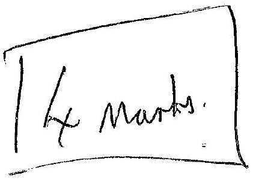
for an ideal gas.

(b) Note: Initial derivation here not needed as part of answer, of course.
An adiabatic change has $\delta Q = 0$, so the first law becomes $\delta U = \delta W$, or $\frac { 3 } { 2 } n R \delta T = - p \delta V$. But using the equation of state as in (II), $p \delta V + V \delta p = n R \delta T$, so
$$
\begin{aligned}
\frac { C _ { V } } { n R } ( p \delta V + V \delta p ) & = - p \delta V \\
\Rightarrow \frac { C _ { V } } { n R } V \delta p & = - \left( 1 + \frac { C _ { V } } { n R } \right) p \delta V \\
\Rightarrow \frac { \delta p } { p } & = - \left( \frac { C _ { V } + n R } { C _ { V } } \right) \frac { \delta V } { V } \\
\Rightarrow \frac { \delta p } { p } & = - \left( \frac { C _ { p } } { C _ { V } } \right) \frac { \delta V } { V }
\end{aligned}
$$
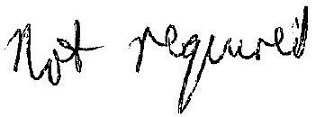
Let $\frac { C _ { p } } { C _ { V } } = \gamma$, then
$$
\begin{aligned}
\int \frac { \mathrm { d } p } { p } & = - \gamma \int \frac { \mathrm { d } V } { V } \\
\Rightarrow \ln p & = - \gamma \ln V + \mathrm { const } . \\
\Rightarrow \ln p & = \ln \left( \text { const. } V ^ { - \gamma } \right)
\end{aligned}
$$
so that
$$
\text { Guen } p V ^ { \gamma } = \text { const. }
$$
with $\gamma = \frac { C _ { p } } { C _ { V } } = \frac { 5 } { 3 }$. Then using the equation of state, $p V = n R T , p \left( \frac { n R T } { p } \right) ^ { \gamma } =$ const. so
$$
p ^ { 1 - \gamma } T ^ { \gamma } = \text { const. }
$$
and $\frac { n R T } { V } V ^ { \gamma } =$ const. so
$$
T V ^ { \gamma - 1 } = \text { const } .
$$
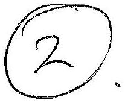
(c) Starting configuration
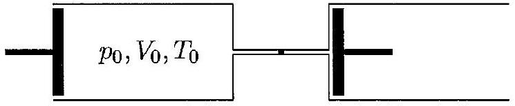

(i) Final configuration
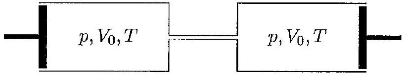
Process performed slowly and with cylinders thermally isolated so process is adiabatic. Hence (e.g.) $T V ^ { \gamma - 1 } =$ const . Therefore:
$$
T _ { 0 } V _ { 0 } ^ { \gamma - 1 } = T \left( 2 V _ { 0 } \right) ^ { \gamma - 1 }
$$
so
$$
T = 2 ^ { 1 - \gamma } T _ { 0 }
$$
A monatomic gas has $\gamma = 5 / 3$ so
$$
T = 2 ^ { - 2 / 3 } T _ { 0 } \approx 0.63 T _ { 0 }
$$
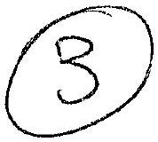
(ii) Final configuration
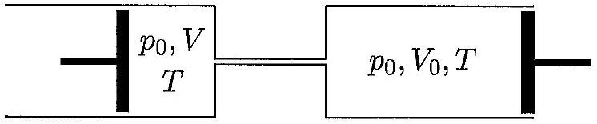
Let $V = \alpha V _ { 0 }$. Conservation of number of moles of gas between start and end gives:
$$
n = \frac { p _ { 0 } V _ { 0 } } { T _ { 0 } } = \frac { p _ { 0 } \left( V _ { 0 } + \alpha V _ { 0 } \right) } { T }
$$
so
$$
\begin{equation*}
\frac { T } { T _ { 0 } } = 1 + \alpha \tag{4}
\end{equation*}
$$
When valve is 'slightly' opened, no work is done on gas but it naturally expands to fill volume $2 V _ { 0 }$. No heat is exchanged as system is thermally isolated, so $\delta Q = 0$, hence $\delta U = 0$ implying $\delta T = 0$ for an ideal gas - its temperature remains at $T _ { 0 }$ for this part of the process. Pressure remains at $p _ { 0 }$.
Work done on gas during motion of piston is then
$$
\delta W = - p _ { 0 } \delta V = - p _ { 0 } \left( V _ { 0 } + \alpha V _ { 0 } - 2 V _ { 0 } \right) = - p _ { 0 } V _ { 0 } ( \alpha - 1 )
$$
As cylinders are thermally isolated from the surroundings, no heat is exchanged so motion of piston is adiabatic with $\delta W = \delta U = \frac { 3 } { 2 } n R \delta T$ so
$$
- p _ { 0 } V _ { 0 } ( \alpha - 1 ) = \frac { 3 } { 2 } n R \left( T - T _ { 0 } \right)
$$
or, rearranging
$$
\frac { p _ { 0 } V _ { 0 } } { T _ { 0 } } ( 1 - \alpha ) = \frac { 3 } { 2 } n R \left( \frac { T } { T _ { 0 } } \right)
$$

But, using the ideal gas law, $p _ { 0 } V _ { 0 } / T _ { 0 } = n R$, giving
$$
\begin{equation*}
\frac { 3 } { 2 } \left( \frac { T } { T _ { 0 } } \right) = ( 1 - \alpha ) \tag{5}
\end{equation*}
$$
Adding (4) and (5) gives
$$
\frac { 5 } { 2 } \frac { T } { T _ { 0 } } - \frac { 3 } { 2 } = 2
$$
so
$$
T = \frac { 7 } { 5 } T _ { 0 }
$$
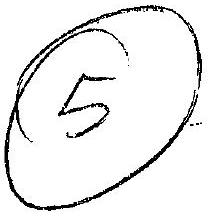
(iii) Final configuration
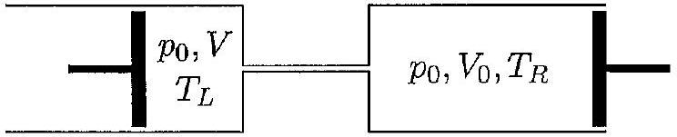
Now the cylinders are kept thermally isolated from each other so their final temperatures may be different. Let $V = \beta V _ { 0 }$. The work done on the gas is (as in (ii)):
$$
\delta W = - p \delta V = p _ { 0 } V _ { 0 } ( 1 - \beta )
$$
and since no heat is exchanged, $\delta W = \delta U$, though the change in internal energy is different to before. $n _ { L }$ moles change in temperature by $T _ { L } - T _ { 0 }$, while $n _ { R }$ moles change in temperature by $T _ { R } - T _ { \mathbf { 0 } }$ so that
$$
\begin{aligned}
\delta U & = \frac { 3 } { 2 } R \left( n _ { L } \left( T _ { L } - T _ { 0 } \right) + n _ { R } \left( T _ { R } - T _ { 0 } \right) \right) \\
& = \frac { 3 } { 2 } \left( n _ { L } R T _ { L } - n _ { L } R T _ { 0 } + n _ { R } R T _ { R } - n _ { R } R T _ { 0 } \right) \\
& = \frac { 3 } { 2 } \left( n _ { L } R T _ { L } + n _ { R } R T _ { R } - \left( n _ { L } + n _ { R } \right) R T _ { 0 } \right)
\end{aligned}
$$
Using the ideal gas law (and the fact that pressure is kept constant), $n _ { L } R T _ { L } = p _ { 0 } \beta V _ { 0 }$, $n _ { R } R T _ { R } = p _ { 0 } V _ { 0 }$ and $\left( n _ { L } + n _ { R } \right) R T _ { 0 } = n _ { 0 } R T _ { 0 } = p _ { 0 } V _ { 0 }$, meaning that $\delta U$ reduces to
$$
\begin{aligned}
\delta U & = \frac { 3 } { 2 } \left( \beta p _ { 0 } V _ { 0 } + p _ { 0 } V _ { 0 } - p _ { 0 } V _ { 0 } \right) \\
& = \frac { 3 } { 2 } \beta p _ { 0 } V _ { 0 }
\end{aligned}
$$
The first law then becomes
$$
\begin{aligned}
\delta W & = \delta U \\
\Rightarrow p _ { 0 } V _ { 0 } ( 1 - \beta ) & = \frac { 3 } { 2 } \beta p _ { 0 } V _ { 0 }
\end{aligned}
$$
giving
$$
\beta = \frac { 2 } { 5 }
$$

Because the cylinders are thermally isolated from each other, only the gas in the left cylinder undergoes an adiabatic change, and for the gas in the left cylinder, therefore, $p ^ { 1 - \gamma } T ^ { \gamma } =$ const.. Since pressure is constant, temperature of the gas in the left cylinder must also be constant, i.e. $T _ { L } = T _ { 0 }$.
Using the ideal gas law for the gas in the right cylinder, $T _ { R } = \frac { p _ { 0 } V _ { 0 } } { n _ { R } R }$, and $n _ { R }$ can be found from

$$
\begin{aligned}
n _ { R } & = n _ { 0 } - n _ { L } \\
& = \frac { p _ { 0 } V _ { 0 } } { R T _ { 0 } } - \frac { p _ { 0 } \beta V _ { 0 } } { R T _ { L } } \\
& = \frac { p _ { 0 } V _ { 0 } } { R T _ { 0 } } - \frac { p _ { 0 } \beta V _ { 0 } } { R T _ { 0 } } \\
& = ( 1 - \beta ) \frac { p _ { 0 } V _ { 0 } } { R T _ { 0 } }
\end{aligned}
$$

so

$$
\begin{aligned}
T _ { R } & = \frac { p _ { 0 } V _ { 0 } } { n _ { R } R } \\
& = \frac { p _ { 0 } V _ { 0 } } { ( 1 - \beta ) p _ { 0 } V _ { 0 } / \left( R T _ { 0 } \right) } \\
& = \frac { T _ { 0 } } { 1 - \beta }
\end{aligned}
$$

giving $T _ { R } = \frac { 5 } { 3 } T _ { 0 }$. Overall, then:

$$
T _ { L } = T _ { 0 } \quad T _ { R } = \frac { 5 } { 3 } T _ { 0 }
$$

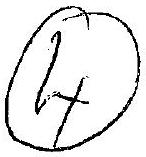

(iv) Final configuration
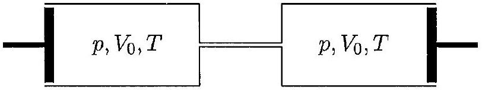
No work is done, since the gas is simply allowed to expand, and no heat is exchanged since the cylinders are thermally isolated. This is a joule expansion. Since $\delta W = \delta Q = 0$, $\delta U = 0$, and since it is an ideal gas this means that $\delta T = 0$ too. Hence:
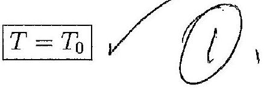
(v) Final configuration
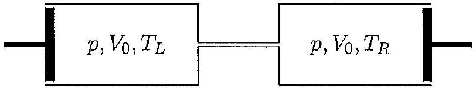

The internal energy of an ideal gas is (of course) $U = \frac { 3 } { 2 } n R T$, so conservation of energy implies

$$
\begin{aligned}
\frac { 3 } { 2 } n _ { 0 } R T _ { 0 } & = \frac { 3 } { 2 } n _ { L } R T _ { L } + \frac { 3 } { 2 } n _ { R } R T _ { R } \\
\Rightarrow n _ { 0 } R T _ { 0 } & = n _ { L } R T _ { L } + n _ { R } R T _ { R }
\end{aligned}
$$

and using the equation of state for an ideal gas, $p V = n R T$ gives

$$
p _ { 0 } V _ { 0 } = p V _ { 0 } + p V _ { 0 }
$$

that is

$$
p = \frac { p _ { 0 } } { 2 }
$$

Conservation of number of moles of gas then means

$$
\begin{aligned}
n _ { 0 } & = n _ { L } + n _ { R } \\
\Rightarrow \frac { p _ { 0 } V _ { 0 } } { R T _ { 0 } } & = \frac { p V _ { 0 } } { R T _ { L } } + \frac { p V _ { 0 } } { R T _ { R } } \\
\Rightarrow \frac { p _ { 0 } V _ { 0 } } { R T _ { 0 } } & = \frac { p _ { 0 } V _ { 0 } } { 2 R T _ { L } } + \frac { p _ { 0 } V _ { 0 } } { 2 R T _ { R } }
\end{aligned}
$$

so

$$
\begin{equation*}
\frac { 1 } { T _ { 0 } } = \frac { 1 } { 2 } \left( \frac { 1 } { T _ { L } } + \frac { 1 } { T _ { R } } \right) \tag{6}
\end{equation*}
$$

Again, the gas in the left cylinder undergoes an adiabatic change so obeys $p ^ { 1 - \gamma } T ^ { \gamma } =$ const. Raising this to the power of $1 / \gamma$ gives

$$
p ^ { \frac { 1 - \gamma } { \gamma } } T = \mathrm { const } .
$$

Recalling that $\gamma = \frac { 5 } { 3 }$ for an ideal monatomic gas, $\frac { 1 - \gamma } { \gamma } = - \frac { 2 } { 5 }$ so

$$
\begin{aligned}
\frac { T _ { L } } { T _ { 0 } } & = \left( \frac { p } { p _ { 0 } } \right) ^ { \frac { 1 - \gamma } { \gamma } } \\
& = \left( \frac { 1 } { 2 } \right) ^ { 2 / 5 }
\end{aligned}
$$

so

$$
T _ { L } = 2 ^ { - 2 / 5 } T _ { 0 } \approx 0.76 T _ { 0 }
$$

Finally, from (6)

$$
\begin{aligned}
T _ { R } & = \frac { T _ { 0 } T _ { L } } { 2 T _ { L } - T _ { 0 } } \\
& = \frac { 2 ^ { - 2 / 5 } } { 2 ^ { 3 / 5 } - 1 } T _ { 0 }
\end{aligned}
$$

so

$$
T _ { R } = \frac { 1 } { 2 - 2 ^ { 2 / 5 } } T _ { 0 } \approx 1.47 T _ { 0 }
$$

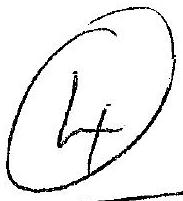
