## BPLO Round 22018

(a) Physisists :

(b) Onesaleplace. Ore cide quite conver. Cauragay less. Alout 5 un diamoter.
(c) The mist on the windowpane has droplets that are large enough to disrupt the light in that it looks like a fog.
But quite often you can see an interference ring if there is a light behind.
So the droplets have a radius and separation of some wavelengths of light.
They are a single layer thick, close to each other but just separated. If you view the light source you can see a ring of some sort, with maybe an angle of diffraction from the centre of perhaps $6 ^ { \circ }$ i.e. 0.1 radian.
So $\theta = \lambda d$ gives a $d$ of $6 \times 10 ^ { - 6 } \mathrm {~m}$. therefore $d ^ { 2 } = 36 \times 10 ^ { - 12 } \mathrm {~m} ^ { 2 }$.
In a large 20 cm diameter patch, the radius is 0.1 m and area is $3 \times 10 ^ { - 2 } \mathrm {~m} ^ { 2 }$.
So number of droplets is $N = \frac { 3 \times 10 ^ { - 2 } } { 36 \times 10 ^ { - 12 } } = 0.8 \times 10 ^ { 9 }$.
So the mass of the layer (density is $10 ^ { 3 } \mathrm {~kg} / \mathrm { m } ^ { - 3 }$ ) $m = 0.8 \times 10 ^ { 9 } \times \frac { 4 } { 3 } \pi \times \left( 3 \times 10 ^ { - 6 } \right) ^ { 3 } \times 3 \times 10 ^ { 3 } \mathrm {~kg} =$ $0.2 \mathrm {~g} \approx 10 ^ { - 4 } \mathrm {~kg}$
d) (们)
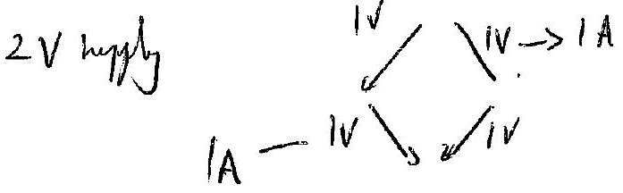
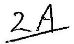
It is each am.
(ii) 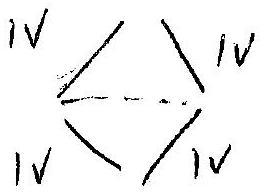
(iii) 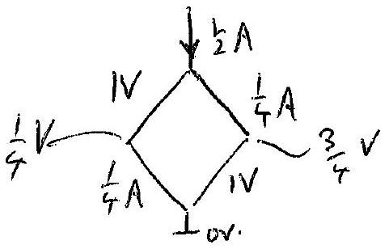
(iv) 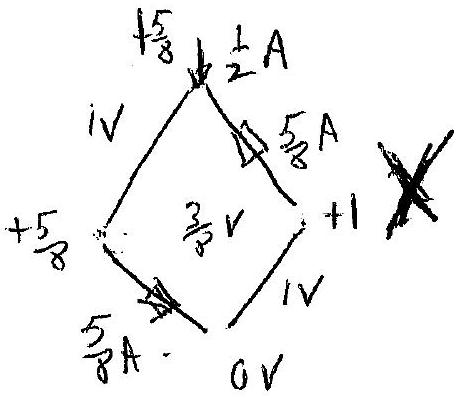

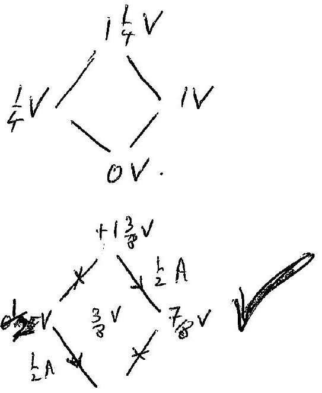

(e)

$$
\bigcap _ { i } v
$$

$$
\begin{aligned}
V _ { f } & = 1.4 e ^ { - 0.25 \times \pi } \\
& = 0.64 \mathrm { mr } ^ { - 1 }
\end{aligned}
$$

Grountatul Wars.

a) Comet applial of orat II [1] Comet result $[ 1 ]$
5) . If E - K.E. + P.E.
$$
= \frac { 1 } { 2 } m ( r \omega ) ^ { 2 } + \frac { 1 } { 2 } M ( R \omega ) ^ { 2 } - \frac { G M m } { ( R + r ) } \text { or } [ D ]
$$
$$
= - \frac { 1 } { 2 } \frac { c ^ { \frac { 3 } { 4 } } M _ { m } } { \left( M _ { 1 } + m \right) ^ { \frac { 1 } { 5 } } } \omega ^ { \frac { 2 } { 3 } } \quad \text { after using part a) }
$$
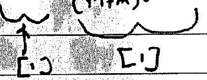
c) $I = M R ^ { 2 } + m r ^ { 2 } \quad [ 1 ]$ is sofficient now
$$
= \frac { m ^ { M } } { m + M } ( r + R ) ^ { 2 } \quad [ 2 ] \quad \begin{aligned}
& \text { either now or in any } \\
& \text { Subsequent part. }
\end{aligned}
$$
d) Correct dimensional analysis
$$
p = \alpha \frac { G I ^ { 2 } \omega ^ { 6 } } { c ^ { 5 } } \quad [ 1 ] \quad [ 1 ] \quad \beta = 1
$$

h) . Any appropricte agunt [1]
$$
m + M \geqslant 4 ^ { \frac { 3 } { 5 } } \mathcal { H } \quad [ 1 ]
$$
.). Combist of Schooschild runts inth Hepler III rellif I tall a) [1]

Identifies $f _ { c } = 30011 z \quad [ 1 ]$

$$
\left. \begin{array} { c }
m + m = 76 M _ { 0 } \quad m = 53 M _ { 0 } \\
m = 23 M _ { 0 }
\end{array} \right\} \quad [ 1 ]
$$

C) Coment on ongts for th
modu. [1]
cy. Jage intral reprate.
Tual engy dos $\simeq \frac { 1 } { 4 } \frac { \mathrm { Mm } } { ( n + n ) } c ^ { 2 } \quad [ 1 ]$

$$
\begin{equation*}
= 4 m _ { 0 } \pm 15 \% \tag{-1}
\end{equation*}
$$

$$
\begin{aligned}
& \frac { 1 } { 2 } M r ^ { 2 } w ^ { 2 } + 1 M R ^ { 2 } w ^ { 2 } \\
& L M r \omega ^ { 2 } ( r + R ) \quad M r = M R \\
& - \frac { \sigma M m } { ( r + R ) } \\
& = \frac { 1 } { 2 } M r \frac { G ( M + m ) } { ( r + R ) ^ { 2 } } - \frac { Q M m } { ( r + M ) } \\
& = \frac { 1 } { ( r + R ) ^ { 2 } } \left[ \frac { 1 } { 2 } M r G M + 6 M R G m - G M M r - G M M R \right] \\
& - \frac { G M m } { \left( m ^ { 2 } - 2 \right) } [ r + R ] \\
& = - \frac { 1 } { 2 } \frac { - M m } { ( r + R ) } \\
& = - \frac { 1 } { 2 } \operatorname { arc } \omega ^ { - \frac { 2 } { 3 } } \\
& \widehat { G ( M + m ) ] ^ { \frac { 1 } { 3 } } } \\
& M = \frac { m ^ { \frac { 6 } { 3 } } } { 2 ^ { \frac { 1 } { 5 } } m ^ { \frac { 3 } { 3 } } } = \frac { 1 } { 2 } ^ { \frac { 1 } { 5 } } M
\end{aligned}
$$

## Que 3. Phase Space Physis

(d) Fromgraph,

$$
\begin{aligned}
p _ { x } & = - k x \\
M \frac { d x } { d t } & = - k x \\
- \frac { M } { k } \int _ { x _ { 0 } } ^ { x } \frac { d x } { x } & = \int _ { 0 } ^ { t } \\
\ln \frac { x } { x _ { 0 } } & = - \frac { k } { m } \cdot t \\
x & = x _ { 0 } e ^ { - \frac { k } { \operatorname { sn } } \cdot t } ( \checkmark )
\end{aligned}
$$

The displainent from an origin decreases exponsitilly with time
(b) (1)

$$
\begin{aligned}
F & = k \cdot e + p e \\
& = p ^ { 2 } + l ( 1 - \cos \theta ) m g
\end{aligned}
$$

(ii) For small $d , \quad \cos \theta = 1 - \frac { \theta ^ { 2 } } { 2 }$
so $E = \frac { p ^ { 2 } } { 2 m } + \frac { 1 } { 2 } l d ^ { 2 } m g$
Since $p _ { 0 } = d p$
$E = \frac { \rho _ { \theta } ^ { 2 } } { 2 m l ^ { 2 } } + \frac { 1 } { 2 } l \theta ^ { 2 } m g \quad$ Of the form
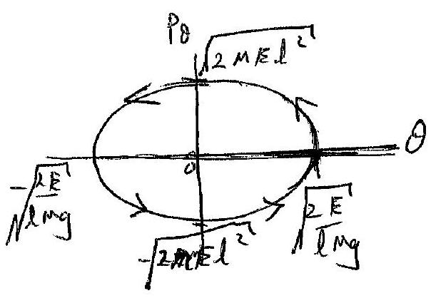

$$
\begin{aligned}
& 1 = \frac { x ^ { 2 } } { a ^ { 2 } } + \frac { y ^ { 2 } } { b ^ { 2 } } \text {-arellipe } \\
& 1 = \frac { p \theta ^ { 2 } } { 2 m E l ^ { 2 } } + \frac { l m y } { 2 E } \cdot \theta ^ { 2 }
\end{aligned}
$$

ellyie (✓)
limiti $( V )$
arrow (✓) sheek a
(iii) Twir the amplitule, $E \propto A ^ { 2 } \Rightarrow 4 x$ insitileneyty

Area fullips $\alpha a \times b$ (semi mapor themis minemen.) $[ A = \pi a b ]$

$$
\begin{aligned}
& \propto \sqrt { E } \times \sqrt { E } \\
& \propto E \text { 生 } \\
& \propto A ^ { 2 } + a b
\end{aligned}
$$

For infor, artafellapre is $\frac { 1 } { 2 } E T$ (Tu the perso),
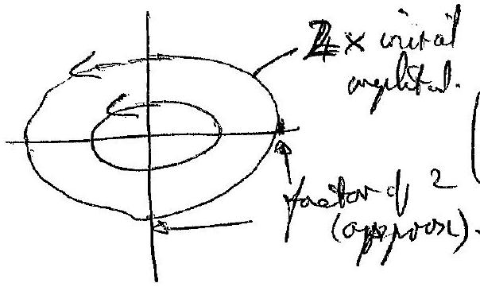

II

Que 3 cont.
(iv) given $\Delta E \propto - E$

$$
\begin{aligned}
& \Delta E = - k E \cdot \Delta t \\
& E = E _ { 0 } e ^ { - k t }
\end{aligned}
$$

Now $4 t = 2 \times 10 ^ { - 5 } \cdot E \cdot \frac { d t } { T }$

$$
( \text { period } , T )
$$

$$
C _ { 0 } \quad k = \frac { 2.5 \times 10 ^ { - 5 } } { T }
$$

then

$$
\text { given } t = 400 T = 2.5 \times 10 ^ { - 5 } \times 400
$$

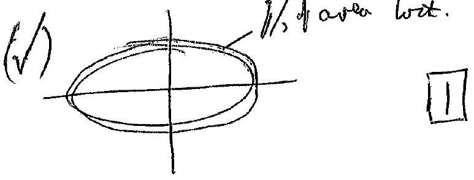
(v) The tryestorei crotes and right aybles,

Corring te $\theta = 0$ assis at ryilar argles cidnaters than the $\Delta p$ eilber sides ole tame, ser ow overy is drizipoted

Similarly at cle $P _ { P } = 0$ asses, wo prog is duiputed [not ole same are eny i consemed though.]. (V)
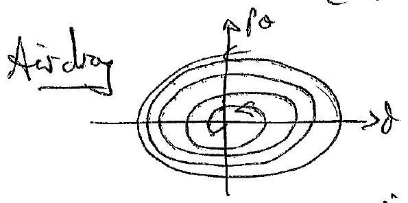

The tryestory will "jpicil" is to the argin. No thyretory cosseys overs, The perpolver will eventully swivy wist as and bute
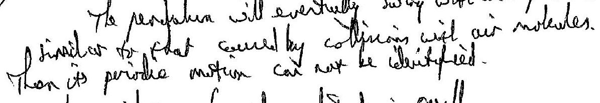 Than its priotice mosture can not be idenity fied.
(vii) The pendeduce will two by striking when thosylistate is anall.
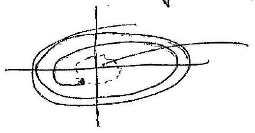
small region whel will rest contain' che protong (Atgrention Marior).
(viii)
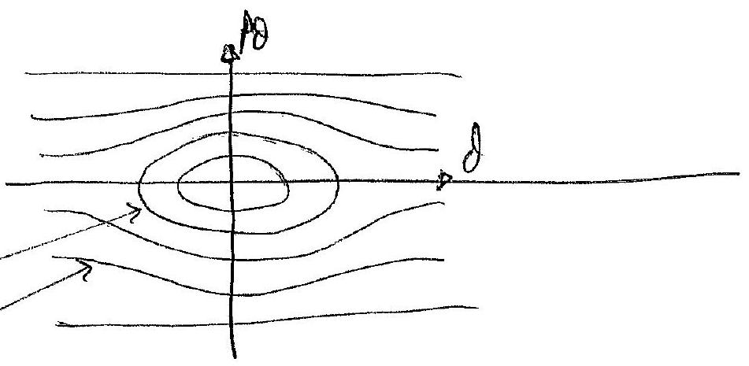

Que 3 cont.
(c)
(i) Colinear collision: Bofore $\underset { M _ { 1 } } { \stackrel { U _ { 1 } } { \longleftrightarrow } } \underset { M _ { 2 } } { \stackrel { U _ { 2 } } { \longrightarrow } }$

Apto
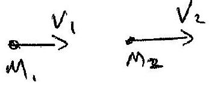

Coms. of mom. $\quad M _ { 1 } U _ { 1 } + M _ { 2 } U _ { 2 } = M _ { 1 } V _ { 1 } + M _ { 2 } V _ { 2 }$
Cond AR (alarite) $M _ { 1 } u _ { 1 } ^ { 2 } + m _ { 2 } u _ { 2 } ^ { 2 } = m _ { 1 } v _ { 1 } ^ { 2 } + m _ { 2 } v _ { 2 } ^ { 2 }$
form (1)

$$
m _ { 1 } \left( u _ { 1 } - v _ { 1 } \right) = m _ { 2 } \left( v _ { 2 } - u _ { 2 } \right)
$$

fore (2)
fore (2)

$$
m _ { 1 } \left( u _ { 1 } - v _ { 1 } \right) \left( u _ { 1 } + v _ { 1 } \right) = m _ { 2 } \left( v _ { 2 } - u _ { 2 } \right) \left( v _ { 2 } + u _ { 2 } \right)
$$

Assume $u _ { 1 } \neq V , u _ { 2 } \neq V _ { 2 }$ (no collision owers)
Then, diarity

$$
u _ { 1 } + v _ { 1 } = k _ { 2 } + u _ { 2 }
$$

so that

$$
v _ { 2 } = u _ { 1 } + v _ { 1 } - u _ { 2 }
$$

Now Inabilituting for $V _ { 2 }$ is (1)

$$
m _ { 1 } u _ { 1 } - m _ { + } V _ { 1 } = m _ { 2 } u _ { 1 } + m _ { 2 } V _ { 1 } - m _ { 2 } u _ { 2 } - m _ { 2 } u _ { 2 }
$$

So-

$$
m _ { 1 } u _ { 1 } - m _ { 2 } u _ { 1 } + 2 m _ { 2 } u _ { 2 } = \left( m _ { 1 } + m _ { 2 } \right) V _ { 1 }
$$

Hence

$$
\begin{equation*}
V _ { 1 } = \frac { \left( m _ { 1 } - m _ { 2 } \right) } { \left( m _ { 1 } + m _ { 2 } \right) } \cdot u _ { 1 } + \frac { 2 m _ { 2 } } { \left( m _ { 1 } + m _ { 2 } \right) } \cdot u _ { 2 } \tag{3}
\end{equation*}
$$

Now subsemate for $V$, is (1) withed.

$$
\begin{aligned}
m _ { 1 } u _ { 1 } - m _ { 1 } v _ { 1 } - m _ { 1 } u _ { 2 } + m _ { 1 } u _ { 1 } & = m _ { 2 } v _ { 2 } - m _ { 2 } u _ { 2 } \\
2 m _ { 1 } u _ { 1 } \wedge \left( m _ { 2 } - m _ { 1 } \right) u _ { 2 } & = \left( m _ { 1 } + m _ { 2 } \right) v _ { 2 }
\end{aligned}
$$

Herre,

$$
\begin{equation*}
V _ { 2 } = \frac { 2 m _ { 1 } } { \left( m _ { 1 } + m _ { 2 } \right) } u _ { 1 } - \frac { \left( m _ { 1 } - m _ { 2 } \right) } { \left( m _ { 1 } + m _ { 2 } \right) } \cdot u _ { 2 } \tag{4}
\end{equation*}
$$

(ii)

$$
\begin{aligned}
V _ { 1 } = a u _ { 1 } + b u _ { 2 } & \\
V _ { 2 } = c u _ { 1 } + d u _ { 2 } & \\
a = \frac { m _ { 1 } - m _ { 2 } } { m _ { 1 } + m _ { 2 } } & c = \frac { 2 m _ { 1 } } { \left( u _ { 1 } + m _ { 2 } \right) } \\
b = \frac { 2 m _ { 2 } } { m _ { 1 } + m _ { 2 } } & d = - a
\end{aligned}
$$

there may - your above.

Que 3 cont.
$\frac { f / X \operatorname { oracta } A } { y }$

$$
\begin{aligned}
A & = \frac { 1 } { 2 } ( f \times g ) \cdot \hat { k } \\
& = \frac { 1 } { 2 } \left| \begin{array} { c c c }
\hat { \imath } & \hat { \jmath } & \hat { k } \\
f _ { 1 } & f _ { 2 } & 0 \\
g _ { 1 } & g _ { 2 } & 0
\end{array} \right| \cdot \hat { k } \\
& = \frac { 1 } { k } \left( f _ { 1 } g _ { 2 } - f _ { 2 } g _ { 1 } \right) \frac { \hat { k } } { k } \\
& = \frac { 1 } { 2 } \left( f _ { 1 } g _ { 2 } - f _ { 2 } g _ { 1 } \right)
\end{aligned}
$$

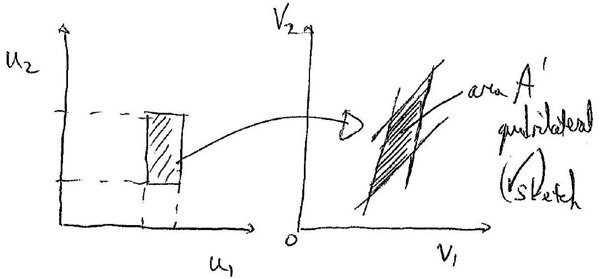

For a siced values $U _ { 1 }$ (an legraph a contral lies),

$$
\begin{aligned}
& V _ { 1 } = \text { cont } + b u _ { 2 } \\
& V _ { 2 } = \text { const } + d u _ { 2 }
\end{aligned}
$$

So $U _ { 2 }$ trunforms hearly aroth the V-V2 gryh. (V) For a defenent value of $u _ { 1 } , u _ { 2 }$ transforms in de same way, but wite a different intraph (so parall lives.
So the restangle tranforms as a praditateral (✓) $V _ { 1 }$ and $V _ { 2 }$ form a trangle (whet is half of a que grad formal
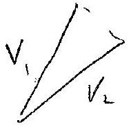
The area in plequedictuted is $2 x$ area of triggte atove.

$$
\begin{aligned}
A ^ { \prime } & = 2 \times \frac { 1 } { 2 } ( a \cdot d - b \cdot c ) \\
& = - \frac { \left( m _ { 1 } - m _ { 2 } \right) ^ { 2 } } { \left( m _ { 1 } + m _ { 2 } \right) ^ { 2 } } - \frac { 4 m _ { 1 } m _ { 2 } } { \left( m _ { 1 } + m _ { 2 } \right) ^ { 2 } } \\
& = - \frac { m _ { 1 } ^ { 2 } - m _ { 2 } ^ { 2 } + 2 m _ { 1 } m _ { 2 } - 4 m _ { 1 } m _ { 2 } } { \left( m _ { 1 } + m _ { 2 } \right) ^ { 2 } } \\
& = - \frac { \left( m _ { 1 } ^ { 2 } + m _ { 2 } ^ { 2 } + 2 m _ { 1 } m _ { 2 } \right) } { \left( m _ { 1 } + m _ { 2 } \right) ^ { 2 } } \\
& = - 1
\end{aligned}
$$

Molules $A ^ { \prime } = - 1$
If thy pro root interact, ther is no charge of their nomintal But ty spends onet.

TOTAL 20 MARKS
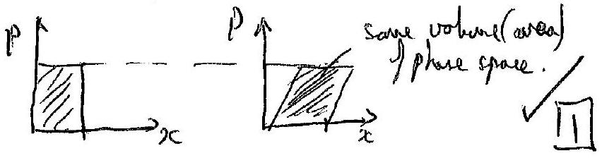

Qu 4 Purhing Proterwith hearers
from chefeterope
(d) The hour beam abforacts similer to a single slit. most of the energy (90\%) is in the centul nasuria
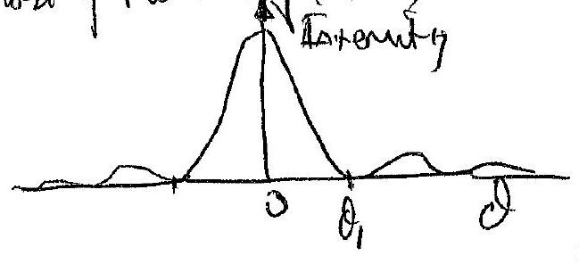
$\left. \begin{array} { c } \text { the width of the antial mainuising } \\ \delta _ { 1 } = 1.22 \frac { \lambda } { D } \end{array} \right\}$ ∴ $\partial _ { 1 } = 1.22 \frac { \lambda } { D }$
diffredel bean.
At distance $R , \theta = \frac { d } { R }$
(✓)

So

$$
\begin{align*}
& \frac { \lambda } { D } = \frac { d } { R } \quad ( 1.22 \text { in rot essertiul } ) .  \tag{\(\downarrow\)}\\
& R = \frac { d D } { \lambda }
\end{align*}
$$

$$
\begin{equation*}
R = \frac { 1 \times 10 } { 600 \times 10 ^ { - 9 } } \approx 2 \times 10 ^ { 7 } \mathrm {~m} \tag{V}
\end{equation*}
$$

Factors of 2 (radium $\leftrightarrow$ doinder) are ignoved.
6
(b) The momentum of a photon is given by $E = p c$

$$
\therefore \quad \begin{align*}
& \frac { E } { t } = W = \frac { p } { t } \cdot c = F _ { c }  \tag{V}\\
& F = \frac { W } { c } \left( \frac { \text { poser } } { c } \right) \tag{v}
\end{align*}
$$

Ansthetive suil enits cight : clicated dietai : $F \rightarrow 2 F$

Adrantage: e.g. reflective can will wat hat will a aterating eney like durts surface.

Quely cont:

(c) This rimplified model has the certoned muse acting on the said yep to distance $R$, and then as the sail mever away, the powernerewed by chemal is taken to bezero.
Granty: if $W \approx 100 \mathrm { ow }$, then $F = \frac { 10 ^ { 11 } } { 3 \times 10 ^ { 8 } } = 300 \mathrm {~N}$ of loserfore. Theirs independent of the nam of the cuil, wores they raistationd attraction of the Revoth ad Sur (meedrawe signifinat) is very small on $10 ^ { - 3 } k y . C = \frac { 1 } { 100 } N$ at the (Eart's supree). So se carnylast spowy for this said.
"Would do ely leaser is, $W D = F \cdot R$ (will constant F)
$$
\begin{array} { l l }
\text { ke gained, } & \frac { 1 } { 2 } m v ^ { 2 } = F \cdot R \\
& \frac { 1 } { 2 } m v ^ { 2 } = m a \cdot R
\end{array}
$$
(✓)
Subsitating for Rada,
$$
v ^ { 2 } = 2 \cdot \frac { 2 W } { m c } \cdot \frac { d D } { \lambda }
$$
ds
$$
v = 2 \sqrt { \frac { W } { M c } , \frac { d \Delta } { \lambda } }
$$
as aceberation a is accurate, quite biref (for truelliy ty bilt years)
$$
T = \frac { L } { v } = \frac { L } { 2 } \sqrt { \frac { m _ { c } \cdot \lambda } { W } \cdot \frac { \lambda } { d D } }
$$
time taken, $\quad T = \frac { L } { v } = \frac { L } { 2 } \sqrt { \frac { m c \cdot \lambda } { W } }$
$( \checkmark )$
$$
\begin{aligned}
T & = \frac { 4 \times 10 ^ { 16 } } { 2 } \sqrt { \frac { 10 ^ { - 3 } \times 3 \times 10 ^ { 8 } \times 600 \times 10 ^ { - 9 } } { 10 ^ { 11 } \times 1 \times 10 } } \\
& = 9 \times 10 ^ { 9 } \mathrm {~s} \\
& = 300 \text { years }
\end{aligned}
$$

Quit cont.

(d) A single telexope is linited by is diffestion purtern. Wish mary telecopes, a differettion grating like effet is achieved The vidtl of plecental messions is sFill $\delta \sim \frac { \lambda } { D }$, but if $D$ is the diameter of He Earth, then 8 is wey meet smaller.
fo
$$
\begin{aligned}
D & \sim 2 \times 6400 \mathrm {~km} \\
& \sim 1.3 \times 10 ^ { 7 } \mathrm {~m} \\
& \sim 10 ^ { 7 }
\end{aligned}
$$
So $\Delta \rightarrow \frac { D } { 10 ^ { 6 } }$
and $T \propto \frac { 1 } { D ^ { \frac { 1 } { 2 } } }$
Hence $T \rightarrow \pi / 1000 \sim 0.3$ years
$$
\approx 100 \text { days }
$$
This is short time for a hage diviture. $v \approx 4 \times 10 ^ { 9 } \mathrm {~m} / \mathrm { s }$
$$
= 10 c
$$
wheres, previouly
$$
\begin{gathered}
\sqrt { 2 } = 4 \times 10 ^ { 6 } \mathrm {~m} / \mathrm { s } \\
\approx 0.01 \mathrm { c }
\end{gathered}
$$
So, vist the Lagerdienter sonce, ow nor veloticitic caluloti is not could.

## Particle Physics Q

(a) (i) $P _ { \text {total } } = m _ { 1 } u _ { 1 } + m _ { 2 } u _ { 2 }$
Want $P _ { \text {total } } ^ { \prime } = m _ { 1 } \left( u _ { 1 } + u ^ { \prime } \right) + m _ { 2 } \left( u _ { 2 } + u ^ { \prime } \right)$
$$
= m _ { 1 } u _ { 1 } + m _ { 2 } u _ { 2 } + \left( m _ { 1 } + m _ { 2 } \right) u ^ { \prime }
$$
Such that $P _ { \text {total } } ^ { \prime } = 0$
$$
\Rightarrow \quad u ^ { \prime } = - \frac { m _ { 1 } u _ { 1 } + m _ { 2 } u _ { 2 } } { m _ { 1 } + m _ { 2 } }
$$
(ii) $u ^ { \prime } = - \frac { m u + 0 } { 2 m } = - \frac { u } { 2 }$
So: $\underset { ( 1 ) } { \leadsto } \underset { ( 2 ) } { \dot { m } } \xrightarrow [ \text { ZMF } ] { \sim } \xrightarrow [ m ] { u / 2 } \stackrel { u / 2 } { m }$
In ZMF, $P _ { \text {before } } ^ { \prime } = 0 \Rightarrow P _ { \text {after } } ^ { \prime } = 0$ by conservation of momentum
In ZMF after collision: $\xrightarrow [ m ] { v } \xrightarrow [ m ] { w } m v + m w = 0 \Rightarrow v = - w$
Since collision elastic $K E$ is conserved $\Rightarrow \ln Z M F$ :
$$
\begin{aligned}
2 \times \frac { 1 } { 2 } m \left( \frac { u } { 2 } \right) ^ { 2 } & = \frac { 1 } { 2 } m v ^ { 2 } + \frac { 1 } { 2 } m ( - v ) ^ { 2 } \\
\Rightarrow \quad \frac { 1 } { 2 } u ^ { 2 } & = 2 v ^ { 2 } \\
\Rightarrow \quad | v | & = \frac { | u | } { 2 }
\end{aligned}
$$
∴ After collision in ZMF: $\stackrel { u / 2 } { u } \xrightarrow [ m ] { u / 2 }$
To transform back to lab frame add $\xrightarrow { 4 / 2 }$ to each particle
⇒ Final configuration is $\underset { 0 } { \dot { m } } \xrightarrow [ \stackrel { m } { \vec { m } } ] { \xrightarrow { u } } / /$

(iii) Immediately before collision in lab frame:
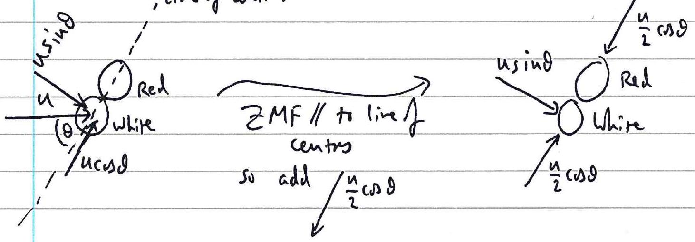

c.f. (ii), after collision in ZMF:
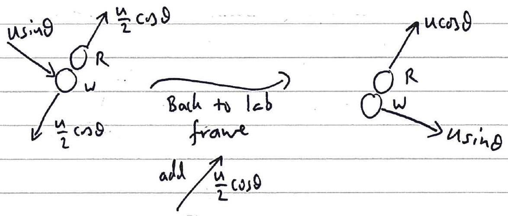

As white mares off after allision it has no velocity 11 to line of centres, while red mares only along line of centers. (COMision is assuwed frictionless, so no force can be exerted on red in direction perpendicular to line of centres. Imploye only exerted II to line of centres so red most more off in that direction.

(b) (i) $p ^ { 2 } = \gamma ^ { 2 } m ^ { 2 } v ^ { 2 } = \frac { m ^ { 2 } v ^ { 2 } } { 1 - v ^ { 2 } c ^ { 2 } }$
$$
\begin{aligned}
\therefore p ^ { 2 } c ^ { 2 } + m ^ { 2 } c ^ { 4 } & = \frac { m ^ { 2 } v ^ { 2 } c ^ { 2 } } { 1 - v ^ { 2 } / c ^ { 2 } } + m ^ { 2 } c ^ { 4 } \\
& = \frac { m ^ { 2 } v ^ { 2 } c ^ { 2 } + m ^ { 2 } c ^ { 4 } - m v ^ { 2 } c ^ { 2 } } { 1 - v ^ { 2 } / c ^ { 2 } } = \frac { m ^ { 2 } c ^ { 4 } } { 1 - v ^ { 2 } / c ^ { 2 } } = \gamma ^ { 2 } m ^ { 2 } c ^ { 4 } = E ^ { 2 } \checkmark
\end{aligned}
$$

For a massive particle at rest, $p = 0 \Rightarrow E ^ { 2 } = m ^ { 2 } c ^ { 4 }$

$$
\Rightarrow E = m c ^ { 2 } \checkmark
$$

For a massless particle: $m = 0 \Rightarrow E ^ { 2 } = p ^ { 2 } c ^ { 2 }$

$$
\Rightarrow E = p c
$$

Using the de Bragie relation $p = \frac { h } { \lambda } \Rightarrow E = \frac { h c } { \lambda } = h f$
both

(ii) In the interaction, every and moventum must he conserved. Without loss of geveratity consider a frame in Which the éét pair have zero moventum (the ZMF):
$$
M _ { e } \stackrel { u } { e ^ { - } } \stackrel { u } { \underset { e ^ { + } } { u } } m _ { e }
$$
In principle evergy conservation would allow all of the evergy (in ZMF: $E _ { \text {total } } = 2 \times E _ { e } = 2 \times \gamma _ { u } m _ { e } c ^ { 2 }$ ) to create a single photon of this every Haverer, a single photan has a momentum $p = \frac { h } { \lambda } \neq 0$. Since in the ZMF, $p _ { \text {before } } = 0 \Rightarrow p _ { \text {after } } = 0$ it is recessary to have at least one furster photon to be emitted to ensure that Protal $= 0$ after collision. In the ZMF it is clear (Mencfore)

that the photons most be emitted in opposite directions ("back to back") if there are only two of Nem:
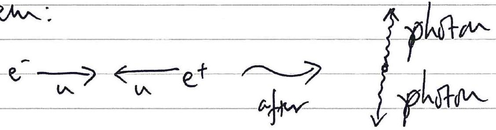
(iii) Initicly:
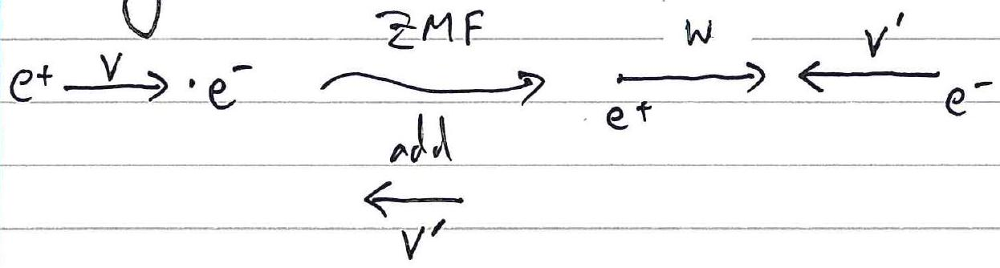

Total momentum before in lab- fram is $p _ { e } + + 0 = p _ { e } +$ $\| \quad \| \quad \| Z M F$ is $p _ { e ^ { + } } ^ { \prime } + p _ { e ^ { - } } ^ { \prime }$

Usity then for $p$ given:

$$
\begin{aligned}
p _ { e ^ { + } + p _ { e ^ { - } } ^ { \prime } } & = \gamma _ { v ^ { \prime } } \left( p _ { e ^ { + } } + \frac { v ^ { \prime } } { c ^ { 2 } } E _ { e ^ { + } } \right) + \gamma _ { v ^ { \prime } } \left( 0 + \frac { v ^ { \prime } } { c ^ { 2 } } E _ { e ^ { - } } \right) \\
& = \gamma _ { v ^ { \prime } } \left( p _ { e ^ { + } } + \frac { v ^ { \prime } } { c ^ { 2 } } \left( E _ { e ^ { + } } + E _ { e ^ { - } } \right) \right)
\end{aligned}
$$

The ZMF requires $p _ { \text {that } } ^ { \prime } = 0 \Rightarrow p _ { e ^ { + } } + \frac { v ^ { \prime } } { c ^ { 2 } } \left( E _ { e ^ { + } } + E _ { e ^ { - } } \right) = 0$

$$
\therefore V ^ { \prime } = - \frac { p _ { e } + c ^ { 2 } } { E _ { e } + + E _ { e } - } = - \frac { \gamma _ { v } m _ { e } V c ^ { 2 } } { \gamma _ { v } m _ { e } c ^ { 2 } + m _ { e } c ^ { 2 } } = - \frac { \gamma _ { v } } { 1 + \gamma _ { v } } V
$$

Using Hint, afterwarts in ZMF:

ZMF
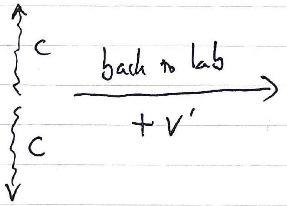
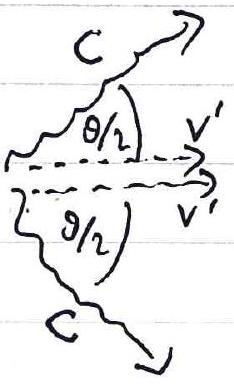

$$
\therefore \quad \cos \left( \frac { \theta } { 2 } \right) = \frac { v ^ { \prime } } { c } = \frac { \frac { \gamma _ { v } } { 1 + \gamma _ { v } } v } { c } = \frac { \gamma _ { v } \frac { v } { c } } { 1 + \gamma _ { v } }
$$

Now since $\gamma _ { v } = \frac { 1 } { \sqrt { \left( 1 - \frac { v ^ { 2 } } { c ^ { 2 } } \right) } } \Rightarrow \frac { v } { c } = \sqrt { } \left( 1 - \frac { 1 } { \gamma _ { v } ^ { 2 } } \right)$

$$
\therefore \cos \left( \frac { \theta } { 2 } \right) = \frac { \gamma _ { v } \sqrt { } \left( 1 - \frac { 1 } { \gamma _ { v } { } ^ { 2 } } \right) } { 1 + \gamma _ { v } } = \frac { \sqrt { } \left( \gamma _ { v } { } ^ { 2 } - 1 \right) } { 1 + \gamma _ { v } } = \sqrt { } \left( \frac { \gamma _ { v } - 1 } { \gamma _ { v } + 1 } \right)
$$

So $\theta = 2 \arccos / \left( \frac { \gamma _ { v } - 1 } { \gamma _ { v } + 1 } \right)$

$$
\begin{aligned}
\text { In limit } v \rightarrow 0 , \gamma _ { v } \rightarrow 1 & \Rightarrow \cos \left( \frac { \theta } { 2 } \right) \rightarrow 0 \\
& \Rightarrow \frac { \theta } { 2 } \rightarrow 90 ^ { \circ } \\
& \Rightarrow \theta \rightarrow 180 ^ { \circ }
\end{aligned}
$$

(iv) Total evergy $E _ { e ^ { + } } = \gamma m _ { e } c ^ { 2 } \Rightarrow \gamma = \frac { E _ { e ^ { + } } } { m _ { e } c ^ { 2 } }$
Evergy due to rest mass is
$$
\begin{aligned}
& = m _ { e } c ^ { 2 } \\
& = 9.11 \times 10 ^ { - 31 } \mathrm { hg } \times \left( 3.0 \times 10 ^ { 8 } \mathrm {~ms} ^ { - 1 } \right) ^ { 2 } \\
& = 8.199 \times 10 ^ { - 14 } \mathrm {~J} \\
& = \frac { 8.199 \times 10 ^ { - 14 } } { 1.60 \times 10 ^ { - 19 } } \mathrm { eV } \\
& = 5.12 \times 10 ^ { 5 } \mathrm { eV } \\
& = 512 \mathrm { heV }
\end{aligned}
$$
$$
\begin{aligned}
\therefore \gamma & = \frac { \text { Rest mass every } + K E } { \text { rest mass every } } \\
& = \frac { 512 + 635 } { 512 } \approx 2.24
\end{aligned}
$$
Frm $\cos \left( \frac { \theta } { 2 } \right) = \sqrt { } \left( \frac { \gamma _ { v } - 1 } { \gamma _ { v } + 1 } \right)$, largest $\gamma$ gives largest $\cos \left( \frac { \theta } { 2 } \right)$ hence smallest $\frac { g } { 2 }$ bence smallest $\theta$
$$
\begin{aligned}
& \therefore \cos \left( \frac { \theta _ { \min } } { 2 } \right) \approx \sqrt { } \left( \frac { 2.24 - 1 } { 2.24 + 1 } \right) \approx 0.62 \\
& \Rightarrow \quad \frac { \theta _ { \min } } { 2 } = \arccos ( 0.62 ) \approx 52 ^ { \circ } \\
& \Rightarrow \quad \theta _ { \min } \approx 104 ^ { \circ }
\end{aligned}
$$

（v） Conservatio of Evergy：$E _ { p h a m } = E _ { e ^ { + } } + E _ { e - }$
Conservation of Momentum：$p _ { \text {photon } } = p _ { e + } + p _ { e - }$
Conservation of every suggests possible if $E _ { p h r a n } \geqslant 2 m _ { e } c ^ { 2 }$ （i．e．greater than or equal to the sum of the rest mass evergies of Othe electron and position）．
Zor To consider moventum，transform to frawe of reference（Zms） in which the thu plitas，are emitted＇back to bach＇so $p _ { e } ^ { \prime } + p _ { e } ^ { \prime } e ^ { \prime } = 0$ in this frame．But conservation of momentum ⇒ phonou $= 0$ ．If phase hes no mone⿴囗⿱㇒贝nim it has acerergy and does unt exist since $E = p c$ for a massless particle．
    ∴ process caunt occur as such．
Note：can dlso theat explisity in lab frawe to give a contradiction，but this requires more algesta．
