This is a guide adds not the find versuir for notion shory the

Qu 1 25

3 Pho Ronnd 2 2018-19
(9i)(a)(i) No external farms act on boat + moter + instenctor honizentally 'System' most Herefore returneh of rest/moving min const. Welling at end depending in the start. Assume at rest to steat. This norm that centre of mass of system morst remarch at rest.

Let $M =$ mass of but \& $m =$ mass if instantor + motor .
Befre:
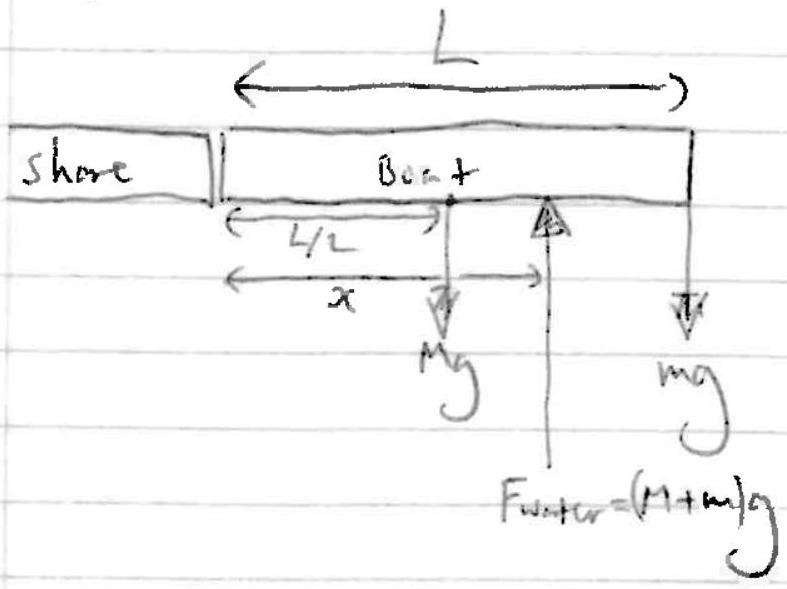

Taking movents about shore:

$$
\begin{gathered}
( M + m ) g x + M g \frac { L } { 2 } = m g L \\
x = \frac { \left( \frac { M } { 2 } + m \right) } { M + m } L
\end{gathered}
$$

After:
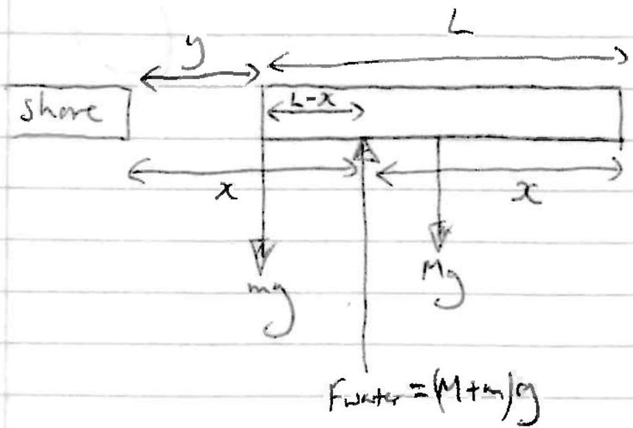

$$
\begin{aligned}
y & = x - ( L - x ) \\
& = 2 x - L \\
& = \frac { M + 2 m } { M + m } L - L \\
& = \frac { M + 2 m - M - m } { M + m } L \\
& = \frac { m } { M + m } L
\end{aligned}
$$

This gives. $y = \frac { ( 60 + 40 ) } { 180 + ( 60 + 40 ) } \times 5 \mathrm {~m}$

$$
\begin{aligned}
& = \frac { 25 } { 14 } \mathrm {~m} \\
& \approx 1.79 \mathrm {~m}
\end{aligned}
$$

(ii) Naw Fex-honizatal $\propto V$. Assuming starts and enst at rest:
$$
\begin{aligned}
\Delta ( m v ) & = 0 \\
\Rightarrow \int F d t & = 0 \\
\Rightarrow \int v d t & = 0 \\
\Rightarrow \text { displacement } & = 0 .
\end{aligned}
$$
So instructer will be at shore.
for a suitable model.

This gives. $y = \frac { ( 10 + 40 ) } { 180 + ( 60 + 40 ) } \times 5 \mathrm {~m}$

$$
\begin{aligned}
& = \frac { 25 } { 14 } \mathrm {~m} \\
& \approx 1.79 \mathrm {~m}
\end{aligned}
$$

(ii) Now Fext-hon'tanal $\propto V$. Assuming starts and enti at rest:

$$
\begin{aligned}
\Delta ( m v ) & = 0 \\
\Rightarrow \int F d t & = 0 \\
\Rightarrow \int v d t & = 0 \\
\Rightarrow \text { displacement } & = 0 .
\end{aligned}
$$

So instructer will be at shore.
for a mistable model.

## 2019 BPhO Qns and Solutions

## Short Qn

The BepiColumbo mission to Mercury launched in October 2018 is only the second satellite destined to enter an orbit around Mercury, 6 years after launch in 2024. Given that, at their closest, Mercury and Mars are approximately equidistant from the Earth, explain why a mission to put a satellite in orbit around Mercury requires significantly more energy expenditure than a similar mission to Mars.

## Answer

Looking for following points:

1) In order to orbit a planet it is necessary to achieve an appropriate velocity, firstly to match the speed of the planet's own orbit around the sun and then secondly to stay in orbit about the planet.

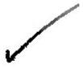

2) Launching to Mars is "uphill" so the satellite needs to be provided with sufficient energy to gain the GPE needed and the KE on arrival.
3) Earth's orbit is faster than Mars's so there is no need to catch up with Mars, hence KE needed on arrival is minimal.
4) Going to Mercury is "downhill" so apparently free but the GPE lost will end up as KE, leaving the satellite travelling too fast. Hence fuel must be burned to slow down the craft, lest it fall into the Sun.

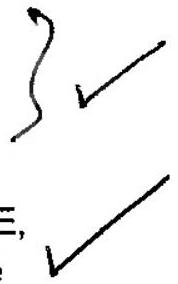

5) Mercury's gravitational field is relatively weak compared to the sun, so a lot of slowing is needed. Also Mercury's orbit is faster than Earth's so some boost is needed to catch it up.
6) (Main point) GPE varies as $1 / \mathrm { r }$ so change in GPE going from Earth up to Mars is much less than change from Earth to Mercury.

If point 6 is not appreciated, marks must be very limited.

## Long Question. Mechanical Toy

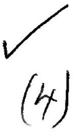

Two masses, $m$, are mounted at the end of symmetrical arms of length teach at an angle a to the body of the toy at a height in above the pivol point. Initially we shall take the body of the toy to be of zero mass.

- The lunes are more stable when they are concave outwards than inwards.
- When the ball is tapped, the flow of air out through the hole is small.
- The small increase in pressure is enough to cause some lunes to bulge outwards.

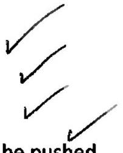

- Since this is a more stable state, generally the more lunes will expand outwards than be pushed inwards by tapping.

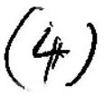

Qu I (d)
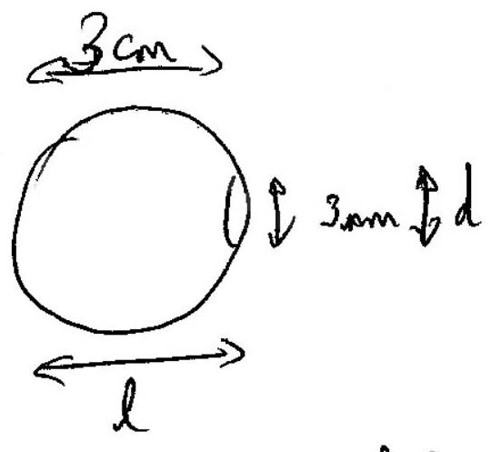

$$
\frac { \partial = ( 1.22 ) \lambda t } { \partial t }
$$

Darieter of psot is $\ell \theta$
area is $\frac { \pi } { 4 } ( l \theta ) ^ { 2 }$
with $\theta = ( 1.22 ) \frac { d } { d }$

$$
\begin{aligned}
\therefore \text { area } & = \frac { \pi } { 4 } l ^ { 2 } \cdot ( 1.22 ) ^ { 2 } \frac { \lambda ^ { 2 } } { d ^ { 2 } } \\
& \approx l ^ { 2 } \frac { \lambda ^ { 2 } } { d ^ { 2 } }
\end{aligned}
$$

Initial expoing arring is $I _ { 0 } \cdot \frac { \pi d ^ { 2 } } { 4 }$
(beam is similm to they preupil).

$$
\begin{aligned}
\therefore \text { power on notina is } & I _ { 0 } \frac { \pi d ^ { 2 } } { 4 } l ^ { 2 } \lambda ^ { 2 } / d ^ { 2 } \\
& = I _ { 0 } \frac { \pi } { 4 } \cdot \frac { d ^ { 4 } } { l ^ { 2 } \lambda ^ { 2 } } \\
& = 1 \times 10 ^ { - 3 } \times \frac { \left( 4 \times 10 ^ { - 3 } \right) ^ { 2 } } { \left( 3 \times 10 ^ { - 2 } \right) ^ { 2 } } \left( 500 \times 10 ^ { - 9 } \right) ^ { 2 } \\
& = \approx 10 ^ { 8 } \mathrm {~W} / \mathrm { m } ^ { 2 }
\end{aligned}
$$

Initial intensity $= 10 ^ { 2 } \mathrm { w } / \mathrm { m } ^ { 2 }$
I faster of $10 ^ { 6 }$ gain in interving

Qu 1 (e) One putm at the Estion Balane the weight of o priton with setrartatic repulsion

$$
\begin{aligned}
m y & = \frac { 1 } { 4 \pi c _ { 0 } } \cdot \frac { e ^ { 2 } } { r ^ { 2 } } \\
1.67 \times 10 ^ { - 27 } \times 10 & = 9 \times 10 ^ { 9 } \times \frac { \left( 1.6 \times 10 ^ { - 19 } \right) ^ { 2 } } { \Gamma ^ { 2 } } \\
\therefore r ^ { 2 } & = 9 \times 10 ^ { 9 } \times \frac { \left( 1.6 \times 10 ^ { - 19 } \right) ^ { 2 } } { 1.67 \times 10 ^ { - 27 } \times 10 } \\
& = \frac { 3 } { 5 } \times \frac { 10 ^ { 10 } } { 10 ^ { - 26 } } \times \left( 1.6 \times 10 ^ { - 19 } \right) ^ { 2 } \\
r & = 0.8 \times 10 ^ { 18 } \times 1.6 \times 10 ^ { - 19 } \\
& = 1.3 \times 10 ^ { - 1 } \\
& = 13 \mathrm {~cm}
\end{aligned}
$$

do lor 2 profors (appose).

Qu.1(f).

$$
\begin{array} { l l l }
0.78 \mathrm {~m} ^ { 3 } \mathrm { fN } _ { 2 } , & m = 28.0 \text { grade } \\
0.21 \mathrm {~m} ^ { 3 } \mathrm { O } _ { 2 } , & m = 32.0 & \text { gride } \\
0.01 \mathrm {~m} ^ { 3 } \mathrm {~A} , & m = 34.9 & \text { gride }
\end{array}
$$

Gases at some tengerature ad prounse w anyy same whime persone

$$
\text { Averge malar manfair is } \begin{aligned}
M = & 0.73 \approx 14.0 \times 2 \\
& + 0.21 \times 16.0 \times 2 \\
& + 0.01 \times 39.9
\end{aligned}
$$

$$
m = 28.96 \mathrm {~g} / \mathrm { mole } .
$$

$$
\text { must } 1 \mathrm {~m} ^ { 3 } \text { is } \begin{aligned}
\frac { 1 } { 1.23 } & = 0.813 \mathrm {~kg} \\
& = 813 \mathrm {~g}
\end{aligned}
$$

Hence no-dsmles is $\frac { 813 } { 28.96 }$ moles

$$
= 28.1 \text { moles }
$$

$$
\begin{aligned}
k E & = \frac { 3 } { 2 } k T \text { permolente } \\
& = \frac { 3 } { 2 } \times n \times N _ { A } \cdot k T \\
& = \frac { 3 } { 2 } n R T \\
& = \frac { 3 } { 2 } \times 28.1 \times 8.31 \times 288 \\
& = 101 \mathrm {~kJ}
\end{aligned}
$$

## Answer

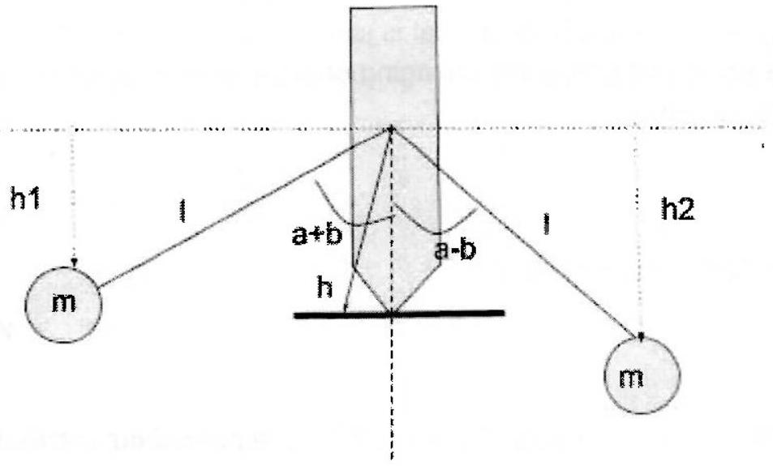
a)
$h _ { 1 } = h \cos ( b ) - I \cos ( a + b ) = h \cos ( b ) - I \cos ( a ) \cos ( b ) + I \sin ( a ) \operatorname { sib } ( b )$
$h _ { 2 } = h \cos ( b ) - I \cos ( a - b ) = h \cos ( b ) - I \cos ( a ) \cos ( b ) - I \sin ( a ) \sin ( b )$
$\mathrm { U } = \mathrm { mg } \left( \mathrm { h } _ { 1 } + \mathrm { h } _ { 2 } \right) = 2 \mathrm { mgh } \cos ( \mathrm { b } ) - 2 \mathrm { mgl } \cos ( \mathrm { b } ) \cos ( \mathrm { a } ) = 2 \mathrm { mg } \cos ( \mathrm { b } ) ( \mathrm { h } - \mathrm { l } \cos ( \mathrm { a } ) )$
b)
$\mathrm { dU } / \mathrm { db } = - 2 \mathrm { mg } \sin ( \mathrm { b } ) ( \mathrm { h } - \mathrm { I } \cos ( \mathrm { a } ) )$
This is zero for $\mathrm { b } = 0,180,360 \ldots ( 0 , \pi , 2 \pi \ldots )$
Firstly only values in the domain 0-359 are physically valid as one rotation brings the system back to 0 . This leaves 0 and 180.0 fits with the diagram as drawn. $\mathrm { b } = 180$ also works mathematically so the only reasons to reject would be either to consider stability a little further (e.g. as in part c or by asserting that a small displacement from the equilibrium will result in the toy toppling, so it is not stable) or to compare to the diagram where we are clearly requiring the masses to be drawn below the horizontal, not above.
c)
i) $\mathrm { d } ^ { 2 } \mathrm { U } / \mathrm { db } ^ { 2 }$ must be positive as this implies the energy function is a minimum wrt b rather than a maximum, and hence the toy is stable as displacement would require it spontaneously to move "uphill"
ii) $\mathrm { d } ^ { 2 } \mathrm { U } / \mathrm { db } ^ { 2 } = - 2 \mathrm { mg } \cos ( \mathrm { b } ) ( \mathrm { h } - \mathrm { l } \cos ( \mathrm { a } ) )$
For this to be positive with $b = 0 , ( h - I \cos ( a ) )$ must be negative
l.e. $\mathrm { I } \cos ( \mathrm { a } ) > \mathrm { h }$
But $\mathrm { l } \cos ( \mathrm { a } )$ is the vertical height of the mass below the attachment point and h is the vertical height of the pivot below the attachment point ie the condition is that the masses must be below the pivot point.
d)
$\mathrm { GPE } = 2 \mathrm { mg } \cos ( \mathrm { b } ) ( \mathrm { h } - \mathrm { l } \cos ( \mathrm { a } ) ) = \mathrm { A } \cos ( \mathrm { b } )$ where $\mathrm { A } = 2 \mathrm { mg } ( \mathrm { h } - \mathrm { l } \cos ( \mathrm { a } ) )$ is constant Using small angle approx $\cos ( b ) = 1 - b ^ { 2 } / 2$ so $\operatorname { GPE } = A \left( 1 - x ^ { 2 } / 2 h ^ { 2 } \right)$ using the approximation for b.
For the KE we need to find the speed of each mass, which is $( \mathrm { l } \sin ( \mathrm { a } ) ) \mathrm { db } / \mathrm { dt } = \mathrm { I } \sin ( \mathrm { a } ) \dot { x } / \mathrm { h }$ again using the approximation for $b$ and ( $l \sin ( a )$ ) as the radial distance of the masses from the pivot point (ie using $\mathrm { v } = \mathrm { rw }$ ). Hence $\mathrm { KE } = 2 \times 1 / 2 \mathrm {~m} ( \mathrm { l } \sin ( \mathrm { a } ) \dot { x } / \mathrm { h } ) ^ { 2 }$

e) A mass on a spring has $\mathrm { EPE } = 1 / 2 \mathrm { kx } ^ { 2 }$ and $\mathrm { KE } = 1 / 2 \mathrm {~m} \dot { x } ^ { 2 }$. Angular frequency is given by square root of the ratio of the constant multiplying x and that multiplying $\dot { x }$. Looking at our KE and PE eqns for the teeter toy we similarly have a constant multiplying each of these (we can ignore the constant energy term A in the GPE as that is just due to the choice of zero position - for the dynamics the significant part is the changing energy) and so by analogy the angular frequency should be given by:

$$
\omega = \sqrt { \frac { - A / h ^ { 2 } } { 2 m ( l \sin a / h ) ^ { 2 } } }
$$

The minus sign is because our GPE term is $- \frac { 1 } { 2 } \mathrm {~A} \mathrm { x } ^ { 2 }$

$$
\omega = \sqrt { \frac { g ( l \cos a - h ) } { ( l \sin a ) ^ { 2 } } }
$$

(after cancelling $\mathrm { m } , 2$, h etc). Which looks an awful lot like $\sqrt { g / l }$ for a pendulum, within a geometric factor or two.
f) Addition of the Mgh term for the mass of the support changes the condition for the second derivative to be negatiive to

$$
2 \operatorname { mg } ( \mathrm {~h} - \mathrm { I } \cos ( \mathrm { a } ) ) + \mathrm { Mgh } < 0
$$

This is equivalent to the centre of mass of the system being more than h below the attachment point, ie below the point of contact.

In terms of the new oscillation frequency we have the additional GPE term Mgh $\cos ( \mathrm { b } )$ so A is now $2 \mathrm { mg } ( \mathrm { l } \cos ( \mathrm { a } ) - \mathrm { h } ) + \mathrm { Mgh }$. We also have the additional KE term $\frac { 1 } { 2 } \mathrm { M } \dot { x } ^ { 2 }$ as the centre of mass of the toy moves with speed $\dot { x }$. Hence our expression becomes (using the square to avoid the large square root):

$$
\omega ^ { 2 } = \frac { 2 m g ( l \cos a - h ) + M g h } { 2 m l ^ { 2 } \sin ^ { 2 } a + M h ^ { 2 } }
$$

(the $\mathrm { h } ^ { 2 }$ which previously cancelled throughout now does not as the KE for the body of the toy does not contain that term).
If we write the original expression for $\omega ^ { 2 }$ as $\mathrm { P } / \mathrm { Q }$ where $\mathrm { P } = 2 \mathrm { mg } ( \operatorname { lcos } ( \mathrm { a } ) - \mathrm { h } )$ and $\mathrm { Q } =$ $2 \mathrm {~m} ( \operatorname { lsin } ( \mathrm { a } ) ) ^ { 2 }$ then the new expression is $( \mathrm { P } + \mathrm { R } ) / ( \mathrm { Q } + \mathrm { S } )$ with $\mathrm { R } = \mathrm { Mgh }$ and $\mathrm { S } = \mathrm { Mh } ^ { 2 }$

If the new oscillation is faster we expect

$$
( P + R ) / ( Q + S ) > P / Q
$$

le

$$
\begin{aligned}
& P Q + R Q > P Q + P S \\
& R Q > P S
\end{aligned}
$$

$\mathrm { Mgh } 2 \mathrm {~m} ( \operatorname { lsin } ( \mathrm { a } ) ) ^ { 2 } > \mathrm { Mh } ^ { 2 } 2 \mathrm { mg } ( \mathrm { lcos } ( \mathrm { a } ) - \mathrm { h } )$
$( l \sin ( a ) ) ^ { 2 } > h ( l \cos ( a ) - h )$

e) A mass on a spring has $\mathrm { EPE } = 1 / 2 \mathrm { kx }$ and $\mathrm { KE } = 1 / 2 \mathrm {~m} \dot { x } ^ { 2 }$. Angular frequency is given by square root of the ratio of the constant multiplying x and that multiplying $\dot { x }$. Looking at our KE and PE eqns for the teeter toy we similarly have a constant multiplying each of these (we can ignore the constant energy term A in the GPE as that is just due to the choice of zero position - for the dynamics the significant part is the changing energy) and so by analogy the angular frequency should be given by:

$$
\omega = \sqrt { \frac { - A / h ^ { 2 } } { 2 m ( l \sin a / h ) ^ { 2 } } }
$$

The minus sign is because our GPE term is $- \frac { 1 } { 2 } \mathrm {~A} \mathrm { x } ^ { 2 }$

$$
\omega = \sqrt { \frac { g ( l \cos a - h ) } { ( l \sin a ) ^ { 2 } } }
$$

(after cancelling $\mathrm { m } , 2 , \mathrm {~h}$ etc). Which looks an awful lot like $\sqrt { g / l }$ for a pendulum, within a geometric factor or two.
f) Addition of the Mgh term for the mass of the support changes the condition for the second derivative to be negatiive to

$$
2 \mathrm { mg } ( \mathrm {~h} - \mathrm { l } \cos ( \mathrm { a } ) ) + \mathrm { Mgh } < 0
$$

This is equivalent to the centre of mass of the system being more than $h$ below the attachment point, ie below the point of contact.

In terms of the new oscillation frequency we have the additional GPE term Mgh $\cos ( b )$ so A is now $2 \mathrm { mg } ( \mathrm { l } \cos ( \mathrm { a } ) - \mathrm { h } ) + \mathrm { Mgh }$. We also have the additional KE term $\frac { 1 } { 2 } \mathrm { M } \dot { x } ^ { 2 }$ as the centre of mass of the toy moves with speed $\dot { x }$. Hence our expression becomes (using the square to avoid the large square root):

$$
\omega ^ { 2 } = \frac { 2 m g ( l \cos a - h ) + M g h } { 2 m l ^ { 2 } \sin ^ { 2 } a + M h ^ { 2 } }
$$

(the $\mathrm { h } ^ { 2 }$ which previously cancelled throughout now does not as the KE for the body of the toy does not contain that term).
If we write the original expression for $\omega ^ { 2 }$ as $\mathrm { P } / \mathrm { Q }$ where $\mathrm { P } = 2 \mathrm { mg } ( \mathrm { l } \cos ( \mathrm { a } ) - \mathrm { h } )$ and $\mathrm { Q } =$ $2 \mathrm {~m} ( \operatorname { lsin } ( \mathrm { a } ) ) ^ { 2 }$ then the new expression is $( \mathrm { P } + \mathrm { R } ) / ( \mathrm { Q } + \mathrm { S } )$ with $\mathrm { R } = \mathrm { Mgh }$ and $\mathrm { S } = \mathrm { Mh } ^ { 2 }$

If the new oscillation is faster we expect

$$
( P + R ) / ( Q + S ) > P / Q
$$

le

$$
\begin{aligned}
& P Q + R Q > P Q + P S \\
& R Q > P S \\
& M g h 2 m ( l \sin ( a ) ) ^ { 2 } > M h ^ { 2 } 2 m g ( l \cos ( a ) - h ) \\
& ( l \sin ( a ) ) ^ { 2 } > h ( l \cos ( a ) - h )
\end{aligned}
$$

## BPLO Round 2 2018-19

Q3 Sisyphus's Coffee

(a) Shetch:
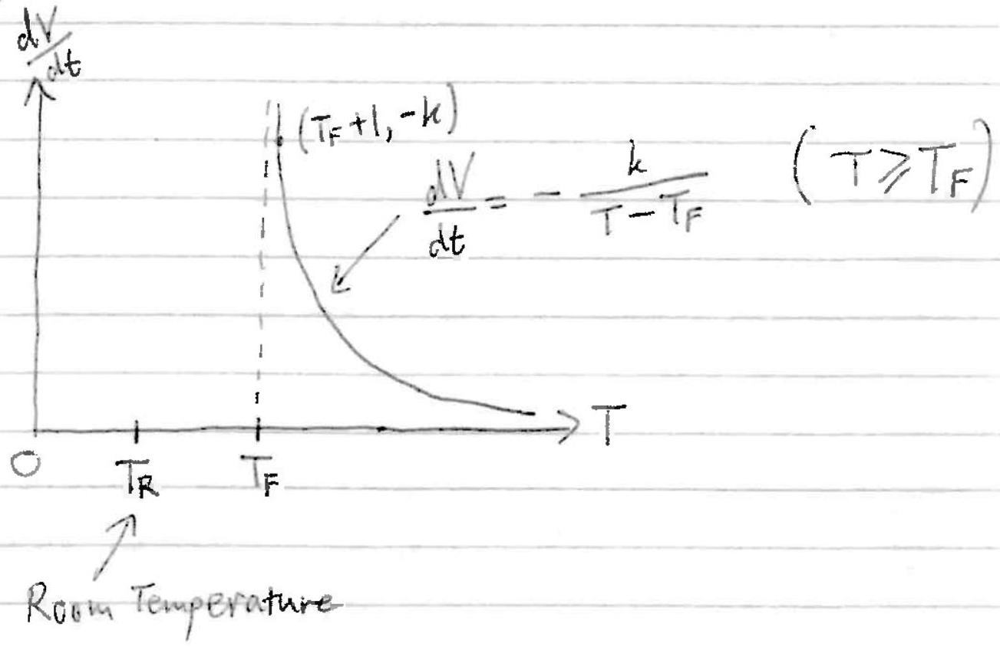

As can be seen in the sketch, is the coffee cools and its temperature decreases, the rate at which it can be drunk increases.

$$
\begin{equation*}
\text { N.B. } [ k ] = \left[ \frac { d V } { d t } \right] \left[ T - T _ { F } \right] = L ^ { 3 } T \tag{\(\Theta\)}
\end{equation*}
$$

Consider a point on the curve where $T = T _ { F } + 1$ (i.e. "just" above the critical temperature, $T _ { F }$, which is itsolf above $T _ { R }$ ). Here, $\frac { d V } { d t } = - k$. With a 'typical' mug of liameter $\approx$ height $\approx 8 \mathrm {~cm}$, aful mug of liquid at a pleasant temperature may perhaps be consumed in a time of about 15s. This gives

$$
\frac { d V } { d t } = \frac { - \pi \times ( 4 \mathrm {~cm} ) ^ { 2 } \times 8 \mathrm {~cm} } { 15 \mathrm {~s} } \approx - 30 \mathrm {~cm} ^ { 3 } \mathrm {~s} ^ { - 1 }
$$

i.e. $k \approx 30 \mathrm {~cm} ^ { 3 } \mathrm { Ks } ^ { - 1 }$ (Any reasomable estimate)

(b) Expect heat loss via:
- Conduction through wills then radiation to surrivedings \& conduction to surrending in followed by convection thringh air. Assmed small
- Radiation from expused surface, evaporation from exposed surface of conduction to air finhed by cinversion through air.

Ming has two wall fillel with focm, which who cintain tryped air, a poir conductor. Therefore expect dominant mode if heat loss to be through expred surface. Expert rate of hear lass to depend an (error-sectional) area of surface and temperature difference
from print of between coffee and summondings. vect of mig

Simplest reasmable difference would be liver (the greater the area the greater the heat loss rate \& the gienter the temperature difference ite greater the rase of heat loss), so expect:

$$
\begin{aligned}
& \frac { d Q } { d t } \propto A \& \frac { d Q } { d t } \propto \left( T - T _ { R } \right) \\
\Rightarrow \quad & \frac { d Q } { d t } = - h A \left( T - T _ { R } \right) \cdot ( - \text { since decreasing rate } )
\end{aligned}
$$

Using

$$
\delta Q = m c \delta T \text {, i.e. } \frac { d Q } { d T } = m c \quad \binom { m = \text { mass of cuffer } } { c = \frac { \text { syccific heat } } { \text { capicity of wider } } }
$$

$\Rightarrow \frac { \delta Q } { \delta t } = m c \frac { \delta T } { \delta t } \quad$ or $\quad \frac { d Q } { d t } = m c \frac { d T } { d t }$
$\therefore$ Rate of coling is $\frac { d T } { d t } = - \frac { h A } { m c } \left( T - T _ { R } \right)$
or

$$
\frac { d T } { d t } = - \frac { h A } { \rho c } \frac { \left( T - T _ { R } \right) } { V } \left\{ \begin{array} { l }
A = \text { creas-isectional } \\
\text { area in aning } \\
\rho = \text { decusing of water } \\
V = \text { vilume in coffee } \\
T = \text { rempt of coffee }
\end{array} \right.
$$

N. B. this is Newtonislaw of colling which is the for confuction, and approximately the for convection/evaporation, but definitely not the for radiation, for which expect $P \propto T ^ { 4 }$. Therefore ignove radicative losses in this scenarie.
(c) Starting with $\frac { d V } { d t } = - \frac { k } { \left( T - T _ { F } \right) }$
$$
\text { Shorthand } \begin{aligned}
\frac { d V } { d t } & = \dot { V } ; \frac { d T } { d t } = \dot { T } \\
\frac { d ^ { 2 } V } { d t ^ { 2 } } & = V
\end{aligned}
$$
$$
\begin{aligned}
\Rightarrow \frac { d ^ { 2 } V } { d t ^ { 2 } } & = \frac { k } { \left( T - T _ { F } \right) ^ { 2 } } \frac { d T } { d t } \\
& = \frac { 1 } { k } \left( \frac { d V } { d t } \right) ^ { 2 } \frac { d T } { d t } \quad \text { using } \frac { 1 } { T - T _ { F } } = - \frac { 1 } { k } \frac { d V } { d t } \\
& = - \frac { h A } { \rho c k } \frac { 1 } { V } \left( \frac { d V } { d t } \right) ^ { 2 } \left( T - T _ { R } \right) \quad \text { using } \frac { d T } { d t } = - \frac { h A } { \rho c } \frac { \left( T - T _ { R } \right) } { V } \\
& = - \frac { h A } { \rho c k } \frac { \dot { V } ^ { 2 } } { V } \left( - \frac { k } { \dot { V } } + T _ { F } - T _ { R } \right) \quad \text { using } \dot { V } = \frac { - k } { T - T _ { F } } \\
\ddot { V } & = + \frac { h A } { \rho c } \frac { \dot { V } } { V } - \frac { h A } { \rho c k } \left( T _ { F } - T _ { R } \right) \frac { \dot { V } ^ { 2 } } { V }
\end{aligned}
$$
Using suggested relationship $\quad \ddot { V } = \dot { V } \frac { d \dot { V } } { d V }$ \& le $A m = \frac { h A } { \rho c }$

(4)

$$
\begin{aligned}
& \text { gives } \begin{array} { l }
\dot { X } / \frac { d V } { d V } = \frac { m \dot { V } } { V } - \frac { m } { k } \left( T _ { F } - T _ { R } \right) \frac { V ^ { * } } { V } \\
\Rightarrow \frac { d \dot { V } } { d V } = \frac { m } { V } \left( 1 - \frac { T _ { F } - T _ { R } } { k } \dot { V } \right) \\
\Rightarrow \int _ { \hat { C } } \frac { d \dot { V } } { 1 - \alpha \dot { V } } = \int _ { V _ { 0 } } ^ { 1 } m \frac { d V } { V } \quad \left( \operatorname { lin } \alpha = \frac { T _ { F } - T _ { R } } { k } \right) \\
\dot { V } _ { 0 } \\
\Rightarrow \left[ - \frac { 1 } { \alpha } \ln ( 1 - \alpha \dot { V } ) \right] _ { \dot { V } _ { 0 } } ^ { V } = m \ln \left( \frac { V } { V _ { 0 } } \right) \\
\Rightarrow - \frac { 1 } { \alpha } \ln \left( \frac { 1 - \alpha \dot { V } } { 1 - \alpha \dot { V } _ { 0 } } \right) = m \ln \left( \frac { V } { V _ { 0 } } \right) \\
\Rightarrow \ln \left( \frac { V } { V _ { 0 } } \right) = \ln \left[ \left( 1 + \frac { \left( T _ { F } - T _ { R } \right) } { k } \cdot \frac { k } { T _ { - } - T _ { F } } \right) \left( 1 + \frac { \left. T _ { F } - T _ { R } \right) } { k } \cdot \frac { k } { T _ { 0 } - T _ { F } } \right) ^ { - \frac { 1 } { \alpha m } } \right] \\
= \ln \left[ \left( \frac { T - T _ { F } ^ { \prime } + T _ { F } - T _ { R } } { T - T _ { F } } \cdot \frac { T _ { 0 } - T _ { F } } { T _ { 0 } - T _ { F } + T _ { F } - T _ { R } } \right) ^ { - \frac { 1 } { \alpha m } } \right] \\
\Rightarrow V = V _ { 0 } \left( \frac { \left( T _ { 0 } - T _ { R } \right) \left( T - T _ { F } \right) } { \left( T _ { 0 } - T _ { F } \right) \left( T - T _ { F } \right) } \right) \frac { k } { m \left( T _ { F } - T _ { R } \right) } \quad \left( m = \frac { h A } { \rho c } \right)
\end{array}
\end{aligned}
$$

Bluo Rind 2 2018-19

Q4 Stable Nuclei
Q4 Stable Nuclei
(a) (i) Binding evergy $= \begin{aligned} & \text { Energy retersed on formation of } \\ & \text { nucleys firm free nuclerors } \end{aligned}$ nucleus from free nucleins ✓

$$
= \Delta m c ^ { 2 } \quad ( \text { igrem Rigi } ) .
$$

Where $\Delta _ { m } =$ mass of free nuclears - mass of nucleys $V$

$$
\begin{aligned}
\Rightarrow B E ( A , Z ) & = \left[ ( A - Z ) m _ { n } + Z m _ { p } - M ( A , Z ) \right] c ^ { 2 } \\
& = a _ { 1 } A - a _ { 2 } A ^ { 2 / 3 } - a _ { 3 } Z ^ { 2 } A ^ { - 1 / 3 } - a _ { 4 } ( A - 2 Z ) ^ { 2 } A ^ { - 1 } - a _ { 5 } S ( A , Z )
\end{aligned}
$$

where $a _ { 1 }$ to as have been redeffined as $a _ { 1 } = 15.8 \mathrm { MeV }$ etc. (i.e. factor of $c ^ { 2 }$ absorbed into units).

Recalling that be density of nuclei is found to be roughly constant, implying nuclear rading $r \propto A ^ { 1 / 3 } \quad \left( r = r _ { 0 } A ^ { 1 / 3 } \right)$

- Nudear volume* $\alpha r ^ { 3 }$ so $\underline { v d } , \propto A , a _ { 1 }$ is therefore volumé term, depending simply on the number of nucleuns. The greater the no. If nuclears, the greater the energy needed to separate them (or equivalently the greater the energy relesse when ithey form the nuclews) so the greaser the $B E$.
* assinmed sphetical

- Sirriface area of nucleus (again assumed spherical) $\propto r ^ { 2 }$ and since $r \propto A ^ { 1 / 3 } \Rightarrow S A \propto A ^ { 2 / 3 } , a _ { 2 }$ is therefore surface term Nucleors at surface do not require as much everyy to be separatel from nuclers as nucleins within nucleus. This rem therefore reduces the evergy requirel to sepirate the nuclery into its nucleors so the $a _ { 2 }$ term is subtracted from the $a _ { 1 }$ term. The linger ithe surface cotea of the nucley, the greater the no of nucleing at surface and the more the BE is reduced as a reisnlt.
- Comlomb repulsion of priting in nucleus means that they effectively assist the separation of the nucleas into its intritment naclary Other providing another term which reduces the amount of everyy required to $C$ separate the nucleus into its nucleron. This cords to curtlor term which is subtratel from the a term The electrotatic every of a distribution of charge $Q$ with radius $r$ is (as per the grestion) $E \propto Q ^ { 2 } / r$, and shice $Q \times Z$ and $r \propto A ^ { 1 / 3 }$. this is $E \propto z ^ { 2 - 1 / 3 }$ so this is the term $a _ { 3 }$. In fact, numericaty.
$$
\begin{aligned}
E & = \frac { 3 } { 5 } \frac { Q ^ { 2 } } { 4 \pi \varepsilon _ { 0 } r } \\
& = \frac { 3 } { 5 } \cdot \frac { ( z e ) ^ { 2 } } { 4 \pi \varepsilon _ { 0 } r _ { 0 } A ^ { 1 / 3 } } \\
& = \frac { 3 e ^ { 2 } } { 20 \pi \varepsilon _ { 0 } r _ { 0 } } Z ^ { 2 } A ^ { - 1 / 3 }
\end{aligned}
$$
Here the pre-factor
$$
\begin{aligned}
\frac { 3 e ^ { 2 } } { 20 \pi \varepsilon _ { 0 } r _ { 0 } } & = \frac { 3 \times \left( 1,60 \times 10 ^ { - 19 } \mathrm { C } \right) } { 20 \times \pi \times \left( 8.85 \times 10 ^ { - 12 } \mathrm { Fm } \mathrm {~m} ^ { - 1 } \right) \times 1.2 \times 10 ^ { - 15 } \mathrm {~m} } \times 10 ^ { - 6 } \mathrm { MeV } \\
& = 0.719 \mathrm { MeV }
\end{aligned}
$$
Which is comporate with $a _ { 3 } = 0.714 \mathrm { MeV }$

- It is known that many phili have ringhly the same numbers if protions and neutrons, i.e $z = N = \frac { A } { 2 }$. This is particularly true at lower mass numbers Suih nucles would have a larger binding every than athers as being more sable means a linger amount if energy is required to separate it into its individual nuclems. Vice-ress, habi without $z = N = \frac { A } { 2 }$ will have a smaller binding enray. The Oy term takes this into account, being southing which is subtracted when $Z \neq \frac { A } { 2 }$ aw being zero when $J _ { z } = A / 2 ^ { \star }$. This is the surcalled $\sqrt { J }$ hasymingtong term'.
(ii) Reading theat electric charge is present in the nuclems in discrete unts of e, with a tatal of $Z e$ for I protons present, it is dear that the theathent of the nuclers of \& citinums distribution of charge $V /$ cannit be complexhy contect. In particler, if the nucleus has only 1 proton then it has nothing to repel so coulima repulsion wrill not be pregent to reduce the binding everyy. This can be accounted for by replacing $Z ^ { 2 } \rightarrow Z ( Z - 1 )$ in the $a _ { 3 }$ term.

A The $A ^ { - 1 }$ in the as term ensures that it is less significant for higher mass numbers.

(b) (i) For a given (constant) A, the BE may be written in remid of $Z$ as:
$$
B E = - \underbrace { \left( a _ { 3 } A ^ { 1 / 3 } + 4 a _ { 4 } A ^ { - 1 } \right) } _ { + v e } Z ^ { 2 } + \underbrace { 4 a _ { 4 } Z } _ { + v e } + \underbrace { \left( a _ { 1 } - a _ { 4 } \right) - a _ { 2 } A ^ { 2 / 3 } - a _ { 5 } \delta ( A , Z ) } _ { \text {Independent of } Z }
$$
Where the as term has been expaned and terms have been re-grouped in powers of $z$. As cin be seem this is quadratic in $z$, whith a negative coeffilient of $z ^ { 2 }$ so will from am inverted parabola.

For $Z , A > 0$ (which they mat be):

$$
\begin{aligned}
& a _ { 1 } - a _ { 4 } = - 7,4 \mathrm { MeV } < 0 \\
& - a _ { 2 } A ^ { 2 / 3 } = - 18,3 A ^ { 2 / 3 } \mathrm { MeV } < 0 \\
& - g _ { - } S ( A , z ) = \left\{ \begin{array} { c c }
+ 12 A ^ { - 1 / 2 } > 0 & \text { even, teren } \\
- 12 A ^ { - 1 / 2 } < 0 & \text { even, old } \\
0 & \text { odd }
\end{array} \right.
\end{aligned}
$$

$$
\begin{aligned}
\text { As } & A ^ { - 1 / 2 } \leqslant 1 \Rightarrow 0 < 12 A ^ { - 1 / 2 } \leqslant 12 \\
& A ^ { 1 / 2 } \geqslant 1 \Rightarrow - 12 A ^ { 1 / 2 } \leqslant - 12 \\
& A ^ { 2 / 3 } \geqslant 1 \Rightarrow - 18.3 A ^ { 2 / 3 } \leqslant - 18.3 \\
\therefore & \left( a _ { 1 } - a _ { 4 } \right) - a _ { 2 } A ^ { 2 / 3 } \leqslant - 25.7 \mathrm { MeV }
\end{aligned}
$$

So $\left( a _ { 1 } - a _ { 4 } \right) - a _ { 2 } A ^ { 2 / 3 } - a _ { 5 } S ( A , Z ) < 0$

Shetch
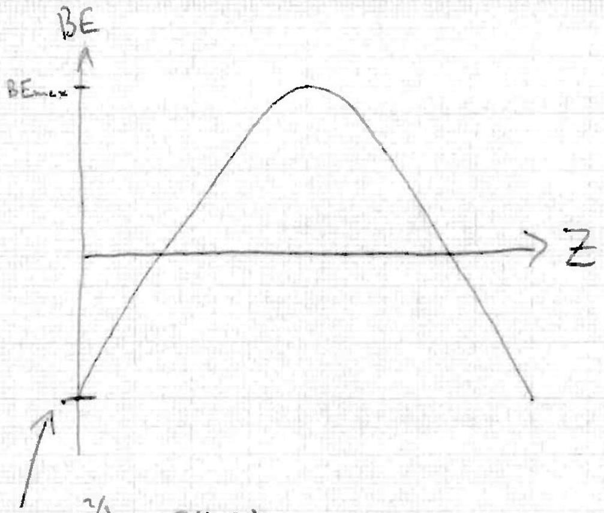

$$
- \left( a _ { 4 } - a _ { 1 } \right) - a _ { 2 } A ^ { 2 / 3 } - a _ { 5 } S ( A , Z )
$$

Rupos at $\frac { \left. - b \pm \sqrt { ( } b ^ { 2 } - 4 a c \right) } { 2 a } = z$ "
Where $b = 4 a _ { 4 } , a = - \left( a _ { 3 } A ^ { 1 / 3 } + 4 a _ { 4 } A ^ { - 1 } \right)$

$$
c = - \left( a _ { 4 } - a _ { 1 } \right) - a _ { 2 } A ^ { 1 / 3 } - a _ { 5 } \delta \left( A _ { 1 } z \right)
$$

The most stable unde: will have the highest BE as they require the most evergy to separate their nuclems from each other. For a given (i.e, constant) mass number, A, therefore need to firl $Z$ controunding to $B E _ { \text {max. } }$ BEmax occurs when

$$
\begin{gathered}
\frac { d B E } { d Z } = 0 \\
\Rightarrow - 2 \left( a _ { 3 } A ^ { 1 / 3 } + 4 a _ { 4 } A ^ { - 1 } \right) Z + 4 a _ { 4 } = 0 \\
\Rightarrow Z = \frac { A } { 2 } \cdot \frac { 1 } { 1 + \frac { a _ { 3 } } { 4 a _ { 4 } } A ^ { 2 / 3 } }
\end{gathered}
$$

$$
\left( \begin{array} { l }
\text { Note: } S ( A , Z ) \text { is } \\
\text { not an explicit finction } \\
\text { of } Z \text { so } \frac { d } { d Z } S ( A , Z ) = 0
\end{array} \right)
$$

Now $\frac { a _ { 3 } } { 4 a _ { 4 } } \approx 0.008 \sim G \left( 10 ^ { - 2 } \right)$

$$
\begin{aligned}
A ^ { 2 / 3 } & \sim O \left( 10 ^ { 0 } \right) \text { if } A \text { is } O ( 10 ) \\
& \sim O ( 10 ) \text { if } A \text { is } O ( 100 ) \\
\therefore \frac { a _ { 3 } A ^ { 2 / 3 } } { 4 a _ { 4 } } & \sim O \left( 10 ^ { - 2 } \right) \text { to } O \left( 10 ^ { - 1 } \right)
\end{aligned}
$$

so $\frac { a _ { 3 } } { 4 a } A ^ { 2 / 3 }$ can be reasonably will triatel as 'small', writainly $< 1$ 2. $\frac { 1 } { 1 + \frac { a _ { 1 } } { 4 a _ { 4 } } A ^ { 2 / 3 } } \approx 1$ in a basic approximation, so $Z \approx \frac { A } { 2 }$

(ii) Birking everygy per undem:
$$
B E = a _ { 1 } - a _ { 2 } A ^ { - 1 / 3 } - a _ { 3 } Z ^ { 2 } A ^ { - 4 / 3 } - a _ { 4 } ( A - 2 Z ) ^ { 2 } A ^ { - 2 } - a _ { 5 } \delta ( A , Z ) A ^ { - 1 }
$$
If $A$ is odd then $S ( A , Z ) = 0$.
As cau be seen from fig, $5 \frac { B E } { A }$ has a maximum as a function of A. With $z = \frac { A } { 2 }$ therefore instimize $\frac { B E } { A }$ w.r.t.A. Mast stable Uniters is at peak of $B E / A$. With $Z = \frac { A } { 2 } , a _ { 4 }$ term varishes so:
$$
\begin{aligned}
& B E = a _ { 1 } - a _ { 2 } A ^ { - 1 / 3 } - \frac { a _ { 3 } } { 4 } A ^ { 2 / 3 } \\
& \frac { d } { d A } \left( \frac { B E } { A } \right) = \frac { 1 } { 3 } a _ { 2 } A ^ { - 4 / 3 } - \frac { 1 } { 6 } a _ { 3 } A ^ { - 1 / 3 } \\
& \text { So } \frac { d } { d A } \left( \frac { B E } { A } \right) = 0 \text { gives } 2 a _ { 2 } - a _ { 3 } A = 0 \quad ( A \neq 0 )
\end{aligned}
$$

so $A = \frac { 2 a _ { 2 } } { a _ { 3 } } = 51.4$
i.e. predicted man number of most stade nucles is about

$$
A \approx 51
$$

N.B. About night given that we how max is around $\mathrm { Fe } - 56$
(c) Analogy of $E = \frac { 3 } { 5 } \frac { Q ^ { 2 } } { 4 \pi \varepsilon _ { 0 } r }$ for graving wall be

$$
E _ { g r a v } = - \frac { 3 } { 5 } \frac { G M ^ { 2 } } { r }
$$

attractive
rather than
repulsive
With $m _ { p } = m _ { n } =$ " $m$ " (as in data sheet at frout), $M = A m$ and $r = r _ { 0 } A ^ { 1 / 3 }$ so

$$
E _ { \text {grav } } = - \frac { 3 } { 5 } \frac { G \mathrm {~m} ^ { 2 } } { r _ { 0 } } A ^ { 5 / 3 } \longrightarrow + \frac { 3 } { 5 } \frac { G \mathrm {~m} ^ { 2 } } { r _ { 0 } } \frac { A ^ { 5 / 3 } } { A } \text { in } \frac { B E } { A }
$$

Continue widn $A$ odd so $\delta ( A , z ) = 0$, a newtrich ster has

$$
\frac { B E } { A } = a _ { 1 } - a _ { 2 } A ^ { - 1 / 3 } - a _ { 4 } + \frac { 3 } { 5 } \frac { C m ^ { 2 } } { r _ { 0 } } A ^ { 2 / 3 }
$$

* Hifference between this and, e.g. use of unified atomic mass unit regigigibe in this basic estimation.

Now: $A \geqslant 1$ So $a _ { 2 }$ term will be regligible.
A nucleus (revitroustor) will just be stable if $B E = 0$ (and hence $B E / A = 0$ )

$$
\begin{aligned}
\Rightarrow A ^ { 2 / 3 } & = \left( a _ { 4 } - a _ { 1 } \right) \times \frac { 5 r _ { 0 } } { 36 - m ^ { 2 } } \\
\Rightarrow A ^ { 2 / 3 } & = ( 23.2 - 15.8 ) \times 10 ^ { 6 } \times 1.6 \times 10 ^ { - 19 } \times \frac { 5 \times 1.2 \times 10 ^ { - 15 } } { 3 \times 6.67 \times 10 ^ { - 11 } \times \left( 1.67 \times 10 ^ { - 27 } \right) ^ { 2 } } \\
\Rightarrow A ^ { 2 / 3 } & = \frac { ( 23.2 - 15.8 ) \times 1.6 \times 1.2 \times 5 } { 3 \times 6.67 \times ( 1.67 ) ^ { 2 } } \times \frac { 10 ^ { 6 } \times 10 ^ { - 19 } \times 10 ^ { - 15 } } { 10 ^ { - 14 } \times \left( 10 ^ { - 27 } \right) ^ { 2 } } \\
& \approx 1.3 \times 10 ^ { 37 } \\
\Rightarrow A & \approx 1.4 \times 10 ^ { 55.5 } \\
A & \approx 4.5 \times 10 ^ { 55 }
\end{aligned}
$$

This leats to $M = A m$

$$
\begin{aligned}
& \approx 7.6 \times 10 ^ { 28 } \mathrm { mg } \\
M & \approx 10 ^ { 29 } \mathrm {~kg}
\end{aligned}
$$

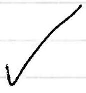

(d) Recall that $Z = \frac { A } { 2 } \frac { 1 } { 1 + \frac { a _ { 3 } } { 4 a _ { 4 } } A ^ { 2 / 3 } } = \frac { A } { 2 } \left( 1 + \frac { a _ { 3 } } { 4 a _ { 4 } } A ^ { 2 / 3 } \right) ^ { - 1 }$
$A$ better approximation of $\left( 1 + \frac { a _ { 3 } } { 4 a _ { 4 } } A ^ { 2 / 3 } \right) ^ { - 1 } \approx 1 - \frac { a _ { 3 } } { 4 a _ { 4 } } A ^ { 2 / 3 }$
so $Z = \frac { A } { 2 } \left( 1 - \frac { a _ { 3 } } { 4 a _ { 4 } } A ^ { 2 / 3 } \right)$

So consivening Aodd again, we would have:

$$
\begin{aligned}
\frac { B E } { A } = & a _ { 1 } - a _ { 2 } A ^ { - 1 / 3 } - a _ { 3 } \cdot \frac { 1 } { 4 } A ^ { 2 } \left( 1 - \frac { a _ { 3 } } { 4 a _ { 4 } } A ^ { 2 / 3 } \right) ^ { 2 } A ^ { - 4 / 3 } \\
& \quad - a _ { 4 } \left( A - A + \frac { a _ { 3 } } { 4 a _ { 4 } } A ^ { 5 / 3 } \right) ^ { 2 } A ^ { - 2 } \\
= & a _ { 1 } - a _ { 2 } A ^ { - 1 / 3 } - \frac { 1 } { 4 } a _ { 3 } A ^ { 2 / 3 } + \frac { 1 } { 16 } \frac { a _ { 3 } ^ { 2 } } { a _ { 4 } } A ^ { 4 / 3 } - \frac { 1 } { 64 } \frac { a _ { 3 } ^ { 3 } } { a _ { 4 } ^ { 2 } } A ^ { 2 }
\end{aligned}
$$

Let $g ( A ) = \frac { B E } { A }$

$$
\begin{aligned}
& \Rightarrow \frac { d g } { d A } = \frac { 1 } { 3 } a _ { 2 } A ^ { - 4 / 3 } - \frac { 1 } { 6 } a _ { 3 } A ^ { - 1 / 3 } + \frac { 1 } { 12 } \frac { a _ { 3 } ^ { 2 } } { a _ { 4 } } A ^ { 1 / 3 } - \frac { 1 } { 32 } \frac { a _ { 3 } ^ { 3 } } { a _ { 4 } ^ { 2 } } A = f ( A ) \\
& \Rightarrow \frac { d ^ { 2 } f } { d A ^ { 2 } } = - \frac { 4 } { 9 } a _ { 2 } A ^ { - 7 / 3 } + \frac { 1 } { 18 } a _ { 3 } A ^ { - 4 / 3 } + \frac { 1 } { 36 } \frac { a _ { 3 } ^ { 2 } } { a _ { 4 } } A ^ { - 2 / 3 } - \frac { 1 } { 32 } \frac { a _ { 3 } ^ { 3 } } { a _ { 4 } ^ { 2 } } = f ^ { \prime } ( A )
\end{aligned}
$$

Noting that $a _ { 1 } = 15.8 \mathrm { MeV }$

$$
\begin{aligned}
& a _ { 2 } = 18.3 \mathrm { MeV } \\
& a _ { 3 } = 0.714 \mathrm { MeV } \\
& \frac { a _ { 3 } ^ { 2 } } { a _ { 4 } } = 0.0220 \mathrm { MeV } \\
& \frac { a _ { 3 } ^ { 3 } } { a _ { 4 } ^ { 2 } } = 6.76 \times 10 ^ { - 4 } \mathrm { MeV }
\end{aligned}
$$

$$
\begin{aligned}
\frac { d ^ { 3 } g } { d A ^ { 3 } } & = \frac { 28 } { 27 } a _ { 2 } A ^ { - 10 / 3 } - \frac { 2 } { 27 } a _ { 3 } ^ { - 7 / 3 } \\
& - \frac { 1 } { 54 } \frac { a _ { 3 } ^ { 2 } } { a _ { 4 } } A ^ { - 5 / 3 } \\
& = f ^ { \prime \prime } ( A )
\end{aligned}
$$

we of Halley's weithod quickly converges on $A = 64$ for $f ( A ) = 0$ for any rearrable starting points

Examples:

| Initial A value | $1 V ^ { \text {ar } }$ iteration | $2 ^ { \text {nd } }$ iteration |
| :--- | :--- | :--- |
| 50 | 64.0 | 64,2 |
| 60 | 64.2 | 64.2 |
| 70 | 64,2 | 64.2 |
| 40 | 63.0 | 64.2 |
| 30 | 60.0 | 64.2 |
| 51 | 64.1 | 64.2 |

For a decent inific value, e.g. $z$ chase + 51, (the fessult of (b)(in)), only I iteration is recessary.
