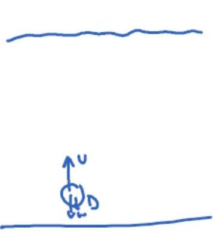
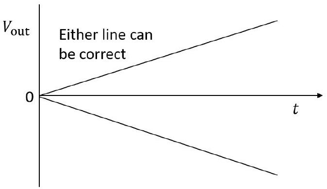

## Question 1

a) This can be done in a descriptive manner. A quantitative calculation is not asked for in the question.
The key points to look for are
    - the bubbles reach a terminal velocity as they rise, so that there is no resultant force.
    - the weight of the gas can be neglected
    - the upthrust is proportional to the volume, $U \propto R ^ { 3 }$
    - The drag non the bubble is proportional to the area $\left( R ^ { 2 } \right)$ and $\propto v$ or $v ^ { 2 }$
    - and hence $v$ or $v ^ { 2 } \propto R$ (so larger bubble rise faster)

An air bubble experiences three by forces:

- Weight $W = p _ { a } V g$
- Upthrest $u = \rho V _ { g }$ (Archimedes principle)
- Dray $D = \frac { 1 } { 2 } C _ { 0 } \rho A _ { v } { } ^ { 2 }$ (assuming inertial dray dominates) over viscoun dry

Since density of air parc $p$, the desisty of fhird, weight negligible.
At terminal velocity $u = D \Rightarrow p V g = \frac { 1 } { 2 } C _ { 0 } p A v ^ { 2 }$
but $\left. V \propto R ^ { 3 } \right\} \Rightarrow V \propto \sqrt { R } \Rightarrow$ lage bubbles cise more quickly because uptimest scales more rapidly with size than does dry. expand as thy cise due to
decreasing ambient pressure with height
This observation does not affect main conclusion above.

b) In these explanations, the observations that are being explained should be included.
    (i) Crystals have grown on the nail. As water vapour from the damp air settles in the morning, it releases a latent heat. this is not easily conducted away by the wood, but the nail will conduct it away and so the crystals grow on the nail. [3]
    (ii) An example of crystal growth. A lot of straight lines with branches coming out. the observation gains one or two marks, But not "theer is ice on the windscreen". [3]

c) $200 ($ peas $) \times 52 \times 2 ($ twice a week $) \times \left( 60 \times 10 ^ { 6 } \right) / 3$ (a third of the population) $= 4 \times 10 ^ { 11 }$ An answer between $5 \times 10 ^ { 10 }$ and $10 ^ { 12 }$ [5]
d) (i) i. A sketch showing the same current flowing from the left of $R _ { \text {in } }$ and through $R _ { \mathrm { f } }$ [51
ii.
$$
\begin{gathered}
V _ { \text {in } } + \frac { V _ { \text {out } } } { A _ { 0 } } = i R _ { \text {in } } \\
- \frac { V _ { \text {out } } } { A _ { 0 } } - V _ { \text {out } } = i R _ { \mathrm { f } }
\end{gathered}
$$
[2]
    iii. Eliminating i
$$
\begin{gathered}
\frac { V _ { \text {in } } } { R _ { \text {in } } } + \frac { V _ { \text {out } } } { R _ { \text {in } } A _ { 0 } } = - \frac { V _ { \text {out } } } { R _ { \mathrm { f } } A _ { 0 } } - \frac { V _ { \text {out } } } { R _ { \mathrm { f } } } \\
V _ { \text {out } } \left( \frac { 1 } { R _ { \mathrm { f } } } + \frac { 1 } { R _ { \mathrm { f } } A _ { 0 } } + \frac { 1 } { A _ { 0 } R _ { \text {in } } } \right) = - \frac { V _ { \text {in } } } { R _ { \text {in } } }
\end{gathered}
$$
For $A \approx 10 ^ { 5 }$,
$$
\frac { V _ { \text {out } } } { V _ { \text {in } } } = A _ { \mathrm { g } } = - \frac { R _ { \mathrm { f } } } { R _ { \text {in } } }
$$
[2]

(ii) The non-inverting amplifier.
In the UK paper, there was a typo and it was stated

$$
v = \frac { V _ { \text {out } } } { A _ { 0 } }
$$

with $V _ { \text {in } }$ missing, instead of the correct

$$
V _ { \text {out } } = A _ { 0 } \left( V _ { \text {in } } - v \right)
$$

They can obtain the current $i$ and relate $v$ and $V _ { \text {out } }$.
But they cannot obtain the gain as $V _ { \text {in } }$ is missing. So you will just have to make a judgement call as to whether they are on the right track and should be given full marks for getting close. This is allowable. There are only one or two marks for getting the extra final part, and they may bring in $V _ { \text {in } }$ themselves.

In the China paper, the correction was made: $V _ { \text {out } } = A _ { 0 } \left( V _ { \text {in } } - v \right)$

i.
$$
i = \frac { V _ { \text {out } } } { R _ { 1 } + R _ { 2 } } \text { and } i = \frac { v } { R _ { 2 } }
$$
[2]

ii. Eliminate $i$,
$$
v = \frac { R _ { 2 } V _ { \text {out } } } { R _ { 1 } + R _ { 2 } }
$$
Given that
$$
V _ { \text {out } } = A _ { 0 } \left( V _ { \text {in } } - v \right)
$$
then
$$
\begin{aligned}
& V _ { \text {out } } = A _ { 0 } \left( V _ { \text {in } } - \frac { R _ { 2 } V _ { \text {out } } } { R _ { 1 } + R _ { 2 } } \right) \\
& V _ { \text {out } } \left( 1 + \frac { R _ { 2 } A _ { 0 } } { R _ { 1 } + R _ { 2 } } \right) = A _ { 0 } V _ { \text {in } } \\
& V _ { \text {out } } \left( \frac { 1 } { A _ { 0 } } + \frac { R _ { 2 } } { R _ { 1 } + R _ { 2 } } \right) = V _ { \text {in } }
\end{aligned}
$$
So using $A _ { 0 } \gg 1$
$$
\begin{equation*}
\frac { V _ { \mathrm { out } } } { V _ { \mathrm { in } } } = A _ { \mathrm { g } } \approx \left( 1 + \frac { R _ { 1 } } { R _ { 2 } } \right) \tag{2}
\end{equation*}
$$
(iii) i.
$$
\begin{gather*}
i = \frac { V _ { \text {in } } } { R _ { \text {in } } } \\
0 - V _ { \text {out } } = \frac { Q } { C } \tag{2}
\end{gather*}
$$
    ii.
$$
- \frac { d V _ { \mathrm { out } } } { d t } = \frac { 1 } { C } \frac { d Q } { d t }
$$
so that
$$
- \frac { d V _ { \mathrm { out } } } { d t } = \frac { i } { C }
$$
Therefore
$$
- \frac { d V _ { \mathrm { out } } } { d t } = \frac { V _ { \mathrm { in } } } { R _ { \mathrm { in } } C }
$$
If $V _ { \text {in } }$ is constant,
$$
\begin{aligned}
\int _ { 0 } ^ { V _ { \text {out } } } d V _ { \text {out } } & = - \frac { V _ { \text {in } } } { R _ { \text {in } } C } \int _ { 0 } ^ { t } d t \\
V _ { \text {out } } & = - \frac { V _ { \text {in } } } { R _ { \text {in } } C } t
\end{aligned}
$$
Sketch gra

