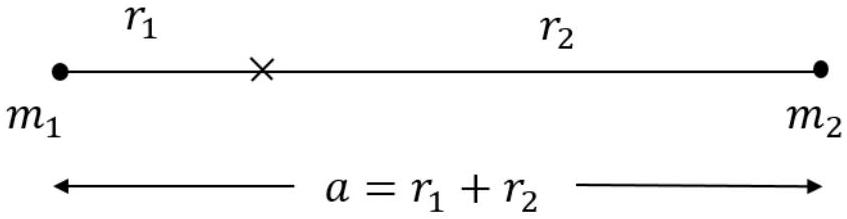
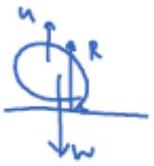
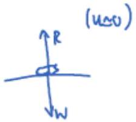
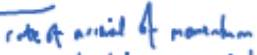

## Question 2 Energy Levels

a) (i) $n \lambda = 2 \pi r \quad$ or $\quad 2 n \cdot \frac { \lambda } { 2 } =$ circumference [1]
    (ii) Newton II
$$
\frac { m v ^ { 2 } } { r } = \frac { 1 } { 4 \pi \epsilon _ { 0 } } \frac { e ^ { 2 } } { r ^ { 2 } }
$$
energy of system
$$
\begin{aligned}
E & = \frac { 1 } { 2 } m v ^ { 2 } - \frac { 1 } { 4 \pi \epsilon _ { 0 } } \frac { e ^ { 2 } } { r } \\
& = - \frac { 1 } { 2 } \frac { 1 } { 4 \pi \epsilon _ { 0 } } \frac { e ^ { 2 } } { r }
\end{aligned}
$$
    (iii) Using
$$
\begin{gathered}
n \lambda = 2 \pi r \\
n \frac { h } { p } = 2 \pi r
\end{gathered}
$$
so that
$$
n \frac { h } { 2 \pi } = r p
$$
Or
$$
n \hbar = r p \text { with the notation } \hbar = \frac { h } { 2 \pi }
$$
[2]
    (iv) Using
$$
\begin{aligned}
& \frac { m v ^ { 2 } } { r } = \frac { 1 } { 4 \pi \epsilon _ { 0 } } \frac { e ^ { 2 } } { r ^ { 2 } } \\
& \frac { p ^ { 2 } r } { m } = \frac { 1 } { 4 \pi \epsilon _ { 0 } } e ^ { 2 }
\end{aligned}
$$
and from $n \hbar = r p$ we can rearrange to form $\frac { n ^ { 2 } \hbar ^ { 2 } } { r } = p ^ { 2 } r$
So that
$$
\frac { n ^ { 2 } \hbar ^ { 2 } } { m r } = \frac { 1 } { 4 \pi \epsilon _ { 0 } } e ^ { 2 }
$$
So
$$
r = \frac { 4 \pi \epsilon _ { 0 } n ^ { 2 } \hbar ^ { 2 } } { m e ^ { 2 } }
$$
and for $n = 1$ we can calculate $r$
$$
\begin{aligned}
r = \frac { \hbar ^ { 2 } } { m \frac { 1 } { 4 \pi \epsilon _ { 0 } } e ^ { 2 } } & = 0.53 \times 10 ^ { - 10 } \mathrm {~m} \\
r & = 5.3 \mathrm {~nm}
\end{aligned}
$$
This is a suitable value. No mark for a comment of this sort - it is to make sure you look at your answer. [3]

(v)
$$
E = - \frac { 1 } { 2 } \frac { 1 } { 4 \pi \epsilon _ { 0 } } \frac { e ^ { 2 } } { r }
$$
and substituting for $r$
$$
E = - \frac { 1 } { 2 } \frac { 1 } { 4 \pi \epsilon _ { 0 } } \frac { m e ^ { 4 } } { \hbar ^ { 2 } n ^ { 2 } }
$$
But we could also take a direct approach to this $n = 1$ energy level
$$
\begin{gathered}
p = \frac { h } { \lambda } \\
E = - \frac { p ^ { 2 } } { 2 m } = - \frac { h ^ { 2 } } { \lambda ^ { 2 } 2 m }
\end{gathered}
$$
and with $n = 1$ we write $\lambda = 2 \pi r$
$$
\begin{gathered}
E = - \frac { h ^ { 2 } } { 4 \pi ^ { 2 } r ^ { 2 } 2 m } \\
E = - \frac { \hbar ^ { 2 } } { 2 m r ^ { 2 } } \\
E = - 13.6 \mathrm { eV }
\end{gathered}
$$
[3]
b) (i) Something like this:

An isolated system, so about the CM,
$$
m _ { 1 } r _ { 1 } = m _ { 2 } r _ { 2 }
$$
and the centripetal force on each is due to electrostatic attraction between $\mathbf { p }$ and $\mathbf { e }$, so
$$
\begin{aligned}
& m _ { 1 } r _ { 1 } \omega ^ { 2 } = \frac { k e ^ { 2 } } { a ^ { 2 } } \\
& m _ { 2 } r _ { 2 } \omega ^ { 2 } = \frac { k e ^ { 2 } } { a ^ { 2 } }
\end{aligned}
$$
which implies the same value of $\omega$. [2]
Using, $m _ { 1 } r _ { 1 } = m _ { 2 } r _ { 2 }$
$$
\begin{gathered}
\frac { m _ { 1 } } { m _ { 2 } } \left( a - r _ { 2 } \right) = r _ { 2 } \\
\frac { m _ { 1 } } { m _ { 2 } } a = r _ { 2 } \left( 1 + \frac { m _ { 1 } } { m _ { 2 } } \right)
\end{gathered}
$$
Hence,
$$
a = r _ { 2 } \left( \frac { m _ { 2 } + m _ { 1 } } { m _ { 1 } } \right)
$$

So,
$$
a = \frac { r _ { 2 } m _ { 2 } } { \mu }
$$
As a result,
$$
\begin{equation*}
\omega ^ { 2 } = \frac { 1 } { 4 \pi \epsilon _ { 0 } } \frac { e ^ { 2 } } { a ^ { 3 } } \frac { m _ { 1 } } { m _ { 2 } } \mu \tag{2}
\end{equation*}
$$
(ii) since we have the angular momentum as $r p$, that is $m r ^ { 2 } \omega$. So
$$
\begin{gathered}
n \hbar = \left( m _ { 1 } r _ { 1 } ^ { 2 } + m _ { 2 } r ^ { 2 } \right) \omega \\
= \left( m _ { 2 } r _ { 2 } \right) \left( r _ { 1 } + r _ { 2 } \right) \omega = m _ { 1 } r _ { 1 } a \omega
\end{gathered}
$$
Then
$$
n \hbar = a \mu \times a \omega = a ^ { 2 } \mu \omega = \mu a ^ { 2 } \omega
$$
As a result
$$
( n \hbar ) ^ { 2 } = \frac { 1 } { 4 \pi \epsilon _ { 0 } } \mu a e ^ { 2 }
$$
which is the same form seen earlier with $m$ replaced by $\mu$ and $r$ replaced by $a$ Hence
$$
E = - \frac { 1 } { 2 } \frac { 1 } { 4 \pi \epsilon _ { 0 } } \frac { \mu e ^ { 4 } } { \hbar ^ { 2 } n ^ { 2 } }
$$
For the hydrogen atom, $\mu \approx m _ { \mathrm { e } }$ so that the $n = 1$ level remains at - 13.6 eV and the $n = 2$ level is - 3.4 eV .
For tritium the energy levels differ by only about 0.02\%,
since (this detail is not required)
$$
\begin{aligned}
\frac { m _ { \mathrm { e } } - \mu } { m _ { \mathrm { e } } } & = 1 - \frac { \mu } { m _ { \mathrm { e } } } \\
& = 1 - \frac { m _ { \mathrm { e } } 3 m _ { \mathrm { p } } } { m _ { \mathrm { e } } \left( m _ { \mathrm { e } } + 3 m _ { \mathrm { p } } \right) } \\
& = 1 - \frac { m _ { \mathrm { e } } 3 m _ { \mathrm { p } } } { \left( m _ { \mathrm { e } } + 3 m _ { \mathrm { p } } \right) } \\
& = 1 - \frac { 3 m _ { \mathrm { p } } } { 3 m _ { \mathrm { p } } \left( 1 + \frac { m _ { \mathrm { e } } } { 3 m _ { \mathrm { p } } } \right) } \\
& \approx 1 - \left( 1 - \frac { m _ { \mathrm { e } } } { 3 m _ { \mathrm { p } } } \right) \\
& = \frac { m _ { \mathrm { e } } } { 3 m _ { \mathrm { p } } } \approx \frac { 1 } { 6000 }
\end{aligned}
$$
(iii) Since $\mu < m _ { \mathrm { e } }$ then the energy levels are of a smaller magnitude,
$$
\begin{aligned}
\mu & = \frac { m _ { \mathrm { e } } 3 m _ { \mathrm { p } } } { m _ { \mathrm { e } } + 3 m _ { \mathrm { p } } } \\
& = \frac { m _ { \mathrm { e } } 3 m _ { \mathrm { p } } } { 3 m _ { \mathrm { p } } \left( 1 + \frac { m _ { \mathrm { e } } } { 3 m _ { \mathrm { p } } } \right) } \\
& \approx m _ { \mathrm { e } } \left( 1 - \frac { m _ { \mathrm { e } } } { 3 m _ { \mathrm { p } } } \right)
\end{aligned}
$$

and so they are closer together for tritium and hence a lower frequency photon will cause a transition and thus a longer wavelength for tritium. Conversely, hydrogen would absorb a shorter wavelength. Comment required, not a guess.

## Question 3 Balloons

a) Balloons

(b) Require, at leat,
$$
m g + W _ { \text {H } } = \underbrace { W _ { \text {air } } }
$$
bellorg wight
$$
\begin{aligned}
\Rightarrow \quad m y & = \left( p _ { 0 i } - p _ { 0 } \right) H _ { y } \\
v & = \frac { m } { p _ { 0 i } - p _ { 1 } }
\end{aligned}
$$
But durity of ideal gas is
But durity of ideal gas is
$$
P = \frac { M _ { r } P } { P ^ { \top } U _ { \text {clor the } } ^ { u } }
$$
$$
\Rightarrow \quad V = \frac { M R T } { p \left( M _ { 1 } ^ { * } - M _ { 1 } ^ { k _ { 2 } } \right) } \simeq \frac { 10 ^ { A } \times 8.31 \times 213 } { 10 ^ { 5 } \left( 29 \times 10 ^ { 6 } - 4 \times 10 ^ { 2 } \right) } \simeq 1.0 \times 10 ^ { - 2 } \mathrm {~m} ^ { 3 }
$$
olorgings
(c) For midel yo:
$$
\begin{aligned}
\frac { 1 } { 2 } M \left\langle v ^ { 2 } \right\rangle & = \frac { 3 } { 2 } k T \\
\Rightarrow \left\langle P ^ { 2 } \right\rangle & = 3 m k T , \quad P _ { m } = \sqrt { \left( P ^ { 2 } \right) } = \sqrt { 3 m k T }
\end{aligned}
$$
Pirubir of goo portide is corbon, so
$$
\begin{gathered}
\left\langle p _ { i } ^ { p } \right\rangle = \left\langle p _ { y } ^ { 2 } \right\rangle = \left\langle p _ { i } ^ { 2 } \right\rangle \quad \text { but } \left( p ^ { 2 } \right\rangle = \left\langle p _ { \lambda } ^ { 2 } + p _ { y } ^ { 2 } + p _ { t } ^ { 2 } \right\rangle = 3 p ^ { 2 } \\
\Rightarrow \quad p ^ { 2 } = \frac { 1 } { 3 } p _ { r m } ^ { 2 } = m k T , \\
p = \sqrt { m k T } .
\end{gathered}
$$
(d) From the diffinition of passone,
$$
\rho A = - P \frac { d N } { d t }
$$
forceon
 Lobaer for arto be are print bank 4 pel shills
$$
\Rightarrow \frac { d N } { \mu } = - \frac { p A } { \sqrt { m k T } }
$$

$$
\Rightarrow \quad \frac { d } { d t } \left( \frac { p V } { k T } \right) = \frac { - p A } { \sqrt { m h T } }
$$

As lokinght, the ballar in prosisther quittitution with abouplere, so $p$ \& $T$ are accordet broylat reflotion:

$$
\frac { p } { h T } \frac { d V } { d t } = - \frac { d A } { \sqrt { m h T } }
$$

lenting

$$
\frac { d V } { d t } = - A \sqrt { \frac { k T } { \sim } }
$$
$\square$

(f) $\ln 1 \mathrm { kw } , \mathrm { s } , \quad v = 0.95 \times 2.0 \times 10 ^ { - 2 } = 1.9 \times 10 ^ { - 2 } \mathrm {~m} ^ { 3 } \Rightarrow \Delta v = - 1.0 \times 10 ^ { - 3 } \mathrm {~m} ^ { 3 }$

$$
\Rightarrow \quad \frac { - 10 ^ { - 3 } } { 3600 } = - A \sqrt { \frac { 8.31 \times 293 } { \sqrt { 4 \times 10 ^ { 2 } } } } \rightarrow \text { roler mentification }
$$

$$
g ^ { \mu } \text { cord. }
$$

$$
\therefore A = 1 \times 10 ^ { - 9 } \mathrm {~m} ^ { 2 }
$$

But, surface are it ballan (intualy) is $4 \pi \left[ \frac { 3 } { 4 \pi } \mathrm {~V} \right] ^ { 2 / 3 } = 0.36 \mathrm {~m} ^ { 2 }$
so $A _ { \text {Lols } } \ll A _ { \text {latines, } }$ wit mote be for onlying abonot to Lud.
(9) If Lok significal bygy we sent have gasi-stanche applibrom. We can logy answer $T , p$ worforen theylent ballea nor thet the agard atemptoric qualitions. would have to accesent for the flow that word devely → fluod dynaid problem.
(h) Now ris conotent bod p will vary antime. we willstill assume effresia is slarenoy that pressis isothermal. The of $20 j$ then inst $\mid G L :$

$$
\frac { d } { d t } \left( \frac { p v } { h T } \right) = - \frac { p a } { \sqrt { m k T } } \Rightarrow \frac { v } { k T } \frac { d y } { d t } = - \frac { p a } { \sqrt { m k } }
$$

50

$$
\frac { 1 } { p } \frac { d p } { d t } = - \frac { a } { v } \sqrt { \frac { h T } { m } } \quad \Rightarrow \quad p = p _ { 0 } \exp \left[ - \frac { a } { v } \sqrt { \frac { k T } { m } } t \right]
$$

So pressure decays expanitienty as particles one lost throf hole.

$$
\left[ \sin \frac { d N } { d t } \alpha - N \right]
$$
