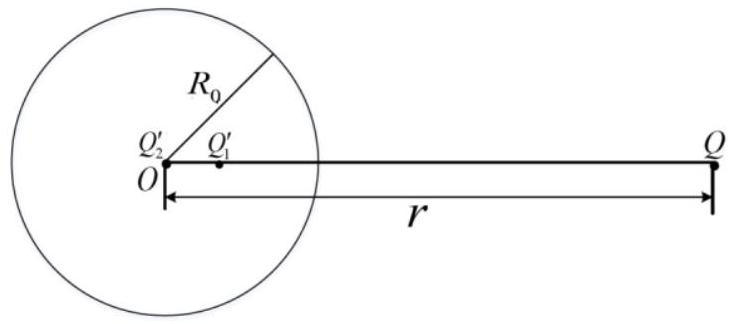
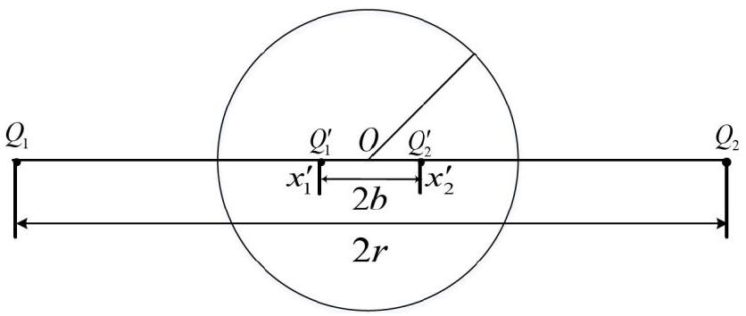
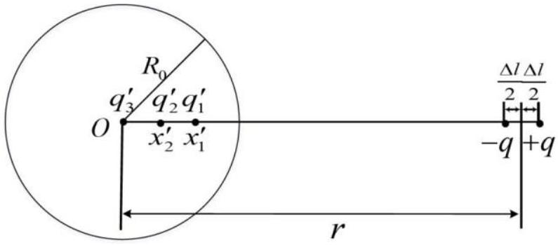
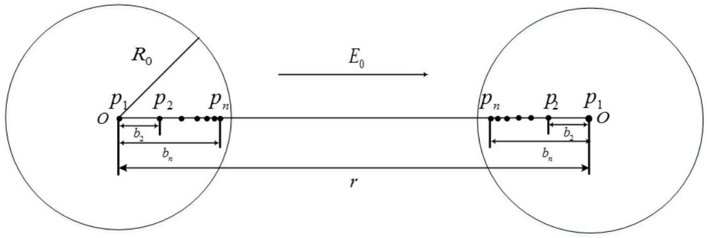
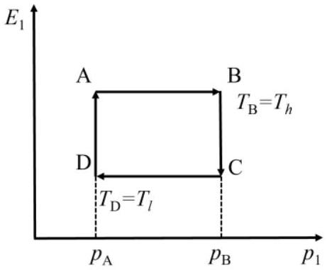
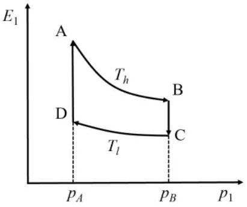
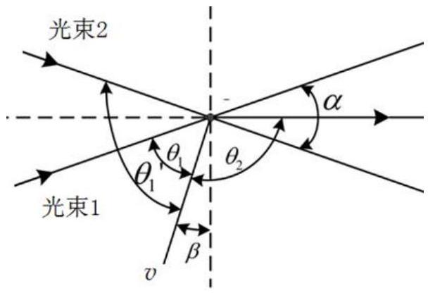
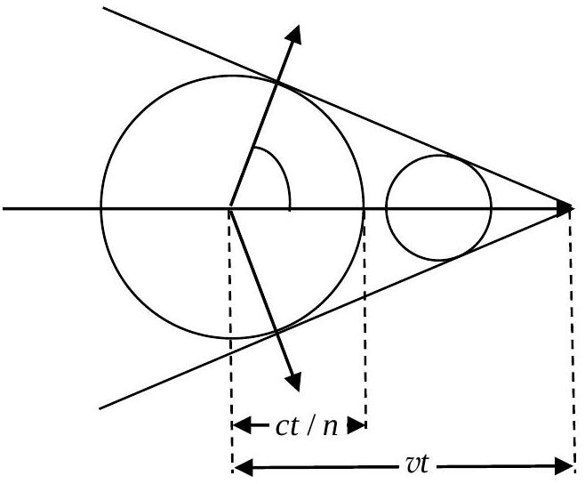

## 第37届全国中学生物理竞赛决赛试题参考答案

一、（1）中子以初速度与静止的靶核发生碰撞，碰撞前瞬间初速度方向与两球球心连线之间的夹角为 $\alpha$ 。在两球心连线和中子初速度方向所决定的平面上，令 $x$ 轴沿两球心连线，中子初速度垂直于连线的方向为 $y$ 轴。设碰撞后中子的速率为 $v$ ，沿着 $x$ 轴方向的速度分量为 $v _ { x }$ ，$y$ 轴方向的速度分量为 $v _ { y }$ ，碰撞后靶核速率为 $v _ { 1 }$ ，碰撞前后沿 $x$ 轴和 $y$ 轴方向的动量分别守恒

$$
\left\{ \begin{array} { l }
m v _ { 0 } \cos \alpha = m v _ { x } + m _ { 1 } v _ { 1 } ,  \tag{1}\\
m v _ { 0 } \sin \alpha = m v _ { y } .
\end{array} \right.
$$

式中

$$
v _ { x } ^ { 2 } + v _ { y } ^ { 2 } = v ^ { 2 }
$$

［
解法（二）
由碰撞前后动量守恒，碰前中子的动量 $m v _ { 0 }$ 、碰后中子的动量$m v$ 和碰后原子核的动量 $m _ { 1 } v _ { 1 }$ 构成一闭合的矢量三角形，如解题图1a 所示。据余弦定理有

$$
\begin{equation*}
m ^ { 2 } v _ { 0 } ^ { 2 } + m _ { 1 } ^ { 2 } v _ { 1 } ^ { 2 } - 2 m m _ { 1 } v _ { 0 } v _ { 1 } \cos \alpha = m ^ { 2 } v ^ { 2 } \tag{1}
\end{equation*}
$$

式中，$\alpha$ 是碰前中子的动量与碰后原子核的动量之间的夹角。］

能量守恒给出

$$
\begin{equation*}
\frac { 1 } { 2 } m v _ { 0 } ^ { 2 } = \frac { 1 } { 2 } m v ^ { 2 } + \frac { 1 } { 2 } m _ { 1 } v _ { 1 } ^ { 2 } \tag{2}
\end{equation*}
$$

由（1）（2）式得

$$
m _ { 1 } v _ { 1 } ^ { 2 } + \frac { m _ { 1 } ^ { 2 } } { m } v _ { 1 } ^ { 2 } - 2 m _ { 1 } v _ { 0 } v _ { 1 } \cos \alpha = 0 ,
$$

由此得

$$
\begin{equation*}
v _ { 1 } = \frac { 2 m \cos \alpha } { m + m _ { 1 } } v _ { 0 } , \tag{3}
\end{equation*}
$$

将（3）式代入（2）式得

$$
\begin{equation*}
v = \frac { \sqrt { \left( m + m _ { 1 } \right) ^ { 2 } - 4 m m _ { 1 } \cos ^ { 2 } \alpha } } { m + m _ { 1 } } v _ { 0 } = \frac { \sqrt { m ^ { 2 } + m _ { 1 } ^ { 2 } - 2 m m _ { 1 } \cos 2 \alpha } } { m + m _ { 1 } } v _ { 0 } \tag{4}
\end{equation*}
$$

由（3）式知，当 $\alpha = 0$ 时 $v _ { 1 }$ 达到最大，

$$
v _ { 1 \max } = \frac { 2 m } { m + m _ { 1 } } v _ { 0 } ,
$$

所以氢核的最大速率是

$$
v _ { \mathrm { H } } = \frac { 2 m } { m + m _ { \mathrm { H } } } v _ { 0 } ,
$$

氮核的最大速率是

$$
v _ { \mathrm { N } } = \frac { 2 m } { m + 14 m _ { \mathrm { H } } } v _ { 0 } ,
$$

由以上两式得

$$
\begin{gather*}
m = \frac { 14 v _ { \mathrm { N } } - v _ { \mathrm { H } } } { v _ { \mathrm { H } } - v _ { \mathrm { N } } } m _ { \mathrm { H } } = \frac { 14 \times 4.7 \times 10 ^ { 6 } - 3.3 \times 10 ^ { 7 } } { 3.3 \times 10 ^ { 7 } - 4.7 \times 10 ^ { 6 } } m _ { \mathrm { H } } = 1.16 m _ { \mathrm { H } } ,  \tag{5}\\
v _ { 0 } = \frac { m + m _ { \mathrm { H } } } { 2 m } v _ { \mathrm { H } } = 3.07 \times 10 ^ { 7 } \mathrm {~m} / \mathrm { s } . \tag{6}
\end{gather*}
$$

（2）速度为 $V _ { i }$ 的氮14核继续与速度为 $v _ { 0 }$ 的第 $i$ 个中子碰撞，在每次碰撞后获得最大速率增量条件下，氮14核的速度变为 $V _ { i + 1 }$ ，中子的末速度为 $v _ { 0 } ^ { \prime }$ ，由动量守恒和能量守恒有

$$
\left\{ \begin{array} { l }
m v _ { 0 } + m _ { \mathrm { N } } V _ { i } = m v _ { 0 } ^ { \prime } + m _ { \mathrm { N } } V _ { i + 1 } ,  \tag{7}\\
\frac { 1 } { 2 } m v _ { 0 } ^ { 2 } + \frac { 1 } { 2 } m _ { \mathrm { N } } V _ { i } ^ { 2 } = \frac { 1 } { 2 } m v _ { 0 } ^ { \prime 2 } + \frac { 1 } { 2 } m _ { \mathrm { N } } V _ { i + 1 } ^ { 2 }
\end{array} \right.
$$

由（7）式得

$$
\begin{equation*}
\frac { V _ { i } } { v _ { 0 } } = 1 - a + a \frac { V _ { i - 1 } } { v _ { 0 } } \tag{8}
\end{equation*}
$$

式中

$$
\begin{equation*}
a = \frac { m _ { \mathrm { N } } - m } { m _ { \mathrm { N } } + m } = 0.847 \tag{9}
\end{equation*}
$$

按（8）式逐次迭代得

$$
\begin{align*}
\frac { V _ { n } } { v _ { 0 } } & = 1 - a + a \frac { V _ { n - 1 } } { v _ { 0 } } = 1 - a + a \left( 1 - a + a \frac { V _ { n - 2 } } { v _ { 0 } } \right) = 1 - a ^ { 2 } + a ^ { 2 } \frac { V _ { n - 2 } } { v _ { 0 } }  \tag{10}\\
& = 1 - a ^ { 3 } + a ^ { 3 } \frac { V _ { n - 3 } } { v _ { 0 } } = \cdots = 1 - a ^ { n } + a ^ { n } \frac { V _ { 0 } } { v _ { 0 } } = 1 - a ^ { n }
\end{align*}
$$

这里，应用了题给条件

$$
V _ { 0 } = 0
$$

所求的次数 $n$ 满足

$$
\frac { 1 } { 2 } m _ { \mathrm { N } } V _ { n } ^ { 2 } = \frac { 1 } { 2 } \times 1.16 m _ { \mathrm { H } } v _ { 0 } ^ { 2 }
$$

即是

$$
\begin{equation*}
\frac { 1 } { 2 } 14 m _ { \mathrm { H } } \left( 1 - a ^ { n } \right) ^ { 2 } v _ { 0 } ^ { 2 } = \frac { 1 } { 2 } \times 1.16 m _ { \mathrm { H } } v _ { 0 } ^ { 2 } , \tag{11}
\end{equation*}
$$

由（9）（11）式得，满足方程的最接近的值是

$$
\begin{equation*}
n = 2 . \tag{12}
\end{equation*}
$$

（3）根据麦克斯韦速率分布

$$
f ( v ) = 4 \pi \left( \frac { m } { 2 \pi k T } \right) ^ { 3 / 2 } \mathrm { e } ^ { - \frac { m v ^ { 2 } } { 2 k _ { \mathrm { B } } T } } v ^ { 2 }
$$

速率取极大值的条件是

$$
\frac { \mathrm { d } f ( v ) } { \mathrm { d } v } = 0 ,
$$

可知最概然速率为

$$
\begin{equation*}
v _ { \mathrm { p } } = \sqrt { \frac { 2 k _ { \mathrm { B } } T } { m } } \tag{13}
\end{equation*}
$$

最概然速率对应的动能为

$$
\begin{equation*}
E _ { \mathrm { p } } = \frac { 1 } { 2 } m v _ { \mathrm { p } } ^ { 2 } = k _ { \mathrm { B } } T . \tag{14}
\end{equation*}
$$

设总粒子数为 N ，由动能分布函数定义可知为

$$
\begin{equation*}
f \left( E _ { \mathrm { k } } \right) = \frac { \mathrm { d } N } { N \mathrm {~d} E _ { \mathrm { k } } } \tag{15}
\end{equation*}
$$

由速率分布函数的定义可知

$$
f ( v ) = \frac { \mathrm { d } N } { N \mathrm {~d} v }
$$

而

$$
\mathrm { d } v = \frac { \mathrm { d } E _ { \mathrm { k } } } { \sqrt { 2 m E _ { \mathrm { k } } } }
$$

所以

$$
f \left( E _ { \mathrm { k } } \right) = \frac { \mathrm { d } N } { N \mathrm {~d} E _ { \mathrm { k } } } = \frac { 1 } { \sqrt { 2 m E _ { \mathrm { k } } } } f \left( \sqrt { \frac { 2 E _ { \mathrm { k } } } { m } } \right)
$$

联立上述各式得

$$
\begin{equation*}
f \left( E _ { \mathrm { k } } \right) = \frac { 2 \pi } { \left( \pi k _ { \mathrm { B } } T \right) ^ { 3 / 2 } } \mathrm { e } ^ { - \frac { E _ { \mathrm { k } } } { k _ { \mathrm { B } } T } } E _ { \mathrm { k } } ^ { 1 / 2 } \tag{16}
\end{equation*}
$$

动能取极大值的条件为 $\frac { \mathrm { d } f \left( E _ { \mathrm { k } } \right) } { \mathrm { d } E _ { \mathrm { k } } } = 0$ ，由此可知最概然动能为

$$
\begin{equation*}
E _ { \mathrm { kp } } = \frac { 1 } { 2 } k _ { \mathrm { B } } T = \frac { 1 } { 2 } E _ { \mathrm { p } } . \tag{17}
\end{equation*}
$$

二、（1）如解题图2a所示，取球心为原点，过球心和球外点电荷所在处的直线为 $X$ 轴（下同），导体球外点电荷 $Q$ 位于 $x = r \left( r > R _ { 0 } \right)$ ，导体球外电荷及其像电荷位于 $X$轴上（下同）。由接地导体球的球面电像公式知，点电荷 $Q$ 的镜像电荷 $Q _ { 1 } ^ { \prime }$ 的大小和位置

解题图 2a

分别为

$$
\begin{equation*}
Q _ { 1 } ^ { \prime } = - \frac { R _ { 0 } } { r } Q , x ^ { \prime } = \frac { R _ { 0 } ^ { 2 } } { r } \tag{1}
\end{equation*}
$$

由于不接地的导体球上电荷守恒以及导体球的外表面等势，在球心处还存在另一像电荷 $Q _ { 2 } ^ { \prime }$ ，其大小和位置为

$$
\begin{equation*}
Q _ { 2 } ^ { \prime } = - Q _ { 1 } ^ { \prime } = \frac { R _ { 0 } } { r } Q , x _ { 2 } ^ { \prime } = 0 \tag{2}
\end{equation*}
$$

导体球内、外的像电荷（包括像电偶极距）大小及其位置的坐标分别用打撇、不打撇加以区分（下同，特别声明的除外）。
（2）设在 $X$ 轴上有等量异号点电荷 $Q _ { 1 } = Q ( Q > 0 )$ 和 $Q _ { 2 } = - Q$ ，与金属球（导体球）球心 O 的距离均为 $r$（ $r > R _ { 0 }$ ），如解题图2b所示。由球面电像公式可知，$Q _ { 1 }$ 和 $Q _ { 2 }$ 的镜像电荷 $Q _ { 1 } ^ { \prime }$ 和 $Q _ { 2 } ^ { \prime }$ 的大小和在的位置分别为

$$
\left\{ \begin{array} { l }
Q _ { 1 } ^ { \prime } = - \frac { R _ { 0 } } { r } Q _ { 1 } = - \frac { R _ { 0 } } { r } Q , x _ { 1 } ^ { \prime } = - b \equiv - \frac { R _ { 0 } ^ { 2 } } { r } ; \\
Q _ { 2 } ^ { \prime } = - \frac { R _ { 0 } } { r } Q _ { 2 } = \frac { R _ { 0 } } { r } Q , \quad x _ { 2 } ^ { \prime } = b \equiv \frac { R _ { 0 } ^ { 2 } } { r } .
\end{array} \right.
$$

像电荷 $Q _ { 1 } ^ { \prime }$ 和 $Q _ { 2 } ^ { \prime }$ 之和等于零，已保持导体球为电中性。当 $r \rightarrow \infty$ 时，$b \rightarrow 0$ ；一对像电荷 $Q _ { 1 } ^ { \prime }$ 和 $Q _ { 2 } ^ { \prime }$ 可视为一位于球心 $O$ 的点电偶极子，其偶极矩 $p ^ { \prime }$ 的大小为

解题图2b

$$
\begin{equation*}
p ^ { \prime } = Q _ { 2 } ^ { \prime } \left( x _ { 2 } ^ { \prime } - x _ { 1 } ^ { \prime } \right) = 2 Q _ { 1 } ^ { \prime } b = 2 \frac { R _ { 0 } ^ { 3 } } { r ^ { 2 } } Q \tag{2}
\end{equation*}
$$

匀强外电场 $E _ { 0 }$ 可视为等量异号点电荷 $\pm Q$ 在其连线中点处产生的电场，有

$$
\begin{equation*}
E _ { 0 } = 2 \frac { 1 } { 4 \pi \varepsilon _ { 0 } } \frac { Q } { r ^ { 2 } } \tag{3}
\end{equation*}
$$

由此可得

$$
\begin{equation*}
p ^ { \prime } = 4 \pi \varepsilon _ { 0 } E _ { 0 } R _ { 0 } ^ { 3 } \tag{4}
\end{equation*}
$$

（3）由题设，球外点电荷 $q _ { 1 } = - q ( q > 0 )$ 和 $q _ { 2 } = q$ 分别位于 $x _ { 1 } = r - \frac { \Delta l } { 2 }$ 和 $x _ { 2 } = r + \frac { \Delta l } { 2 }$ ，如解题图2c所示。由①式知，$q _ { 1 }$ 和 $q _ { 2 }$ 的像电荷 $q _ { 1 } ^ { \prime }$ 和 $q _ { 2 } ^ { \prime }$ 的大小和位置分别为

$$
\begin{align*}
& q _ { 1 } ^ { \prime } = \frac { q R _ { 0 } } { r - \frac { \Delta l } { 2 } } > 0 , x _ { 1 } ^ { \prime } = \frac { R _ { 0 } ^ { 2 } } { r - \frac { \Delta l } { 2 } }  \tag{5}\\
& q _ { 2 } ^ { \prime } = - \frac { q R _ { 0 } } { r + \frac { \Delta l } { 2 } } < 0 , x _ { 2 } ^ { \prime } = \frac { R _ { 0 } ^ { 2 } } { r + \frac { \Delta l } { 2 } } \tag{6}
\end{align*}
$$

由于导体球上电荷守恒和导体球的外表面等势，在球心处还存在另一像电荷 $Q ^ { \prime }$ ，其大小和位置分别为 $p _ { 2 } = \frac { R _ { 0 } ^ { 3 } } { r _ { 1 } ^ { 3 } } p _ { 1 } , b _ { 2 } = \frac { R _ { 0 } ^ { 2 } } { r _ { 1 } } , r _ { 2 } = r - b _ { 2 } ; Q _ { 1 } = - q _ { 1 } ^ { ( 2 ) } < 0 , q _ { 1 } ^ { ( 2 ) } = \frac { R _ { 0 } } { r _ { 1 } ^ { 2 } } p _ { 1 } > 0$

$$
\begin{equation*}
Q ^ { \prime } = - \left( q _ { 1 } ^ { \prime } + q _ { 2 } ^ { \prime } \right) = - \left( \frac { q R _ { 0 } } { r - \frac { \Delta l } { 2 } } + \frac { - q R _ { 0 } } { r + \frac { \Delta l } { 2 } } \right) = - \frac { R _ { 0 } q \Delta l } { r ^ { 2 } - \left( \frac { \Delta l } { 2 } \right) ^ { 2 } } = - \frac { R _ { 0 } } { r ^ { 2 } } q \Delta l < 0 , \quad x _ { 3 } ^ { \prime } = 0 \tag{7}
\end{equation*}
$$

这里，已利用条件 $\Delta l \ll r$（下同）。
$q _ { 1 } ^ { \prime }$ 和 $q _ { 2 } ^ { \prime }$ 组成的像电荷体系可视为位于

$$
x _ { 0 } ^ { \prime } = b \equiv \frac { R _ { 0 } ^ { 2 } } { r }
$$

点 的 像 点 电 荷，电 荷 量 为

解题图 2c

$$
\begin{aligned}
& - Q ^ { \prime } = q _ { 1 } ^ { \prime } + q _ { 2 } ^ { \prime } = \frac { q R _ { 0 } } { r - \frac { \Delta l } { 2 } } + \frac { - q R _ { 0 } } { r + \frac { \Delta l } { 2 } } \\
& \quad = \frac { R _ { 0 } } { r ^ { 2 } } q \Delta l = - q _ { 3 } ^ { \prime } > 0
\end{aligned}
$$

和一个像点电偶极子，电偶极距大小为

$$
\begin{aligned}
p ^ { \prime } & = q _ { 1 } ^ { \prime } \left( x _ { 1 } ^ { \prime } - x _ { 0 } ^ { \prime } \right) + q _ { 2 } ^ { \prime } \left( x _ { 2 } ^ { \prime } - x _ { 0 } ^ { \prime } \right) \\
& = \frac { R _ { 0 } ^ { 3 } } { r ^ { 2 } } \frac { q } { 1 - \frac { \Delta l } { 2 r } } \left[ \left( \frac { 1 } { 1 - \frac { \Delta l } { 2 r } } - 1 \right) - \left( \frac { 1 } { 1 + \frac { \Delta l } { 2 r } } - 1 \right) \right] = \frac { R _ { 0 } ^ { 3 } } { r ^ { 3 } } q \Delta l
\end{aligned}
$$

方向沿 $X$ 轴正向，即与球外电偶极距的方向相同。
此外，一对点电荷 $Q ^ { \prime } < 0 、 - Q ^ { \prime } > 0$ 体系具有不为零的点电偶极距（以及高阶距），电偶极距的大小为

$$
p ^ { \prime \prime } = \left( - Q ^ { \prime } \right) \left( x _ { 0 } ^ { \prime } - 0 \right) = \frac { R _ { 0 } } { r ^ { 2 } } q \Delta l \frac { R _ { 0 } ^ { 2 } } { r } = \frac { R _ { 0 } ^ { 3 } } { r ^ { 3 } } q \Delta l
$$

方向沿 $X$ 轴正向，即与球外电偶极距的方向相同。
合起来，球外偶极子的镜像电偶极距的大小为

$$
\begin{equation*}
p _ { \text {总 } } ^ { \prime } = p ^ { \prime } + p ^ { \prime \prime } = 2 \frac { R _ { 0 } ^ { 3 } } { r ^ { 3 } } q \Delta l \tag{8}
\end{equation*}
$$

方向沿 $X$ 轴正向，即与球外电偶极距的方向相同。
［解法（二）
设球外的电偶极子是点电荷

$$
\begin{aligned}
& q _ { 1 } = - q ( q > 0 ) \text { 位于 } x _ { 1 } = r - \frac { \Delta l } { 2 } \text { 和 } \\
& q _ { 2 } = q \text { 位于 } x _ { 2 } = r + \frac { \Delta l } { 2 } , \text { 那么 } q _ { 1 } \text { 有两个 }
\end{aligned}
$$

像电荷，分别是

$$
\begin{align*}
& q _ { 1 } ^ { \prime } = \frac { q R _ { 0 } } { r - \frac { \Delta l } { 2 } } ( > 0 ) , x _ { 1 } ^ { \prime } = \frac { R _ { 0 } ^ { 2 } } { r - \frac { \Delta l } { 2 } } ;  \tag{5}\\
& q _ { 1 } ^ { \prime \prime } = - \frac { q R _ { 0 } } { r - \frac { \Delta l } { 2 } } ( < 0 ) , x _ { 1 } ^ { \prime \prime } = 0 .
\end{align*}
$$

同理，$q _ { 2 }$ 也有两个像电荷，分别是

$$
\begin{align*}
& q _ { 2 } ^ { \prime } = - \frac { q R _ { 0 } } { r + \frac { \Delta l } { 2 } } ( < 0 ) , x _ { 2 } ^ { \prime } = \frac { R _ { 0 } ^ { 2 } } { r + \frac { \Delta l } { 2 } } ;  \tag{6}\\
& q _ { 2 } ^ { \prime \prime } = \frac { q R _ { 0 } } { r + \frac { \Delta l } { 2 } } ( > 0 ) , x _ { 2 } ^ { \prime \prime } = 0 .
\end{align*}
$$

球外的电偶极子及其像电荷如解题图2d所示。
四个像电荷 $q _ { 1 } ^ { \prime } , q _ { 1 } ^ { \prime \prime } , q _ { 2 } ^ { \prime } , q _ { 2 } ^ { \prime \prime }$ 构成的电荷系统的总电偶极矩为

$$
\begin{equation*}
p _ { \text {总 } } ^ { \prime } = q _ { 1 } ^ { \prime } x _ { 1 } ^ { \prime } + q _ { 1 } ^ { \prime \prime } x _ { 1 } ^ { \prime \prime } + q _ { 2 } ^ { \prime } x _ { 2 } ^ { \prime } + q _ { 2 } ^ { \prime \prime } x _ { 2 } ^ { \prime \prime } \tag{7}
\end{equation*}
$$

即

$$
\begin{equation*}
p _ { \text {总 } } ^ { \prime } = \frac { q R _ { 0 } ^ { 3 } } { [ r - ( \Delta l / 2 ) ] ^ { 2 } } - \frac { q R _ { 0 } ^ { 3 } } { [ r + ( \Delta l / 2 ) ] ^ { 2 } } = 2 \frac { R _ { 0 } ^ { 3 } } { r ^ { 3 } } q \Delta l \tag{8}
\end{equation*}
$$

其方向与球外电偶极距的方向相同。
］
（4）此后，对于导体球内的像电荷（包括像电偶极距）大小及其位置的坐标取消打撇的标志。如图所示，当空间电场方向有两个相同导体球时，在恒外电场作用下，在两球心位置处产生一对点电偶极子

$$
\begin{equation*}
p _ { 1 } = 4 \pi \varepsilon _ { 0 } E _ { 0 } R _ { 0 } ^ { 3 } \tag{9}
\end{equation*}
$$

这一对像偶极子又会产生次级电偶极子 $p _ { 2 }$ 以及位于电偶极子 $p _ { 2 }$ 处和球心的一对等量正反点电荷，接着产生 $p _ { 3 } , p _ { 4 } , \cdots$ 与隔开的等量正反点电荷的镜像电荷（孤立点电荷），如此无穷地镜像映射下去（见解题图2e，其中孤立的镜像点电荷未画出）。由第（3）问分析知，各对点电偶极子的偶极矩和该偶极子所在位置到两球心的距离、以及孤立点电荷的大小依次为

解题图 2e

$$
\begin{align*}
& \quad p _ { 1 } = 4 \pi \varepsilon _ { 0 } E _ { 0 } R _ { 0 } ^ { 3 } , b _ { 1 } = 0 , r _ { 1 } = r - b _ { 1 } = r  \tag{10}\\
& p _ { 2 } = \frac { R _ { 0 } ^ { 3 } } { r _ { 1 } ^ { 3 } } p _ { 1 } , b _ { 2 } = \frac { R _ { 0 } ^ { 2 } } { r _ { 1 } } , r _ { 2 } = r - b _ { 2 } ; Q _ { 1 } = - q _ { 1 } ^ { ( 2 ) } < 0 , q _ { 1 } ^ { ( 2 ) } = \frac { R _ { 0 } } { r _ { 1 } ^ { 2 } } p _ { 1 } > 0  \tag{11}\\
& p _ { 3 } = \frac { R _ { 0 } ^ { 3 } } { r _ { 2 } ^ { 3 } } p _ { 2 } , b _ { 3 } = \frac { R _ { 0 } ^ { 2 } } { r _ { 2 } } , r _ { 3 } = r - b _ { 3 } ;  \tag{12}\\
& Q _ { 2 } = - \left( q _ { 2 } ^ { ( 2 ) } + q _ { 2 } ^ { ( 3 ) } \right) , q _ { 2 } ^ { ( 2 ) } = \frac { R _ { 0 } } { r _ { 2 } } Q _ { 1 } < 0 , q _ { 2 } ^ { ( 3 ) } = \frac { R _ { 0 } } { r _ { 2 } } \left( \frac { p _ { 2 } } { r _ { 2 } } + q _ { 1 } ^ { ( 2 ) } \right) > 0 \\
& p _ { 4 } = \frac { R _ { 0 } ^ { 3 } } { r _ { 3 } ^ { 3 } } p _ { 3 } , b _ { 4 } = \frac { R _ { 0 } ^ { 2 } } { r _ { 3 } } , r _ { 4 } = r - b _ { 4 } ; \\
& Q _ { 3 } = - \left( q _ { 3 } ^ { ( 2 ) } + q _ { 3 } ^ { ( 3 ) } + q _ { 3 } ^ { ( 4 ) } \right) , q _ { 3 } ^ { ( 2 ) } = \frac { R _ { 0 } } { r _ { 2 } } Q _ { 2 } , q _ { 3 } ^ { ( 3 ) } = \frac { R _ { 0 } } { r _ { 3 } } q _ { 2 } ^ { ( 2 ) } , q _ { 3 } ^ { ( 4 ) } = \frac { R _ { 0 } } { r _ { 3 } } \left( \frac { p _ { 3 } } { r _ { 3 } } + q _ { 2 } ^ { ( 3 ) } \right) > 0
\end{align*}
$$

$$
\begin{align*}
& p _ { n } = \frac { R _ { 0 } ^ { 3 } } { r _ { n - 1 } ^ { 3 } } p _ { n - 1 } , b _ { n } = \frac { R _ { 0 } ^ { 2 } } { r _ { n - 1 } } , r _ { n } = r - b _ { n } ; \\
& Q _ { n - 1 } = - \sum _ { i = 2 } ^ { n } q _ { n - 1 } ^ { ( i ) } , q _ { n - 1 } ^ { ( 2 ) } = \frac { R _ { 0 } } { r _ { 2 } } Q _ { n - 2 } < 0 , q _ { n - 1 } ^ { ( 3 ) } = \frac { R _ { 0 } } { r _ { 3 } } q _ { n - 2 } ^ { ( 2 ) } < 0 , \cdots , q _ { n - 1 } ^ { ( n - 1 ) } = \frac { R _ { 0 } } { r _ { n - 2 } } q _ { n - 2 } ^ { ( n - 2 ) } < 0 , q _ { n - 1 } ^ { ( n ) } = \frac { R _ { 0 } } { r _ { n - 1 } } \left( \frac { p _ { n - 1 } } { r _ { n - 1 } } + q _ { n - 2 } ^ { ( n - 1 ) } \right) > 0 \tag{13}
\end{align*}
$$

位于球心的补赏电荷（以保证导体球电中性以及球的外表面等势）。
位于 $\boldsymbol { b } _ { 0 }$ 、电偶极距为 $\boldsymbol { p }$ 的电偶极子的电势为

$$
\varphi ( \boldsymbol { r } ) = \frac { \boldsymbol { p } \cdot \left( \boldsymbol { r } - \boldsymbol { b } _ { 0 } \right) } { 4 \pi \varepsilon _ { 0 } \left| \boldsymbol { r } - \boldsymbol { b } _ { 0 } \right| ^ { 3 } }
$$

取两球连线的中点为坐标原点，$x$ 轴水平向右，坐标原点为电势零点，则在球外空间任一点$P ( x , y )$ 处的电势为

$$
\begin{align*}
\varphi ( x , y ) = & - E _ { 0 } x + \sum _ { n = 1 } ^ { \infty } \frac { \left( x + \frac { r } { 2 } - b _ { n } \right) p _ { n } } { 4 \pi \varepsilon _ { 0 } \left[ \left( x + \frac { r } { 2 } - b _ { n } \right) ^ { 2 } + y ^ { 2 } \right] ^ { \frac { 3 } { 2 } } } + \sum _ { n = 1 } ^ { \infty } \frac { \left( x - \frac { r } { 2 } + b _ { n } \right) p _ { n } } { 4 \pi \varepsilon _ { 0 } \left[ \left( x - \frac { r } { 2 } + b _ { n } \right) ^ { 2 } + y ^ { 2 } \right] ^ { \frac { 3 } { 2 } } } \\
& + \sum _ { n = 2 } ^ { \infty } \sum _ { i = 2 } ^ { n } \frac { q _ { n - 1 } ^ { ( i ) } } { 4 \pi \varepsilon _ { 0 } \left[ \left( x + \frac { r } { 2 } - b _ { i } \right) ^ { 2 } + y ^ { 2 } \right] ^ { \frac { 1 } { 2 } } } + \sum _ { n = 2 } ^ { \infty } \frac { Q _ { n - 1 } } { 4 \pi \varepsilon _ { 0 } \left[ \left( x + \frac { r } { 2 } \right) ^ { 2 } + y ^ { 2 } \right] ^ { \frac { 1 } { 2 } } }  \tag{14}\\
& + \sum _ { n = 2 } ^ { \infty } \sum _ { i = 2 } ^ { n } \frac { q _ { n - 1 } ^ { ( i ) } } { 4 \pi \varepsilon _ { 0 } \left[ \left( x - \frac { r } { 2 } + b _ { i } \right) ^ { 2 } + y ^ { 2 } \right] ^ { \frac { 1 } { 2 } } } + \sum _ { n = 2 } ^ { \infty } \frac { Q _ { n - 1 } } { 4 \pi \varepsilon _ { 0 } \left[ \left( x - \frac { r } { 2 } \right) ^ { 2 } + y ^ { 2 } \right] ^ { \frac { 1 } { 2 } } }
\end{align*}
$$

当 $y = 0$ 时，两球心连线上（球外）的电势分布为

$$
\begin{align*}
\varphi ( x , y = 0 ) = & - E _ { 0 } x + \sum _ { n = 1 } ^ { \infty } \frac { \left( x + \frac { r } { 2 } - b _ { n } \right) p _ { n } } { 4 \pi \varepsilon _ { 0 } \left| x + \frac { r } { 2 } - b _ { n } \right| ^ { 3 } } + \sum _ { n = 1 } ^ { \infty } \frac { \left( x - \frac { r } { 2 } + b _ { n } \right) p _ { n } } { 4 \pi \varepsilon _ { 0 } \left| x - \frac { r } { 2 } + b _ { n } \right| ^ { 3 } } \\
& + \sum _ { n = 2 } ^ { \infty } \sum _ { i = 2 } ^ { n } \frac { q _ { n - 1 } ^ { ( i ) } } { 4 \pi \varepsilon _ { 0 } \left| x + \frac { r } { 2 } - b _ { i } \right| } + \sum _ { n = 2 } ^ { \infty } \frac { Q _ { n - 1 } } { 4 \pi \varepsilon _ { 0 } \left| x - \frac { r } { 2 } \right| }  \tag{15}\\
& + \sum _ { n = 2 } ^ { \infty } \sum _ { i = 2 } ^ { n } \frac { q _ { n - 1 } ^ { ( i ) } } { 4 \pi \varepsilon _ { 0 } \left| x + \frac { r } { 2 } - b _ { i } \right| } + \sum _ { n = 2 } ^ { \infty } \frac { Q _ { n - 1 } } { 4 \pi \varepsilon _ { 0 } \left| x - \frac { r } { 2 } \right| }
\end{align*}
$$

两球心连线上（球外）的场强分布为

$$
\begin{align*}
E ( x , y = 0 ) = & - \frac { \mathrm { d } } { \mathrm {~d} x } \varphi ( x , y = 0 ) = E _ { 0 } + \sum _ { n = 1 } ^ { \infty } \frac { p _ { n } } { 2 \pi \varepsilon _ { 0 } \left| x + \frac { r } { 2 } - b _ { n } \right| ^ { 3 } } + \sum _ { n = 1 } ^ { \infty } \frac { p _ { n } } { 2 \pi \varepsilon _ { 0 } \left| x - \frac { r } { 2 } + b _ { n } \right| ^ { 3 } } \\
& + \sum _ { n = 2 } ^ { \infty } \sum _ { i = 2 } ^ { n } \frac { q _ { n - 1 } ^ { ( i ) } } { 4 \pi \varepsilon _ { 0 } \left| x + \frac { r } { 2 } - b _ { i } \right| ^ { 2 } } + \sum _ { n = 2 } ^ { \infty } \frac { Q _ { n - 1 } } { 4 \pi \varepsilon _ { 0 } \left| x - \frac { r } { 2 } \right| ^ { 2 } }  \tag{16}\\
& + \sum _ { n = 2 } ^ { \infty } \sum _ { i = 2 } ^ { n } \frac { q _ { n - 1 } ^ { ( i ) } } { 4 \pi \varepsilon _ { 0 } \left| x + \frac { r } { 2 } - b _ { i } \right| ^ { 2 } } + \sum _ { n = 2 } ^ { \infty } \frac { Q _ { n - 1 } } { 4 \pi \varepsilon _ { 0 } \left| x - \frac { r } { 2 } \right| ^ { 2 } }
\end{align*}
$$

式中，像电荷构成的电偶极子的方向与导体球外的外加匀强电场的方向相同。
（5）设 $r \rightarrow 2 R _ { 0 }$ 并保持两球相互绝缘。由（10）（11）（12）式可知

$$
\begin{equation*}
p _ { 2 } = \left( \frac { 1 } { 2 } \right) ^ { 3 } p _ { 1 } , \quad b _ { 2 } = \frac { 1 } { 2 } R _ { 0 } , \quad r _ { 2 } = \frac { 3 } { 2 } R _ { 0 } \tag{17}
\end{equation*}
$$

$$
\begin{equation*}
p _ { 3 } = \left( \frac { 2 } { 3 } \right) ^ { 3 } \left( \frac { 1 } { 2 } \right) ^ { 3 } p _ { 1 } = \left( \frac { 1 } { 3 } \right) ^ { 3 } p _ { 1 } , \quad b _ { 3 } = \frac { 2 } { 3 } R _ { 0 } , \quad r _ { 3 } = \frac { 4 } { 3 } R _ { 0 } \tag{18}
\end{equation*}
$$

⋮

$$
\begin{equation*}
p _ { n } = \left( \frac { 1 } { n } \right) ^ { 3 } p _ { 1 } , \quad b _ { n } = \frac { n - 1 } { n } R _ { 0 } , \quad r _ { n } = \frac { n + 1 } { n } R _ { 0 } ; \tag{19}
\end{equation*}
$$

由（16）式有

$$
\begin{align*}
E ( x = 0 , y = 0 ) & = E _ { 0 } + \sum _ { n = 1 } ^ { \infty } \frac { p _ { n } } { \pi \varepsilon _ { 0 } \left| \frac { r } { 2 } - b _ { n } \right| ^ { 3 } } + \sum _ { n = 2 } ^ { \infty } \sum _ { i = 2 } ^ { n } \frac { q _ { n - 1 } ^ { ( i ) } } { 2 \pi \varepsilon _ { 0 } \left| \frac { r } { 2 } - b _ { i } \right| ^ { 2 } } + \sum _ { n = 2 } ^ { \infty } \frac { Q _ { n } } { 2 \pi \varepsilon _ { 0 } \left| \frac { r } { 2 } \right| ^ { 2 } } \\
& = E _ { 0 } + \sum _ { n = 1 } ^ { \infty } \frac { p _ { n } } { \pi \varepsilon _ { 0 } \left| \frac { r } { 2 } - b _ { n } \right| ^ { 3 } } + \sum _ { n = 2 } ^ { \infty } \sum _ { i = 2 } ^ { n } \frac { q _ { n - 1 } ^ { ( i ) } } { 2 \pi \varepsilon _ { 0 } \left| \frac { r } { 2 } - b _ { i } \right| ^ { 2 } } + \sum _ { n = 2 } ^ { \infty } \frac { - \sum _ { i = 2 } ^ { n } q _ { n - 1 } ^ { ( i ) } } { 2 \pi \varepsilon _ { 0 } \left| \frac { r } { 2 } \right| ^ { 2 } }  \tag{20}\\
& > E _ { 0 } + \sum _ { n = 1 } ^ { \infty } \frac { p _ { n } } { \pi \varepsilon _ { 0 } \left| \frac { r } { 2 } - b _ { n } \right| ^ { 3 } } \\
& = E _ { 0 } + E _ { 0 } \sum _ { n = 1 } ^ { \infty } \frac { 4 } { n ^ { 3 } \left| 1 - \frac { n - 1 } { n } \right| ^ { 3 } } = E _ { 0 } + 4 E _ { 0 } \sum _ { n = 1 } ^ { \infty } 1 \rightarrow \infty
\end{align*}
$$

这里，用到了不等式

$$
- Q _ { n - 1 } \equiv \sum _ { i = 2 } ^ { n } q _ { n - 1 } ^ { ( i ) } > 0
$$

这可通过直接计算证明如下：

$$
\begin{aligned}
- Q _ { n - 1 } & \equiv \sum _ { i = 2 } ^ { n } q _ { n - 1 } ^ { ( i ) } = \frac { R _ { 0 } } { r _ { 2 } } Q _ { n - 2 } + \frac { R _ { 0 } } { r _ { 3 } } q _ { n - 2 } ^ { ( 2 ) } + \cdots + \frac { R _ { 0 } } { r _ { n - 2 } } q _ { n - 2 } ^ { ( n - 1 ) } + \frac { R _ { 0 } } { r _ { n - 1 } } q _ { n - 2 } ^ { ( n ) } \\
& = \frac { R _ { 0 } } { r _ { 2 } } Q _ { n - 2 } + \frac { R _ { 0 } } { r _ { 3 } } q _ { n - 2 } ^ { ( 2 ) } + \cdots + \frac { R _ { 0 } } { r _ { n - 2 } } q _ { n - 2 } ^ { ( n - 1 ) } + \left[ \frac { R _ { 0 } } { r _ { n - 1 } } \left( \frac { p _ { n - 1 } } { r _ { n - 1 } } + q _ { n - 2 } ^ { ( n - 1 ) } \right) \right] \\
& = \frac { R _ { 0 } } { r _ { 2 } } Q _ { n - 2 } + \frac { R _ { 0 } } { r _ { 3 } } q _ { n - 2 } ^ { ( 2 ) } + \cdots + \frac { R _ { 0 } } { r _ { n - 2 } } q _ { n - 2 } ^ { ( n - 2 ) } + \left[ \frac { R _ { 0 } } { r _ { n - 1 } ^ { 2 } } p _ { n - 1 } + \frac { R _ { 0 } } { r _ { n - 1 } } \left( \frac { p _ { n - 2 } } { r _ { n - 2 } } + q _ { n - 3 } ^ { ( n - 2 ) } \right) \right] \\
& = \frac { R _ { 0 } } { r _ { 2 } } Q _ { n - 2 } + \frac { R _ { 0 } } { r _ { 3 } } q _ { n - 2 } ^ { ( 2 ) } + \cdots + \frac { R _ { 0 } } { r _ { n - 2 } } q _ { n - 2 } ^ { ( n - 2 ) } + \frac { R _ { 0 } } { r _ { n - 1 } } q _ { n - 2 } ^ { ( n - 1 ) } + \frac { R _ { 0 } } { r _ { n - 1 } ^ { 2 } } p _ { n - 1 } \\
& > \frac { R _ { 0 } } { r _ { n - 1 } } \left[ Q _ { n - 2 } + \sum _ { i = 2 } ^ { n - 1 } q _ { n - 2 } ^ { ( i ) } \right] + \frac { R _ { 0 } } { r _ { n - 1 } ^ { 2 } } p _ { n - 1 } = \frac { R _ { 0 } } { r _ { n - 1 } ^ { 2 } } p _ { n - 1 } > 0
\end{aligned}
$$

三、（1）二能级系统处于能量为 $E _ { 1 }$ 的概率满足玻尔兹曼分布 $p \propto e ^ { - E / k _ { \mathrm { B } } T }$ ，有

$$
\begin{equation*}
p _ { 1 } = p _ { 0 } e ^ { - \frac { E _ { 1 } } { k _ { \mathrm { B } } T } } \tag{1}
\end{equation*}
$$

原子处于不同能级的总概率为1，即

$$
\begin{equation*}
p _ { 1 } + p _ { 0 } = 1 \tag{2}
\end{equation*}
$$

由（1）（2）式得

$$
\begin{align*}
& p _ { 0 } = \frac { 1 } { 1 + e ^ { - \frac { E _ { 1 } } { k _ { \mathrm { B } } T } } }  \tag{3}\\
& p _ { 1 } = \frac { e ^ { - \frac { E _ { 1 } } { k _ { \mathrm { B } } T } } } { 1 + e ^ { - \frac { E _ { 1 } } { k _ { \mathrm { B } } T } } } \tag{4}
\end{align*}
$$

（2）量子奥托循环示意图如解题图3a 所示。下面计算量子奥托热机循环过程中的各个物理量的增量。

## $\mathbf { A } \rightarrow \mathbf { B }$（量子等容）过程：

不做功，即 $E _ { \mathrm { A } } = E _ { \mathrm { B } }$ ，吸热全部用来增加内能，因此吸收热量为

$$
\begin{equation*}
\Delta _ { 1 } \langle E \rangle = Q _ { 1 } = E _ { \mathrm { B } } \left( p _ { \mathrm { B } } - p _ { \mathrm { A } } \right) \tag{5}
\end{equation*}
$$

解题图 3 a

## B → C（量子绝热）过程：

不吸收或者放出热，故 $p _ { \mathrm { B } } = p _ { \mathrm { C } }$ ，内能增量为

$$
\begin{equation*}
\Delta _ { 2 } \langle E \rangle = \left( E _ { \mathrm { C } } - E _ { \mathrm { B } } \right) p _ { \mathrm { B } } \tag{6}
\end{equation*}
$$

对外做功为

$$
\begin{equation*}
W _ { 2 } = - \Delta _ { 2 } \langle E \rangle = - \left( E _ { \mathrm { C } } - E _ { \mathrm { B } } \right) p _ { \mathrm { B } } = \left( E _ { \mathrm { B } } - E _ { \mathrm { C } } \right) p _ { \mathrm { B } } \tag{7}
\end{equation*}
$$

## C → D（量子等容）过程：

不做功，即 $E _ { \mathrm { C } } = E _ { \mathrm { D } }$ ，放出的热来自内能减少，内能的增量为

$$
\begin{equation*}
\Delta _ { 3 } \langle E \rangle = E _ { \mathrm { D } } \left( p _ { \mathrm { A } } - p _ { \mathrm { B } } \right) \tag{8}
\end{equation*}
$$

放出热量为

$$
\begin{equation*}
Q _ { 2 } = - \Delta _ { 3 } \langle E \rangle = E _ { \mathrm { C } } \left( p _ { \mathrm { B } } - p _ { \mathrm { A } } \right) \tag{9}
\end{equation*}
$$

## D → A（量子绝热）过程：

不吸收或者放出热，内能增量为

$$
\begin{equation*}
\Delta _ { 4 } \langle E \rangle = \left( E _ { \mathrm { A } } - E _ { \mathrm { D } } \right) p _ { \mathrm { A } } \tag{10}
\end{equation*}
$$

对外做功为

$$
\begin{equation*}
W _ { 4 } = - \Delta _ { 4 } \langle E \rangle = - \left( E _ { \mathrm { A } } - E _ { \mathrm { D } } \right) p _ { \mathrm { A } } = \left( E _ { \mathrm { D } } - E _ { \mathrm { A } } \right) p _ { \mathrm { A } } \tag{11}
\end{equation*}
$$

（3）对量子奥托热机，设循环过程中吸热为 $Q _ { 1 }$ 和放热为 $Q _ { 2 }$ ，效率为

$$
\begin{equation*}
\eta _ { \text {奥 } } = \frac { Q _ { 1 } - Q _ { 2 } } { Q _ { 1 } } = 1 - \frac { Q _ { 2 } } { Q _ { 1 } } \tag{12}
\end{equation*}
$$

将（5）和（9）式代入（12）式得

$$
\begin{equation*}
\eta _ { \text {奥 } } = 1 - \frac { Q _ { 2 } } { Q _ { 1 } } = 1 - \frac { E _ { \mathrm { C } } } { E _ { \mathrm { B } } } \tag{13}
\end{equation*}
$$

由于 $\mathrm { B } \rightarrow \mathrm { C }$ 过程中，$p _ { \mathrm { B } } = p _ { \mathrm { C } }$ ，有

$$
\begin{equation*}
\frac { e ^ { - \frac { E _ { \mathrm { B } } } { k _ { \mathrm { B } } T _ { \mathrm { B } } } } } { 1 + e ^ { - \frac { E _ { \mathrm { B } } } { k _ { \mathrm { B } } T _ { \mathrm { B } } } } } = \frac { e ^ { - \frac { E _ { \mathrm { C } } } { k _ { \mathrm { B } } T _ { \mathrm { C } } } } } { 1 + e ^ { - \frac { E _ { \mathrm { C } } } { k _ { \mathrm { B } } T _ { \mathrm { C } } } } } \tag{14}
\end{equation*}
$$

化简后，再根据 $T _ { \mathrm { B } } = T _ { h }$ 有

$$
\begin{equation*}
\frac { E _ { \mathrm { B } } } { T _ { h } } = \frac { E _ { \mathrm { C } } } { T _ { \mathrm { C } } } \tag{15}
\end{equation*}
$$

由（13）（15）式得

$$
\begin{equation*}
\eta _ { \text {奥 } } = 1 - \frac { E _ { l } } { E _ { h } } = 1 - \frac { T _ { \mathrm { C } } } { T _ { h } } \tag{16}
\end{equation*}
$$

量子卡诺循环示意图如解题图 3b 所示。下面计算量子卡诺热机循环过程中的各个物理量的增量。

## $A \rightarrow B$ 过程：

解题图3b

$$
\begin{aligned}
& \mathrm { đ } Q _ { 1 } = E _ { 1 } \mathrm {~d} p _ { 1 } = E _ { 1 } \mathrm {~d} \left( \frac { e ^ { - \frac { E _ { 1 } } { k _ { \mathrm { B } } T _ { h } } } } { 1 + e ^ { - \frac { E _ { 1 } } { k _ { \mathrm { B } } T _ { h } } } } \right) \\
& = E _ { 1 } \frac { - \frac { 1 } { k _ { \mathrm { B } } T _ { h } } e ^ { - \frac { E _ { 1 } } { k _ { \mathrm { B } } T _ { h } } } \left( 1 + e ^ { - \frac { E _ { 1 } } { k _ { \mathrm { B } } T _ { h } } } \right) - e ^ { - \frac { E _ { 1 } } { k _ { \mathrm { B } } T _ { h } } } \left( - \frac { 1 } { k _ { \mathrm { B } } T _ { h } } e ^ { - \frac { E _ { 1 } } { k _ { \mathrm { B } } T _ { h } } } \right) } { \left( 1 + e ^ { - \frac { E _ { 1 } } { k _ { \mathrm { B } } T _ { h } } } \right) ^ { 2 } } \mathrm {~d} E _ { 1 } = \frac { - \frac { E _ { 1 } } { k _ { B } T _ { h } } e ^ { - \frac { E _ { 1 } } { k _ { \mathrm { B } } T _ { h } } } } { \left( 1 + e ^ { - \frac { E _ { 1 } } { k _ { \mathrm { B } } T _ { h } } } \right) ^ { 2 } } \mathrm {~d} E _ { 1 }
\end{aligned}
$$

$$
\begin{align*}
Q _ { 1 } & = \int _ { E _ { \mathrm { A } } } ^ { E _ { \mathrm { B } } } \frac { - \frac { E _ { 1 } } { k _ { \mathrm { B } } T _ { h } } e ^ { - \frac { E _ { 1 } } { k _ { \mathrm { B } } T _ { h } } } } { \left( 1 + e ^ { - \frac { E _ { 1 } } { k _ { \mathrm { B } } T _ { h } } } \right) ^ { 2 } } \mathrm {~d} E _ { 1 } = \int _ { E _ { \mathrm { A } } } ^ { E _ { \mathrm { B } } } \frac { E _ { 1 } } { \left( 1 + e ^ { - \frac { E _ { 1 } } { k _ { \mathrm { B } } T _ { h } } } \right) ^ { 2 } } \mathrm {~d} e ^ { - \frac { E _ { 1 } } { k _ { \mathrm { B } } T _ { h } } } = \int _ { E _ { \mathrm { A } } } ^ { E _ { \mathrm { B } } } E _ { 1 } \mathrm {~d} \left( - \frac { 1 } { 1 + e ^ { - \frac { E _ { 1 } } { k _ { \mathrm { B } } T _ { h } } } } \right) \\
& = \frac { E _ { \mathrm { A } } } { 1 + e ^ { - \frac { E _ { \mathrm { A } } } { k _ { \mathrm { B } } T _ { h } } } } - \frac { E _ { \mathrm { B } } } { 1 + e ^ { - \frac { E _ { \mathrm { B } } } { k _ { \mathrm { B } } T _ { h } } } } + \int _ { E _ { \mathrm { A } } } ^ { E _ { \mathrm { B } } } \frac { 1 } { 1 + e ^ { - \frac { E _ { 1 } } { k _ { \mathrm { B } } T _ { h } } } } \mathrm {~d} E _ { 1 } = \frac { E _ { \mathrm { A } } } { 1 + e ^ { - \frac { E _ { \mathrm { A } } } { k _ { \mathrm { B } } T _ { h } } } } - \frac { E _ { \mathrm { B } } } { 1 + e ^ { - \frac { E _ { \mathrm { B } } } { k _ { \mathrm { B } } T _ { h } } } } + \int _ { E _ { \mathrm { A } } } ^ { E _ { \mathrm { B } } } \frac { k _ { \mathrm { B } } T _ { h } \mathrm {~d} e ^ { \frac { E _ { 1 } } { k _ { \mathrm { B } } T _ { h } } } } { 1 + e ^ { \frac { E _ { 1 } } { k _ { \mathrm { B } } T _ { h } } } }  \tag{17}\\
& = \frac { E _ { \mathrm { A } } } { 1 + e ^ { - \frac { E _ { \mathrm { A } } } { k _ { \mathrm { B } } T _ { h } } } } - \frac { E _ { \mathrm { B } } } { 1 + e ^ { - \frac { E _ { \mathrm { B } } } { k _ { \mathrm { B } } T _ { h } } } } + k _ { \mathrm { B } } T _ { h } \ln \frac { 1 + e ^ { \frac { E _ { \mathrm { B } } } { k _ { \mathrm { B } } T _ { h } } } } { 1 + e ^ { \frac { E _ { \mathrm { A } } } { k _ { \mathrm { B } } T _ { h } } } }
\end{align*}
$$

内能增量为

$$
\begin{equation*}
\Delta E _ { 1 } = \frac { e ^ { - \frac { E _ { \mathrm { B } } } { k _ { \mathrm { B } } T _ { h } } } } { 1 + e ^ { - \frac { E _ { \mathrm { B } } } { k _ { \mathrm { B } } T _ { h } } } } E _ { \mathrm { B } } - \frac { e ^ { - \frac { E _ { \mathrm { A } } } { k _ { \mathrm { B } } T _ { h } } } } { 1 + e ^ { - \frac { E _ { \mathrm { A } } } { k _ { \mathrm { B } } T _ { h } } } } E _ { \mathrm { A } } \tag{18}
\end{equation*}
$$

对外做功为

$$
\begin{equation*}
W _ { 1 } = Q _ { 1 } - \Delta E = E _ { \mathrm { A } } - E _ { \mathrm { B } } + k _ { \mathrm { B } } T _ { h } \ln \frac { 1 + e ^ { \frac { E _ { \mathrm { B } } } { k _ { \mathrm { B } } T _ { h } } } } { 1 + e ^ { \frac { E _ { \mathrm { A } } } { k _ { \mathrm { B } } T _ { h } } } } \tag{19}
\end{equation*}
$$

B → C 过程：
在这个过程中，概率分布始终不变，$p _ { \mathrm { B } } = p _ { \mathrm { C } }$ ，过程中无传热，有

$$
\frac { e ^ { - \frac { E _ { \mathrm { B } } } { k _ { \mathrm { B } } T _ { h } } } } { 1 + e ^ { - \frac { E _ { \mathrm { B } } } { k _ { \mathrm { B } } T _ { h } } } } = \frac { e ^ { - \frac { E _ { \mathrm { C } } } { k _ { \mathrm { B } } T _ { l } } } } { 1 + e ^ { - \frac { E _ { \mathrm { C } } } { k _ { \mathrm { B } } T _ { l } } } }
$$

化简后得

$$
\begin{equation*}
E _ { \mathrm { C } } = \frac { T _ { l } } { T _ { h } } E _ { \mathrm { B } } \tag{20}
\end{equation*}
$$

同理，$p _ { \mathrm { D } } = p _ { \mathrm { A } }$ ，故 $\mathrm { D } \rightarrow \mathrm { A }$ 过程中无吸热或放热发生，有

$$
\frac { e ^ { - \frac { E _ { \mathrm { A } } } { k _ { \mathrm { B } } T _ { h } } } } { 1 + e ^ { - \frac { E _ { \mathrm { A } } } { k _ { \mathrm { B } } T _ { h } } } } = \frac { e ^ { - \frac { E _ { \mathrm { D } } } { k _ { \mathrm { B } } T _ { l } } } } { 1 + e ^ { - \frac { E _ { \mathrm { D } } } { k _ { \mathrm { B } } T _ { l } } } }
$$

化简后得

$$
\begin{equation*}
E _ { \mathrm { D } } = \frac { T _ { l } } { T _ { h } } E _ { \mathrm { A } } \tag{21}
\end{equation*}
$$

吸热为

$$
\begin{equation*}
Q _ { 2 } = 0 \tag{22}
\end{equation*}
$$

对外做功等于内能减少

$$
\begin{equation*}
W _ { 2 } = - \Delta E _ { 2 } = \frac { e ^ { - \frac { E _ { \mathrm { B } } } { k _ { \mathrm { B } } T _ { h } } } } { 1 + e ^ { - \frac { E _ { \mathrm { B } } } { k _ { \mathrm { B } } T _ { h } } } } E _ { \mathrm { B } } - \frac { e ^ { - \frac { E _ { \mathrm { C } } } { k _ { \mathrm { B } } T _ { \mathrm { C } } } } } { 1 + e ^ { - \frac { E _ { \mathrm { C } } } { k _ { \mathrm { B } } T _ { h } } } } E _ { \mathrm { C } } \tag{23}
\end{equation*}
$$

C → D 过程：
过程 C→D 与 A→B类似，均为等温过程，放热的计算可以类比⑰式，并代入⑳和②1式后得，放热为

$$
\begin{equation*}
Q _ { 3 } = \frac { E _ { \mathrm { D } } } { 1 + e ^ { - \frac { E _ { \mathrm { D } } } { k _ { \mathrm { B } } T _ { l } } } } - \frac { E _ { \mathrm { C } } } { 1 + e ^ { - \frac { E _ { \mathrm { C } } } { k _ { \mathrm { B } } T _ { l } } } } + k _ { \mathrm { B } } T _ { l } \ln \frac { 1 + e ^ { \frac { E _ { \mathrm { C } } } { k _ { \mathrm { B } } T _ { l } } } } { 1 + e ^ { \frac { E _ { \mathrm { D } } } { k _ { \mathrm { B } } T _ { l } } } } = \frac { \frac { T _ { l } } { T _ { h } } E _ { \mathrm { A } } } { 1 + e ^ { - \frac { E _ { \mathrm { A } } } { k _ { \mathrm { B } } T _ { h } } } } - \frac { \frac { T _ { l } } { T _ { h } } E _ { \mathrm { B } } } { 1 + e ^ { - \frac { E _ { \mathrm { B } } } { k _ { \mathrm { B } } T _ { h } } } } + k _ { \mathrm { B } } T _ { l } \ln \frac { 1 + e ^ { \frac { E _ { \mathrm { B } } } { k _ { \mathrm { B } } T _ { h } } } } { 1 + e ^ { \frac { E _ { \mathrm { A } } } { k _ { \mathrm { B } } T _ { h } } } } \tag{24}
\end{equation*}
$$

内能增量为

$$
\begin{equation*}
\Delta E _ { 3 } = \frac { e ^ { - \frac { E _ { \mathrm { D } } } { k _ { \mathrm { B } } T _ { l } } } } { 1 + e ^ { - \frac { E _ { \mathrm { D } } } { k _ { \mathrm { B } } T _ { l } } } } E _ { \mathrm { D } } - \frac { e ^ { - \frac { E _ { \mathrm { C } } } { k _ { \mathrm { B } } T _ { l } } } } { 1 + e ^ { - \frac { E _ { \mathrm { C } } } { k _ { \mathrm { B } } T _ { l } } } } E _ { \mathrm { C } } \tag{25}
\end{equation*}
$$

对外做功为

$$
\begin{equation*}
W _ { 3 } = Q _ { 3 } - \Delta E _ { 3 } = E _ { \mathrm { C } } - E _ { \mathrm { D } } + k _ { \mathrm { B } } T _ { l } \ln \frac { 1 + e ^ { \frac { E _ { \mathrm { B } } } { k _ { \mathrm { B } } T _ { h } } } } { 1 + e ^ { \frac { E _ { \mathrm { A } } } { k _ { \mathrm { B } } T _ { h } } } } \tag{26}
\end{equation*}
$$

$\mathrm { D } \rightarrow \mathrm { A }$ 过程：
吸热为

$$
\begin{equation*}
Q _ { 4 } = 0 \tag{27}
\end{equation*}
$$

对外做功等于内能减少

$$
\begin{equation*}
W _ { 4 } = - \Delta E _ { 4 } = \frac { e ^ { - \frac { E _ { \mathrm { D } } } { k _ { \mathrm { B } } T _ { l } } } } { 1 + e ^ { - \frac { E _ { \mathrm { D } } } { k _ { \mathrm { B } } T _ { l } } } } E _ { \mathrm { D } } - \frac { e ^ { - \frac { E _ { \mathrm { A } } } { k _ { \mathrm { B } } T _ { h } } } } { 1 + e ^ { - \frac { E _ { \mathrm { A } } } { k _ { \mathrm { B } } T _ { h } } } } E _ { \mathrm { A } } \tag{28}
\end{equation*}
$$

对量子卡诺热机，循环过程中吸热 $Q _ { 1 }$ ，放热 $Q _ { 3 }$ ，将（17）和（24）式代入效率计算公式得

$$
\begin{equation*}
\eta _ { \text {卡 } } \equiv \frac { Q _ { 1 } - Q _ { 4 } } { Q _ { 1 } } = 1 - \frac { Q _ { 4 } } { Q _ { 1 } } = 1 - \frac { T _ { l } } { T _ { h } } \tag{29}
\end{equation*}
$$

这与经典卡诺热机的效率一致。然而 $T _ { l } < T _ { \mathrm { C } } < T _ { h }$ ，故由（16）（29）式知

$$
\begin{equation*}
\eta _ { \text {奥 } } < \eta _ { \text {卡 } } \tag{30}
\end{equation*}
$$

因此，量子奥托热机的效率低于量子卡诺热机的效率。

四、（1）一束频率为 $f$ 的光波被流体中运动粒子所散射。光波在流体中的传播速度大小为 $c$ ，粒子运动速度大小为 $v ( v \ll c )$ 。由于多普勒效应，粒子接收到的光的频率为

$$
\begin{equation*}
f ^ { \prime } = f \left( 1 + \frac { v n } { c } \cos \theta _ { 1 } \right) \tag{1}
\end{equation*}
$$

式中 $\theta _ { 1 }$ 为光波入射方向与散射粒子运动速度之间的夹角。同样由于多普勒效应，在散射方向

上探测到来自粒子的散射光的频率为

$$
\begin{equation*}
f ^ { \prime \prime } = \frac { f ^ { \prime } } { 1 - \frac { v n } { c } \cos \theta _ { 2 } } \tag{2}
\end{equation*}
$$

其中 $\theta _ { 2 }$ 为散射光波传播方向与散射粒子速度之间的夹角。
散射光与入射光的频率之差为

$$
\begin{equation*}
\Delta f = f ^ { \prime \prime } - f = \frac { f v n } { c } \left( \cos \theta _ { 1 } + \cos \theta _ { 2 } \right) \tag{3}
\end{equation*}
$$

已知粒子的速度为 $v = 1 \mathrm {~m} / \mathrm { s }$ ，光的频率量级为 $10 ^ { 14 } \mathrm {~Hz}$ ，

$$
\begin{equation*}
\Delta f = \frac { f v n } { c } \left( \cos \theta _ { 1 } + \cos \theta _ { 2 } \right) < \frac { 2 f v n } { c } \approx 0.7 \mathrm { MHz } < 5 \mathrm { MHz } \tag{4}
\end{equation*}
$$

因此，分辨率为5MHz的光谱仪不能对以此速度运行的粒子进行探测。
（2）到达探测器的两散射光 1 和 2 的电场为

$$
\begin{align*}
& E _ { 1 } = E _ { 0 } \cos \left[ 2 \pi ( f + \Delta f ) t + \phi _ { 1 } \right]  \tag{5}\\
& E _ { 2 } = E _ { 0 } \cos \left[ 2 \pi \left( f + \Delta f ^ { \prime } \right) t + \phi _ { 2 } \right]
\end{align*}
$$

其中 $\Delta f 、 \Delta f ^ { \prime }$ 分别为散射光 1 和 2 与原光频率的频率之差。两散射光的合成光强为

$$
\begin{align*}
I ( t ) & \propto \left| E _ { 1 } + E _ { 2 } \right| ^ { 2 } \\
& = E _ { 0 } ^ { 2 } + \frac { E _ { 0 } ^ { 2 } } { 2 } \cos \left[ 4 \pi ( f + \Delta f ) t + 2 \phi _ { 1 } \right] + \frac { E _ { 0 } ^ { 2 } } { 2 } \cos \left[ 4 \pi \left( f + \Delta f ^ { \prime } \right) t + 2 \phi _ { 2 } \right]  \tag{6}\\
& + E _ { 0 } ^ { 2 } \cos \left[ 4 \pi \left( 2 f + \Delta f ^ { \prime } + \Delta f \right) t + \left( \phi _ { 1 } + \phi _ { 2 } \right) \right] + E _ { 0 } ^ { 2 } \cos \left[ 2 \pi \left( \Delta f - \Delta f ^ { \prime } \right) t + \phi _ { 1 } - \phi _ { 2 } \right]
\end{align*}
$$

式中，第一项是常量；中间三项的变化频率为光频及其和频，探测器的频率响应跟不上其时间变化，它们实际上表现为其时间平均值，也是常量；第五项的变化频率是光频的差频。因此，探测器输出的光电流为

$$
\begin{equation*}
i ( t ) = k E _ { 0 } ^ { 2 } \cos \left( 2 \pi \Delta f _ { \mathrm { D } } t + \phi _ { 1 } - \phi _ { 2 } \right) \tag{7}
\end{equation*}
$$

这里

$$
\Delta f _ { \mathrm { D } } = \Delta f - \Delta f ^ { \prime }
$$

是光束 1 和光束 2 的散射光频率差之差。光束 1 和光束2及其被速度为 $v$ 的粒子散射的散射光如解题图4a所示。由题意知，（3）式即为光束 1 的散射光频率差，类似的，对于光束2获得的频率差为

$$
\begin{equation*}
\Delta f ^ { \prime } = \frac { f v n } { c } \left( \cos \theta _ { 1 } ^ { \prime } + \cos \theta _ { 2 } \right) \tag{8}
\end{equation*}
$$

因此光束1和光束2的散射光频率差之差

解题图4a

$$
\begin{align*}
\Delta f _ { \mathrm { D } } & = \Delta f ^ { \prime } - \Delta f \\
& = \frac { f v n } { c } \left( \cos \theta _ { 1 } ^ { \prime } - \cos \theta _ { 1 } \right)  \tag{9}\\
& = \frac { 2 f v n } { c } \sin \frac { \alpha } { 2 } \cos \beta
\end{align*}
$$

式中

$$
\alpha = \theta _ { 1 } ^ { \prime } - \theta _ { 1 } , \quad \beta = \frac { 1 } { 2 } \left( \theta _ { 1 } ^ { \prime } + \theta _ { 1 } - \pi \right)
$$

因为光电流信号仅仅与散射光频率差之差相关，与 $\theta _ { 2 }$ 没有关系，所以此方法对速度的测量与散射光的方向无光。
（3）如解题图4b 所示，黑色粗线所包围的菱形为两对称射入相干平行光束相交区域，蓝色细线代表区域内的光线，对于位于 z 轴上的各点来说$\Delta \phi = 0$ ，因此在相交区域 z 轴上的各点干涉相长（比如 $O$ 点与 $O ^ { \prime }$ 点），将呈现干涉相长明条纹。过 O 点做垂线 OA 垂直于 AP，OB 垂直于 BP，因此两相干光到 P 点相对于 O 点的相位差为

$$
\begin{equation*}
\Delta \phi = \frac { 2 \pi } { \lambda } ( \mathrm { AP } + \mathrm { BP } ) = \frac { 4 \pi } { \lambda } d \sin \frac { \alpha } { 2 } \tag{10}
\end{equation*}
$$

其中 $d$ 为 P 点到 X 轴的距离。类似的，对 $\mathrm { O } ^ { \prime }$ 点做垂线 $\mathrm { O } ^ { \prime } \mathrm { A } ^ { \prime }$ 垂直于 $\mathrm { A } ^ { \prime } \mathrm { P } ^ { \prime }$ ， $\mathrm { O } ^ { \prime } \mathrm { B } ^ { \prime }$ 垂直于 $\mathrm { B } ^ { \prime } \mathrm { P } ^ { \prime }$ ，因此两相干光到 P ＇点的相位差为

$$
\begin{equation*}
\Delta \phi ^ { \prime } = \frac { 2 \pi } { \lambda } \left( \mathrm {~A} ^ { \prime } \mathrm { P } ^ { \prime } + \mathrm { B } ^ { \prime } \mathrm { P } ^ { \prime } \right) = \frac { 4 \pi } { \lambda } d \sin \frac { \alpha } { 2 } \tag{11}
\end{equation*}
$$

因此，对于相交区域内 $\mathrm { P } ^ { \prime } \mathrm { P }$ 上的各点干涉情况一致，由图中几何关系可知， $\mathrm { P } ^ { \prime } \mathrm { P }$ 平行 $\mathrm { O } ^ { \prime } \mathrm { O }$ ，如果各点满足 $\pi$ 的偶数倍，则干涉相长，

$$
\begin{equation*}
\frac { 4 \pi } { \lambda } d \sin \frac { \alpha } { 2 } = 2 j \pi , \quad ( j = 0,1,2 , \cdots ) \tag{12}
\end{equation*}
$$

所以，第零级明条纹在相交区域内 X 轴上，其余明条纹将平行于 X 轴，呈等间距分布。形成亮条纹两个相邻明条纹之间相位差 $2 \pi$ ，有

$$
\begin{equation*}
2 d \sin ( \alpha / 2 ) = \lambda \tag{13}
\end{equation*}
$$

因此，干涉条纹间距为

$$
\begin{equation*}
d = \frac { \lambda } { 2 \sin ( \alpha / 2 ) } \tag{14}
\end{equation*}
$$

由于光强明暗相间的结果，每当粒子运动到明场时将散射出一个光脉冲，所以光脉冲的频率与粒子速度的坚直方向分量有关。 粒子穿越相邻两条亮纹的时间为

$$
\begin{equation*}
\tau = \frac { d } { v \cos \beta } \tag{15}
\end{equation*}
$$

于是光脉冲频率为

$$
\begin{equation*}
f _ { \mathrm { D } } = \frac { 2 f v n } { c } \sin \frac { \alpha } { 2 } \cos \beta \tag{16}
\end{equation*}
$$

［解法（二）
两束入射光的方向分别为

$$
\begin{align*}
& \boldsymbol { e } _ { 1 } = \cos \frac { \alpha } { 2 } \boldsymbol { i } + \sin \frac { \alpha } { 2 } \boldsymbol { j }  \tag{10}\\
& \boldsymbol { e } _ { 2 } = \cos \frac { \alpha } { 2 } \boldsymbol { i } - \sin \frac { \alpha } { 2 } \boldsymbol { j }
\end{align*}
$$

在位矢 $\vec { r }$ 处，两束光的相位差为

$$
\begin{equation*}
\Delta \phi = \frac { 2 \pi } { \lambda } \left( \boldsymbol { r } \cdot \boldsymbol { e } _ { 1 } - \boldsymbol { r } \cdot \boldsymbol { e } _ { 2 } \right) \tag{11}
\end{equation*}
$$

所有相位差都为 $\Delta \phi$ 的场点满足的方程为

$$
\begin{equation*}
\Delta \phi = 2 y \sin \frac { \alpha } { 2 } \cdot \frac { 2 \pi } { \lambda } \tag{12}
\end{equation*}
$$

可见干涉条纹为一系列与 $X$ 轴平行的直线。条纹间距 $d$ 满足

$$
\begin{equation*}
2 d \sin \frac { \alpha } { 2 } \cdot \frac { 2 \pi } { \lambda } = 2 \pi \tag{13}
\end{equation*}
$$

于是

$$
\begin{equation*}
d = \frac { \lambda } { 2 \sin ( \alpha / 2 ) } \tag{14}
\end{equation*}
$$

粒子穿越相邻两条亮纹的时间为

$$
\begin{equation*}
\tau = \frac { d } { v \cos \beta } \tag{15}
\end{equation*}
$$

于是光脉冲频率为

$$
\begin{equation*}
f _ { \mathrm { D } } = \frac { 2 f v n } { c } \sin \frac { \alpha } { 2 } \cos \beta \tag{16}
\end{equation*}
$$

］

五、（1）星际介质处于等离子态，由于正离子质量远大于负离于（电子）的质量，因此在电场的作用下电子运动，而离子可视为不动。星际介质的离子数密度很小，离子间的碰撞可忽略。电子的运动是低速的，电磁波的磁场对电子的作用也可忽略。设电子的运动速度为 $v$ ，则电子受到的洛伦兹力为

$$
\begin{equation*}
\boldsymbol { F } = - e ( \boldsymbol { E } + \boldsymbol { v } \times \boldsymbol { B } ) \tag{1}
\end{equation*}
$$

由于 $\boldsymbol { E }$ 与电磁波传播方向垂直， $\boldsymbol { B }$ 与传播方向平行， $\boldsymbol { v } \times \boldsymbol { B }$ 与传播方向垂直，故 $\boldsymbol { F }$ 与传播方向垂直，从而使电子在垂直于信号传播方向的平面中作圆周运动。由牛顿第二定律有

$$
\begin{equation*}
e E _ { 0 } \pm e v B = \frac { m _ { \mathrm { e } } v ^ { 2 } } { R _ { \mathrm { e } } } \tag{2}
\end{equation*}
$$

式中，

$$
\begin{equation*}
v = 2 \pi f R _ { \mathrm { e } } \tag{3}
\end{equation*}
$$

± 对应于电子两个不同的旋转方向。联立（2）（3）式，解得

$$
\begin{equation*}
R _ { \mathrm { e } \mp } = \frac { e E _ { 0 } } { 2 \pi m _ { \mathrm { e } } f \left( 2 \pi f \mp \frac { e B } { m _ { \mathrm { e } } } \right) } \tag{4}
\end{equation*}
$$

［解法（二）
电子在洛伦兹力作用下的运动方程为

$$
\begin{equation*}
m _ { \mathrm { e } } \ddot { \boldsymbol { X } } ( t ) = - e [ \boldsymbol { E } ( \mathrm { t } ) + \dot { \boldsymbol { x } } ( t ) \times \boldsymbol { B } ] \tag{1}
\end{equation*}
$$

式中 $\boldsymbol { E } ( t )$ 为该点电磁波的电场

$$
\boldsymbol { E } ( t ) \equiv E _ { x } \pm i E _ { y } = E _ { 0 } e ^ { \pm i ( \omega t - k z ) }
$$

这里 $\omega = 2 \pi f$ ，而 $\theta ( t )$ 是在垂直于电磁波传播方向的平面（作为复平面）上电场的辐角。在上述复平面上

$$
\begin{equation*}
\boldsymbol { x } ( t ) = R _ { \mathrm { e } } e ^ { \pm i \omega t } \tag{2}
\end{equation*}
$$

式中，$\omega$ 可理解为该电子回转的角速度。由（2）式和 $\boldsymbol { x } ( t )$ 与 $\boldsymbol { B }$ 正交可知

$$
\begin{equation*}
\dot { \boldsymbol { x } } ( t ) \times \boldsymbol { B } = \pm i [ \boldsymbol { \omega } \times \boldsymbol { x } ( t ) ] \times \boldsymbol { B } = \pm i \boldsymbol { x } ( t ) ( \boldsymbol { \omega } \cdot \boldsymbol { B } ) = \pm i \omega B \boldsymbol { x } ( t ) \tag{3}
\end{equation*}
$$

由（1）（2）（3）式有

$$
- m _ { \mathrm { e } } \omega ^ { 2 } R _ { \mathrm { e } } = - e \left[ E _ { 0 } \pm \omega R _ { \mathrm { e } } B \right]
$$

解得

$$
\begin{equation*}
R _ { \mathrm { e } \mp } = \frac { e E _ { 0 } } { 2 \pi m _ { \mathrm { e } } f \left( 2 \pi f \mp \frac { e B } { m _ { \mathrm { e } } } \right) } \tag{4}
\end{equation*}
$$

］
（2）星际介质中单位体积内的电子数为 $n _ { \mathrm { e } }$ ，所以介质的极化强度为

$$
\begin{equation*}
P _ { \mp } = - n _ { \mathrm { e } } e R _ { \mathrm { e } \mp } \tag{5}
\end{equation*}
$$

电位移矢量为

$$
\begin{equation*}
D _ { \mp } = \varepsilon _ { 0 } E + P _ { \mp } = \left( \varepsilon _ { 0 } - \frac { n _ { \mathrm { e } } e ^ { 2 } } { 4 \pi ^ { 2 } m _ { \mathrm { e } } f ^ { 2 } \mp 2 \pi f e B } \right) E \tag{6}
\end{equation*}
$$

从而得到介质的介电常数

$$
\begin{equation*}
\varepsilon _ { \mp } = \varepsilon _ { 0 } - \frac { n _ { \mathrm { e } } e ^ { 2 } } { 4 \pi ^ { 2 } m _ { \mathrm { e } } f ^ { 2 } \mp 2 \pi f e B } \tag{7}
\end{equation*}
$$

折射率 $n$ 为

$$
\begin{equation*}
n _ { \mp } ^ { 2 } = \frac { \varepsilon _ { \mp } } { \varepsilon _ { 0 } } = 1 - \frac { f _ { \mathrm { p } } ^ { 2 } } { f \left( f \mp f _ { B } \right) } \tag{8}
\end{equation*}
$$

式中

$$
f _ { \mathrm { p } } = \frac { e } { 2 \pi } \sqrt { \frac { n _ { \mathrm { e } } } { \varepsilon _ { 0 } m _ { \mathrm { e } } } } , \quad f _ { B } = \frac { e B } { 2 \pi m _ { \mathrm { e } } }
$$

分别是等离子体的特征频率、电子在磁场中的同步回旋频率。
由波数、频率和折射率的关系 $k = \frac { \omega } { c } n ( \omega = 2 \pi f )$ 和（8）式得，群速度为

$$
\begin{equation*}
v _ { \mathrm { g } \mp } = \frac { \mathrm { d } \omega } { \mathrm {~d} k _ { \mp } } = \frac { 1 } { \frac { \mathrm {~d} k _ { \mp } } { \mathrm { d } \omega } } = \frac { c } { n _ { \mp } + \omega \frac { \mathrm { d } n _ { \mp } } { \mathrm { d } \omega } } = \frac { n _ { \mp } c } { 1 \pm \frac { f _ { \mathrm { P } } ^ { 2 } f _ { B } } { 2 f \left( f \mp f _ { B } \right) ^ { 2 } } } \tag{9}
\end{equation*}
$$

在介质中群速度为零的电磁波是不能在该介质中传播的，

$$
\begin{equation*}
v _ { \mathrm { g } \mp } = 0 \tag{10}
\end{equation*}
$$

即

$$
f ^ { 2 } \mp f _ { B } f - f _ { \mathrm { p } } ^ { 2 } = 0
$$

舍去方程的负根，得到能通过星际介质的最低电磁波频率为

$$
\begin{equation*}
f _ { \mathrm { cF } } = \frac { - \left( \mp f _ { B } \right) + \sqrt { f _ { B } ^ { 2 } + 4 f _ { \mathrm { p } } ^ { 2 } } } { 2 } = \frac { e } { 4 \pi } \left( \sqrt { \frac { B ^ { 2 } } { m _ { \mathrm { e } } ^ { 2 } } + \frac { 4 n _ { \mathrm { e } } } { \varepsilon _ { 0 } m _ { \mathrm { e } } } } \pm \frac { B } { m _ { \mathrm { e } } } \right) \tag{11}
\end{equation*}
$$

当 $B = 0$ 时，$f _ { \mathrm { c } \mp } ( B = 0 ) = f _ { \mathrm { p } }$ ，这正是把 $f _ { \mathrm { p } }$ 称为等离子体特征频率的原因。
（3）频率为 $f$ 的电磁波信号通过该介质达到地球的时间比其在真空中传播的时间延迟量为

$$
\begin{equation*}
\Delta t _ { \mp } = \int _ { 0 } ^ { d } \frac { \mathrm {~d} l } { v _ { g \mp } } - \frac { d } { c } \tag{12}
\end{equation*}
$$

将（9）式代入（12）式，注意到 $f _ { \mathrm { p } } \ll f , f _ { B } \ll f$ ，有

$$
\begin{align*}
\Delta t _ { \mp } & = \int _ { 0 } ^ { d } \frac { \mathrm {~d} l } { v _ { g \mp } } - \frac { d } { c } \approx \int _ { 0 } ^ { d } \frac { \left( 1 \pm \frac { f _ { \mathrm { P } } ^ { 2 } f _ { B } } { 2 f ^ { 3 } } \right) \mathrm { d } l } { c \sqrt { 1 - \frac { f _ { \mathrm { P } } ^ { 2 } } { f ^ { 2 } } \mp \frac { f _ { \mathrm { P } } ^ { 2 } f _ { B } } { f ^ { 3 } } } } - \frac { d } { c } \approx \frac { 1 } { c } \int _ { 0 } ^ { d } \left[ 1 + \frac { f _ { \mathrm { p } } ^ { 2 } } { 2 f ^ { 2 } } \pm \frac { f _ { \mathrm { p } } ^ { 2 } f _ { B } } { f ^ { 3 } } \right] \mathrm { d } l - \frac { d } { c }  \tag{13}\\
& = \frac { d } { c } \frac { f _ { \mathrm { p } } ^ { 2 } } { 2 f ^ { 2 } } \left( 1 \pm \frac { 2 f _ { B } } { f } \right) = \frac { 1 } { 2 f ^ { 2 } c } \frac { e ^ { 2 } n _ { \mathrm { e } } d } { 4 \pi ^ { 2 } \varepsilon _ { 0 } m _ { \mathrm { e } } } \left( 1 \pm \frac { e B } { \pi m _ { \mathrm { e } } f } \right)
\end{align*}
$$

（4）由波数与折射率关系 $k = \frac { \omega } { c } n$ 和（8）式（在 $f _ { \mathrm { p } } \ll f , f _ { B } \ll f$ 的近似下），

$$
\begin{equation*}
k _ { \mp } ( f ) = \frac { 2 \pi f } { c } n _ { \mp } = \frac { 2 \pi f } { c } \sqrt { 1 - \frac { f _ { \mathrm { p } } ^ { 2 } } { f ^ { 2 } } \mp \frac { f _ { \mathrm { p } } ^ { 2 } f _ { \mathrm { B } } } { f ^ { 3 } } } \tag{14}
\end{equation*}
$$

从脉冲星发出的频率为 $f$ 的电磁波在通过星际介质区间 $d$ 后形成的两种不同的电磁波信号的相位差为

$$
\begin{align*}
\Delta \phi & \equiv \phi _ { + } - \phi _ { - } = - \omega \left( t _ { + } - t _ { - } \right) + \int _ { 0 } ^ { d } \left( k _ { + } - k _ { - } \right) \mathrm { d } l \\
& = - 2 \pi f \frac { d } { c } \frac { f _ { \mathrm { p } } ^ { 2 } } { 2 f ^ { 2 } } \left[ \left( 1 - \frac { 2 f _ { B } } { f } \right) - \left( 1 + \frac { 2 f _ { B } } { f } \right) \right] + \frac { 2 \pi f d } { c } \left( \sqrt { 1 - \frac { f _ { \mathrm { p } } ^ { 2 } } { f ^ { 2 } } + \frac { f _ { \mathrm { p } } ^ { 2 } f _ { \mathrm { B } } } { f ^ { 3 } } } - \sqrt { 1 - \frac { f _ { \mathrm { p } } ^ { 2 } } { f ^ { 2 } } - \frac { f _ { \mathrm { p } } ^ { 2 } f _ { \mathrm { B } } } { f ^ { 3 } } } \right)  \tag{15}\\
& = 2 \pi f \frac { d } { c } \frac { f _ { \mathrm { p } } ^ { 2 } } { 2 f ^ { 2 } } \frac { 4 f _ { B } } { f } + \frac { 2 \pi f d } { c } \frac { f _ { \mathrm { p } } ^ { 2 } f _ { \mathrm { B } } } { f ^ { 3 } } = \frac { 6 \pi d } { c } \frac { f _ { \mathrm { p } } ^ { 2 } f _ { \mathrm { B } } } { f ^ { 2 } } = \frac { 3 e ^ { 3 } n _ { \mathrm { e } } d B } { 4 \pi ^ { 2 } \varepsilon _ { 0 } m _ { \mathrm { e } } ^ { 2 } c f ^ { 2 } }
\end{align*}
$$

（5）由（15）式可知，电子密度出现涨落会引起折射率的变化。由（8）式得

$$
\begin{equation*}
\Delta n _ { \mp } = - \frac { f _ { \mathrm { p } } ^ { 2 } } { 2 n f \left( f \mp f _ { B } \right) } \frac { \Delta n _ { \mathrm { e } } } { n _ { \mathrm { e } } } \tag{16}
\end{equation*}
$$

由（16）式和 $k = \frac { \omega } { c } n$ 得，波数因电子密度涨落引起的变化为

$$
\begin{equation*}
\Delta k _ { \mp } = \frac { 2 \pi f } { c } \Delta n _ { \mp } = - \frac { \pi f _ { \mathrm { p } } ^ { 2 } } { n c \left( f \mp f _ { B } \right) } \frac { \Delta n _ { \mathrm { e } } } { n _ { \mathrm { e } } } \tag{17}
\end{equation*}
$$

于是，频率为 $f$ 的电磁波通过星际介质形成的两种不同的电磁波信号因电子密度涨落产生的相位移动为

$$
\Delta \phi _ { \mp } = - a \Delta k _ { \mp } = \frac { \pi f _ { \mathrm { p } } ^ { 2 } } { n c \left( f \mp f _ { B } \right) } \frac { \Delta n _ { \mathrm { e } } } { n _ { \mathrm { e } } } a
$$

六、（1）入射高能质子的动量为

$$
\begin{equation*}
P = \sqrt { \frac { E _ { \mathrm { p } } ^ { 2 } } { c ^ { 2 } } - M _ { \mathrm { p } } ^ { 2 } c ^ { 2 } } = 6.735 \mathrm { GeV } / c \tag{1}
\end{equation*}
$$

所产生的反质子的动量近似为

$$
\begin{equation*}
P _ { \overline { \mathrm { p } } } = \frac { P } { 4 } = 1.684 \mathrm { GeV } / c \tag{2}
\end{equation*}
$$

［解法（二）

$$
\begin{align*}
& E _ { \mathrm { p } } + M _ { \mathrm { p } } c ^ { 2 } = 4 E _ { \overline { \mathrm { p } } }  \tag{1}\\
& E _ { \overline { \mathrm { p } } } = \sqrt { P _ { \overline { \mathrm { p } } } ^ { 2 } c ^ { 2 } + M _ { \mathrm { p } } ^ { 2 } c ^ { 4 } } \tag{2}
\end{align*}
$$

］
反质子的运动速度为

$$
\begin{equation*}
v _ { \overline { \mathrm { p } } } = \frac { P _ { \overline { \mathrm { p } } } c ^ { 2 } } { E _ { \overline { \mathrm { p } } } } = \frac { P _ { \overline { \mathrm { p } } } c ^ { 2 } } { \sqrt { P _ { \overline { \mathrm { p } } } ^ { 2 } c ^ { 2 } + M _ { \mathrm { p } } ^ { 2 } c ^ { 4 } } } = 0.873 c \tag{3}
\end{equation*}
$$

反质子从 $S _ { 1 }$ 运动到 $S _ { 2 }$ 的时间为

$$
\begin{equation*}
t _ { \overline { \mathrm { p } } } = \frac { l } { v _ { \overline { \mathrm { p } } } } = 45.8 \mathrm {~ns} . \tag{4}
\end{equation*}
$$

$\pi$ 介子的能量为

$$
\begin{equation*}
E _ { \pi } = E _ { k , \pi } + m _ { \pi } c ^ { 2 } = E _ { \overline { \mathrm { p } } } - M _ { \overline { \mathrm { p } } } c ^ { 2 } + m _ { \pi } c ^ { 2 } . \tag{5}
\end{equation*}
$$

$\pi$ 介子的运动速度为

$$
\begin{equation*}
v _ { \pi } = \frac { P _ { \pi } c ^ { 2 } } { E _ { \pi } } = \frac { c \sqrt { E _ { \pi } ^ { 2 } - m _ { \pi } ^ { 2 } c ^ { 4 } } } { E _ { \pi } } = 0.992 c \tag{6}
\end{equation*}
$$

$\pi$ 介子从 $S _ { 1 }$ 运动到 $S _ { 2 }$ 的时间为

$$
\begin{equation*}
t _ { \pi } = \frac { l } { v _ { \pi } } = 40 \mathrm {~ns} . \tag{7}
\end{equation*}
$$

（2）带电粒子在折射率为 $n$ 的介质中以速度$v ( v > c / n )$ 从位置 O 匀速运动到位置 P 的过程（经历时间间隔为 $t$ ）中，在其运动的路径上的各点所激发的介质中的电磁场形成一个圆锥形包络面，如解题图6a 所示。切伦科夫辐射方向沿圆锥包络面的法线方向，它与带电粒子运动方向的夹角为

$$
\begin{equation*}
\cos \theta = \frac { c t / n } { v t } = \frac { c } { n v } . \tag{解题图 6a}
\end{equation*}
$$

所以

$$
\begin{equation*}
\theta = \arccos \frac { c } { n v } . \tag{8}
\end{equation*}
$$

（3）球面镜的焦距为

$$
\begin{equation*}
f = R / 2 . \tag{9}
\end{equation*}
$$

焦平面上光环的半径为

$$
\begin{equation*}
r = f \tan \theta = \frac { R } { 2 } \sqrt { \left( \frac { n v } { c } \right) ^ { 2 } - 1 } . \tag{10}
\end{equation*}
$$

（4）由动量守恒得

$$
\begin{equation*}
\gamma _ { 1 } m _ { \pi } \boldsymbol { v } _ { 1 } + \gamma _ { 2 } m _ { \pi } \boldsymbol { v } _ { 2 } + \gamma _ { 3 } m _ { \pi } \boldsymbol { v } _ { 3 } = 0 , \tag{11}
\end{equation*}
$$

由能量守恒得

$$
\begin{equation*}
m _ { \pi } c ^ { 2 } \left( \gamma _ { 1 } - 1 \right) + m _ { \pi } c ^ { 2 } \left( \gamma _ { 2 } - 1 \right) + m _ { \pi } c ^ { 2 } \left( \gamma _ { 3 } - 1 \right) = Q . \tag{12}
\end{equation*}
$$

式中

$$
\begin{equation*}
\gamma _ { i } = \frac { 1 } { \sqrt { 1 - \frac { v _ { i } ^ { 2 } } { c ^ { 2 } } } } \tag{13}
\end{equation*}
$$

［解法（二）
由动量守恒有

$$
\begin{equation*}
\boldsymbol { p } _ { 1 } + \boldsymbol { p } _ { 2 } + \boldsymbol { p } _ { 3 } = 0 \tag{11}
\end{equation*}
$$

由能量守恒有

$$
\begin{equation*}
E _ { k , 1 } + E _ { k , 2 } + E _ { k , 3 } = Q \tag{12}
\end{equation*}
$$

以及

$$
\begin{equation*}
E _ { k , i } = \sqrt { p _ { i } ^ { 2 } c ^ { 2 } + m _ { \pi } ^ { 2 } c ^ { 4 } } - m _ { \pi } c ^ { 2 } \tag{13}
\end{equation*}
$$

］
可得

$$
p _ { i } = \frac { Q } { c } \sqrt { d _ { i } ^ { 2 } + 2 d _ { i } K } ,
$$

其中 $K = m _ { \pi } c ^ { 2 } / Q , ~ d _ { i } = K \left( \gamma _ { i } - 1 \right)$ ，于是3个 $\pi$ 个子的动量大小 $p _ { 1 } 、 p _ { 2 } 、 p _ { 3 }$ 满足 $p _ { i } + p _ { j } > p _ { k }$ ， $\{ i , j , k \} = \{ 1,2,3 \} 。$
$d _ { 1 } 、 d _ { 2 } 、 d _ { 3 }$ 可能的分布范围为：

$$
\begin{align*}
& \sqrt { d _ { 1 } ^ { 2 } + 2 d _ { 1 } K } \leq \sqrt { d _ { 2 } ^ { 2 } + 2 d _ { 2 } K } + \sqrt { d _ { 3 } ^ { 2 } + 2 d _ { 3 } K } \\
& \sqrt { d _ { 2 } ^ { 2 } + 2 d _ { 2 } K } \leq \sqrt { d _ { 1 } ^ { 2 } + 2 d _ { 1 } K } + \sqrt { d _ { 3 } ^ { 2 } + 2 d _ { 3 } K }  \tag{14}\\
& \sqrt { d _ { 3 } ^ { 2 } + 2 d _ { 3 } K } \leq \sqrt { d _ { 1 } ^ { 2 } + 2 d _ { 1 } K } + \sqrt { d _ { 2 } ^ { 2 } + 2 d _ { 2 } K }
\end{align*}
$$

在题给坐标系中有

$$
\begin{equation*}
d _ { 1 } = y , \quad d _ { 2 } = - ( \sqrt { 3 } x + y - 1 ) / 2 , \quad d _ { 3 } = ( \sqrt { 3 } x - y + 1 ) / 2 \tag{15}
\end{equation*}
$$

将（15）式代入（14）式得

$$
\begin{equation*}
2 ( 3 K + 1 ) y ^ { 3 } - 6 ( 3 K + 1 ) x ^ { 2 } y + \left( 12 K ^ { 2 } - 1 \right) y ^ { 2 } + 3 ( 2 K + 1 ) ^ { 2 } x ^ { 2 } - 2 ( 4 K + 1 ) K y \leq 0 . \tag{16}
\end{equation*}
$$

若 $m _ { \pi } = 0$ ，则 $K = 0$ ，于是

$$
\begin{equation*}
( y - 1 / 2 ) ( y - \sqrt { 3 } x ) ( y + \sqrt { 3 } x ) \leq 0 \tag{17}
\end{equation*}
$$

表示三条边的中点连接成的三角形区域。

七、（1）假设整个歌器是实心时，它分为长圆柱部分（I）和半球部分（II）。在坐标系 XOZ中，圆柱部分（I）质心的位置为

$$
x _ { \mathrm { CI } } = 0 , \quad z _ { \mathrm { CI } } = \frac { l } { 2 } = R
$$

半球部分（II）质心的位置为

$$
\begin{equation*}
x _ { \mathrm { CII } } = 0 , z _ { \mathrm { CII } } = \frac { \int _ { - R _ { 2 } } ^ { 0 } \rho _ { 1 } \pi \left( R _ { 2 } ^ { 2 } - z ^ { 2 } \right) z d z } { \int _ { - R _ { 2 } } ^ { 0 } \rho _ { 1 } \pi \left( R _ { 2 } ^ { 2 } - z ^ { 2 } \right) d z } = - \frac { 3 } { 8 } R _ { 2 } = - \frac { 3 \sqrt { 3 } } { 8 } R = - 0.6495 R \tag{1}
\end{equation*}
$$

设整个实心体的质心坐标为（ $x _ { \text {C实 } } = 0 , z _ { \text {C } }$ ），则

$$
\left( \rho \pi R _ { 2 } ^ { 2 } l + \rho \frac { 2 } { 3 } \pi R _ { 2 } ^ { 3 } \right) z _ { \mathrm { C } \text { 实 } } = \rho \pi R _ { 2 } ^ { 2 } l z _ { \mathrm { CI } } + \rho \frac { 2 } { 3 } \pi R _ { 2 } ^ { 3 } z _ { \mathrm { CII } } = \rho \pi R _ { 2 } ^ { 2 } l \frac { l } { 2 } - \rho \frac { 2 } { 3 } \pi R _ { 2 } ^ { 3 } \frac { 3 R _ { 2 } } { 8 }
$$

于是

$$
\begin{equation*}
x _ { \text {C实 } } = 0 , z _ { \text {C实 } } = \frac { 3 \left( 2 l ^ { 2 } - R _ { 2 } ^ { 2 } \right) } { 4 \left( 3 l + 2 R _ { 2 } \right) } = \frac { 5 ( 3 - \sqrt { 3 } ) } { 16 } R = 0.3962 R \tag{2}
\end{equation*}
$$

相应地，整个欹器空心部分的质心坐标为

$$
\begin{equation*}
x _ { \text {C空 } } = t = 0.3 R , z _ { \text {C空 } } = \frac { 3 \left( 2 l ^ { 2 } - R _ { 1 } ^ { 2 } \right) } { 4 \left( 3 l + 2 R _ { 1 } \right) } = \frac { 21 } { 32 } R = 0.6563 R \tag{3}
\end{equation*}
$$

设 $m _ { \text {实 } }$ 和 $m _ { \text {空 } }$ 分别是整个欹器是实心时欹器的质量和整个欹器空心部分用欹器材质刚好填实时的质量，有

$$
m _ { \text {实 } } = \rho _ { 1 } \pi R _ { 2 } ^ { 2 } \left( \frac { 2 R _ { 2 } } { 3 } + l \right) , m _ { \text {空 } } = \rho _ { 1 } \pi R _ { 1 } ^ { 2 } \left( \frac { 2 R _ { 1 } } { 3 } + l \right)
$$

整个瓶子的质心坐标为

$$
\begin{gather*}
x _ { \mathrm { C } } = \frac { m _ { \text {实 } } x _ { \mathrm { C } \text { 实 } } + \left( - m _ { \text {空 } } \right) x _ { \text {C空 } } } { m _ { \text {实 } } + \left( - m _ { \text {空 } } \right) } = - \frac { R _ { 1 } ^ { 2 } t \left( 3 l + 2 R _ { 1 } \right) } { 3 l \left( R _ { 2 } ^ { 2 } - R _ { 1 } ^ { 2 } \right) + 2 \left( R _ { 2 } ^ { 3 } - R _ { 1 } ^ { 3 } \right) } = \frac { 3 ( 5 - 3 \sqrt { 3 } ) } { 5 } R = - 0.1177 R  \tag{4}\\
\mathrm { z } _ { \mathrm { C } } = \frac { m _ { \text {实 } } z _ { \text {C实 } } + \left( - m _ { \text {空 } } \right) z _ { \mathrm { C } } \text { 空 } } { }  \tag{5}\\
m _ { \text {实 } } + \left( - m _ { \text {空 } } \right)
\end{gather*}
$$

悬挂点 $Q$ 的位置为 $\left( - \frac { 1 } { 10 } R , \frac { 2 \sqrt { 3 } } { 11 } R \right)$ ，歌器内没装水悬挂时欹器倾斜的角度为

$$
\begin{equation*}
\theta _ { 0 } = \operatorname { arccot } \frac { z _ { \mathrm { C } } - z _ { Q } } { x _ { \mathrm { C } } - x _ { Q } } = \operatorname { arccot } \frac { 25 ( 5 \sqrt { 3 } - 3 ) } { 121 } = 0.707439 \times \frac { 180 ^ { \circ } } { \pi } = 40.5333 ^ { \circ } \tag{6}
\end{equation*}
$$

（2）由球绕直径的转动惯量知，半球绕其底面圆直径的转动惯量为

$$
I _ { 11 } = \frac { 1 } { 2 } I _ { 1 } = \frac { 4 } { 15 } \pi \rho R ^ { 5 }
$$

由平行轴定理知，半球绕穿过其质心且平行其底面的转轴的转动惯量为

$$
\begin{equation*}
I _ { 1 c } = I _ { 11 } - \frac { 2 } { 3 } \pi \rho R ^ { 3 } \left( \frac { 3 } { 8 } R \right) ^ { 2 } = \frac { 83 } { 480 } \pi \rho R ^ { 5 } = 0.1729 \pi \rho R ^ { 5 } \tag{7}
\end{equation*}
$$

实心欹器绕过悬挂点的水平轴的转动惯量

$$
\begin{align*}
I _ { \text {实 } } = & I _ { 1 c } \left( R = R _ { 2 } \right) + \frac { 2 } { 3 } \rho _ { 1 } \pi R _ { 2 } ^ { 3 } \left[ x _ { Q } ^ { 2 } + \left( - \frac { 3 } { 8 } R _ { 2 } - z _ { Q } \right) ^ { 2 } \right] \\
& + I _ { 2 } \left( R = R _ { 2 } , L = l \right) + \rho _ { 1 } \pi R _ { 2 } ^ { 2 } l \left[ x _ { Q } ^ { 2 } + \left( \frac { l } { 2 } - z _ { Q } \right) ^ { 2 } \right]  \tag{8}\\
= & \frac { 79588 + 7591 \sqrt { 3 } } { 6050 } \rho _ { 1 } \pi R ^ { 5 } = 15.3283 \rho _ { 1 } \pi R ^ { 5 }
\end{align*}
$$

（填实后的）空心部分绕过悬挂点的水平轴的的转动惯量

$$
\begin{align*}
I _ { \text {空 } } = & I _ { 1 c } \left( R = R _ { 1 } \right) + \frac { 2 } { 3 } \rho _ { 1 } \pi R _ { 1 } ^ { 3 } \left[ \left( x _ { Q } + t \right) ^ { 2 } + \left( - \frac { 3 } { 8 } R _ { 1 } - z _ { Q } \right) ^ { 2 } \right] \\
& + I _ { 2 } \left( R = R _ { 1 } , L = l \right) + \rho _ { 1 } \pi R _ { 1 } ^ { 2 } l \left[ \left( x _ { Q } + t \right) ^ { 2 } + \left( \frac { l } { 2 } - z _ { Q } \right) ^ { 2 } \right]  \tag{9}\\
= & \frac { ( 24953 - 3850 \sqrt { 3 } ) } { 6050 } \rho _ { 1 } \pi R ^ { 5 } = 3.0223 \rho _ { 1 } \pi R ^ { 5 }
\end{align*}
$$

欹器绕过悬挂点的水平轴的转动惯量

$$
\begin{equation*}
I = I _ { \text {实 } } - I _ { \text {空 } } = \frac { ( 54635 + 11441 \sqrt { 3 } ) } { 6050 } \rho _ { 1 } \pi R ^ { 5 } = 12.306 \rho _ { 1 } \pi R ^ { 5 } \tag{10}
\end{equation*}
$$

质心 C 到过悬挂点 $Q$ 的水平轴的距离为

$$
\begin{aligned}
d & = \sqrt { \left( x _ { \mathrm { C } } - x _ { Q } \right) ^ { 2 } + \left( z _ { \mathrm { C } } - z _ { Q } \right) ^ { 2 } } \\
& = \sqrt { \left( - \frac { R _ { 1 } ^ { 2 } t \left( 3 l + 2 R _ { 1 } \right) } { 3 l \left( R _ { 2 } ^ { 2 } - R _ { 1 } ^ { 2 } \right) + 2 \left( R _ { 2 } ^ { 3 } - R _ { 1 } ^ { 3 } \right) } - x _ { Q } \right) ^ { 2 } + \left( \frac { 3 \left( R _ { 2 } + R _ { 1 } \right) \left( 2 l ^ { 2 } - R _ { 2 } ^ { 2 } - R _ { 1 } ^ { 2 } \right) } { 4 \left[ 3 l \left( R _ { 2 } + R _ { 1 } \right) + 2 \left( R _ { 2 } ^ { 2 } + R _ { 2 } R _ { 1 } + R _ { 1 } ^ { 2 } \right) \right] } - z _ { Q } \right) ^ { 2 } } \\
& = \frac { ( 3 \sqrt { 3 } - 5 ) \sqrt { 2 } } { 220 } \sqrt { 30848 - 17541 \sqrt { 3 } } R = 0.02722 R
\end{aligned}
$$

欹器的质量为

$$
m _ { \text {䣄 } } = m _ { \text {实 } } - m _ { \text {空 } } = \rho _ { 1 } \pi \left[ R _ { 2 } ^ { 2 } \left( \frac { 2 R _ { 2 } } { 3 } + l \right) - R _ { 1 } ^ { 2 } \left( \frac { 2 R _ { 1 } } { 3 } + l \right) \right] = \frac { 2 } { 3 } ( 5 + 3 \sqrt { 3 } ) \rho _ { 1 } \pi R ^ { 3 }
$$

欹器绕悬挂点连线摆动的角频率

$$
\begin{equation*}
\omega = \sqrt { \frac { m _ { \text {倽 } } g d } { I } } = \sqrt { \frac { 110 \sqrt { 2 ( 30848 - 17541 \sqrt { 3 } ) } } { 163905 + 34323 \sqrt { 3 } } } \sqrt { \frac { g } { R } } = 0.122624 \sqrt { \frac { g } { R } } \tag{11}
\end{equation*}
$$

（3）设欹器正立时里面装的水的质量为 $m _ { \mathrm { S } }$ 。此时水、歌器以及整个体系质心的横坐标 $x _ { \mathrm { CS } }$ 、 $x _ { C }$ 和 $x _ { C t }$ 分别为

$$
\begin{align*}
& x _ { C S } = t  \tag{12}\\
& x _ { C } = \frac { 3 ( 5 - 3 \sqrt { 3 } ) } { 5 } R = - 0.1177 R
\end{align*}
$$

$$
\begin{equation*}
x _ { C t } = x _ { Q } \tag{13}
\end{equation*}
$$

故

$$
\begin{equation*}
x _ { C t } \left( m _ { \mathrm { S } } + m _ { \text {歌 } } \right) = m _ { \mathrm { S } } x _ { C S } + m _ { \text {领 } } x _ { C } \tag{14}
\end{equation*}
$$

解得

$$
\begin{equation*}
m _ { \mathrm { S } } = \frac { m _ { \text {歌 } } \left( x _ { C } - x _ { C t } \right) } { x _ { C t } - x _ { C S } } = \frac { m _ { \text {歌 } } \left( x _ { C } - x _ { Q } \right) } { x _ { Q } - t } = 0.3006 \rho _ { 1 } \pi R ^ { 3 } = 0.9018 \rho _ { 2 } \pi R ^ { 3 } \tag{15}
\end{equation*}
$$

由于

$$
\begin{equation*}
m _ { \mathrm { S } } = 0.9018 \rho _ { 2 } \pi R ^ { 3 } > \frac { 2 } { 3 } \rho _ { 2 } \pi R ^ { 3 } \tag{16}
\end{equation*}
$$

故水的体积大于底部半球的容器，即 $h > R$ 。因而有

$$
\begin{equation*}
m _ { \mathrm { S } } = \frac { 2 } { 3 } \rho _ { 2 } \pi R ^ { 3 } + \rho _ { 2 } \pi R ^ { 2 } ( h - R ) = 0.9018 \rho _ { 2 } \pi R ^ { 3 } \tag{17}
\end{equation*}
$$

解得

$$
\begin{equation*}
h = \frac { ( 23 - 9 \sqrt { 3 } ) } { 6 } R = 1.23526 R \tag{18}
\end{equation*}
$$

此时整个体系质心的 $z$ 坐标为

$$
\begin{align*}
z _ { C t } & = \frac { m _ { \text {效 } } z _ { C } + m _ { \mathrm { S } } z _ { C s } } { m _ { \text {数 } } + m _ { \mathrm { S } } } = \frac { 3 \left\{ \left[ \rho _ { 1 } \left( R _ { 2 } ^ { 2 } - R _ { 1 } ^ { 2 } \right) \left( 2 l ^ { 2 } - R _ { 1 } ^ { 2 } - R _ { 2 } ^ { 2 } \right) + \rho _ { 2 } R _ { 1 } ^ { 2 } \left( 2 h ^ { 2 } - 4 h R _ { 1 } + R _ { 1 } ^ { 2 } \right) \right] \right\} } { 4 \left\{ \rho _ { 1 } \left[ 3 l \left( R _ { 2 } ^ { 2 } - R _ { 1 } ^ { 2 } \right) + 2 \left( R _ { 1 } ^ { 3 } - R _ { 1 } ^ { 3 } \right) \right] + \rho _ { 2 } R _ { 1 } ^ { 2 } \left( 3 h - R _ { 1 } \right) \right\} }  \tag{19}\\
& = \frac { 3 \left( 2 h ^ { 2 } - 4 h R + 25 R ^ { 2 } \right) } { 4 [ 3 h + ( 29 + 18 \sqrt { 3 } ) R ] } = 0.271326 R < z _ { Q }
\end{align*}
$$

故 $h = 1.23526 R$ 时欹器正立。
［（解法二）
若 $h \leq R _ { 1 }$ 时欹器正立，$h \leq R _ { 1 }$ 时，水的质心位置为

$$
\left\{ \begin{array} { l }
x _ { \mathrm { CS } _ { 1 } } = t = 0.3 R  \tag{12}\\
z _ { \mathrm { CS } _ { 1 } } = \frac { \int _ { - R } ^ { - ( R - h ) } \rho _ { 2 } \pi \left( R ^ { 2 } - z ^ { 2 } \right) z d z } { \int _ { - R } ^ { - ( R - h ) } \rho _ { 2 } \pi \left( R ^ { 2 } - z ^ { 2 } \right) d z } = - \frac { 3 ( 2 R - h ) ^ { 2 } } { 4 ( 3 R - h ) }
\end{array} \right.
$$

欹器的质量 $m$ 和此时歌器中水的质量 $m _ { s }$ 分别为

$$
\begin{aligned}
m & = \rho _ { 1 } \left[ \left( \frac { 2 } { 3 } \pi R _ { 2 } ^ { 3 } + \pi R _ { 2 } ^ { 2 } l \right) - \left( \frac { 2 } { 3 } \pi R _ { 1 } ^ { 3 } + \pi R _ { 1 } ^ { 2 } l \right) \right] = \frac { 1 } { 3 } \rho _ { 1 } \pi \left[ 3 l \left( R _ { 2 } ^ { 2 } - R _ { 1 } ^ { 2 } \right) + 2 \left( R _ { 2 } ^ { 3 } - R _ { 1 } ^ { 3 } \right) \right] \\
& = \frac { 1 } { 3 } \rho _ { 1 } \pi \left( R _ { 2 } - R _ { 1 } \right) \left[ 3 l \left( R _ { 2 } + R _ { 1 } \right) + 2 \left( R _ { 2 } ^ { 2 } + R _ { 1 } R _ { 2 } + R _ { 1 } ^ { 2 } \right) \right] \\
m _ { \mathrm { S } _ { 1 } } & = \int _ { - R } ^ { - ( R - h ) } \rho _ { 2 } \pi \left( R ^ { 2 } - z ^ { 2 } \right) d z = \frac { \rho _ { 2 } \pi h ^ { 2 } ( 3 R - h ) } { 3 }
\end{aligned}
$$

整个装置的质心 $\mathrm { C } _ { \mathrm { t } }$ 的位置坐标为

$$
\begin{align*}
x _ { \mathrm { Ct } 1 } & = \frac { m x _ { \mathrm { C } } + m _ { \mathrm { S } } x _ { \mathrm { CS } } } { m + m _ { \mathrm { S } } } = \frac { \left[ \rho _ { 1 } R _ { 1 } ^ { 2 } \left( 3 l + 2 R _ { 1 } \right) + \rho _ { 2 } h ^ { 2 } \left( h - 3 R _ { 1 } \right) \right] t } { \rho _ { 1 } \left[ 3 l \left( R _ { 1 } ^ { 2 } - R _ { 2 } ^ { 2 } \right) + 2 \left( R _ { 1 } ^ { 3 } - R _ { 2 } ^ { 3 } \right) \right] + \rho _ { 2 } h ^ { 2 } \left( h - 3 R _ { 1 } \right) }  \tag{13}\\
& = \frac { 3 R \left( 24 R ^ { 3 } - 3 h ^ { 2 } R + h ^ { 3 } \right) } { 10 \left[ ( h - 3 R ) h ^ { 2 } - 6 ( 5 + 3 \sqrt { 3 } ) R ^ { 3 } \right] }
\end{align*}
$$

欹器身正立时，悬挂点与系统质心的连线为坚直线必有

$$
\begin{equation*}
x _ { \mathrm { Ct } } = x _ { Q } = - 0.1 h , \tag{14}
\end{equation*}
$$

解得

$$
\begin{equation*}
h = - 0.8394 R , \quad h = 1.2389 R , h = 2.5996 R \tag{15}
\end{equation*}
$$

均不满足 $0 < h < R$ 。故此时无解。因此欹器坚直时，必有

$$
h > R _ { 1 }
$$

当 $h > R _ { 1 }$ 时，与（3）（4）式对比（3（4）式中可视为 $l = h - R _ { 1 }$ ），得水的质心位置为

$$
\begin{align*}
& x _ { \mathrm { CS } } = t = 0.3 R \\
& z _ { \mathrm { CS } } = \frac { \int _ { - R _ { 1 } } ^ { 0 } \rho _ { 2 } \pi \left( R _ { 1 } ^ { 2 } - z ^ { 2 } \right) z d z + \int _ { 0 } ^ { h - R _ { 1 } } \rho _ { 2 } \pi R _ { 1 } ^ { 2 } z d z } { \int _ { - R _ { 1 } } ^ { 0 } \rho _ { 2 } \pi \left( R _ { 1 } ^ { 2 } - z ^ { 2 } \right) d z + \int _ { 0 } ^ { h - R _ { 1 } } \rho _ { 2 } \pi R _ { 1 } ^ { 2 } d z } = \frac { 3 \left( 2 h ^ { 2 } - 4 h R + R ^ { 2 } \right) } { 4 ( 3 h - R ) } \tag{16}
\end{align*}
$$

此时欹器中水的质量 $m _ { \mathrm { S } 2 }$ 为

$$
m _ { \mathrm { s } _ { 2 } } = \rho _ { 1 } \pi R _ { 1 } ^ { 2 } \left( h - \frac { R _ { 1 } } { 3 } \right)
$$

整个装置的质心位置为

$$
\begin{align*}
x _ { \mathrm { C } 2 } & = \frac { m x _ { \mathrm { C } } + m _ { \mathrm { s } _ { 2 } } x _ { \mathrm { CS } _ { 2 } } } { m + m _ { \mathrm { s } _ { 2 } } } = \frac { R _ { 1 } ^ { 2 } \left[ \rho _ { 1 } \left( 3 l + 2 R _ { 1 } \right) + \rho _ { 2 } \left( R _ { 1 } - 3 h \right) \right] t } { \rho _ { 1 } \left[ 3 l \left( R _ { 1 } ^ { 2 } - R _ { 2 } ^ { 2 } \right) + 2 \left( R _ { 1 } ^ { 3 } - R _ { 2 } ^ { 3 } \right) \right] + \rho _ { 2 } R _ { 1 } ^ { 2 } \left( R _ { 1 } - 3 h \right) }  \tag{17}\\
& = \frac { 3 ( 3 h - 25 R ) R } { 10 [ 3 h + ( 29 + 18 \sqrt { 3 } ) R ] }
\end{align*}
$$

$$
\begin{align*}
z _ { C t 2 } & = \frac { m z _ { C } + m _ { \mathrm { S } 2 } z _ { C s } } { m + m _ { \mathrm { S } 2 } } = \frac { 3 \left\{ \left[ \rho _ { 1 } \left( R _ { 2 } ^ { 2 } - R _ { 1 } ^ { 2 } \right) \left( 2 l ^ { 2 } - R _ { 1 } ^ { 2 } - R _ { 2 } ^ { 2 } \right) + \rho _ { 2 } R _ { 1 } ^ { 2 } \left( 2 h ^ { 2 } - 4 h R _ { 1 } + R _ { 1 } ^ { 2 } \right) \right] \right\} } { 4 \left\{ \rho _ { 1 } \left[ 3 l \left( R _ { 2 } ^ { 2 } - R _ { 1 } ^ { 2 } \right) + 2 \left( R _ { 1 } ^ { 3 } - R _ { 1 } ^ { 3 } \right) \right] + \rho _ { 2 } R _ { 1 } ^ { 2 } \left( 3 h - R _ { 1 } \right) \right\} }  \tag{18}\\
& = \frac { 3 \left( 2 h ^ { 2 } - 4 h R + 25 R ^ { 2 } \right) } { 4 [ 3 h + ( 29 + 18 \sqrt { 3 } ) R ] }
\end{align*}
$$

欹器身正立，悬挂点与系统质心的连线为坚直线必有

$$
x _ { \mathrm { Ct } 2 } = x _ { Q } = - 0.1 h
$$

且

$$
z _ { \mathrm { Ct } 2 } < z _ { \mathrm { Q } } = \frac { 2 \sqrt { 3 } } { 11 } h
$$

当 $h > R _ { 1 }$ 时，由（18）式有

$$
\begin{equation*}
h = \frac { 1 } { 3 } \left[ R _ { 1 } + \frac { \rho _ { 1 } } { \rho _ { 2 } } \left( 3 l + 2 R _ { 1 } - \frac { x _ { Q } R _ { 2 } ^ { 2 } \left( 3 l + 2 R _ { 2 } \right) } { R _ { 1 } ^ { 2 } \left( t - x _ { Q } \right) } \right) \right] = \frac { ( 23 - 9 \sqrt { 3 } ) } { 6 } R = 1.23526 R \tag{19}
\end{equation*}
$$

而由 $z _ { \mathrm { Ct } 2 } < z _ { \mathrm { Q } } = \frac { 2 \sqrt { 3 } } { 11 } h$ 得

$$
0 < h < 2.67979 R \quad \text { 或 } \quad h < - 20.059 R
$$

故 $h = 1.23526 R$ 时欹器正立。
］
（4）欹器＂满则覆＂的临界条件是：系统质心刚好高于悬挂点；或

$$
\begin{equation*}
x _ { \mathrm { CH } } = - x _ { Q } , z _ { \mathrm { CH } } = z _ { Q } \tag{20}
\end{equation*}
$$
