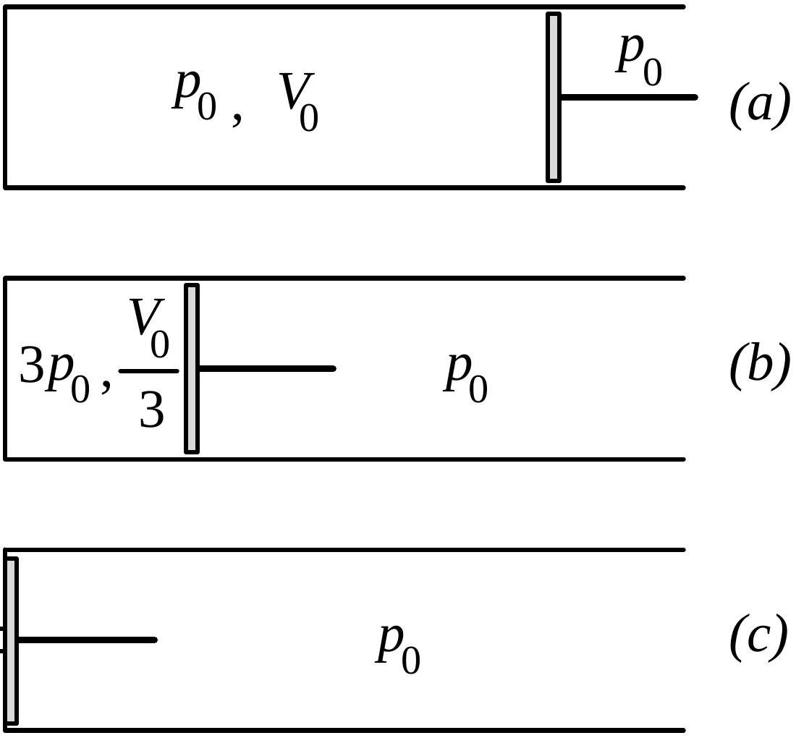
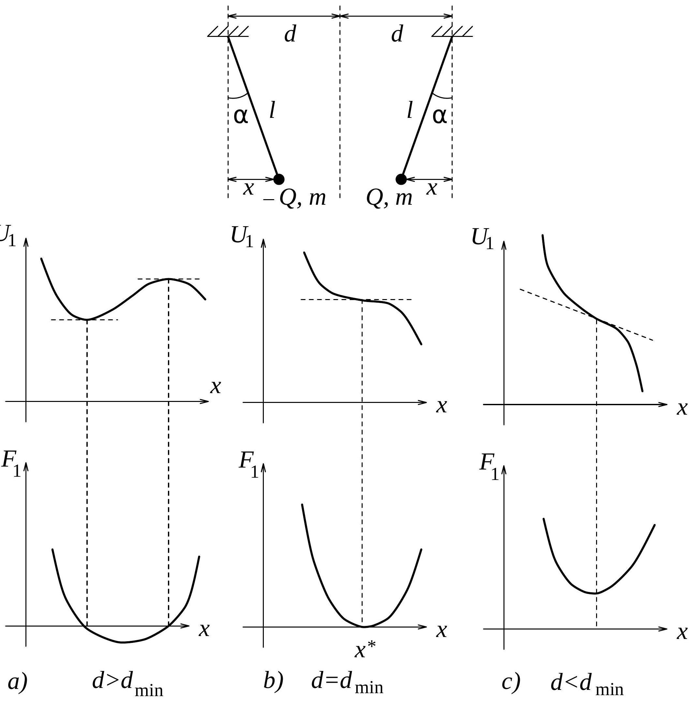
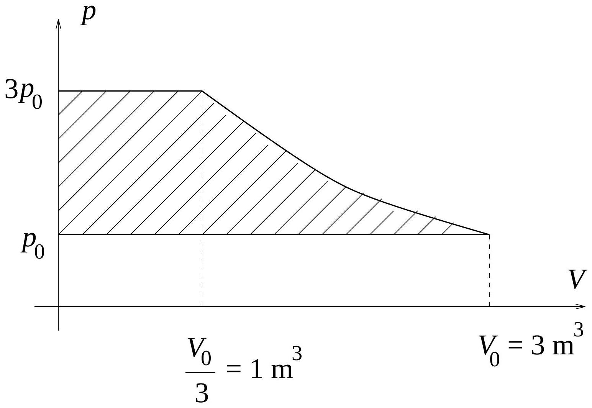
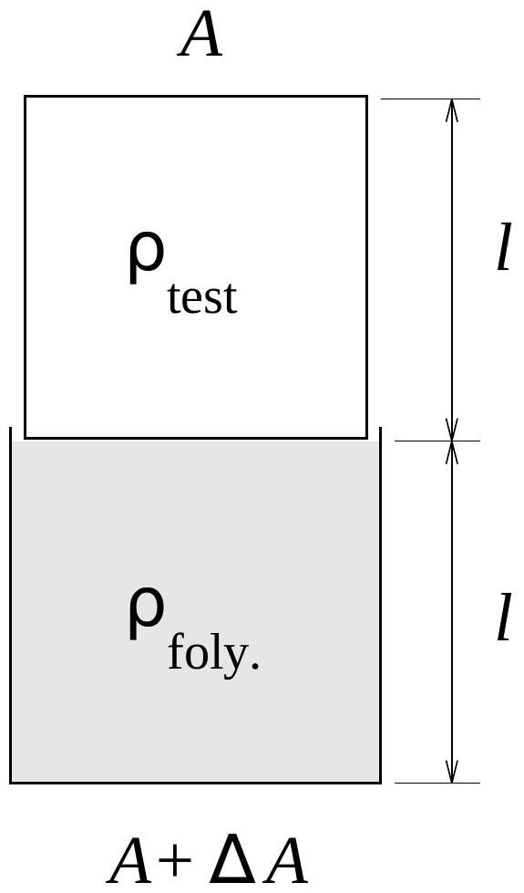
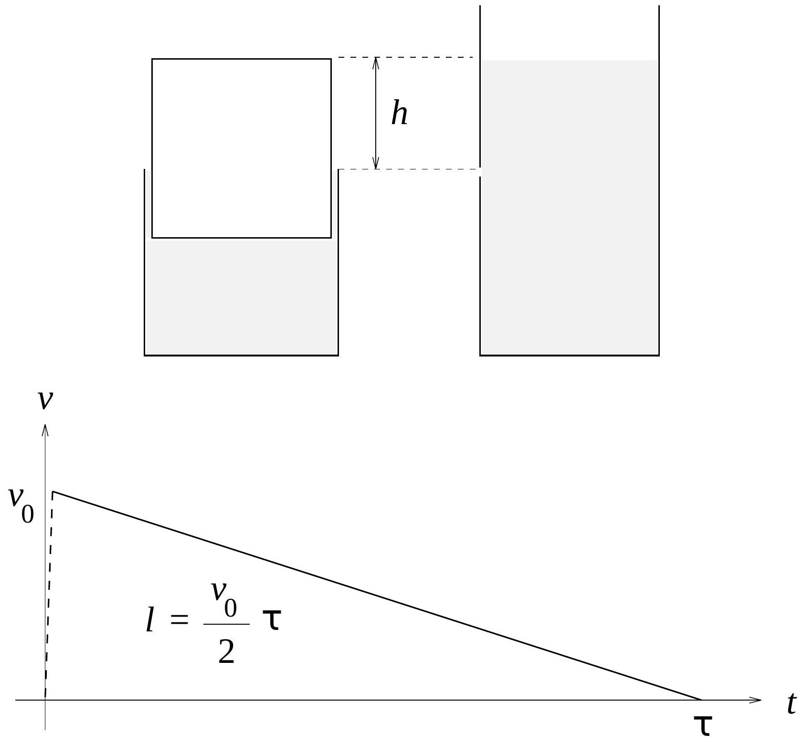
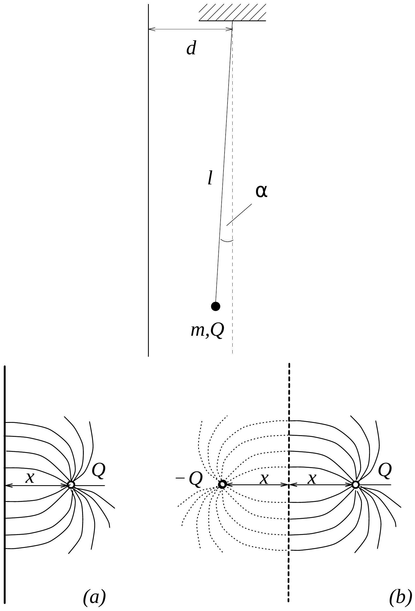
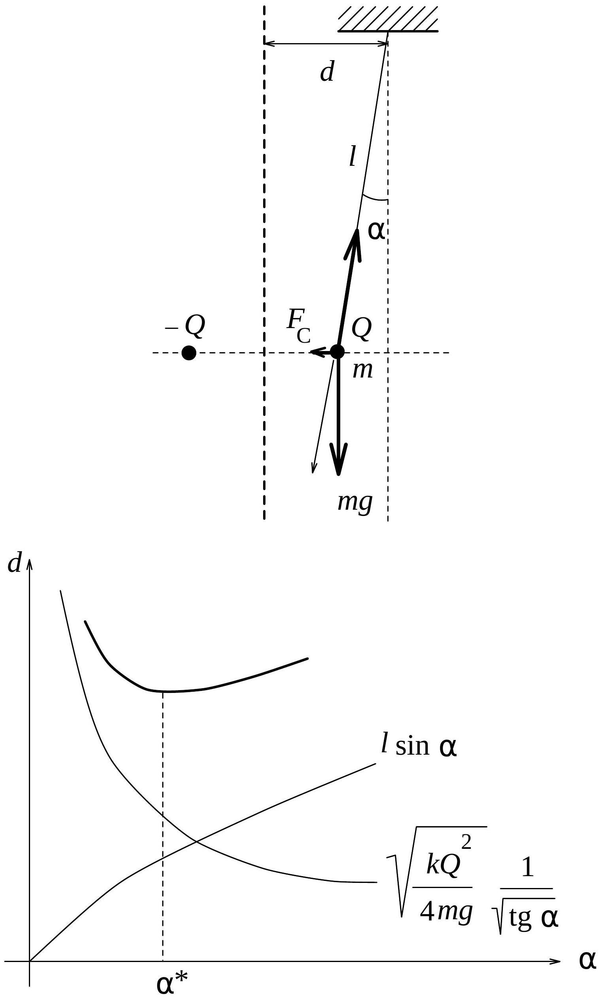

1994-ben nemcsak a Lapok, hanem az Eötvös verseny is centenáriumot ünnepelt: éppen 100 évvel ezelőtt, 1894-ben indította útjára a Tanulóversenyt a Mathematikai és Physikai Társulat. Ezzel akarták - és sikerült - emlékezetessé tenni azt a tényt, hogy a társulat elnöke, Báró Eötvös Loránd 1894 nyarán Magyarország kultuszminisztere lett.

Az első versenyt 1894 szeptember 17-én tartották az abban az évben érettségizett tanulók számára, összesen két helyszínen - a két egyetemi városban -, Budapesten és Kolozsváron. Összesen 29 diák adott be dolgozatot. Az eredményt október 25-én, a Társulat ünnepélyes ülésén hirdették ki, ahol Eötvös, a Társulat elnöke - egyben miniszter és az Akadémia elnöke - személyesen adta át az első és második helyezettnek a díjakat. Ezeket a díjakat már akkor „Báró Eötvös-díj”-nak nevezték. Később érem is járt a díjjal, amelyet Eötvös csináltatott. Ma már sajnos egyetlen ilyen érem sem lelhetó fel Magyarországon, de megmaradt Eötvös hagyatékában az érem terve. Ennek alapján készíttette el a centenáriumra az Eötvös Loránd Fizikai Társulat azt a díszes oklevelet, amelyet idén először kaptak az Eötvös verseny nyertesei.

1994 október 21-én tizenöt helyszínen: Budapesten, Szegeden, Debrecenben, Pécsett, Miskolcon, Veszprémben, Győrött, Egerben, Nyíregyházán, Békéscsabán, Nagykanizsán, Pakson, Sopronban, Székesfehérváron és Szombathelyen rendezték meg egyidőben a versenyt a szokásos feltételekkel: indulhattak az az évben érettségizettek, valamint középiskolai tanulók. A megoldási idő 300 perc volt, minden segédeszközt (könyveket, jegyzeteket, zsebszámológépet) lehetett használni. Összesen 336 versenyszerú dolgozat érkezett be a feladatokat kitúző és a megoldásokat értékelő Versenybizottsághoz (elnök: Radnai Gyula, tagok: Károlyházy Frigyes, Gnädig Péter).

Ismertetjük a feladatokat, azok megoldását és a verseny eredményét.

1. feladat. Egy tóba 20 m mélyre lesúllyesztett, $1 \mathrm {~m} ^ { 3 }$ ürtartalmú búvárharang megtelt vízzel. A felszínen úszó hajóból vékony csövön át levegőt pumpálunk a harang alá. (A harang súlyos, még ekkor sem emelkedik fel.) A levegő és a víz hőmérséklete között nincs számottevő különbség.
| Legalább mekkora munkát végez a kompresszor az $1 \mathrm {~m} ^ { 3 }$ víz kiszorítása során?
Károlyházy Frigyes
Megoldás. Készítsünk vázlatos ábrát a folyamatról! Hagyjunk el minden felesleges részletet, hogy maga a termodinamikai folyamat jól látható legyen. Két, egymást követő részfolyamatról van szó:
| először össze kell nyomni a gázt a megfelelő nagyobb nyomásra (20 méterrel a víz felszíne alatt a nyomás a légkori nyomásnak kereken háromszorosa);
| ezután a megfelelő nyomású gázt át kell nyomni a búvárharang alá, a víz helyére.
Mindezt az 1. ábrán vázoltuk.
Úgy túnik, hogy a dugattyút nyomó erő munkáját kell meghatározni. Ez azonban nagyobb, mint a kompresszor által végzett munka, mert „besegít” a külső légnyomás is. Így a kompresszor által végzett munka a 2. ábrán bevonalkázott területtel lesz egyenlő: a dugattyú által végzett összes munkából le kell vonni a légköri nyomás által végzett $p _ { 0 } V _ { 0 }$ munkát.

Az izotermikus tágulási munka kiszámítási formája megtalálható a függvénytáblázatban:

$$
W = N k T \ln \frac { V _ { 2 } } { V _ { 1 } } .
$$

Esetünkben izoterm összenyomásról van szó, és a külső munkát kell kiszámítanunk. Felhasználva az állapotegyenletet $\left( p _ { 0 } V _ { 0 } = N k T _ { 0 } \right)$ és azt, hogy a térfogatot harmadrészére kell csökkenteni, az izoterm összenyomáshoz szükséges munka:

$$
W _ { T } = p _ { 0 } V _ { 0 } \ln 3 .
$$

Behelyettesítve $p _ { 0 } \approx 10 ^ { 5 } \mathrm {~Pa}$ és $V _ { 0 } = 3 \mathrm {~m} ^ { 3 }$ értékeket:

$$
W _ { T } \approx 330 \mathrm {~kJ} .
$$

Ehhez kell hozzáadnunk az átnyomáshoz szükséges munkát, amelyet úgy számíthatunk ki, hogy a dugattyút nyomó állandó erốt megszorozzuk a dugattyú elmozdulásával:

$$
W _ { \text {átnyomási } } = F \cdot s = 3 p _ { 0 } A \cdot \frac { V _ { 0 } / 3 } { A } = p _ { 0 } V _ { 0 } = 300 \mathrm {~kJ} .
$$

Így az összes munka 630 kJ.
Most már csak a külső $p _ { 0 }$ nyomás által végzett $p _ { 0 } V _ { 0 }$ munkát kell levonnunk, hogy megkapjuk a kompresszorra jutó részt:

$$
W _ { \text {kompresszor } } = 630 \mathrm {~kJ} - 300 \mathrm {~kJ} = 330 \mathrm {~kJ} .
$$

Ezzel válaszoltunk a feladat kérdésére.
Kiegészító megjegyzések.

1. Az izoterm munka kiszámítási formulájához úgy lehet eljutni, hogy az izoterma alatti területet határozzuk meg:

$$
W = \int _ { V _ { 1 } } ^ { V _ { 2 } } p d V = \int _ { V _ { 1 } } ^ { V _ { 2 } } \frac { N k T } { V } d V = N k T \int _ { V _ { 1 } } ^ { V _ { 2 } } \frac { 1 } { V } d V , W = N k T \ln \frac { V _ { 2 } } { V _ { 1 } } .
$$

2. Vajon nem lehet-e az izotermikus folyamat helyett más folyamattal, kevesebb befektetett munka árán is célhoz érni?

Adiabatikus összenyomáskor kevesebb munka is elég lenne a $3 p _ { 0 }$ nyomás eléréséhez. Viszont akkor fel is melegedne a gáz, amely azután az átnyomás közben kezdene lehülni, s így csökkenne a nyomása. Épp ezért $3 p _ { 0 }$-nál jóval nagyobb nyomásra kellene adiabatikusan összenyomni, ehhez pedig már több munkára lenne szükség, mint az izotermikus esetben.

És ha először lehǘtenénk a gázt? Állandó $p _ { 0 }$ nyomáson $\frac { T _ { 0 } } { 3 }$ hốmérsékletűre hǘtve, a térfogata $\frac { V _ { 0 } } { 3 }$ lenne. Eközben csak a külső légkör végezne munkát. Majd pedig hagynánk a gázt állandó $\frac { V _ { 0 } } { 3 }$ térfogaton visszamelegedni $T _ { 0 }$ hőmérsékletre, ekkor a nyomása elérné a $3 p _ { 0 }$ értéket, s csak az átnyomási munkát kellene a kompresszorral végeztetni. Lehet, hogy 200 kJ is elég lenne? Ez már ravaszabb gondolat, de azt lehet ellene felhozni, hogy a feladatban szó se volt arról, hogy a hajón még egy megfelelő hütőberendezés is múködik, amelyet felhasználhatunk a probléma megoldásához. De tegyük fel, hogy megengednénk a hütógép használatát, akkor viszont azt a munkát is illene számításba venni, amivel a hütőgépet | pl. a hütőgép kompresszorát | müködtetni kell. Nem lenne nehéz megmutatni, hogy ismét „ráfizetünk”: összesen több munkát kell végeznünk.
3. Úgy is ki lehet számítani a kompresszor által végzett munkát, hogy elképzeljük: a kezdetben $\mathrm { a } ^ { 3 }$-nyi levegốt egy „zsákba” zárjuk, és a zsákot lassan lehúzzuk 10 m-nyire a víz alá. Mivel $x$ méter mélységben az izotermikusan összenyomott gázra $F ( x ) = 3 \cdot 10 ^ { 4 } \cdot ( 1 + x / 10 ) ^ { - 1 }$ felhajtóerő hat, a lehúzás során végzett munka (SI-egységrendszerben számolva)

$$
W = \int _ { 0 } ^ { 20 } f ( x ) d x = \int _ { 0 } ^ { 20 } \frac { 3 \cdot 10 ^ { 4 } } { 1 + x / 10 } d x = 3 \cdot 10 ^ { 5 } \cdot \ln 3 \approx 330 \mathrm {~kJ} .
$$

2. feladat. Egy henger alakú edény szuperfolyékony héliummal van tele. Az edény magassága 1 dm, belső alapterülete $1 \mathrm { dm } ^ { 2 }$.

A héliumra kellő óvatossággal egy ugyancsak henger alakú, 1 dm magas, de csak $0,99 \mathrm { dm } ^ { 2 }$ alapterületǘ „dugót” helyezünk, és elengedjük. A dugó súrúsége a hélium sürúségével egyenlő.
| Hogyan mozog a dugó?
| Mennyi idő alatt ér le az edény aljára?
Az egész berendezés hómérséklete 0 K közvetlen közelében van, a folyadék súrlódása és felületi feszültsége figyelmen kívül hagyható.

Gnädig Péter
Megoldás. Amikor elengedjük a dugót (3. ábra), ennek esését az alatta lévó folyadék hirtelen lefékezi bizonyos $v _ { 0 }$ sebességre. Ezt a dugó további mozgása során kezdősebességnek fogjuk tekinteni.

Próbáljuk meg kiszámítani ezt a $v _ { 0 }$ kezdősebességet, s csak utána keressük a választ a feladat kérdésére: Hogyan mozog a dugó?

Amint a dugó $v _ { 0 }$ sebességgel elindul lefelé, oldalt felspriccel a folyadék. Jelöljük a folyadék kiömlési sebességét $u _ { 0 }$-lal. Ez sokkal nagyobb, mint $v _ { 0 }$, hiszen a folyadék összenyomhatatlansága miatt a $\Delta A$ területü résen ugyanannyi folyadéknak kell kifreccsennie, mint amennyi az $A$ területú dugó alól kiszorul:

$$
v _ { 0 } \cdot A = u _ { 0 } \cdot \Delta A .
$$

$v _ { 0 }$ kiszámításához lehet, hogy először $u _ { 0 } - \mathrm { t }$ kell meghatároznunk? Ez elég is lenne, hiszen a feladat adataiból az $A : \Delta A = 100$ arány kiolvasható.

Milyen összefüggésben szerepelhet még a kiömlő folyadék sebessége? Mivel a folyadék súrlódása és felületi feszültsége figyelmen kívül hagyható, ezért érdemes lesz felírni az egész rendszerre a a munkatételt. Eszerint a rendszeren végzett munka a rendszer mozgási energiájának megváltozásával egyenló.

Munkát végző eró a dugóra ható nehézségi erő. Amíg a dugó | a test |, egy kicsiny $\Delta x$-szel elmozdul lefelé, kiszorít $\Delta m _ { \text {foly } }$ tömegü folyadékot, amely $u _ { 0 }$ sebességgel hagyja el a tartályt. Ezért írhatjuk:

$$
m _ { \mathrm { test } } \cdot g \cdot \Delta x = \frac { 1 } { 2 } \Delta m _ { \mathrm { foly } } \cdot u _ { 0 } ^ { 2 } .
$$

Igaz, a dugónak is megváltozott a mozgási energiája, de a sokkal kisebb sebesség miatt ezt a folyadék mozgási energiájának változásához képest elhanyagolhatjuk.

Helyettesítsük a fenti egyenletbe a következőket:

$$
m _ { \text {test } } = A l \varrho _ { \text {test } } \quad \text { és } \quad \Delta m _ { \text {foly } } = A \Delta x \varrho _ { \text {foly } } .
$$

Egyszerúsítés után a következő összefüggés adódik:

$$
l \varrho _ { \text {test } } g = \frac { 1 } { 2 } \varrho _ { \text {foly } } u _ { 0 } ^ { 2 } .
$$

Ez éppen a „jó öreg” Bernoulli-törvény (1738) speciális esete, akár ebből is kiindulhattunk volna $u _ { 0 }$ kiszámításához. Ha pedig azt is kihasználjuk, hogy a feladatban most a test és a folyadék súrúsége egyenlő, a folyadék kiömlési sebességére kapjuk:

$$
u _ { 0 } = \sqrt { 2 g l } .
$$

Ez a Torricelli-féle kiöntési törvény (1646) még egy évszázaddal korábbról.
Akár át is fogalmazhatjuk a feladatot: Ahelyett, hogy „Hogyan mozog a dugó?”, azt kérdezhetjük: „Hogyan mozog egy lyukas edényből súrlódásmentesen kiömlő folyadék esetén a folyadék felső szintje?" Azt már tudjuk, hogyan indul el. Kezdósebessége:

$$
v _ { 0 } = \frac { \Delta A } { A } u _ { 0 } = \frac { \Delta A } { A } \sqrt { 2 g l } .
$$

Tekintsünk most egy közbülső esetet a mozgás során. Tegyük fel, hogy a dugónak még $h$ magasságú része áll ki a hengerből. A dugó úgy mozog ekkor, mint az oldalt lyukas edényben lévő folyadékok felső szintje abban a pillanatban, amikor ez a szint éppen $h$ magasságban van a lyuk felett (4. ábra). Ugyanis mindkét esetben a súrlódásmentesen kiömlő folyadék sebessége

$$
u = \sqrt { 2 g h } ,
$$

és így a dugó sebessége

$$
v = \frac { \Delta A } { A } u = \frac { \Delta A } { A } \sqrt { 2 g h } .
$$

Ez még így is írható:

$$
v = \sqrt { 2 \left( \frac { \Delta A } { A } \right) ^ { 2 } g h } ,
$$

amiból látszik, hogy a dugó mozgása egyenletesen változik, lassulásának nagysága pedig

$$
\left( \frac { \Delta A } { A } \right) ^ { 2 } \cdot g = 10 ^ { - 4 } g = 10 ^ { - 3 } \frac { \mathrm {~m} } { \mathrm {~s} ^ { 2 } } .
$$

A dugó mozgásának sebesség-idő grafikonja az 5. ábrán látható.
A dugó sebessége éppen akkor csökken egyébként is zérusra, amikor a dugó alja eléri az edény alját, teteje pedig a hengeres edény tetejével kerül egy szintre. (Az analóg példában: a kiömlő folyadék felszíne a lyukhoz ér.)

Így a dugó leérkezéséig eltelt $\tau$ idő

$$
\tau = \frac { 2 l } { v _ { 0 } } = \frac { 2 l } { \frac { \Delta A } { A } \sqrt { 2 g l } } = \frac { A } { \Delta A } \sqrt { \frac { 2 l } { g } } = 14,1 \mathrm {~s} .
$$

Kiegészítő megjegyzések.

1. A leérkezési idő kiszámításakor elhanyagoltuk azt az időtartamot, amennyi idő alatt a dugó felveszi a kezdősebességet, s azt az utat is, amit ez alatt megtesz. Az elhanyagolás jogosságát a következő becsléssel ellenőrzihetjük. A dugó valódi kezdősebessége nulla, de ebből az állapotából | feltételezésünk szerint igen hamar | felgyorsul a kérdéses $v _ { 0 }$ sebességre. Amikor elengedjük, a dugó tetején és az aljánál egyaránt a légköri nyomás hat rá, tehát a dugó kezdeti gyorsulása $g$ (szabadesés!). Ez a gyorsulás bizonyos $\tau _ { 0 }$ idő alatt gyarkorlatilag nullára ( $10 ^ { - 4 } g$-re) csökken, s a dugó sebessége $v _ { 0 }$ lesz. Ha átlagosan $g / 2$ értékkel számolunk, a $( g / 2 ) \tau _ { 0 } = v _ { 0 }$ összefüggésekből $\tau _ { 0 } = 2 v _ { 0 } / g = 2 \cdot \frac { \Delta A } { A } \sqrt { \frac { 2 l } { g } } \approx 0,003 \mathrm {~s}$ adódik. Ez ez idő és a dugó által ezalatt megtett kb. $v _ { 0 } \tau _ { 0 } / 2 = 0,02 \mathrm {~mm}$ út valóban elhanyagolható.
2. A szuperfolyékony héliumnak semmi más különleges extrém tulajdonságát | például, hogy lassan magától is kimászna az edénybő́l | nem használtuk ki azon az egyen kívül, hogy nincs belső súrlódása. Éppen elég meglepő ez is!
3. feladat. Függőleges földelt fémsíktól $d$ távolságra felfüggesztünk egy $l$ hosszúságú fonálingát. Miután az $m$ tömegü, kicsiny ingatestet elektromosan feltöltöttük, az inga újra egyensúlyi helyzetet vett fel, s most $\alpha$ szöget zár be a függőlegessel (6. ábra).
| Mekkora az ingatest töltése?
| Mennyivel kell közelebb vinnünk a fémsíkot az inga felfüggesztési pontjához, ha azt akarjuk, hogy a függőleges fémsík magához rántsa az ingát?
| Anélkül, hogy közelebb vinnénk, tudjuk-e úgy mozgatni a mindig függőleges fémsíkot, hogy hozzácsapódjon az inga?

A fonál szigetelő, a levegő hatása elhanyagolható, s a feladatot az alábbi numerikus értékek esetén oldjuk meg: $d = 0,5 \mathrm {~m} ; l = 4 \mathrm {~m} ; m = 10 ^ { - 3 } \mathrm {~kg} ; \alpha = 1 ^ { \circ }$.

Radnai Gyula
Megoldás. Tisztázzuk először a fémsík szerepét! Tudjuk, hogy elektrosztatikus esetben a fémek felülete mindig ekvipotenciális. (Addig-addig mozognak, rendeződnek rajtuk a töltések, amíg ez az állapot ki nem alakul.) Ez azt

jelenti, hogy a fémek felületénél az elektromos térerősségnek nem lehet érintő irányú komponense, vagyis a térerősség minden pontban merőleges a fém felületére. A feladatban ponttöltés és sík fémfelület szerepel, ezért az erőtérnek a 7(a) ábrán vázolt szerkezetünek kell lennie. Ezzel az erőtérrel ekvivalens egy olyan dipólus erőterének „egyik fele”, amelyet egymástól $2 x$ távolságra lévő $Q$ és $- Q$ ponttöltések hoznak létre, ahogyan azt a 7(b) ábrán vázoltuk.

A fémsík hatása tehát minden tekintetben helyettesíthető egy $- Q$ nagyságú ú.n. „tükörtöltés” hatásával. Ennek a felismerésnek köszönhetően azt az erőt, amit a fémsík fejt ki a $Q$ tötésre, úgy is kiszámíthatjuk, mint a tükörtöltés által kifejtett vonzóerőt.

A Coulomb-erőn kívül a $Q$ töltésre még két erő hat ( 8 . ábra): a nehézségi erő és a fonálerő. A három erő eredője akkor zérus | akkor van egyensúly |, ha a Coulomb-erő és a nehézségi erő hányadosa tg $\alpha$-val egyenlő. Ebből határozhatjuk meg a $Q$ töltés keresett értékét.

$$
m g \operatorname { tg } \alpha = k \frac { Q ^ { 2 } } { [ 2 ( d - l \sin \alpha ) ] ^ { 2 } } .
$$

Átrendezés után:

$$
Q = 2 ( d - l \sin \alpha ) \sqrt { \frac { m g } { k } \operatorname { tg } \alpha } ,
$$

$\left( k = 9 \cdot 10 ^ { 9 } \frac { \mathrm { Nm } ^ { 2 } } { \mathrm { C } ^ { 2 } } , g = 9,81 \frac { \mathrm {~m} } { \mathrm {~s} ^ { 2 } } \right.$, a többi paraméter értéke a feladatban adott). Behelyettesítések után kapjuk:

$$
Q = 1,187 \cdot 10 ^ { - 7 } \mathrm { C } .
$$

Mi történik, ha a fémsíkot közelebb visszük az ingához? A Coulomb-erő nő, mivel a tükörtöltéstől való távolság csökken. A nehézségi erő nem változik, tehát egy nagyobb $\alpha$ szög esetén tud újra beállni az egyensúly. De van-e ilyen új $\alpha$ szög? Hiszen az inga kilendülésével a Coulomb-erő tovább nő, és lehet, hogy az inga meg se áll addig, amíg hozzá nem csapódik a fémsíkhoz.

Meg kell határoznunk azt az összefüggést, amely egyensúly esetén fennáll $d$ és $\alpha$ között. Formálisan tekintsük $d$-t $\alpha$ függvényének, s fejezzük ki ezt a függvényt az egyensúlyra már felírt fenti összefüggésből. Ezt kapjuk:

$$
d = d ( \alpha ) = l \sin \alpha + \sqrt { \frac { k Q ^ { 2 } } { 4 m g } } \frac { 1 } { \sqrt { \operatorname { tg } \alpha } } .
$$

A függvény menete viszonylag kis $\alpha$ értékek környezetében a 9. ábrán látható módon egy minimumot mutat. Van tehát egy olyan legkisebb $d$ érték, amelynél közelebb nem vihetjük a fémsíkot. Ha közelebb visszük, nincs egyensúlyi állapot, tehát hozzácsapódik az inga a fémsíkhoz.

Határozzuk meg $d$ minimumát!
(Akiknek gondot okoz e kissé bonyolult függvény differenciálása, úgy segíthetnek magukon, ha | felismerve, hogy csak kis szögekröl van szó |, $\sin \alpha$ és $\operatorname { tg } \alpha$ helyére $\alpha$-t írnak. Ekkor csak hatványfüggvényeket kell deriválni, s a végeredmény legfeljebb a negyedik-ötödik értékes jegyben tér el a pontos eredménytől.)

A minimum helyére $\left( \alpha ^ { * } \right)$ kapjuk:

$$
\sin 2 \alpha ^ { * } \left( \approx 2 \alpha ^ { * } \right) = \sqrt [ 3 ] { \frac { k Q ^ { 2 } } { 2 m g l ^ { 2 } } } , \quad \text { ebből } \quad \alpha ^ { * } = 2,12 ^ { \circ } ,
$$

$d$ legkisebb lehetséges értékére pedig ez adódik:

$$
d _ { \min } = 0,4435 \mathrm {~m} = 44,35 \mathrm {~cm} .
$$

Mivel a fémsík eredetileg 0,5 méterre volt az inga felfüggesztési pontjától, ezért ahhoz, hogy a fémsík magához rántsa az ingát, legalább $\Delta d = 5,65 \mathrm {~cm}$-rel közelebb kell vinni.

Már csak arra kell válaszolnunk, hogy tudjuk-e úgy mozgatni a fél méterre lévő fémsíkot, hogy hozzácsapódjon az inga akkor is, ha sohasem kerül a fémsík fél méternél közelebb a felfüggesztési ponthoz.

Igen, tudjuk: „be kell lengetni az ingát", mint egy hintát. Elöször eltávolítjuk a fémsíkot, ekkor az inga hátralendül. Amikor az inga elindul visszafelé, visszahozzuk a fémsíkot, hogy vonzóerejével növelje a lengés amplitúdóját. Lényegében az inga lengésével szinkronban, de mindig ellentétes fázisban kell mozgatni a fémsíkot. Akármilyen kis amplitúdóval is rezegtetjük a fémsíkot, ha ez megfelelő fázisban történik, előbb-utóbb hozzácsapódik az inga.

Kiegészítő megjegyzések.

1. Tanulságos áttekinteni a feladat energetikai megoldását is. Nemcsak azért, mert ez egy második megoldás, hanem azért is, mert olyan új felismeréshez vezet, amely az előző megoldásból nem derült ki.

A fémsíkon influált (elektromosan megosztott) töltésrendszer potenciális energiájának felírása elég bonyolult feladat, ezért ismét alkalmazzuk a tükörtöltéses módszert. Az inga + fémsík rendszer helyett tekintsük az inga + tükörképinga

rendszert (10. ábra), és írjuk fel e két ingából álló rendszer öszes potenciális energiáját! Ez a két ingatest gravitációs helyzeti energiáiból és az elektrosztatikus kölcsönhatási energiáiból tevődik össze (az utóbbi negatív).

$$
U = m g ( l - l \cos \alpha ) + m g ( l - l \cos \alpha ) - k \frac { Q ^ { 2 } } { 2 ( d - l \sin \alpha ) }
$$

Egyetlen inga potenciális energiája ennek a fele lesz:

$$
U _ { 1 } = m g ( l - l \cos \alpha ) - k \frac { Q ^ { 2 } } { 4 ( d - l \sin \alpha ) }
$$

Az egyszerúség kedvéért foglalkozzunk most is a kis szögek esetével, legyen

$$
\begin{aligned}
& \qquad x = l \sin \alpha \approx k \alpha , \quad \text { és } \quad h = l - l \cos \alpha \approx l \frac { \alpha ^ { 2 } } { 2 } . \\
& \qquad \operatorname { Ezzel } U _ { 1 } ( \alpha ) = \frac { m g } { 2 } l \alpha ^ { 2 } - k \frac { Q ^ { 2 } } { 4 } \frac { 1 } { d - l \alpha } , \\
& \text { vagy áttérve az } x = l \alpha \text { változóra: } U _ { 1 } ( x ) = \frac { m g } { 2 l } x ^ { 2 } - \frac { k Q ^ { 2 } } { 4 } \frac { 1 } { d - x } .
\end{aligned}
$$

Ezt az $U _ { 1 } ( x )$ függvényt $x$ szerint differenciálva kapjuk meg az ingatestre ható ( $x$ irányú) erő -1-szeresét, tehát az erő:

$$
F _ { 1 } ( x ) = - \frac { d U _ { 1 } ( x ) } { d x } = \frac { m g } { l } x - \frac { k Q ^ { 2 } } { 4 } \frac { 1 } { ( d - x ) ^ { 2 } } .
$$

Mind az $U _ { 1 } ( x )$, mind az $F _ { 1 } ( x )$ függvények menete a paraméterek értékeitól függ. Ha $m , g , l , k , Q$ állandó, akkor egyedül $d$-től. A 11. ábrán vázoltunk három különböző esetet. Az a) esetben a potenciális energia minimuma jelöli ki az inga stabilis egyensúlyi helyzetét, a maximum egy labilis egyensúlyt jelez. A c) esetben nincs egyensúlyi helyzet. A kettő közti átmenetet, a határesetet mutatja az ábra b) része, amikor a potenciális energiának „vízszintes" érintőjü inflexiós pontja van, itt valósulhat meg még utoljára egyensúlyi helyzet. Az ehhez tartozó $d$ paraméterérték lesz $d$ legkisebb értéke.

$$
x = x ^ { * } \text { helyen tehát } \frac { d U _ { 1 } } { d x } = 0 \text { és } \frac { d F _ { 1 } } { d x } = 0 \text { is igaz. }
$$

Ebból a két feltevésből az alábbi egyenletekre jutunk:

$$
2 x ( d - x ) ^ { 2 } = \frac { k Q ^ { 2 } l } { 2 m g } , \quad \text { illetve } \quad ( d - x ) ^ { 3 } = \frac { k Q ^ { 2 } l } { 2 m g } .
$$

Ezek szerint $2 x = d - x$, vagyis $x = \frac { d } { 3 }$ a határesetben!
A fenti jelölésekkel: $x ^ { * } = \frac { d _ { \text {min } } } { 3 }$.
Ez az a szép és érdekes eredmény, ami nem jött ki az első megoldás során: a fémsík egészen addig közelíthető az ingához, amíg az inga kilendüléséhez tartozó $x$ érték el nem éri az éppen akkori $d$ távolság harmadrészét. Ha elérte, s még tovább közelítjük a fémsíkot, akkor már nekicsapódik az inga.

Természetesen a feltételi egyenletek bármelyikébe behelyettesítve $x = \frac { d } { 3 }$ értékét, megkapjuk $d = d _ { \min }$ értékét:

$$
d = d _ { \min } = \frac { 3 } { 2 } \sqrt [ 3 ] { \frac { k Q ^ { 2 } l } { 2 m g } } = 0,4435 \mathrm {~m}
$$

2. A feladat harmadik kérdésére a „belengetésen” kívül más ötletes válaszok, megoldási javaslatok is születtek. Ilyen például a fémsík körbeforgatása, amely körmozgásra csábítja az ingatestet. Voltak, akik a fémsík saját síkjában történő mozgatással próbálkoztak, számítva az elektronok tehetetlenségére, s a mozgó töltésekre ható Lorentz erốvel is többen próbálkoztak | nem sok sikerrel. Elág sok jó fizikai szemléletú versenyző akadt, aki | ha nem is tudta megoldani a feladat nehéz, középső részét |, erre a befejező kérdésre jól válaszolt.

## A verseny eredménye

Megosztott I-II. díjat nyert egyenlő helyezésben a következő három versenyző:
Horváth Péter, a Fazekas Mihály Fővárosi Gyakorló Gimnázium IV. osztályos tanulója (felsó fénykép), Horváth Gábor tanítványa;

Kovács Krisztián, a békéscsabai Kemény Gábor Műszaki Szakközépiskola IV. osztályos tanulója (középső fény-kép), Mekis László és Varga István tanítványa;

Varga Dezsõ, a miskolci Földes Ferenc Gimnázium IV. osztályos tanulója (alsó fénykép), id. Szabó Kálmán tanítványa.
III. díjat nyert egyenlő helyezésben a következő hét versenyző:

Borsányi Szabolcs, a budapesti Piarista Gimnázium IV. osztályos tanulója, Görbe László tanítványa;
Burcsi Péter, a pápai Türr István Gimnázium III. osztályos tanulója, Németh Zsolt tanítványa;
Futó Gábor, az ELTE TTK matematikus szakos hallgatója, aki a Fazekas Mihály Fővárosi Gyakorló Gimnáziumban érettségizett, mint Horváth Gábor tanítványa;

Juhász Sándor, a Fazekas Mihály Fóvárosi Gyakorló Gimnázium IV. osztályos tanulója, Horváth Gábor tanítványa;

Koblinger Egmont, a Fazekas Mihály Fóvárosi Gyakorló Gimnázium IV. osztályos tanulója, Horváth Gábor tanítványa;

Mizera Ferenc, az ELTE TTK fizikus szakos hallgatója, aki Szlovákiában, Rév-Komáromban érettségizett, mint Szakál Ildikó, Spátai Lotár és Szabó Endre tanítványa;

Tóth Gábor Zsolt, a budapesti Árpád Gimnázium III. osztályos tanulója, Vankó Péter tanítványa.
Dicséretben részesültek, s errôl oklevelet kaptak a verseny 11-15. helyezettjei:
11. Halbritter András, a BME mérnök-fizikus szakos hallgatója, aki a győri Czuczor Gergely Bencés Gimnáziumban érettségizett, mint Csonka László tanítványa; 12-13. Bárász Mihály, a Fazekas Mihály Fóvárosi Gyakorló Gimnázium III. osztályos tanulója, Horváth Gábor tanítványa; Várhegyi Péter, a BME mérnök-fizikus szakos hallgatója, aki a Fazekas Mihály Fóvárosi Gyakorló Gimnáziumban érettségizett, mint Horváth Gábor tanítványa; 14-15. Koncz Imre, a Fazekas Mihály Fốvárosi Gyakorló Gimnázium II. osztályos tanulója, Horváth Gábor tanítványa; Lovas Rezsõ, a debreceni KLTE Gyakorló Gimnáziumának III. osztályos tanulója, Dudics Pál, Kirsch Éva és Szegedi Ervin tanítványa.

Jegyzókönyvi dicséretben részesültek a 16-20. helyezett versenyzők egyenlő helyezésben:
Feldmann Márton, a soproni Vas- és Villamosipari Szakközépiskola IV. osztályos tanulója, Lendvay Péterné tanítványa; Juhász Bertalan, a debreceni KLTE Gyakorló Gimnáziumának IV. osztályos tanulója, Dudics Pál tanítványa; Madarassy Pál, a ELTE TTK térképész szakos hallgatója, aki a Fazekas Mihály Fốvárosi Gyakorló Gimnáziumban érettségizett, mint Horváth Gábor tanítványa; Radnóti Gergely, a paksi Vak Bottyán Gimnázium IV. osztályos tanulója, Horváthné Szabó Julianna és Gálosiné Kimle Mária tanítványa; Salk Miklós, a pécsi Babits Mihály Gimnázium IV. osztályos tanulója, Koncz Károly tanítványa.

Gratulálunk a nyerteseknek!
Radnai Gyula

