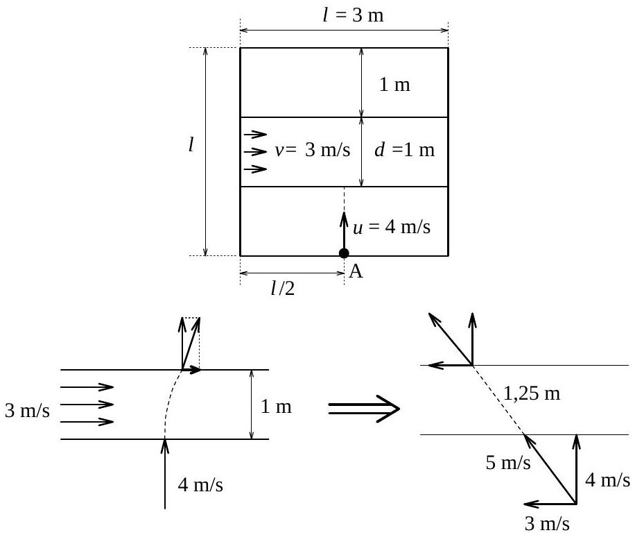
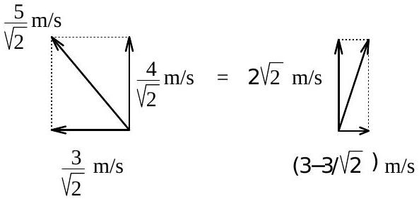
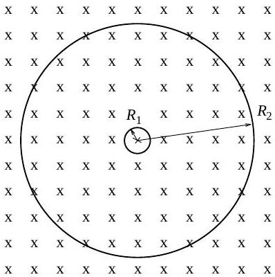
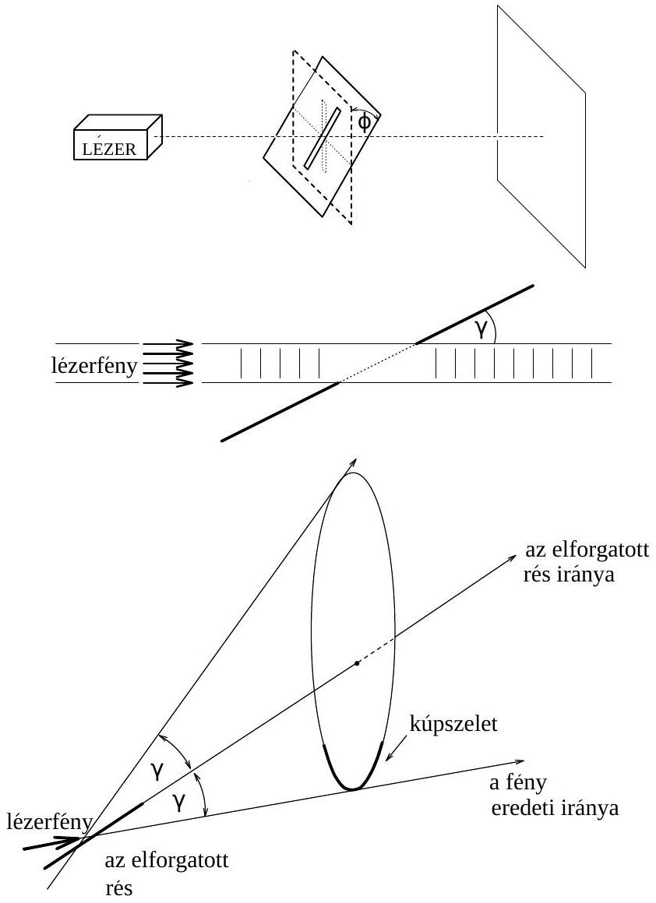

1995. október 20-án az országban 15 városban megtartott Eötvös versenyre az alábbi feladatokat túzte ki a Versenybizottság (elnök: Radnai Gyula, tagok: Károlyházy Frigyes, Gnädig Péter):
1996. feladat. Egy négyzet alakú, $l = 3 \mathrm {~m}$ széles kísérletező asztal felszíne sík, $d = 1 \mathrm {~m}$ szélességü középső sávját azonban állandó $v = 3 \mathrm {~m} / \mathrm { s }$ sebességgel mozgó (végtelenített) gumiszalag képezi, amely pontosan illeszkedik az asztallap nyugvó felszínéhez. Az asztal egyik szélének közepére (az 1. ábrán látható $A$ pontra) egy kicsi, lapos korongot fektetünk, és megütjük úgy, hogy $u = 4 \mathrm {~m} / \mathrm { s }$ sebességgel kezdjen csúszni (merőlegesen) a szalag felé. Az asztallap álló része és a korong közötti súrlódás elhanyagolható, a gumiszalag és a korong közötti súrlódási tényező $\mu = 0,5$.

Hol esik le a korong az asztalról?
Károlyházy Frigyes
Megoldás. Elvileg többféle lehetőség is elképzelhető, a súrlódástól és a sebességektől függően. Kis súrlódás és nagy kezdősebesség esetén a korong szinte átrepül az asztalon, alig változtatja meg a sebességét. Nagy súrlódás és kis kezdősebesség esetén viszont a korong át se jut a futószalagon, hanem „leragad” rajta, és a mozgó szalag szépen elviszi és leejti a korongot az asztal jobb oldalán. Ez utóbbi lehetőség is sugallhatja azt az ötletet, hogy a jelenséget ne az asztalhoz, hanem a futószalaghoz rögzített koordináta-rendszerben vizsgáljuk. Látni fogjuk, hogy ez mennyire leegyszerúsíti a megoldást.

A futószalaghoz rögzített koordináta-rendszerben a korong ferdén csúszik rá az álló szalagra. A súrlódási erő hatására egyenesvonalú, egyenletesen lassuló mozgást végez a szalagon, és ha még marad energiája, le is csúszik róla. Ezt az esetet mutatja a 2. ábra.
az asztalhoz képest (a szalag mozog) a szalaghoz képest (a szalag áll)
A szalagon végigcsúszó korong 1, 25 m utat tesz meg, amíg átér rajta. Kezdősebessége $5 \mathrm {~m} / \mathrm { s }$, lassulása $\mu g \approx 5 \mathrm {~m} / \mathrm { s } ^ { 2 }$. Végsebessége (a szalag szélén)

$$
v _ { t } = \sqrt { v _ { 0 } ^ { 2 } - 2 \mu g s } \approx 5 \frac { \sqrt { 2 } } { 2 } \mathrm {~m} / \mathrm { s } .
$$

Hol hagyja el a korong a szalagot? Ennek meghatározásáhon számítsuk ki, mennyi ideig volt a korong a szalagon:

$$
t _ { 1 } = \frac { 2 s } { v _ { 0 } + v _ { t } } \approx \frac { 1 } { 2 + \sqrt { 2 } } \mathrm {~s} .
$$

Így már kiszámíthatjuk, hogy mennyit mozdult el a szalag, amíg a korong rajta volt:

$$
\Delta x _ { 1 } = v _ { \mathrm { szalag } } \cdot t _ { 1 } \approx \frac { 3 } { 2 + \sqrt { 2 } } \mathrm {~m} .
$$

az asztalhoz képest a szalaghoz képest
3. ábra

Továbbra is a $g \approx 10 \mathrm {~m} / \mathrm { s } ^ { 2 }$ közelítést alkalmazva a szalagról lecsúszó korong sebességére a futószalag illetve az asztal koordináta-rendszerében a 3. ábrán látható értékeket kapjuk. Az 1 m széles, súrlódásmentes sávon való átcsúszáshoz szükséges idő:

$$
t _ { 2 } = \frac { 1 \mathrm {~m} } { 2 \sqrt { 2 } \mathrm {~m} / \mathrm { s } } = \frac { 1 } { 2 \sqrt { 2 } } \mathrm {~s} .
$$

Eközben a korong elmozdulása jobbra:

$$
\Delta x _ { 2 } = \left( 3 - \frac { 3 } { \sqrt { 2 } } \right) \frac { 1 } { 2 \sqrt { 2 } } \mathrm {~m} .
$$

Így a korong összes elmozdulása jobbra:

$$
\Delta x = \Delta x _ { 1 } - \frac { 3 } { 5 } 1,25 \mathrm {~m} + \Delta x _ { 2 } = \frac { 3 } { 2 ( 2 + \sqrt { 2 } ) } \mathrm { m } \approx 44 \mathrm {~cm} .
$$

Ha $g = 9,81 \mathrm {~m} / \mathrm { s } ^ { 2 }$-tel számolunk, $\Delta x = 42,6 \mathrm {~cm}$ adódik.
A korong tehát az asztal szemközti oldalának közepétől 42, 6 cm-rel jobbra esik le az asztalról.
2. feladat. Két vékony, koncentrikus, szupravezetó gyürú a síkjukra meróleges, homogén mágneses térben helyezkedik el. A mágneses indukció vektorának nagysága $B _ { 0 }$, iránya az ábrán a papír síkjába befelé mutat. A belső gyürú sugara sokkal kisebb a külső́nél $\left( R _ { 1 } \ll R _ { 2 } \right)$. Az egyes gyűrúk induktivitása $L _ { 1 }$ illetve $L _ { 2 }$, és a kölcsönös indukció sem hanyagolható el.

Mekkora és milyen irányú áramok indukálódnak az egyes gyűrúkben, ha a külső mágneses teret megszüntetjük?
Varga István
Megoldás. A megoldás alapgondolata az, hogy a szupravezető gyürúkben nem indukálódhat eredő feszültség, mert az végtelen nagy áramot eredményezne. Ez azt jelenti, hogy a külső mágneses tér leépülésével egyidejüleg olyan áramoknak kell indukálódniuk, hogy az áramváltozás miatti önindukciós és külcsönös indukciós feszültségek éppen

kioltsák a külső mágneses tér változása miatt indukálódó körfeszültséget. Másképp fogalmazva: a szuravezető gyürü által körülölelt mágneses fluxus nem változhat meg. Ha megszünik a külső tér fluxusa, fellép helyette az indukált áramok fluxusa.

Felírhatjuk tehát az alábbi egyenlőśégeket:

$$
B _ { 0 } R _ { 1 } ^ { 2 } \pi = L _ { 1 } I _ { 1 } + M I _ { 2 } \quad \text { és } \quad B _ { 0 } R _ { 2 } ^ { 2 } \pi = L _ { 2 } I _ { 2 } + M I _ { 1 } ,
$$

ahol $M$ a két gyúrú közti kölcsönös indukciós együttható. A fenti két egyenletből $I _ { 1 }$ és $I _ { 2 }$ kifejezhető:

$$
I _ { 1 } = \frac { B _ { 0 } \left( R _ { 1 } ^ { 2 } \pi L _ { 2 } - R _ { 2 } ^ { 2 } \pi M \right) } { L _ { 1 } L _ { 2 } - M ^ { 2 } } , \quad \text { illetve } \quad I _ { 2 } = \frac { B _ { 0 } \left( R _ { 2 } ^ { 2 } \pi L _ { 1 } - R _ { 1 } ^ { 2 } \pi M \right) } { L _ { 1 } L _ { 2 } - M ^ { 2 } } .
$$

Ezekben a kifejezésekben $B _ { 0 } , R _ { 1 } , R _ { 2 } , L _ { 1 }$ és $L _ { 2 }$ megadott értékek, $M$-et azonban meg kell még határoznunk.
Hogyan számíthatjuk ki a két gyűrú közötti kölcsönös indukciót? Használjuk ki, hogy $R _ { 1 } \ll R _ { 2 }$ ! Feltételezhetjük, hogy az $R _ { 1 }$ sugarú, kicsi belső gyürú belsejében az $I _ { 2 }$ áram által átjárt nagy, külső gyürüből származó mágneses mező jó közelítéssel homogénnek tekinthető. Így a külső gyürütől származó fluxus

$$
M I _ { 2 } = B \cdot R _ { 1 } ^ { 2 } \pi
$$

ahol $B$-t a nagy gyürúben folyó áram hozza létre a gyürú közepén, nagysága a Biot-Savart-törvény alapján:

$$
B = \mu _ { 0 } \frac { I _ { 2 } } { 2 R _ { 2 } } .
$$

Behelyettesítés után $M$-re a következőt kapjuk:

$$
M = \mu _ { 0 } \frac { \pi } { 2 } R _ { 1 } \frac { R _ { 1 } } { R _ { 2 } } .
$$

Hasonló megfontolással kaphatunk nagyságrendi becslést az $L _ { 1 }$ és $L _ { 2 }$ önindukciós együtthatókra is. Egy $R$ sugarú körvezetőben folyó áram által létrehozoztt $B _ { \text {átlag } }$ nagyságrendileg közelíthető a középpontban mérhető $B$ értékkel. Ennek megfelelően a fluxus $B R ^ { 2 } \pi$, s ezt az árammal osztva az önindukciós együtthatóra $L \approx \mu _ { 0 } R \pi / 2$ adódik.

Megjegyzés. Nem tartozik a megoldáshoz, de az érdekesség kedvéért megemlítjük, hogy a körgyürú induktivitására jó közelítéssel igaz az alábbi formula:

$$
L \approx \mu _ { 0 } R \ln \frac { R } { r } ,
$$

ahol $R$ a körgyürú sugara, $r$ pedig a kör keresztmetszetünek képzelt drót vastagságának a fele. Mivel a logaritmus lassan változó függvény, a gyürú önindukciós együtthatóját durva közelítésben $\mu _ { 0 } R$-rel arányosnak vehetjük.
$R _ { 1 } \ll R _ { 2 }$ miatt $M \ll L _ { 1 } \ll L _ { 2 }$, ezért az áramokra kapott kifejezéseket tovább egyszerúsíthetjük. A nevezőben $M ^ { 2 }$ elhanyagolható $L _ { 1 } L _ { 2 }$-höz képest, de elhanyagolható az $I _ { 2 }$ számlálójában szereplő második tag is az elsőhöz képest. Így kapjuk:

$$
I _ { 2 } = \frac { B _ { 0 } R _ { 2 } ^ { 2 } \pi } { L _ { 2 } } , \quad \text { illetve } \quad I _ { 1 } = \frac { B _ { 0 } R _ { 1 } ^ { 2 } \pi } { L _ { 1 } } \left( 1 - \mu _ { 0 } \frac { \pi } { 2 } \frac { R _ { 2 } } { L _ { 2 } } \right) .
$$

Hátra van még az áramok irányának meghatározása. $I _ { 2 }$ nyilván a 4. ábrán látható elrendezésben az óramutató járásával megegyező irányban folyik, hogy a papír síkjába befelé mutató indukcióvektort hozzon létre. $I _ { 1 }$ iránya nem ennyire magától értetődő, azt a zárójelben álló kifejezés előjele dönti el. Ennek megállapítására - Tóth Gábor Zsolt ötlete nyomán - használjuk fel, hogy egy körvezetőben folyó áram mágneses tere a kör síkjában fekvő belső pontokat vizsgálva a kör középpontjában a leggyengébb. Felírhatjuk tehát a következő egyenlőtlenséget:

$$
\Phi _ { 2 } = L _ { 2 } I _ { 2 } > \mu _ { 0 } \frac { I _ { 2 } } { 2 R _ { 2 } } R _ { 2 } ^ { 2 } \pi = \mu _ { 0 } \frac { \pi } { 2 } I _ { 2 } R _ { 2 } .
$$

Ebből következik, hogy $1 > \mu _ { 0 } \frac { \pi } { 2 } \frac { R _ { 2 } } { L _ { 2 } }$, vagyis az $I _ { 1 }$ áram is az óramutató járásával megegyező irányban folyik.
3. feladat. Lézerből jövő, keskeny, vízszintes fénynyalábbal világítjuk meg a függőleges, nagyon keskeny rés középső tartományát.
a) Mit látunk a rés mögötti, a lézersugár irányára merólegesen elhelyezett ernyőn?
b) Hogyan változik meg az ernyőn látható kép, ha a rést vízszintes középvonala körül $\varphi$ szöggel elforgatjuk? (Legyen például $\varphi = 45 ^ { \circ }$.)
(A rést tekinthetjük egymáshoz nagyon közeli, egymástól egyenlő távolságra levő piciny lyukak sorozatának. Az ernyő elég távol van a réstől.)

Radnai Gyula
Megoldás. Jelöljük a rés szélességét $a$-val, míg a rés megvilágított, középső tartományának függőleges mérete - a lézerbő̌l jövő keskeny nyaláb „átmérője” - legyen $b$. (Szokásos iskolai kísérleti összeállítás esetén például $b \approx 2 - 3 \mathrm {~mm}$,

míg a „nagyon keskeny" rés szélessége biztosan kisebb 0, 1 mm-nél.) Úgy tekinthetjük, hogy egy $b$ magasságú és $a$ szélességű, téglalap alakú nyílás diffrakciós képe jelenik meg a réstől elég távol elhelyezett ernyőn.

Ebben az esetben vízszintes síkban a

$$
\sin \alpha _ { k } = k \frac { \lambda } { a } \quad ( k = \pm 1 , \pm 2 , \ldots )
$$

egyenlet által meghatározott $\alpha _ { k }$ irányokban kioltást tapasztalunk. Ha az ernyő $l$ távolságra van a réstől $( l \gg b \gg a )$, akkor az ernyőn megjelenő kép leginkább egy vízszintes, szaggatott vonalra emlékeztet, ahol a „szakaszok” (függőleges) vastagsága $b$, vízszintes hosszuk pedig mintegy $\lambda l / a$. (Kivételt képez a középső szakasz, amely kétszeres hosszúságú, mivel $\alpha = 0$ irányban is erősítik egymást a hullámok.) Ahogy szűkítjük a rést, a kioltási minimumhelyek egyre távolodnak, és így az ernyőn megfigyelhető szakaszok is egyre hosszabbak lesznek. Előfordulhat, hogy az ernyőn végül már csak egyetlen halvány, összefüggő, vízszintes vonal látható.

Most válaszoljunk a b) kérdésre! Ha a rést elforgatjuk, „előre döntjük” a megadott vízszintes tengely körül, akkor a lézerből jövő fénynyaláb eredeti irányában továbbra is erősítést tapasztalunk. Ez azért van így, mert igaz ugyan, hogy a rés különböző pontjaiba (a lézertől mért távolságok különbözősége miatt) más-más fázissal érkezik a síkhullám, de a résen áthaladva és az eredeti irányban terjedve éppen akkora útkülönbséggel érkeznek az elemi hullámok az ernyőhöz, hogy a teljes fáziskülönbség közöttük nulla. Ennek elképzelését sugallta a feladat szövegében az a zárójelbe tett mondat, hogy „a rést tekinthetjük egymáshoz nagyon közeli, egymástól egyenlő távolságra levő piciny lyukak sorozatának”.

Most már csak azt kell észrevennünk, hogy ha az elemi hullámok a $\varphi$ szögben megdöntött réssel $\gamma$ szöget bezáró irányban $\left( \gamma = 90 ^ { \circ } - \varphi \right)$ erősítik egymást (6. ábra), akkor ez nemcsak az ábra síkjában következik be, hanem a háromdimenziós tér minden olyan irányában, amely a rés irányával ugyancsak $\gamma$ szöget zár be! (Az eredeti, függőlegesen álló rés esetén $\gamma = 90 ^ { \circ }$, ezért kaptunk ott az ernyőn vízszintes vonalat.)

Általában tehát azt mondhatjuk, hogy az ernyőn megfigyelhető vonal egy kúpnak valamely síkmetszete lesz ( 7. ábra). A kúp csúcsa a rés közepe, tengelyének iránya a rés iránya, fél nyílásszöge a fenti $\gamma$, amely az elforgatás szögének pótszöge. A sík az ernyő síkja.

A megfigyelhetó vonal egy kúpszelet, ami - mint tudjuk - ellipszis, parabola vagy hiperbola lehet. Parabolát éppen akkor kapunk, ha az ernyő síkja a kúp valamelyik alkotójával párhuzamos. Esetünkben ez akkor következik be, ha a kúpnak van függőleges alkotója. Vízszintes alkotója az eredeti fénysugár, függőleges tehát csak akkor lehet a másik alkotó, ha a kúp nyílásszöge $90 ^ { \circ }$. Ekkor $\gamma = 45 ^ { \circ } , \varphi = 90 ^ { \circ } - \gamma = 45 ^ { \circ }$, ez az elforgatási szög szerepelt példaként a feladatban.

Ha a rés felső része $45 ^ { \circ }$-ban előre dől az ernyő felé, akkor az ernyőn látható parabola ágai fölfelé állnak. A fény intenzitása a csúcspontban a legnagyobb, a szárakon fokozatosan gyengül.

## A verseny eredménye

A beérkezett 262 dolgozat alapos átvizsgálása után a Versenybizottság az alábbi döntést hozta:
Elsó̌ díjat, s vele járó 6000 Ft pénzjutalmat nyert
Tóth Gábor Zsolt, a budapesti Árpád Gimnázium IV. osztályos tanulója, Vankó Péter tanítványa.
Második díjat nyert és egyenként 4000 Ft pénzjutalomban részesült a következő három versenyző:
Bárász Mihály, a Fazekas Mihály Fốvárosi Gyakorló Gimnázium IV. osztályos tanulója, Horváth Gábor tanítványa;

Lengyel Krisztián, az ELTE fizikus hallgatója, aki Cegléden, a Kossuth Lajos Gimnáziumban érettségizett, mint Tứri László tanítványa;

Lovas Rezsố, a KLTE Gyakorló Gimnáziumának IV. osztályos tanulója, Dudics Pál, Kirsch Éva és Szegedi Ervin tanítványa.

Harmadik díjat nyert és egyenként 3000 Ft pénzjutalomban részesült a következő négy versenyző:
Fazekas Péter, az ELTE Apáczai Csere János Gyakorló Gimnáziumának IV. osztályos tanulója, Flórik György tanítványa;

Hegyes István, a nyíregyházi Kossuth Lajos Evangélikus Gimnázium IV. osztályos tanulója, Módis Ákos tanítványa;

Szabó János Zoltán, az BME múszaki informatika szakos hallgatója, aki Budapesten, az ELTE Apáczai Csere János Gyakorló Gimnáziumában érettségizett, mint Zsigri Ferenc tanítványa;

Varga Dezsõ, az ELTE fizikus hallgatója, aki a miskolci Földes Ferenc Gimnáziumban érettségizett, mint $i d$. Szabó Kálmán tanítványa.

Dicséretben részesült a versenyen 9-10. helyezést elért következő két versenyző: Kurucz Zoltán, a szolnoki Varga Katalin Gimnázium IV. osztályos tanulója, Vincze Gábor tanítványa; Perényi Márton, a Fazekas Mihály Fővárosi Gyakorló Gimnázium IV. osztályos tanulója, Horváth Gábor tanítványa.

Hasonlóképpen dicséretben részesült a versenyen 11-18. helyezést elért alábbi nyolc versenyző:
Agod Attila, a debreceni Tóth Árpád Gimnázium IV. osztályos tanulója, Kovács Miklós tanítványa; Bíró Domokos Botond, a marosvásárhelyi Bolyai Farkas Elméleti Líceum XII. osztályos tanulója, Bíró Tibor tanítványa;

Csonka Szabolcs, a budapesti Árpád Gimnázium IV. osztályos tanulója, Vankó Péter tanítványa; Farkas Illés, az ELTE fizikus hallgatója, aki az ELTE Apáczai Csere János Gyakorló Gimnáziumában érettségizett, mint Pákó Gyula tanítványa; a szolnoki Varga Katalin Gimnázium IV. osztályos tanulója, Vincze Gábor tanítványa; Frenkel Péter, a Fazekas Mihály Fóvárosi Gyakorló Gimnázium III. osztályos tanulója, Horváth Gábor tanítványa; Lohner Roland, az BME múszaki informatika szakos hallgatója, aki az esztergomi Temesvári Pelbárt Ferences Gimnáziumban érettségizett, mint Halmai László tanítványa; Németh Tibor, az BME múszaki informatika szakos hallgatója, aki a győri Révai Miklós Gimnáziumban érettségizett, mint Somogyi Sándor tanítványa; Vörös Zoltán, a tiszavasvári Váci Mihály Gimnázium IV. osztályos tanulója, Víg Csaba tanítványa.

A díjkiosztásra 1995. november 24-én került sor. Ekkor az érdeklődő diákok és tanárok megtekinthették a feladatokhoz kapcsolódó kísérleteket is, melyeket a Versenybizottság állított össze. Az Eötvös Loránd Fizikai Társulat által biztosított pénzjutalmakat a Nemzeti Tankönyvkiadó nagyjából azonos értékú könyvutalványokkal egészítette ki, ezen kívül a nyertes versenyzők megjelent tanárai a Tankönyvkiadótól és a Typo $T _ { E } X$ Kiadótól jutalomkönyveket vehettek át.

A társulati díjakat Németh Judit egyetemi tanár, a Társulat alelnöke adta át biztató szavak kíséretében, míg a Nemzeti Tankönyvkiadó által felajánlott jutalmakat Ábrahám István vezérigazgatótól vehették át a nyertesek és tanáraik. Jelen volt és dedikálta könyvét Staar Gyula, a Természet Világa főszerkesztője is, s a díjkiosztó ünnepségről még aznap sugározta a helyszínen készült tudósítását a Duna Televízió.

Radnai Gyula

