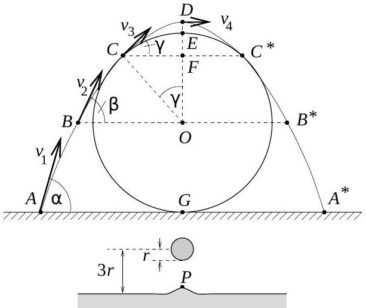
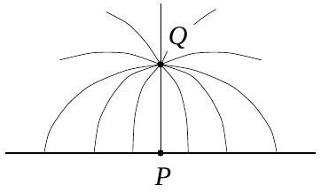

3. Szigetelố fonálon függő, 1 cm átmérốjü mũanyag golyó felszínén $10 ^ { - 8 } \mathrm { C }$ töltés helyezkedik el egyenletesen. A golyót egy széles, nagy tálban lévó sós víz fölé engedjük úgy, hogy az alja 1 cm-re legyen a víztól. A víz felszíne a golyó alatt egy picit megemelkedik. Mekkora ez az emelkedés? (A felületi feszültség szerepét elhanyagolhatjuk, a sós víz súrữségét vehetjük $1000 \mathrm {~kg} / \mathrm { m } ^ { 3 }$-nek.)

Megoldás. A sós víz elektromosan jól vezetó folyadék (elektrolit). Mind a pozitív, mind a negatív töltéshordozók (ionok) könnyen elmozdulnak benne. A közeledő, feltöltött golyó hatására az általa vonzott, vele ellentétes töltésú ionok igyekeznek a golyó felé elmozdulni, míg a golyóval azonos töltésú ionok a taszító erő hatására ellenkezó irányban mozdulnak el. Ezáltal megszúnik a folyadék „térfogati semlegessége” úgy, hogy

1. az eredő elektromos tér erővonalai a golyó és a folyadék közötti térben merőlegesen futnak be a folyadék felszínére;
2. a folyadék belsejében a felszín alatti tartományokban zérus lesz az eredő térerősség.

Természetesen ekkor a golyó a vele ellentétes töltésú folyadékfelszínt magához akarja vonzani, fel akarja emelni. Fel is emeli egy picit; ezt a hatást akadályozza a folyadék felületi feszültsége, valamint a felemelt folyadék saját súlya. Feladatunkban a felületi feszültség szerepét elhanyagolhatjuk, így a folyadék felszíne a golyó alatt addig emelkedik fel, amíg a felületegységre ható elektrosztatikus emelő erő egyenlő nem lesz a felemelkedett folyadékréteg hidrosztatikai nyomásával.

Nem tudjuk, hogy milyen lesz pontosan a kialakuló folyadékfelület alakja. Biztos, hogy kevéssé tér el a síkfelülettől, erre utal a feladat szövege is („picit” megemelkedik) - tehát a levegőben kialakuló eredő elektromos tér meghatározásához alkalmazhatjuk a (sík) tükörtöltés módszerét. Másrészt elegendő lesz figyelmünket egyetlen pontra, a felemelkedő folyadékfelület legfelső $P$ pontjára koncentrálni; ennek emelkedése az, amit ki kell számítanunk.

A 2. ábrán $P$-vel jelölt pontban a $Q$ töltéstől származó térerősség

$$
E _ { 1 } = \frac { 1 } { 4 \pi \varepsilon _ { 0 } } \frac { Q } { ( 3 r ) ^ { 2 } } .
$$

A folyadék felületén kialakuló töltéseloszlás hatását a felszín alatt $3 r$ mélységben elképzelt $- Q$ nagyságú tükörtöltés hatásával helyettesítjük (3. ábra). A tükörtöltéstől származó térerősség a $P$ pontban ugyanakkora és ugyanolyan irányú, $\operatorname { mint } E _ { 1 }$. Ezért az eredő térerősség:

$$
E = 2 E _ { 1 } = \frac { 1 } { 2 \pi \varepsilon _ { 0 } } \frac { Q } { ( 3 r ) ^ { 2 } } .
$$

A felületegységre jutó töltés a $P$ pontban Gauss tétele alapján:

$$
\sigma = \varepsilon _ { 0 } E = \frac { 1 } { 2 \pi } \frac { Q } { ( 3 r ) ^ { 2 } } .
$$

A folyadék felszínén a felületegységre ható erő a $\sigma$ felületi töltéssürúség és a golyótól származó $E _ { 1 }$ elektromos térerősség szorzata:

$$
\frac { F } { A } = \sigma E _ { 1 } .
$$

Ez az a felületegységre jutó, függőlegesen felfelé emelő eró a $P$ pontban, amely egyensúly esetén egyenló lesz a $P$ pontbeli $h$ emelkedésből származó hidrosztatikai nyomással:

$$
\frac { F } { A } = \varrho g h .
$$

A sós víz felszínének $h$ emelkedését tehát az alábbi egyenletből számíthatjuk ki:

$$
\frac { 1 } { 4 \pi \varepsilon _ { 0 } } \frac { Q } { ( 3 r ) ^ { 2 } } \cdot \varepsilon _ { 0 } \cdot 2 \frac { 1 } { 4 \pi \varepsilon _ { 0 } } \frac { Q } { ( 3 r ) ^ { 2 } } = \varrho g h .
$$

A megadott, illetve ismert értékeket behelyettesítve az emelkedés magasságára kapjuk:

$$
h \approx 0,29 \mathrm {~mm} .
$$

Ez az érték valóban „pici" a golyó sugarához, illetve a víztől mért távolságához képest, jogos volt a síktükör-töltés közelítés. (Hasonlóképp jogos volt a golyó töltését a középpontjába helyezett ponttöltéssel helyettesíteni: müanyag golyóról lévén szó, a víz felszínén kialakuló töltéssürúség vonzása nem tudja átrendezni, megváltoztatni a szigetelőre felvitt egyenletes töltéseloszlást. Azt is be lehet látni, hogy a víz megemelkedéséből adódó görbületi nyomás a hidrosztatikai nyomásnál sokkal kisebb, a felületi feszültség szerepét tehát jogosan hanyagoltuk el.)

## A verseny végeredménye

Elsó́ díjat nyert
Kurucz Zoltán, az ELTE fizikus hallgatója, aki Szolnokon, a Varga Katalin Gimnáziumban érettségizett, mint Vincze Gábor tanítványa.

Második díjat nyertek egyenlő (2-4.) helyezésben:
Biró Domokos Botond a Kolozsvári Műszaki Egyetem számítástechnika-automatizálás szakos hallgatója, aki Marosvásárhelyen, a Bolyai Farkas Elméleti Líceumban érettségizett, mint Bíró Tibor tanítványa;

Tóth Gábor Zsolt, az ELTE fizikus hallgatója, aki Budapesten, az Árpád Gimnáziumban érettségizett, mint Vankó Péter tanítványa;

Varga Tamás, az ELTE fizikus hallgatója, aki Révkomáromban, a Selye János Gimnáziumban érettségizett, mint Szabó Endre tanítványa.

Harmadik díjat nyertek egyenlő (5-10.) helyezésben:
Gröller Ákos, az ELTE matematikus hallgatója, aki Budapesten, a Fazekas Mihály Fővárosi Gyakorló Gimnáziumban érettségizett, mint Horváth Gábor tanítványa;

Hochsteiger Ákos, a szekszárdi Garay János Gimnázium IV. osztályos tanulója, Pesti Gyula tanítványa;
Kovács András, a BME múszaki informatika szakos hallgatója, aki Budapesten, a Fazekas Mihály Fővárosi Gyakorló Gimnáziumban érettségizett, mint Horváth Gábor tanítványa;

Mátrai Tamás, a budapesti, a Fazekas Mihály Fóvárosi Gyakorló Gimnázium IV. osztályos tanulója, Horváth Gábor tanítványa;

Négyesi Gábor, az egri Szilágyi Erzsébet Gimnázium IV. osztályos tanulója, Flaskay Miklós és Burom Mária tanítványa;

Sexty Dénes, az egri Neumann János Közgazdasági Szakközépiskola és Gimnázium IV. osztályos tanulója, $P e -$ csenye Pálné tanítványa.

Négyesi G., Sexty D., Gröller Á., Kovács A., Varga T., Kurucz Z., Biró D. B., Hochsteiger Á., Tóth G. Zs., Kálmán
B., Nagy Z., Nagy Sz., Nyakas P.

Dicséretben részesültek egyenlő (11-15.) helyezésben:
Kálmán Barnabás, a BME múszaki informatika szakos hallgatója, aki Budapesten, az ELTE Apáczai Csere János Gyakorló Gimnáziumában érettségizett, mint Flórik György tanítványa; Nagy Szilvia, a BME mérnök-fizikus hallgatója, aki Győrben, a Révai Miklós Gimnáziumban érettségizett, mint Kolozsváry Ernốné és Székely László tanítványa; Nagy Zoltán, a JATE fizikus hallgatója, aki Szegeden, a JATE Ságvári Endre Gyakorló Gimnáziumában érettségizett, mint Homolya Ernó́ tanítványa; Nyakas Péter, a zalaegerszegi Zrínyi Miklós Gimnázium IV. osztályos tanulója, Vadvári Tibor tanítványa; Wagner Róbert, a pannonhalmi Bencés Gimnázium IV. osztályos tanulója, Hirka Antal és Rábai László tanítványa.

Az ünnepélyes eredményhirdetésre 1996. november 29-én került sor. Itt nemcsak a feladatok helyes megoldásával ismerkedhettek meg a megjelent diákok és tanárok, de egy lézer fényének felhasználásával megfigyelhették a sós víz felszínének pici felemelkedését is.

Megemlékeztünk a 100 évvel ezelőtti Eötvös-verseny nyerteseiről: Visnya Aladárról és Zemplén Győzóről. A díjak átadására a Versenybizottság két volt Eötvös verseny nyertest kért fel; Bakos Tibor éppen 70 évvel ezelőtt, 1926-ban ismételte meg Teller Ede előző évi bravúrját: fizikából is és matematikából is megnyerte az I. díjat a Társulat őszi tanulóversenyén, és ugyanez sikerült 1940-ben Hoffmann Tibornak is. Az Eötvös Társulaton kívül a Nemzeti Tankönyvkiadó is hozzájárult a nyertesek jutalmazásához. A diákokat felkészítő tanárok három meghívott kiadó ajándékkönyveiből válogattak: a Nemzeti Tankönyvkiadó, a Calibra és a Talentum legújabb ismeretterjesztő és tankönyveit hozták el az eredményhirdetésre.

Két régi verseny-nyertes, Hoffmann Tibor és Bakos Tibor, valamint a versenybizottság elnöke (e cikk szerzője) gratulál az idei győztesnek, Kurucz Zoltánnak

A Duna Televízió most már harmadik éve saját híradójában tudósítja határainkon inneni és túli nézőit az ünnepi eseményről. Köszönet érte!

Radnai Gyula

