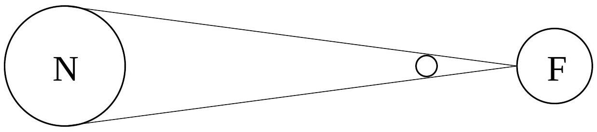
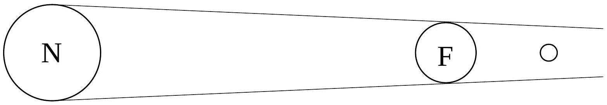
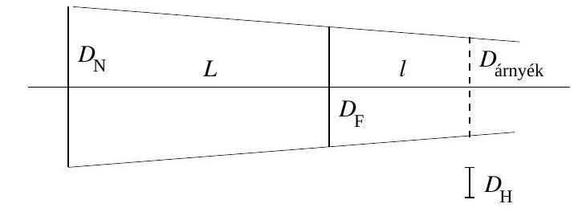
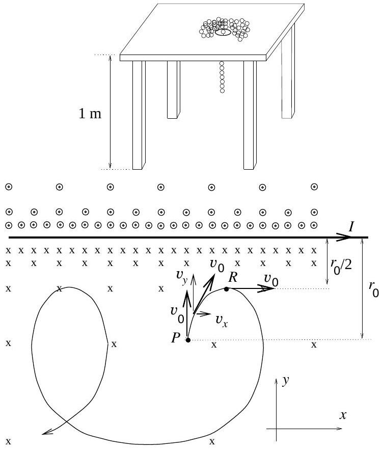
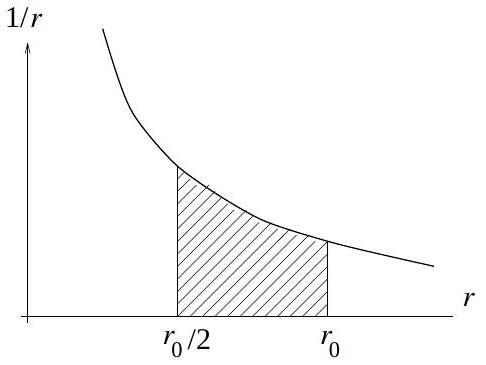

1. Magyarországon 1997. szeptember 16-án este holdfogyatkozást lehetett megfigyelni. Negyed 10-tốl negyed 11-ig tartott a teljes holdfogyatkozás, vagyis ekkor tartózkodott a Hold teljes egészében a Föld teljes árnyékában.
a) A holdfogyatkozás általában hosszabb ideig tart, mint a napfogyatkozás. Miért?
b) Feltételezve, hogy a Hold a Föld körül és a Föld a Nap körül körpályán kering, valamint elhanyagolva a Föld légkörének optikai hatását, határozzuk meg, hogy legfeljebb mennyi ideig tarthat egy teljes holdfogyatkozás! A Földről a Hold és a Nap egyaránt 0,5° látószögben látszik; a Föld látószöge a Holdról nézve 1,83°. (Hogyan befolyásolná az eredményt, ha figyelembe vennénk, hogy az említett pályák inkább ellipszisek, mint körök?)
c) A valóságban teljes holdfogyatkozáskor sem tünik el teljesen a Hold az égról, hanem vöröses színben, halványan világít. Miért?

(Radnai Gyula)
Megoldás. a) A napfogyatkozás addig tart, amíg a Hold eltakarja a Napot. Ha a két látószög egész pontosan megegyezne, akkor erre csak egy pillanatig kerülhetne sor, s az a pont, ahonnan teljes napfogyatkozást lehet látni, gyorsan végigsuhanna a forgó Földön (1. ábra). A valóságban a két látószög nem pontosan egyezik meg, és időben is változik (az ellipszispályák miatt), ezért a teljes napfogyatkozás szerencsés esetben akár néhány percig is tarthat a Föld bizonyos helyein.

A holdfogyatkozás addig tart, amíg a Hold a Föld árnyékkúpjában tartózkodik. Mivel a Föld árnyéka a Hold távolságában is még csaknem háromszor olyan széles, mint a Hold átmérője, a holdfogyatkozás egy órán át is tarthat, amint a feladatban is idézett példa mutatja. A teljes holdfogyatkozás annál tovább tart, minél közelebb halad a Hold a Föld árnyékának közepéhez. Maximális esetben éppen áthalad az árnyékkúp közepén, ezt az esetet kellett a b) kérdésben megvizsgálni.

Érdemes felfigyelni arra, hogy amikor a Földön holdfogyatkozás van, akkor a Holdon éppen napfogyatkozás, ezért az a) kérdést úgy is fel lehetne tenni, hogy a napfogyatkozás miért tart általában hosszabb ideig a Holdon, mint a Földön. A fö ok ténylegesen az, hogy a Föld nagyobb, mint a Hold.

b) Az 2. ábrán a valóságos arányokat eltorzítva, a lényeges távolságokat kiemelve tanulmányozhatjuk a maximális idốtartamú teljes holdfogyatkozást, amikor is a Hold pályája áthalad az árnyékkúp tengelyén. A Nap, a Föld és a Hold átmérójén kívül feltüntettük (szaggatott vonallal) annak az árnyékkörnek az átmérőjét is, amelyen a Hold végighalad. A Nap-Föld távolságot $L$-lel, a Föld-Hold távolságot $l$-lel jelöltük.

Felhasználva két háromszög hasonlóságát, a megfelelő oldalak arányára felírhatjuk:

$$
\frac { D _ { \mathrm { F } } - D _ { \text {árnyék } } } { 2 } : l = \frac { D _ { \mathrm { N } } - D _ { \mathrm { F } } } { 2 } : L .
$$

Ebből fejezzük ki az árnyék átmérőjét:

$$
D _ { \text {árnyék } } = D _ { \mathrm { F } } - \frac { l } { L } D _ { \mathrm { N } } .
$$

A Hold $\Delta s = D _ { \text {árnyék } } - D _ { \mathrm { H } }$ utat tesz meg, amíg teljes egészében az árnyékkúp belsejében tartózkodik. Sebessége $v = l \omega$, ahol $\omega$ jelenti a Hold szögsebességét a Föld körüli keringése közben. Így a teljes holdfogyatkozás maximális ideje:

$$
\Delta t = \frac { \Delta s } { v } = \frac { D _ { \text {árnyék } } - D _ { \mathrm { H } } } { l \cdot \frac { 2 \pi } { T } } = \frac { T } { 2 \pi } \left( \frac { D _ { \mathrm { F } } } { l } - \frac { D _ { \mathrm { N } } } { L } - \frac { D _ { \mathrm { H } } } { l } \right) .
$$

Felhasználva, hogy a Hold kereken 30 nap alatt kerüli meg a Földet, és behelyettesítve a feladatban fokokban megadott látószög adatokat:

$$
\Delta t = \frac { 30 \cdot 24 \mathrm {~h} } { 360 ^ { \circ } } \left( 1,83 ^ { \circ } - 0,5 ^ { \circ } - 0,5 ^ { \circ } \right) = 1,66 \mathrm {~h} .
$$

Legfeljebb ennyi ideig tarhat egy teljes holdfogyatkozás.
Hogyan befolyásolná az eredményt, ha figyelembe vennénk, hogy az említett pályák inkább ellipszisek, mint körök? Ebben az esetben figyelembe kellene vennünk, hogy a Nap látószöge a Földről nézve $0,52 ^ { \circ }$ és $0,54 ^ { \circ }$ között változik, míg a Hold látószöge a Földről nézve $0,49 ^ { \circ }$ és $0,55 ^ { \circ }$ között változik. (A $0,5 ^ { \circ }$ tehát mindkét esetben kerekített érték volt.) A holdpálya excentricitása miatt a Föld látószöge is változik a Holdról nézve, mégpedig $1,8 ^ { \circ }$ és $2,0 ^ { \circ }$ között. (A feladatban szereplő 1,86° tehát nem átlagérték, hanem a 0,50°-os Hold-látószögnek megfelelő érték volt.)

Az ellipszispályák figyelembe vétele azonban nemcsak a látószögeket módosítja, hanem a Hold $v$ sebességét is! A látószögek szempontjából optimális eset az, amikor

1. a Föld naptávolban tartózkodik (az árnyékkúp a legkevésbé „keskenyedik”);
2. a Hold földközelben tartózkodik (az árnyékkör a lehető legnagyobb).

Ez utóbbi esetben azonban a Hold sebessége is a lehető legnagyobb, s ez csökkenti az áthaladási időt. Ennek ellenére a fenti két feltétel teljesülése esetén lesz a teljes holdfogyatkozás ideje maximális (körülbelül 115 perc).

Ebben az évezredben a leghosszabb holdfogyatkozást 2000. július 16-án lehet még majd megfigyelni - sajnos nem nálunk, hanem Ázsia keleti és déli részén, valamint Óceániában. Ideje 108 perc lesz.

c) A Föld légköre megtöri a fényt; a fénynek azt a részét, amely át tud haladni rajta, mint valami enyhén gyújtő lencse, a geometriai árnyéktérbe irányítja. A fénynek a legnagyobb része azonban nem halad át a légkörön, hanem áthaladás közben fokozatosan „kiszóródik”. A fényszórás legjelentősebb a rövid hullámhosszú fényekre, ezért látszik

az ég a földről nézve kéknek. Az ürhajósok is kéknek látják, így kapta Földünk a „kék bolygó” nevet. Még leginkább a leghosszabb hullámhosszú vörös fénynek van esélye arra, hogy át tud haladni a légkörön, s egy halvány, vöröses derengést ad a geometriai árnyéktérben lévő Holdnak.

Megjegyzések. 1. A Hold keringési ideje a Földről nézve 29,5 nap. Az állócsillagokhoz képest azonban csak 27,3 nap, mivel a Föld is kering a Nap körül.

$$
\frac { 1 } { 27,3 } - \frac { 1 } { 365,25 } = \frac { 1 } { 29,5 } .
$$

2. Nem vettük figyelembe, hogy a Hold keringési síkja kb. 5°-os szögben hajlik a Föld keringési síkjához (az ekliptikához) képest, s nem vettünk figyelembe még számos, az eredményt csak csekély mértékben módosító hatást. Néhány évvel ezelőtt például egy óriási túzhányó-kitörés annyi port juttatott a légkör felsőbb részeibe, hogy utána a Hold az árnyéktérben egészen más színűnek látszott, mivel a por a vörös fényt is részben elnyelte, részben kiszórta a légkörből. Az 1997. szeptember 16-i holdfogyatkozáskor ennek a vulkáni hamunak a hatását nem lehetett észrevenni.
3. Egy 1 méter magas asztal lapjának közepén lyuk van. A lyuk közvetlen környezetében az asztallapon lazán elhelyeztünk egy 1 méter hosszú, vékony aranyláncot. Ennek egyik végét a lyukon keresztül kicsit meghúzzuk, majd elengedjük. A lánc egyre növekvő sebességgel szalad le a lyukon át. (Feltételezhetjük, hogy a lánc nem gubancolódik össze. A súrlódás és a légellenállás elhanyagolható.)

Mennyi idố alatt ér a lánc egyik, illetve másik vége a földre?
(Gnädig Péter)
Megoldás. Jelöljük $L$-lel az asztal magasságát, ami éppen megegyezik a lánc teljes hosszával (a feladatban $L =$ 1 m). Tekintsük azt a pillanatot, amikor a lánc függőleges, mozgásban lévó része $x$ hosszúságú. Jelöljük $m$-mel ennek a darabnak a tömegét, és írjuk fel rá a dinamika alaptörvényét! Persze, figyelembe kell vennünk, hogy most $m$ nem állandó, hanem időben változik, ezért:

$$
m g = \frac { \Delta ( m v ) } { \Delta t } = m \frac { \Delta v } { \Delta t } + \frac { \Delta m } { \Delta t } v .
$$

Átrendezve, a következőt kapjuk:

$$
m \frac { \Delta v } { \Delta t } = m g - \frac { \Delta m } { \Delta t } v .
$$

A bal oldalon $\frac { \Delta v } { \Delta t } = a$ miatt a pillanatnyi tömeg és gyorsulás szorzata áll. A jobb oldalon felhasználhatjuk, hogy $\Delta m = \frac { m } { x } \Delta x$, így

$$
m a = m g - \frac { m } { x } \frac { \Delta x } { \Delta t } v .
$$

Mivel $\frac { \Delta x } { \Delta t } = v , m$-mel való osztás után kapjuk:

$$
a = g - \frac { v ^ { 2 } } { x } .
$$

Ez az izgalmasan egyszerú összefüggés jelzi, hogy a lánc mozgásban lévő részének gyorsulása $g$-nél mindenképp kisebb, s mivel $v$ és $x$ is változik időben, feltehetően a gyorsulás sem marad állandó. Ennek ellenére próbáljuk ki, hátha mégis állandó a gyorsulás, hiszen lehet, hogy a $v ^ { 2 } / x$ kifejezés „véletlenül” nem függ az időtől! Próbaképpen helyettesítsük be $v$ és $x$ helyére a zérus kezdősebességú, egyenletesen gyorsuló mozgás sebességének és a megtett útnak időtől függő képleteit:

$$
\frac { v ^ { 2 } } { x } = \frac { ( a t ) ^ { 2 } } { \frac { a } { 2 } t ^ { 2 } } = 2 a = \text { állandó, ha } a = \text { állandó! }
$$

Így hát a lánc egyenletesen gyorsuló mozgással szalad le a lyukon át. Számítsuk ki a gyorsulását:

$$
a = g - 2 a , 3 a = g , a = \frac { g } { 3 } .
$$

Ha a lánc $t _ { 1 }$ idő alatt fut le az asztalról, akkor a legelöl futó láncszem $t _ { 1 }$ idő alatt $g / 3$ gyorsulással tesz meg $L$ utat, ezért

$$
t _ { 1 } = \sqrt { \frac { 2 L } { a } } = \sqrt { \frac { 6 L } { g } } = 0,78 \mathrm {~s} .
$$

A lánc egyik vége tehát 0,78 s alatt ér le a földre. Mennyi idő alatt ér le a másik? Amikor a lánc alsó vége eléri a földet, abban a pillanatban az egész lánc függőleges, és akkora sebességgel mozog, amekkora a legalsó láncszem végsebessége:

$$
v _ { 1 } = a t _ { 1 } = \frac { g } { 3 } \sqrt { \frac { 6 L } { g } } = \sqrt { \frac { 2 } { 3 } L g } = 2,56 \frac { \mathrm {~m} } { \mathrm {~s} } .
$$

Ettől kezdve az egész lánc szabadon esik. A legfelső láncszem $v _ { 1 }$ kezdősebességgel, $g$ gyorsulással tesz meg $L$ utat. Jelöljük az ő esési idejét $t _ { 2 }$-vel, akkor felírhatjuk:

$$
L = v _ { 1 } t _ { 2 } + \frac { 1 } { 2 } g t _ { 2 } ^ { 2 } .
$$

Ebbe behelyettesítve $v _ { 1 } = \sqrt { \frac { 2 } { 3 } L g }$ értékét, a $t _ { 2 }$-re adódó másodfokú egyenletet megoldva kapjuk:

$$
t _ { 2 } = \sqrt { \frac { 2 L } { 3 g } } = 0,26 \mathrm {~s} \quad \left( = \frac { t _ { 1 } } { 3 } \right) .
$$

Ez a láncvég tehát a folyamat kezdetétől számítva

$$
t _ { 1 } + t _ { 2 } = \frac { 4 } { 3 } t _ { 1 } = 1,04 \mathrm {~s}
$$

múlva fog földet érni.
Megjegyzések. 1. Sok hibás megoldás abból indult ki, hogy mivel „a súrlódás és a légellenállás elhanyagolható”, ezért a lánc mechanikai energiája állandó marad. Ebben az esetben az a sebesség, amivel a lánc alsó vége eléri a földet, az energiatétel felhasználásával a következőképp adódna:

$$
\frac { 1 } { 2 } m v _ { 1 } ^ { 2 } = m g \frac { L } { 2 } ,
$$

mivel a lánc tömegközéppontja $\frac { L } { 2 }$-vel van mélyebben abban a pillanatban, amikor az egész lánc függőlegesen mozog. A fenti összefüggés azonban nem helyes! Ha behelyettesítjük $v _ { 1 }$ helyébe a helyes megoldásban kapott értéket, ezt kapjuk:

$$
\frac { 1 } { 2 } m v _ { 1 } ^ { 2 } = \frac { 1 } { 2 } m \left( \sqrt { \frac { 2 } { 3 } L g } \right) ^ { 2 } = m g \frac { L } { 3 } < m g \frac { L } { 2 } .
$$

Hová túnt, mikor veszett el az energia $\frac { 1 } { 3 }$ része? Akkor, amikor egy-egy láncszemet a már mozgó másik lerántott az asztalról; a rugalmatlan ütközések során disszipálódott a mechanikai energia egy része.
2. A közölt helyes megoldással azonos eredményre vezet az a gondolat is, hogy az $M$ tömegü lánc $\frac { M } { L } \Delta s = \frac { M } { L } v \Delta t$ tömegü darabkáját $\Delta t$ idő alatt $v$ sebességre gyorsítja fel a lánc $v$ sebességgel mozgó $m = \frac { M } { L } x$ tömegü része, amikor „magával rántja” az asztalról. Ennek az erőnek a nagysága:

$$
\frac { \left( \frac { M } { L } \cdot v \cdot \Delta t \right) v } { \Delta t } = \frac { M } { L } v ^ { 2 } .
$$

Ugyanekkora nagyságú, de ellentétes irányú erốt fejt ki a felgyorsuló láncszem („láncdarabka”) a már mozgó, $m$ tömegü részre! Így felírhatjuk:

$$
m a = m g - \frac { M } { L } v ^ { 2 } .
$$

Behelyettesítve $m = \frac { M } { L } x$ kifejezését, kapjuk:

$$
\frac { M } { L } x a = \frac { M } { L } x g - \frac { M } { L } v ^ { 2 } ,
$$

azaz

$$
a = g - \frac { v ^ { 2 } } { x } .
$$

3. Feltételezve, hogy az $M$ tömegú lánc $n$ darab láncszembő́l áll, ahol két láncszem közötti lazaság (szabad elmozdulás) $\varepsilon = \frac { L } { n }$, a fenti helyes eredmény $n \rightarrow \infty$ határértékben adódik.
4. Felsőbb matematikai módszerekkel megadható az

$$
a = g - \frac { v ^ { 2 } } { x }
$$

differenciálegyenlet teljes megoldása $t = 0 , v = 0 , x = x _ { 0 }$ kezdőfeltételek $\left( x _ { 0 } \ll L \right)$ esetén. A megoldás aszimptotikusan közelít a heurisztikusan talált $a = \frac { g } { 3 } =$ állandó esethez.

3. Egy vákuumkamrában lévó hosszú, egyenes, nagyon jó vezetóképességü huzalban 10 A erốsségữ áram folyik. A huzaltól $r _ { 1 }$ távolságban lévó pontból $v _ { 0 }$ kezdósebességü elektronok indulnak el a huzal felé, rá merôlegesen, de ezek az elektronok csak $r _ { 0 } / 2$ távolságra képesek megközelíteni a huzalt. Mennyi lehet $v _ { 0 }$ értéke? (A földi mágneses tér hatásától eltekinthetünk.)
(Varga István)
I. megoldás. Ha eddig nem jutott volna eszünkbe, ez az utolsó, zárójelbe tett mondat figyelmeztet, hogy az áram mágneses terének hatását kell figyelembe vennünk. (Az áramvezetőnek van elektromos tere is, a nagyon jó vezetőképességü huzalban azonban a térerősség a huzal belsejében és környezetében is kicsi, ennek hatása most elhanyagolható.)

A mozgó töltésre a mágneses tér mindig olyan erốt fejt ki, ami a sebességre merốleges. Ez el tudja téríteni, el tudja kanyarítani az elektront, de nem tudja megváltoztatni a sebesség nagyságát. Helyről helyre változó mágneses térben szeszélyesen kanyargó pályát írhat le az elektron, de közben sebességének nagysága végig ugyanakkora marad! A makroszkópikus testek mozgásait vizsgálva nemigen találunk hasonlót. Még leginkább egy enyhén lejtő, szeszélyesen kanyargó folyó mozgása hasonlít az inhomogén mágneses térben kanyargó elektronsugárra, de az elektronsugár térbeli, háromdimenziós alakja jóval bonyolultabb lehet, mint a síkságon kanyargó folyóé.

A feladatban megadott esetben az elektronok pályája szerencsére csak két dimenziós (síkgörbe) lesz, mivel az elektron végig benne marad a kezdőponton és az áramvezetőn átfektethető síkban. Ennek az az oka, hogy kezdetben az elektron ebben a síkban indul el $v _ { 0 }$ kezdősebességgel, a rá ható erő pedig végig merőleges lesz mind a sebességre, mind az előbbi síkra meróleges mágneses indukció vektorra. Igaz, a B vektor nagysága változik, egyre nagyobb lesz, ahogy az elektron közelebb és közelebb kerül az áramvezetőhöz, de ez csak azt eredményezi, hogy az elektron egyre erősebben kanyarodik.

Az, hogy az $r _ { 0 }$ távolságból induló elektron $r _ { 0 } / 2$ távolságra tudja megközelíteni a huzalt, azt jelenti, hogy $r _ { 0 } / 2$ távolságban a pályagörbe már úgy elkanyarodott, hogy az elektron az áramvezetővel párhuzamosan mozog. Azután kanyarodik tovább, és már távolodik is az áramvezetőtől.

Az elektron a 4. ábrán látható $P$ pontból indul az $I$ árammal átjárt egyenes vezetó felé, rá merőlegesen $v _ { 0 }$ kezdősebességgel.

A helyről helyre változó B indukcióvektorú mágneses térben $\mathbf { v }$ sebességgel mozgó $Q$ töltésú elektronra ható mágneses
Lorentz-erő: $\mathbf { F } = Q ( \mathbf { v } \times \mathbf { B } )$. Tekintsük ennek $x$ komponensét:

$$
F _ { x } = Q v _ { y } B , m \frac { \Delta v _ { x } } { \Delta t } = Q \frac { \Delta y } { \Delta t } B , m \Delta v _ { x } = Q \Delta y B .
$$

Az $I$ árammal átjárt egyenes vezető mágneses tere, tőle $r$ távolságban:

$$
B = \frac { \mu _ { 0 } } { 2 \pi } \frac { I } { r } .
$$

Helyettesítsük be ezt a kifejezést a fenti mozgásegyenletbe, és használjuk fel, hogy a választott koordináta-rendszerben $\Delta y = - \Delta r$ :

$$
m \Delta v _ { x } = Q \frac { \mu _ { 0 } } { 2 \pi } I \frac { - \Delta r } { r } .
$$

Ez az összefüggés az elektron pályájának bármely kis $\Delta s$ ívhosszúságú darabjára fennáll. Osszuk fel gondolatban a pálya $P R$ ívét ilyen kis $\Delta s$ darabokra! Képzeljük el, hogy mindegyikre felírunk egy ilyen összefüggést, azután a kapott egyenleteket adjuk össze! Ezt így jelölhetjük:

$$
\sum _ { P } ^ { R } m \Delta v _ { x } = \sum _ { P } ^ { R } Q \frac { \mu _ { 0 } } { 2 \pi } I \frac { - \Delta r } { r } .
$$

Az állandó tényezőket kiemelve kapjuk:

$$
m \sum _ { P } ^ { R } \Delta v _ { x } = Q \frac { \mu _ { 0 } } { 2 \pi } I \sum _ { P } ^ { R } \frac { - \Delta r } { r } .
$$

A bal oldalon álló összeg:

$$
\sum _ { P } ^ { R } \Delta v _ { x } = v _ { 0 } ,
$$

mivel a $P$ kezdőpontban a sebesség $x$ komponense zérus, az $R$ pontban pedig $v _ { 0 }$. A jobb oldalon álló összeg:

$$
\sum _ { P } ^ { R } \frac { - \Delta r } { r } = \sum _ { r _ { 0 } } ^ { r _ { 0 } / 2 } \frac { - \Delta r } { r } = \sum _ { r _ { 0 } / 2 } ^ { r } \frac { \Delta r } { r } .
$$

Ennek értékét becsléssel határozzuk meg. A 5. ábrán bevonalkázott területet kell meghatároznunk. Ha ezt trapézzal közelítjük, a trapéz területe:

$$
T = \frac { r _ { 0 } } { 2 } \frac { \frac { 1 } { r _ { 0 } } + \frac { 2 } { r _ { 0 } } } { 2 } = \frac { 3 } { 4 } = 0,75 .
$$

A görbe alatti terület azonban kisebb, mint a trapéz területe, vegyük közelítőleg 0,7-nek. Így végül az alábbi egyenlethez jutottunk:

$$
m v _ { 0 } \approx Q \frac { \mu _ { 0 } } { 2 \pi } I \cdot 0,7 .
$$

Ebből fejezzük ki $v _ { 0 }$-t, majd helyettesítsük be az ismert, illetve a megadott értékeket:

$$
v _ { 0 } \approx \frac { Q } { m } \frac { \mu _ { 0 } } { 2 \pi } I \cdot 0,7 , v _ { 0 } \approx 1,76 \cdot 10 ^ { 11 } \frac { \mathrm { C } } { \mathrm {~kg} } \cdot 2 \cdot 10 ^ { - 7 } \frac { \mathrm { Vs } } { \mathrm { Am } } \cdot 10 \mathrm {~A} \cdot 0,7 , v _ { 0 } \approx 2,46 \cdot 10 ^ { 5 } \frac { \mathrm {~m} } { \mathrm {~s} } .
$$

Az elektronokat tehát mintegy 250 km/s sebességgel kell kilőni $r _ { 0 }$ távolságból, hogy $r _ { 0 } / 2$ távolságra megközelítsék a 10 A-es árammal átjárt egyenes vezetőt.

Megjegyzések. 1. Nagy vagy kicsi a kapott sebesség? Makroszkópikus, földi testek sebességéhez képest nagy: az első kozmikus sebesség is csak mintegy 8 km/s, s a Naprendszer elhagyásához is elég egy 20 km/s-nál kisebb sebesség. A fény sebességéhez képest viszont kicsi, hiszen az 300 ezer km/s. Ezért is lehetett a relativisztikus tömegnövekedéstől eltekinteni a feladat megoldása során. Még a katódsugárcsóben (TV, oszcilloszkóp, elektronmikroszkóp) futó elektronok sebességéhez képest is kis sebességet kaptunk, hiszen már kb. $0,2 \mathrm {~V}$ gyorsító feszültség hatására elérik az elektronok ezt a sebességet.
2. A feladat megoldása során elegendő volt a Lorentz-erő $x$ komponensét megvizsgálni. Mire jutnánk az $y$ komponens vizsgálatával? Nem sokra, mivel ez a sebesség $x$ komponensétől függ, s az $x$ koordinátát csak közvetve, a pálya egyenletét ismerve lehet összekapcsolni $r$-rel, amitől B függ. A pálya görbületét azonban megkaphatjuk a Lorentz-erő nagyságából.

$$
m \frac { v _ { 0 } ^ { 2 } } { \varrho } = Q v _ { 0 } B , \frac { 1 } { \varrho } = \frac { Q } { m } \frac { B } { v _ { 0 } } = \frac { Q } { m } \frac { 1 } { v _ { 0 } } \frac { \mu _ { 0 } } { 2 \pi } \frac { I } { r } .
$$

3. A versenyzők közül jó néhányan tudták az $\frac { 1 } { r }$ függvényt integrálni, ők pontosan is meghatározták a görbe alatti területet:

$$
\int _ { r _ { 0 } } ^ { \frac { r _ { 0 } } { 2 } } \frac { - d r } { r } = [ \ln r ] _ { \frac { r _ { 0 } } { 2 } } ^ { r _ { 0 } } = \ln 2 \approx 0,6931 .
$$

Nem is olyan rossz a 0,7-es becslés!
4. Az elektron pályagörbéjének több érdekes tulajdonságát lehet még felfedezni. Az egyik ilyen érdekesség az, hogy az $r _ { 0 }$-ról így kilőtt elektron nemcsak hogy $r _ { 0 } / 2$-re tudja megközelíteni az áramvezetőt, de nem is tud $2 r _ { 0 }$-nál messzebb eltávolodni tőle. Általában, ha $r _ { 0 } / n$-re tudja megközelíteni, akkor $n r _ { 0 }$-ra tud eltávolodni tőle. Másképp fogalmazva: a legkisebb és a legnagyobb távolság mértani közepe az a távolság, ahol éppen az áramvezetőre merólegesen halad. A további érdekességek megállapítását az olvasóra bízzuk.
II. megoldás. (Kovács Gábor dolgozata alapján.) Tekintsünk egy „álló” koordináta-rendszert, amelyben csak B mágneses indukció mérhető (elektromos mező nem), és egy másik, hozzá képest állandó $\mathbf { v } _ { 0 }$ sebességgel mozgó „vesszős" rendszert! Írjuk fel mindkét rendszerben a $Q$ töltésú részecskére ható Lorentz-erőt:

$$
\mathbf { F } = Q ( \mathbf { v } \times \mathbf { B } ) = Q \left( \mathbf { v } ^ { \prime } + \mathbf { v } _ { 0 } \right) \times \mathbf { B } = \mathbf { F } ^ { \prime } = Q \left( \mathbf { v } ^ { \prime } \times \mathbf { B } ^ { \prime } \right) + Q \mathbf { E } ^ { \prime } .
$$

Látható, hogy a mozgó rendszerben „megjelent" egy $\mathbf { v } _ { 0 } \times \mathbf { B }$ nagyságú elektromos mezó is (és az is leolvasható, hogy $\mathbf { B } ^ { \prime } = \mathbf { B }$ ).

Üljünk bele abba a koordináta-rendszerbe, amely az áramvezetővel párhuzamosan $v _ { 0 }$ sebességgel mozog. Innen nézve a vezetốtớl $r$ távolságra $E ( r ) = v _ { 0 } B ( r ) = \frac { \mu _ { 0 } v _ { 0 } I } { 2 \pi } \cdot \frac { 1 } { r }$ nagyságú elektromos mező mérhető (iránya a vezetốre merőleges), ami az $U ( r ) = - \frac { \mu _ { 0 } v _ { 0 } I } { 2 \pi } \ln r$ elektromos potenciálból is származtatható (annak negatív deriváltja).

Az elektron kezdősebessége ( $r _ { 0 }$ távol a vezetőtől) a vesszős rendszerben $\sqrt { 2 } v _ { 0 }$, amikor pedig $r _ { 0 } / 2$-nyire megközelíti az áramvezetőt, akkor éppen megáll. Alkalmazzuk a munkatételt a szóban forgó mozgásra:

$$
\frac { 1 } { 2 } m \left( \sqrt { 2 } v _ { 0 } \right) ^ { 2 } - \frac { \mu _ { 0 } v _ { 0 } I Q } { 2 \pi } \ln r _ { 0 } = - \frac { \mu _ { 0 } v _ { 0 } I Q } { 2 \pi } \ln \frac { r _ { 0 } } { 2 } ,
$$

ahonnan $v _ { 0 }$-ra éppen az I. megoldásban megadott számérték adódik.

Összesen 216 versenyző adott be dolgozatot; 213 magyar, 2 román és 1 ukrán állampolgárságú versenyző. Budapesten érettségizett az összes magyarországi versenyzők 12 \%-a, vidéken érettségizett ugyancsak 12 \%. Vidéki utolsó éves középiskolás volt 30 \%, budapesti utolsó éves középiskolás 14 \%. A még fiatalabb versenyzők közül Budapesten járt középiskolába az összes hazai versenyzők 12 \%-a, vidéken pedig 20 \%.

Idén a feladatok kissé nehéznek bizonyultak: nem volt olyan versenyző, aki mindhárom feladatot jól megoldotta volna. Ezért a Versenybizottság úgy döntött, hogy az első díjat nem adja ki, és az alábbi határozatot hozta:

Második díjat nyert egyenló helyezésben a következő két versenyző:
Kovács Gábor, az ELTE fizikus hallgatója, aki a soproni Berzsenyi Dániel Evangélikus Líceumban érettségizett mint Lang Jánosné tanítványa;

Várkonyi Péter László, a BME építészmérnök hallgatója, aki a Fazekas Mihály Fővárosi Gyakorló Gimnáziumban érettségizett mint Horváth Gábor tanítványa.

Harmadik díjat nyert egyenlő helyezésben a következő három versenyző:
Egri Gyõzõ, az ELTE fizikus hallgatója, aki a budapesti Alternatív Közgazdasági Gimnáziumban érettségizett mint Korom Pál tanítványa;

Gyurkó Martin, a zalaegerszegi Ságvári Endre Gimnázium 12. évfolyamának tanulója, Rádulyné Horváth Katalin tanítványa;

Koncz Imre, a BME múszaki menedzser szakos hallgatója, aki a Fazekas Mihály Fővárosi Gyakorló Gimnáziumban érettségizett mint Horváth Gábor tanítványa.

Az Eötvös Loránd Fizikai Társulat a második díjas versenyzőket 8-8 ezer, a harmadik díjas versenyzőket 5-5 ezer forint pénzjutalomban részesítette.

A Versenybizottság dicséretben részesítette a 6-15. helyezést elért versenyzőket.
A verseny 6-10. helyezettje egyenlő helyezésben:
Bérczi Gergely, a szegedi Ságvári Endre Gyakorló Gimnázium 12. évfolyamának tanulója, Tóth Károly tanítványa;

Boja Bence, a budapesti Árpád Gimnázium 12. évfolyamának tanulója, Schuszter Ferenc tanítványa
Jakabfy Tamás, az ELTE alkalmazott matematikus hallgatója, aki a zalaegerszegi Zrínyi Miklós Gimnáziumban érettségizett mint Vadvári Tibor tanítványa;

Karádi Richárd, a győri Révai Miklós Gimnázium 12. évfolyamának tanulója, Nagy Attila és Somogyi Sándor tanítványa;

Mátrai Tamás, az ELTE matematikus hallgatója, aki a Fazekas Mihály Fóvárosi Gyakorló Gimnáziumban érettségizett mint Horváth Gábor tanítványa.

A verseny 11-15. helyezettje egyenlő helyezésben:
Felföldi Zsolt, a Fazekas Mihály Fővárosi Gyakorló Gimnázium 11. évfolyamának tanulója, Horváth Gábor és Dvorák Cecília tanítványa;

Kormos Márton, a debreceni KLTE Gyakorló Gimnáziumának 12. évfolyamú tanulója, Farkas József és Szegedi Ervin tanítványa;

Péterfalvi Csaba, a szekszárdi Garay János Gimnázium 11. évfolyamának tanulója, Bayer József tanítványa;
Pogány Ádám, a Fazekas Mihály Fốvárosi Gyakorló Gimnázium 12. évfolyamú tanulója, Horváth Gábor tanítványa;

Sarlós Ferenc, a bajai III. Béla Gimnázium 12. évfolyamú tanulója, Polgár László tanítványa.
A díjakat, jutalmakat és okleveleket az Eötvös Fizikai Társulat elnöke adta át.
A Nemzeti Tankönyvkiadó több ezer forint összértékü könyvutalvánnyal, a Müszaki-Calibra kiadó pedig értékes könyvcsomagokkal egészítette ki az elsó 15 helyezett versenyző társulati elismerését. Külön meglepetésként - most már nem először - a fenti két kiadó, kiegészülve idén a TypoTEX és a SCOLAR kiadókkal, ajándék könyvekkel lepte meg a nyertes versenyzők tanárait.

Végül az ünnepi eredményhirdetés utolsó aktusaként diákok és tanáraik a megjelent volt Eötvös verseny nyertesekkel találkoztak, akiket a Versenybizottság elnöke mutatott be a hallgatóságnak.

Radnai Gyula

