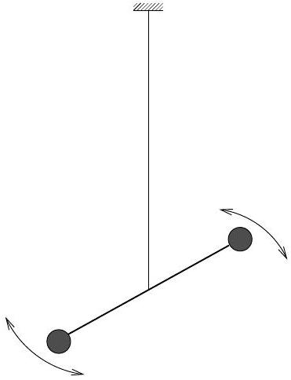
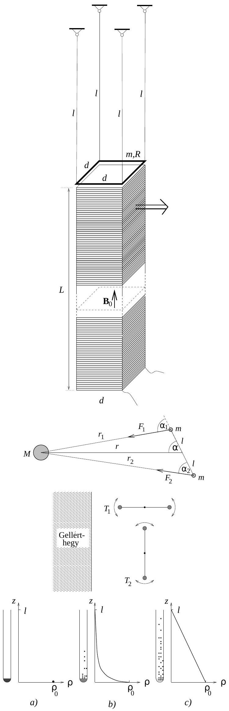
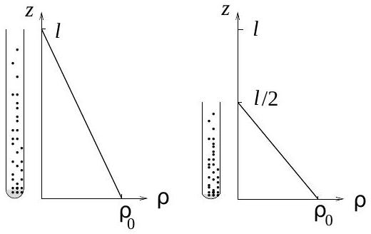

1998. október 16-án rendezte meg az Eötvös Loránd Fizikai Társulat hagyományos őszi tanulóversenyét, az Eötvösversenyt. Ismertetjük a feladatokat, mindegyik feladat helyes megoldását, majd a verseny végeredményét.
1999. Eötvös Loránd görbületi variométerében egy vékony torziós szálra középen felfüggesztett könnyü rúd végein két test helyezkedik el azonos magasságban. (l. az 1. ábrát.)

Eötvös megmérte e görbületi variométer torziós lengésidejét (kis kitérések esetén) a Gellért-hegy lábánál, egyszer úgy, hogy a vízszintes rúd egyensúlyi helyzetében a hegy közepe felé mutatott, másszor úgy, hogy erre merőleges egyensúlyi helyzet körül lengett a rúd. Az első esetben 564,6 secundumnak, a második esetben 572,2 secundumnak találta a lengésidốt.

Tegyük fel, hogy a Gellért-hegy gravitációs hatása egy a múszertő́l vízszintesen 300 méter távolságra levő, megfeleló tömegú, pontszerú test vonzásával egyenértékú. Ezek után Eötvös fenti mérési adatait felhasználva becsüljük meg, hogy a Gellért-hegy mekkora szöggel módosítja a mérés helyén a függőón irányát!
(Radnai Gyula)
Megoldás. Tekintsük a 2. ábrát!
A könnyú rúd hosszát $2 l$-lel jelöltük, a rúd végein lévő kis testek tömegét $m$-mel, a Gellért-hegyet „helyettesítő“ pontszerú test tömegét pedig $M$-mel. A rúd közepe $M$-től állandó $r = 300 \mathrm {~m}$ távolságra van; az ábra egy olyan helyzetet mutat, amikor az ábra (vízszintes) síkjában lengő rúd egyik vége $r _ { 1 }$, másik vége $r _ { 2 }$ távolságra van $M$-től. Felrajzoltuk a kis testekre ható gravitációs vonzóeróket is $\left( F _ { 1 } \right.$, ill. $\left. F _ { 2 } \right)$, amelyeket $M$ fejt ki rájuk.

Newton gravitációs törvénye szerint

$$
F _ { 1 } = \gamma \frac { m M } { r _ { 1 } ^ { 2 } } , \quad \text { illetve } \quad F _ { 2 } = \gamma \frac { m M } { r _ { 2 } ^ { 2 } }
$$

Írjuk fel ezen erők által a rúdra kifejtett $\Gamma$ gravitációs forgatónyomatékot!

$$
\Gamma = F _ { 1 } \cdot l \sin \alpha _ { 1 } - F _ { 2 } l \sin \alpha _ { 2 } .
$$

Egy-egy szinusz-tétel felhasználásával ez így is írható:

$$
\Gamma = \left( \frac { F _ { 1 } } { r _ { 1 } } - \frac { F _ { 2 } } { r _ { 2 } } \right) l r \sin \alpha = \gamma m M l r \sin \alpha \left( \frac { 1 } { r _ { 1 } ^ { 3 } } - \frac { 1 } { r _ { 2 } ^ { 3 } } \right) .
$$

Itt $\alpha , r _ { 1 }$ és $r _ { 2 }$ változnak a rúd lengése közben. Jó lenne, ha sikerülne $\Gamma$-t csupán $\alpha$ függvényeként meghatározni. Ehhez a zárójelben álló kifejezést át kell alakítanunk:

$$
\frac { 1 } { r _ { 1 } ^ { 3 } } - \frac { 1 } { r _ { 2 } ^ { 3 } } = \frac { r _ { 2 } ^ { 3 } - r _ { 1 } ^ { 3 } } { r _ { 1 } ^ { 3 } \cdot r _ { 2 } ^ { 3 } } = \frac { \left( r _ { 2 } - r _ { 1 } \right) \left( r _ { 2 } ^ { 2 } + r _ { 2 } r _ { 1 } + r _ { 1 } ^ { 2 } \right) } { \left( r _ { 1 } r _ { 2 } \right) ^ { 3 } } .
$$

Használjuk ki, hogy $l \ll r$ ! Ekkor

$$
r _ { 2 } ^ { 2 } + r _ { 2 } r _ { 1 } + r _ { 1 } ^ { 2 } \approx 3 r ^ { 2 } , \quad \left( r _ { 1 } r _ { 2 } \right) ^ { 3 } \approx r ^ { 6 } , \quad r _ { 2 } - r _ { 1 } \approx 2 l \cos \alpha
$$

(Ez utóbbi összefüggés például így látható be: A koszinusz-tétel kétszeri alkalmazásával $r _ { 2 } ^ { 2 } = l ^ { 2 } + r ^ { 2 } + 2 l r \cos \alpha$, $r _ { 1 } ^ { 2 } = l ^ { 2 } + r ^ { 2 } - 2 l r \cos \alpha , r _ { 2 } ^ { 2 } - r _ { 1 } ^ { 2 } = \left( r _ { 2 } + r _ { 1 } \right) \left( r _ { 2 } - r _ { 1 } \right) = 4 l r \cos \alpha$, innen $r _ { 2 } - r _ { 1 } \approx 2 l \cos \alpha$.)

Azt kapjuk tehát, hogy

$$
\frac { 1 } { r _ { 1 } ^ { 3 } } - \frac { 1 } { r _ { 2 } ^ { 3 } } \approx 2 l \cos \alpha \frac { 3 r ^ { 2 } } { r ^ { 6 } } = \frac { 6 l } { r ^ { 4 } } \cos \alpha
$$

Helyettesítsük ezt be $\Gamma$ fenti kifejezésébe:

$$
\Gamma = \gamma m M l r \sin \alpha \frac { 6 l } { r ^ { 4 } } \cos \alpha = \gamma \frac { m M } { r ^ { 2 } } \frac { l ^ { 2 } } { r } 3 \sin 2 \alpha .
$$

Bevezetve a $\gamma \frac { m M } { r ^ { 2 } } = F _ { 0 }$ jelölést

$$
\Gamma = 3 F _ { 0 } \frac { l ^ { 2 } } { r } \sin 2 \alpha .
$$

Mikor lesz a $\Gamma$ gravitációs forgatónyomaték zérus? Amikor $\sin 2 \alpha = 0$, vagyis $\alpha = 0$ és $\alpha = \frac { \pi } { 2 }$ esetén. Egyik az a helyzet, amikor a rúd éppen $M$ felé mutat, a másik helyzet erre merőleges. Ha csak a gravitációs erók hatnának, akkor $\alpha = 0$ a rúd stabilis egyensúlyi helyzete lenne, míg $\alpha = \frac { \pi } { 2 }$ esetén a rúd labilis egyensúlyi helyzetben lenne.

Most azonban a rúdra nem csak a gravitációs forgatónyomaték hat, hanem az elfordulás közben megcsavarodó torziós szál által kifejtett „visszatérítő“ forgatónyomaték is. Kis $\Delta \alpha$ szögkitérés esetén ez $\Delta \alpha$-val arányosnak tekinthető; az arányossági tényezőt $D ^ { * }$-gal szokás jelölni.

Ha nem lenne a gravitációs forgatónyomaték, akkor a torziós inga lengésidejét így lehetne kiszámítani: $T =$ $2 \pi \sqrt { \Theta / D ^ { * } }$, ahol $\Theta$ a rúd közepére vonatkozó tehetetlenségi nyomaték. Milyen taggal egészül ki $D ^ { * }$, ha gravitációs forgatónyomaték is fellép?

Határozzuk meg a kis $\Delta \alpha$-hoz tartozó $\Delta \Gamma$-t!

$$
\Delta \Gamma \approx \frac { d \Gamma } { d \alpha } \Delta \alpha = 6 F _ { 0 } \frac { l ^ { 2 } } { r } \cos 2 \alpha \cdot \Delta \alpha
$$

Ebből leolvasható, hogy $\alpha = 0$ esetén $D ^ { * }$ korrekciója $6 F _ { 0 } \frac { l ^ { 2 } } { r }$, míg $\alpha = \frac { \pi } { 2 }$ esetén $- 6 F _ { 0 } \frac { l ^ { 2 } } { r }$ lesz, így (3. ábra)

$$
T _ { 1 } = 2 \pi \sqrt { \frac { \Theta } { D ^ { * } + 6 F _ { 0 } \frac { l ^ { 2 } } { r } } } \quad \text { és } \quad T _ { 2 } = 2 \pi \sqrt { \frac { \Theta } { D ^ { * } - 6 F _ { 0 } \frac { l ^ { 2 } } { r } } } .
$$

Ezt a $T _ { 1 }$ és $T _ { 2 }$ lengésidőt mérte le Eötvös Loránd.
Hogyan lehet ebből kiszámítani a függőón „elhajlását”? Tegyük fel, hogy a függőónra - fonálon függő kis testre - a Föld $m g$ nagyságú függőleges irányú erőt, a Gellért-hegy pedig $F _ { 0 } = m g ^ { * }$ nagyságú vízszintes irányú erốt fejt ki. Ekkor az a pici $\delta$ szög, amivel a függőón a függőlegestől eltér, így kapható meg:

$$
\delta = \frac { g ^ { * } } { g } ,
$$

vagyis a lengésidő-képletekben $F _ { 0 }$ rejti a szükséges információt. Felírhatjuk, hogy

$$
\frac { 1 } { T _ { 1 } ^ { 2 } } - \frac { 1 } { T _ { 2 } ^ { 2 } } = \frac { 12 } { 4 \pi ^ { 2 } } \frac { F _ { 0 } l ^ { 2 } } { \Theta r } = \frac { 3 } { \pi ^ { 2 } } \frac { m g ^ { * } l ^ { 2 } } { 2 m l ^ { 2 } r } = \frac { 3 } { 2 \pi ^ { 2 } } \frac { g ^ { * } } { r } .
$$

(Felhasználtuk, hogy $\Theta = 2 m l ^ { 2 }$.) A keresett $\delta$ szög tehát

$$
\delta = \frac { g ^ { * } } { g } = \frac { 2 } { 3 } \pi ^ { 2 } \frac { r } { g } \left( \frac { 1 } { T _ { 1 } ^ { 2 } } - \frac { 1 } { T _ { 2 } ^ { 2 } } \right) .
$$

Behelyettesítve $g = 9,81 \frac { \mathrm {~m} } { \mathrm {~s} ^ { 2 } } , r = 300 \mathrm {~m} , T _ { 1 } = 564,6 \mathrm {~s} , T _ { 2 } = 572,2$ s értékeket, kapjuk:

$$
\delta = 1,7 \cdot 10 ^ { - 5 } \text { radián } = 3,4 ^ { \prime \prime } .
$$

Ezzel a feladatot megoldottuk, mégis érdemes a megoldáshoz néhány kiegészítő megjegyzést fúzni.

1. A kapott eredmény birtokában meghatározható a vonzócentrum tömege! Minthogy $F _ { 0 } = \gamma m M / r ^ { 2 } = m g ^ { * }$, ezért $M = g ^ { * } r ^ { 2 } / \gamma = 2,2 \cdot 10 ^ { 11 } \mathrm {~kg}$. A Föld átlagos $\varrho = 5000 \mathrm {~kg} / \mathrm { m } ^ { 3 }$ sürǘségét felhasználva becslést adhatunk a vonzócentrum térfogatára is: ez 44 millió köbméter lesz, ami egy 219 méter sugarú gömb vagy egy 353 méter élhosszúságú kocka térfogata. A Gellért-hegy meglehetősen szabálytalan alakú, ezért keresett azután Eötvös egy szabályosabb alakú hegyet az országban. A Szombathely közelében lévő Ság-hegy csonkakúp alakja nyerte meg tetszését, itt készült az a ma már híres fénykép, amelyen a mérést végző Eötvös látható munkatársaival: Tangl Károllyal, Bodola Lajossal és Kövesligethy Radóval.

2. Visszatérve a feladat megoldására, a helyes végeredménnyel azonos nagyságrendú eredmény adódhat a fentinél valamivel durvább közelítések esetén is. Sok versenyző feltételezte mindjárt a megoldás elején, hogy mivel $r \gg l$, ezért az $F _ { 1 }$ és $F _ { 2 }$ erók gyakorlatilag párhuzamosak egymással. Ezzel a feltételezéssel élve a következő eredmény adódik:

$$
\delta = \pi ^ { 2 } \frac { r } { g } \left( \frac { 1 } { T _ { 1 } ^ { 2 } } - \frac { 1 } { T _ { 2 } ^ { 2 } } \right) = 2,5 \cdot 10 ^ { - 5 } \text { radián. }
$$

Ha nemcsak az erők párhuzamosságát tételezi fel valaki, hanem még azt a kis eltérést is elhanyagolja, amivel a „meróleges" helyzetú torziós inga lengésideje eltér a gravitáció nélküli esettől, tehát a $T _ { 2 } = T = 2 \pi \sqrt { \Theta / D ^ { * } }$ közelítéssel él, akkor a következő eredményt kapja:

$$
\delta = 2 \pi ^ { 2 } \frac { r } { g } \left( \frac { 1 } { T _ { 1 } ^ { 2 } } - \frac { 1 } { T _ { 2 } ^ { 2 } } \right) = 5 \cdot 10 ^ { - 5 } \text { radián. }
$$

Ezek a megoldások sem „rosszak”, csak rosszabb, durvább közelítések, mint amit a helyes megoldásnál kaptunk. A Versenybizottság - ha nem is teljes pontszámmal, de - értékelte ezeket a megoldásokat is.
2. Két egyenes, függőlegesen álló, felül nyitott kémcső közül az egyik 20 cm, a másik 40 cm magas. Keresztmetszetük egyforma. Az elsóbe $1 \mathrm {~cm} ^ { 3 }$, a másikba $2 \mathrm {~cm} ^ { 3 }$ kölnivizet töltünk. Vajon körülbelül hányszor több idő alatt párolog el teljesen a kölni a második kémcsőből, mint az elsőből?

Módosul-e a válasz, ha mindkét kémcsövet leragasztjuk, és a fedólapokon csupán egy-egy parányi (egyforma) nyílást hagyunk?
(Károlyházy Frigyes)
Megoldás. Hogyan párolog a kölnivíz? Ugyanúgy, mint minden más folyadék. A felszín közelében dinamikus egyensúly alakul ki a folyadékból kilépő és a folyadékba belépő molekulák között. Az egyes molekulák szempontjából mindkét folyamat véletlenszerú. Mindaddig, amíg a gőzben nincs elég molekula ahhoz, hogy ez a „telítési” gőznyomás érték beálljon, több molekula lép ki a folyadékból, mint amennyi visszacsapódik oda. Ekkor még a gőz nincs egyensúlyi állapotban, súrúsége helyről helyre változhat. Ha levegő is van jelen, akkor a gőz és a levegő keverékében a folyadék felszíne közelében a legnagyobb a gőz koncentrációja, attól távolodva fokozatosan csökken. Ez a koncentráció-gradiens (koncentráció-esés) idézi elő a „kölnimolekulák” diffúzióját a levegőn keresztül. Ennek tanulmányozásával oldhatjuk meg a feladatot.

A Négyjegyú függvénytáblázatok... 124. oldalán szerepel az alábbi összefüggés (Fick-törvény):

$$
\frac { \Delta m } { \Delta t } = - D A \frac { \Delta \varrho } { \Delta z } .
$$

Itt $\frac { \Delta \varrho } { \Delta z }$ jelenti a $z$ tengely irányú sűrúség-gradienst a gáztérben: esetünkben a kölnigőz függőleges sürúségeloszlásáról van szó. Ez arányos az $A$ keresztmetszeten időegység alatt átáramló anyag tömegével, a $\frac { \Delta m } { \Delta t }$ tömegárammal, esetünkben a kölnimolekulák tömegáramával. Az áram mindig a nagyobb koncentrációjú helyről folyik a kisebb koncentrációjú hely felé, ezért $\frac { \Delta m } { \Delta t }$ és $\frac { \Delta \varrho } { \Delta z }$ mindig ellentétes előjelüek. A törvényben éppen azért szerepel a negatív előjel, hogy a folyamatra jellemző $D$ arányossági tényező - az ún. diffúziós állandó - pozitív lehessen.

Gondoljuk át, hogyan változik a kölnigőz sürúségeloszlása a függőleges kémcsőben a betöltés pillanatától kezdve mindaddig, amíg beáll valamilyen - ha nem is egyensúlyi, de legalább időben állandó állapot (4. ábra).
4. ábra. Nyitott kémcső esetén a kölnigőz sứrứsége a magasság függvényében: a) kezdetben; b) kicsit később; c) az állandósult állapotban.

Felül nyitott kémcső esetén a kölni betöltésének pillanatában a kémcső levegővel van tele; a kölnigőz sürúsége zérus. Kicsit később már lesznek a csőben „kölnimolekulák”, a kölnigőz sürúsége a magassággal rohamosan csökken, csak közvetlenül a folyadék felszínénél éri el az egyensúlyi, telített gőz állapotát lényegében elérő súrúséget. Lassanként egyre több kölnimolekula lesz a kémcsőben lévő levegőben, és előbb-utóbb beáll egy olyan egyenletes eloszlás, amikor a súrúség-gradiens álladó, vagyis a súrúség a magassággal lineárisan csökken. Feltételezhetjük, hogy a nyitott kémcső tetején annyi a kölnigőz sürúsége, mint a szobában, tehát gyakorlatilag mindvégig zérus.

A 4.c) ábrán látható állandósult sürúségeloszlás mindaddig fennmarad, amíg a kémcső alján lévố kölnivíz teljesen el nem párolog.

Ezek után hasonlítsuk össze a hosszú (40 cm-es) és a rövid (20 cm-es) kémcsőben az állandósult súrúségeloszlásokat (5. ábra)!
5. ábra. Az állandósult sữrứségeloszlások a felül nyitott hosszú és rövid kémcsốben.

Látszik, hogy a $\frac { \Delta \varrho } { \Delta z }$ hányados a fele hosszúságú kémcsőben kétszer akkora, tehát itt a $\frac { \Delta m } { \Delta t }$ párolgási sebesség is kétszerese a másikénak. Mivel a hosszú kémcsőbe ráadásul kétszer annyi kölnivizet is töltöttünk, ezért jó közelítéssel négyszer annyi idő alatt párolog el $2 \mathrm {~cm} ^ { 3 }$ kölnivíz a 40 cm hosszú kémcsőből, mint $1 \mathrm {~cm} ^ { 3 }$ kölnivíz a 20 cm-esből.

Válaszoljunk még arra a kérdésre, hogy mi történne, ha mindkét kémcső tetejét annyira leragasztanánk, hogy a fedőlapokon csupán egy-egy parányi (egyforma) nyílás maradna. Módosulna-e az előző válasz? Természetesen igen,

hiszen új, az előzőtől eltérő sűrúségeloszlás alakulna ki mindkét kémcsőben. Ha ugyanis csak egy nagyon pici nyíláson tud párologni a kölnigőz a kémcsőből, akkor jó közelítéssel feltételezhetjük, hogy gyakorlatilag az egész kémcsőben telített lesz a gőz, végig ugyanannyi lesz a súrúsége. A párolgás sebességét a lyuk piciny keresztmetszete, valamint a lyuknál kialakuló (nagy) súrúség-gradiens határozza meg. Ennek értéke azonban már nem függ attól, hogy milyen hosszú a kémcső. Ebben az esetben tehát csak az számít, hogy az egyik kémcsőből kétszer annyi kölnivíznek kell eltávoznia, mint a másikból, amihez pedig kétszer annyi idốre van szükség.

A feladatot megoldottuk, foglaljuk össze azonban, hogy milyen feltételezésekkel éltünk a megoldás során, mert ezek érvényességének mértéke határozza meg becsléseink pontosságát. Megoldásunk lényege az volt, hogy a kémcsövekben kialakuló állandósult állapotokat hasonlítottuk össze. Az állandósult állapot kialakulásának, beállásának idejét elhanyagoltuk a teljes elpárolgáshoz szükséges időhoz képest. Mennyire jogos a fenti elhanyagolás? Ez a konkrét adatoktól függ. Tapasztalat szerint még nyitott kémcső esetén is napokban mérhető az elpárolgási idő, az állandósult sürúségeloszlás pedig 5-10 perc alatt beáll a feladatban szereplő adatok esetén. Mérések szerint a párolgás valóban kb. 2-szer gyorsabb a rövidebb kémcsőnél, mint a hosszabbnál.

Elhanyagoltuk még a folyadék térfogatát a kémcsó térfogatához képest; feltételeztük, hogy a folyamatok ugyanazon az állandó hőmérsékleten történtek; nem figyeltünk arra, hogy a kölniből hamarabb párolog el az alkohol, mint a víz; feltételeztük a Fick-törvény (lineáris összefüggés!) érvényességét; elhanyagoltuk a levegőben mindig meglévő szennyeződések hatását, amelyek a folyadék felszínén vékony (molekuláris) rétegben lerakódva azon olyan „filmet” képezhetnek, ami jelentősen fékezheti a folyadék párolgását.
3. Egy szolenoid keresztmetszete $d$ oldalélú négyzet, hossza $L ( L \gg d )$. A tekercsben folyó egyenáram hatására mélyen a szolenoid belsejében $B _ { 0 }$ indukciójú homogén mágneses maző alakul ki. A tekercset függőlegesen helyeztük el. Közvetlenül a tekercs felső vége felett egy ugyancsak $d$ oldalélú, négyzet alakú, vízszintes vezető keret függ $l$ hosszúságú fonalakon $( l \gg d )$, a 6. ábrán látható módon. A keret tömege $m$, elektromos ellenállása $R$.

A szolenoidot hirtelen vízszintesen, jobb felé elrántjuk. Melyik irányban lendül ki és milyen magasra emelkedik fel az ingaszerúen felfüggesztett keret?
(Gnädig Péter)
Megoldás.
Gondoljuk át a folyamatot! Az ingaszerúen felfüggesztett keret mágneses mezőbe merül. Ha „kimegy alóla” a szolenoid, kimegy a mező is - ez pedig feszültséget indukál a keretben. A fellépő indukált áramra hat a távozóban lévő mágneses mező, ami a józan sejtés szerint maga után rántja a keretet is. Mindezeket a sejtéseket megfelelő fizikai törvényekkel kell még alátámasztanunk (vagy megcáfolnunk), s a kvantitatív törvények alkalmazásával majd arra is válaszolni tudunk, hogy milyen magasra emelkedik fel a keret.

A megoldás egyik kulcskérdése az, hogy mit állíthatunk arról a mágneses mezőről, amibe belemerül a keret. Tudjuk, hogy a mágneses indukcióvektor nagysága mélyen a tekercs belsejében $B _ { 0 }$, de milyen a mágneses mező a szolenoid végén? Az is elég lenne, ha a fluxust meg tudnánk határozni.

Egy kis gondolatkísérlet segíteni fog. Tudjuk, hogy a fluxus mélyen a szolenoid belsejében: $B _ { 0 } \cdot A = B _ { 0 } \cdot d ^ { 2 }$. Gondolatban vágjuk itt a szolenoidot vízszintesen ketté! Nem kell a huzalt is elvágnunk, csupán gondoljuk azt, hogy itt két, azonos keresztmetszetú és menetemelkedésú, azonos árammal átjárt tekercs van összetolva. Nyilvánvaló, hogy mindkét tekercs azonos mértékben járul hozzá az itt kialakuló fluxushoz, amiből pedig már következik, hogy a mágneses fluxus a szolenoid végénél: $\frac { 1 } { 2 } B _ { 0 } d ^ { 2 }$.

Nem állíthatjuk azt, hogy a mágneses mezó a szolenoid végén is homogén; a $B$ vonalak széthajlanak. Azt azonban bizton állíthatjuk, hogy a mágneses indukcióvektor függőleges komponense a tekercs végénél mindenhol $\frac { 1 } { 2 } B _ { 0 }$ nagyságú.

A $d$ élhosszúságú, négyzet alakú keret tehát egy olyan mágneses mezőbe merül, amelynek fluxusa $\Phi = \frac { 1 } { 2 } B _ { 0 } d ^ { 2 }$. Amikor - mondjuk $\Delta t$ idő alatt - elrántjuk a szolenoidot, ez a fluxus zérusra csökken. Így a keretben indukálódó feszültség nagysága:

$$
\left| U _ { \mathrm { ind } } \right| = \left| \frac { \Delta \Phi } { \Delta t } \right| = \frac { B _ { 0 } d ^ { 2 } } { 2 \Delta t } .
$$

A $\Delta t$ idő alatt megszűnő fluxus által a keretben indukált áram nagysága:

$$
I = \frac { 1 } { R } \frac { B _ { 0 } d ^ { 2 } } { 2 \Delta t } .
$$

Tételezzük fel, hogy pontosan ekkora áram folyik $\Delta t$ időn keresztül a keretben - addig és csak addig, amíg változik a fluxus. De hát eközben a keret jobb oldali, $d$ hosszúságú szakaszára (az itt folyó áramra) még erót fejt ki a mágneses mező! Írjuk fel az erre ható erőlökést:

$$
F \cdot \Delta t = B I d \cdot \Delta t = \frac { B _ { 0 } } { 2 } \frac { 1 } { R } \frac { B _ { 0 } d ^ { 2 } } { 2 \Delta t } d \cdot \Delta t
$$

Ez a keretnek $m v _ { 0 } = F \Delta t = \frac { B _ { 0 } ^ { 2 } d ^ { 3 } } { 4 R }$ lendületet ad. A keret tehát

$$
v _ { 0 } = \frac { B _ { 0 } ^ { 2 } d ^ { 3 } } { 4 R m }
$$

sebességgel kilendül, és felemelkedik

$$
h = \frac { v _ { 0 } ^ { 2 } } { 2 g } = \frac { B _ { 0 } ^ { 4 } d ^ { 6 } } { 32 R ^ { 2 } m ^ { 2 } g }
$$

magasságra.
Már csak azt kell meghatároznunk, hogy milyen irányban lendül ki a keret. A feladathoz tartozó ábráról leolvasható, hogy a mágneses indukcióvektor a szolenoid belsejében függőlegesen felfelé irányul. A szolenoid elrántása közben a keretben olyan irányú áram indukálódik, amelyik (Lenz törvénye alapján) a keret fluxusának csökkenését akadályozni igyekszik. Ezek szerint az indukált áram a keretben felülről nézve az óramutató járásával ellentétes irányú, mivel az ebből származó indukcióvektor mutat felfelé. A keret jobb oldali szakaszán ezek szerint befelé, hátrafelé folyik az indukált áram. Ez $\Delta t$ ideig bemerül egy olyan mágneses mezőbe, amelyben a mágneses indukcióvektor függőleges komponense felfelé mutat. Az erre ható erő pedig jobbra irányul!

Tehát a keret jobbra fog kilendülni. Helyes volt a sejtésünk, az elrántott tekercs maga után rántja a keretet.
Érdemes még kitérnünk arra, hogy valójában a keretben folyó áram nem lesz végig ugyanakkora, csupán az átlagértéke az az $I$, amit kiszámítottunk. Ennek megfelelően az áramra ható erő sem állandó, viszont az $F _ { \text {átl } } \cdot \Delta t$ szorzat pontosan megadja azt a vízszintes erőlökést, amit a keret kap.

Természetesen ahhoz is időre van szükség, hogy a keret sebessége nulláról $v _ { 0 }$-ra nőjön, az eközben megtett utat elhanyagoltuk a fenti megoldásban. Ez a szokásos elhanyagolás a ballisztikus inga és sok hasonló ütközési folyamat tárgyalásából ismerős. Eredményünk tehát most is csak közelítő érvényú, pontossága a közelítés jogosságától függ. A feladat ugyan paraméteresen lett kitúzve, az „elrántás” szó utalt azonban arra, hogy a fenti közelítést joggal alkalmazhatjuk.

## A verseny eredménye

Elsǒ díjat és vele 6 ezer forintos pénzjutalmat nyertek:
Sarlós Ferenc, a JATE fizikus hallgatója, aki a bajai III. Béla Gimnáziumban érettségizett mint Polgár László, Szkladányi András és Hilbert Margit tanítványa;

Végh Dávid, az ELTE fizikus hallgatója, aki a Fazekas Mihály Fővárosi Gyakorló Gimnáziumban érettségizett mint Horváth Gábor tanítványa.

Második díjat és vele 5 ezer forintos pénzjutalmat nyertek:
Rozsonday Gerzson, a debreceni KLTE Gyakorló Gimnáziumának 12. osztályos tanulója, Kirsch Éva és Szegedi Ervin tanítványa;

Somogyi Gábor, a KLTE fizikus hallgatója, aki a debreceni Tóth Árpád Gimnáziumban érettségizett mint Baló Péter tanítványa;

Terpai Tamás, a Fazekas Mihály Fốvárosi Gyakorló Gimnázium 12. osztályos tanulója, Horváth Gábor tanítványa.
Harmadik díjat és vele 4 ezer forintos pénzjutalmat nyertek:
Gulyás Nándor, a mezókovácsházai Hunyadi János Gimnázium 12. osztályos tanulója, Sallai István és Varga István tanítványa;

Hegedũs Åkos, a pécsi ciszterci Nagy Lajos Gimnázium 11. osztályos tanulója, Orovica Márkné tanítványa;
Kormos Márton, az ELTE fizikus hallgatója, aki a debreceni KLTE Gyakorló Gimnáziumban érettségizett mint Szegedi Ervin és Farkas József tanítványa;

Máthé András, a budapesti ELTE Apáczai Csere János Gyakorló Gimnázium 11. osztályos tanulója, Flórik György tanítványa;

Szõke Szilárd-Zsigmond, a temesvári Müszaki Egyetem (Traian Vuia Politechnica) mérnök hallgatója, aki a temesvári Bartók Béla Líceumban érettségizett mint Toró T. Tibor és Benedek István tanítványa.

Dicséretet kaptak a verseny 11-18. helyezettjei:
Bálint Imre, az ELTE fizikus hallgatója, aki Szegeden, a JATE Ságvári Endre Gyakorló Gimnáziumban érettségizett mint Homolya Ernő tanítványa;

Császár Balázs, a BME mérnök-fizikus hallgatója, aki a szombathelyi premontrei rendi Szent Norbert Gimnáziumban érettségizett mint Heigl István és Kovács László tanítványa;

Katona Gergely, a budapesti ELTE Trefort Ágoston Gyakorlóiskola 12. osztályos tanulója, Szörényi Zoltán tanítványa;

Nagy Kálmán, a budapesti Veres Péter Gimnázium 12. osztályos tanulója, Varga Mária tanítványa;

Pogány Ádám, az ELTE fizikus hallgatója, aki a Fazekas Mihály Fốvárosi Gyakorló Gimnáziumban érettségizett mint Horváth Gábor tanítványa;

Rácz Balázs, a budapesti Veres Péter Gimnázium 12. osztályos tanulója, Varga Mária tanítványa;
Tóth Bálint, a Fazekas Mihály Fővárosi Gyakorló Gimnázium 12. osztályos tanulója, Horváth Gábor és Dvorák Cecília tanítványa;

Tóth Gyula, a debreceni Tóth Árpád Gimnázium 12. osztályos tanulója, Kovács Miklós tanítványa.
Az ünnepélyes eredményhirdetésre a BME Fizikai Intézetében került sor 1998. november 20-án.
A megjelent versenyzőket és tanáraikat a házigazdák nevében Kertész János egyetemi tanár üdvözölte, majd a Versenybizottság elnöke emlékezett meg a 100 évvel ezelőtti versenyről s annak nyerteseiről. Az első díjat akkor Kármán Tódor nyerte, akinek Beke Manó volt tanára a budapesti Mintagimnáziumban. A második díjas Gróffits Gábor is a budapesti múegyetemen szerzett mérnöki diplomát, akárcsak Kármán Tódor.

Ezután a feladatok megoldásának diszkussziója következett, amelyhez Härtlein Károly mutatott be érdekes kísérleteket. A második feladathoz kapcsolódó mérést s ennek számítógépes kiértékelését videón tekinthették meg a jelenlévők.

A díjakat az Eötvös Loránd Fizikai Társulat fótitkára: Nagy Dénes Lajos és helyettese, a Versenybizottság elnöke adta át, aki köszönetet mondott a Nemzeti Tankönyvkiadónak és a TypoTeX Könyvkiadónak a felajánlott könyvutalványokért és könyvekért.

A díjkiosztáson megjelent Dolinszky Tamás is, aki 1939-ben nyert díjat a versenyen.
Radnai Gyula

