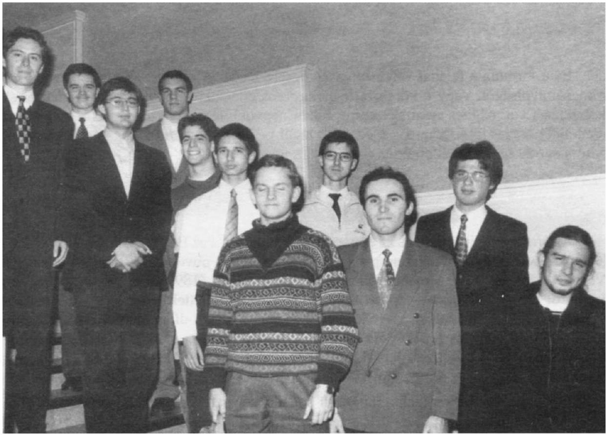
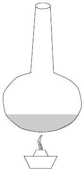
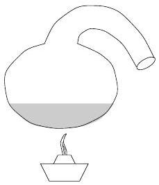
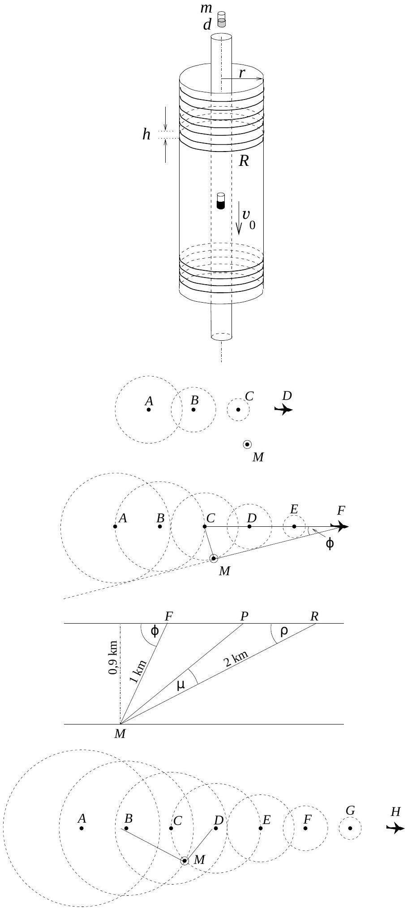

3. Hosszú, keskeny, függőleges üvegcsövet egy vele azonos tengelyü, de sokkal szélesebb, $r$ külső sugarú másik üvegcső vesz körül. E szélesebb csövön sürün, egymástól $h$ távolságra elhelyezkedő, $R$ ellenállású körvezetők vannak.

Ha a keskeny csőbe egy $m$ tömegú, $d$ erősségú (mágneses dipólnyomatékú) kicsiny rúdmágnest ejtünk, az viszonylag hamar elér egy állandó $v _ { 0 }$ sebességet, amellyel egyenletesen süllyed.(6. ábra.)

További kísérleteink során a fenti öt mennyiség $( m , d , h , R , r )$ közül az egyiket mindig a kétszeresére növeljük, miközben a másik négyet nem változtatjuk meg. Hányszorosára nő az egyes esetekben a kicsiny rúdmágnes állandósult végsebessége?

Az eredeti eset: $m , d , h , R , r$; ekkor $v = v _ { 0 }$.

a) $( 2 m , d , h , R , r ) ; v _ { a } / v _ { 0 } =$ ?
b) $( m , 2 d , h , R , r ) ; v _ { b } / v _ { 0 } =$ ?
c) ( $m , d , 2 h , R , r$ ); $v _ { c } / v _ { 0 } =$ ?
d) $( m , d , h , 2 R , r ) ; v _ { d } / v _ { 0 } =$ ?
e) $( m , d , h , R , 2 r ) ; v _ { e } / v _ { 0 } =$ ?

A mechanikai súrlódástól és a közegellenállástól, továbbá a körvezetók önindukciójától és kölcsönös indukciójától eltekinthetünk.
(Gnädig Péter)
Megoldás ${ } ^ { 1 }$. Számítsuk ki, mennyi energia disszipálódik (mennyi $Q$ hő fejlődik) egyetlen körvezetőben, miközben a mágnes keresztülesik rajta. Kétféleképpen is következtethetünk erre a $Q$ mennyiségre: egyrészt az energiaviszonyok összevetéséből, másrészt dimenzionális megfontolásokból.

Ha az $m$ tömegü mágnes egyenletesen mozog függőlegesen lefelé a csőben és $L$ utat tesz meg, helyzeti energiája $m g L$ értékkel csökken. Eközben áthalad $L / h$ darab körvezetőn, mindegyikben $Q$ hốt fejleszt, és mivel a mágnes mozgási energiája nem változik, fenn kell álljon, hogy

$$
m g L = Q L / h , \quad \text { azaz } \quad Q = m g h .
$$

Milyen fizikai mennyiségektől és milyen módon függhet $Q$ ? Nyilván függ a hőfejlődés a kicsiny mágnes jellemzőitől (a $d$ dipólnyomatéktól és a $v$ sebességtől), továbbá a körvezető adataitól (az $r$ sugártól és a vezető $R$ elektromos ellenállásától):

$$
Q = F ( d , v , r , R ) ,
$$

ahol $F$ valamilyen négyváltozós függvény, melynek pontos (vagy legalább arányossági tényezők erejéig határozott) alakja megadná a feladat valamennyi kérdésére a választ.

Ha dimenzionális megfontolásokkal akarjuk „kitalálni”, hogyan függ $F ( d , v , r , R )$ az egyes változóitól, nem szabad megfeledkeznünk arról, hogy $Q$ a felsorolt mennyiségek mellett függhet még $\mu _ { 0 }$-tól (a vákuum permeabilitásától), ami

[^0]
ugyan nem változó, hanem egy meghatározott mértékegységú és nagyságú mennyiség, de a hőfejlődés képletében (lévén az mágnességgel kapcsolatos folyamatok eredménye) ez a fizikai állandó is felbukkanhat. A keresett összefüggés tehát

$$
Q = G \left( d , v , r , R , \mu _ { 0 } \right) ,
$$

alakú, ahol $G$ egy ötváltozós függvény, melyet azonban az SI itt előforduló négy alapmértékegységének $( \mathrm { kg } , \mathrm { m } , \mathrm { s } , \mathrm { A } )$ vizsgálatából nem lehet meghatározni.

A feladat mégis megoldható a dimenzióanalízis módszerével, ugyanis a hőfejlődés és az $R$ ellenállás közötti összefüggés (a többi adat rögzített értéke mellett) fordított arányosság kell legyen (azaz $Q \propto 1 / R$ ), hiszen az áram hőhatása (adott módon változó indukált feszültség mellett) az ellenállás reciprokával arányos. Mondhatjuk tehát, hogy

$$
Q \propto \frac { 1 } { R } f \left( d , v , r , \mu _ { 0 } \right) ,
$$

ahol $f \left( d , v , r , \mu _ { 0 } \right)$ már csak 4 fizikai mennyiségtől függ.
Írjuk fel az egyes fizikai mennyiségek mértékegységét:

$$
[ Q ] = \frac { \mathrm { kg } \mathrm {~m} ^ { 2 } } { \mathrm {~s} ^ { 2 } } , \quad [ 1 / R ] = \frac { \mathrm { s } ^ { 3 } \mathrm {~A} ^ { 2 } } { \mathrm {~kg} \mathrm {~m} ^ { 2 } } \quad [ v ] = \frac { \mathrm { m } } { \mathrm {~s} } , \quad [ d ] = \mathrm { Am } ^ { 2 } , \quad [ r ] = \mathrm { m } , \quad \left[ \mu _ { 0 } \right] = \frac { \mathrm { kg } \mathrm {~m} } { \mathrm {~A} ^ { 2 } \mathrm {~s} ^ { 2 } }
$$

Ha a keresett $f$ függvényt hatványfüggvény alakban próbáljuk felírn. ${ } ^ { 2 }$ :

$$
h \left( d , v , r , \mu _ { 0 } \right) \propto d ^ { \alpha } \cdot v ^ { \beta } \cdot r ^ { \gamma } \cdot \mu _ { 0 } ^ { \delta }
$$

akkor a 4 független mértékegység hatványainak összehasonlításából a kitevőkre

$$
\alpha = 2 , \quad \beta = 1 , \quad \gamma = - 3 , \quad \delta = 2
$$

adódik. Ezek szerint

$$
Q = m g h \propto \frac { \left( \mu _ { 0 } d \right) ^ { 2 } v } { R r ^ { 3 } } ,
$$

vagyis a mágnes esési sebességének és a többi paraméternek a kapcsolata:

$$
v \propto \frac { m h R r ^ { 3 } } { d ^ { 2 } } .
$$

Ez a formula a feladat valamennyi kérdésére megadja választ: akár a tömeget, akár a menettávolságot, vagy a körvezetők elektromos ellenállását növeljük az eredeti érték kétszeresére, a mágnes esési sebessége 2-szer nagyobb lesz. Kétszer erősebb mágnes az eredetinél 4-szer lassabban fog mozogni, végül pedig a körvezetők sugarának kétszerezése a sebességet az eredeti érték 8-szorosára növeli.

Az eredményhirdetésre és az ünnepélyes díjkiosztásra az ELTE új, lágymányosi épületének egyik nagyobb előadótermében került sor 1999. november 19-én. Itt először a Versenybizottság elnöke megemlékezett Sztrókay Pálról (1899-1965) és Náray-Szabó Istvánról (1899-1972), akik éppen száz évvel ezelőtt születtek, s az 1917. évi tanulóversenyen az 1. és 2. díjat nyerték. Sztrókay Pál Kossuth-díjas mérnök lett, a Ganznál a villamos vontatás fejlesztésén dolgozott, Kandó Kálmán utáni második emberként. Náray-Szabó István nemzetközi tekintélyú vegyészprofesszor lett, a fizika és a kémia határterületén alkotott: röntgendiffrakcióval kutatta az anyag kémiai-fizikai szerkezetét.

A rövid megemlékezések után került sor idei feladatok megoldásának diszkussziójára. Az elsó feladat megoldását Radnai Gyula, a másodikat az egyik versenyző (Tóth Bálint), a harmadikat Gnädig Péter mutatta be. A harmadik feladathoz kapcsolódóan, azt modellezve kísérleteket is láthattak a megjelentek: más-más falvastagságú, más-más fémből készült csöveknél különböző erősségü rúdmágnesek esési idejét figyelhették meg, s így összehasonlíthatták különféle körülmények között kialakuló örvényáramok fékező hatását.

Az ünnepélyes eredményhirdetésen Fehér István, az ELFT alelnöke adta át (a feladatok kitúzőiből álló) Versenybizottság által odaítélt díjakat. A Társulat által biztosított pénzjutalmak mellett a Nemzeti Tankönyvkiadótól könyvutalványokat kaptak a díjazott versenyzők, akiknek jelen levő tanárai a Műszaki Kiadó és a Tankönyvkiadó ajándék-könyveibő̌l válogathattak. Sajnos nem mindenki tudott eljönni: az éppen a díjkiosztás napján kitört hóvihar miatt maradt le az ünnepségről néhány régi Eötvös-verseny nyertes is.

[^1]

7. ábra

Az 1999. évi Eötvös-verseny díjazottai (fentról lefelé, balról jobbra): Péterfalvi Csaba Géza, Terpai Tamás, Gáspár Merse Előd, Buruzs Ádám, Katona Gergely, Csillag Kristóf, Hegedús Ákos, Patay Gergely, Tóth Bálint, Pesti Gábor és Czigler István.

A mostani verseny eredménye a következő:
Elsó́ díjat kapott: Terpai Tamás, az ELTE matematikus hallgatója, aki a Fazakas Mihály Fővárosi Gyakorló Gimnáziumban érettségizett mint Horváth Gábor tanítványa.
Második díjat kapott a verseny 2-6. helyezettje: Hegedũs Åkos, a pécsi ciszterci Nagy Lajos Gimnázium 12. osztályos tanulója, Orovica Márkné tanítványa; Katona Gergely, az ELTE fizikus hallgatója, aki a budapesti ELTE Trefort Ágoston Gyakorlóiskolában érettségizett mint Szörényi Zoltán tanítványa; Pesti Gábor, a nagykanizsai Batthyány Lajos Gimnázium 11. osztályos tanulója, Piriti János tanítványa; Péterfalvi Csaba Géza, az ELTE geofizikus hallgatója, aki a szekszárdi Garay János Gimnáziumban érettségizett mint Bayer József tanítványa; Tóth Bálint, az ELTE fizikus hallgatója, aki a Fazakas Mihály Fővárosi Gyakorló Gimnáziumban érettségizett mint Horváth Gábor tanítványa.
Harmadik díjat kapott a verseny 7-10. helyezettje: Béky Bence, a Fazakas Mihály Fővárosi Gyakorló Gimnázium 10. osztályos tanulója, Horváth Gábor tanítványa; Csillag Kristóf, a püspökladányi Karacs Ferenc Gimnázium 12. osztályos tanulója, Lajtosné Buzási Márta tanítványa; Gáspár Merse Elöd, a Fazakas Mihály Fốvárosi Gyakorló Gimnázium 12. osztályos tanulója, Horváth Gábor tanítványa; Patay Gergely, a debreceni Tóth Árpád Gimnázium 12. osztályos tanulója, Kovács Miklós és Szegedi Ervin tanítványa.
Dicséretben részesült a verseny 11-13. helyezettje: Buruzs Ådám, a szegedi Radnóti Miklós Gimnázium 12. osztályos tanulója, Mike János tanítványa; Czigler István, a budapesti Lauder Javne Gimnázium 12. osztályos tanulója, Tóth Eszter tanítványa; Kenyeres Péter, a POTE orvostanhallgatója, aki a zalaegerszegi Zrínyi Miklós Gimnáziumban érettségizett mint Pálovics Róbert tanítványa.

Az 1. díjas versenyző 10000 Ft pénzjutalmat és 5000 Ft értékú könyvutalványt, a 2. díjasok 6000 Ft pénzjutalmat és 4000 Ft értékú könyvutalványt, a 3. díjasok 4000 Ft pénzjutalmat és 4000 Ft értékú könyvutalványt, a dicséretben részesültek 3000 Ft értékú könyvutalványt kaptak.

Gratulálunk a nyerteseknek és tanáraiknak!
Gnädig Péter, Radnai Gyula

[^0]:    ${ } ^ { 1 }$ Terpai Tamás dolgozata alapján

[^1]:    ${ } ^ { 2 }$ Belátható, hogy ezt az általánosság megszorítása nélkül megtehetjük.
