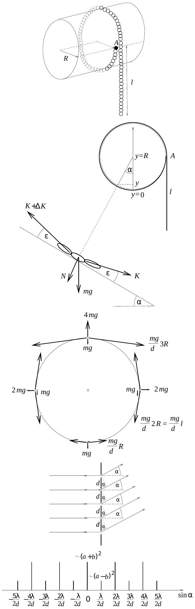
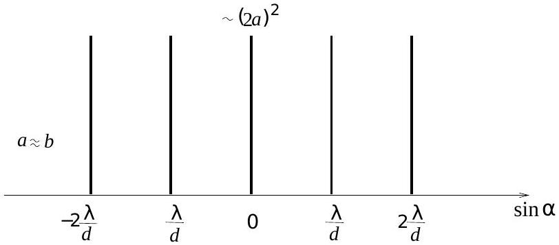
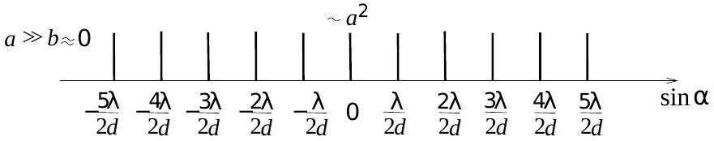

2000. október 20-án rendezte meg az Eötvös Loránd Fizikai Társulat hagyományos őszi tanulóversenyét, az Eötvösversenyt. Összesen 167 versenyző adott be dolgozatot, közöttük egy vietnami és egy román állampolgár, mindketten az ELTE elsóéves fizikus hallgatói.

Ismertetjük a feladatokat, a feladatok helyes megoldását, majd a verseny végeredményét.

1. Egy R sugarú, sima felületũ, vízszintes helyzetű, rögzített hengerhez egy apró szemũ láncot kötünk úgy, hogy egyik végét a paláston, a henger tengelyével azonos magasságban levố $A$ pontban rögzítjük, majd a láncot egyszer átvetjük a hengeren.

Legalább mekkora legyen a függólegesen lelógó rész l hossza, hogy a lánc többi része mindenhol a henger palástjához simuljon?
(Varga István)
Megoldás. Mindenek előtt azt vegyük észre, hogy ez a probléma nem a jól ismert dinamikai feladat-család egyik eleme, amikor is a hengerről lecsavarodó lánc felpörgeti a hengert! Most a henger rögzített, és rögzített az $A$ pont is, a lánc egyik vége. Legfeljebb az fordulhatna elő, hogy az alul kihasasodó lánc egyre jobban elválik a hengertől, s magával rántja, lehúzza az egész láncot. Persze ez se fordulhat elő, ha a lánc függőlegesen lelógó része elég hosszú. Mennyi ez az „elég”? Ez a kérdés. Vagyis ez egy sztatika feladat, amiben a lánc egyensúlyát kell megvizsgálnunk! (Az igaz, hogy nem éppen a legegyszerűbb feladatok közül való, ezért is jelentett kellemes meglepetést a Versenybizottságnak, hogy 18 olyan versenyző volt, aki hibátlan megoldást adott rá.)

Készítsünk ábrát, melyen egyrészt a hengerhez símuló és jobb oldalt lelógó láncot látjuk, majd ennek egy kicsiny, kinagyított részét, s ezen ábrázoljuk valamelyik kiválasztott láncszemre ható erőket! Jelöljük egyetlen láncszem tömegét $m$-mel, átmérőjét (két egymás melletti láncszem középpontjának távolságát) $d$-vel! Válasszuk ki az 2. ábrán $\alpha$ szöggel (illetve $y$ függőleges koordinátával) megjelölt helyzetü láncszemet, s ábrázoljuk az erre ható eróket:
$m g$ nehézségi erő hat rá függőlegesen lefelé;
$N$ nyomóerőt fejt ki rá a henger sugár irányban (az érintőre merőlegesen);
$K$ eröt fejt ki rá a jobb oldali szomszédja;
$K + \Delta K$ erót fejt ki rá a bal oldali szomszédja.
E két utóbbi húzóeró, amit a szomszédos láncszemek fejtenek ki rá, nem esik egy egyenesbe, hanem a henger görbületének megfelelően $\varepsilon = d / ( 2 R )$ szöget zárnak be a hengernek a kiválasztott láncszemhez húzott érintő́jével, ahogyan ez a 2. ábra kinagyított részén is látható.

A kiválasztott láncszemre ható erők eredő́je zérus. Írjuk fel először az érintő irányú erők egyensúlyát:

$$
( K + \Delta K ) \cos \varepsilon - m g \sin \alpha - K \cos \varepsilon = 0 .
$$

Mivel $\varepsilon \ll 1$, ezért $\cos \varepsilon \approx 1$, tehát írhatjuk:

$$
\Delta K = m g \sin \alpha .
$$

Ha a kiválasztott láncszem függőleges koordinátája $y$, a felső szomszédjáé pedig $y + \Delta y$, akkor

$$
\Delta y = d \sin \alpha ,
$$

ezért

$$
\Delta K = \frac { m g } { d } \Delta y .
$$

Azt kaptuk, hogy $\Delta K$ arányos $\Delta y$-nal. Ebből következik, hogy $K$ lineáris függvénye $y$-nak, vagyis

$$
K = \frac { m g } { d } y + \text { konstans } .
$$

(Hasonló módon járunk el sok esetben a fizikában; például amikor az egyenletesen gyorsuló mozgásnál abból, hogy $\Delta v$ arányos $\Delta t$-vel, arra következtetünk, hogy $v = a t + v _ { 0 }$.)

A fenti konstans értékét abból a feltételbő́l határozhatjuk meg, hogy speciális esetben, az $A$ pontban ( $y = R$ helyen) a $K$ erőnek $( l / d ) \cdot m g$-nek kell lennie, hiszen $l / d$ láncszem „húzza lefelé” az $A$ pontbeli láncszemet.

$$
\frac { l } { d } m g = \frac { m g } { d } R + \text { konstans } ,
$$

amiből a konstans értéke $m g ( l - R ) / d$-nek adódik. Ezt felhasználva

$$
K = \frac { m g } { d } ( y + l - R ) .
$$

Tudunk-e most már valamit mondani az $l$ hosszúság minimális értékéről? Az biztos, hogy a láncszemek csak húzni tudják egymást, tolni nem, ezért $K \geq 0$ még a legalsó pontban is, ahol $y = 0$. Ebből pedig a fenti egyenlet alapján az már biztos, hogy $l \geq R$. Vajon elég lenne $l = R$ is? Csak akkor, ha a legalsó láncszemet már nem húznák a szomszédai. Ez kicsit gyanús!

A lánc egyensúlyának szükséges és elégséges feltétele, hogy az érintő és a sugár irányú erők (erő-összetevők) eredője zérus legyen. Eddig még csak az érintő irányú egyensúlyt vizsgáltuk! Írjuk fel a sugár irányú erók egyensúlyát is:

$$
( K + \Delta K ) \sin \varepsilon + K \sin \varepsilon - N - m g \cos \alpha = 0 .
$$

Használjuk fel, hogy $\sin \varepsilon = d / ( 2 R )$, valamint $\cos \alpha = ( R - y ) / R$.

$$
( K + \Delta K ) \frac { d } { 2 R } + K \frac { d } { 2 R } - N - m g \frac { R - y } { R } = 0 .
$$

Mivel $\Delta K \ll K$, ezért az első két tag összege $K d / R$-nek vehető. Fejezzük ki az $N$ nyomóerőt:

$$
N = K \frac { d } { R } - m g \frac { R - y } { R } ,
$$

és helyettesítsük be $K = \frac { m g } { d } ( y + l - R )$-et! Azt kapjuk, hogy minden $y$-ra fenn kell állnia az alábbi egyenlőségnek:

$$
N = m g \frac { 2 y + l - 2 R } { R } .
$$

Mivel a nyomóeró sem lehet negatív, $N \geq 0$, ez pedig $y = 0$ esetén azt jelenti, hogy

$$
l \geq 2 R .
$$

Ez a feladat megoldása: a lánc lelógó részének legalább $2 R$ hosszúságúnak kell lennie.
Megjegyzés. Megvizsgálhatjuk most már, hogy a $K$ húzóerőnek mi a minimális értéke.

$$
K = \frac { m g } { d } ( y + l - R ) = \frac { m g } { d } ( y + R ) .
$$

A hengerre simuló legalsó láncszem $( y = 0 )$ esetén:

$$
K _ { \min } = \frac { m g } { d } R .
$$

Ez bizony nem zérus, hanem éppen akkora, mint a lánc függőlegesen lelógó részében a vele egy magasságban fellélő húzóerő. A 3. ábrán feltüntettük a lánc néhány helyén az egyes láncszemekre ható nehézségi erốt, nyomóerôt és a láncot feszítő erőket. Érdekes, hogy ha a legalsó láncszemet nem nyomja a henger, akkor az $A$ pont magasságában levőket a nehézségi erő kétszeresével, a legfelsó láncszemet pedig a rá ható nehézségi erőnél négyszer nagyobb erő szorítja a hengerhez.
2. Felül nyitott kémcsőben vizet forralunk. Közvetlenül mielốtt az utolsó néhány csepp is elforrna, a kémcsövet hirtelen légmentesen lezárjuk. Ezután a kémcső tetején a hốmérsékletet lassan 200 °C-ra emeljük, miközben gondoskodunk arról - ha kell hứtéssel, ha kell fútéssel, - hogy a kémcső legalján a hốmérséklet 100 °C maradjon.

Mekkora lesz a kémcsőben a gőznyomás?
(Károlyházy Frigyes)
Megoldás. A feladat kérdése is sugallja, hogy a nyomás az egész kémcsőben végig ugyanakkora. Az a kis nyomáskülönbség, ami a gőz hidrosztatikai nyomásából adódna a kémcső alja és teteje között, nyilván elhanyagolható a telített gőz nyomásához képest.

Kiindulási állapotban a kémcső felül nyitott, benne vizet forralunk, tehát az alján $100 ^ { \circ } \mathrm { C }$-os a víz, felette $100 ^ { \circ } \mathrm { C }$-os telített vízgőz van, amelynek nyomása megegyezik a külső légnyomással (101 kPa).

Amikor bezárjuk a kémcsövet, az alján még van egy pici víz. A végállapotban a kémcső tetején a hőmérséklet $200 ^ { \circ } \mathrm { C }$, az alján pedig $100 ^ { \circ } \mathrm { C }$. Nőtt a gőz átlaghőmérséklete, ezért a nyomása nem csökkenhetett. Csökkent viszont a súrúsége (legjobban a kémcső tetején, ahol a legjobban nốtt a hómérséklete), s ez csak úgy lehetséges, hogy a gőz egy része lecsapódott vízzé. Alul tehát maradt víz (még nőtt is a mennyisége), amelyet $100 ^ { \circ } \mathrm { C }$-on tartottunk. A $100 ^ { \circ } \mathrm { C }$-os telített gőz nyomása pedig a kezdeti, 101 kPa.

A kémcsőben tehát a végállapotban is 101 kPa a gőznyomás!
Megjegyzés. Érdekes, hogy ez a könnyünek látszó feladat milyen nehéznek bizonyult a versenyzők számára. Csupán 11 versenyzőnek sikerült jól megoldania. A legtöbb hibás érvelés szerint a nyomás nő a lezárt kémcsőben - akik így gondolták, nem vették észre az alul maradó $100 ^ { \circ } \mathrm { C }$-os víz nyomásbeállító szerepét.

Egy megoldónak nehézséget okozott, hogy a „Négyjegyú"-ben lévó táblázatban a vízgő́z hóvezetési együtthatójára egy sajtóhiba következtében 6 nagyságrenddel nagyobb érték szerepel, mint az igazi érték. A hibás adat figyelembe vételével a gőz hốmérsékletét végig állandónak lehetett tekinteni, s a kémcső alján lévő vízben alakult volna ki $100 ^ { \circ } \mathrm { C }$ hőmérsékletkülönbség a víz alja és teteje között. Ennek feltételezésével viszont teljesen jól érvelt, ezért a Versenybizottság az ó megoldását is elfogadta. (A Nemzeti Tankönyvkiadó azóta megígérte, hogy a hibát már a 2001-es kiadásban korrigálni fogják.)

3. Egy optikai rácsra, rá merốlegesen, monokromatikus fényt bocsátunk. A rács, melynek szomszédos rései d távolságra vannak egymástól, nem egészen szokványos: szélesebb és keskenyebb rések felváltva követik egymást. (Például a páratlan sorszámúak szélessége $a$, a párosaké $b$, ahol $b < a$ és mindkettó sokkal kisebb, mint $d$.) A rács fenti sajátsága jellegzetes, könnyen észrevehetó módon mutatkozik meg az elhajlási képben. Hogyan?

Készítsünk vázlatos ábrát az elhajlási képrốl, ha $b \ll a$, illetve ha $b \approx a$ !
(Gnädig Péter)
Megoldás. Az optikai rács egy síkba eső, egymással párhuzamos rések rendszere. A rések egymástól egyenló távolságra helyezkednek el; két egymás melletti rés távolságát (egy átlátszó és egy át nem látszó rész együttes vastagságát) $d$-vel, a rések számát pedig $N$-nel szokás jelölni. Általában a rések egyenlő vastagságúak, ez a feltétel azonban most nem teljesül.

Mivel a feladatban szereplő optikai rácsra merőlegesen esik monokromatikus fény, feltehetjük, hogy a résekből kilépő fényhullámok fázisa kilépéskor egyenlő, amplitúdójuk pedig arányos a rések szélességével.

E hullámok interferenciájának eredményét látjuk az ernyốn. Az intenzitás az eredő hullámamplitúdó négyzetével arányos. $N$ rés esetén $N$ hullám interferenciáját kell tanulmányoznunk; az interferencia eredménye a találkozáskor fellépő fáziskülönbségektől, az pedig az útkülönbségektől függ.

Két egymás melletti résből kilépő hullám közötti útkülönbség abban az irányban, amelyik az eredeti iránnyal $\alpha$ szöget zár be: $d \sin \alpha$ (lásd a 4. ábrát). Ha $d \sin \alpha = \lambda / 2$, akkor az egymás melletti résekből érkező hullámok ellentétes fázisban találkoznak az ernyő́n. Ha a rések egyenló szélességúek $( a = b )$, akkor a hullámok páronként kioltják egymást. Ha $a > b$, akkor az eredő intenzitás

$$
I \sim \left[ \frac { N } { 2 } ( a - b ) \right] ^ { 2 } .
$$

Ez nemcsak akkor következik be, ha $d \sin \alpha = \lambda / 2$, hanem minden olyan esetben, amikor

$$
d \sin \alpha = ( 2 k + 1 ) \frac { \lambda } { 2 } , \quad ( k = 0 , \pm 1 , \pm 2 , \ldots )
$$

Azokban az esetekben pedig, amikor

$$
d \sin \alpha = 2 k \frac { \lambda } { 2 } = k \lambda , \quad ( k = 0 , \pm 1 , \pm 2 , \ldots )
$$

akkor valamennyi résből érkező hullám azonos fázisban találkozik az ernyőn. Ekkor az eredő intenzitás:

$$
I \sim \left[ \frac { N } { 2 } ( a + b ) \right] ^ { 2 } .
$$

Ábrázoljuk az ernyőn látható elhajlási kép intenzitását az elhajlási irányt jellemző $\sin \alpha$ függvényében (5. ábra)! (Kicsiny elhajlási szögeknél $\sin \alpha$ arányos az ernyőn ténylegesen megfigyelhető eltérülési távolsággal.) Minthogy $a$ is és $b$ is sokkal kisebb $d$-nél, $N$ viszont általában elég nagy szám, az elhajlási képben csak a „főmaximumok" intenzitása lesz észrevehető. (Belátható, hogy ha a fentebb tárgyalt esetek egyike sem teljesül, vagyis az egymás melletti résekből érkező fényhullámok útkülönbsége nem egész számú többszöröse a félhullámhossznak, akkor a sok-sok helyről érkező hullám csaknem teljesen kioltja egymást.)

Az ernyốn tehát aránylag éles vonalakat látunk, egymástól egyenlő távolságra, de most csak minden másodiknak lesz egyenlő az intenzitása. Felváltva követik egymást az erősebb és a halványabb vonalak. Ez az a könnyen felismerhető jellegzetessége az elhajlási képnek, amit a kétféle résszélesség okoz. A vonalak annál élesebbek, minél több résből áll a rács, és külön az erősebb, illetve külön a halványabb vonalak intenzitása annál inkább egyenlő egymással, minél kisebb a rések szélessége a rések távolságához képest.

Ábrázoljuk még a kérdezett két speciális esetet! Ha $a \approx b$, akkor a 6. ábrán látható intenzitás-eloszlást, ha pedig $a \ll b$, akkor a 7. ábrán bemutatott intenzitás-eloszlást kapjuk.

Megjegyzés. Erre a feladatra nem született hibátlan megoldás, elég jó megoldást adott három versenyzó. Többen megsejtették, hogy az elhajlási képen fényesebb és halványabb vonalak váltakozva követik egymást, de ezt - tévesen - a szélesebb és keskenyebb réseken átjutó fény erősségének különbözőségével, mégpedig a fényerő-arány valamiféle „leképződésével” magyarázták. Pedig a keskeny és a széles résbő́l jövő fény intenzitásának aránya $( b / a ) ^ { 2 }$, míg az ernyőn a halvány és a fényes vonalak intenzitásának aránya $( a - b ) ^ { 2 } / ( a + b ) ^ { 2 }$, s e kettő csak egyetlen esetben egyenlő: ha $b / a = \sqrt { 2 } - 1$.

## A verseny végeredménye

Első̌ díjat (és 12 ezer Ft jutalmat) kapott: Buruzs Ádám, a Budapesti Műszaki és Gazdaságtudományi Egyetem mérnök-fizikus hallgatója, aki a szegedi Radnóti Miklós Gimnáziumban érettségizett mint Mike János és Hilbert Margit tanítványa.

Második díjat (és 6-6 ezer Ft jutalmat) kaptak: Pozsgay Balázs, a pécsi Magyar-német Nyelvú Iskolaközpont 12. osztályos tanulója, Kotek László tanítványa és Siroki László, a debreceni Fazekas Mihály Gimnázium 11. osztályos tanulója, Adorján László és Szegedi Ervin tanítványa.

Harmadik díjat (és 4-4 ezer Ft jutalmat) kaptak: Béky Bence, a Fazekas Mihály Fővárosi Gyakorló Gimnázium 11. osztályos tanulója, Horváth Gábor tanítványa; Gáspár Merse Elöd, az Eötvös Loránd Tudományegyetem fizikus hallgatója, aki a Fazekas Mihály Fóvárosi Gyakorló Gimnáziumban érettségizett mint Horváth Gábor tanítványa; Hegedũs Ákos, az Eötvös Loránd Tudományegyetem fizikus hallgatója, aki a pécsi ciszterci Nagy Lajos Gimnáziumban érettségizett mint Orovica Márkné és Kotek László tanítványa; Máthé András, az Eötvös Loránd Tudományegyetem matematikus hallgatója, aki az ELTE Apáczai Csere János Gyakorló Gimnáziumban érettségizett mint Flórik György tanítványa; Pápai Tivadar, a barcsi Dráva Völgye Középiskola 11. osztályos tanulója, Horváth Ferenc tanítványa; Pesti Gábor, a nagykanizsai Batthyány Lajos Gimnázium 12. osztályos tanulója, Piriti János tanítványa és Schmidt András, a budapesti Szent István Gimnázium 12. osztályos tanulója, Moór Ágnes tanítványa.

Dicséretet kaptak: Csillag Kristóf Béla, a Budapesti Múszaki és Gazdaságtudományi Egyetem múszaki informatika szakos hallgatója, aki a püspökladányi Karacs Ferenc Gimnáziumban érettségizett mint Szerdi János és Szegedi Ervin tanítványa; Hegedũs Zoltán Csaba, a Szegedi Tudományegyetem programtervező matematikus hallgatója, aki a miskolci Andrássy Gyula Müszaki Középiskolában érettségizett mint Gonda Gáspár tanítványa; Patay Gergely, a Budapesti Müszaki és Gazdaságtudományi Egyetem mérnök-fizikus hallgatója, aki a debreceni Tóth Árpád Gimnáziumban érettségizett mint Kovács Miklós és Szegedi Ervin tanítványa és Pápai Péter, a barcsi Dráva Völgye Középiskola 12. osztályos tanulója, Horváth Ferenc tanítványa.

★
Az ünnepélyes díjkiosztásra 2000. november 17-én az ELTE TTK új lágymányosi épületének földszinti nagy előadótermében került sor. Bevezetójében a Versenybizottság elnöke emlékeztetett arra, hogy ez a verseny több, mint száz éves múltra tekinthet vissza, s a millenniumi 2000. évben felidézte, kik nyerték a versenyt 100, 75, 50 és 25 évvel ezelőtt.

1900-ban Juvancz Ireneusz és Szmodics Kázmér lettek az akkor még tisztán matematikai tanulóverseny győztesei. Juvancz Ireneusz később Szilárd Leónak tanította a matematikát a VI. kerületi Fóreálban, majd rövid ideig a Mintagimnázium igazgatója is volt. A Szmodics családból 1900-ban Kázmér, két év múlva Hildegárd iratkozott fel a nyertesek közé.

1925-ben már külön matematikai és külön fizikai versenyt hirdetett meg az Eötvös Loránd Matematikai és Fizikai Társulat. Mindkettőben első helyezett lett az akkor 17 éves Teller Ede; matematikából hármas holtversenyben, fizikából egyedül lett első. Tudjuk, hogy milyen szeretettel és nosztalgiával emlékszik vissza erre a ma 90-es éveiben járó idős tudós.

1950-ben, a matematikusoktól különvált Eötvös Loránd Fizikai Társulat rendezésében lebonyolított versenyt Mráz (Zimányi) József és Rozványi Iván nyerte meg holtversenyben, természetesen mindketten fizikusok lettek.

1975-ben a Versenybizottság nem adott ki első díjat. A második díjon ketten osztoztak: Szép Jenő, aki ma az ELTE Szilárdtestfizikai tanszékén dolgozik és Zimányi Gergely, aki jelenleg az Egyesült Államokban kutatja és tanítja a fizikát. A névazonosság nem véletlen: Gergely Zimányi József fia. A díjkiosztó ünnepségen mindkettőjük képviseletében megjelent Zimányi Józsefnét a résztvevők tapsa köszöntötte.

A 2000. évi Eötvös-verseny nyertesei (ld. a 8. ábrát )
Elsố sor (balról jobbra): Siroki László, Buruzs Ádám és Pozsgay Balázs.
Második sor: Gáspár Merse Előd, Schmidt András, Pápai Tivadar, Béky Bence, Máthé András és Hegedús Ákos.
Harmadik sor: Hegedús Zoltán Csaba, Pápai Péter, Patay Gergely, Csillag Kristóf Béla.
Ezután került sor az idei feladatok megoldásának ismertetésére és diszkussziójára. Az első feladathoz kapcsolódóan Gnädig Péter mutatott be érdekes kísérleteket a még csak általános iskolás Sükösd Attila aktív közremúködésével. (Attila fizikus édesanyja biztosította a kísérlethez szükséges eszközöket.) A második feladat megoldásának bemutatására a Versenybizottság elnöke váratlanul három versenyzőt hívott ki a táblához. Ổk a hallgatóság számára is meggyőően, egymást kiegészítve ismertették saját megoldásaikat. Csak a díjkiosztásnál derült ki később, hogy ők lettek az idei verseny első három helyezettje. A harmadik feladat megoldását újra a Versenybizottság elnöke mutatta be, aki ezután a Társulat alelnökeként ünnepélyesen kiosztotta a 2000 . évi Eötvös-verseny díjait és a dicséreteket.

A díjakhoz a már említett pénzjutalmakon kívül a Nemzeti Tankönyvkiadó könyvutalványokat is felajánlott, összesen 50 ezer forint értékben, melyeket a Kiadó képviselője személyesen adott át. A nyertes diákokat elkísérő tanárok ugyancsak a Nemzeti Tankönyvkiadó, valamint a Müszaki-Calibra Kiadó és a TYPOTEX Kiadó által felajánlott könyvek közül válogathattak.

Az ünnepélyes díjkiosztás záróaktusaként a jelenlévő diákok és tanárok régebbi Eötvös-verseny nyertesekkel ismerkedhettek meg, ha még eddig nem ismerték volna óket személyesen: Holics László (1949), Tichy Géza (1963), Gnädig Péter (1965) és Szép Jenő (1975) pályáját döntően befolyásolta a Eötvös-versenyen elért sikeres szereplés.

CY
