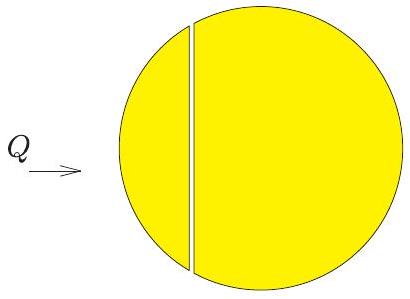
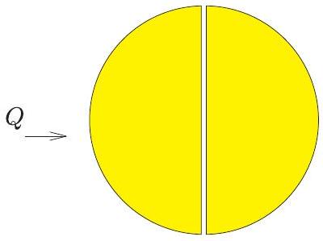
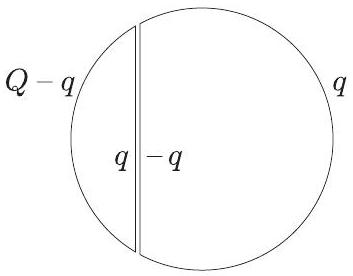
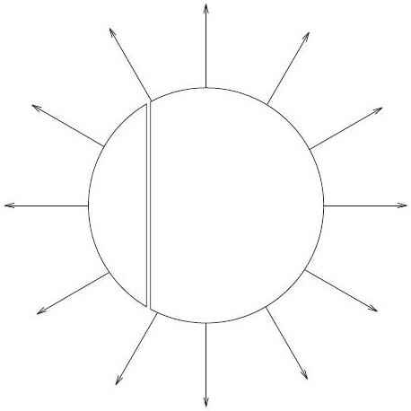
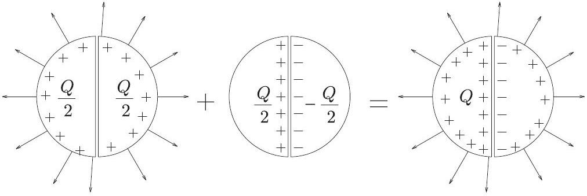
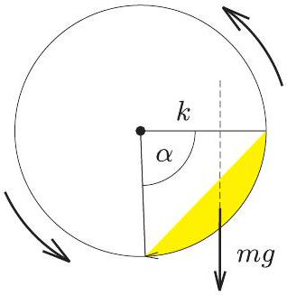

1. Két egyforma ólomgömböt egy-egy sík mentén két-két részre vágunk; egyiket az a), másikat a b) ábra szerint. A vágási felületeket hajszálvékony szigetelő réteggel látjuk el, utána a részeket újra teljes gömbbé egyesítjük. Ezután mindkét gömb bal oldali részére ugyanakkora, kicsiny $Q$ töltést viszünk.

a)

b)

Ábrázoljuk mindkét esetben a gömb körül kialakuló erốvonalképet! (A két gömb messze van egymástól, kölcsönhatásuk elhanyagolható.)
(Károlyházy Frigyes)
Megoldás. Mind az $a$ ), mind a $b$ ) esetben a bal oldali gömbszeletre vitt $Q$ töltés a jobb oldali gömbszeleten töltésmegosztást hoz létre. Ha $q$-val jelöljük a $Q$ töltésnek azt a részét, amely a feltöltött gömbszelet sík felületü részén helyezkedik el, akkor a jobb oldali gömbszelet sík felületére $- q$ töltés vándorol, hiszen a két egymás melletti síkfelület síkkondenzátort képez (1. ábra).

1. ábra

Vajon mekkora lesz $q$, és hogyan oszlanak el a töltések a gömb külsó felületén? A választ pl. az energiaminimum elvéből kaphatjuk meg. Eszerint egyensúlyi helyzetben a töltések úgy helyezkednek el a vezetők felületén, hogy a rendszer teljes elektrosztatikus energiája a lehető legkisebb legyen. Jelen esetben a síkkondenzátor energiája (a szigetelőréteg hajszálvékony volta miatt) elhanyagolhatóan kicsi, a rendszer energiája tehát a gömbön kívüli elektrosztatikus mező energiájával egyezik meg. Ez az energia nyilván ugyanolyan töltéseloszlásnál lesz minimális, mint amilyen a $Q$ töltéssel feltöltött eredeti (szétvágatlan) gömb esetében, vagyis az ismert egyenletes töltéseloszlásnál.

Más módon is érvelhetünk. Külön-külön mindkét gömbszelet potenciálja állandó, mivel elektrosztatikában a fém bármilyen alakú is legyen, mindig ekvipotenciális, s a belsejében a térerősség mindig zérus. Mennyi most a két fémgömbszelet közti potenciálkülönbség?

$$
\Delta U = E \cdot d ,
$$

ahol $E$ a két síkfelület közötti térben az elektromos térerősség, $d$ pedig a síkfelületek távolsága. A feladat szövege szerint ez a távolság „hajszálvékony", vagyis majdnem zérus, $E$ pedig $q$-val arányos, tehát nem lehet „nagyon nagy". Ezek szerint a $\Delta U$ potenciálkülönbség is majdnem zérus, azaz elhanyagolhatóan kicsi. Ebben a (jogos) közelítésben a teljes gömbfelület potenciálja ugyanakkora. Egyetlen gömbön az $U =$ állandó feltétel csak egyetlen felületi töltéseloszlás mellett valósulhat meg adott $Q$ esetén. Ez az eloszlás a jól ismert gömbszimmetrikus töltéseloszlás, amikor a felületi töltéssúrúség

$$
\sigma = \frac { Q } { 4 R ^ { 2 } \pi } = \text { állandó. }
$$

Az egyenletes felületi töltéssűrúséghez tartozó elektromos térerősség a gömbön belül (a „síkkondenzátor” belsejét leszámítva) zérus, a gömbön kívül pedig az ismert Coulomb-féle erótér, nagysága a középponttól $r$ távolságban

$$
E ( r ) = \frac { 1 } { 4 \pi \varepsilon _ { 0 } } \frac { Q } { r ^ { 2 } } \quad ( r > R ) .
$$

A gömbön kívül kialakuló eróvonalkép tehát jó közelítéssel a 2. ábrán látható lesz.

2. ábra

Megjegyzés: A feladatot 11 versenyző oldotta meg jól, ezen kívül még három versenyző adott be a $b$ ) kérdésre helyes megoldást. Két megoldónak ${ } ^ { 1 }$ jutott eszébe a középen félbevágott gömb esetére az alábbi szellemes megoldás:

Először adjunk mindkét félgömbnek $Q / 2$ töltést, azután adjunk a bal oldalinak $Q / 2$, a jobb oldalinak pedig $- Q / 2$ töltést! E két állapot „egyesítéséből” (szuperpozíciójából) előállítható a feladatban megadott állapot. Ez a szuperpozíció egyrészt a töltésekre, másrészt az erótérre is vonatkozik, tehát:

2. Egy henger alakú zárt tartály fekvő helyzetben egyenletesen forog (vízszintes) hossztengelye körül, 0,5/s fordulatszámmal. A tartály 100 kg homokot tartalmaz, belsó átmérője és hossza egyaránt 1 m , fala érdes.

Becsüljük meg, mennyivel növekszik a homok hómérséklete 10 perc alatt, ha a falon keresztül elszökő hốmennyiséget elhanyagoljuk!
(Károlyházy Frigyes)
Megoldás. Ha a henger elég lassan forog (a feladatban 2 másodperc alatt fordul körbe, s ez elég lassúnak tekinthető), akkor a homok a hengerben valamennyire „felmászik” a forgás irányának megfelelő oldalon, és közelítőleg egy hengerszelet térfogatát tölti ki.

A hőmérséklet változását a homok tömege, fajhője és a rajta végzett súrlódási munka ismeretében tudnánk meghatározni: $\Delta T = W _ { \text {súrl } } / c \cdot m$. A homok tömege adott $( m = 100 \mathrm {~kg} )$, fajhőjét táblázatból (a hozzá hasonló anyagok, pl. a kvarcüveg vagy a porcelán adatainak felhasználásával) J/(kg°C) egységekben 700-800 közötti értékre becsülhetjük.

A homok mozgásának részletes leírása (és ennek ismeretében a súrlódási munka kiszámítása) reménytelenül bonyolult feladat lenne. Szerencsére erre nincs szükség! Elegendő azt észrevenni, hogy az egyenletesen forgatott hengerben a homok előbb-utóbb állandósult (stacionárius) állapotba kerül. A homok egyes darabkái mozognak (áramlanak) ugyan, de a homok egésze olyan alakot vesz fel, amelynek határa idóben nem változik. Emiatt a homok tömegközéppontja mindig ugyanott, a henger forgástengelyétől vízszintes irányban valamekkora $k$ távolságra helyezkedik el (lásd az ábrát!).

[^0]
A homok belső energiájának növekedése (azaz a súrlódási erők munkája) nyilván megegyezik a henger egyenletes forgatása során végzett munkával, ez utóbbi pedig a hengerre kifejtendő $m g \cdot k$ forgatónyomatéknak és a henger $\Delta \varphi$ szögelfordulásának szorzatával egyenlő:

$$
W _ { \text {súrl. } } = m g \cdot \Delta \varphi .
$$

A tíz perc alatti szögelfordulás:

$$
\Delta \varphi = \omega \Delta t = 2 \pi n \Delta t = 2 \pi \cdot 0,5 \mathrm {~s} ^ { - 1 } \cdot 600 \mathrm {~s} = 1885 \mathrm { rad } .
$$

A nehézségi erő:

$$
m g = 100 \mathrm {~kg} \cdot 9,81 \frac { \mathrm {~m} } { \mathrm {~s} ^ { 2 } } = 981 \mathrm {~N} .
$$

Hátra van még a nehézségi erő $k$ karjának kiszámítása. Becsüljük meg először a tömegközéppont és a forgástengely $r _ { \mathrm { tkp } }$ távolságát! Felhasználjuk, hogy egy $\alpha$ nyílásszögü hengerszelet térfogata

$$
V = \frac { 1 } { 2 } h r ^ { 2 } ( \alpha - \sin \alpha ) .
$$

Jelen esetben $h = 10 \mathrm { dm } , r = 5 \mathrm { dm }$, így

$$
V = m / \varrho \approx 60 - 65 \mathrm { dm } ^ { 3 } .
$$

(A homok súrúsége nyilván a homok minőségétől, nedvességtartalmától, összetételétól stb. is függ, de mindenképpen kisebb, mint a tömör kvarc táblázatban megtalálható $2,65 \mathrm {~kg} / \mathrm { dm } ^ { 3 }$-es súrúsége.) Ezekből az adatokból és becslésekből $\alpha \approx 90 ^ { \circ }$, illetve $r _ { \mathrm { tkp } } \approx 4 \mathrm { dm }$ adódik.

Vajon hogyan helyezkedik el a homokkal kitöltött hengerszelet síkja a henger tengelyén átmenó függőleges síkhoz képest? Mindennapi tapasztalatból (homokozó, homokóra) tudjuk, hogy a (száraz) homokból kb. 45° -os "rézsüszög" alakítható ki, ezért jogosan tekinthetjük úgy, hogy a jelen esetben is az állandósult mozgású homokgörgeteg legfelsó pontja a henger tengelyével kb. azonos magasságba kerül, s emiatt a keresett erókar

$$
k \approx r _ { \mathrm { tkp } } \cdot \sin 45 ^ { \circ } \approx 2,8 \mathrm { dm } ,
$$

a súrlódási munkára pedig mintegy 520 J-t kapunk. Ezt felhasználva és a homok fajhöjét 800 J/(kg°C)-nak véve kapjuk:

$$
\Delta T \approx 6,5 ^ { \circ } \mathrm { C } .
$$

Mivel a homok sürüsége és fajhője is mintegy 10\%-ra határozatlan mennyiség, a homok dinamikus rézsüszöge is rejt ekkora bizonytalanságot, helyesnek tekinthetünk minden olyan becslést, amely mintegy 20\%-kal tér el $\Delta T$ fenti értékétől, vagyis 5 és 8 °C közé esik.

Megjegyzések. 1. A feladat megoldása során összesen 57 versenyző jutott el odáig, hogy konkrét numerikus becslést tudott adni a hőmérséklet emelkedésére. Ezek a becslések széles határok között változtak, a legkisebb $0,0009 { } ^ { \circ } \mathrm { C }$ volt, a legnagyobb $44,65 ^ { \circ } \mathrm { C } . \Delta T = 5 - 8 ^ { \circ } \mathrm { C }$-os intervallumba esớ értéket összesen 10 versenyző kapott, tehát ennyien oldották meg elfogadhatóan a feladatot.
