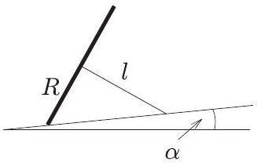
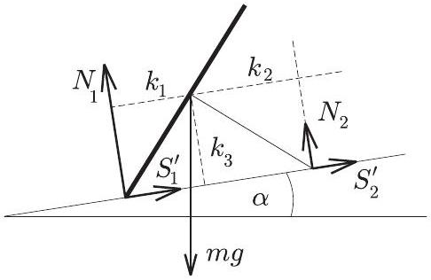
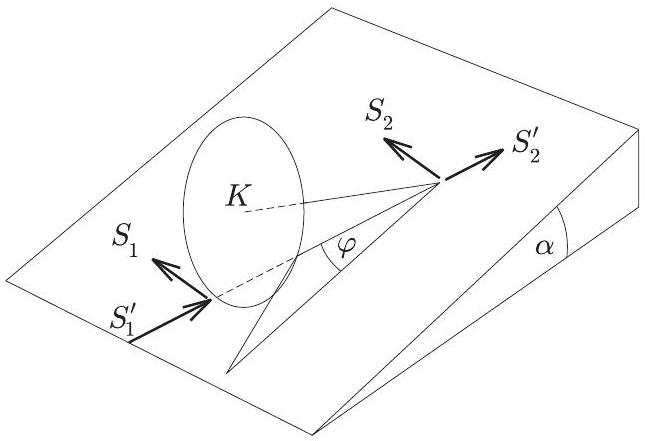
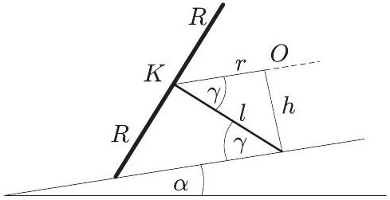
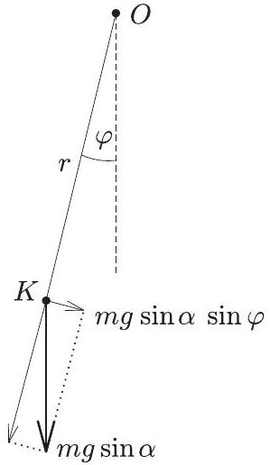
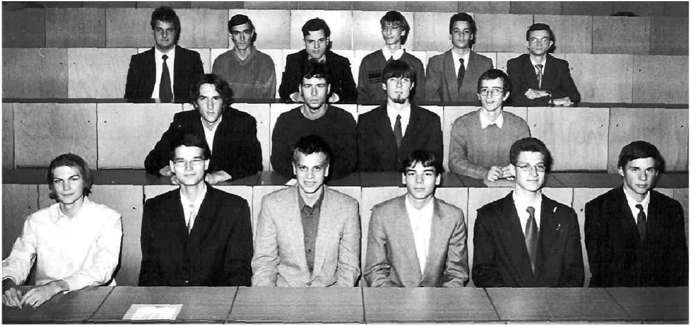

3. Egy eldốlt rajzszög fekszik az enyhén lejtós asztallapon. Ha oldalról kissé meglökjük, ide-oda billeg, de nem csúszik meg.
a) Mekkora stabil egyensúlyi helyzetben a fej, illetve a tú által kifejtett erők asztalra merốleges komponenseinek aránya!
b) Mekkora frekvenciával billeg (kis kitérések esetén) a rajzszög az egyensúlyi helyzete körül?

Az egyszerüség kedvéért tételezzük fel, hogy a rajzszög feje homogén körlap, tüjének tömege a fejhez képest elhanyagolható, és a tứ hegye a billegés során nem mozdul el az asztallapon.

Adatok: A körlap sugara $R = 6 m m$, a tü hossza $l = 8 m m$, az asztal lejtése $\alpha = 5 ^ { \circ }$.
(Radnai Gyula)
Az a) kérdés sztatikai jellegü: egy merev test egyensúlyát kell tanulmányoznunk. Szerencsére az összes fellépő erő egyetlen síkban (az ábra síkjában) van, ezért könnyen felrajzolható (1. ábra).

1. ábra

Jelölések: $N _ { 1 }$ illetve $N _ { 2 }$ az asztalra merőleges nyomóerők, $S _ { 1 } ^ { \prime }$ illetve $S _ { 2 } ^ { \prime }$ a rajzszögre ható tapadási súrlódási erők, $m g$ (a rajzszög tömegközéppontjában ható) nehézségi erő, $k _ { 1 } , k _ { 2 }$ és $k _ { 3 }$ a tömegközéppont távolsága a nyomóerők hatásvonalától, valamint az asztal síkjától.

A rajzszög fejét képező körlap sugara $( R )$, a tü hossza $( l )$ és az asztallap lejtése $( \alpha )$ adott, ezek függvényében kell az $N _ { 1 } / N _ { 2 }$ arányt meghatároznunk. Írjuk fel a merev test egyensúlyának feltételeit!

1. $\sum \vec { F } = 0$. Ezt alkalmazva például az asztallappal párhuzamos összetevőkre:

$$
S _ { 1 } ^ { \prime } + S _ { 2 } ^ { \prime } = m g \sin \alpha ;
$$

az asztallapra meróleges összetevőkre pedig

$$
N _ { 1 } + N _ { 2 } = m g \cos \alpha .
$$

A fenti két egyenletből:

$$
S _ { 1 } ^ { \prime } + S _ { 2 } ^ { \prime } = \left( N _ { 1 } + N _ { 2 } \right) \operatorname { tg } \alpha .
$$

2. $\sum M = 0$. Ez a feltétel jelen esetben csak egy összefüggést ad:

$$
N _ { 1 } k _ { 1 } = N _ { 2 } k _ { 2 } + \left( S _ { 1 } ^ { \prime } + S _ { 2 } ^ { \prime } \right) k _ { 3 } .
$$

Behelyettesítve $S _ { 1 } ^ { \prime } + S _ { 2 } ^ { \prime }$ előbb kiszámított értékét:

$$
N _ { 1 } k _ { 1 } = N _ { 2 } k _ { 2 } + \left( N _ { 1 } + N _ { 2 } \right) \operatorname { tg } \alpha \cdot k _ { 3 } ,
$$

ahonnan

$$
\frac { N _ { 1 } } { N _ { 2 } } = \frac { \frac { k _ { 2 } } { k _ { 3 } } + \operatorname { tg } \alpha } { \frac { k _ { 1 } } { k _ { 3 } } - \operatorname { tg } \alpha } = \frac { \frac { l } { R } + \operatorname { tg } \alpha } { \frac { R } { l } - \operatorname { tg } \alpha } = \frac { \frac { 4 } { 3 } + \operatorname { tg } 5 ^ { \circ } } { \frac { 3 } { 4 } - \operatorname { tg } 5 ^ { \circ } } \approx 2,14 .
$$

(Természetesen ugyanilyen jó, ha valaki $N _ { 2 } / N _ { 1 } \approx 0,47$-et határozza meg, illetve bármilyen más helyes úton jut a jó végeredmények valamelyikéhez.)

A b) kérdés dinamikai jellegú, s azért nehezebb, mert nem lehet síkbeli problémára visszavezetni. A rajzszög billegése nem síkmozgás, nem „fizikai inga”.

Készítsünk térbeli ábrát a ferde asztallapon kissé (balra) kilendített rajzszögről (2. ábra)!
Jelölések: $K$ a tömegközéppont; $S _ { 1 } ^ { \prime }$ és $S _ { 2 } ^ { \prime }$ most is a tün átmenő függőleges síkba esnek; $S _ { 1 }$ a körlapra érintő irányban ható súrlódási erő; $S _ { 2 }$ a tú hegyére ható súrlódási erőnek a türe merőleges összetevője; $\varphi$ a kitérés szöge (a rajzszög tújének asztalra merőleges vetülete és a „lejtvonal” által bezárt szög).

2. ábra

3. ábra

A súrlódási erők mind egy síkba (az asztallap síkjába) esnek, nagyságuk változik a billegés során. A tömegközéppont pályája viszonylag egyszerú, egy körív, amelynek síkja párhuzamos az asztallap síkjával. E körív $r$ sugara és a körív síkjának az asztallaptól mért $h$ távolsága kiszámítható (3. ábra):

$$
\begin{aligned}
& r = l \cos \gamma = l \frac { l } { \sqrt { R ^ { 2 } + l ^ { 2 } } } = 6,4 \mathrm {~mm} , \\
& h = l \sin \gamma = l \frac { R } { \sqrt { R ^ { 2 } + l ^ { 2 } } } = 4,8 \mathrm {~mm} .
\end{aligned}
$$

(Most még nem tudjuk, hogy szükség lesz-e ezekre az adatokra, de feladatmegoldás közben mindig megnyugtató, ha már valamit ki tudunk számítani. Önbizalmat ad a továbbiakhoz.)

4. ábra

Vegyünk fel egy ábrát a tömegközéppont pályájának (az asztallappal párhuzamos) síkjában (4. ábra)! Itt, a pálya síkjában a $K$ tömegközéppont mozgását a nehézségi erónek ebbe a síkba eső $m g \sin \alpha$ összetevője „vezérli”; ezt kell felbontanunk a pálya érintő́je irányába mutató, illetve sugár irányú komponensekre.

Ha a kitérés $\varphi$ szöge kicsi, a fonálingához hasonlóan itt is feltételezhetjük, hogy a sugár irányú gyorsulás elhanyagolható: $a _ { \mathrm { cp } } \approx 0$. Így a $K$ tömegközéppont gyorsulása jó közelítéssel érintő irányú, s az $r$ sugár $\beta$ szöggyorsulásával egyszerúen kifejezhető: $a _ { \mathrm { tkp } } = r \beta$.

Most már nekiláthatunk a dinamikai feladat alapvető összefüggései, a mozgásegyenletek felírásához. Három mozgásegyenletünk lesz:

1. Gyorsul a rajzszög tömegközéppontja:

$$
\sum F = m a _ { \mathrm { tkp } } ,
$$

vagyis

$$
\begin{equation*}
S _ { 1 } + S _ { 2 } - m g \sin \alpha \cdot \sin \varphi = m r \beta . \tag{1}
\end{equation*}
$$

2. Gyorsulva forog a rajzszög feje a tü körül:

$$
\sum M ^ { \prime } = \Theta ^ { \prime } \cdot \beta ^ { \prime } ,
$$

vagyis

$$
- S _ { 1 } R = \frac { 1 } { 2 } m R ^ { 2 } \cdot \beta ^ { \prime } , \quad \text { ahol } \quad \beta ^ { \prime } = \frac { r } { R } \beta ,
$$

$$
\begin{equation*}
- S _ { 1 } R = \frac { 1 } { 2 } m R ^ { 2 } \cdot \frac { r } { R } \beta . \tag{2}
\end{equation*}
$$

3. Gyorsulva elfordul a rajzszög fejének síkja a fej középpontján, valamint a fej és az asztal érintkezési pontján áthaladó tengely körül:

$$
\sum M ^ { \prime \prime } = \Theta ^ { \prime \prime } \cdot \beta ^ { \prime \prime } ,
$$

vagyis

$$
\begin{align*}
& - S _ { 2 } l = \frac { 1 } { 4 } m R ^ { 2 } \cdot \beta ^ { \prime \prime } , \quad \text { ahol } \quad \beta ^ { \prime \prime } = \frac { r } { l } \beta , \\
& - S _ { 2 } l = \frac { 1 } { 4 } m R ^ { 2 } \cdot \frac { r } { l } \beta . \tag{3}
\end{align*}
$$

A megoldás további része már csak egyenletrendezés. Kifejezve $S _ { 1 }$-et $( 2 )$-ből és $S _ { 2 } - \mathrm { t } ( 3 )$-ból, behelyettesíthetjük ezeket (1)-be:

$$
- \frac { 1 } { 2 } m r \beta - \frac { 1 } { 4 } m \frac { R ^ { 2 } } { l ^ { 2 } } r \beta - m g \sin \alpha \cdot \sin \varphi = m r \beta ,
$$

ahonnan átrendezések után

$$
\beta = - \frac { g \sin \alpha } { r \left( \frac { 3 } { 2 } + \frac { R ^ { 2 } } { 4 l ^ { 2 } } \right) } \sin \varphi
$$

Kicsiny $\varphi$ szögekre $\sin \varphi \approx \varphi$, tehát itt egy

$$
\beta = - \omega ^ { 2 } \varphi
$$

alakú összefüggést kaptunk, ami $\omega$ körfrekvenciájú harmonikus rezgésnek felel meg.
A rajzszög (kis kitérésű) billegésének körfrekvenciája tehát

$$
\omega = \sqrt { \frac { g \sin \alpha } { r \left( \frac { 3 } { 2 } + \frac { R ^ { 2 } } { 4 l ^ { 2 } } \right) } } ,
$$

és ha ebbe behelyettesítjük $r = l ^ { 2 } / \sqrt { R ^ { 2 } + l ^ { 2 } }$-et, akkor

$$
\omega = \sqrt { \frac { g \sin \alpha \sqrt { R ^ { 2 } + l ^ { 2 } } } { \frac { 3 } { 2 } l ^ { 2 } + \frac { 1 } { 4 } R ^ { 2 } } } .
$$

A megadott számadatokkal a körfrekvencia $9,02 \mathrm {~s} ^ { - 1 }$, a frekvencia $1,44 \mathrm {~s} ^ { - 1 }$, a periódusidő pedig $T \approx 0,7 \mathrm {~s}$ lesz.
Megjegyzések: 1. A b) kérdésre csak egyetlen teljes megoldás érkezett ${ } ^ { 2 }$, ez sem dinamikai, hanem energetikai meggondolásokkal operált, ami persze ugyanolyan helyes. Rajta kívül még négy olyan versenyző volt, aki a körlap síkjának elfordulását elhanyagolta ugyan, de egyébként hibátlan megoldást adott. Érdemes azt is megemlíteni, hogy az $a$ ) kérdésre 82 versenyző (az indulók több, mint 40 százaléka) adott elvileg és numerikusan is helyes megoldást.
2. A merev testek forgómozgásának általánosan érvényes egyenlete az $\vec { N } = \Theta \vec { \omega }$ perdületvektor időbeli változási sebességével fogalmazható meg:

$$
\sum \vec { M } = \frac { d \vec { N } } { d t }
$$

A perdületvektor változása egyrészt a szögsebesség változásából adódik, másrészt abból, hogy a merev test egésze elfordul, emiatt a tehetetlenségi nyomatéka az inerciarendszerből nézve időben változik. Ez utóbbiból származó perdületváltozás a szögsebesség négyzetével arányos, jelen feladatnál tehát kis kitérések esetén figyelmen kívül hagyható. A forgómozgás dinamikai egyenlete ebben a közelítésben valóban $\sum \vec { M } = \Theta \vec { \beta }$ alakba írható, s ennek a vektoregyenletnek különböző komponenseit tartalmazza (2) és (3).
3. Az $\vec { N } = \Theta \vec { \omega }$ összefüggésben szereplő $\Theta$ tehetetlenségi nyomaték nem skalár, hanem irányfüggő, ún. tenzor mennyiség. A merev testeknek csak bizonyos kitüntetett tengelyei (az ún. fótengelyei) körüli forgáskor igaz az, hogy a perdületvektor és a szögsebességvektor párhuzamos egymással. A homogén korong egyik főtengelye a síkjára merőleges szimmetriatengelye (erre vonatkoztatott $\Theta ^ { \prime }$ tehetetlenségi nyomaték az ismert $m R ^ { 2 } / 2$ ). A korong átmérői is fótengelyek, a hozzájuk tartozó $\Theta ^ { \prime \prime }$ szimmetriamegfontolások és a tehetetlenségi nyomatékot definiáló összefüggés szerint $\Theta ^ { \prime } / 2$. Ezek az eredmények integrálszámítással is megkaphatók.
4. A szöggyorsulások közötti speciális $\beta ^ { \prime } = r \beta / R$, illetve $\beta ^ { \prime \prime } = r \beta / l$ összefüggések a csúszásmentes gördülés feltételéből és térbeli geometriai megfontolásokból kaphatók meg.

## A verseny végeredménye

Összevont I-II. díjat (s vele 7-7 ezer Ft pénzjutalmat) kaptak a következők: Nagy Ádám, a BME mérnök-fizikus hallgatója, aki a budapesti Szent István Gimnáziumban érettségizett mint Moór Ágnes tanítványa; Pápai Tivadar, a barcsi Dráva Völgye Középiskola 12. évf. tanulója, Horváth Ferenc tanítványa; Pozsgay Balázs, az ELTE fizikus

[^1]
hallgatója, aki a pécsi Magyar-német Nyelvú Iskolaközpontban érettségizett és Kotek László tanítványa volt; Siroki László, a debreceni Fazekas Mihály Gimnázium 12. évf. tanulója, Simon Gyula és Szegedi Ervin tanítványa; Tóth Sándor, a csongrádi Batsányi János Gimnázium 11. évf. tanulója, Szucsán András és Hilbert Margit tanítványa; Varjú Péter, a SZTE matematikus hallgatója, aki a szegedi Radnóti Miklós Gimnáziumban érettségizett mint Dudás Zoltánné tanítványa.
III. díjat (s vele 4-4 ezer Ft pénzjutalmat) kaptak a következők: Bartos Imre, az ELTE fizikus hallgatója, aki a budapesti Móricz Zsigmond Gimnáziumban érettségizett mint Részeg Anna tanítványa; Borbély Sándor, a kolozsvári Babeş-Bolyai Tudományegyetem fizika szakos hallgatója, aki a marosvásárhelyi Bolyai Farkas Elméleti Líceumban érettségizett mint László József tanítványa; Nagy Márton, a budapesti Piarista Gimnázium 12. évf. tanulója, Futó Béla tanítványa; Novák Zoltán, a BME müszaki informatika szakos hallgatója, aki a zalaegerszegi Zrínyi Miklós Gimnáziumban érettségizett mint Vadvári Tibor tanítványa.

Dicséretet kaptak a következők: Balogh László, a Fazekas Mihály Fóvárosi Gyakorló Gimnázium 11. évf. tanulója, Horváth Gábor tanítványa; Béky Bence, a Fazekas Mihály Fóvárosi Gyakorló Gimnázium 12. évf. tanulója, Horváth Gábor tanítványa; Bori János Ferenc, a BME múszaki informatika szakos hallgatója, aki a budapesti Puskás Tivadar Távközlési Technikumban érettségizett mint Alapiné Ecseri Éva tanítványa; Kalcsú Áron, a zalaegerszegi Zrínyi Miklós Gimnázium 11. évf. tanulója, Pálovics Róbert tanítványa; Karaszi Mihály, a BME mérnök-fizikus hallgatója, aki a kalocsai Szent István Gimnáziumban érettségizett mint Szóke Imre tanítványa; Rácz Béla András, a Fazekas Mihály Fóvárosi Gyakorló Gimnázium 10. évf. tanulója, Horváth Gábor tanítványa; Szekeres Balázs, a szolnoki Verseghy Ferenc Gimnázium 11. évf. tanulója, Lapu Béla tanítványa.

2001. november 23-án délután került sor az ünnepélyes eredményhirdetésre. Ennek során a Versenybizottság elnöke megemlékezett Bakos Tiborról (1909-1998), aki 75 évvel ezelőtt nyerte meg mind a fizikai, mind a matematikai versenyt (akkor a matematikai versenyt hívták Eötvös-versenynek, a fizikait pedig Károly Irén versenynek), s aki még 1996-ban jelen volt a díjak átadásánál. A feladatok megoldásának ismertetését azokat illusztráló kísérleti bemutató, majd az eredmények kihirdetése követte. A díjakat Gyulai József akadémikus, az ELFT elnöke adta át.

A 2001. évi Eötvös-verseny nyertesei
Alsó sor: (balról jobbra): Nagy Ádám, Pozsgay Balázs, Varjú Péter, Tóth Sándor, Siroki László és Pápai Tivadar.
Középső sor: Nagy Márton, Bartos Imre, Novák Zoltán és Borbély Sándor.
Felsố sor: Rácz Béla András, Kalcsú Áron, Bori János, Balogh László, Szekeres Balázs és Karaszi Mihály.

A díjakhoz társuló jutalmakat az ELFT, illetve az Oktatási Minisztérium biztosította, a Nemzeti Tankönyvkiadó pedig valamennyi díjazott, illetve dicséretet kapott versenyzőt 3-3 ezer forintos könyvutalványban részesítette.

Az eredményhirdetés végén a nyertes versenyzők megjelent tanárai válogathattak a Nemzeti Tankönyvkiadó, a Múszaki Kiadó és a Typotex Kiadó által számukra felajánlott könyvekből.

[^0]:    ${ } ^ { 1 }$ Bartos Imre (Budapest) és Siroki László (Debrecen)

[^1]:    ${ } ^ { 2 }$ Pozsgay Balázs (Budapest) dolgozata
