2002. október 18-án rendezte meg az Eötvös Loránd Fizikai Társulat Budapesten és 14 vidéki városban az ezévi Eötvös-versenyt. A versenyen 169 magyar, 1 szlovák és 1 román állampolgárságú versenyző adott be dolgozatot, nevezetesen Budapesten 64, Szegeden 19, Pécsett 17, Debrecenben és Szekszárdon 10-10, Veszprémben 9, Nagykanizsán és Sopronban 8-8, Békéscsabán 7, Egerben 5, Győrött 5, Miskolcon 4, Székesfehérváron 3, Nyíregyházán és Szombathelyen pedig 1-1 dolgozat született. A versenyzők 92\%-a gimnazista volt; az érettségizett versenyzők valamennyien budapesti egyetemeken (BMGE, ELTE) tanulnak. Ismertetjük a feladatokat, s azok helyes megoldását.
2003. Szeretnénk megbecsülni, hogy mekkora eró feszíti a gyúrữn edzó tornász karjait pályájának legalsó pontján, ha kézenállásból óriáskörbe lendül. A következö egyszerü modellt alkalmazzuk: igen hosszú, nyújthatatlan kötél végére l hosszúságú, $m$ tömegữ homogén rudat erósítünk, és az $1 . a$ ábrán látható helyzetbốl elengedjük. Számítsuk ki, hogy mekkora eró feszíti a kötelet az 1.b ábrán látható pillanatban! (A kötél tömegét hanyagoljuk el!)
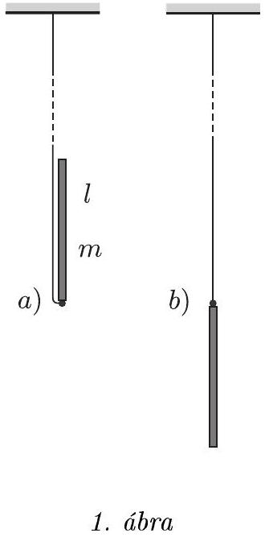
()
(Takács Gábor feladata nyomán)
Megoldás. Az eldőlő rúdra két erő hat: az $m g$ nehézségi eró és a $K$ kötélerő (2. ábra). Mindkettő függőleges irányú (a változó nagyságú kötélerő azért, mert a kötél „igen hosszú”). Mivel csak függőleges erők hatnak a rúdra, ezért a tömegközéppontja is csak függőleges, egyenes vonalú pályán mozoghat, tehát függőleges (nem harmonikus) rezgőmozgást végez.

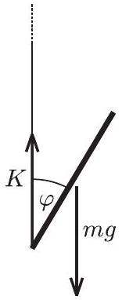
2. ábra

A rúd alsó (a kötéllel érintkező) végének függőleges irányú elmozdulása a mozgás során mindvégig zérus, ez a pont tehát függőlegesen nem gyorsul. A kérdezett állapotban a tömegközéppont sebessége zérus, gyorsulása pedig maximális és akkora, amekkora nagyságú a rúd végeinek gyorsulása a tömegközéppont vonatkoztatási rendszerében:

$$
a = \frac { l } { 2 } \omega ^ { 2 } .
$$

A munkatétel szerint:

$$
m g l = \frac { 1 } { 2 } \left( \frac { 1 } { 12 } m l ^ { 2 } \right) \omega ^ { 2 } ,
$$

továbbá a dinamika alaptörvénye szerint:

$$
K - m g = m \frac { l } { 2 } \omega ^ { 2 } .
$$

E két egyenletből következik: $K = 13 m g$.

Megjegyzések. 1. Az eredményül kapott erő hihetetlenül nagy! Még akkor is, ha figyelembe vesszük, hogy a tornász egy karját ekkora erőnek csak a fele feszítené. Nem csoda, hogy olyan sok versenyző elhitte a feladat egyik tipikusan hibás feltételezésével, a kötél mozdulatlannak vélt alsó végpontja körüli forgásból kapható $K = 4 m g$ (hibás) végeredményt.

Nem sokkal az Eötvös-verseny után volt Debrecenben a 2002. évi tornász világbajnokság, amelyet gyürün - mint ismeretes - Csollány Szilveszter nyert meg. Az ő gyakorlatát alaposan megfigyelve jól lehetett látni, hogy a feladatban használt modell mennyire durva közelítése a merev testnek aligha tekinthető tornász mozgásának.
2. A feladat ugyan nem kérdezte, de tanulságos kiszámítani a kötelet feszítő erőt a rúd tetszőleges, mondjuk a függőlegessel $\varphi$ szöget bezáró helyzetében is. A fentiekhez hasonló számolásból (munkatétel + mozgásegyenlet) adódik:

$$
K ( \varphi ) = \frac { 3 ( \cos \varphi - 1 ) ^ { 2 } + 1 } { \left( 3 \sin ^ { 2 } \varphi + 1 \right) ^ { 2 } } m g .
$$

Ez a kifejezés sehol nem nulla (3. ábra), tehát a kötél nem lazul meg, jóllehet $\varphi \approx 61 ^ { \circ }$-nál $K$ alaposan ( $m g$ egyhatodára) lecsökken.

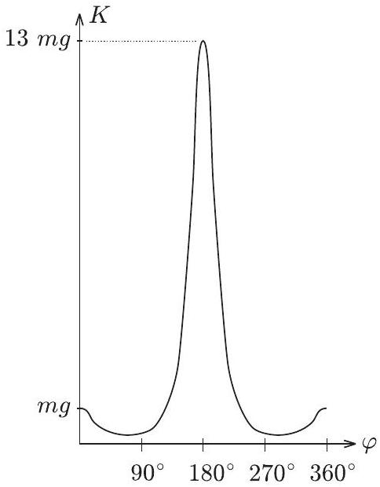
3. ábra

2. Zárt lombikban egy kevés víz van. A lombik száját lefelé fordítva a víz kb. 5 cm magasan áll a lombik nyakában. (A belső méreteket a 4. ábra mutatja.)

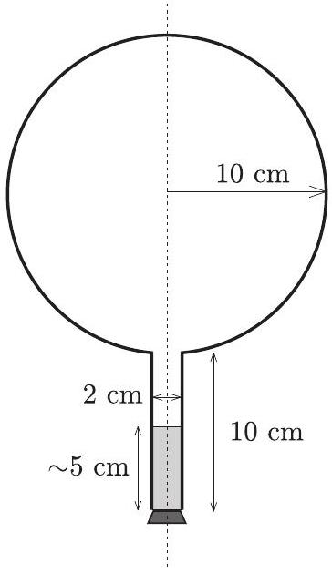
4. ábra

Ezután a lombikot függőleges tengelye körül egyenletes forgásba hozzuk úgy, hogy másodpercenként hármat forduljon. Gondoskodunk róla, hogy a lombik falának hốmérséklete mindenütt ugyanakkora legyen. Kellốen hosszú idố után egyensúly áll be.

Rajzoljuk fel vázlatosan, hogyan helyezkedik el ekkor a víz a lombikban!

Megoldás. A feladat első ránézésre mechanikai problémának látszik. Ki fog derülni, hogy legalább ennyire termodinamikai feladat is; az egyensúly, ami „kellően hosszú idő után“ beáll, termodinamikai egyensúly lesz. A példa termodinamikai jellegére utal a lombik falának hőmérsékletéről szóló mondat is.

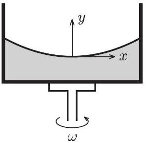
5. ábra

Az egyenletes forgásba hozott folyadék felszíne a földi homogén nehézségi erőtérben forgásparaboloid. Ennek síkmetszetét mutatja az 5. ábra. A „megforgatott parabola” egyenlete az ábrán felvett koordináta-rendszerben

$$
y = \frac { \omega ^ { 2 } } { 2 g } x ^ { 2 } .
$$

Megjegyzések. 1. A fenti összefüggést annak alapján határozhatjuk meg, hogy a folyadék az $\omega$ szögsebességgel forgó koordináta-rendszerben egyensúlyban van; felülete a ráható erők eredőjére merőleges. Így az érintő iránytangense

$$
\frac { \Delta y } { \Delta x } \rightarrow \frac { m x \omega ^ { 2 } } { m g } = \frac { x \omega ^ { 2 } } { g } ,
$$

amiból $[ \operatorname { minthogy } y ( 0 ) = 0 ]$ a megadott formula következik.
2. Úgy is megkaphatjuk a felület egyenletét, hogy felismerjük: egy $m$ tömegü folyadékdarabkára ható centrifugális erő kifejezése hasonló a Hooke-törvényben szereplő rugóerő képletéhez, de a „rugóállandó” negatív, $D = - m \omega ^ { 2 }$. Ennek megfelelően a „centrifugális potenciális energia” $- m \omega ^ { 2 } x ^ { 2 } / 2$, amihez hozzáadva a gravitációs helyzeti energiát a teljes potenciális energiára

$$
E _ { \mathrm { pot } } = - \frac { m \omega ^ { 2 } x ^ { 2 } } { 2 } + m g y
$$

adódik. A folyadék szabad felszínén a teljes potenciális energia mindenhol ugyanakkora kell legyen, ami a megadott parabola egyenletéhez vezet.
3. Az összefüggés levezetését a feladat nem kívánta meg. Mivel az Eötvös-versenyen bármilyen könyv használható a megoldáshoz, egyszerúen ki lehetett írni a megfelelő képletet például Budó: Kísérleti fizika, I. kötetének megfelelő fejezetéből.

Megvizsgálva a feladat konkrét adatait könnyen belátható, hogy a forgó folyadék felülete felveszi a forgásparaboloid alakot anélkül, hogy a folyadék széle a lombik nyakában egészen a gömbig felemelkedne. Felmerülhet azonban egy kérdés - és ez volt a kulcs a feladat helyes megoldásához -, hogy ha gondolatban meghosszabítanánk ezt a forgásparaboloidot egészen a gömbig, vajon nem „vágna-e bele” a gömbbe? Mert ha igen, akkor ott a gömbben, a forgásparaboloid alatt is lehetne víz!

Vegyünk ismét egy, a forgástengelyen átmenő síkmetszetet! Határozzuk meg annak a parabolának a legmélyebb pontját, amely érinti a gömblombik síkmetszeteként adódó kört! Legyen ez a pont $h$-val mélyebben, mint a kör középpontja, ekkor a parabola egyenlete (a kör közepéhez választva a koordináta-rendszer kezdőpontját)

$$
y + h = \frac { \omega ^ { 2 } } { 2 g } x ^ { 2 } ,
$$

a kör egyenlete pedig $x ^ { 2 } + y ^ { 2 } = R ^ { 2 }$. Ebből $x ^ { 2 }$-et kifejezve és a parabola egyenletébe helyettesítve a kör és a parabola közös pontjainak $y$ koordinátáira a következó másodfokú egyenletet kapjuk:

$$
y ^ { 2 } + \frac { 2 g } { \omega ^ { 2 } } y + \frac { 2 g h } { \omega ^ { 2 } } - R ^ { 2 } = 0 .
$$

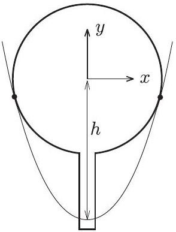

Amikor a parabola érinti a kört, a fenti egyenletnek csak 1 gyöke lehet, tehát a diszkrimináns zérus kell legyen, és éppen ez ad feltételt a $h$ magasságra:

$$
h = \frac { g } { 2 \omega ^ { 2 } } + \frac { \omega ^ { 2 } } { 2 g } R ^ { 2 }
$$

Behelyettesítve a $g = 9,81 \mathrm {~m} / \mathrm { s } ^ { 2 } , \omega = 2 \pi \cdot 3 \mathrm {~s} ^ { - 1 } , R = 0,1 \mathrm {~m}$ adatokat, $h$-ra $0,195 \mathrm {~m} = 19,5 \mathrm {~cm}$ adódik. A gömb sugara 10 cm, a nyak hossza ugyancsak 10 cm, együtt ez több, mint 19,5 cm.

A gömböt érintő paraboloid tehát a lefelé fordított lombik nyakának legalsó pontjánál fél centiméterrel feljebb halad! A feladat megoldásához tartozó paraboloid persze ennél az érintő paraboloidnál is valamivel feljebb halad, mégpedig úgy, hogy a gömblombik nyakában a paraboloid alatt maradó víz éppen annyival kevesebb az eredetileg ott volt víznél, amennyi a gömbben, egy körbefutó keskeny sávban a paraboloid alá került.

De hogyan került oda a víz? Voltak versenyzők, akik arra tippeltek, hogy a gömblombik felpörgetésekor talán odafreccsenhetett a víz. Ez a feltevés nincs híjával az iskolai szertárakban található forgatógépekkel szerzett érdekes tapasztalatoknak. Mégsem ez a probléma megoldása, hanem az, hogy a lombikban a cső nyakánál elpárolgó vízgő́z egy része csapódik ki - megfelelő helyen - a lombik falára. Ennek a termodinamikai folyamatnak a hajtóereje pedig éppen az az ici-pici nyomáskülönbség, ami a lombikban fellép a nehézségi erő és a forgás együttes hatása miatt. Egy-egy forgásparaboloid mentén a víz a forgó koordináta-rendszerbő́l nézve egyensúlyban van, hiszen éppen ez a feltétel határozza meg a felület alakját. Különbözó forgásparaboloidokat összehasonlítva viszont a magasabban elhelyezkedő felület mentén nagyobb egy bizonyos vízmennyiség energiája, mint az alacsonyabban levő felületnél. Egyensúlyi állapotban a víz felszíne ugyanazon paraboloidon kell elhelyezkedjen a lombik nyakában és a gömbben is, ha nem így lenne, a párolgás és lecsapódás folyamata „megkeresné” az alacsonyabb összenergiájú állapotot.

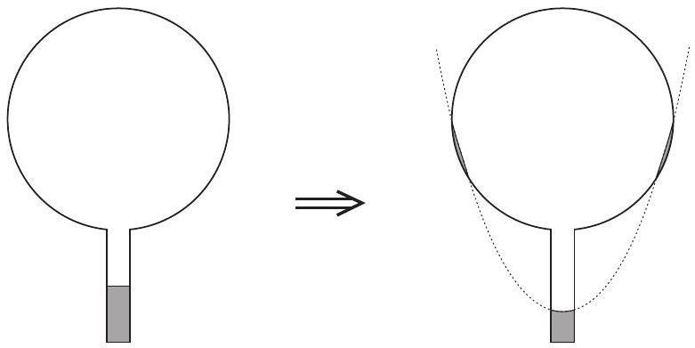
7. ábra

Végeredményben tehát a 7. ábrán látható vázlatos rajz (helyes indoklással) a feladat megoldása.
Megjegyzések. 1. A paraboloid helyzetének pontos meghatározása nem volt feladat - középiskolai matematikával ez nehéz is lett volna.
2. Béky Bence budapesti versenyző eljutott annak felismeréséhez, hogy lehet víz a lombik falán, de nem hitte el, hogy ez meg is valósulhat. „Ugyanúgy nem - írta -, mint ahogy egy, az asztalon álló pohár vízből sem mászik ki a víz az asztalra, hiába lenne ott kisebb az energiája." Nos, az érdekes az, hogy a víz onnan is kimászhat, még a tökéletes hőmérsékleti egyensúly esetén is, éppen a meglévő piciny barometrikus nyomáskülönbség miatt, ami a pohárban levő víz felszíne és az asztal (vagy még inkább a padló) szintje között fennáll. Letakarva egy üvegharanggal az asztalon álló pohár vizet, el is végezhetó a kísérlet. Csak kissé soká kell várni! (Üvegharang nélkül is „kimászik” a víz a pohárból, de a szoba nagy légtere miatt sehol sem csapódik le, hanem telítetlen gőz formájában a levegőben marad.)
3. Két szigeteló félgömbhéjat (például két fél pingponglabdát) egymás közvetlen közelében helyezünk el a 8.a ábra szerint, koncentrikusan. Az egyikre Q, a másikra q töltést viszünk fel, egyenletesen.
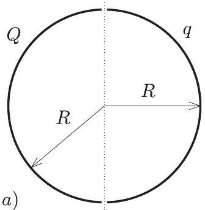
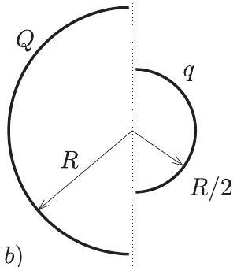

a) Mekkora erót fejt ki egymásra e két test?
b) Megváltozik-e az eredmény, ha az egyik félgömbhéj csak fele akkora sugarú? ()

(Gagik Grigorjan [Örményország] feladata nyomán)

Megoldás. „Ha nem tudsz megoldani egy feladatot, csinálj belőle magadnak egy könnyebbet" - tanácsolja Pólya György (1888-1985) „A gondolkodás iskolája” c. könyvében. Tegyük ezt most mi is, mindaddig, amíg csak egy olyan feladatig jutunk, amit már meg tudunk oldani. Innen visszafejtve a gondolatsort, talán kaphatunk ötleteket a nehezebb feladatok megoldásához.

Foglalkozzunk először az $a$ ) kérdéssel! Mi lenne, ha mindkét félgömbhéjon ugyanakkora, $( Q , Q )$ töltés lenne? Mi lenne, ha a töltések ellentétes elójelúek $( Q , - Q )$ lennének? Ilyenkor jut az ember eszébe a síkkondenzátor.

A $Q$ töltésú síkkondenzátor lemezein $Q$ és $- Q$ töltés, a lemezek között $E$ térerősségü homogén tér van. A kondenzátor energiája

$$
W = \frac { Q ^ { 2 } } { 2 C } = \frac { Q ^ { 2 } } { 2 \varepsilon _ { 0 } A } x ,
$$

amiből látszik, hogy a lemezek közötti erő nagysága

$$
F = \frac { Q ^ { 2 } } { 2 \varepsilon _ { 0 } A } = \frac { 1 } { 2 } Q \frac { Q } { \varepsilon _ { 0 } A } = \frac { 1 } { 2 } Q E .
$$

Innen lépegessünk visszafelé! Ha nem $Q$ és $- Q$, hanem $Q$ és $+ Q$ töltés van a lemezeken, akkor annyi a különbség, hogy nem vonzó, hanem taszító erő lép fel, $E$ pedig annak a térerősségnek a nagysága, ami a lemezeken kívül jelenik meg.

Két szembefordított, $Q$ töltéssel egyenletesen feltöltött gömbhéj elektromos tere ugyanaz, mint ami egyetlen gömbön kívül lép fel, ha az $2 Q$ töltéssel van egyenletesen feltöltve. Ekkor a térerősség a gömbön kívül akkora, amekkora a $2 Q$ nagyságú, a gömb közepén elhelyezett ponttöltéstől jönne létre:

$$
E = \frac { 1 } { 4 \pi \varepsilon _ { 0 } } \frac { 2 Q } { R ^ { 2 } } .
$$

A gömb felületén a töltéssürüség:

$$
\sigma = \frac { 2 Q } { 4 R ^ { 2 } \pi } = \frac { Q } { 2 R ^ { 2 } \pi } = \left( \varepsilon _ { 0 } E \right) .
$$

Ugyanitt az energiasűrúség (egységnyi térfogatra jutó energia, nyomás jellegú mennyiség):

$$
p = \frac { 1 } { 2 } \varepsilon _ { 0 } E ^ { 2 } = \frac { 1 } { 2 } \sigma E .
$$

Egy elektromosan töltött felület adott nagyságú darabkájára ható erőt a felület nagysága, töltéssürüsége és a felület közvetlen közelében mérhető elektromos térerősség egyértelmúen meghatározza. Ez az elektrosztatikus „nyomás" tehát nemcsak a síkkondenzátor, hanem a töltött félgömbhéj esetében is a fentebb kiszámított $p$-vel (az energiasürüséggel) egyezik meg.

A félgömbhéjra ható eredő erő ugyanakkora, mint a félgömbhéjat gondolatban lezáró körlapra ható erő lenne $p$ nyomás esetén (hiszen egy $p$ nyomású gázba helyezett lezárt félgömbre a gáz által kifejtett eredő erő nyilván zérus). A kérdéses erő tehát

$$
F = p \cdot R ^ { 2 } \pi = \frac { 1 } { 2 } \sigma E \cdot R ^ { 2 } \pi = \frac { 1 } { 2 } \frac { 1 } { 4 \pi \varepsilon _ { 0 } } \frac { Q ^ { 2 } } { R ^ { 2 } } .
$$

Kiszámítottuk a két szembefordított, egyenként $Q$ töltésú félgömbhéj között fellépő erőt. Térjünk vissza most az eredeti $a$ ) kérdéshez, ami az eddig tárgyalt esettől csak abban tér el, hogy az egyik félgömbhéjon nem $Q$, hanem $q$ töltés van! Az elektrosztatikus erő arányos a test töltésével, ezért

$$
F _ { a } = \frac { q } { Q } F = \frac { 1 } { 2 } \frac { 1 } { 4 \pi \varepsilon _ { 0 } } \frac { Q q } { R ^ { 2 } } .
$$

Megjegyzés. Látható, hogy a Coulomb-törvényhez nagyon hasonló formulát kaptunk, csupán a képletben szereplő numerikus együttható tér el az ismert kifejezésétől. Akár meg is kereshetnénk azokat a pontokat a félgömbök belsejében, ahova elhelyezett $Q$ illetve $q$ ponttöltések éppen ekkora erőt fejtenek ki egymásra; ez azonban nem volt kérdés a feladatban. Megjegyezzük, hogy a kérdéses pontok nem esnek egybe a homogén tömegeloszlású félgömbhéjak tömeg-középpontjaival, mint azt több versenyzó tévesen állította. Az eltérésnek az az oka, hogy csak a homogén gravitációs erốtér hatása helyettesíthető a tömegközéppontba képzelt testre ható erốvel, a Coulomb-féle erốtér pedig inhomogén!

A b) kérdés megoldásához ismét idézzük fel Pólya György tanácsát! A kérdéses aszimmetrikus elrendezés helyett tekintsünk egy szimmetrikusat, amit feltehetőleg egyszerűbb lesz kezelnünk. Egészítsük ki a $b$ ) elrendezést a „tükörképével" (9. ábra)! Írjuk fel a bal oldali két félgömbhéj által a jobb oldali két félgömbhéjra kifejtett eredő erőt! Ez négy erőből tehető össze:

$$
F = F _ { Q \rightarrow Q } + F _ { q \rightarrow q } + F _ { Q \rightarrow q } + F _ { q \rightarrow Q }
$$

Az összeg két utolsó tagja egyenlő egymással, és mindegyikük éppen az az $F _ { b }$ erő, amit keresünk! Ha tehát ki tudjuk számítani $F$-et, akkor $F _ { Q \rightarrow Q }$ és $F _ { q \rightarrow q }$ ismeretében (amelyeket az $a$ ) kérdésre tudunk visszavezetni) a keresett erő meghatározható.

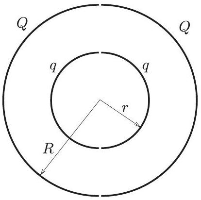
9. ábra

$F$ kiszámításához tekintsük azt az elektromos teret, amit két koncentrikus gömbhéj hoz létre: a belső, $r$ sugarú, $2 q$ töltésú gömbhéj és a külső, $R$ sugarú, $2 Q$ töltésú gömbhéj. Gyakorlatilag ez lesz a négy félgömnhéj által létrehozott elektromos tér is.

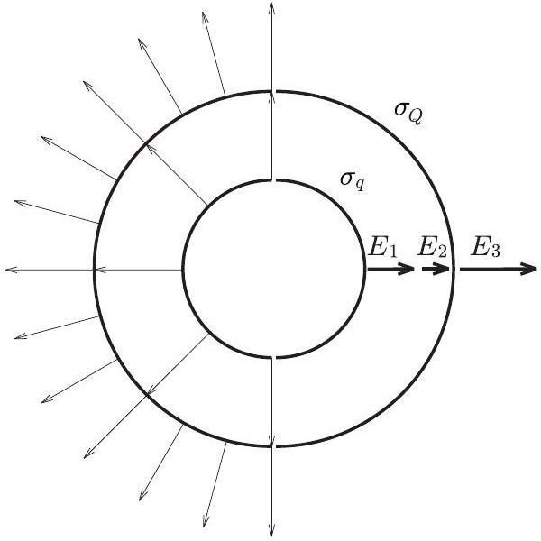
10. ábra

A kis gömbhéj belsejében az elektromos térerősség nulla. E gömb felületén a töltéssürúség:

$$
\sigma _ { q } = \frac { q } { 2 r ^ { 2 } \pi }
$$

a térerősség pedig a gömb felületénél, de kívül:

$$
E _ { 1 } = \frac { 1 } { 4 \pi \varepsilon _ { 0 } } \frac { 2 q } { r ^ { 2 } } .
$$

Ennek a kis gömbnek a tere a nagy gömb felületénél, annak belsejében:

$$
E _ { 2 } = \frac { 1 } { 4 \pi \varepsilon _ { 0 } } \frac { 2 q } { R ^ { 2 } } .
$$

A nagy gömb felületén a töltéssürúség:

$$
\sigma _ { Q } = \frac { Q } { 2 R ^ { 2 } \pi } .
$$

A nagy gömbön kívüli térrészben a térerősségért mindkét gömb töltése felelős. Az elektromos térerősség nagysága

$$
E _ { 3 } = \frac { 1 } { 4 \pi \varepsilon _ { 0 } } \frac { 2 q + 2 Q } { R ^ { 2 } } .
$$

A fenti kifejezések segítségével - az $a$ ) kérdésnél alkalmazott gondolatmenetet követve - $F$-et a következő módon számíthatjuk ki:

$$
F = \frac { 1 } { 2 } \sigma _ { q } E _ { 1 } r ^ { 2 } \pi + \frac { 1 } { 2 } \sigma _ { Q } \left( E _ { 2 } + E _ { 3 } \right) R ^ { 2 } \pi .
$$

Behelyettesítve $\sigma _ { q } , \sigma _ { Q } , E _ { 1 } , E _ { 2 }$ és $E _ { 3 }$ fenti kifejezéseit, $F$ meghatározható.
Az $a$ ) kérdésre adott választ felhasználva

$$
F _ { Q \rightarrow Q } = \frac { 1 } { 2 } \frac { 1 } { 4 \pi \varepsilon _ { 0 } } \frac { Q ^ { 2 } } { R ^ { 2 } } \quad \text { és } \quad F _ { q \rightarrow q } = \frac { 1 } { 2 } \frac { 1 } { 4 \pi \varepsilon _ { 0 } } \frac { q ^ { 2 } } { r ^ { 2 } } .
$$

Ezek után a keresett $F _ { b } = F _ { q \rightarrow Q }$-ra kapjuk:

$$
F _ { b } = \frac { 1 } { 2 } \frac { 1 } { 4 \pi \varepsilon _ { 0 } } \frac { Q q } { R ^ { 2 } } .
$$

Az eredmény meglepő, hiszen független $r$-től, így a $b$ ) esetben is ugyanakkora az erő, mint az $a$ ) esetben! (Ennyi számolás után meg is érdemeltünk egy kellemes meglepetést.)

Megjegyzés. A b) kérdést megválaszoló versenyzők több kiváló ötlettel is éltek. Nagy Márton (Budapest) gondolatban körülvette a 11.a ábrán látható elrendezést (amelyen az egyszerúség kedvéért csak a kisebb félgömbhéjra ható erőt tüntettük fel) egy $R$-nél „hajszálnyival” nagyobb sugarú, $- 2 Q$ töltésú gömbhéjjal (11.b ábra). Így a félgömbhéjak között ható erốt nem változtatta meg, hiszen az egyenletesen töltött gömbhéj térerőssége belül nulla. Ez az elrendezés nyilván egyenértékú a 11.c ábrán láthatóval, amibő́l $- Q$ előjelét megváltoztatva a 11.d ábrán feltüntetetthez jutunk. Tükrözzük ezt az elrendezést a félgömbhéjak képzeletbeli határsíkjára (11.e ábra). Azt kaptuk, hogy a $Q$ töltésú (egyenletes töltésú) félgömbhéj ugyanakkora erőt fejt ki egy „benne lévő“ másik, $q$ töltésú félgömbhéjra, mint amekkorát egy „belőle kilógő“ $q$ töltésú félgömbhéjra. Ezek szerint egy $2 q$ töltésü gömbre a nagy félgömbhéj $2 F$ erőt fejtene ki, $q$ össztöltésú gömbre pedig ennek felét, $F$-et (11.f ábra).

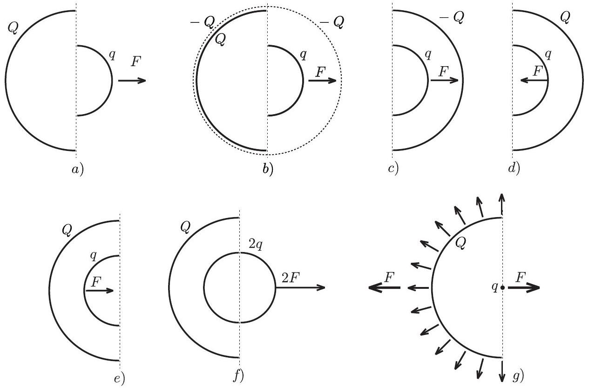
11. ábra

Most már csak a hatás-ellenhatás törvényét kell alkalmaznunk: a $q$ töltésü gömb (amelynek elektromos tere a gömbön kívül egy ponttöltés terével is helyettesíthető, tehát nem függ $r$-től!) a $Q$ töltésü félgömbhéjra éppen a keresett $F$ nagyságú erót fejti ki ( $11 . g$ ábra). A végeredmény a Coulomb-törvény és a gáznyomásos hasonlat alkalmazásával adódik:

$$
F = \frac { 1 } { 4 \pi \varepsilon _ { 0 } } \frac { q } { R ^ { 2 } } \cdot \frac { Q } { 2 \pi R ^ { 2 } } \cdot R ^ { 2 } \pi = \frac { 1 } { 8 \pi \varepsilon _ { 0 } } \frac { Q q } { R ^ { 2 } } .
$$

Még tovább ment a feladat általánosításában Csóka Endre (Debrecen), aki - a fentiekhez hasonló „tükrözéses módszerrel" - megmutatta, hogy a félgömbhéjak között ható $F$ erő nagysága akkor is a fent kiszámított érték, ha a két félgömb szimmetriatengelye tetszőleges $\alpha$ szöget zár be egymással. Az erő nagysága a töltések szorzatán kívül csak a nagyobb félgömbhéj sugarától függ, iránya pedig a nagyobb félgömb szimmetriatengelyével párhuzamos, jóllehet a hatásvonala általában nem megy át a félgömbhéjak közös középpontján (12.a ábra). Ez az eredmény is meglepő, hiszen ha $r$ és $R$ majdnem egyforma nagyságúak, egyikük csupán egy parányival nagyobb a másiknál, akkor az eró iránya ugrásszerúen változik, attól függően, hogy melyik sugár is a nagyobb (12.b és 12.c ábrák).

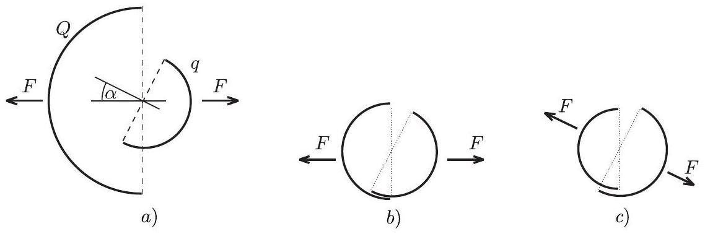
12. ábra

Az ünnepélyes eredményhirdetésre és díjkiosztásra 2002. november 29-én került sor az ELTE TTK lágymányosi (északi) épületének 0.83-as tantermében. Itt a Versenybizottság elnöke először megemlékezett a 100 évvel ezelőtti Eötvös-verseny akkori nyerteséről, Kónig Dénes (1884-1944) matematikusról, majd bemutatta a hallgatóságnak Zanati Tibort, aki 50 évvel ezelőtt nyert díjat az Eötvös-versenyen. Ezután ismertette a feladatok helyes megoldását, majd felkérte Gyulai József akadémikust, az Eötvös Loránd Fizikai Társulat elnökét, hogy adja át a díjakat.

A Versenybizottság (Radnai Gyula elnök, Károlyházy Frigyes és Gnädig Péter) döntése alapján
I. díjat nyert és 15 ezer Ft jutalmat kapott Nagy Márton, az ELTE fizikus hallgatója, aki a budapesti Piarista Gimnáziumban érettségizett, mint Futó Béla tanítványa.
II. díjat nyert és 10-10 ezer Ft jutalmat kapott Béky Bence, a BMGE mérnök-fizikus hallgatója, aki a Fazekas Mihály Fóvárosi Gyakorló Gimnáziumban érettségizett mint Horváth Gábor tanítványa, valamint Tóth Sándor, a csongrádi Batsányi János Gimnázium 12. évf. tanulója, Szucsán András és Hilbert Margit tanítványa.
III. díjat nyert és 5-5 ezer Ft jutalmat kapott Csóka Endre, a debreceni Fazekas Mihály Gimnázium 12. évf. tanulója, Kiszely Ildikó és Szegedi Ervin tanítványa, Siroki László, a BMGE múszaki informatikus hallgatója, aki a debreceni Fazekas Mihály Gimnáziumban érettségizett mint Simon Gyula és Szegedi Ervin tanítványa; Szabó Áron, a debreceni Fazekas Mihály Gimnázium 11. évf. tanulója, Simon Gyula és Szegedi Ervin tanítványa, továbbá Vehovszky Balázs, a budapesti Piarista Gimnázium 12. évf. tanulója, Futó Béla tanítványa.

Kiemelt dicséretet kapott Balogh László, a Fazekas Mihály Fóvárosi Gyakorló Gimnázium 12. évf. tanulója, Horváth Gábor tanítványa.

Dicséretet kaptak a következők: Geresdi Attila, a BMGE mérnök-fizikus hallgatója, aki a pécsi Árpád fejedelem Gimnáziumban érettségizett Kotek László tanítványaként, Hamar Gergố, az ELTE fizikus hallgatója, aki a dombóvár Illyés Gyula Gimnáziumban érettségizett mint Freller Miklós tanítványa, Pápai Tivadar, a BMGE müszaki informatikus hallgatója, aki a barcsi Dráva Völgye Középiskolában érettségizett mint Horváth Ferenc és Kotek László tanítványa, valamint Rácz Béla András, a Fazekas Mihály Fóvárosi Gyakorló Gimnázium 11. évf. tanulója, Horváth Gábor tanítványa.

Idén első alkalommal vehette át a verseny I. díjasa a Társulat Eötvös-verseny érmét.
A verseny valamennyi díjazott és dicséretben részesült versenyzője a Nemzeti Tankönyvkiadótól 4-4 ezer forintos könyvutalványt kapott, az ünnepélyes díjkiosztáson megjelent tanáraik pedig a Müszaki Kiadó, a Nemzeti Tankönyvkiadó és a Typotex Kiadó ajándékkönyveiből válogathattak.

A program befejeztével a még ott maradt tanárok és diákok kihasználhatták az alkalmat, hogy egymással s a korábbi Eötvös-versenyek jelenlevő nyerteseivel elbeszélgessenek, s újra megtekintsék a „Csollány-feladathoz” kapcsolódó demonstrációs kísérleteket.
