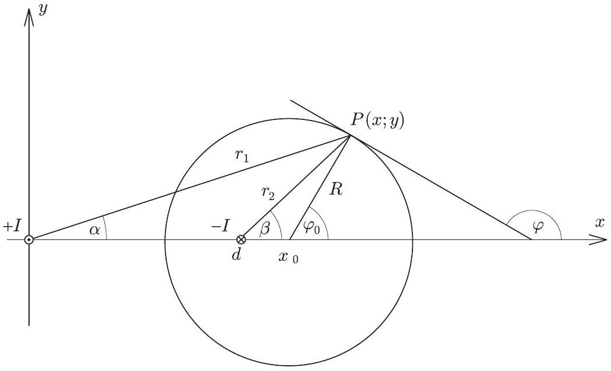
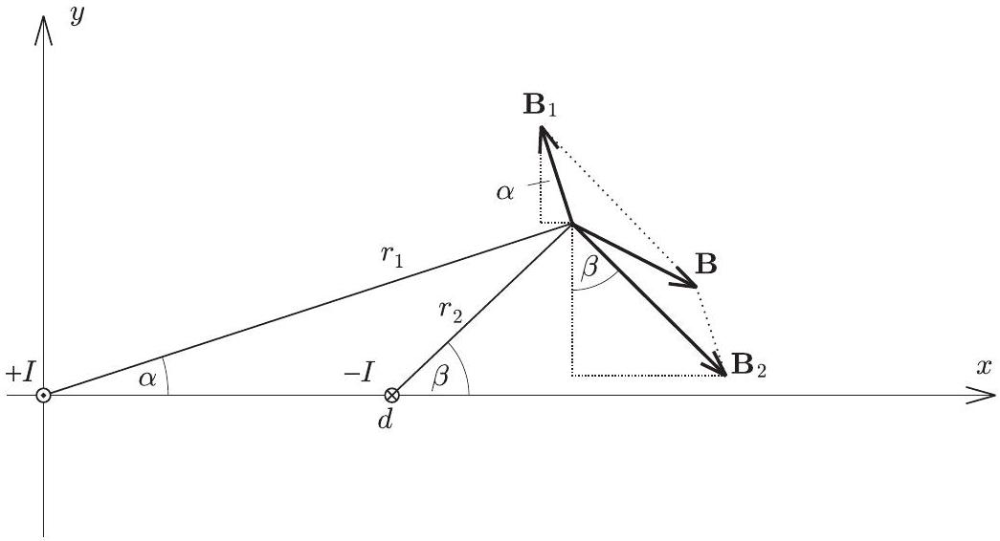
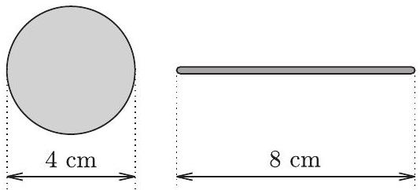
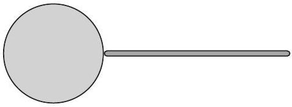
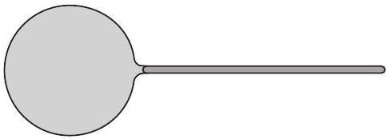
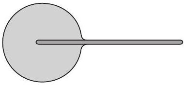
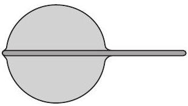
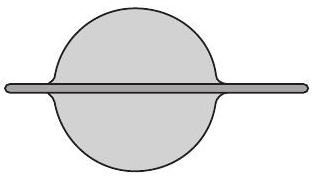

3. ábra

A speciális árameloszlás miatt a létrejövő mágneses mező nagymérvú szimmetriát mutat: az egyik és másik áramvezetốt körülölelő indukcióvonalak nemcsak egymás tükörképei, de akármelyik zárt görbe, amely mentén egy indukcióvonal halad, szimmetrikus a két áramvezetőn átfektetett síkra is. Ettől persze még lehetnek ellipszisek, körök vagy magasabb rendú zárt görbék is az indukcióvonalak, de ha van köztük kör, akkor annak a középpontja benne kell legyen az áramvezetőkön átfektetett síkban.

Vegyünk fel a kiválasztott síkban egy ( $x ; y$ ) koordináta-rendszert úgy, hogy az egyik áram az origón, a másik pedig a $( d ; 0 )$ ponton döfje át a síkot. A síkban kiválasztott $P ( x ; y )$ ponton átmenő körök közül tehát csak azok jöhetnek szóba indukcióvonalként, amelyek középpontja rajta van az $x$ tengelyen. Egy ilyen kör középpontja legyen az $\left( x _ { 0 } ; 0 \right)$ pont. A kör egyenlete ekkor

$$
\left( x - x _ { 0 } \right) ^ { 2 } + y ^ { 2 } = R ^ { 2 } ,
$$

ahol $R d$-től és $x _ { 0 }$-tól függő mennyiség.

4. ábra

5. ábra

Ha ez a kör indukcióvonal, akkor az indukcióvektor állása a kör bármely pontjában megegyezik az ottani érintő állásával (4. ábra). A $P ( x ; y )$ ponton átmenó érintő iránytangense:

$$
\operatorname { tg } \varphi = - \frac { 1 } { \operatorname { tg } \varphi _ { 0 } } = - \frac { 1 } { \frac { y } { x - x _ { 0 } } } = - \frac { x - x _ { 0 } } { y } .
$$

Ezt kell majd összevetnünk a $P$ pontbeli indukcióvektoron átfektetett egyenes iránytangensével. Az eredő B iránytangense (5. ábra):

$$
\operatorname { tg } \varphi _ { B } = \frac { B _ { y } } { B _ { x } } = \frac { B _ { 1 y } + B _ { 2 y } } { B _ { 1 x } + B _ { 2 x } } .
$$

Határozzuk meg ezt a mennyiséget! Egyetlen egyenes vezetó által keltett indukcióvektor nagysága:

$$
B = \frac { \mu _ { 0 } I } { 2 \pi } \cdot \frac { 1 } { r } .
$$

Ennek és az 5. ábráról leolvasható geometriai összefüggéseknek a felhasználásával az egyes összetevők:

$$
\begin{aligned}
& B _ { 1 y } = B _ { 1 } \cos \alpha = \frac { \mu _ { 0 } I } { 2 \pi } \cdot \frac { \cos \alpha } { r _ { 1 } } = \frac { \mu _ { 0 } I } { 2 \pi } \cdot \frac { x } { r _ { 1 } ^ { 2 } } , \\
& B _ { 2 y } = - B _ { 2 } \cos \beta = - \frac { \mu _ { 0 } I } { 2 \pi } \cdot \frac { \cos \beta } { r _ { 2 } } = \frac { \mu _ { 0 } I } { 2 \pi } \cdot \frac { ( d - x ) } { r _ { 2 } ^ { 2 } } , \\
& B _ { 1 x } = - B _ { 1 } \sin \alpha = - \frac { \mu _ { 0 } I } { 2 \pi } \cdot \frac { \sin \alpha } { r _ { 1 } } = - \frac { \mu _ { 0 } I } { 2 \pi } \cdot \frac { y } { r _ { 1 } ^ { 2 } } , \\
& B _ { 2 x } = B _ { 2 } \sin \beta = \frac { \mu _ { 0 } I } { 2 \pi } \cdot \frac { \sin \beta } { r _ { 2 } } = \frac { \mu _ { 0 } I } { 2 \pi } \cdot \frac { y } { r _ { 2 } ^ { 2 } } .
\end{aligned}
$$

Helyettesítsük be ezeket a kifejezéseket a $\operatorname { tg } \varphi _ { B }$-re felírt összefüggésbe! Egyszerúsítés után:

$$
\operatorname { tg } \varphi _ { B } = \frac { \frac { x } { r _ { 1 } ^ { 2 } } + \frac { d - x } { r _ { 2 } ^ { 2 } } } { - \frac { y } { r _ { 1 } ^ { 2 } } + \frac { y } { r _ { 2 } ^ { 2 } } } = \frac { x \left( \frac { 1 } { r _ { 1 } ^ { 2 } } - \frac { 1 } { r _ { 2 } ^ { 2 } } \right) + \frac { d } { r _ { 2 } ^ { 2 } } } { - y \left( \frac { 1 } { r _ { 1 } ^ { 2 } } - \frac { 1 } { r _ { 2 } ^ { 2 } } \right) } = - \frac { x - \frac { d } { 1 - \left( r _ { 2 } / r _ { 1 } \right) ^ { 2 } } } { y } .
$$

Ez a kifejezés akkor és csak akkor egyenlő a korábban kapott

$$
\operatorname { tg } \varphi = - \frac { x - x _ { 0 } } { y }
$$

képlettel, ha

$$
x _ { 0 } = \frac { d } { 1 - \left( r _ { 2 } / r _ { 1 } \right) ^ { 2 } }
$$

Behelyettesítve az $r _ { 2 } = \sqrt { y ^ { 2 } + ( x - d ) ^ { 2 } }$ és $r _ { 1 } = \sqrt { y ^ { 2 } + x ^ { 2 } }$ kifejezéseket, rendezés után a következőt kapjuk: $\left( x - x _ { 0 } \right) ^ { 2 } +$ $y ^ { 2 } = x _ { 0 } \left( x _ { 0 } - d \right)$. Ez pedig pontosan a megadott $P$ ponton is átmenő, $\left( x _ { 0 } ; 0 \right)$ középpontú kör egyenlete, vagyis ez az indukcióvonal kör alakú! Megkaptuk a kör sugarát is:

$$
R = \sqrt { x _ { 0 } \left( x _ { 0 } - d \right) } .
$$

Íme, ebben a mágneses mezőben minden indukcióvonal kör alakú, hiszen $P$ a tér tetszőleges pontja lehet. Egy ponton csak egyetlen indukcióvonal mehet át, az pedig kör alakú.

Megjegyzések. 1. A síkban azoknak a pontoknak a mértani helye, melyek két adott ponttól vett távolságainak aránya állandó, az ún. Apollóniosz-kör. Eredményeinket úgy is megfogalmazhatjuk, hogy a vizsgált mágneses térben az indukcióvonalak Apollóniosz-körök.

Bevezetve az $r _ { 2 } / r _ { 1 } = \lambda$ jelölést, e körök egyenlete

$$
\left( x - \frac { d } { 1 - \lambda ^ { 2 } } \right) ^ { 2 } + y ^ { 2 } = \left( \lambda \frac { d } { 1 - \lambda ^ { 2 } } \right) ^ { 2 }
$$

amiből többek között az $R = \lambda x _ { 0 }$ érdekes összefüggés is leolvasható. (Apollóniosz időszámításunk kezdete előtt 262-től 190-ig élt; a kúpszeletekről írt munkájában ő vezette be az ellipszis, parabola és hiperbola kifejezéseket.)

2. Ha csak kicsit is általánosabb esetet vizsgálunk, a számolás meglehetősen elbonyolódik, és soha többé nem kapunk kör alakú indukcióvonalakat. Érdemes lenne számítógépes szimulációval meghatározni az ellentétes irányú, de nem egyenló nagyságú áramok keltette mágnestér indukcióvonalait, hiszen erre $r \ll d$ esetén (az egyik áram közvetlen közelében) ugyanúgy, mint $r \gg d$ esetén (ahonnan a két áram már egyetlen $\left| I _ { 1 } - I _ { 2 } \right|$ nagyságú áramnak látszik) az indukcióvonalak egyre jobban hasonlítanak a körhöz. De milyen furcsa görbék jöhetnek ki közben?
3. Egy szabadon keringó ứrhajó kabinjának belsejében mozdulatlanul lebeg egy kb. 4 cm átmérójũ vízgolyó és a közelében egy kb. 8 cm hosszúságú, vékony, kör keresztmetszetű, legömbölyített végü üvegpálca. A pálca egyik végét egészen finoman érintkezésbe hozzuk a „vízcseppel”. Vázolja fel, milyen alakot vesz fel a víz!
(Károlyházy Frigyes)

Megoldás. A kiindulási helyzetben (6. ábra) a vízgolyó közelében lebeg az üvegpálca.

6. ábra

7. ábra

8. ábra

9. ábra

10. ábra

11. ábra

A folyamat akkor kezdődik, amikor a pálca egyik végét egészen finoman érintkezésbe hozzuk a vízcseppel (7. ábra). A víz nedvesíti az üveget, kissé „ráfolyik” a pálca legömbölyített végére (8. ábra). Itt azonban a folyamat nem állhat le, mert az üvegpálcára ható erók eredője nem nulla. Igaz ugyan, hogy az $R$ sugarú vízcsepp belsejében a nyomás egy kicsit nagyobb, mint a külső légnyomás $( \Delta p = 2 \alpha / R )$, és ez $r ^ { 2 } \pi \Delta p$ erốvel tolná kifelé az $r$ sugarú pálcát, de ennél sokkal nagyobb a pálcára rásimuló vízhártya által kifejtett $2 r \pi \alpha$ nagyságú húzóerő. A pálca tehát benyomul a vízcseppbe, egy közbülső helyzet a 9. ábrán látható.

Az erőegyensúly ebben a helyzetben sem áll fenn, nincs ok, amiért a pálca megállna, egészen a 10. ábrán látható állapotig. Most már a pálca elérte a vízcsepp bal oldali szélét, kissé túl is ment rajta, a vízfelszín itt kissé kinyomódik.

Az erőegyensúly azonban csak akkor áll be, amikor a pálca bal oldali vége teljesen kibújik a vízcseppbő̌l, ekkor a pálca mindkét végét körülölelő víz felszíne ugyanolyan alakú (11. ábra).

Meg kell gondolnunk még, hogy vajon a vízcsepp nem folyik-e szét a pálcán. A rendszer összenergiája a levegővel érintkező víz felületi energiájának és a vízzel érintkező üveg energiájának összegével egyenlő; ez a mennyiség igyekszik minél kisebb lenni. Tekintettel arra, hogy a pálca vékony, a üveg teljesfelülete elhanyagolható a vízgolyó felületéhez képest. A rendszer egyensúlyát tehát a legkisebb vízfelszín követelménye határozza meg, ez pedig (adott térfogatú víz esetén) a gömb alaknál teljesül.

A végállapotban tehát a vízgolyó majdnem pontosan gömb alakú, az üvegpálca ennek a gömbnek egyik átmérője mentén helyezkedik el, és mindkét végét „kidugja” a vízből.

Az ünnepélyes eredményhirdetésre 2003. november 21-én került sor az ELTE lágymányosi déli épületének Mogyoródi József tantermében, ott, ahol a budapesti versenyzők a dolgozatokat is írták.

Először a Versenybizottság elnöke emlékezett meg a nemrég elhunyt Teller Edéről, és bemutatta azokat a feladatokat, amelyek kiváló megoldásával Teller Ede megnyerte az 1925. évi Eötvös-versenyt. A megjelentek egyetértettek abban, hogy azok bizony könnyebb feladatok voltak, mint az ideiek. Igaz, nem is állt rendelkezésre a felkészüléshez annyi jó példatár és szakirodalom, nem voltak felkészítő szakkörök.

Azután az 50 évvel ezelőtti Eötvös-verseny feladatainak bemutatása következett, s egy diákkori fénykép az akkori nyertesről, Zawadowski Alfréd akadémikusról. (Sajnos ő nem tudott eleget tenni a díjkiosztásra szóló meghívásnak, mert külföldön tartózkodott. Talán majd a következőre eljön, amire újra meg fogjuk hívni, mert 1954-ben is díjazott volt az Eötvös-versenyen.) Ami az 1953-as feladatokat illeti, azok se voltak nehezebbek az 1925-ös feladatoknál. Ezen se csodálkozhatunk, akkor még nem is volt fizika rovata az újra indított Középiskolai Matematikai Lapoknak.

A bevezető visszaemlékezések után következett a 2003. évi Eötvös-verseny feladatok és ezek helyes megoldásainak bemutatása. Az első két feladat Radnai Gyula által adott megoldását Gnädig Péter egészítette ki érdekes megjegyzésekkel és egy meglepő analógián alapuló megoldás ismertetésével, míg a harmadik feladat különböző megközelítésú megoldásainak bemutatására a legjobb versenyzőket kérte fel a Versenybizottság elnöke.

A verseny díjait Németh Judit akadémiai levelező tag, az Eötvös Loránd Fizikai Társulat elnöke adta át.
I. díjat és 20 ezer forint értékú könyvutalványt kapott Horváth Márton, a Fazekas Mihály Fővárosi Gyakorló Gimnázium 12. osztályos tanulója, Horváth Gábor tanítványa.
II. díjat kaptak, kiegészítve 15-15 ezer forintos könyvutalványokkal Csóka Endre, az ELTE matematikus hallgatója, aki a debreceni Fazekas Mihály Gimnáziumban érettségizett mint Szegedi Ervin tanítványa és Kómár Péter, a Fazekas Mihály Fóvárosi Gyakorló Gimnázium 11. osztályos tanulója, Dvorák Cecília tanítványa.
III. díjat és 10-10 ezer forintos könyvutalványt nyert Backhausz Ågnes, az ELTE matematikus hallgatója, aki a Fazekas Mihály Fóvárosi Gyakorló Gimnáziumban érettségizett mint Horváth Gábor tanítványa; Burmeister Dániel, a miskolci Földes Ferenc Gimnázium 12. osztályos tanulója, Zsúdel László tanítványa; Rakyta Péter, a révkomáromi Selye János Gimnázium 12. osztályos tanulója, Szabó Endre tanítványa; Szekeres Balázs, a BMGE mérnök-fizikus hallgatója, aki a szolnoki Verseghy Ferenc Gimnáziumban érettségizett mint Lapu Béla tanítványa; Vigh Máté, a pécsi Babits Mihály Gyakorló Gimnázium 12. osztályos tanulója, Koncz Károly és Kotek László tanítványa és Zsuga Sándor, a kecskeméti Bányai Júlia Gimnázium 12. osztályos tanulója, Késmárki Andrásné tanítványa.

Dicséretet kaptak a következők: Balogh László, a BMGE mérnök-fizikus hallgatója, aki a Fazekas Mihály Fốvárosi Gyakorló Gimnáziumban érettségizett mint Horváth Gábor tanítványa; Nagy Róbert, a budapesti Apáczai Csere János Gyakorló Gimnázium 11. osztályos tanulója, Pákó Gyula tanítványa; Nádor Csaba, a BMGE mérnök-fizikus hallgatója, aki a budapesti Kassák Lajos Gimnáziumban érettségizett mint Magyari Gyula tanítványa; Ruppert László, a BMGE matematikus hallgatója, aki a pécsi Janus Pannonius Gimnáziumban érettségizett, mint Keresztesné Borsos Sarolta és Kotek László tanítványa.

A dicséretes versenyzők a Nemzeti Tankönyvkiadótól kaptak 8-8 ezer forint értékú könyvutalványt, a díjazottak pedig plusz 2-2 ezer forint értékúeket.

Befejezésül az elnök megköszönte az Oktatási Misztériumnak és a Nemzeti Tankönyvkiadónak a könyvutalványokat, a Typotex Kiadónak és a Műszaki Kiadónak pedig azokat a felajánlott jutalomkönyveket, amelyekből a nyertes versenyzők megjelent tanárai válogathattak.

Legboldogabb versenyzó idén is az I. díjas volt, aki az erkölcsi győzelem mellé megkapta még a Társulat Eötvösverseny érmét is. Immár ketten vannak az országban, akik ilyen éremmel rendelkeznek.
